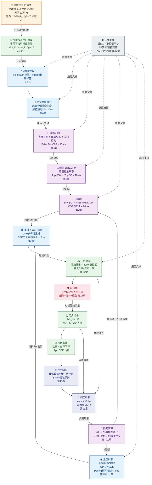
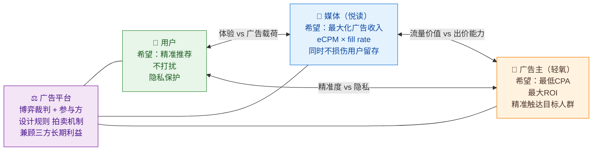
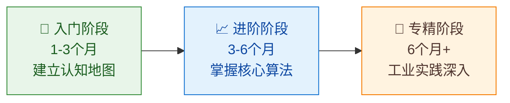

# 第15章 全链路串讲与学习路径

> **本章导读**
>
> 经过前14章的系统拆解，你已经掌握了广告系统的每一块拼图：从 eCPM 公式到 RTB 竞价时序，从 DNF 倒排索引到双塔召回，从 DeepFM 精排到 GSP 二价拍卖，从双 PID 智能出价到 PID pacing 预算控制，从多层反作弊到 S2S 回传归因，再到支撑百万 QPS 的工程架构。
>
> 本章是全书的**大结局**：我们将以「轻氧奶茶」在「悦读 App」上投放一次信息流广告为主线，把全部 15 章串成一个连贯的端到端故事，随后给出模块协同总表、核心矛盾总结、经典论文清单和分阶段学习路径，帮助你在脑中建立起广告系统的完整认知地图。

---

## 目录

1. [端到端串讲：轻氧奶茶的一次完整投放](#1-端到端串讲轻氧奶茶的一次完整投放)
2. [全景流程图](#2-全景流程图)
3. [关键延迟预算时间线](#3-关键延迟预算时间线)
4. [各模块协同总表](#4-各模块协同总表)
5. [站内闭环系统 vs 程序化生态对照](#5-站内闭环系统-vs-程序化生态对照)
6. [广告系统的核心矛盾](#6-广告系统的核心矛盾)
7. [经典论文与资料清单](#7-经典论文与资料清单)
8. [学习路径建议](#8-学习路径建议)
9. [结语：四位一体系统的魅力与演进](#9-结语四位一体系统的魅力与演进)
10. [参考来源](#参考来源)

---

## 1. 端到端串讲：轻氧奶茶的一次完整投放

### 1.1 广告主建立广告计划（第1、9章）

某个周一早上，轻氧奶茶的运营小林打开广告投放后台，创建了一个新的广告计划：

| 配置项 | 值 |
|--------|---|
| 推广目标 | 新用户注册并完成首单（CPA 目标事件） |
| 日预算 | 100,000 元 |
| 出价模式 | **oCPM**（Optimized CPM），目标转化成本 ≤ 30 元/首单 |
| 定向 | 25–35 岁女性、一二线城市、兴趣标签「奶茶/咖啡/下午茶」、排除近30天已安装轻氧App用户 |
| 素材 | 15秒短视频 + 原生图文各一套 |
| 投放时段 | 10:00–22:00 |

在 oCPM 模式下（详见**第9章**），广告平台会把广告主的目标转化成本 $T = 30$ 元反推为每千次展示的出价，出价引擎在竞价时实时计算最优 CPM bid（详见**第10章**）。

从这一刻起，「预算10万、成本目标30元、对5000万日活用户中的精准人群」的三方博弈就已经开始——详见**第1章**中关于 eCPM 公式和三方博弈的分析。

---

### 1.2 用户触发广告请求（第2、3章）

当天下午三点，悦读 App 的用户小雨下拉刷新信息流。悦读 App 的服务端在 **< 2 ms** 内完成以下动作（详见**第3章** 请求生命周期）：

1. 从请求中提取 `user_id`、`device_id`、`platform`(iOS)、`slot_id`(信息流位-标准Banner)、`geo`(上海)、`app_context`(当前阅读「美食」频道)
2. 向广告引擎发起 **广告请求**，携带上述上下文
3. 广告引擎接到请求，**并行**启动画像读取、定向检索、召回等流程

由于悦读 App 是**站内闭环系统**（非 OpenRTB 生态），它不需要向外部 ADX 发起竞价，而是在自有广告引擎内完成全链路竞价（对比见本章第5节）。若是程序化场景，此处将触发一次 **RTB Bid Request**，ADX 在 100 ms 窗口内向所有 DSP 广播，DSP 返回 Bid Response（详见**第2章**）。

整条广告引擎请求的**总延迟预算为 80 ms**，被拆解为如下阶段（详见**第3章**延迟预算分配）：

```
画像读取(5ms) → 定向+检索(10ms) → 召回(15ms) → 粗排(10ms) → 精排(20ms) → 重排+拍卖(5ms) → 组包返回(5ms)
= 总计 70ms（留 10ms 网络抖动余量）
```

---

### 1.3 画像读取与定向检索（第4章）

广告引擎的定向模块在 **5 ms** 内完成用户画像读取：

- 从 **Redis Cluster** 读取小雨的实时行为标签（过去1小时浏览了「奶茶店推荐」内容）
- 从 **HBase/Cassandra** 读取长期兴趣标签（奶茶/咖啡/美食评测高频用户）
- 合并为一个 `UserProfile`：`{age:28, gender:F, city:上海, interests:[奶茶,咖啡,美食], device:iOS, installed_apps:[...]}`

随后，**DNF（Disjunctive Normal Form）定向检索**模块（详见**第4章**）将轻氧奶茶的定向条件

```
(gender=女 AND age IN [25,35] AND city IN 一二线 AND interest ∋ {奶茶,咖啡,下午茶})
AND NOT (installed_apps ∋ 轻氧App)
```

转换为 DNF 合取项，利用**倒排索引**快速命中：小雨符合所有正向条件，且未安装轻氧 App，因此轻氧奶茶这条广告**通过定向**，进入召回候选池。

此步同时完成**广告过滤**（预算耗尽、时段不符、频次超限等），频控逻辑在此提前拦截已对小雨展示过5次的广告（频控机制详见**第11章**）。

---

### 1.4 多路召回（第5章）

定向通过后，召回模块在 **15 ms** 内从数以百万计的广告候选中缩减到数百条（详见**第5章**）：

| 召回路 | 方法 | 轻氧奶茶的召回路径 |
|--------|------|-------------------|
| 类目召回 | 广告定向类目与用户兴趣标签交集 | 命中「美食/奶茶」类目 |
| 协同过滤召回 | 相似用户点击行为 | 同类28岁女性用户点击过奶茶广告 |
| 双塔向量召回 | User Embedding × Ad Embedding → ANN | 小雨 user vector 与轻氧 ad vector 余弦相似度 0.82，Top-K 命中 |
| 实时行为召回 | 用户近期行为 → 实时兴趣向量 | 刚浏览「奶茶店评测」文章 → 实时拉新广告 |

**双塔模型**（详见**第5章**）将用户和广告分别编码为低维稠密向量，通过 **Faiss ANN** 在离线索引中完成近似最近邻检索，在毫秒内从百万广告中召回 Top-500 候选。轻氧奶茶凭借高相关性向量在此阶段入围。

---

### 1.5 粗排：LiteECPM（第6章）

召回的 500 条候选进入**粗排**（详见**第6章**），用轻量模型在 **10 ms** 内快速打分，降至 Top-50：

$$\text{LiteECPM}_i = \tilde{p}_{ctr,i} \times \tilde{p}_{cvr,i} \times \text{bid}_i \times 1000$$

粗排使用的 $\tilde{p}_{ctr}$、$\tilde{p}_{cvr}$ 是**知识蒸馏**自精排大模型的轻量版本（2层MLP，特征仅保留高频 ID 类特征），牺牲少量精度换取延迟。

**粗精排一致性**（详见**第6章**）：粗排对 Top-50 的序有效，偶发的排序偏差通过 **Calibration** 在精排后修正。

---

### 1.6 精排：pCTR / pCVR 预估（第7章）

Top-50 候选进入**精排**（详见**第7章**），用完整深度模型打分，耗时 **20 ms**：

**CTR 预估**使用 **DIN（Deep Interest Network）**，对小雨近30天的行为序列做 Attention，识别出她对奶茶内容的高强度兴趣：

```
User行为序列: [奶茶评测×8, 美食博主×12, 减肥餐×3]
Attention权重: 奶茶相关 → 0.72, 美食 → 0.21, 减肥 → 0.07
→ pCTR(轻氧奶茶) = 0.038
```

**CVR 预估**使用 **ESMM（Entire Space Multi-Task Model）**，在全空间（曝光→点击→转化）建模，规避样本选择偏差：

```
pCVR(轻氧奶茶 | 小雨, 点击条件) = 0.12
```

**eCPM 计算**：

$$\text{eCPM} = pCTR \times pCVR \times \text{bid}_{oCPM} \times 1000$$

其中 `bid_oCPM` 由出价引擎实时给出（见1.7节）。精排后对 pCTR 做 **COPC 校准**（详见**第7章**），避免模型高估带来的超成本风险。

---

### 1.7 出价引擎：最优出价 + 双 PID（第9、10、11章）

在精排打分的同时，**出价引擎**实时为轻氧奶茶计算本次竞价应出的价格（详见**第10章**）：

**最优出价函数（ORTB）**：

$$b^* = \frac{\lambda \cdot v}{1 + \mu \cdot \lambda}$$

其中：
- $v = pCTR \times pCVR \times T = 0.038 \times 0.12 \times 30 = 0.137$ 元（单次展示期望价值）
- $\lambda$：出价乘子，由**双 PID 控制器**实时调整
- $\mu$：Bid Landscape 参数

**双 PID 控制器**（详见**第10章**）同时控制两个维度：
- **成本 PID**：当历史 CPA 高于30元时，降低 $\lambda$（减少出价）；低于30元时，提升 $\lambda$（争取更多流量）
- **预算 PID**：见 pacing 模块

**PID Pacing**（详见**第11章**）：当前时间是下午3点（投放时段已过5/12），理想消耗进度约为 41.7%（即 41,700 元）。若实际消耗超前，pacing 模块降低**投放速率**（通过概率节流 $p_{throttle}$）；若消耗滞后，提高出价乘子追量。

**频控**（详见**第11章**）：Redis 中记录小雨对轻氧奶茶的展示计数，此次查询为第2次，未超过日频控上限5次，通过。

出价引擎最终给出本次竞价 bid = **18.5 元 CPM**。

---

### 1.8 重排与 GSP 拍卖（第8章）

精排后的 Top-10 进入**重排**（详见**第8章**）：

1. **多样性重排**：用 DPP（Determinantal Point Process）保证展示的广告内容不过于相似，避免用户看到5条奶茶广告
2. **GSP 拍卖定序定价**：对参与本次请求的广告（含其他广告主的候选）按 eCPM 降序排列，第一名按第二名的 eCPM / 自身 pCTR 计费（GSP 二价逻辑，详见**第8章**）

本次竞价结果：

| 排名 | 广告主 | eCPM | GSP 计费 CPM |
|------|--------|------|-------------|
| **1** | **轻氧奶茶** | **4.56** | **3.21**（按第2名价格计算） |
| 2 | 某咖啡品牌 | 3.21 | — |
| 3 | 某健康食品 | 2.88 | — |

轻氧奶茶**胜出**，实际计费 CPM = 3.21 元，低于出价 18.5 元，这正是 Vickrey-Clarke-Groves 定价机制保证的激励相容性（详见**第8章**）。

---

### 1.9 曝光、点击与转化（第1、9章）

广告组包返回至悦读 App 前端，小雨的信息流中出现轻氧奶茶的短视频广告（从请求到渲染全程 < 80 ms）。

```
时间轴：
T+0ms    用户下拉刷新
T+72ms   广告引擎返回胜出广告
T+80ms   客户端渲染展示 → 上报曝光(Impression)
T+34s    小雨完整观看15秒视频，点击「立即领券」
T+2min   跳转落地页，小雨填写手机号注册
T+8min   小雨在轻氧App下首单（饮品+小食，消费42元）
```

每个节点都产生**事件回传**（详见**第13章**）：
- 曝光事件 → 触发 CPM 计费（流式计费，详见**第14章**）
- 点击事件 → 记录点击日志，作为 last-click 归因的锚点
- 转化事件（注册+下单）→ 轻氧奶茶 App SDK / S2S 回传至悦读广告平台

---

### 1.10 反作弊过滤（第12章）

在曝光和点击事件入库前，**反作弊系统**（详见**第12章**）对每个事件进行多层过滤：

```
规则层（< 1ms）：IP 黑名单、User-Agent 异常、点击位置超出广告边界 → 过滤 GIVT
统计层（实时流）：短时间内同 IP 高频点击（CTR > 80%）→ 过滤 SIVT
模型层（T+分钟级）：设备指纹聚类、行为序列异常 → 标记可疑流量
归因层：APP 安装核查（SKAdNetwork / OAID），过滤虚假安装
```

小雨的点击和转化通过所有校验，判定为**真实流量（HVT）**，进入计费和归因流程。

---

### 1.11 归因与回传（第13章）

轻氧奶茶在其 App 后端接到「小雨注册+下首单」的转化信号后，通过 **S2S（Server-to-Server）回传**（详见**第13章**）将事件发送至悦读广告平台：

```
POST https://ad.yuedui.com/attribution/callback
{
  "event_type": "first_order",
  "click_id": "xxxxxxxx",           // 点击时广告平台下发的 click_id
  "device_id": "IDFA:xxx",
  "event_time": "2024-01-15T15:42:00",
  "revenue": 42.0,
  "click_time": "2024-01-15T15:34:12"
}
```

归因引擎执行 **last-click 归因**（详见**第13章**）：

- 归因窗口：点击后 24 小时内的转化归因至最后一次点击
- 小雨的点击 `click_id` 指向轻氧奶茶的广告，归因成功
- 转化归因后，此次曝光的 CPA = 3.21 元 CPM × 曝光量 / 转化数（这次是1次曝光带来1次转化，即**实际成本 = 计费 CPM / 1000 / 转化率** ≈ 3.21/1000/0.0046 ≈ 0.698 元）

> 注：以上是单次展示的理想情况。实际中，CPA 是大量展示的统计平均值。

---

### 1.12 数据闭环与模型迭代（第7、10章）

归因成功的转化事件进入**数据飞轮**：

```
转化数据 → 喂给 CVR 模型（ESMM 样本池增加）
         → 校准 pCVR 预估精度
         → 反馈至出价引擎（双 PID 对偶控制器更新 λ）
         → 下一次竞价出价更精准
```

这就是广告系统的**闭环**本质（详见**第1章** Explore-Exploit 讨论）：数据驱动模型，模型驱动出价，出价驱动流量，流量产生数据。

当天结束，广告平台产出日报：

| 指标 | 值 |
|------|---|
| 总消耗 | 97,342 元（略低于预算10万，pacing 正常） |
| 总曝光 | 30,358,495 次 |
| 总点击 | 54,645 次（CTR = 0.18%） |
| 总转化（首单） | 3,241 次 |
| 平均 CPA | 30.03 元（非常接近目标30元，双 PID 控制有效） |
| 平均 CPM 计费 | 3.21 元 |

**轻氧奶茶完成了这一天的投放目标**：用10万预算带来3241名新用户首单，成本精准控制在30元。这背后，是本书前14章所有技术模块的协同运转。

---

## 2. 全景流程图

下图展示了从广告主建计划到数据闭环的完整端到端链路，颜色代表功能域。



---

## 3. 关键延迟预算时间线

```mermaid
gantt
    title 广告引擎单次请求延迟预算（总计 80ms）
    dateFormat  X
    axisFormat  %Lms

    section 用户侧
    用户触发请求        :milestone, 0, 0
    广告渲染展示        :milestone, 80, 0

    section 数据层
    画像读取 Redis+HBase : active, task1, 0, 5

    section 检索层
    DNF定向检索+频控预过滤 : active, task2, 5, 15

    section 召回层
    多路召回 Faiss ANN  : active, task3, 15, 30

    section 排序层
    粗排 LiteECPM       : active, task4, 30, 40
    精排 DIN+ESMM       : active, task5, 40, 60

    section 决策层
    出价引擎 ORTB+PID   : active, task6, 40, 55
    重排+GSP拍卖        : active, task7, 60, 65

    section 组包
    广告组包+网络传输   : active, task8, 65, 80
```



> 注：精排与出价引擎**并行执行**（均在 40ms 启动），重排在两者结果就绪后（约 60ms）开始。这是降低总延迟的关键工程优化，详见**第3章**和**第14章**。

---

## 4. 各模块协同总表

| 模块 | 输入 | 输出 | 关键技术 | 对应章节 |
|------|------|------|----------|----------|
| **广告主建计划** | 投放目标、预算、定向条件、素材 | 广告计划配置 | oCPM/CPA/CPM 出价模式 | 第1、9章 |
| **RTB 竞价生态** | Bid Request（用户上下文） | Bid Response（出价） | OpenRTB协议、DSP/SSP/ADX/DMP | 第2章 |
| **请求处理** | HTTP 广告请求 | 结构化 AdRequest 对象 | 微服务、并行化、延迟预算分配 | 第3章 |
| **用户画像** | user_id / device_id | UserProfile（实时+长期标签） | Redis、HBase、特征平台 | 第4、14章 |
| **定向检索** | UserProfile + 广告候选库 | 定向通过的广告集合 | DNF、倒排索引、布隆过滤器 | 第4章 |
| **多路召回** | UserProfile + 广告向量库 | Top-500 候选广告 | 双塔模型、Faiss ANN、协同过滤 | 第5章 |
| **粗排** | Top-500 候选 | Top-50 候选 | 知识蒸馏、LiteECPM | 第6章 |
| **精排 CTR** | Top-50 候选 + 完整特征 | pCTR 分值列表 | DeepFM、DIN、DIEN | 第7章 |
| **精排 CVR** | Top-50 候选 | pCVR 分值列表 | ESMM、延迟反馈建模 | 第7章 |
| **出价引擎** | pCTR、pCVR、预算状态 | 实时 bid（CPM 元） | ORTB 最优出价、双 PID、Bid Landscape | 第9、10章 |
| **Pacing 预算控制** | 历史消耗、剩余预算 | 节流概率 / 出价乘子 | PID 控制、概率节流、Token Bucket | 第11章 |
| **频次控制** | user_id + ad_id 展示记录 | 是否允许展示 | Redis 计数、滑动窗口 | 第11章 |
| **重排** | Top-10 精排结果 | 多样性优化后排序 | DPP、MMR | 第8章 |
| **拍卖定价** | 多广告 eCPM 列表 | 胜出广告 + 计费 CPM | GSP 二价、Vickrey、VCG | 第8章 |
| **流式计费** | 曝光事件流 | 实时扣费、账单 | Flink、Kafka、幂等去重 | 第14章 |
| **反作弊** | 曝光/点击事件 | 有效/无效流量分类 | GIVT/SIVT 规则、IP黑名单、行为模型 | 第12章 |
| **归因引擎** | 转化事件 + 点击日志 | 归因结果（广告主 ↔ 转化） | last-click、多触点归因、归因窗口 | 第13章 |
| **S2S 回传** | 归因结果 | 转化数据至广告平台 | HTTPS Postback、SKAN、隐私沙盒 | 第13章 |
| **CVR 模型迭代** | 归因后转化样本 | 更新 pCVR 模型参数 | 在线学习、样本校正、ESMM | 第7章 |
| **工程底座** | 全链路请求 | 高可用、低延迟保障 | 缓存、并行、分布式、AB 实验、监控 | 第14章 |

---

## 5. 站内闭环系统 vs 程序化生态对照

广告系统有两种主要范式（详见**第1、2章**），以悦读 App 为例做对照：

| 维度 | **站内闭环系统**（悦读 App 自有广告） | **程序化生态（RTB/OpenRTB）**（悦读接入 ADX） |
|------|--------------------------------------|----------------------------------------------|
| **参与方** | 媒体（悦读）+ 广告主 + 广告引擎（自建） | 媒体（悦读/SSP）+ ADX + DSP + 广告主 + DMP |
| **竞价协议** | 内部 API | OpenRTB 2.x 标准协议（JSON/Protobuf） |
| **延迟预算** | 80ms（灵活分配） | 100ms（ADX 到 DSP 往返含网络） |
| **数据优势** | 一方数据（用户行为日志完整） | 三方数据拼接（DMP 补充，精度有损） |
| **定价机制** | 内部 GSP/VCG，灵活 | 标准 First-Price/Second-Price Auction |
| **广告主门槛** | 需直接与悦读合作 | 低（通过任意 DSP 接入） |
| **变现规模** | 限于自有流量 | 可汇聚全网流量（SSP 聚合多媒体） |
| **隐私风险** | 相对可控（数据不出域） | 较高（用户 ID 在多方流转） |
| **适用场景** | 大型媒体（抖音/微信/淘宝）自建投放 | 中小媒体变现、广告主跨媒体投放 |
| **典型代表** | 字节穿山甲（内部）、阿里妈妈 | Google Ad Exchange、AppNexus、IronSource |

**关键结论**：两种范式在技术架构上高度相似（定向→召回→排序→拍卖→归因），核心差异在于**数据掌控权**和**竞价协议标准化程度**。随着隐私法规收紧（GDPR/CCPA/ATT），站内闭环的数据优势将持续扩大。

---

## 6. 广告系统的核心矛盾

广告系统是"算法×工程×经济学×数据"的四位一体，其本质矛盾贯穿全书（详见**第1章**奠基）：

### 6.1 三方博弈



### 6.2 五大核心矛盾

| 矛盾 | 张力两端 | 工程解法 | 对应章节 |
|------|---------|---------|----------|
| **效率 vs 效果** | 粗排快但不准；精排准但慢 | 多级漏斗+知识蒸馏 | 第5、6、7章 |
| **短期收入 vs 长期留存** | 多展广告→短期收入高→长期用户流失 | 频控+体验保护约束 | 第1、11章 |
| **增长 vs 体验** | 拉新广告转化高→用户看到全是广告 | 多样性重排+广告密度控制 | 第8章 |
| **Explore vs Exploit** | 新广告缺数据→低出价→少曝光→死循环 | UCB 探索+冷启动策略 | 第1、5章 |
| **收入最大化 vs 激励相容** | FPA 让广告主报高价→市场失灵 | GSP/VCG 二价机制 | 第8、9章 |
| **精准触达 vs 隐私保护** | 跨App追踪→高精准→违反ATT/GDPR | SKAN/隐私沙盒/同态加密 | 第2、13章 |

这些矛盾没有终极解，只有在特定业务阶段的动态平衡。理解这些矛盾，是成为高级广告系统工程师的分水岭。

---

## 7. 经典论文与资料清单

### 7.1 CTR / CVR 预估

| 论文 | 会议/年份 | 贡献 | 对应章节 |
|------|----------|------|----------|
| Wide & Deep Learning for Recommender Systems | RecSys 2016 | 记忆+泛化联合训练框架 | 第7章 |
| DeepFM: A Factorization-Machine based Neural Network for CTR Prediction | IJCAI 2017 | FM 与 DNN 端到端联合 | 第7章 |
| Deep Interest Network for Click-Through Rate Prediction (DIN) | KDD 2018 | 用户行为序列 Attention | 第7章 |
| Deep Interest Evolution Network for Click-Through Rate Prediction (DIEN) | AAAI 2019 | GRU 建模兴趣演化 | 第7章 |
| Entire Space Multi-Task Model: ESMM | SIGIR 2018 | 全空间 CVR 建模，解决样本偏差 | 第7章 |
| Modeling Delayed Feedback in Display Advertising | KDD 2014 | 延迟反馈的概率建模 | 第7章 |
| Ad Click Prediction: a View from the Trenches | KDD 2013 | Google FTRL 在线学习实践 | 第7章 |

### 7.2 召回与向量检索

| 论文 | 会议/年份 | 贡献 | 对应章节 |
|------|----------|------|----------|
| Learning Deep Structured Semantic Models for Web Search using Clickthrough Data (DSSM) | CIKM 2013 | 双塔结构开创性工作 | 第5章 |
| Sampling-Bias-Corrected Neural Modeling for Large Corpus Item Recommendations | RecSys 2019 | In-batch 负采样偏差修正 | 第5章 |
| MIND: A Large-scale Dataset for News Recommendation | EMNLP 2020 | 多兴趣用户建模 | 第5章 |
| Billion-scale Commodity Embedding for E-commerce Recommendation in Alibaba | KDD 2018 | Graph Embedding 召回 | 第5章 |
| Faiss: A Library for Efficient Similarity Search | Facebook AI Research 2017 | ANN 检索工程实现 | 第5章 |

### 7.3 RTB 出价与 Bid Landscape

| 论文 | 会议/年份 | 贡献 | 对应章节 |
|------|----------|------|----------|
| Optimal Real-Time Bidding for Display Advertising | KDD 2014 | ORTB 最优出价函数推导 | 第10章 |
| Bid Landscape Forecasting in Online Advertising Auction via Jointly Modelling Bid and Budget | KDD 2019 | Bid Landscape 联合建模 | 第10章 |
| Real-Time Bidding by Reinforcement Learning in Display Advertising | WSDM 2017 | RL 出价策略 | 第10章 |
| Predicting Winning Price in Real Time Bidding with Censored Data | KDD 2015 | 删失数据的胜出价格预测 | 第10章 |

### 7.4 Pacing 与预算控制

| 论文 | 会议/年份 | 贡献 | 对应章节 |
|------|----------|------|----------|
| Smart Pacing for Effective Online Ad Campaign Optimization | KDD 2015 | 基于反馈控制的 Pacing 算法 | 第11章 |
| Budget Pacing for Targeted Online Advertisements at LinkedIn | KDD 2014 | LinkedIn 工业级 Pacing 实践 | 第11章 |
| Real Time Bid Optimization with Smooth Budget Delivery in Online Advertising | ADKDD 2013 | 平滑预算分发优化 | 第11章 |
| Dual Averaging Method for Regularized Stochastic Learning and Online Optimization | NIPS 2009 | 双平均法（与双 PID 有理论关联） | 第10章 |

### 7.5 频次控制

| 论文 | 会议/年份 | 贡献 | 对应章节 |
|------|----------|------|----------|
| Frequency Capping in Online Advertising | SAGT 2012 | 频控的博弈论分析（Buchbinder et al.） | 第11章 |
| A Practical Guide to Controlled Experiments on the Web | KDD 2007 | A/B 实验方法论（可与频控实验设计结合） | 第14章 |

### 7.6 拍卖机制设计

| 论文 | 会议/年份 | 贡献 | 对应章节 |
|------|----------|------|----------|
| Generalized Second-Price Auction: Overbidding in Internet Auctions | AER 2007 | GSP 拍卖的博弈均衡分析 | 第8章 |
| Vickrey Auctions or Uniform Price Auctions (Clarke 1971, Groves 1973, Vickrey 1961) | 经济学经典 | VCG 激励相容机制 | 第8章 |
| Internet Advertising and the Generalized Second-Price Auction (Edelman, Ostrovsky, Schwarz) | AER 2007 | GSP 在搜索广告的应用 | 第8章 |

### 7.7 综述与全景资料

| 资料 | 类型 | 亮点 |
|------|------|------|
| Real-Time Bidding: A New Frontier of Computational Advertising Research (Yuan, Wang et al., WSDM 2013) | 综述论文 | RTB 早期权威综述 |
| Display Advertising with Real-Time Bidding (RTB) and Behavioural Targeting (Zhang et al., 2016) | 综述书籍 | 覆盖 RTB 全链路 |
| Computational Advertising (Nicholson, 2015) | 书籍 | 理论体系 |
| **刘鹏《计算广告》第3版** | 中文书籍 | 国内最权威教材，覆盖工业实践 |
| **GitHub: wnzhang/rtb-papers** | 论文合集 | RTB 领域论文精选列表（300+ 篇） |
| **美团技术团队博客** | 工程博客 | 工业级系统设计实践 |
| **字节跳动技术博客** | 工程博客 | 大规模推荐广告系统 |

---

## 8. 学习路径建议

### 8.1 三阶段学习路径



### 8.2 入门阶段（1-3个月）：建立认知地图

**目标**：理解广告系统的整体结构和核心概念，不需要能实现。

| 学习内容 | 资源 | 本书对应 |
|---------|------|---------|
| 计算广告基础概念 | 刘鹏《计算广告》第1-4章 | 第1-2章 |
| eCPM/CTR/CVR/ROI 指标体系 | 书 + 本教程第1章 | 第1章 |
| RTB 竞价流程 | IAB OpenRTB 规范文档 | 第2章 |
| 广告投放漏斗 | 本教程第3章 | 第3章 |
| 基础机器学习（LR/FM） | 《Pattern Recognition and Machine Learning》Ch.4 | 第7章 |

**建议练习**：用 Python 实现一个简单的 eCPM 排序器 + GSP 二价拍卖模拟器。

### 8.3 进阶阶段（3-6个月）：掌握核心算法

**目标**：能看懂关键论文，能实现核心模型，理解工程取舍。

| 学习内容 | 资源 | 本书对应 |
|---------|------|---------|
| DeepFM / DIN 实现 | 原论文 + GitHub 开源复现 | 第7章 |
| 双塔召回 + Faiss | Facebook AI Research 文档 | 第5章 |
| ESMM CVR 建模 | 原论文 | 第7章 |
| ORTB 最优出价推导 | KDD 2014 论文 | 第10章 |
| GSP/VCG 机制设计 | 《Algorithmic Game Theory》Ch.9-10 | 第8章 |
| 分布式系统基础 | 《Designing Data-Intensive Applications》 | 第14章 |

**建议练习**：
- 在 Criteo/Avazu 公开数据集上跑 CTR 预估实验
- 实现简单的 Pacing 控制器（PID）
- 用 Faiss 构建向量检索 Demo

### 8.4 专精阶段（6个月+）：工业实践深入

**目标**：能独立设计模块，能主导技术方案，对业务有深刻理解。

| 学习内容 | 资源 | 本书对应 |
|---------|------|---------|
| 大规模特征工程 | Feast/Tecton 特征平台文档 | 第14章 |
| 在线学习系统 | 《Ad Click Prediction: A View from the Trenches》 | 第7章 |
| 强化学习出价 | WSDM 2017 论文 + OpenAI Gym | 第10章 |
| 反作弊系统设计 | IVT 行业标准（IAB/MRC）+ 公开安全论文 | 第12章 |
| 隐私计算广告 | Apple SKAdNetwork 文档、Google Privacy Sandbox | 第13章 |
| 因果推断与归因 | 《Causal Inference for The Brave and True》 | 第13章 |
| 大模型与广告创意 | Google/Meta 技术博客 2024-2025 | 第15章结语 |

**建议实践**：
- 参与开源广告系统项目（如 OpenRTB 库、Prebid.js）
- 阅读字节/阿里/百度技术博客，对比实际系统设计
- 参加 KDD/RecSys/WWW 工业论文阅读组

### 8.5 推荐书籍清单

| 书名 | 作者 | 方向 |
|------|------|------|
| 《计算广告》第3版 | 刘鹏、王超 | 中文权威教材，工业实践 |
| 《推荐系统实践》 | 项亮 | 与广告系统高度重叠 |
| Designing Data-Intensive Applications | Martin Kleppmann | 工程架构基础 |
| Algorithmic Game Theory | Nisan et al. | 拍卖与机制设计理论 |
| Probabilistic Theory of Pattern Recognition | Devroye et al. | 机器学习基础 |
| Reinforcement Learning: An Introduction | Sutton & Barto | 智能出价 RL 基础 |
| The Causal Inference Mixtape | Scott Cunningham | 归因因果推断 |

### 8.6 推荐开源项目

| 项目 | GitHub | 用途 |
|------|--------|------|
| wnzhang/rtb-papers | github.com/wnzhang/rtb-papers | RTB 领域论文汇总 |
| facebookresearch/faiss | github.com/facebookresearch/faiss | ANN 向量检索 |
| lyst/lightfm | github.com/lyst/lightfm | 协同过滤召回 |
| tensorflow/recommenders | github.com/tensorflow/recommenders | 双塔召回 TF 实现 |
| deepctr-team/DeepCTR | github.com/shenweichen/DeepCTR | CTR 预估模型库 |
| Prebid.js | github.com/prebid/Prebid.js | 开源 Header Bidding |
| OpenRTB | github.com/openrtb/OpenRTB | RTB 协议规范 |

---

## 9. 结语：四位一体系统的魅力与演进

广告系统是笔者见过最有魅力的工程领域之一，因为它在一个请求的 80ms 内，同时融合了：

- **算法**：从 LR 到 Transformer，从协同过滤到图神经网络，前沿学术成果以最快速度进入生产
- **工程**：百万 QPS、P99 < 100ms、多机房灾备，这是互联网最极致的工程挑战
- **经济学**：GSP/VCG 拍卖、博弈均衡、激励相容，诺奖级别的理论在千亿市场中每秒实验
- **数据**：用户行为、广告效果、实时反馈，数据驱动决策，形成完美的因果闭环

### 9.1 当前演进方向

**大模型与生成式广告**：GPT-4/Gemini 等大语言模型正在重塑广告创意生成。广告主无需手动制作素材，只需输入品牌卖点，AI 自动生成图文、视频创意并测试效果。这将极大降低中小广告主的投放门槛（参考 Google PMax、Meta Advantage+）。

**隐私计算广告**：随着 Apple ATT、Google Privacy Sandbox 等政策落地，跨 App 跟踪受到严格限制。差分隐私（Differential Privacy）、联邦学习（Federated Learning）、同态加密（Homomorphic Encryption）等技术正在构建新的广告效果归因范式。

**端侧智能**：部分广告推理从云端转移到用户设备端（On-Device ML），在本地完成个性化，数据无需上传服务器，兼顾精准度与隐私。

**多模态理解**：视频内容理解、语音识别与广告定向结合，实现更精准的场景化投放（如视频正在播放咖啡内容时展示奶茶广告）。

**自动化出价与全自动投放**：广告主从手动调参到全自动，算法接管预算分配、出价优化、素材测试、受众拓展，人类运营师的角色转变为策略设定者。

### 9.2 写给读者的话

你已经走完了从「eCPM 是什么」到「如何设计一个百万 QPS 广告系统」的完整旅程。这套知识体系不仅适用于广告行业，其中的排序算法、拍卖机制、预算控制、归因分析等模块，在推荐系统、电商搜索、内容分发等领域同样大量应用。

广告系统永远处于动态演化中——用户行为在变，隐私政策在变，大模型带来新范式，反作弊与欺诈者的攻防永不停歇。这正是它的魅力所在：**没有终极答案，只有在约束中寻找当下最优解的持续探索**。

希望本书成为你探索这个领域的地图，而不是终点。

---

## 本章小结

| 知识点 | 核心要点 |
|--------|---------|
| 端到端串讲 | 轻氧奶茶从建计划到数据闭环的完整故事，贯穿全书15章 |
| 延迟预算 | 80ms 总预算按功能域精确拆分，并行化是降延迟的关键 |
| 模块协同 | 20+ 个模块环环相扣，输出即下一模块的输入 |
| 两种范式 | 站内闭环 vs 程序化 RTB，数据优势与变现规模各有侧重 |
| 核心矛盾 | 三方博弈、效率效果、增长体验、探索利用六大张力 |
| 学习路径 | 入门→进阶→专精，论文+书籍+开源+工业博客四位一体 |
| 演进方向 | 大模型创意、隐私计算、端侧智能、全自动投放 |

---

## 参考来源

1. **Optimal Real-Time Bidding for Display Advertising** - KDD 2014
   - 论文：https://dl.acm.org/doi/10.1145/2623330.2623633

2. **Deep Interest Network for Click-Through Rate Prediction** - KDD 2018
   - 论文：https://dl.acm.org/doi/10.1145/3219819.3219823

3. **Entire Space Multi-Task Model: An Effective Approach for Estimating Post-Click Conversion Rate** - SIGIR 2018
   - 论文：https://dl.acm.org/doi/10.1145/3209978.3210104

4. **Smart Pacing for Effective Online Ad Campaign Optimization** - KDD 2015
   - 论文：https://dl.acm.org/doi/10.1145/2783258.2788607

5. **Budget Pacing for Targeted Online Advertisements at LinkedIn** - KDD 2014
   - 论文：https://dl.acm.org/doi/10.1145/2623330.2623366

6. **Frequency Capping in Online Advertising** - SAGT 2012
   - 论文：https://link.springer.com/chapter/10.1007/978-3-642-33996-7_20

7. **Ad Click Prediction: a View from the Trenches** - KDD 2013
   - 论文：https://dl.acm.org/doi/10.1145/2487575.2488200

8. **Internet Advertising and the Generalized Second-Price Auction** - AER 2007
   - 论文：https://www.aeaweb.org/articles?id=10.1257/aer.97.1.242

9. **Real-Time Bidding: A New Frontier of Computational Advertising Research** - WSDM 2013
   - 论文：https://dl.acm.org/doi/10.1145/2433396.2433542

10. **DeepFM: A Factorization-Machine based Neural Network for CTR Prediction** - IJCAI 2017
    - 论文：https://www.ijcai.org/proceedings/2017/0239.pdf

11. **Wide & Deep Learning for Recommender Systems** - RecSys 2016
    - 论文：https://dl.acm.org/doi/10.1145/2988450.2988454

12. **Modeling Delayed Feedback in Display Advertising** - KDD 2014
    - 论文：https://dl.acm.org/doi/10.1145/2623330.2623634

13. **rtb-papers GitHub 仓库**（RTB 领域论文精选）
    - https://github.com/wnzhang/rtb-papers

14. **刘鹏《计算广告》第3版**
    - 出版社：人民邮电出版社，2022

15. **IAB OpenRTB API Specification v2.6**
    - https://iabtechlab.com/standards/openrtb/

16. **Apple SKAdNetwork Documentation**
    - https://developer.apple.com/documentation/storekit/skadnetwork

17. **Google Privacy Sandbox**
    - https://privacysandbox.com/

18. **Faiss: A Library for Efficient Similarity Search**
    - https://github.com/facebookresearch/faiss

19. **DeepCTR: Deep-Learning based CTR models**
    - https://github.com/shenweichen/DeepCTR

20. **Prebid.js Header Bidding**
    - https://prebid.org/

---

*本章完，全书终。感谢你与轻氧奶茶和悦读 App 一起，走完了这段广告系统的完整旅程。*
