# 第一章：微服务概述

## 本章目录

1. [什么是微服务](#什么是微服务)
2. [微服务 vs 单体架构](#微服务-vs-单体架构)
3. [微服务的优势](#微服务的优势)
4. [微服务的挑战](#微服务的挑战)
5. [微服务的适用场景](#微服务的适用场景)
6. [行业案例](#行业案例)
7. [本章小结](#本章小结)
8. [思考题](#思考题)

---

## 什么是微服务

### 定义

**微服务架构（Microservices Architecture）** 是一种将复杂应用程序拆分为多个小型、独立服务的设计方法。每个服务运行在独立的进程中，围绕业务能力组织，可以采用不同的技术栈、编程语言和数据库，通过轻量级通信机制（如 HTTP REST、gRPC、消息队列）进行交互。

> **Martin Fowler**（微服务先驱）给出的经典定义：
> "微服务架构风格是一种将单个应用程序划分为一组小服务的方法，每个服务运行在独立的进程中，服务之间通过轻量级机制（通常是 HTTP 资源 API）进行通信。"

### 核心概念

```mermaid
mindmap
  id1((微服务核心概念))
    id2(服务拆分)
      id3(按业务能力拆分)
      id4(按子域拆分)
      id5(独立部署单元)
    id6(独立进程)
      id7(独立运行)
      id8(独立扩展)
      id9(独立技术栈)
    id10(轻量级通信)
      id11(REST API)
      id12(gRPC)
      id13(消息队列)
    id14(去中心化数据管理)
      id15(每个服务独立数据库)
      id16(分布式事务处理)
    id17(故障隔离)
      id18(服务降级)
      id19(熔断器模式)
      id20(超时控制)

  style id1 fill:#3a0ca3,stroke:#4361ee,stroke-width:3px,color:#ffffff
  style id2 fill:#4361ee,stroke:#4cc9f0,stroke-width:2px,color:#ffffff
  style id6 fill:#4361ee,stroke:#4cc9f0,stroke-width:2px,color:#ffffff
  style id10 fill:#4361ee,stroke:#4cc9f0,stroke-width:2px,color:#ffffff
  style id14 fill:#4361ee,stroke:#4cc9f0,stroke-width:2px,color:#ffffff
  style id17 fill:#4361ee,stroke:#4cc9f0,stroke-width:2px,color:#ffffff
  style id3 fill:#4cc9f0,stroke:#4361ee,stroke-width:1px,color:#ffffff
  style id4 fill:#4cc9f0,stroke:#4361ee,stroke-width:1px,color:#ffffff
  style id5 fill:#4cc9f0,stroke:#4361ee,stroke-width:1px,color:#ffffff
  style id7 fill:#4cc9f0,stroke:#4361ee,stroke-width:1px,color:#ffffff
  style id8 fill:#4cc9f0,stroke:#4361ee,stroke-width:1px,color:#ffffff
  style id9 fill:#4cc9f0,stroke:#4361ee,stroke-width:1px,color:#ffffff
  style id11 fill:#4cc9f0,stroke:#4361ee,stroke-width:1px,color:#ffffff
  style id12 fill:#4cc9f0,stroke:#4361ee,stroke-width:1px,color:#ffffff
  style id13 fill:#4cc9f0,stroke:#4361ee,stroke-width:1px,color:#ffffff
  style id15 fill:#4cc9f0,stroke:#4361ee,stroke-width:1px,color:#ffffff
  style id16 fill:#4cc9f0,stroke:#4361ee,stroke-width:1px,color:#ffffff
  style id18 fill:#4cc9f0,stroke:#4361ee,stroke-width:1px,color:#ffffff
  style id19 fill:#4cc9f0,stroke:#4361ee,stroke-width:1px,color:#ffffff
  style id20 fill:#4cc9f0,stroke:#4361ee,stroke-width:1px,color:#ffffff
```

### 微服务的基本特征

| 特征 | 描述 |
|------|------|
| **单一职责** | 每个服务只负责一个业务功能 |
| **高度自治** | 服务可独立开发、测试、部署、扩展 |
| **技术多样性** | 不同服务可使用不同技术栈 |
| **业务解耦** | 服务间通过明确定义的接口交互 |
| **弹性设计** | 单个服务故障不影响整体系统 |

### 代码示例：简单的微服务结构

**用户服务（Go 语言）**

```go
package main

import (
	"encoding/json"
	"log"
	"net/http"
)

// User 用户模型
type User struct {
	ID    int    `json:"id"`
	Name  string `json:"name"`
	Email string `json:"email"`
}

// userHandler 处理用户相关请求
type userHandler struct{}

func (h *userHandler) ServeHTTP(w http.ResponseWriter, r *http.Request) {
	switch r.Method {
	case http.MethodGet:
		// 获取用户列表
		users := []User{
			{ID: 1, Name: "张三", Email: "zhangsan@example.com"},
			{ID: 2, Name: "李四", Email: "lisi@example.com"},
		}
		json.NewEncoder(w).Encode(users)
	case http.MethodPost:
		// 创建用户
		var user User
		json.NewDecoder(r.Body).Decode(&user)
		log.Printf("创建用户: %+v\n", user)
		w.WriteHeader(http.StatusCreated)
		json.NewEncoder(w).Encode(user)
	default:
		http.Error(w, "Method Not Allowed", http.StatusMethodNotAllowed)
	}
}

func main() {
	http.Handle("/api/users", &userHandler{})
	log.Println("用户服务启动在 :8080 端口")
	log.Fatal(http.ListenAndServe(":8080", nil))
}
```

**订单服务（Java 语言）**

```java
import org.springframework.boot.SpringApplication;
import org.springframework.boot.autoconfigure.SpringBootApplication;
import org.springframework.web.bind.annotation.*;
import org.springframework.stereotype.Component;

import java.util.List;
import java.util.Map;
import java.util.concurrent.ConcurrentHashMap;

@SpringBootApplication
public class OrderServiceApplication {

    public static void main(String[] args) {
        SpringApplication.run(OrderServiceApplication.class, args);
    }
}

@RestController
@RequestMapping("/api/orders")
class OrderController {

    private Map<String, Order> orders = new ConcurrentHashMap<>();

    @GetMapping
    public List<Order> getOrders() {
        return List.of(
            new Order("ORD001", "用户1", 299.99),
            new Order("ORD002", "用户2", 149.99)
        );
    }

    @PostMapping
    public Order createOrder(@RequestBody Order order) {
        orders.put(order.getId(), order);
        return order;
    }
}

record Order(String id, String userId, double amount) {
    public String getId() { return id; }
    public String getUserId() { return userId; }
    public double getAmount() { return amount; }
}
```

### 微服务通信示意

```mermaid
sequenceDiagram
    autonumber
    participant Client as 客户端
    participant API_Gateway as API 网关
    participant UserSvc as 用户服务
    participant OrderSvc as 订单服务
    participant PaySvc as 支付服务
    participant DB as 数据库集群

    Client->>+API_Gateway: 请求 /api/users
    API_Gateway->>+UserSvc: 转发到用户服务
    UserSvc->>+DB: 查询用户数据
    DB-->>-UserSvc: 返回用户数据
    UserSvc-->>-API_Gateway: 返回 JSON
    API_Gateway-->>-Client: 响应

    Client->>+API_Gateway: 请求 /api/orders
    API_Gateway->>+OrderSvc: 转发到订单服务
    OrderSvc->>+PaySvc: 校验支付状态
    PaySvc-->>-OrderSvc: 支付状态
    OrderSvc->>+DB: 创建订单
    DB-->>-OrderSvc: 订单创建成功
    OrderSvc-->>-API_Gateway: 返回订单数据
    API_Gateway-->>-Client: 响应

    link API_Gateway: @site{色彩}{https://mermaid.js.org/syntax/sequenceDiagram.html}
    style Client fill:#3a0ca3,stroke:#4361ee,stroke-width:2px,color:#ffffff
    style API_Gateway fill:#4361ee,stroke:#4cc9f0,stroke-width:2px,color:#ffffff
    style UserSvc fill:#4361ee,stroke:#4cc9f0,stroke-width:2px,color:#ffffff
    style OrderSvc fill:#4361ee,stroke:#4cc9f0,stroke-width:2px,color:#ffffff
    style PaySvc fill:#4361ee,stroke:#4cc9f0,stroke-width:2px,color:#ffffff
    style DB fill:#3a0ca3,stroke:#f72585,stroke-width:2px,color:#ffffff
```

---

## 微服务 vs 单体架构

### 架构对比图

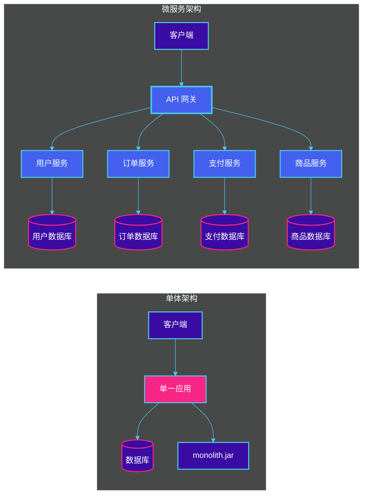

### 核心差异对比

| 维度 | 单体架构 | 微服务架构 |
|------|----------|------------|
| **部署方式** | 整体打包，统一部署 | 每个服务独立部署 |
| **扩展方式** | 垂直扩展（复制整个应用） | 水平扩展（按需扩展特定服务） |
| **技术栈** | 统一技术栈 | 服务可选用不同技术 |
| **开发团队** | 大型团队协作 | 小团队负责特定服务 |
| **故障影响** | 单点故障影响全局 | 故障隔离，单服务不影响全局 |
| **上线周期** | 长（需全量测试） | 短（独立服务快速迭代） |
| **数据管理** | 统一数据库 | 分布式数据库 |
| **复杂度** | 初期简单，后期复杂 | 初期复杂，长期可控 |

### 优缺点对比

#### 单体架构优点

| 优点 | 说明 |
|------|------|
| **开发简单** | 单个项目，IDE 支持好，调试方便 |
| **部署简单** | 一个部署包，配置简单 |
| **测试便捷** | 端到端测试容易执行 |
| **性能优势** | 进程间通信无开销 |
| **事务一致** | 本地事务确保 ACID |

#### 单体架构缺点

| 缺点 | 说明 |
|------|------|
| **技术锁定** | 一旦选型，难以更换 |
| **扩展困难** | 部分模块瓶颈导致整体扩展 |
| **部署周期长** | 小改动需全量部署 |
| **故障风险高** | 一个模块崩溃导致整体不可用 |
| **团队协作难** | 代码冲突严重，依赖复杂 |

#### 微服务架构优点

| 优点 | 说明 |
|------|------|
| **独立部署** | 服务解耦，可单独部署更新 |
| **技术多样性** | 根据场景选择最优技术栈 |
| **弹性扩展** | 按需扩展瓶颈服务 |
| **故障隔离** | 单服务故障不影响整体 |
| **团队自治** | 小团队独立负责服务 |
| **快速迭代** | 短周期发布，快速响应业务 |

#### 微服务架构缺点

| 缺点 | 说明 |
|------|------|
| **运维复杂** | 服务多，部署、监控挑战大 |
| **数据一致性** | 分布式事务处理困难 |
| **网络延迟** | 服务间通信引入额外开销 |
| **调试困难** | 分布式追踪复杂 |
| **测试复杂** | 集成测试涉及多服务 |

### 演进路径


---

## 微服务的优势

### 1. 独立部署与快速迭代

每个微服务可以独立开发、测试和部署，团队可以根据服务的重要性灵活调整发布节奏。

**案例场景**：电商平台的秒杀活动

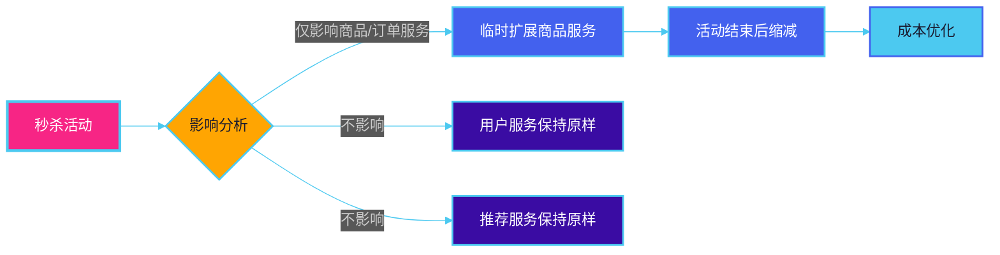

### 2. 技术多样性

不同服务可以根据业务特点选择最适合的技术栈。

**示例场景**：

| 服务 | 适用技术 | 原因 |
|------|----------|------|
| 搜索服务 | Elasticsearch | 高性能全文检索 |
| 实时计算 | Apache Flink | 流式数据处理 |
| 文件存储 | MinIO/S3 | 对象存储优化 |
| 机器学习 | Python/TensorFlow | ML 生态系统 |
| 高并发 API | Go/Rust | 高性能和低内存 |
| 复杂业务 | Java/Spring | 成熟的生态和稳定性 |

### 3. 弹性扩展

根据各服务的负载情况独立扩展，实现资源的精准分配。

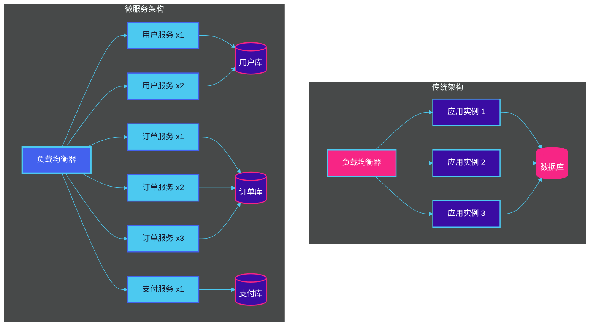

### 4. 故障隔离与容错

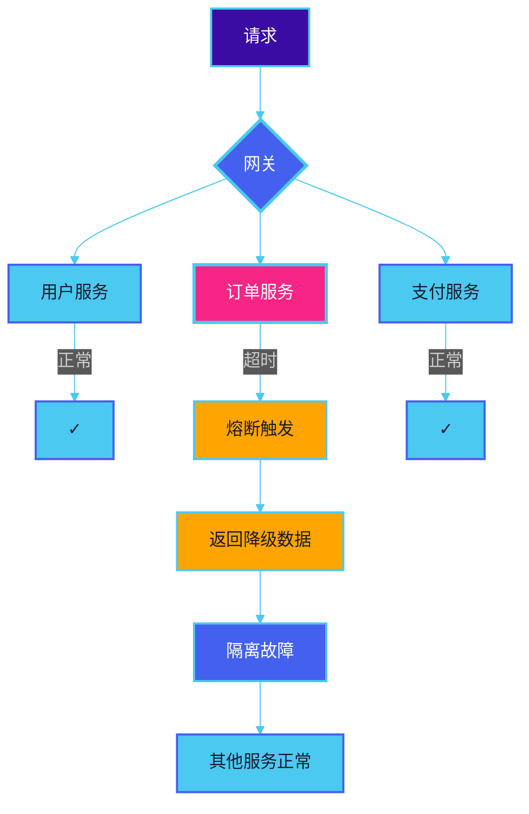

### 5. 团队自治

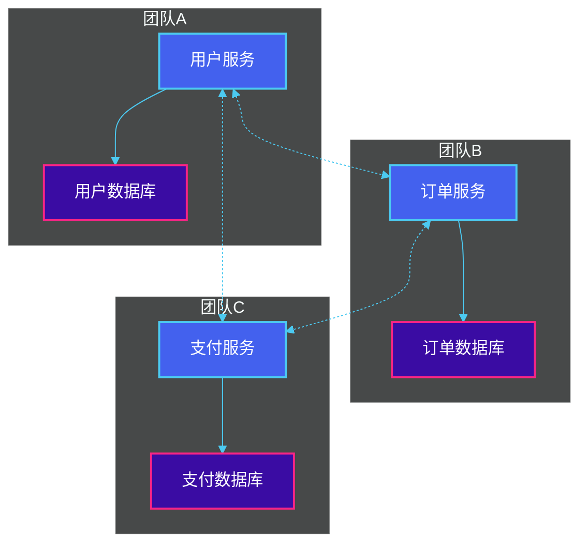

---

## 微服务的挑战

### 1. 分布式系统复杂性

微服务本质上是分布式系统，需要处理网络通信的种种问题。

```mermaid
%%{init: {'theme': 'dark', 'themeVariables': {'background': '#1a1a2e', 'primaryColor': '#4361ee', 'primaryTextColor': '#ffffff', 'primaryBorderColor': '#4cc9f0', 'lineColor': '#4cc9f0', 'secondaryColor': '#3a0ca3', 'tertiaryColor': '#1a1a2e'}}}%%
sequenceDiagram
    participant S1 as 服务A
    participant S2 as 服务B
    participant LB as 负载均衡器

    Note over S1,S2: 网络分区
    S1->>S2: 调用
    S2-->>S1: 超时/无响应

    Note over S1,S2: 服务发现
    S1->>LB: 注册自己
    S2->>LB: 查询服务A
    LB-->>S2: 返回服务A地址

    Note over S1,S2: 负载均衡
    S2->>LB: 获取实例
    LB-->>S2: 实例列表
    S2->>S1: 选择一个调用

    style S1 fill:#4361ee,stroke:#4cc9f0,stroke-width:2px,color:#ffffff
    style S2 fill:#4361ee,stroke:#4cc9f0,stroke-width:2px,color:#ffffff
    style LB fill:#f72585,stroke:#4cc9f0,stroke-width:2px,color:#ffffff
```

**常见问题**：

- 网络延迟和超时
- 服务发现与注册
- 负载均衡策略
- 重试与熔断机制

### 2. 数据一致性挑战

微服务架构下，每个服务拥有独立的数据库，跨服务的数据一致性成为难题。

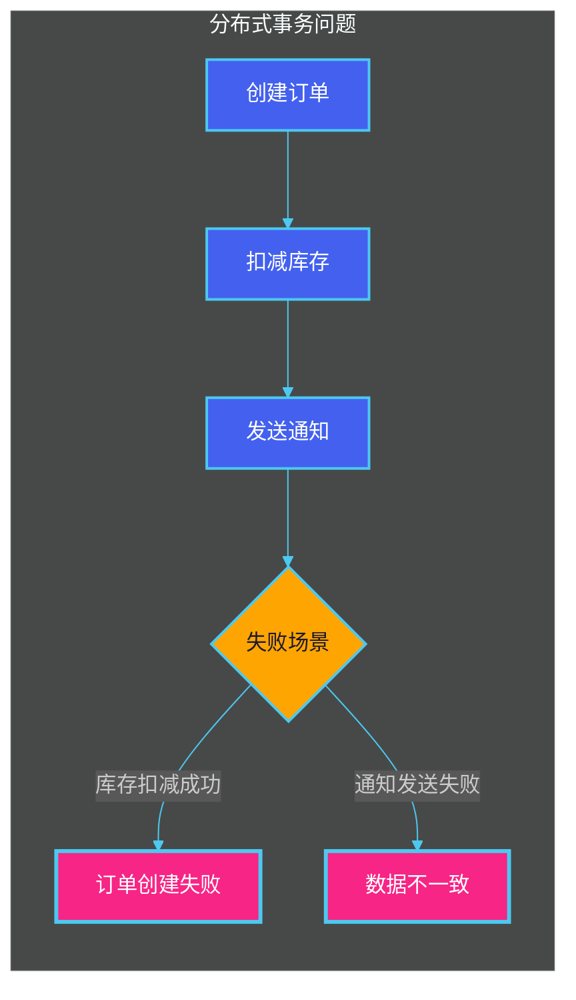

**解决方案对比**：

| 方案 | 描述 | 适用场景 |
|------|------|----------|
| **两阶段提交 (2PC)** | 强一致性，但性能差，有协调者单点问题 | 对一致性要求极高的场景 |
| **Saga 模式** | 分布式事务，通过补偿操作 eventual consistency | 业务流程较长的事务 |
| **最终一致性** | 允许短暂不一致，通过消息队列异步同步 | 对实时性要求不高的场景 |
| **TCC (Try-Confirm-Cancel)** | 业务层面的两阶段提交 | 灵活的业务补偿逻辑 |

**Saga 模式示例**：

```go
// Saga 模式示例：订单创建流程
type Saga struct {
    steps []SagaStep
}

type SagaStep func() error

func (s *Saga) Execute() error {
    // 正向操作
    for _, step := range s.steps {
        if err := step(); err != nil {
            // 补偿操作（反向执行）
            s.compensate()
            return err
        }
    }
    return nil
}

// 订单 Saga 示例
func CreateOrderSaga(order Order) *Saga {
    return &Saga{
        steps: []SagaStep{
            // Step 1: 创建订单
            func() error {
                return orderService.Create(order)
            },
            // Step 2: 扣减库存
            func() error {
                return inventoryService.Deduct(order.Items)
            },
            // Step 3: 发送通知
            func() error {
                return notificationService.Send(order.UserID)
            },
        },
    }
}
```

### 3. 运维复杂度

服务数量增加带来运维挑战：

```mermaid
mindmap
  id1((微服务运维挑战))
    id2(部署管理)
      id3(容器编排)
      id4(Kubernetes)
      id5(CI/CD 流水线)
    id6(监控告警)
      id7(指标采集)
      id8(日志聚合)
      id9(链路追踪)
    id10(服务治理)
      id11(服务注册/发现)
      id12(负载均衡)
      id13(熔断限流)
    id14(网络安全)
      id15(服务间 TLS)
      id16(API 认证)
      id17(网络策略)
    id18(配置管理)
      id19(集中配置)
      id20(灰度发布)
      id21(配置回滚)

  style id1 fill:#f72585,stroke:#4361ee,stroke-width:3px,color:#ffffff
  style id2 fill:#4361ee,stroke:#4cc9f0,stroke-width:2px,color:#ffffff
  style id6 fill:#4361ee,stroke:#4cc9f0,stroke-width:2px,color:#ffffff
  style id10 fill:#4361ee,stroke:#4cc9f0,stroke-width:2px,color:#ffffff
  style id14 fill:#4361ee,stroke:#4cc9f0,stroke-width:2px,color:#ffffff
  style id18 fill:#4361ee,stroke:#4cc9f0,stroke-width:2px,color:#ffffff
  style id3 fill:#4cc9f0,stroke:#4361ee,stroke-width:1px,color:#1a1a2e
  style id4 fill:#4cc9f0,stroke:#4361ee,stroke-width:1px,color:#1a1a2e
  style id5 fill:#4cc9f0,stroke:#4361ee,stroke-width:1px,color:#1a1a2e
  style id7 fill:#4cc9f0,stroke:#4361ee,stroke-width:1px,color:#1a1a2e
  style id8 fill:#4cc9f0,stroke:#4361ee,stroke-width:1px,color:#1a1a2e
  style id9 fill:#4cc9f0,stroke:#4361ee,stroke-width:1px,color:#1a1a2e
  style id11 fill:#4cc9f0,stroke:#4361ee,stroke-width:1px,color:#1a1a2e
  style id12 fill:#4cc9f0,stroke:#4361ee,stroke-width:1px,color:#1a1a2e
  style id13 fill:#4cc9f0,stroke:#4361ee,stroke-width:1px,color:#1a1a2e
  style id15 fill:#4cc9f0,stroke:#4361ee,stroke-width:1px,color:#1a1a2e
  style id16 fill:#4cc9f0,stroke:#4361ee,stroke-width:1px,color:#1a1a2e
  style id17 fill:#4cc9f0,stroke:#4361ee,stroke-width:1px,color:#1a1a2e
  style id19 fill:#4cc9f0,stroke:#4361ee,stroke-width:1px,color:#1a1a2e
  style id20 fill:#4cc9f0,stroke:#4361ee,stroke-width:1px,color:#1a1a2e
  style id21 fill:#4cc9f0,stroke:#4361ee,stroke-width:1px,color:#1a1a2e
```

**运维工具栈**：

| 领域 | 工具示例 |
|------|----------|
| 容器编排 | Kubernetes、Docker Swarm |
| 服务网格 | Istio、Linkerd |
| 监控 | Prometheus + Grafana |
| 日志 | ELK Stack (Elasticsearch, Logstash, Kibana) |
| 链路追踪 | Jaeger、Zipkin |
| CI/CD | Jenkins、GitLab CI、ArgoCD |

### 4. 测试复杂性

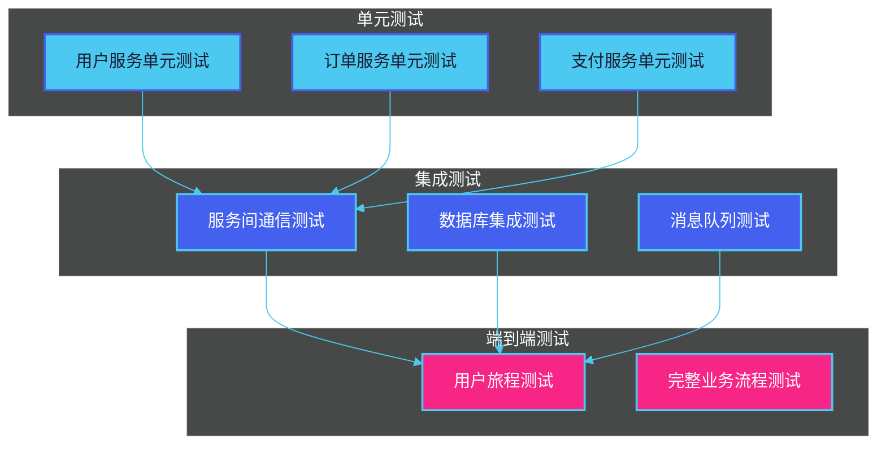

---

## 微服务的适用场景

### 何时选择微服务

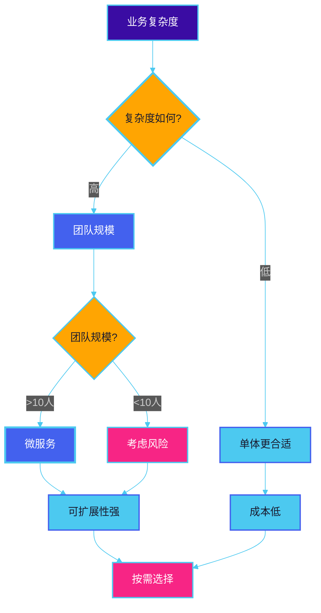

### 适合微服务的场景

| 场景 | 说明 | 案例 |
|------|------|------|
| **大型复杂应用** | 业务模块多，团队规模大 | 电商平台、金融系统 |
| **高并发系统** | 需要弹性扩展能力 | 秒杀系统、直播平台 |
| **快速迭代需求** | 业务频繁变化和发布 | 互联网产品、SaaS |
| **多技术栈需求** | 不同模块有不同技术需求 | AI + 传统业务混合 |
| **高可用要求** | 故障隔离和容错要求高 | 支付系统、交易平台 |

### 不适合微服务的场景

| 场景 | 说明 | 替代方案 |
|------|------|----------|
| **小型应用** | 业务简单，规模小 | 单体架构 |
| **初创项目** | 快速验证业务为主 | 单体 + 模块化 |
| **团队规模小** | 运维能力有限 | 模块化单体 |
| **低并发业务** | 流量稳定，无需弹性 | 单体架构 |
| **强一致性需求** | 对事务一致性要求极高 | 单体或强一致性中间件 |

### 决策树

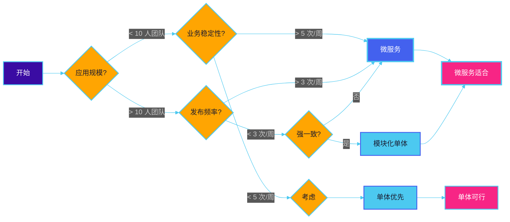

---

## 行业案例

### 1. Netflix

**背景**：全球最大的流媒体平台，服务 2 亿 + 用户

**架构演进**：

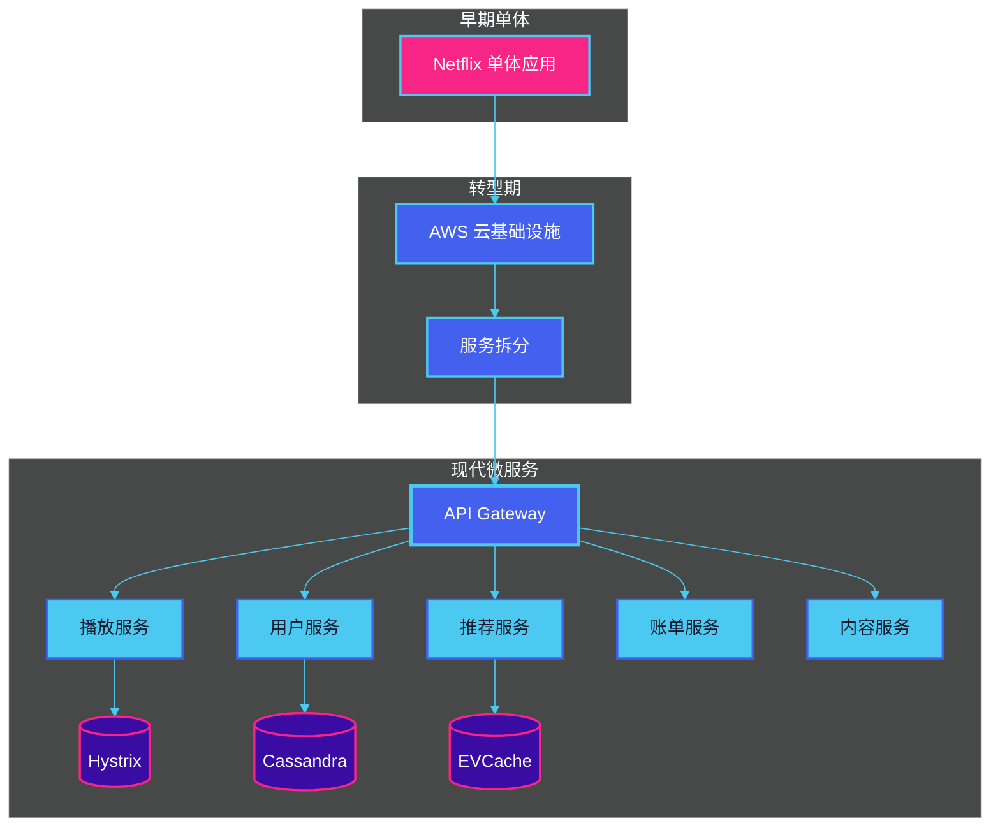

**关键实践**：

- **Zuul**：智能网关，支持动态路由、过滤器和负载均衡
- **Hystrix**：熔断器模式，防止级联故障
- **Eureka**：服务注册与发现
- **Chaos Monkey**：混沌工程，随机杀死服务测试容错

### 2. Amazon（AWS）

**背景**：从单体架构演变为服务导向架构（SOA）

**核心转变**：

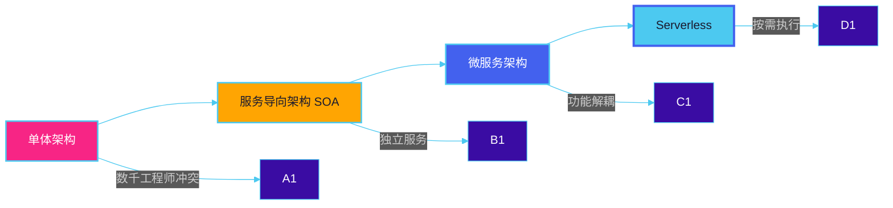

**关键技术**：

- **AWS Lambda**：函数即服务（FaaS）
- **Amazon ECS/EKS**：容器编排
- **API Gateway**：统一的 API 管理
- **DynamoDB**：分布式数据库

### 3. Uber

**背景**：全球出行平台，需要处理实时匹配和高并发订单

**架构特点**：

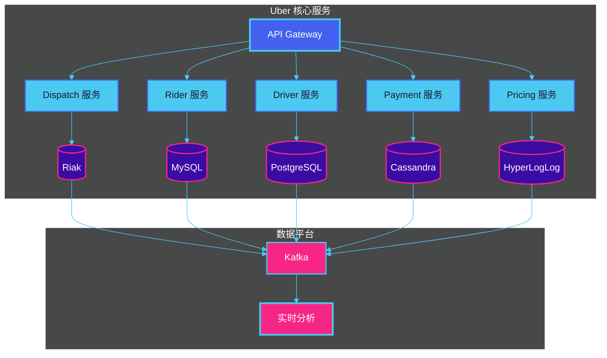

**关键架构决策**：

- **域驱动设计**：按业务域拆分服务
- **多数据库策略**：根据场景选择最优存储
- **Schemaless**：灵活的数据存储中间件
- **实时数据管道**：Kafka + 流处理

### 4. 阿里巴巴

**电商平台微服务实践**

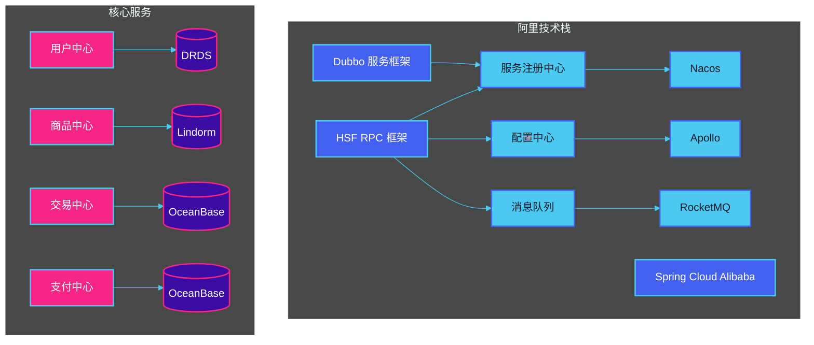

### 案例对比总结

| 公司 | 规模 | 服务数量 | 核心技术栈 | 关键挑战 |
|------|------|----------|------------|----------|
| Netflix | 2 亿 + 用户 | 1000 + | Zuul、Hystrix、Eureka | 全球高可用、混沌工程 |
| Amazon | 亿级用户 | 数百 | AWS Lambda、DynamoDB | 大规模分布式、Serverless |
| Uber | 亿级用户 | 数百 | Riak、Cassandra、Kafka | 实时匹配、动态定价 |
| 阿里 | 亿级交易 | 数千 | HSF、Dubbo、Spring Cloud | 双十一峰值、异地多活 |

---

## 本章小结

### 核心要点

1. **微服务定义**：微服务是一种将复杂应用拆分为多个小型、独立服务的架构风格，每个服务围绕业务能力组织，独立运行在不同进程中。

2. **与单体对比**：
   - 单体架构适合小型、团队规模小、业务稳定的项目
   - 微服务架构适合大型、团队规模大、需要快速迭代的项目
   - 两者不是非此即彼，可以从单体逐步演进到微服务

3. **核心优势**：
   - 独立部署和快速迭代
   - 技术多样性
   - 弹性扩展
   - 故障隔离
   - 团队自治

4. **主要挑战**：
   - 分布式系统复杂性
   - 数据一致性管理
   - 运维复杂度提升
   - 测试难度增加

5. **适用场景**：大型复杂应用、高并发系统、快速迭代需求、多技术栈场景

6. **行业实践**：Netflix、Amazon、Uber、阿里巴巴等企业都通过微服务架构支撑了亿级用户的业务

### 概念速查

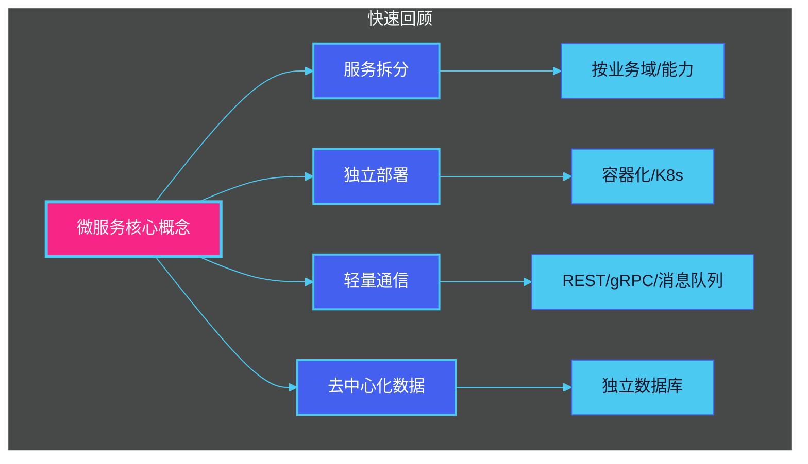

---

## 思考题

### 基础题

1. **概念辨析**：解释微服务架构的核心特征，并说明它与传统的 SOA（面向服务架构）有什么区别？

2. **对比分析**：请用表格对比单体架构和微服务架构在部署、扩展、团队协作三个维度的差异。

3. **场景选择**：某创业公司初期有 5 人团队，业务是简单的社区论坛，日活 1000 人，请分析他们应该选择单体还是微服务架构？为什么？

### 进阶级

4. **架构设计**：假设你要设计一个在线教育平台，包含用户系统、课程系统、支付系统、直播系统。请设计服务拆分方案，并说明每个服务的职责。

5. **问题分析**：微服务架构下，如何保证订单创建过程中的数据一致性？请分析可能遇到的问题并给出解决方案。

6. **技术选型**：Netflix 选择使用 Hystrix 作为熔断器，Uber 使用自研的 RingBuf。请分析在选择服务治理组件时需要考虑哪些因素？

### 实战题

7. **代码练习**：
   - 使用 Go 或 Java 实现一个简单的微服务
   - 服务需要提供 RESTful API
   - 包含基本的错误处理和响应格式

8. **架构绘图**：使用 Mermaid 绘制你所在项目的服务架构图，标注各服务之间的依赖关系和通信方式。

---

> **下一章预告**：第二章将深入探讨微服务的设计原则，包括服务拆分策略、API 设计规范、服务契约管理等核心内容。
