# 第二章：服务拆分策略

## 本章目录

- [2.1 服务拆分的重要性](#21-服务拆分的重要性)
- [2.2 领域驱动设计（DDD）核心概念](#22-领域驱动设计ddd核心概念)
  - [2.2.1 领域、子域、界限上下文](#221-领域子域界限上下文)
  - [2.2.2 聚合、实体、值对象](#222-聚合实体值对象)
  - [2.2.3 DDD分层架构](#223-ddd分层架构)
- [2.3 按业务能力拆分](#23-按业务能力拆分)
- [2.4 按子域拆分](#24-按子域拆分)
- [2.5 拆分的原则](#25-拆分的原则)
  - [2.5.1 单一职责原则](#251-单一职责原则)
  - [2.5.2 高内聚低耦合](#252-高内聚低耦合)
  - [2.5.3 团队自治](#253-团队自治)
- [2.6 拆分粒度如何确定](#26-拆分粒度如何确定)
- [2.7 案例：电商系统服务拆分](#27-案例电商系统服务拆分)
- [本章小结](#本章小结)
- [思考题](#思考题)

---

## 2.1 服务拆分的重要性

在传统的单体架构中，所有功能都打包在一个应用中。随着业务发展，单体应用会面临一系列问题：

### 2.1.1 单体架构的困境

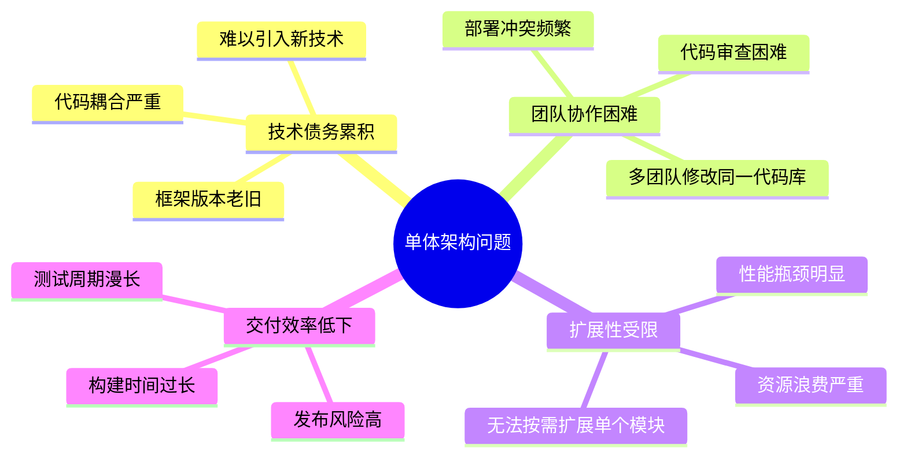

### 2.1.2 服务拆分的价值

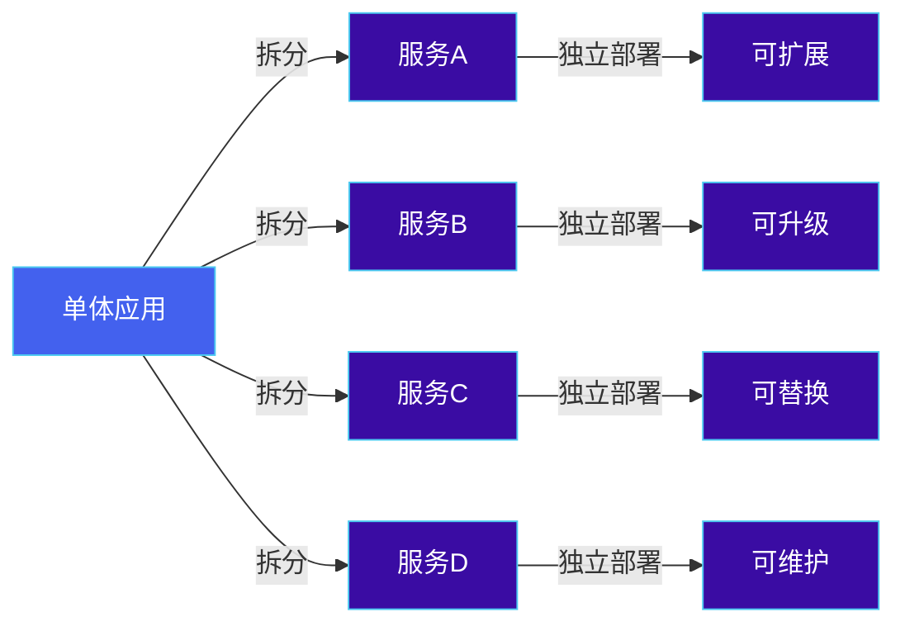

**服务拆分的核心价值：**

1. **独立部署**：每个服务可以独立部署，不影响其他服务
2. **技术多样性**：不同服务可以使用不同的技术栈
3. **故障隔离**：一个服务故障不会导致整个系统崩溃
4. **团队自治**：团队可以独立负责特定服务的开发运维
5. **按需扩展**：根据负载情况独立扩展需要的服务

### 2.1.3 拆分前的思考

```
┌─────────────────────────────────────────────────────────────┐
│                    服务拆分决策流程                          │
├─────────────────────────────────────────────────────────────┤
│                                                             │
│   ┌─────────────┐                                           │
│   │ 开始拆分    │                                           │
│   └──────┬──────┘                                           │
│          ▼                                                  │
│   ┌─────────────┐                                           │
│   │ 业务边界    │────是────┐                                │
│   │ 是否清晰？  │         │                                │
│   └──────┬──────┘         │                                │
│          │ 否             ▼                                │
│          ▼         ┌─────────────┐                         │
│   ┌─────────────┐  │ 使用 DDD    │                         │
│   │ 领域建模    │  │ 梳理边界    │                         │
│   │ 识别子域    │  └──────┬──────┘                         │
│   └──────┬──────┘         │                                │
│          │                │                                │
│          ▼                ▼                                │
│   ┌─────────────┐  ┌─────────────┐                         │
│   │ 识别服务    │◄─┤ 识别服务    │                         │
│   │ 边界        │  │ 边界        │                         │
│   └──────┬──────┘  └──────┬──────┘                         │
│          │                │                                │
│          ▼                ▼                                │
│   ┌─────────────┐  ┌─────────────┐                         │
│   │ 定义 API    │  │ 确定部署    │                         │
│   │ 接口        │  │ 策略        │                         │
│   └──────┬──────┘  └──────┬──────┘                         │
│          │                │                                │
│          └────────┬───────┘                                │
│                   ▼                                        │
│          ┌─────────────┐                                    │
│          │ 实施拆分    │                                    │
│          └─────────────┘                                    │
└─────────────────────────────────────────────────────────────┘
```

**关键问题：**
- 业务边界是否清晰？
- 团队是否有能力独立负责这些服务？
- 服务间的依赖关系是否可控？
- 数据一致性要求如何？

---

## 2.2 领域驱动设计（DDD）核心概念

领域驱动设计（Domain-Driven Design，简称DDD）是一种软件开发方法论，强调软件系统应该围绕业务领域来建模。在微服务拆分中，DDD提供了一套系统化的方法来识别业务边界和定义服务边界。

### 2.2.1 领域、子域、界限上下文

#### 领域（Domain）

领域是指整个业务知识体系，是企业开展业务活动所处的环境。在电商系统中，领域就是"电子商务"这个整体概念。

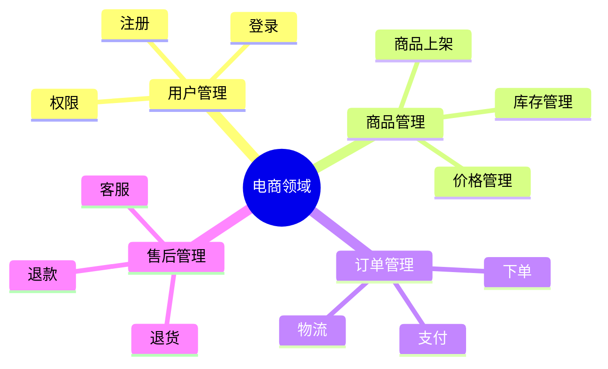

#### 子域（Subdomain）

子域是领域的细分，每个子域代表业务中的一个独立功能区域。根据重要性和性质，子域分为三类：

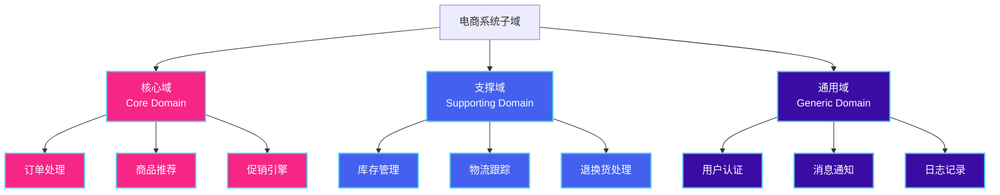

| 子域类型 | 说明 | 例子 | 投入资源 |
|---------|------|------|---------|
| 核心域 | 业务的核心竞争力，直接创造价值 | 订单处理、商品推荐 | 最多 |
| 支撑域 | 支撑核心业务，非差异化 | 库存管理、退换货 | 适中 |
| 通用域 | 所有业务都需要的通用功能 | 用户认证、日志 | 复用或外购 |

**实例说明：**

假设你正在开发一个在线教育平台：

- **核心域**：`课程学习`、`在线答疑`、`学习进度跟踪` —— 这些是教育平台的核心竞争力
- **支撑域**：`课程内容管理`、`作业批改`、`考试系统` —— 支撑教学但非差异化
- **通用域**：`用户认证`、`消息通知`、`支付`、`文件存储` —— 所有系统都需要的通用功能

#### 界限上下文（Bounded Context）

界限上下文是领域模型的应用边界，在这个边界内，领域术语和概念有明确的定义。不同的界限上下文可能有同名的概念，但含义不同。

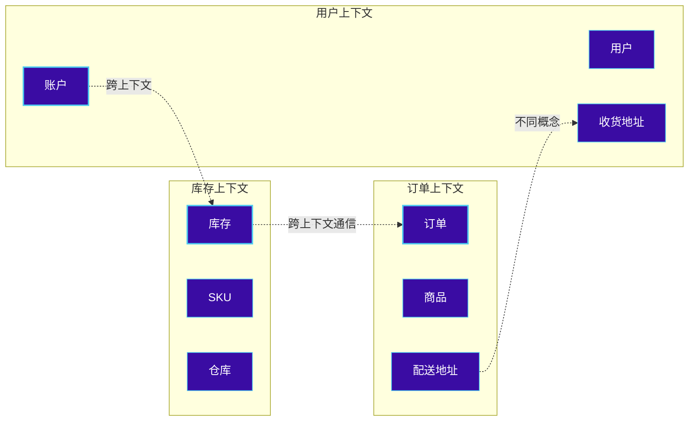

**例子说明：**

在`库存上下文`中，"商品"指的是具体的物理商品（SKU），包含库存数量、仓库位置等信息。

在`订单上下文`中，"商品"指的是订单行项，包含价格、购买数量等信息，但不关心实际库存。

在`用户上下文`中，"地址"指的是用户的收货地址，包含联系电话、门牌号等信息。

### 2.2.2 聚合、实体、值对象

#### 实体（Entity）

实体是有唯一标识的领域对象，其生命周期内标识保持不变。即使属性发生变化，实体的本质身份不变。

```go
// Go 示例：订单实体
type Order struct {
    orderID   string    // 唯一标识，创建后不可改变
    orderNo   string    // 订单编号
    userID    string    // 用户ID
    status    OrderStatus
    items     []*OrderItem
    totalAmt  decimal.Decimal
    createdAt time.Time
    updatedAt time.Time
}

// 订单实体有唯一标识 orderID
func (o *Order) ChangeStatus(newStatus OrderStatus) {
    o.status = newStatus
    o.updatedAt = time.Now()
}
```

```java
// Java 示例：订单实体
public class Order {
    private OrderId orderId;      // 唯一标识
    private OrderNo orderNo;
    private UserId userId;
    private OrderStatus status;
    private List<OrderItem> items;
    private Money totalAmount;
    private Instant createdAt;
    private Instant updatedAt;

    // 实体通过标识相等
    @Override
    public boolean equals(Object o) {
        if (this == o) return true;
        if (!(o instanceof Order)) return false;
        Order order = (Order) o;
        return orderId != null && orderId.equals(order.orderId);
    }

    @Override
    public int hashCode() {
        return orderId != null ? orderId.hashCode() : 0;
    }
}
```

**实体的特点：**
- 有全局唯一标识
- 可以被持久化并在以后重新检索
- 标识在生命周期内不变
- 可以与其他实体关联

#### 值对象（Value Object）

值对象是没有唯一标识的不可变对象，用于描述实体的属性。当对象的属性值相同，就认为它们是相等的。

```go
// Go 示例：地址值对象
type Address struct {
    province   string
    city       string
    district   string
    street     string
    zipCode    string
}

// 值对象是不可变的，修改需要创建新的实例
func (a *Address) ChangeDistrict(newDistrict string) *Address {
    return &Address{
        province: a.province,
        city:     a.city,
        district: newDistrict,
        street:   a.street,
        zipCode:  a.zipCode,
    }
}
```

```java
// Java 示例：货币值对象
public class Money {
    private final BigDecimal amount;
    private final Currency currency;

    public Money(BigDecimal amount, Currency currency) {
        this.amount = amount;
        this.currency = currency;
    }

    public Money add(Money other) {
        if (!this.currency.equals(other.currency)) {
            throw new IllegalArgumentException("Currency mismatch");
        }
        return new Money(this.amount.add(other.amount), this.currency);
    }

    // 值对象通常不提供 setter
    public BigDecimal getAmount() { return amount; }
    public Currency getCurrency() { return currency; }

    // 值对象通过属性相等
    @Override
    public boolean equals(Object o) {
        if (this == o) return true;
        if (!(o instanceof Money)) return false;
        Money money = (Money) o;
        return Objects.equals(amount, money.amount) &&
               Objects.equals(currency, money.currency);
    }
}
```

**值对象的特点：**
- 没有唯一标识
- 不可变
- 通过属性值相等
- 通常作为实体的属性

#### 聚合（Aggregate）

聚合是一组相关对象的组合，作为数据修改的单元。每个聚合有一个根实体（聚合根），外部对象只能通过聚合根来访问和修改内部对象。

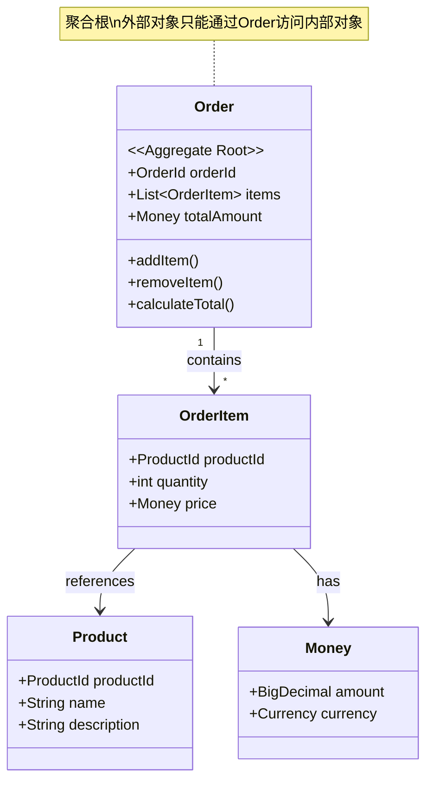

**订单聚合示例：**

```go
// 订单聚合根
type Order struct {
    orderID   string
    userID    string
    items     []*OrderItem
    totalAmt  decimal.Decimal
    status    OrderStatus
}

// 添加订单项（通过聚合根）
func (o *Order) AddItem(product *Product, quantity int) error {
    if quantity <= 0 {
        return ErrInvalidQuantity
    }

    // 检查是否已存在该商品
    for _, item := range o.items {
        if item.ProductID == product.ID {
            item.Quantity += quantity
            o.recalculateTotal()
            return nil
        }
    }

    // 新增订单项
    o.items = append(o.items, &OrderItem{
        ProductID: product.ID,
        ProductName: product.Name,
        UnitPrice: product.Price,
        Quantity:  quantity,
    })
    o.recalculateTotal()
    return nil
}

// 内部方法，重新计算总额
func (o *Order) recalculateTotal() {
    total := decimal.Zero
    for _, item := range o.items {
        total = total.Add(item.UnitPrice.Mul(decimal.NewFromInt(int64(item.Quantity))))
    }
    o.totalAmt = total
}
```

```java
// 订单聚合根
public class Order {
    private OrderId orderId;
    private UserId userId;
    private List<OrderItem> items;
    private Money totalAmount;
    private OrderStatus status;

    // 只能通过聚合根方法修改内部状态
    public void addItem(Product product, int quantity) {
        if (quantity <= 0) {
            throw new IllegalArgumentException("Quantity must be positive");
        }

        OrderItem existingItem = items.stream()
            .filter(item -> item.getProductId().equals(product.getId()))
            .findFirst()
            .orElse(null);

        if (existingItem != null) {
            existingItem.increaseQuantity(quantity);
        } else {
            items.add(new OrderItem(product, quantity));
        }

        recalculateTotal();
    }

    public void removeItem(ProductId productId) {
        items.removeIf(item -> item.getProductId().equals(productId));
        recalculateTotal();
    }

    private void recalculateTotal() {
        this.totalAmount = items.stream()
            .map(OrderItem::getSubtotal)
            .reduce(Money.zero(), Money::add);
    }
}
```

### 2.2.3 DDD分层架构

DDD分层架构将系统分为多个层次，每层有明确的职责：

```mermaid
graph TB
    subgraph 用户界面层 ["用户界面层 Presentation"]
        W["Web层"]
        API["API层"]
    end

    subgraph 应用层 ["应用层 Application"]
        S["服务"]
        CM["命令处理"]
        Q["查询处理"]
    end

    subgraph 领域层 ["领域层 Domain"]
        E["实体"]
        VO["值对象"]
        AG["聚合"]
        SV["领域服务"]
        EV["领域事件"]
    end

    subgraph 基础设施层 ["基础设施层 Infrastructure"]
        RP["仓储实现"]
        MSG["消息发送"]
        EXT["外部服务"]
    end

    W --> API
    API --> S
    S --> CM
    S --> Q
    CM --> AG
    Q --> AG
    AG --> E
    AG --> VO
    AG --> SV
    S --> RP
    RP --> E
    S --> MSG
    S --> EXT

    classDef layer fill:#1a1a2e,stroke:#4cc9f0,stroke-width:2px
    classDef presentation fill:#2ecc71,stroke:#4cc9f0,color:#ffffff,stroke-width:2px
    classDef application fill:#4361ee,stroke:#4cc9f0,color:#ffffff,stroke-width:2px
    classDef domain fill:#f72585,stroke:#4cc9f0,color:#ffffff,stroke-width:2px
    classDef infrastructure fill:#3a0ca3,stroke:#4cc9f0,color:#ffffff,stroke-width:2px
    classDef node fill:#1a1a2e,stroke:#4cc9f0,color:#e0e0e0,stroke-width:1px
    class 用户界面层,应用层,领域层,基础设施层 layer
    class W,API presentation
    class S,CM,Q application
    class E,VO,AG,SV,EV domain
    class RP,MSG,EXT infrastructure
```

**各层职责：**

| 层次 | 职责 | 示例 |
|------|------|------|
| 用户界面层 | 展示数据，接收用户输入 | Controller、DTO |
| 应用层 | 协调领域对象完成任务 | Application Service |
| 领域层 | 表达业务概念和规则 | Entity、Value Object、Aggregate |
| 基础设施层 | 提供技术实现 | Repository、Message Sender |

**完整分层架构示例：**

```
┌─────────────────────────────────────────────────────────────┐
│                     用户界面层 (Presentation)                │
│  ┌─────────────┐  ┌─────────────┐  ┌─────────────┐         │
│  │   Web UI   │  │  REST API   │  │ GraphQL API │         │
│  └─────────────┘  └─────────────┘  └─────────────┘         │
└─────────────────────────────────────────────────────────────┘
                            │
                            ▼
┌─────────────────────────────────────────────────────────────┐
│                     应用层 (Application)                     │
│  ┌─────────────────────────────────────────────────────┐   │
│  │              OrderApplicationService                 │   │
│  │  - createOrder()    - cancelOrder()                  │   │
│  │  - payOrder()       - queryOrder()                   │   │
│  └─────────────────────────────────────────────────────┘   │
└─────────────────────────────────────────────────────────────┘
                            │
                            ▼
┌─────────────────────────────────────────────────────────────┐
│                       领域层 (Domain)                        │
│  ┌──────────────┐  ┌──────────────┐  ┌──────────────┐      │
│  │    Order     │  │   Product    │  │    User      │      │
│  │  (Aggregate) │  │  (Aggregate) │  │  (Aggregate) │      │
│  └──────────────┘  └──────────────┘  └──────────────┘      │
│                                                             │
│  ┌──────────────┐  ┌──────────────┐                        │
│  │ OrderService │  │Domain Events │  ← 领域服务、领域事件  │
│  │ (Domain      │  │              │                        │
│  │  Service)    │  │              │                        │
│  └──────────────┘  └──────────────┘                        │
└─────────────────────────────────────────────────────────────┘
                            │
                            ▼
┌─────────────────────────────────────────────────────────────┐
│                   基础设施层 (Infrastructure)               │
│  ┌──────────────┐  ┌──────────────┐  ┌──────────────┐      │
│  │   JPA        │  │   Kafka      │  │  外部服务    │      │
│  │ Repository   │  │   Producer   │  │  客户端      │      │
│  └──────────────┘  └──────────────┘  └──────────────┘      │
└─────────────────────────────────────────────────────────────┘
```

---

## 2.3 按业务能力拆分

业务能力是指企业为了实现其业务目标所具备的能力。按业务能力拆分是传统的拆分方法，根据企业的业务流程和职能来划分服务。

### 3.1 业务能力识别

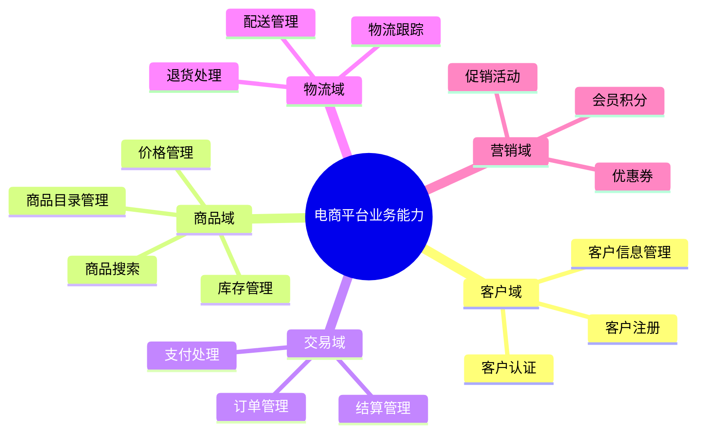

### 3.2 按能力拆分的服务架构

```mermaid
graph TB
    subgraph 客户域服务["客户域服务"]
        CS["客户管理服务"]
        CA["认证服务"]
    end

    subgraph 商品域服务["商品域服务"]
        PS["商品服务"]
        SS["搜索服务"]
        IS["库存服务"]
    end

    subgraph 交易域服务["交易域服务"]
        OS["订单服务"]
        PYS["支付服务"]
        SS2["结算服务"]
    end

    subgraph 物流域服务["物流域服务"]
        DS["配送服务"]
        LTS["物流跟踪服务"]
        RS["退货服务"]
    end

    subgraph 营销域服务["营销域服务"]
        MKS["营销服务"]
        CPS["优惠券服务"]
        PSS["积分服务"]
    end

    CS -->|"调用"| CA
    OS -->|"调用"| CS
    OS -->|"调用"| PS
    OS -->|"调用"| IS
    OS -->|"调用"| PYS
    DS -->|"调用"| LTS
    OS -->|"调用"| DS

    classDef domain fill:#1a1a2e,stroke:#4361ee,stroke-width:2px
    classDef service fill:#3a0ca3,stroke:#4cc9f0,color:#ffffff,stroke-width:1px
    classDef arrow stroke:#4cc9f0,stroke-width:2px
    class 客户域服务,商品域服务,交易域服务,物流域服务,营销域服务 domain
    class CS,CA,PS,SS,IS,OS,PYS,SS2,DS,LTS,RS,MKS,CPS,PSS service
```

### 3.3 案例：客户管理服务

```go
// customer-service/main.go
package main

import (
    "customer-service/handler"
    "customer-service/repository"
    "customer-service/service"
    "net/http"

    "github.com/gin-gonic/gin"
)

func main() {
    // 初始化各层组件
    repo := repository.NewCustomerRepository()
    svc := service.NewCustomerService(repo)
    h := handler.NewCustomerHandler(svc)

    // 启动 HTTP 服务
    r := gin.Default()
    r.POST("/customers", h.CreateCustomer)
    r.GET("/customers/:id", h.GetCustomer)
    r.PUT("/customers/:id", h.UpdateCustomer)
    r.DELETE("/customers/:id", h.DeleteCustomer)

    http.ListenAndServe(":8081", r)
}
```

```go
// customer-service/domain/customer.go
package domain

import "time"

type Customer struct {
    customerID   string
    name         string
    email        string
    phone        string
    createdAt    time.Time
    updatedAt    time.Time
}

type CustomerRepository interface {
    Save(customer *Customer) error
    FindByID(id string) (*Customer, error)
    FindByEmail(email string) (*Customer, error)
    Delete(id string) error
}
```

**按业务能力拆分的优缺点：**

| 优点 | 缺点 |
|------|------|
| 符合组织结构 | 可能导致服务间调用链过长 |
| 易于理解和沟通 | 不同服务间可能共享数据 |
| 边界相对稳定 | 难以应对业务快速变化 |

---

## 2.4 按子域拆分

按子域拆分是在DDD方法论指导下，根据业务领域的细分来划分服务。这种方法更强调业务的内聚性和独立性。

### 4.1 子域与微服务的对应关系

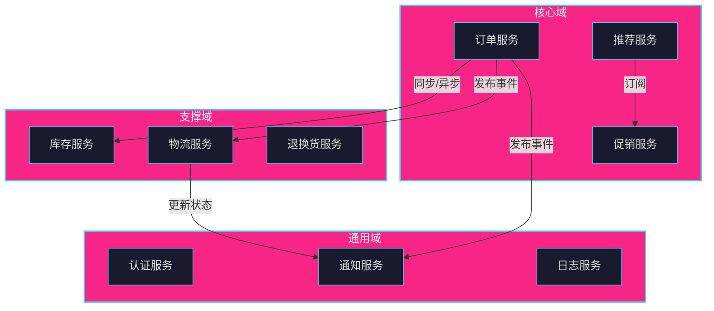

### 4.2 核心域服务示例

以订单服务为例，展示核心域的设计：

```go
// order-service/domain/order_aggregate.go
package domain

import (
    "errors"
    "order-service/domain/event"
    "time"

    "github.com/google/uuid"
)

var (
    ErrInvalidQuantity    = errors.New("quantity must be greater than 0")
    ErrOrderNotFound      = errors.New("order not found")
    ErrInvalidOrderState  = errors.New("invalid order state for this operation")
)

type OrderStatus string

const (
    OrderStatusPending   OrderStatus = "PENDING"
    OrderStatusPaid      OrderStatus = "PAID"
    OrderStatusShipped   OrderStatus = "SHIPPED"
    OrderStatusDelivered OrderStatus = "DELIVERED"
    OrderStatusCancelled OrderStatus = "CANCELLED"
)

type Order struct {
    orderID      string
    customerID   string
    items        []*OrderItem
    totalAmount  Money
    status       OrderStatus
    shippingAddr *Address
    createdAt    time.Time
    updatedAt    time.Time

    // 领域事件
    domainEvents []event.DomainEvent
}

func NewOrder(customerID string, shippingAddr *Address) *Order {
    return &Order{
        orderID:      uuid.New().String(),
        customerID:   customerID,
        items:        make([]*OrderItem, 0),
        totalAmount:  ZeroMoney(),
        status:       OrderStatusPending,
        shippingAddr: shippingAddr,
        createdAt:    time.Now(),
        updatedAt:    time.Now(),
        domainEvents: make([]event.DomainEvent, 0),
    }
}

func (o *Order) AddItem(product *Product, quantity int) error {
    if quantity <= 0 {
        return ErrInvalidQuantity
    }

    // 检查是否已存在
    for _, item := range o.items {
        if item.ProductID == product.ID {
            item.Quantity += quantity
            item.Subtotal = item.UnitPrice.Mul(int64(item.Quantity))
            o.recalculateTotal()
            return nil
        }
    }

    item := &OrderItem{
        ProductID:   product.ID,
        ProductName: product.Name,
        UnitPrice:   product.Price,
        Quantity:    quantity,
        Subtotal:    product.Price.Mul(int64(quantity)),
    }
    o.items = append(o.items, item)
    o.recalculateTotal()
    return nil
}

func (o *Order) Pay(payment *Payment) error {
    if o.status != OrderStatusPending {
        return ErrInvalidOrderState
    }

    o.status = OrderStatusPaid
    o.updatedAt = time.Now()

    // 添加领域事件
    o.domainEvents = append(o.domainEvents, event.NewOrderPaidEvent(o.orderID, payment.PaymentID))

    return nil
}

func (o *Order) Cancel() error {
    if o.status == OrderStatusShipped || o.status == OrderStatusDelivered {
        return ErrInvalidOrderState
    }

    o.status = OrderStatusCancelled
    o.updatedAt = time.Now()

    // 添加领域事件
    o.domainEvents = append(o.domainEvents, event.NewOrderCancelledEvent(o.orderID))

    return nil
}

func (o *Order) GetEvents() []event.DomainEvent {
    events := o.domainEvents
    o.domainEvents = make([]event.DomainEvent, 0)
    return events
}

func (o *Order) recalculateTotal() {
    total := ZeroMoney()
    for _, item := range o.items {
        total = total.Add(item.Subtotal)
    }
    o.totalAmount = total
}
```

```go
// order-service/domain/order_item.go
package domain

type OrderItem struct {
    ProductID   string
    ProductName string
    UnitPrice   Money
    Quantity    int
    Subtotal    Money
}
```

```go
// order-service/domain/money.go
package domain

type Money struct {
    amount   int64  // 内部以分为单位存储，避免浮点数精度问题
    currency string
}

func NewMoney(amount int64, currency string) Money {
    return Money{amount: amount, currency: currency}
}

func ZeroMoney() Money {
    return Money{amount: 0, currency: "CNY"}
}

func (m Money) Mul(multiplier int) Money {
    return Money{amount: m.amount * int64(multiplier), currency: m.currency}
}

func (m Money) Add(other Money) Money {
    if m.currency != other.currency {
        panic("currency mismatch")
    }
    return Money{amount: m.amount + other.amount, currency: m.currency}
}

func (m Money) GreaterThan(other Money) bool {
    return m.amount > other.amount
}
```

### 4.3 领域事件示例

```go
// order-service/domain/event/order_events.go
package event

import "time"

type DomainEvent interface {
    GetEventType() string
    GetOccurredAt() time.Time
}

type OrderPaidEvent struct {
    orderID   string
    paymentID string
    occurredAt time.Time
}

func NewOrderPaidEvent(orderID, paymentID string) *OrderPaidEvent {
    return &OrderPaidEvent{
        orderID:   orderID,
        paymentID: paymentID,
        occurredAt: time.Now(),
    }
}

func (e *OrderPaidEvent) GetEventType() string {
    return "OrderPaid"
}

func (e *OrderPaidEvent) GetOccurredAt() time.Time {
    return e.occurredAt
}

type OrderCancelledEvent struct {
    orderID    string
    occurredAt time.Time
}

func NewOrderCancelledEvent(orderID string) *OrderCancelledEvent {
    return &OrderCancelledEvent{
        orderID:   orderID,
        occurredAt: time.Now(),
    }
}

func (e *OrderCancelledEvent) GetEventType() string {
    return "OrderCancelled"
}

func (e *OrderCancelledEvent) GetOccurredAt() time.Time {
    return e.occurredAt
}
```

---

## 2.5 拆分的原则

### 2.5.1 单一职责原则

每个服务只负责一项业务功能，有明确的职责边界。

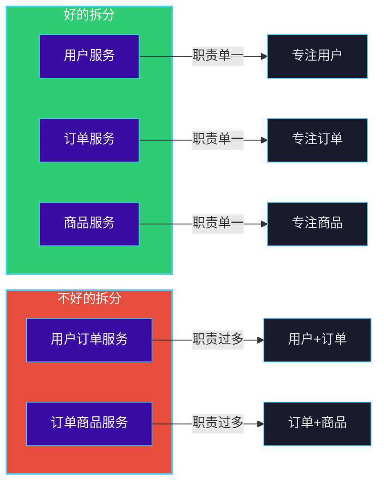

**单一职责的判断标准：**
- 服务是否可以独立修改而不影响其他服务？
- 是否有明确的输入和输出？
- 是否可以由一个小团队独立维护？

### 2.5.2 高内聚低耦合

**高内聚**：相关功能放在同一个服务中，减少服务内部的依赖。

**低耦合**：服务之间的依赖关系尽可能简单和松散。

```mermaid
graph LR
    subgraph 高内聚低耦合["高内聚低耦合"]
        subgraph 服务A["服务A"]
            F1["功能1"]
            F2["功能2"]
            F3["功能3"]
        end

        subgraph 服务B["服务B"]
            F4["功能4"]
            F5["功能5"]
        end

        subgraph 服务C["服务C"]
            F6["功能6"]
            F7["功能7"]
        end
    end

    F1 -->|"同步调用"| F4
    F2 -->|"异步事件"| F6
    F3 -.->|"无直接依赖"| F7

    classDef container fill:#1a1a2e,stroke:#4361ee,stroke-width:2px
    classDef serviceA fill:#4361ee,stroke:#4cc9f0,color:#ffffff,stroke-width:2px
    classDef serviceB fill:#2ecc71,stroke:#4cc9f0,color:#ffffff,stroke-width:2px
    classDef serviceC fill:#f72585,stroke:#4cc9f0,color:#ffffff,stroke-width:2px
    classDef node fill:#3a0ca3,stroke:#4cc9f0,color:#ffffff,stroke-width:1px
    classDef arrow stroke:#4cc9f0,stroke-width:2px
    classDef dashedArrow stroke:#4cc9f0,stroke-width:2px
    class 高内聚低耦合 container
    class 服务A serviceA
    class 服务B serviceB
    class 服务C serviceC
    class F1,F2,F3,F4,F5,F6,F7 node
```

**耦合类型对比：**

| 耦合类型 | 特点 | 影响 | 建议 |
|---------|------|------|------|
| 公共耦合 | 共享数据结构 | 牵一发动全身 | 避免 |
| 内容耦合 | 直接修改内部实现 | 严重依赖 | 禁止 |
| 数据耦合 | 通过参数传递数据 | 影响小 | 推荐 |
|  Stamp耦合 | 传递整个数据结构 | 影响中等 | 减少 |
| 异步消息耦合 | 通过消息队列通信 | 影响小 | 推荐 |

### 2.5.3 团队自治

服务拆分应考虑团队的组织结构和能力，让每个团队能够独立负责服务的全生命周期。

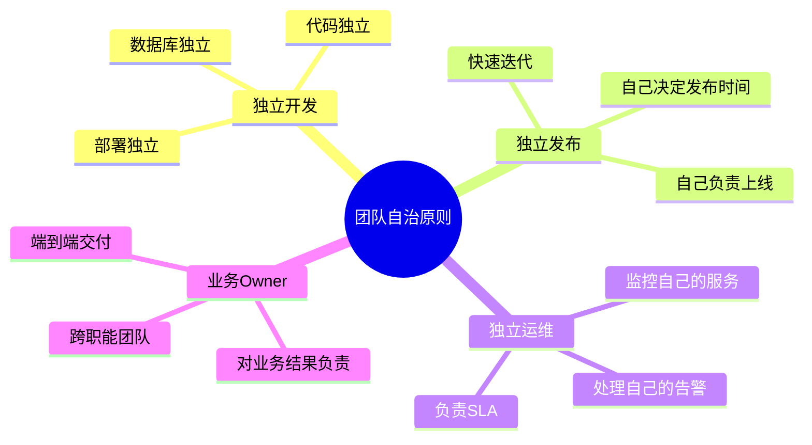

**案例：两个团队的职责划分**

```
┌─────────────────────────────────────────────────────────────┐
│                      电商平台组织架构                        │
├─────────────────────────────────────────────────────────────┤
│                                                             │
│   ┌─────────────────┐    ┌─────────────────┐               │
│   │   交易团队     │    │   商品团队       │               │
│   │                 │    │                 │               │
│   │ - 订单服务     │    │ - 商品服务      │               │
│   │ - 支付服务     │    │ - 搜索服务      │               │
│   │ - 促销服务     │    │ - 推荐服务      │               │
│   │                 │    │ - 库存服务      │               │
│   │ 负责 GMV 指标  │    │ 负责转化率指标  │               │
│   └─────────────────┘    └─────────────────┘               │
│                                                             │
└─────────────────────────────────────────────────────────────┘
```

---

## 2.6 拆分粒度如何确定

拆分粒度是微服务设计中最核心的问题之一。粒度过粗会导致单体回归，粒度过细会导致复杂度爆炸。

### 6.1 粒度评估矩阵

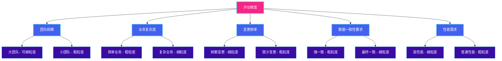

### 6.2 粒度权衡

```
┌────────────────────────────────────────────────────────────────┐
│                    粒度权衡示意图                               │
├────────────────────────────────────────────────────────────────┤
│                                                                │
│   细粒度 ◄──────────────────────────────► 粗粒度               │
│                                                                │
│   ┌─────────────┐                    ┌─────────────┐          │
│   │ 优点        │                    │ 优点         │          │
│   │ - 独立扩展  │                    │ - 简单      │          │
│   │ - 故障隔离  │                    │ - 少服务调用│          │
│   │ - 技术多样  │                    │ - 事务简单  │          │
│   │ - 独立部署  │                    │ - 易于理解  │          │
│   └─────────────┘                    └─────────────┘          │
│   ┌─────────────┐                    ┌─────────────┐          │
│   │ 缺点        │                    │ 缺点         │          │
│   │ - 服务数量多│                    │ - 耦合严重  │          │
│   │ - 调用链复杂│                    │ - 扩展困难  │          │
│   │ - 事务困难  │                    │ - 团队冲突  │          │
│   │ - 运维复杂  │                    │ - 技术锁定  │          │
│   └─────────────┘                    └─────────────┘          │
│                                                                │
│                      ▲ 最佳平衡点                              │
└────────────────────────────────────────────────────────────────┘
```

### 6.3 实用的粒度判断法则

**1. 两Pizza法则**
一个服务团队应该能用两个Pizza喂饱，即团队规模控制在6-10人。如果某个服务需要更大的团队，说明粒度过粗。

**2. 独立部署法则**
如果两个功能不能独立部署，就不应该分成两个服务。

**3. 领域边界法则**
如果两个领域概念频繁互相引用，考虑合并。

**4. 数据库边界法则**
如果两个服务需要频繁访问同一张数据库表，考虑合并。

### 6.4 渐进式拆分策略

```mermaid
graph LR
    A["单体应用"] --> B["模块化单体"]
    B --> C["初选服务拆分"]
    C --> D["渐进深化拆分"]
    D --> E["持续优化"]

    B -->|"按业务模块划分"| M1["模块1"]
    B -->|"按业务模块划分"| M2["模块2"]
    B -->|"按业务模块划分"| M3["模块3"]

    C -->|"提取高频变更"| S1["服务A"]
    C -->|"提取核心业务"| S2["服务B"]
    C -->|"提取通用功能"| S3["服务C"]

    classDef phase fill:#1a1a2e,stroke:#4cc9f0,stroke-width:2px
    classDef node1 fill:#e74c3c,stroke:#4cc9f0,color:#ffffff,stroke-width:2px
    classDef node2 fill:#f39c12,stroke:#4cc9f0,color:#1a1a2e,stroke-width:2px
    classDef node3 fill:#3498db,stroke:#4cc9f0,color:#ffffff,stroke-width:2px
    classDef node4 fill:#2ecc71,stroke:#4cc9f0,color:#ffffff,stroke-width:2px
    classDef node5 fill:#9b59b6,stroke:#4cc9f0,color:#ffffff,stroke-width:2px
    classDef subNode fill:#3a0ca3,stroke:#4cc9f0,color:#ffffff,stroke-width:1px
    classDef arrow stroke:#4cc9f0,stroke-width:2px
    class A node1
    class B node2
    class C node3
    class D node4
    class E node5
    class M1,M2,M3,S1,S2,S3 subNode
```

**拆分步骤：**

1. **从模块化单体开始**：先将单体内部划分为清晰的模块
2. **提取独立的模块**：将明确独立的部分先拆分出来
3. **渐进式深化**：随着对业务的深入理解，逐步细化拆分
4. **持续优化**：根据运行情况不断调整

---

## 2.7 案例：电商系统服务拆分

### 7.1 业务背景

假设我们需要为一个中型电商平台设计微服务架构。该平台需要支持以下核心功能：
- 用户管理（注册、登录、权限）
- 商品管理（商品上架、搜索、库存）
- 订单处理（下单、支付、物流）
- 营销活动（促销、优惠券、积分）

### 7.2 DDD领域模型

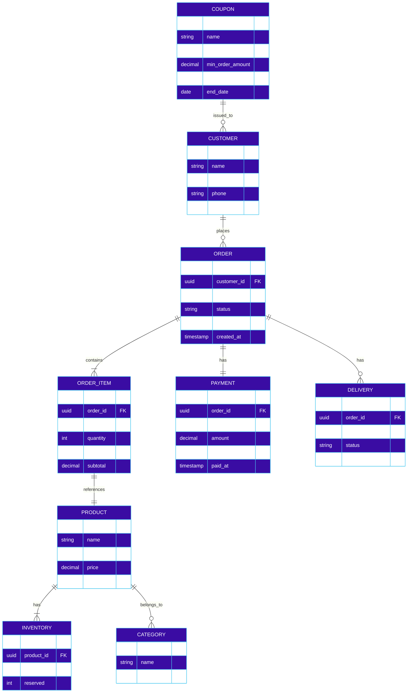

### 7.3 服务拆分方案

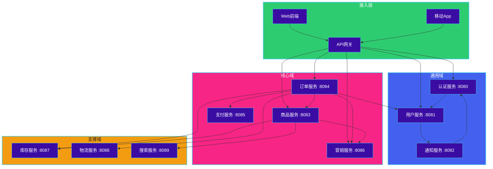

### 7.4 服务详细设计

#### 7.4.1 订单服务完整实现（Go）

```go
// order-service/main.go
package main

import (
    "context"
    "log"
    "order-service/adapter/grpc"
    "order-service/adapter/kafka"
    "order-service/adapter/rest"
    "order-service/application"
    "order-service/domain/repository"
    "order-service/infrastructure/persistence"
)

func main() {
    ctx := context.Background()

    // 初始化基础设施
    orderRepo, err := persistence.NewOrderRepository()
    if err != nil {
        log.Fatalf("Failed to create order repository: %v", err)
    }

    // 初始化应用服务
    orderSvc := application.NewOrderService(orderRepo)

    // 初始化适配器
    orderHandler := rest.NewOrderHandler(orderSvc)
    grpcServer := grpc.NewOrderGrpcServer(orderSvc)
    eventPublisher := kafka.NewEventPublisher()

    // 启动服务
    go func() {
        if err := rest.StartServer(orderHandler, ":8084"); err != nil {
            log.Fatalf("Failed to start REST server: %v", err)
        }
    }()

    go func() {
        if err := grpc.StartServer(grpcServer, ":9084"); err != nil {
            log.Fatalf("Failed to start gRPC server: %v", err)
        }
    }()

    // 订阅领域事件
    go kafka.SubscribeOrderEvents(ctx, eventPublisher)

    log.Println("Order service started")

    // 阻塞主进程
    <-ctx.Done()
}
```

```go
// order-service/domain/order_aggregate.go
package domain

import (
    "errors"
    "order-service/domain/event"
    "time"

    "github.com/google/uuid"
)

var (
    ErrInvalidQuantity   = errors.New("quantity must be greater than 0")
    ErrOrderNotFound     = errors.New("order not found")
    ErrInvalidOrderState = errors.New("invalid order state for this operation")
    ErrInsufficientStock = errors.New("insufficient stock")
    ErrEmptyOrder        = errors.New("order must have at least one item")
)

type OrderStatus string

const (
    OrderStatusPending   OrderStatus = "PENDING"
    OrderStatusPaid      OrderStatus = "PAID"
    OrderStatusProcessing OrderStatus = "PROCESSING"
    OrderStatusShipped   OrderStatus = "SHIPPED"
    OrderStatusDelivered OrderStatus = "DELIVERED"
    OrderStatusCancelled OrderStatus = "CANCELLED"
)

type Order struct {
    orderID      string
    customerID   string
    items        []*OrderItem
    totalAmount  Money
    status       OrderStatus
    shippingAddr *Address
    createdAt    time.Time
    updatedAt    time.Time
    domainEvents []event.DomainEvent
}

func NewOrder(customerID string, shippingAddr *Address) *Order {
    return &Order{
        orderID:      uuid.New().String(),
        customerID:   customerID,
        items:        make([]*OrderItem, 0),
        totalAmount:  ZeroMoney(),
        status:       OrderStatusPending,
        shippingAddr: shippingAddr,
        createdAt:    time.Now(),
        updatedAt:    time.Now(),
        domainEvents: make([]event.DomainEvent, 0),
    }
}

func (o *Order) AddItem(productID, productName string, unitPrice Money, quantity int) error {
    if quantity <= 0 {
        return ErrInvalidQuantity
    }

    for _, item := range o.items {
        if item.ProductID == productID {
            item.Quantity += quantity
            item.Subtotal = item.UnitPrice.Mul(int64(item.Quantity))
            o.recalculateTotal()
            return nil
        }
    }

    item := &OrderItem{
        ItemID:      uuid.New().String(),
        ProductID:   productID,
        ProductName: productName,
        UnitPrice:   unitPrice,
        Quantity:    quantity,
        Subtotal:    unitPrice.Mul(int64(quantity)),
    }
    o.items = append(o.items, item)
    o.recalculateTotal()
    return nil
}

func (o *Order) Submit() error {
    if len(o.items) == 0 {
        return ErrEmptyOrder
    }
    if o.status != OrderStatusPending {
        return ErrInvalidOrderState
    }

    o.status = OrderStatusProcessing
    o.updatedAt = time.Now()

    o.domainEvents = append(o.domainEvents, event.NewOrderSubmittedEvent(
        o.orderID,
        o.customerID,
        o.totalAmount,
    ))

    return nil
}

func (o *Order) Pay(paymentID string, amount Money) error {
    if o.status != OrderStatusProcessing {
        return ErrInvalidOrderState
    }
    if !amount.Equals(o.totalAmount) {
        return errors.New("payment amount does not match order total")
    }

    o.status = OrderStatusPaid
    o.updatedAt = time.Now()

    o.domainEvents = append(o.domainEvents, event.NewOrderPaidEvent(
        o.orderID,
        paymentID,
        amount,
    ))

    return nil
}

func (o *Order) Cancel() error {
    if o.status == OrderStatusShipped || o.status == OrderStatusDelivered {
        return ErrInvalidOrderState
    }

    o.status = OrderStatusCancelled
    o.updatedAt = time.Now()

    o.domainEvents = append(o.domainEvents, event.NewOrderCancelledEvent(o.orderID))

    return nil
}

func (o *Order) GetEvents() []event.DomainEvent {
    events := o.domainEvents
    o.domainEvents = make([]event.DomainEvent, 0)
    return events
}

func (o *Order) GetID() string {
    return o.orderID
}

func (o *Order) GetCustomerID() string {
    return o.customerID
}

func (o *Order) GetStatus() OrderStatus {
    return o.status
}

func (o *Order) GetTotalAmount() Money {
    return o.totalAmount
}

func (o *Order) GetItems() []*OrderItem {
    items := make([]*OrderItem, len(o.items))
    copy(items, o.items)
    return items
}

func (o *Order) recalculateTotal() {
    total := ZeroMoney()
    for _, item := range o.items {
        total = total.Add(item.Subtotal)
    }
    o.totalAmount = total
}

// 重建订单（用于从数据库恢复）
func RebuildOrder(
    orderID, customerID string,
    items []*OrderItem,
    totalAmount Money,
    status OrderStatus,
    shippingAddr *Address,
    createdAt, updatedAt time.Time,
) *Order {
    return &Order{
        orderID:      orderID,
        customerID:   customerID,
        items:        items,
        totalAmount:  totalAmount,
        status:       status,
        shippingAddr: shippingAddr,
        createdAt:    createdAt,
        updatedAt:    updatedAt,
        domainEvents: make([]event.DomainEvent, 0),
    }
}
```

```go
// order-service/domain/order_item.go
package domain

type OrderItem struct {
    ItemID      string
    ProductID   string
    ProductName string
    UnitPrice   Money
    Quantity    int
    Subtotal    Money
}
```

```go
// order-service/domain/address.go
package domain

type Address struct {
    Province string
    City     string
    District string
    Street   string
    ZipCode  string
    Receiver string
    Phone    string
}
```

```go
// order-service/domain/money.go
package domain

type Money struct {
    amount   int64
    currency string
}

func NewMoney(amount int64, currency string) Money {
    return Money{amount: amount, currency: currency}
}

func ParseMoney(amount float64, currency string) Money {
    return Money{amount: int64(amount * 100), currency: currency}
}

func ZeroMoney() Money {
    return Money{amount: 0, currency: "CNY"}
}

func (m Money) Mul(multiplier int) Money {
    return Money{amount: m.amount * int64(multiplier), currency: m.currency}
}

func (m Money) Add(other Money) Money {
    if m.currency != other.currency {
        panic("currency mismatch")
    }
    return Money{amount: m.amount + other.amount, currency: m.currency}
}

func (m Money) Equals(other Money) bool {
    return m.amount == other.amount && m.currency == other.currency
}

func (m Money) GreaterThan(other Money) bool {
    if m.currency != other.currency {
        panic("currency mismatch")
    }
    return m.amount > other.amount
}

func (m Money) ToFloat64() float64 {
    return float64(m.amount) / 100.0
}
```

```go
// order-service/domain/event/order_events.go
package event

import (
    "order-service/domain"
    "time"
)

type DomainEvent interface {
    GetEventType() string
    GetOccurredAt() time.Time
}

type OrderSubmittedEvent struct {
    orderID    string
    customerID string
    totalAmount domain.Money
    occurredAt  time.Time
}

func NewOrderSubmittedEvent(orderID, customerID string, totalAmount domain.Money) *OrderSubmittedEvent {
    return &OrderSubmittedEvent{
        orderID:    orderID,
        customerID: customerID,
        totalAmount: totalAmount,
        occurredAt: time.Now(),
    }
}

func (e *OrderSubmittedEvent) GetEventType() string {
    return "OrderSubmitted"
}

func (e *OrderSubmittedEvent) GetOccurredAt() time.Time {
    return e.occurredAt
}

func (e *OrderSubmittedEvent) GetOrderID() string {
    return e.orderID
}

func (e *OrderSubmittedEvent) GetCustomerID() string {
    return e.customerID
}

type OrderPaidEvent struct {
    orderID   string
    paymentID string
    amount    domain.Money
    occurredAt time.Time
}

func NewOrderPaidEvent(orderID, paymentID string, amount domain.Money) *OrderPaidEvent {
    return &OrderPaidEvent{
        orderID:   orderID,
        paymentID: paymentID,
        amount:    amount,
        occurredAt: time.Now(),
    }
}

func (e *OrderPaidEvent) GetEventType() string {
    return "OrderPaid"
}

func (e *OrderPaidEvent) GetOccurredAt() time.Time {
    return e.occurredAt
}

type OrderCancelledEvent struct {
    orderID    string
    occurredAt time.Time
}

func NewOrderCancelledEvent(orderID string) *OrderCancelledEvent {
    return &OrderCancelledEvent{
        orderID:   orderID,
        occurredAt: time.Now(),
    }
}

func (e *OrderCancelledEvent) GetEventType() string {
    return "OrderCancelled"
}

func (e *OrderCancelledEvent) GetOccurredAt() time.Time {
    return e.occurredAt
}
```

```go
// order-service/domain/repository/order_repository.go
package repository

import "order-service/domain"

type OrderRepository interface {
    Save(order *domain.Order) error
    FindByID(id string) (*domain.Order, error)
    FindByCustomerID(customerID string) ([]*domain.Order, error)
    Update(order *domain.Order) error
}
```

```go
// order-service/application/order_service.go
package application

import (
    "order-service/domain"
    "order-service/domain/event"
    "order-service/domain/repository"
    "order-service/infrastructure messaging"
)

type OrderService struct {
    repo           repository.OrderRepository
    eventPublisher messaging.EventPublisher
}

func NewOrderService(repo repository.OrderRepository) *OrderService {
    return &OrderService{
        repo:           repo,
        eventPublisher: messaging.NewEventPublisher(),
    }
}

type CreateOrderRequest struct {
    CustomerID   string
    ShippingAddr *domain.Address
    Items        []OrderItemRequest
}

type OrderItemRequest struct {
    ProductID   string
    ProductName string
    UnitPrice   domain.Money
    Quantity    int
}

type CreateOrderResponse struct {
    OrderID string
}

func (s *OrderService) CreateOrder(req *CreateOrderRequest) (*CreateOrderResponse, error) {
    order := domain.NewOrder(req.CustomerID, req.ShippingAddr)

    for _, item := range req.Items {
        err := order.AddItem(item.ProductID, item.ProductName, item.UnitPrice, item.Quantity)
        if err != nil {
            return nil, err
        }
    }

    err := s.repo.Save(order)
    if err != nil {
        return nil, err
    }

    // 发布领域事件
    for _, evt := range order.GetEvents() {
        s.eventPublisher.Publish(evt)
    }

    return &CreateOrderResponse{OrderID: order.GetID()}, nil
}

type SubmitOrderRequest struct {
    OrderID string
}

func (s *OrderService) SubmitOrder(req *SubmitOrderRequest) error {
    order, err := s.repo.FindByID(req.OrderID)
    if err != nil {
        return err
    }

    err = order.Submit()
    if err != nil {
        return err
    }

    err = s.repo.Update(order)
    if err != nil {
        return err
    }

    for _, evt := range order.GetEvents() {
        s.eventPublisher.Publish(evt)
    }

    return nil
}

type PayOrderRequest struct {
    OrderID   string
    PaymentID string
    Amount    domain.Money
}

func (s *OrderService) PayOrder(req *PayOrderRequest) error {
    order, err := s.repo.FindByID(req.OrderID)
    if err != nil {
        return err
    }

    err = order.Pay(req.PaymentID, req.Amount)
    if err != nil {
        return err
    }

    err = s.repo.Update(order)
    if err != nil {
        return err
    }

    for _, evt := range order.GetEvents() {
        s.eventPublisher.Publish(evt)
    }

    return nil
}

type CancelOrderRequest struct {
    OrderID string
}

func (s *OrderService) CancelOrder(req *CancelOrderRequest) error {
    order, err := s.repo.FindByID(req.OrderID)
    if err != nil {
        return err
    }

    err = order.Cancel()
    if err != nil {
        return err
    }

    err = s.repo.Update(order)
    if err != nil {
        return err
    }

    for _, evt := range order.GetEvents() {
        s.eventPublisher.Publish(evt)
    }

    return nil
}

func (s *OrderService) GetOrder(orderID string) (*domain.Order, error) {
    return s.repo.FindByID(orderID)
}
```

```go
// order-service/infrastructure/messaging/event_publisher.go
package messaging

import (
    "encoding/json"
    "log"
    "order-service/domain/event"
)

type EventPublisher interface {
    Publish(event event.DomainEvent) error
}

type KafkaPublisher struct {
    // Kafka producer
}

func NewEventPublisher() *KafkaPublisher {
    return &KafkaPublisher{}
}

func (p *KafkaPublisher) Publish(evt event.DomainEvent) error {
    data, err := json.Marshal(evt)
    if err != nil {
        return err
    }

    log.Printf("Publishing event: %s, data: %s", evt.GetEventType(), string(data))

    // 实际发送到 Kafka
    // producer.SendMessage("order-events", evt.GetEventType(), data)

    return nil
}
```

```go
// order-service/adapter/rest/handler.go
package rest

import (
    "net/http"
    "order-service/application"
    "order-service/domain"

    "github.com/gin-gonic/gin"
)

type OrderHandler struct {
    service *application.OrderService
}

func NewOrderHandler(service *application.OrderService) *OrderHandler {
    return &OrderHandler{service: service}
}

type CreateOrderRequest struct {
    CustomerID   string                  `json:"customer_id"`
    ShippingAddr *AddressDTO             `json:"shipping_addr"`
    Items        []OrderItemRequestDTO   `json:"items"`
}

type AddressDTO struct {
    Province string `json:"province"`
    City     string `json:"city"`
    District string `json:"district"`
    Street   string `json:"street"`
    ZipCode  string `json:"zip_code"`
    Receiver string `json:"receiver"`
    Phone    string `json:"phone"`
}

type OrderItemRequestDTO struct {
    ProductID   string  `json:"product_id"`
    ProductName string  `json:"product_name"`
    UnitPrice   float64 `json:"unit_price"`
    Quantity    int     `json:"quantity"`
}

func (h *OrderHandler) CreateOrder(c *gin.Context) {
    var req CreateOrderRequest
    if err := c.ShouldBindJSON(&req); err != nil {
        c.JSON(http.StatusBadRequest, gin.H{"error": err.Error()})
        return
    }

    items := make([]application.OrderItemRequest, len(req.Items))
    for i, item := range req.Items {
        items[i] = application.OrderItemRequest{
            ProductID:   item.ProductID,
            ProductName: item.ProductName,
            UnitPrice:   domain.ParseMoney(item.UnitPrice, "CNY"),
            Quantity:    item.Quantity,
        }
    }

    resp, err := h.service.CreateOrder(&application.CreateOrderRequest{
        CustomerID:   req.CustomerID,
        ShippingAddr: toAddressDomain(req.ShippingAddr),
        Items:        items,
    })

    if err != nil {
        c.JSON(http.StatusInternalServerError, gin.H{"error": err.Error()})
        return
    }

    c.JSON(http.StatusCreated, resp)
}

func toAddressDomain(dto *AddressDTO) *domain.Address {
    if dto == nil {
        return nil
    }
    return &domain.Address{
        Province: dto.Province,
        City:     dto.City,
        District: dto.District,
        Street:   dto.Street,
        ZipCode:  dto.ZipCode,
        Receiver: dto.Receiver,
        Phone:    dto.Phone,
    }
}
```

### 7.5 服务间通信设计

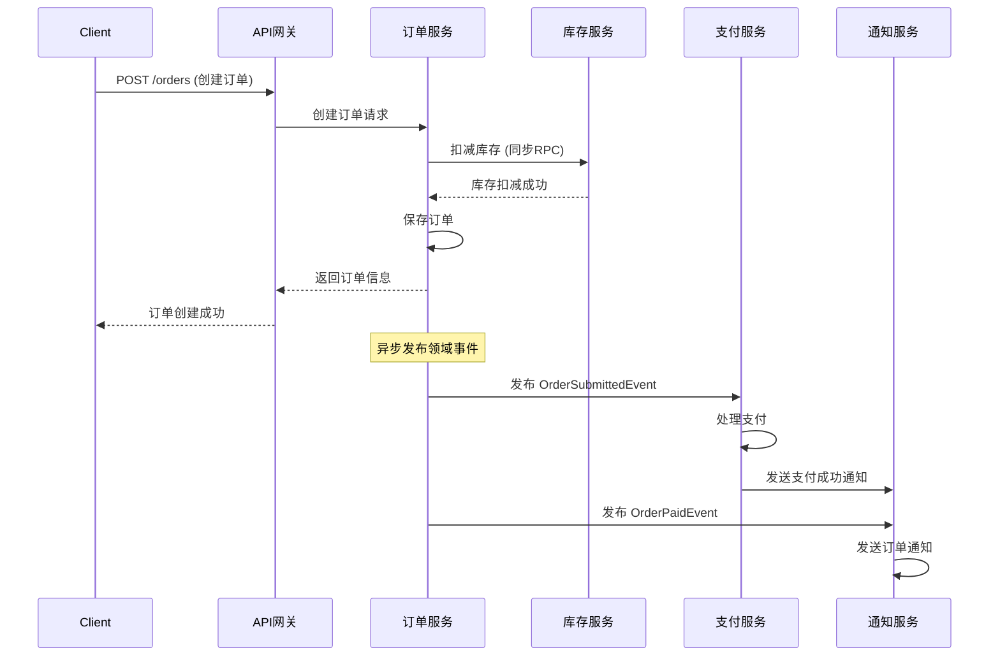

### 7.6 数据库设计

每个服务拥有独立的数据库，实现数据库隔离：

```mermaid
graph TB
    subgraph order_db["订单数据库"]
        OT1["orders表"]
        OT2["order_items表"]
        OT3["payments表"]
    end

    subgraph product_db["商品数据库"]
        PT1["products表"]
        PT2["categories表"]
    end

    subgraph inventory_db["库存数据库"]
        IT1["inventories表"]
        IT2["warehouse_stocks表"]
    end

    subgraph user_db["用户数据库"]
        UT1["users表"]
        UT2["addresses表"]
    end

    subgraph marketing_db["营销数据库"]
        MT1["coupons表"]
        MT2["promotions表"]
    end

    classDef database fill:#1a1a2e,stroke:#4361ee,stroke-width:2px
    classDef table fill:#3a0ca3,stroke:#4cc9f0,color:#ffffff,stroke-width:1px
    class order_db,product_db,inventory_db,user_db,marketing_db database
    class OT1,OT2,OT3,PT1,PT2,IT1,IT2,UT1,UT2,MT1,MT2 table
```

---

## 本章小结

1. **服务拆分的重要性**：微服务拆分是解决单体架构问题的关键手段，可以提升系统的可扩展性、可维护性和团队协作效率。

2. **DDD核心概念**：
   - 领域是整个业务知识体系，子域是领域的细分
   - 界限上下文定义了领域模型的边界
   - 实体有唯一标识，值对象无标识且不可变
   - 聚合是一致性边界，聚合根是访问的入口

3. **拆分策略**：
   - 按业务能力拆分：符合组织结构，易于理解
   - 按子域拆分：更符合DDD方法论，强调业务内聚

4. **拆分原则**：
   - 单一职责：每个服务只负责一件事
   - 高内聚低耦合：相关功能放一起，服务间依赖最小化
   - 团队自治：服务划分应匹配团队结构

5. **拆分粒度**：需要权衡服务数量和复杂度，遵循渐进式拆分策略

6. **电商案例**：展示了从领域建模到服务拆分再到代码实现的完整过程

---

## 思考题

1. **边界问题**：在实际项目中，如何判断两个业务概念是否应该属于同一个界限上下文？请举例说明。

2. **聚合设计**：假设在电商系统中，订单和优惠券都需要验证用户等级。订单聚合和优惠券聚合之间应该如何建立关系？直接引用还是通过领域服务？

3. **拆分时机**：一个业务功能刚开始比较简单，但预期未来会变得复杂。应该如何决定是现在就拆分还是先放在现有服务中？

4. **团队冲突**：如果两个团队对某个服务应该属于谁有争议，应该如何解决？

5. **粒度判断**：一个"用户服务"包含了用户注册、登录、权限、积分等功能。请分析这种设计的优缺点，以及在什么情况下应该进一步拆分。

6. **数据一致性**：当订单服务扣减库存成功后，订单服务宕机导致订单创建失败，这种情况下如何保证数据一致性？

7. **渐进拆分**：假设你接手了一个大型单体系统，应该如何制定拆分计划？请描述具体的步骤和优先级判断标准。
