# 第四章：API网关

## 本章目录

- [4.1 API网关概述](#41-api网关概述)
  - [4.1.1 为什么需要API网关](#411-为什么需要api网关)
  - [4.1.2 API网关的定义](#412-api网关的定义)
- [4.2 API网关核心功能](#42-api网关核心功能)
  - [4.2.1 路由转发](#421-路由转发)
  - [4.2.2 请求聚合](#422-请求聚合)
  - [4.2.3 协议转换](#423-协议转换)
  - [4.2.4 认证授权](#424-认证授权)
  - [4.2.5 限流熔断](#425-限流熔断)
  - [4.2.6 日志监控](#426-日志监控)
- [4.3 主流API网关方案对比](#43-主流api网关方案对比)
- [4.4 API网关架构设计](#44-api网关架构设计)
  - [4.4.1 网关架构图](#441-网关架构图)
  - [4.4.2 请求处理流程](#442-请求处理流程)
- [4.5 网关配置示例](#45-网关配置示例)
  - [5.1 Spring Cloud Gateway配置](#51-spring-cloud-gateway配置)
  - [5.2 Kong网关配置](#52-kong网关配置)
- [4.6 认证授权实现](#46-认证授权实现)
  - [6.1 JWT Token实现](#61-jwt-token实现)
  - [6.2 OAuth2实现](#62-oauth2实现)
- [4.7 限流算法](#47-限流算法)
  - [7.1 令牌桶算法](#71-令牌桶算法)
  - [7.2 滑动窗口算法](#72-滑动窗口算法)
  - [7.3 漏桶算法](#73-漏桶算法)
- [4.8 熔断器模式](#48-熔断器模式)
  - [8.1 熔断器原理](#81-熔断器原理)
  - [8.2 熔断器实现](#82-熔断器实现)
- [本章小结](#本章小结)
- [思考题](#思考题)

---

## 4.1 API网关概述

### 4.1.1 为什么需要API网关

在微服务架构中，系统被拆分为多个独立的服务，每个服务暴露自己的API。当客户端（Web前端、移动端、第三方应用）需要访问这些服务时，会面临以下问题：


**没有API网关时的问题：**

| 问题类型 | 具体表现 |
|---------|---------|
| **客户端复杂度** | 客户端需要知道所有服务地址，调用逻辑复杂 |
| **跨横切关注点** | 每个服务都需要重复实现认证、限流、日志等功能 |
| **协议差异** | 不同服务可能使用不同协议（REST/gRPC/WebSocket） |
| **安全威胁** | 直接暴露服务地址，增加被攻击风险 |
| **难以监控** | 缺少统一的请求入口，难以进行全局监控 |

**API网关的价值：**

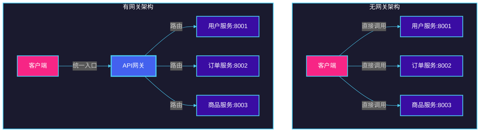

### 4.1.2 API网关的定义

**API网关**是系统的单一入口点，负责处理所有进入的请求。它就像一个"门卫"，所有客户端请求都必须经过API网关，由网关统一处理后再转发到相应的后端服务。

**核心职责：**
- 路由转发：根据请求路径、参数等条件，将请求路由到相应的后端服务
- 协议转换：支持不同协议之间的转换（如HTTP → gRPC）
- 认证授权：验证用户身份，检查访问权限
- 限流熔断：保护后端服务免受过载影响
- 日志监控：记录请求日志，提供监控指标
- 请求聚合：将多个微服务调用聚合成一次客户端请求

---

## 4.2 API网关核心功能

### 4.2.1 路由转发

路由转发是API网关最基本的功能，根据请求的特征（路径、头信息、参数等）将请求路由到对应的后端服务。

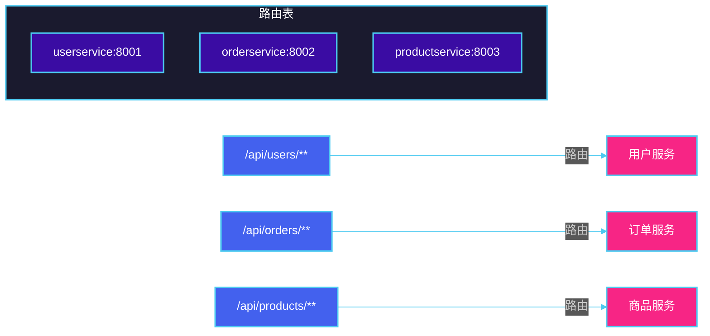

**路由规则示例：**

```yaml
# Spring Cloud Gateway 路由配置
spring:
  cloud:
    gateway:
      routes:
        - id: user-service
          uri: http://userservice:8001
          predicates:
            - Path=/api/users/**
          filters:
            - StripPrefix=1

        - id: order-service
          uri: http://orderservice:8002
          predicates:
            - Path=/api/orders/**
          filters:
            - StripPrefix=1

        - id: product-service
          uri: http://productservice:8003
          predicates:
            - Path=/api/products/**
          filters:
            - StripPrefix=1
```

### 4.2.2 请求聚合

请求聚合允许客户端通过一次调用获取多个服务的数据，减少网络往返次数。

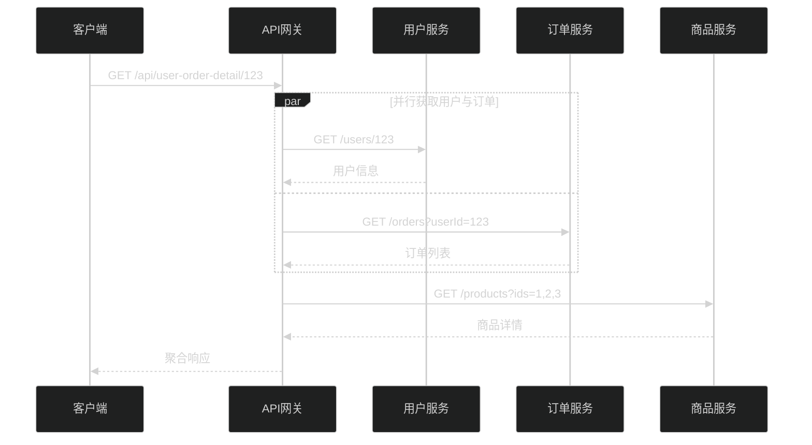

**聚合查询示例：**

```java
@RestController
@RequestMapping("/api/aggregations")
public class AggregationController {

    @Autowired
    private RestTemplate restTemplate;

    @GetMapping("/user-order-detail/{userId}")
    public AggregationResult getUserOrderDetail(@PathVariable Long userId) {
        // 并行调用多个服务
        CompletableFuture<User> userFuture = CompletableFuture.supplyAsync(() ->
            restTemplate.getForObject("http://user-service/users/" + userId, User.class));

        CompletableFuture<List<Order>> ordersFuture = CompletableFuture.supplyAsync(() ->
            restTemplate.getForObject("http://order-service/orders?userId=" + userId, List.class));

        // 等待所有结果
        CompletableFuture.allOf(userFuture, ordersFuture).join();

        return new AggregationResult(userFuture.get(), ordersFuture.get());
    }
}
```

### 4.2.3 协议转换

API网关支持不同协议之间的转换，使得使用不同技术的客户端和服务可以相互通信。

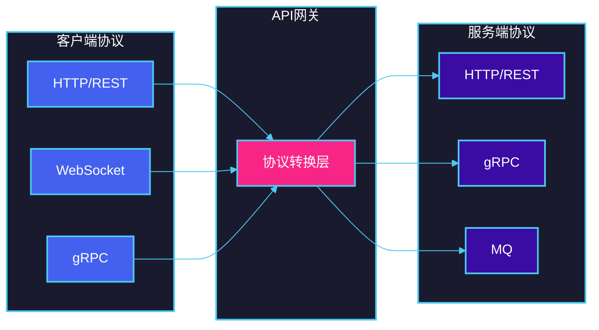

**常见协议转换场景：**

| 场景 | 客户端协议 | 服务端协议 |
|-----|----------|-----------|
| REST转gRPC | HTTP/JSON | gRPC/Protobuf |
| HTTP转WebSocket | HTTP | WebSocket |
| 同步转异步 | HTTP | MQ |

### 4.2.4 认证授权

认证授权是API网关的重要安全功能，确保只有合法用户才能访问受保护的资源。

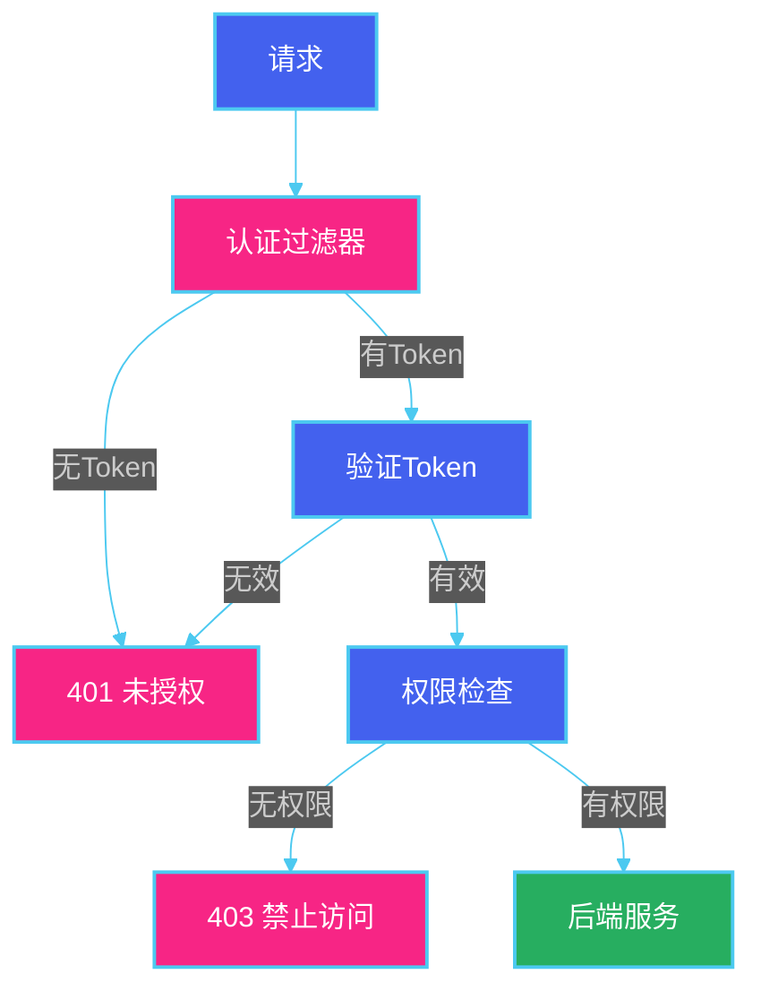

### 4.2.5 限流熔断

限流和熔断是保护系统稳定性的重要机制。

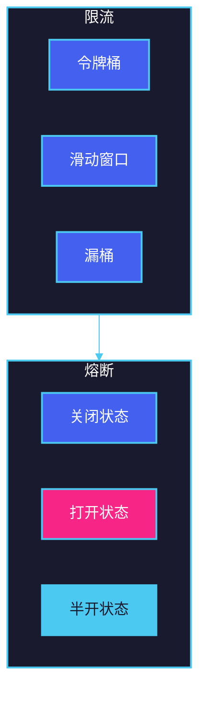

### 4.2.6 日志监控

API网关作为统一入口，是实现日志收集和监控的最佳位置。

**监控指标：**

| 指标类型 | 说明 | 示例 |
|---------|-----|------|
| 请求量 | 单位时间内的请求数 | QPS、TPS |
| 响应时间 | 请求处理耗时 | P50、P99延迟 |
| 错误率 | 失败请求占比 | 5xx错误率 |
| 流量分布 | 各服务的请求分布 | 按路由统计 |

---

## 4.3 主流API网关方案对比

| 特性 | Kong | Nginx | Spring Cloud Gateway | Envoy |
|-----|------|-------|---------------------|-------|
| **开发语言** | Lua/Go | C | Java | C++ |
| **配置方式** | REST API/Declarative | nginx.conf | YAML/Java | YAML/JSON |
| **动态配置** | 支持 | 需reload | 支持 | 支持 |
| **插件生态** | 丰富 | 一般 | 一般 | 一般 |
| **服务发现** | 支持 | 需集成 | Eureka/Consul | xDS API |
| **限流功能** | 内置 | 需模块 | 内置 | 需扩展 |
| **熔断支持** | 需插件 | 需模块 | Resilience4j | 内置 |
| **可观测性** | Prometheus等 | Prometheus | Micrometer | StatsD/Prometheus |
| **学习曲线** | 中等 | 陡峭 | 低 | 中等 |
| **适用场景** | 通用网关 | 负载均衡 | Spring生态 | Service Mesh |

**方案选型建议：**

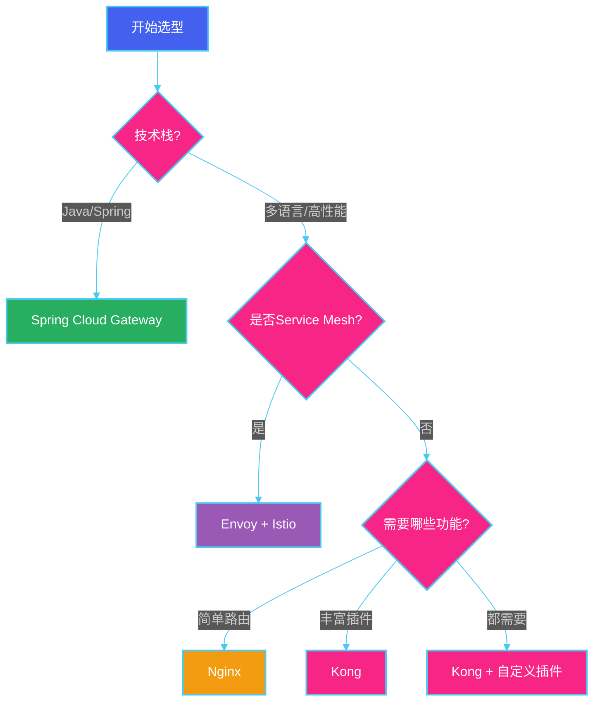

---

## 4.4 API网关架构设计

### 4.4.1 网关架构图

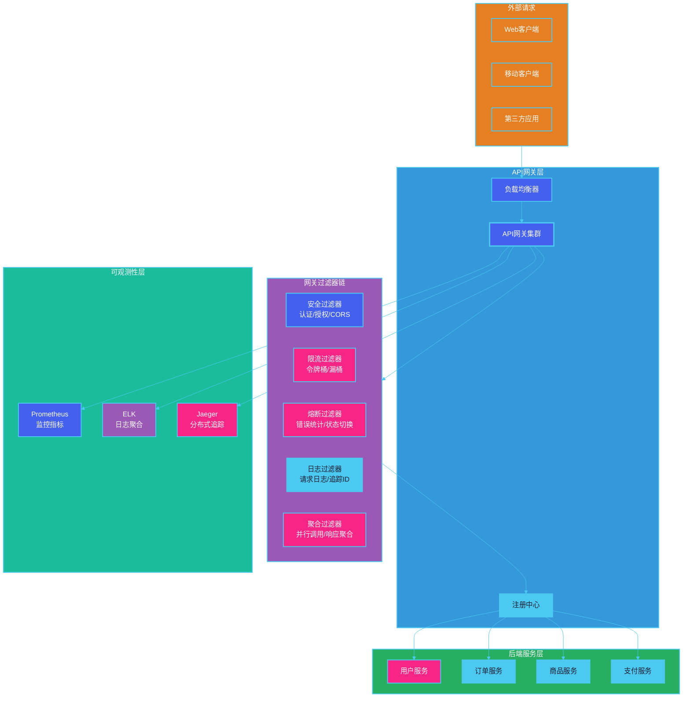

### 4.4.2 请求处理流程


---

## 4.5 网关配置示例

### 4.5.1 Spring Cloud Gateway配置

**完整配置文件：**

```yaml
# application.yml
server:
  port: 8080

spring:
  application:
    name: api-gateway

  cloud:
    gateway:
      # 全局跨域配置
      globalcors:
        cors-configurations:
          '[/**]':
            allowedOrigins: "*"
            allowedMethods:
              - GET
              - POST
              - PUT
              - DELETE
            allowedHeaders: "*"
            allowCredentials: true
            maxAge: 3600

      # 默认过滤器（对所有路由生效）
      default-filters:
        - name: RequestLogFilter
        - name: ResponseTimeFilter

      # 路由配置
      routes:
        # 用户服务
        - id: user-service
          uri: http://user-service:8001
          predicates:
            - Path=/api/users/**
            - Method=GET,POST
            - Header=X-Request-Id, \d+
          filters:
            - name: StripPrefix
              args:
                parts: 1
            - name: name=AuthFilter
            - name: RequestRateLimiter
              args:
                redis-repository: redisRateLimiter
                burst-capacity: 100
                requested-revenue: 10

        # 订单服务
        - id: order-service
          uri: http://order-service:8002
          predicates:
            - Path=/api/orders/**
          filters:
            - StripPrefix=1
            - name: CircuitBreaker
              args:
                name: orderCircuitBreaker
                fallbackUri: forward:/fallback/order

        # 商品服务（支持重试）
        - id: product-service
          uri: http://product-service:8003
          predicates:
            - Path=/api/products/**
          filters:
            - StripPrefix=1
            - name: Retry
              args:
                retries: 3
                statuses: BAD_GATEWAY,INTERNAL_SERVER_ERROR
                methods: GET
                backoff:
                  firstInterval: 100
                  maxInterval: 500
                  factor: 2

# Redis限流配置
spring.data.redis:
  host: localhost
  port: 6379
  password: redis123

#  Resilience4j 熔断配置
resilience4j:
  circuitbreaker:
    instances:
      orderCircuitBreaker:
        registerHealthIndicator: true
        slidingWindowSize: 10
        minimumNumberOfCalls: 5
        permittedNumberOfCallsInHalfOpenState: 3
        automaticTransitionFromOpenToHalfOpenEnabled: true
        waitDurationInOpenState: 5s
        failureRateThreshold: 50
        eventConsumerBufferSize: 10
```

### 4.5.2 Kong网关配置

**Declarative配置文件（kong.yml）：**

```yaml
# kong.yml

_format_version: "3.0"

# 服务定义
services:
  # 用户服务
  - name: user-service
    url: http://user-service:8001/api
    routes:
      - name: user-route
        paths:
          - /api/users
        methods:
          - GET
          - POST
          - PUT
          - DELETE
        strip_path: true
    plugins:
      - name: jwt
        config:
          key_claim_name: kid
          claims_to_verify:
            - exp
      - name: rate-limiting
        config:
          minute: 100
          policy: redis
          redis_host: localhost
          redis_port: 6379
          hide_client_headers: false
      - name: cors
        config:
          origins:
            - "*"
          methods:
            - GET
            - POST
            - PUT
            - DELETE
          headers:
            - Accept
            - Authorization
            - Content-Type
          credentials: true
          max_age: 3600
      - name: logging
        config:
          log_level: info

  # 订单服务
  - name: order-service
    url: http://order-service:8002/api
    routes:
      - name: order-route
        paths:
          - /api/orders
        strip_path: true
    plugins:
      - name: jwt
      - name: rate-limiting
        config:
          minute: 50
          policy: redis
      - name: circuit-breaker
        config:
          break_response_code: 503
          latency_threshold: 1000
          failure_ratio: 0.5

  # 商品服务（带聚合）
  - name: product-service
    url: http://product-service:8003/api
    routes:
      - name: product-route
        paths:
          - /api/products
        strip_path: true

# 消费者定义（用于认证）
consumers:
  - username: mobile-app
    jwt_secrets:
      - key: mobile-app-key
        algorithm: RS256
        rsa_public_key: |
          -----BEGIN PUBLIC KEY-----
          MIGfMA0GCSqGSIb3DQEBAQUAA4GNADCBiQKBgQC...
          -----END PUBLIC KEY-----

  - username: web-app
    jwt_secrets:
      - key: web-app-key
        algorithm: HS256
        secret: web-app-secret-key
```

---

## 4.6 认证授权实现

### 4.6.1 JWT Token实现

**JWT（JSON Web Token）结构：**

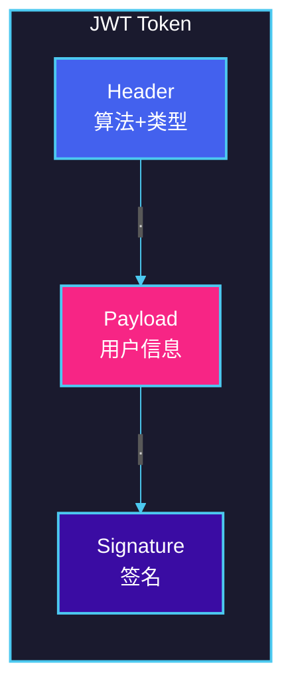

**JWT生成和验证流程：**

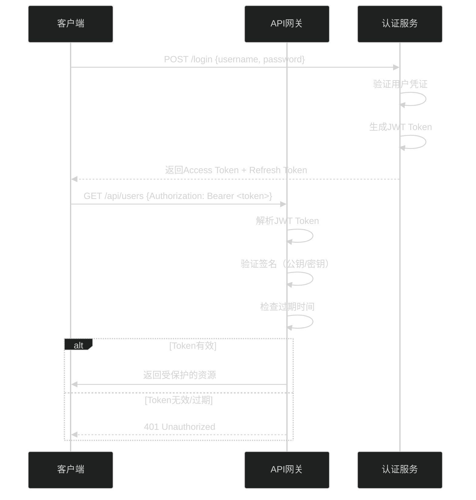

**JWT工具类实现：**

```java
import io.jsonwebtoken.*;
import io.jsonwebtoken.security.Keys;
import org.springframework.stereotype.Component;

import javax.crypto.SecretKey;
import java.nio.charset.StandardCharsets;
import java.util.Date;
import java.util.HashMap;
import java.util.Map;

@Component
public class JwtTokenProvider {

    // 配置中的密钥（生产环境应使用配置文件）
    private final String JWT_SECRET = "your-256-bit-secret-key-for-jwt-signing-must-be-long-enough";
    private final long JWT_EXPIRATION = 3600000; // 1小时
    private final long REFRESH_EXPIRATION = 604800000; // 7天

    private final SecretKey secretKey;

    public JwtTokenProvider() {
        this.secretKey = Keys.hmacShaKeyFor(JWT_SECRET.getBytes(StandardCharsets.UTF_8));
    }

    /**
     * 生成Access Token
     */
    public String generateAccessToken(Long userId, String username, String role) {
        Map<String, Object> claims = new HashMap<>();
        claims.put("userId", userId);
        claims.put("username", username);
        claims.put("role", role);
        claims.put("type", "access");

        Date now = new Date();
        Date expiryDate = new Date(now.getTime() + JWT_EXPIRATION);

        return Jwts.builder()
                .claims(claims)
                .subject(username)
                .issuedAt(now)
                .expiration(expiryDate)
                .signWith(secretKey)
                .compact();
    }

    /**
     * 生成Refresh Token
     */
    public String generateRefreshToken(Long userId) {
        Date now = new Date();
        Date expiryDate = new Date(now.getTime() + REFRESH_EXPIRATION);

        return Jwts.builder()
                .claim("userId", userId)
                .claim("type", "refresh")
                .subject(userId.toString())
                .issuedAt(now)
                .expiration(expiryDate)
                .signWith(secretKey)
                .compact();
    }

    /**
     * 验证Token
     */
    public boolean validateToken(String token) {
        try {
            Jwts.parser()
                .verifyWith(secretKey)
                .build()
                .parseSignedClaims(token);
            return true;
        } catch (JwtException | IllegalArgumentException e) {
            return false;
        }
    }

    /**
     * 从Token中获取用户信息
     */
    public Claims getClaims(String token) {
        return Jwts.parser()
                .verifyWith(secretKey)
                .build()
                .parseSignedClaims(token)
                .getPayload();
    }

    /**
     * 获取用户名
     */
    public String getUsername(String token) {
        return getClaims(token).getSubject();
    }

    /**
     * 获取用户ID
     */
    public Long getUserId(String token) {
        return getClaims(token).get("userId", Long.class);
    }

    /**
     * 获取用户角色
     */
    public String getRole(String token) {
        return getClaims(token).get("role", String.class);
    }

    /**
     * 检查Token类型
     */
    public boolean isAccessToken(String token) {
        String type = getClaims(token).get("type", String.class);
        return "access".equals(type);
    }

    /**
     * 判断Token是否过期
     */
    public boolean isTokenExpired(String token) {
        try {
            Date expiration = getClaims(token).getExpiration();
            return expiration.before(new Date());
        } catch (ExpiredJwtException e) {
            return true;
        }
    }
}
```

**JWT认证过滤器（Spring Cloud Gateway）：**

```java
@Component
@Slf4j
public class JwtAuthenticationFilter implements GlobalFilter, Ordered {

    private final JwtTokenProvider jwtTokenProvider;

    // 不需要认证的路径
    private static final List<String> WHITE_LIST = Arrays.asList(
        "/api/auth/login",
        "/api/auth/register",
        "/api/health"
    );

    public JwtAuthenticationFilter(JwtTokenProvider jwtTokenProvider) {
        this.jwtTokenProvider = jwtTokenProvider;
    }

    @Override
    public Mono<Void> filter(ServerWebExchange exchange, GatewayFilterChain chain) {
        String path = exchange.getRequest().getURI().getPath();

        // 白名单路径直接放行
        if (isWhiteListed(path)) {
            return chain.filter(exchange);
        }

        String token = extractToken(exchange);

        if (token == null) {
            return unauthorized(exchange, "Missing authentication token");
        }

        if (!jwtTokenProvider.validateToken(token)) {
            return unauthorized(exchange, "Invalid or expired token");
        }

        if (!jwtTokenProvider.isAccessToken(token)) {
            return unauthorized(exchange, "Invalid token type");
        }

        // 将用户信息添加到请求头
        ServerWebExchange modifiedExchange = addUserInfoToHeaders(exchange, token);

        return chain.filter(modifiedExchange);
    }

    private String extractToken(ServerWebExchange exchange) {
        String bearerToken = exchange.getRequest().getHeaders().getFirst("Authorization");
        if (bearerToken != null && bearerToken.startsWith("Bearer ")) {
            return bearerToken.substring(7);
        }
        return null;
    }

    private boolean isWhiteListed(String path) {
        return WHITE_LIST.stream().anyMatch(path::startsWith);
    }

    private Mono<Void> unauthorized(ServerWebExchange exchange, String message) {
        exchange.getResponse().setStatusCode(HttpStatus.UNAUTHORIZED);
        exchange.getResponse().getHeaders().setContentType(MediaType.APPLICATION_JSON);

        String body = String.format("{\"error\": \"Unauthorized\", \"message\": \"%s\"}", message);

        DataBuffer buffer = exchange.getResponse().bufferFactory().wrap(body.getBytes());
        return exchange.getResponse().writeWith(Flux.just(buffer));
    }

    private ServerWebExchange addUserInfoToHeaders(ServerWebExchange exchange, String token) {
        Claims claims = jwtTokenProvider.getClaims(token);

        String userId = claims.get("userId", Long.class).toString();
        String username = claims.getSubject();
        String role = claims.get("role", String.class);

        ServerHttpRequest mutatedRequest = exchange.getRequest().mutate()
                .header("X-User-Id", userId)
                .header("X-Username", username)
                .header("X-User-Role", role)
                .build();

        return exchange.mutate().request(mutatedRequest).build();
    }

    @Override
    public int getOrder() {
        return -100; // 优先级高，在其他过滤器之前执行
    }
}
```

### 4.6.2 OAuth2实现

**OAuth2授权流程：**

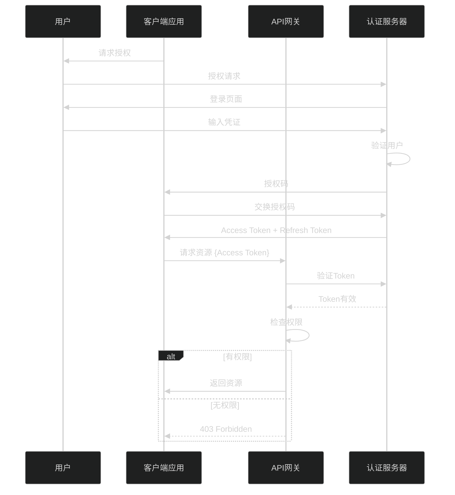

**OAuth2配置（Spring Security）：**

```java
@Configuration
@EnableWebFluxSecurity
public class SecurityConfig {

    @Bean
    public SecurityWebFilterChain securityWebFilterChain(ServerHttpSecurity http) {
        return http
            .csrf(ServerHttpSecurity.CsrfSpec::disable)
            .httpBasic(ServerHttpSecurity.HttpBasicSpec::disable)
            .formLogin(ServerHttpSecurity.FormLoginSpec::disable)
            .authorizeExchange(exchanges -> exchanges
                // 白名单路径
                .pathMatchers("/api/auth/**", "/api/health").permitAll()
                // 需要管理员权限
                .pathMatchers("/api/admin/**").hasRole("ADMIN")
                // 需要用户权限
                .pathMatchers("/api/users/**").hasAnyRole("USER", "ADMIN")
                // 其他路径需要认证
                .anyExchange().authenticated()
            )
            .oauth2ResourceServer(oauth2 -> oauth2
                .jwt(jwt -> jwt
                    .jwtAuthenticationConverter(jwtAuthenticationConverter())
                )
            )
            .build();
    }

    @Bean
    public JwtAuthenticationConverter jwtAuthenticationConverter() {
        JwtAuthenticationConverter converter = new JwtAuthenticationConverter();
        converter.setJwtGrantedAuthoritiesConverter(new JwtRoleConverter());
        return converter;
    }

    /**
     * 从JWT中提取角色信息
     */
    static class JwtRoleConverter implements Converter<Jwt, Flux<GrantedAuthority>> {
        @Override
        public Flux<GrantedAuthority> convert(Jwt jwt) {
            List<String> roles = jwt.getClaimAsStringList("roles");
            if (roles == null) {
                return Flux.empty();
            }
            return Flux.fromIterable(roles)
                .map(role -> new SimpleGrantedAuthority("ROLE_" + role));
        }
    }
}
```

**OAuth2客户端配置：**

```yaml
# application-oauth2.yml
spring:
  security:
    oauth2:
      client:
        registration:
          github:
            client-id: your-github-client-id
            client-secret: your-github-client-secret
            scope: read:user,user:email
            authorization-grant-type: authorization_code
            redirect-uri: "{baseUrl}/login/oauth2/code/{registrationId}"

          google:
            client-id: your-google-client-id
            client-secret: your-google-client-secret
            scope: openid,profile,email
            authorization-grant-type: authorization_code

        provider:
          github:
            authorization-uri: https://github.com/login/oauth/authorize
            token-uri: https://github.com/login/oauth/access_token
            user-info-uri: https://api.github.com/user
            user-name-attribute: login

          google:
            authorization-uri: https://accounts.google.com/o/oauth2/v2/auth
            token-uri: https://oauth2.googleapis.com/token
            user-info-uri: https://openidconnect.googleapis.com/userinfo/v2/me
```

---

## 4.7 限流算法

### 4.7.1 令牌桶算法

令牌桶算法是最常用的限流算法之一，以固定速率向桶中添加令牌。

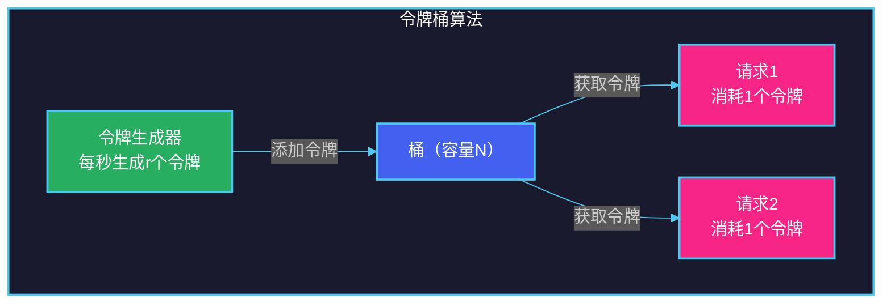

**算法特点：**
- 允许一定程度的突发流量
- 桶满时令牌溢出，不累积
- 支持平滑限流

**Java实现：**

```java
import java.util.concurrent.atomic.AtomicLong;
import java.util.concurrent.locks.Lock;
import java.util.concurrent.locks.ReentrantLock;

public class TokenBucketRateLimiter {

    private final long capacity;          // 桶容量
    private final long refillRate;        // 每秒生成令牌数
    private final AtomicLong tokens;      // 当前令牌数
    private final long lastRefillTime;    // 上次填充时间
    private final Lock lock = new ReentrantLock();

    public TokenBucketRateLimiter(long capacity, long refillRate) {
        this.capacity = capacity;
        this.refillRate = refillRate;
        this.tokens = new AtomicLong(capacity);
        this.lastRefillTime = System.nanoTime();
    }

    /**
     * 尝试获取令牌
     * @param tokensRequired 需要获取的令牌数
     * @return 是否获取成功
     */
    public boolean tryAcquire(long tokensRequired) {
        refill();

        long currentTokens = tokens.get();
        if (currentTokens >= tokensRequired) {
            tokens.compareAndSet(currentTokens, currentTokens - tokensRequired);
            return true;
        }
        return false;
    }

    /**
     * 重填令牌
     */
    private void refill() {
        lock.lock();
        try {
            long now = System.nanoTime();
            long elapsed = now - lastRefillTime;

            // 计算应该添加的令牌数
            long tokensToAdd = (elapsed * refillRate) / 1_000_000_000;

            if (tokensToAdd > 0) {
                long currentTokens = tokens.get();
                long newTokens = Math.min(capacity, currentTokens + tokensToAdd);
                tokens.set(newTokens);
            }
        } finally {
            lock.unlock();
        }
    }

    /**
     * 获取当前可用令牌数
     */
    public long getAvailableTokens() {
        refill();
        return tokens.get();
    }
}
```

### 4.7.2 滑动窗口算法

滑动窗口算法将时间划分为更小的窗口，计算落在窗口内的请求数。

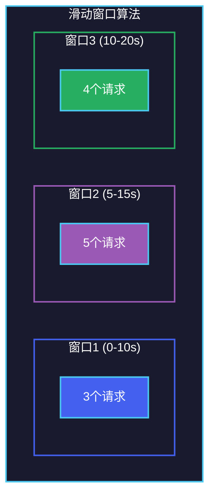

**算法特点：**
- 统计更精确，限流更平滑
- 内存占用相对较高
- 适合高精度限流场景

**Java实现：**

```java
import java.util.concurrent.atomic.AtomicInteger;
import java.util.concurrent.atomic.LongAdder;
import java.util.concurrent.ConcurrentLinkedDeque;
import java.time.Instant;

public class SlidingWindowRateLimiter {

    private final int maxRequests;                    // 窗口内最大请求数
    private final int windowSizeInSeconds;           // 窗口大小（秒）
    private final ConcurrentLinkedDeque<Long> requests;  // 请求时间戳队列

    public SlidingWindowRateLimiter(int maxRequests, int windowSizeInSeconds) {
        this.maxRequests = maxRequests;
        this.windowSizeInSeconds = windowSizeInSeconds;
        this.requests = new ConcurrentLinkedDeque<>();
    }

    /**
     * 尝试处理请求
     * @return 是否允许通过
     */
    public synchronized boolean tryAcquire() {
        long now = Instant.now().toEpochMilli();
        long windowStart = now - (windowSizeInSeconds * 1000L);

        // 移除窗口外的请求记录
        while (!requests.isEmpty() && requests.peekFirst() < windowStart) {
            requests.pollFirst();
        }

        // 检查窗口内请求数
        if (requests.size() < maxRequests) {
            requests.addLast(now);
            return true;
        }
        return false;
    }

    /**
     * 获取当前窗口内的请求数
     */
    public int getCurrentWindowCount() {
        long now = Instant.now().toEpochMilli();
        long windowStart = now - (windowSizeInSeconds * 1000L);

        return (int) requests.stream()
                .filter(timestamp -> timestamp >= windowStart)
                .count();
    }
}
```

### 4.7.3 漏桶算法

漏桶算法以固定速率处理请求，超出的请求排队或拒绝。

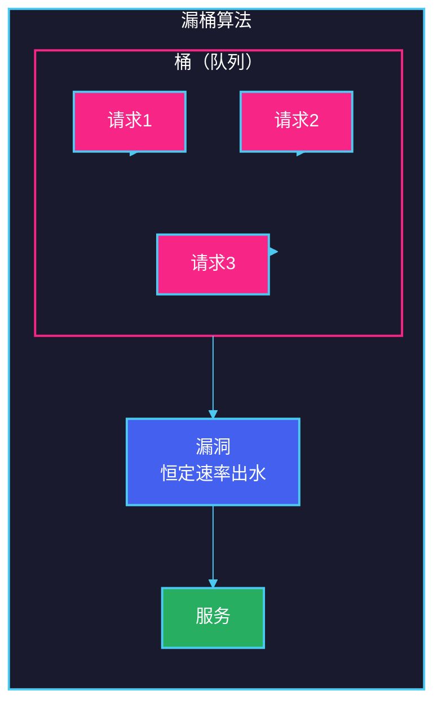

**算法特点：**
- 严格控制输出速率
- 突发请求会被整形
- 适合流量整形场景

**Java实现：**

```java
import java.util.concurrent.BlockingQueue;
import java.util.concurrent.LinkedBlockingQueue;
import java.util.concurrent.TimeUnit;
import java.util.concurrent.atomic.AtomicBoolean;

public class LeakyBucketRateLimiter {

    private final int capacity;           // 桶容量
    private final int leakRate;            // 漏出速率（每秒处理请求数）
    private final BlockingQueue<Runnable> bucket;
    private final AtomicBoolean running = new AtomicBoolean(true);
    private final Thread leakThread;

    public LeakyBucketRateLimiter(int capacity, int leakRate) {
        this.capacity = capacity;
        this.leakRate = leakRate;
        this.bucket = new LinkedBlockingQueue<>(capacity);

        // 启动漏水线程
        this.leakThread = new Thread(this::leak);
        this.leakThread.start();
    }

    /**
     * 尝试提交请求
     * @param timeout 超时时间
     * @param unit 时间单位
     * @return 是否提交成功
     */
    public boolean trySubmit(Runnable task, long timeout, TimeUnit unit) throws InterruptedException {
        if (!running.get()) {
            throw new IllegalStateException("Rate limiter is stopped");
        }
        return bucket.offer(task, timeout, unit);
    }

    /**
     * 漏水处理
     */
    private void leak() {
        long leakInterval = 1000 / leakRate;  // 每次漏出的时间间隔（毫秒）

        while (running.get() || !bucket.isEmpty()) {
            try {
                Runnable task = bucket.poll(leakInterval, TimeUnit.MILLISECONDS);
                if (task != null) {
                    task.run();
                }
            } catch (InterruptedException e) {
                Thread.currentThread().interrupt();
                break;
            }
        }
    }

    /**
     * 停止漏桶
     */
    public void stop() {
        running.set(false);
        leakThread.interrupt();
    }

    /**
     * 获取当前桶内请求数
     */
    public int getCurrentSize() {
        return bucket.size();
    }
}
```

### 4.7.4 三种算法对比

| 特性 | 令牌桶 | 滑动窗口 | 漏桶 |
|-----|-------|---------|------|
| **突发处理** | 支持 | 支持 | 不支持 |
| **速率控制** | 平滑 | 平滑 | 严格 |
| **实现复杂度** | 中等 | 中等 | 简单 |
| **内存占用** | 低 | 中等 | 中等 |
| **适用场景** | API限流 | 精确限流 | 流量整形 |
| **是否允许超额** | 允许（桶满为止） | 不允许 | 不允许 |

---

## 4.8 熔断器模式

### 4.8.1 熔断器原理

熔断器模式用于防止级联故障，当下游服务失败率过高时，熔断器会"跳闸"，快速返回错误，避免资源耗尽。

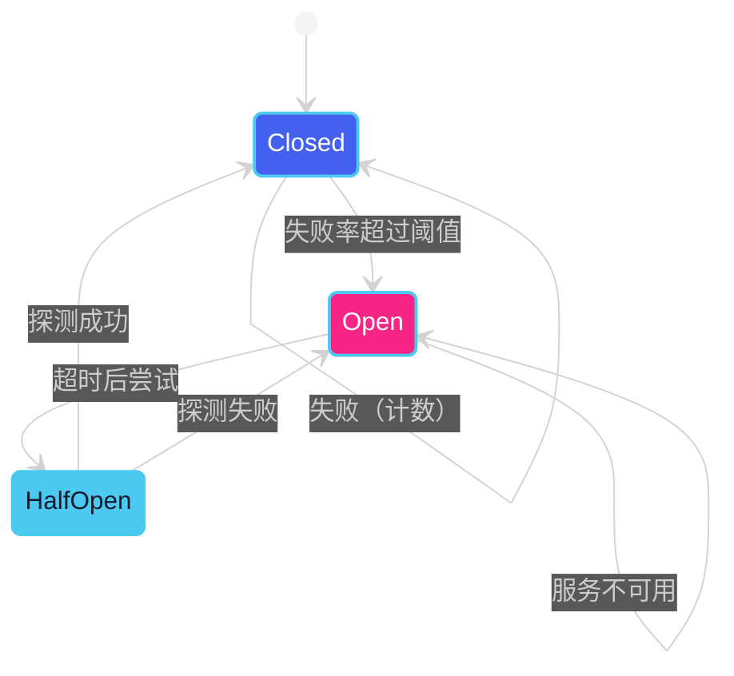

**熔断器状态说明：**

| 状态 | 行为 | 说明 |
|-----|------|------|
| **Closed（关闭）** | 正常转发请求 | 统计失败次数，达到阈值则进入Open |
| **Open（打开）** | 直接返回错误 | 所有请求快速失败，保护下游服务 |
| **HalfOpen（半开）** | 允许部分请求通过 | 探测服务是否恢复 |

### 4.8.2 熔断器实现

**Resilience4j熔断器配置：**

```yaml
# application.yml
resilience4j:
  circuitbreaker:
    instances:
      userService:
        # 滑动窗口配置
        registerHealthIndicator: true
        slidingWindowType: COUNT_BASED        # 或 TIME_BASED
        slidingWindowSize: 10                  # 窗口大小
        minimumNumberOfCalls: 5                # 最小调用数

        # 熔断条件
        failureRateThreshold: 50                # 失败率阈值（%）
        slowCallRateThreshold: 80              # 慢调用率阈值（%）
        slowCallDurationThreshold: 2s          # 慢调用阈值

        # 状态转换配置
        waitDurationInOpenState: 10s           # Open状态持续时间
        permittedNumberOfCallsInHalfOpenState: 3  # 半开状态允许的调用数
        automaticTransitionFromOpenToHalfOpenEnabled: true

        # 事件处理
        recordExceptions:
          - java.io.IOException
          - java.util.concurrent.TimeoutException
          - feign.FeignException
        ignoreExceptions:
          - java.lang.IllegalArgumentException

  timelimiter:
    instances:
      userService:
        timeoutDuration: 3s
        cancelRunningFuture: true
```

**使用熔断器注解：**

```java
import io.github.resilience4j.circuitbreaker.annotation.CircuitBreaker;
import io.github.resilience4j.retry.annotation.Retry;
import io.github.resilience4j.timelimiter.annotation.TimeLimiter;

@Service
public class OrderServiceImpl implements OrderService {

    @Autowired
    private UserServiceClient userServiceClient;

    @Autowired
    private ProductServiceClient productServiceClient;

    /**
     * 带熔断器的用户服务调用
     */
    @CircuitBreaker(name = "userService", fallbackMethod = "getUserFallback")
    @Retry(name = "userService")
    public User getUserById(Long userId) {
        return userServiceClient.getUser(userId);
    }

    /**
     * 带超时控制的商品服务调用
     */
    @TimeLimiter(name = "productService")
    @CircuitBreaker(name = "productService", fallbackMethod = "getProductsFallback")
    public CompletableFuture<List<Product>> getProducts(List<Long> productIds) {
        return CompletableFuture.supplyAsync(() ->
            productServiceClient.getProducts(productIds));
    }

    /**
     * 降级方法 - 用户服务
     */
    private User getUserFallback(Long userId, Throwable throwable) {
        log.error("用户服务调用失败, userId: {}, error: {}", userId, throwable.getMessage());
        return User.builder()
                .id(userId)
                .name("默认用户")
                .build();
    }

    /**
     * 降级方法 - 商品服务
     */
    private CompletableFuture<List<Product>> getProductsFallback(
            List<Long> productIds, Throwable throwable) {
        log.error("商品服务调用失败, productIds: {}, error: {}",
                productIds, throwable.getMessage());
        return CompletableFuture.completedFuture(
            Collections.emptyList()
        );
    }
}
```

**手动熔断器控制：**

```java
import io.github.resilience4j.circuitbreaker.CircuitBreaker;
import io.github.resilience4j.circuitbreaker.CircuitBreakerRegistry;

@Service
public class CircuitBreakerManager {

    private final Map<String, CircuitBreaker> circuitBreakers;

    public CircuitBreakerManager(CircuitBreakerRegistry registry) {
        this.circuitBreakers = new ConcurrentHashMap<>();
        // 初始化各服务的熔断器
        circuitBreakers.put("userService",
            registry.circuitBreaker("userService"));
        circuitBreakers.put("orderService",
            registry.circuitBreaker("orderService"));
    }

    /**
     * 获取熔断器状态
     */
    public String getCircuitBreakerStatus(String serviceName) {
        CircuitBreaker circuitBreaker = circuitBreakers.get(serviceName);
        if (circuitBreaker == null) {
            return "Unknown";
        }
        return circuitBreaker.getState().toString();
    }

    /**
     * 手动触发熔断
     */
    public void forceOpen(String serviceName) {
        CircuitBreaker circuitBreaker = circuitBreakers.get(serviceName);
        if (circuitBreaker != null) {
            circuitBreaker.transitionToOpenState();
        }
    }

    /**
     * 手动重置熔断器
     */
    public void reset(String serviceName) {
        CircuitBreaker circuitBreaker = circuitBreakers.get(serviceName);
        if (circuitBreaker != null) {
            circuitBreaker.transitionToClosedState();
        }
    }

    /**
     * 获取熔断器指标
     */
    public CircuitBreakerMetrics getMetrics(String serviceName) {
        CircuitBreaker circuitBreaker = circuitBreakers.get(serviceName);
        if (circuitBreaker == null) {
            return null;
        }

        CircuitBreaker.Metrics metrics = circuitBreaker.getMetrics();
        return new CircuitBreakerMetrics(
            metrics.getFailureRate(),
            metrics.getSlowCallRate(),
            metrics.getNumberOfSuccessfulCalls(),
            metrics.getNumberOfFailedCalls(),
            metrics.getNumberOfNotPermittedCalls()
        );
    }

    /**
     * 熔断器指标DTO
     */
    public record CircuitBreakerMetrics(
        float failureRate,
        float slowCallRate,
        int successfulCalls,
        int failedCalls,
        int notPermittedCalls
    ) {}
}
```

**Spring Cloud Gateway集成熔断器：**

```java
import org.springframework.cloud.gateway.filter.FGatewayFilter;
import org.springframework.cloud.gateway.filter.factory.AbstractGatewayFilterFactory;
import org.springframework.cloud.circuitbreaker.resilience4j.ReactiveResilience4JCircuitBreakerFactory;
import org.springframework.stereotype.Component;

@Component
public class CustomCircuitBreakerFilterFactory
        extends AbstractGatewayFilterFactory<CustomCircuitBreakerFilterFactory.Config> {

    private final ReactiveResilience4JCircuitBreakerFactory circuitBreakerFactory;

    public CustomCircuitBreakerFilterFactory(
            ReactiveResilience4JCircuitBreakerFactory circuitBreakerFactory) {
        super(Config.class);
        this.circuitBreakerFactory = circuitBreakerFactory;
    }

    @Override
    public GGatewayFilter apply(Config config) {
        return (exchange, chain) -> {
            String serviceName = config.getServiceName();

            return circuitBreakerFactory.create(serviceName)
                .run(
                    chain.filter(exchange),
                    throwable -> handleFallback(exchange, throwable, config)
                );
        };
    }

    private Mono<Void> handleFallback(ServerWebExchange exchange,
                                      Throwable throwable,
                                      Config config) {
        if (config.isReturnException()) {
            exchange.getResponse().setStatusCode(
                HttpStatus.INTERNAL_SERVER_ERROR);
            return exchange.getResponse().setComplete();
        }

        // 返回降级响应
        exchange.getResponse().setStatusCode(
            HttpStatus.valueOf(config.getFallbackStatus()));
        exchange.getResponse().getHeaders().setContentType(MediaType.APPLICATION_JSON);

        String body = String.format(
            "{\"error\": \"Service Unavailable\", \"message\": \"%s\"}",
            config.getFallbackMessage());

        DataBuffer buffer = exchange.getResponse()
            .bufferFactory().wrap(body.getBytes());
        return exchange.getResponse().writeWith(Flux.just(buffer));
    }

    public static class Config {
        private String serviceName;
        private int fallbackStatus = 503;
        private String fallbackMessage = "Service is temporarily unavailable";
        private boolean returnException = false;

        // getters and setters
        public String getServiceName() { return serviceName; }
        public void setServiceName(String serviceName) { this.serviceName = serviceName; }
        public int getFallbackStatus() { return fallbackStatus; }
        public void setFallbackStatus(int fallbackStatus) { this.fallbackStatus = fallbackStatus; }
        public String getFallbackMessage() { return fallbackMessage; }
        public void setFallbackMessage(String fallbackMessage) { this.fallbackMessage = fallbackMessage; }
        public boolean isReturnException() { return returnException; }
        public void setReturnException(boolean returnException) { this.returnException = returnException; }
    }
}
```

---

## 本章小结

本章详细介绍了API网关的核心概念、架构设计和实现方案：

1. **API网关概述**：作为系统的单一入口点，API网关解决了微服务架构中客户端直接调用多个服务的复杂性、安全性、监控等问题。

2. **核心功能**：
   - 路由转发：根据请求特征将请求路由到对应的后端服务
   - 请求聚合：将多个微服务调用聚合成一次客户端请求
   - 协议转换：支持不同协议之间的转换
   - 认证授权：JWT Token、OAuth2等认证机制
   - 限流熔断：令牌桶、滑动窗口、漏桶算法以及熔断器模式
   - 日志监控：统一的请求日志和监控指标收集

3. **主流方案对比**：Kong适合通用场景，Nginx适合高性能负载均衡，Spring Cloud Gateway适合Spring生态，Envoy适合Service Mesh场景。

4. **架构设计**：API网关通常采用多层架构，包括负载均衡层、过滤器链层、后端服务层和可观测性层。

5. **认证授权实现**：JWT Token适用于无状态认证，OAuth2适用于第三方授权场景。

6. **限流算法**：令牌桶支持突发流量，滑动窗口提供精确限流，漏桶实现严格流量整形。

7. **熔断器模式**：通过Closed、Open、HalfOpen三种状态保护后端服务免受级联故障影响。

---

## 思考题

1. **场景分析**：如果一个微服务系统同时存在Web端、移动端和第三方合作伙伴访问，请设计一个API网关方案来处理这三类不同的客户端，并说明如何实现差异化的认证和限流策略。

2. **架构设计**：假设你需要设计一个支持每日亿级请求的API网关，请从高可用、高性能、可扩展三个维度说明你会如何设计架构，并选择合适的技术方案。

3. **算法选择**：在令牌桶、滑动窗口和漏桶三种限流算法中：
   - 如果要求精确限流（不允许任何突发），应该选择哪种算法？
   - 如果允许一定程度的突发流量来应对促销场景，应该选择哪种算法？
   - 如果需要将突发流量整形为平稳输出，应该选择哪种算法？

4. **故障处理**：当API网关后端的某个服务出现故障时，请设计一个完整的降级策略，包括：
   - 如何判断服务是否故障
   - 故障时应该返回什么内容
   - 如何在服务恢复后逐步恢复流量

5. **安全加固**：请分析API网关可能面临的安全威胁（如DDoS攻击、Token盗用、重放攻击等），并设计相应的防护措施。

---

**上一章**：[第三章：服务注册与发现](./chapter03-service-discovery.md)

**下一章**：[第五章：配置中心](./chapter05-config-center.md)
