# 第五章：服务治理

## 本章目录

- [5.1 服务治理概述](#51-服务治理概述)
- [5.2 服务发现](#52-服务发现)
  - [5.2.1 客户端发现与服务端发现](#521-客户端发现与服务端发现)
  - [5.2.2 主流服务发现组件](#522-主流服务发现组件)
  - [5.2.3 健康检查机制](#523-健康检查机制)
- [5.3 负载均衡](#53-负载均衡)
  - [5.3.1 客户端负载均衡与服务端负载均衡](#531-客户端负载均衡与服务端负载均衡)
  - [5.3.2 负载均衡算法](#532-负载均衡算法)
- [5.4 熔断器模式](#54-熔断器模式)
  - [5.4.1 熔断器三状态](#541-熔断器三状态)
  - [5.4.2 熔断器实现](#542-熔断器实现)
- [5.5 重试机制](#55-重试机制)
  - [5.5.1 重试策略](#551-重试策略)
  - [5.5.2 指数退避算法](#552-指数退避算法)
  - [5.5.3 幂等性设计](#553-幂等性设计)
- [5.6 限流与降级](#56-限流与降级)
  - [5.6.1 限流算法](#561-限流算法)
  - [5.6.2 服务降级策略](#562-服务降级策略)
- [5.7 配置管理](#57-配置管理)
  - [5.7.1 集中配置中心](#571-集中配置中心)
  - [5.7.2 热更新机制](#572-热更新机制)
- [本章小结](#本章小结)
- [思考题](#思考题)

---

## 5.1 服务治理概述

微服务架构将业务系统拆分为多个独立的服务，每个服务可以独立开发、部署和扩展。然而，随着服务数量的增长，服务之间的协调、故障处理、流量管理等变得越来越复杂。**服务治理**正是为了解决这些问题而诞生的一整套技术和最佳实践。

### 什么是服务治理

服务治理是指对微服务系统中服务的注册、发现、负载均衡、熔断、降级、限流、配置管理等核心机制的管理和控制。它确保微服务系统能够高效、可靠地运行。

### 服务治理的核心目标

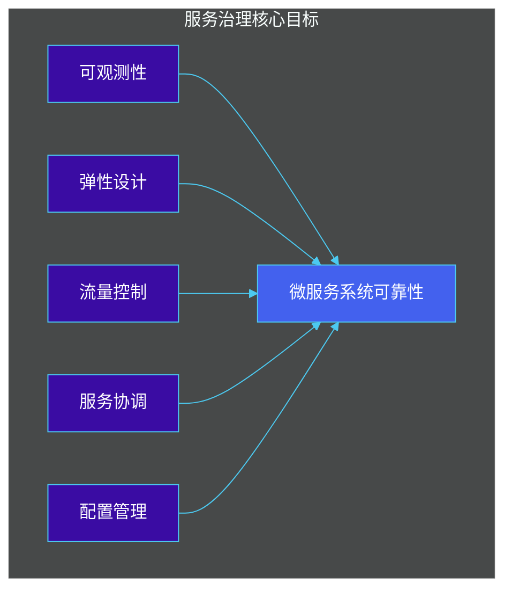

### 服务治理架构全景图

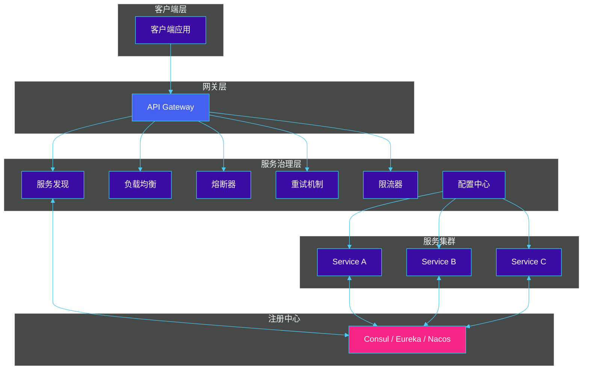

### 本章学习路径


---

## 5.2 服务发现

服务发现是微服务架构中最基础也是最关键的组件之一。它解决了"服务在哪里"这个问题，使得服务之间能够相互定位和通信。

### 5.2.1 客户端发现与服务端发现

#### 客户端发现模式

在**客户端发现模式**中，客户端（服务消费者）直接向注册中心查询服务提供者的地址列表，然后自行选择目标服务进行调用。

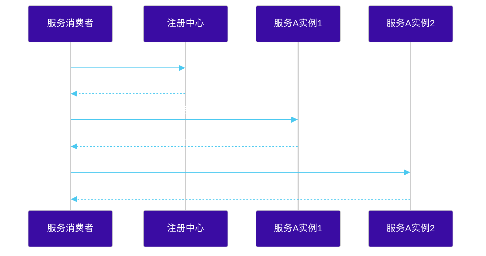

**优点**：
- 架构简单，不需要额外的中间组件
- 服务调用延迟低（直连）

**缺点**：
- 客户端需要实现发现逻辑，增加开发复杂度
- 多个客户端需要各自维护服务列表，缓存一致性问题

**典型实现**：Netflix Eureka（早期版本）、Redis、DNS

#### 服务端发现模式

在**服务端发现模式**中，客户端通过一个中间组件（如负载均衡器或 API Gateway）来发现目标服务，客户端无需知道服务提供者的具体地址。

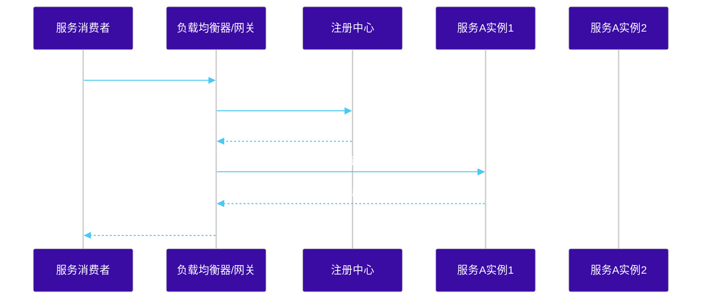

**优点**：
- 客户端逻辑简单，专注于业务
- 容易实现负载均衡策略
- 适合在 Kubernetes 环境中使用

**缺点**：
- 引入额外的中间组件，增加延迟
- 需要维护负载均衡器的高可用

**典型实现**：Kubernetes Service、Nginx + Consul Template、Envoy + ADS

#### 客户端发现 vs 服务端发现对比

| 特性 | 客户端发现 | 服务端发现 |
|------|-----------|-----------|
| 架构复杂度 | 客户端复杂，服务端简单 | 服务端复杂，客户端简单 |
| 网络跳数 | 0（直连） | 1（经过代理） |
| 负载均衡 | 客户端自行实现 | 服务端统一实现 |
| 故障检测 | 客户端自行检测 | 服务端统一检测 |
| 适用场景 | 传统微服务架构 | 云原生、K8s 环境 |
| 典型组件 | Eureka、Consul Client SDK | Kubernetes Service、NGINX |

### 5.2.2 主流服务发现组件

#### Consul

Consul 是 HashiCorp 公司开源的服务网格解决方案，提供服务发现、健康检查、KV 存储、多数据中心支持等功能。

**Consul 核心概念**：
- **Agent**：运行在每个节点上的守护进程
- **Client**：Agent 以客户端模式运行，将请求转发给 Server
- **Server**：Agent 以服务端模式运行，维护集群状态
- **Catalog**：服务注册表，存储所有服务信息

**Go 语言集成 Consul 示例**：

```go
package main

import (
    "fmt"
    "log"

    "github.com/hashicorp/consul/api"
)

func main() {
    // 创建 Consul 客户端
    config := api.DefaultConfig()
    config.Address = "localhost:8500"
    client, err := api.NewClient(config)
    if err != nil {
        log.Fatal(err)
    }

    // 注册服务
    registration := &api.AgentServiceRegistration{
        ID:   "service-001",
        Name: "user-service",
        Tags: []string{"v1", "production"},
        Port: 8080,
        Check: &api.AgentServiceCheck{
            HTTP:                           "http://localhost:8080/health",
            Interval:                       "10s",
            Timeout:                        "5s",
            DeregisterCriticalServiceAfter: "30s",
        },
    }

    if err := client.Agent().ServiceRegister(registration); err != nil {
        log.Fatal(err)
    }

    fmt.Println("Service registered successfully")

    // 查询服务
    services, _, err := client.Health().Service("user-service", "", true, nil)
    if err != nil {
        log.Fatal(err)
    }

    for _, service := range services {
        fmt.Printf("Service: %s, Address: %s:%d\n",
            service.Service.Service,
            service.Service.Address,
            service.Service.Port)
    }
}
```

**服务发现架构图**：

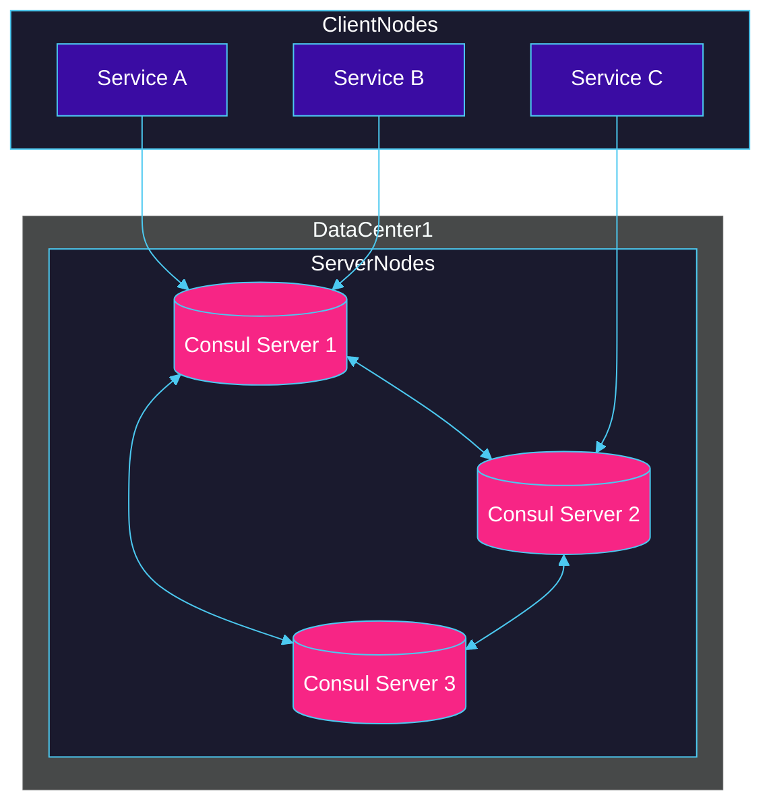

#### Eureka

Eureka 是 Netflix 开源的服务发现组件，曾在 Spring Cloud 生态中广泛使用。Eureka 2.x 版本已停止开源，但 1.x 版本仍被广泛使用。

**Eureka 架构**：

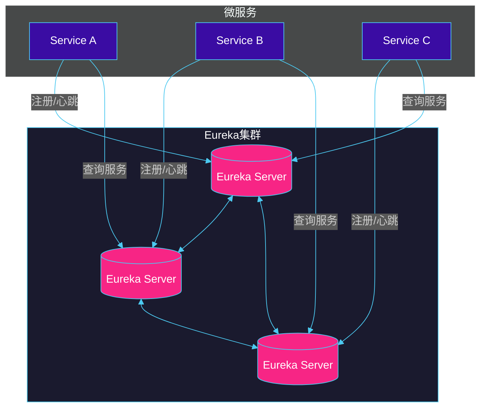

**Java Spring Cloud 集成 Eureka 示例**：

```java
// 服务提供者配置 (application.yml)
spring:
  application:
    name: user-service
  cloud:
    inetutils:
      ignored-interfaces: docker0
eureka:
  instance:
    prefer-ip-address: true
    lease-renewal-interval-in-seconds: 30
    lease-expiration-duration-in-seconds: 90
  client:
    service-url:
      defaultZone: http://eureka-server-1:8761/eureka/,http://eureka-server-2:8762/eureka/
    register-with-eureka: true
    fetch-registry: true
```

```java
// 服务消费者
@RestController
public class UserController {

    @Autowired
    private EurekaClient eurekaClient;

    @Autowired
    private RestTemplate restTemplate;

    @GetMapping("/users/{id}")
    public User getUser(@PathVariable Long id) {
        // 获取服务实例
        Application application = eurekaClient.getApplication("user-service");
        InstanceInfo instance = application.getInstances().get(0);

        String url = "http://" + instance.getIPAddr() + ":" + instance.getPort() + "/users/" + id;
        return restTemplate.getForObject(url, User.class);
    }
}
```

#### Nacos

Nacos 是阿里巴巴开源的服务发现和配置管理平台，支持 AP 和 CP 两种一致性模式，功能全面且性能优异。

**Nacos 架构图**：

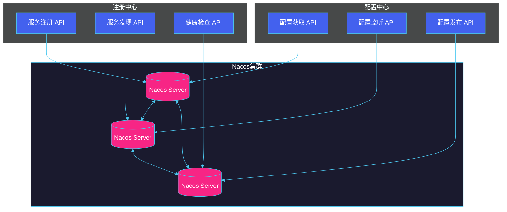

**Java Spring Cloud 集成 Nacos 示例**：

```java
// 服务提供者
@SpringBootApplication
@EnableDiscoveryClient
public class UserServiceApplication {
    public static void main(String[] args) {
        SpringApplication.run(UserServiceApplication.class, args);
    }
}

// application.yml
spring:
  application:
    name: user-service
  cloud:
    nacos:
      discovery:
        server-addr: nacos-server:8848
        namespace: production
        group: DEFAULT_GROUP
      config:
        server-addr: nacos-server:8848
        file-extension: yaml
```

```java
// 配置示例
@Configuration
@ConfigurationProperties(prefix = "user")
@RefreshScope
public class UserConfig {
    private int maxUsers;
    private String defaultRole;

    // getters and setters
}

// 使用配置
@RestController
@RequestMapping("/users")
@RefreshScope
public class UserController {
    @Autowired
    private UserConfig userConfig;

    @GetMapping("/config")
    public Map<String, Object> getConfig() {
        Map<String, Object> config = new HashMap<>();
        config.put("maxUsers", userConfig.getMaxUsers());
        config.put("defaultRole", userConfig.getDefaultRole());
        return config;
    }
}
```

#### 服务发现方案对比

| 特性 | Consul | Eureka | Nacos |
|------|--------|--------|-------|
| **一致性模型** | CP/AP 可切换 | AP | AP & CP 可切换 |
| **健康检查** | HTTP/TCP/脚本 | 心跳 | HTTP/TCP/MySQL |
| **多数据中心** | 原生支持 | 需要企业版 | 支持 |
| **配置管理** | KV 存储 | 不支持 | 原生支持 |
| **服务过滤** | 支持 | 支持 | 支持 |
| **社区活跃度** | 中等 | 较低（2.x 停止） | 活跃 |
| **Spring Cloud 集成** | 良好 | 原生支持 | 原生支持 |
| **Kubernetes 友好** | 优秀 | 一般 | 良好 |
| **运维复杂度** | 中等 | 简单 | 中等 |
| **适用场景** | 多语言环境 | Java 生态 | 国产化/多语言 |

### 5.2.3 健康检查机制

健康检查是服务发现的重要组成部分，它确保注册中心能够及时发现不可用的服务实例，避免请求被分发到故障节点。

#### 健康检查类型

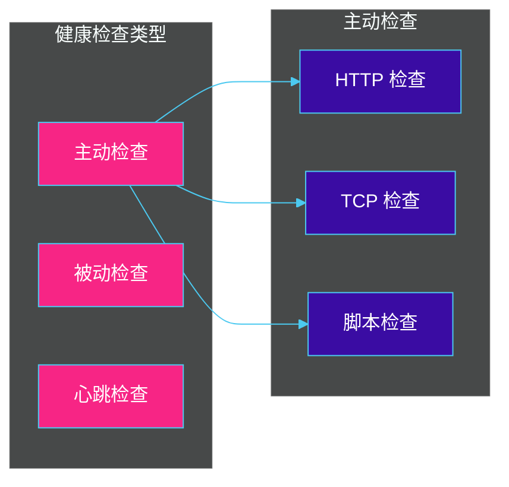

**主动检查（Active Health Check）**：
- 注册中心定期向服务实例发送检查请求
- 服务实例响应健康状态
- 典型实现：Consul HTTP Check

**被动检查（Passive Health Check）**：
- 通过监控服务调用的成功率来判断健康状态
- 连续失败达到阈值时标记为不健康
- 典型实现：Envoy 被动健康检查

**心跳检查（Heartbeat Health Check）**：
- 服务实例定期向注册中心发送心跳
- 注册中心检测心跳超时来判断故障
- 典型实现：Eureka 心跳机制

#### 健康检查实现示例

**Go 语言实现自定义健康检查**：

```go
package main

import (
    "fmt"
    "net/http"
    "time"

    "github.com/hashicorp/consul/api"
)

func main() {
    config := api.DefaultConfig()
    config.Address = "localhost:8500"
    client, err := api.NewClient(config)
    if err != nil {
        panic(err)
    }

    // 定义健康检查
    check := &api.AgentCheck{
        CheckID:  "service:health-check",
        Name:     "Service Health Check",
        ServiceID: "user-service",
        Interval: "10s",
        Timeout:  "5s",
        Notes:    "Custom health check for user service",
    }

    // 注册检查
    err = client.Agent().CheckRegister(check)
    if err != nil {
        panic(err)
    }

    fmt.Println("Health check registered")

    // 模拟健康检查服务
    http.HandleFunc("/health", func(w http.ResponseWriter, r *http.Request) {
        // 检查数据库连接
        if checkDatabase() {
            w.WriteHeader(http.StatusOK)
            w.Write([]byte(`{"status": "healthy"}`))
        } else {
            w.WriteHeader(http.StatusServiceUnavailable)
            w.Write([]byte(`{"status": "unhealthy"}`))
        }
    })

    http.ListenAndServe(":8080", nil)
}

func checkDatabase() bool {
    // 实际项目中检查数据库连接
    return true
}
```

**Spring Boot Actuator 健康检查端点**：

```java
@Component
public class CustomHealthIndicator implements HealthIndicator {

    @Autowired
    private DatabaseService databaseService;

    @Override
    public Health health() {
        try {
            // 检查数据库连接
            boolean dbHealthy = databaseService.isConnectionAlive();
            if (dbHealthy) {
                return Health.up()
                    .withDetail("database", "connected")
                    .withDetail("responseTime", measureResponseTime())
                    .build();
            }
        } catch (Exception e) {
            return Health.down()
                .withDetail("error", e.getMessage())
                .build();
        }
        return Health.down()
            .withDetail("database", "disconnected")
            .build();
    }

    private long measureResponseTime() {
        long start = System.currentTimeMillis();
        // 模拟测量响应时间
        return System.currentTimeMillis() - start;
    }
}
```

```yaml
# application.yml
management:
  endpoints:
    web:
      exposure:
        include: health,info,metrics
  endpoint:
    health:
      show-details: always
      probes:
        enabled: true
  health:
    livenessState:
      enabled: true
    readinessState:
      enabled: true
    redis:
      enabled: true
    db:
      enabled: true
```

#### 健康检查流程图

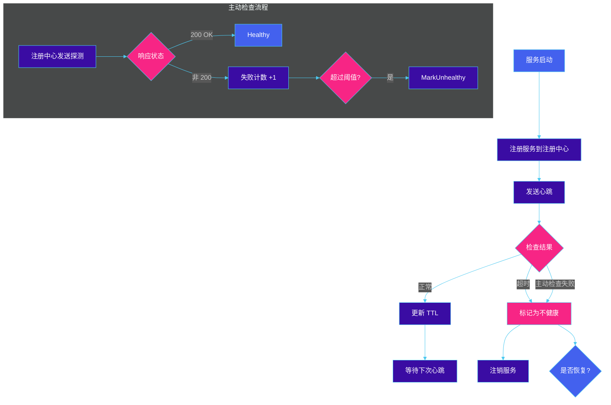

---

## 5.3 负载均衡

负载均衡是分布式系统的核心组件之一，它将请求分发到多个服务实例，提高系统的吞吐量和可用性。

### 5.3.1 客户端负载均衡与服务端负载均衡

#### 客户端负载均衡

客户端负载均衡由服务调用方自行决定请求发送到哪个服务实例。客户端从注册中心获取所有可用实例列表，然后根据负载均衡算法选择一个实例。

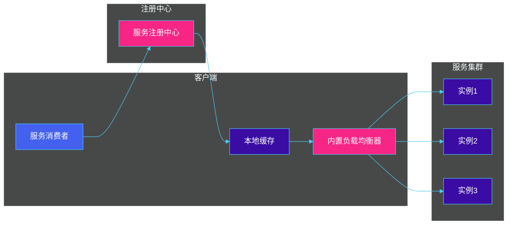

**特点**：
- 服务调用方知道所有可用实例
- 可以实现更精细的负载均衡策略
- 减少网络跳转，降低延迟
- 典型实现：Netflix Ribbon、Spring Cloud LoadBalancer

#### 服务端负载均衡

服务端负载均衡通过一个中间组件（如负载均衡器或 API 网关）来分发请求，客户端只需知道负载均衡器的地址。

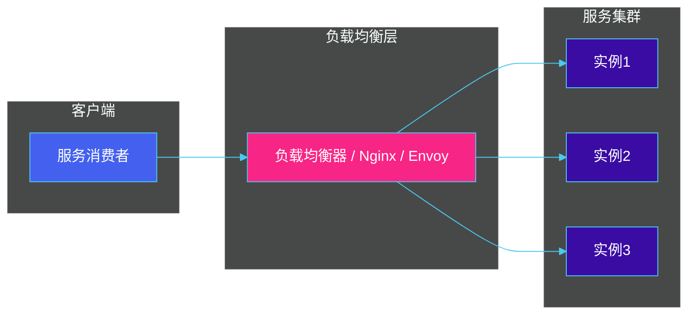

**特点**：
- 客户端逻辑简单
- 统一管理入口，便于监控
- 适合作为 API Gateway 的基础
- 典型实现：Nginx、HAProxy、AWS ALB、Envoy

#### 两种负载均衡对比

| 特性 | 客户端负载均衡 | 服务端负载均衡 |
|------|---------------|---------------|
| 实现位置 | 服务调用方 | 独立组件（LB） |
| 网络跳数 | 0（直连） | 1（经过 LB） |
| 灵活性 | 高（可自定义策略） | 中等（依赖 LB 功能） |
| 故障检测 | 调用方自行判断 | LB 统一检测 |
| 部署复杂度 | 低 | 中等（需维护 LB） |
| 适用场景 | 微服务内部调用 | 入口流量分发 |
| 典型组件 | Ribbon、LoadBalancer | Nginx、Envoy |

### 5.3.2 负载均衡算法

#### 常用负载均衡算法

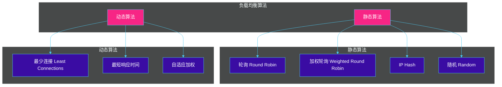

**轮询算法（Round Robin）**：
- 顺序循环分发请求
- 适合所有实例硬件配置相同
- 实现简单，是默认算法

**加权轮询（Weighted Round Robin）**：
- 根据实例权重比例分发请求
- 适合实例硬件配置不同
- 权重高的实例处理更多请求

**IP Hash 算法**：
- 根据客户端 IP 计算 Hash 值
- 同一 IP 的请求始终发送到同一实例
- 适合需要会话粘性的场景
- 问题：哈希倾斜导致负载不均

**最少连接算法（Least Connections）**：
- 选择当前连接数最少的实例
- 适合长连接场景
- 动态感知实例负载状态

#### Go 语言实现负载均衡算法

```go
package loadbalancer

import (
    "hash/fnv"
    "math/rand"
    "sync"
)

// ServiceInstance 服务实例
type ServiceInstance struct {
    ID     string
    Host   string
    Port   int
    Weight int // 权重
}

// LoadBalancer 负载均衡器接口
type LoadBalancer interface {
    Select(instances []ServiceInstance) ServiceInstance
}

// RoundRobinLoadBalancer 轮询负载均衡器
type RoundRobinLoadBalancer struct {
    mu         sync.Mutex
    currentIdx int
}

func (r *RoundRobinLoadBalancer) Select(instances []ServiceInstance) ServiceInstance {
    r.mu.Lock()
    defer r.mu.Unlock()

    if len(instances) == 0 {
        return ServiceInstance{}
    }

    idx := r.currentIdx % len(instances)
    r.currentIdx++
    return instances[idx]
}

// WeightedRoundRobinLoadBalancer 加权轮询负载均衡器
type WeightedRoundRobinLoadBalancer struct {
    mu         sync.Mutex
    currentIdx int
    currentWeight int
}

func (w *WeightedRoundRobinLoadBalancer) Select(instances []ServiceInstance) ServiceInstance {
    w.mu.Lock()
    defer w.mu.Unlock()

    if len(instances) == 0 {
        return ServiceInstance{}
    }

    // 找出最大权重
    maxWeight := 0
    totalWeight := 0
    validInstances := make([]ServiceInstance, 0)

    for _, inst := range instances {
        if inst.Weight > 0 {
            validInstances = append(validInstances, inst)
            if inst.Weight > maxWeight {
                maxWeight = inst.Weight
            }
            totalWeight += inst.Weight
        }
    }

    if len(validInstances) == 0 {
        return instances[0]
    }

    // 平滑加权轮询算法
    w.currentWeight++
    if w.currentWeight >= maxWeight {
        w.currentWeight = 0
    }

    // 找出当前权重对应的实例
    for _, inst := range validInstances {
        if inst.Weight >= w.currentWeight {
            return inst
        }
    }

    return validInstances[0]
}

// LeastConnectionsLoadBalancer 最少连接负载均衡器
type LeastConnectionsLoadBalancer struct {
    mu           sync.Mutex
    connections  map[string]int
}

func NewLeastConnectionsLoadBalancer() *LeastConnectionsLoadBalancer {
    return &LeastConnectionsLoadBalancer{
        connections: make(map[string]int),
    }
}

func (l *LeastConnectionsLoadBalancer) Select(instances []ServiceInstance) ServiceInstance {
    l.mu.Lock()
    defer l.mu.Unlock()

    if len(instances) == 0 {
        return ServiceInstance{}
    }

    minConn := int(^uint(0) >> 1) // 最大整数
    selected := instances[0]

    for _, inst := range instances {
        conn := l.connections[inst.ID]
        if conn < minConn {
            minConn = conn
            selected = inst
        }
    }

    // 增加选中实例的连接数
    l.connections[selected.ID]++
    return selected
}

// 释放连接
func (l *LeastConnectionsLoadBalancer) Release(instanceID string) {
    l.mu.Lock()
    defer l.mu.Unlock()

    if l.connections[instanceID] > 0 {
        l.connections[instanceID]--
    }
}

// IPHashLoadBalancer IP Hash 负载均衡器
type IPHashLoadBalancer struct{}

func (i *IPHashLoadBalancer) Select(instances []ServiceInstance) ServiceInstance {
    if len(instances) == 0 {
        return ServiceInstance{}
    }

    // 获取客户端 IP（在实际应用中从请求上下文获取）
    clientIP := getClientIP()

    // 计算 Hash 值
    h := fnv.New32a()
    h.Write([]byte(clientIP))
    hash := h.Sum32()

    // 选择实例
    idx := int(hash) % len(instances)
    return instances[idx]
}

func getClientIP() string {
    // 实际应用中从请求上下文获取
    rand.Seed(time.Now().UnixNano())
    return fmt.Sprintf("192.168.1.%d", rand.Intn(256))
}

// RandomLoadBalancer 随机负载均衡器
type RandomLoadBalancer struct{}

func (r *RandomLoadBalancer) Select(instances []ServiceInstance) ServiceInstance {
    if len(instances) == 0 {
        return ServiceInstance{}
    }

    rand.Seed(time.Now().UnixNano())
    idx := rand.Intn(len(instances))
    return instances[idx]
}
```

#### Java Spring Cloud LoadBalancer 实现

```java
// 自定义负载均衡器
@Configuration
public class CustomLoadBalancerConfiguration {

    @Bean
    public ReactorLoadBalancer<ServiceInstance> customLoadBalancer(
            ObjectProvider<ServiceInstanceListSupplier> supplier) {

        return new CustomRoundRobinLoadBalancer(supplier);
    }
}

public class CustomRoundRobinLoadBalancer implements ReactorLoadBalancer<ServiceInstance> {

    private final ObjectProvider<ServiceInstanceListSupplier> supplier;
    private int position = 0;

    public CustomRoundRobinLoadBalancer(ObjectProvider<ServiceInstanceListSupplier> supplier) {
        this.supplier = supplier;
    }

    @Override
    public Mono<Response<ServiceInstance>> choose(Request<?> request) {
        ServiceInstanceListSupplier supplier = this.supplier.getIfAvailable();
        return supplier.get(request)
            .next()
            .map(instances -> selectServer(instances, request));
    }

    private Response<ServiceInstance> selectServer(List<ServiceInstance> instances, Request<?> request) {
        if (instances.isEmpty()) {
            return new EmptyResponse();
        }

        int pos = Math.abs(this.position++);
        ServiceInstance instance = instances.get(pos % instances.size());

        return new DefaultResponse(instance);
    }
}
```

#### 负载均衡算法对比

| 算法 | 优点 | 缺点 | 适用场景 |
|------|------|------|---------|
| **轮询** | 实现简单，均匀分布 | 不考虑服务器性能差异 | 性能相近的服务器 |
| **加权轮询** | 适应服务器性能差异 | 需手动配置权重 | 性能不均的服务器 |
| **IP Hash** | 会话粘性 | 可能导致负载倾斜 | 需要会话保持的场景 |
| **最少连接** | 动态感知负载 | 实现复杂 | 长连接服务 |
| **最短响应时间** | 用户体验好 | 实现复杂 | 对延迟敏感的服务 |
| **随机** | 实现简单 | 分布不均匀 | 作为备选算法 |

---

## 5.4 熔断器模式

在分布式系统中，服务依赖链中的某个服务出现故障时，故障会沿着调用链向上游传播，导致整个系统雪崩。**熔断器模式**（Circuit Breaker）正是为了解决这个问题而设计的。

### 5.4.1 熔断器三状态

熔断器模式通过状态机来监控服务调用的成功和失败，在故障发生时"熔断"以防止故障扩散。熔断器有三种状态：

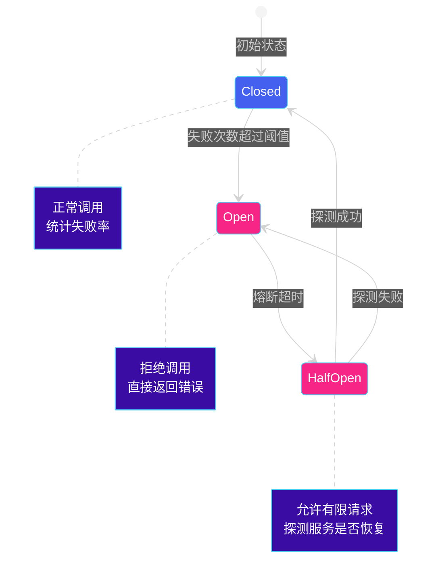

**Closed 状态（关闭状态）**：
- 熔断器关闭，允许请求正常通过
- 统计调用成功和失败的次数
- 当失败次数达到阈值时，切换到 Open 状态

**Open 状态（打开状态）**：
- 熔断器打开，所有请求立即失败
- 不执行实际的服务调用
- 经过一定的熔断时间后，切换到 Half-Open 状态

**Half-Open 状态（半开状态）**：
- 熔断器半开，允许少量请求通过
- 如果探测请求成功，切换到 Closed 状态
- 如果探测请求失败，切换回 Open 状态

#### 熔断器参数配置

| 参数 | 说明 | 典型值 |
|------|------|--------|
| Failure Threshold | 触发熔断的失败次数/比例 | 50% |
| Success Threshold | 半开状态下成功的次数 | 2-3 次 |
| Timeout Duration | 熔断持续时间 | 30s - 60s |
| Request Volume Threshold | 最小请求量（低于此值不统计） | 20 |

### 5.4.2 熔断器实现

#### Go 语言实现熔断器

```go
package circuitbreaker

import (
    "errors"
    "sync"
    "time"
)

// State 熔断器状态
type State int

const (
    StateClosed State = iota
    StateOpen
    StateHalfOpen
)

func (s State) String() string {
    switch s {
    case StateClosed:
        return "Closed"
    case StateOpen:
        return "Open"
    case StateHalfOpen:
        return "HalfOpen"
    default:
        return "Unknown"
    }
}

// 错误定义
var (
    ErrCircuitOpen = errors.New("circuit breaker is open")
)

// Options 熔断器配置
type Options struct {
    FailureThreshold int           // 触发熔断的失败次数
    SuccessThreshold int           // 恢复需要的成功次数
    Timeout          time.Duration // 熔断超时时间
}

// CircuitBreaker 熔断器
type CircuitBreaker struct {
    mu sync.RWMutex
    state State

    failureCount   int // 连续失败次数
    successCount   int // 连续成功次数
    lastFailureTime time.Time

    opts Options
}

// NewCircuitBreaker 创建熔断器
func NewCircuitBreaker(opts Options) *CircuitBreaker {
    return &CircuitBreaker{
        state: StateClosed,
        opts:  opts,
    }
}

// Call 执行调用
func (cb *CircuitBreaker) Call(fn func() error) error {
    cb.mu.Lock()
    defer cb.mu.Unlock()

    // 检查状态
    switch cb.state {
    case StateOpen:
        // 检查是否超时
        if time.Since(cb.lastFailureTime) > cb.opts.Timeout {
            cb.toHalfOpen()
        } else {
            return ErrCircuitOpen
        }
    }

    // 执行调用
    err := fn()

    // 处理结果
    if err != nil {
        cb.onFailure()
        return err
    }

    cb.onSuccess()
    return nil
}

// onFailure 处理失败
func (cb *CircuitBreaker) onFailure() {
    cb.failureCount++
    cb.successCount = 0
    cb.lastFailureTime = time.Now()

    if cb.state == StateHalfOpen {
        // 半开状态下失败，重新打开
        cb.toOpen()
    } else if cb.failureCount >= cb.opts.FailureThreshold {
        // 达到阈值，打开熔断器
        cb.toOpen()
    }
}

// onSuccess 处理成功
func (cb *CircuitBreaker) onSuccess() {
    if cb.state == StateHalfOpen {
        cb.successCount++
        if cb.successCount >= cb.opts.SuccessThreshold {
            // 半开状态下成功次数达到阈值，关闭熔断器
            cb.toClosed()
        }
    } else {
        cb.failureCount = 0
    }
}

// 状态转换
func (cb *CircuitBreaker) toOpen() {
    cb.state = StateOpen
    cb.lastFailureTime = time.Now()
}

func (cb *CircuitBreaker) toHalfOpen() {
    cb.state = StateHalfOpen
    cb.successCount = 0
}

func (cb *CircuitBreaker) toClosed() {
    cb.state = StateClosed
    cb.failureCount = 0
    cb.successCount = 0
}

// GetState 获取当前状态
func (cb *CircuitBreaker) GetState() State {
    cb.mu.RLock()
    defer cb.mu.RUnlock()
    return cb.state
}

// 使用示例
func main() {
    cb := NewCircuitBreaker(Options{
        FailureThreshold: 3,
        SuccessThreshold: 2,
        Timeout:          30 * time.Second,
    })

    for i := 0; i < 10; i++ {
        err := cb.Call(func() error {
            if i%3 == 0 {
                return errors.New("service error")
            }
            return nil
        })

        if err != nil {
            fmt.Printf("Attempt %d: Failed - %v (State: %s)\n", i, err, cb.GetState())
        } else {
            fmt.Printf("Attempt %d: Success (State: %s)\n", i, cb.GetState())
        }
    }
}
```

#### Resilience4j 熔断器（Java）

Resilience4j 是 Java 生态中流行的熔断器库，轻量且易于使用。

**Maven 依赖**：

```xml
<dependency>
    <groupId>io.github.resilience4j</groupId>
    <artifactId>resilience4j-spring-boot3</artifactId>
    <version>2.2.0</version>
</dependency>
```

**配置**：

```yaml
resilience4j:
  circuitbreaker:
    instances:
      userService:
        registerHealthIndicator: true
        slidingWindowSize: 10
        minimumNumberOfCalls: 5
        permittedNumberOfCallsInHalfOpenState: 3
        automaticTransitionFromOpenToHalfOpenEnabled: true
        waitDurationInOpenState: 30s
        failureRateThreshold: 50
        slowCallRateThreshold: 80
        slowCallDurationThreshold: 2s
```

**使用示例**：

```java
// 定义熔断器
@CircuitBreaker(name = "userService", fallbackMethod = "getUserFallback")
public User getUser(Long id) {
    return userClient.getUser(id);
}

// Fallback 方法
public User getUserFallback(Long id, Throwable throwable) {
    log.error("Fallback triggered for user {}: {}", id, throwable.getMessage());
    return User.builder()
        .id(id)
        .name("Default User")
        .email("default@example.com")
        .build();
}

// 编程式使用
@Service
public class UserService {

    private final CircuitBreakerRegistry registry = CircuitBreakerRegistry.ofDefaults();
    private final CircuitBreaker circuitBreaker;

    public UserService() {
        this.circuitBreaker = registry.circuitBreaker("userService");

        // 添加事件监听器
        circuitBreaker.getEventPublisher()
            .onStateTransition(event ->
                log.info("Circuit state changed: {} -> {}",
                    event.getStateTransition().getFromState(),
                    event.getStateTransition().getToState()))
            .onFailureRateExceeded(event ->
                log.warn("Failure rate exceeded: {}%", event.getFailureRate()));
    }

    public String callService() {
        return circuitBreaker.executeSupplier(() -> {
            // 实际的服务调用
            return remoteService.call();
        });
    }
}
```

#### Hystrix 熔断器（Java）

Hystrix 是 Netflix 开源的熔断器库，虽然已进入维护模式，但仍在许多系统中使用。

**Maven 依赖**：

```xml
<dependency>
    <groupId>org.springframework.cloud</groupId>
    <artifactId>spring-cloud-starter-netflix-hystrix</artifactId>
</dependency>
```

**配置**：

```yaml
hystrix:
  command:
    default:
      circuitBreaker:
        enabled: true
        forceOpen: false
        forceClosed: false
        requestVolumeThreshold: 20
        sleepWindowInMilliseconds: 5000
        errorThresholdPercentage: 50
      execution:
        isolation:
          thread:
            timeoutInMilliseconds: 1000
      fallback:
        enabled: true
```

**使用示例**：

```java
@RestController
@RequestMapping("/users")
public class UserController {

    @Autowired
    private UserService userService;

    @GetMapping("/{id}")
    @HystrixCommand(
        fallbackMethod = "getUserFallback",
        commandProperties = {
            @HystrixProperty(name = "circuitBreaker.enabled", value = "true"),
            @HystrixProperty(name = "circuitBreaker.requestVolumeThreshold", value = "10"),
            @HystrixProperty(name = "circuitBreaker.sleepWindowInMilliseconds", value = "5000"),
            @HystrixProperty(name = "circuitBreaker.errorThresholdPercentage", value = "50"),
        },
        threadPoolProperties = {
            @HystrixProperty(name = "coreSize", value = "10"),
            @HystrixProperty(name = "maxQueueSize", value = "5"),
        }
    )
    public User getUser(@PathVariable Long id) {
        return userService.getUserById(id);
    }

    // Fallback 方法
    public User getUserFallback(Long id, Throwable e) {
        log.error("Hystrix fallback triggered for user {}, error: {}", id, e.getMessage());
        return User.builder()
            .id(id)
            .name("Unknown User")
            .build();
    }
}
```

#### Resilience4j vs Hystrix 对比

| 特性 | Resilience4j | Hystrix |
|------|--------------|---------|
| **重量级** | 轻量 | 重量级 |
| **依赖** | 仅需 vavr | 需要 Netflix OSS 套件 |
| **配置方式** | 代码/配置文件 | 注解/配置文件 |
| **响应式支持** | 优秀（Reactor） | 一般 |
| **维护状态** | 活跃 | 维护模式（不再新功能） |
| **Spring Cloud 支持** | spring-cloud-starter-circuitbreaker-resilience4j | spring-cloud-starter-netflix-hystrix |
| **熔断器** | 是 | 是 |
| **限流器** | 是 | 否（需配合 Netflix Zuul） |
| **重试机制** | 是 | 是 |
| **舱壁模式** | 是（Bulkhead） | 是（线程池/信号量） |

---

## 5.5 重试机制

在分布式系统中，网络波动、服务暂时不可用等情况时有发生。重试机制通过自动重新执行失败的操作，提高系统的容错能力。

### 5.5.1 重试策略

#### 重试策略要素

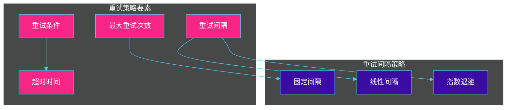

**最大重试次数（Max Attempts）**：
- 最多尝试的次数，包括首次调用
- 建议值：3-5 次

**重试间隔（Retry Interval）**：
- 相邻两次重试之间的时间间隔
- 决定重试的" aggressiveness"

**重试条件（Retry Condition）**：
- 什么情况下应该重试
- 只应对临时性故障进行重试

**超时时间（Timeout）**：
- 单次调用的超时时间
- 超过后视为失败

#### 可重试 vs 不可重试错误

**应该重试的错误**：
- 网络超时
- 连接被拒绝（服务暂时不可用）
- 资源临时不可用（503 Service Unavailable）
- 429 Too Many Requests

**不应该重试的错误**：
- 业务逻辑错误（400 Bad Request）
- 认证/授权失败（401/403）
- 资源不存在（404）
- 服务器内部错误且不可恢复（500 Internal Server Error）

### 5.5.2 指数退避算法

指数退避（Exponential Backoff）是一种常用的重试间隔策略，每次重试的等待时间都比上一次长，通常是指数增长。

#### 标准指数退避

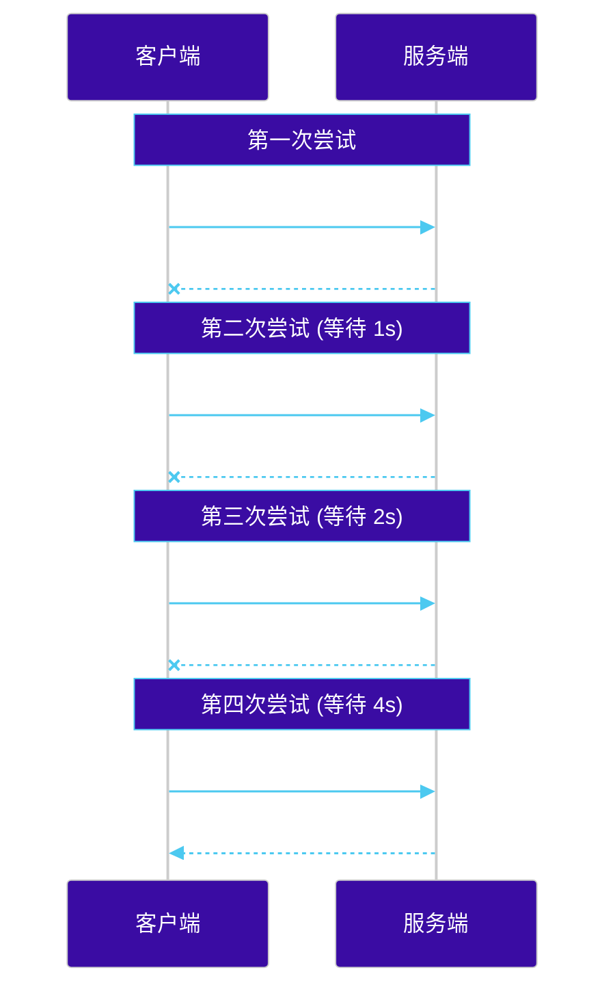

#### 指数退避公式

```
delay = min(cap, base * (2 ^ attempt) + jitter)

其中：
- cap: 最大延迟上限
- base: 基础延迟时间
- attempt: 当前重试次数（第几次重试）
- jitter: 随机抖动
```

#### Go 语言实现指数退避重试

```go
package retry

import (
    "context"
    "errors"
    "math/rand"
    "time"
)

// RetryOptions 重试配置
type RetryOptions struct {
    MaxAttempts int           // 最大尝试次数
    BaseDelay   time.Duration // 基础延迟
    MaxDelay    time.Duration // 最大延迟
    Jitter      bool          // 是否添加抖动
    Timeout     time.Duration // 总超时时间
}

// DefaultOptions 默认配置
var DefaultOptions = RetryOptions{
    MaxAttempts: 3,
    BaseDelay:   100 * time.Millisecond,
    MaxDelay:    30 * time.Second,
    Jitter:      true,
}

// IsRetryable 判断错误是否可重试
type IsRetryable func(error) bool

// 默认不可重试的错误
var defaultNonRetryableErrors = []error{
    errors.New("400 Bad Request"),
    errors.New("401 Unauthorized"),
    errors.New("403 Forbidden"),
    errors.New("404 Not Found"),
}

// Retry 执行重试
func Retry(ctx context.Context, fn func() error, opts RetryOptions, isRetryable IsRetryable) error {
    var lastErr error
    deadline, hasDeadline := ctx.Deadline()

    for attempt := 0; attempt < opts.MaxAttempts; attempt++ {
        // 检查上下文取消
        if err := ctx.Err(); err != nil {
            return err
        }

        // 检查总超时
        if hasDeadline && time.Now().After(deadline) {
            return lastErr
        }

        // 执行调用
        lastErr = fn()
        if lastErr == nil {
            return nil // 成功
        }

        // 检查是否可重试
        if isRetryable != nil && !isRetryable(lastErr) {
            return lastErr
        }

        // 如果不是最后一次尝试，等待后重试
        if attempt < opts.MaxAttempts-1 {
            delay := calculateBackoff(attempt, opts)
            select {
            case <-ctx.Done():
                return ctx.Err()
            case <-time.After(delay):
            }
        }
    }

    return lastErr
}

// calculateBackoff 计算退避延迟
func calculateBackoff(attempt int, opts RetryOptions) time.Duration {
    // 指数计算: base * 2^attempt
    delay := float64(opts.BaseDelay) * (1 << uint(attempt))

    // 添加抖动
    if opts.Jitter {
        delay = delay * (0.5 + rand.Float64()*0.5) // 0.5 ~ 1.0
    }

    // 限制最大延迟
    if delay > float64(opts.MaxDelay) {
        delay = float64(opts.MaxDelay)
    }

    return time.Duration(delay)
}

// 使用示例
func main() {
    ctx := context.Background()

    err := Retry(ctx,
        func() error {
            // 实际的服务调用
            return callRemoteService()
        },
        RetryOptions{
            MaxAttempts: 5,
            BaseDelay:   100 * time.Millisecond,
            MaxDelay:    10 * time.Second,
            Jitter:      true,
        },
        func(err error) bool {
            // 判断是否可重试
            return errors.Is(err, context.DeadlineExceeded) ||
                   errors.Is(err, ErrServiceUnavailable)
        },
    )

    if err != nil {
        fmt.Printf("All retries failed: %v\n", err)
    }
}
```

#### Java Spring Retry 示例

```java
// Maven 依赖
<dependency>
    <groupId>org.springframework.retry</groupId>
    <artifactId>spring-retry</artifactId>
</dependency>
<dependency>
    <groupId>org.springframework</groupId>
    <artifactId>spring-aspects</artifactId>
</dependency>
```

```java
// 启用重试
@Configuration
@EnableRetry
public class RetryConfig {

    @Bean
    public RetryTemplate retryTemplate() {
        RetryTemplate retryTemplate = new RetryTemplate();

        // 配置重试策略
        ExponentialBackOffPolicy backOffPolicy = new ExponentialBackOffPolicy();
        backOffPolicy.setInitialInterval(100);      // 初始间隔 100ms
        backOffPolicy.setMultiplier(2.0);             // 指数乘数
        backOffPolicy.setMaxInterval(30000);         // 最大间隔 30s
        retryTemplate.setBackOffPolicy(backOffPolicy);

        // 配置重试策略
        SimpleRetryPolicy retryPolicy = new SimpleRetryPolicy();
        retryPolicy.setMaxAttempts(5);                // 最多重试 5 次
        retryTemplate.setRetryPolicy(retryPolicy);

        return retryTemplate;
    }
}

// 使用示例
@Service
public class UserService {

    @Autowired
    private RetryTemplate retryTemplate;

    public User getUserById(Long id) {
        return retryTemplate.execute(context -> {
            // 可重试的业务逻辑
            return userClient.fetchUser(id);
        }, retryContext -> {
            // 恢复策略（所有重试都失败后）
            log.error("All retries exhausted for user {}", id);
            return getDefaultUser(id);
        });
    }
}

// 注解方式
@Service
public class OrderService {

    @Retryable(
        value = {ServiceUnavailableException.class, TimeoutException.class},
        maxAttempts = 3,
        backoff = @Backoff(delay = 100, multiplier = 2, maxDelay = 5000)
    )
    public Order createOrder(OrderRequest request) {
        return orderClient.create(request);
    }

    // 恢复方法
    @Recover
    public Order createOrderFallback(OrderRequest request, ServiceUnavailableException e) {
        log.error("Failed to create order after retries", e);
        return Order.builder()
            .status(OrderStatus.PENDING)
            .message("Order creation pending - service temporarily unavailable")
            .build();
    }
}
```

### 5.5.3 幂等性设计

重试机制带来的一个关键问题是**幂等性**。同一个操作被重复执行多次，应该产生相同的结果。如果服务调用是幂等的，重试是安全的；否则，重试可能导致数据重复或其他问题。

#### 幂等性概念

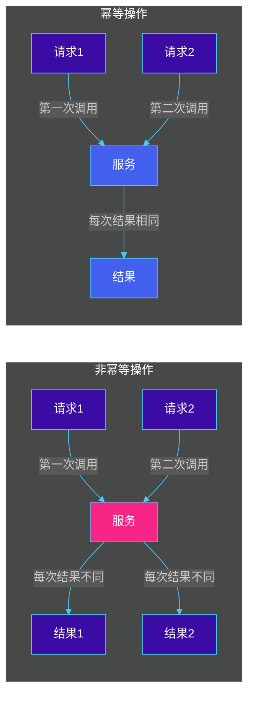

#### 常见幂等性实现方案

**1. 基于唯一请求 ID（最常用）**

```go
package idempotency

import (
    "context"
    "fmt"
    "time"

    "github.com/redis/go-redis/v9"
)

// IdempotencyKey 幂等性键
type IdempotencyKey struct {
    Key       string    // 幂等键
    Value     string    // 结果值
    ExpiresAt time.Time // 过期时间
}

// IdempotencyService 幂等性服务
type IdempotencyService struct {
    redis *redis.Client
}

func NewIdempotencyService(redisClient *redis.Client) *IdempotencyService {
    return &IdempotencyService{redis: redisClient}
}

// ExecuteWithIdempotency 执行幂等操作
func (s *IdempotencyService) ExecuteWithIdempotency(
    ctx context.Context,
    idempotencyKey string,
    operation func() (interface{}, error),
    ttl time.Duration,
) (interface{}, error) {

    // 1. 检查是否已存在幂等键
    cached, err := s.redis.Get(ctx, "idempotency:"+idempotencyKey).Result()
    if err == nil {
        // 已存在，返回缓存结果
        return cached, nil
    }

    // 2. 执行实际操作
    result, err := operation()
    if err != nil {
        return nil, err
    }

    // 3. 存储结果
    resultStr := fmt.Sprintf("%v", result)
    err = s.redis.Set(ctx, "idempotency:"+idempotencyKey, resultStr, ttl).Err()
    if err != nil {
        // 存储失败不影响结果
        fmt.Printf("Failed to store idempotency key: %v\n", err)
    }

    return result, nil
}

// 使用示例
func main() {
    redisClient := redis.NewClient(&redis.Options{
        Addr: "localhost:6379",
    })

    service := NewIdempotencyService(redisClient)

    ctx := context.Background()
    idempotencyKey := "create_order:user123:product456"

    result, err := service.ExecuteWithIdempotency(
        ctx,
        idempotencyKey,
        func() (interface{}, error) {
            // 创建订单的实际逻辑
            return orderService.CreateOrder("user123", "product456")
        },
        24*time.Hour,
    )
}
```

**2. 基于数据库唯一约束**

```java
@Service
public class OrderService {

    @Autowired
    private OrderRepository orderRepository;

    @Transactional
    public Order createOrder(CreateOrderRequest request) {
        // 业务逻辑...
        Order order = Order.builder()
            .orderId(generateOrderId(request)) // 使用请求生成的唯一ID
            .userId(request.getUserId())
            .productId(request.getProductId())
            .amount(request.getAmount())
            .createdAt(LocalDateTime.now())
            .build();

        try {
            return orderRepository.save(order);
        } catch (DataIntegrityViolationException e) {
            // 唯一约束冲突，说明订单已创建
            return orderRepository.findByOrderId(order.getOrderId())
                .orElseThrow(() -> new RuntimeException("Order not found"));
        }
    }

    // 生成幂等订单ID
    private String generateOrderId(CreateOrderRequest request) {
        return String.format("%s_%s_%d",
            request.getUserId(),
            request.getProductId(),
            request.getRequestId() // 客户端生成的请求ID
        );
    }
}
```

**3. 状态机控制**

```go
package workflow

import (
    "errors"
    "fmt"
)

// OrderState 订单状态
type OrderState int

const (
    StateCreated OrderState = iota
    StatePaid
    StateShipped
    StateCompleted
    StateCancelled
)

func (s OrderState) String() string {
    switch s {
    case StateCreated:
        return "Created"
    case StatePaid:
        return "Paid"
    case StateShipped:
        return "Shipped"
    case StateCompleted:
        return "Completed"
    case StateCancelled:
        return "Cancelled"
    default:
        return "Unknown"
    }
}

// 状态转换规则
var stateTransitions = map[OrderState][]OrderState{
    StateCreated:   {StatePaid, StateCancelled},
    StatePaid:      {StateShipped, StateCancelled},
    StateShipped:   {StateCompleted},
    StateCompleted: {},
    StateCancelled: {},
}

// OrderService 订单服务
type OrderService struct {
    // ...
}

// ProcessPayment 处理支付（幂等操作）
func (s *OrderService) ProcessPayment(orderID string, paymentID string) error {
    order, err := s.getOrder(orderID)
    if err != nil {
        return err
    }

    // 幂等性检查：如果已经支付，直接返回成功
    if order.State == StatePaid && order.PaymentID == paymentID {
        return nil // 幂等：重复支付返回成功
    }

    // 检查状态转换是否有效
    if !isValidTransition(order.State, StatePaid) {
        return fmt.Errorf("invalid state transition from %s to Paid", order.State)
    }

    // 执行支付逻辑
    return s.updateOrderState(orderID, StatePaid, paymentID)
}

func isValidTransition(from, to OrderState) bool {
    allowed, ok := stateTransitions[from]
    if !ok {
        return false
    }
    for _, s := range allowed {
        if s == to {
            return true
        }
    }
    return false
}
```

#### 幂等性设计模式对比

| 方案 | 适用场景 | 优点 | 缺点 |
|------|---------|------|------|
| **唯一请求ID** | 所有场景 | 实现简单，通用性强 | 需要额外的存储 |
| **数据库唯一约束** | 有持久化的业务 | 简单可靠 | 依赖数据库 |
| **状态机控制** | 有明确状态的业务 | 逻辑清晰 | 只适用于状态流转 |
| **Token机制** | 用户操作防重复提交 | 用户友好 | 需要额外生成和传递Token |
| **去重表** | 高并发场景 | 性能好 | 增加数据库负担 |

---

## 5.6 限流与降级

当系统面临突发流量或上游攻击时，如果不做任何控制，系统可能会因为资源耗尽而崩溃。限流和降级是保护系统的两道防线。

### 5.6.1 限流算法

#### 常见限流算法

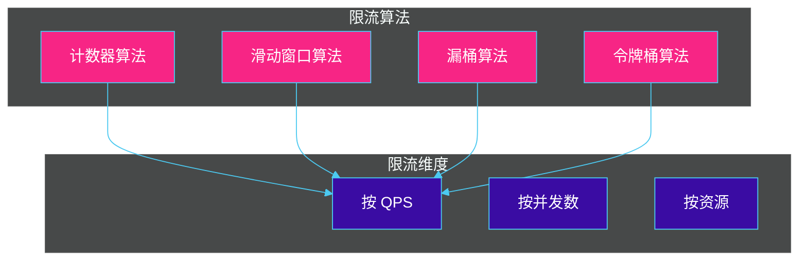

**1. 固定窗口计数器算法（Fixed Window Counter）**

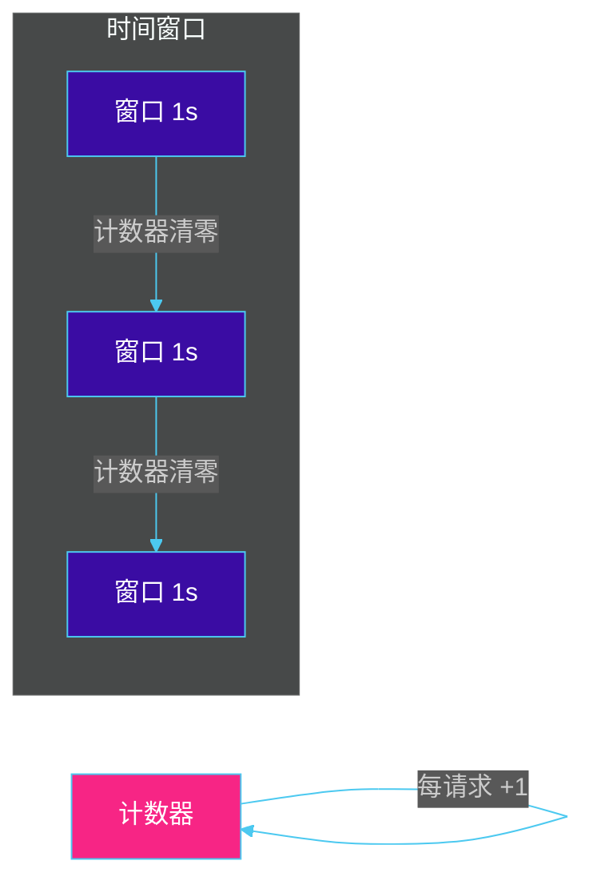

实现简单，但存在临界问题：在窗口边界可能产生 2 倍的流量。

**2. 滑动窗口算法（Sliding Window）**

将时间窗口划分为更小的子窗口，通过计算最近 N 个子窗口的总请求数来实现更精确的限流。

```go
package ratelimit

import (
    "sync"
    "time"
)

// SlidingWindowRateLimiter 滑动窗口限流器
type SlidingWindowRateLimiter struct {
    mu          sync.Mutex
    windowSize  time.Duration // 窗口大小
    bucketCount int          // 桶数量
    buckets     []int        // 每个桶的计数
    currentIdx  int          // 当前桶索引
    lastUpdate  time.Time    // 上次更新时间
    limit       int          // 限制
}

func NewSlidingWindowRateLimiter(windowSize time.Duration, bucketCount int, limit int) *SlidingWindowRateLimiter {
    return &SlidingWindowRateLimiter{
        windowSize:  windowSize,
        bucketCount: bucketCount,
        buckets:     make([]int, bucketCount),
        currentIdx:  0,
        lastUpdate:  time.Now(),
        limit:       limit,
    }
}

// Allow 检查是否允许请求
func (r *SlidingWindowRateLimiter) Allow() bool {
    r.mu.Lock()
    defer r.mu.Unlock()

    now := time.Now()
    elapsed := now.Sub(r.lastUpdate)

    // 如果经过了一个桶的时间，重置当前桶
    bucketDuration := r.windowSize / time.Duration(r.bucketCount)
    if elapsed >= bucketDuration {
        // 计算经过的桶数
        passedBuckets := int(elapsed / bucketDuration)
        for i := 0; i < passedBuckets && i < r.bucketCount; i++ {
            r.currentIdx = (r.currentIdx + 1) % r.bucketCount
            r.buckets[r.currentIdx] = 0
        }
        r.lastUpdate = now
    }

    // 计算当前窗口内的总请求数
    total := 0
    for _, count := range r.buckets {
        total += count
    }

    // 检查是否超过限制
    if total >= r.limit {
        return false
    }

    // 当前桶计数 +1
    r.buckets[r.currentIdx]++
    return true
}
```

**3. 漏桶算法（Leaky Bucket）**

以固定速率处理请求，超出的请求在桶中排队或丢弃。

```go
package ratelimit

import (
    "context"
    "time"
)

// LeakyBucketRateLimiter 漏桶限流器
type LeakyBucketRateLimiter struct {
    capacity   int           // 桶容量
    rate       time.Duration // 漏出速率（每个请求的间隔）
    water      int           // 当前水量
    lastLeakAt time.Time     // 上次漏水时间
}

// NewLeakyBucketRateLimiter 创建漏桶限流器
func NewLeakyBucketRateLimiter(capacity int, rate time.Duration) *LeakyBucketRateLimiter {
    return &LeakyBucketRateLimiter{
        capacity:   capacity,
        rate:       rate,
        water:      0,
        lastLeakAt: time.Now(),
    }
}

// Allow 尝试放入请求
func (l *LeakyBucketRateLimiter) Allow() bool {
    now := time.Now()

    // 计算漏出的水量
    elapsed := now.Sub(l.lastLeakAt)
    leaked := int(elapsed / l.rate)

    if leaked > 0 {
        l.water -= leaked
        if l.water < 0 {
            l.water = 0
        }
        l.lastLeakAt = now
    }

    // 检查是否能放入
    if l.water >= l.capacity {
        return false
    }

    l.water++
    return true
}
```

**4. 令牌桶算法（Token Bucket）** - 最常用

以固定速率向桶中添加令牌，请求需要获取令牌才能执行。

```go
package ratelimit

import (
    "sync"
    "time"
)

// TokenBucketRateLimiter 令牌桶限流器
type TokenBucketRateLimiter struct {
    mu       sync.Mutex
    capacity int           // 桶容量
    tokens   int           // 当前令牌数
    rate     time.Duration // 令牌添加间隔
    lastAdd  time.Time     // 上次添加时间
}

// NewTokenBucketRateLimiter 创建令牌桶限流器
func NewTokenBucketRateLimiter(capacity int, rate time.Duration) *TokenBucketRateLimiter {
    return &TokenBucketRateLimiter{
        capacity: capacity,
        tokens:    capacity, // 初始时满桶
        rate:      rate,
        lastAdd:   time.Now(),
    }
}

// Allow 尝试获取令牌
func (t *TokenBucketRateLimiter) Allow() bool {
    return t.AllowN(1)
}

// AllowN 尝试获取 N 个令牌
func (t *TokenBucketRateLimiter) AllowN(n int) bool {
    t.mu.Lock()
    defer t.mu.Unlock()

    // 添加令牌
    now := time.Now()
    elapsed := now.Sub(t.lastAdd)
    tokensToAdd := int(elapsed / t.rate)

    if tokensToAdd > 0 {
        t.tokens += tokensToAdd
        if t.tokens > t.capacity {
            t.tokens = t.capacity
        }
        t.lastAdd = now
    }

    // 检查令牌是否足够
    if t.tokens >= n {
        t.tokens -= n
        return true
    }

    return false
}
```

#### 限流算法对比

| 算法 | 优点 | 缺点 | 适用场景 |
|------|------|------|---------|
| **固定窗口** | 实现简单 | 临界问题 | 简单限流 |
| **滑动窗口** | 精确度高 | 实现复杂 | API 限流 |
| **漏桶** | 流量平滑 | 无法应对突发 | 固定速率场景 |
| **令牌桶** | 支持突发流量 | 实现稍复杂 | 大多数限流场景 |

### 5.6.2 服务降级策略

服务降级是在系统压力过大或依赖服务故障时，主动降低服务质量以保证核心功能可用的策略。

#### 降级策略分类

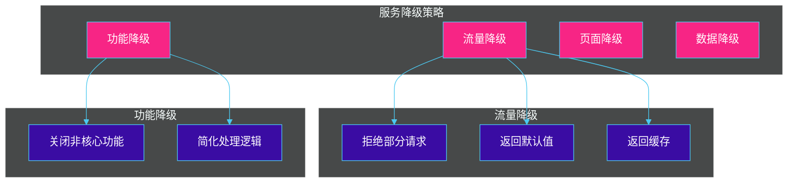

**流量降级**：
- 拒绝部分请求（熔断）
- 返回默认值
- 返回缓存数据
- 返回友好错误提示

**功能降级**：
- 关闭非核心功能
- 简化处理逻辑
- 切换到轻量级实现

**页面降级**：
- 返回静态页面
- 显示默认内容
- 展示友好错误页面

**数据降级**：
- 使用本地缓存数据
- 返回历史数据
- 展示聚合数据而非明细

#### Go 语言实现降级示例

```go
package degrade

import (
    "context"
    "fmt"
    "sync"
    "time"
)

// DegradeType 降级类型
type DegradeType int

const (
    DegradeNone DegradeType = iota
    DegradeReturnDefault  // 返回默认值
    DegradeReturnCache     // 返回缓存
    DegradeReturnError     // 返回错误
    DegradeTimeout         // 超时降级
)

// DegradeConfig 降级配置
type DegradeConfig struct {
    Enable          bool          // 是否启用降级
    DegradeType     DegradeType   // 降级类型
    DefaultValue    interface{}   // 默认值
    CacheExpireTime time.Duration // 缓存过期时间
}

// ServiceDegrader 服务降级器
type ServiceDegrader struct {
    mu      sync.RWMutex
    config  DegradeConfig
    cache   map[string]*CacheEntry
    fallback func(ctx context.Context, req interface{}) (interface{}, error)
}

// CacheEntry 缓存条目
type CacheEntry struct {
    Value     interface{}
    ExpiredAt time.Time
}

// NewServiceDegrader 创建服务降级器
func NewServiceDegrader(config DegradeConfig) *ServiceDegrader {
    return &ServiceDegrader{
        config: config,
        cache:  make(map[string]*CacheEntry),
    }
}

// SetFallback 设置降级回调
func (d *ServiceDegrader) SetFallback(
    fallback func(ctx context.Context, req interface{}) (interface{}, error),
) {
    d.mu.Lock()
    defer d.mu.Unlock()
    d.fallback = fallback
}

// Execute 执行带降级的调用
func (d *ServiceDegrader) Execute(
    ctx context.Context,
    key string,
    operation func() (interface{}, error),
) (interface{}, error) {

    d.mu.RLock()
    config := d.config
    d.mu.RUnlock()

    if !config.Enable {
        return operation()
    }

    // 尝试执行业务逻辑
    result, err := operation()

    // 如果成功，缓存结果
    if err == nil {
        d.cacheResult(key, result)
        return result, nil
    }

    // 失败时执行降级策略
    switch config.DegradeType {
    case DegradeReturnDefault:
        return config.DefaultValue, nil

    case DegradeReturnCache:
        if cached := d.getCachedResult(key); cached != nil {
            return cached, nil
        }
        return config.DefaultValue, nil

    case DegradeReturnError:
        return nil, fmt.Errorf("service degraded: %w", err)

    case DegradeTimeout:
        return nil, context.DeadlineExceeded

    default:
        return nil, err
    }
}

// 缓存结果
func (d *ServiceDegrader) cacheResult(key string, value interface{}) {
    d.mu.Lock()
    defer d.mu.Unlock()

    d.cache[key] = &CacheEntry{
        Value:     value,
        ExpiredAt: time.Now().Add(d.config.CacheExpireTime),
    }
}

// 获取缓存结果
func (d *ServiceDegrader) getCachedResult(key string) interface{} {
    d.mu.RLock()
    defer d.mu.RUnlock()

    entry, ok := d.cache[key]
    if !ok || time.Now().After(entry.ExpiredAt) {
        return nil
    }
    return entry.Value
}

// 使用示例
func main() {
    degrader := NewServiceDegrader(DegradeConfig{
        Enable:          true,
        DegradeType:     DegradeReturnCache,
        DefaultValue:    "default_value",
        CacheExpireTime: 5 * time.Minute,
    })

    ctx := context.Background()

    // 正常调用
    result, err := degrader.Execute(ctx, "user:123", func() (interface{}, error) {
        return userService.GetUserByID(123)
    })

    if err != nil {
        fmt.Printf("Error: %v\n", err)
    } else {
        fmt.Printf("Result: %v\n", result)
    }
}
```

#### Spring Cloud 降级示例

```java
// 使用 OpenFeign 实现降级
@FeignClient(
    name = "user-service",
    fallback = UserClientFallback.class,
    configuration = FeignConfiguration.class
)
public interface UserClient {

    @GetMapping("/users/{id}")
    User getUser(@PathVariable("id") Long id);

    @GetMapping("/users/{id}/orders")
    List<Order> getUserOrders(@PathVariable("id") Long id);
}

// 降级实现类
@Component
public class UserClientFallback implements UserClient {

    private static final Logger log = LoggerFactory.getLogger(UserClientFallback.class);

    @Override
    public User getUser(Long id) {
        log.warn("Fallback triggered for getUser({})", id);
        return User.builder()
            .id(id)
            .name("Default User")
            .email("default@example.com")
            .build();
    }

    @Override
    public List<Order> getUserOrders(Long id) {
        log.warn("Fallback triggered for getUserOrders({})", id);
        return Collections.emptyList();
    }
}
```

```java
// 基于 Sentinel 的降级
@Configuration
public class SentinelConfig {

    @PostConstruct
    public void init() {
        // 定义资源
        DegradeRuleManager.loadRules(Arrays.asList(
            new DegradeRule("userService")
                .setGrade(CircuitBreakerStrategy.SLOW_REQUEST_RATIO.getType())
                .setCount(0.5) // 50% 慢请求比例触发
                .setSlowRatioThreshold(2.0) // 超过 2s 视为慢请求
                .setMinRequestAmount(5) // 最小请求数
                .setStatIntervalMs(30000) // 统计时间窗口
                .setTimeWindow(10), // 熔断时间窗口

            new DegradeRule("orderService")
                .setGrade(CircuitBreakerStrategy.ERROR_RATIO.getType())
                .setCount(0.5) // 50% 错误比例触发
                .setMinRequestAmount(5)
                .setTimeWindow(10)
        ));
    }
}

// 使用 Sentinel 降级
public class OrderService {

    public Order createOrder(CreateOrderRequest request) {
        try (Entry entry = SphU.entry("createOrder")) {
            return orderRepository.create(request);
        } catch (BlockException e) {
            // 触发降级
            return handleCreateOrderDegrade(request);
        }
    }

    private Order handleCreateOrderDegrade(CreateOrderRequest request) {
        log.warn("Create order degraded for request: {}", request);
        return Order.builder()
            .status(OrderStatus.PENDING)
            .message("Order is being processed - please check later")
            .build();
    }
}
```

#### 限流与降级对比

| 维度 | 限流 | 降级 |
|------|------|------|
| **目的** | 保护系统不被过载 | 保护核心功能可用 |
| **时机** | 流量超过阈值时 | 依赖服务故障时 |
| **策略** | 拒绝/排队/延迟 | 返回默认值/缓存/简化逻辑 |
| **影响** | 部分请求失败 | 部分功能降级 |
| **触发条件** | QPS/并发数超过限制 | 错误率/延迟超过阈值 |
| **执行方式** | 主动拦截 | 被动触发 |

---

## 5.7 配置管理

在微服务架构中，服务实例众多，配置管理变得复杂。集中配置中心允许我们统一管理所有服务的配置，支持配置的动态更新。

### 5.7.1 集中配置中心

#### 集中配置架构

```mermaid
%%{init: {'theme': 'dark', 'themeVariables': { 'primaryColor': '#4361ee', 'primaryTextColor': '#ffffff', 'primaryBorderColor': '#4cc9f0', 'lineColor': '#4cc9f0', 'secondaryColor': '#3a0ca3', 'tertiaryColor': '#1a1a2e', 'noteBkgColor': '#3a0ca3', 'noteTextColor': '#ffffff', 'noteBorderColor': '#4cc9f0', 'fontFamily': 'Arial' }}}%%
flowchart TB
    subgraph 配置中心
        CC[配置中心服务]
        DB[(配置数据库)]
    end

    CC --> DB

    subgraph 应用服务
        S1[Service A]
        S2[Service B]
        S3[Service C]
    end

    subgraph 配置变更流程
        Admin[配置管理员]
        Admin -->|修改配置| CC
    end

    S1 -->|拉取/订阅| CC
    S2 -->|拉取/订阅| CC
    S3 -->|拉取/订阅| CC

    style CC fill:#4361ee,stroke:#4cc9f0,color:#ffffff
    style DB fill:#f72585,stroke:#4cc9f0,color:#ffffff
    style S1 fill:#3a0ca3,stroke:#4cc9f0,color:#ffffff
    style S2 fill:#3a0ca3,stroke:#4cc9f0,color:#ffffff
    style S3 fill:#3a0ca3,stroke:#4cc9f0,color:#ffffff
    style Admin fill:#3a0ca3,stroke:#4cc9f0,color:#ffffff
```

#### 主流配置中心对比

| 特性 | Apollo | Nacos | Spring Cloud Config | Consul |
|------|--------|-------|---------------------|--------|
| **配置变更推送** | Web UI + SDK 推送 | Web UI + SDK 推送 | Git Hook / Bus | KV 监听 |
| **版本管理** | 支持 | 支持 | Git 自然支持 | 支持 |
| **多环境** | 支持 | 支持 | 通过 profile | 支持 |
| **权限管理** | 完整 | 基础 | 无 | 基础 |
| **客户端支持** | 多语言 | 多语言 | Java 为主 | 多语言 |
| **控制台** | 功能完善 | 功能完善 | 无（需自建） | 无（需自建） |
| **国产化** | 是 | 是 | 否 | 否 |

#### Nacos 配置中心示例

**Java SDK 使用示例**：

```java
// 初始化 Nacos 配置服务
@Configuration
public class NacosConfig {

    @Bean
    public ConfigService nacosConfigService() throws Exception {
        Properties properties = new Properties();
        properties.put("serverAddr", "nacos-server:8848");
        properties.put("namespace", "production");
        properties.put("username", "nacos");
        properties.put("password", "nacos");
        return NacosFactory.createConfigService(properties);
    }
}

// 监听配置变更
@Service
public class UserConfigService {

    @Autowired
    private ConfigService configService;

    @PostConstruct
    public void init() throws Exception {
        // 监听配置变化
        configService.addListener(
            "user-service.yaml",  // dataId
            "DEFAULT_GROUP",       // group
            new Listener() {
                @Override
                public void receiveConfigInfo(String configInfo) {
                    // 配置变更回调
                    System.out.println("Config changed: " + configInfo);
                    // 重新加载配置
                    reloadConfig(configInfo);
                }

                @Override
                public Executor getExecutor() {
                    return Executors.newSingleThreadExecutor();
                }
            }
        );
    }

    // 获取配置
    public String getConfig() throws Exception {
        return configService.getConfig("user-service.yaml", "DEFAULT_GROUP", 5000);
    }

    // 发布配置
    public boolean publishConfig(String content) throws Exception {
        return configService.publishConfig("user-service.yaml", "DEFAULT_GROUP", content);
    }
}
```

**Spring Cloud 集成**：

```yaml
# bootstrap.yml
spring:
  application:
    name: user-service
  cloud:
    nacos:
      config:
        server-addr: nacos-server:8848
        namespace: production
        group: DEFAULT_GROUP
        file-extension: yaml
        refresh-enabled: true
        shared-configs:
          - data-id: common.yaml
            group: COMMON_GROUP
            refresh: true
```

```java
// 使用 @RefreshScope 实现配置热更新
@RestController
@RequestMapping("/users")
@RefreshScope
public class UserController {

    @Value("${user.max-count:100}")
    private int maxCount;

    @Value("${user.default-role:guest}")
    private String defaultRole;

    @GetMapping("/config")
    public Map<String, Object> getConfig() {
        Map<String, Object> config = new HashMap<>();
        config.put("maxCount", maxCount);
        config.put("defaultRole", defaultRole);
        return config;
    }
}
```

#### Apollo 配置中心示例

```java
// Apollo 配置示例
@Configuration
@EnableApolloConfig
public class ApolloConfig {

    @Bean
    public AppNamespace appNamespace() {
        return new AppNamespace("user-service", "yaml");
    }
}

// 监听配置变更
@Component
public class UserApolloConfig {

    @ApolloConfig
    private Config config;

    @ApolloConfigChangeListener
    private void onConfigChange(ConfigChangeEvent changeEvent) {
        for (String key : changeEvent.changedKeys()) {
            ConfigChange change = changeEvent.getChange(key);
            System.out.printf("Config changed: key=%s, oldValue=%s, newValue=%s%n",
                key, change.getOldValue(), change.getNewValue());
        }
        // 重新加载相关配置
        reload();
    }
}

// 使用配置
@ConfigurationProperties(prefix = "user")
public class UserProperties {
    private int maxCount = 100;
    private String defaultRole = "guest";

    // getters and setters
}
```

### 5.7.2 热更新机制

热更新（Hot Reload）是指在不重启服务的情况下动态更新配置。配置中心通过长连接或轮询机制感知配置变更，并通知客户端重新加载配置。

#### 热更新流程

```mermaid
%%{init: {'theme': 'dark', 'themeVariables': { 'primaryColor': '#4361ee', 'primaryTextColor': '#ffffff', 'primaryBorderColor': '#4cc9f0', 'lineColor': '#4cc9f0', 'secondaryColor': '#3a0ca3', 'tertiaryColor': '#1a1a2e', 'noteBkgColor': '#3a0ca3', 'noteTextColor': '#ffffff', 'noteBorderColor': '#4cc9f0', 'fontFamily': 'Arial', 'actorBkg': '#3a0ca3', 'actorBorderColor': '#4cc9f0', 'actorTextColor': '#ffffff', 'signalColor': '#4cc9f0', 'signalTextColor': '#ffffff' }}}%%
sequenceDiagram
    participant Admin as 配置管理员
    participant CC as 配置中心
    participant Client as 服务客户端

    Admin->>CC: 修改配置
    CC->>CC: 保存配置
    CC->>Client: 推送配置变更通知
    Client->>Client: 重新拉取最新配置
    Client->>Client: 更新内存中的配置
    Client->>CC: 确认配置已更新
    Note over Client: 配置生效，无需重启
```

#### 配置变更监听接口

```go
package config

import (
    "context"
    "fmt"
    "sync"

    "github.com/nacos-group/nacos-sdk-go/v2/clients"
    "github.com/nacos-group/nacos-sdk-go/v2/common/constant"
    "github.com/nacos-group/nacos-sdk-go/v2/vo"
)

// ConfigCallback 配置变更回调
type ConfigCallback func(config string)

// ConfigManager 配置管理器
type ConfigManager struct {
    mu       sync.RWMutex
    configs  map[string]string
    callback map[string][]ConfigCallback
}

// NewConfigManager 创建配置管理器
func NewConfigManager() *ConfigManager {
    return &ConfigManager{
        configs:  make(map[string]string),
        callback: make(map[string][]ConfigCallback),
    }
}

// WatchConfig 监听配置变更
func (cm *ConfigManager) WatchConfig(dataID, group string, serverAddr string) error {
    // 创建配置客户端
    client, err := clients.NewConfigClient(
        vo.NacosClientParam{
            ClientConfig: &constant.ClientConfig{
                TimeoutMs:      5000,
                NamespaceId:     "public",
                ListenInterval: 30000,
            },
            ServerConfigs: []constant.ServerConfig{
                {
                    IpAddr: serverAddr,
                    Port:   8848,
                },
            },
        },
    )
    if err != nil {
        return fmt.Errorf("failed to create config client: %w", err)
    }

    // 首次获取配置
    content, err := client.GetConfig(vo.ConfigParam{
        DataID: dataID,
        Group:  group,
    })
    if err == nil {
        cm.SetConfig(dataID, content)
    }

    // 监听配置变更
    err = client.ListenConfig(vo.ConfigParam{
        DataID: dataID,
        Group:  group,
        OnChange: func(namespace, group, dataID, config string) {
            fmt.Printf("Config changed: %s/%s\n", group, dataID)
            cm.SetConfig(dataID, config)
            cm.NotifyCallbacks(dataID, config)
        },
    })

    return err
}

// SetConfig 设置配置
func (cm *ConfigManager) SetConfig(dataID, content string) {
    cm.mu.Lock()
    defer cm.mu.Unlock()
    cm.configs[dataID] = content
}

// GetConfig 获取配置
func (cm *ConfigManager) GetConfig(dataID string) string {
    cm.mu.RLock()
    defer cm.mu.RUnlock()
    return cm.configs[dataID]
}

// RegisterCallback 注册配置变更回调
func (cm *ConfigManager) RegisterCallback(dataID string, callback ConfigCallback) {
    cm.mu.Lock()
    defer cm.mu.Unlock()
    cm.callback[dataID] = append(cm.callback[dataID], callback)
}

// NotifyCallbacks 通知所有回调
func (cm *ConfigManager) NotifyCallbacks(dataID, config string) {
    cm.mu.RLock()
    callbacks := cm.callback[dataID]
    cm.mu.RUnlock()

    for _, cb := range callbacks {
        cb(config)
    }
}

// 使用示例
func main() {
    cm := NewConfigManager()

    // 注册回调
    cm.RegisterCallback("user-service.yaml", func(config string) {
        fmt.Println("User config reloaded!")
        // 重新解析和应用配置
    })

    // 启动配置监听
    ctx := context.Background()
    go func() {
        if err := cm.WatchConfig("user-service.yaml", "DEFAULT_GROUP", "localhost:8848"); err != nil {
            fmt.Printf("Watch error: %v\n", err)
        }
    }()

    <-ctx.Done()
}
```

#### 配置刷新注解实现

```java
// 自定义配置刷新注解
@Target({ElementType.FIELD, ElementType.TYPE})
@Retention(RetentionPolicy.RUNTIME)
@Documented
public @interface ConfigRefresh {

    String value() default "";

    Class<?> configClass() default Void.class;
}

// 配置刷新服务
@Service
public class ConfigRefreshService implements ApplicationContextAware {

    private ApplicationContext applicationContext;
    private final Map<String, Object> configCache = new ConcurrentHashMap<>();

    @Autowired
    private ConfigService configService;

    @PostConstruct
    public void init() {
        // 启动时加载所有配置
        loadAllConfigs();
    }

    @Override
    public void setApplicationContext(ApplicationContext context) throws BeansException {
        this.applicationContext = context;
    }

    public void loadAllConfigs() {
        // 获取所有带有 @ConfigurationProperties 的 Bean
        Map<String, Object> beans = applicationContext.getBeansWithAnnotation(
            ConfigurationProperties.class);

        for (Object bean : beans.values()) {
            refreshBeanConfig(bean);
        }
    }

    public void refreshBeanConfig(Object bean) {
        String beanName = bean.getClass().getName();
        try {
            // 重新绑定配置
            ((AbstractApplicationContext) applicationContext)
                .getBeanFactory().autowireBean(bean);

            // 清除方法缓存
            if (bean instanceof Cacheable) {
                ((Cacheable) bean).clearCache();
            }

            System.out.println("Config refreshed for: " + beanName);
        } catch (Exception e) {
            System.err.println("Failed to refresh config for: " + beanName);
        }
    }

    public void refreshConfig(String dataId, String content) {
        // 解析新的配置内容
        Properties newProps = new Properties();
        try {
            newProps.load(new StringReader(content));
        } catch (IOException e) {
            System.err.println("Failed to parse config: " + e.getMessage());
            return;
        }

        // 更新缓存
        configCache.put(dataId, newProps);

        // 触发刷新
        loadAllConfigs();
    }
}
```

#### 热更新最佳实践

```mermaid
%%{init: {'theme': 'dark', 'themeVariables': { 'primaryColor': '#4361ee', 'primaryTextColor': '#ffffff', 'primaryBorderColor': '#4cc9f0', 'lineColor': '#4cc9f0', 'secondaryColor': '#3a0ca3', 'tertiaryColor': '#1a1a2e', 'noteBkgColor': '#3a0ca3', 'noteTextColor': '#ffffff', 'noteBorderColor': '#4cc9f0', 'fontFamily': 'Arial' }}}%%
flowchart TB
    subgraph 配置管理生命周期
        A[配置定义] --> B[配置存储]
        B --> C[配置分发]
        C --> D[配置应用]
        D --> E[配置监控]
        E --> A
    end

    subgraph 配置优先级
        P1[环境变量]
        P2[命令行参数]
        P3[远程配置]
        P4[本地默认配置]
    end

    P1 --> P2
    P2 --> P3
    P3 --> P4

    style A fill:#4361ee,stroke:#4cc9f0,color:#ffffff
    style B fill:#f72585,stroke:#4cc9f0,color:#ffffff
    style C fill:#3a0ca3,stroke:#4cc9f0,color:#ffffff
    style D fill:#4361ee,stroke:#4cc9f0,color:#ffffff
    style E fill:#f72585,stroke:#4cc9f0,color:#ffffff
    style P1 fill:#3a0ca3,stroke:#4cc9f0,color:#ffffff
    style P2 fill:#3a0ca3,stroke:#4cc9f0,color:#ffffff
    style P3 fill:#3a0ca3,stroke:#4cc9f0,color:#ffffff
    style P4 fill:#3a0ca3,stroke:#4cc9f0,color:#ffffff
```

**配置热更新最佳实践**：

1. **区分静态配置和动态配置**
   - 静态配置：启动时加载，运行期间不变
   - 动态配置：支持运行时刷新

2. **配置变更需要幂等处理**
   - 重复应用相同配置不应产生副作用

3. **配置变更需要灰度发布**
   - 先对部分实例生效，观察无异常后再全量发布

4. **配置需要版本管理**
   - 保留配置变更历史
   - 支持配置回滚

5. **敏感配置需要加密**
   - 密码、密钥等敏感信息加密存储

---

## 本章小结

本章介绍了微服务治理的核心机制，包括：

1. **服务发现**：解决了"服务在哪里"的问题。客户端发现和服务端发现各有优缺点，Consul、Eureka、Nacos 是主流的注册中心方案。

2. **负载均衡**：将请求合理分发到多个服务实例。客户端负载均衡适合微服务内部调用，服务端负载均衡适合入口流量分发。常用算法包括轮询、加权轮询、最少连接、IP Hash 等。

3. **熔断器模式**：防止故障在系统中扩散。通过 Closed、Open、Half-Open 三种状态监控服务健康状况，故障时快速熔断，恢复后逐步探测。

4. **重试机制**：提高系统容错能力。需要配合指数退避算法和幂等性设计，避免重试风暴和对系统造成更大压力。

5. **限流与降级**：保护系统不被过载。令牌桶是最常用的限流算法，降级策略在服务故障时保证核心功能可用。

6. **配置管理**：集中管理微服务配置，支持配置的动态热更新，无需重启服务即可生效。

---

## 思考题

1. **服务发现**：
   - 在实际项目中，如何选择客户端发现和服务端发现？
   - 如果注册中心全部宕机，服务还能正常调用吗？如何保证高可用？

2. **负载均衡**：
   - 在什么场景下 IP Hash 算法会比轮询算法更合适？
   - 如何实现一个支持权重的最少连接算法？

3. **熔断器**：
   - 熔断器的阈值（失败率、超时时间）如何设置才合理？
   - 如果服务从 Half-Open 状态恢复后再次失败，熔断器应该如何处理？

4. **重试机制**：
   - 重试次数和退避时间设置过大会带来什么问题？
   - 如何区分"可重试的错误"和"不可重试的错误"？

5. **限流与降级**：
   - 令牌桶和漏桶算法各有什么特点？适用场景有什么不同？
   - 设计一个系统：需要同时实现限流、熔断和降级，它们的执行顺序应该是怎样的？

6. **配置管理**：
   - 配置变更如何在多个实例间保证一致性？
   - 如果配置中心推送的配置与本地配置冲突，应该以哪个为准？
