# 第六章：分布式数据管理

## 本章目录

- [6.1 数据库 per service 原则](#61-数据库-per-service-原则)
- [6.2 分布式数据管理挑战](#62-分布式数据管理挑战)
- [6.3 CAP 定理](#63-cap-定理)
- [6.4 BASE 理论](#64-base-理论)
- [6.5 CQRS 模式](#65-cqrs-模式)
- [6.6 Saga 模式](#66-saga-模式)
- [6.7 分布式 ID 生成策略](#67-分布式-id-生成策略)
- [6.8 数据一致性解决方案对比](#68-数据一致性解决方案对比)
- [本章小结](#本章小结)
- [思考题](#思考题)

---

## 6.1 数据库 per service 原则

### 6.1.1 什么是 Database per Service

Database per Service（每个服务一个数据库）是微服务架构的核心数据管理原则。它要求每个微服务拥有自己独立的数据库，与其他服务完全解耦。

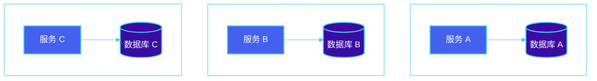

### 6.1.2 为什么需要 Database per Service

**传统单体架构的问题：**

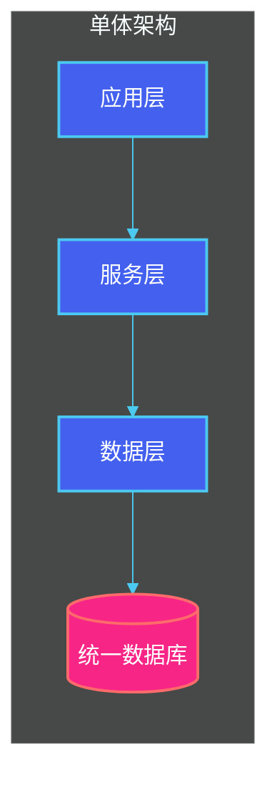

在单体架构中，所有服务共享一个数据库，导致：
- 服务之间产生隐式耦合
- 单点故障影响整个系统
- 难以独立扩展单个服务
- 技术栈选择受限

**微服务架构的优势：**

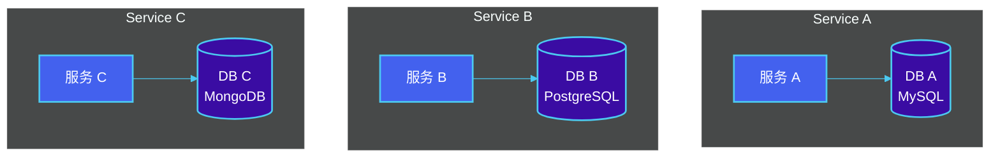

### 6.1.3 数据库类型选择

根据业务场景选择合适的数据库类型：

| 业务场景 | 推荐数据库 | 原因 |
|---------|-----------|------|
| 用户账户、订单 | PostgreSQL | 强一致性、事务支持 |
| 商品缓存、会话 | Redis | 高性能、丰富数据结构 |
| 日志、监控数据 | MongoDB | 灵活schema、高写入 |
| 全文搜索 | Elasticsearch | 强大的搜索能力 |
| 关系复杂报表 | MySQL | 成熟稳定、OLTP |

### 6.1.4 实现模式

**模式一：私有数据库（Private Table）**

每个服务拥有独立的表集合，通过数据库用户名/权限隔离。

```sql
-- 服务 A 的数据库
CREATE TABLE service_a.orders (...);
CREATE TABLE service_a.users (...);

-- 服务 B 的数据库
CREATE TABLE service_b.products (...);
```

**模式二：Schema 隔离**

同一数据库实例中，使用不同的 Schema 隔离。

```sql
CREATE SCHEMA service_a;
CREATE SCHEMA service_b;

GRANT ALL ON SCHEMA service_a TO svc_a_user;
GRANT ALL ON SCHEMA service_b TO svc_b_user;
```

**模式三：完全独立数据库**

每个服务使用独立的数据库实例，数据库类型也可以不同。

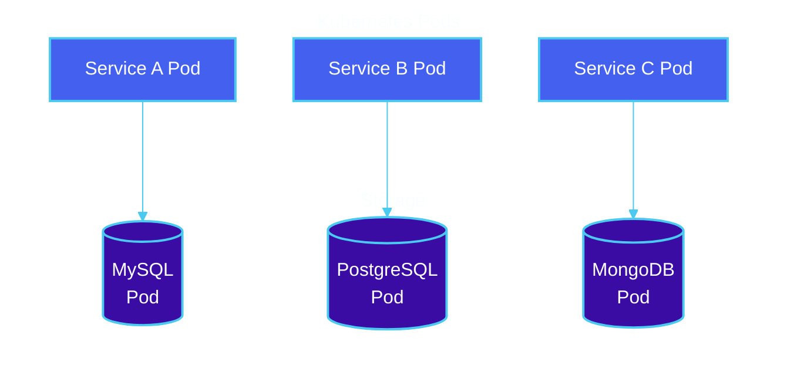

### 6.1.5 数据库 per Service 实施检查清单

```markdown
□ 每个服务有独立的数据库连接配置
□ 服务间不允许直接访问对方数据库表
□ 数据库 schema 变更通过服务自身管理
□ 每个服务可以独立选择数据库技术
□ 数据库可以独立于服务进行扩展
□ 跨服务数据访问必须通过 API 进行
```

---

## 6.2 分布式数据管理挑战

### 6.2.1 挑战概览

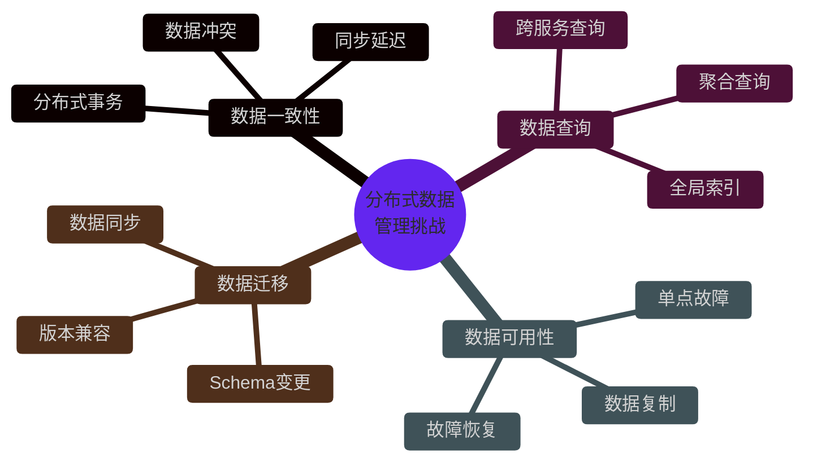

### 6.2.2 跨服务数据查询

**问题描述：**

当需要查询分散在多个服务中的数据时，无法像单体架构那样使用简单的 JOIN 操作。

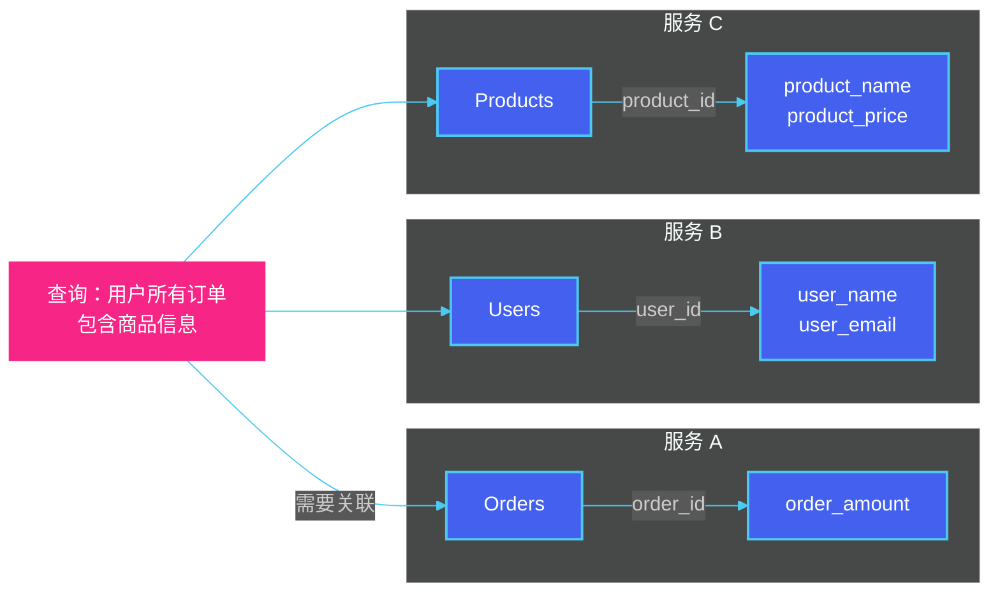

**解决方案：API 组合模式**

```go
// Go 示例：API 组合查询
type OrderWithDetails struct {
    OrderID     string    `json:"order_id"`
    UserName    string    `json:"user_name"`
    UserEmail   string    `json:"user_email"`
    Products    []Product `json:"products"`
    TotalAmount float64   `json:"total_amount"`
}

func GetOrderWithDetails(orderID string) (*OrderWithDetails, error) {
    // 1. 查询订单信息（服务 A）
    order, err := orderClient.GetOrder(orderID)
    if err != nil {
        return nil, err
    }
    
    // 2. 查询用户信息（服务 B）
    user, err := userClient.GetUser(order.UserID)
    if err != nil {
        return nil, err
    }
    
    // 3. 查询商品信息（服务 C）
    products, err := productClient.GetProducts(order.ProductIDs)
    if err != nil {
        return nil, err
    }
    
    // 4. 组装结果
    return &OrderWithDetails{
        OrderID:     order.ID,
        UserName:    user.Name,
        UserEmail:   user.Email,
        Products:    products,
        TotalAmount: order.Amount,
    }, nil
}
```

### 6.2.3 分布式事务问题

**问题描述：**

在单体架构中，使用本地事务即可保证 ACID 特性。在微服务架构中，一个业务操作可能涉及多个服务，每个服务有独立的数据库。

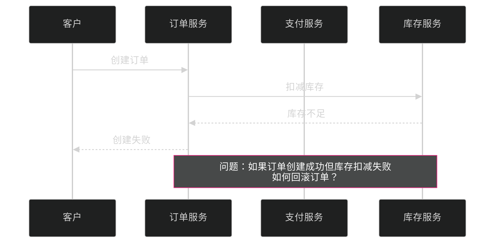

**问题场景：转账操作**

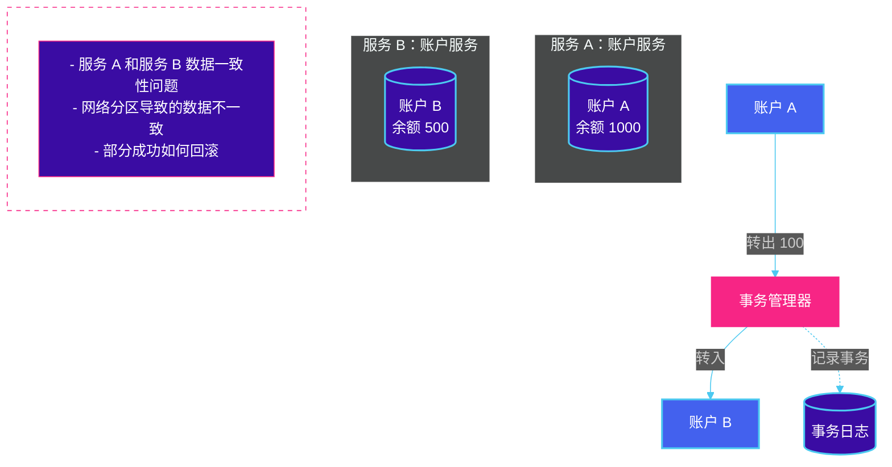

### 6.2.4 数据同步与一致性延迟

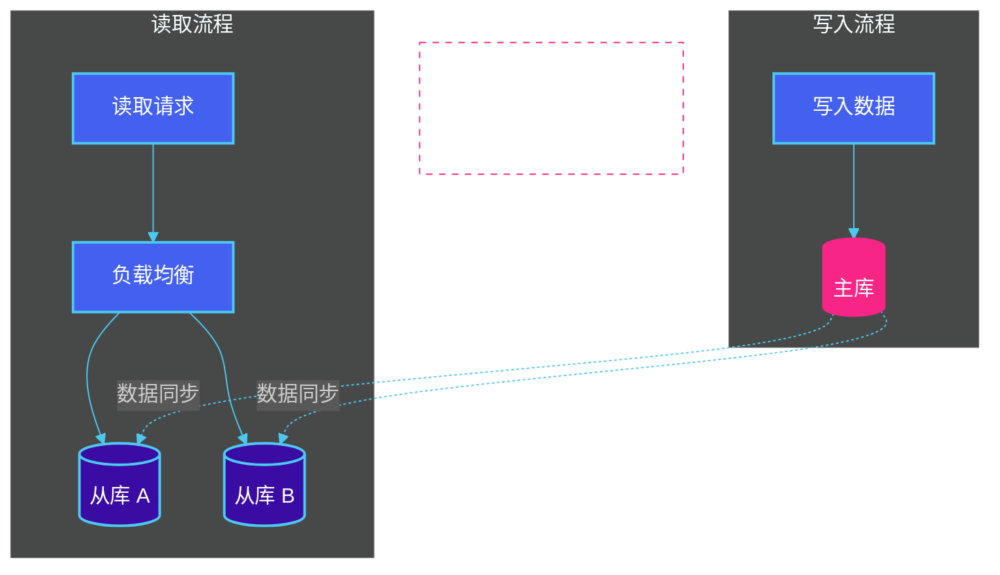

### 6.2.5 挑战应对策略

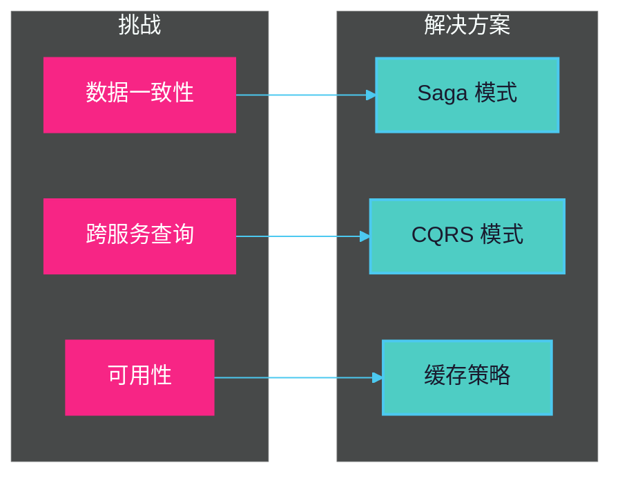

| 挑战类型 | 应对策略 | 适用场景 |
|---------|---------|---------|
| 跨服务查询 | API 组合、API 网关聚合 | 低频跨服务查询 |
| 跨服务查询 | CQRS + 物化视图 | 高频复杂查询 |
| 数据一致性 | Saga 模式 | 长时间分布式事务 |
| 数据一致性 | 事件驱动 | 可接受最终一致性 |
| 数据同步延迟 | 读写分离 | 读多写少场景 |

---

## 6.3 CAP 定理

### 6.3.1 CAP 定理定义

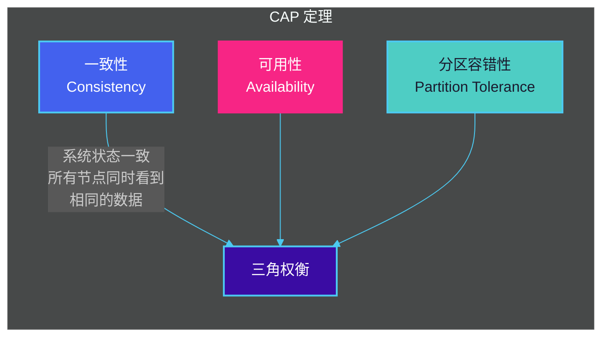

**定义解释：**

- **一致性（Consistency）**：在分布式系统中的任何操作，都必须在所有节点上产生相同的结果，所有节点看到的数据是一致的。

- **可用性（Availability）**：系统在存在节点故障的情况下，仍能响应客户端的请求。

- **分区容错性（Partition Tolerance）**：系统在网络分区故障时，仍能继续运行。

### 6.3.2 CAP 三角权衡

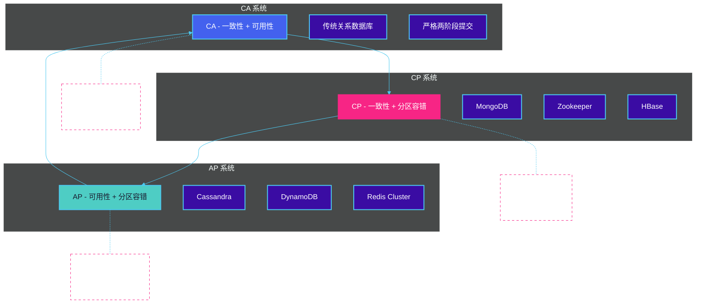

### 6.3.3 CAP 定理的实际应用

**场景一：Zookeeper（CP 系统）**

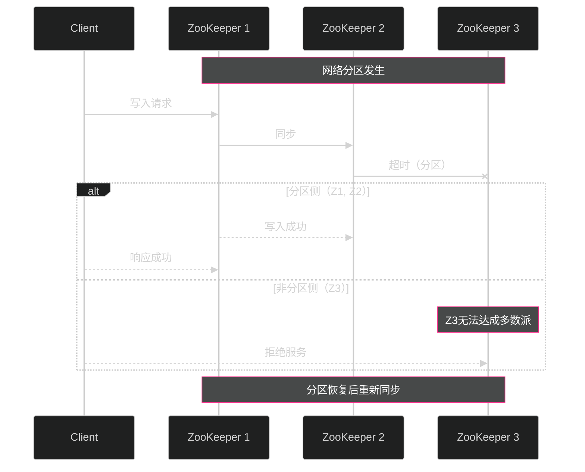

**场景二：Cassandra（AP 系统）**

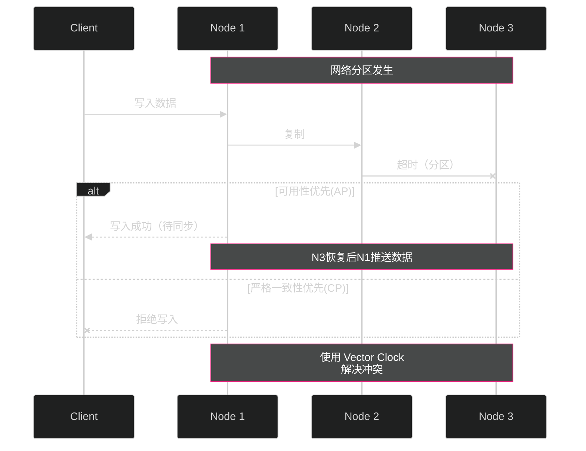

### 6.3.4 CAP 定理的误区

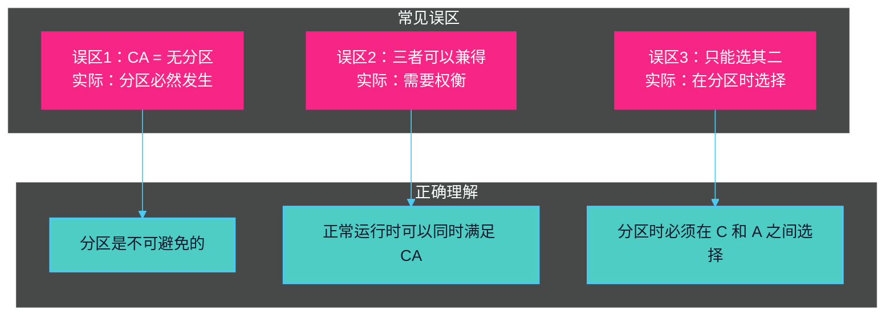

### 6.3.5 CAP 定理选择指南

| 系统类型 | 选择场景 | 代表产品 | 一致性级别 |
|---------|---------|---------|-----------|
| CP | 金融交易、库存管理 | ZooKeeper, HBase, MongoDB | 强一致性 |
| AP | 社交Feed、日志采集 | Cassandra, DynamoDB, Redis | 最终一致性 |
| CA | 单机关系型数据库 | MySQL, PostgreSQL | 严格一致性 |

**选择建议：**

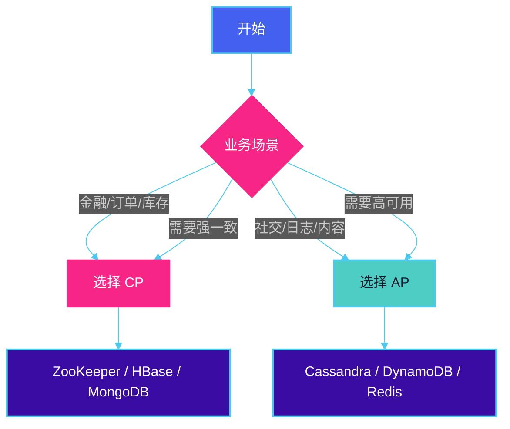

---

## 6.4 BASE 理论

### 6.4.1 BASE 理论定义

BASE 理论是对 CAP 定理中一致性和可用性权衡的总结，是BASE = **B**asically **A**vailable **S**oft state **E**ventually consistent 的缩写。

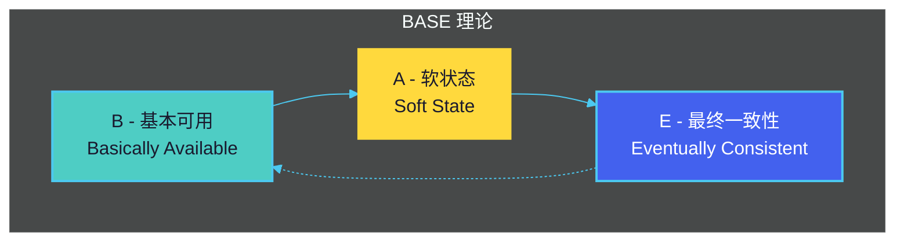

### 6.4.2 基本可用（Basically Available）

**定义：** 系统在出现故障时，允许损失部分可用性，保证核心功能可用。

**实现方式：**

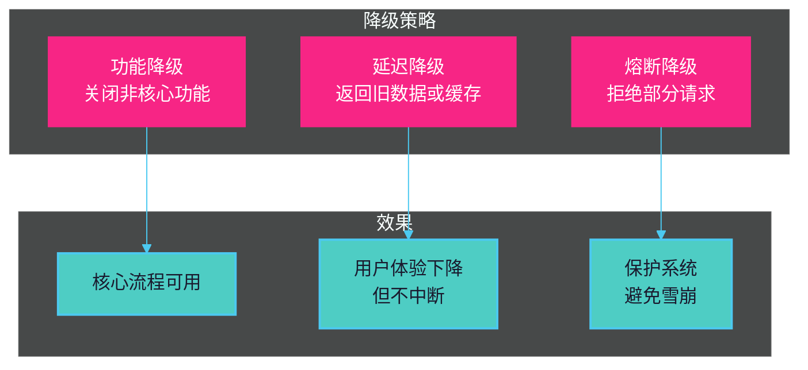

**实际案例 - 电商系统：**

```go
// Go 示例：基本可用的降级实现
func (s *OrderService) GetProductInfo(productID string) (*ProductInfo, error) {
    // 尝试获取实时数据
    product, err := s.productClient.GetProduct(productID)
    if err != nil {
        // 降级：尝试从缓存获取
        product, err = s.cacheClient.GetProduct(productID)
        if err != nil {
            // 进一步降级：返回商品下架提示
            return &ProductInfo{
                ProductID:   productID,
                Name:        "商品信息暂时不可用",
                Description: "请稍后再试",
                Available:   false,
                Source:      "degraded",
            }, nil
        }
        product.Source = "cache"
    }
    return product, nil
}
```

### 6.4.3 软状态（Soft State）

**定义：** 系统状态可以在一段时间内不一致，存在中间状态。

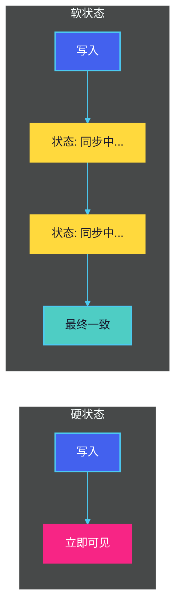

**典型场景：**

```go
// 订单状态转换示例
type OrderStatus string

const (
    StatusPending   OrderStatus = "pending"    // 软状态：等待支付
    StatusPaid      OrderStatus = "paid"       // 软状态：支付同步中
    StatusConfirmed OrderStatus = "confirmed"  // 硬状态：已确认
    StatusCancelled OrderStatus = "cancelled"  // 硬状态：已取消
)

// 订单创建时立即返回，不等待支付和库存同步
order := &Order{
    ID:        generateID(),
    Status:    StatusPending,  // 软状态
    CreatedAt: time.Now(),
}
// 立即返回给用户，实际同步在后台进行
return order, nil
```

### 6.4.4 最终一致性（Eventually Consistent）

**定义：** 系统在经过一段时间后，所有节点的数据最终会达成一致。

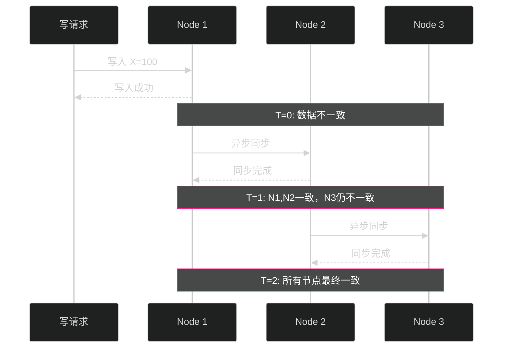

**最终一致性变种：**

```mermaid
%%{init: {'theme': 'dark', 'themeVariables': {'primaryColor': '#4361ee', 'primaryTextColor': '#ffffff', 'primaryBorderColor': '#4cc9f0', 'lineColor': '#4cc9f0', 'secondaryColor': '#3a0ca3'}}}%%
graph TB
    subgraph "因果一致性"
        CA1[因果关系<br/>按需同步]
    end

    subgraph "读己之所写"
        CA2[读取自己<br/>写的内容]
    end

    subgraph "单调读"
        CA3[保证读取<br/>不会回退]
    end

    subgraph "单调写"
        CA4[同一节点的<br/>写操作有序]
    end

    subgraph "最终一致性"
        CA5[所有副本<br/>最终相同]
    end

    CA5 -.-> CA1
    CA1 -.-> CA2
    CA2 -.-> CA3
    CA3 -.-> CA4
    CA4 -.-> CA5

    style CA1 fill:#4ecdc4,stroke:#4cc9f0,stroke-width:2px,color:#1a1a2e
    style CA2 fill:#4ecdc4,stroke:#4cc9f0,stroke-width:2px,color:#1a1a2e
    style CA3 fill:#4ecdc4,stroke:#4cc9f0,stroke-width:2px,color:#1a1a2e
    style CA4 fill:#4ecdc4,stroke:#4cc9f0,stroke-width:2px,color:#1a1a2e
    style CA5 fill:#4361ee,stroke:#4cc9f0,stroke-width:2px,color:#ffffff
```

### 6.4.5 BASE vs ACID

| 特性 | ACID (传统事务) | BASE (分布式) |
|-----|----------------|---------------|
| 一致性 | 强一致性 | 最终一致性 |
| 可用性 | 低可用性 | 高可用性 |
| 隔离性 | 严格隔离 | 宽松隔离 |
| 事务 | 短事务 | 长事务 |
| 响应时间 | 即时 | 异步 |
| 适用场景 | 金融、订单 | 社交、缓存、日志 |

**实际选择：**

```mermaid
%%{init: {'theme': 'dark', 'themeVariables': {'primaryColor': '#4361ee', 'primaryTextColor': '#ffffff', 'primaryBorderColor': '#4cc9f0', 'lineColor': '#4cc9f0', 'secondaryColor': '#3a0ca3'}}}%%
flowchart LR
    subgraph "金融/订单系统"
        A1[强一致性] --> A2[选择 ACID]
    end

    subgraph "社交/内容系统"
        B1[高可用性] --> B2[选择 BASE]
    end

    subgraph "库存系统"
        C1[库存扣减] --> C2[选择 ACID]
        C1 --> C3[库存查询] --> C4[选择 BASE]
    end

    style A1 fill:#4361ee,stroke:#4cc9f0,stroke-width:2px,color:#ffffff
    style A2 fill:#f72585,stroke:#f72585,stroke-width:2px,color:#ffffff
    style B1 fill:#4361ee,stroke:#4cc9f0,stroke-width:2px,color:#ffffff
    style B2 fill:#4ecdc4,stroke:#4cc9f0,stroke-width:2px,color:#1a1a2e
    style C1 fill:#4361ee,stroke:#4cc9f0,stroke-width:2px,color:#ffffff
    style C2 fill:#f72585,stroke:#f72585,stroke-width:2px,color:#ffffff
    style C3 fill:#4361ee,stroke:#4cc9f0,stroke-width:2px,color:#ffffff
    style C4 fill:#4ecdc4,stroke:#4cc9f0,stroke-width:2px,color:#1a1a2e
```

---

## 6.5 CQRS 模式

### 6.5.1 CQRS 定义

CQRS（Command Query Responsibility Segregation，命令查询职责分离）是一种将读操作和写操作分离的设计模式。

```mermaid
%%{init: {'theme': 'dark', 'themeVariables': {'primaryColor': '#4361ee', 'primaryTextColor': '#ffffff', 'primaryBorderColor': '#4cc9f0', 'lineColor': '#4cc9f0', 'secondaryColor': '#3a0ca3'}}}%%
graph TB
    subgraph "传统架构"
        T1[读写混合<br/>同一模型] --> T2[数据存储]
    end

    subgraph "CQRS 架构"
        C[命令端<br/>Command] --> CDB[("命令数据库")]
        Q[查询端<br/>Query] --> QDB[("查询数据库")]
        CDB -.->|事件同步| QDB
    end

    style T1 fill:#4361ee,stroke:#4cc9f0,stroke-width:2px,color:#ffffff
    style T2 fill:#3a0ca3,stroke:#4cc9f0,stroke-width:2px,color:#ffffff
    style C fill:#f72585,stroke:#f72585,stroke-width:2px,color:#ffffff
    style Q fill:#4ecdc4,stroke:#4cc9f0,stroke-width:2px,color:#1a1a2e
    style CDB fill:#3a0ca3,stroke:#4cc9f0,stroke-width:2px,color:#ffffff
    style QDB fill:#3a0ca3,stroke:#4cc9f0,stroke-width:2px,color:#ffffff
```

### 6.5.2 CQRS 核心概念

```mermaid
%%{init: {'theme': 'dark', 'themeVariables': {'primaryColor': '#4361ee', 'primaryTextColor': '#ffffff', 'primaryBorderColor': '#4cc9f0', 'lineColor': '#4cc9f0', 'secondaryColor': '#3a0ca3'}}}%%
graph LR
    subgraph "Command 命令"
        CMD1[创建订单]
        CMD2[更新库存]
        CMD3[取消订单]
    end

    subgraph "Query 查询"
        Q1[查询订单列表]
        Q2[查询商品详情]
        Q3[查询用户信息]
    end

    CMD1 --> |改变状态| DB[("数据库")]
    Q1 --> |读取数据| DB

    style CMD1 fill:#f72585,stroke:#f72585,stroke-width:2px,color:#ffffff
    style CMD2 fill:#f72585,stroke:#f72585,stroke-width:2px,color:#ffffff
    style CMD3 fill:#f72585,stroke:#f72585,stroke-width:2px,color:#ffffff
    style Q1 fill:#4ecdc4,stroke:#4cc9f0,stroke-width:2px,color:#1a1a2e
    style Q2 fill:#4ecdc4,stroke:#4cc9f0,stroke-width:2px,color:#1a1a2e
    style Q3 fill:#4ecdc4,stroke:#4cc9f0,stroke-width:2px,color:#1a1a2e
    style DB fill:#3a0ca3,stroke:#4cc9f0,stroke-width:2px,color:#ffffff
```

**命令（Command）：** 执行操作，改变系统状态，无返回值（返回操作ID）

**查询（Query）：** 只读取数据，不改变状态

### 6.5.3 CQRS 架构图

```mermaid
%%{init: {'theme': 'dark', 'themeVariables': {'primaryColor': '#4361ee', 'primaryTextColor': '#ffffff', 'primaryBorderColor': '#4cc9f0', 'lineColor': '#4cc9f0', 'secondaryColor': '#3a0ca3'}}}%%
graph TB
    subgraph "写路径"
        CL[Command Handler] --> VA[验证/授权]
        VA --> ES[Event Store]
        ES --> |持久化| EDB[("Event<br/>Database")]
    end

    subgraph "读路径"
        QH[Query Handler] --> VM[物化视图]
        VM --> RDB[("Read<br/>Database")]
    end

    EDB -.->|Projection| VM

    subgraph "同步机制"
        PS[Projection Service]
    end

    EDB -.-> PS
    PS -.-> VM

    style CL fill:#f72585,stroke:#f72585,stroke-width:2px,color:#ffffff
    style VA fill:#f72585,stroke:#f72585,stroke-width:2px,color:#ffffff
    style ES fill:#f72585,stroke:#f72585,stroke-width:2px,color:#ffffff
    style EDB fill:#3a0ca3,stroke:#4cc9f0,stroke-width:2px,color:#ffffff
    style QH fill:#4ecdc4,stroke:#4cc9f0,stroke-width:2px,color:#1a1a2e
    style VM fill:#4ecdc4,stroke:#4cc9f0,stroke-width:2px,color:#1a1a2e
    style RDB fill:#3a0ca3,stroke:#4cc9f0,stroke-width:2px,color:#ffffff
    style PS fill:#4361ee,stroke:#4cc9f0,stroke-width:2px,color:#ffffff
```

### 6.5.4 CQRS 代码示例（Go）

```go
// ============ 命令端定义 ============

// 命令接口
type Command interface {
    Execute() error
}

// 创建订单命令
type CreateOrderCommand struct {
    UserID    string
    ProductID string
    Quantity  int
}

func (c *CreateOrderCommand) Execute() error {
    // 1. 验证业务规则
    if c.Quantity <= 0 {
        return errors.New("quantity must be positive")
    }
    
    // 2. 创建订单事件
    event := OrderCreatedEvent{
        OrderID:   generateID(),
        UserID:    c.UserID,
        ProductID: c.ProductID,
        Quantity:  c.Quantity,
        Status:    "created",
        Timestamp: time.Now(),
    }
    
    // 3. 持久化事件
    return eventStore.Save(event)
}

// 更新订单命令
type UpdateOrderCommand struct {
    OrderID string
    Status  string
}

func (c *UpdateOrderCommand) Execute() error {
    event := OrderUpdatedEvent{
        OrderID:   c.OrderID,
        NewStatus: c.Status,
        Timestamp: time.Now(),
    }
    return eventStore.Save(event)
}
```

```go
// ============ 查询端定义 ============

// 读模型
type OrderReadModel struct {
    OrderID    string    `json:"order_id"`
    UserID     string    `json:"user_id"`
    UserName   string    `json:"user_name"`
    ProductID  string    `json:"product_id"`
    ProductName string   `json:"product_name"`
    Quantity   int       `json:"quantity"`
    Status     string    `json:"status"`
    CreatedAt  time.Time `json:"created_at"`
}

// 查询处理器
type OrderQueryHandler struct {
    readDB *sql.DB
}

func (h *OrderQueryHandler) GetOrderByID(orderID string) (*OrderReadModel, error) {
    query := `
        SELECT order_id, user_id, user_name, product_id, 
               product_name, quantity, status, created_at
        FROM orders_view
        WHERE order_id = ?
    `
    
    var result OrderReadModel
    err := h.readDB.QueryRow(query, orderID).Scan(
        &result.OrderID, &result.UserID, &result.UserName,
        &result.ProductID, &result.ProductName, &result.Quantity,
        &result.Status, &result.CreatedAt,
    )
    if err != nil {
        return nil, err
    }
    return &result, nil
}

func (h *OrderQueryHandler) GetOrdersByUser(userID string) ([]*OrderReadModel, error) {
    query := `
        SELECT order_id, user_id, user_name, product_id,
               product_name, quantity, status, created_at
        FROM orders_view
        WHERE user_id = ?
        ORDER BY created_at DESC
    `
    
    rows, err := h.readDB.Query(query, userID)
    if err != nil {
        return nil, err
    }
    defer rows.Close()
    
    var orders []*OrderReadModel
    for rows.Next() {
        var order OrderReadModel
        err := rows.Scan(
            &order.OrderID, &order.UserID, &order.UserName,
            &order.ProductID, &order.ProductName, &order.Quantity,
            &order.Status, &order.CreatedAt,
        )
        if err != nil {
            return nil, err
        }
        orders = append(orders, &order)
    }
    return orders, nil
}
```

### 6.5.5 事件溯源（Event Sourcing）

**定义：** 事件溯源是一种存储业务事件流而不是存储当前状态的模式。

```mermaid
%%{init: {'theme': 'dark', 'themeVariables': {'primaryColor': '#4361ee', 'primaryTextColor': '#ffffff', 'primaryBorderColor': '#4cc9f0', 'lineColor': '#4cc9f0', 'secondaryColor': '#3a0ca3'}}}%%
graph LR
    subgraph "传统存储"
        T1[当前状态] --> T2[("数据库")]
    end

    subgraph "事件溯源"
        E1[事件1] --> E2[事件2] --> E3[事件3]
        E3 --> EV[("事件存储")]
        EV -.->|重放| S[当前状态]
    end

    style T1 fill:#4361ee,stroke:#4cc9f0,stroke-width:2px,color:#ffffff
    style T2 fill:#3a0ca3,stroke:#4cc9f0,stroke-width:2px,color:#ffffff
    style E1 fill:#f72585,stroke:#f72585,stroke-width:2px,color:#ffffff
    style E2 fill:#f72585,stroke:#f72585,stroke-width:2px,color:#ffffff
    style E3 fill:#f72585,stroke:#f72585,stroke-width:2px,color:#ffffff
    style EV fill:#3a0ca3,stroke:#4cc9f0,stroke-width:2px,color:#ffffff
    style S fill:#4ecdc4,stroke:#4cc9f0,stroke-width:2px,color:#1a1a2e
```

**事件溯源的优势：**

```mermaid
%%{init: {'theme': 'dark', 'themeVariables': {'primaryColor': '#4361ee', 'primaryTextColor': '#ffffff', 'primaryBorderColor': '#4cc9f0', 'lineColor': '#4cc9f0', 'secondaryColor': '#3a0ca3'}}}%%
graph TB
    subgraph "事件溯源能力"
        A1[完整审计日志]
        A2[时间旅行查询]
        A3[任意时间点恢复]
        A4[解耦读写模型]
    end

    style A1 fill:#4ecdc4,stroke:#4cc9f0,stroke-width:2px,color:#1a1a2e
    style A2 fill:#4ecdc4,stroke:#4cc9f0,stroke-width:2px,color:#1a1a2e
    style A3 fill:#4ecdc4,stroke:#4cc9f0,stroke-width:2px,color:#1a1a2e
    style A4 fill:#4ecdc4,stroke:#4cc9f0,stroke-width:2px,color:#1a1a2e
```

**事件溯源示例（Java/Spring）：**

```java
// 事件定义
public abstract class DomainEvent {
    private final String eventId;
    private final LocalDateTime occurredOn;
    
    public DomainEvent() {
        this.eventId = UUID.randomUUID().toString();
        this.occurredOn = LocalDateTime.now();
    }
    
    public abstract String getEventType();
}

public class OrderCreatedEvent extends DomainEvent {
    private final String orderId;
    private final String customerId;
    private final List<OrderItem> items;
    
    // 构造函数、getters
    @Override
    public String getEventType() {
        return "ORDER_CREATED";
    }
}

public class OrderUpdatedEvent extends DomainEvent {
    private final String orderId;
    private final String newStatus;
    
    @Override
    public String getEventType() {
        return "ORDER_UPDATED";
    }
}
```

```java
// 聚合根 - 使用事件溯源
public class Order extends AggregateRoot {
    private String orderId;
    private String customerId;
    private OrderStatus status;
    private List<OrderItem> items;
    
    // 唯一构造函数：从事件重建
    public Order(List<DomainEvent> events) {
        for (DomainEvent event : events) {
            apply(event);
        }
    }
    
    private void apply(DomainEvent event) {
        if (event instanceof OrderCreatedEvent) {
            applyOrderCreated((OrderCreatedEvent) event);
        } else if (event instanceof OrderUpdatedEvent) {
            applyOrderUpdated((OrderUpdatedEvent) event);
        }
    }
    
    private void applyOrderCreated(OrderCreatedEvent event) {
        this.orderId = event.getOrderId();
        this.customerId = event.getCustomerId();
        this.items = event.getItems();
        this.status = OrderStatus.CREATED;
    }
    
    private void applyOrderUpdated(OrderUpdatedEvent event) {
        this.status = OrderStatus.valueOf(event.getNewStatus());
    }
    
    // 命令方法 - 发布事件
    public void updateStatus(String newStatus) {
        if (this.status == OrderStatus.CANCELLED) {
            throw new IllegalStateException("Cannot update cancelled order");
        }
        apply(new OrderUpdatedEvent(this.orderId, newStatus));
    }
}
```

```java
// 事件存储库
@Repository
public class EventStoreRepository {
    
    @Autowired
    private JdbcTemplate jdbcTemplate;
    
    public void save(String aggregateId, DomainEvent event) {
        String sql = `
            INSERT INTO event_store 
            (aggregate_id, event_type, event_data, occurred_on)
            VALUES (?, ?, ?, ?)
        `;
        
        jdbcTemplate.update(sql,
            aggregateId,
            event.getEventType(),
            toJson(event),
            LocalDateTime.now()
        );
    }
    
    public List<DomainEvent> getEvents(String aggregateId) {
        String sql = `
            SELECT event_data FROM event_store
            WHERE aggregate_id = ?
            ORDER BY occurred_on ASC
        `;
        
        return jdbcTemplate.query(sql, (rs, rowNum) -> 
            fromJson(rs.getString("event_data"), DomainEvent.class)
        , aggregateId);
    }
}
```

### 6.5.6 CQRS 适用场景

```mermaid
%%{init: {'theme': 'dark', 'themeVariables': {'primaryColor': '#4361ee', 'primaryTextColor': '#ffffff', 'primaryBorderColor': '#4cc9f0', 'lineColor': '#4cc9f0', 'secondaryColor': '#3a0ca3'}}}%%
graph TB
    subgraph "适合 CQRS"
        G1[复杂查询逻辑]
        G2[读写负载差异大]
        G3[需要不同数据结构]
        G4[审计需求]
    end

    subgraph "不适合 CQRS"
        B1[简单 CRUD]
        B2[低延迟要求极高]
        B3[团队不熟悉事件驱动]
    end

    style G1 fill:#4ecdc4,stroke:#4cc9f0,stroke-width:2px,color:#1a1a2e
    style G2 fill:#4ecdc4,stroke:#4cc9f0,stroke-width:2px,color:#1a1a2e
    style G3 fill:#4ecdc4,stroke:#4cc9f0,stroke-width:2px,color:#1a1a2e
    style G4 fill:#4ecdc4,stroke:#4cc9f0,stroke-width:2px,color:#1a1a2e
    style B1 fill:#f72585,stroke:#f72585,stroke-width:2px,color:#ffffff
    style B2 fill:#f72585,stroke:#f72585,stroke-width:2px,color:#ffffff
    style B3 fill:#f72585,stroke:#f72585,stroke-width:2px,color:#ffffff
```

| 指标 | 传统架构 | CQRS |
|-----|---------|------|
| 复杂度 | 低 | 高 |
| 查询灵活性 | 低 | 高 |
| 写入性能 | 高 | 高 |
| 读取性能 | 中 | 高（优化读模型） |
| 审计能力 | 弱 | 强 |
| 系统一致性 | 强 | 最终一致 |

---

## 6.6 Saga 模式

### 6.6.1 Saga 定义

Saga 是一种分布式事务模式，用于在微服务架构中管理跨服务的数据一致性。它通过一系列本地事务和补偿事务来实现分布式事务。

```mermaid
%%{init: {'theme': 'dark', 'themeVariables': {'primaryColor': '#4361ee', 'primaryTextColor': '#ffffff', 'primaryBorderColor': '#4cc9f0', 'lineColor': '#4cc9f0', 'secondaryColor': '#3a0ca3'}}}%%
graph TB
    subgraph "Saga 事务"
        ST1[开始] --> S1[本地事务 1]
        S1 --> S2[本地事务 2]
        S2 --> S3[本地事务 3]
        S3 --> ST2[结束]

        S1 -.->|成功| S2
        S2 -.->|成功| S3

        S1 -.->|失败| C1[补偿 1]
        S2 -.->|失败| C2[补偿 2]
        C1 --> ST3[事务中止]
        C2 --> C1
    end

    style ST1 fill:#4361ee,stroke:#4cc9f0,stroke-width:2px,color:#ffffff
    style ST2 fill:#4361ee,stroke:#4cc9f0,stroke-width:2px,color:#ffffff
    style ST3 fill:#f72585,stroke:#f72585,stroke-width:2px,color:#ffffff
    style S1 fill:#4ecdc4,stroke:#4cc9f0,stroke-width:2px,color:#1a1a2e
    style S2 fill:#4ecdc4,stroke:#4cc9f0,stroke-width:2px,color:#1a1a2e
    style S3 fill:#4ecdc4,stroke:#4cc9f0,stroke-width:2px,color:#1a1a2e
    style C1 fill:#f72585,stroke:#f72585,stroke-width:2px,color:#ffffff
    style C2 fill:#f72585,stroke:#f72585,stroke-width:2px,color:#ffffff
```

### 6.6.2 Saga vs 两阶段提交（2PC）

| 特性 | 2PC | Saga |
|-----|-----|------|
| 协调者 | 单点 | 分布式 |
| 阻塞 | 是 | 否 |
| 回滚方式 | 自动回滚 | 补偿事务 |
| 隔离性 | 强 | 弱 |
| 性能 | 低 | 高 |
| 适用场景 | 同库 | 跨服务 |

### 6.6.3 Saga 类型

#### 6.6.3.1 编年 Saga（Choreography-based Saga）

**定义：** 各服务自行决定下一步操作，通过事件总线进行协调。

```mermaid
%%{init: {'theme': 'dark', 'themeVariables': {'primaryColor': '#4361ee', 'primaryTextColor': '#ffffff', 'primaryBorderColor': '#4cc9f0', 'lineColor': '#4cc9f0', 'secondaryColor': '#3a0ca3', 'noteBackgroundColor': '#3a0ca3', 'noteTextColor': '#ffffff', 'noteBorderColor': '#f72585'}}}%%
sequenceDiagram
    participant O as 订单服务
    participant P as 支付服务
    participant I as 库存服务
    participant E as 事件总线
    participant N as 通知服务

    O->>E: OrderCreatedEvent
    E->>I: 订阅: OrderCreatedEvent
    I->>I: 扣减库存
    I->>E: InventoryReservedEvent
    E->>P: 订阅: InventoryReservedEvent
    P->>P: 执行支付
    alt 支付成功
        P->>E: PaymentCompletedEvent
        E->>O: 订阅: PaymentCompletedEvent
        O->>O: 更新订单状态
        O->>E: OrderCompletedEvent
        E->>N: 订阅: OrderCompletedEvent
        N->>N: 发送通知
    else 支付失败
        P->>E: PaymentFailedEvent
        E->>I: 订阅: PaymentFailedEvent
        I->>I: 回补库存
        I->>E: InventoryRestoredEvent
        E->>O: 订阅: InventoryRestoredEvent
        O->>O: 取消订单
    end
```

**代码示例（Go - 编年 Saga）：**

```go
// 事件定义
type Event interface {
    GetEventType() string
    GetOrderID() string
}

type OrderCreatedEvent struct {
    OrderID   string      `json:"order_id"`
    UserID    string      `json:"user_id"`
    ProductID string      `json:"product_id"`
    Quantity  int         `json:"quantity"`
    Amount    float64     `json:"amount"`
}

func (e *OrderCreatedEvent) GetEventType() string { return "ORDER_CREATED" }
func (e *OrderCreatedEvent) GetOrderID() string  { return e.OrderID }

type InventoryReservedEvent struct {
    OrderID string `json:"order_id"`
    Success bool  `json:"success"`
}

type PaymentCompletedEvent struct {
    OrderID   string `json:"order_id"`
    paymentID string `json:"payment_id"`
}

type PaymentFailedEvent struct {
    OrderID  string `json:"order_id"`
    Reason   string `json:"reason"`
}

type InventoryRestoredEvent struct {
    OrderID string `json:"order_id"`
}

type OrderCompletedEvent struct {
    OrderID string `json:"order_id"`
}

type OrderCancelledEvent struct {
    OrderID  string `json:"order_id"`
    Reason   string `json:"reason"`
}
```

```go
// 订单服务
type OrderService struct {
    eventBus EventBus
    db       *sql.DB
}

func (s *OrderService) HandleEvent(event Event) error {
    switch e := event.(type) {
    case *InventoryReservedEvent:
        if e.Success {
            // 库存预留成功，等待支付
            return s.updateOrderStatus(e.OrderID, "AWAITING_PAYMENT")
        } else {
            // 库存不足，取消订单
            return s.cancelOrder(e.OrderID, "INVENTORY_UNAVAILABLE")
        }
        
    case *PaymentCompletedEvent:
        return s.completeOrder(e.OrderID)
        
    case *PaymentFailedEvent:
        // 触发库存回补
        return s.cancelOrder(e.OrderID, "PAYMENT_FAILED")
    }
    return nil
}

func (s *OrderService) cancelOrder(orderID, reason string) error {
    // 更新订单状态
    _, err := s.db.Exec(
        "UPDATE orders SET status = 'cancelled', reason = ? WHERE id = ?",
        reason, orderID,
    )
    if err != nil {
        return err
    }
    
    // 发布库存回补事件
    return s.eventBus.Publish(&OrderCancelledEvent{
        OrderID: orderID,
        Reason:  reason,
    })
}

func (s *OrderService) completeOrder(orderID string) error {
    _, err := s.db.Exec(
        "UPDATE orders SET status = 'completed' WHERE id = ?",
        orderID,
    )
    if err != nil {
        return err
    }
    
    return s.eventBus.Publish(&OrderCompletedEvent{OrderID: orderID})
}
```

```go
// 库存服务
type InventoryService struct {
    eventBus EventBus
    db       *sql.DB
}

func (s *InventoryService) HandleEvent(event Event) error {
    switch e := event.(type) {
    case *OrderCreatedEvent:
        return s.reserveInventory(e.OrderID, e.ProductID, e.Quantity)
        
    case *OrderCancelledEvent:
        return s.restoreInventory(e.OrderID)
    }
    return nil
}

func (s *InventoryService) reserveInventory(orderID, productID string, quantity int) error {
    // 尝试扣减库存
    tx, err := s.db.Begin()
    if err != nil {
        return err
    }
    
    // 锁定库存记录
    var currentQty int
    err = tx.QueryRow(
        "SELECT quantity FROM inventory WHERE product_id = ? FOR UPDATE",
        productID,
    ).Scan(&currentQty)
    
    if err != nil || currentQty < quantity {
        tx.Rollback()
        // 发布库存不足事件
        return s.eventBus.Publish(&InventoryReservedEvent{
            OrderID: orderID,
            Success: false,
        })
    }
    
    // 更新库存
    _, err = tx.Exec(
        "UPDATE inventory SET quantity = quantity - ? WHERE product_id = ?",
        quantity, productID,
    )
    if err != nil {
        tx.Rollback()
        return err
    }
    
    // 记录预留
    _, err = tx.Exec(
        "INSERT INTO inventory_reservations (order_id, product_id, quantity) VALUES (?, ?, ?)",
        orderID, productID, quantity,
    )
    if err != nil {
        tx.Rollback()
        return err
    }
    
    tx.Commit()
    
    return s.eventBus.Publish(&InventoryReservedEvent{
        OrderID: orderID,
        Success: true,
    })
}

func (s *InventoryService) restoreInventory(orderID string) error {
    // 查找预留记录
    var productID string
    var quantity int
    err := s.db.QueryRow(
        "SELECT product_id, quantity FROM inventory_reservations WHERE order_id = ?",
        orderID,
    ).Scan(&productID, &quantity)
    
    if err == sql.ErrNoRows {
        return nil // 没有预留记录
    }
    if err != nil {
        return err
    }
    
    // 回补库存
    _, err = s.db.Exec(
        "UPDATE inventory SET quantity = quantity + ? WHERE product_id = ?",
        quantity, productID,
    )
    if err != nil {
        return err
    }
    
    // 删除预留记录
    _, err = s.db.Exec(
        "DELETE FROM inventory_reservations WHERE order_id = ?",
        orderID,
    )
    
    return s.eventBus.Publish(&InventoryRestoredEvent{OrderID: orderID})
}
```

```go
// 支付服务
type PaymentService struct {
    eventBus EventBus
    db       *sql.DB
}

func (s *PaymentService) HandleEvent(event Event) error {
    switch e := event.(type) {
    case *InventoryReservedEvent:
        if e.Success {
            // 获取订单信息并执行支付
            return s.executePayment(e.OrderID)
        }
        // 库存不足，不需要支付
        
    case *OrderCancelledEvent:
        // 订单已取消，无需处理
    }
    return nil
}

func (s *PaymentService) executePayment(orderID string) error {
    // 获取订单金额
    var amount float64
    err := s.db.QueryRow(
        "SELECT amount FROM orders WHERE id = ?",
        orderID,
    ).Scan(&amount)
    if err != nil {
        return err
    }
    
    // 模拟支付网关调用
    paymentID, err := s.paymentGateway.Charge(orderID, amount)
    if err != nil {
        // 支付失败，发布失败事件
        return s.eventBus.Publish(&PaymentFailedEvent{
            OrderID: orderID,
            Reason:  err.Error(),
        })
    }
    
    // 支付成功，记录支付记录
    _, err = s.db.Exec(
        "INSERT INTO payments (order_id, payment_id, amount, status) VALUES (?, ?, ?, 'completed')",
        orderID, paymentID, amount,
    )
    if err != nil {
        return err
    }
    
    return s.eventBus.Publish(&PaymentCompletedEvent{
        OrderID:   orderID,
        paymentID: paymentID,
    })
}
```

#### 6.6.3.2 监护 Saga（Orchestration-based Saga）

**定义：** 有一个中心化的 Saga 协调器来管理整个事务流程。

```mermaid
%%{init: {'theme': 'dark', 'themeVariables': {'primaryColor': '#4361ee', 'primaryTextColor': '#ffffff', 'primaryBorderColor': '#4cc9f0', 'lineColor': '#4cc9f0', 'secondaryColor': '#3a0ca3', 'noteBackgroundColor': '#3a0ca3', 'noteTextColor': '#ffffff', 'noteBorderColor': '#f72585'}}}%%
sequenceDiagram
    participant SC as Saga协调器
    participant O as 订单服务
    participant I as 库存服务
    participant P as 支付服务

    SC->>O: createOrder
    O-->>SC: OrderCreated

    SC->>I: reserveInventory
    alt 库存充足
        I-->>SC: InventoryReserved
        SC->>P: processPayment
        alt 支付成功
            P-->>SC: PaymentCompleted
            SC->>O: confirmOrder
            O-->>SC: OrderConfirmed
        else 支付失败
            P-->>SC: PaymentFailed
            SC->>I: releaseInventory
            I-->>SC: InventoryReleased
            SC->>O: cancelOrder
            O-->>SC: OrderCancelled
        end
    else 库存不足
        I-->>SC: InventoryNotAvailable
        SC->>O: cancelOrder
        O-->>SC: OrderCancelled
    end
```

**代码示例（Go - 监护 Saga）：**

```go
// Saga 协调器
type SagaOrchestrator struct {
    sagaID          string
    steps           []SagaStep
    executedSteps   []int
    compensatingSteps []int
}

type SagaStep struct {
    Name           string
    Execute        func() error
    Compensate     func() error
    Compensated    bool
}

type SagaResult struct {
    Success      bool
    CompletedSteps []int
    FailedStep   int
    Error        error
}

func (s *SagaOrchestrator) Execute() *SagaResult {
    for i, step := range s.steps {
        err := step.Execute()
        if err != nil {
            // 执行补偿事务
            s.compensate(i)
            return &SagaResult{
                Success:    false,
                FailedStep: i,
                Error:      err,
            }
        }
        s.executedSteps = append(s.executedSteps, i)
    }
    return &SagaResult{Success: true}
}

func (s *SagaOrchestrator) compensate(failedStep int) {
    // 逆序执行已完成步骤的补偿操作
    for i := len(s.executedSteps) - 1; i >= 0; i-- {
        stepIdx := s.executedSteps[i]
        if !s.steps[stepIdx].Compensated {
            s.steps[stepIdx].Compensate()
            s.steps[stepIdx].Compensated = true
            s.compensatingSteps = append(s.compensatingSteps, stepIdx)
        }
    }
}
```

```go
// 创建订单 Saga
type CreateOrderSaga struct {
    orchestrator *SagaOrchestrator
}

func NewCreateOrderSaga(orderID string) *CreateOrderSaga {
    saga := &CreateOrderSaga{
        orchestrator: &SagaOrchestrator{
            sagaID: generateSagaID(),
        },
    }
    
    // 定义 Saga 步骤
    saga.orchestrator.steps = []SagaStep{
        {
            Name: "CreateOrder",
            Execute: func() error {
                return saga.createOrder()
            },
            Compensate: func() error {
                return saga.cancelOrder()
            },
        },
        {
            Name: "ReserveInventory",
            Execute: func() error {
                return saga.reserveInventory(orderID)
            },
            Compensate: func() error {
                return saga.releaseInventory(orderID)
            },
        },
        {
            Name: "ProcessPayment",
            Execute: func() error {
                return saga.processPayment(orderID)
            },
            Compensate: func() error {
                return saga.refundPayment(orderID)
            },
        },
        {
            Name: "ConfirmOrder",
            Execute: func() error {
                return saga.confirmOrder(orderID)
            },
            Compensate: func() error {
                return nil // 最终状态，无需补偿
            },
        },
    }
    
    return saga
}

func (s *CreateOrderSaga) Execute() *SagaResult {
    return s.orchestrator.Execute()
}

func (s *CreateOrderSaga) createOrder() error {
    // 调用订单服务创建订单
    return orderService.Create(&CreateOrderRequest{
        OrderID:   s.orderID,
        UserID:    s.userID,
        ProductID: s.productID,
        Quantity:  s.quantity,
    })
}

func (s *CreateOrderSaga) cancelOrder() error {
    return orderService.Cancel(s.orderID, "Saga compensation")
}

func (s *CreateOrderSaga) reserveInventory(orderID string) error {
    resp, err := inventoryClient.Reserve(&ReserveRequest{
        OrderID:   orderID,
        ProductID: s.productID,
        Quantity:  s.quantity,
    })
    if err != nil || !resp.Success {
        return errors.New("inventory reservation failed")
    }
    return nil
}

func (s *CreateOrderSaga) releaseInventory(orderID string) error {
    _, err := inventoryClient.Release(&ReleaseRequest{
        OrderID: orderID,
    })
    return err
}

func (s *CreateOrderSaga) processPayment(orderID string) error {
    resp, err := paymentClient.Charge(&ChargeRequest{
        OrderID: orderID,
        Amount:  s.amount,
    })
    if err != nil || !resp.Success {
        return errors.New("payment failed")
    }
    s.paymentID = resp.PaymentID
    return nil
}

func (s *CreateOrderSaga) refundPayment(orderID string) error {
    _, err := paymentClient.Refund(&RefundRequest{
        PaymentID: s.paymentID,
    })
    return err
}

func (s *CreateOrderSaga) confirmOrder(orderID string) error {
    return orderService.Confirm(orderID)
}
```

### 6.6.4 Saga 补偿事务设计原则

```mermaid
%%{init: {'theme': 'dark', 'themeVariables': {'primaryColor': '#4361ee', 'primaryTextColor': '#ffffff', 'primaryBorderColor': '#4cc9f0', 'lineColor': '#4cc9f0', 'secondaryColor': '#3a0ca3'}}}%%
graph TB
    subgraph "补偿事务原则"
        P1["幂等性<br/>补偿操作可重复执行"]
        P2["可交换性<br/>按不同顺序执行结果一致"]
        P3["空补偿<br/>操作未执行时补偿应成功"]
        P4["重试机制<br/>补偿失败时自动重试"]
    end

    style P1 fill:#4ecdc4,stroke:#4cc9f0,stroke-width:2px,color:#1a1a2e
    style P2 fill:#4ecdc4,stroke:#4cc9f0,stroke-width:2px,color:#1a1a2e
    style P3 fill:#4ecdc4,stroke:#4cc9f0,stroke-width:2px,color:#1a1a2e
    style P4 fill:#4ecdc4,stroke:#4cc9f0,stroke-width:2px,color:#1a1a2e
```

### 6.6.5 Saga 状态机

```mermaid
%%{init: {'theme': 'dark', 'themeVariables': {'primaryColor': '#4361ee', 'primaryTextColor': '#ffffff', 'primaryBorderColor': '#4cc9f0', 'lineColor': '#4cc9f0', 'secondaryColor': '#3a0ca3', 'stateBackground': '#3a0ca3', 'stateBorderColor': '#4cc9f0', 'stateTextColor': '#ffffff'}}}%%
stateDiagram-v2
    [*] --> PENDING: 创建订单
    PENDING --> INVENTORY_RESERVED: 库存预留成功
    PENDING --> CANCELLED: 库存不足
    INVENTORY_RESERVED --> PAYMENT_PROCESSING: 开始支付
    INVENTORY_RESERVED --> CANCELLED: 支付超时
    PAYMENT_PROCESSING --> PAYMENT_COMPLETED: 支付成功
    PAYMENT_PROCESSING --> PAYMENT_FAILED: 支付失败
    PAYMENT_FAILED --> INVENTORY_RELEASED: 库存已释放
    PAYMENT_COMPLETED --> ORDER_COMPLETED: 订单确认
    INVENTORY_RELEASED --> CANCELLED: 订单取消
    ORDER_COMPLETED --> [*]
    CANCELLED --> [*]
```

---

## 6.7 分布式 ID 生成策略

### 6.7.1 分布式 ID 要求

```mermaid
%%{init: {'theme': 'dark', 'themeVariables': {'primaryColor': '#4361ee', 'primaryTextColor': '#ffffff', 'primaryBorderColor': '#4cc9f0', 'lineColor': '#4cc9f0', 'secondaryColor': '#3a0ca3'}}}%%
graph TB
    subgraph "分布式 ID 要求"
        R1[唯一性<br/>全局唯一]
        R2[有序性<br/>趋势递增]
        R3[高性能<br/>高并发支持]
        R4[高可用<br/>服务稳定]
        R5[安全<br/>不可预测]
    end

    style R1 fill:#f72585,stroke:#f72585,stroke-width:2px,color:#ffffff
    style R2 fill:#4ecdc4,stroke:#4cc9f0,stroke-width:2px,color:#1a1a2e
    style R3 fill:#4ecdc4,stroke:#4cc9f0,stroke-width:2px,color:#1a1a2e
    style R4 fill:#4ecdc4,stroke:#4cc9f0,stroke-width:2px,color:#1a1a2e
    style R5 fill:#ffd93d,stroke:#ffd93d,stroke-width:2px,color:#1a1a2e
```

### 6.7.2 UUID

**优点：** 无需中心节点，本地生成，性能高

**缺点：** UUID 字符串无序，无法作为数据库主键

```go
// Go 示例：UUID 生成
import "github.com/google/uuid"

func generateUUID() string {
    return uuid.New().String()
}

// 输出示例：550e8400-e29b-41d4-a716-446655440000
```

```java
// Java 示例：UUID 生成
import java.util.UUID;

public class UUIDGenerator {
    public static String generate() {
        return UUID.randomUUID().toString();
    }
}
```

### 6.7.3 Snowflake 算法

Snowflake 是 Twitter 提出的分布式 ID 生成算法，将 64 位 ID 分为多个部分。

```mermaid
%%{init: {"theme": "dark", "themeVariables": {"primaryColor": "#4361ee", "primaryTextColor": "#ffffff", "primaryBorderColor": "#4cc9f0", "lineColor": "#4cc9f0", "secondaryColor": "#3a0ca3", "noteBackgroundColor": "#3a0ca3", "noteTextColor": "#ffffff", "noteBorderColor": "#f72585"}}}%%
graph TB
    subgraph ID_Struct["64位 ID 结构"]
        direction LR
        S1[符号位<br/>1 bit]
        S2[时间戳<br/>41 bits]
        S3[机器 ID<br/>10 bits]
        S4[序列号<br/>12 bits]
    end

    %% 将 note 替换为独立的注释节点，并用虚线连接
    Note1[固定为 0]
    Note2[毫秒级时间戳<br/>可用 69 年]
    Note3[数据中心 + 机器 ID]
    Note4[每毫秒序列号<br/>最大 4095]

    S1 -.- Note1
    S2 -.- Note2
    S3 -.- Note3
    S4 -.- Note4

    style S1 fill:#f72585,stroke:#f72585,stroke-width:2px,color:#ffffff
    style S2 fill:#4361ee,stroke:#4cc9f0,stroke-width:2px,color:#ffffff
    style S3 fill:#4ecdc4,stroke:#4cc9f0,stroke-width:2px,color:#1a1a2e
    style S4 fill:#ffd93d,stroke:#ffd93d,stroke-width:2px,color:#1a1a2e
    
    %% 隐藏注释节点的边框，让它看起来更像纯文本注释
    style Note1 fill:none,stroke:none,color:#ccc
    style Note2 fill:none,stroke:none,color:#ccc
    style Note3 fill:none,stroke:none,color:#ccc
    style Note4 fill:none,stroke:none,color:#ccc
```

**Go 实现：**

```go
type Snowflake struct {
    mutex    sync.Mutex
    timestamp int64
    datacenterID int64
    workerID    int64
    sequence    int64
    epoch       int64 // 起始时间戳
}

const (
    workerIDBits     = 10
    datacenterIDBits = 10
    sequenceBits     = 12
    
    maxWorkerID     = -1 ^ (-1 << workerIDBits)     // 1023
    maxDatacenterID = -1 ^ (-1 << datacenterIDBits) // 1023
    maxSequence     = -1 ^ (-1 << sequenceBits)     // 4095
    
    timestampShift = workerIDBits + datacenterIDBits + sequenceBits
    workerIDShift   = datacenterIDBits + sequenceBits
    datacenterIDShift = sequenceBits
)

func NewSnowflake(workerID, datacenterID int64) (*Snowflake, error) {
    if workerID < 0 || workerID > maxWorkerID {
        return nil, errors.New("worker ID out of range")
    }
    if datacenterID < 0 || datacenterID > maxDatacenterID {
        return nil, errors.New("datacenter ID out of range")
    }
    
    return &Snowflake{
        datacenterID: datacenterID,
        workerID:     workerID,
        epoch:        1609459200000, // 2021-01-01 00:00:00 UTC
    }, nil
}

func (s *Snowflake) Generate() int64 {
    s.mutex.Lock()
    defer s.mutex.Unlock()
    
    now := time.Now().UnixNano() / 1000000 // 毫秒
    
    if now == s.timestamp {
        s.sequence = (s.sequence + 1) & maxSequence
        if s.sequence == 0 {
            // 序列号耗尽，等待下一毫秒
            for now <= s.timestamp {
                now = time.Now().UnixNano() / 1000000
            }
        }
    } else {
        s.sequence = 0
    }
    
    s.timestamp = now
    
    id := (now - s.epoch) << timestampShift |
          s.datacenterID << datacenterIDShift |
          s.workerID << workerIDShift |
          s.sequence
    
    return id
}
```

**Java 实现：**

```java
public class SnowflakeIdGenerator {
    
    private final long workerId;
    private final long datacenterId;
    private long sequence = 0L;
    
    private final long twepoch = 1609459200000L; // 2021-01-01
    private final long workerIdBits = 10L;
    private final long datacenterIdBits = 10L;
    private final long sequenceBits = 12L;
    
    private final long maxWorkerId = ~(-1L << workerIdBits);
    private final long maxDatacenterId = ~(-1L << datacenterIdBits);
    private final long sequenceMask = ~(-1L << sequenceBits);
    
    private final long workerIdShift;
    private final long datacenterIdShift;
    private final long timestampLeftShift;
    
    private long lastTimestamp = -1L;
    
    public SnowflakeIdGenerator(long workerId, long datacenterId) {
        if (workerId > maxWorkerId || workerId < 0) {
            throw new IllegalArgumentException("Worker ID out of range");
        }
        if (datacenterId > maxDatacenterId || datacenterId < 0) {
            throw new IllegalArgumentException("Datacenter ID out of range");
        }
        
        this.workerId = workerId;
        this.datacenterId = datacenterId;
        
        this.workerIdShift = sequenceBits;
        this.datacenterIdShift = sequenceBits + workerIdBits;
        this.timestampLeftShift = sequenceBits + workerIdBits + datacenterIdBits;
    }
    
    public synchronized long nextId() {
        long timestamp = timeGen();
        
        if (timestamp < lastTimestamp) {
            throw new RuntimeException("Clock moved backwards");
        }
        
        if (lastTimestamp == timestamp) {
            sequence = (sequence + 1) & sequenceMask;
            if (sequence == 0) {
                timestamp = tilNextMillis(lastTimestamp);
            }
        } else {
            sequence = 0L;
        }
        
        lastTimestamp = timestamp;
        
        return ((timestamp - twepoch) << timestampLeftShift)
                | (datacenterId << datacenterIdShift)
                | (workerId << workerIdShift)
                | sequence;
    }
    
    protected long tilNextMillis(long lastTimestamp) {
        long timestamp = timeGen();
        while (timestamp <= lastTimestamp) {
            timestamp = timeGen();
        }
        return timestamp;
    }
    
    protected long timeGen() {
        return System.currentTimeMillis();
    }
}
```

### 6.7.4 Leaf（美团 Leaf-segment）

Leaf 是美团开源的分布式 ID 生成服务，结合 Snowflake 和号段模式。

```mermaid
%%{init: {"theme": "dark", "themeVariables": {"primaryColor": "#4361ee", "primaryTextColor": "#ffffff", "primaryBorderColor": "#4cc9f0", "lineColor": "#4cc9f0", "secondaryColor": "#3a0ca3", "noteBackgroundColor": "#3a0ca3", "noteTextColor": "#ffffff", "noteBorderColor": "#f72585"}}}%%
graph TB
    subgraph Leaf服务["Leaf 服务"]
        L[Leaf Server] --> DB[("MySQL")]
        DB --> B[号段表]
    end

    subgraph 客户端["客户端"]
        C1[客户端 1]
        C2[客户端 2]
        C3[客户端 N]
    end

    %% 修复点1：将箭头方向改为从客户端指向服务端（符合请求逻辑）
    C1 -.->|批量获取 ID| L
    C2 -.->|批量获取 ID| L
    C3 -.->|批量获取 ID| L

    %% 修复点2：将 note 替换为独立的注释节点，并用虚线连接到号段表
    NoteB[biz_tag: 业务标识<br/>max_id: 当前最大号<br/>step: 步长]
    B -.- NoteB

    style L fill:#4361ee,stroke:#4cc9f0,stroke-width:2px,color:#ffffff
    style DB fill:#3a0ca3,stroke:#4cc9f0,stroke-width:2px,color:#ffffff
    style B fill:#3a0ca3,stroke:#4cc9f0,stroke-width:2px,color:#ffffff
    style C1 fill:#4ecdc4,stroke:#4cc9f0,stroke-width:2px,color:#1a1a2e
    style C2 fill:#4ecdc4,stroke:#4cc9f0,stroke-width:2px,color:#1a1a2e
    style C3 fill:#4ecdc4,stroke:#4cc9f0,stroke-width:2px,color:#1a1a2e
    
    %% 隐藏注释节点的边框，让它看起来更像纯文本注释
    style NoteB fill:none,stroke:none,color:#ccc
```

**号段表结构：**

```sql
CREATE TABLE leaf_alloc (
    biz_tag    VARCHAR(128) NOT NULL PRIMARY KEY,
    max_id     BIGINT NOT NULL DEFAULT 1,
    step       INT NOT NULL DEFAULT 1000,
    comment    VARCHAR(256),
    update_time TIMESTAMP DEFAULT CURRENT_TIMESTAMP ON UPDATE CURRENT_TIMESTAMP
);

INSERT INTO leaf_alloc (biz_tag, max_id, step, comment) 
VALUES ('order', 1, 1000, '订单ID');
```

### 6.7.5 分布式 ID 方案对比

| 方案 | 实现复杂度 | 有序性 | 性能 | 依赖 | 适用场景 |
|-----|----------|--------|------|------|---------|
| UUID | 低 | 无序 | 极高 | 无 | 分布式缓存键、临时文件名 |
| Snowflake | 中 | 有序 | 高 | 无 | 订单号、交易流水 |
| Leaf | 高 | 有序 | 极高 | MySQL | 超高并发、批量 ID 获取 |

---

## 6.8 数据一致性解决方案对比

### 6.8.1 一致性模式对比

| 模式 | 一致性强度 | 复杂度 | 性能 | 适用场景 |
|-----|----------|--------|------|---------|
| 2PC | 强一致性 | 高 | 低 | 同库跨表事务 |
| TCC | 最终一致 | 高 | 中 | 跨服务强一致 |
| Saga | 最终一致 | 中 | 高 | 长事务、跨服务 |
| 事件驱动 | 最终一致 | 低 | 高 | 松耦合场景 |
| 本地消息表 | 最终一致 | 中 | 中 | 可靠消息通知 |

### 6.8.2 模式选择决策树

```mermaid
%%{init: {'theme': 'dark', 'themeVariables': {'primaryColor': '#4361ee', 'primaryTextColor': '#ffffff', 'primaryBorderColor': '#4cc9f0', 'lineColor': '#4cc9f0', 'secondaryColor': '#3a0ca3'}}}%%
flowchart TD
    A[开始] --> B{是否跨服务?}
    B -->|否| C[使用本地事务<br/>ACID]
    B -->|是| D{是否可以接受<br/>最终一致性?}
    D -->|是| E{是否是<br/>长事务?}
    D -->|否| F[2PC / TCC]
    E -->|是| G{Saga vs<br/>事件驱动}
    E -->|否| H[Saga]
    G -->|需要补偿| H
    G -->|松耦合| I[事件驱动]
    F --> J[选择完成]
    H --> J
    I --> J
    C --> J

    style A fill:#4361ee,stroke:#4cc9f0,stroke-width:2px,color:#ffffff
    style B fill:#f72585,stroke:#f72585,stroke-width:2px,color:#ffffff
    style C fill:#ffd93d,stroke:#ffd93d,stroke-width:2px,color:#1a1a2e
    style D fill:#f72585,stroke:#f72585,stroke-width:2px,color:#ffffff
    style E fill:#f72585,stroke:#f72585,stroke-width:2px,color:#ffffff
    style F fill:#f72585,stroke:#f72585,stroke-width:2px,color:#ffffff
    style G fill:#f72585,stroke:#f72585,stroke-width:2px,color:#ffffff
    style H fill:#4ecdc4,stroke:#4cc9f0,stroke-width:2px,color:#1a1a2e
    style I fill:#4ecdc4,stroke:#4cc9f0,stroke-width:2px,color:#1a1a2e
    style J fill:#4361ee,stroke:#4cc9f0,stroke-width:2px,color:#ffffff
```

### 6.8.3 各模式详细对比

#### 6.8.3.1 两阶段提交（2PC）

```mermaid
%%{init: {'theme': 'dark', 'themeVariables': {'primaryColor': '#4361ee', 'primaryTextColor': '#ffffff', 'primaryBorderColor': '#4cc9f0', 'lineColor': '#4cc9f0', 'secondaryColor': '#3a0ca3', 'noteBackgroundColor': '#3a0ca3', 'noteTextColor': '#ffffff', 'noteBorderColor': '#f72585'}}}%%
sequenceDiagram
    participant C as 协调者
    participant P1 as 参与者1
    participant P2 as 参与者2

    Note over C,P2: 阶段一：投票阶段

    C->>P1: 准备提交
    C->>P2: 准备提交

    P1-->>C: 准备就绪
    P2-->>C: 准备就绪

    Note over C,P2: 阶段二：提交阶段

    C->>P1: 提交
    C->>P2: 提交

    P1-->>C: 提交完成
    P2-->>C: 提交完成
```

**优点：** 强一致性，实现成熟

**缺点：** 同步阻塞，单点问题

#### 6.8.3.2 TCC（Try-Confirm-Cancel）

```mermaid
%%{init: {'theme': 'dark', 'themeVariables': {'primaryColor': '#4361ee', 'primaryTextColor': '#ffffff', 'primaryBorderColor': '#4cc9f0', 'lineColor': '#4cc9f0', 'secondaryColor': '#3a0ca3', 'noteBackgroundColor': '#3a0ca3', 'noteTextColor': '#ffffff', 'noteBorderColor': '#f72585'}}}%%
sequenceDiagram
    participant TM as 事务管理器
    participant S1 as 服务1
    participant S2 as 服务2

    TM->>S1: Try - 预留资源
    TM->>S2: Try - 预留资源

    S1-->>TM: Try 成功
    S2-->>TM: Try 成功

    alt Try 成功
        TM->>S1: Confirm - 确认使用
        TM->>S2: Confirm - 确认使用
    else Try 失败
        TM->>S1: Cancel - 释放预留
        TM->>S2: Cancel - 释放预留
    end
```

#### 6.8.3.3 Saga 模式

```mermaid
%%{init: {'theme': 'dark', 'themeVariables': {'primaryColor': '#4361ee', 'primaryTextColor': '#ffffff', 'primaryBorderColor': '#4cc9f0', 'lineColor': '#4cc9f0', 'secondaryColor': '#3a0ca3', 'noteBackgroundColor': '#3a0ca3', 'noteTextColor': '#ffffff', 'noteBorderColor': '#f72585'}}}%%
sequenceDiagram
    participant C as 协调器
    participant S1 as 服务1
    participant S2 as 服务2

    C->>S1: 执行操作1
    S1-->>C: 成功
    C->>S2: 执行操作2
    S2-->>C: 失败

    C->>S2: 补偿操作2
    C->>S1: 补偿操作1
```

### 6.8.4 方案对比表格

| 维度 | 2PC | TCC | Saga | 事件驱动 | 本地消息表 |
|-----|-----|-----|------|---------|-----------|
| 一致性 | 强一致 | 强一致 | 最终一致 | 最终一致 | 最终一致 |
| 复杂性 | 高 | 高 | 中 | 低 | 中 |
| 性能 | 低 | 中 | 高 | 高 | 中 |
| 侵入性 | 高 | 高 | 低 | 低 | 低 |
| 失败处理 | 自动回滚 | 手动补偿 | 手动补偿 | 自动重试 | 自动重试 |
| 同步阻塞 | 是 | 部分 | 否 | 否 | 否 |
| 适用范围 | 同库 | 跨服务 | 跨服务 | 跨服务 | 跨服务 |
| 协调方式 | 集中式 | 集中式 | 集中/分布 | 无 | 无 |

### 6.8.5 实践建议

```mermaid
%%{init: {'theme': 'dark', 'themeVariables': {'primaryColor': '#4361ee', 'primaryTextColor': '#ffffff', 'primaryBorderColor': '#4cc9f0', 'lineColor': '#4cc9f0', 'secondaryColor': '#3a0ca3'}}}%%
graph TB
    subgraph "实践建议"
        P1["优先使用 Saga + 事件驱动"]
        P2["避免使用 2PC"]
        P3["补偿逻辑要幂等"]
        P4["添加监控和告警"]
        P5["做好降级方案"]
    end

    style P1 fill:#4ecdc4,stroke:#4cc9f0,stroke-width:2px,color:#1a1a2e
    style P2 fill:#f72585,stroke:#f72585,stroke-width:2px,color:#ffffff
    style P3 fill:#ffd93d,stroke:#ffd93d,stroke-width:2px,color:#1a1a2e
    style P4 fill:#ffd93d,stroke:#ffd93d,stroke-width:2px,color:#1a1a2e
    style P5 fill:#ffd93d,stroke:#ffd93d,stroke-width:2px,color:#1a1a2e
```

**具体建议：**

1. **金融交易场景：** 使用 Saga + TCC，保证强一致性
2. **电商订单场景：** 使用 Saga 编排，清晰管理事务流程
3. **日志/消息场景：** 使用事件驱动，高性能松耦合
4. **复杂报表场景：** 使用 CQRS，读写分离优化查询

---

## 本章小结

本章介绍了微服务架构中的分布式数据管理核心概念：

1. **Database per Service 原则**：每个微服务拥有独立数据库，通过 API 交互实现数据共享，这是微服务数据管理的基础。

2. **CAP 定理**：在分布式系统中，一致性、可用性和分区容错性只能同时满足两个。分区是必然发生的，因此需要在 C 和 A 之间权衡。

3. **BASE 理论**：通过基本可用、软状态和最终一致性，在性能和一致性之间取得平衡，适合大规模分布式系统。

4. **CQRS 模式**：将命令和查询分离，写入事件存储，读取物化视图，特别适合复杂查询场景。

5. **Saga 模式**：通过编年或监护方式管理跨服务事务，使用补偿事务处理失败，是分布式事务的重要解决方案。

6. **分布式 ID 生成**：Snowflake 算法是最常用的方案，Leaf 方案适合超高并发场景。

---

## 思考题

1. **场景分析**：假设你负责设计一个电商平台的库存系统，需要支持秒杀的场景。请分析应该选择 CAP 定理中的 CP 还是 AP？为什么？

2. **模式选择**：一个用户积分系统，用户完成某些操作后可以获得积分。积分变化需要同步到多个服务（通知服务、成就服务等）。请设计这个系统，说明选择的一致性模式和理由。

3. **代码实现**：请使用 Saga 模式设计一个转账交易系统，包含两个服务：账户服务 A 和账户服务 B。要求：
   - 实现编年 Saga 方式
   - 包含补偿逻辑
   - 保证幂等性

4. **对比分析**：对比分析 Saga 的编年方式和监护方式，讨论各自的优缺点和适用场景。

5. **架构设计**：设计一个订单系统，包含订单服务、库存服务、支付服务。如果选择 CQRS 模式，请画出详细的架构图，并说明读写分离的实现方式。
