# 第七章：容器化与编排

## 本章目录

1. [容器化概述](#71-容器化概述)
2. [Docker核心概念](#72-docker核心概念)
   - 2.1 [镜像、容器、仓库](#721-镜像容器仓库)
   - 2.2 [Dockerfile编写](#722-dockerfile-编写)
   - 2.3 [Docker Compose](#723-docker-compose)
3. [Kubernetes核心概念](#73-kubernetes核心概念)
   - 3.1 [Pod、Deployment、Service、Ingress](#731-poddeploymentserviceingress)
   - 3.2 [ConfigMap、Secret](#732-configmapsecret)
   - 3.3 [Helm包管理器](#733-helm包管理器)
4. [Kubernetes架构](#74-kubernetes架构)
   - 4.1 [Master节点与Worker节点](#741-master节点与worker节点)
   - 4.2 [核心组件](#742-核心组件)
5. [服务网格](#75-服务网格)
   - 5.1 [Istio核心功能](#751-istio核心功能)
   - 5.2 [Sidecar代理](#752-sidecar代理)
6. [部署策略](#76-部署策略)
7. [本章小结](#77-本章小结)
8. [思考题](#78-思考题)

---

## 7.1 容器化概述

### 7.1.1 为什么需要容器化

在传统的单体应用中，所有组件被打包成一个巨大的部署单元。这种方式在微服务架构下遇到了严峻挑战：

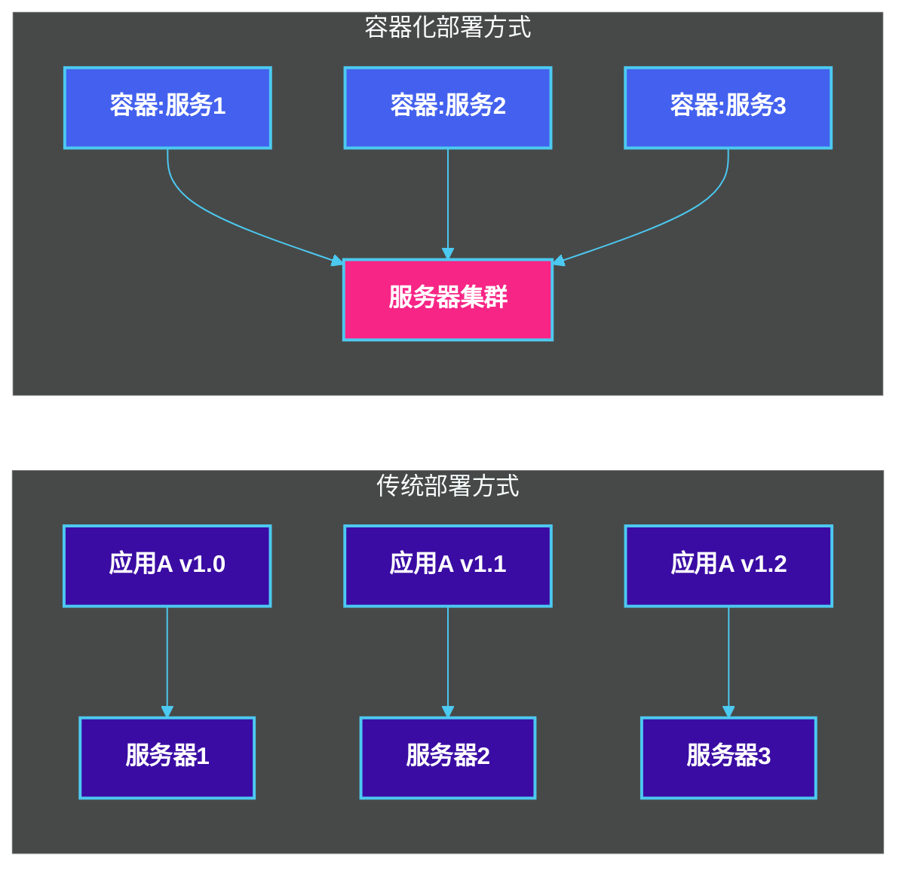

**容器化的核心优势：**

| 特性 | 传统部署 | 容器化部署 |
|------|---------|-----------|
| 环境一致性 | 环境差异导致"在我机器上能跑" | 一次构建，到处运行 |
| 资源隔离 | 进程级隔离 | 强资源隔离 |
| 启动时间 | 分钟级 | 秒级 |
| 扩展效率 | 慢，需要新服务器 | 快，容器秒级扩展 |
| 密度 | 低 | 高，相同硬件运行更多实例 |

### 7.1.2 容器化技术发展历程

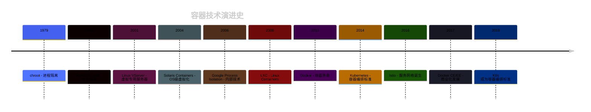

### 7.1.3 容器化与微服务的关系

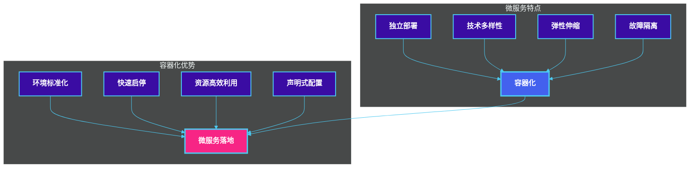

---

## 7.2 Docker核心概念

### 7.2.1 镜像、容器、仓库

Docker三大核心概念构成了容器化技术的基础：

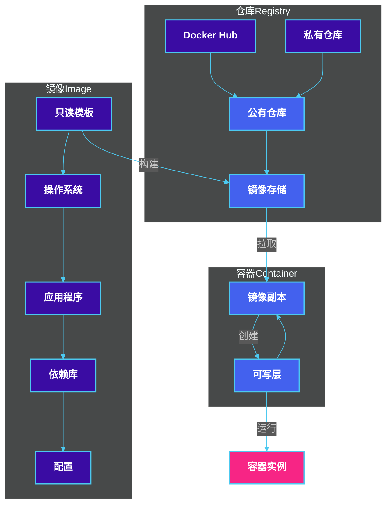

**镜像（Image）：** 只读模板，包含应用程序及其依赖

**容器（Container）：** 镜像的运行实例，具有可写层

**仓库（Registry）：** 存储和分发镜像的服务

### 7.2.2 Dockerfile 编写

Dockerfile是构建Docker镜像的蓝图。下面是一个Spring Boot微服务的Dockerfile示例：

```dockerfile
# 阶段一：构建阶段
FROM maven:3.9-eclipse-temurin-17 AS builder

WORKDIR /build

# 复制pom.xml并下载依赖
COPY pom.xml .
RUN mvn dependency:go-offline -B

# 复制源代码并构建
COPY src ./src
RUN mvn package -DskipTests -B

# 阶段二：运行阶段
FROM eclipse-temurin:17-jre-alpine

WORKDIR /app

# 创建非root用户
RUN addgroup -S appgroup && adduser -S appuser -G appgroup

# 从构建阶段复制jar包
COPY --from=builder /build/target/*.jar app.jar

# 设置文件权限
RUN chown -R appuser:appgroup /app

# 切换到非root用户
USER appuser

# 暴露端口
EXPOSE 8080

# 健康检查
HEALTHCHECK --interval=30s --timeout=3s \
    CMD wget --quiet --tries=1 --spider http://localhost:8080/actuator/health || exit 1

# 启动命令
ENTRYPOINT ["java", "-XX:+UseContainerSupport", "-XX:MaxRAMPercentage=75.0", "-jar", "app.jar"]
```

**常见Dockerfile指令说明：**

| 指令 | 说明 | 示例 |
|------|------|------|
| FROM | 基础镜像 | FROM eclipse-temurin:17-jre |
| RUN | 执行命令 | RUN mvn package |
| COPY | 复制文件 | COPY target/*.jar /app |
| ADD | 复制并解压 | ADD app.tar.gz /app |
| WORKDIR | 设置工作目录 | WORKDIR /app |
| EXPOSE | 声明端口 | EXPOSE 8080 |
| ENV | 环境变量 | ENV JAVA_OPTS="-Xmx512m" |
| USER | 设置用户 | USER appuser |
| ENTRYPOINT | 入口命令 | ENTRYPOINT ["java", "-jar"] |
| CMD | 默认命令 | CMD ["--server.port=8080"] |

### 7.2.3 Docker Compose

Docker Compose用于定义和运行多容器Docker应用程序。

```yaml
# docker-compose.yml
version: '3.8'

services:
  # 用户服务
  user-service:
    build:
      context: ./user-service
      dockerfile: Dockerfile
    container_name: user-service
    ports:
      - "8081:8080"
    environment:
      - SPRING_PROFILES_ACTIVE=prod
      - SPRING_DATASOURCE_URL=jdbc:postgresql://postgres:5432/users
      - SPRING_DATASOURCE_USERNAME=postgres
      - SPRING_DATASOURCE_PASSWORD=${DB_PASSWORD}
    depends_on:
      postgres:
        condition: service_healthy
    networks:
      - microservices-network
    deploy:
      resources:
        limits:
          memory: 512M
        reservations:
          memory: 256M
    restart: unless-stopped

  # 订单服务
  order-service:
    build:
      context: ./order-service
      dockerfile: Dockerfile
    container_name: order-service
    ports:
      - "8082:8080"
    environment:
      - SPRING_PROFILES_ACTIVE=prod
      - SPRING_DATASOURCE_URL=jdbc:postgresql://postgres:5432/orders
      - SPRING_REDIS_HOST=redis
    depends_on:
      postgres:
        condition: service_healthy
      redis:
        condition: service_started
    networks:
      - microservices-network
    restart: unless-stopped

  # PostgreSQL数据库
  postgres:
    image: postgres:15-alpine
    container_name: postgres
    environment:
      - POSTGRES_DB=microservices
      - POSTGRES_USER=postgres
      - POSTGRES_PASSWORD=${DB_PASSWORD}
    volumes:
      - postgres-data:/var/lib/postgresql/data
      - ./init-scripts:/docker-entrypoint-initdb.d
    healthcheck:
      test: ["CMD-SHELL", "pg_isready -U postgres"]
      interval: 10s
      timeout: 5s
      retries: 5
    networks:
      - microservices-network
    restart: unless-stopped

  # Redis缓存
  redis:
    image: redis:7-alpine
    container_name: redis
    command: redis-server --appendonly yes
    volumes:
      - redis-data:/data
    networks:
      - microservices-network
    restart: unless-stopped

  # API网关
  api-gateway:
    image: nginx:alpine
    container_name: api-gateway
    ports:
      - "80:80"
      - "443:443"
    volumes:
      - ./nginx/nginx.conf:/etc/nginx/nginx.conf:ro
      - ./nginx/ssl:/etc/nginx/ssl:ro
    depends_on:
      - user-service
      - order-service
    networks:
      - microservices-network
    restart: unless-stopped

networks:
  microservices-network:
    driver: bridge

volumes:
  postgres-data:
  redis-data:
```

**常用Docker Compose命令：**

```bash
# 启动所有服务
docker-compose up -d

# 启动指定服务
docker-compose up -d user-service

# 查看服务状态
docker-compose ps

# 查看日志
docker-compose logs -f order-service

# 停止所有服务
docker-compose down

# 重新构建镜像
docker-compose up -d --build

# 扩展服务实例
docker-compose up -d --scale order-service=3
```

---

## 7.3 Kubernetes核心概念

### 7.3.1 Pod、Deployment、Service、Ingress

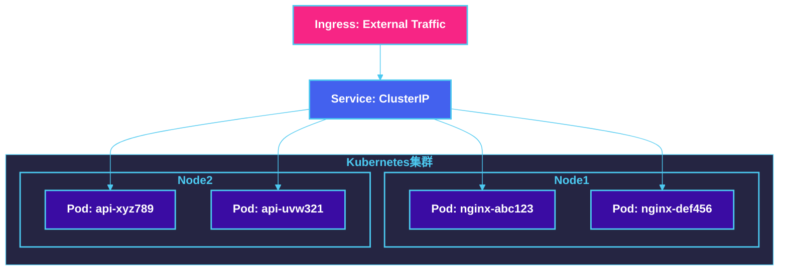

**Pod：** Kubernetes的最小调度单元，一个Pod可以包含一个或多个容器

**Deployment：** 管理Pod副本数的声明式更新

**Service：** 为Pod提供稳定的访问入口

**Ingress：** 管理外部HTTP/HTTPS访问

### 7.3.1.1 Deployment配置示例

```yaml
# deployment-user-service.yaml
apiVersion: apps/v1
kind: Deployment
metadata:
  name: user-service
  labels:
    app: user-service
    version: v1
spec:
  replicas: 3
  strategy:
    type: RollingUpdate
    rollingUpdate:
      maxSurge: 1
      maxUnavailable: 0
  selector:
    matchLabels:
      app: user-service
  template:
    metadata:
      labels:
        app: user-service
        version: v1
    spec:
      affinity:
        podAntiAffinity:
          preferredDuringSchedulingIgnoredDuringExecution:
            - weight: 100
              podAffinityTerm:
                labelSelector:
                  matchExpressions:
                    - key: app
                      operator: In
                      values:
                        - user-service
                topologyKey: kubernetes.io/hostname
      containers:
        - name: user-service
          image: myregistry.io/user-service:v1.2.3
          imagePullPolicy: Always
          ports:
            - name: http
              containerPort: 8080
              protocol: TCP
          env:
            - name: SPRING_PROFILES_ACTIVE
              value: "production"
            - name: JAVA_OPTS
              value: "-Xms512m -Xmx512m"
          resources:
            requests:
              memory: "256Mi"
              cpu: "100m"
            limits:
              memory: "512Mi"
              cpu: "500m"
          livenessProbe:
            httpGet:
              path: /actuator/health/liveness
              port: 8080
            initialDelaySeconds: 60
            periodSeconds: 10
            timeoutSeconds: 5
            failureThreshold: 3
          readinessProbe:
            httpGet:
              path: /actuator/health/readiness
              port: 8080
            initialDelaySeconds: 30
            periodSeconds: 5
            timeoutSeconds: 3
            failureThreshold: 3
          lifecycle:
            preStop:
              exec:
                command: ["/bin/sh", "-c", "sleep 10"]
```

### 7.3.1.2 Service配置示例

```yaml
# service-user-service.yaml
apiVersion: v1
kind: Service
metadata:
  name: user-service
  labels:
    app: user-service
spec:
  type: ClusterIP
  selector:
    app: user-service
  ports:
    - name: http
      port: 80
      targetPort: 8080
      protocol: TCP
    - name: metrics
      port: 9090
      targetPort: 9090
  sessionAffinity: ClientIP
  sessionAffinityConfig:
    clientIP:
      timeoutSeconds: 10800
```

### 7.3.1.3 Ingress配置示例

```yaml
# ingress.yaml
apiVersion: networking.k8s.io/v1
kind: Ingress
metadata:
  name: microservices-ingress
  annotations:
    nginx.ingress.kubernetes.io/rewrite-target: /
    nginx.ingress.kubernetes.io/ssl-redirect: "true"
    nginx.ingress.kubernetes.io/proxy-body-size: "50m"
    nginx.ingress.kubernetes.io/proxy-connect-timeout: "30"
    nginx.ingress.kubernetes.io/proxy-read-timeout: "60"
    nginx.ingress.kubernetes.io/proxy-send-timeout: "60"
spec:
  ingressClassName: nginx
  tls:
    - hosts:
        - api.example.com
      secretName: api-tls-secret
  rules:
    - host: api.example.com
      http:
        paths:
          - path: /users
            pathType: Prefix
            backend:
              service:
                name: user-service
                port:
                  number: 80
          - path: /orders
            pathType: Prefix
            backend:
              service:
                name: order-service
                port:
                  number: 80
          - path: /products
            pathType: Prefix
            backend:
              service:
                name: product-service
                port:
                  number: 80
          - path: /
            pathType: Prefix
            backend:
              service:
                name: gateway-service
                port:
                  number: 80
```

### 7.3.2 ConfigMap、Secret

ConfigMap和Secret用于向Pod注入配置数据。

```yaml
# configmap-app-settings.yaml
apiVersion: v1
kind: ConfigMap
metadata:
  name: app-config
  namespace: production
data:
  application.yml: |
    spring:
      application:
        name: user-service
      datasource:
        url: jdbc:postgresql://postgres.database.svc.cluster.local:5432/users
        hikari:
          maximum-pool-size: 20
          minimum-idle: 5
          connection-timeout: 30000
      redis:
        host: redis.cache.svc.cluster.local
        port: 6379
        timeout: 2000
        lettuce:
          pool:
            max-active: 16
            max-idle: 8
            min-idle: 4

  logback.xml: |
    <?xml version="1.0" encoding="UTF-8"?>
    <configuration>
      <appender name="CONSOLE" class="ch.qos.logback.core.ConsoleAppender">
        <encoder>
          <pattern>%d{yyyy-MM-dd HH:mm:ss} [%thread] %-5level %logger{36} - %msg%n</pattern>
        </encoder>
      </appender>
      <root level="INFO">
        <appender-ref ref="CONSOLE" />
      </root>
    </configuration>
---
# secret-db-credentials.yaml
apiVersion: v1
kind: Secret
metadata:
  name: db-credentials
  namespace: production
type: Opaque
data:
  # echo -n 'postgres' | base64
  username: cG9zdGdyZXM=
  # echo -n 'secure_password' | base64
  password: c2VjdXJlX3Bhc3N3b3Jk
stringData:
  # 非加密数据，会自动转换为base64
  jdbc-url: jdbc:postgresql://postgres.database.svc.cluster.local:5432/users
```

### 7.3.3 Helm包管理器

Helm是Kubernetes的包管理器，类似于APT/YUM之于Linux。

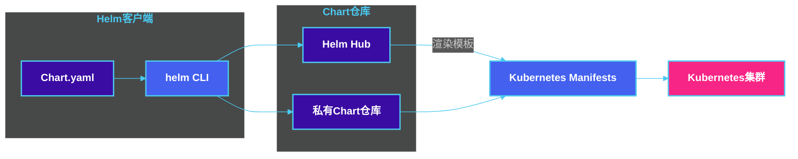

**Helm Chart结构：**

```
myapp/
├── Chart.yaml          # Chart元数据
├── values.yaml         # 默认配置值
├── values.schema.json  # 配置值校验
├── charts/             # 依赖的子Chart
├── templates/          # K8s资源模板
│   ├── deployment.yaml
│   ├── service.yaml
│   ├── ingress.yaml
│   └── _helpers.tpl    # 模板辅助函数
└── README.md           # 说明文档
```

**Chart.yaml示例：**

```yaml
# Chart.yaml
apiVersion: v2
name: user-service
description: A Helm chart for User Service Microservice
type: application
version: 1.2.0
appVersion: "2.0.0"
keywords:
  - user
  - microservice
  - spring-boot
home: https://github.com/example/user-service
sources:
  - https://github.com/example/user-service
maintainers:
  - name: DevOps Team
    email: devops@example.com
dependencies:
  - name: postgresql
    version: "12.x.x"
    repository: "https://charts.bitnami.com"
    condition: postgresql.enabled
  - name: redis
    version: "17.x.x"
    repository: "https://charts.bitnami.com"
    condition: redis.enabled
```

**values.yaml示例：**

```yaml
# values.yaml
replicaCount: 3

image:
  repository: myregistry.io/user-service
  pullPolicy: IfNotPresent
  tag: "v2.0.0"

service:
  type: ClusterIP
  port: 80
  targetPort: 8080

ingress:
  enabled: true
  className: nginx
  annotations:
    cert-manager.io/cluster-issuer: letsencrypt-prod
  hosts:
    - host: user.example.com
      paths:
        - path: /
          pathType: Prefix
  tls:
    - secretName: user-service-tls
      hosts:
        - user.example.com

resources:
  limits:
    cpu: 1000m
    memory: 1Gi
  requests:
    cpu: 100m
    memory: 256Mi

autoscaling:
  enabled: true
  minReplicas: 2
  maxReplicas: 10
  targetCPUUtilizationPercentage: 70
  targetMemoryUtilizationPercentage: 80

postgresql:
  enabled: true
  auth:
    database: users
    username: postgres
  primary:
    persistence:
      size: 10Gi

redis:
  enabled: true
  architecture: replication
  auth:
    enabled: true
```

---

## 7.4 Kubernetes架构

### 7.4.1 Master节点与Worker节点

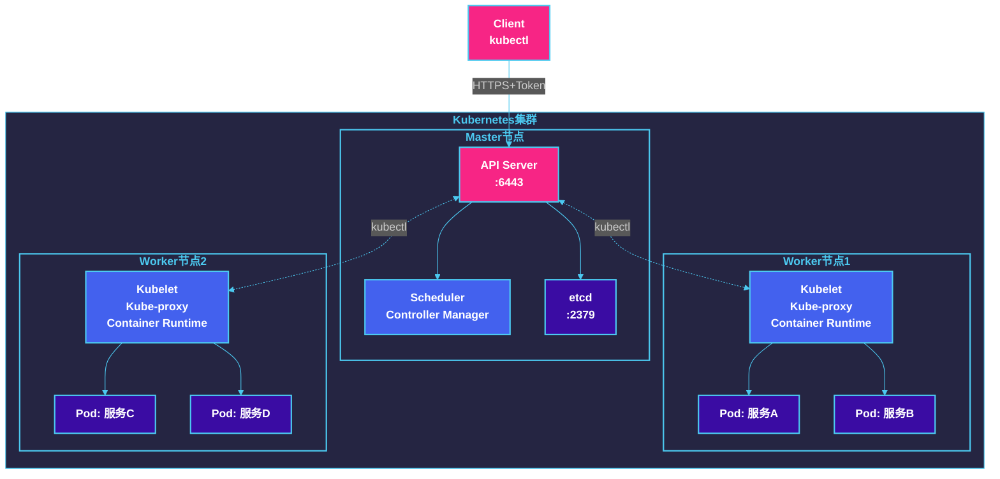

### 7.4.2 核心组件

**Master节点组件：**

| 组件 | 功能 | 关键参数 |
|------|------|---------|
| API Server | 提供RESTful API，是集群统一入口 | --etcd-servers, --secure-port |
| Scheduler | 负责Pod调度到Node | --master, --policy-configmap |
| Controller Manager | 运行各种控制器 | --controllers=* |
| etcd | 分布式键值存储 | --listen-client-urls |

**Worker节点组件：**

| 组件 | 功能 |
|------|------|
| Kubelet | 容器运行时管理，维护容器生命周期 |
| Kube-proxy | 负责网络代理和负载均衡 |
| Container Runtime | 实际运行容器（containerd/cri-o） |

```mermaid
%%{init: {'theme': 'dark', 'themeVariables': { 'darkMode': true, 'background': '#1a1a2e', 'primaryColor': '#4361ee', 'primaryTextColor': '#ffffff', 'primaryBorderColor': '#4cc9f0', 'lineColor': '#4cc9f0', 'secondaryColor': '#3a0ca3', 'tertiaryColor': '#f72585', 'clusterBkg': '#252542', 'clusterBorder': '#4cc9f0' } }}%%
flowchart TB
    subgraph 顶层资源["<b style='color:#4cc9f0'>顶层资源</b>"]
        NS["<b style='color:#ffffff'>Namespace</b>"]
    end

    subgraph 工作负载["<b style='color:#4cc9f0'>工作负载</b>"]
        DEPLOY["<b style='color:#ffffff'>Deployment</b>"]
        DS["<b style='color:#ffffff'>DaemonSet</b>"]
        STS["<b style='color:#ffffff'>StatefulSet</b>"]
        JOB["<b style='color:#ffffff'>CronJob</b>"]
    end

    subgraph 网络["<b style='color:#4cc9f0'>网络</b>"]
        SVC["<b style='color:#ffffff'>Service</b>"]
        ING["<b style='color:#ffffff'>Ingress</b>"]
        NETPOL["<b style='color:#ffffff'>NetworkPolicy</b>"]
    end

    subgraph 配置["<b style='color:#4cc9f0'>配置</b>"]
        CM["<b style='color:#ffffff'>ConfigMap</b>"]
        SEC["<b style='color:#ffffff'>Secret</b>"]
    end

    subgraph 存储["<b style='color:#4cc9f0'>存储</b>"]
        PVC["<b style='color:#ffffff'>PersistentVolumeClaim</b>"]
        STG["<b style='color:#ffffff'>StorageClass</b>"]
    end

    DEPLOY --> NS
    DS --> NS
    STS --> NS
    JOB --> NS
    SVC --> NS
    ING --> NS
    CM --> NS
    SEC --> NS
    PVC --> NS

    DEPLOY -.->|"管理"| POD["<b style='color:#ffffff'>Pod</b>"]
    DS -.->|"管理"| POD
    STS -.->|"管理"| POD
    JOB -.->|"创建"| POD

    SVC -.->|"暴露"| POD
    ING -.->|"路由"| SVC
    style NS fill:#f72585,stroke:#4cc9f0,stroke-width:2px,color:#ffffff
    style DEPLOY fill:#4361ee,stroke:#4cc9f0,stroke-width:2px,color:#ffffff
    style DS fill:#4361ee,stroke:#4cc9f0,stroke-width:2px,color:#ffffff
    style STS fill:#4361ee,stroke:#4cc9f0,stroke-width:2px,color:#ffffff
    style JOB fill:#4361ee,stroke:#4cc9f0,stroke-width:2px,color:#ffffff
    style SVC fill:#3a0ca3,stroke:#4cc9f0,stroke-width:2px,color:#ffffff
    style ING fill:#3a0ca3,stroke:#4cc9f0,stroke-width:2px,color:#ffffff
    style NETPOL fill:#3a0ca3,stroke:#4cc9f0,stroke-width:2px,color:#ffffff
    style CM fill:#3a0ca3,stroke:#4cc9f0,stroke-width:2px,color:#ffffff
    style SEC fill:#3a0ca3,stroke:#4cc9f0,stroke-width:2px,color:#ffffff
    style PVC fill:#3a0ca3,stroke:#4cc9f0,stroke-width:2px,color:#ffffff
    style STG fill:#3a0ca3,stroke:#4cc9f0,stroke-width:2px,color:#ffffff
    style POD fill:#f72585,stroke:#4cc9f0,stroke-width:3px,color:#ffffff
    style 顶层资源 fill:#252542,stroke:#4cc9f0,stroke-width:2px,color:#4cc9f0
    style 工作负载 fill:#252542,stroke:#4cc9f0,stroke-width:2px,color:#4cc9f0
    style 网络 fill:#252542,stroke:#4cc9f0,stroke-width:2px,color:#4cc9f0
    style 配置 fill:#252542,stroke:#4cc9f0,stroke-width:2px,color:#4cc9f0
    style 存储 fill:#252542,stroke:#4cc9f0,stroke-width:2px,color:#4cc9f0
```

---

## 7.5 服务网格

### 7.5.1 Istio核心功能

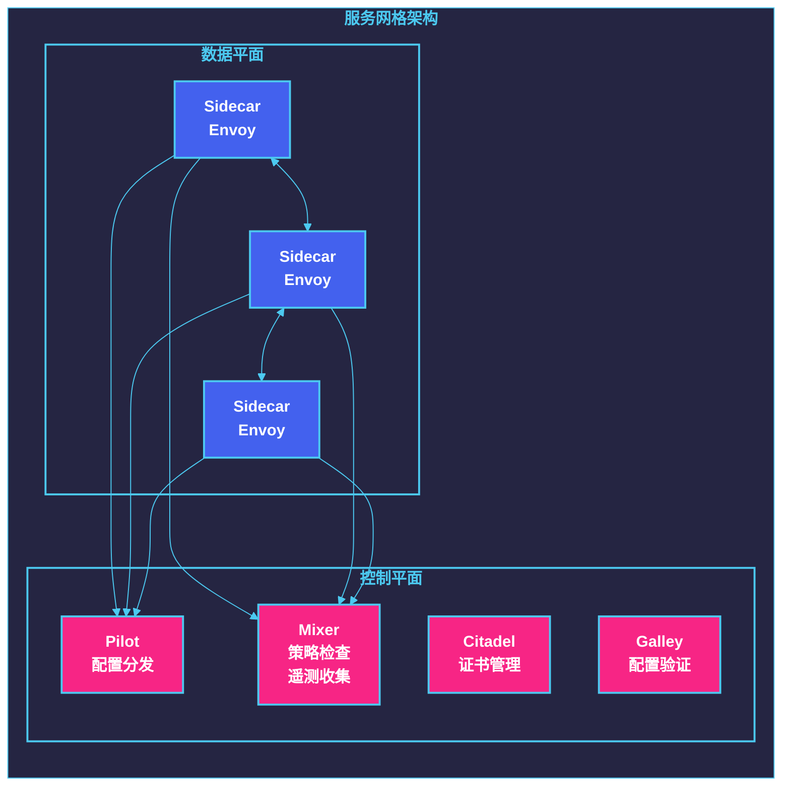

### 7.5.2 Sidecar代理

Sidecar模式将代理容器与主容器部署在同一个Pod中：

```yaml
# Sidecar模式示意
apiVersion: v1
kind: Pod
metadata:
  name: user-service-pod
spec:
  containers:
    # 主应用容器
    - name: user-service
      image: myregistry.io/user-service:v1
      ports:
        - containerPort: 8080

    # Sidecar代理容器
    - name: istio-proxy
      image: docker.io/istio/proxyv2:1.19.0
      env:
        - name: POD_NAME
          valueFrom:
            fieldRef:
              fieldPath: metadata.name
        - name: ISTIO_META_CLUSTER_ID
          value: "kubernetes"
      args:
        - proxy
        - sidecar
        - --domain
        - $(POD_NAMESPACE).svc.cluster.local
        - --proxyLogLevel
        - warning
        - --proxyComponentLogLevel
        - misc:error
        - --trust-domain
        - cluster.local
      ports:
        - containerPort: 15090
          name: stats-prom
        - containerPort: 15021
          name: health
      resources:
        requests:
          cpu: 10m
          memory: 40Mi
        limits:
          cpu: 2000m
          memory: 1024Mi
```

### 7.5.3 流量管理示例

```yaml
# VirtualService - 流量路由配置
apiVersion: networking.istio.io/v1beta1
kind: VirtualService
metadata:
  name: user-service
spec:
  hosts:
    - user-service
    - user-service.default.svc.cluster.local
  http:
    - name: default-route
      match:
        - headers:
            accept:
              exact: application/json
      route:
        - destination:
            host: user-service
            subset: v1
          weight: 90
        - destination:
            host: user-service
            subset: v2
          weight: 10
    - name: api-v2-route
      match:
        - uri:
            prefix: /api/v2
      route:
        - destination:
            host: user-service
            subset: v2
    - name: timeout-retry
      route:
        - destination:
            host: user-service
            subset: v1
      retries:
        attempts: 3
        perTryTimeout: 2s
        retryOn: gateway-error,connect-failure,refused-stream
      timeout: 10s

---
# DestinationRule - 目的地规则
apiVersion: networking.istio.io/v1beta1
kind: DestinationRule
metadata:
  name: user-service
spec:
  host: user-service
  trafficPolicy:
    portLevelSettings:
      - port:
          number: 8080
        loadBalancer:
          simple: LEAST_REQUEST
        connectionPool:
          tcp:
            maxConnections: 100
          http:
            h2UpgradePolicy: UPGRADE
            http1MaxPendingRequests: 100
            http2MaxRequests: 1000
            maxRequestsPerConnection: 10000
        outlierDetection:
          consecutive5xxErrors: 5
          interval: 30s
          baseEjectionTime: 30s
  subsets:
    - name: v1
      labels:
        version: v1
    - name: v2
      labels:
        version: v2

---
# PeerAuthentication - mTLS配置
apiVersion: security.istio.io/v1beta1
kind: PeerAuthentication
metadata:
  name: default
  namespace: istio-system
spec:
  mtls:
    mode: STRICT

---
# AuthorizationPolicy - 授权策略
apiVersion: security.istio.io/v1beta1
kind: AuthorizationPolicy
metadata:
  name: user-service-authz
  namespace: default
spec:
  selector:
    matchLabels:
      app: user-service
  action: ALLOW
  rules:
    - from:
        - source:
            principals: ["cluster.local/ns/default/sa/order-service"]
      to:
        - operation:
            methods: ["GET"]
            paths: ["/api/users/*"]
    - from:
        - source:
            principals: ["cluster.local/ns/default/sa/gateway"]
      to:
        - operation:
            methods: ["GET", "POST", "PUT", "DELETE"]
```

---

## 7.6 部署策略

### 7.6.1 滚动更新、蓝绿部署、金丝雀发布

```mermaid
%%{init: {'theme': 'dark', 'themeVariables': { 'darkMode': true, 'background': '#1a1a2e', 'primaryColor': '#4361ee', 'primaryTextColor': '#ffffff', 'primaryBorderColor': '#4cc9f0', 'lineColor': '#4cc9f0', 'secondaryColor': '#3a0ca3', 'tertiaryColor': '#f72585', 'clusterBkg': '#252542', 'clusterBorder': '#4cc9f0' } }}%%
flowchart TB
    subgraph 滚动更新Rolling Update["<b style='color:#4cc9f0'>滚动更新Rolling Update</b>"]
        R1["<b style='color:#ffffff'>v1.0 Pod (1/3)</b>"] --> R2["<b style='color:#ffffff'>v1.0 Pod (2/3)</b>"]
        R2 --> R3["<b style='color:#ffffff'>v1.1 Pod (1/3)</b>"]
        R3 --> R4["<b style='color:#ffffff'>v1.1 Pod (2/3)</b>"]
        R4 --> R5["<b style='color:#ffffff'>v1.1 Pod (3/3)</b>"]
    end

    subgraph 蓝绿部署Blue-Green["<b style='color:#4cc9f0'>蓝绿部署Blue-Green</b>"]
        B1["<b style='color:#ffffff'>蓝环境 v1.0</b>"] --- B2["<b style='color:#ffffff'>负载均衡</b>"]
        B3["<b style='color:#ffffff'>绿环境 v1.1</b>"] --- B2
        B2 --> B4["<b style='color:#ffffff'>切换流量</b>"]
    end

    subgraph 金丝雀发布Canary["<b style='color:#4cc9f0'>金丝雀发布Canary</b>"]
        C1["<b style='color:#ffffff'>Canary 10%</b>"] --> C2["<b style='color:#ffffff'>生产 90%</b>"]
        C3["<b style='color:#ffffff'>监控指标</b>"] --> C4["<b style='color:#ffffff'>自动回滚</b>"]
    end
    style R1 fill:#4361ee,stroke:#4cc9f0,stroke-width:2px,color:#ffffff
    style R2 fill:#4361ee,stroke:#4cc9f0,stroke-width:2px,color:#ffffff
    style R3 fill:#3a0ca3,stroke:#4cc9f0,stroke-width:2px,color:#ffffff
    style R4 fill:#3a0ca3,stroke:#4cc9f0,stroke-width:2px,color:#ffffff
    style R5 fill:#3a0ca3,stroke:#4cc9f0,stroke-width:2px,color:#ffffff
    style B1 fill:#4361ee,stroke:#4cc9f0,stroke-width:2px,color:#ffffff
    style B2 fill:#f72585,stroke:#4cc9f0,stroke-width:2px,color:#ffffff
    style B3 fill:#3a0ca3,stroke:#4cc9f0,stroke-width:2px,color:#ffffff
    style B4 fill:#f72585,stroke:#4cc9f0,stroke-width:2px,color:#ffffff
    style C1 fill:#f72585,stroke:#4cc9f0,stroke-width:2px,color:#ffffff
    style C2 fill:#4361ee,stroke:#4cc9f0,stroke-width:2px,color:#ffffff
    style C3 fill:#3a0ca3,stroke:#4cc9f0,stroke-width:2px,color:#ffffff
    style C4 fill:#f72585,stroke:#4cc9f0,stroke-width:2px,color:#ffffff
    style 滚动更新Rolling Update fill:#252542,stroke:#4cc9f0,stroke-width:2px,color:#4cc9f0
    style 蓝绿部署Blue-Green fill:#252542,stroke:#4cc9f0,stroke-width:2px,color:#4cc9f0
    style 金丝雀发布Canary fill:#252542,stroke:#4cc9f0,stroke-width:2px,color:#4cc9f0
```

**滚动更新配置：**

```yaml
# RollingUpdate策略
spec:
  strategy:
    type: RollingUpdate
    rollingUpdate:
      maxSurge: 1           # 最多超出期望副本数
      maxUnavailable: 0     # 不可用Pod数为0
```

**蓝绿部署：**

```yaml
# blue-green-deployment.yaml
---
# 蓝色版本（当前生产）
apiVersion: apps/v1
kind: Deployment
metadata:
  name: user-service-blue
  labels:
    app: user-service
    slot: blue
spec:
  replicas: 3
  selector:
    matchLabels:
      app: user-service
      slot: blue
  template:
    metadata:
      labels:
        app: user-service
        slot: blue
        version: v1.0
    spec:
      containers:
        - name: user-service
          image: myregistry.io/user-service:v1.0
---
# 绿色版本（新版本）
apiVersion: apps/v1
kind: Deployment
metadata:
  name: user-service-green
  labels:
    app: user-service
    slot: green
spec:
  replicas: 3
  selector:
    matchLabels:
      app: user-service
      slot: green
  template:
    metadata:
      labels:
        app: user-service
        slot: green
        version: v1.1
    spec:
      containers:
        - name: user-service
          image: myregistry.io/user-service:v1.1
---
# Service切换
apiVersion: v1
kind: Service
metadata:
  name: user-service
spec:
  selector:
    app: user-service
    slot: blue    # 切换时改为 green
  ports:
    - port: 80
      targetPort: 8080
```

**金丝雀发布：**

```yaml
# canary-deployment.yaml
apiVersion: networking.istio.io/v1beta1
kind: VirtualService
metadata:
  name: user-service-canary
spec:
  hosts:
    - user-service
  http:
    - route:
        - destination:
            host: user-service
            subset: stable
          weight: 90
        - destination:
            host: user-service
            subset: canary
          weight: 10

---
apiVersion: networking.istio.io/v1beta1
kind: DestinationRule
metadata:
  name: user-service
spec:
  host: user-service
  subsets:
    - name: stable
      labels:
        version: v1.0
    - name: canary
      labels:
        version: v1.1
```

### 7.6.2 A/B测试

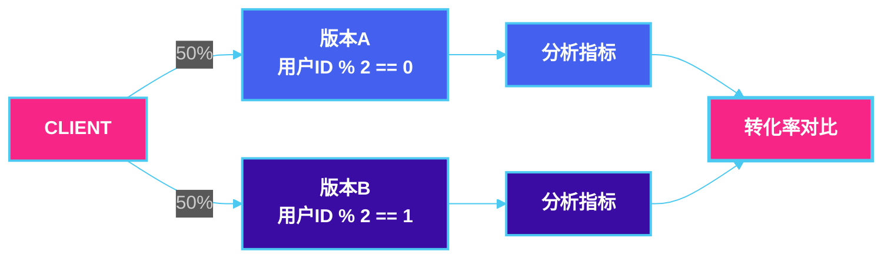

```yaml
# A/B测试VirtualService配置
apiVersion: networking.istio.io/v1beta1
kind: VirtualService
metadata:
  name: user-service-abtest
spec:
  hosts:
    - user-service
  http:
    - name: version-a
      match:
        - headers:
            x-user-id:
              regex: ".*[02468]$"
      route:
        - destination:
            host: user-service
            subset: version-a
          weight: 100
    - name: version-b
      match:
        - headers:
            x-user-id:
              regex: ".*[13579]$"
      route:
        - destination:
            host: user-service
            subset: version-b
          weight: 100
```

### 7.6.3 容器编排方案对比

| 特性 | Kubernetes | Docker Swarm |
|------|------------|--------------|
| 学习曲线 | 陡峭 | 平缓 |
| 初始安装 | 复杂 | 简单 |
| 默认网络 | Pod网络(CNI) | Overlay网络 |
| 服务发现 | DNS + Service | DNS + 名称 |
| 负载均衡 | 内部 + 外部 | 内部 + 外部 |
| 滚动更新 | 原生支持 | 原生支持 |
| 回滚 | 原生支持 | 支持 |
| 扩缩容 | 原生支持 | 原生支持 |
| 配置管理 | ConfigMap/Secret | ConfigFile/Compose |
| 存储编排 | PV/PVC/StorageClass | Volumes |
| 社区生态 | 庞大 | 较小 |
| 企业支持 | 多厂商 | Docker官方 |
| 适用场景 | 大规模生产 | 小型/简单场景 |

---

## 7.7 本章小结

本章深入探讨了容器化与编排技术在微服务架构中的应用：

1. **容器化基础**：Docker通过镜像、容器、仓库三大核心概念实现了应用的标准化打包和分发，解决了"在我机器上能跑"的环境一致性问题。

2. **Docker技术栈**：
   - Dockerfile提供了声明式的镜像构建方式
   - Docker Compose简化了多容器应用的定义和运行
   - 多阶段构建可以优化镜像大小和安全

3. **Kubernetes架构**：
   - Master节点负责集群管理和调度
   - Worker节点运行实际的工作负载
   - 核心组件（API Server、Scheduler、Controller Manager、etcd）协同工作

4. **Kubernetes资源**：
   - Pod是最小调度单元
   - Deployment管理无状态应用
   - Service提供稳定的网络入口
   - Ingress处理外部流量
   - ConfigMap/Secret管理配置

5. **服务网格**：
   - Istio通过Sidecar代理实现了无侵入式的微服务治理
   - 流量管理、安全、可观测性是核心能力

6. **部署策略**：
   - 滚动更新：渐进式替换，平滑升级
   - 蓝绿部署：双环境切换，快速回滚
   - 金丝雀发布：逐步放量，降低风险
   - A/B测试：基于用户特征的分流测试

---

## 7.8 思考题

1. **容器与虚拟机的区别是什么？为什么微服务架构更适合使用容器？**

2. **在构建Docker镜像时，多阶段构建有什么优势？请设计一个多阶段构建的示例。**

3. **Kubernetes中的Pod和Deployment有什么区别？什么情况下需要直接操作Pod？**

4. **如果一个微服务需要连接外部第三方API，但在不同环境（开发、测试、生产）中API的端点不同，如何在Kubernetes中管理这个配置？**

5. **服务网格（如Istio）的Sidecar代理模式有什么优缺点？与直接在应用中集成SDK相比有何不同？**

6. **在金丝雀发布中，如何设计一个自动回滚机制？需要监控哪些指标？**

7. **假设你需要将一个单体应用拆分为微服务，并使用Kubernetes进行部署。请设计整体的迁移策略和部署架构。**

8. **在高可用Kubernetes集群中，如何确保Master节点和etcd的高可用性？**

---

**参考资料：**

- Docker官方文档：https://docs.docker.com/
- Kubernetes官方文档：https://kubernetes.io/zh/docs/
- Istio官方文档：https://istio.io/latest/zh/docs/
- Helm官方文档：https://helm.sh/zh/docs/
