# 第九章：DevOps与CI/CD

## 本章目录

- [9.1 DevOps文化与实践](#91-devops文化与实践)
  - [9.1.1 DevOps核心理念](#911-devops核心理念)
  - [9.1.2 DevOps三步法](#912-devops三步法)
  - [9.1.3 团队协作模式](#913-团队协作模式)
- [9.2 持续集成（CI）](#92-持续集成ci)
  - [9.2.1 CI流程设计](#921-ci流程设计)
  - [9.2.2 主流CI工具对比](#922-主流ci工具对比)
  - [9.2.3 自动化测试策略](#923-自动化测试策略)
  - [9.2.4 GitHub Actions实战](#924-github-actions实战)
- [9.3 持续部署（CD）](#93-持续部署cd)
  - [9.3.1 部署流水线设计](#931-部署流水线设计)
  - [9.3.2 环境管理策略](#932-环境管理策略)
  - [9.3.3 渐进式部署](#933-渐进式部署)
- [9.4 容器镜像管理](#94-容器镜像管理)
  - [9.4.1 镜像仓库对比](#941-镜像仓库对比)
  - [9.4.2 镜像安全扫描](#942-镜像安全扫描)
  - [9.4.3 多阶段构建](#943-多阶段构建)
- [9.5 配置管理与GitOps](#95-配置管理与gitops)
  - [9.5.1 GitOps核心概念](#951-gitops核心概念)
  - [9.5.2 ArgoCD实践](#952-argocd实践)
  - [9.5.3 秘密管理](#953-秘密管理)
- [9.6 基础设施即代码（IaC）](#96-基础设施即代码iac)
  - [9.6.1 Terraform入门](#961-terraform入门)
  - [9.6.2 Pulumi简介](#962-pulumi简介)
  - [9.6.3 Ansible配置管理](#963-ansible配置管理)
- [本章小结](#本章小结)
- [思考题](#思考题)

---

## 9.1 DevOps文化与实践

### 9.1.1 DevOps核心理念

DevOps是一种融合开发（Development）与运维（Operations）的文化、实践和方法论，旨在缩短系统开发周期、提高部署频率、实现更可靠的发布。

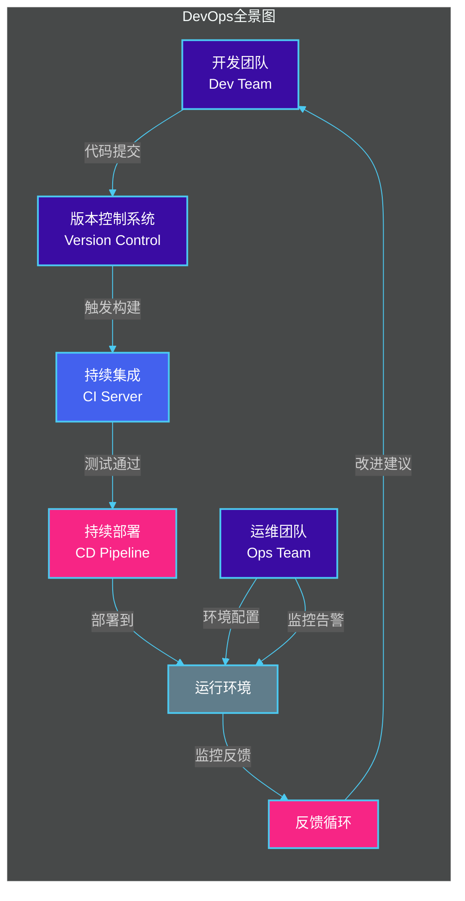

### 9.1.2 DevOps三步法

DevOps三步法是实现高效交付的核心框架：

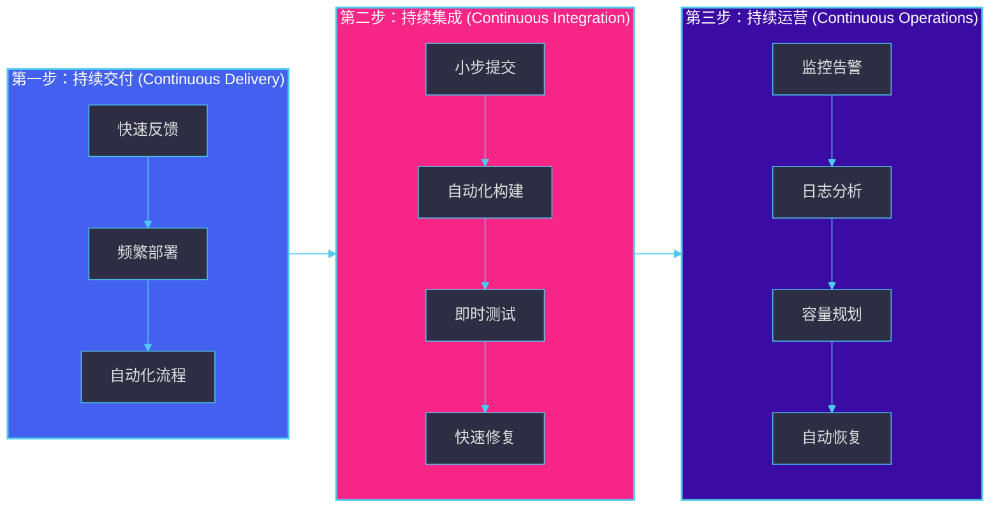

### 9.1.3 团队协作模式

在微服务架构下，DevOps最佳实践是采用**团队拥有端到端服务**的模式：

| 团队类型 | 职责范围 | 优势 | 挑战 |
|---------|---------|------|------|
| **全栈团队** | 开发、测试、部署、运维 | 快速迭代、减少交接 | 需要多技能人才 |
| **平台团队** | 基础设施建设、工具提供 | 专业化、复用性 | 可能成为瓶颈 |
| **SRE团队** | 可靠性、监控、应急响应 | 专注稳定性 | 与开发脱节 |

---

## 9.2 持续集成（CI）

### 9.2.1 CI流程设计

持续集成是指开发人员频繁地将代码合并到主分支，每次合并都通过自动化构建和测试来验证。

```mermaid
%%{init: {'theme': 'dark', 'themeVariables': { 'darkMode': true, 'background': '#1a1a2e', 'primaryColor': '#4361ee', 'primaryTextColor': '#ffffff', 'primaryBorderColor': '#4cc9f0', 'lineColor': '#4cc9f0', 'secondaryColor': '#3a0ca3', 'tertiaryColor': '#2d2d44'}}}%%
flowchart TB
    subgraph 代码阶段["代码阶段"]
        DEV["开发者"] -->|"git push"| REMOTE["远程仓库"]
        REMOTE -->|"Webhook触发"| TRIGGER["CI触发器"]
    end

    subgraph 构建阶段["构建阶段"]
        TRIGGER -->|"开始构建"| CHECKOUT["代码检出"]
        CHECKOUT -->|"依赖安装"| DEPS["安装依赖"]
        DEPS -->|"代码编译"| BUILD["编译构建"]
        BUILD -->|"生成产物"| ARTIFACT["构建产物"]
    end

    subgraph 测试阶段["测试阶段"]
        ARTIFACT -->|"单元测试"| UNIT["单元测试"]
        UNIT -->|"集成测试"| INTEGRATION["集成测试"]
        INTEGRATION -->|"安全扫描"| SECURITY["安全扫描"]
        SECURITY -->|"镜像构建"| IMAGE["Docker镜像"]
    end

    subgraph 质量门禁["质量门禁"]
        IMAGE -->|"质量检查"| LINT["代码规范"]
        LINT -->|"覆盖率"| COVERAGE["测试覆盖率"]
        COVERAGE -->|"检查结果"| GATE["质量门禁"]
    end

    subgraph 交付阶段["交付阶段"]
        GATE -->|"通过"| PUBLISH["推送镜像"]
        PUBLISH -->|"到仓库"| REGISTRY["镜像仓库"]
        GATE -->|"失败"| NOTIFY["通知开发者"]
    end

    style 代码阶段 fill:#2d2d44,stroke:#4361ee,stroke-width:2px,color:#e0e0e0
    style 构建阶段 fill:#2d2d44,stroke:#f72585,stroke-width:2px,color:#e0e0e0
    style 测试阶段 fill:#2d2d44,stroke:#4cc9f0,stroke-width:2px,color:#e0e0e0
    style 质量门禁 fill:#2d2d44,stroke:#FF9800,stroke-width:2px,color:#e0e0e0
    style 交付阶段 fill:#2d2d44,stroke:#4CAF50,stroke-width:2px,color:#e0e0e0
    style DEV fill:#3a0ca3,stroke:#4cc9f0,stroke-width:2px,color:#ffffff
    style REMOTE fill:#4361ee,stroke:#4cc9f0,stroke-width:2px,color:#ffffff
    style TRIGGER fill:#f72585,stroke:#4cc9f0,stroke-width:2px,color:#ffffff
    style CHECKOUT fill:#4361ee,stroke:#4cc9f0,stroke-width:2px,color:#ffffff
    style DEPS fill:#4361ee,stroke:#4cc9f0,stroke-width:2px,color:#ffffff
    style BUILD fill:#4361ee,stroke:#4cc9f0,stroke-width:2px,color:#ffffff
    style ARTIFACT fill:#f72585,stroke:#4cc9f0,stroke-width:2px,color:#ffffff
    style UNIT fill:#4cc9f0,stroke:#4cc9f0,stroke-width:2px,color:#1a1a2e
    style INTEGRATION fill:#4cc9f0,stroke:#4cc9f0,stroke-width:2px,color:#1a1a2e
    style SECURITY fill:#f72585,stroke:#4cc9f0,stroke-width:2px,color:#ffffff
    style IMAGE fill:#f72585,stroke:#4cc9f0,stroke-width:2px,color:#ffffff
    style LINT fill:#FF9800,stroke:#4cc9f0,stroke-width:2px,color:#ffffff
    style COVERAGE fill:#FF9800,stroke:#4cc9f0,stroke-width:2px,color:#ffffff
    style GATE fill:#FF9800,stroke:#4cc9f0,stroke-width:2px,color:#ffffff
    style PUBLISH fill:#4CAF50,stroke:#4cc9f0,stroke-width:2px,color:#ffffff
    style REGISTRY fill:#4CAF50,stroke:#4cc9f0,stroke-width:2px,color:#ffffff
    style NOTIFY fill:#f44336,stroke:#4cc9f0,stroke-width:2px,color:#ffffff
```

### 9.2.2 主流CI工具对比

| 特性 | GitHub Actions | GitLab CI | Jenkins |
|------|---------------|-----------|---------|
| **托管方式** | SaaS / 自托管 | SaaS / 自托管 | 自托管 |
| **价格** | 按分钟计费 | 免费（自托管） | 免费（开源） |
| **流水线即代码** | `.github/workflows/*.yml` | `.gitlab-ci.yml` | `Jenkinsfile` |
| **容器支持** | 原生 | 原生 | 需要配置 |
| **学习曲线** | 低 | 中 | 高 |
| **插件生态** | 丰富（GitHub Marketplace） | 丰富 | 非常丰富 |
| **并行执行** | 原生支持 | 原生支持 | 需要配置 |
| **UI体验** | 优秀 | 优秀 | 一般 |
| **与Git集成** | 原生 | 原生 | 需要插件 |

### 9.2.3 自动化测试策略

微服务架构下的自动化测试金字塔：

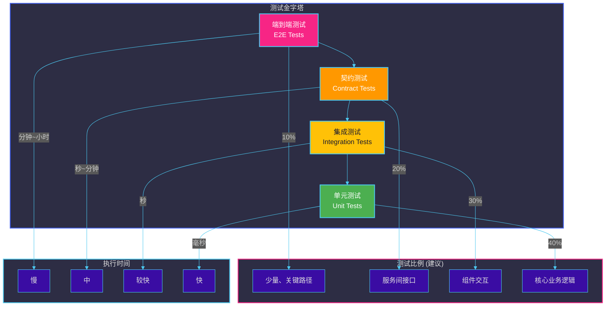

### 9.2.4 GitHub Actions实战

#### 基础CI工作流

```yaml
# .github/workflows/ci.yml
name: CI Pipeline

on:
  push:
    branches: [main, develop]
  pull_request:
    branches: [main]

env:
  REGISTRY: ghcr.io
  IMAGE_NAME: ${{ github.repository }}

jobs:
  # 1. 代码质量检查
  lint:
    name: Code Lint
    runs-on: ubuntu-latest
    steps:
      - name: Checkout code
        uses: actions/checkout@v4

      - name: Set up Go
        uses: actions/setup-go@v5
        with:
          go-version: '1.21'

      - name: Run go vet
        run: go vet ./...

      - name: Run golangci-lint
        uses: golangci/golangci-lint-action@v4
        with:
          version: latest

  # 2. 单元测试
  test:
    name: Unit Tests
    runs-on: ubuntu-latest
    steps:
      - name: Checkout code
        uses: actions/checkout@v4

      - name: Set up Go
        uses: actions/setup-go@v5
        with:
          go-version: '1.21'

      - name: Download dependencies
        run: go mod download

      - name: Run tests with coverage
        run: |
          go test -v -race -coverprofile=coverage.out ./...

      - name: Upload coverage to Codecov
        uses: codecov/codecov-action@v3
        with:
          file: coverage.out
          fail_ci_if_error: false

  # 3. 构建 Docker 镜像
  build:
    name: Build Docker Image
    needs: [lint, test]
    runs-on: ubuntu-latest
    outputs:
      image-tag: ${{ steps.meta.outputs.tags }}

    steps:
      - name: Checkout code
        uses: actions/checkout@v4

      - name: Set up Docker Buildx
        uses: docker/setup-buildx-action@v3

      - name: Log in to Container Registry
        uses: docker/login-action@v3
        with:
          registry: ${{ env.REGISTRY }}
          username: ${{ github.actor }}
          password: ${{ secrets.GITHUB_TOKEN }}

      - name: Extract metadata
        id: meta
        uses: docker/metadata-action@v5
        with:
          images: ${{ env.REGISTRY }}/${{ env.IMAGE_NAME }}
          tags: |
            type=ref,event=branch
            type=sha,prefix={{branch}}-
            type=raw,value=latest,enable={{is_default_branch}}

      - name: Build and push
        uses: docker/build-push-action@v5
        with:
          context: .
          push: true
          tags: ${{ steps.meta.outputs.tags }}
          cache-from: type=gha
          cache-to: type=gha,mode=max
          provenance: false

  # 4. 安全扫描
  security:
    name: Security Scan
    needs: [build]
    runs-on: ubuntu-latest
    steps:
      - name: Checkout code
        uses: actions/checkout@v4

      - name: Run Trivy vulnerability scanner
        uses: aquasecurity/trivy-action@master
        with:
          image-ref: ${{ env.REGISTRY }}/${{ env.IMAGE_NAME }}:${{ github.sha }}
          format: 'sarif'
          output: 'trivy-results.sarif'
          severity: 'CRITICAL,HIGH'

      - name: Upload Trivy scan results
        uses: github/codeql-action/upload-sarif@v2
        with:
          sarif_file: 'trivy-results.sarif'
```

#### 多服务CI工作流

```yaml
# .github/workflows/microservices-ci.yml
name: Microservices CI

on:
  push:
    branches: [main]
    paths:
      - 'services/**'
      - '.github/workflows/microservices-ci.yml'

jobs:
  # 矩阵构建：每个微服务独立构建
  build-services:
    name: Build ${{ matrix.service }}
    runs-on: ubuntu-latest
    strategy:
      matrix:
        service:
          - user-service
          - order-service
          - product-service
          - payment-service

    steps:
      - name: Checkout code
        uses: actions/checkout@v4

      - name: Extract service name
        id: extract
        run: echo "service-path=services/${{ matrix.service }}" >> $GITHUB_OUTPUT

      - name: Build and test service
        run: |
          cd ${{ steps.extract.outputs.service-path }}
          
          # 构建
          docker build -t ${{ matrix.service }}:${{ github.sha }} .
          
          # 运行测试
          docker run --rm ${{ matrix.service }}:${{ github.sha }} test
          
          # 推送镜像
          docker push ${{ matrix.service }}:${{ github.sha }}

      - name: Create deployment commit
        if: github.ref == 'refs/heads/main'
        run: |
          git config --local user.email "ci@github.com"
          git config --local user.name "GitHub Actions"
          git add -A
          git commit -m "Deploy ${{ matrix.service }}:${{ github.sha }}"
          git push
```

---

## 9.3 持续部署（CD）

### 9.3.1 部署流水线设计

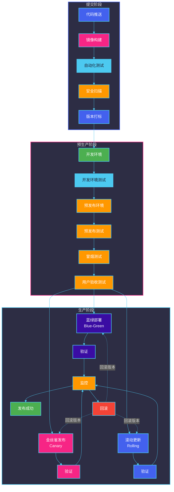

### 9.3.2 环境管理策略

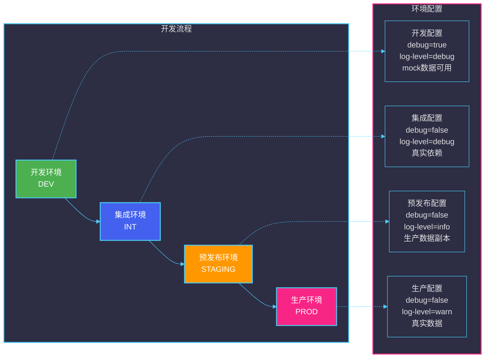

### 9.3.3 渐进式部署

#### 蓝绿部署（Blue-Green Deployment）

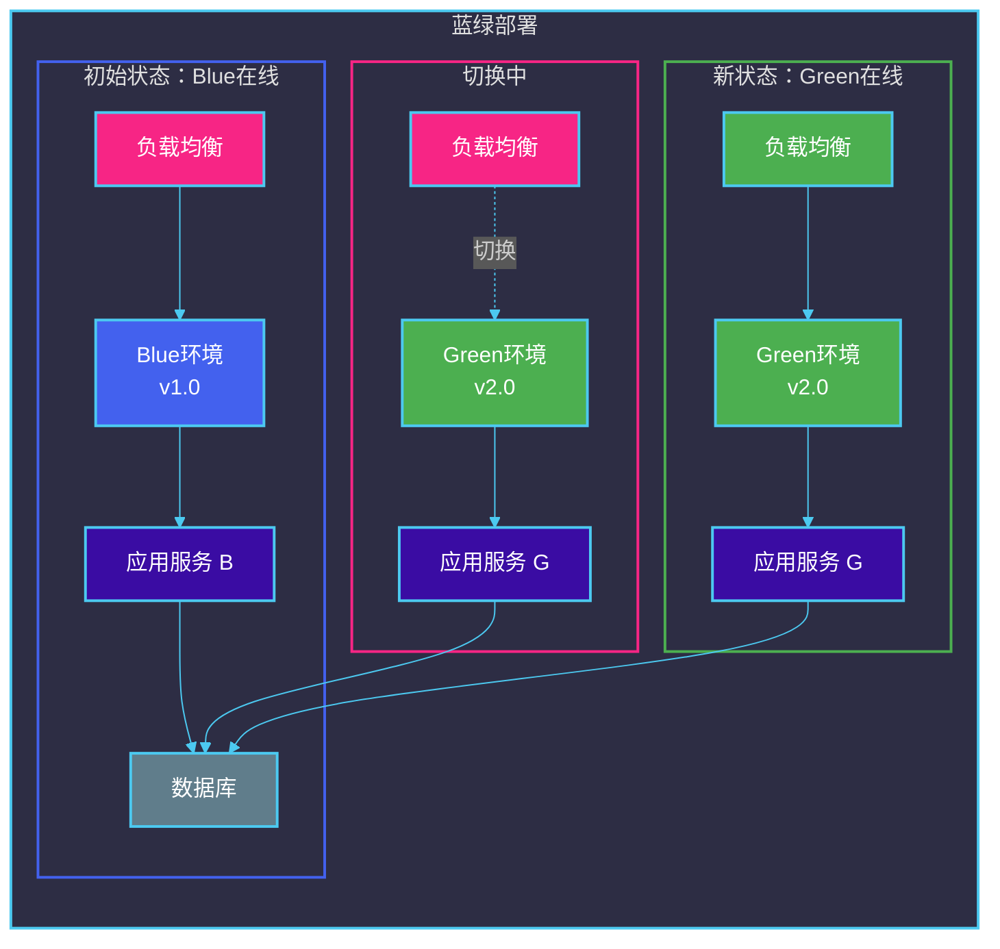

#### 金丝雀发布（Canary Release）

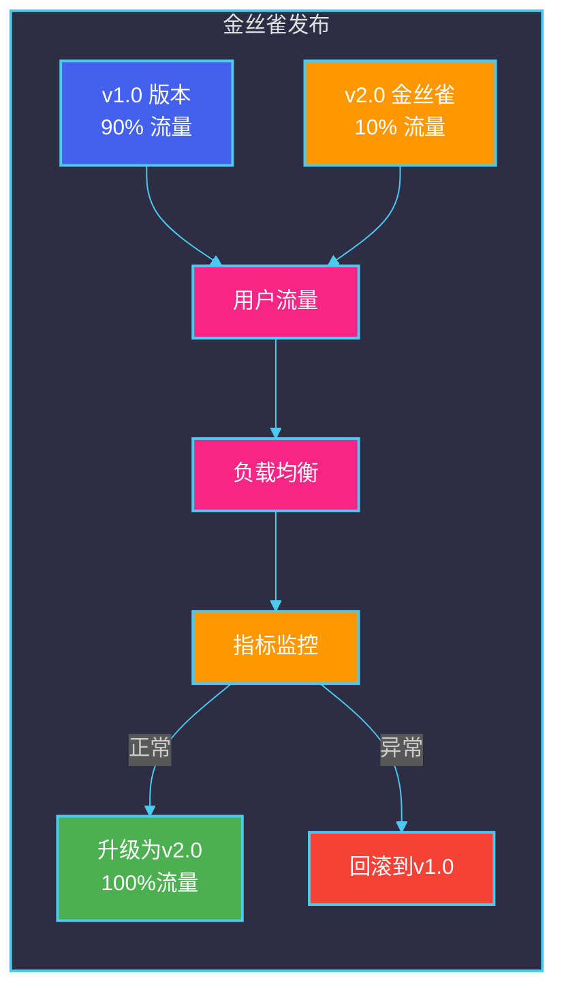

---

## 9.4 容器镜像管理

### 9.4.1 镜像仓库对比

| 特性 | Docker Hub | Harbor | Amazon ECR | GitLab Container Registry |
|------|-----------|--------|------------|-------------------------|
| **托管方式** | SaaS | 自托管/SaaS | SaaS/私有 | SaaS/自托管 |
| **免费额度** | 1个私有仓库 | 开源免费 | 按存储计费 | 有限免费 |
| **安全扫描** | Basic免费，高级付费 | 免费开源 | Basic免费 | 基础扫描 |
| **镜像签名** | 不支持 | 支持 | 支持 | 支持 |
| **角色权限** | 基础 | 细粒度 | IAM集成 | 项目级别 |
| **复制机制** | 不支持 | 支持 | 支持跨区域 | 不支持 |
| ** Helm支持** | Chart支持 | Chart支持 | 不支持 | 不支持 |

### 9.4.2 镜像安全扫描

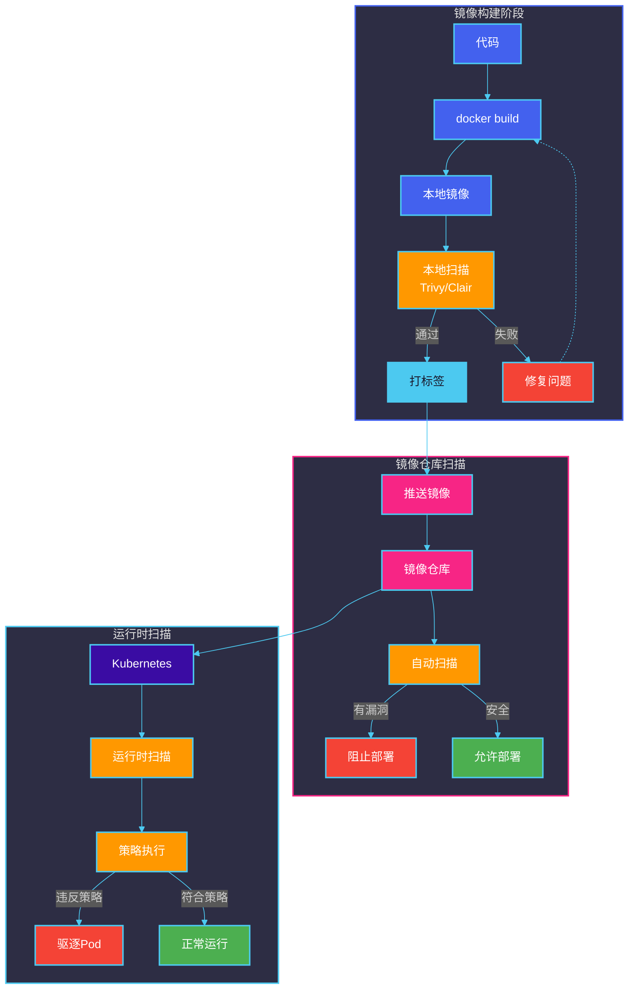

#### 使用Trivy进行镜像扫描

```bash
#!/bin/bash
# scan-image.sh - 镜像安全扫描脚本

# 设置变量
IMAGE=$1
REGISTRY="harbor.example.com"
REPORT_DIR="./scan-reports"

# 创建报告目录
mkdir -p $REPORT_DIR

echo "开始扫描镜像: $IMAGE"

# 1. 本地扫描
trivy image --severity HIGH,CRITICAL \
    --format json \
    --output "$REPORT_DIR/trivy-report.json" \
    $IMAGE

# 2. 检查扫描结果
CRITICAL_COUNT=$(cat $REPORT_DIR/trivy-report.json | jq '.Results[].Vulnerabilities[] | select(.Severity=="CRITICAL") | .VulnerabilityID' | wc -l)

if [ $CRITICAL_COUNT -gt 0 ]; then
    echo "❌ 发现 $CRITICAL_COUNT 个严重漏洞，阻止部署"
    exit 1
fi

# 3. 扫描非root用户
docker run --rm -v /var/run/docker.sock:/var/run/docker.sock \
    aquasecurity/hadolint:latest \
    hadolint --ignore DL3008 Dockerfile

echo "✅ 扫描通过"
```

### 9.4.3 多阶段构建

多阶段构建可以显著减小镜像体积，提高安全性：

```dockerfile
# syntax=docker/dockerfile:1

# ============================================
# 第一阶段：构建阶段
# ============================================
FROM golang:1.21-alpine AS builder

# 设置工作目录
WORKDIR /app

# 安装构建依赖
RUN apk add --no-cache git make

# 复制依赖文件
COPY go.mod go.sum ./
RUN go mod download

# 复制源代码
COPY . .

# 使用编译标志优化二进制文件
RUN CGO_ENABLED=0 GOOS=linux go build \
    -ldflags="-w -s" \
    -o /app/service \
    cmd/service/main.go

# ============================================
# 第二阶段：运行时阶段
# ============================================
FROM alpine:3.19 AS runtime

# 安装运行时依赖（最小化安全攻击面）
RUN apk add --no-cache \
    ca-certificates \
    tzdata \
    && rm -rf /var/cache/apk/*

# 创建非root用户
RUN addgroup -g 1000 appgroup && \
    adduser -u 1000 -G appgroup -s /bin/sh -D appuser

# 设置时区
ENV TZ=Asia/Shanghai

# 从构建阶段复制二进制文件
COPY --from=builder /app/service /app/service

# 复制配置文件（如果需要）
COPY --from=builder /app/config /app/config

# 切换到非root用户
USER appuser

# 设置工作目录
WORKDIR /app

# 健康检查
HEALTHCHECK --interval=30s --timeout=3s --start-period=5s --retries=3 \
    CMD wget --no-verbose --tries=1 --spider http://localhost:8080/health || exit 1

# 暴露端口
EXPOSE 8080

# 启动命令
ENTRYPOINT ["/app/service"]
```

#### 构建优化对比

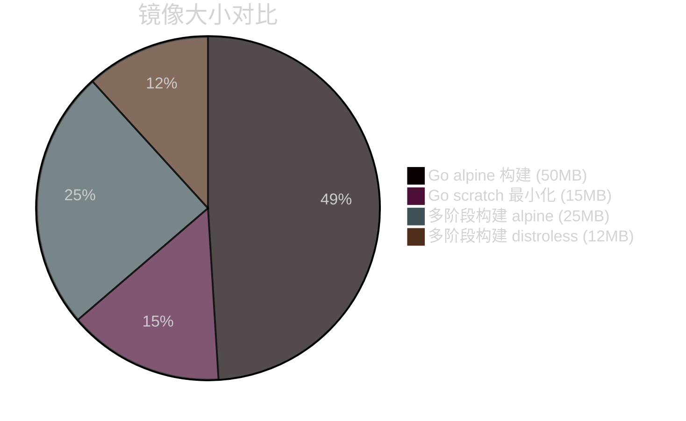

---

## 9.5 配置管理与GitOps

### 9.5.1 GitOps核心概念

GitOps是一种基于Git的运维方法论，核心思想是：**声明式基础设施和应用的整个状态都存储在Git仓库中**。

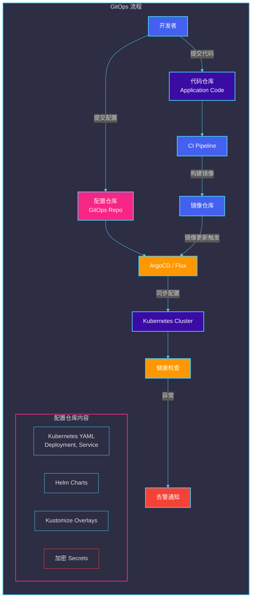

### 9.5.2 ArgoCD实践

#### ArgoCD安装与配置

```yaml
# argocd-application.yaml - ArgoCD Application定义
apiVersion: argoproj.io/v1alpha1
kind: Application
metadata:
  name: user-service
  namespace: argocd
spec:
  project: default
  
  source:
    repoURL: https://github.com/example/k8s-manifests
    targetRevision: main
    path: services/user-service
    
  destination:
    server: https://kubernetes.default.svc
    namespace: production
  
  syncPolicy:
    automated:
      prune: true          # 自动删除不在Git中的资源
      selfHeal: true       # 自动修复与Git不一致的状态
      allowEmpty: false
    
    syncOptions:
      - CreateNamespace=true
      - PrunePropagationPolicy=foreground
    
    retry:
      limit: 5
      backoff:
        duration: 5s
        factor: 2
        maxDuration: 3m
```

#### Kustomize多环境管理

```yaml
# kustomization.yaml - 基础配置
apiVersion: kustomize.config.k8s.io/v1beta1
kind: Kustomization

resources:
  - deployment.yaml
  - service.yaml
  - configmap.yaml

commonLabels:
  app: user-service
  team: platform

images:
  - name: user-service
    newName: harbor.example.com/user-service
    newTag: v1.0.0
```

```yaml
# overlays/development/kustomization.yaml
apiVersion: kustomize.config.k8s.io/v1beta1
kind: Kustomization

bases:
  - ../../base

patches:
  - path: patches/deployment-patch.yaml
    target:
      kind: Deployment

configMapGenerator:
  - name: app-config
    literals:
      - LOG_LEVEL=debug
      - DEBUG=true

replicas:
  - name: user-service
    count: 1
```

```yaml
# overlays/production/kustomization.yaml
apiVersion: kustomize.config.k8s.io/v1beta1
kind: Kustomization

bases:
  - ../../base

patches:
  - path: patches/deployment-patch.yaml
    target:
      kind: Deployment

configMapGenerator:
  - name: app-config
    literals:
      - LOG_LEVEL=info
      - DEBUG=false

replicas:
  - name: user-service
    count: 5

commonAnnotations:
  description: "Production environment"
```

### 9.5.3 秘密管理

```mermaid
%%{init: {'theme': 'dark', 'themeVariables': { 'darkMode': true, 'background': '#1a1a2e', 'primaryColor': '#4361ee', 'primaryTextColor': '#ffffff', 'primaryBorderColor': '#4cc9f0', 'lineColor': '#4cc9f0', 'secondaryColor': '#3a0ca3', 'tertiaryColor': '#2d2d44'}}}%%
flowchart TB
    subgraph 秘密管理方案["秘密管理方案"]
        direction TB

        subgraph 基础方案["基础方案"]
            K8S_SECRET["Kubernetes Secrets<br/>Base64编码"]
            K8S_SECRET -->|"风险"| RISK1["存储在Git中<br/>（高风险）"]
        end

        subgraph 进阶方案["进阶方案"]
            SEALED["Sealed Secrets<br/>加密存储"]
            SEALED -->|"使用"| SEALED_USE["存储到Git<br/>仅K8s可解密"]
        end

        subgraph 最佳方案["最佳方案"]
            HASHICORP["HashiCorp Vault"]
            HASHICORP -->|"动态秘密"| DYNAMIC["数据库凭证<br/>临时访问"]
            HASHICORP -->|"Kubernetes集成"| K8S_INTEGRATION["Vault Agent<br/>自动注入"]
        end

        subgraph 云服务方案["云服务方案"]
            AWS_SECRET["AWS Secrets Manager"]
            GCP_SECRET["GCP Secret Manager"]
            AZURE_KEY["Azure Key Vault"]
        end
    end

    style 秘密管理方案 fill:#2d2d44,stroke:#4cc9f0,stroke-width:2px,color:#e0e0e0
    style 基础方案 fill:#2d2d44,stroke:#f44336,stroke-width:2px,color:#e0e0e0
    style 进阶方案 fill:#2d2d44,stroke:#FF9800,stroke-width:2px,color:#e0e0e0
    style 最佳方案 fill:#2d2d44,stroke:#4CAF50,stroke-width:2px,color:#e0e0e0
    style 云服务方案 fill:#2d2d44,stroke:#4361ee,stroke-width:2px,color:#e0e0e0
    style HASHICORP fill:#FF9800,stroke:#4cc9f0,stroke-width:2px,color:#ffffff
    style K8S_SECRET fill:#f44336,stroke:#4cc9f0,stroke-width:2px,color:#ffffff
    style RISK1 fill:#f44336,stroke:#4cc9f0,stroke-width:2px,color:#ffffff
    style SEALED fill:#FF9800,stroke:#4cc9f0,stroke-width:2px,color:#ffffff
    style SEALED_USE fill:#FF9800,stroke:#4cc9f0,stroke-width:2px,color:#ffffff
    style DYNAMIC fill:#4CAF50,stroke:#4cc9f0,stroke-width:2px,color:#ffffff
    style K8S_INTEGRATION fill:#4CAF50,stroke:#4cc9f0,stroke-width:2px,color:#ffffff
    style AWS_SECRET fill:#4361ee,stroke:#4cc9f0,stroke-width:2px,color:#ffffff
    style GCP_SECRET fill:#4361ee,stroke:#4cc9f0,stroke-width:2px,color:#ffffff
    style AZURE_KEY fill:#4361ee,stroke:#4cc9f0,stroke-width:2px,color:#ffffff
```

#### Vault动态秘密示例

```yaml
# vault-policy.hcl - Vault访问策略
path "secret/data/microservices/*" {
  capabilities = ["read"]
}

path "database/creds/myapp-role" {
  capabilities = ["read"]
}
```

```yaml
# vault-agent-configmap.yaml - Vault Agent配置
apiVersion: v1
kind: ConfigMap
metadata:
  name: vault-agent-config
  namespace: production
data:
  vault-agent-config.hcl: |
    auto_auth_method = "kubernetes"
    auto_auth.kubernetes.role = "myapp-role"
    
    template {
      source      = "/vault/secrets/db-creds.tpl"
      destination = "/vault/secrets/db-creds.txt"
    }
    
    exec {
      command = ["vault-status"]
      interval = 300
    }
```

```yaml
# deployment-with-vault.yaml - 使用Vault的Deployment
apiVersion: apps/v1
kind: Deployment
metadata:
  name: user-service
  namespace: production
spec:
  template:
    spec:
      serviceAccountName: user-service-sa
      
      initContainers:
        - name: vault-agent
          image: vault:1.13
          volumeMounts:
            - name: vault-secrets
              mountPath: /vault/secrets
          args:
            - agent
            - -config=/vault/vault-agent-config.hcl
      
      containers:
        - name: user-service
          image: user-service:v1.0
          volumeMounts:
            - name: vault-secrets
              mountPath: /vault/secrets
          env:
            - name: DB_PASSWORD
              value: "/vault/secrets/db-creds.txt"
      
      volumes:
        - name: vault-secrets
          emptyDir: {}
```

---

## 9.6 基础设施即代码（IaC）

### 9.6.1 Terraform入门

#### Terraform工作流程

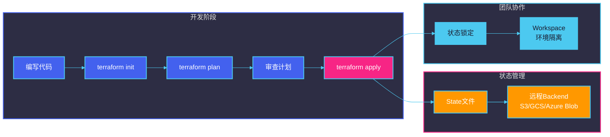

#### Terraform配置示例

```hcl
# main.tf - 微服务基础设施配置

terraform {
  required_version = ">= 1.5.0"

  required_providers {
    aws = {
      source  = "hashicorp/aws"
      version = "~> 5.0"
    }
    kubernetes = {
      source  = "hashicorp/kubernetes"
      version = "~> 2.23"
    }
  }

  # 远程状态存储
  backend "s3" {
    bucket         = "my-terraform-state"
    key            = "prod/main.tfstate"
    region         = "us-east-1"
    encrypt        = true
    dynamodb_table = "terraform-locks"
  }
}

provider "aws" {
  region = "us-east-1"
}

# ============================================
# VPC 网络配置
# ============================================
module "vpc" {
  source  = "terraform-aws-modules/vpc/aws"
  version = "5.0.0"

  name = "microservices-vpc"
  cidr = "10.0.0.0/16"

  azs             = ["us-east-1a", "us-east-1b", "us-east-1c"]
  private_subnets = ["10.0.1.0/24", "10.0.2.0/24", "10.0.3.0/24"]
  public_subnets  = ["10.0.101.0/24", "10.0.102.0/24", "10.0.103.0/24"]

  enable_nat_gateway     = true
  single_nat_gateway     = false
  enable_dns_hostnames   = true
  enable_dns_support      = true

  tags = {
    Environment = "production"
    ManagedBy   = "terraform"
  }
}

# ============================================
# EKS 集群配置
# ============================================
module "eks" {
  source  = "terraform-aws-modules/eks/aws"
  version = "19.0.0"

  cluster_name    = "microservices-cluster"
  cluster_version = "1.28"

  vpc_id     = module.vpc.vpc_id
  subnet_ids = module.vpc.private_subnets

  eks_managed_node_groups = {
    general = {
      min_size       = 2
      max_size       = 10
      desired_size   = 3
      instance_types = ["t3.medium"]

      labels = {
        tier = "general"
      }

      capacity_type = "ON_DEMAND"
    }

    compute = {
      min_size       = 1
      max_size       = 5
      desired_size   = 2
      instance_types = ["t3.large"]

      labels = {
        workload = "compute"
      }

      taints = [{
        key    = "workload"
        value  = "compute"
        effect = "NO_SCHEDULE"
      }]

      capacity_type = "SPOT"
    }
  }

  cluster_addons = {
    coredns = {
      most_recent = true
    }
    kube-proxy = {
      most_recent = true
    }
    vpc-cni = {
      most_recent = true
    }
  }

  tags = {
    Environment = "production"
    ManagedBy   = "terraform"
  }
}

# ============================================
# RDS 数据库配置
# ============================================
module "rds" {
  source  = "terraform-aws-modules/rds/aws"
  version = "6.6.0"

  identifier = "microservices-db"

  engine               = "postgres"
  engine_version       = "15.4"
  family               = "postgres15"
  major_engine_version = "15"
  instance_class       = "db.t3.medium"

  allocated_storage     = 100
  max_allocated_storage = 500
  storage_encrypted     = true

  db_name  = "microservices"
  username = "dbadmin"
  password = var.db_password  # 从变量获取，避免硬编码

  port = 5432

  vpc_security_group_ids = [module.security_groups.rds_id]

  # 高可用配置
  multi_az               = true
  db_subnet_group_name   = module.rds_subnet_group.name
  publicly_accessible    = false

  backup_retention_period = 7
  backup_window          = "03:00-04:00"
  maintenance_window     = "mon:04:00-mon:05:00"

  parameters = [
    {
      name  = "max_connections"
      value = "200"
    },
    {
      name  = "log_connections"
      value = "1"
    }
  ]

  tags = {
    Environment = "production"
    ManagedBy   = "terraform"
  }
}

# ============================================
# 变量定义
# ============================================
variable "db_password" {
  description = "数据库密码"
  type        = string
  sensitive   = true
}

variable "environment" {
  description = "环境名称"
  type        = string
  default     = "production"
}
```

```hcl
# terraform.tfvars - 生产环境变量
environment  = "production"
db_password  = "your-secure-password-here"  # 生产环境应使用Vault或AWS Secrets Manager
```

### 9.6.2 Pulumi简介

Pulumi使用真实的编程语言来定义基础设施：

```typescript
// infrastructure/index.ts - 使用TypeScript定义基础设施

import * as pulumi from "@pulumi/pulumi";
import * as aws from "@pulumi/aws";
import * as kubernetes from "@pulumi/kubernetes";

// 配置
const config = new pulumi.Config();
const environment = config.require("environment");

// 创建VPC
const vpc = new aws.ec2.Vpc("microservices-vpc", {
    cidrBlock: "10.0.0.0/16",
    enableDnsHostnames: true,
    enableDnsSupport: true,
    tags: {
        Name: `microservices-vpc-${environment}`,
        Environment: environment,
    },
});

// 创建子网
const subnetPublic1 = new aws.ec2.Subnet("public-subnet-1", {
    vpcId: vpc.id,
    cidrBlock: "10.0.101.0/24",
    availabilityZone: "us-east-1a",
    mapPublicIpOnLaunch: true,
    tags: {
        Name: `public-subnet-1-${environment}`,
    },
});

// 创建EKS集群
const eksCluster = new aws.eks.Cluster("microservices-cluster", {
    roleArn: eksRole.arn,
    vpcConfig: {
        subnetIds: [subnetPublic1.id, subnetPublic2.id],
        endpointPublicAccess: true,
        endpointPrivateAccess: true,
    },
    kubernetesNetworkConfig: {
        serviceCidr: "172.20.0.0/16",
    },
    version: "1.28",
    tags: {
        Environment: environment,
    },
});

// 定义Kubernetes Deployment
const appLabels = { app: "user-service" };
const deployment = new kubernetes.apps.v1.Deployment("user-service", {
    metadata: {
        name: "user-service",
        namespace: "production",
    },
    spec: {
        replicas: 3,
        selector: { matchLabels: appLabels },
        template: {
            metadata: { labels: appLabels },
            spec: {
                containers: [{
                    name: "user-service",
                    image: "harbor.example.com/user-service:v1.0",
                    ports: [{ containerPort: 8080 }],
                    resources: {
                        requests: { memory: "256Mi", cpu: "250m" },
                        limits: { memory: "512Mi", cpu: "500m" },
                    },
                    readinessProbe: {
                        httpGet: { path: "/health", port: 8080 },
                        initialDelaySeconds: 10,
                        periodSeconds: 10,
                    },
                }],
            },
        },
    },
}, { dependsOn: [eksCluster] });

// 导出连接信息
export const clusterName = eksCluster.name;
export const kubeconfig = eksCluster.kubeconfig;
```

### 9.6.3 Ansible配置管理

Ansible是配置管理和应用部署的重要工具：

```yaml
# inventory.ini - 主机清单
[webservers]
web01.example.com ansible_host=10.0.1.101 ansible_user=ubuntu
web02.example.com ansible_host=10.0.2.102 ansible_user=ubuntu
web03.example.com ansible_host=10.0.3.103 ansible_user=ubuntu

[dbservers]
db01.example.com ansible_host=10.0.1.201 ansible_user=ubuntu

[production:children]
webservers
dbservers

[production:vars]
ansible_ssh_private_key_file=~/.ssh/production.pem
environment=production
```

```yaml
# playbook.yml - 应用部署剧本
---
- name: Deploy Microservices Application
  hosts: webservers
  become: yes
  vars:
    app_version: "1.0.0"
    app_port: 8080

  tasks:
    - name: Ensure application directory exists
      file:
        path: /opt/microservices/{{ app_name }}
        state: directory
        owner: ubuntu
        group: ubuntu
        mode: '0755'

    - name: Pull latest Docker image
      docker_image:
        name: harbor.example.com/{{ app_name }}:{{ app_version }}
        source: pull
        force_source: yes
      register: image_pull

    - name: Stop existing container
      docker_container:
        name: "{{ app_name }}"
        state: stopped
      ignore_errors: yes

    - name: Remove old container
      docker_container:
        name: "{{ app_name }}"
        state: absent
      ignore_errors: yes

    - name: Start application container
      docker_container:
        name: "{{ app_name }}"
        image: "{{ image_pull.image.name }}:{{ image_pull.image.tag }}"
        state: started
        restart_policy: always
        ports:
          - "{{ app_port }}:{{ app_port }}"
        env:
          DB_HOST: "{{ db_host }}"
          DB_PORT: "5432"
          LOG_LEVEL: "info"
        volumes:
          - /opt/microservices/{{ app_name }}/logs:/app/logs
        healthcheck:
          test: ["CMD", "curl", "-f", "http://localhost:{{ app_port }}/health"]
          interval: 30s
          timeout: 10s
          retries: 3
          start_period: 40s

    - name: Wait for application to be ready
      uri:
        url: "http://localhost:{{ app_port }}/health"
        status_code: 200
      register: health_check
      until: health_check.status == 200
      retries: 15
      delay: 5

    - name: Get container status
      docker_container_info:
        name: "{{ app_name }}"
      register: container_info

    - name: Display container information
      debug:
        msg: "Container {{ app_name }} is {{ 'running' if container_info.container.State.Running else 'not running' }}"
```

```yaml
# roles/app-server/tasks/main.yml - 应用服务器角色
---
- name: Install Docker dependencies
  apt:
    name:
      - apt-transport-https
      - ca-certificates
      - curl
      - gnupg
      - lsb-release
    state: present
    update_cache: yes

- name: Add Docker GPG key
  apt_key:
    url: https://download.docker.com/linux/ubuntu/gpg
    state: present

- name: Add Docker repository
  apt_repository:
    repo: "deb [arch=amd64] https://download.docker.com/linux/ubuntu {{ ansible_distribution_release }} stable"
    state: present

- name: Install Docker
  apt:
    name:
      - docker-ce
      - docker-ce-cli
      - containerd.io
      - docker-compose-plugin
    state: present
    update_cache: yes

- name: Start and enable Docker
  service:
    name: docker
    state: started
    enabled: yes

- name: Add ubuntu user to docker group
  user:
    name: ubuntu
    groups: docker
    append: yes
```

---

## 本章小结

本章介绍了微服务系统中DevOps与CI/CD的核心实践：

1. **DevOps文化**
   - DevOps三步法：持续交付、持续集成、持续运营
   - 团队协作模式向全栈团队演进

2. **持续集成（CI）**
   - 完整的CI流水线：代码检查 → 构建 → 测试 → 安全扫描 → 镜像构建
   - GitHub Actions作为主流CI工具的配置方法
   - 自动化测试金字塔策略

3. **持续部署（CD）**
   - 部署流水线设计：提交 → 预生产 → 生产阶段
   - 环境管理：DEV → INT → STAGING → PROD
   - 渐进式部署：蓝绿部署、金丝雀发布、滚动更新

4. **容器镜像管理**
   - 多类型镜像仓库的对比与选择
   - 安全扫描工具Trivy的使用
   - 多阶段构建优化镜像大小

5. **GitOps配置管理**
   - GitOps核心理念：以Git为唯一真相来源
   - ArgoCD实现声明式部署
   - 秘密管理方案对比（Sealed Secrets, Vault等）

6. **基础设施即代码（IaC）**
   - Terraform声明式基础设施定义
   - Pulumi使用编程语言定义基础设施
   - Ansible配置管理和应用部署

---

## 思考题

1. **实践思考**：在你的项目中，CI/CD流水线存在哪些瓶颈？如何优化？

2. **架构思考**：为什么说GitOps是云原生时代配置管理的最佳实践？它相比传统配置管理有哪些优势？

3. **安全思考**：在微服务的CI/CD流水线中，如何确保敏感信息（如数据库密码、API密钥）的安全？

4. **设计思考**：如果要实现零停机部署，蓝绿部署和金丝雀发布各适合什么场景？为什么？

5. **对比分析**：比较Terraform和Pulumi的优缺点，在什么场景下你会选择其中一个？

6. **容量规划**：如果一个微服务从单实例扩展到1000实例，CI/CD流水线需要做出哪些调整？

7. **故障排查**：当生产环境出现故障时，如何利用CI/CD流水线的日志和回滚机制快速恢复服务？
