# 第十章：可观测性与监控

## 本章目录

- 10.1 可观测性概述
- 10.2 可观测性三大支柱
  - 10.2.1 日志（Logs）
  - 10.2.2 指标（Metrics）
  - 10.2.3 追踪（Traces）
- 10.3 日志聚合系统
  - 10.3.1 ELK Stack
  - 10.3.2 Loki与Graylog
  - 10.3.3 结构化日志实践
- 10.4 指标监控体系
  - 10.4.1 Prometheus核心概念
  - 10.4.2 Grafana可视化
  - 10.4.3 RED指标与USE指标
- 10.5 分布式追踪
  - 10.5.1 OpenTelemetry
  - 10.5.2 Jaeger与Zipkin
  - 10.5.3 追踪上下文传播
- 10.6 告警管理
- 10.7 服务等级目标与错误预算
- 10.8 本章小结
- 10.9 思考题

---

## 10.1 可观测性概述

在微服务架构中，系统由大量独立部署的服务组成，一个用户请求可能跨越数十个服务节点。当系统出现故障时，快速定位问题根源变得极为挑战。可观测性（Observability）应运而生，它使我们可以从外部输出推断系统内部状态，从而有效诊断问题。

### 10.1.1 什么是可观测性

可观测性是一种系统属性，定义为通过外部输出理解系统内部状态的能力。在微服务场景下，可观测性让我们能够在分布式系统中回答以下问题：

- 哪个服务导致了请求变慢？
- 为什么某些请求失败了？
- 系统资源使用情况如何？
- 用户请求的完整路径是什么？

### 10.1.2 可观测性架构总览

以下架构图展示了典型的微服务可观测性体系：

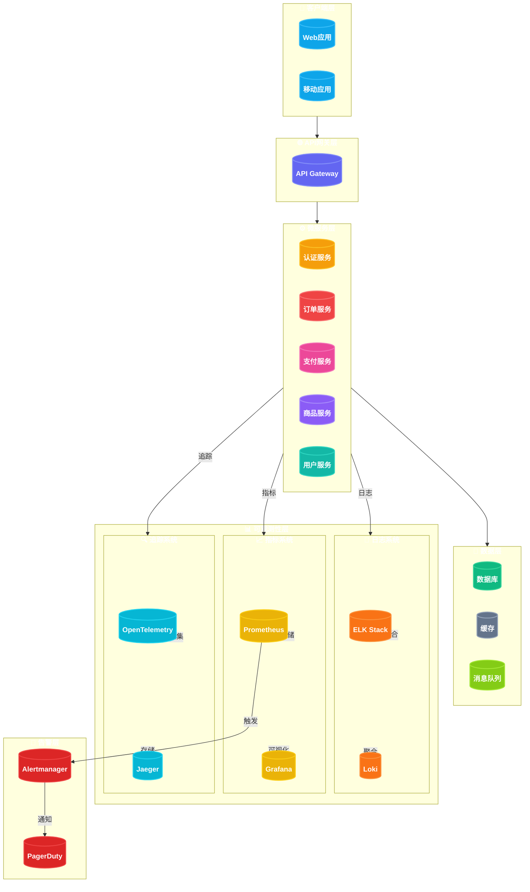

从图中可以看出，日志、指标、追踪三大支柱构成了可观测性的基础，配合告警系统实现问题通知。

---

## 10.2 可观测性三大支柱

可观测性由三个核心概念支撑：**日志（Logs）**、**指标（Metrics）**、**追踪（Traces）**。这三者各有侧重，互为补充。

### 10.2.1 日志（Logs）

日志是系统产生的时间序列事件记录，是最原始的诊断数据。

#### 日志级别

```java
// Java日志示例
public class OrderService {
    private static final Logger logger = LoggerFactory.getLogger(OrderService.class);

    public void createOrder(Order order) {
        logger.debug("Creating order: {}", order.getId());
        logger.info("User {} creating order", order.getUserId());

        try {
            // 业务逻辑
            validateOrder(order);
            saveOrder(order);
            logger.info("Order {} created successfully", order.getId());
        } catch (InsufficientStockException e) {
            logger.warn("Insufficient stock for order: {}", order.getId());
            throw e;
        } catch (Exception e) {
            logger.error("Failed to create order: {}", order.getId(), e);
            throw new OrderCreationException("Failed to create order", e);
        }
    }
}
```

#### 日志级别对照表

| 级别 | 优先级 | 用途 | 示例场景 |
|------|--------|------|----------|
| TRACE | 0 | 最详细的调试信息 | 进入/退出方法、变量值变化 |
| DEBUG | 1 | 开发环境调试信息 | 请求参数、中间计算结果 |
| INFO | 2 | 一般信息性消息 | 服务启动、请求处理成功 |
| WARN | 3 | 警告信息 | 资源使用超过阈值、重试操作 |
| ERROR | 4 | 错误信息 | 异常捕获、请求处理失败 |
| FATAL | 5 | 致命错误 | 服务不可用、数据丢失 |

#### 日志特性对比

| 特性 | 描述 | 优势 |
|------|------|------|
| 详细信息 | 记录完整的上下文 | 便于事后分析 |
| 时间戳 | 精确到毫秒 | 问题复现、时间线重建 |
| 结构化 | JSON格式输出 | 便于检索和分析 |
| 级别分类 | DEBUG/INFO/WARN/ERROR | 按需过滤 |

### 10.2.2 指标（Metrics）

指标是聚合的数值数据，用于监控系统性能和健康状态。

#### 指标类型

```java
// Micrometer指标示例（Spring Boot）
@Service
public class OrderMetrics {

    private final MeterRegistry meterRegistry;
    private final Counter orderCounter;
    private final Timer orderTimer;
    private final Gauge activeOrders;

    public OrderMetrics(MeterRegistry meterRegistry) {
        this.meterRegistry = meterRegistry;

        // 计数器：订单总数
        this.orderCounter = Counter.builder("orders_total")
            .description("Total number of orders")
            .tag("service", "order-service")
            .register(meterRegistry);

        // 计时器：订单处理时间
        this.orderTimer = Timer.builder("order_processing_duration")
            .description("Time taken to process orders")
            .publishPercentiles(0.5, 0.95, 0.99)
            .register(meterRegistry);

        //  gauges：当前活跃订单数
        this.activeOrders = Gauge.builder("orders_active", this, OrderMetrics::getActiveOrderCount)
            .description("Number of active orders")
            .register(meterRegistry);
    }

    public void recordOrder(Order order) {
        orderCounter.increment();
        orderTimer.record(() -> processOrder(order));
    }

    private double getActiveOrderCount() {
        return activeOrders.size();
    }
}
```

#### 指标类型说明

| 类型 | 描述 | 示例 | 适用场景 |
|------|------|------|----------|
| Counter | 只会增加的数值 | 请求数、订单数 | 累计统计 |
| Gauge | 可增可减的数值 | CPU使用率、活跃连接数 | 瞬时状态 |
| Histogram | 数据分布统计 | 响应时间、文件大小 | 百分比分析 |
| Timer | 时间测量 | 请求耗时、操作延迟 | 性能分析 |

### 10.2.3 追踪（Traces）

追踪记录请求在分布式系统中的完整路径。

```go
// Go语言OpenTelemetry追踪示例
package main

import (
    "context"
    "fmt"

    "go.opentelemetry.io/otel"
    "go.opentelemetry.io/otel/attribute"
    "go.opentelemetry.io/otel/exporters/jaeger"
    "go.opentelemetry.io/otel/sdk/trace"
)

func main() {
    // 创建Jaeger exporter
    exporter, err := jaeger.New(jaeger.WithCollectorEndpoint(jaeger.WithEndpoint("http://localhost:14268/api/traces")))
    if err != nil {
        panic(err)
    }

    // 创建trace provider
    tp := trace.NewTracerProvider(trace.WithBatcher(exporter))
    otel.SetTracerProvider(tp)

    tracer := otel.Tracer("order-service")

    // 开始追踪
    ctx, span := tracer.Start(context.Background(), "CreateOrder")
    defer span.End()

    // 添加属性
    span.SetAttributes(
        attribute.String("order.id", "12345"),
        attribute.String("user.id", "user-001"),
    )

    // 调用子服务
    ctx = processPayment(ctx, tracer)
    ctx = reserveInventory(ctx, tracer)

    span.SetAttributes(attribute.Bool("order.success", true))
}

func processPayment(ctx context.Context, tracer otel.Tracer) context.Context {
    ctx, span := tracer.Start(ctx, "ProcessPayment")
    defer span.End()

    span.SetAttributes(
        attribute.String("payment.method", "credit_card"),
        attribute.Float64("payment.amount", 99.99),
    )

    // 处理支付逻辑
    fmt.Println("Processing payment...")
    return ctx
}

func reserveInventory(ctx context.Context, tracer otel.Tracer) context.Context {
    ctx, span := tracer.Start(ctx, "ReserveInventory")
    defer span.End()

    span.SetAttributes(
        attribute.Int("inventory.items", 3),
        attribute.String("warehouse.id", "WH-001"),
    )

    // 预留库存逻辑
    fmt.Println("Reserving inventory...")
    return ctx
}
```

#### 三大支柱对比

| 维度 | 日志 | 指标 | 追踪 |
|------|------|------|------|
| 数据类型 | 离散事件 | 聚合数值 | 请求路径 |
| 存储成本 | 高 | 低 | 中 |
| 问题定位 | 事后分析 | 实时监控 | 快速定位 |
| 时间范围 | 全量保留 | 短期保留 | 中期保留 |
| 主要用途 | 故障根因分析 | 性能趋势分析 | 请求链路分析 |

---

## 10.3 日志聚合系统

日志聚合是将分散在多个服务节点的日志统一收集、存储和查询的过程。

### 10.3.1 ELK Stack

ELK Stack是最流行的日志解决方案，由Elasticsearch、Logstash、Kibana三组件组成。

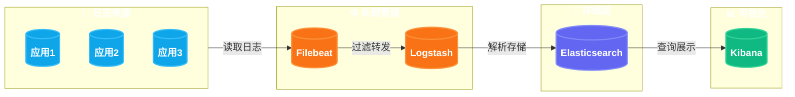

#### Elasticsearch配置

```yaml
# docker-compose.yml
version: '3.8'

services:
  elasticsearch:
    image: docker.elastic.co/elasticsearch/elasticsearch:8.11.0
    container_name: elasticsearch
    environment:
      - node.name=elasticsearch
      - cluster.name=logging-cluster
      - discovery.type=single-node
      - bootstrap.memory_lock=true
      - "ES_JAVA_OPTS=-Xms2g -Xmx2g"
    ulimits:
      memlock:
        soft: -1
        hard: -1
    volumes:
      - es_data:/usr/share/elasticsearch/data
    ports:
      - "9200:9200"
      - "9300:9300"

  logstash:
    image: docker.elastic.co/logstash/logstash:8.11.0
    container_name: logstash
    volumes:
      - ./logstash/pipeline:/usr/share/logstash/pipeline
    depends_on:
      - elasticsearch
    ports:
      - "5044:5044"

  kibana:
    image: docker.elastic.co/kibana/kibana:8.11.0
    container_name: kibana
    environment:
      - ELASTICSEARCH_HOSTS=http://elasticsearch:9200
    ports:
      - "5601:5601"
    depends_on:
      - elasticsearch

volumes:
  es_data:
```

#### Logstash管道配置

```ruby
# logstash/pipeline/logstash.conf
input {
  beats {
    port => 5044
  }

  # 接受Syslog输入
  tcp {
    port => 5000
    codec => json_lines
  }
}

filter {
  # JSON解析
  if [message] =~ /^\{/ {
    json {
      source => "message"
      target => "parsed"
    }
  }

  # 时间处理
  date {
    match => ["timestamp", "ISO8601"]
    target => "@timestamp"
  }

  # 添加服务元数据
  mutate {
    add_field => {
      "environment" => "production"
      "cluster" => "main"
    }
  }

  # 过滤敏感信息
  mutate {
    gsub => [
      "message", "password=[^&\s]+", "password=***",
      "message", "token=[^&\s]+", "token=***"
    ]
  }

  # 提取特定字段
  grok {
    match => { "message" => "%{TIMESTAMP_ISO8601:log_timestamp} %{LOGLEVEL:level} %{DATA:service} - %{GREEDYDATA:content}" }
  }

  # 异常堆栈处理
  if [level] == "ERROR" {
    mutate {
      add_tag => ["error"]
    }
  }
}

output {
  elasticsearch {
    hosts => ["elasticsearch:9200"]
    index => "app-logs-%{+YYYY.MM.dd}"
    document_type => "_doc"
  }

  # 调试输出
  stdout {
    codec => rubydebug
  }
}
```

#### Kibana仪表板配置

```json
// Kibana索引模式配置
{
  "index-pattern": {
    "title": "app-logs-*",
    "timeFieldName": "@timestamp",
    "fields": "[]"
  }
}
```

```javascript
// Kibana可视化查询示例 - 错误率趋势
{
  "query": {
    "bool": {
      "must": [
        { "match": { "level": "ERROR" } },
        {
          "range": {
            "@timestamp": {
              "gte": "now-1h",
              "lte": "now"
            }
          }
        }
      ]
    }
  },
  "aggs": {
    "errors_over_time": {
      "date_histogram": {
        "field": "@timestamp",
        "fixed_interval": "5m"
      },
      "aggs": {
        "error_count": {
          "value_count": { "field": "_id" }
        }
      }
    }
  }
}
```

### 10.3.2 Loki与Graylog

#### Loki架构

Loki是Grafana Labs开发的日志聚合系统，专为云原生环境设计，与Prometheus理念一致。

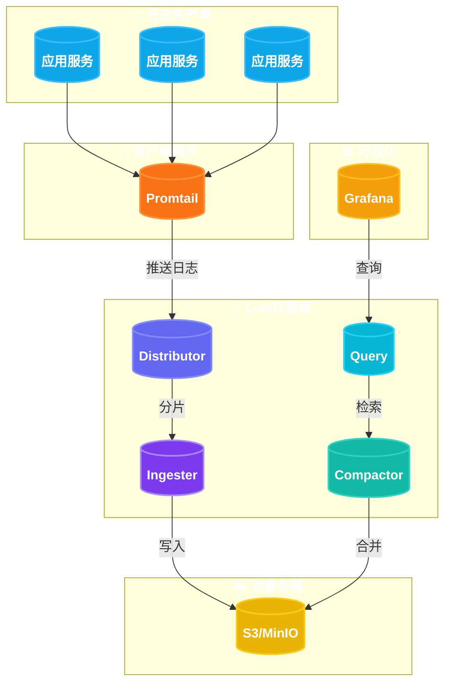

#### Loki配置示例

```yaml
# loki-config.yaml
auth_enabled: false

server:
  http_listen_port: 3100
  grpc_listen_port: 9096

distributor:
  ring:
    kvstore:
      store: inmemory
      replication_factor: 1

ingester:
  lifecycler:
    address: 127.0.0.1
    ring:
      kvstore:
        store: inmemory
      replication_factor: 1
      port: 3102
  chunk_idle_period: 5m
  max_transfer_retries: 0
  chunk_retain_period: 5m
  max_chunk_age: 1h

schema_config:
  configs:
    - from: 2024-01-01
      store: boltdb-shipper
      object_store: filesystem
      schema: v11
      index:
        prefix: index_
        period: 24h

storage_config:
  boltdb_shipper:
    active_index_directory: /tmp/loki/index
    cache_location: /tmp/loki/index_cache
    shared_store: filesystem

  filesystem:
    directory: /tmp/loki/chunks

limits_config:
  reject_old_samples: true
  reject_old_samples_max_age: 168h
```

#### Graylog架构

Graylog是企业级日志管理平台，以MongoDB作为元数据存储，Elasticsearch作为日志存储。

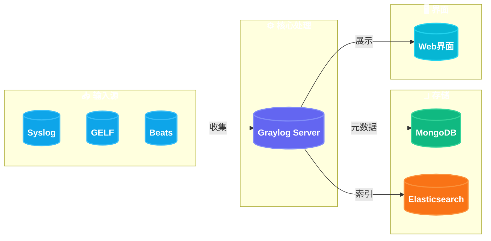

### 10.3.3 结构化日志实践

结构化日志以JSON格式输出，便于检索和分析。

```java
// Java结构化日志示例（使用Logbook）
public class StructuredLogging {

    private static final Logger log = LoggerFactory.getLogger(StructuredLogging.class);

    public void processOrder(Order order) {
        // 使用MDC传递上下文
        try {
            MDC.put("orderId", order.getId());
            MDC.put("userId", order.getUserId());
            MDC.put("traceId", generateTraceId());

            Map<String, Object> logData = Map.of(
                "event", "order_processing",
                "orderId", order.getId(),
                "userId", order.getUserId(),
                "itemCount", order.getItems().size(),
                "totalAmount", order.getTotalAmount(),
                "paymentMethod", order.getPaymentMethod()
            );

            log.info("Processing order: {}", toJson(logData));

            // 业务逻辑
            validateOrder(order);
            processPayment(order);
            confirmOrder(order);

            log.info("Order processed successfully: {}", order.getId());

        } catch (Exception e) {
            Map<String, Object> errorData = Map.of(
                "event", "order_processing_failed",
                "orderId", order.getId(),
                "errorType", e.getClass().getSimpleName(),
                "errorMessage", e.getMessage()
            );
            log.error("Order processing failed: {}", toJson(errorData), e);
            throw e;
        } finally {
            MDC.clear();
        }
    }

    private String toJson(Map<String, Object> data) {
        try {
            return new ObjectMapper().writeValueAsString(data);
        } catch (Exception e) {
            return data.toString();
        }
    }
}
```

```python
# Python结构化日志示例
import logging
import json
from pythonjsonlogger import jsonlogger

class StructuredLogger:
    def __init__(self, name: str):
        self.logger = logging.getLogger(name)
        self.logger.setLevel(logging.INFO)

        # JSON格式化
        handler = logging.StreamHandler()
        formatter = jsonlogger.JsonFormatter(
            fmt='%(asctime)s %(levelname)s %(name)s %(message)s',
            datefmt='%Y-%m-%dT%H:%M:%S'
        )
        handler.setFormatter(formatter)
        self.logger.addHandler(handler)

    def log_order(self, order_id: str, user_id: str, amount: float, action: str):
        self.logger.info(
            "order_event",
            extra={
                "order_id": order_id,
                "user_id": user_id,
                "amount": amount,
                "action": action,
                "service": "order-service",
                "version": "1.0.0"
            }
        )

# 使用示例
logger = StructuredLogger("order-service")
logger.log_order("ORD-12345", "USR-001", 99.99, "created")
```

### 日志方案对比

| 特性 | ELK Stack | Loki | Graylog |
|------|-----------|------|---------|
| 开发公司 | Elastic | Grafana Labs | Graylog Project |
| 存储引擎 | Elasticsearch | Cassandra/Boltdb | Elasticsearch/MongoDB |
| 查询语言 | Lucene | LogQL | Lucene |
| 资源消耗 | 高 | 低 | 中 |
| 运维复杂度 | 高 | 低 | 中 |
| 与Prometheus集成 | 一般 | 原生支持 | 一般 |
| 告警能力 | Kibana告警 | Loki原生 | 原生支持 |
| 适用规模 | 中大型 | 云原生/小型 | 企业级 |
| 许可证 | SSPL/商业 | AGPL/商业 | AGPL/商业 |

---

## 10.4 指标监控体系

### 10.4.1 Prometheus核心概念

Prometheus是云原生时代最流行的时序数据库和监控解决方案。

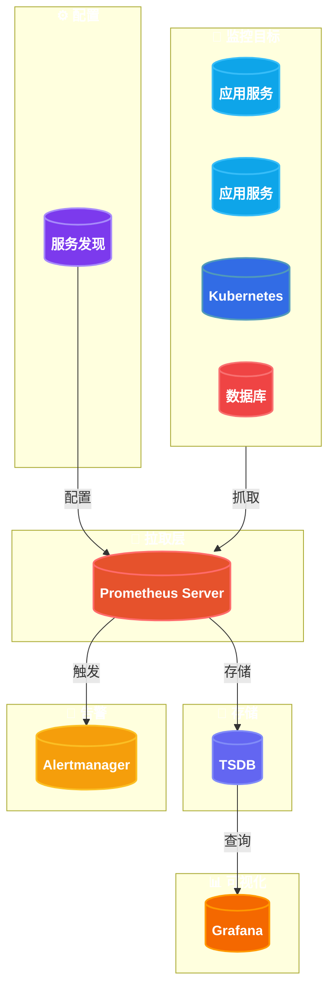

#### Prometheus核心组件

| 组件 | 描述 | 职责 |
|------|------|------|
| Prometheus Server | 核心服务器 | 收集、存储、查询时序数据 |
| Exporters | 数据导出器 | 暴露指标给Prometheus抓取 |
| Service Discovery | 服务发现 | 自动发现监控目标 |
| Alertmanager | 告警管理 | 告警去重、分组、路由 |
| Pushgateway | 推送网关 | 接收短生命周期任务指标 |

#### Prometheus配置示例

```yaml
# prometheus.yml
global:
  scrape_interval: 15s
  evaluation_interval: 15s
  external_labels:
    cluster: 'production'
    environment: 'main'

alerting:
  alertmanagers:
    - static_configs:
        - targets:
            - alertmanager:9093

rule_files:
  - "alerts/*.yml"
  - "rules/*.yml"

scrape_configs:
  # Prometheus自我监控
  - job_name: 'prometheus'
    static_configs:
      - targets: ['localhost:9090']

  # Kubernetes服务发现
  - job_name: 'kubernetes-nodes'
    kubernetes_sd_configs:
      - role: node
    relabel_configs:
      - source_labels: [__address__]
        regex: '(.*):10250'
        replacement: '${1}:9100'
        target_label: __address__

  # 应用服务
  - job_name: 'order-service'
    metrics_path: '/actuator/prometheus'
    static_configs:
      - targets: ['order-service:8080']
    relabel_configs:
      - source_labels: [__address__]
        target_label: instance
        regex: '(.+):.+'
        replacement: '${1}'

  # Spring Boot应用通用配置
  - job_name: 'spring-boot-apps'
    metrics_path: '/actuator/prometheus'
    scrape_interval: 10s
    static_configs:
      - targets:
          - 'user-service:8080'
          - 'product-service:8080'
          - 'payment-service:8080'
    relabel_configs:
      - source_labels: [__address__]
        regex: '([^:]+):.*'
        target_label: service
        replacement: '${1}'
```

#### 指标定义示例

```go
// Go语言Prometheus指标定义
package metrics

import (
    "github.com/prometheus/client_golang/prometheus"
    "github.com/prometheus/client_golang/prometheus/promauto"
)

var (
    // 订单相关指标
    OrdersTotal = promauto.NewCounterVec(
        prometheus.CounterOpts{
            Name: "orders_total",
            Help: "Total number of orders processed",
        },
        []string{"service", "status", "payment_method"},
    )

    OrderDuration = promauto.NewHistogramVec(
        prometheus.HistogramOpts{
            Name:    "order_processing_duration_seconds",
            Help:    "Time spent processing orders",
            Buckets: prometheus.DefBuckets,
        },
        []string{"service", "operation"},
    )

    ActiveOrders = promauto.NewGauge(
        prometheus.GaugeOpts{
            Name: "orders_active",
            Help: "Number of currently active orders",
        },
    )

    // 数据库连接池指标
    DBPoolSize = promauto.NewGaugeVec(
        prometheus.GaugeOpts{
            Name: "db_connection_pool_size",
            Help: "Database connection pool size",
        },
        []string{"db_name", "pool_name"},
    )

    DBPoolInUse = promauto.NewGaugeVec(
        prometheus.GaugeOpts{
            Name: "db_connection_pool_in_use",
            Help: "Number of connections in use",
        },
        []string{"db_name", "pool_name"},
    )

    DBPoolWaiters = promauto.NewGaugeVec(
        prometheus.GaugeOpts{
            Name: "db_connection_pool_waiters",
            Help: "Number of connections waiting for a connection",
        },
        []string{"db_name", "pool_name"},
    )
)
```

```java
// Java Spring Boot Micrometer配置
@Configuration
public class MetricsConfig {

    @Bean
    public MeterRegistry meterRegistry(Clock clock) {
        return new PrometheusMeterRegistry(PrometheusConfig.DEFAULT, clock);
    }

    @Bean
    public ObjectNameMeterFilter commonTagsFilter() {
        return ObjectNameMeterFilter.builder()
            .commonTags(Map.of(
                "application", "order-service",
                "version", "1.0.0"
            ))
            .build();
    }
}

// 自定义指标
@Service
public class OrderMetricsService {

    private final MeterRegistry registry;

    public OrderMetricsService(MeterRegistry registry) {
        this.registry = registry;

        // 订单处理计时器
        Timer.builder("order.process")
            .description("Order processing time")
            .publishPercentiles(0.5, 0.95, 0.99)
            .publishPercentileHistogram()
            .register(registry);
    }

    public void recordOrderProcessing(long durationMs, String status) {
        registry.timer("order.process", "status", status)
            .record(Duration.ofMillis(durationMs));
    }
}
```

### 10.4.2 Grafana可视化

Grafana是流行的开源可视化平台，支持多种数据源。

```yaml
# Grafana配置
apiVersion: 1

datasources:
  - name: Prometheus
    type: prometheus
    access: proxy
    url: http://prometheus:9090
    isDefault: true
    editable: false
    jsonData:
      timeInterval: 15s
      httpMethod: POST

  - name: Loki
    type: loki
    access: proxy
    url: http://loki:3100
    editable: false

  - name: Jaeger
    type: jaeger
    access: proxy
    url: http://jaeger:16686
    editable: false
```

#### Grafana仪表板JSON示例

```json
{
  "dashboard": {
    "title": "订单服务监控面板",
    "panels": [
      {
        "title": "请求速率 (RPS)",
        "type": "graph",
        "gridPos": {"x": 0, "y": 0, "w": 12, "h": 8},
        "targets": [
          {
            "expr": "rate(orders_total{service=\"order-service\"}[5m])",
            "legendFormat": "{{status}}"
          }
        ],
        "xaxis": {"mode": "time"},
        "yaxes": [{"format": "reqps"}, {"format": "short"}]
      },
      {
        "title": "错误率",
        "type": "graph",
        "gridPos": {"x": 12, "y": 0, "w": 12, "h": 8},
        "targets": [
          {
            "expr": "rate(orders_total{service=\"order-service\", status=\"error\"}[5m]) / rate(orders_total{service=\"order-service\"}[5m]) * 100",
            "legendFormat": "Error Rate %"
          }
        ],
        "thresholds": [
          {"value": 1, "color": "yellow", "op": "gt"},
          {"value": 5, "color": "red", "op": "gt"}
        ]
      },
      {
        "title": "P99延迟",
        "type": "graph",
        "gridPos": {"x": 0, "y": 8, "w": 12, "h": 8},
        "targets": [
          {
            "expr": "histogram_quantile(0.99, rate(order_processing_duration_seconds_bucket[5m]))",
            "legendFormat": "P99"
          },
          {
            "expr": "histogram_quantile(0.95, rate(order_processing_duration_seconds_bucket[5m]))",
            "legendFormat": "P95"
          },
          {
            "expr": "histogram_quantile(0.50, rate(order_processing_duration_seconds_bucket[5m]))",
            "legendFormat": "P50"
          }
        ],
        "yaxes": [{"format": "s"}, {"format": "short"}]
      },
      {
        "title": "活跃订单数",
        "type": "gauge",
        "gridPos": {"x": 12, "y": 8, "w": 6, "h": 8},
        "targets": [
          {
            "expr": "orders_active{service=\"order-service\"}"
          }
        ],
        "fieldConfig": {
          "defaults": {
            "thresholds": {
              "mode": "absolute",
              "steps": [
                {"value": 0, "color": "green"},
                {"value": 100, "color": "yellow"},
                {"value": 500, "color": "red"}
              ]
            },
            "unit": "short"
          }
        }
      },
      {
        "title": "数据库连接池使用率",
        "type": "gauge",
        "gridPos": {"x": 18, "y": 8, "w": 6, "h": 8},
        "targets": [
          {
            "expr": "db_connection_pool_in_use / db_connection_pool_size * 100"
          }
        ],
        "fieldConfig": {
          "defaults": {
            "thresholds": {
              "mode": "absolute",
              "steps": [
                {"value": 0, "color": "green"},
                {"value": 70, "color": "yellow"},
                {"value": 90, "color": "red"}
              ]
            },
            "unit": "percent"
          }
        }
      }
    ],
    "time": {"from": "now-1h", "to": "now"},
    "refresh": "5s"
  }
}
```

### 10.4.3 RED指标与USE指标

#### RED指标（服务级别）

RED指标关注服务的核心性能，适用于无状态服务。

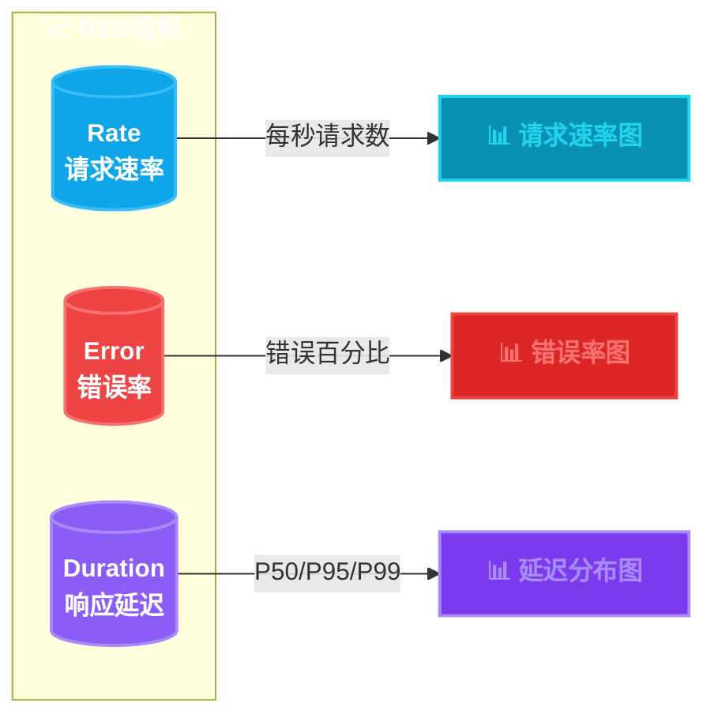

| 指标 | 描述 | 计算公式 | SLO目标示例 |
|------|------|----------|-------------|
| Rate | 每秒请求数 | `rate(requests_total[5m])` | > 1000 RPS |
| Error | 错误率 | `rate(errors_total[5m]) / rate(requests_total[5m])` | < 0.1% |
| Duration | 响应延迟 | `histogram_quantile(0.99, rate(request_duration_seconds_bucket[5m]))` | P99 < 500ms |

#### USE指标（资源级别）

USE指标关注系统资源使用情况，适用于所有基础设施。

| 指标 | 描述 | 计算公式 | SLO目标示例 |
|------|------|----------|-------------|
| Utilization | 利用率 | `avg(cpu_usage_percent)` | < 80% |
| Saturation | 饱和度 | `rate(cpu_throttle_seconds[5m])` | < 10% |
| Errors | 错误数 | `rate(硬件错误_total[5m])` | 0 |

#### 指标采集代码示例

```java
// Spring Boot Actuator + Micrometer实现RED指标
@Configuration
@EnableMetrics
public class MetricsConfiguration {

    @Bean
    public MeterBinder redisConnectionMetrics(RedisConnectionFactory factory) {
        return registry -> {
            // Redis连接池指标
            if (factory instanceof LettuceConnectionFactory) {
                LettuceConnectionFactory connFactory = (LettuceConnectionFactory) factory;
                Gauge.builder("redis.pool.size", connFactory, c -> c.getPoolConfig().getMaxTotal())
                    .tag("pool", "max")
                    .register(registry);
                Gauge.builder("redis.pool.active", connFactory, c -> c.getPoolConfig().getMaxTotal() - c.getPoolConfig().getMinIdle())
                    .tag("pool", "active")
                    .register(registry);
            }
        };
    }
}

// 自定义RED指标拦截器
@Component
public class MetricsInterceptor {

    private final MeterRegistry registry;

    public MetricsInterceptor(MeterRegistry registry) {
        this.registry = registry;
    }

    @Around("@annotation(restController)")
    public Object recordMetrics(ProceedingJoinPoint joinPoint) throws Throwable {
        String methodName = joinPoint.getSignature().getName();
        Timer.Sample sample = Timer.start(registry);

        try {
            Object result = joinPoint.proceed();
            registry.counter("http_requests_total",
                "method", methodName,
                "status", "success"
            ).increment();
            return result;
        } catch (Exception e) {
            registry.counter("http_requests_total",
                "method", methodName,
                "status", "error"
            ).increment();
            throw e;
        } finally {
            sample.stop(Timer.builder("http_request_duration")
                .tag("method", methodName)
                .register(registry));
        }
    }
}
```

---

## 10.5 分布式追踪

分布式追踪记录请求在多个服务间的传播路径，帮助定位跨服务的性能问题。

### 10.5.1 OpenTelemetry

OpenTelemetry（OTel）是CNCF的可观测性标准，提供统一的日志、指标、追踪采集方案。

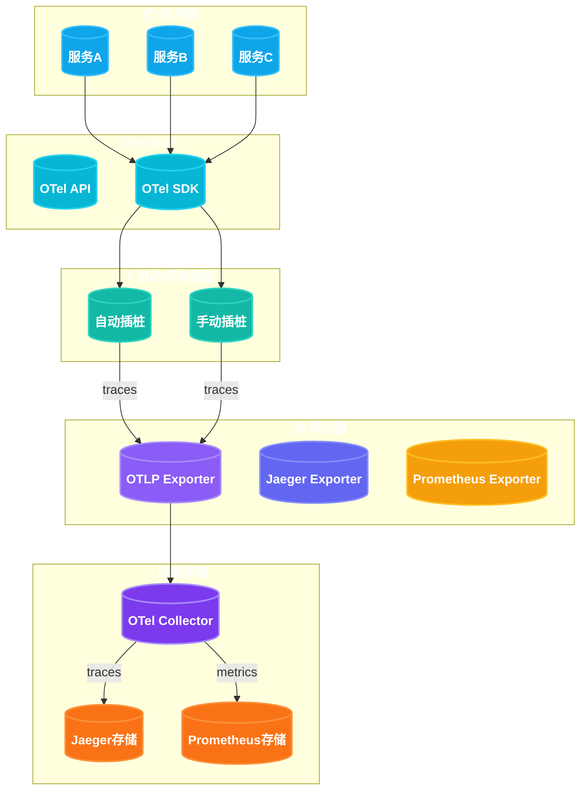

#### OpenTelemetry Collector配置

```yaml
# otel-collector-config.yaml
receivers:
  otlp:
    protocols:
      grpc:
        endpoint: 0.0.0.0:4317
      http:
        endpoint: 0.0.0.0:4318

  jaeger:
    protocols:
      thrift_http:
        endpoint: 0.0.0.0:14278

  prometheus:
    config:
      scrape_configs:
        - job_name: 'otel-collector'
          static_configs:
            - targets: ['localhost:8888']

processors:
  batch:
    timeout: 10s
    send_batch_size: 1024

  memory_limiter:
    check_interval: 1s
    limit_mib: 512
    spike_limit_mib: 128

  # 采样配置
  tail_sampling:
    decision_wait: 10s
    policies:
      - name: errors-policy
        type: status_code
        status_code: {status_codes: [ERROR]}
      - name: slow-traces-policy
        type: latency
        latency: {threshold_ms: 1000}
      - name: probabilistic-policy
        type: probabilistic
        probabilistic: {sampling_percentage: 10}

exporters:
  otlp:
    endpoint: jaeger:4317
    tls:
      insecure: true

  prometheus:
    endpoint: "0.0.0.0:8889"
    namespace: otel
    const_labels:
      service: otel-collector

  logging:
    loglevel: debug

service:
  pipelines:
    traces:
      receivers: [otlp, jaeger]
      processors: [memory_limiter, batch, tail_sampling]
      exporters: [otlp, logging]
    metrics:
      receivers: [prometheus]
      processors: [memory_limiter, batch]
      exporters: [prometheus, logging]
```

#### Go应用集成示例

```go
// Go OpenTelemetry完整集成
package main

import (
    "context"
    "fmt"
    "time"

    "go.opentelemetry.io/otel"
    "go.opentelemetry.io/otel/attribute"
    "go.opentelemetry.io/otel/exporters/otlp/otlptrace/otlptracegrpc"
    "go.opentelemetry.io/otel/exporters/prometheus"
    "go.opentelemetry.io/otel/propagation"
    "go.opentelemetry.io/otel/sdk/metric"
    "go.opentelemetry.io/otel/sdk/resource"
    "go.opentelemetry.io/otel/sdk/trace"
    semconv "go.opentelemetry.io/otel/semconv/v1.21.0"
)

func initTracer(ctx context.Context) (func(context.Context), error) {
    // 创建OTLPtrace exporter
    exporter, err := otlptracegrpc.New(ctx,
        otlptracegrpc.WithEndpoint("localhost:4317"),
        otlptracegrpc.WithInsecure(),
    )
    if err != nil {
        return nil, fmt.Errorf("creating exporter: %w", err)
    }

    // 创建资源信息
    res, err := resource.New(ctx,
        resource.WithAttributes(
            semconv.ServiceName("order-service"),
            semconv.ServiceVersion("1.0.0"),
            semconv.DeploymentEnvironment("production"),
        ),
    )
    if err != nil {
        return nil, fmt.Errorf("creating resource: %w", err)
    }

    // 创建trace provider
    tp := trace.NewTracerProvider(
        trace.WithBatcher(exporter),
        trace.WithResource(res),
        trace.WithSampler(trace.AlwaysSample()),
    )
    otel.SetTracerProvider(tp)

    // 设置上下文传播器
    otel.SetTextMapPropagator(propagation.NewCompositeTextMapPropagator(
        propagation.TraceContext{},
        propagation.Baggage{},
    ))

    return func(ctx context.Context) {
        // 清理函数
        ctx, cancel := context.WithTimeout(ctx, 5*time.Second)
        defer cancel()
        tp.Shutdown(ctx)
    }, nil
}

func main() {
    ctx := context.Background()

    // 初始化追踪器
    shutdown, err := initTracer(ctx)
    if err != nil {
        panic(err)
    }
    defer shutdown(ctx)

    tracer := otel.Tracer("order-service")

    // 创建订单
    ctx, span := tracer.Start(ctx, "CreateOrder")
    span.SetAttributes(
        attribute.String("order.id", "ORD-12345"),
        attribute.String("customer.id", "CUST-001"),
    )

    // 处理支付
    ctx = processPayment(ctx, tracer)

    // 发送通知
    ctx = sendNotification(ctx, tracer)

    span.End()
}

func processPayment(ctx context.Context, tracer trace.Tracer) context.Context {
    ctx, span := tracer.Start(ctx, "ProcessPayment",
        trace.WithAttributes(
            attribute.String("payment.method", "credit_card"),
            attribute.Double("payment.amount", 99.99),
        ),
    )
    defer span.End()

    // 模拟支付处理
    time.Sleep(100 * time.Millisecond)

    // 添加事件
    span.AddEvent("payment_processed",
        trace.WithAttributes(
            attribute.String("transaction.id", "TXN-789"),
        ),
    )

    return ctx
}

func sendNotification(ctx context.Context, tracer trace.Tracer) context.Context {
    ctx, span := tracer.Start(ctx, "SendNotification",
        trace.WithAttributes(
            attribute.String("notification.type", "email"),
            attribute.String("recipient", "user@example.com"),
        ),
    )
    defer span.End()

    time.Sleep(50 * time.Millisecond)
    return ctx
}
```

### 10.5.2 Jaeger与Zipkin

#### Jaeger部署配置

```yaml
# jaeger-compose.yml
version: '3.8'

services:
  jaeger:
    image: jaegertracing/all-in-one:1.52
    container_name: jaeger
    ports:
      - "16686:16686"  # UI
      - "4317:4317"    # OTLP gRPC
      - "4318:4318"    # OTLP HTTP
      - "14250:14250"  # Agent gRPC
      - "14268:14268"  # Collector
      - "14269:14269"  # Admin
    environment:
      - COLLECTOR_OTLP_ENABLED=true
      - SPAN_STORAGE_TYPE=elasticsearch
      - ES_SERVER_URLS=http://elasticsearch:9200
      - LOG_LEVEL=info
    depends_on:
      - elasticsearch

  elasticsearch:
    image: docker.elastic.co/elasticsearch/elasticsearch:8.11.0
    container_name: elasticsearch
    environment:
      - discovery.type=single-node
      - xpack.security.enabled=false
      - "ES_JAVA_OPTS=-Xms512m -Xmx512m"
    ports:
      - "9200:9200"
```

#### Zipkin部署配置

```yaml
# zipkin-compose.yml
version: '3.8'

services:
  zipkin:
    image: openzipkin/zipkin:2.24
    container_name: zipkin
    ports:
      - "9411:9411"
    environment:
      - STORAGE_TYPE=mem
      - JAVA_OPTS=-XX:+UseG1GC
    healthcheck:
      test: ["CMD", "curl", "-f", "http://localhost:9411/health"]
      interval: 30s
      timeout: 10s
      retries: 3
```

#### 追踪方案对比

| 特性 | Jaeger | Zipkin | OpenTelemetry |
|------|--------|--------|---------------|
| 开发公司 | Uber | Twitter (Netflix开源) | CNCF |
| 协议支持 | OTLP, Zipkin, Jaeger | Zipkin, B3 | OTLP (统一) |
| 存储后端 | Elasticsearch, Cassandra, Memory | Elasticsearch, Cassandra, MySQL, Memory | 多样化 |
| UI功能 | 强大 | 基础 | 取决于后端 |
| 采样策略 | 丰富 | 基础 | 丰富 |
| 云原生支持 | 好 | 一般 | 优秀 |
| 未来发展 | 活跃但放缓 | 维护状态 | 主导标准 |

### 10.5.3 追踪上下文传播

追踪上下文传播确保追踪信息在服务间传递。

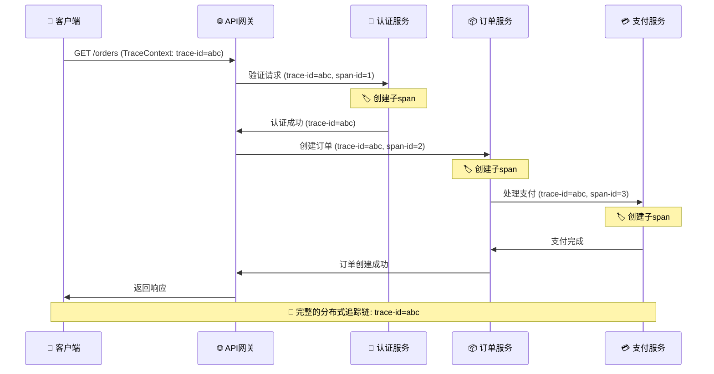

#### HTTP头传播实现

```java
// Java W3C Trace Context传播
public class TraceContextPropagation {

    private static final String TRACEPARENT = "traceparent";
    private static final String TRACESTATE = "tracestate";

    // 发送请求时注入上下文
    public HttpRequest injectTraceContext(HttpRequest request, Context ctx) {
        Span currentSpan = Span.fromContext(ctx);

        String traceparent = String.format("00-%s-%s-%s",
            currentSpan.getSpanContext().getTraceId(),
            currentSpan.getSpanContext().getSpanId(),
            "01" // sampled flag
        );

        request.headers().set(TRACEPARENT, traceparent);

        // 可选：添加tracestate
        request.headers().set(TRACESTATE, "congo=t61rcWkgMzE");

        return request;
    }

    // 接收请求时提取上下文
    public Context extractTraceContext(HttpRequest request) {
        String traceparent = request.headers().get(TRACEPARENT);

        if (traceparent != null) {
            String[] parts = traceparent.split("-");
            if (parts.length == 4) {
                String traceId = parts[1];
                String spanId = parts[2];
                String traceFlags = parts[3];

                return Context.root().with(
                    Span.create(
                        SpanContext.createFromRemoteParent(
                            TraceId.fromHex(traceId),
                            SpanId.fromHex(spanId),
                            TraceFlags.fromHex(traceFlags, 1),
                            TraceState.getDefault()
                        )
                    )
                );
            }
        }

        return Context.root();
    }
}

// Feign客户端拦截器
@Component
public class TraceIdFeignInterceptor implements RequestInterceptor {

    private final Context context;

    public TraceIdFeignInterceptor(Context context) {
        this.context = context;
    }

    @Override
    public void apply(RequestTemplate template) {
        Span currentSpan = Span.fromContext(context);

        template.header("traceparent", String.format("00-%s-%s-01",
            currentSpan.getSpanContext().getTraceId(),
            currentSpan.getSpanContext().getSpanId()
        ));
    }
}
```

```go
// Go语言W3C Trace Context传播
package propagation

import (
    "context"
    "fmt"

    "go.opentelemetry.io/otel/attribute"
    "go.opentelemetry.io/otel/propagation"
    "go.opentelemetry.io/otel/trace"
)

// HTTP传播器
var HTTPExtractor = propagation.NewCompositeTextMapPropagator(
    propagation.TraceContext{},
    propagation.Baggage{},
)

// 注入上下文到HTTP请求
func InjectToRequest(ctx context.Context, headers map[string]string) {
    HTTPExtractor.Inject(ctx, propagation.MapCarrier(headers))
}

// 从HTTP请求提取上下文
func ExtractFromRequest(headers map[string]string) context.Context {
    return HTTPExtractor.Extract(context.Background(), propagation.MapCarrier(headers))
}

// gRPC传播器
func grpcUnaryInterceptor(ctx context.Context, method string, req, reply interface{},
    cc *grpc.ClientConn, invoker grpc.UnaryInvoker, opts ...grpc.CallOption) error {

    // 从context提取当前span信息
    span := trace.SpanFromContext(ctx)
    spanCtx := span.SpanContext()

    // 创建新的gRPC metadata
    md, ok := metadata.FromOutgoingContext(ctx)
    if !ok {
        md = metadata.New()
    }

    // 注入W3C Trace Context
    traceID := spanCtx.TraceID().String()
    spanID := spanCtx.SpanID().String()
    md.Set("traceparent", fmt.Sprintf("00-%s-%s-%s", traceID, spanID, "01"))

    // 添加到新的context
    ctx = metadata.NewOutgoingContext(ctx, md)

    return invoker(ctx, method, req, reply, cc, opts...)
}
```

#### gRPC追踪传播

```protobuf
// Protocol Buffers定义（带追踪上下文）
syntax = "proto3";

package orders;

option go_package = "github.com/example/orderservice/proto";

service OrderService {
    rpc CreateOrder(CreateOrderRequest) returns (CreateOrderResponse);
    rpc GetOrder(GetOrderRequest) returns (Order);
}

message CreateOrderRequest {
    string user_id = 1;
    repeated OrderItem items = 2;
    PaymentMethod payment = 3;
}

message CreateOrderResponse {
    string order_id = 1;
    OrderStatus status = 2;
}

message Order {
    string id = 1;
    string user_id = 2;
    repeated OrderItem items = 3;
    OrderStatus status = 4;
    int64 created_at = 5;
}

message OrderItem {
    string product_id = 1;
    int32 quantity = 2;
    double price = 3;
}

enum PaymentMethod {
    CREDIT_CARD = 0;
    DEBIT_CARD = 1;
    WALLET = 2;
}

enum OrderStatus {
    PENDING = 0;
    CONFIRMED = 1;
    PAID = 2;
    SHIPPED = 3;
    DELIVERED = 4;
    CANCELLED = 5;
}
```

---

## 10.6 告警管理

告警管理是将监控数据转化为可操作通知的过程。

### 10.6.1 Alertmanager配置

```yaml
# alertmanager.yml
global:
  resolve_timeout: 5m
  smtp_smarthost: 'smtp.example.com:587'
  smtp_from: 'alertmanager@example.com'
  smtp_auth_username: 'alertmanager'
  smtp_auth_password: 'password'

route:
  group_by: ['alertname', 'cluster', 'service']
  group_wait: 30s
  group_interval: 5m
  repeat_interval: 4h
  receiver: 'default-receiver'
  routes:
    # 严重告警直接通知
    - match:
        severity: critical
      receiver: 'critical-receiver'
      group_wait: 10s
      repeat_interval: 1h

    # 警告级别告警
    - match:
        severity: warning
      receiver: 'warning-receiver'
      continue: true

    # 服务特定路由
    - match:
        service: order-service
      receiver: 'order-service-receiver'
      routes:
        - match:
            severity: error
          receiver: 'order-service-pager'

receivers:
  - name: 'default-receiver'
    email_configs:
      - to: 'team@example.com'
        headers:
          subject: '【告警】{{ .GroupLabels.alertname }}'

  - name: 'critical-receiver'
    pagerduty_configs:
      - service_key: 'pagerduty-integration-key'
        severity: critical
        component: 'monitoring'
        group: 'platform'

  - name: 'warning-receiver'
    slack_configs:
      - api_url: 'https://hooks.slack.com/services/xxx'
        channel: '#warnings'
        title: '【警告】{{ .GroupLabels.alertname }}'
        text: '{{ range .Alerts }}{{ .Annotations.description }}{{ end }}'

  - name: 'order-service-receiver'
    email_configs:
      - to: 'order-team@example.com'
    slack_configs:
      - api_url: 'https://hooks.slack.com/services/xxx'
        channel: '#order-alerts'

inhibit_rules:
  # 相同服务实例的告警相互抑制
  - source_match:
      severity: 'critical'
    target_match:
      severity: 'warning'
    equal: ['alertname', 'instance']

  # 网络故障时抑制所有告警
  - source_match:
      alertname: 'NetworkDown'
    target_match_re:
      severity: '.*'
    equal: ['instance']
```

#### Prometheus告警规则

```yaml
# prometheus/alerts/order-service.yml
groups:
  - name: order-service
    rules:
      # 高错误率告警
      - alert: OrderServiceHighErrorRate
        expr: |
          sum(rate(orders_total{service="order-service", status="error"}[5m]))
          /
          sum(rate(orders_total{service="order-service"}[5m])) > 0.01
        for: 5m
        labels:
          severity: critical
          service: order-service
        annotations:
          summary: "订单服务错误率过高"
          description: "订单服务5分钟错误率超过1%，当前值: {{ $value | printf \"%.2f\" }}%"

      # P99延迟告警
      - alert: OrderServiceHighLatency
        expr: |
          histogram_quantile(0.99,
            sum(rate(order_processing_duration_seconds_bucket{service="order-service"}[5m]))
            by (le)
          ) > 1
        for: 5m
        labels:
          severity: warning
          service: order-service
        annotations:
          summary: "订单服务延迟过高"
          description: "P99延迟超过1秒，当前值: {{ $value | printf \"%.2f\" }}秒"

      # 活跃订单积压告警
      - alert: OrderServiceBacklog
        expr: orders_active{service="order-service"} > 500
        for: 10m
        labels:
          severity: warning
          service: order-service
        annotations:
          summary: "订单服务积压严重"
          description: "活跃订单数超过500，当前值: {{ $value }}"

      # 数据库连接池告警
      - alert: DatabasePoolExhausted
        expr: |
          db_connection_pool_in_use / db_connection_pool_size > 0.9
        for: 5m
        labels:
          severity: critical
          component: database
        annotations:
          summary: "数据库连接池即将耗尽"
          description: "连接池使用率超过90%，当前值: {{ $value | printf \"%.2f\" }}%"

      # 服务不可用告警
      - alert: ServiceDown
        expr: up{job="order-service"} == 0
        for: 1m
        labels:
          severity: critical
        annotations:
          summary: "服务实例不可用"
          description: "服务实例 {{ $labels.instance }} 已下线超过1分钟"
```

### 10.6.2 告警收敛

告警收敛将相似告警合并，减少告警风暴。

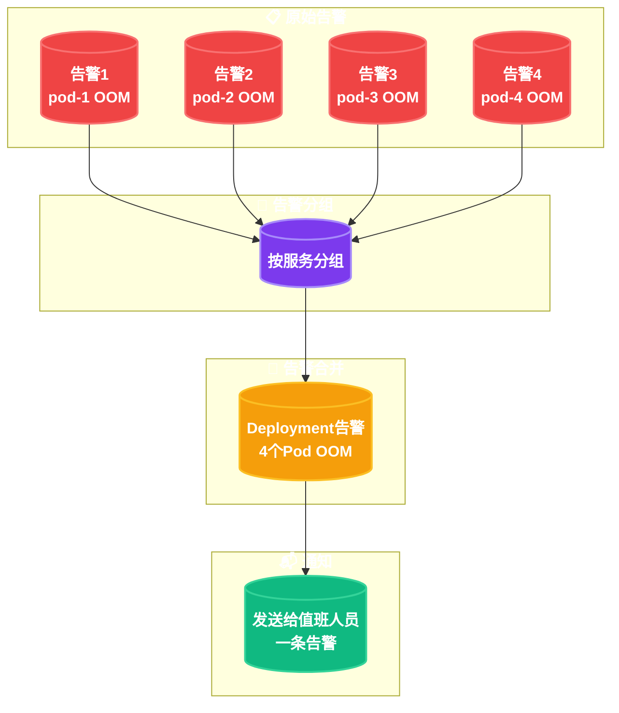

```yaml
# Alertmanager分组配置详解
route:
  group_by: ['alertname', 'cluster', 'namespace', 'service']
  # 分组等待：同一组内告警聚合前等待时间
  group_wait: 30s
  # 分组间隔：新告警加入已触发组的时间
  group_interval: 5m
  # 重复间隔：重复发送相同告警的间隔
  repeat_interval: 4h

# 告警模板示例
templates:
  - '/etc/alertmanager/template/*.tmpl'
```

```go
// 自定义告警收敛逻辑
package alerting

import (
    "context"
    "fmt"
    "time"

    "github.com/prometheus/alertmanager/api/v2/models"
)

type AlertAggregator struct {
    alertGroups map[string]*AlertGroup
}

type AlertGroup struct {
    Key         string
    Alerts      []*models.Alert
    FirstSeen   time.Time
    LastUpdated time.Time
}

func (ag *AlertAggregator) Aggregate(alerts []*models.Alert) []*models.Alert {
    // 按服务+严重性分组
    for _, alert := range alerts {
        key := ag.makeGroupKey(alert)

        if group, exists := ag.alertGroups[key]; exists {
            // 合并到现有组
            group.Alerts = append(group.Alerts, alert)
            group.LastUpdated = time.Now()
        } else {
            // 创建新组
            ag.alertGroups[key] = &AlertGroup{
                Key:         key,
                Alerts:      []*models.Alert{alert},
                FirstSeen:   time.Now(),
                LastUpdated: time.Now(),
            }
        }
    }

    // 返回合并后的告警
    return ag.buildAggregatedAlerts()
}

func (ag *AlertAggregator) makeGroupKey(alert *models.Alert) string {
    labels := alert.Labels
    return fmt.Sprintf("%s:%s:%s",
        labels["service"],
        labels["severity"],
        labels["alertname"])
}

func (ag *AlertAggregator) buildAggregatedAlerts() []*models.Alert {
    var result []*models.Alert

    for _, group := range ag.alertGroups {
        // 只保留最后更新的告警
        aggregated := &models.Alert{
            Labels: group.Alerts[0].Labels,
            Annotations: &models.LabelSet{
                "description": fmt.Sprintf("%d个相关告警", len(group.Alerts)),
                "examples":    ag.formatExamples(group.Alerts),
            },
            StartsAt: &group.FirstSeen,
        }
        result = append(result, aggregated)
    }

    return result
}
```

### 10.6.3 PagerDuty与OpsGenie集成

```yaml
# PagerDuty告警路由
receivers:
  - name: 'pagerduty-critical'
    pagerduty_configs:
      - service_key: '${PAGERDUTY_SERVICE_KEY}'
        severity: critical
        component: 'order-service'
        class: 'high-error-rate'
        group: 'business-critical'
        details:
          # 自定义详情字段
          service: '{{ .GroupLabels.service }}'
          alert_count: '{{ .Alerts.Firing | len }}'
          first_fired: '{{ .Alerts.Firing | first | .StartsAt }}'
        event_action: 'trigger'
        payload:
          summary: '订单服务严重告警'
          source: 'prometheus'

  - name: 'pagerduty-warning'
    pagerduty_configs:
      - service_key: '${PAGERDUTY_SERVICE_KEY}'
        severity: warning
        event_action: 'trigger'
```

```json
// OpsGenie告警配置
{
  "apiConfig": {
    "apiKey": "your-opsgenie-api-key",
    "baseUrl": "https://api.opsgenie.com"
  },
  "alert": {
    "message": "{{ range .Alerts }}{{ .Annotations.summary }}{{ end }}",
    "description": "{{ range .Alerts }}{{ .Annotations.description }}{{ end }}",
    "priority": "{{ if eq .GroupLabels.severity \"critical\" }}P1{{ else }}P3{{ end }}",
    "tags": ["prometheus", "{{ .GroupLabels.service }}"],
    "details": {
      "alert_count": "{{ .Alerts.Firing | len }}",
      "environment": "{{ .GroupLabels.environment }}",
      "service": "{{ .GroupLabels.service }}"
    },
    "teams": [
      {
        "name": "platform-team",
        "tags": ["platform"]
      }
    ],
    "recipients": [
      {
        "type": "team",
        "name": "on-call-team"
      }
    ]
  }
}
```

---

## 10.7 服务等级目标与错误预算

### 10.7.1 SLO定义

SLO（Service Level Objective）是服务承诺的可靠性目标。

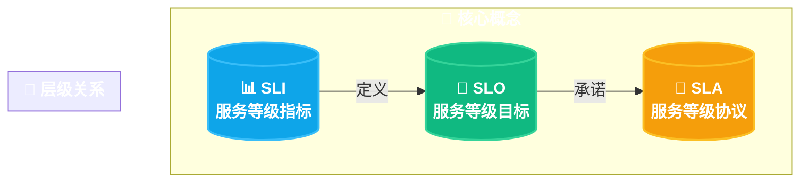

| 概念 | 定义 | 示例 |
|------|------|------|
| SLI | 实际测量的指标 | 请求成功率、P99延迟 |
| SLO | 目标指标值 | 99.9%成功率、P99<500ms |
| SLA | 与客户的正式协议 | 99.5%可用性+赔偿条款 |

#### SLO配置示例

```yaml
# SLO配置文件
apiVersion: config.flank.io/v1
kind: ServiceLevelObjective
metadata:
  name: order-service-availability
  namespace: production
spec:
  service: order-service
  sli:
    type: request_success_rate
    filter: |
      job="order-service"
      method="POST"
      path="/api/orders"
  targets:
    # 可用性目标
    - displayName: "总体可用性"
      target: 99.9
      window: 30d
      filter: ""
    # 延迟目标
    - displayName: "P99延迟"
      target: 99.0
      window: 30d
      filter: "latency < 500ms"
    # 错误率目标
    - displayName: "5xx错误率"
      target: 99.5
      window: 30d
      filter: "status >= 500"
```

```go
// Go SLO计算实现
package slo

import (
    "context"
    "time"

    "github.com/prometheus/client_golang/prometheus"
    "github.com/prometheus/client_golang/prometheus/promauto"
)

type SLOMonitor struct {
    totalRequests   prometheus.Counter
    successfulReqs  prometheus.Counter
    requestDuration prometheus.Histogram

    sliTarget      float64 // SLO目标，如0.999
    windowDuration time.Duration
}

func NewSLOMonitor(serviceName string, sliTarget float64, window time.Duration) *SLOMonitor {
    m := &SLOMonitor{
        totalRequests: promauto.NewCounter(prometheus.CounterOpts{
            Name: serviceName + "_slo_total",
            Help: "Total number of requests",
        }),
        successfulReqs: promauto.NewCounter(prometheus.CounterOpts{
            Name: serviceName + "_slo_success",
            Help: "Successful requests meeting SLO",
        }),
        requestDuration: promauto.NewHistogram(prometheus.HistogramOpts{
            Name:    serviceName + "_slo_duration_seconds",
            Help:    "Request duration",
            Buckets: []float64{0.01, 0.05, 0.1, 0.25, 0.5, 1, 2.5, 5},
        }),
        sliTarget:      sliTarget,
        windowDuration: window,
    }
    return m
}

func (m *SLOMonitor) RecordRequest(ctx context.Context, success bool, duration time.Duration) {
    m.totalRequests.Inc()
    if success {
        m.successfulReqs.Inc()
    }
    m.requestDuration.Observe(duration.Seconds())
}

func (m *SLOMonitor) CalculateErrorBudget(ctx context.Context) (float64, error) {
    // 查询总请求数和成功请求数
    var total float64
    var success float64

    // 使用Prometheus查询（简化示例）
    // 实际实现需要Prometheus客户端查询

    errorRate := 1 - (success / total)
    currentSLO := 1 - errorRate

    // 错误预算 = (目标SLO - 当前SLO) * 总请求数
    budgetBurnRate := (m.sliTarget - currentSLO) / m.sliTarget

    return budgetBurnRate, nil
}

func (m *SLOMonitor) CheckSLOHealth(ctx context.Context) string {
    budget, err := m.CalculateErrorBudget(ctx)
    if err != nil {
        return "unknown"
    }

    if budget < 0 {
        return "healthy" // SLO达标
    } else if budget < 0.5 {
        return "at_risk" // 错误预算消耗过半
    } else {
        return "critical" // 错误预算即将耗尽
    }
}
```

### 10.7.2 错误预算管理

错误预算（Error Budget）是SLO允许的"容错空间"。

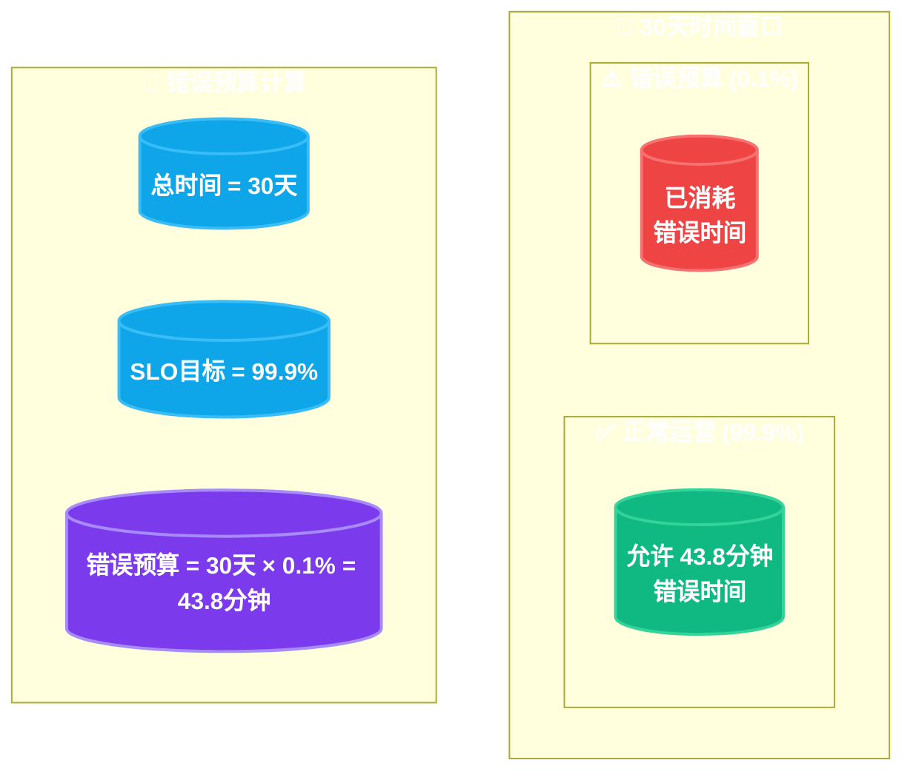

#### 错误预算告警

```yaml
# 错误预算消耗告警
groups:
  - name: error-budget
    rules:
      # 错误预算消耗过快（1小时内超过10%）
      - alert: ErrorBudgetBurnRateHigh
        expr: |
          sum(rate(http_requests_total{status=~"5.."}[1h]))
          /
          sum(rate(http_requests_total[1h])) > 0.001
        for: 5m
        labels:
          severity: warning
          category: error-budget
        annotations:
          summary: "错误预算消耗过快"
          description: "错误预算消耗速率超过10%/小时，当前: {{ $value | printf \"%.2f\" }}%/小时"

      # 错误预算耗尽预警
      - alert: ErrorBudgetExhausted
        expr: |
          (
            1 -
            sum(rate(http_requests_total{status=~"5.."}[30d]))
            /
            sum(rate(http_requests_total[30d]))
          ) < 0.9
        for: 1h
        labels:
          severity: critical
          category: error-budget
        annotations:
          summary: "错误预算即将耗尽"
          description: "30天错误预算已消耗超过90%，当前SLO: {{ $value | printf \"%.4f\" }}"

      # 长期SLO健康检查
      - alert: SLOCurrentlyFailing
        expr: |
          sum(rate(http_requests_total{status=~"5.."}[5m]))
          /
          sum(rate(http_requests_total[5m])) > 0.01
        for: 10m
        labels:
          severity: critical
        annotations:
          summary: "当前SLO未达标"
          description: "过去5分钟错误率超过1%，当前: {{ $value | printf \"%.2f\" }}%"
```

### 10.7.3 常见SLO指标对照表

| 服务类型 | 可用性SLO | 延迟SLO | 错误SLO |
|----------|-----------|---------|---------|
| 核心业务服务 | 99.9% (8.76h/年) | P99 < 500ms | < 0.1% |
| 高可用服务 | 99.99% (52.6min/年) | P99 < 200ms | < 0.01% |
| 标准服务 | 99.5% (43.8h/年) | P95 < 1s | < 0.5% |
| 批处理服务 | 99% (87.6h/年) | P95 < 30s | < 1% |
| 开发环境 | 95% (438h/年) | P95 < 5s | < 5% |

---

## 10.8 本章小结

本章介绍了微服务可观测性体系的完整内容：

1. **可观测性三大支柱**：
   - 日志（Logs）：离散事件记录，用于故障根因分析
   - 指标（Metrics）：聚合数值，用于性能趋势监控
   - 追踪（Traces）：请求路径记录，用于跨服务问题定位

2. **日志聚合系统**：
   - ELK Stack适合企业级日志分析
   - Loki适合云原生环境，与Prometheus集成良好
   - 结构化日志（JSON格式）是现代日志最佳实践

3. **指标监控体系**：
   - Prometheus是云原生监控的事实标准
   - Grafana提供强大的可视化能力
   - RED指标适用于服务级别监控
   - USE指标适用于资源级别监控

4. **分布式追踪**：
   - OpenTelemetry是未来的统一标准
   - W3C Trace Context实现跨服务追踪传播
   - Jaeger和Zipkin各有适用场景

5. **告警管理**：
   - Alertmanager实现告警收敛和路由
   - 合理的告警分组避免告警风暴
   - PagerDuty/OpsGenie实现告警升级和值班

6. **SLO与错误预算**：
   - SLO定义服务可靠性目标
   - 错误预算提供容错空间
   - 错误预算消耗速率是关键监控指标

---

## 10.9 思考题

1. **可观测性设计**：假设你负责设计一个电商微服务系统的可观测性架构，请说明你会如何选择和组合日志、指标、追踪系统？

2. **日志方案选型**：一家中型互联网公司有20个微服务，日均日志量约500GB，你会推荐使用ELK还是Loki？请说明理由。

3. **RED vs USE指标**：对于一个数据库服务，为什么同时需要RED指标和USE指标？它们分别帮助回答什么问题？

4. **追踪上下文传播**：在HTTP/gRPC混合架构中，如何确保追踪上下文的正确传播？需要注意哪些边界情况？

5. **告警疲劳治理**：当告警数量过多导致团队忽视告警时，你会如何优化告警策略？请列出至少3个具体措施。

6. **SLO实践**：某服务的目标是99.9%可用性（每月），当前实际达到99.95%。请计算该月的错误预算消耗情况，以及剩余的错误预算。

7. **OpenTelemetry迁移**：如果你的团队正在从Jaeger迁移到OpenTelemetry，请列出迁移步骤和注意事项。

8. **可观测性成本优化**：随着业务增长，可观测性数据量急剧增加。请提出至少3个成本优化策略。
