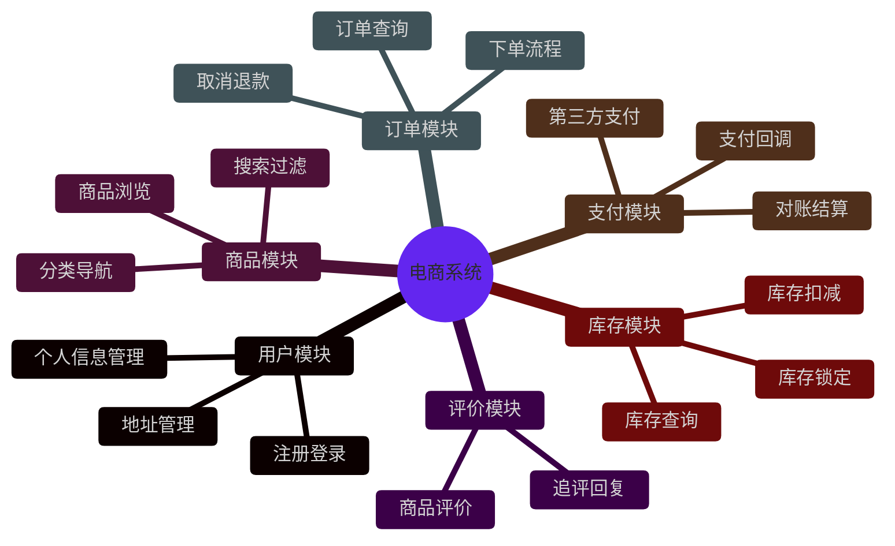
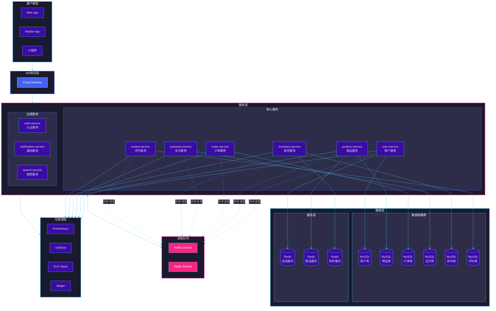
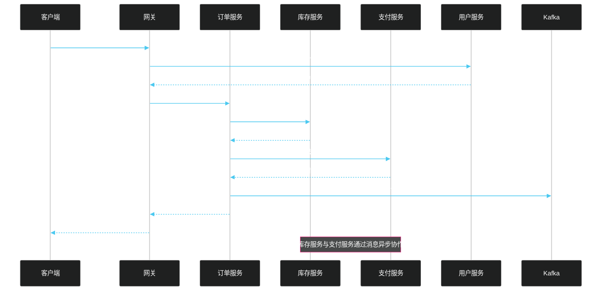
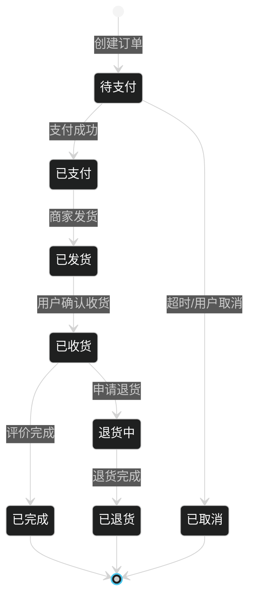
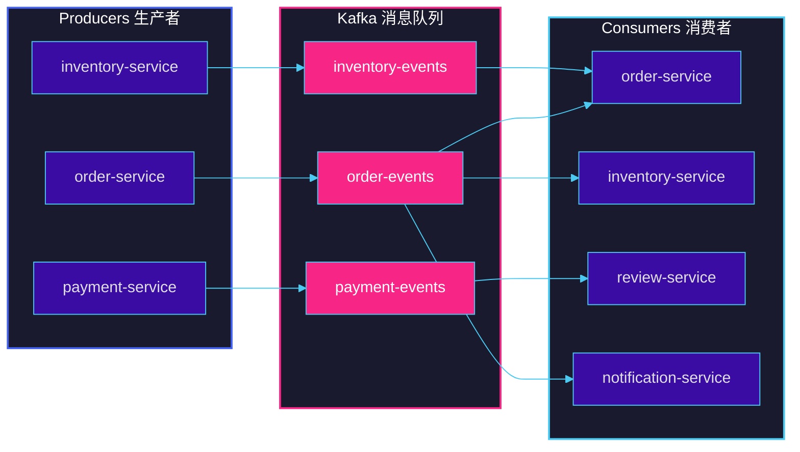
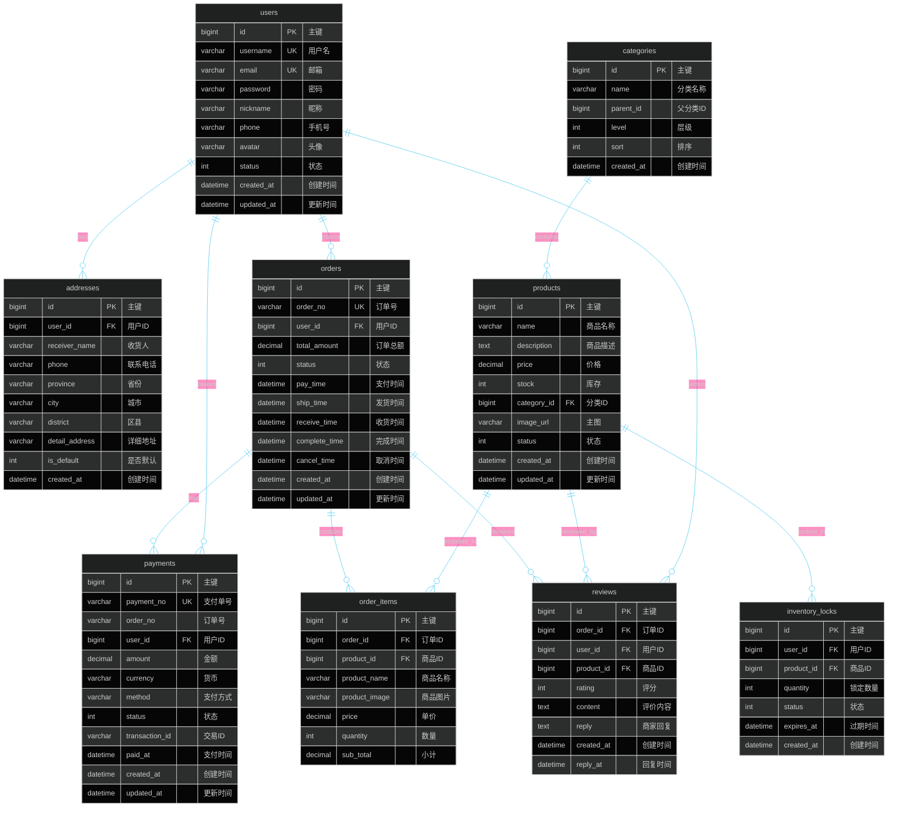
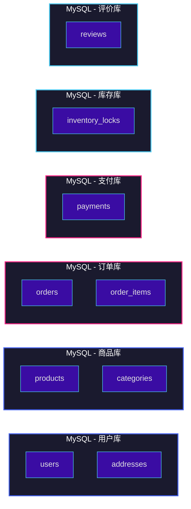
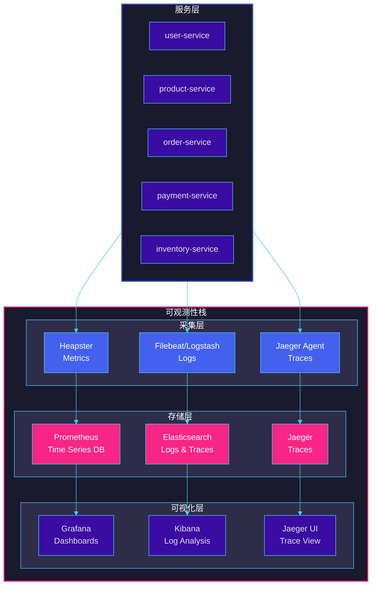
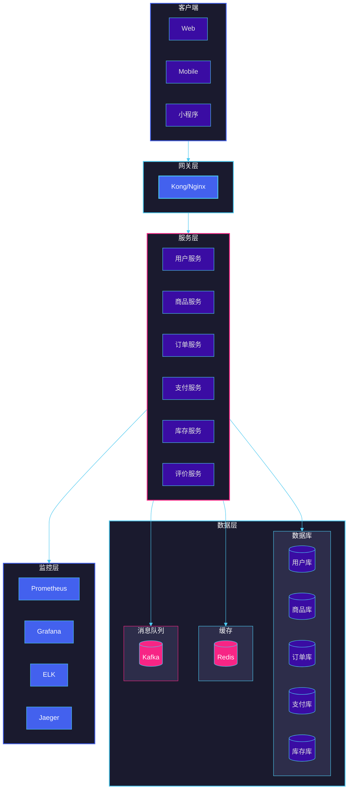

# 第十一章：实战项目 - 电商微服务架构

## 本章目录

1. [项目概述与需求分析](#1-项目概述与需求分析)
2. [整体架构设计](#2-整体架构设计)
3. [核心服务实现](#3-核心服务实现)
4. [服务间通信实现](#4-服务间通信实现)
5. [API网关配置](#5-api网关配置)
6. [数据库设计](#6-数据库设计)
7. [Docker容器化](#7-docker容器化)
8. [Kubernetes部署](#8-kubernetes部署)
9. [可观测性配置](#9-可观测性配置)
10. [本章小结](#10-本章小结)

---

## 1. 项目概述与需求分析

### 1.1 电商系统核心功能

本章我们将构建一个完整的电商微服务系统，包含以下核心功能模块：



### 1.2 微服务拆分方案

根据业务边界和团队职责，我们采用以下微服务拆分策略：

| 服务名称 | 职责范围 | 团队归属 | 独立部署 |
|---------|---------|---------|---------|
| user-service | 用户、认证、权限 | 用户团队 | 是 |
| product-service | 商品、分类、搜索 | 商品团队 | 是 |
| order-service | 订单、结算、退款 | 订单团队 | 是 |
| payment-service | 支付、充值、对账 | 支付团队 | 是 |
| inventory-service | 库存、锁定、履约 | 库存团队 | 是 |
| review-service | 评价、问答、追评 | 评价团队 | 是 |
| gateway-service | 路由、认证、限流 | 平台团队 | 是 |

### 1.3 技术选型

```mermaid
%%{init: {'theme': 'dark', 'themeVariables': {'background': '#1a1a2e', 'primaryColor': '#4361ee', 'primaryTextColor': '#ffffff', 'primaryBorderColor': '#4cc9f0', 'lineColor': '#4cc9f0', 'secondaryColor': '#3a0ca3', 'tertiaryColor': '#f72585', 'nodeBorder': '#4cc9f0', 'clusterBkg': '#2d2d4a', 'clusterBorder': '#4cc9f0', 'titleColor': '#ffffff'}}}%%
graph TD
    A[电商系统技术栈] --> B[开发语言]
    A --> C[框架]
    A --> D[中间件]
    A --> E[数据库]
    A --> F[容器]

    B --> B1[Go 1.21+]
    B --> B2[Java 17+]

    C --> C1[Gin框架]
    C --> C2[Spring Boot]

    D --> D1[Kafka消息队列]
    D --> D2[Redis缓存]
    D --> D3[Nacos注册中心]

    E --> E1[MySQL 8.0]
    E --> E2[PostgreSQL]

    F --> F1[Docker]
    F --> F2[Kubernetes]

    style A fill:#4361ee,stroke:#4cc9f0,stroke-width:2px,color:#ffffff
    style B1 fill:#3a0ca3,stroke:#4cc9f0,stroke-width:1px,color:#e0e0e0
    style B2 fill:#3a0ca3,stroke:#4cc9f0,stroke-width:1px,color:#e0e0e0
    style C1 fill:#3a0ca3,stroke:#4cc9f0,stroke-width:1px,color:#e0e0e0
    style C2 fill:#3a0ca3,stroke:#4cc9f0,stroke-width:1px,color:#e0e0e0
    style D1 fill:#3a0ca3,stroke:#4cc9f0,stroke-width:1px,color:#e0e0e0
    style D2 fill:#3a0ca3,stroke:#4cc9f0,stroke-width:1px,color:#e0e0e0
    style D3 fill:#3a0ca3,stroke:#4cc9f0,stroke-width:1px,color:#e0e0e0
    style E1 fill:#3a0ca3,stroke:#4cc9f0,stroke-width:1px,color:#e0e0e0
    style E2 fill:#3a0ca3,stroke:#4cc9f0,stroke-width:1px,color:#e0e0e0
    style F1 fill:#3a0ca3,stroke:#4cc9f0,stroke-width:1px,color:#e0e0e0
    style F2 fill:#3a0ca3,stroke:#4cc9f0,stroke-width:1px,color:#e0e0e0
```



---

## 2. 整体架构设计

### 2.1 系统架构图



### 2.2 服务列表与职责

| 服务名称 | 端口 | 职责描述 | 主要API |
|---------|------|---------|--------|
| user-service | 8001 | 用户管理、注册登录、JWT签发 | /api/v1/users/* |
| product-service | 8002 | 商品CRUD、分类管理、库存同步 | /api/v1/products/* |
| order-service | 8003 | 订单创建、状态流转、取消退款 | /api/v1/orders/* |
| payment-service | 8004 | 支付处理、退款、对账 | /api/v1/payments/* |
| inventory-service | 8005 | 库存扣减、锁定、释放 | /api/v1/inventory/* |
| review-service | 8006 | 评价管理、问答 | /api/v1/reviews/* |
| gateway-service | 8080 | 路由转发、认证、限流 | /* |

### 2.3 服务交互时序图



---

## 3. 核心服务实现

### 3.1 用户服务 (user-service)

#### 3.1.1 项目结构

```
user-service/
├── cmd/
│   └── server/
│       └── main.go
├── internal/
│   ├── config/
│   │   └── config.go
│   ├── handler/
│   │   └── user_handler.go
│   ├── middleware/
│   │   └── auth.go
│   ├── model/
│   │   └── user.go
│   ├── repository/
│   │   └── user_repository.go
│   └── service/
│       └── user_service.go
├── pkg/
│   ├── jwt/
│   │   └── jwt.go
│   └── response/
│       └── response.go
├── migrations/
│   └── 001_create_users.sql
├── Dockerfile
├── go.mod
└── go.sum
```

#### 3.1.2 核心代码实现

**main.go**

```go
package main

import (
	"context"
	"log"
	"net/http"
	"os"
	"os/signal"
	"syscall"
	"time"

	"user-service/internal/config"
	"user-service/internal/handler"
	"user-service/internal/middleware"
	"user-service/internal/repository"
	"user-service/internal/service"

	"github.com/gin-gonic/gin"
)

func main() {
	// 加载配置
	cfg := config.Load()

	// 初始化数据库
	db, err := repository.NewMySQL(cfg.Database)
	if err != nil {
		log.Fatalf("Failed to connect to database: %v", err)
	}

	// 初始化仓储层
	userRepo := repository.NewUserRepository(db)

	// 初始化服务层
	userSvc := service.NewUserService(userRepo, cfg.JWT.Secret, cfg.JWT.Expiry)

	// 初始化处理器
	userHandler := handler.NewUserHandler(userSvc)

	// 设置Gin模式
	gin.SetMode(cfg.Server.Mode)

	// 创建Gin路由器
	r := gin.New()
	r.Use(gin.Recovery())
	r.Use(gin.Logger())

	// 路由配置
	api := r.Group("/api/v1")
	{
		users := api.Group("/users")
		{
			users.POST("/register", userHandler.Register)
			users.POST("/login", userHandler.Login)
			users.GET("/profile", middleware.AuthRequired(), userHandler.GetProfile)
			users.PUT("/profile", middleware.AuthRequired(), userHandler.UpdateProfile)
		}
	}

	// 健康检查
	r.GET("/health", func(c *gin.Context) {
		c.JSON(http.StatusOK, gin.H{"status": "healthy"})
	})

	// 创建HTTP服务器
	srv := &http.Server{
		Addr:    cfg.Server.Addr(),
		Handler: r,
	}

	// 启动服务器
	go func() {
		log.Printf("User service starting on %s", cfg.Server.Addr())
		if err := srv.ListenAndServe(); err != nil && err != http.ErrServerClosed {
			log.Fatalf("Failed to start server: %v", err)
		}
	}()

	// 优雅关闭
	quit := make(chan os.Signal, 1)
	signal.Notify(quit, syscall.SIGINT, syscall.SIGTERM)
	<-quit
	log.Println("Shutting down server...")

	ctx, cancel := context.WithTimeout(context.Background(), 5*time.Second)
	defer cancel()

	if err := srv.Shutdown(ctx); err != nil {
		log.Fatalf("Server forced to shutdown: %v", err)
	}

	log.Println("Server exited")
}
```

**config.go**

```go
package config

import (
	"fmt"
	"os"
	"time"

	"github.com/spf13/viper"
)

type Config struct {
	Server   ServerConfig
	Database DatabaseConfig
	JWT      JWTConfig
	Redis    RedisConfig
}

type ServerConfig struct {
	Mode string
	Host string
	Port string
}

func (s ServerConfig) Addr() string {
	return fmt.Sprintf("%s:%s", s.Host, s.Port)
}

type DatabaseConfig struct {
	Host     string
	Port     string
	User     string
	Password string
	DBName   string
	MaxOpen  int
	MaxIdle  int
}

func (d DatabaseConfig) DSN() string {
	return fmt.Sprintf("%s:%s@tcp(%s:%s)/%s?charset=utf8mb4&parseTime=True&loc=Local",
		d.User, d.Password, d.Host, d.Port, d.DBName)
}

type JWTConfig struct {
	Secret string
	Expiry time.Duration
}

type RedisConfig struct {
	Host     string
	Port     string
	Password string
	DB       int
}

func Load() *Config {
	viper.SetConfigName("config")
	viper.SetConfigType("yaml")
	viper.AddConfigPath("./configs")
	viper.AddConfigPath(".")

	if err := viper.ReadInConfig(); err != nil {
		panic(err)
	}

	var cfg Config
	if err := viper.Unmarshal(&cfg); err != nil {
		panic(err)
	}

	return &cfg
}
```

**user.go (Model)**

```go
package model

import (
	"time"
)

type User struct {
	ID        int64     `json:"id" gorm:"primaryKey;autoIncrement"`
	Username  string    `json:"username" gorm:"type:varchar(50);uniqueIndex;not null"`
	Email     string    `json:"email" gorm:"type:varchar(100);uniqueIndex;not null"`
	Password  string    `json:"-" gorm:"type:varchar(255);not null"`
	Nickname  string    `json:"nickname" gorm:"type:varchar(100)"`
	Phone     string    `json:"phone" gorm:"type:varchar(20)"`
	Avatar    string    `json:"avatar" gorm:"type:varchar(500)"`
	Status    int       `json:"status" gorm:"type:int;default:1"` // 1:正常 0:禁用
	CreatedAt time.Time `json:"created_at" gorm:"autoCreateTime"`
	UpdatedAt time.Time `json:"updated_at" gorm:"autoUpdateTime"`
}

type RegisterRequest struct {
	Username string `json:"username" binding:"required,min=3,max=50"`
	Email    string `json:"email" binding:"required,email"`
	Password string `json:"password" binding:"required,min=6,max=100"`
	Nickname string `json:"nickname" binding:"max=100"`
}

type LoginRequest struct {
	Username string `json:"username" binding:"required"`
	Password string `json:"password" binding:"required"`
}

type LoginResponse struct {
	Token     string `json:"token"`
	ExpiresAt int64  `json:"expires_at"`
	User      *User  `json:"user"`
}

type UpdateProfileRequest struct {
	Nickname string `json:"nickname" binding:"max=100"`
	Phone    string `json:"phone" binding:"max=20"`
	Avatar   string `json:"avatar" binding:"max=500"`
}
```

**user_service.go**

```go
package service

import (
	"errors"
	"time"

	"user-service/internal/model"
	"user-service/pkg/jwt"

	"golang.org/x/crypto/bcrypt"
)

var (
	ErrUserNotFound      = errors.New("user not found")
	ErrUserAlreadyExists = errors.New("user already exists")
	ErrInvalidPassword   = errors.New("invalid password")
)

type UserService struct {
	repo     *repository.UserRepository
	jwtSecret string
	jwtExpiry time.Duration
}

func NewUserService(repo *repository.UserRepository, jwtSecret string, jwtExpiry time.Duration) *UserService {
	return &UserService{
		repo:      repo,
		jwtSecret: jwtSecret,
		jwtExpiry: jwtExpiry,
	}
}

func (s *UserService) Register(req *model.RegisterRequest) (*model.User, error) {
	// 检查用户是否存在
	exists, err := s.repo.ExistsByUsernameOrEmail(req.Username, req.Email)
	if err != nil {
		return nil, err
	}
	if exists {
		return nil, ErrUserAlreadyExists
	}

	// 密码加密
	hashedPassword, err := bcrypt.GenerateFromPassword([]byte(req.Password), bcrypt.DefaultCost)
	if err != nil {
		return nil, err
	}

	user := &model.User{
		Username: req.Username,
		Email:    req.Email,
		Password: string(hashedPassword),
		Nickname: req.Nickname,
		Status:   1,
	}

	if err := s.repo.Create(user); err != nil {
		return nil, err
	}

	return user, nil
}

func (s *UserService) Login(req *model.LoginRequest) (*model.LoginResponse, error) {
	user, err := s.repo.FindByUsername(req.Username)
	if err != nil {
		if errors.Is(err, repository.ErrUserNotFound) {
			return nil, ErrUserNotFound
		}
		return nil, err
	}

	if err := bcrypt.CompareHashAndPassword([]byte(user.Password), []byte(req.Password)); err != nil {
		return nil, ErrInvalidPassword
	}

	// 生成JWT Token
	expiresAt := time.Now().Add(s.jwtExpiry)
	token, err := jwt.GenerateToken(user.ID, user.Username, s.jwtSecret, expiresAt)
	if err != nil {
		return nil, err
	}

	return &model.LoginResponse{
		Token:     token,
		ExpiresAt: expiresAt.Unix(),
		User:      user,
	}, nil
}

func (s *UserService) GetProfile(userID int64) (*model.User, error) {
	user, err := s.repo.FindByID(userID)
	if err != nil {
		return nil, err
	}
	return user, nil
}

func (s *UserService) UpdateProfile(userID int64, req *model.UpdateProfileRequest) (*model.User, error) {
	user, err := s.repo.FindByID(userID)
	if err != nil {
		return nil, err
	}

	if req.Nickname != "" {
		user.Nickname = req.Nickname
	}
	if req.Phone != "" {
		user.Phone = req.Phone
	}
	if req.Avatar != "" {
		user.Avatar = req.Avatar
	}

	if err := s.repo.Update(user); err != nil {
		return nil, err
	}

	return user, nil
}

func (s *UserService) ValidateToken(tokenString string) (*jwt.Claims, error) {
	return jwt.ValidateToken(tokenString, s.jwtSecret)
}
```

**jwt.go**

```go
package jwt

import (
	"errors"
	"time"

	"github.com/golang-jwt/jwt/v5"
)

var (
	ErrInvalidToken = errors.New("invalid token")
	ErrExpiredToken = errors.New("token has expired")
)

type Claims struct {
	UserID   int64  `json:"user_id"`
	Username string `json:"username"`
	jwt.RegisteredClaims
}

func GenerateToken(userID int64, username, secret string, expiresAt time.Time) (string, error) {
	claims := &Claims{
		UserID:   userID,
		Username: username,
		RegisteredClaims: jwt.RegisteredClaims{
			ExpiresAt: jwt.NewNumericDate(expiresAt),
			IssuedAt:  jwt.NewNumericDate(time.Now()),
			NotBefore: jwt.NewNumericDate(time.Now()),
			Issuer:    "user-service",
			Subject:   username,
		},
	}

	token := jwt.NewWithClaims(jwt.SigningMethodHS256, claims)
	return token.SignedString([]byte(secret))
}

func ValidateToken(tokenString, secret string) (*Claims, error) {
	token, err := jwt.ParseWithClaims(tokenString, &Claims{}, func(token *jwt.Token) (interface{}, error) {
		if _, ok := token.Method.(*jwt.SigningMethodHMAC); !ok {
			return nil, ErrInvalidToken
		}
		return []byte(secret), nil
	})

	if err != nil {
		if errors.Is(err, jwt.ErrTokenExpired) {
			return nil, ErrExpiredToken
		}
		return nil, ErrInvalidToken
	}

	claims, ok := token.Claims.(*Claims)
	if !ok || !token.Valid {
		return nil, ErrInvalidToken
	}

	return claims, nil
}
```

**auth.go (Middleware)**

```go
package middleware

import (
	"net/http"
	"strings"

	"user-service/pkg/jwt"
	"user-service/pkg/response"

	"github.com/gin-gonic/gin"
)

func AuthRequired() gin.HandlerFunc {
	return func(c *gin.Context) {
		authHeader := c.GetHeader("Authorization")
		if authHeader == "" {
			response.Unauthorized(c, "missing authorization header")
			c.Abort()
			return
		}

		parts := strings.SplitN(authHeader, " ", 2)
		if len(parts) != 2 || parts[0] != "Bearer" {
			response.Error(c, http.StatusBadRequest, "invalid authorization header format")
			c.Abort()
			return
		}

		tokenString := parts[1]

		// 从Context获取JWT Secret
		jwtSecret := c.GetString("jwt_secret")
		if jwtSecret == "" {
			jwtSecret = "default-secret" // 生产环境应从配置获取
		}

		claims, err := jwt.ValidateToken(tokenString, jwtSecret)
		if err != nil {
			response.Unauthorized(c, "invalid token")
			c.Abort()
			return
		}

		// 将用户信息存入Context
		c.Set("user_id", claims.UserID)
		c.Set("username", claims.Username)

		c.Next()
	}
}
```

**user_handler.go**

```go
package handler

import (
	"net/http"

	"user-service/internal/model"
	"user-service/internal/service"
	"user-service/pkg/response"

	"github.com/gin-gonic/gin"
)

type UserHandler struct {
	userSvc *service.UserService
}

func NewUserHandler(userSvc *service.UserService) *UserHandler {
	return &UserHandler{userSvc: userSvc}
}

func (h *UserHandler) Register(c *gin.Context) {
	var req model.RegisterRequest
	if err := c.ShouldBindJSON(&req); err != nil {
		response.Error(c, http.StatusBadRequest, "invalid request: "+err.Error())
		return
	}

	user, err := h.userSvc.Register(&req)
	if err != nil {
		if err == service.ErrUserAlreadyExists {
			response.Error(c, http.StatusConflict, "user already exists")
			return
		}
		response.Error(c, http.StatusInternalServerError, "failed to register user")
		return
	}

	response.Success(c, user)
}

func (h *UserHandler) Login(c *gin.Context) {
	var req model.LoginRequest
	if err := c.ShouldBindJSON(&req); err != nil {
		response.Error(c, http.StatusBadRequest, "invalid request: "+err.Error())
		return
	}

	resp, err := h.userSvc.Login(&req)
	if err != nil {
		if err == service.ErrUserNotFound || err == service.ErrInvalidPassword {
			response.Error(c, http.StatusUnauthorized, "invalid username or password")
			return
		}
		response.Error(c, http.StatusInternalServerError, "failed to login")
		return
	}

	response.Success(c, resp)
}

func (h *UserHandler) GetProfile(c *gin.Context) {
	userID := c.GetInt64("user_id")

	user, err := h.userSvc.GetProfile(userID)
	if err != nil {
		if err == service.ErrUserNotFound {
			response.Error(c, http.StatusNotFound, "user not found")
			return
		}
		response.Error(c, http.StatusInternalServerError, "failed to get profile")
		return
	}

	response.Success(c, user)
}

func (h *UserHandler) UpdateProfile(c *gin.Context) {
	userID := c.GetInt64("user_id")

	var req model.UpdateProfileRequest
	if err := c.ShouldBindJSON(&req); err != nil {
		response.Error(c, http.StatusBadRequest, "invalid request: "+err.Error())
		return
	}

	user, err := h.userSvc.UpdateProfile(userID, &req)
	if err != nil {
		response.Error(c, http.StatusInternalServerError, "failed to update profile")
		return
	}

	response.Success(c, user)
}
```

**response.go**

```go
package response

import (
	"net/http"

	"github.com/gin-gonic/gin"
)

type Response struct {
	Code    int         `json:"code"`
	Message string      `json:"message"`
	Data    interface{} `json:"data,omitempty"`
}

func Success(c *gin.Context, data interface{}) {
	c.JSON(http.StatusOK, Response{
		Code:    0,
		Message: "success",
		Data:    data,
	})
}

func Error(c *gin.Context, code int, message string) {
	c.JSON(code, Response{
		Code:    code,
		Message: message,
	})
}

func Unauthorized(c *gin.Context, message string) {
	Error(c, http.StatusUnauthorized, message)
}

func BadRequest(c *gin.Context, message string) {
	Error(c, http.StatusBadRequest, message)
}

func NotFound(c *gin.Context, message string) {
	Error(c, http.StatusNotFound, message)
}

func InternalServerError(c *gin.Context, message string) {
	Error(c, http.StatusInternalServerError, message)
}
```

### 3.2 商品服务 (product-service)

#### 3.2.1 商品模型

```go
package model

import (
	"time"
)

type Product struct {
	ID          int64     `json:"id" gorm:"primaryKey;autoIncrement"`
	Name        string    `json:"name" gorm:"type:varchar(200);not null;index"`
	Description string    `json:"description" gorm:"type:text"`
	Price       int64     `json:"price" gorm:"type:decimal(10,2);not null"` // 价格单位：分
	Stock       int       `json:"stock" gorm:"type:int;not null;default:0"`
	CategoryID  int64     `json:"category_id" gorm:"index"`
	ImageURL    string    `json:"image_url" gorm:"type:varchar(500)"`
	Status      int       `json:"status" gorm:"type:int;default:1"` // 1:上架 0:下架
	CreatedAt   time.Time `json:"created_at" gorm:"autoCreateTime"`
	UpdatedAt   time.Time `json:"updated_at" gorm:"autoUpdateTime"`
}

type Category struct {
	ID       int64     `json:"id" gorm:"primaryKey;autoIncrement"`
	Name     string    `json:"name" gorm:"type:varchar(100);not null"`
	ParentID int64     `json:"parent_id" gorm:"index;default:0"`
	Level    int       `json:"level" gorm:"type:int;default:1"`
	Sort     int       `json:"sort" gorm:"type:int;default:0"`
	CreatedAt time.Time `json:"created_at" gorm:"autoCreateTime"`
}

type ProductListRequest struct {
	Page     int    `form:"page" binding:"min=1"`
	PageSize int    `form:"page_size" binding:"min=1,max=100"`
	CategoryID int64 `form:"category_id"`
	Keyword  string `form:"keyword"`
	Status   int    `form:"status"`
}

type ProductListResponse struct {
	Total    int64     `json:"total"`
	Page     int       `json:"page"`
	PageSize int       `json:"page_size"`
	Items    []Product `json:"items"`
}
```

#### 3.2.2 商品服务实现

```go
package service

import (
	"errors"

	"product-service/internal/model"
	"product-service/internal/repository"
)

var (
	ErrProductNotFound = errors.New("product not found")
	ErrStockInsufficient = errors.New("insufficient stock")
)

type ProductService struct {
	productRepo *repository.ProductRepository
	cache       *redis.Client
}

func NewProductService(repo *repository.ProductRepository, cache *redis.Client) *ProductService {
	return &ProductService{
		productRepo: repo,
		cache:       cache,
	}
}

func (s *ProductService) CreateProduct(req *model.Product) (*model.Product, error) {
	if err := s.productRepo.Create(req); err != nil {
		return nil, err
	}
	return req, nil
}

func (s *ProductService) GetProduct(id int64) (*model.Product, error) {
	// 尝试从缓存获取
	ctx := context.Background()
	cacheKey := "product:" + strconv.FormatInt(id, 10)
	
	cached, err := s.cache.Get(ctx, cacheKey).Result()
	if err == nil {
		var product model.Product
		if json.Unmarshal([]byte(cached), &product) == nil {
			return &product, nil
		}
	}

	// 从数据库获取
	product, err := s.productRepo.FindByID(id)
	if err != nil {
		return nil, ErrProductNotFound
	}

	// 存入缓存
	if data, err := json.Marshal(product); err == nil {
		s.cache.Set(ctx, cacheKey, data, 10*time.Minute)
	}

	return product, nil
}

func (s *ProductService) ListProducts(req *model.ProductListRequest) (*model.ProductListResponse, error) {
	page := req.Page
	if page < 1 {
		page = 1
	}
	pageSize := req.PageSize
	if pageSize < 1 || pageSize > 100 {
		pageSize = 20
	}

	products, total, err := s.productRepo.List(req.CategoryID, req.Keyword, req.Status, page, pageSize)
	if err != nil {
		return nil, err
	}

	return &model.ProductListResponse{
		Total:    total,
		Page:     page,
		PageSize: pageSize,
		Items:    products,
	}, nil
}

func (s *ProductService) UpdateStock(productID int64, delta int) error {
	// delta > 0 增加库存
	// delta < 0 扣减库存
	return s.productRepo.UpdateStock(productID, delta)
}
```

### 3.3 订单服务 (order-service)

#### 3.3.1 订单状态机



#### 3.3.2 订单模型

```go
package model

import (
	"time"
)

type OrderStatus int

const (
	OrderStatusPending   OrderStatus = 1  // 待支付
	OrderStatusPaid      OrderStatus = 2  // 已支付
	OrderStatusShipped   OrderStatus = 3  // 已发货
	OrderStatusDelivered OrderStatus = 4  // 已收货
	OrderStatusCompleted OrderStatus = 5  // 已完成
	OrderStatusCancelled OrderStatus = 6  // 已取消
	OrderStatusRefunding OrderStatus = 7  // 退货中
	OrderStatusRefunded  OrderStatus = 8  // 已退货
)

type Order struct {
	ID           int64       `json:"id" gorm:"primaryKey;autoIncrement"`
	OrderNo      string      `json:"order_no" gorm:"type:varchar(32);uniqueIndex;not null"`
	UserID       int64       `json:"user_id" gorm:"index;not null"`
	TotalAmount  int64       `json:"total_amount" gorm:"type:decimal(10,2);not null"`
	Status       OrderStatus `json:"status" gorm:"type:int;default:1"`
	PayTime      *time.Time  `json:"pay_time"`
	ShipTime     *time.Time  `json:"ship_time"`
	ReceiveTime  *time.Time  `json:"receive_time"`
	CompleteTime *time.Time  `json:"complete_time"`
	CancelTime   *time.Time  `json:"cancel_time"`
	CreatedAt    time.Time   `json:"created_at" gorm:"autoCreateTime"`
	UpdatedAt    time.Time   `json:"updated_at" gorm:"autoUpdateTime"`
	
	Items        []OrderItem `json:"items" gorm:"foreignKey:OrderID"`
}

type OrderItem struct {
	ID           int64  `json:"id" gorm:"primaryKey;autoIncrement"`
	OrderID      int64  `json:"order_id" gorm:"index;not null"`
	ProductID    int64  `json:"product_id" gorm:"not null"`
	ProductName  string `json:"product_name" gorm:"type:varchar(200)"`
	ProductImage string `json:"product_image" gorm:"type:varchar(500)"`
	Price        int64  `json:"price" gorm:"type:decimal(10,2);not null"`
	Quantity     int    `json:"quantity" gorm:"not null"`
	SubTotal     int64  `json:"sub_total" gorm:"type:decimal(10,2);not null"`
}

type CreateOrderRequest struct {
	Items: []CreateOrderItemRequest `json:"items" binding:"required,min=1"`
}

type CreateOrderItemRequest struct {
	ProductID int64 `json:"product_id" binding:"required"`
	Quantity  int   `json:"quantity" binding:"required,min=1"`
}

type OrderListRequest struct {
	Status  OrderStatus `form:"status"`
	Page    int         `form:"page" binding:"min=1"`
	PageSize int        `form:"page_size" binding:"min=1,max=100"`
}
```

#### 3.3.3 订单服务实现

```go
package service

import (
	"context"
	"errors"
	"fmt"
	"strconv"
	"time"

	"order-service/internal/model"
	"order-service/internal/repository"
	"order-service/pkg/kafka"

	"github.com/google/uuid"
)

var (
	ErrOrderNotFound     = errors.New("order not found")
	ErrInvalidOrderState = errors.New("invalid order state")
	ErrPaymentFailed     = errors.New("payment failed")
)

type OrderService struct {
	orderRepo       *repository.OrderRepository
	productClient   *ProductServiceClient
	inventoryClient *InventoryServiceClient
	kafkaProducer   *kafka.Producer
}

func NewOrderService(
	orderRepo *repository.OrderRepository,
	productClient *ProductServiceClient,
	inventoryClient *InventoryServiceClient,
	kafkaProducer *kafka.Producer,
) *OrderService {
	return &OrderService{
		orderRepo:       orderRepo,
		productClient:   productClient,
		inventoryClient: inventoryClient,
		kafkaProducer:   kafkaProducer,
	}
}

func (s *OrderService) CreateOrder(ctx context.Context, userID int64, req *model.CreateOrderRequest) (*model.Order, error) {
	// 1. 查询商品信息
	products, err := s.productClient.GetProducts(ctx, extractProductIDs(req.Items))
	if err != nil {
		return nil, fmt.Errorf("failed to get products: %w", err)
	}

	// 2. 计算订单金额并构建订单项
	var totalAmount int64
	items := make([]model.OrderItem, 0, len(req.Items))
	productMap := make(map[int64]*ProductInfo)

	for _, p := range products {
		productMap[p.ID] = p
	}

	for _, item := range req.Items {
		product, ok := productMap[item.ProductID]
		if !ok {
			return nil, fmt.Errorf("product %d not found", item.ProductID)
		}
		
		subTotal := product.Price * int64(item.Quantity)
		totalAmount += subTotal

		items = append(items, model.OrderItem{
			ProductID:    product.ID,
			ProductName:  product.Name,
			ProductImage: product.ImageURL,
			Price:        product.Price,
			Quantity:     item.Quantity,
			SubTotal:    subTotal,
		})
	}

	// 3. 锁定库存
	if err := s.inventoryClient.LockStock(ctx, userID, req.Items); err != nil {
		return nil, fmt.Errorf("failed to lock stock: %w", err)
	}

	// 4. 创建订单
	order := &model.Order{
		OrderNo:     generateOrderNo(),
		UserID:      userID,
		TotalAmount: totalAmount,
		Status:      model.OrderStatusPending,
		Items:       items,
	}

	if err := s.orderRepo.Create(order); err != nil {
		// 回滚库存锁定
		s.inventoryClient.UnlockStock(ctx, userID, req.Items)
		return nil, fmt.Errorf("failed to create order: %w", err)
	}

	// 5. 发送订单创建事件
	s.publishOrderCreatedEvent(order)

	return order, nil
}

func (s *OrderService) PayOrder(ctx context.Context, orderID int64, paymentMethod string) error {
	order, err := s.orderRepo.FindByID(orderID)
	if err != nil {
		return ErrOrderNotFound
	}

	if order.Status != model.OrderStatusPending {
		return ErrInvalidOrderState
	}

	// 调用支付服务
	paymentResp, err := s.callPaymentService(ctx, order, paymentMethod)
	if err != nil {
		return fmt.Errorf("payment failed: %w", err)
	}

	if paymentResp.Status == "success" {
		now := time.Now()
		order.Status = model.OrderStatusPaid
		order.PayTime = &now

		if err := s.orderRepo.Update(order); err != nil {
			return err
		}

		// 扣减库存
		s.inventoryClient.ConfirmStockDeduction(ctx, order.UserID, order.Items)
		
		// 发送支付成功事件
		s.publishOrderPaidEvent(order)

		return nil
	}

	return ErrPaymentFailed
}

func (s *OrderService) CancelOrder(ctx context.Context, orderID int64, userID int64) error {
	order, err := s.orderRepo.FindByIDAndUserID(orderID, userID)
	if err != nil {
		return ErrOrderNotFound
	}

	if order.Status != model.OrderStatusPending {
		return ErrInvalidOrderState
	}

	// 释放锁定的库存
	s.inventoryClient.UnlockStock(ctx, userID, convertToLockRequests(order.Items))

	now := time.Now()
	order.Status = model.OrderStatusCancelled
	order.CancelTime = &now

	return s.orderRepo.Update(order)
}

func (s *OrderService) ListOrders(ctx context.Context, userID int64, req *model.OrderListRequest) (*model.OrderListResponse, error) {
	page := req.Page
	if page < 1 {
		page = 1
	}
	pageSize := req.PageSize
	if pageSize < 1 || pageSize > 100 {
		pageSize = 20
	}

	orders, total, err := s.orderRepo.ListByUserID(userID, req.Status, page, pageSize)
	if err != nil {
		return nil, err
	}

	return &model.OrderListResponse{
		Total:    total,
		Page:     page,
		PageSize: pageSize,
		Items:    orders,
	}, nil
}

func generateOrderNo() string {
	// 格式: 时间戳 + 随机数
	timestamp := time.Now().Unix()
	random := uuid.New().String()[:8]
	return fmt.Sprintf("ORD%d%s", timestamp, random)
}

func extractProductIDs(items []CreateOrderItemRequest) []int64 {
	ids := make([]int64, len(items))
	for i, item := range items {
		ids[i] = item.ProductID
	}
	return ids
}

func (s *OrderService) publishOrderCreatedEvent(order *model.Order) {
	event := map[string]interface{}{
		"event_type": "order.created",
		"order_id":   order.ID,
		"order_no":   order.OrderNo,
		"user_id":    order.UserID,
		"timestamp":  time.Now().Unix(),
	}
	s.kafkaProducer.Send("order-events", order.OrderNo, event)
}

func (s *OrderService) publishOrderPaidEvent(order *model.Order) {
	event := map[string]interface{}{
		"event_type": "order.paid",
		"order_id":   order.ID,
		"order_no":   order.OrderNo,
		"user_id":    order.UserID,
		"timestamp":  time.Now().Unix(),
	}
	s.kafkaProducer.Send("order-events", order.OrderNo, event)
}
```

### 3.4 支付服务 (payment-service)

```go
package service

import (
	"context"
	"crypto/md5"
	"encoding/hex"
	"fmt"
	"time"

	"payment-service/internal/model"
	"payment-service/internal/repository"
)

type PaymentService struct {
	repo     *repository.PaymentRepository
	alipay   *AlipayClient
	wxpay    *WeChatPayClient
}

type PaymentResult struct {
	Status      string `json:"status"`
	PaymentNo   string `json:"payment_no"`
	TransactionID string `json:"transaction_id"`
}

func NewPaymentService(repo *repository.PaymentRepository) *PaymentService {
	return &PaymentService{
		repo:   repo,
		alipay: NewAlipayClient(),
		wxpay:  NewWeChatPayClient(),
	}
}

func (s *PaymentService) CreatePayment(ctx context.Context, req *model.PaymentRequest) (*model.Payment, error) {
	// 生成支付单号
	paymentNo := generatePaymentNo()

	payment := &model.Payment{
		PaymentNo:   paymentNo,
		OrderNo:     req.OrderNo,
		UserID:      req.UserID,
		Amount:      req.Amount,
		Currency:    "CNY",
		Method:      req.Method,
		Status:      model.PaymentStatusPending,
		CallbackURL: req.CallbackURL,
		CreatedAt:   time.Now(),
	}

	if err := s.repo.Create(payment); err != nil {
		return nil, err
	}

	return payment, nil
}

func (s *PaymentService) ProcessPayment(ctx context.Context, paymentID int64, method string) (*PaymentResult, error) {
	payment, err := s.repo.FindByID(paymentID)
	if err != nil {
		return nil, err
	}

	var result *PaymentResult
	var err error

	switch method {
	case "alipay":
		result, err = s.alipay.Pay(ctx, payment)
	case "wechat":
		result, err = s.wxpay.Pay(ctx, payment)
	default:
		return nil, fmt.Errorf("unsupported payment method: %s", method)
	}

	if err != nil {
		payment.Status = model.PaymentStatusFailed
		payment.ErrorMsg = err.Error()
		s.repo.Update(payment)
		return nil, err
	}

	// 更新支付状态
	payment.Status = model.PaymentStatusSuccess
	payment.TransactionID = result.TransactionID
	payment.PaidAt = time.Now()
	s.repo.Update(payment)

	return result, nil
}

func (s *PaymentService) HandleCallback(ctx context.Context, method string, params map[string]string) error {
	// 验证签名
	if !verifyCallbackSignature(method, params) {
		return fmt.Errorf("invalid signature")
	}

	transactionID := params["transaction_id"]
	status := params["status"]

	payment, err := s.repo.FindByTransactionID(transactionID)
	if err != nil {
		return err
	}

	if status == "success" {
		payment.Status = model.PaymentStatusSuccess
		payment.PaidAt = time.Now()
	} else {
		payment.Status = model.PaymentStatusFailed
		payment.ErrorMsg = params.get("error_msg")
	}

	return s.repo.Update(payment)
}

func generatePaymentNo() string {
	timestamp := time.Now().Unix()
	data := fmt.Sprintf("PY%d%s", timestamp, "random")
	hash := md5.Sum([]byte(data))
	return "PY" + hex.EncodeToString(hash[:])[:24]
}

type model struct {}

func (m model) get(key string) string {
	if v, ok := m.(map[string]string); ok {
		return v[key]
	}
	return ""
}
```

### 3.5 库存服务 (inventory-service)

```go
package service

import (
	"context"
	"fmt"
	"time"

	"inventory-service/internal/model"
	"inventory-service/internal/repository"
	"inventory-service/pkg/kafka"
)

type InventoryService struct {
	repo         *repository.InventoryRepository
	kafkaProducer *kafka.Producer
}

func NewInventoryService(repo *repository.InventoryRepository, kafkaProducer *kafka.Producer) *InventoryService {
	return &InventoryService{
		repo:         repo,
		kafkaProducer: kafkaProducer,
	}
}

type LockRequest struct {
	ProductID int64 `json:"product_id"`
	Quantity  int   `json:"quantity"`
}

func (s *InventoryService) LockStock(ctx context.Context, userID int64, items []LockRequest) error {
	for _, item := range items {
		// 锁定库存
		locked, err := s.repo.Lock(ctx, item.ProductID, item.Quantity)
		if err != nil {
			// 回滚已锁定的库存
			s.UnlockStock(ctx, userID, items)
			return fmt.Errorf("failed to lock product %d: %w", item.ProductID, err)
		}
		if !locked {
			s.UnlockStock(ctx, userID, items)
			return fmt.Errorf("insufficient stock for product %d", item.ProductID)
		}

		// 创建库存锁定记录
		lock := &model.InventoryLock{
			UserID:    userID,
			ProductID: item.ProductID,
			Quantity:  item.Quantity,
			Status:    model.LockStatusLocked,
			ExpiresAt: time.Now().Add(30 * time.Minute), // 30分钟超时
		}
		if err := s.repo.CreateLock(lock); err != nil {
			s.UnlockStock(ctx, userID, items)
			return err
		}
	}

	return nil
}

func (s *InventoryService) UnlockStock(ctx context.Context, userID int64, items []LockRequest) error {
	for _, item := range items {
		// 释放锁定
		if err := s.repo.Unlock(ctx, item.ProductID, item.Quantity); err != nil {
			return err
		}

		// 更新锁定记录状态
		s.repo.UpdateLockStatus(ctx, userID, item.ProductID, model.LockStatusUnlocked)
	}

	return nil
}

func (s *InventoryService) ConfirmDeduction(ctx context.Context, items []LockRequest) error {
	for _, item := range items {
		// 确认扣减库存
		if err := s.repo.Deduct(ctx, item.ProductID, item.Quantity); err != nil {
			return fmt.Errorf("failed to deduct product %d: %w", item.ProductID, err)
		}

		// 更新锁定记录状态
		s.repo.UpdateLockStatusByProductID(ctx, item.ProductID, model.LockStatusConfirmed)
	}

	// 发送库存扣减事件
	s.publishStockDeductedEvent(items)

	return nil
}

func (s *InventoryService) GetStock(ctx context.Context, productID int64) (*model.Stock, error) {
	return s.repo.GetStock(ctx, productID)
}

func (s *InventoryService) publishStockDeductedEvent(items []LockRequest) {
	for _, item := range items {
		event := map[string]interface{}{
			"event_type": "stock.deducted",
			"product_id": item.ProductID,
			"quantity":   item.Quantity,
			"timestamp":  time.Now().Unix(),
		}
		s.kafkaProducer.Send("inventory-events", strconv.FormatInt(item.ProductID, 10), event)
	}
}
```

---

## 4. 服务间通信实现

### 4.1 REST API调用

服务间使用HTTP进行同步通信，通过HTTP Client调用其他服务的API。

```go
package client

import (
	"bytes"
	"context"
	"encoding/json"
	"fmt"
	"net/http"
	"time"
)

type ProductServiceClient struct {
	baseURL string
	client  *http.Client
}

func NewProductServiceClient(baseURL string) *ProductServiceClient {
	return &ProductServiceClient{
		baseURL: baseURL,
		client: &http.Client{
			Timeout: 10 * time.Second,
		},
	}
}

type ProductInfo struct {
	ID       int64  `json:"id"`
	Name     string `json:"name"`
	Price    int64  `json:"price"`
	ImageURL string `json:"image_url"`
	Stock    int    `json:"stock"`
}

func (c *ProductServiceClient) GetProducts(ctx context.Context, productIDs []int64) ([]*ProductInfo, error) {
	reqBody, _ := json.Marshal(map[string]interface{}{
		"product_ids": productIDs,
	})

	req, err := http.NewRequestWithContext(ctx, "POST", c.baseURL+"/api/v1/products/batch", bytes.NewBuffer(reqBody))
	if err != nil {
		return nil, err
	}
	req.Header.Set("Content-Type", "application/json")

	resp, err := c.client.Do(req)
	if err != nil {
		return nil, err
	}
	defer resp.Body.Close()

	if resp.StatusCode != http.StatusOK {
		return nil, fmt.Errorf("failed to get products, status: %d", resp.StatusCode)
	}

	var result struct {
		Code    int            `json:"code"`
		Message string         `json:"message"`
		Data    []*ProductInfo `json:"data"`
	}

	if err := json.NewDecoder(resp.Body).Decode(&result); err != nil {
		return nil, err
	}

	return result.Data, nil
}

func (c *ProductServiceClient) GetProduct(ctx context.Context, productID int64) (*ProductInfo, error) {
	req, err := http.NewRequestWithContext(ctx, "GET", fmt.Sprintf("%s/api/v1/products/%d", c.baseURL, productID), nil)
	if err != nil {
		return nil, err
	}

	resp, err := c.client.Do(req)
	if err != nil {
		return nil, err
	}
	defer resp.Body.Close()

	if resp.StatusCode == http.StatusNotFound {
		return nil, nil
	}

	if resp.StatusCode != http.StatusOK {
		return nil, fmt.Errorf("failed to get product, status: %d", resp.StatusCode)
	}

	var result struct {
		Code    int         `json:"code"`
		Message string      `json:"message"`
		Data    *ProductInfo `json:"data"`
	}

	if err := json.NewDecoder(resp.Body).Decode(&result); err != nil {
		return nil, err
	}

	return result.Data, nil
}
```

### 4.2 异步消息 (Kafka)



#### 4.2.1 Kafka Producer

```go
package kafka

import (
	"context"
	"encoding/json"
	"fmt"
	"log"

	"github.com/IBM/sarama"
)

type Producer struct {
	producer sarama.SyncProducer
}

func NewProducer(brokers []string) (*Producer, error) {
	config := sarama.NewConfig()
	config.Producer.RequiredAcks = sarama.WaitForAll
	config.Producer.Retry.Max = 3
	config.Producer.Return.Successes = true

	producer, err := sarama.NewSyncProducer(brokers, config)
	if err != nil {
		return nil, fmt.Errorf("failed to create producer: %w", err)
	}

	return &Producer{producer: producer}, nil
}

func (p *Producer) Send(topic, key string, value interface{}) error {
	data, err := json.Marshal(value)
	if err != nil {
		return fmt.Errorf("failed to marshal message: %w", err)
	}

	msg := &sarama.ProducerMessage{
		Topic: topic,
		Key:   sarama.StringEncoder(key),
		Value: sarama.ByteEncoder(data),
	}

	partition, offset, err := p.producer.SendMessage(msg)
	if err != nil {
		return fmt.Errorf("failed to send message: %w", err)
	}

	log.Printf("Message sent to topic %s, partition %d, offset %d", topic, partition, offset)
	return nil
}

func (p *Producer) Close() error {
	return p.producer.Close()
}
```

#### 4.2.2 Kafka Consumer

```go
package kafka

import (
	"context"
	"encoding/json"
	"log"

	"github.com/IBM/sarama"
)

type MessageHandler func(ctx context.Context, msg *sarama.ConsumerMessage) error

type Consumer struct {
	consumer sarama.ConsumerGroup
	handlers map[string]MessageHandler
}

func NewConsumer(brokers []string, groupID string) (*Consumer, error) {
	config := sarama.NewConfig()
	config.Consumer.Group.Rebalance.GroupStrategies = []sarama.BalanceStrategy{sarama.NewBalanceStrategyRoundRobin()}
	config.Consumer.Offsets.Initial = sarama.OffsetNewest

	consumer, err := sarama.NewConsumerGroup(brokers, groupID, config)
	if err != nil {
		return nil, err
	}

	return &Consumer{
		consumer: consumer,
		handlers: make(map[string]MessageHandler),
	}, nil
}

func (c *Consumer) RegisterHandler(topic string, handler MessageHandler) {
	c.handlers[topic] = handler
}

func (c *Consumer) Start(ctx context.Context, topics []string) error {
	handler := &consumerGroupHandler{handlers: c.handlers}

	for {
		if err := c.consumer.Consume(ctx, topics, handler); err != nil {
			log.Printf("Error from consumer: %v", err)
		}
		if ctx.Err() != nil {
			return ctx.Err()
		}
	}
}

type consumerGroupHandler struct {
	handlers map[string]MessageHandler
}

func (h *consumerGroupHandler) Setup(sarama.ConsumerGroupSession) error {
	return nil
}

func (h *consumerGroupHandler) Cleanup(sarama.ConsumerGroupSession) error {
	return nil
}

func (h *consumerGroupHandler) ConsumeClaim(session sarama.ConsumerGroupSession, claim sarama.ConsumerGroupClaim) error {
	for {
		select {
		case message, ok := <-claim.Messages():
			if !ok {
				return nil
			}

			log.Printf("Received message from topic %s, partition %d, offset %d",
				message.Topic, message.Partition, message.Offset)

			if handler, ok := h.handlers[message.Topic]; ok {
				if err := handler(session.Context(), message); err != nil {
					log.Printf("Error handling message: %v", err)
				}
			}

			session.MarkMessage(message, "")

		case <-session.Context().Done():
			return nil
		}
	}
}
```

#### 4.2.3 事件处理示例

```go
// 订单服务监听库存事件
func (s *OrderService) StartInventoryEventConsumer(ctx context.Context) error {
	consumer, err := kafka.NewConsumer(s.kafkaBrokers, "order-service-inventory")
	if err != nil {
		return err
	}

	consumer.RegisterHandler("inventory-events", s.handleInventoryEvent)

	go func() {
		if err := consumer.Start(ctx, []string{"inventory-events"}); err != nil {
			log.Printf("Failed to start inventory consumer: %v", err)
		}
	}()

	return nil
}

func (s *OrderService) handleInventoryEvent(ctx context.Context, msg *sarama.ConsumerMessage) error {
	var event map[string]interface{}
	if err := json.Unmarshal(msg.Value, &event); err != nil {
		return err
	}

	eventType, _ := event["event_type"].(string)
	productID, _ := event["product_id"].(float64)

	switch eventType {
	case "stock.locked":
		log.Printf("Stock locked for product %d", int64(productID))

	case "stock.unlocked":
		log.Printf("Stock unlocked for product %d", int64(productID))
		// 可以触发订单超时检查等逻辑

	case "stock.deducted":
		log.Printf("Stock deducted for product %d", int64(productID))
		// 更新订单相关状态
	}

	return nil
}
```

---

## 5. API网关配置

### 5.1 Kong网关配置

```yaml
# docker-compose.yml (Kong + PostgreSQL)
version: '3.8'

services:
  kong:
    image: kong:3.4
    environment:
      KONG_DATABASE: postgres
      KONG_PG_HOST: postgres
      KONG_PG_USER: kong
      KONG_PG_PASSWORD: kong
      KONG_PG_DATABASE: kong
      KONG_DECLARATIVE_CONFIG: /kong/kong.yml
      KONG_PROXY_ACCESS_LOG: /dev/stdout
      KONG_ADMIN_ACCESS_LOG: /dev/stdout
      KONG_PROXY_ERROR_LOG: /dev/stderr
      KONG_ADMIN_ERROR_LOG: /dev/stderr
      KONG_ADMIN_LISTEN: 0.0.0.0:8001
    ports:
      - "8000:8000"   # HTTP
      - "8443:8443"   # HTTPS
      - "8001:8001"   # Admin HTTP
      - "8444:8444"   # Admin HTTPS
    volumes:
      - ./kong.yml:/kong/kong.yml:ro
    depends_on:
      - postgres
    restart: unless-stopped

  postgres:
    image: postgres:15
    environment:
      POSTGRES_USER: kong
      POSTGRES_PASSWORD: kong
      POSTGRES_DB: kong
    volumes:
      - kong_data:/var/lib/postgresql/data
    restart: unless-stopped

volumes:
  kong_data:
```

### 5.2 Kong Declarative配置

```yaml
# kong.yml
_format_version: "3.0"

services:
  # 用户服务
  - name: user-service
    url: http://user-service:8001
    routes:
      - name: user-routes
        paths:
          - /api/v1/users
        methods:
          - GET
          - POST
          - PUT
          - DELETE
        strip_path: false
    plugins:
      - name: rate-limiting
        config:
          minute: 100
          policy: redis
          redis_host: redis
      - name: cors
        config:
          origins:
            - "*"
          methods:
            - GET
            - POST
            - PUT
            - DELETE
            - OPTIONS
          headers:
            - Authorization
            - Content-Type

  # 商品服务
  - name: product-service
    url: http://product-service:8002
    routes:
      - name: product-routes
        paths:
          - /api/v1/products
        strip_path: false
    plugins:
      - name: rate-limiting
        config:
          minute: 200
          policy: redis
          redis_host: redis

  # 订单服务
  - name: order-service
    url: http://order-service:8003
    routes:
      - name: order-routes
        paths:
          - /api/v1/orders
        strip_path: false
    plugins:
      - name: rate-limiting
        config:
          minute: 50
          policy: redis
          redis_host: redis
      - name: jwt
        config:
          uri_param_names:
            - token
          header_names:
            - Authorization
          claims_to_verify:
            - exp

  # 支付服务
  - name: payment-service
    url: http://payment-service:8004
    routes:
      - name: payment-routes
        paths:
          - /api/v1/payments
        strip_path: false

  # 库存服务
  - name: inventory-service
    url: http://inventory-service:8005
    routes:
      - name: inventory-routes
        paths:
          - /api/v1/inventory
        strip_path: false

# 全局插件
plugins:
  - name: request-transformer
    config:
      add:
        headers:
          - X-Gateway-Timezone:Asia/Shanghai
  - name: response-transformer
    config:
      add:
        headers:
          - X-Kong-Upstream-Latency:$(latency.request)
```

### 5.3 Nginx网关配置

```nginx
# /etc/nginx/conf.d/gateway.conf

upstream user_service {
    server user-service:8001;
}

upstream product_service {
    server product-service:8002;
}

upstream order_service {
    server order-service:8003;
}

upstream payment_service {
    server payment-service:8004;
}

upstream inventory_service {
    server inventory-service:8005;
}

server {
    listen 80;
    server_name _;

    # 请求大小限制
    client_max_body_size 10M;

    # 超时配置
    proxy_connect_timeout 10s;
    proxy_send_timeout 60s;
    proxy_read_timeout 60s;

    # 用户服务路由
    location /api/v1/users {
        # JWT验证
        auth_jwt on;
        auth_jwt_keyfile /etc/nginx/jwt-public.pem;

        limit_req zone=user_limit burst=20 nodelay;
        
        proxy_pass http://user_service;
        proxy_set_header Host $host;
        proxy_set_header X-Real-IP $remote_addr;
        proxy_set_header X-Forwarded-For $proxy_add_x_forwarded_for;
        proxy_set_header X-Forwarded-Proto $scheme;
    }

    # 商品服务路由
    location /api/v1/products {
        limit_req zone=product_limit burst=50 nodelay;
        
        proxy_pass http://product_service;
        proxy_set_header Host $host;
        proxy_set_header X-Real-IP $remote_addr;
        proxy_set_header X-Forwarded-For $proxy_add_x_forwarded_for;
    }

    # 订单服务路由
    location /api/v1/orders {
        auth_jwt on;
        auth_jwt_keyfile /etc/nginx/jwt-public.pem;

        limit_req zone=order_limit burst=10 nodelay;
        
        proxy_pass http://order_service;
        proxy_set_header Host $host;
        proxy_set_header X-Real-IP $remote_addr;
        proxy_set_header X-Forwarded-For $proxy_add_x_forwarded_for;
    }

    # 支付服务路由
    location /api/v1/payments {
        auth_jwt on;
        auth_jwt_keyfile /etc/nginx/jwt-public.pem;

        limit_req zone=payment_limit burst=5 nodelay;
        
        proxy_pass http://payment_service;
        proxy_set_header Host $host;
        proxy_set_header X-Real-IP $remote_addr;
        proxy_set_header X-Forwarded-For $proxy_add_x_forwarded_for;
    }

    # 库存服务路由
    location /api/v1/inventory {
        auth_jwt on;
        auth_jwt_keyfile /etc/nginx/jwt-public.pem;

        limit_req zone=inventory_limit burst=10 nodelay;
        
        proxy_pass http://inventory_service;
        proxy_set_header Host $host;
        proxy_set_header X-Real-IP $remote_addr;
        proxy_set_header X-Forwarded-For $proxy_add_x_forwarded_for;
    }

    # 健康检查
    location /health {
        access_log off;
        return 200 "healthy\n";
        add_header Content-Type text/plain;
    }
}
```

---

## 6. 数据库设计

### 6.1 数据库ER图



### 6.2 分库设计

每个微服务使用独立的数据库实例，实现数据库层面的隔离。



### 6.3 表结构SQL

**用户服务数据库**

```sql
-- 创建用户表
CREATE TABLE IF NOT EXISTS users (
    id BIGINT PRIMARY KEY AUTO_INCREMENT,
    username VARCHAR(50) NOT NULL UNIQUE COMMENT '用户名',
    email VARCHAR(100) NOT NULL UNIQUE COMMENT '邮箱',
    password VARCHAR(255) NOT NULL COMMENT '密码',
    nickname VARCHAR(100) COMMENT '昵称',
    phone VARCHAR(20) COMMENT '手机号',
    avatar VARCHAR(500) COMMENT '头像URL',
    status TINYINT DEFAULT 1 COMMENT '状态: 1-正常 0-禁用',
    created_at DATETIME DEFAULT CURRENT_TIMESTAMP,
    updated_at DATETIME DEFAULT CURRENT_TIMESTAMP ON UPDATE CURRENT_TIMESTAMP,
    INDEX idx_username (username),
    INDEX idx_email (email),
    INDEX idx_status (status)
) ENGINE=InnoDB DEFAULT CHARSET=utf8mb4 COMMENT='用户表';

-- 创建地址表
CREATE TABLE IF NOT EXISTS addresses (
    id BIGINT PRIMARY KEY AUTO_INCREMENT,
    user_id BIGINT NOT NULL COMMENT '用户ID',
    receiver_name VARCHAR(50) NOT NULL COMMENT '收货人',
    phone VARCHAR(20) NOT NULL COMMENT '联系电话',
    province VARCHAR(50) NOT NULL COMMENT '省份',
    city VARCHAR(50) NOT NULL COMMENT '城市',
    district VARCHAR(50) NOT NULL COMMENT '区县',
    detail_address VARCHAR(255) NOT NULL COMMENT '详细地址',
    is_default TINYINT DEFAULT 0 COMMENT '是否默认: 1-是 0-否',
    created_at DATETIME DEFAULT CURRENT_TIMESTAMP,
    INDEX idx_user_id (user_id),
    FOREIGN KEY (user_id) REFERENCES users(id) ON DELETE CASCADE
) ENGINE=InnoDB DEFAULT CHARSET=utf8mb4 COMMENT='收货地址表';
```

**商品服务数据库**

```sql
-- 创建分类表
CREATE TABLE IF NOT EXISTS categories (
    id BIGINT PRIMARY KEY AUTO_INCREMENT,
    name VARCHAR(100) NOT NULL COMMENT '分类名称',
    parent_id BIGINT DEFAULT 0 COMMENT '父分类ID',
    level TINYINT DEFAULT 1 COMMENT '层级',
    sort INT DEFAULT 0 COMMENT '排序',
    created_at DATETIME DEFAULT CURRENT_TIMESTAMP,
    INDEX idx_parent_id (parent_id),
    INDEX idx_level (level)
) ENGINE=InnoDB DEFAULT CHARSET=utf8mb4 COMMENT='商品分类表';

-- 创建商品表
CREATE TABLE IF NOT EXISTS products (
    id BIGINT PRIMARY KEY AUTO_INCREMENT,
    name VARCHAR(200) NOT NULL COMMENT '商品名称',
    description TEXT COMMENT '商品描述',
    price DECIMAL(10,2) NOT NULL COMMENT '价格(分)',
    stock INT NOT NULL DEFAULT 0 COMMENT '库存',
    category_id BIGINT COMMENT '分类ID',
    image_url VARCHAR(500) COMMENT '主图URL',
    status TINYINT DEFAULT 1 COMMENT '状态: 1-上架 0-下架',
    created_at DATETIME DEFAULT CURRENT_TIMESTAMP,
    updated_at DATETIME DEFAULT CURRENT_TIMESTAMP ON UPDATE CURRENT_TIMESTAMP,
    INDEX idx_name (name),
    INDEX idx_category_id (category_id),
    INDEX idx_status (status),
    FULLTEXT INDEX ft_name (name),
    FOREIGN KEY (category_id) REFERENCES categories(id) ON DELETE SET NULL
) ENGINE=InnoDB DEFAULT CHARSET=utf8mb4 COMMENT='商品表';
```

**订单服务数据库**

```sql
-- 创建订单表
CREATE TABLE IF NOT EXISTS orders (
    id BIGINT PRIMARY KEY AUTO_INCREMENT,
    order_no VARCHAR(32) NOT NULL UNIQUE COMMENT '订单号',
    user_id BIGINT NOT NULL COMMENT '用户ID',
    total_amount DECIMAL(10,2) NOT NULL COMMENT '订单总额',
    status TINYINT DEFAULT 1 COMMENT '状态: 1-待支付 2-已支付 3-已发货 4-已收货 5-已完成 6-已取消 7-退货中 8-已退货',
    pay_time DATETIME COMMENT '支付时间',
    ship_time DATETIME COMMENT '发货时间',
    receive_time DATETIME COMMENT '收货时间',
    complete_time DATETIME COMMENT '完成时间',
    cancel_time DATETIME COMMENT '取消时间',
    created_at DATETIME DEFAULT CURRENT_TIMESTAMP,
    updated_at DATETIME DEFAULT CURRENT_TIMESTAMP ON UPDATE CURRENT_TIMESTAMP,
    INDEX idx_order_no (order_no),
    INDEX idx_user_id (user_id),
    INDEX idx_status (status),
    INDEX idx_created_at (created_at)
) ENGINE=InnoDB DEFAULT CHARSET=utf8mb4 COMMENT='订单表';

-- 创建订单项表
CREATE TABLE IF NOT EXISTS order_items (
    id BIGINT PRIMARY KEY AUTO_INCREMENT,
    order_id BIGINT NOT NULL COMMENT '订单ID',
    product_id BIGINT NOT NULL COMMENT '商品ID',
    product_name VARCHAR(200) NOT NULL COMMENT '商品名称(快照)',
    product_image VARCHAR(500) COMMENT '商品图片(快照)',
    price DECIMAL(10,2) NOT NULL COMMENT '单价(快照)',
    quantity INT NOT NULL COMMENT '数量',
    sub_total DECIMAL(10,2) NOT NULL COMMENT '小计',
    INDEX idx_order_id (order_id),
    INDEX idx_product_id (product_id),
    FOREIGN KEY (order_id) REFERENCES orders(id) ON DELETE CASCADE
) ENGINE=InnoDB DEFAULT CHARSET=utf8mb4 COMMENT='订单项表';
```

**库存服务数据库**

```sql
-- 创建库存锁定表
CREATE TABLE IF NOT EXISTS inventory_locks (
    id BIGINT PRIMARY KEY AUTO_INCREMENT,
    user_id BIGINT NOT NULL COMMENT '用户ID',
    product_id BIGINT NOT NULL COMMENT '商品ID',
    quantity INT NOT NULL COMMENT '锁定数量',
    status TINYINT DEFAULT 1 COMMENT '状态: 1-已锁定 2-已确认 3-已解锁',
    expires_at DATETIME NOT NULL COMMENT '过期时间',
    created_at DATETIME DEFAULT CURRENT_TIMESTAMP,
    updated_at DATETIME DEFAULT CURRENT_TIMESTAMP ON UPDATE CURRENT_TIMESTAMP,
    INDEX idx_user_id (user_id),
    INDEX idx_product_id (product_id),
    INDEX idx_status (status),
    INDEX idx_expires_at (expires_at)
) ENGINE=InnoDB DEFAULT CHARSET=utf8mb4 COMMENT='库存锁定表';
```

---

## 7. Docker容器化

### 7.1 各服务Dockerfile

**user-service/Dockerfile**

```dockerfile
# 构建阶段
FROM golang:1.21-alpine AS builder

WORKDIR /app

# 安装依赖
RUN apk add --no-cache git

# 复制源码
COPY . .

# 下载依赖
RUN go mod download

# 编译
RUN CGO_ENABLED=0 GOOS=linux go build -a -installsuffix cgo -o user-service ./cmd/server

# 运行阶段
FROM alpine:3.19

WORKDIR /app

# 安装时区数据
RUN apk --no-cache add ca-certificates tzdata

# 从构建阶段复制二进制文件
COPY --from=builder /app/user-service .

# 复制配置文件
COPY --from=builder /app/configs ./configs

# 暴露端口
EXPOSE 8001

# 设置环境变量
ENV GIN_MODE=release

# 运行
CMD ["./user-service"]
```

**product-service/Dockerfile**

```dockerfile
FROM golang:1.21-alpine AS builder

WORKDIR /app
RUN apk add --no-cache git
COPY . .
RUN go mod download
RUN CGO_ENABLED=0 GOOS=linux go build -a -installsuffix cgo -o product-service ./cmd/server

FROM alpine:3.19
WORKDIR /app
RUN apk --no-cache add ca-certificates tzdata
COPY --from=builder /app/product-service .
COPY --from=builder /app/configs ./configs
EXPOSE 8002
ENV GIN_MODE=release
CMD ["./product-service"]
```

**order-service/Dockerfile**

```dockerfile
FROM golang:1.21-alpine AS builder

WORKDIR /app
RUN apk add --no-cache git
COPY . .
RUN go mod download
RUN CGO_ENABLED=0 GOOS=linux go build -a -installsuffix cgo -o order-service ./cmd/server

FROM alpine:3.19
WORKDIR /app
RUN apk --no-cache add ca-certificates tzdata
COPY --from=builder /app/order-service .
COPY --from=builder /app/configs ./configs
EXPOSE 8003
ENV GIN_MODE=release
CMD ["./order-service"]
```

### 7.2 Docker Compose编排

```yaml
# docker-compose.yml
version: '3.8'

services:
  # 用户服务
  user-service:
    build:
      context: ./user-service
      dockerfile: Dockerfile
    container_name: user-service
    ports:
      - "8001:8001"
    environment:
      - GIN_MODE=release
      - DB_HOST=mysql-user
      - DB_PORT=3306
      - DB_USER=root
      - DB_PASSWORD=password
      - DB_NAME=user_db
      - REDIS_HOST=redis
      - REDIS_PORT=6379
      - JWT_SECRET=your-secret-key
    depends_on:
      mysql-user:
        condition: service_healthy
      redis:
        condition: service_started
    networks:
      - e-commerce-network
    restart: unless-stopped

  # 商品服务
  product-service:
    build:
      context: ./product-service
      dockerfile: Dockerfile
    container_name: product-service
    ports:
      - "8002:8002"
    environment:
      - GIN_MODE=release
      - DB_HOST=mysql-product
      - DB_PORT=3306
      - DB_USER=root
      - DB_PASSWORD=password
      - DB_NAME=product_db
      - REDIS_HOST=redis
      - REDIS_PORT=6379
    depends_on:
      mysql-product:
        condition: service_healthy
      redis:
        condition: service_started
    networks:
      - e-commerce-network
    restart: unless-stopped

  # 订单服务
  order-service:
    build:
      context: ./order-service
      dockerfile: Dockerfile
    container_name: order-service
    ports:
      - "8003:8003"
    environment:
      - GIN_MODE=release
      - DB_HOST=mysql-order
      - DB_PORT=3306
      - DB_USER=root
      - DB_PASSWORD=password
      - DB_NAME=order_db
      - KAFKA_BROKERS=kafka:9092
    depends_on:
      mysql-order:
        condition: service_healthy
      kafka:
        condition: service_started
    networks:
      - e-commerce-network
    restart: unless-stopped

  # 支付服务
  payment-service:
    build:
      context: ./payment-service
      dockerfile: Dockerfile
    container_name: payment-service
    ports:
      - "8004:8004"
    environment:
      - GIN_MODE=release
      - DB_HOST=mysql-payment
      - DB_PORT=3306
      - DB_USER=root
      - DB_PASSWORD=password
      - DB_NAME=payment_db
      - KAFKA_BROKERS=kafka:9092
    depends_on:
      mysql-payment:
        condition: service_healthy
      kafka:
        condition: service_started
    networks:
      - e-commerce-network
    restart: unless-stopped

  # 库存服务
  inventory-service:
    build:
      context: ./inventory-service
      dockerfile: Dockerfile
    container_name: inventory-service
    ports:
      - "8005:8005"
    environment:
      - GIN_MODE=release
      - DB_HOST=mysql-inventory
      - DB_PORT=3306
      - DB_USER=root
      - DB_PASSWORD=password
      - DB_NAME=inventory_db
      - KAFKA_BROKERS=kafka:9092
    depends_on:
      mysql-inventory:
        condition: service_healthy
      kafka:
        condition: service_started
    networks:
      - e-commerce-network
    restart: unless-stopped

  # API网关
  gateway:
    image: kong:3.4
    container_name: api-gateway
    ports:
      - "80:8000"
      - "443:8443"
      - "8001:8001"
    environment:
      KONG_DATABASE: "postgres"
      KONG_PG_HOST: postgres
      KONG_PG_PORT: 5432
      KONG_PG_USER: kong
      KONG_PG_PASSWORD: kong
      KONG_PG_DATABASE: kong
      KONG_DECLARATIVE_CONFIG: /kong/kong.yml
    volumes:
      - ./kong/kong.yml:/kong/kong.yml:ro
    depends_on:
      postgres:
        condition: service_healthy
    networks:
      - e-commerce-network
    restart: unless-stopped

  # MySQL 用户库
  mysql-user:
    image: mysql:8.0
    container_name: mysql-user
    environment:
      MYSQL_ROOT_PASSWORD: password
      MYSQL_DATABASE: user_db
    ports:
      - "3301:3306"
    volumes:
      - mysql_user_data:/var/lib/mysql
      - ./mysql/init-user.sql:/docker-entrypoint-initdb.d/init.sql
    healthcheck:
      test: ["CMD", "mysqladmin", "ping", "-h", "localhost"]
      interval: 10s
      timeout: 5s
      retries: 5
    networks:
      - e-commerce-network
    restart: unless-stopped

  # MySQL 商品库
  mysql-product:
    image: mysql:8.0
    container_name: mysql-product
    environment:
      MYSQL_ROOT_PASSWORD: password
      MYSQL_DATABASE: product_db
    ports:
      - "3302:3306"
    volumes:
      - mysql_product_data:/var/lib/mysql
    healthcheck:
      test: ["CMD", "mysqladmin", "ping", "-h", "localhost"]
      interval: 10s
      timeout: 5s
      retries: 5
    networks:
      - e-commerce-network
    restart: unless-stopped

  # MySQL 订单库
  mysql-order:
    image: mysql:8.0
    container_name: mysql-order
    environment:
      MYSQL_ROOT_PASSWORD: password
      MYSQL_DATABASE: order_db
    ports:
      - "3303:3306"
    volumes:
      - mysql_order_data:/var/lib/mysql
    healthcheck:
      test: ["CMD", "mysqladmin", "ping", "-h", "localhost"]
      interval: 10s
      timeout: 5s
      retries: 5
    networks:
      - e-commerce-network
    restart: unless-stopped

  # MySQL 支付库
  mysql-payment:
    image: mysql:8.0
    container_name: mysql-payment
    environment:
      MYSQL_ROOT_PASSWORD: password
      MYSQL_DATABASE: payment_db
    ports:
      - "3304:3306"
    volumes:
      - mysql_payment_data:/var/lib/mysql
    healthcheck:
      test: ["CMD", "mysqladmin", "ping", "-h", "localhost"]
      interval: 10s
      timeout: 5s
      retries: 5
    networks:
      - e-commerce-network
    restart: unless-stopped

  # MySQL 库存库
  mysql-inventory:
    image: mysql:8.0
    container_name: mysql-inventory
    environment:
      MYSQL_ROOT_PASSWORD: password
      MYSQL_DATABASE: inventory_db
    ports:
      - "3305:3306"
    volumes:
      - mysql_inventory_data:/var/lib/mysql
    healthcheck:
      test: ["CMD", "mysqladmin", "ping", "-h", "localhost"]
      interval: 10s
      timeout: 5s
      retries: 5
    networks:
      - e-commerce-network
    restart: unless-stopped

  # PostgreSQL (Kong数据库)
  postgres:
    image: postgres:15
    container_name: postgres-kong
    environment:
      POSTGRES_USER: kong
      POSTGRES_PASSWORD: kong
      POSTGRES_DB: kong
    ports:
      - "5432:5432"
    volumes:
      - postgres_data:/var/lib/postgresql/data
    healthcheck:
      test: ["CMD-SHELL", "pg_isready -U kong"]
      interval: 10s
      timeout: 5s
      retries: 5
    networks:
      - e-commerce-network
    restart: unless-stopped

  # Redis
  redis:
    image: redis:7-alpine
    container_name: redis
    ports:
      - "6379:6379"
    volumes:
      - redis_data:/data
    command: redis-server --appendonly yes
    networks:
      - e-commerce-network
    restart: unless-stopped

  # Kafka
  kafka:
    image: confluentinc/cp-kafka:7.5.0
    container_name: kafka
    ports:
      - "9092:9092"
    environment:
      KAFKA_BROKER_ID: 1
      KAFKA_ZOOKEEPER_CONNECT: zookeeper:2181
      KAFKA_ADVERTISED_LISTENERS: PLAINTEXT://kafka:9092
      KAFKA_OFFSETS_TOPIC_REPLICATION_FACTOR: 1
      KAFKA_AUTO_CREATE_TOPICS_ENABLE: "true"
    depends_on:
      zookeeper:
        condition: service_healthy
    networks:
      - e-commerce-network
    restart: unless-stopped

  # Zookeeper
  zookeeper:
    image: confluentinc/cp-zookeeper:7.5.0
    container_name: zookeeper
    environment:
      ZOOKEEPER_CLIENT_PORT: 2181
      ZOOKEEPER_TICK_TIME: 2000
    healthcheck:
      test: ["CMD", "nc", "-z", "localhost", "2181"]
      interval: 10s
      timeout: 5s
      retries: 5
    networks:
      - e-commerce-network
    restart: unless-stopped

volumes:
  mysql_user_data:
  mysql_product_data:
  mysql_order_data:
  mysql_payment_data:
  mysql_inventory_data:
  postgres_data:
  redis_data:

networks:
  e-commerce-network:
    driver: bridge
```

---

## 8. Kubernetes部署

### 8.1 Namespace配置

```yaml
# namespace.yaml
apiVersion: v1
kind: Namespace
metadata:
  name: e-commerce
  labels:
    name: e-commerce
    environment: production
```

### 8.2 ConfigMap配置

```yaml
# configmap.yaml
apiVersion: v1
kind: ConfigMap
metadata:
  name: user-service-config
  namespace: e-commerce
data:
  config.yaml: |
    server:
      mode: release
      host: "0.0.0.0"
      port: "8001"
    database:
      host: mysql-user
      port: "3306"
      user: root
      password: password
      dbname: user_db
      max_open: 100
      max_idle: 10
    jwt:
      secret: your-production-secret-key
      expiry: "24h"
    redis:
      host: redis
      port: "6379"
      db: 0
---
apiVersion: v1
kind: ConfigMap
metadata:
  name: product-service-config
  namespace: e-commerce
data:
  config.yaml: |
    server:
      mode: release
      host: "0.0.0.0"
      port: "8002"
    database:
      host: mysql-product
      port: "3306"
      user: root
      password: password
      dbname: product_db
      max_open: 100
      max_idle: 10
    redis:
      host: redis
      port: "6379"
      db: 0
---
apiVersion: v1
kind: ConfigMap
metadata:
  name: order-service-config
  namespace: e-commerce
data:
  config.yaml: |
    server:
      mode: release
      host: "0.0.0.0"
      port: "8003"
    database:
      host: mysql-order
      port: "3306"
      user: root
      password: password
      dbname: order_db
      max_open: 100
      max_idle: 10
    kafka:
      brokers:
        - kafka:9092
      consumer_group: order-service
```

### 8.3 Deployment配置

```yaml
# user-service-deployment.yaml
apiVersion: apps/v1
kind: Deployment
metadata:
  name: user-service
  namespace: e-commerce
  labels:
    app: user-service
spec:
  replicas: 3
  selector:
    matchLabels:
      app: user-service
  strategy:
    type: RollingUpdate
    rollingUpdate:
      maxSurge: 1
      maxUnavailable: 0
  template:
    metadata:
      labels:
        app: user-service
        version: v1
    spec:
      containers:
        - name: user-service
          image: e-commerce/user-service:latest
          imagePullPolicy: Always
          ports:
            - containerPort: 8001
              name: http
          resources:
            requests:
              cpu: 100m
              memory: 256Mi
            limits:
              cpu: 500m
              memory: 512Mi
          livenessProbe:
            httpGet:
              path: /health
              port: 8001
            initialDelaySeconds: 10
            periodSeconds: 10
            timeoutSeconds: 5
            failureThreshold: 3
          readinessProbe:
            httpGet:
              path: /health
              port: 8001
            initialDelaySeconds: 5
            periodSeconds: 5
            timeoutSeconds: 3
            failureThreshold: 3
          env:
            - name: CONFIG_PATH
              value: /app/config
          volumeMounts:
            - name: config
              mountPath: /app/config
              readOnly: true
      volumes:
        - name: config
          configMap:
            name: user-service-config
      restartPolicy: Always
---
apiVersion: v1
kind: Service
metadata:
  name: user-service
  namespace: e-commerce
spec:
  type: ClusterIP
  selector:
    app: user-service
  ports:
    - port: 8001
      targetPort: 8001
      name: http
```

### 8.4 Ingress配置

```yaml
# ingress.yaml
apiVersion: networking.k8s.io/v1
kind: Ingress
metadata:
  name: e-commerce-ingress
  namespace: e-commerce
  annotations:
    nginx.ingress.kubernetes.io/rewrite-target: /
    nginx.ingress.kubernetes.io/ssl-redirect: "true"
    nginx.ingress.kubernetes.io/proxy-body-size: "10m"
    nginx.ingress.kubernetes.io/proxy-connect-timeout: "10"
    nginx.ingress.kubernetes.io/proxy-read-timeout: "60"
    nginx.ingress.kubernetes.io/proxy-send-timeout: "60"
    nginx.ingress.kubernetes.io/rate-limit: "100"
    nginx.ingress.kubernetes.io/rate-limit-window: "1m"
    nginx.ingress.kubernetes.io/jwt-enabled: "true"
    nginx.ingress.kubernetes.io/jwt-secret: "your-jwt-secret"
spec:
  ingressClassName: nginx
  tls:
    - hosts:
        - api.example.com
      secretName: tls-secret
  rules:
    - host: api.example.com
      http:
        paths:
          # 用户服务
          - path: /api/v1/users
            pathType: Prefix
            backend:
              service:
                name: user-service
                port:
                  number: 8001
          # 商品服务
          - path: /api/v1/products
            pathType: Prefix
            backend:
              service:
                name: product-service
                port:
                  number: 8002
          # 订单服务
          - path: /api/v1/orders
            pathType: Prefix
            backend:
              service:
                name: order-service
                port:
                  number: 8003
          # 支付服务
          - path: /api/v1/payments
            pathType: Prefix
            backend:
              service:
                name: payment-service
                port:
                  number: 8004
          # 库存服务
          - path: /api/v1/inventory
            pathType: Prefix
            backend:
              service:
                name: inventory-service
                port:
                  number: 8005
          # 健康检查
          - path: /health
            pathType: Exact
            backend:
              service:
                name: user-service
                port:
                  number: 8001
```

### 8.5 HPA自动扩缩容

```yaml
# hpa.yaml
apiVersion: autoscaling/v2
kind: HorizontalPodAutoscaler
metadata:
  name: user-service-hpa
  namespace: e-commerce
spec:
  scaleTargetRef:
    apiVersion: apps/v1
    kind: Deployment
    name: user-service
  minReplicas: 3
  maxReplicas: 10
  metrics:
    - type: Resource
      resource:
        name: cpu
        target:
          type: Utilization
          averageUtilization: 70
    - type: Resource
      resource:
        name: memory
        target:
          type: Utilization
          averageUtilization: 80
  behavior:
    scaleDown:
      stabilizationWindowSeconds: 300
      policies:
        - type: Percent
          value: 10
          periodSeconds: 60
    scaleUp:
      stabilizationWindowSeconds: 0
      policies:
        - type: Percent
          value: 100
          periodSeconds: 15
        - type: Pods
          value: 4
          periodSeconds: 15
      selectPolicy: Max
```

### 8.6 完整的Kubernetes部署清单

```bash
# 部署顺序
kubectl apply -f namespace.yaml
kubectl apply -f configmap.yaml
kubectl apply -f user-service-deployment.yaml
kubectl apply -f product-service-deployment.yaml
kubectl apply -f order-service-deployment.yaml
kubectl apply -f payment-service-deployment.yaml
kubectl apply -f inventory-service-deployment.yaml
kubectl apply -f ingress.yaml
kubectl apply -f hpa.yaml
```

---

## 9. 可观测性配置

### 9.1 Prometheus指标

```go
package metrics

import (
	"github.com/prometheus/client_golang/prometheus"
	"github.com/prometheus/client_golang/prometheus/promauto"
)

var (
	// HTTP请求指标
	HTTPRequestsTotal = promauto.NewCounterVec(
		prometheus.CounterOpts{
			Name: "http_requests_total",
			Help: "Total number of HTTP requests",
		},
		[]string{"method", "path", "status"},
	)

	HTTPRequestDuration = promauto.NewHistogramVec(
		prometheus.HistogramOpts{
			Name:    "http_request_duration_seconds",
			Help:    "HTTP request latency in seconds",
			Buckets: prometheus.DefBuckets,
		},
		[]string{"method", "path"},
	)

	// 业务指标
	OrdersCreatedTotal = promauto.NewCounter(
		prometheus.CounterOpts{
			Name: "orders_created_total",
			Help: "Total number of orders created",
		},
	)

	OrdersPaidTotal = promauto.NewCounter(
		prometheus.CounterOpts{
			Name: "orders_paid_total",
			Help: "Total number of orders paid",
		},
	)

	PaymentsTotal = promauto.NewCounterVec(
		prometheus.CounterOpts{
			Name: "payments_total",
			Help: "Total number of payments",
		},
		[]string{"status", "method"},
	)

	// 库存指标
	StockLockedTotal = promauto.NewCounter(
		prometheus.CounterOpts{
			Name: "stock_locked_total",
			Help: "Total number of stock locks",
		},
	)

	StockDeductedTotal = promauto.NewCounter(
		prometheus.CounterOpts{
			Name: "stock_deducted_total",
			Help: "Total number of stock deductions",
		},
	)

	// 数据库连接池指标
	DBPoolConnections = promauto.NewGauge(
		prometheus.GaugeOpts{
			Name: "db_pool_connections",
			Help: "Current database connection pool size",
		},
	)
)
```

### 9.2 Prometheus配置

```yaml
# prometheus-config.yaml
global:
  scrape_interval: 15s
  evaluation_interval: 15s

alerting:
  alertmanagers:
    - static_configs:
        - targets: []

rule_files: []

scrape_configs:
  - job_name: 'user-service'
    kubernetes_sd_configs:
      - role: pod
    relabel_configs:
      - source_labels: [__meta_kubernetes_pod_label_app]
        regex: user-service
        action: keep
      - source_labels: [__meta_kubernetes_pod_container_port_number]
        regex: "8001"
        action: keep
      - action: labelmap
        regex: __meta_kubernetes_pod_label_(.+)
      - action: replace
        source_labels: [__meta_kubernetes_namespace]
        target_label: namespace
      - action: replace
        source_labels: [__meta_kubernetes_pod_name]
        target_label: pod

  - job_name: 'product-service'
    kubernetes_sd_configs:
      - role: pod
    relabel_configs:
      - source_labels: [__meta_kubernetes_pod_label_app]
        regex: product-service
        action: keep
      - source_labels: [__meta_kubernetes_pod_container_port_number]
        regex: "8002"
        action: keep

  - job_name: 'order-service'
    kubernetes_sd_configs:
      - role: pod
    relabel_configs:
      - source_labels: [__meta_kubernetes_pod_label_app]
        regex: order-service
        action: keep
      - source_labels: [__meta_kubernetes_pod_container_port_number]
        regex: "8003"
        action: keep

  - job_name: 'kafka'
    kubernetes_sd_configs:
      - role: pod
    relabel_configs:
      - source_labels: [__meta_kubernetes_pod_label_app]
        regex: kafka
        action: keep
```

### 9.3 日志聚合 (ELK Stack)

```yaml
# logstash.conf
input {
  beats {
    port => 5044
  }
  
  kafka {
    bootstrap_servers => "kafka:9092"
    topics => ["order-events", "payment-events", "inventory-events"]
    codec => json
  }
}

filter {
  if [fields][service] {
    mutate {
      add_field => { "service" => "%{[fields][service]}" }
    }
  }
  
  date {
    match => ["timestamp", "UNIX"]
    target => "@timestamp"
  }
  
  ruby {
    code => "
      if record['message'] =~ /error/i
        record['level'] = 'error'
      elsif record['message'] =~ /warn/i
        record['level'] = 'warn'
      elsif record['message'] =~ /debug/i
        record['level'] = 'debug'
      else
        record['level'] = 'info'
      end
    "
  }
}

output {
  elasticsearch {
    hosts => ["elasticsearch:9200"]
    index => "e-commerce-%{+YYYY.MM.dd}"
  }
  
  # 错误日志单独输出
  if [level] == "error" {
    file {
      path => "/var/log/elk/errors-%{+YYYY.MM.dd}.log"
    }
  }
}
```

### 9.4 链路追踪 (Jaeger)

```go
package tracing

import (
	"context"
	"fmt"

	"order-service/internal/config"

	"github.com/opentracing/opentracing-go"
	"github.com/uber/jaeger-client-go"
	"github.com/uber/jaeger-client-go/config"
)

func InitTracer(cfg *config.JaegerConfig) (opentracing.Tracer, error) {
	jcfg := config.Configuration{
		ServiceName: cfg.ServiceName,
		Sampler: &config.SamplerConfig{
			Type:  jaeger.SamplerTypeConst,
			Param: 1,
		},
		Reporter: &config.ReporterConfig{
			LogSpans:          true,
			CollectorEndpoint: cfg.Endpoint,
		},
	}

	tracer, _, err := jcfg.NewTracer()
	if err != nil {
		return nil, fmt.Errorf("failed to create tracer: %w", err)
	}

	return tracer, nil
}

func ExtractTraceID(ctx context.Context) string {
	span := opentracing.SpanFromContext(ctx)
	if span == nil {
		return ""
	}

	sc, ok := span.Context().(jaeger.SpanContext)
	if !ok {
		return ""
	}

	return sc.TraceID().String()
}
```

### 9.5 Grafana仪表盘配置

```json
{
  "dashboard": {
    "title": "E-Commerce Microservices Overview",
    "panels": [
      {
        "title": "Request Rate",
        "type": "graph",
        "targets": [
          {
            "expr": "sum(rate(http_requests_total[5m])) by (service)",
            "legendFormat": "{{service}}"
          }
        ],
        "gridPos": {"x": 0, "y": 0, "w": 12, "h": 8}
      },
      {
        "title": "Error Rate",
        "type": "graph",
        "targets": [
          {
            "expr": "sum(rate(http_requests_total{status=~\"5..\"}[5m])) by (service) / sum(rate(http_requests_total[5m])) by (service)",
            "legendFormat": "{{service}}"
          }
        ],
        "gridPos": {"x": 12, "y": 0, "w": 12, "h": 8}
      },
      {
        "title": "Latency (P99)",
        "type": "graph",
        "targets": [
          {
            "expr": "histogram_quantile(0.99, sum(rate(http_request_duration_seconds_bucket[5m])) by (le, service))",
            "legendFormat": "{{service}}"
          }
        ],
        "gridPos": {"x": 0, "y": 8, "w": 12, "h": 8}
      },
      {
        "title": "Orders Created",
        "type": "graph",
        "targets": [
          {
            "expr": "sum(rate(orders_created_total[5m]))",
            "legendFormat": "Orders/sec"
          }
        ],
        "gridPos": {"x": 12, "y": 8, "w": 12, "h": 8}
      }
    ]
  }
}
```

### 9.6 完整的可观测性架构



---

## 10. 本章小结

### 10.1 核心知识点回顾

本章我们从零构建了一个完整的电商微服务系统，涵盖了以下核心知识点：

| 领域 | 关键技术 |
|------|---------|
| **微服务架构** | 服务拆分、独立部署、服务治理 |
| **服务实现** | Go语言、Gin框架、JWT认证、RESTful API |
| **服务通信** | 同步调用(HTTP)、异步消息(Kafka) |
| **API网关** | Kong配置、路由、认证、限流 |
| **数据库设计** | 分库分表、ER图设计、MySQL |
| **容器化** | Dockerfile编写、Docker Compose编排 |
| **Kubernetes部署** | Deployment、Service、Ingress、HPA |
| **可观测性** | Prometheus指标、日志聚合、链路追踪 |

### 10.2 系统架构总览



### 10.3 下一步学习建议

1. **深入微服务框架**: 学习Go-Kit、Dubbo-go等成熟微服务框架
2. **服务网格**: 了解Istio、Linkerd等Service Mesh技术
3. **云原生**: 掌握Terraform、Helm等云原生工具
4. **安全加固**: 实现mTLS、服务间认证、安全策略
5. **性能优化**: 学习缓存策略、数据库分库分表、读写分离

### 10.4 完整代码仓库

本教程的完整代码托管在GitHub仓库中，仓库结构如下：

```
e-commerce-microservices/
├── user-service/           # 用户服务
│   ├── cmd/server/
│   ├── internal/
│   ├── pkg/
│   ├── configs/
│   ├── migrations/
│   └── Dockerfile
├── product-service/         # 商品服务
├── order-service/          # 订单服务
├── payment-service/        # 支付服务
├── inventory-service/      # 库存服务
├── gateway/                # Kong网关配置
├── kubernetes/             # K8s部署清单
│   ├── namespace.yaml
│   ├── configmap.yaml
│   ├── deployment.yaml
│   ├── service.yaml
│   └── ingress.yaml
├── monitoring/             # 监控配置
│   ├── prometheus/
│   ├── grafana/
│   └── jaeger/
├── docker-compose.yml      # 本地开发环境
└── README.md               # 项目说明
```

克隆命令：

```bash
git clone https://github.com/your-username/e-commerce-microservices.git
cd e-commerce-microservices
```

---

**上一章**: [第十章：微服务安全](/10_microservices_security.md)

**下一章**: [第十二章：微服务监控与运维](/12_microservices_observability.md)
