# 第1章 软件架构概述

## 1.1 什么是软件架构

软件架构是软件系统的高层结构设计，它定义了系统的组成组件、组件之间的交互关系以及系统演进的指导原则。正如建筑设计师绘制建筑蓝图指导施工一样，软件架构师通过架构设计为软件开发团队提供清晰的方向和约束。

软件架构不仅仅是一张技术图纸，它更是一种决策集合，包括：

- **结构决策**：系统如何分解为组件
- **交互决策**：组件之间如何通信
- **非功能决策**：系统需要满足的性能、安全、可用性等特性
- **演进决策**：系统如何适应未来的变化

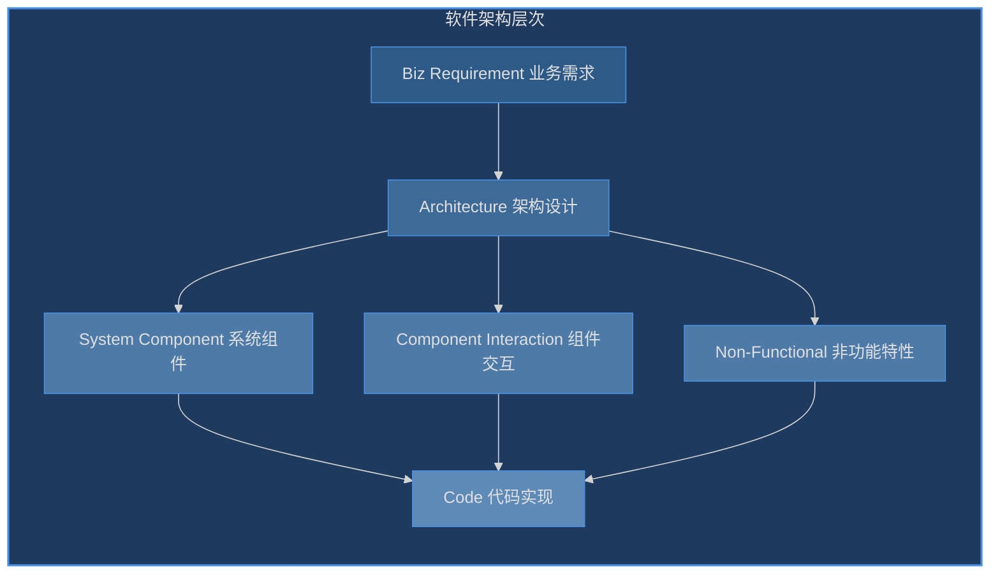

**架构与设计的区别**：

| 维度 | 架构 (Architecture) | 设计 (Design) |
|------|---------------------|---------------|
| 层次 | 高层抽象 | 低层实现 |
| 时机 | 早期决策 | 持续进行 |
| 关注点 | 组件、交互、约束 | 类、函数、算法 |
| 变更成本 | 高 | 低 |
| 决策者 | 架构师 | 开发工程师 |

## 1.2 架构设计的意义

### 1.2.1 为什么需要架构设计

没有架构设计的软件项目如同没有蓝图的建筑施工，看似快速起步，实则后患无穷。

**没有架构设计的问题**：


**架构设计的价值**：

1. **降低复杂度**：将复杂系统分解为可管理的模块
2. **促进团队协作**：清晰的接口定义使多人并行开发成为可能
3. **支撑业务演进**：良好的架构使系统适应业务变化
4. **控制质量**：架构约束和模式确保系统质量
5. **知识传递**：架构文档是新成员的了解系统的起点

### 1.2.2 架构决策的成本

架构决策是软件项目中最昂贵的决策类型，因为它们：

- 难以在后期改变
- 影响多个团队和系统
- 决定了技术选型的上限

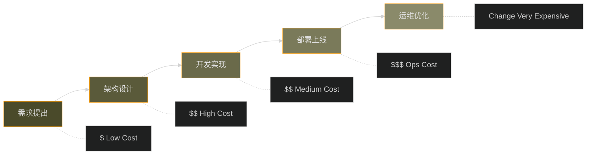

## 1.3 架构设计的核心目标

架构设计的核心目标是确保系统满足利益相关者的需求，通常涵盖五大非功能性需求：

### 1.3.1 可维护性 (Maintainability)

可维护性指系统被修改以纠正缺陷、提升性能或其他属性、适应新环境的难易程度。

**关键度量**：
- 平均修复时间 (MTTR)
- 代码复杂度
- 模块内聚度
- 耦合度

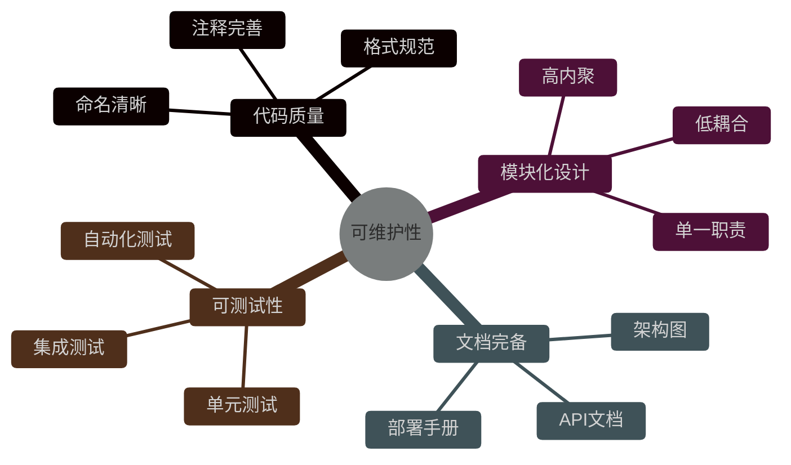

### 1.3.2 可扩展性 (Scalability)

可扩展性指系统处理负载增长的能力，包括垂直扩展（增加单机资源）和水平扩展（增加机器数量）。

**架构模式示例** (Java):

```java
// 垂直扩展受限的单一数据库架构
public class MonolithicOrderService {
    private final Database database; // 单点瓶颈

    public Order createOrder(OrderRequest request) {
        // 所有订单处理都在单一数据库实例
        return database.insert(request);
    }
}

// 可水平扩展的分布式架构
public class DistributedOrderService {
    private final List<OrderService> replicas; // 多个副本
    private final LoadBalancer loadBalancer;

    public Order createOrder(OrderRequest request) {
        // 请求分发到不同副本
        OrderService replica = loadBalancer.select();
        return replica.process(request);
    }
}
```

**Go 语言示例 - 水平扩展服务**:

```go
package main

import (
    "fmt"
    "sync"
    "net/http"
)

// 可复制的服务单元
type OrderHandler struct {
    id int
}

func (h *OrderHandler) ServeHTTP(w http.ResponseWriter, r *http.Request) {
    fmt.Fprintf(w, "Order handled by replica %d", h.id)
}

// 负载均衡器选择副本
type LoadBalancer struct {
    replicas []*OrderHandler
    current  int
    mu       sync.Mutex
}

func (lb *LoadBalancer) Select() *OrderHandler {
    lb.mu.Lock()
    defer lb.mu.Unlock()
    replica := lb.replicas[lb.current]
    lb.current = (lb.current + 1) % len(lb.replicas)
    return replica
}
```

### 1.3.3 性能 (Performance)

性能指系统响应速度和吞吐量。优化性能需要综合考虑算法复杂度、数据库设计、缓存策略、网络延迟等因素。

**Python 缓存策略示例**:

```python
from functools import lru_cache
from typing import Dict
import time

# 使用 LRU 缓存优化重复计算
class ProductService:
    def __init__(self):
        self._cache: Dict[int, Product] = {}

    @lru_cache(maxsize=1000)
    def get_product(self, product_id: int) -> Product:
        """带缓存的产品查询"""
        # 模拟数据库查询延迟
        time.sleep(0.1)  # 100ms
        return self._fetch_from_db(product_id)

    def _fetch_from_db(self, product_id: int) -> Product:
        # 实际数据库查询逻辑
        return Product(id=product_id, name="Sample Product")
```

**性能优化层次**:

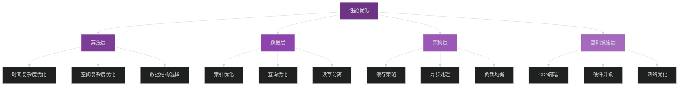

### 1.3.4 安全性 (Security)

安全性指系统保护数据免受未授权访问和攻击的能力。安全架构需要多层防御 (Defense in Depth)。

**Java 安全架构示例**:

```java
public class SecureOrderService {

    // 第一层：认证
    public AuthResult authenticate(String token) {
        if (!jwtValidator.isValid(token)) {
            throw new AuthenticationException("Invalid token");
        }
        return jwtValidator.parse(token);
    }

    // 第二层：授权
    public void authorize(AuthResult auth, String resource) {
        if (!permissionService.hasPermission(auth.getUserId(), resource)) {
            throw new AuthorizationException("Access denied");
        }
    }

    // 第三层：输入验证
    public void validateInput(OrderRequest request) {
        if (request.getAmount() <= 0) {
            throw new ValidationException("Invalid amount");
        }
        // SQL注入防护
        String sanitized = sanitizer.escape(request.getProductName());
        request.setProductName(sanitized);
    }

    // 第四层：审计日志
    public Order createOrder(OrderRequest request, AuthResult auth) {
        authorize(auth, "order:create");
        validateInput(request);

        Order order = orderRepository.save(request);

        // 记录审计日志
        auditLogger.log("ORDER_CREATED",
            Map.of("userId", auth.getUserId(),
                   "orderId", order.getId()));

        return order;
    }
}
```

**安全架构层次**:

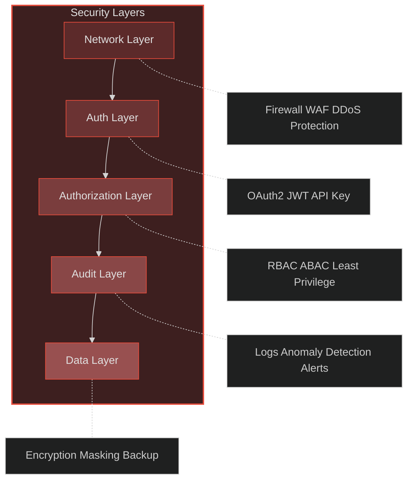

### 1.3.5 高可用性 (High Availability)

高可用性指系统在给定时间内持续运行的能力，通常用 SLA (Service Level Agreement) 来衡量。

**Go 高可用架构示例**:

```go
package main

import (
    "context"
    "fmt"
    "log"
    "net/http"
    "time"
)

// 健康检查接口
type HealthChecker struct {
    dependencies []Dependency
}

type Dependency struct {
    Name string
    Check func() error
}

func (h *HealthChecker) Check(ctx context.Context) error {
    for _, dep := range h.dependencies {
        if err := dep.Check(); err != nil {
            return fmt.Errorf("%s unhealthy: %w", dep.Name, err)
        }
    }
    return nil
}

// 优雅关闭
type Server struct {
    httpServer *http.Server
    done       chan struct{}
}

func (s *Server) Start() error {
    s.done = make(chan struct{})

    go func() {
        if err := s.httpServer.ListenAndServe(); err != http.ErrServerClosed {
            log.Fatalf("Server error: %v", err)
        }
        close(s.done)
    }()

    log.Println("Server started")
    return nil
}

func (s *Server) Shutdown(ctx context.Context) error {
    log.Println("Shutting down gracefully...")

    if err := s.httpServer.Shutdown(ctx); err != nil {
        return fmt.Errorf("shutdown error: %w", err)
    }

    <-s.done
    log.Println("Server stopped")
    return nil
}
```

**高可用架构模式**:

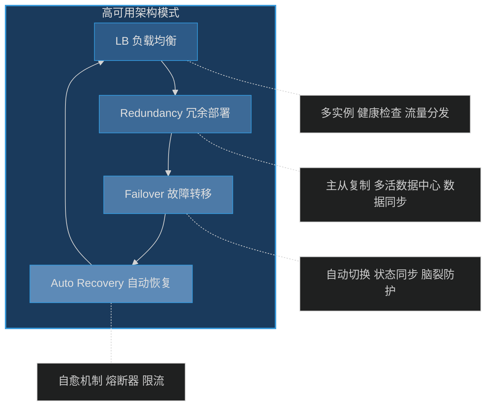

## 1.4 软件架构的发展历史

软件架构经历了多次重大演进，每个阶段都是为了解决前一个阶段面临的挑战。

### 1.4.1 演进历程总览

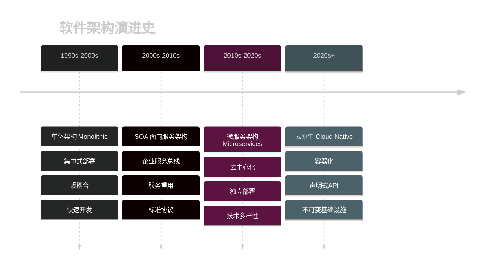

### 1.4.2 单体架构 (Monolithic Architecture)

**特点**：
- 整个应用作为单一部署单元
- 所有模块运行在同一进程
- 共享数据库

**优点**：
- 开发简单（初期）
- 部署简单（单一 artifact）
- 测试容易（无网络调用）
- 调试方便

**缺点**：
- 难以扩展（只能整体扩展）
- 技术栈锁定
- 部署风险高（任何改动都需要全量部署）
- 团队协作受限

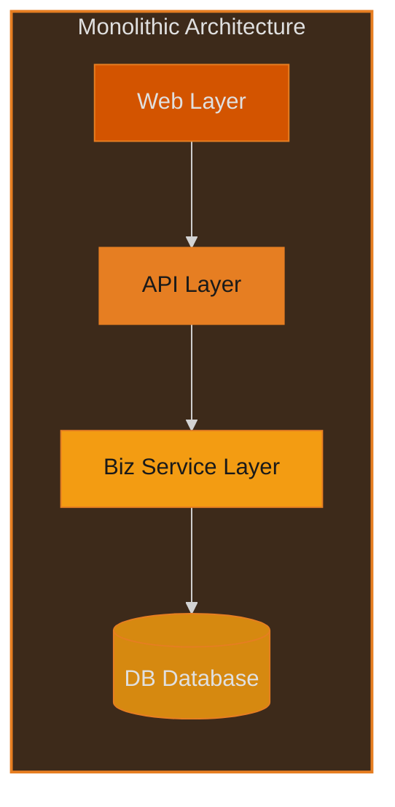

**Java 单体架构示例**:

```java
// 典型的单体应用结构
public class OrderManagementApplication {

    public static void main(String[] args) {
        SpringApplication.run(OrderManagementApplication.class, args);
    }
}

// 所有代码打包在一个 WAR/JAR 中
// OrderService.java - 订单服务
// UserService.java - 用户服务
// ProductService.java - 产品服务
// 所有服务共享同一个数据库连接

@Service
@Transactional
public class OrderService {
    @Autowired
    private UserService userService;

    @Autowired
    private ProductService productService;

    @Autowired
    private OrderRepository orderRepository;

    public Order createOrder(Long userId, List<Long> productIds) {
        User user = userService.getUser(userId);
        List<Product> products = productService.getProducts(productIds);

        Order order = new Order(user, products);
        return orderRepository.save(order);
    }
}
```

### 1.4.3 SOA 面向服务架构 (Service-Oriented Architecture)

**核心概念**：

- **服务**：可复用的业务功能
- **企业服务总线 (ESB)**：服务通信的中枢
- **服务注册与发现**：动态定位服务

**特点**：
- 基于标准协议 (SOAP, WS-*)
- 中央式架构
- 强调服务复用

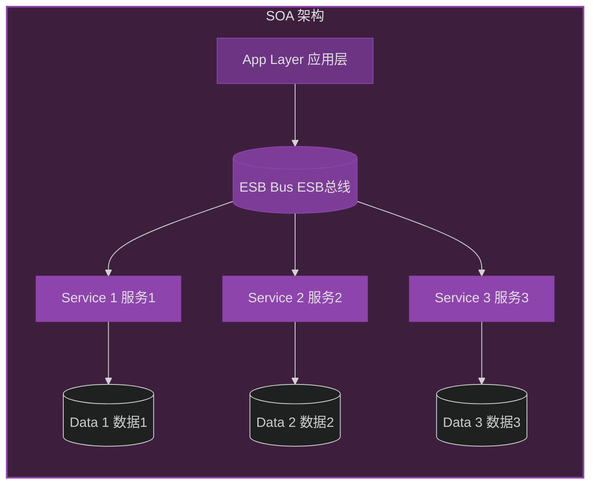

### 1.4.4 微服务架构 (Microservices Architecture)

**核心原则**：
- 每个服务独立部署
- 服务按业务边界划分
- 去中心化管理
- 基础设施自动化

**优点**：
- 独立部署与扩展
- 技术多样性
- 团队自治
- 故障隔离

**挑战**：
- 分布式系统复杂性
- 服务间通信
- 数据一致性
- 运维复杂度

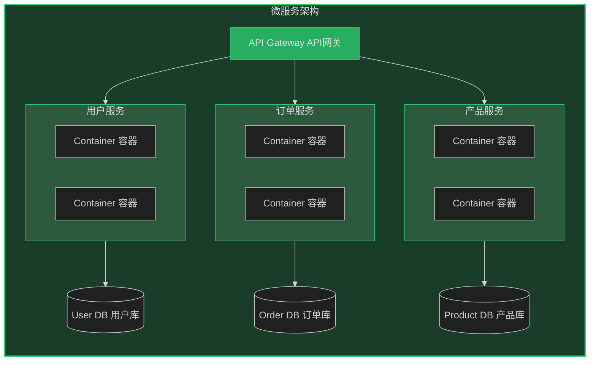

**Go 微服务架构示例**:

```go
package main

import (
    "context"
    "encoding/json"
    "net/http"
)

// 微服务：用户服务
type UserService struct {
    port int
}

func (s *UserService) GetUser(ctx context.Context, id string) (*User, error) {
    // 服务内部逻辑
    return &User{ID: id, Name: "User"}, nil
}

func (s *UserService) Handler() http.Handler {
    mux := http.NewServeMux()
    mux.HandleFunc("/users/", func(w http.ResponseWriter, r *http.Request) {
        id := r.URL.Path[len("/users/"):]
        user, err := s.GetUser(r.Context(), id)
        if err != nil {
            http.Error(w, err.Error(), 500)
            return
        }
        json.NewEncoder(w).Encode(user)
    })
    return mux
}

// 服务注册到注册中心
func (s *UserService) Register(registry Registry) error {
    return registry.Register("user-service", "localhost:8080")
}
```

**Python 微服务 - 订单服务**:

```python
from fastapi import FastAPI, HTTPException
from pydantic import BaseModel
from typing import List
import httpx

app = FastAPI()

class OrderItem(BaseModel):
    product_id: int
    quantity: int

class Order(BaseModel):
    user_id: int
    items: List[OrderItem]

# 服务发现客户端
class ServiceDiscovery:
    def __init__(self, registry_url: str):
        self.registry_url = registry_url

    async def resolve(self, service_name: str) -> str:
        async with httpx.AsyncClient() as client:
            resp = await client.get(f"{self.registry_url}/resolve/{service_name}")
            return resp.json()["address"]

# 调用其他微服务
@app.post("/orders")
async def create_order(order: Order):
    # 获取用户信息服务
    discovery = ServiceDiscovery("http://localhost:8500")
    user_service_addr = await discovery.resolve("user-service")

    async with httpx.AsyncClient() as client:
        # 调用用户服务验证用户
        user_resp = await client.get(f"{user_service_addr}/users/{order.user_id}")
        if user_resp.status_code == 404:
            raise HTTPException(status_code=400, detail="User not found")

    # 创建订单
    return {"order_id": "generated_id", "status": "created"}
```

### 1.4.5 云原生架构 (Cloud Native Architecture)

**云原生核心概念**：

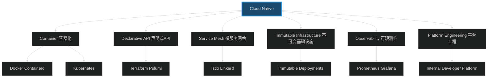

**云原生技术栈对比**:

| 层级 | 传统方式 | 云原生方式 |
|------|----------|------------|
| 部署 | 虚拟机 | 容器 |
| 编排 | 手动 | Kubernetes |
| 配置 | 脚本 | 声明式 |
| 网络 | 固定IP | 服务网格 |
| 存储 | 本地磁盘 | 持久卷声明 |
| 观测 | 日志文件 | 结构化日志+指标+追踪 |

**Java Spring Cloud 云原生示例**:

```java
// 云原生 Spring Boot 应用
@SpringBootApplication
@EnableDiscoveryClient  // 服务注册与发现
@EnableCircuitBreaker   // 熔断器
public class ProductServiceApplication {

    public static void main(String[] args) {
        SpringApplication.run(ProductServiceApplication.class, args);
    }
}

@RestController
@RequestMapping("/products")
public class ProductController {

    @Autowired
    private ProductService productService;

    @GetMapping("/{id}")
    @HystrixCommand(fallbackMethod = "getProductFallback")
    public Product getProduct(@PathVariable Long id) {
        return productService.getProduct(id);
    }

    // 降级方法
    public Product getProductFallback(Long id) {
        return Product.builder()
            .id(id)
            .name("Default Product")
            .description("Service temporarily unavailable")
            .build();
    }
}

// Kubernetes 健康检查
@Component
public class KubernetesHealthIndicator implements HealthIndicator {

    @Override
    public Health health() {
        // 自定义健康检查逻辑
        if (isHealthy()) {
            return Health.up().build();
        }
        return Health.down().withDetail("error", "Service degraded").build();
    }
}
```

### 1.4.6 架构演进对比

| 特征 | 单体架构 | SOA架构 | 微服务架构 | 云原生架构 |
|------|----------|---------|------------|------------|
| 部署方式 | 单一部署单元 | 少数大型服务 | 多个小型服务 | 容器+声明式 |
| 扩展方式 | 整体扩展 | 服务级别扩展 | 按需扩展 | 自动弹性伸缩 |
| 部署频率 | 低 | 中等 | 高 | 持续部署 |
| 团队要求 | 小团队 | 中型团队 | DevOps团队 | 平台工程团队 |
| 技术栈 | 单一技术 | 多技术混合 | 多语言微服务 | 容器+K8s+服务网格 |

## 1.5 架构师的核心职责

### 1.5.1 架构师的角色定位

架构师是技术与业务的桥梁，负责将业务需求转化为技术决策。

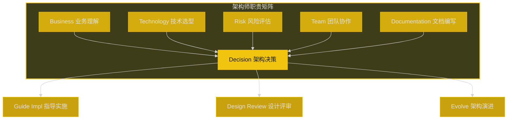

### 1.5.2 核心能力模型

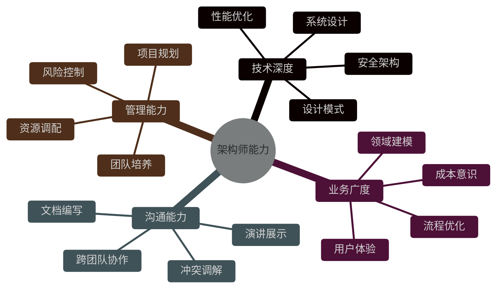

### 1.5.3 架构设计流程

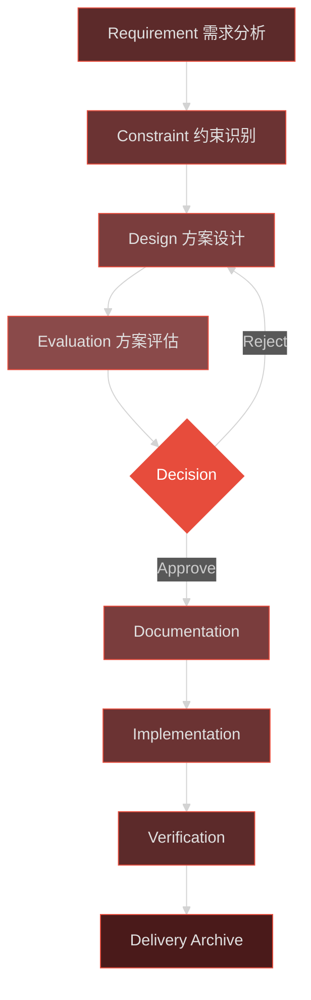

### 1.5.4 工程实践案例：电商系统架构演进

**案例背景**：
某中型电商平台从单体架构逐步演进到微服务架构的过程。

**第一阶段：单体架构**

```
┌─────────────────────────────────────────┐
│           单体电商应用                    │
├─────────────────────────────────────────┤
│  Web层 │  业务层  │   数据访问层  │ DB  │
│  JSP   │  Java    │   MyBatis    │     │
│  ─────   ───────   ──────────   ────  │
│  所有功能运行在单一 JVM 进程              │
└─────────────────────────────────────────┘
```

**第二阶段：垂直拆分**

```
┌──────────────┐  ┌──────────────┐  ┌──────────────┐
│   用户服务    │  │   商品服务    │  │   订单服务    │
│  (独立部署)   │  │  (独立部署)   │  │  (独立部署)   │
└──────────────┘  └──────────────┘  └──────────────┘
        │                │                 │
        └────────────────┴─────────────────┘
                        │
                  ┌──────────┐
                  │   数据库  │
                  └──────────┘
```

**第三阶段：微服务架构**

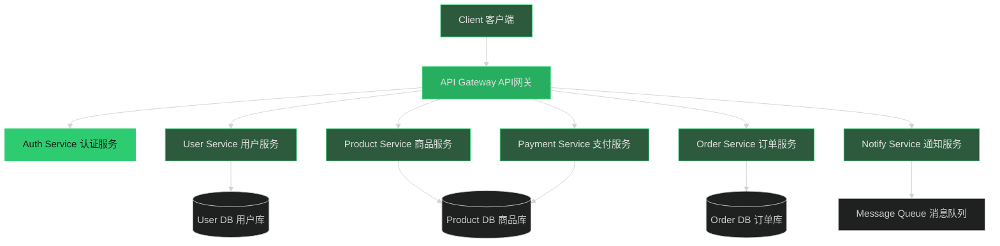

**架构决策记录 (ADR)**:

```
# ADR-001: 从单体迁移到微服务

## 状态
已通过

## 背景
- 单体应用代码量超过50万行
- 部署频率受限于整体回归测试
- 多个团队在同一代码库上开发冲突频繁

## 决策
采用微服务架构，按业务领域拆分服务

## 后果
- 正面：独立部署、团队自治、技术多样性
- 负面：分布式复杂性、运维成本、数据一致性挑战
```

## 1.6 本章小结

本章介绍了软件架构的核心概念：

1. **软件架构定义**：系统的高层结构和决策集合
2. **架构设计意义**：降低复杂度、促进协作、支撑演进、控制质量
3. **核心目标**：可维护性、可扩展性、性能、安全性、高可用性
4. **演进历史**：单体 → SOA → 微服务 → 云原生
5. **架构师职责**：技术决策、团队协作、架构演进

理解这些基础概念为后续深入学习架构模式、设计原则和工程实践奠定了基础。

---

*下一章将深入探讨常见的架构模式和设计原则*
