# 第2章：架构设计核心原则

> 本章难度：★★★☆☆
> 预计阅读时间：45分钟

## 2.1 概述

架构设计原则是经过无数工程实践验证的设计准则，它们帮助我们在面对复杂系统时做出正确的决策。本章将详细介绍软件开发中最重要的设计原则，包括 SOLID、KISS、DRY 和 YAGNI 四大原则体系。

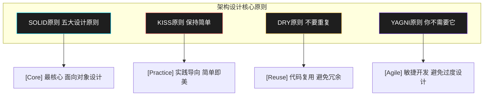

### 原则学习路线图


---

## 2.2 SOLID 原则详解

SOLID 是面向对象设计和编程的五个基本原则，由 Robert C. Martin（又称「Bob大叔」）提出。这五个原则可以让代码更易维护、更易扩展、更易理解。

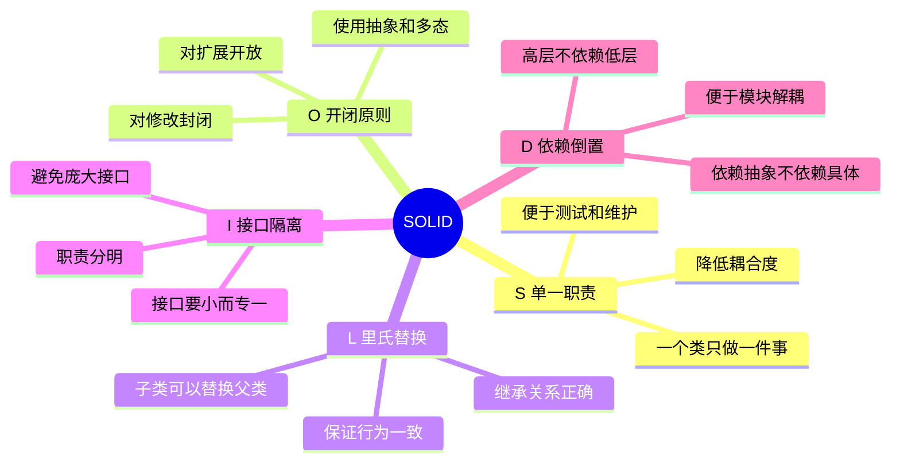

### 2.2.1 单一职责原则（SRP）

**定义**：一个类应该只有一个引起它变化的原因。也就是说，每个类只应该负责一项职责。

**为什么重要**：
- 提高代码的可维护性
- 降低类的复杂度
- 便于测试
- 减少变更带来的风险

#### 违反 SRP 的反模式

```java
// ❌ 违反SRP：类承担了多个职责
public class User {
    private String name;
    private String email;

    // 职责1：用户数据管理
    public void saveUser() {
        // 保存用户到数据库
    }

    // 职责2：用户认证
    public boolean authenticate(String password) {
        // 验证密码
        return true;
    }

    // 职责3：发送邮件
    public void sendEmail(String subject, String content) {
        // 发送邮件逻辑
    }

    // 职责4：生成报告
    public String generateUserReport() {
        // 生成用户报告
        return "report";
    }
}
```

#### 符合 SRP 的设计

```java
// ✅ 符合SRP：每个类只负责一项职责

// 用户实体类 - 只负责数据存储
public class User {
    private String name;
    private String email;

    public User(String name, String email) {
        this.name = name;
        this.email = email;
    }

    // getters and setters
    public String getName() { return name; }
    public String getEmail() { return email; }
}

// 用户仓储 - 只负责数据持久化
public class UserRepository {
    public void save(User user) {
        // 保存用户到数据库
    }

    public User findById(Long id) {
        // 从数据库查询
        return null;
    }
}

// 认证服务 - 只负责认证逻辑
public class AuthenticationService {
    public boolean authenticate(User user, String password) {
        // 验证密码
        return true;
    }
}

// 邮件服务 - 只负责发送邮件
public class EmailService {
    public void sendEmail(String to, String subject, String content) {
        // 发送邮件逻辑
    }
}

// 报表服务 - 只负责生成报表
public class ReportService {
    public String generateUserReport(User user) {
        // 生成报表
        return "report";
    }
}
```

#### 工程实践案例：订单处理系统

```java
// ❌ 早期版本：订单服务承担所有职责
public class OrderService {
    public void createOrder(Order order) { /* 创建订单 */ }
    public void calculatePrice(Order order) { /* 计算价格 */ }
    public void sendOrderConfirmationEmail(Order order) { /* 发邮件 */ }
    public void writeToDatabase(Order order) { /* 写数据库 */ }
    public void generateInvoice(Order order) { /* 生成发票 */ }
    public void sendToWarehouse(Order order) { /* 发送到仓库 */ }
}

// ✅ 重构后：按职责拆分
public class OrderService {
    private final OrderValidator validator;
    private final PricingService pricingService;
    private final OrderRepository repository;
    private final NotificationService notificationService;
    private final WarehouseService warehouseService;

    public void createOrder(Order order) {
        validator.validate(order);
        pricingService.calculatePrice(order);
        repository.save(order);
        notificationService.sendConfirmation(order);
        warehouseService.notifyNewOrder(order);
    }
}

// 各服务职责分明
public class OrderValidator { /* 只负责验证 */ }
public class PricingService { /* 只负责定价 */ }
public class OrderRepository { /* 只负责持久化 */ }
public class NotificationService { /* 只负责通知 */ }
public class WarehouseService { /* 只负责仓库对接 */ }
```

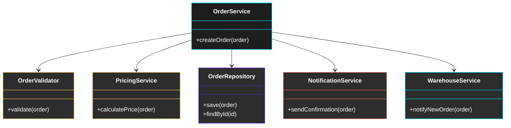

---

### 2.2.2 开闭原则（OCP）

**定义**：软件实体（类、模块、函数等）应该对扩展开放，对修改关闭。

**为什么重要**：
- 提高代码的复用性
- 降低修改代码带来的风险
- 更容易实现功能扩展

#### 违反 OCP 的反模式

```java
// ❌ 违反OCP：每次新增支付方式都要修改这个类
public class OrderService {
    public void processPayment(Order order, String paymentType) {
        if ("Alipay".equals(paymentType)) {
            // 支付宝支付逻辑
        } else if ("WeChatPay".equals(paymentType)) {
            // 微信支付逻辑
        } else if ("CreditCard".equals(paymentType)) {
            // 信用卡支付逻辑
        }
        // 如果要新增支付方式，必须修改这个方法！
    }
}
```

#### 符合 OCP 的设计

```java
// ✅ 符合OCP：使用策略模式和依赖注入

// 支付策略接口
public interface PaymentStrategy {
    void pay(Order order);
}

// 各种支付方式实现
public class AlipayStrategy implements PaymentStrategy {
    @Override
    public void pay(Order order) {
        // 支付宝支付逻辑
        System.out.println("使用支付宝支付：" + order.getAmount());
    }
}

public class WeChatPayStrategy implements PaymentStrategy {
    @Override
    public void pay(Order order) {
        // 微信支付逻辑
        System.out.println("使用微信支付：" + order.getAmount());
    }
}

public class CreditCardStrategy implements PaymentStrategy {
    @Override
    public void pay(Order order) {
        // 信用卡支付逻辑
        System.out.println("使用信用卡支付：" + order.getAmount());
    }
}

// 订单服务依赖于抽象接口，不依赖具体实现
public class OrderService {
    private final PaymentStrategy paymentStrategy;

    // 通过构造函数注入支付策略
    public OrderService(PaymentStrategy paymentStrategy) {
        this.paymentStrategy = paymentStrategy;
    }

    public void processPayment(Order order) {
        // 对扩展开放：新增支付方式只需要创建新的策略类
        // 对修改关闭：不需要修改这个类的代码
        paymentStrategy.pay(order);
    }
}
```

#### 工程实践案例：日志系统

```java
// ❌ 早期版本：硬编码日志输出方式
public class Logger {
    public void log(String message) {
        System.out.println("[INFO] " + message);
    }

    public void error(String message) {
        System.err.println("[ERROR] " + message);
    }

    // 新需求：输出到文件？修改！新增需求：发送到远程服务器？修改！
}

// ✅ 重构后：符合OCP的日志系统
public interface Logger {
    void log(LogLevel level, String message);
}

public class ConsoleLogger implements Logger {
    @Override
    public void log(LogLevel level, String message) {
        System.out.println("[" + level + "] " + message);
    }
}

public class FileLogger implements Logger {
    private final String filePath;

    public FileLogger(String filePath) {
        this.filePath = filePath;
    }

    @Override
    public void log(LogLevel level, String message) {
        // 写入文件逻辑
    }
}

public class RemoteLogger implements Logger {
    private final String endpoint;

    public RemoteLogger(String endpoint) {
        this.endpoint = endpoint;
    }

    @Override
    public void log(LogLevel level, String message) {
        // 发送到远程服务器
    }
}

// 日志管理器
public class LogManager {
    private final List<Logger> loggers = new ArrayList<>();

    public void addLogger(Logger logger) {
        loggers.add(logger);
    }

    public void log(LogLevel level, String message) {
        for (Logger logger : loggers) {
            logger.log(level, message);
        }
    }
}
```

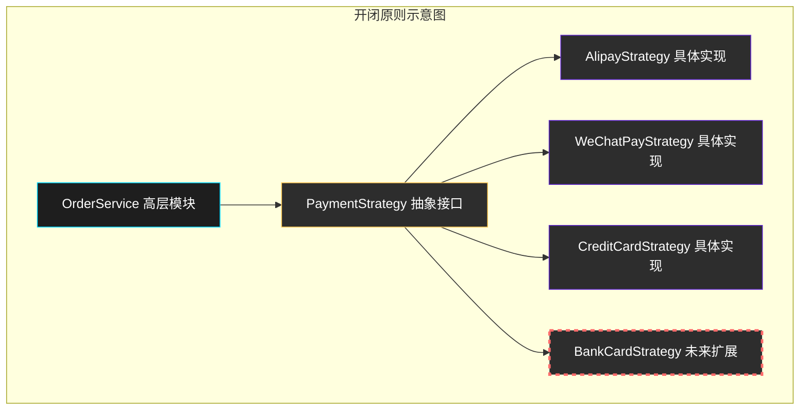

---

### 2.2.3 里氏替换原则（LSP）

**定义**：子类型必须能够替换其基类型。也就是说，任何基类出现的地方，子类都可以替换它。

**为什么重要**：
- 保证继承关系的正确性
- 提高代码的可复用性
- 避免运行时错误

#### 违反 LSP 的反模式

```java
// ❌ 违反LSP：子类改变了父类的行为

// 矩形类
public class Rectangle {
    protected int width;
    protected int height;

    public void setWidth(int width) {
        this.width = width;
    }

    public void setHeight(int height) {
        this.height = height;
    }

    public int getArea() {
        return width * height;
    }
}

// 正方形类 - 试图继承矩形
// 但正方形的长和宽必须相等，这违反了LSP
public class Square extends Rectangle {
    @Override
    public void setWidth(int width) {
        this.width = width;
        this.height = width;  // 破坏了父类的行为
    }

    @Override
    public void setHeight(int height) {
        this.width = height;  // 破坏了父类的行为
        this.height = height;
    }
}

// 使用时出现问题
public class AreaCalculator {
    public int calculateArea(Rectangle rectangle) {
        rectangle.setWidth(5);
        rectangle.setHeight(4);
        // 期望面积: 5 * 4 = 20
        // 实际正方形面积: 4 * 4 = 16
        return rectangle.getArea(); // 返回16，不是20！
    }
}
```

#### 符合 LSP 的设计

```java
// ✅ 符合LSP：使用抽象来正确建模

// 抽象形状接口
public interface Shape {
    int getArea();
}

// 矩形实现
public class Rectangle implements Shape {
    private int width;
    private int height;

    public Rectangle(int width, int height) {
        this.width = width;
        this.height = height;
    }

    public void setWidth(int width) { this.width = width; }
    public void setHeight(int height) { this.height = height; }

    @Override
    public int getArea() {
        return width * height;
    }
}

// 正方形实现
public class Square implements Shape {
    private int side;

    public Square(int side) {
        this.side = side;
    }

    public void setSide(int side) { this.side = side; }

    @Override
    public int getArea() {
        return side * side;
    }
}

// 正确使用多态
public class AreaCalculator {
    public int calculateArea(Shape shape) {
        // 任何Shape的实现类都可以安全替换
        return shape.getArea();
    }
}
```

#### 工程实践案例：订单校验系统

```java
// ❌ 违反LSP：特殊订单子类改变了行为约束
public class Order {
    protected BigDecimal amount;

    public BigDecimal getAmount() { return amount; }

    public boolean isValid() {
        return amount != null && amount.compareTo(BigDecimal.ZERO) > 0;
    }
}

public class FreeOrder extends Order {
    @Override
    public boolean isValid() {
        // 免费订单金额为0也合法，但父类要求amount > 0
        // 这里改变了父类的行为约束！
        return amount != null;
    }
}

// ✅ 符合LSP的设计
public interface Order {
    boolean isValid();
    BigDecimal getAmount();
}

public class NormalOrder implements Order {
    private BigDecimal amount;

    @Override
    public boolean isValid() {
        return amount != null && amount.compareTo(BigDecimal.ZERO) > 0;
    }

    @Override
    public BigDecimal getAmount() { return amount; }
}

public class FreeOrder implements Order {
    private BigDecimal amount;

    @Override
    public boolean isValid() {
        return true; // 免费订单总是有效的
    }

    @Override
    public BigDecimal getAmount() { return BigDecimal.ZERO; }
}
```

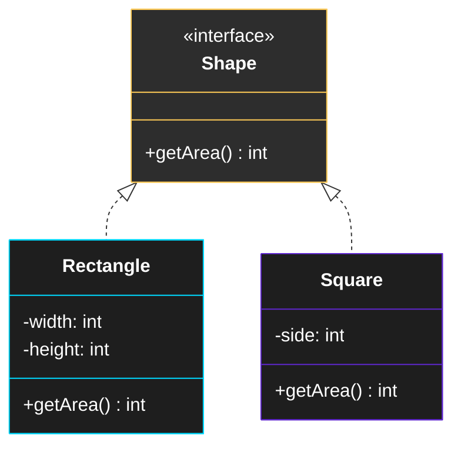

---

### 2.2.4 接口隔离原则（ISP）

**定义**：客户端不应该被迫依赖它不使用的接口。应该将大接口拆分成更小、更具体的接口。

**为什么重要**：
- 减少不必要的依赖
- 提高代码的灵活性
- 便于单元测试

#### 违反 ISP 的反模式

```java
// ❌ 违反ISP：庞大臃肿的接口
public interface Worker {
    void work();
    void eat();
    void sleep();
    void drive();
    void code();
    void attendMeeting();
}

// 人类工作者
public class HumanWorker implements Worker {
    @Override
    public void work() { /* 工作 */ }
    @Override
    public void eat() { /* 吃饭 */ }
    @Override
    public void sleep() { /* 睡觉 */ }
    @Override
    public void drive() { /* 开车 */ }
    @Override
    public void code() { /* 编码 */ }
    @Override
    public void attendMeeting() { /* 开会 */ }
}

// 机器人 - 不需要吃饭、睡觉、开车
public class RobotWorker implements Worker {
    @Override
    public void work() { /* 工作 */ }

    // 机器人被迫实现这些它不需要的方法！
    @Override
    public void eat() { throw new UnsupportedOperationException(); }
    @Override
    public void sleep() { throw new UnsupportedOperationException(); }
    @Override
    public void drive() { /* 机器人可能需要驾驶 */ }
    @Override
    public void code() { /* 编码 */ }
    @Override
    public void attendMeeting() { /* 开会 */ }
}
```

#### 符合 ISP 的设计

```java
// ✅ 符合ISP：拆分成小而专一的接口

// 可工作接口
public interface Workable {
    void work();
}

// 可进食接口
public interface Eatable {
    void eat();
}

// 可睡眠接口
public interface Sleepable {
    void sleep();
}

// 可驾驶接口
public interface Drivable {
    void drive();
}

// 可编码接口
public interface Coder {
    void code();
}

// 可开会接口
public interface MeetingAttendable {
    void attendMeeting();
}

// 人类工作者 - 组合多个小接口
public class HumanWorker implements Workable, Eatable, Sleepable, Drivable, Coder, MeetingAttendable {
    @Override
    public void work() { /* 工作 */ }
    @Override
    public void eat() { /* 吃饭 */ }
    @Override
    public void sleep() { /* 睡觉 */ }
    @Override
    public void drive() { /* 开车 */ }
    @Override
    public void code() { /* 编码 */ }
    @Override
    public void attendMeeting() { /* 开会 */ }
}

// 机器人工作者 - 只组合需要的接口
public class RobotWorker implements Workable, Drivable, Coder, MeetingAttendable {
    @Override
    public void work() { /* 工作 */ }
    // 不需要实现 eat() 和 sleep()
    @Override
    public void drive() { /* 驾驶 */ }
    @Override
    public void code() { /* 编码 */ }
    @Override
    public void attendMeeting() { /* 开会 */ }
}
```

#### 工程实践案例：电商系统商品服务

```java
// ❌ 早期设计：巨大接口
public interface ProductService {
    Product getProduct(Long id);
    List<Product> searchProducts(String keyword);
    void createProduct(Product product);
    void updateProduct(Product product);
    void deleteProduct(Long id);
    void updatePrice(Long id, BigDecimal price);
    void updateStock(Long id, Integer stock);
    BigDecimal calculateDiscount(Product product, BigDecimal discountRate);
    List<Product> getProductsByCategory(Long categoryId);
    List<Product> getRecommendProducts(Long userId);
}

// ✅ ISP设计：按职责拆分
public interface ProductQueryService {
    Product getProduct(Long id);
    List<Product> searchProducts(String keyword);
    List<Product> getProductsByCategory(Long categoryId);
    List<Product> getRecommendProducts(Long userId);
}

public interface ProductManagementService {
    void createProduct(Product product);
    void updateProduct(Product product);
    void deleteProduct(Long id);
}

public interface ProductPriceService {
    void updatePrice(Long id, BigDecimal price);
    BigDecimal calculateDiscount(Product product, BigDecimal discountRate);
}

public interface ProductStockService {
    void updateStock(Long id, Integer stock);
}
```

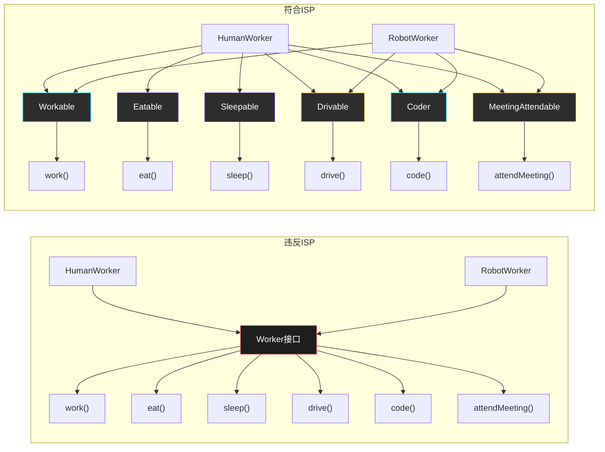

---

### 2.2.5 依赖倒置原则（DIP）

**定义**：
1. 高层模块不应该依赖低层模块，两者都应该依赖抽象
2. 抽象不应该依赖细节，细节应该依赖抽象

**为什么重要**：
- 降低类之间的耦合度
- 提高代码的可维护性和可扩展性
- 便于单元测试

#### 违反 DIP 的反模式

```java
// ❌ 违反DIP：高层模块依赖低层模块
public class OrderService {
    private MySQLOrderRepository repository = new MySQLOrderRepository(); // 依赖具体实现
    private EmailNotificationService notification = new EmailNotificationService(); // 依赖具体实现

    public void createOrder(Order order) {
        repository.save(order);
        notification.sendOrderConfirmation(order);
    }
}

public class MySQLOrderRepository {
    public void save(Order order) {
        // MySQL具体实现
    }
}

public class EmailNotificationService {
    public void sendOrderConfirmation(Order order) {
        // Email具体实现
    }
}
```

#### 符合 DIP 的设计

```java
// ✅ 符合DIP：依赖抽象接口

// 抽象接口 - 定义契约
public interface OrderRepository {
    void save(Order order);
    Order findById(Long id);
}

public interface NotificationService {
    void sendOrderConfirmation(Order order);
}

// 低层模块实现抽象接口
public class MySQLOrderRepository implements OrderRepository {
    @Override
    public void save(Order order) {
        // MySQL具体实现
    }

    @Override
    public Order findById(Long id) {
        // MySQL查询实现
        return null;
    }
}

public class EmailNotificationService implements NotificationService {
    @Override
    public void sendOrderConfirmation(Order order) {
        // Email发送实现
    }
}

// 高层模块依赖抽象接口
public class OrderService {
    private final OrderRepository repository;         // 依赖抽象
    private final NotificationService notification;    // 依赖抽象

    // 通过构造函数注入依赖
    public OrderService(OrderRepository repository, NotificationService notification) {
        this.repository = repository;
        this.notification = notification;
    }

    public void createOrder(Order order) {
        repository.save(order);
        notification.sendOrderConfirmation(order);
    }
}
```

#### 工程实践案例：用户通知系统

```java
// 通知服务接口 - 抽象层
public interface NotificationSender {
    void send(String to, String message);
}

// 邮件发送实现
public class EmailSender implements NotificationSender {
    @Override
    public void send(String to, String message) {
        System.out.println("发送邮件到 " + to + ": " + message);
    }
}

// 短信发送实现
public class SmsSender implements NotificationSender {
    @Override
    public void send(String to, String message) {
        System.out.println("发送短信到 " + to + ": " + message);
    }
}

// 微信推送实现
public class WeChatSender implements NotificationSender {
    @Override
    public void send(String to, String message) {
        System.out.println("发送微信消息到 " + to + ": " + message);
    }
}

// 用户通知服务 - 高层模块
public class UserNotificationService {
    private final NotificationSender emailSender;
    private final NotificationSender smsSender;
    private final NotificationSender weChatSender;

    public UserNotificationService(
            NotificationSender emailSender,
            NotificationSender smsSender,
            NotificationSender weChatSender) {
        this.emailSender = emailSender;
        this.smsSender = smsSender;
        this.weChatSender = weChatSender;
    }

    public void notifyUser(User user, String message) {
        // 根据用户偏好选择发送方式
        if (user.prefersEmail()) {
            emailSender.send(user.getEmail(), message);
        }
        if (user.prefersSms()) {
            smsSender.send(user.getPhone(), message);
        }
        if (user.prefersWeChat()) {
            weChatSender.send(user.getWeChatId(), message);
        }
    }
}
```

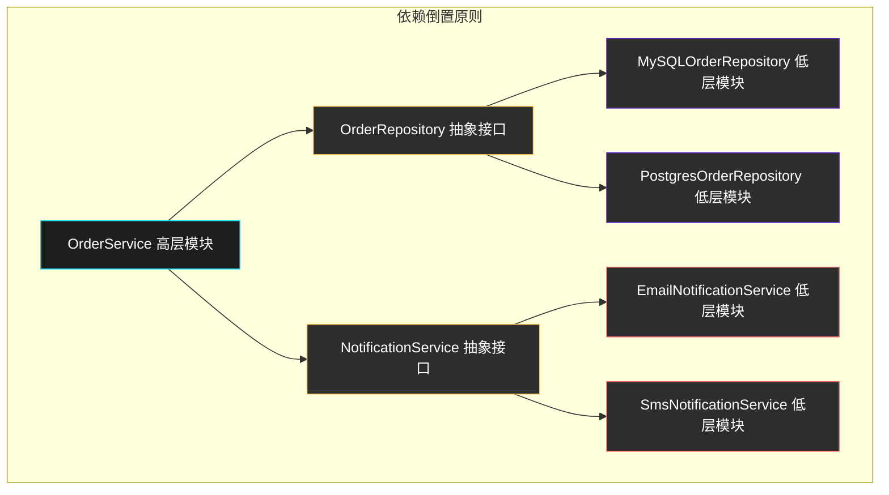

---

## 2.3 KISS 原则

**KISS** = **K**eep **I**t **S**imple, **S**tupid

**定义**：保持简单，让事情尽可能简单直接。

### 核心思想

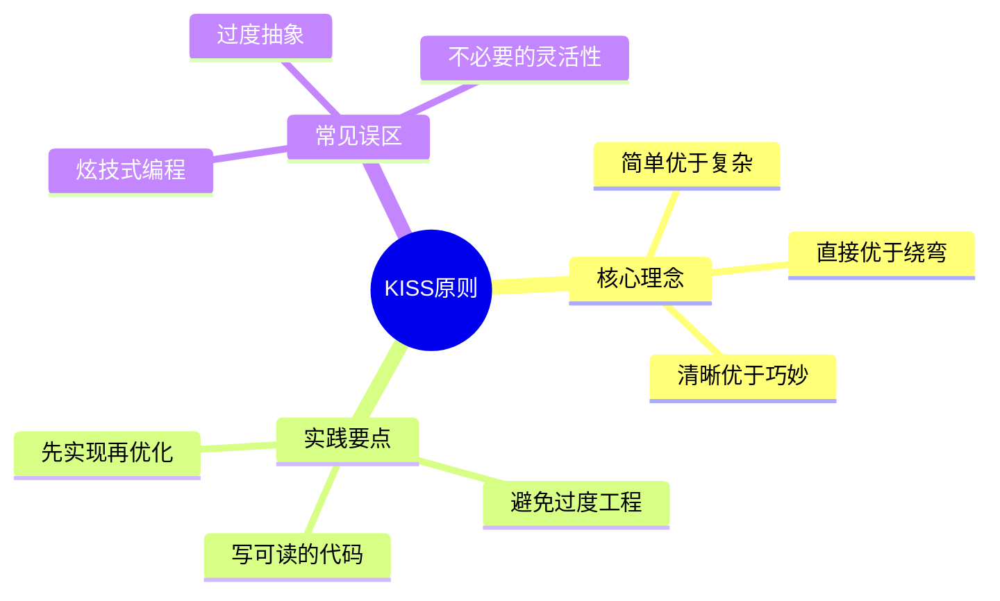

### 代码示例

```java
// ❌ 违反KISS：过度设计的复杂实现
public class StringUtils {
    private static final Map<String, Function<String, String>> transformations = new HashMap<>();

    static {
        transformations.put("uppercase", String::toUpperCase);
        transformations.put("lowercase", String::toLowerCase);
        transformations.put("trim", String::trim);
        transformations.put("reverse", s -> new StringBuilder(s).reverse().toString());
    }

    public static String transform(String input, String transformationType) {
        Function<String, String> transformation = transformations.get(transformationType);
        if (transformation != null) {
            return transformation.apply(input);
        }
        return input;
    }
}

// ✅ 符合KISS：简单直接的实现
public class StringUtils {
    public static String toUpperCase(String input) {
        return input == null ? null : input.toUpperCase();
    }

    public static String toLowerCase(String input) {
        return input == null ? null : input.toLowerCase();
    }

    public static String trim(String input) {
        return input == null ? null : input.trim();
    }

    public static String reverse(String input) {
        if (input == null) return null;
        return new StringBuilder(input).reverse().toString();
    }
}
```

### 工程实践案例：用户验证

```java
// ❌ 过度工程
public class UserValidator {
    private final PasswordEncoder passwordEncoder;
    private final TokenManager tokenManager;
    private final CacheManager cacheManager;
    private final AuditLogger auditLogger;

    public boolean validateCredentials(String username, String password) {
        // 50行复杂验证逻辑
        // 包含缓存、审计、Token等
        return true;
    }
}

// ✅ 简单直接
public class UserValidator {
    public boolean validateCredentials(String username, String password) {
        if (username == null || password == null) {
            return false;
        }
        User user = userRepository.findByUsername(username);
        if (user == null) {
            return false;
        }
        return passwordEncoder.matches(password, user.getPasswordHash());
    }
}
```

---

## 2.4 DRY 原则

**DRY** = **D**on't **R**epeat **Y**ourself

**定义**：不要重复你自己。每个知识或逻辑应该在系统中只有一个唯一的、明确的表示。

### 核心思想

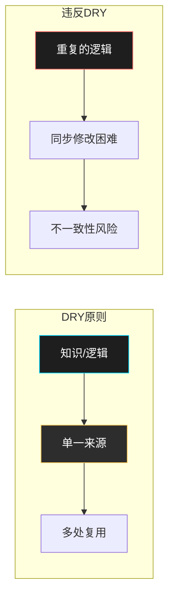

### 代码示例

```java
// ❌ 违反DRY：重复的验证逻辑
public class UserRegistration {
    public void register(String username, String email, String password) {
        // 第一次验证
        if (username == null || username.isEmpty()) {
            throw new IllegalArgumentException("用户名不能为空");
        }
        if (username.length() < 3 || username.length() > 20) {
            throw new IllegalArgumentException("用户名长度必须在3-20之间");
        }
        if (email == null || !email.contains("@")) {
            throw new IllegalArgumentException("邮箱格式不正确");
        }
        if (password == null || password.length() < 6) {
            throw new IllegalArgumentException("密码长度不能少于6位");
        }

        // ... 注册逻辑
    }
}

public class UserProfileUpdate {
    public void update(String username, String email, String password) {
        // 重复的验证逻辑！
        if (username == null || username.isEmpty()) {
            throw new IllegalArgumentException("用户名不能为空");
        }
        if (username.length() < 3 || username.length() > 20) {
            throw new IllegalArgumentException("用户名长度必须在3-20之间");
        }
        if (email == null || !email.contains("@")) {
            throw new IllegalArgumentException("邮箱格式不正确");
        }
        if (password == null || password.length() < 6) {
            throw new IllegalArgumentException("密码长度不能少于6位");
        }

        // ... 更新逻辑
    }
}
```

```java
// ✅ 符合DRY：提取公共验证逻辑
public class UserValidator {
    public void validateUsername(String username) {
        if (username == null || username.isEmpty()) {
            throw new IllegalArgumentException("用户名不能为空");
        }
        if (username.length() < 3 || username.length() > 20) {
            throw new IllegalArgumentException("用户名长度必须在3-20之间");
        }
    }

    public void validateEmail(String email) {
        if (email == null || !email.contains("@")) {
            throw new IllegalArgumentException("邮箱格式不正确");
        }
    }

    public void validatePassword(String password) {
        if (password == null || password.length() < 6) {
            throw new IllegalArgumentException("密码长度不能少于6位");
        }
    }

    public void validateUser(String username, String email, String password) {
        validateUsername(username);
        validateEmail(email);
        validatePassword(password);
    }
}

public class UserRegistration {
    private final UserValidator validator;

    public UserRegistration(UserValidator validator) {
        this.validator = validator;
    }

    public void register(String username, String email, String password) {
        validator.validateUser(username, email, password);
        // ... 注册逻辑
    }
}

public class UserProfileUpdate {
    private final UserValidator validator;

    public UserProfileUpdate(UserValidator validator) {
        this.validator = validator;
    }

    public void update(String username, String email, String password) {
        validator.validateUser(username, email, password);
        // ... 更新逻辑
    }
}
```

### 工程实践案例：电商促销计算

```java
// ❌ 违反DRY：折扣逻辑重复
public class OrderService {
    public BigDecimal calculateOrderDiscount(Order order) {
        // 折扣计算逻辑
        BigDecimal discount = BigDecimal.ZERO;

        // 满100减10
        if (order.getTotal().compareTo(new BigDecimal("100")) >= 0) {
            discount = discount.add(new BigDecimal("10"));
        }

        // 会员95折
        if (order.getCustomer().isVIP()) {
            discount = discount.add(order.getTotal().multiply(new BigDecimal("0.05")));
        }

        // 节假日9折
        if (isHoliday(order.getCreateTime())) {
            discount = discount.add(order.getTotal().multiply(new BigDecimal("0.1")));
        }

        return discount;
    }
}

public class ProductService {
    public BigDecimal calculateProductDiscount(Product product) {
        // 相同的折扣逻辑重复出现！
        BigDecimal discount = BigDecimal.ZERO;

        // 满100减10
        if (product.getPrice().compareTo(new BigDecimal("100")) >= 0) {
            discount = discount.add(new BigDecimal("10"));
        }

        // 会员95折
        if (product.getSeller().isVIP()) {
            discount = discount.add(product.getPrice().multiply(new BigDecimal("0.05")));
        }

        // 节假日9折
        if (isHoliday(product.getCreateTime())) {
            discount = discount.add(product.getPrice().multiply(new BigDecimal("0.1")));
        }

        return discount;
    }
}

// ✅ 符合DRY：统一的折扣策略
public interface DiscountStrategy {
    BigDecimal calculateDiscount(DiscountContext context);
}

public class FullAmountDiscountStrategy implements DiscountStrategy {
    private final BigDecimal threshold = new BigDecimal("100");
    private final BigDecimal discount = new BigDecimal("10");

    @Override
    public BigDecimal calculateDiscount(DiscountContext context) {
        if (context.getAmount().compareTo(threshold) >= 0) {
            return discount;
        }
        return BigDecimal.ZERO;
    }
}

public class VipDiscountStrategy implements DiscountStrategy {
    private final BigDecimal rate = new BigDecimal("0.05");

    @Override
    public BigDecimal calculateDiscount(DiscountContext context) {
        if (context.isVIP()) {
            return context.getAmount().multiply(rate);
        }
        return BigDecimal.ZERO;
    }
}

public class HolidayDiscountStrategy implements DiscountStrategy {
    private final BigDecimal rate = new BigDecimal("0.1");

    @Override
    public BigDecimal calculateDiscount(DiscountContext context) {
        if (isHoliday(context.getTime())) {
            return context.getAmount().multiply(rate);
        }
        return BigDecimal.ZERO;
    }
}

public class DiscountCalculator {
    private final List<DiscountStrategy> strategies;

    public DiscountCalculator(List<DiscountStrategy> strategies) {
        this.strategies = strategies;
    }

    public BigDecimal calculateTotalDiscount(DiscountContext context) {
        return strategies.stream()
            .map(s -> s.calculateDiscount(context))
            .reduce(BigDecimal.ZERO, BigDecimal::add);
    }
}
```

---

## 2.5 YAGNI 原则

**YAGNI** = **Y**ou **A**ren't **G**onna **N**eed **I**t

**定义**：你不需要它。不要为未来可能需要的功能提前实现。

### 核心思想

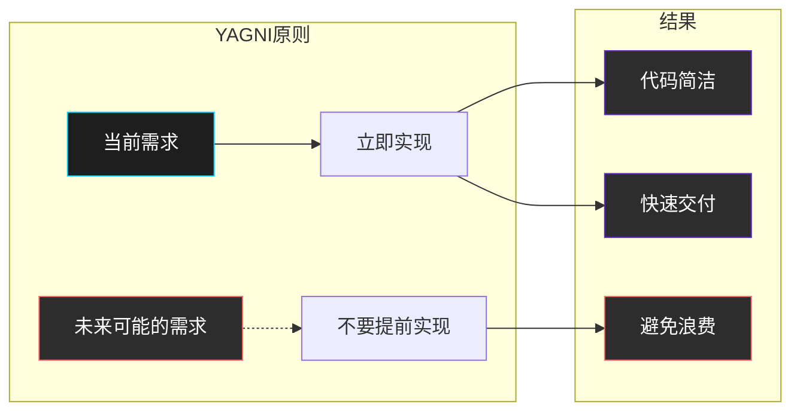

### 代码示例

```java
// ❌ 违反YAGNI：为未来可能的需求过度设计
public class UserService {
    // 当前只需要用户名
    private String username;

    // 但预见到未来可能需要：
    // - 社交媒体账号
    // - 双因素认证
    // - 单点登录
    // - API密钥
    // - 权限管理
    // 所以提前加入了大量暂时无用的代码
    private String socialMediaToken;
    private String twoFactorSecret;
    private String ssoToken;
    private String apiKey;
    private List<Permission> permissions;

    public void setSocialMediaToken(String token) {
        this.socialMediaToken = token;
    }

    public void enableTwoFactorAuth(String secret) {
        this.twoFactorSecret = secret;
    }

    public void setupSSO(String token) {
        this.ssoToken = token;
    }

    public void generateApiKey() {
        this.apiKey = UUID.randomUUID().toString();
    }

    public void addPermission(Permission permission) {
        this.permissions.add(permission);
    }

    // ... 50行未来可能用到的代码
}

// ✅ 符合YAGNI：只实现当前需要的功能
public class UserService {
    private String username;

    public UserService(String username) {
        this.username = username;
    }

    public String getUsername() {
        return username;
    }
}
```

### 工程实践案例：电商订单系统

```java
// ❌ 违反YAGNI：过度设计
public class OrderService {
    // 当前只需要简单的订单创建
    public void createOrder(Order order) {
        // 创建订单
    }

    // 但预见到未来需要退款功能，所以提前实现了完整的退款系统
    // 但实际上这个功能可能永远不会用到
    public void processRefund(Order order, BigDecimal amount) {
        // 退款逻辑
    }

    public void partialRefund(Order order, BigDecimal amount, List<Item> items) {
        // 部分退款逻辑
    }

    public void refundToOriginalPaymentMethod(Order order, BigDecimal amount) {
        // 原路退款逻辑
    }

    public void issueStoreCredit(Order order, BigDecimal amount) {
        // 店铺积分退款逻辑
    }

    public void processRefundApproval流程(Order order, BigDecimal amount) {
        // 退款审批流程
    }
}

// ✅ 符合YAGNI：先简单实现，未来需要时再重构
public class OrderService {
    public void createOrder(Order order) {
        // 简单实现
    }
}

// 当真正需要退款功能时，再创建专门的退款服务
// public class RefundService {
//     public void processRefund(Order order, BigDecimal amount) {
//         // 退款逻辑
//     }
// }
```

---

## 2.6 原则之间的平衡与取舍

在实际工程中，这些原则并不是孤立的，它们之间存在相互影响和潜在冲突。

### 原则关系图

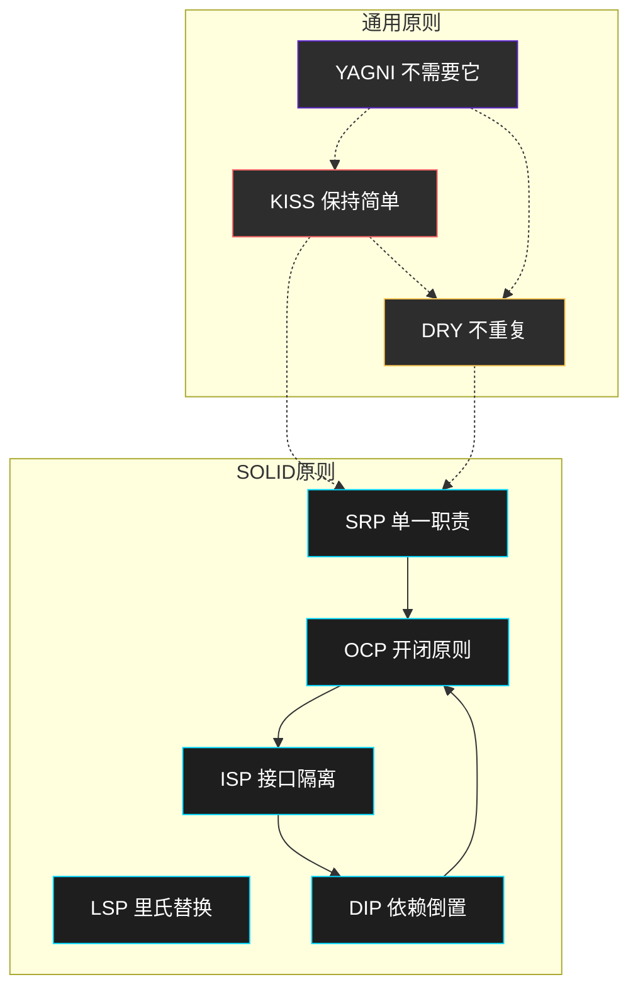

### 常见冲突与权衡

#### 1. SRP vs KISS

过度拆分可能导致类数量爆炸，与 KISS 原则冲突。

```java
// 过度拆分 - SRP 但违反 KISS
public class UserNameValidator { }
public class UserEmailValidator { }
public class UserPasswordValidator { }
public class UserPhoneValidator { { }
public class UserAddressValidator { }

// 适度合并 - 平衡 SRP 和 KISS
public class UserValidator {
    public void validateName(String name) { }
    public void validateEmail(String email) { }
    public void validatePassword(String password) { }
    public void validatePhone(String phone) { }
}
```

#### 2. DRY vs YAGNI

DRY 可能会诱使我们提前抽象重复代码，但这可能违反 YAGNI。

```java
// 场景：两处代码看起来相似，但用途不同

// ❌ 错误地应用 DRY，违反了 YAGNI
public class UserValidator {
    // 看起来和 OrderValidator 类似，提前抽象
    public void validate(Object input) { /* 通用验证 */ }
}

// 但实际上用户验证和订单验证未来可能会有很大差异
// 提前抽象反而限制了灵活性

// ✅ 正确做法：先各自实现，等真正发现重复再抽象
public class UserValidator {
    public void validate(User user) { /* 用户特定验证 */ }
}

public class OrderValidator {
    public void validate(Order order) { /* 订单特定验证 */ }
}
```

#### 3. SOLID vs 简单性

过度遵循 SOLID 可能导致过多的抽象层次。

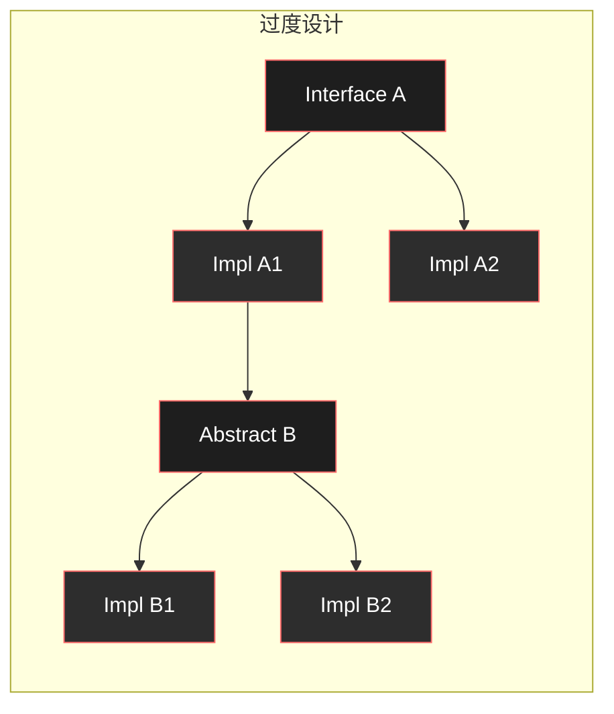

### 实用决策指南

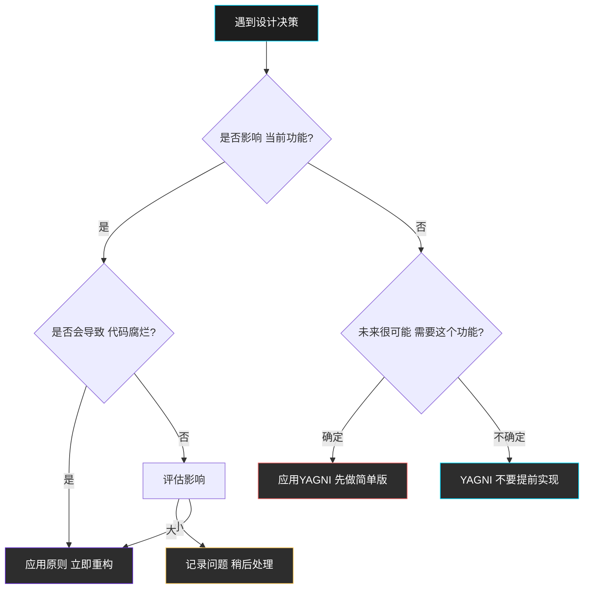

### 经验法则

| 场景 | 推荐原则 | 原因 |
|------|----------|------|
| 新系统/新模块 | SOLID | 建立良好的架构基础 |
| 简单脚本/工具 | KISS | 过度设计反而是负担 |
| 快速迭代阶段 | YAGNI | 避免过早优化 |
| 成熟稳定系统 | DRY | 减少维护成本 |
| 遗留代码 | KISS > SOLID | 优先让代码能工作 |

---

## 2.7 综合工程实践案例

### 案例：用户权限管理系统

这个案例综合运用了所有设计原则：

```java
// ========== 符合所有原则的用户权限系统 ==========

// ✅ DIP: 依赖抽象
public interface PermissionChecker {
    boolean hasPermission(User user, Permission permission);
}

public interface UserRepository {
    User findById(Long id);
    User findByUsername(String username);
}

public interface AuditLogger {
    void logAccess(User user, Resource resource, Permission permission);
}

// ✅ ISP: 接口隔离，只提供需要的方法
public interface PermissionQuery {
    boolean hasPermission(Permission permission);
    List<Permission> getPermissions();
}

public interface PermissionAssignment {
    void grantPermission(Permission permission);
    void revokePermission(Permission permission);
}

// ✅ SRP: 每个类职责单一
public class AdminPermissionChecker implements PermissionChecker {
    private final UserRepository userRepository;
    private final AuditLogger auditLogger;

    public AdminPermissionChecker(UserRepository userRepository, AuditLogger auditLogger) {
        this.userRepository = userRepository;
        this.auditLogger = auditLogger;
    }

    @Override
    public boolean hasPermission(User user, Permission permission) {
        // 专门负责权限检查逻辑
        return user.isAdmin();
    }
}

public class RoleBasedPermissionChecker implements PermissionChecker {
    private final UserRepository userRepository;

    public RoleBasedPermissionChecker(UserRepository userRepository) {
        this.userRepository = userRepository;
    }

    @Override
    public boolean hasPermission(User user, Permission permission) {
        // 基于角色的权限检查
        return user.getRole().hasPermission(permission);
    }
}

// ✅ OCP: 对扩展开放，对修改关闭
public class PermissionService {
    private final PermissionChecker permissionChecker;
    private final AuditLogger auditLogger;

    public PermissionService(PermissionChecker permissionChecker, AuditLogger auditLogger) {
        this.permissionChecker = permissionChecker;
        this.auditLogger = auditLogger;
    }

    // 新增权限类型只需扩展 PermissionChecker，不需要修改这个类
    public boolean checkAccess(User user, Resource resource, Permission permission) {
        if (permissionChecker.hasPermission(user, permission)) {
            auditLogger.logAccess(user, resource, permission);
            return true;
        }
        return false;
    }
}

// ✅ DRY: 提取公共验证逻辑
public class ValidationService {
    public void validateUserNotNull(User user) {
        if (user == null) {
            throw new IllegalArgumentException("用户不能为空");
        }
    }

    public void validatePermission(Permission permission) {
        if (permission == null) {
            throw new IllegalArgumentException("权限不能为空");
        }
    }
}

// ✅ KISS: 简单直接的实现
public class SimplePermissionService {
    private final Map<User, Set<Permission>> permissions = new HashMap<>();

    public void grantPermission(User user, Permission permission) {
        permissions.computeIfAbsent(user, k -> new HashSet<>()).add(permission);
    }

    public boolean hasPermission(User user, Permission permission) {
        Set<Permission> userPermissions = permissions.get(user);
        return userPermissions != null && userPermissions.contains(permission);
    }
}
```

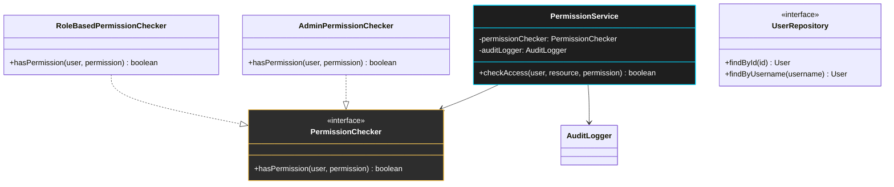

---

## 2.8 本章小结

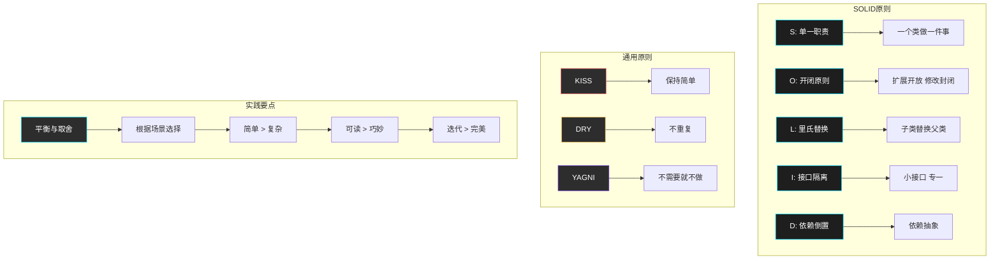

### 关键要点

1. **SOLID 原则是面向对象设计的基础**，帮助建立可维护、可扩展的代码结构

2. **KISS 原则提醒我们保持简单**，不要过度工程化

3. **DRY 原则强调代码复用**，但要注意避免过度抽象

4. **YAGNI 原则帮助我们抵制诱惑**，只实现真正需要的功能

5. **原则之间需要平衡**，没有绝对的规则，要根据具体场景做出决策

### 下一章预告

下一章我们将学习**耦合与内聚**，了解模块之间的关系如何影响系统整体质量。

---

**课后思考**

1. 在你当前的项目中，能否找到一个违反 SOLID 原则的例子？如何重构？
2. KISS 和 YAGNI 有时会冲突，你会如何取舍？
3. DRY 原则的「重复」定义是什么？有哪些重复是健康的？
