# 第三章：耦合与内聚

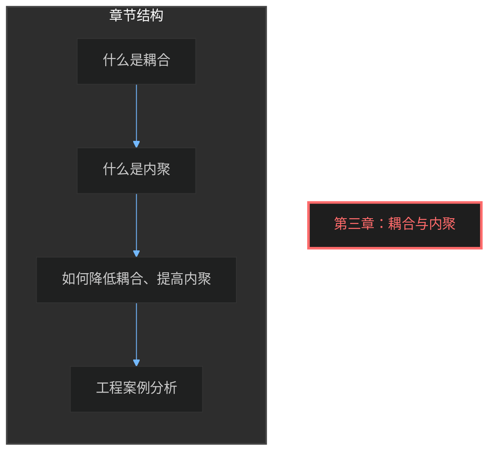

## 引言

在软件架构设计中，**耦合（Coupling）** 和 **内聚（Cohesion）** 是两个核心概念。它们决定了软件系统的质量，直接影响代码的可维护性、可扩展性和可测试性。

> **核心理念**：我们追求 **低耦合、高内聚** 的设计原则。低耦合意味着模块之间的依赖关系最小化；高内聚意味着每个模块内部的功能紧密相关、各司其职。

---

## 1. 什么是耦合（Coupling）

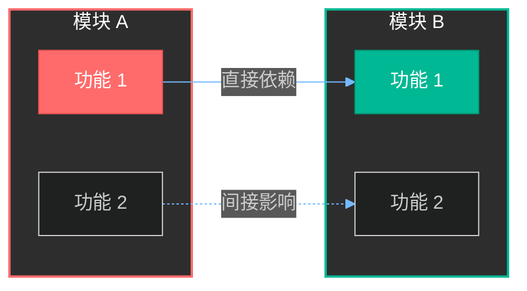

**耦合** 是指两个模块之间相互依赖的程度。当一个模块发生变化时，如果它对另一个模块产生影响，这两个模块之间就存在耦合。

### 1.1 耦合的类型

根据依赖程度从高到低，耦合可以分为以下几种类型：

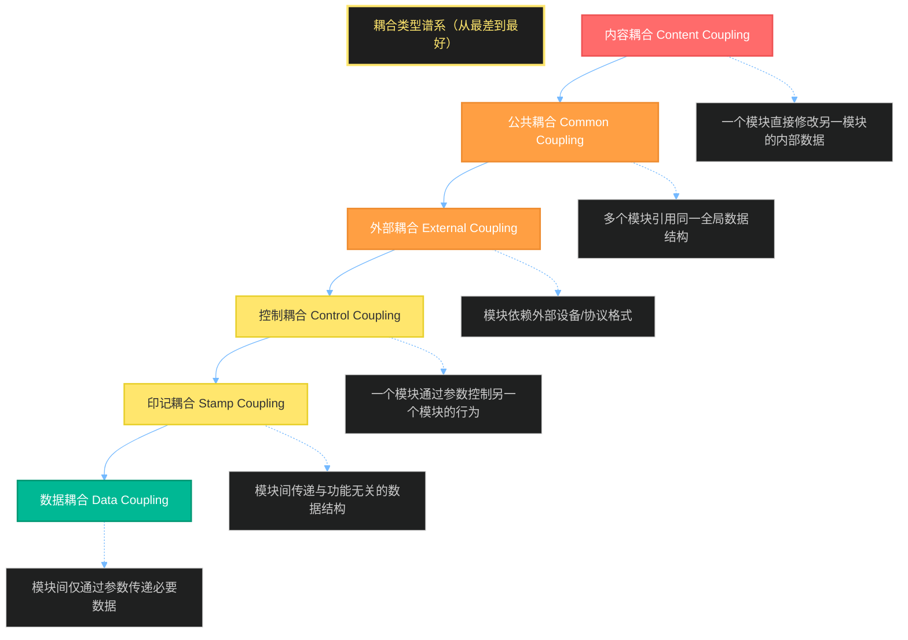

#### 1.1.1 内容耦合（Content Coupling）

**最差的耦合类型**。一个模块直接访问或修改另一个模块的内部数据或代码。

```java
// ❌ 内容耦合示例（Java）
public class UserService {
    private int userCount = 0;  // 内部数据
    
    public void addUser(String name) {
        userCount++;
    }
}

public class AdminTool {
    // 直接访问 UserService 的内部数据
    public void resetUserService(UserService service) {
        service.userCount = 0;  // 危险！直接修改内部状态
    }
}
```

```typescript
// ❌ 内容耦合示例（TypeScript）
class UserManager {
  private cache: Map<string, User> = new Map();
  
  public addUser(user: User) {
    this.cache.set(user.id, user);
  }
}

class CacheResetter {
  // 直接访问并清空另一个类的内部缓存
  reset(userManager: UserManager) {
    (userManager as any).cache = new Map(); // 危险！
  }
}
```

#### 1.1.2 公共耦合（Common Coupling）

多个模块共享同一全局数据结构。

```java
// ❌ 公共耦合示例
public class GlobalConfig {
    public static Map<String, Object> config = new HashMap<>();
}

public class UserService {
    public void createUser() {
        // 直接读写全局配置
        GlobalConfig.config.put("lastUserCreated", "timestamp");
    }
}

public class OrderService {
    public void createOrder() {
        // 与 UserService 共享同一个全局配置
        Object lastUser = GlobalConfig.config.get("lastUserCreated");
    }
}
```

```typescript
// ❌ 公共耦合示例
const globalState = {
  users: [] as User[],
  orders: [] as Order[],
  config: {} as Config
};

class UserService {
  createUser(user: User) {
    globalState.users.push(user);
    globalState.lastUpdated = Date.now();
  }
}

class OrderService {
  createOrder(order: Order) {
    globalState.orders.push(order);
    // 不知道谁修改了 lastUpdated
    console.log(globalState.lastUpdated);
  }
}
```

#### 1.1.3 外部耦合（External Coupling）

模块依赖外部设备、协议或数据结构格式。

```java
// ❌ 外部耦合示例 - 依赖外部格式
public class XmlDataParser {
    public User parseUserFromXml(String xml) {
        // 直接依赖特定的 XML 格式
        DocumentBuilder builder = DocumentBuilderFactory.newInstance().newDocumentBuilder();
        Document doc = builder.parse(new InputSource(new StringReader(xml)));
        
        Element root = doc.getDocumentElement();
        String name = root.getElementsByTagName("name").item(0).getTextContent();
        // 一旦 XML 格式变化，整个类都要改
        return new User(name);
    }
}
```

```typescript
// ❌ 外部耦合示例
// 直接依赖第三方 API 的响应格式
interface ThirdPartyResponse {
  DATA: {
    USERS: Array<{ NAME: string; AGE: number }>;
  };
  STATUS: string;
}

class UserMapper {
  mapExternalData(response: ThirdPartyResponse) {
    // 依赖外部系统的命名规范（大写、下划线）
    return response.DATA.USERS.map(u => ({
      name: u.NAME,
      age: u.AGE
    }));
  }
}
```

#### 1.1.4 控制耦合（Control Coupling）

一个模块通过传递参数控制另一个模块的行为。

```java
// ⚠️ 控制耦合示例
public class OrderProcessor {
    public void processOrder(String command, Object... params) {
        // command 参数控制方法行为
        switch (command) {
            case "CREATE":
                // 创建订单逻辑
                break;
            case "CANCEL":
                // 取消订单逻辑
                break;
            case "UPDATE":
                // 更新订单逻辑
                break;
        }
    }
}

// 调用方需要知道内部命令字符串
public class Controller {
    public void handleRequest(HttpServletRequest request) {
        String action = request.getParameter("action");
        orderProcessor.processOrder(action, request.getParameterMap());
    }
}
```

```typescript
// ⚠️ 控制耦合示例
type Command = 'CREATE' | 'UPDATE' | 'DELETE' | 'PROCESS';

class WorkflowEngine {
  execute(command: Command, data: any) {
    switch (command) {
      case 'CREATE':
        return this.create(data);
      case 'UPDATE':
        return this.update(data);
      case 'DELETE':
        return this.delete(data);
      case 'PROCESS':
        return this.process(data);
    }
  }
}
```

#### 1.1.5 印记耦合（Stamp Coupling）

模块间传递包含不相关数据的复杂数据结构。

```java
// ⚠️ 印记耦合示例
public class UserDTO {
    public String name;
    public String email;
    public String phone;
    public Address address;  // 订单功能不需要地址
    public PaymentInfo paymentInfo;  // 订单功能不需要支付信息
}

public class OrderService {
    public void createOrder(UserDTO user) {
        // 订单只需要 name 和 email，却拿到了整个用户对象
        // 如果 UserDTO 增加年龄字段，OrderService 也会受影响
        System.out.println("Creating order for: " + user.name);
    }
}
```

```typescript
// ⚠️ 印记耦合示例
interface UserProfile {
  id: string;
  name: string;
  email: string;
  phone: string;
  avatar: string;
  settings: UserSettings;
  preferences: UserPreferences;
  // ... 很多与订单无关的字段
}

interface OrderRequest {
  user: UserProfile;  // 订单只需要 userId
  items: OrderItem[];
}

class OrderService {
  createOrder(request: OrderRequest) {
    // 收到完整的用户资料，但只用到 id
    const userId = request.user.id;
  }
}
```

#### 1.1.6 数据耦合（Data Coupling）

**最好的耦合类型**。模块间仅通过参数传递必要的数据。

```java
// ✅ 数据耦合示例
public class UserService {
    public User createUser(String name, String email) {
        User user = new User(name, email);
        return userRepository.save(user);
    }
    
    public User getUserById(String userId) {
        return userRepository.findById(userId);
    }
}

public class OrderService {
    public Order createOrder(String userId, List<OrderItem> items) {
        // 只传递必要的数据：userId 和 items
        User user = userService.getUserById(userId);
        return orderRepository.save(new Order(user, items));
    }
}
```

```typescript
// ✅ 数据耦合示例
interface CreateUserDTO {
  name: string;
  email: string;
}

interface UserResponse {
  id: string;
  name: string;
  email: string;
}

class UserService {
  createUser(dto: CreateUserDTO): UserResponse {
    const user = new User(dto.name, dto.email);
    return this.userRepo.save(user);
  }
}

class OrderService {
  createOrder(userId: string, items: OrderItem[]): Order {
    // 只接收需要的数据
    return this.orderRepo.save({ userId, items });
  }
}
```

### 1.2 高耦合的问题

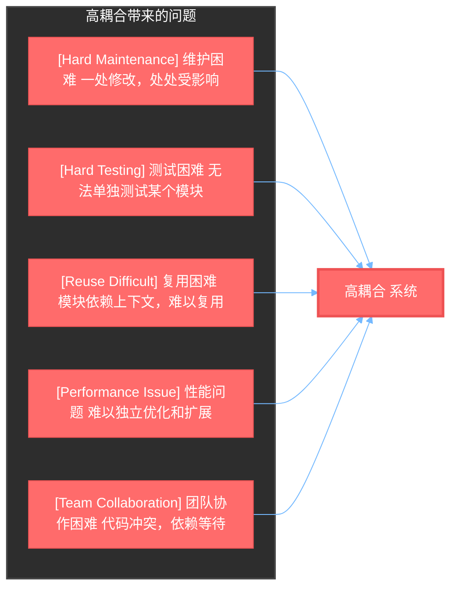

**高耦合代码的真实案例**：

```java
// ❌ 一个真实的维护噩梦
public class OrderManager {
    // 直接实例化依赖
    private DatabaseConnection db = new DatabaseConnection();
    private EmailService email = new EmailService();
    private SmsService sms = new SmsService();
    private PdfGenerator pdf = new PdfGenerator();
    private AuditLogger audit = new AuditLogger();
    private InventorySystem inventory = new InventorySystem();
    
    public void processOrder(String orderId) {
        // 1. 查询订单
        Order order = db.query("SELECT * FROM orders WHERE id = ?", orderId);
        
        // 2. 检查库存
        if (!inventory.check(order.items)) {
            sms.send(order.userPhone, "库存不足");
            return;
        }
        
        // 3. 扣减库存
        inventory.reduce(order.items);
        
        // 4. 发送邮件
        email.send(order.userEmail, "订单已确认");
        
        // 5. 生成 PDF
        byte[] pdfData = pdf.generate(order);
        
        // 6. 记录审计日志
        audit.log("ORDER_PROCESSED", orderId);
        
        // 7. 更新订单状态
        db.execute("UPDATE orders SET status = 'PROCESSED' WHERE id = ?", orderId);
    }
}

// 问题：
// 1. 无法单独测试 processOrder
// 2. 无法替换任何组件（如更换邮件服务）
// 3. 数据库连接无法复用
// 4. 所有逻辑耦合在一起
```

### 1.3 低耦合的好处

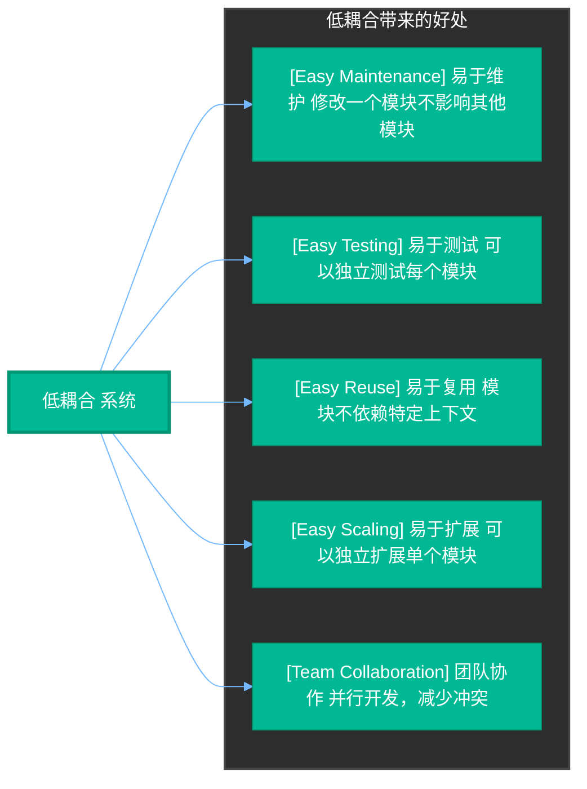

---

## 2. 什么是内聚（Cohesion）

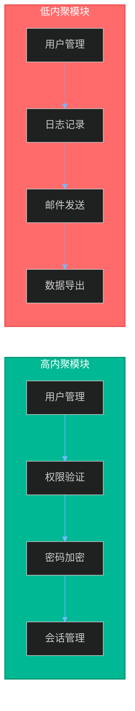

**内聚** 是指一个模块内部各个元素（功能、数据）之间相互关联的程度。高内聚意味着模块只负责单一职责，相关功能聚集在一起。

### 2.1 内聚的类型

根据内聚程度从低到高，内聚分为以下几种类型：

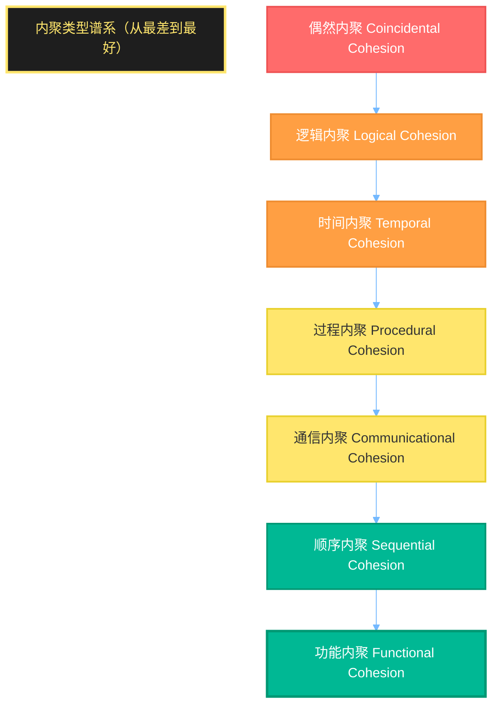

#### 2.1.1 偶然内聚（Coincidental Cohesion）

**最差的内聚类型**。模块内各元素毫无关联，只是被随意放在一起。

```java
// ❌ 偶然内聚示例
public class Utilities {
    // 这个类包含了完全无关的功能
    public static int add(int a, int b) { return a + b; }
    public static void sendEmail(String to) { /* 发邮件 */ }
    public static void logToFile(String msg) { /* 写日志 */ }
    public static Date parseDate(String str) { /* 解析日期 */ }
    public static void formatCurrency(double amount) { /* 格式化货币 */ }
}
```

#### 2.1.2 逻辑内聚（Logical Cohesion）

模块内各元素属于同一逻辑类别，但实际功能不相关。

```java
// ❌ 逻辑内聚示例
public class DataHandler {
    // 所有"数据相关"的操作放在一起，但实际上毫不相干
    public void saveUser(User user) { /* 保存用户 */ }
    public void saveOrder(Order order) { /* 保存订单 */ }
    public void deleteUser(String userId) { /* 删除用户 */ }
    public void deleteOrder(String orderId) { /* 删除订单 */ }
    public void exportUserReport() { /* 导出用户报表 */ }
    public void exportOrderReport() { /* 导出订单报表 */ }
}
```

#### 2.1.3 时间内聚（Temporal Cohesion）

各元素在同一时间段被执行，但功能不相关。

```java
// ❌ 时间内聚示例
public class StartupHandler {
    // 所有在启动时执行的操作放在一起
    public void onApplicationStart() {
        loadConfiguration();    // 加载配置
        initDatabase();         // 初始化数据库
        startBackgroundTasks(); // 启动后台任务
        sendStartupNotifications(); // 发送启动通知
        warmUpCache();          // 预热缓存
        validateLicense();      // 验证许可证
    }
}
```

#### 2.1.4 过程内聚（Procedural Cohesion）

各元素按特定顺序执行，但彼此独立。

```java
// ⚠️ 过程内聚示例
public class OrderWorkflow {
    public void processOrder() {
        // 按顺序执行，但每步可以独立存在
        validateOrder();    // 验证订单
        calculatePrice();   // 计算价格
        checkInventory();   // 检查库存
        reserveItems();     // 预留商品
        processPayment();   // 处理支付
        shipOrder();        // 发货
    }
}
```

#### 2.1.5 通信内聚（Communicational Cohesion）

各元素使用相同数据，但不涉及顺序关系。

```java
// ⚠️ 通信内聚示例
public class UserDataManager {
    // 都与用户数据相关，但不涉及顺序
    public User getUserById(String id) { /* 查询 */ }
    public void updateUserEmail(String id, String email) { /* 更新邮箱 */ }
    public void updateUserPhone(String id, String phone) { /* 更新电话 */ }
    public void updateUserAddress(String id, Address addr) { /* 更新地址 */ }
    public List<User> searchUsers(String keyword) { /* 搜索用户 */ }
}
```

#### 2.1.6 顺序内聚（Sequential Cohesion）

一个元素的输出是另一个元素的输入。

```java
// ✅ 顺序内聚示例
public class OrderProcessor {
    public void processOrder() {
        // 每个步骤的输出作为下一步的输入
        OrderData data = fetchOrderData();    // 获取订单数据
        ValidatedOrder validated = validateOrderData(data);  // 验证数据
        CalculatedPrice calculated = calculatePrice(validated);  // 计算价格
        ProcessedResult result = executePayment(calculated);  // 执行支付
        saveOrderConfirmation(result);      // 保存确认
    }
}
```

#### 2.1.7 功能内聚（Functional Cohesion）

**最好的内聚类型**。模块内所有元素共同实现单一功能。

```java
// ✅ 功能内聚示例
public class PasswordHasher {
    // 只负责密码哈希
    public String hash(String password) { /* 生成哈希 */ }
    public boolean verify(String password, String hash) { /* 验证哈希 */ }
}

public class EmailValidator {
    // 只负责邮箱验证
    public boolean isValid(String email) { /* 验证格式 */ }
    public boolean isDisposable(String email) { /* 检查是否临时邮箱 */ }
}

public class JwtTokenService {
    // 只负责 JWT 令牌
    public String generateToken(User user) { /* 生成令牌 */ }
    public boolean validateToken(String token) { /* 验证令牌 */ }
    public Date getExpiration(String token) { /* 获取过期时间 */ }
}
```

### 2.2 高内聚的好处

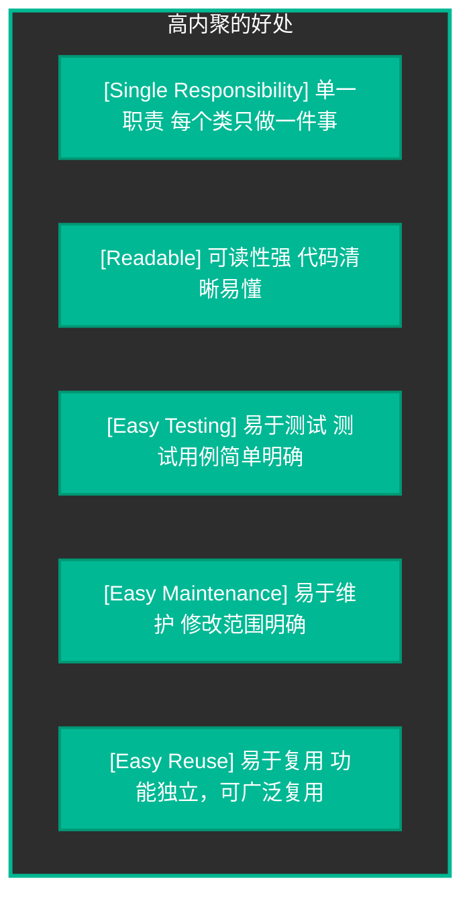

---

## 3. 如何降低耦合、提高内聚

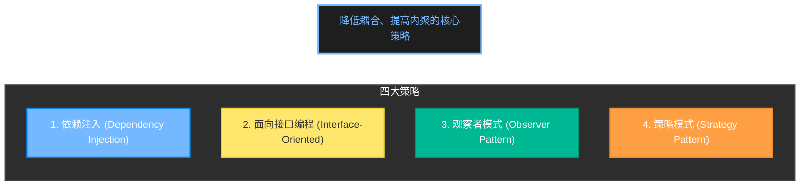

### 3.1 依赖注入（Dependency Injection）

**核心思想**：将依赖的创建责任从使用方转移出去，通过外部注入方式提供依赖。

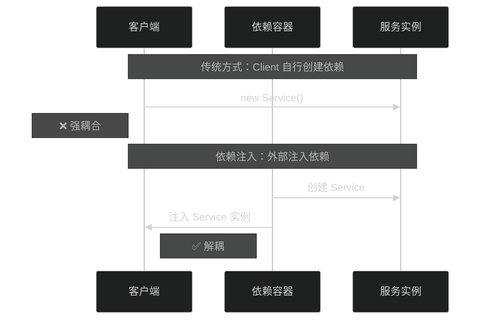

#### 3.1.1 构造函数注入

```java
// ✅ 构造函数注入示例
public interface UserRepository {
    User findById(String id);
    User save(User user);
}

public interface EmailService {
    void sendEmail(String to, String subject, String body);
}

// 依赖通过构造函数注入
public class UserService {
    private final UserRepository userRepository;
    private final EmailService emailService;
    
    // 依赖注入到构造函数
    public UserService(UserRepository userRepository, EmailService emailService) {
        this.userRepository = userRepository;
        this.emailService = emailService;
    }
    
    public void register(String name, String email) {
        User user = new User(name, email);
        userRepository.save(user);
        emailService.sendEmail(email, "Welcome!", "Thank you for registering.");
    }
}
```

```typescript
// ✅ TypeScript 构造函数注入示例
interface UserRepository {
  findById(id: string): Promise<User>;
  save(user: User): Promise<User>;
}

interface EmailService {
  sendEmail(to: string, subject: string, body: string): Promise<void>;
}

class UserService {
  constructor(
    private userRepository: UserRepository,
    private emailService: EmailService
  ) {}
  
  async register(name: string, email: string): Promise<void> {
    const user = new User(name, email);
    await this.userRepository.save(user);
    await this.emailService.sendEmail(email, 'Welcome!', 'Thank you for registering.');
  }
}
```

#### 3.1.2 Setter 注入

```java
// ✅ Setter 注入示例
public class NotificationService {
    private EmailService emailService;
    private SmsService smsService;
    
    // Setter 注入
    public void setEmailService(EmailService emailService) {
        this.emailService = emailService;
    }
    
    public void setSmsService(SmsService smsService) {
        this.smsService = smsService;
    }
    
    public void notify(String userId, String message) {
        if (emailService != null) {
            emailService.send(userId, message);
        }
        if (smsService != null) {
            smsService.send(userId, message);
        }
    }
}
```

```typescript
// ✅ TypeScript Setter 注入示例
interface Mailer {
  send(to: string, message: string): Promise<void>;
}

class NotificationService {
  private mailer?: Mailer;
  private smsSender?: SmsSender;
  
  setMailer(mailer: Mailer): void {
    this.mailer = mailer;
  }
  
  setSmsSender(smsSender: SmsSender): void {
    this.smsSender = smsSender;
  }
  
  async notify(user: User, message: string): Promise<void> {
    if (this.mailer) {
      await this.mailer.send(user.email, message);
    }
    if (this.smsSender) {
      await this.smsSender.send(user.phone, message);
    }
  }
}
```

#### 3.1.3 依赖注入容器的配合

```java
// ✅ Spring 风格的依赖注入
// 配置类
@Configuration
public class AppConfig {
    @Bean
    public UserRepository userRepository() {
        return new InMemoryUserRepository();
    }
    
    @Bean
    public EmailService emailService() {
        return new SmtpEmailService();
    }
    
    @Bean
    public UserService userService(UserRepository userRepository, EmailService emailService) {
        return new UserService(userRepository, emailService);
    }
}

// 使用
@Service
public class Controller {
    private final UserService userService;
    
    @Autowired
    public Controller(UserService userService) {
        this.userService = userService;
    }
}
```

```typescript
// ✅ TypeScript DI 容器示例
// 使用 inversify 或 nestjs/di

// 定义依赖令牌
const USER_REPOSITORY = Symbol('UserRepository');
const EMAIL_SERVICE = Symbol('EmailService');

// 绑定接口到实现
container.bind<UserRepository>(USER_REPOSITORY).to(InMemoryUserRepository);
container.bind<EmailService>(EMAIL_SERVICE).to(SmtpEmailService);

// 使用依赖
@injectable()
class UserService {
  constructor(
    @inject(USER_REPOSITORY) private userRepo: UserRepository,
    @inject(EMAIL_SERVICE) private emailSvc: EmailService
  ) {}
}
```

### 3.2 面向接口编程（Interface-Oriented Programming）

**核心思想**：依赖抽象（接口），而非具体实现。

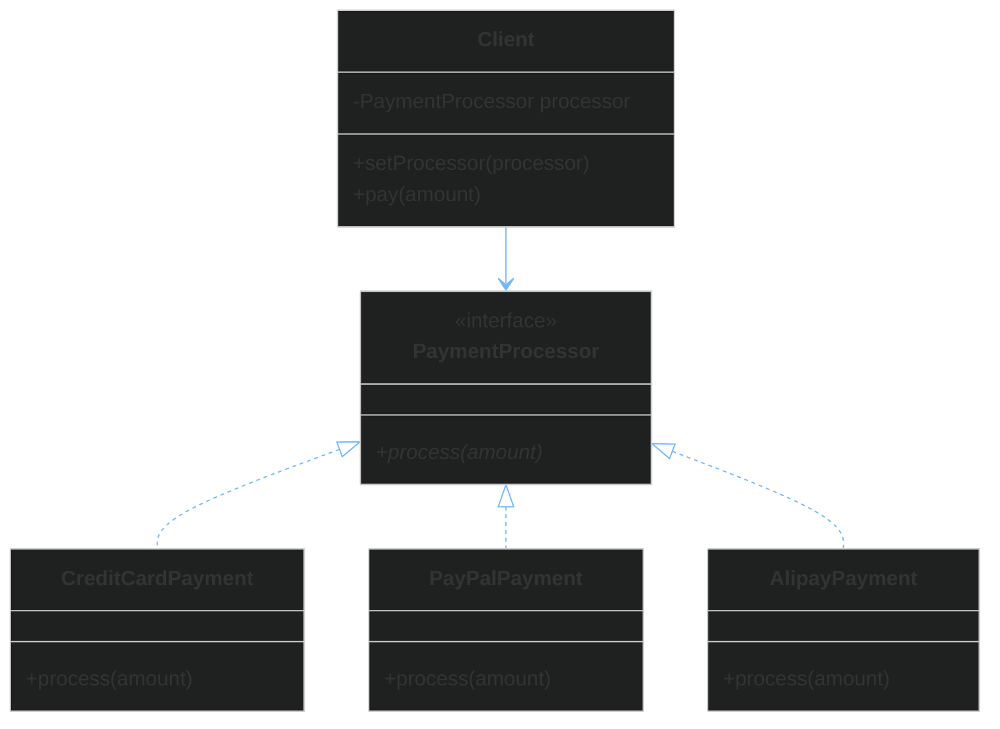

#### 3.2.1 接口定义与使用

```java
// ✅ 面向接口编程示例
// 定义接口
public interface StorageService {
    void save(String key, byte[] data);
    byte[] load(String key);
    void delete(String key);
}

// 接口是对行为的抽象，与具体实现解耦
public interface ImageProcessor {
    byte[] resize(byte[] image, int width, int height);
    byte[] convertFormat(byte[] image, String format);
}

// 具体实现
public class S3StorageService implements StorageService {
    private AmazonS3 s3;
    
    @Override
    public void save(String key, byte[] data) {
        s3.putObject(bucket, key, new ByteArrayInputStream(data));
    }
    
    @Override
    public byte[] load(String key) {
        return null; // 简化
    }
    
    @Override
    public void delete(String key) {
        s3.deleteObject(bucket, key);
    }
}

public class LocalStorageService implements StorageService {
    private Path basePath;
    
    @Override
    public void save(String key, byte[] data) throws IOException {
        Files.write(basePath.resolve(key), data);
    }
    
    @Override
    public byte[] load(String key) throws IOException {
        return Files.readAllBytes(basePath.resolve(key));
    }
    
    @Override
    public void delete(String key) throws IOException {
        Files.delete(basePath.resolve(key));
    }
}

// 客户端依赖接口，不依赖实现
public class ImageService {
    private final ImageProcessor processor;
    private final StorageService storage;
    
    public ImageService(ImageProcessor processor, StorageService storage) {
        this.processor = processor;
        this.storage = storage;
    }
    
    public void processAndSave(String originalKey, String format) {
        byte[] original = storage.load(originalKey);
        byte[] processed = processor.convertFormat(original, format);
        storage.save("processed." + format, processed);
    }
}
```

```typescript
// ✅ TypeScript 面向接口编程示例
// 定义接口
interface StorageService {
  save(key: string, data: Buffer): Promise<void>;
  load(key: string): Promise<Buffer>;
  delete(key: string): Promise<void>;
}

interface ImageProcessor {
  resize(image: Buffer, width: number, height: number): Buffer;
  convertFormat(image: Buffer, format: string): Buffer;
}

// 具体实现
class S3StorageService implements StorageService {
  constructor(private s3: AWS.S3, private bucket: string) {}
  
  async save(key: string, data: Buffer): Promise<void> {
    await this.s3.putObject({ Bucket: this.bucket, Key: key, Body: data }).promise();
  }
  
  async load(key: string): Promise<Buffer> {
    const result = await this.s3.getObject({ Bucket: this.bucket, Key: key }).promise();
    return Buffer.from(result.Body as Buffer);
  }
  
  async delete(key: string): Promise<void> {
    await this.s3.deleteObject({ Bucket: this.bucket, Key: key }).promise();
  }
}

class LocalStorageService implements StorageService {
  constructor(private basePath: string) {}
  
  async save(key: string, data: Buffer): Promise<void> {
    await fs.promises.writeFile(path.join(this.basePath, key), data);
  }
  
  async load(key: string): Promise<Buffer> {
    return await fs.promises.readFile(path.join(this.basePath, key));
  }
  
  async delete(key: string): Promise<void> {
    await fs.promises.unlink(path.join(this.basePath, key));
  }
}

// 客户端依赖接口
class ImageService {
  constructor(
    private processor: ImageProcessor,
    private storage: StorageService
  ) {}
  
  async processAndSave(originalKey: string, format: string): Promise<void> {
    const original = await this.storage.load(originalKey);
    const processed = this.processor.convertFormat(original, format);
    await this.storage.save(`processed.${format}`, processed);
  }
}
```

### 3.3 观察者模式（Observer Pattern）

**核心思想**：定义对象间一对多依赖关系，当一个对象状态变化时，所有依赖它的对象都会收到通知。

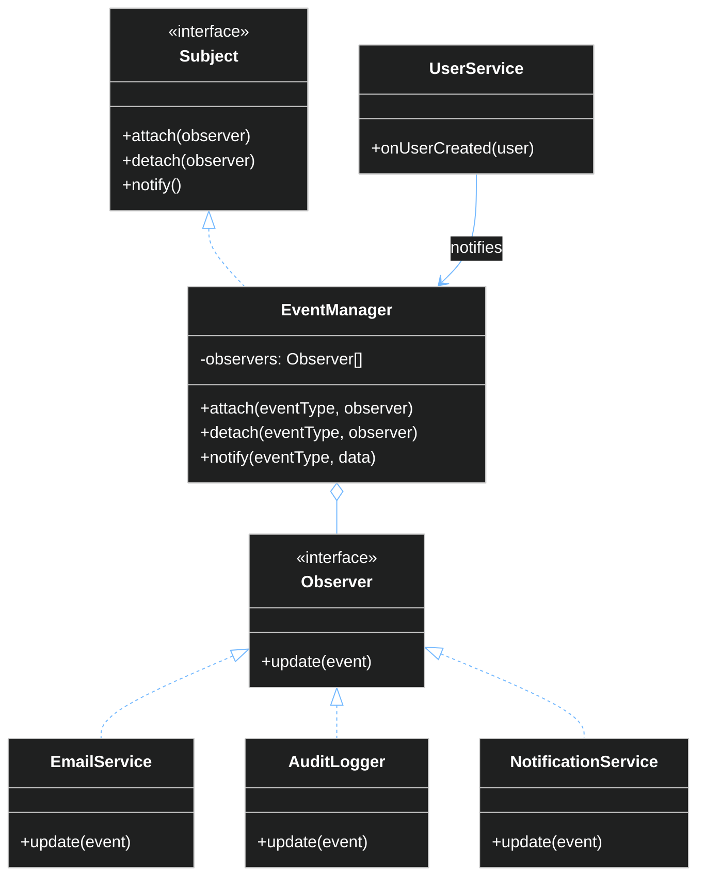

#### 3.3.1 观察者模式实现

```java
// ✅ 观察者模式示例 - 事件驱动系统
import java.util.*;

// 观察者接口
public interface Observer {
    void update(String eventType, Object data);
}

// 主题接口
public interface Subject {
    void attach(String eventType, Observer observer);
    void detach(String eventType, Observer observer);
    void notifyObservers(String eventType, Object data);
}

// 事件管理器（主题实现）
public class EventManager implements Subject {
    // 事件类型 -> 观察者列表
    private Map<String, List<Observer>> listeners = new HashMap<>();
    
    @Override
    public void attach(String eventType, Observer observer) {
        listeners.computeIfAbsent(eventType, k -> new ArrayList<>()).add(observer);
    }
    
    @Override
    public void detach(String eventType, Observer observer) {
        List<Observer> observers = listeners.get(eventType);
        if (observers != null) {
            observers.remove(observer);
        }
    }
    
    @Override
    public void notifyObservers(String eventType, Object data) {
        List<Observer> observers = listeners.get(eventType);
        if (observers != null) {
            for (Observer observer : observers) {
                observer.update(eventType, data);
            }
        }
    }
}

// 具体观察者
public class EmailNotificationService implements Observer {
    @Override
    public void update(String eventType, Object data) {
        if ("USER_CREATED".equals(eventType)) {
            User user = (User) data;
            System.out.println("Sending welcome email to: " + user.getEmail());
        }
    }
}

public class AuditLoggerService implements Observer {
    @Override
    public void update(String eventType, Object data) {
        System.out.println("[AUDIT] Event: " + eventType + ", Data: " + data);
    }
}

public class AnalyticsService implements Observer {
    @Override
    public void update(String eventType, Object data) {
        if ("ORDER_PLACED".equals(eventType)) {
            System.out.println("Tracking order analytics...");
        }
    }
}

// 用户服务
public class UserService {
    private EventManager eventManager;
    private UserRepository userRepository;
    
    public UserService(EventManager eventManager, UserRepository userRepository) {
        this.eventManager = eventManager;
        this.userRepository = userRepository;
        
        // 订阅事件
        eventManager.attach("USER_CREATED", new EmailNotificationService());
        eventManager.attach("USER_CREATED", new AuditLoggerService());
    }
    
    public User createUser(String name, String email) {
        User user = new User(name, email);
        userRepository.save(user);
        
        // 发布事件
        eventManager.notifyObservers("USER_CREATED", user);
        
        return user;
    }
}
```

```typescript
// ✅ TypeScript 观察者模式示例
type EventType = 'USER_CREATED' | 'ORDER_PLACED' | 'PAYMENT_COMPLETED';

interface Observer {
  update(eventType: EventType, data: any): void;
}

class EventManager implements Subject {
  private listeners: Map<EventType, Observer[]> = new Map();
  
  attach(eventType: EventType, observer: Observer): void {
    const observers = this.listeners.get(eventType) || [];
    observers.push(observer);
    this.listeners.set(eventType, observers);
  }
  
  detach(eventType: EventType, observer: Observer): void {
    const observers = this.listeners.get(eventType) || [];
    const index = observers.indexOf(observer);
    if (index > -1) {
      observers.splice(index, 1);
    }
  }
  
  notify(eventType: EventType, data: any): void {
    const observers = this.listeners.get(eventType) || [];
    observers.forEach(observer => observer.update(eventType, data));
  }
}

// 具体观察者
class EmailNotificationService implements Observer {
  update(eventType: EventType, data: any): void {
    if (eventType === 'USER_CREATED') {
      console.log(`Sending welcome email to: ${data.email}`);
    }
  }
}

class AuditLoggerService implements Observer {
  update(eventType: EventType, data: any): void {
    console.log(`[AUDIT] Event: ${eventType}, Data:`, data);
  }
}

// 用户服务
class UserService {
  constructor(
    private eventManager: EventManager,
    private userRepository: UserRepository
  ) {
    this.eventManager.attach('USER_CREATED', new EmailNotificationService());
    this.eventManager.attach('USER_CREATED', new AuditLoggerService());
  }
  
  async createUser(name: string, email: string): Promise<User> {
    const user = new User(name, email);
    await this.userRepository.save(user);
    
    // 发布事件 - 解耦关键
    this.eventManager.notify('USER_CREATED', user);
    
    return user;
  }
}
```

### 3.4 策略模式（Strategy Pattern）

**核心思想**：定义一系列算法，把它们一个个封装起来，使它们可以互相替换。

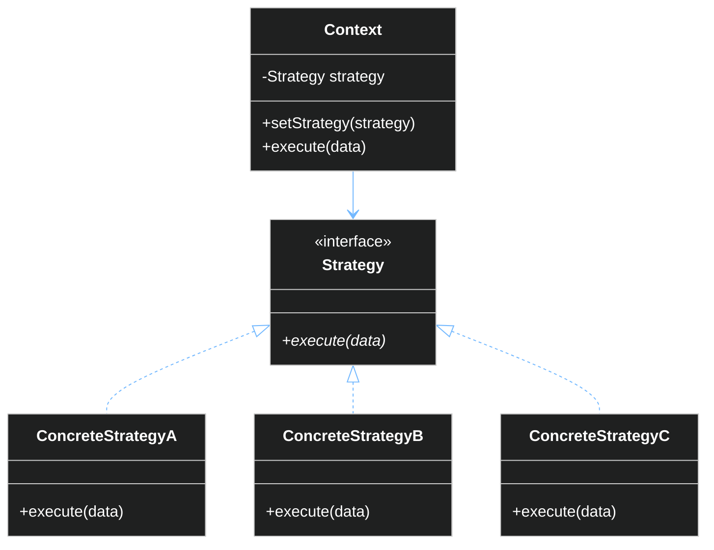

#### 3.4.1 策略模式实现

```java
// ✅ 策略模式示例 - 支付系统
// 支付策略接口
public interface PaymentStrategy {
    PaymentResult pay(double amount);
    boolean validate(PaymentDetails details);
}

// 具体策略实现
public class CreditCardPayment implements PaymentStrategy {
    private String cardNumber;
    private String cvv;
    
    @Override
    public PaymentResult pay(double amount) {
        // 调用支付网关
        PaymentGateway gateway = new PaymentGateway();
        return gateway.charge(cardNumber, amount);
    }
    
    @Override
    public boolean validate(PaymentDetails details) {
        return isValidCardNumber(details.getCardNumber()) && 
               isValidCvv(details.getCvv());
    }
}

public class PayPalPayment implements PaymentStrategy {
    private String email;
    
    @Override
    public PaymentResult pay(double amount) {
        PayPalApi api = new PayPalApi();
        return api.checkout(email, amount);
    }
    
    @Override
    public boolean validate(PaymentDetails details) {
        return isValidEmail(details.getEmail());
    }
}

public class AlipayPayment implements PaymentStrategy {
    private String alipayId;
    
    @Override
    public PaymentResult pay(double amount) {
        AlipaySdk sdk = new AlipaySdk();
        return sdk.pay(alipayId, amount);
    }
    
    @Override
    public boolean validate(PaymentDetails details) {
        return isValidAlipayId(details.getAlipayId());
    }
}

// 上下文 - 使用策略的类
public class PaymentContext {
    private PaymentStrategy strategy;
    
    public void setStrategy(PaymentStrategy strategy) {
        this.strategy = strategy;
    }
    
    public PaymentResult processPayment(double amount, PaymentDetails details) {
        if (!strategy.validate(details)) {
            throw new InvalidPaymentException("Invalid payment details");
        }
        return strategy.pay(amount);
    }
}

// 支付服务（策略选择器）
public class PaymentService {
    private PaymentContext context;
    
    public PaymentResult pay(Order order, String paymentType) {
        PaymentStrategy strategy;
        
        switch (paymentType) {
            case "CREDIT_CARD":
                strategy = new CreditCardPayment(order.getCardNumber(), order.getCvv());
                break;
            case "PAYPAL":
                strategy = new PayPalPayment(order.getPaypalEmail());
                break;
            case "ALIPAY":
                strategy = new AlipayPayment(order.getAlipayId());
                break;
            default:
                throw new UnsupportedPaymentException(paymentType);
        }
        
        context.setStrategy(strategy);
        return context.processPayment(order.getTotal(), order.getPaymentDetails());
    }
}
```

```typescript
// ✅ TypeScript 策略模式示例
interface PaymentStrategy {
  pay(amount: number): Promise<PaymentResult>;
  validate(details: PaymentDetails): boolean;
}

class CreditCardPayment implements PaymentStrategy {
  constructor(private cardNumber: string, private cvv: string) {}
  
  async pay(amount: number): Promise<PaymentResult> {
    // 调用支付网关
    return await paymentGateway.charge(this.cardNumber, amount);
  }
  
  validate(details: PaymentDetails): boolean {
    return this.isValidCard(details);
  }
  
  private isValidCard(details: PaymentDetails): boolean {
    return /^\d{16}$/.test(details.cardNumber) && 
           /^\d{3,4}$/.test(details.cvv);
  }
}

class PayPalPayment implements PaymentStrategy {
  constructor(private email: string) {}
  
  async pay(amount: number): Promise<PaymentResult> {
    return await paypalApi.checkout(this.email, amount);
  }
  
  validate(details: PaymentDetails): boolean {
    return /^[^\s@]+@[^\s@]+\.[^\s@]+$/.test(details.email);
  }
}

// 上下文
class PaymentContext {
  constructor(private strategy: PaymentStrategy) {}
  
  setStrategy(strategy: PaymentStrategy): void {
    this.strategy = strategy;
  }
  
  async execute(amount: number, details: PaymentDetails): Promise<PaymentResult> {
    if (!this.strategy.validate(details)) {
      throw new Error('Invalid payment details');
    }
    return await this.strategy.pay(amount);
  }
}
```

---

## 4. 工程案例分析

### 4.1 案例背景：电商订单系统重构


### 4.2 重构前代码（反面教材）

```java
// ❌ 重构前：订单管理器（约 2000 行）
public class OrderManager {
    // 直接创建依赖 - 强耦合
    private DatabaseConnection db = new DatabaseConnection();
    private UserDatabase userDb = new UserDatabase();
    private InventoryDatabase inventoryDb = new InventoryDatabase();
    private PaymentGateway paymentGateway = new PaymentGateway();
    private EmailService email = new EmailService();
    private SmsService sms = new SmsService();
    private PdfGenerator pdf = new PdfGenerator();
    private ZipCodeValidator zipValidator = new ZipCodeValidator();
    private ShippingCalculator shippingCalc = new ShippingCalculator();
    private TaxCalculator taxCalc = new TaxCalculator();
    private CurrencyConverter currencyConverter = new CurrencyConverter();
    private AuditLogger audit = new AuditLogger();
    
    public void createOrder(HttpServletRequest request) {
        // 1. 获取用户输入
        String userId = request.getParameter("userId");
        String itemsJson = request.getParameter("items");
        String shippingAddressJson = request.getParameter("shippingAddress");
        String paymentMethod = request.getParameter("paymentMethod");
        
        // 2. 解析数据
        List<CartItem> items = parseItems(itemsJson);
        ShippingAddress address = parseAddress(shippingAddressJson);
        
        // 3. 验证用户（用户验证逻辑混在其中）
        User user = userDb.findById(userId);
        if (user == null) {
            throw new OrderException("User not found");
        }
        if (!user.isVerified()) {
            throw new OrderException("User not verified");
        }
        
        // 4. 验证库存（库存验证逻辑混在其中）
        for (CartItem item : items) {
            if (!inventoryDb.checkStock(item.getProductId(), item.getQuantity())) {
                throw new OrderException("Insufficient stock for " + item.getProductName());
            }
        }
        
        // 5. 计算价格
        double subtotal = 0;
        for (CartItem item : items) {
            subtotal += item.getPrice() * item.getQuantity();
        }
        
        // 6. 计算运费
        if (!zipValidator.isValid(address.getZipCode())) {
            throw new OrderException("Invalid zip code");
        }
        double shippingCost = shippingCalc.calculate(address.getZipCode(), items);
        
        // 7. 计算税费
        double tax = taxCalc.calculate(subtotal, address.getState());
        
        // 8. 货币转换
        String currency = request.getParameter("currency");
        if (!"USD".equals(currency)) {
            subtotal = currencyConverter.convert(subtotal, currency, "USD");
            shippingCost = currencyConverter.convert(shippingCost, currency, "USD");
            tax = currencyConverter.convert(tax, currency, "USD");
        }
        
        double total = subtotal + shippingCost + tax;
        
        // 9. 处理支付
        PaymentResult paymentResult;
        if ("CREDIT_CARD".equals(paymentMethod)) {
            String cardNumber = request.getParameter("cardNumber");
            paymentResult = paymentGateway.chargeCreditCard(cardNumber, total);
        } else if ("PAYPAL".equals(paymentMethod)) {
            String paypalEmail = request.getParameter("paypalEmail");
            paymentResult = paymentGateway.chargePayPal(paypalEmail, total);
        } else {
            throw new OrderException("Unsupported payment method");
        }
        
        if (!paymentResult.isSuccess()) {
            throw new OrderException("Payment failed: " + paymentResult.getMessage());
        }
        
        // 10. 扣减库存
        for (CartItem item : items) {
            inventoryDb.reduceStock(item.getProductId(), item.getQuantity());
        }
        
        // 11. 创建订单记录
        Order order = new Order();
        order.setId(generateOrderId());
        order.setUserId(userId);
        order.setItems(items);
        order.setShippingAddress(address);
        order.setSubtotal(subtotal);
        order.setShippingCost(shippingCost);
        order.setTax(tax);
        order.setTotal(total);
        order.setPaymentMethod(paymentMethod);
        order.setPaymentTransactionId(paymentResult.getTransactionId());
        order.setStatus("CONFIRMED");
        order.setCreatedAt(new Date());
        
        db.save(order);
        
        // 12. 发送确认邮件
        try {
            email.send(user.getEmail(), "Order Confirmation", 
                "Your order " + order.getId() + " has been placed.");
        } catch (Exception e) {
            // 邮件发送失败不影响主流程
            audit.log("EMAIL_FAILED", order.getId(), e.getMessage());
        }
        
        // 13. 发送 SMS
        if (user.getPhone() != null) {
            try {
                sms.send(user.getPhone(), "Order confirmed: " + order.getId());
            } catch (Exception e) {
                audit.log("SMS_FAILED", order.getId(), e.getMessage());
            }
        }
        
        // 14. 生成 PDF
        try {
            byte[] pdfData = pdf.generateOrderConfirmation(order);
            // 保存 PDF
        } catch (Exception e) {
            audit.log("PDF_GENERATION_FAILED", order.getId());
        }
        
        // 15. 记录审计日志
        audit.log("ORDER_CREATED", order.getId(), userId, total);
        
        // 16. 返回响应
        // ... 返回 JSON 响应
    }
    
    // 还有 50+ 个其他方法...
    // cancelOrder(), refundOrder(), updateOrder(), ...
}
```

### 4.3 重构后代码（正面教材）

#### 4.3.1 清晰的领域划分

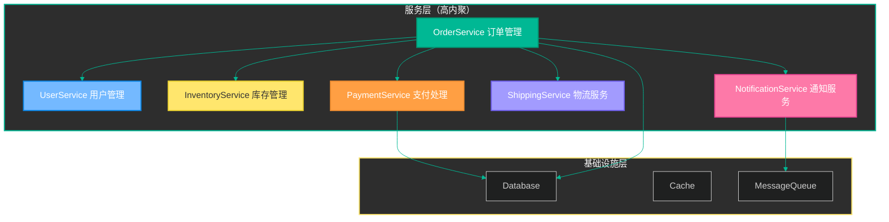

#### 4.3.2 订单服务（核心协调器）

```java
// ✅ 重构后：订单服务 - 只负责订单流程协调
@Service
public class OrderService {
    private final OrderRepository orderRepository;
    private final UserService userService;
    private final InventoryService inventoryService;
    private final PaymentService paymentService;
    private final ShippingService shippingService;
    private final NotificationService notificationService;
    private final EventManager eventManager;
    
    // 依赖注入
    @Autowired
    public OrderService(
            OrderRepository orderRepository,
            UserService userService,
            InventoryService inventoryService,
            PaymentService paymentService,
            ShippingService shippingService,
            NotificationService notificationService,
            EventManager eventManager) {
        this.orderRepository = orderRepository;
        this.userService = userService;
        this.inventoryService = inventoryService;
        this.paymentService = paymentService;
        this.shippingService = shippingService;
        this.notificationService = notificationService;
        this.eventManager = eventManager;
    }
    
    // 简洁清晰的方法
    public Order createOrder(CreateOrderRequest request) {
        // 1. 验证用户
        User user = userService.getVerifiedUser(request.getUserId());
        
        // 2. 验证库存并预留
        List<ReservedItem> reservedItems = inventoryService.reserveItems(request.getItems());
        
        try {
            // 3. 计算价格
            OrderPrice price = calculatePrice(reservedItems, request.getShippingAddress());
            
            // 4. 处理支付
            PaymentResult paymentResult = paymentService.processPayment(
                request.getPaymentMethod(),
                price.getTotal(),
                request.getPaymentDetails()
            );
            
            // 5. 创建订单
            Order order = createOrderEntity(user, reservedItems, price, paymentResult);
            orderRepository.save(order);
            
            // 6. 发布事件（异步通知其他服务）
            eventManager.notify("ORDER_CREATED", new OrderCreatedEvent(order));
            
            return order;
            
        } catch (PaymentFailedException e) {
            // 支付失败，释放库存
            inventoryService.releaseItems(reservedItems);
            throw e;
        }
    }
    
    public void cancelOrder(String orderId, String reason) {
        Order order = orderRepository.findById(orderId);
        
        if (!order.canCancel()) {
            throw new OrderCannotBeCancelledException(orderId);
        }
        
        // 1. 处理退款
        paymentService.refund(order.getPaymentTransactionId(), order.getTotal());
        
        // 2. 释放库存
        inventoryService.releaseItems(order.getReservedItems());
        
        // 3. 更新订单状态
        order.cancel(reason);
        orderRepository.save(order);
        
        // 4. 发送通知
        notificationService.notifyOrderCancelled(order);
        
        // 5. 发布事件
        eventManager.notify("ORDER_CANCELLED", new OrderCancelledEvent(order));
    }
    
    // 私有辅助方法
    private OrderPrice calculatePrice(List<ReservedItem> items, ShippingAddress address) {
        double subtotal = items.stream()
            .mapToDouble(ReservedItem::getSubtotal)
            .sum();
        
        ShippingCost shipping = shippingService.calculate(address, items);
        TaxAmount tax = TaxCalculator.calculate(subtotal, address.getState());
        
        return new OrderPrice(subtotal, shipping.getAmount(), tax.getAmount());
    }
}
```

#### 4.3.3 单一职责的服务类

```java
// ✅ 用户服务 - 只负责用户相关业务
@Service
@Transactional(readOnly = true)
public class UserService {
    private final UserRepository userRepository;
    
    @Autowired
    public UserService(UserRepository userRepository) {
        this.userRepository = userRepository;
    }
    
    public User getVerifiedUser(String userId) {
        User user = userRepository.findById(userId)
            .orElseThrow(() -> new UserNotFoundException(userId));
        
        if (!user.isVerified()) {
            throw new UserNotVerifiedException(userId);
        }
        
        return user;
    }
    
    @Transactional
    public User createUser(CreateUserRequest request) {
        if (userRepository.existsByEmail(request.getEmail())) {
            throw new EmailAlreadyExistsException(request.getEmail());
        }
        
        User user = new User(request.getName(), request.getEmail());
        userRepository.save(user);
        
        return user;
    }
}
```

```java
// ✅ 库存服务 - 只负责库存相关业务
@Service
public class InventoryService {
    private final InventoryRepository inventoryRepository;
    private final EventManager eventManager;
    
    @Autowired
    public InventoryService(
            InventoryRepository inventoryRepository,
            EventManager eventManager) {
        this.inventoryRepository = inventoryRepository;
        this.eventManager = eventManager;
    }
    
    @Transactional
    public List<ReservedItem> reserveItems(List<OrderItem> items) {
        List<ReservedItem> reservedItems = new ArrayList<>();
        
        for (OrderItem item : items) {
            Inventory inventory = inventoryRepository.findByProductId(item.getProductId())
                .orElseThrow(() -> new ProductNotFoundException(item.getProductId()));
            
            if (!inventory.hasEnoughStock(item.getQuantity())) {
                throw new InsufficientStockException(
                    item.getProductId(), 
                    item.getQuantity(), 
                    inventory.getAvailableQuantity()
                );
            }
            
            inventory.reserve(item.getQuantity());
            inventoryRepository.save(inventory);
            
            reservedItems.add(new ReservedItem(inventory, item.getQuantity()));
        }
        
        return reservedItems;
    }
    
    @Transactional
    public void releaseItems(List<ReservedItem> reservedItems) {
        for (ReservedItem reserved : reservedItems) {
            Inventory inventory = reserved.getInventory();
            inventory.release(reserved.getQuantity());
            inventoryRepository.save(inventory);
        }
    }
}
```

```java
// ✅ 支付服务 - 使用策略模式
@Service
public class PaymentService {
    private final Map<String, PaymentStrategy> paymentStrategies;
    private final PaymentRepository paymentRepository;
    private final EventManager eventManager;
    
    @Autowired
    public PaymentService(
            List<PaymentStrategy> strategies,
            PaymentRepository paymentRepository,
            EventManager eventManager) {
        this.paymentStrategies = strategies.stream()
            .collect(Collectors.toMap(
                PaymentStrategy::getType,
                Function.identity()
            ));
        this.paymentRepository = paymentRepository;
        this.eventManager = eventManager;
    }
    
    public PaymentResult processPayment(
            String paymentMethod, 
            Money amount, 
            PaymentDetails details) {
        
        PaymentStrategy strategy = paymentStrategies.get(paymentMethod);
        if (strategy == null) {
            throw new UnsupportedPaymentMethodException(paymentMethod);
        }
        
        if (!strategy.validate(details)) {
            throw new InvalidPaymentDetailsException(paymentMethod);
        }
        
        PaymentResult result = strategy.pay(amount);
        
        // 记录支付记录
        Payment payment = new Payment(
            result.getTransactionId(),
            paymentMethod,
            amount,
            result.getStatus()
        );
        paymentRepository.save(payment);
        
        // 发布事件
        eventManager.notify("PAYMENT_COMPLETED", new PaymentEvent(payment));
        
        return result;
    }
    
    @Transactional
    public void refund(String transactionId, Money amount) {
        Payment payment = paymentRepository.findByTransactionId(transactionId)
            .orElseThrow(() -> new PaymentNotFoundException(transactionId));
        
        PaymentStrategy strategy = paymentStrategies.get(payment.getMethod());
        strategy.refund(transactionId, amount);
        
        payment.setStatus("REFUNDED");
        paymentRepository.save(payment);
        
        eventManager.notify("REFUND_COMPLETED", new RefundEvent(payment));
    }
}
```

#### 4.3.4 通知服务 - 观察者模式应用

```java
// ✅ 通知服务 - 观察者模式实现
@Component
public class NotificationService implements Observer {
    private final EmailService emailService;
    private final SmsService smsService;
    private final PushNotificationService pushService;
    
    @Autowired
    public NotificationService(
            EmailService emailService,
            SmsService smsService,
            PushNotificationService pushService) {
        this.emailService = emailService;
        this.smsService = smsService;
        this.pushService = pushService;
    }
    
    @Override
    public void update(String eventType, Object data) {
        switch (eventType) {
            case "ORDER_CREATED":
                handleOrderCreated((OrderCreatedEvent) data);
                break;
            case "ORDER_CANCELLED":
                handleOrderCancelled((OrderCancelledEvent) data);
                break;
            case "SHIPMENT_DELIVERED":
                handleShipmentDelivered((ShipmentEvent) data);
                break;
        }
    }
    
    public void notifyOrderCancelled(Order order) {
        // 发送邮件
        emailService.send(
            order.getUser().getEmail(),
            "Order Cancelled",
            buildCancellationEmail(order)
        );
        
        // 发送短信
        if (order.getUser().hasPhone()) {
            smsService.send(
                order.getUser().getPhone(),
                "Order " + order.getId() + " has been cancelled"
            );
        }
    }
    
    private void handleOrderCreated(OrderCreatedEvent event) {
        // 异步处理，不阻塞主流程
    }
    
    private void handleOrderCancelled(OrderCancelledEvent event) {
        notifyOrderCancelled(event.getOrder());
    }
    
    private void handleShipmentDelivered(ShipmentEvent event) {
        // 处理配送完成通知
    }
}
```

### 4.4 重构效果对比

```mermaid
---
config:
  theme: dark
  themeVariables:
    primaryColor: "#74b9ff"
    primaryTextColor: "#ffffff"
    primaryBorderColor: "#0984e3"
    lineColor: "#00b894"
    secondaryColor: "#ff6b6b"
    tertiaryColor: "#00b894"
    background: "#1e1e1e"
---
flowchart LR
    subgraph metrics["关键指标对比"]
        direction TB
        
        m1["代码行数"]
        m1_before["~2000 行"]
        m1_after["~200 行"]
        
        m2["圈复杂度"]
        m2_before["极高（不可测量）"]
        m2_after["< 5"]
        
        m3["单元测试覆盖率"]
        m3_before["< 20%"]
        m3_after!["> 85%"]
        
        m4["模块依赖"]
        m4_before["直接实例化"]
        m4_after["依赖注入"]
        
        m5["功能内聚"]
        m5_before["逻辑内聚"]
        m5_after["功能内聚"]
    end
    
    style metrics fill:#2d2d2d,stroke:#74b9ff,stroke-width:3px,color:#ffffff
    style m1 fill:#2d2d2d,stroke:#444444,stroke-width:1px,color:#ffffff
    style m2 fill:#2d2d2d,stroke:#444444,stroke-width:1px,color:#ffffff
    style m3 fill:#2d2d2d,stroke:#444444,stroke-width:1px,color:#ffffff
    style m4 fill:#2d2d2d,stroke:#444444,stroke-width:1px,color:#ffffff
    style m5 fill:#2d2d2d,stroke:#444444,stroke-width:1px,color:#ffffff
    style m1_before fill:#ff6b6b,stroke:#ee5253,color:#ffffff
    style m1_after fill:#00b894,stroke:#009874,color:#ffffff
    style m2_before fill:#ff6b6b,stroke:#ee5253,color:#ffffff
    style m2_after fill:#00b894,stroke:#009874,color:#ffffff
    style m3_before fill:#ff6b6b,stroke:#ee5253,color:#ffffff
    style m3_after fill:#00b894,stroke:#009874,color:#ffffff
    style m4_before fill:#ff6b6b,stroke:#ee5253,color:#ffffff
    style m4_after fill:#00b894,stroke:#009874,color:#ffffff
    style m5_before fill:#ff6b6b,stroke:#ee5253,color:#ffffff
    style m5_after fill:#00b894,stroke:#009874,color:#ffffff
```

| 维度 | 重构前 | 重构后 |
|------|--------|--------|
| **代码结构** | 单个上帝类 | 微服务/模块化 |
| **依赖管理** | 直接 new 实例 | 依赖注入容器 |
| **业务逻辑** | 混杂在一起 | 清晰的领域划分 |
| **可测试性** | 几乎无法测试 | 单元测试 > 85% |
| **扩展性** | 改动影响大 | 易于添加新功能 |
| **团队协作** | 代码冲突频繁 | 并行开发友好 |

---

## 5. 总结

```mermaid
---
config:
  theme: dark
  themeVariables:
    primaryColor: "#ffe66d"
    primaryTextColor: "#333333"
    primaryBorderColor: "#e8d02d"
    lineColor: "#74b9ff"
    secondaryColor: "#00b894"
    tertiaryColor: "#ff6b6b"
    background: "#1e1e1e"
---
flowchart TD
    title4["本章总结"]

    subgraph core["核心原则"]
        direction TB
        c1["[Low Coupling] 低耦合"]
        c2["[High Cohesion] 高内聚"]
    end

    subgraph techniques["实现技术"]
        direction TB
        t1["依赖注入"]
        t2["面向接口编程"]
        t3["观察者模式"]
        t4["策略模式"]
    end

    subgraph benefits["最终收益"]
        direction TB
        b1["[Maintainable] 可维护"]
        b2["[Testable] 可测试"]
        b3["[Scalable] 可扩展"]
        b4["[Reusable] 可复用"]
    end
    
    title4 --> core
    title4 --> techniques
    title4 --> benefits
    
    style title4 fill:#1e1e1e,stroke:#ffe66d,stroke-width:4px,color:#ffe66d
    style core fill:#2d2d2d,stroke:#00b894,stroke-width:3px,color:#ffffff
    style techniques fill:#2d2d2d,stroke:#74b9ff,stroke-width:3px,color:#ffffff
    style benefits fill:#2d2d2d,stroke:#ffe66d,stroke-width:3px,color:#ffffff
    style c1 fill:#00b894,stroke:#009874,stroke-width:2px,color:#ffffff
    style c2 fill:#00b894,stroke:#009874,stroke-width:2px,color:#ffffff
    style t1 fill:#74b9ff,stroke:#0984e3,stroke-width:2px,color:#ffffff
    style t2 fill:#74b9ff,stroke:#0984e3,stroke-width:2px,color:#ffffff
    style t3 fill:#74b9ff,stroke:#0984e3,stroke-width:2px,color:#ffffff
    style t4 fill:#74b9ff,stroke:#0984e3,stroke-width:2px,color:#ffffff
    style b1 fill:#ffe66d,stroke:#e8d02d,stroke-width:2px,color:#333333
    style b2 fill:#ffe66d,stroke:#e8d02d,stroke-width:2px,color:#333333
    style b3 fill:#ffe66d,stroke:#e8d02d,stroke-width:2px,color:#333333
    style b4 fill:#ffe66d,stroke:#e8d02d,stroke-width:2px,color:#333333
```

### 关键要点

1. **耦合类型**：从内容耦合（最差）到数据耦合（最好），我们应追求数据耦合
2. **内聚类型**：从偶然内聚（最差）到功能内聚（最好），我们应追求功能内聚
3. **依赖注入**：通过外部注入依赖，实现松耦合
4. **面向接口编程**：依赖抽象而非具体实现
5. **设计模式**：观察者模式实现事件驱动，策略模式实现算法可替换

### 实践建议

- **持续重构**：不要等到代码无法维护才开始重构
- **测试驱动**：高内聚的代码更易于测试
- ** SOLID 原则**：结合单一职责、开闭原则等一起使用
- **适度设计**：避免过度工程，根据实际需求权衡

---

> **下一章预告**：第四章将介绍**面向对象设计原则（SOLID）**，进一步深化软件设计思想。

---

*本章完*
