# 第4章 分层架构

## 4.1 分层架构概述

分层架构（Layered Architecture）是最经典、最广泛应用的软件架构模式之一。其核心思想是将系统按照职责划分为多个层次，每个层次承担特定的角色，层与层之间通过明确定义的接口进行通信。

### 4.1.1 为什么需要分层

想象一下建造一栋摩天大楼：地基、一楼、二楼...每一层都建立在前一层之上，各司其职。软件分层与此类似——每一层都建立在其下层提供的抽象之上，这种设计带来了几个关键优势：

**关注点分离（Separation of Concerns）**

每个层次专注于自己的职责：表现层处理用户界面和交互，业务逻辑层处理核心业务规则，数据访问层处理数据持久化。当需要修改用户界面时，不必触及业务逻辑；当数据库变更时，影响也局限于数据访问层。

**可维护性（Maintainability）**

问题可以被精准定位到特定层次。如果用户报告登录失败，工程师可以先检查表现层的表单验证，再检查业务逻辑层的认证逻辑，最后检查数据访问层的用户查询——每一步都有明确的排查路径。

**可扩展性（Scalability）**

分层架构支持独立扩展（Independent Scaling）。对于用户量增长导致的性能问题，可以只扩展表现层；而对于数据量增长，可以优化数据访问层或增加数据库副本。

**可测试性（Testability）**

由于层与层之间通过接口交互，每个层次都可以在隔离环境下进行单元测试。业务逻辑层不依赖用户界面，可以直接使用模拟对象进行测试。

### 4.1.2 分层架构的基本模型

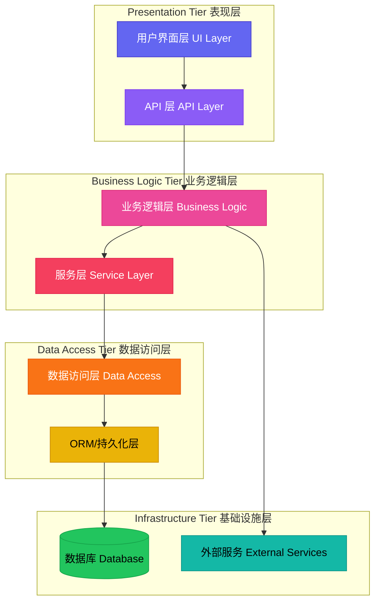

> **图 4-1：分层架构基本模型**
>
> 分层架构中，数据流自顶向下流动：用户请求从表现层进入，穿越业务逻辑层，最终到达数据访问层；响应则反向传递。

### 4.1.3 依赖方向原则

分层架构的核心原则：**依赖只能指向内部**。外层可以依赖内层，但内层绝不能依赖外层。

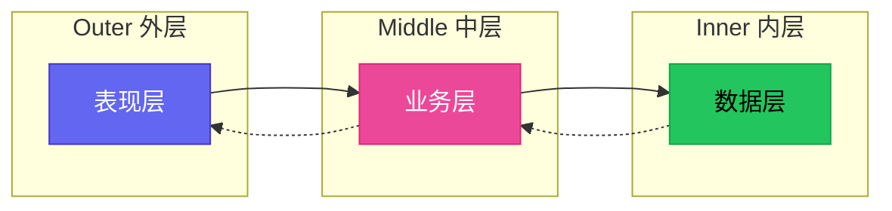

> **图 4-2：依赖方向原则**
>
> 实线表示编译时依赖，虚线表示运行时调用。业务层可以调用数据层，但业务层不应该知道数据层的具体实现类。

---

## 4.2 经典三层架构

三层架构（Three-Tier Architecture）是分层架构的经典形式，也是理解其他分层模式的基础。它将系统划分为：**表现层（Presentation Layer）**、**业务逻辑层（Business Logic Layer）**和**数据访问层（Data Access Layer）**。

### 4.3 三层架构详解

#### 4.3.1 表现层（Presentation Layer）

表现层是系统与用户交互的窗口，负责：

- 接收用户输入（如表单、API 请求）
- 格式化响应数据（如 HTML、JSON）
- 处理用户会话和状态
- 基础的数据验证（如必填项、格式校验）

**表现层不应包含**：
- 复杂的业务规则
- 数据访问逻辑
- 跨请求的业务状态

#### 4.3.2 业务逻辑层（Business Logic Layer）

业务逻辑层是系统的"大脑"，包含：

- 核心业务规则和校验
- 业务流程编排
- 事务管理
- 业务对象之间的协作

**业务逻辑层的特征**：
- 与表现层技术无关
- 与数据访问技术无关
- 是系统中最稳定的一层

#### 4.3.3 数据访问层（Data Access Layer）

数据访问层负责：

- 与数据库通信
- CRUD 操作（Create、Read、Update、Delete）
- SQL 语句管理
- ORM 映射

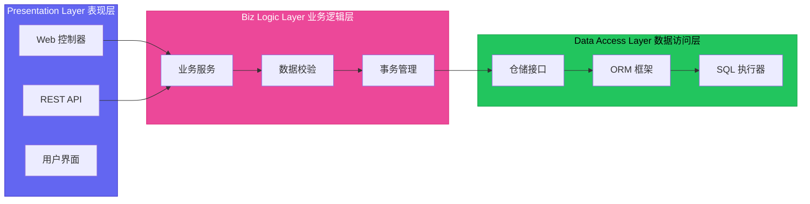

> **图 4-3：三层架构数据流**

### 4.4 四层架构

随着业务复杂度提升，三层架构演进为四层架构，新增**应用层（Application Layer）**来协调业务逻辑与具体用例。

#### 4.4.1 四层架构模型

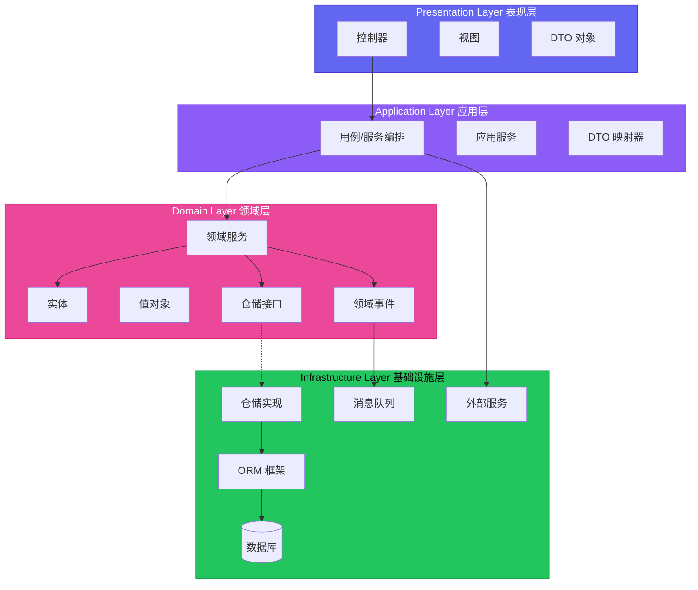

> **图 4-4：四层架构模型**
>
> 四层架构将业务逻辑进一步划分为**应用层**（处理用例编排）和**领域层**（包含核心业务模型和规则）。

#### 4.4.2 各层职责

| 层次 | 英文名 | 核心职责 | 不应包含 |
|------|--------|----------|----------|
| 表现层 | Presentation | 用户交互、请求路由、视图渲染 | 业务规则、SQL |
| 应用层 | Application | 用例编排、事务边界、DTO 映射 | 具体业务规则、数据格式 |
| 领域层 | Domain | 核心业务模型、业务规则、领域事件 | 技术实现、外部依赖 |
| 基础设施层 | Infrastructure | 技术实现、数据库访问、外部服务调用 | 业务规则 |

---

## 4.5 N层架构的演进

分层数量并非固定不变，而是根据业务复杂度和技术团队规模逐步演进。

### 4.5.1 演进路径


> **图 4-5：分层架构演进路径**

### 4.5.2 各层数适用场景

**一层架构（单体）**

所有代码运行在单一进程，技术栈统一。适用于小型项目、原型开发、教学演示。优点是简单，缺点是所有组件紧耦合。

**二层架构（客户端-服务端）**

客户端负责 UI 渲染，服务端处理业务和数据。最典型的例子是早期 JSP/PHP 应用。适用于互联网早期阶段。

**三层架构**

当前最主流的分层方式，适用于大多数企业级应用。是小型到中型项目的最佳选择。

**四层架构（DDD 分层）**

引入应用层和领域层分离，适用于复杂业务逻辑的中大型项目。是实施领域驱动设计（DDD）的基础架构。

**五层/六层架构**

在四层基础上进一步拆分，如将基础设施层分为 API 网关层、消息队列层、缓存层等。适用于超大型分布式系统。

---

## 4.6 分层架构的优缺点

### 4.6.1 优点

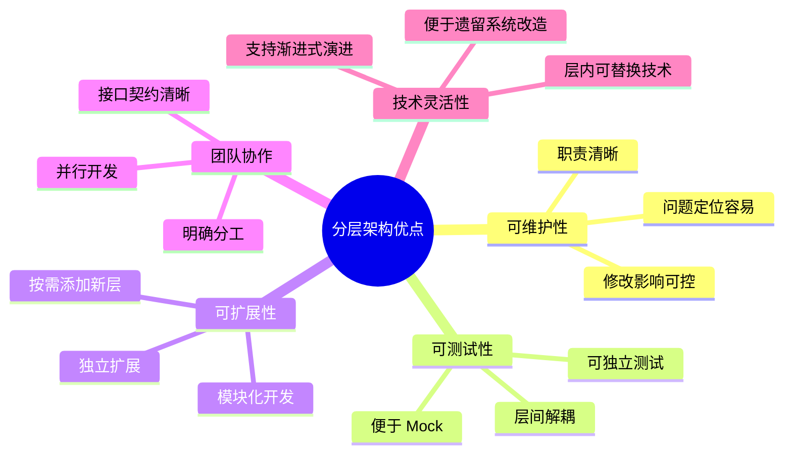

> **图 4-6：分层架构优点**

### 4.6.2 缺点

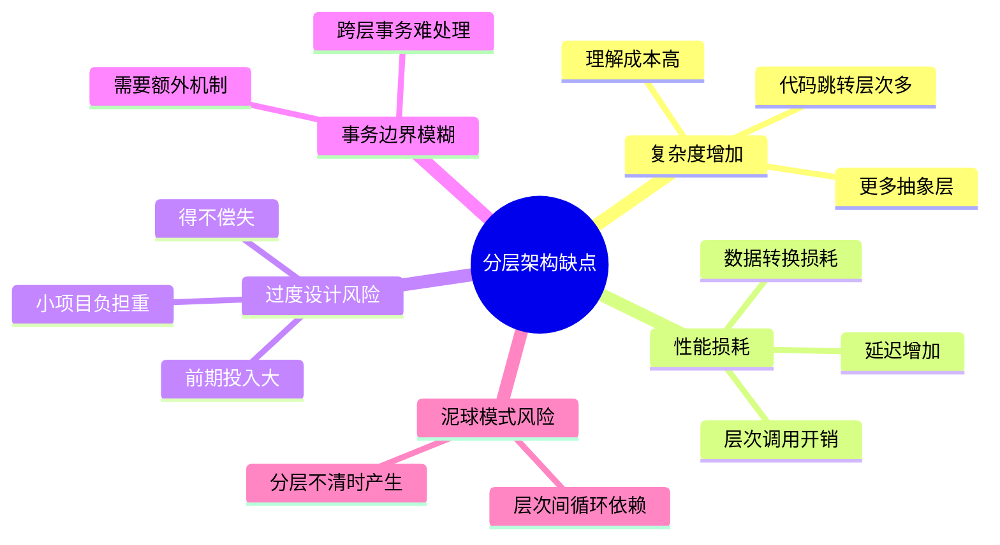

> **图 4-7：分层架构缺点**

### 4.6.3 常见反模式

**泥球模式（Ball of Mud）**

当分层规则被破坏，各层之间开始相互依赖、循环调用时，系统就会退化为难以维护的泥球。

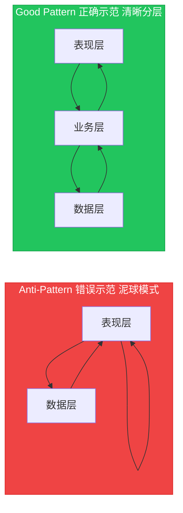

> **图 4-8：泥球模式 vs 清晰分层**

---

## 4.7 分层架构的适用场景

### 4.7.1 适合使用分层架构的场景

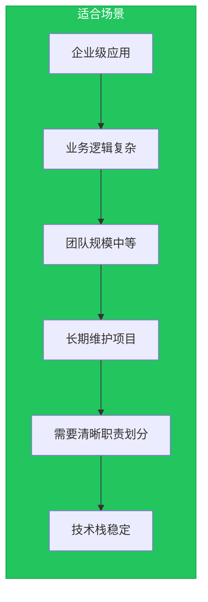

**企业级应用**

ERP、CRM、电商后台等系统，业务逻辑复杂，需要长期维护。分层架构能够有效管理复杂度，让不同技能栈的开发者协同工作。

**业务逻辑复杂的系统**

当业务规则多、校验逻辑复杂时，业务逻辑层的独立存在能让这些规则得到集中管理，便于审核和修改。

**团队规模中等的项目**

5-20人的团队，最适合分层架构。层次划分提供了天然的任务边界，团队成员可以专注于特定层次。

### 4.7.2 不适合使用分层架构的场景

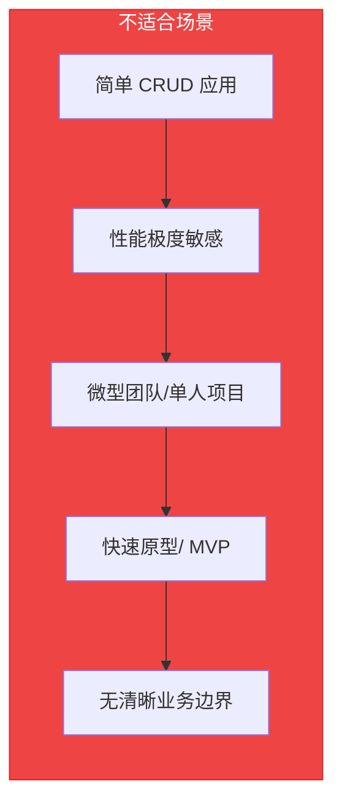

**简单 CRUD 应用**

如果系统只是简单的增删改查，分层带来的复杂度可能超过其价值。考虑使用更扁平的架构。

**性能极度敏感的场景**

分层带来的调用开销可能成为瓶颈。某些高频交易系统、微服务核心路径可能需要更扁平的结构。

---

## 4.8 工程实践案例

### 4.8.1 Java Spring Boot 项目结构

以下是一个采用四层架构的 Spring Boot 项目结构：

```plaintext
src/main/java/com/example/myapp/
├── MyApplication.java                 # 应用入口
│
├── controller/                        # 表现层：处理请求/响应
│   ├── UserController.java
│   ├── OrderController.java
│   └── ProductController.java
│
├── dto/                               # 数据传输对象
│   ├── request/
│   │   ├── CreateUserRequest.java
│   │   └── OrderRequest.java
│   └── response/
│       ├── UserResponse.java
│       └── OrderResponse.java
│
├── service/                           # 应用层：用例编排
│   ├── UserService.java
│   ├── OrderService.java
│   └── impl/
│       ├── UserServiceImpl.java
│       └── OrderServiceImpl.java
│
├── domain/                            # 领域层：核心业务模型
│   ├── entity/
│   │   ├── User.java
│   │   ├── Order.java
│   │   └── OrderItem.java
│   ├── vo/
│   │   ├── Money.java
│   │   └── Address.java
│   ├── repository/                    # 仓储接口（属于领域层）
│   │   ├── UserRepository.java
│   │   └── OrderRepository.java
│   ├── service/                       # 领域服务
│   │   └── PricingService.java
│   └── event/
│       ├── UserRegisteredEvent.java
│       └── OrderPlacedEvent.java
│
├── infrastructure/                    # 基础设施层：技术实现
│   ├── persistence/
│   │   ├── jpa/
│   │   │   ├── JpaUserRepository.java
│   │   │   └── JpaOrderRepository.java
│   │   └── mapper/
│   │       └── UserMapper.java
│   ├── external/
│   │   └── PaymentGatewayClient.java
│   └── messaging/
│       └── EventPublisher.java
│
└── config/                            # 配置层
    ├── WebConfig.java
    └── SecurityConfig.java
```

#### 关键代码示例

**领域层 - 实体与仓储接口**

```java
// domain/entity/User.java
package com.example.myapp.domain.entity;

import java.time.LocalDateTime;
import java.util.ArrayList;
import java.util.List;

public class User {
    private Long id;
    private String username;
    private String email;
    private LocalDateTime createdAt;
    private List<Order> orders = new ArrayList<>();

    // 工厂方法：创建新用户
    public static User create(String username, String email) {
        if (username == null || username.isBlank()) {
            throw new IllegalArgumentException("用户名不能为空");
        }
        if (email == null || !email.contains("@")) {
            throw new IllegalArgumentException("邮箱格式不正确");
        }

        User user = new User();
        user.username = username;
        user.email = email;
        user.createdAt = LocalDateTime.now();
        return user;
    }

    // 领域逻辑：验证用户状态
    public boolean canPlaceOrder() {
        return this.createdAt != null; // 示例逻辑
    }

    // Getter 方法
    public Long getId() { return id; }
    public String getUsername() { return username; }
    public String getEmail() { return email; }
    public LocalDateTime getCreatedAt() { return createdAt; }
    public List<Order> getOrders() { return orders; }

    // 受保护的 setter，仅供仓储使用
    protected void setId(Long id) { this.id = id; }
}
```

```java
// domain/repository/UserRepository.java
package com.example.myapp.domain.repository;

import com.example.myapp.domain.entity.User;
import java.util.Optional;

public interface UserRepository {
    Optional<User> findById(Long id);
    Optional<User> findByUsername(String username);
    Optional<User> findByEmail(String email);
    User save(User user);
    void delete(User user);
}
```

**领域层 - 领域服务**

```java
// domain/service/PricingService.java
package com.example.myapp.domain.service;

import com.example.myapp.domain.entity.Order;
import com.example.myapp.domain.vo.Money;
import org.springframework.stereotype.Service;

@Service
public class PricingService {

    // 核心定价逻辑，不依赖任何技术框架
    public Money calculateOrderTotal(Order order) {
        Money subtotal = order.getItems().stream()
            .map(item -> item.getPrice().multiply(item.getQuantity()))
            .reduce(Money.ZERO, Money::add);

        Money discount = applyDiscount(subtotal, order.getUser());
        return subtotal.subtract(discount);
    }

    private Money applyDiscount(Money subtotal, User user) {
        // VIP 用户享受 5% 折扣
        if (user.isVip()) {
            return subtotal.multiply(0.05);
        }
        return Money.ZERO;
    }
}
```

**应用层 - 服务实现**

```java
// service/impl/UserServiceImpl.java
package com.example.myapp.service.impl;

import com.example.myapp.domain.entity.User;
import com.example.myapp.domain.event.UserRegisteredEvent;
import com.example.myapp.domain.repository.UserRepository;
import com.example.myapp.dto.request.CreateUserRequest;
import com.example.myapp.dto.response.UserResponse;
import com.example.myapp.service.UserService;
import com.example.myapp.infrastructure.messaging.EventPublisher;
import org.springframework.stereotype.Service;
import org.springframework.transaction.annotation.Transactional;

@Service
public class UserServiceImpl implements UserService {

    private final UserRepository userRepository;
    private final EventPublisher eventPublisher;

    public UserServiceImpl(UserRepository userRepository, EventPublisher eventPublisher) {
        this.userRepository = userRepository;
        this.eventPublisher = eventPublisher;
    }

    @Override
    @Transactional
    public UserResponse createUser(CreateUserRequest request) {
        // 1. 创建领域对象（触发领域校验）
        User user = User.create(request.getUsername(), request.getEmail());

        // 2. 保存
        User savedUser = userRepository.save(user);

        // 3. 发布领域事件
        eventPublisher.publish(new UserRegisteredEvent(savedUser.getId()));

        // 4. 返回 DTO
        return toResponse(savedUser);
    }

    @Override
    public UserResponse getUserById(Long id) {
        User user = userRepository.findById(id)
            .orElseThrow(() -> new UserNotFoundException(id));
        return toResponse(user);
    }

    private UserResponse toResponse(User user) {
        return new UserResponse(
            user.getId(),
            user.getUsername(),
            user.getEmail(),
            user.getCreatedAt()
        );
    }
}
```

**表现层 - 控制器**

```java
// controller/UserController.java
package com.example.myapp.controller;

import com.example.myapp.dto.request.CreateUserRequest;
import com.example.myapp.dto.response.UserResponse;
import com.example.myapp.service.UserService;
import org.springframework.http.HttpStatus;
import org.springframework.web.bind.annotation.*;

@RestController
@RequestMapping("/api/users")
public class UserController {

    private final UserService userService;

    public UserController(UserService userService) {
        this.userService = userService;
    }

    @PostMapping
    @ResponseStatus(HttpStatus.CREATED)
    public UserResponse createUser(@RequestBody @Valid CreateUserRequest request) {
        return userService.createUser(request);
    }

    @GetMapping("/{id}")
    public UserResponse getUser(@PathVariable Long id) {
        return userService.getUserById(id);
    }
}
```

**基础设施层 - JPA 仓储实现**

```java
// infrastructure/persistence/jpa/JpaUserRepository.java
package com.example.myapp.infrastructure.persistence.jpa;

import com.example.myapp.domain.entity.User;
import com.example.myapp.domain.repository.UserRepository;
import org.springframework.stereotype.Repository;

import java.util.Optional;

@Repository
public class JpaUserRepository implements UserRepository {

    private final SpringDataUserRepository springDataRepository;

    public JpaUserRepository(SpringDataUserRepository springDataRepository) {
        this.springDataRepository = springDataRepository;
    }

    @Override
    public Optional<User> findById(Long id) {
        return springDataRepository.findById(id);
    }

    @Override
    public Optional<User> findByUsername(String username) {
        return springDataRepository.findByUsername(username);
    }

    @Override
    public Optional<User> findByEmail(String email) {
        return springDataRepository.findByEmail(email);
    }

    @Override
    public User save(User user) {
        return springDataRepository.save(user);
    }

    @Override
    public void delete(User user) {
        springDataRepository.delete(user);
    }
}
```

### 4.8.2 Go 项目结构

以下是一个采用分层架构的 Go 项目结构：

```plaintext
myapp/
├── cmd/
│   └── server/
│       └── main.go                   # 应用入口
│
├── internal/
│   ├── handler/                      # 表现层：HTTP 处理
│   │   ├── user_handler.go
│   │   └── order_handler.go
│   │
│   ├── dto/                           # 数据传输对象
│   │   ├── request/
│   │   │   └── user_request.go
│   │   └── response/
│   │       └── user_response.go
│   │
│   ├── service/                      # 应用层：业务编排
│   │   ├── user_service.go
│   │   └── order_service.go
│   │
│   ├── domain/                       # 领域层：核心模型
│   │   ├── entity/
│   │   │   ├── user.go
│   │   │   └── order.go
│   │   ├── vo/
│   │   │   └── money.go
│   │   ├── repository/
│   │   │   ├── user_repository.go
│   │   │   └── order_repository.go
│   │   └── service/
│   │       └── pricing_service.go
│   │
│   └── infrastructure/               # 基础设施层
│       ├── persistence/
│       │   ├── mysql/
│       │   │   ├── user_repo.go
│       │   │   └── order_repo.go
│       │   └── mapper/
│       │       └── user_mapper.go
│       ├── external/
│       │   └── payment_client.go
│       └── messaging/
│           └── event_publisher.go
│
├── pkg/                              # 公共包
│   └── errors/
│       └── errors.go
│
├── go.mod
└── go.sum
```

#### 关键代码示例

**领域层 - 实体**

```go
// internal/domain/entity/user.go
package entity

import (
    "errors"
    "time"
)

var (
    ErrEmptyUsername = errors.New("username cannot be empty")
    ErrInvalidEmail   = errors.New("invalid email format")
)

// User 是用户领域实体
type User struct {
    id        int64
    username  string
    email     string
    createdAt time.Time
}

// NewUser 是 User 的工厂函数
func NewUser(username, email string) (*User, error) {
    if username == "" {
        return nil, ErrEmptyUsername
    }
    if email == "" || !contains(email, "@") {
        return nil, ErrInvalidEmail
    }

    return &User{
        username:  username,
        email:     email,
        createdAt: time.Now(),
    }, nil
}

// CanPlaceOrder 检查用户是否可以下单
func (u *User) CanPlaceOrder() bool {
    return u.createdAt.IsZero() == false
}

// Getters
func (u *User) ID() int64        { return u.id }
func (u *User) Username() string { return u.username }
func (u *User) Email() string    { return u.email }
func (u *User) CreatedAt() time.Time { return u.createdAt }

// SetID 提供给仓储层设置 ID
func (u *User) SetID(id int64) { u.id = id }
```

**领域层 - 仓储接口**

```go
// internal/domain/repository/user_repository.go
package repository

import "myapp/internal/domain/entity"

type UserRepository interface {
    FindByID(id int64) (*entity.User, error)
    FindByUsername(username string) (*entity.User, error)
    FindByEmail(email string) (*entity.User, error)
    Save(user *entity.User) error
    Delete(id int64) error
}
```

**领域层 - 领域服务**

```go
// internal/domain/service/pricing_service.go
package service

import (
    "myapp/internal/domain/entity"
    "myapp/internal/domain/vo"
)

type PricingService struct{}

func NewPricingService() *PricingService {
    return &PricingService{}
}

func (s *PricingService) CalculateOrderTotal(order *entity.Order) vo.Money {
    var subtotal vo.Money
    for _, item := range order.Items() {
        itemTotal := item.Price().Multiply(item.Quantity())
        subtotal = subtotal.Add(itemTotal)
    }

    discount := s.applyDiscount(subtotal, order.User())
    return subtotal.Subtract(discount)
}

func (s *PricingService) applyDiscount(subtotal vo.Money, user *entity.User) vo.Money {
    if user.IsVIP() {
        discount := subtotal.MultiplyFloat(0.05)
        return discount
    }
    return vo.Zero()
}
```

**应用层 - 服务实现**

```go
// internal/service/user_service.go
package service

import (
    "context"
    "myapp/internal/domain/entity"
    "myapp/internal/domain/event"
    "myapp/internal/domain/repository"
    "myapp/internal/dto/request"
    "myapp/internal/dto/response"
)

type UserService struct {
    userRepo      repository.UserRepository
    eventPublisher event.Publisher
}

func NewUserService(userRepo repository.UserRepository, ep event.Publisher) *UserService {
    return &UserService{
        userRepo:      userRepo,
        eventPublisher: ep,
    }
}

func (s *UserService) CreateUser(ctx context.Context, req *request.CreateUserRequest) (*response.UserResponse, error) {
    // 1. 创建领域对象
    user, err := entity.NewUser(req.Username, req.Email)
    if err != nil {
        return nil, err
    }

    // 2. 保存
    if err := s.userRepo.Save(user); err != nil {
        return nil, err
    }

    // 3. 发布领域事件
    s.eventPublisher.Publish(event.NewUserRegistered(user.ID()))

    // 4. 返回 DTO
    return &response.UserResponse{
        ID:        user.ID(),
        Username:  user.Username(),
        Email:     user.Email(),
        CreatedAt: user.CreatedAt(),
    }, nil
}

func (s *UserService) GetUser(ctx context.Context, id int64) (*response.UserResponse, error) {
    user, err := s.userRepo.FindByID(id)
    if err != nil {
        return nil, err
    }

    return &response.UserResponse{
        ID:        user.ID(),
        Username:  user.Username(),
        Email:     user.Email(),
        CreatedAt: user.CreatedAt(),
    }, nil
}
```

**表现层 - HTTP 处理器**

```go
// internal/handler/user_handler.go
package handler

import (
    "errors"
    "net/http"
    "strconv"

    "myapp/internal/dto/request"
    "myapp/internal/service"

    "github.com/labstack/echo/v4"
)

type UserHandler struct {
    userService *service.UserService
}

func NewUserHandler(us *service.UserService) *UserHandler {
    return &UserHandler{userService: us}
}

func (h *UserHandler) RegisterRoutes(e *echo.Echo) {
    g := e.Group("/api/users")
    g.POST("", h.CreateUser)
    g.GET("/:id", h.GetUser)
}

func (h *UserHandler) CreateUser(c echo.Context) error {
    var req request.CreateUserRequest
    if err := c.Bind(&req); err != nil {
        return c.JSON(http.StatusBadRequest, map[string]string{"error": "invalid request"})
    }

    resp, err := h.userService.CreateUser(c.Request().Context(), &req)
    if err != nil {
        return c.JSON(http.StatusInternalServerError, map[string]string{"error": err.Error()})
    }

    return c.JSON(http.StatusCreated, resp)
}

func (h *UserHandler) GetUser(c echo.Context) error {
    idStr := c.Param("id")
    id, err := strconv.ParseInt(idStr, 10, 64)
    if err != nil {
        return c.JSON(http.StatusBadRequest, map[string]string{"error": "invalid id"})
    }

    resp, err := h.userService.GetUser(c.Request().Context(), id)
    if err != nil {
        if errors.Is(err, repository.ErrUserNotFound) {
            return c.JSON(http.StatusNotFound, map[string]string{"error": "user not found"})
        }
        return c.JSON(http.StatusInternalServerError, map[string]string{"error": err.Error()})
    }

    return c.JSON(http.StatusOK, resp)
}
```

**基础设施层 - MySQL 仓储实现**

```go
// internal/infrastructure/persistence/mysql/user_repo.go
package mysql

import (
    "context"
    "database/sql"
    "myapp/internal/domain/entity"
    "myapp/internal/domain/repository"
    "myapp/internal/infrastructure/persistence/mapper"
)

type UserRepository struct {
    db     *sql.DB
    mapper *mapper.UserMapper
}

func NewUserRepository(db *sql.DB) *UserRepository {
    return &UserRepository{
        db:     db,
        mapper: mapper.NewUserMapper(),
    }
}

func (r *UserRepository) FindByID(ctx context.Context, id int64) (*entity.User, error) {
    row := r.db.QueryRowContext(ctx, "SELECT id, username, email, created_at FROM users WHERE id = ?", id)

    var idVal int64
    var username, email string
    var createdAt []byte

    err := row.Scan(&idVal, &username, &email, &createdAt)
    if err != nil {
        if errors.Is(err, sql.ErrNoRows) {
            return nil, repository.ErrUserNotFound
        }
        return nil, err
    }

    user, err := entity.NewUser(username, email)
    if err != nil {
        return nil, err
    }
    user.SetID(idVal)

    return user, nil
}

func (r *UserRepository) Save(ctx context.Context, user *entity.User) error {
    query := "INSERT INTO users (username, email, created_at) VALUES (?, ?, ?)"
    result, err := r.db.ExecContext(ctx, query, user.Username(), user.Email(), user.CreatedAt())
    if err != nil {
        return err
    }

    id, err := result.LastInsertId()
    if err != nil {
        return err
    }
    user.SetID(id)

    return nil
}

func (r *UserRepository) FindByUsername(ctx context.Context, username string) (*entity.User, error) {
    row := r.db.QueryRowContext(ctx, "SELECT id, username, email, created_at FROM users WHERE username = ?", username)

    var idVal int64
    var usernameVal, emailVal string
    var createdAt []byte

    err := row.Scan(&idVal, &usernameVal, &emailVal, &createdAt)
    if err != nil {
        if errors.Is(err, sql.ErrNoRows) {
            return nil, repository.ErrUserNotFound
        }
        return nil, err
    }

    user, err := entity.NewUser(usernameVal, emailVal)
    if err != nil {
        return nil, err
    }
    user.SetID(idVal)

    return user, nil
}
```

---

## 4.9 分层原则与依赖规则

### 4.9.1 核心依赖规则

分层架构的灵魂在于依赖规则。Robert C. Martin 在《架构整洁之道》中提出的**依赖原则**（Dependency Rule）是：

> 源代码中的依赖关系必须只指向内部，即指向更低层、更加通用的层次。

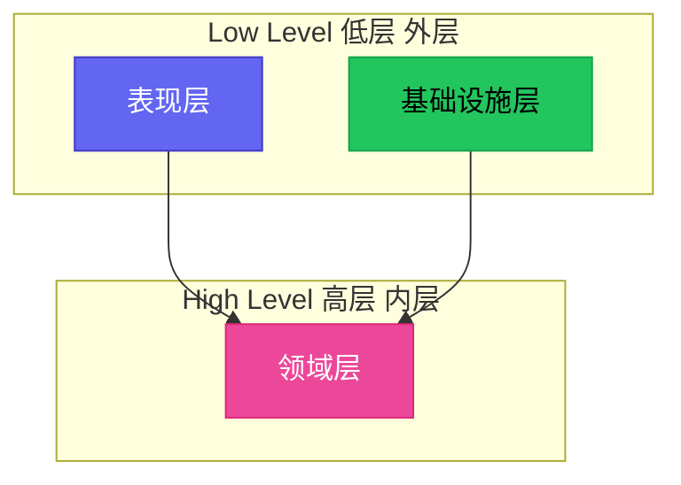

> **图 4-9：依赖方向**
>
> 外层可以依赖内层，内层绝不能依赖外层。这确保了核心业务逻辑的稳定性和可测试性。

### 4.9.2 依赖反转原则（DIP）

当业务逻辑层需要数据访问功能时，不应该直接依赖具体的数据库实现，而应该依赖一个抽象接口。

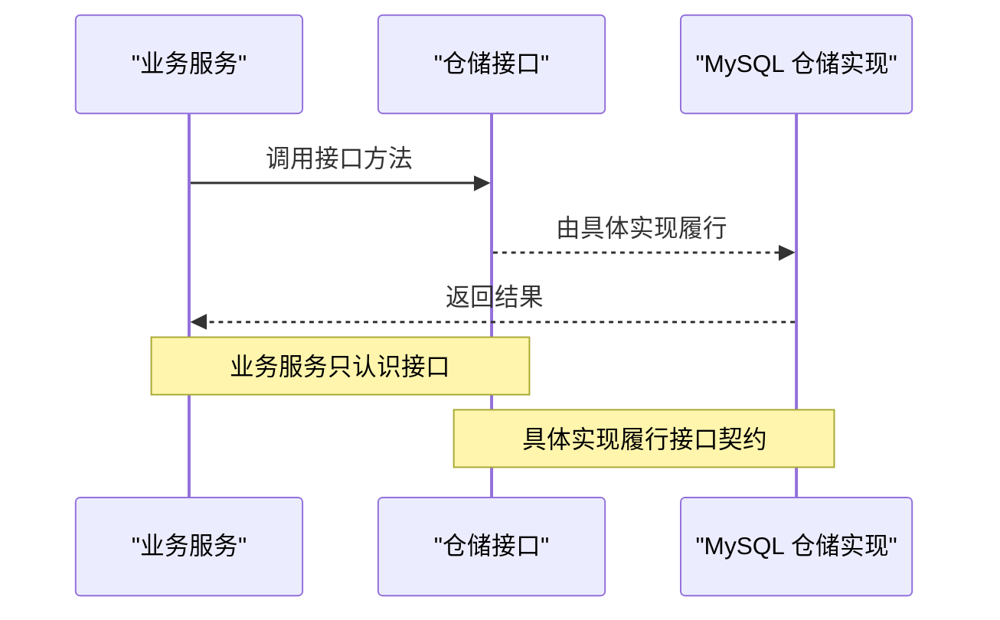

**传统方式的问题**：

```go
// ❌ 错误：直接依赖具体实现
func NewUserService(db *sql.DB) *UserService {
    return &UserService{db: db} // 业务层知道了 MySQL 的存在
}
```

**依赖反转的正确方式**：

```go
// ✅ 正确：依赖抽象接口
func NewUserService(repo repository.UserRepository) *UserService {
    return &UserService{repo: repo} // 只知道接口，不知道实现
}
```

### 4.9.3 各层具体原则

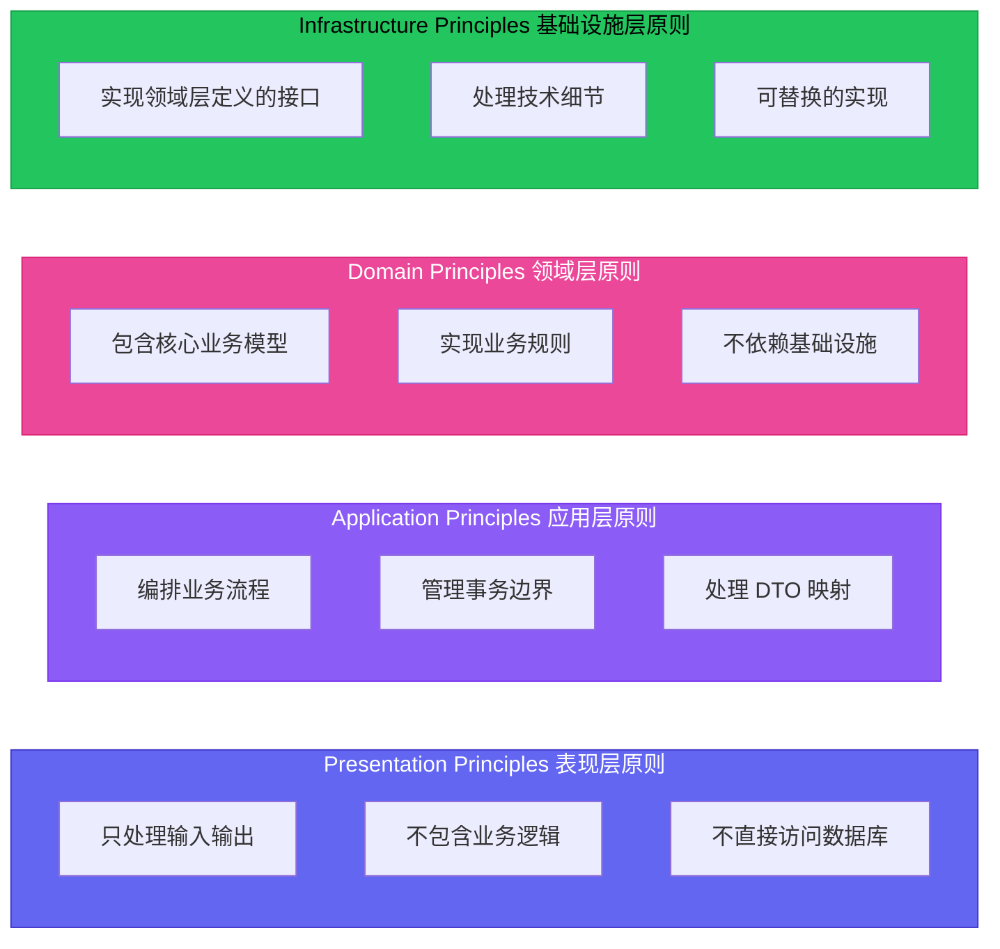

### 4.9.4 常见违规与修正

**违规 1：表现层直接调用仓储**

```java
// ❌ 违规：控制器直接访问仓储
@RestController
public class UserController {
    @Autowired
    private UserRepository userRepository; // 违规！

    @GetMapping("/users/{id}")
    public User getUser(@PathVariable Long id) {
        return userRepository.findById(id); // 表现层跳过了业务层
    }
}
```

```java
// ✅ 正确：通过服务层
@RestController
public class UserController {
    @Autowired
    private UserService userService;

    @GetMapping("/users/{id}")
    public UserResponse getUser(@PathVariable Long id) {
        return userService.getUser(id);
    }
}
```

**违规 2：业务层依赖具体技术**

```java
// ❌ 违规：业务层使用了 Spring 注解
@Service
public class UserService {
    @Autowired  // 违规！业务层依赖了 Spring
    private UserRepository userRepository;
}
```

```java
// ✅ 正确：通过构造函数注入
public class UserService {
    private final UserRepository userRepository;

    public UserService(UserRepository userRepository) {
        this.userRepository = userRepository; // 只依赖接口
    }
}
```

---

## 4.10 小结

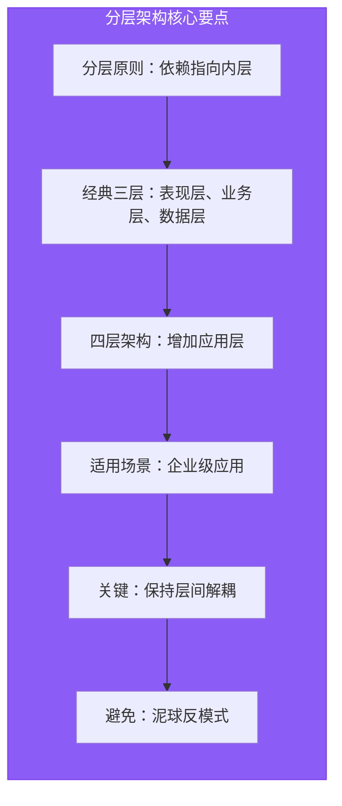

本章介绍了分层架构的核心概念、经典三层与四层架构的区别、N 层架构的演进路径，以及分层架构的优缺点和适用场景。通过 Java Spring Boot 和 Go 两个工程实践案例，展示了分层架构在实际项目中的落地方式。

下一章我们将探讨另一种重要的架构模式：**洋葱架构（Onion Architecture）**，它与分层架构共享一些理念，但在依赖方向上有着更为严格的约束。
