# 第五章：微服务架构

## 目录

1. [微服务架构概述](#1-微服务架构概述)
2. [微服务 vs 单体架构对比](#2-微服务-vs-单体架构对比)
3. [微服务设计原则](#3-微服务设计原则)
4. [微服务基础设施](#4-微服务基础设施)
5. [服务间通信](#5-服务间通信)
6. [微服务治理](#6-微服务治理)
7. [工程案例：电商系统微服务拆分](#7-工程案例电商系统微服务拆分)

---

## 1. 微服务架构概述

### 1.1 什么是微服务架构

微服务架构（Microservices Architecture）是一种将应用程序拆分为一组小型、自治服务的软件架构风格。每个服务运行在独立的进程中，通过轻量级通信机制（通常是HTTP REST API或消息队列）进行交互。每个服务围绕特定业务领域构建，可以独立部署、扩展和更新。

### 1.2 微服务核心特征

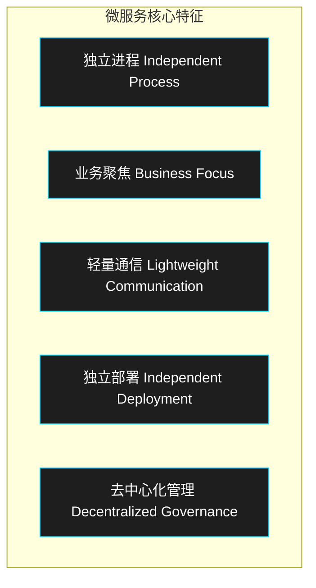
```mermaid
graph TB
    subgraph "微服务核心特征"
        A1["独立进程 Independent Process"]
        A2["业务聚焦 Business Focus"]
        A3["轻量通信 Lightweight Communication"]
        A4["独立部署 Independent Deployment"]
        A5["去中心化管理 Decentralized Governance"]
    end

    style A1 fill:#1e1e1e,stroke:#00d9ff,color:#ffffff
    style A2 fill:#1e1e1e,stroke:#00d9ff,color:#ffffff
    style A3 fill:#1e1e1e,stroke:#00d9ff,color:#ffffff
    style A4 fill:#1e1e1e,stroke:#00d9ff,color:#ffffff
    style A5 fill:#1e1e1e,stroke:#00d9ff,color:#ffffff
```

### 1.3 微服务架构全景图

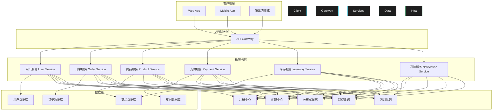
```mermaid
flowchart TB
    subgraph "客户端层"
        C1["Web App"]
        C2["Mobile App"]
        C3["第三方集成"]
    end

    subgraph "API网关层"
        GW["API Gateway"]
    end

    subgraph "微服务层"
        S1["用户服务 User Service"]
        S2["订单服务 Order Service"]
        S3["商品服务 Product Service"]
        S4["支付服务 Payment Service"]
        S5["库存服务 Inventory Service"]
        S6["通知服务 Notification Service"]
    end

    subgraph "数据层"
        D1["用户数据库"]
        D2["订单数据库"]
        D3["商品数据库"]
        D4["支付数据库"]
    end

    subgraph "基础设施层"
        MQ["消息队列"]
        CD["配置中心"]
        RD["注册中心"]
        DL["分布式日志"]
        MT["监控追踪"]
    end

    C1 & C2 & C3 --> GW
    GW --> S1 & S2 & S3 & S4 & S5 & S6
    S1 --> D1
    S2 --> D2
    S3 --> D3
    S4 --> D4
    S5 --> D3
    S6 --> MQ

    S1 & S2 & S3 & S4 & S5 & S6 --> RD
    S1 & S2 & S3 & S4 & S5 & S6 --> CD
    S1 & S2 & S3 & S4 & S5 & S6 --> DL
    S1 & S2 & S3 & S4 & S5 & S6 --> MT

    S2 --> MQ
    S4 --> MQ

    style Client fill:#1e1e1e,stroke:#00d9ff,color:#ffffff
    style Gateway fill:#1e1e1e,stroke:#00d9ff,color:#ffffff
    style Services fill:#1e1e1e,stroke:#00d9ff,color:#ffffff
    style Data fill:#1e1e1e,stroke:#e94560,color:#ffffff
    style Infra fill:#1e1e1e,stroke:#53d28a,color:#ffffff
```

---

## 2. 微服务 vs 单体架构对比

### 2.1 架构形态对比

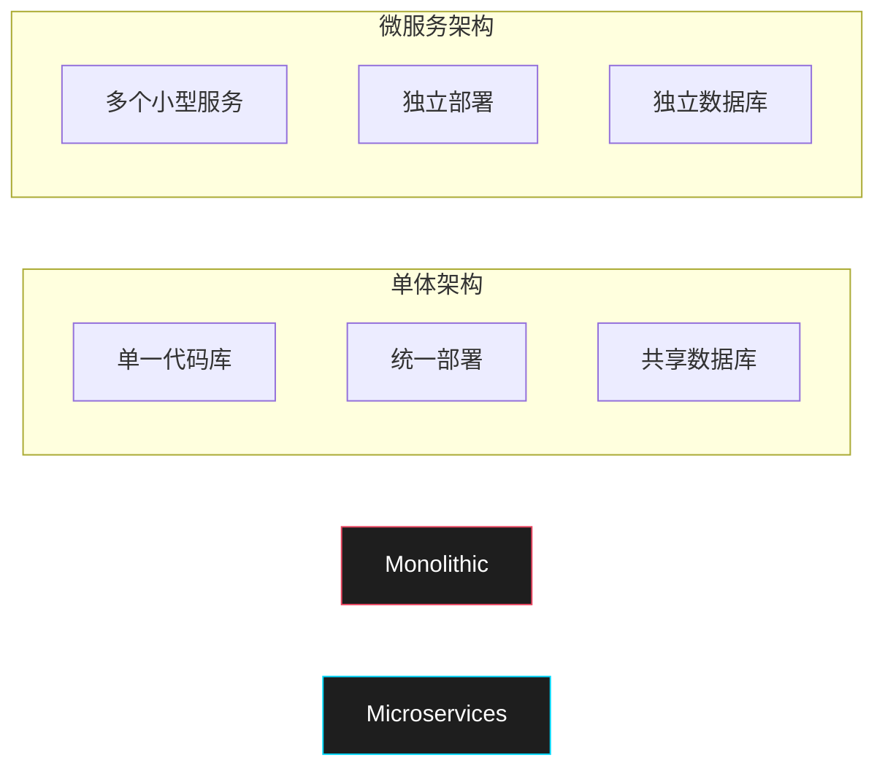
```mermaid
flowchart LR
    subgraph "单体架构"
        M1["单一代码库"]
        M2["统一部署"]
        M3["共享数据库"]
    end

    subgraph "微服务架构"
        MS1["多个小型服务"]
        MS2["独立部署"]
        MS3["独立数据库"]
    end

    style Monolithic fill:#1e1e1e,stroke:#e94560,color:#ffffff
    style Microservices fill:#1e1e1e,stroke:#00d9ff,color:#ffffff
```

### 2.2 核心维度对比表

| 对比维度 | 单体架构 | 微服务架构 |
|---------|---------|-----------|
| **代码组织** | 单一代码库 | 多个独立代码库 |
| **部署方式** | 整体部署 | 独立部署 |
| **扩展方式** | 垂直扩展（复制整个应用） | 水平扩展（按需扩展单个服务） |
| **数据库** | 共享单一数据库 | 每个服务独立数据库 |
| **开发团队** | 大型团队 | 小型自治团队 |
| **技术栈** | 统一技术栈 | 可混合技术栈 |
| **部署复杂度** | 低 | 高 |
| **运维复杂度** | 低 | 高 |
| **故障隔离** | 差（单点故障） | 好（服务隔离） |
| **可扩展性** | 差 | 好 |
| **开发速度** | 早期快，后期慢 | 持续快速 |

### 2.3 微服务优势与挑战

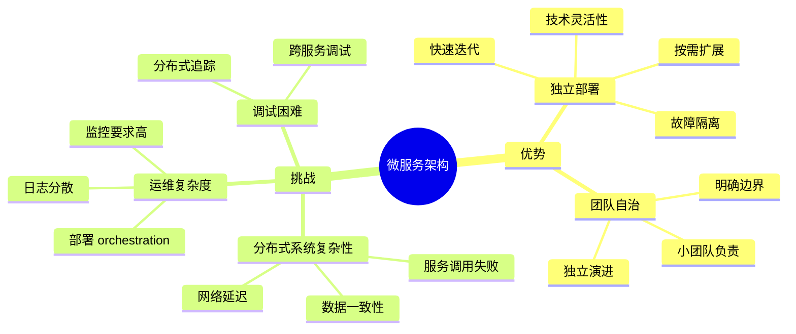
```mermaid
mindmap
  root((微服务架构))
    优势
      独立部署
        快速迭代
        故障隔离
        技术灵活性
        按需扩展
      团队自治
        小团队负责
        明确边界
        独立演进
    挑战
      分布式系统复杂性
        网络延迟
        数据一致性
        服务调用失败
      运维复杂度
        监控要求高
        日志分散
        部署 orchestration
      调试困难
        分布式追踪
        跨服务调试
```

### 2.4 架构演进路径


```mermaid
flowchart LR
    A["单体架构"] --> B["前后端分离"]
    B --> C["服务化拆分 SOA"]
    C --> D["微服务架构"]
    D --> E["云原生架构"]

    style A fill:#1e1e1e,stroke:#e94560,color:#ffffff
    style B fill:#1e1e1e,stroke:#f39c12,color:#ffffff
    style C fill:#1e1e1e,stroke:#9b59b6,color:#ffffff
    style D fill:#1e1e1e,stroke:#00d9ff,color:#ffffff
    style E fill:#1e1e1e,stroke:#53d28a,color:#ffffff
```

---

## 3. 微服务设计原则

### 3.1 单一职责原则（SRP）

每个微服务只负责一个业务功能域，具有明确的边界和职责。

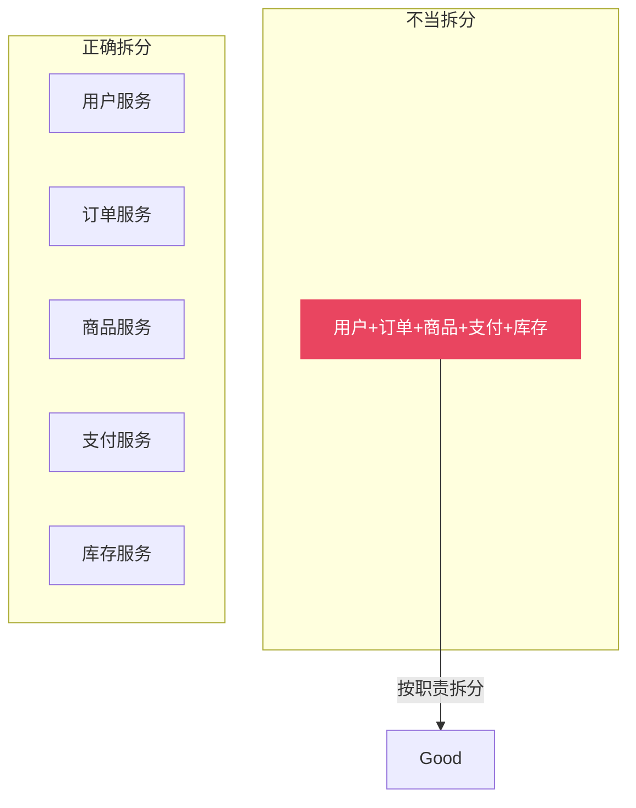
```mermaid
flowchart TB
    subgraph "不当拆分"
        B1["用户+订单+商品+支付+库存"]
        style B1 fill:#e94560,stroke:#e94560,color:#ffffff
    end

    subgraph "正确拆分"
        G1["用户服务"]
        G2["订单服务"]
        G3["商品服务"]
        G4["支付服务"]
        G5["库存服务"]
    end

    B1 -->|"按职责拆分"| Good
```

**示例代码：Java Spring Boot**

```java
// 用户服务 - 单一职责：只处理用户相关业务
@Service
@Transactional
public class UserService {
    
    private final UserRepository userRepository;
    private final UserMapper userMapper;
    
    public UserService(UserRepository userRepository, UserMapper userMapper) {
        this.userRepository = userRepository;
        this.userMapper = userMapper;
    }
    
    public UserDTO createUser(CreateUserRequest request) {
        // 只处理用户创建逻辑
        validateUserRequest(request);
        User user = userMapper.toEntity(request);
        return userMapper.toDTO(userRepository.save(user));
    }
    
    public UserDTO getUserById(Long id) {
        return userRepository.findById(id)
            .map(userMapper::toDTO)
            .orElseThrow(() -> new UserNotFoundException(id));
    }
    
    public Page<UserDTO> searchUsers(UserSearchCriteria criteria) {
        // 只处理用户搜索逻辑
        return userRepository.search(criteria)
            .map(userMapper::toDTO);
    }
}
```

```java
// 订单服务 - 单一职责：只处理订单相关业务
@Service
@Transactional
public class OrderService {
    
    private final OrderRepository orderRepository;
    private final OrderMapper orderMapper;
    private final ProductClient productClient;  // 外部调用
    private final PaymentClient paymentClient;  // 外部调用
    
    public OrderDTO createOrder(CreateOrderRequest request) {
        // 订单创建逻辑
        validateOrderRequest(request);
        
        // 调用商品服务校验库存
        productClient.verifyInventory(request.getItems());
        
        Order order = orderMapper.toEntity(request);
        order.setStatus(OrderStatus.PENDING);
        
        return orderMapper.toDTO(orderRepository.save(order));
    }
    
    public OrderDTO updateOrderStatus(Long orderId, OrderStatus status) {
        // 只处理订单状态更新
        Order order = orderRepository.findById(orderId)
            .orElseThrow(() -> new OrderNotFoundException(orderId));
        
        order.setStatus(status);
        return orderMapper.toDTO(orderRepository.save(order));
    }
}
```

### 3.2 领域驱动设计（DDD）

DDD 通过限界上下文（Bounded Context）和聚合（Aggregate）来划分微服务边界。

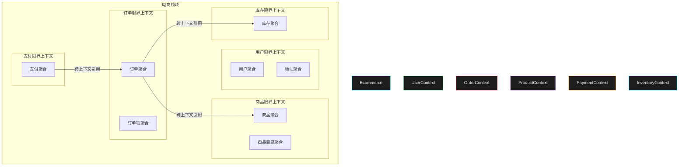
```mermaid
flowchart TB
    subgraph "电商领域"
        subgraph "用户限界上下文"
            UC["用户聚合"]
            UA["地址聚合"]
        end

        subgraph "订单限界上下文"
            OC["订单聚合"]
            OL["订单项聚合"]
        end

        subgraph "商品限界上下文"
            PC["商品聚合"]
            PI["商品目录聚合"]
        end

        subgraph "支付限界上下文"
            PayC["支付聚合"]
        end

        subgraph "库存限界上下文"
            IC["库存聚合"]
        end
    end

    OC -->|"跨上下文引用"| PC
    OC -->|"跨上下文引用"| IC
    PayC -->|"跨上下文引用"| OC

    style Ecommerce fill:#1e1e1e,stroke:#00d9ff,color:#ffffff
    style UserContext fill:#1e1e1e,stroke:#53d28a,color:#ffffff
    style OrderContext fill:#1e1e1e,stroke:#e94560,color:#ffffff
    style ProductContext fill:#1e1e1e,stroke:#9b59b6,color:#ffffff
    style PaymentContext fill:#1e1e1e,stroke:#f39c12,color:#ffffff
    style InventoryContext fill:#1e1e1e,stroke:#00d9ff,color:#ffffff
```

**DDD 分层架构代码示例：**

```java
// 领域层 - 核心业务逻辑（独立于基础设施）
package com.ecommerce.order.domain;

public class Order {
    
    private OrderId id;
    private CustomerId customerId;
    private List<OrderItem> items;
    private OrderStatus status;
    private Money totalAmount;
    private ShippingAddress shippingAddress;
    
    // 工厂方法 - 确保聚合根创建的一致性
    public static Order create(CustomerId customerId, ShippingAddress address) {
        Order order = new Order();
        order.id = OrderId.generate();
        order.customerId = customerId;
        order.items = new ArrayList<>();
        order.status = OrderStatus.DRAFT;
        order.shippingAddress = address;
        order.totalAmount = Money.ZERO;
        return order;
    }
    
    // 聚合根的业务方法 - 确保业务规则不被违反
    public void addItem(ProductId productId, Money price, int quantity) {
        if (this.status != OrderStatus.DRAFT) {
            throw new OrderException("Cannot add items to non-draft order");
        }
        
        OrderItem item = OrderItem.create(productId, price, quantity);
        this.items.add(item);
        this.totalAmount = this.totalAmount.add(item.getSubtotal());
    }
    
    public void submit() {
        if (this.items.isEmpty()) {
            throw new OrderException("Cannot submit empty order");
        }
        this.status = OrderStatus.SUBMITTED;
        // 发布领域事件
        DomainEvents.publish(new OrderSubmittedEvent(this.id));
    }
    
    // Getters only - 保护内部状态
    public OrderId getId() { return id; }
    public OrderStatus getStatus() { return status; }
    public Money getTotalAmount() { return totalAmount; }
}

// 值对象
public class Money {
    private final BigDecimal amount;
    private final Currency currency;
    
    public Money add(Money other) {
        if (!this.currency.equals(other.currency)) {
            throw new IllegalArgumentException("Cannot add money with different currencies");
        }
        return new Money(this.amount.add(other.amount), this.currency);
    }
}
```

```java
// 应用层 - 编排领域对象和外部服务
package com.ecommerce.order.application;

@Service
public class OrderApplicationService {
    
    private final OrderRepository orderRepository;
    private final ProductService productService;  // 外部服务
    private final PaymentService paymentService;
    private final EventPublisher eventPublisher;
    
    @Transactional
    public OrderDTO createOrder(CreateOrderCommand command) {
        // 1. 创建订单聚合
        Order order = Order.create(
            CustomerId.of(command.getCustomerId()),
            ShippingAddress.of(command.getAddress())
        );
        
        // 2. 添加订单项
        for (OrderItemCommand item : command.getItems()) {
            // 调用商品服务获取价格
            Product product = productService.getProduct(item.getProductId());
            order.addItem(
                product.getId(),
                product.getPrice(),
                item.getQuantity()
            );
        }
        
        // 3. 提交订单
        order.submit();
        
        // 4. 保存
        orderRepository.save(order);
        
        // 5. 发布事件（异步处理库存扣减等）
        eventPublisher.publish(new OrderCreatedEvent(order));
        
        return OrderDTO.from(order);
    }
}
```

### 3.3 独立部署原则

每个微服务可以独立部署，不影响其他服务。

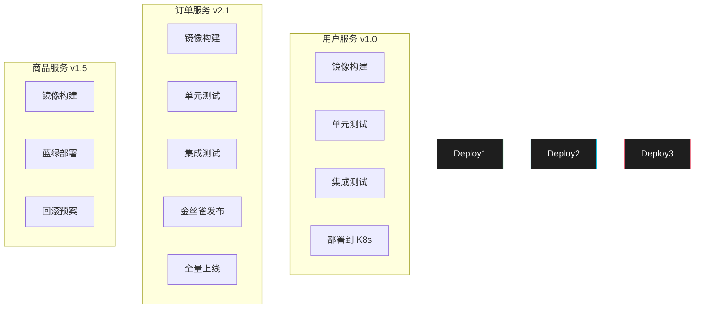
```mermaid
flowchart TB
    subgraph "用户服务 v1.0"
        D1["镜像构建"]
        D2["单元测试"]
        D3["集成测试"]
        D4["部署到 K8s"]
    end

    subgraph "订单服务 v2.1"
        D5["镜像构建"]
        D6["单元测试"]
        D7["集成测试"]
        D8["金丝雀发布"]
        D9["全量上线"]
    end

    subgraph "商品服务 v1.5"
        D10["镜像构建"]
        D11["蓝绿部署"]
        D12["回滚预案"]
    end

    style Deploy1 fill:#1e1e1e,stroke:#53d28a,color:#ffffff
    style Deploy2 fill:#1e1e1e,stroke:#00d9ff,color:#ffffff
    style Deploy3 fill:#1e1e1e,stroke:#e94560,color:#ffffff
```

**Dockerfile 示例：**

```dockerfile
# 用户服务 Dockerfile
FROM eclipse-temurin:17-jdk-alpine AS builder
WORKDIR /app
COPY pom.xml .
COPY src ./src
RUN apk add --no-cache maven && \
    mvn clean package -DskipTests

FROM eclipse-temurin:17-jre-alpine
WORKDIR /app
COPY --from=builder /app/target/user-service.jar app.jar

# 健康检查
HEALTHCHECK --interval=30s --timeout=3s \
    CMD wget --quiet --tries=1 --spider http://localhost:8080/actuator/health || exit 1

ENTRYPOINT ["java", "-jar", "-Xms256m", "-Xmx512m", "app.jar"]
```

```yaml
# Kubernetes 部署配置
apiVersion: apps/v1
kind: Deployment
metadata:
  name: user-service
  namespace: ecommerce
spec:
  replicas: 3
  selector:
    matchLabels:
      app: user-service
  template:
    metadata:
      labels:
        app: user-service
    spec:
      containers:
      - name: user-service
        image: registry.ecommerce.com/user-service:v1.0.0
        ports:
        - containerPort: 8080
        env:
        - name: SPRING_PROFILES_ACTIVE
          value: "production"
        - name: SPRING_DATASOURCE_URL
          valueFrom:
            secretKeyRef:
              name: db-secrets
              key: user-db-url
        resources:
          requests:
            memory: "256Mi"
            cpu: "200m"
          limits:
            memory: "512Mi"
            cpu: "500m"
        livenessProbe:
          httpGet:
            path: /actuator/health/liveness
            port: 8080
          initialDelaySeconds: 60
          periodSeconds: 10
        readinessProbe:
          httpGet:
            path: /actuator/health/readiness
            port: 8080
          initialDelaySeconds: 30
          periodSeconds: 5
```

---

## 4. 微服务基础设施

### 4.1 服务注册与发现

服务注册与发现是微服务架构的核心基础设施，让服务能够动态感知其他服务的位置。

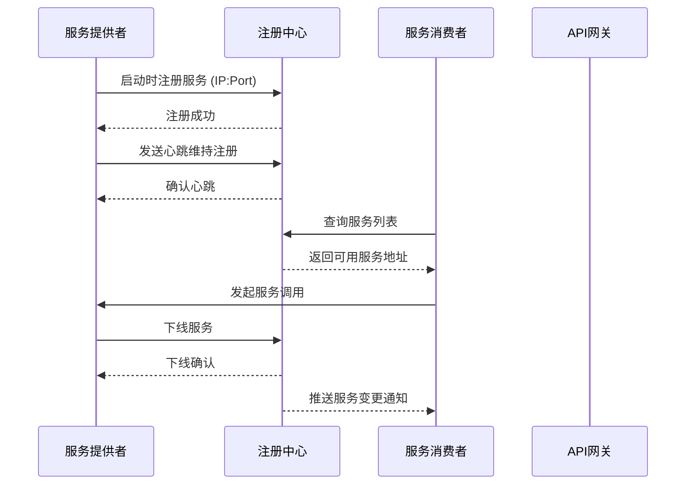
```mermaid
sequenceDiagram
    participant S1 as 服务提供者
    participant R as 注册中心
    participant S2 as 服务消费者
    participant GW as API网关
    
    S1->>R: 启动时注册服务 (IP:Port)
    R-->>S1: 注册成功
    S1->>R: 发送心跳维持注册
    R-->>S1: 确认心跳
    
    S2->>R: 查询服务列表
    R-->>S2: 返回可用服务地址
    S2->>S1: 发起服务调用
    
    S1->>R: 下线服务
    R-->>S1: 下线确认
    R-->>S2: 推送服务变更通知
```

**服务注册中心选择对比：**

| 特性 | Eureka | Consul | Nacos | etcd |
|-----|--------|--------|-------|------|
| **CAP理论** | AP | CP | CP/AP | CP |
| **多数据中心** | 支持 | 原生支持 | 支持 | 支持 |
| **健康检查** | 心跳 | TCP/HTTP | TCP/HTTP | TCP |
| **Kv存储** | 无 | 支持 | 支持 | 支持 |
| **成熟度** | 成熟(不再维护) | 成熟 | 成熟 | 成熟 |

**Consul 服务注册示例（Go）：**

```go
package main

import (
    "fmt"
    "net/http"
    "os"
    "time"
    
    "github.com/hashicorp/consul/api"
)

func main() {
    // 创建 Consul 客户端
    config := api.DefaultConfig()
    config.Address = os.Getenv("CONSUL_ADDR")
    client, err := api.NewClient(config)
    if err != nil {
        panic(err)
    }
    
    // 服务注册
    registration := &api.AgentServiceRegistration{
        ID:   "user-service-1",  // 唯一实例ID
        Name: "user-service",    // 服务名
        Tags: []string{"v1", "production"},
        Port: 8080,
        Address: getOutboundIP(),  // 自动获取IP
        Check: &api.AgentServiceCheck{
            HTTP: "http://localhost:8080/health",
            Interval: "10s",
            Timeout: "5s",
            DeregisterCriticalServiceAfter: "30s",
        },
        Meta: map[string]string{
            "version": "1.0.0",
            "region":  "us-east-1",
        },
    }
    
    if err := client.Agent().ServiceRegister(registration); err != nil {
        panic(err)
    }
    
    // 启动健康检查上报
    go heartbeat(client)
    
    <-make(chan struct{})
}

func heartbeat(client *api.Client) {
    ticker := time.NewTicker(5 * time.Second)
    for range ticker.C {
        // Consul 会自动调用健康检查端点
        // 这里可以手动更新服务元数据
        if err := client.Agent().UpdateTTL(
            "service:user-service-1",
            "ok",
            api.HealthPassing,
        ); err != nil {
            fmt.Printf("Failed to update heartbeat: %v\n", err)
        }
    }
}

func getOutboundIP() string {
    resp, _ := http.Get("https://api.ipify.org")
    defer resp.Body.Close()
    b := make([]byte, 20)
    resp.Read(b)
    return string(b)
}
```

**服务发现客户端示例（Spring Cloud）：**

```java
@Configuration
public class ServiceDiscoveryConfig {
    
    @Bean
    @LoadBalanced
    public RestTemplate restTemplate() {
        return new RestTemplate();
    }
    
    @Bean
    public WebClient.Builder webClientBuilder() {
        return WebClient.builder();
    }
}

// 服务调用示例
@Service
public class OrderServiceClient {
    
    private final RestTemplate restTemplate;
    
    // 通过服务名调用 - 底层通过 Ribbon/LoadBalancer 解析
    public UserDTO getUser(Long userId) {
        // user-service 是注册中心中的服务名
        return restTemplate.getForObject(
            "http://user-service/api/users/{id}",
            UserDTO.class,
            userId
        );
    }
    
    // 使用 WebClient（响应式）
    private final WebClient webClient;
    
    public Mono<UserDTO> getUserReactive(Long userId) {
        return webClient.get()
            .uri("http://user-service/api/users/{id}", userId)
            .retrieve()
            .bodyToMono(UserDTO.class);
    }
}
```

### 4.2 API网关

API网关是微服务的统一入口，处理认证、路由、限流等功能。

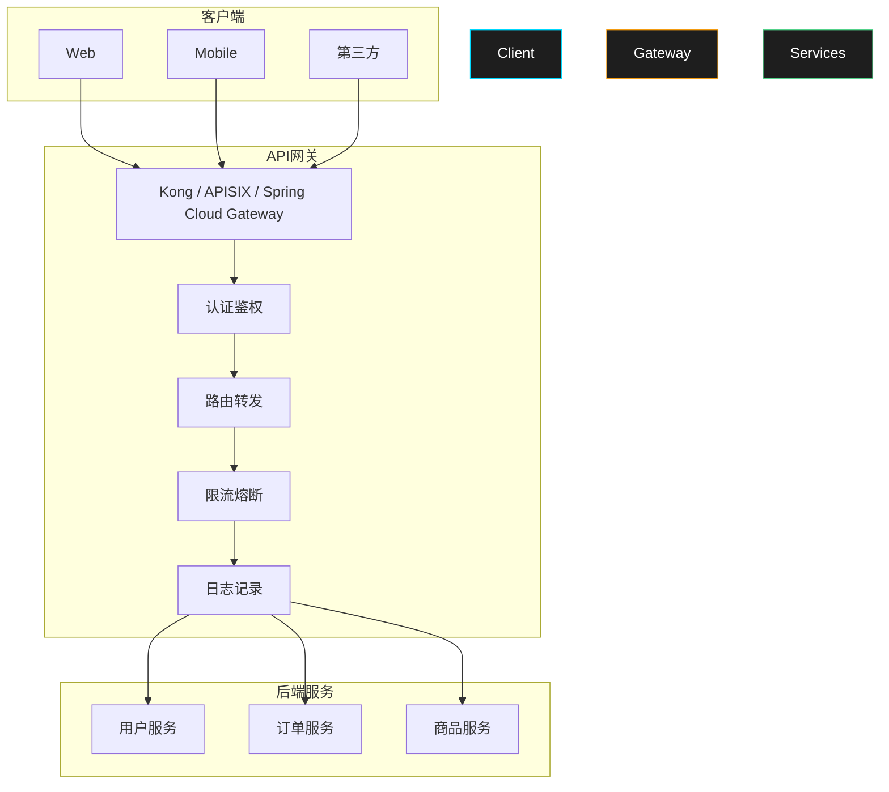
```mermaid
flowchart TB
    subgraph "客户端"
        W["Web"]
        M["Mobile"]
        B["第三方"]
    end

    subgraph "API网关"
        GW["Kong / APISIX / Spring Cloud Gateway"]
        Auth["认证鉴权"]
        Route["路由转发"]
        Limit["限流熔断"]
        Log["日志记录"]
    end

    subgraph "后端服务"
        S1["用户服务"]
        S2["订单服务"]
        S3["商品服务"]
    end

    W & M & B --> GW
    GW --> Auth --> Route --> Limit --> Log --> S1 & S2 & S3

    style Client fill:#1e1e1e,stroke:#00d9ff,color:#ffffff
    style Gateway fill:#1e1e1e,stroke:#f39c12,color:#ffffff
    style Services fill:#1e1e1e,stroke:#53d28a,color:#ffffff
```

**Spring Cloud Gateway 配置示例：**

```yaml
# application.yml
spring:
  application:
    name: api-gateway
  cloud:
    gateway:
      routes:
        # 用户服务路由
        - id: user-service
          uri: lb://user-service  # lb 表示负载均衡
          predicates:
            - Path=/api/users/**
          filters:
            - StripPrefix=1  # 去掉前缀
            - name: RequestRateLimiter
              args:
                redis-rate-limiter.replenishRate: 100
                redis-rate-limiter.burstCapacity: 200
            - name: CircuitBreaker
              args:
                name: userCircuitBreaker
                fallbackUri: forward:/fallback/user
        
        # 订单服务路由
        - id: order-service
          uri: lb://order-service
          predicates:
            - Path=/api/orders/**
          filters:
            - StripPrefix=1
            - name: Retry
              args:
                retries: 3
                statuses: BAD_GATEWAY, GATEWAY_TIMEOUT
        
        # 商品服务路由（可添加更多规则）
        - id: product-service
          uri: lb://product-service
          predicates:
            - Path=/api/products/**
          filters:
            - StripPrefix=1
      
      # 全局默认过滤器
      default-filters:
        - name: RequestLog
        - name: SecurityHeaders
    
    # Consul 作为服务发现源
    consul:
      host: localhost
      port: 8500
      discovery:
        prefer-ip-address: true
        health-check-path: /actuator/health
```

```java
// 自定义网关过滤器
@Component
public class AuthenticationFilter implements GlobalFilter, Ordered {
    
    private final JwtService jwtService;
    private final UserServiceClient userService;
    
    public AuthenticationFilter(JwtService jwtService, UserServiceClient userService) {
        this.jwtService = jwtService;
        this.userService = userService;
    }
    
    @Override
    public Mono<Void> filter(ServerWebExchange exchange, GatewayFilterChain chain) {
        String path = exchange.getRequest().getPath().value();
        
        // 跳过公开路径
        if (isPublicPath(path)) {
            return chain.filter(exchange);
        }
        
        String authHeader = exchange.getRequest().getHeaders().getFirst("Authorization");
        
        if (authHeader == null || !authHeader.startsWith("Bearer ")) {
            exchange.getResponse().setStatusCode(HttpStatus.UNAUTHORIZED);
            return exchange.getResponse().setComplete();
        }
        
        String token = authHeader.substring(7);
        
        try {
            Claims claims = jwtService.validateToken(token);
            
            // 将用户信息添加到请求头
            ServerHttpRequest mutatedRequest = exchange.getRequest().mutate()
                .header("X-User-Id", claims.getSubject())
                .header("X-User-Role", claims.get("role", String.class))
                .build();
            
            return chain.filter(
                exchange.mutate().request(mutatedRequest).build()
            );
            
        } catch (JwtException e) {
            exchange.getResponse().setStatusCode(HttpStatus.UNAUTHORIZED);
            return exchange.getResponse().setComplete();
        }
    }
    
    private boolean isPublicPath(String path) {
        return path.startsWith("/api/auth/") ||
               path.startsWith("/api/public/") ||
               path.equals("/health");
    }
    
    @Override
    public int getOrder() {
        return -100;  // 优先级最高
    }
}
```

### 4.3 配置中心

配置中心实现配置的集中管理和动态更新。

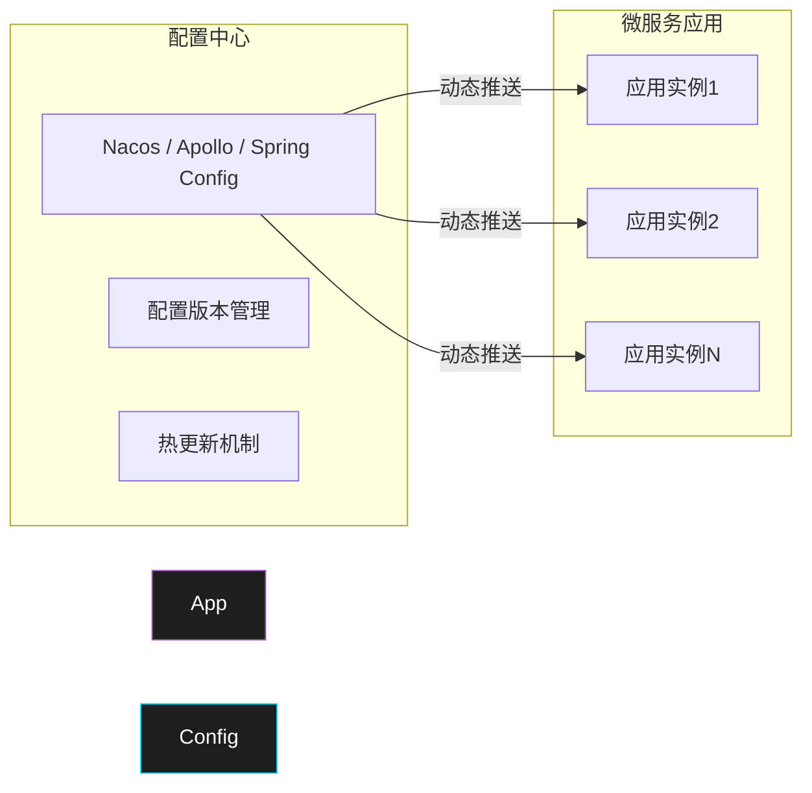
```mermaid
flowchart LR
    subgraph "微服务应用"
        A1["应用实例1"]
        A2["应用实例2"]
        A3["应用实例N"]
    end

    subgraph "配置中心"
        C1["Nacos / Apollo / Spring Config"]
        C2["配置版本管理"]
        C3["热更新机制"]
    end

    C1 -->|"动态推送"| A1 & A2 & A3

    style App fill:#1e1e1e,stroke:#9b59b6,color:#ffffff
    style Config fill:#1e1e1e,stroke:#00d9ff,color:#ffffff
```

**Nacos 配置示例：**

```java
// Spring Boot 配置： bootstrap.yml
spring:
  application:
    name: order-service
  cloud:
    nacos:
      config:
        server-addr: nacos-server:8848
        namespace: production
        group: DEFAULT_GROUP
        file-extension: yaml
        refreshable-dataids: common.yml  # 共享配置
        # 配置热更新
        refresh-enabled: true
```

```java
// 配置类示例
@Data
@Configuration
@ConfigurationProperties(prefix = "order")
@RefreshScope  // 启用热更新
public class OrderProperties {
    
    private int maxItemsPerOrder = 100;
    private Duration paymentTimeout = Duration.ofMinutes(15);
    private String inventoryServiceUrl;
    
    // 嵌套配置
    private DiscountPolicy discount = new DiscountPolicy();
    
    @Data
    public static class DiscountPolicy {
        private boolean enabled = true;
        private double minOrderAmountForDiscount = 100.0;
        private double discountRate = 0.1;
    }
}

// 使用配置
@Service
public class OrderService {
    
    @Autowired
    private OrderProperties orderProperties;
    
    public void createOrder() {
        if (orderProperties.getDiscount().isEnabled()) {
            // 应用折扣策略
        }
        // 配置变更时，属性会自动刷新
    }
}
```

```yaml
# Nacos 中的配置： order-service.yaml
order:
  max-items-per-order: 50
  payment-timeout: 20m
  inventory-service-url: http://inventory-service
  discount:
    enabled: true
    min-order-amount-for-discount: 200.0
    discount-rate: 0.15
```

### 4.4 分布式日志

微服务架构下日志分散在多个服务中，需要集中收集和分析。

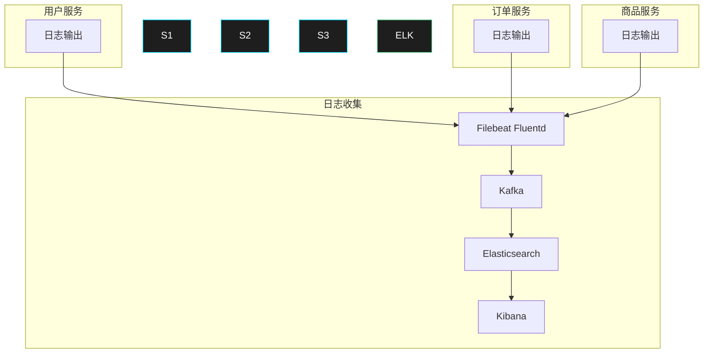
```mermaid
flowchart TB
    subgraph "用户服务"
        L1["日志输出"]
    end
    subgraph "订单服务"
        L2["日志输出"]
    end
    subgraph "商品服务"
        L3["日志输出"]
    end

    subgraph "日志收集"
        F["Filebeat Fluentd"]
        K["Kafka"]
        ES["Elasticsearch"]
        KI["Kibana"]
    end

    L1 & L2 & L3 --> F
    F --> K
    K --> ES
    ES --> KI

    style S1 fill:#1e1e1e,stroke:#00d9ff,color:#ffffff
    style S2 fill:#1e1e1e,stroke:#00d9ff,color:#ffffff
    style S3 fill:#1e1e1e,stroke:#00d9ff,color:#ffffff
    style ELK fill:#1e1e1e,stroke:#53d28a,color:#ffffff
```

**Logback 配置示例：**

```xml
<!-- logback-spring.xml -->
<?xml version="1.0" encoding="UTF-8"?>
<configuration>
    <springProperty scope="context" name="appName" source="spring.application.name"/>
    
    <!-- JSON 格式日志，便于 ELK 解析 -->
    <appender name="JSON_CONSOLE" class="ch.qos.logback.core.ConsoleAppender">
        <encoder class="net.logstash.logback.encoder.LogstashEncoder">
            <includeMdcKeyName>traceId</includeMdcKeyName>
            <includeMdcKeyName>userId</includeMdcKeyName>
            <includeMdcKeyName>spanId</includeMdcKeyName>
            <customFields>{"application":"${appName}"}</customFields>
        </encoder>
    </appender>
    
    <!-- 文件输出（供 Filebeat 收集） -->
    <appender name="JSON_FILE" class="ch.qos.logback.core.rolling.RollingFileAppender">
        <file>/var/log/${appName}/application.log</file>
        <rollingPolicy class="ch.qos.logback.core.rolling.TimeBasedRollingPolicy">
            <fileNamePattern>/var/log/${appName}/application.%d{yyyy-MM-dd}.log</fileNamePattern>
            <maxHistory>30</maxHistory>
        </rollingPolicy>
        <encoder class="net.logstash.logback.encoder.LogstashEncoder"/>
    </appender>
    
    <root level="INFO">
        <appender-ref ref="JSON_CONSOLE"/>
        <appender-ref ref="JSON_FILE"/>
    </root>
    
    <logger name="com.ecommerce" level="DEBUG"/>
</configuration>
```

```java
// Logback MDC 配置，添加链路追踪ID
@Configuration
public class MdcConfiguration {
    
    private final Tracer tracer;
    
    public MdcConfiguration(Tracer tracer) {
        this.tracer = tracer;
    }
    
    @Bean
    public FilterRegistrationBean<MdcFilter> mdcFilter() {
        return new FilterRegistrationBean<>(new MdcFilter(tracer));
    }
}

public class MdcFilter extends OncePerRequestFilter {
    
    private final Tracer tracer;
    
    public MdcFilter(Tracer tracer) {
        this.tracer = tracer;
    }
    
    @Override
    protected void doFilterInternal(HttpServletRequest request,
                                    HttpServletResponse response,
                                    FilterChain chain) throws ServletException, IOException {
        try {
            // 从请求头获取或生成 traceId
            String traceId = request.getHeader("X-Trace-Id");
            if (traceId == null) {
                traceId = UUID.randomUUID().toString();
            }
            
            MDC.put("traceId", traceId);
            response.setHeader("X-Trace-Id", traceId);
            
            // 获取 spanId
            Span currentSpan = tracer.currentSpan();
            if (currentSpan != null) {
                MDC.put("spanId", currentSpan.context().spanId());
            }
            
            chain.doFilter(request, response);
        } finally {
            MDC.clear();
        }
    }
}
```

### 4.5 监控与追踪

微服务监控包括三大支柱：指标（Metrics）、日志（Logs）、追踪（Traces）。

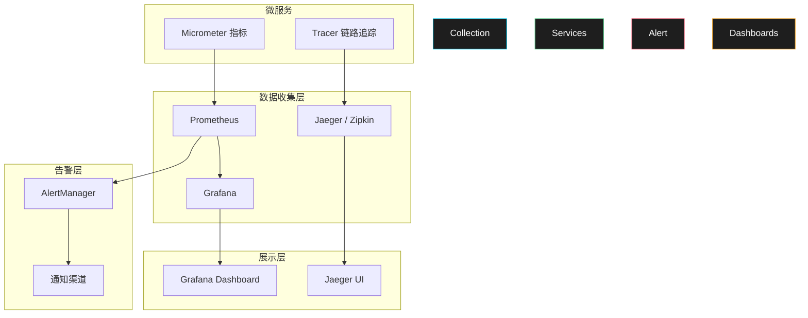
```mermaid
flowchart TB
    subgraph "数据收集层"
        P["Prometheus"]
        G["Grafana"]
        J["Jaeger / Zipkin"]
    end

    subgraph "微服务"
        ME["Micrometer 指标"]
        TR["Tracer 链路追踪"]
    end

    subgraph "告警层"
        AL["AlertManager"]
        NOT["通知渠道"]
    end

    subgraph "展示层"
        DA["Grafana Dashboard"]
        JA["Jaeger UI"]
    end

    ME --> P
    TR --> J
    P --> G
    G --> DA
    J --> JA
    P --> AL
    AL --> NOT

    style Collection fill:#1e1e1e,stroke:#00d9ff,color:#ffffff
    style Services fill:#1e1e1e,stroke:#53d28a,color:#ffffff
    style Alert fill:#1e1e1e,stroke:#e94560,color:#ffffff
    style Dashboards fill:#1e1e1e,stroke:#f39c12,color:#ffffff
```

**Prometheus + Micrometer 指标示例：**

```java
@Configuration
public class MetricsConfig {
    
    @Bean
    public MeterRegistry meterRegistry() {
        return new PrometheusMeterRegistry(PrometheusConfig.DEFAULT);
    }
}

@Service
public class OrderService {
    
    private final Counter orderCreatedCounter;
    private final Counter orderFailedCounter;
    private final Timer orderProcessingTimer;
    private final Gauge activeOrdersGauge;
    
    private final AtomicInteger activeOrders = new AtomicInteger(0);
    
    public OrderService(MeterRegistry registry) {
        // 订单创建计数器
        this.orderCreatedCounter = Counter.builder("order.created")
            .description("Number of orders created")
            .tag("service", "order-service")
            .register(registry);
        
        // 订单失败计数器
        this.orderFailedCounter = Counter.builder("order.failed")
            .description("Number of failed orders")
            .register(registry);
        
        // 订单处理耗时
        this.orderProcessingTimer = Timer.builder("order.processing")
            .description("Order processing time")
            .publishPercentiles(0.5, 0.95, 0.99)
            .register(registry);
        
        // 当前活跃订单数
        this.activeOrdersGauge = Gauge.builder("order.active", activeOrders, AtomicInteger::get)
            .description("Number of active orders")
            .register(registry);
    }
    
    public OrderDTO createOrder(CreateOrderRequest request) {
        activeOrders.incrementAndGet();
        
        try {
            return orderProcessingTimer.record(() -> {
                // 订单处理逻辑
                OrderDTO result = doCreateOrder(request);
                orderCreatedCounter.increment();
                return result;
            });
        } catch (Exception e) {
            orderFailedCounter.increment();
            throw e;
        } finally {
            activeOrders.decrementAndGet();
        }
    }
}
```

**分布式追踪示例（OpenTelemetry）：**

```java
@Configuration
public class TracingConfig {
    
    @Bean
    public OpenTelemetry openTelemetry() {
        // 配置 JaegerExporter
        JaegerExporter exporter = JaegerExporter.builder()
            .setEndpoint("http://jaeger:14250")
            .build();
        
        return OpenTelemetry.builder()
            .setTracerProvider(
                SdkTracerProvider.builder()
                    .addSpanProcessor(SimpleSpanProcessor.create(exporter))
                    .build()
            )
            .build();
    }
    
    @Bean
    public Tracer tracer(OpenTelemetry openTelemetry) {
        return openTelemetry.getTracer("order-service", "1.0.0");
    }
}

@Service
public class OrderService {
    
    private final Tracer tracer;
    private final RestTemplate restTemplate;
    
    public OrderService(Tracer tracer) {
        this.tracer = tracer;
        this.restTemplate = new RestTemplate();
    }
    
    public OrderDTO createOrder(CreateOrderRequest request) {
        // 创建新的 Span
        Span span = tracer.spanBuilder("createOrder")
            .setAttribute("customer.id", request.getCustomerId())
            .startSpan();
        
        try (Scope scope = span.makeCurrentScope()) {
            // 调用商品服务
            Span inventorySpan = tracer.spanBuilder("checkInventory")
                .startSpan();
            
            try (Scope inventoryScope = inventorySpan.makeCurrentScope()) {
                inventoryClient.verifyStock(request.getItems());
                inventorySpan.setAttribute("items.count", request.getItems().size());
            } finally {
                inventorySpan.end();
            }
            
            // 创建订单
            Order order = orderRepository.save(order);
            span.setAttribute("order.id", order.getId().toString());
            
            return toDTO(order);
            
        } catch (Exception e) {
            span.recordException(e);
            throw e;
        } finally {
            span.end();
        }
    }
}
```

---

## 5. 服务间通信

### 5.1 同步通信

#### 5.1.1 REST API

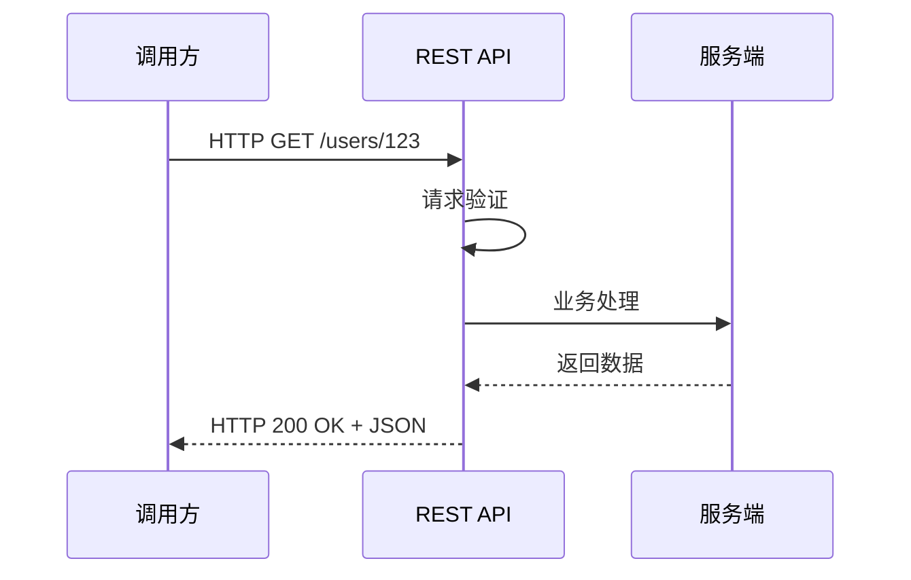
```mermaid
sequenceDiagram
    participant C as 调用方
    participant REST as REST API
    participant S as 服务端
    
    C->>REST: HTTP GET /users/123
    REST->>REST: 请求验证
    REST->>S: 业务处理
    S-->>REST: 返回数据
    REST-->>C: HTTP 200 OK + JSON
```

**REST API 规范示例（Spring Web）：**

```java
// 统一的 API 响应结构
@Data
public class ApiResponse<T> {
    private int code;
    private String message;
    private T data;
    private long timestamp;
    
    public static <T> ApiResponse<T> success(T data) {
        ApiResponse<T> response = new ApiResponse<>();
        response.setCode(200);
        response.setMessage("success");
        response.setData(data);
        response.setTimestamp(System.currentTimeMillis());
        return response;
    }
    
    public static <T> ApiResponse<T> error(int code, String message) {
        ApiResponse<T> response = new ApiResponse<>();
        response.setCode(code);
        response.setMessage(message);
        response.setTimestamp(System.currentTimeMillis());
        return response;
    }
}

// REST 控制器
@RestController
@RequestMapping("/api/users")
public class UserController {
    
    private final UserService userService;
    
    @GetMapping("/{id}")
    public ApiResponse<UserDTO> getUser(@PathVariable Long id) {
        return ApiResponse.success(userService.getUserById(id));
    }
    
    @PostMapping
    public ApiResponse<UserDTO> createUser(@Valid @RequestBody CreateUserRequest request) {
        return ApiResponse.success(userService.createUser(request));
    }
    
    @PutMapping("/{id}")
    public ApiResponse<UserDTO> updateUser(
            @PathVariable Long id,
            @Valid @RequestBody UpdateUserRequest request) {
        return ApiResponse.success(userService.updateUser(id, request));
    }
    
    @DeleteMapping("/{id}")
    public ApiResponse<Void> deleteUser(@PathVariable Long id) {
        userService.deleteUser(id);
        return ApiResponse.success(null);
    }
    
    @GetMapping
    public ApiResponse<Page<UserDTO>> searchUsers(
            @RequestParam(required = false) String email,
            @RequestParam(required = false) String name,
            @PageableDefault(size = 20) Pageable pageable) {
        return ApiResponse.success(userService.searchUsers(email, name, pageable));
    }
}
```

#### 5.1.2 gRPC

gRPC 是高性能的 RPC 框架，使用 Protocol Buffers 作为接口定义语言。

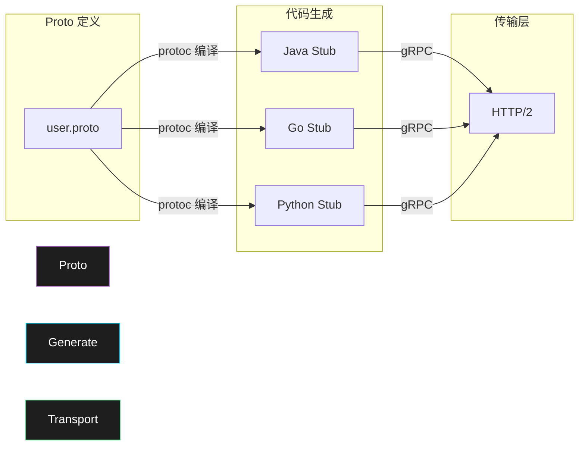
```mermaid
flowchart LR
    subgraph "Proto 定义"
        P["user.proto"]
    end

    subgraph "代码生成"
        G1["Java Stub"]
        G2["Go Stub"]
        G3["Python Stub"]
    end

    subgraph "传输层"
        H["HTTP/2"]
    end

    P -->|"protoc 编译"| G1 & G2 & G3
    G1 & G2 & G3 -->|"gRPC"| H

    style Proto fill:#1e1e1e,stroke:#9b59b6,color:#ffffff
    style Generate fill:#1e1e1e,stroke:#00d9ff,color:#ffffff
    style Transport fill:#1e1e1e,stroke:#53d28a,color:#ffffff
```

**Protocol Buffers 定义：**

```protobuf
// user.proto
syntax = "proto3";

package ecommerce.user;

option java_multiple_files = true;
option java_package = "com.ecommerce.user.grpc";
option java_outer_classname = "UserProto";

service UserService {
    // 简单 RPC
    rpc GetUser(GetUserRequest) returns (UserResponse);
    
    // 服务端流式 RPC
    rpc SearchUsers(SearchUsersRequest) returns (stream UserResponse);
    
    // 客户端流式 RPC
    rpc BatchGetUsers(BatchGetUsersRequest) returns (BatchGetUsersResponse);
    
    // 双向流式 RPC
    rpc StreamUserUpdates(StreamUserUpdatesRequest) returns (stream UserResponse);
}

message GetUserRequest {
    int64 user_id = 1;
}

message UserResponse {
    int64 user_id = 1;
    string email = 2;
    string name = 3;
    UserStatus status = 4;
    int64 created_at = 5;
}

enum UserStatus {
    USER_STATUS_UNSPECIFIED = 0;
    USER_STATUS_ACTIVE = 1;
    USER_STATUS_INACTIVE = 2;
    USER_STATUS_BANNED = 3;
}

message SearchUsersRequest {
    string query = 1;
    int32 page_size = 2;
    string page_token = 3;
}

message BatchGetUsersRequest {
    repeated int64 user_ids = 1;
}

message BatchGetUsersResponse {
    repeated UserResponse users = 1;
}

message StreamUserUpdatesRequest {
    repeated int64 user_ids = 1;
}
```

**gRPC 服务端实现：**

```java
// gRPC 服务端
@GrpcService
public class UserGrpcService extends UserServiceGrpc.UserServiceImplBase {
    
    private final UserService userService;
    private final UserMapper userMapper;
    
    public UserGrpcService(UserService userService, UserMapper userMapper) {
        this.userService = userService;
        this.userMapper = userMapper;
    }
    
    @Override
    public void getUser(GetUserRequest request, StreamObserver<UserResponse> responseObserver) {
        try {
            UserDTO user = userService.getUserById(request.getUserId());
            responseObserver.onNext(userMapper.toProto(user));
            responseObserver.onCompleted();
        } catch (UserNotFoundException e) {
            responseObserver.onError(Status.NOT_FOUND
                .withDescription(e.getMessage())
                .asRuntimeException());
        }
    }
    
    @Override
    public void searchUsers(SearchUsersRequest request, StreamObserver<UserResponse> responseObserver) {
        // 服务端流式返回
        Page<UserDTO> users = userService.searchUsers(request.getQuery(), 
            PageRequest.of(0, request.getPageSize()));
        
        for (UserDTO user : users) {
            responseObserver.onNext(userMapper.toProto(user));
        }
        responseObserver.onCompleted();
    }
    
    @Override
    public StreamObserver<BatchGetUsersRequest> batchGetUsers(StreamObserver<BatchGetUsersResponse> responseObserver) {
        // 客户端流式处理
        List<UserDTO> users = new ArrayList<>();
        
        return new StreamObserver<BatchGetUsersRequest>() {
            @Override
            public void onNext(BatchGetUsersRequest request) {
                users.add(userService.getUserById(request.getUserId()));
            }
            
            @Override
            public void onError(Throwable t) {
                responseObserver.onError(t);
            }
            
            @Override
            public void onCompleted() {
                BatchGetUsersResponse.Builder builder = BatchGetUsersResponse.newBuilder();
                users.forEach(u -> builder.addUsers(userMapper.toProto(u)));
                responseObserver.onNext(builder.build());
                responseObserver.onCompleted();
            }
        };
    }
}
```

**gRPC 客户端调用：**

```java
@Configuration
public class GrpcClientConfig {
    
    @Bean
    public ManagedChannel userServiceChannel(GrpcProperties properties) {
        return ManagedChannelBuilder
            .forAddress(properties.getUserService().getHost(), 
                       properties.getUserService().getPort())
            .usePlaintext()  // 生产环境应使用 TLS
            .intercept(new TracingClientInterceptor())
            .build();
    }
    
    @Bean
    public UserServiceGrpc.UserServiceBlockingStub userServiceBlockingStub(
            ManagedChannel channel) {
        return UserServiceGrpc.newBlockingStub(channel);
    }
    
    @Bean
    public UserServiceGrpc.UserServiceStub userServiceAsyncStub(
            ManagedChannel channel) {
        return UserServiceGrpc.newStub(channel);
    }
}

// 客户端调用
@Service
public class OrderService {
    
    private final UserServiceGrpc.UserServiceBlockingStub userStub;
    
    public UserDTO getUser(Long userId) {
        GetUserRequest request = GetUserRequest.newBuilder()
            .setUserId(userId)
            .build();
        
        try {
            UserResponse response = userStub.getUser(request);
            return userMapper.toDTO(response);
        } catch (StatusRuntimeException e) {
            if (e.getStatus() == Status.NOT_FOUND) {
                throw new UserNotFoundException(userId);
            }
            throw new RuntimeException("gRPC call failed", e);
        }
    }
}
```

### 5.2 异步通信

异步通信通过消息队列解耦服务，提高系统可用性和伸缩性。

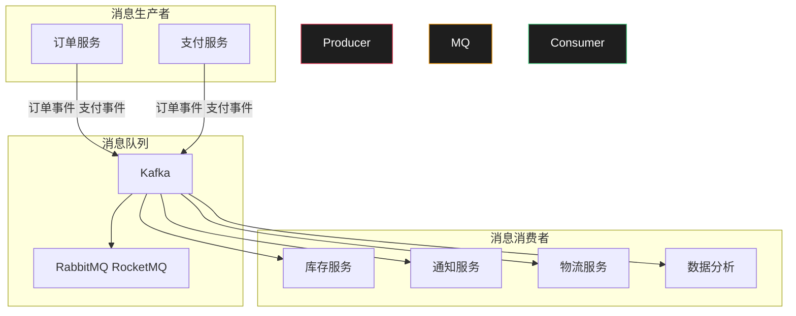
```mermaid
flowchart TB
    subgraph "消息生产者"
        O["订单服务"]
        P["支付服务"]
    end

    subgraph "消息队列"
        K["Kafka"]
        R["RabbitMQ RocketMQ"]
    end

    subgraph "消息消费者"
        S1["库存服务"]
        S2["通知服务"]
        S3["物流服务"]
        S4["数据分析"]
    end

    O & P -->|"订单事件 支付事件"| K
    K --> S1 & S2 & S3 & S4
    K --> R

    style Producer fill:#1e1e1e,stroke:#e94560,color:#ffffff
    style MQ fill:#1e1e1e,stroke:#f39c12,color:#ffffff
    style Consumer fill:#1e1e1e,stroke:#53d28a,color:#ffffff
```

**Kafka 消息示例：**

```java
// 订单事件定义
@Data
public class OrderEvent {
    private String eventId;
    private String eventType;
    private Long orderId;
    private Long customerId;
    private List<OrderItemEvent> items;
    private BigDecimal totalAmount;
    private Instant timestamp;
    
    @Data
    public static class OrderItemEvent {
        private Long productId;
        private String productName;
        private int quantity;
        private BigDecimal price;
    }
}

// 消息生产者
@Service
public class OrderEventPublisher {
    
    private final KafkaTemplate<String, OrderEvent> kafkaTemplate;
    
    public OrderEventPublisher(KafkaTemplate<String, OrderEvent> kafkaTemplate) {
        this.kafkaTemplate = kafkaTemplate;
    }
    
    public void publishOrderCreated(Order order) {
        OrderEvent event = OrderEvent.builder()
            .eventId(UUID.randomUUID().toString())
            .eventType("ORDER_CREATED")
            .orderId(order.getId())
            .customerId(order.getCustomerId())
            .items(order.getItems().stream()
                .map(this::toItemEvent)
                .collect(Collectors.toList()))
            .totalAmount(order.getTotalAmount())
            .timestamp(Instant.now())
            .build();
        
        // 使用订单ID作为key，保证同一订单的消息有序
        kafkaTemplate.send("order-events", 
            order.getId().toString(), 
            event);
    }
    
    private OrderEvent.OrderItemEvent toItemEvent(OrderItem item) {
        return OrderEvent.OrderItemEvent.builder()
            .productId(item.getProductId())
            .productName(item.getProductName())
            .quantity(item.getQuantity())
            .price(item.getPrice())
            .build();
    }
}

// 消息消费者 - 库存服务
@Service
public class InventoryEventConsumer {
    
    private final InventoryService inventoryService;
    
    @KafkaListener(
        topics = "order-events",
        groupId = "inventory-service",
        containerFactory = "kafkaListenerContainerFactory"
    )
    public void handleOrderEvent(OrderEvent event) {
        if (!"ORDER_CREATED".equals(event.getEventType())) {
            return;
        }
        
        log.info("Received order event: {}", event.getEventId());
        
        try {
            // 扣减库存
            for (OrderEvent.OrderItemEvent item : event.getItems()) {
                inventoryService.reserveStock(
                    item.getProductId(),
                    item.getQuantity()
                );
            }
            log.info("Stock reserved for order: {}", event.getOrderId());
        } catch (InsufficientStockException e) {
            // 库存不足，发送补偿事件
            publishStockShortageEvent(event);
        }
    }
}

// Kafka 配置
@Configuration
@EnableKafka
public class KafkaConfig {
    
    @Bean
    public NewTopic orderEventsTopic() {
        return TopicBuilder.name("order-events")
            .partitions(6)  // 根据吞吐量调整
            .replicas(3)
            .config("retention.ms", "604800000")  // 7天
            .build();
    }
    
    @Bean
    public ConcurrentKafkaListenerContainerFactory<String, OrderEvent> 
            kafkaListenerContainerFactory(
                    ConsumerFactory<String, OrderEvent> consumerFactory,
                    KafkaTemplate<String, OrderEvent> template) {
        
        ConcurrentKafkaListenerContainerFactory<String, OrderEvent> factory =
            new ConcurrentKafkaListenerContainerFactory<>();
        factory.setConsumerFactory(consumerFactory);
        factory.setConcurrency(3);
        
        // 配置手动提交（确保消息处理成功后再提交）
        factory.getContainerProperties().setAckMode(
            ContainerProperties.AckMode.MANUAL_IMMEDIATE);
        
        // 失败重试配置
        factory.setCommonErrorHandler(new DefaultErrorHandler(
            new FixedBackOff(1000L, 3)  // 1秒间隔，重试3次
        ));
        
        return factory;
    }
}
```

---

## 6. 微服务治理

### 6.1 限流

限流保护系统免受过载请求的冲击。

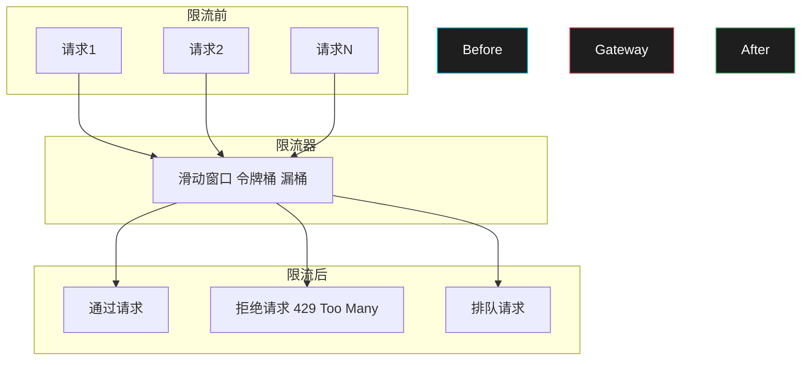
```mermaid
flowchart TB
    subgraph "限流前"
        C1["请求1"]
        C2["请求2"]
        CN["请求N"]
    end

    subgraph "限流器"
        L["滑动窗口 令牌桶 漏桶"]
    end

    subgraph "限流后"
        OK["通过请求"]
        RE["拒绝请求 429 Too Many"]
        QU["排队请求"]
    end

    C1 & C2 & CN --> L
    L --> OK & RE & QU

    style Before fill:#1e1e1e,stroke:#00d9ff,color:#ffffff
    style Gateway fill:#1e1e1e,stroke:#e94560,color:#ffffff
    style After fill:#1e1e1e,stroke:#53d28a,color:#ffffff
```

**限流算法对比：**

| 算法 | 原理 | 优点 | 缺点 |
|-----|------|------|------|
| 计数器 | 固定时间窗口内计数 | 简单 | 临界突变 |
| 滑动窗口 | 滚动时间窗口 | 平滑 | 实现复杂 |
| 令牌桶 | 以固定速率放入令牌 | 支持突发 | 需要存储令牌 |
| 漏桶 | 以固定速率消费请求 | 平滑限流 | 无法处理突发 |

**Sentinel 限流示例：**

```java
@Configuration
public class SentinelConfig {
    
    @Bean
    public SentinelResourceAspect sentinelResourceAspect() {
        return new SentinelResourceAspect();
    }
}

@Service
public class OrderService {
    
    // 基于资源的限流
    @SentinelResource(
        value = "createOrder",
        blockHandler = "createOrderBlockHandler",
        fallback = "createOrderFallback"
    )
    public OrderDTO createOrder(CreateOrderRequest request) {
        // 订单创建逻辑
        return orderRepository.save(toEntity(request));
    }
    
    // 限流处理（必须与原方法签名一致）
    public OrderDTO createOrderBlockHandler(CreateOrderRequest request,
                                            BlockException ex) {
        log.warn("Order creation rate limited: {}", ex.getClass().getSimpleName());
        throw new RateLimitException("系统繁忙，请稍后再试");
    }
    
    // 降级处理
    public OrderDTO createOrderFallback(CreateOrderRequest request,
                                        Throwable throwable) {
        log.error("Order creation failed: {}", throwable.getMessage());
        throw new ServiceUnavailableException("订单服务暂时不可用");
    }
    
    // 基于参数限流
    @SentinelResource(
        value = "getUser",
        blockHandler = "getUserBlockHandler"
    )
    public UserDTO getUserById(@RequestParam("userId") Long userId) {
        return userService.findById(userId);
    }
}

// 自定义限流规则
@Configuration
public class FlowRuleConfig {
    
    @PostConstruct
    public void initFlowRules() {
        List<FlowRule> rules = new ArrayList<>();
        
        // 创建订单限流：每秒100个请求
        FlowRule orderRule = new FlowRule("createOrder")
            .setGrade(RuleConstant.FLOW_GRADE_QPS)
            .setCount(100)
            .setControlBehavior(RuleConstant.CONTROL_BEHAVIOR_DEFAULT);
        rules.add(orderRule);
        
        // 查询接口限流：每秒1000个请求
        FlowRule queryRule = new FlowRule("getUser")
            .setGrade(RuleConstant.FLOW_GRADE_QPS)
            .setCount(1000)
            .setControlBehavior(RuleConstant.CONTROL_BEHAVIOR_DEFAULT);
        rules.add(queryRule);
        
        FlowRuleManager.loadRules(rules);
    }
}
```

### 6.2 熔断

熔断器在检测到故障时快速失败，防止故障扩散。

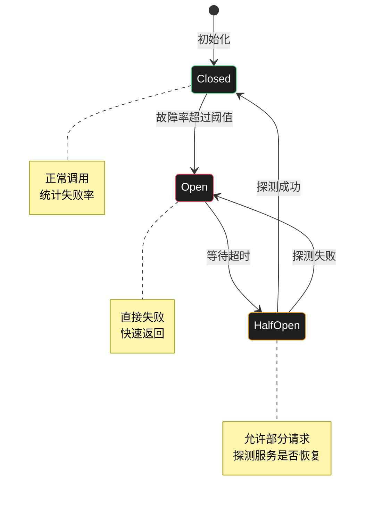
```mermaid
stateDiagram-v2
    [*] --> Closed: 初始化
    Closed --> Open: 故障率超过阈值
    Open --> HalfOpen: 等待超时
    HalfOpen --> Closed: 探测成功
    HalfOpen --> Open: 探测失败

    note right of Closed
        正常调用
        统计失败率
    end note

    note right of Open
        直接失败
        快速返回
    end note

    note right of HalfOpen
        允许部分请求
        探测服务是否恢复
    end note

    style Closed fill:#1e1e1e,stroke:#53d28a,color:#ffffff
    style Open fill:#1e1e1e,stroke:#e94560,color:#ffffff
    style HalfOpen fill:#1e1e1e,stroke:#f39c12,color:#ffffff
```

**Resilience4j 熔断示例：**

```java
@Configuration
public class Resilience4jConfig {
    
    @Bean
    public CircuitBreakerRegistry circuitBreakerRegistry() {
        return CircuitBreakerRegistry.of(
            CircuitBreakerConfig.custom()
                .failureRateThreshold(50)           // 失败率阈值 50%
                .slowCallRateThreshold(80)          // 慢调用率阈值 80%
                .slowCallDurationThreshold(Duration.ofSeconds(3))  // 3秒以上视为慢调用
                .waitDurationInOpenState(Duration.ofSeconds(30))   // 30秒后尝试半开
                .permittedNumberOfCallsInHalfOpenState(5)          // 半开状态允许5个请求
                .slidingWindowType(SlidingWindowType.COUNT_BASED)   // 基于计数的滑动窗口
                .slidingWindowSize(10)                               // 窗口大小10
                .minimumNumberOfCalls(5)                             // 最小调用数
                .build()
        );
    }
}

@Service
public class ProductClient {
    
    private final CircuitBreaker circuitBreaker;
    private final RestTemplate restTemplate;
    
    public ProductClient(CircuitBreakerRegistry registry) {
        this.circuitBreaker = registry.circuitBreaker("productService");
        
        // 事件监听
        circuitBreaker.getEventPublisher()
            .onStateTransition(event -> 
                log.warn("Circuit breaker state changed: {}", event))
            .onFailureRateExceeded(event ->
                log.error("Failure rate exceeded: {}", event.getFailureRate()))
            .onSlowCallRateExceeded(event ->
                log.warn("Slow call rate exceeded: {}", event.getSlowCallRate()));
    }
    
    public ProductDTO getProduct(Long productId) {
        return circuitBreaker.executeSupplier(() -> {
            return restTemplate.getForObject(
                "http://product-service/api/products/{id}",
                ProductDTO.class,
                productId
            );
        });
    }
    
    // 响应式编程方式
    public Mono<ProductDTO> getProductReactive(Long productId) {
        return ReactiveCircuitBreakerFactory.create().create("productService")
            .run(
                webClient.get()
                    .uri("http://product-service/api/products/{id}", productId)
                    .retrieve()
                    .bodyToMono(ProductDTO.class),
                throwable -> Mono.empty()  // 熔断时返回空
            );
    }
}
```

### 6.3 降级

降级在服务不可用时提供备选方案，保证核心功能可用。

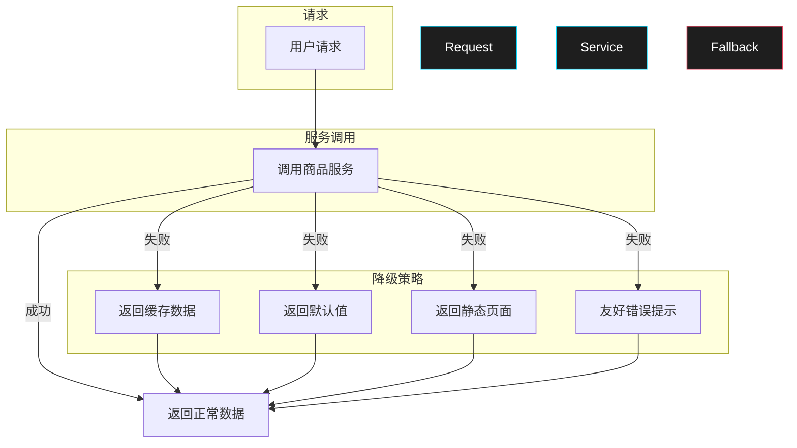
```mermaid
flowchart TB
    subgraph "请求"
        R["用户请求"]
    end

    subgraph "服务调用"
        P["调用商品服务"]
    end

    subgraph "降级策略"
        F1["返回缓存数据"]
        F2["返回默认值"]
        F3["返回静态页面"]
        F4["友好错误提示"]
    end

    R --> P
    P -->|"成功"| O["返回正常数据"]
    P -->|"失败"| F1 & F2 & F3 & F4 --> O

    style Request fill:#1e1e1e,stroke:#00d9ff,color:#ffffff
    style Service fill:#1e1e1e,stroke:#00d9ff,color:#ffffff
    style Fallback fill:#1e1e1e,stroke:#e94560,color:#ffffff
```

**降级实现示例：**

```java
@Service
public class ProductService {
    
    private final ProductClient productClient;
    private final ProductCache productCache;  // 本地缓存
    private final ProductRepository productRepository;
    
    public ProductDTO getProduct(Long productId) {
        try {
            // 尝试调用远程服务
            return productClient.getProduct(productId);
        } catch (Exception e) {
            log.warn("Product service unavailable, trying fallback", e);
            
            // 降级策略1：尝试从本地缓存获取
            ProductDTO cached = productCache.get(productId);
            if (cached != null) {
                return cached;
            }
            
            // 降级策略2：尝试从数据库获取
            return productRepository.findById(productId)
                .map(this::toDTO)
                .orElseGet(this::getDefaultProduct);
        }
    }
    
    private ProductDTO getDefaultProduct() {
        return ProductDTO.builder()
            .id(0L)
            .name("商品信息暂时不可用")
            .description("请稍后再试")
            .price(BigDecimal.ZERO)
            .status(ProductStatus.UNAVAILABLE)
            .build();
    }
}

// 使用 @HystrixCommand 实现降级
@Service
public class RecommendationService {
    
    @HystrixCommand(
        fallbackMethod = "getRecommendationsFallback",
        commandProperties = {
            @HystrixProperty(name = "execution.isolation.thread.timeoutInMilliseconds", value = "500"),
            @HystrixProperty(name = "circuitBreaker.requestVolumeThreshold", value = "20"),
            @HystrixProperty(name = "circuitBreaker.sleepWindowInMilliseconds", value = "5000")
        }
    )
    public List<RecommendedProduct> getRecommendations(Long userId) {
        return recommendationClient.getForUser(userId);
    }
    
    // 降级方法：返回热门商品
    public List<RecommendedProduct> getRecommendationsFallback(Long userId, Throwable t) {
        log.warn("Recommendation service failed, returning popular products", t);
        return popularProductService.getPopularProducts(10);
    }
}
```

### 6.4 超时处理

超时机制防止请求无限等待。

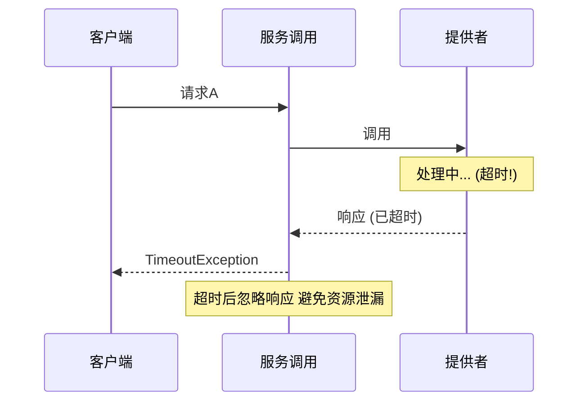
```mermaid
sequenceDiagram
    participant C as 客户端
    participant S as 服务调用
    participant P as 提供者
    
    C->>S: 请求A
    S->>P: 调用
    
    Note over P: 处理中... (超时!)
    
    P-->>S: 响应 (已超时)
    S-->>C: TimeoutException
    
    Note over S: 超时后忽略响应 避免资源泄漏
```

**超时配置示例：**

```java
// Spring Cloud OpenFeign 超时配置
@Configuration
public class FeignConfig {
    
    @Bean
    public Retryer retryer() {
        // 重试策略：重试3次，间隔100ms
        return new Retryer.Default(100, 500, 3);
    }
    
    @Bean
    public Options feignOptions() {
        return new Options(
            5_000,    // 连接超时：5秒
            10_000    // 读取超时：10秒
        );
    }
}

@Configuration
public class TimeoutConfig {
    
    @Bean
    public RestTemplate restTemplate() {
        SimpleClientHttpRequestFactory factory = new SimpleClientHttpRequestFactory();
        factory.setConnectTimeout(5_000);      // 连接超时
        factory.setReadTimeout(10_000);         // 读取超时
        return new RestTemplate(factory);
    }
    
    @Bean
    public WebClient webClient() {
        return WebClient.builder()
            .clientConnector(new ReactorClientHttpConnector(
                HttpClient.create()
                    .option(ChannelOption.CONNECT_TIMEOUT_MILLIS, 5_000)
                    .responseTimeout(Duration.ofSeconds(10))
            ))
            .build();
    }
}

// Resilience4j 超时配置
@Configuration
public class TimeoutConfig {
    
    @Bean
    public TimeoutRegistry timeoutRegistry() {
        return TimeoutRegistry.of(
            TimeoutConfig.custom()
                .timeoutDuration(Duration.ofSeconds(5))
                .cancelRunningFuture(true)
                .build()
        );
    }
}

@Service
public class PaymentService {
    
    private final TimeoutRegistry timeoutRegistry;
    
    public PaymentService(TimeoutRegistry timeoutRegistry) {
        this.timeoutRegistry = timeoutRegistry;
    }
    
    public PaymentResult processPayment(PaymentRequest request) {
        Timeout timeout = timeoutRegistry.get("payment");
        
        return timeout.executeSupplier(() -> {
            return paymentClient.process(request);
        });
    }
}
```

---

## 7. 工程案例：电商系统微服务拆分

### 7.1 业务领域分析

```mermaid
mindmap
  root((电商系统))
    用户域
      账户管理
      认证授权
      会员等级
      收货地址
    商品域
      商品管理
      分类管理
      品牌管理
      SKU管理
      库存管理
    订单域
      订单创建
      订单支付
      订单取消
      订单履约
      售后服务
    支付域
      支付通道
      支付流水
      退款处理
      对账结算
    物流域
      仓储管理
      配送调度
      物流追踪
      签收管理
    营销域
      优惠券
      满减活动
      积分系统
      秒杀活动
    评价域
      商品评价
      商家评价
      追评管理
      评价搜索
```

### 7.2 微服务拆分方案

```mermaid
flowchart TB
    subgraph "前端层"
        W["Web商城"]
        M["移动App"]
        A["Admin管理后台"]
    end

    subgraph "网关层"
        OG["开放API网关"]
        IG["内部API网关"]
    end

    subgraph "用户域"
        US["用户服务 User Service"]
        AU["认证服务 Auth Service"]
    end

    subgraph "商品域"
        PS["商品服务 Product Service"]
        SS["搜索服务 Search Service"]
        IS["库存服务 Inventory Service"]
    end

    subgraph "订单域"
        OS["订单服务 Order Service"]
        TS["交易服务 Trade Service"]
    end

    subgraph "支付域"
        PYS["支付服务 Payment Service"]
        ACS["账户服务 Account Service"]
    end

    subgraph "营销域"
        CP["优惠券服务 Coupon Service"]
        MK["营销服务 Marketing Service"]
    end

    subgraph "基础设施"
        KC["Kafka"]
        RD["Redis"]
        ES["Elasticsearch"]
        CN["Consul/Nacos"]
    end

    Frontend --> Gateway
    Gateway --> UserDomain & ProductDomain & OrderDomain & PaymentDomain & MarketingDomain

    OS --> PS
    OS --> IS
    OS --> PYS
    PYS --> ACS
    TS --> OS
    SS --> PS

    UserDomain & ProductDomain & OrderDomain & PaymentDomain & MarketingDomain --> Infrastructure

    style Frontend fill:#1e1e1e,stroke:#00d9ff,color:#ffffff
    style Gateway fill:#1e1e1e,stroke:#f39c12,color:#ffffff
    style UserDomain fill:#1e1e1e,stroke:#53d28a,color:#ffffff
    style ProductDomain fill:#1e1e1e,stroke:#9b59b6,color:#ffffff
    style OrderDomain fill:#1e1e1e,stroke:#e94560,color:#ffffff
    style PaymentDomain fill:#1e1e1e,stroke:#00d9ff,color:#ffffff
    style MarketingDomain fill:#1e1e1e,stroke:#f39c12,color:#ffffff
    style Infrastructure fill:#1e1e1e,stroke:#ffffff,color:#ffffff
```

### 7.3 核心服务详细设计

#### 7.3.1 用户服务

```java
// 用户服务 API
@RestController
@RequestMapping("/api/users")
public class UserController {
    
    @PostMapping("/register")
    public ApiResponse<UserDTO> register(@Valid @RequestBody RegisterRequest request);
    
    @PostMapping("/login")
    public ApiResponse<LoginResponse> login(@Valid @RequestBody LoginRequest request);
    
    @GetMapping("/{id}")
    public ApiResponse<UserDTO> getUser(@PathVariable Long id);
    
    @PutMapping("/{id}")
    public ApiResponse<UserDTO> updateUser(@PathVariable Long id, @RequestBody UpdateRequest request);
    
    @PostMapping("/{id}/addresses")
    public ApiResponse<AddressDTO> addAddress(@PathVariable Long id, @RequestBody AddressRequest request);
}

// 数据库表设计
-- 用户表
CREATE TABLE users (
    id BIGINT PRIMARY KEY AUTO_INCREMENT,
    username VARCHAR(50) NOT NULL UNIQUE,
    email VARCHAR(100) NOT NULL UNIQUE,
    phone VARCHAR(20),
    password_hash VARCHAR(255) NOT NULL,
    status TINYINT DEFAULT 1,
    level INT DEFAULT 1,
    created_at TIMESTAMP DEFAULT CURRENT_TIMESTAMP,
    updated_at TIMESTAMP DEFAULT CURRENT_TIMESTAMP ON UPDATE CURRENT_TIMESTAMP,
    INDEX idx_email (email),
    INDEX idx_phone (phone)
);

-- 地址表
CREATE TABLE user_addresses (
    id BIGINT PRIMARY KEY AUTO_INCREMENT,
    user_id BIGINT NOT NULL,
    receiver_name VARCHAR(50) NOT NULL,
    phone VARCHAR(20) NOT NULL,
    province VARCHAR(50) NOT NULL,
    city VARCHAR(50) NOT NULL,
    district VARCHAR(50) NOT NULL,
    detail_address VARCHAR(255) NOT NULL,
    is_default BOOLEAN DEFAULT FALSE,
    created_at TIMESTAMP DEFAULT CURRENT_TIMESTAMP,
    FOREIGN KEY (user_id) REFERENCES users(id)
);
```

#### 7.3.2 订单服务

```java
// 订单创建流程（Saga模式）
@Service
public class OrderSagaOrchestrator {
    
    private final OrderRepository orderRepository;
    private final ProductClient productClient;
    private final InventoryClient inventoryClient;
    private final PaymentClient paymentClient;
    private final EventPublisher eventPublisher;
    
    @Transactional
    public OrderDTO createOrderSaga(CreateOrderCommand command) {
        // 1. 创建订单（待支付状态）
        Order order = Order.create(command.getCustomerId(), command.getShippingAddress());
        
        // 2. 验证商品信息
        List<ProductInfo> products = productClient.getProducts(
            command.getItems().stream()
                .map(OrderItemCommand::getProductId)
                .collect(Collectors.toList())
        );
        
        // 3. 锁定库存
        InventoryLockResult lockResult = inventoryClient.lockStock(
            command.getItems().stream()
                .map(item -> new StockLock(
                    item.getProductId(),
                    item.getQuantity()
                ))
                .collect(Collectors.toList())
        );
        
        if (!lockResult.isSuccess()) {
            throw new InsufficientStockException(lockResult.getFailedProducts());
        }
        
        // 4. 计算价格
        Money totalAmount = calculateTotal(products, command.getItems());
        
        // 5. 创建订单
        command.getItems().forEach(item -> {
            ProductInfo product = findProduct(products, item.getProductId());
            order.addItem(product, item.getQuantity());
        });
        order.setTotalAmount(totalAmount);
        order.setInventoryLockId(lockResult.getLockId());
        
        order = orderRepository.save(order);
        
        // 6. 发布订单创建事件
        eventPublisher.publish(new OrderCreatedEvent(order.getId()));
        
        return toDTO(order);
    }
    
    // 补偿事务：释放库存
    public void compensateReleaseStock(Long orderId) {
        orderRepository.findById(orderId)
            .ifPresent(order -> {
                inventoryClient.releaseStock(order.getInventoryLockId());
                order.setStatus(OrderStatus.CANCELLED);
                orderRepository.save(order);
            });
    }
}
```

#### 7.3.3 库存服务

```java
// 库存服务 - 乐观锁实现
@Service
public class InventoryService {
    
    private final InventoryRepository inventoryRepository;
    
    @Transactional
    public InventoryLockResult lockStock(List<StockLock> locks) {
        List<String> failedProducts = new ArrayList<>();
        
        for (StockLock lock : locks) {
            int updated = inventoryRepository.updateStockWithOptimisticLock(
                lock.getProductId(),
                lock.getQuantity(),
                LocalDateTime.now().plusMinutes(15)  // 15分钟锁定
            );
            
            if (updated == 0) {
                failedProducts.add(lock.getProductId().toString());
            }
        }
        
        if (!failedProducts.isEmpty()) {
            return InventoryLockResult.fail(failedProducts);
        }
        
        String lockId = UUID.randomUUID().toString();
        return InventoryLockResult.success(lockId);
    }
}

@Repository
public interface InventoryRepository extends JpaRepository<Inventory, Long> {
    
    // 乐观锁扣减库存
    @Modifying
    @Query("UPDATE Inventory i SET i.stock = i.stock - :quantity, " +
           "i.lockedStock = i.lockedStock + :quantity, " +
           "i.lockExpireTime = :expireTime " +
           "WHERE i.productId = :productId " +
           "AND i.stock >= :quantity " +
           "AND i.version = :version")
    int updateStockWithOptimisticLock(
        @Param("productId") Long productId,
        @Param("quantity") int quantity,
        @Param("expireTime") LocalDateTime expireTime,
        @Param("version") Long version
    );
}

// 定时释放过期锁
@Scheduled(fixedRate = 60000)
public void releaseExpiredStockLocks() {
    List<Inventory> expiredInventories = 
        inventoryRepository.findByLockExpireTimeBefore(LocalDateTime.now());
    
    for (Inventory inventory : expiredInventories) {
        inventoryRepository.releaseExpiredLock(inventory.getId(), inventory.getLockedStock());
    }
}
```

### 7.4 服务间调用链路

```mermaid
sequenceDiagram
    participant C as 客户端
    participant GW as API网关
    participant OS as 订单服务
    participant PS as 商品服务
    participant IS as 库存服务
    participant PYS as 支付服务
    participant MQ as 消息队列
    
    Note over C,PYS: 创建订单流程
    
    C->>GW: POST /api/orders
    GW->>OS: 创建订单请求
    OS->>PS: 查询商品信息
    PS-->>OS: 返回商品信息
    OS->>IS: 锁定库存
    IS-->>OS: 库存锁定成功
    OS->>OS: 创建订单记录
    OS->>MQ: 发布订单创建事件
    OS-->>GW: 订单创建成功
    GW-->>C: 返回订单信息
    
    Note over MQ,PYS: 异步处理
    
    MQ->>PYS: 消费订单创建事件
    PYS->>PYS: 初始化支付流程
```

### 7.5 部署架构

```mermaid
flowchart TB
    subgraph "Kubernetes 集群"
        subgraph "命名空间"
            subgraph "production"
                POD1["用户服务 Pod x3"]
                POD2["订单服务 Pod x3"]
                POD3["商品服务 Pod x3"]
                POD4["支付服务 Pod x3"]
            end

            subgraph "infrastructure"
                KAFKA["Kafka Cluster"]
                REDIS["Redis Cluster"]
                ES["Elasticsearch"]
            end
        end

        subgraph "Ingress Controller"
            NGINX["Nginx Ingress"]
        end

        subgraph "存储层"
            PVC["持久卷声明"]
        end
    end

    NGINX --> POD1 & POD2 & POD3 & POD4
    POD1 & POD2 & POD3 & POD4 --> KAFKA & REDIS & ES
    POD1 & POD2 & POD3 & POD4 --> PVC

    style K8s fill:#1e1e1e,stroke:#00d9ff,color:#ffffff
    style Namespaces fill:#1e1e1e,stroke:#53d28a,color:#ffffff
    style Ingress fill:#1e1e1e,stroke:#e94560,color:#ffffff
    style Storage fill:#1e1e1e,stroke:#9b59b6,color:#ffffff
```

---

## 总结

本章介绍了微服务架构的核心概念和实践要点：

### 核心要点

| 主题 | 关键点 |
|-----|-------|
| **架构特征** | 独立进程、业务聚焦、轻量通信、独立部署、去中心化管理 |
| **设计原则** | 单一职责、领域驱动设计（DDD）、独立部署 |
| **基础设施** | 服务注册发现、API网关、配置中心、分布式日志、监控追踪 |
| **服务通信** | 同步通信（REST/gRPC）、异步通信（消息队列） |
| **服务治理** | 限流、熔断、降级、超时处理 |
| **工程实践** | 电商系统微服务拆分案例 |

### 微服务架构优势

- 独立部署，加快交付速度
- 故障隔离，提高系统稳定性
- 技术多样性，适应不同业务场景
- 团队自治，提升开发效率
- 按需扩展，优化资源利用

### 微服务架构挑战

- 分布式系统复杂性
- 数据一致性挑战
- 运维复杂度增加
- 服务间通信开销
- 调试和追踪困难

在实际项目中，需要根据业务规模、团队能力和业务特性来权衡是否采用微服务架构，并逐步演进。

---

**上一页**：[第四章：系统架构模式](../04_系统架构模式/04_系统架构模式.md)

**下一页**：[第六章：分布式系统设计](../06_分布式系统设计/06_分布式系统设计.md)
