# 第六章：事件驱动架构

## 目录

1. [事件驱动架构概述](#1-事件驱动架构概述)
2. [核心概念](#2-核心概念)
3. [事件驱动 vs 请求驱动对比](#3-事件驱动-vs-请求驱动对比)
4. [事件驱动架构模式](#4-事件驱动架构模式)
5. [消息中间件选型](#5-消息中间件选型)
6. [工程实践案例](#6-工程实践案例)
7. [事件驱动架构的挑战](#7-事件驱动架构的挑战)

---

## 1. 事件驱动架构概述

### 1.1 什么是事件驱动架构

事件驱动架构（Event-Driven Architecture，EDA）是一种软件架构范式，其中系统的各个组件通过事件的产生、消费和响应来进行通信和协作。在事件驱动架构中，组件之间不存在直接的调用关系，而是通过发布和订阅事件来进行解耦交互。

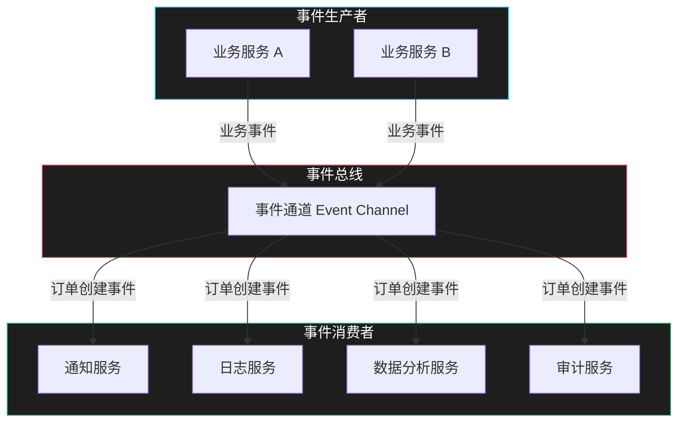
```mermaid
flowchart TB
    subgraph Producer["事件生产者"]
        P1["业务服务 A"]
        P2["业务服务 B"]
    end

    subgraph EventBus["事件总线"]
        EB["事件通道 Event Channel"]
    end

    subgraph Consumer["事件消费者"]
        C1["通知服务"]
        C2["日志服务"]
        C3["数据分析服务"]
        C4["审计服务"]
    end

    P1 -->|"业务事件"| EB
    P2 -->|"业务事件"| EB
    EB -->|"订单创建事件"| C1
    EB -->|"订单创建事件"| C2
    EB -->|"订单创建事件"| C3
    EB -->|"订单创建事件"| C4

    style Producer fill:#1e1e1e,stroke:#00d9ff,color:#ffffff
    style EventBus fill:#1e1e1e,stroke:#e94560,color:#ffffff
    style Consumer fill:#1e1e1e,stroke:#53d28a,color:#ffffff
```

### 1.2 事件驱动架构核心特征

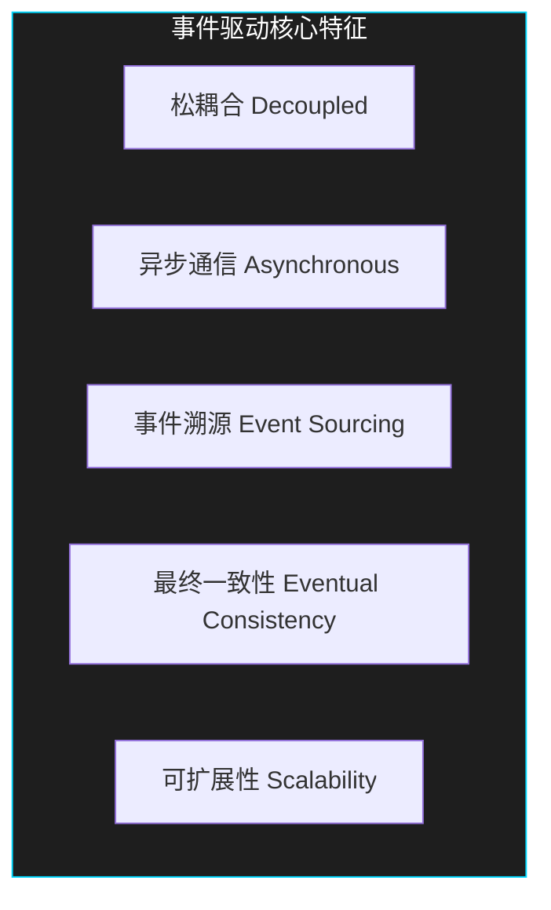
```mermaid
flowchart TB
    subgraph A["事件驱动核心特征"]
        A1["松耦合 Decoupled"]
        A2["异步通信 Asynchronous"]
        A3["事件溯源 Event Sourcing"]
        A4["最终一致性 Eventual Consistency"]
        A5["可扩展性 Scalability"]
    end

    style A fill:#1e1e1e,stroke:#00d9ff,color:#ffffff
```

**核心特征说明：**

- **松耦合**：生产者和消费者之间不需要知道彼此的存在，通过事件进行间接通信
- **异步通信**：事件发布后不需要等待消费者处理，提高系统响应能力
- **事件溯源**：可以记录所有事件历史，支持系统状态的完整回放和审计
- **最终一致性**：系统在不同服务之间达到一致状态的过程是异步的
- **可扩展性**：可以独立扩展生产者和消费者，不相互影响

### 1.3 事件驱动架构全景图

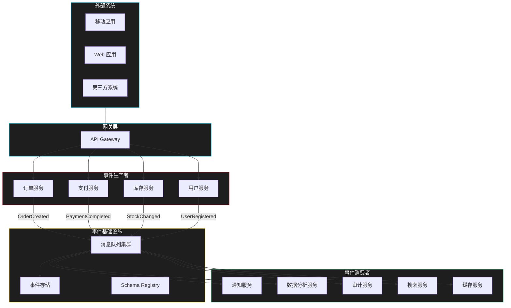
```mermaid
flowchart TB
    subgraph External["外部系统"]
        APP["移动应用"]
        WEB["Web 应用"]
        PARTNER["第三方系统"]
    end

    subgraph Gateway["网关层"]
        GW["API Gateway"]
    end

    subgraph Producer["事件生产者"]
        ORDER["订单服务"]
        USER["用户服务"]
        PAYMENT["支付服务"]
        INVENTORY["库存服务"]
    end

    subgraph EventInfrastructure["事件基础设施"]
        MQ["消息队列集群"]
        ES["事件存储"]
        SCHEMA["Schema Registry"]
    end

    subgraph Consumer["事件消费者"]
        NOTIFY["通知服务"]
        ANALYTICS["数据分析服务"]
        AUDIT["审计服务"]
        SEARCH["搜索服务"]
        CACHE["缓存服务"]
    end

    External --> GW
    GW --> ORDER & USER & PAYMENT & INVENTORY

    ORDER -->|"OrderCreated"| MQ
    PAYMENT -->|"PaymentCompleted"| MQ
    INVENTORY -->|"StockChanged"| MQ
    USER -->|"UserRegistered"| MQ

    MQ --> ES
    MQ --> NOTIFY & ANALYTICS & AUDIT & SEARCH & CACHE

    style External fill:#1e1e1e,stroke:#00d9ff,color:#ffffff
    style Gateway fill:#1e1e1e,stroke:#00d9ff,color:#ffffff
    style Producer fill:#1e1e1e,stroke:#e94560,color:#ffffff
    style EventInfrastructure fill:#1e1e1e,stroke:#ffd700,color:#ffffff
    style Consumer fill:#1e1e1e,stroke:#53d28a,color:#ffffff
```

---

## 2. 核心概念

### 2.1 事件（Event）

事件是系统中发生的业务操作的不可变记录。事件描述已经发生的事情，包含事件发生时的相关数据。

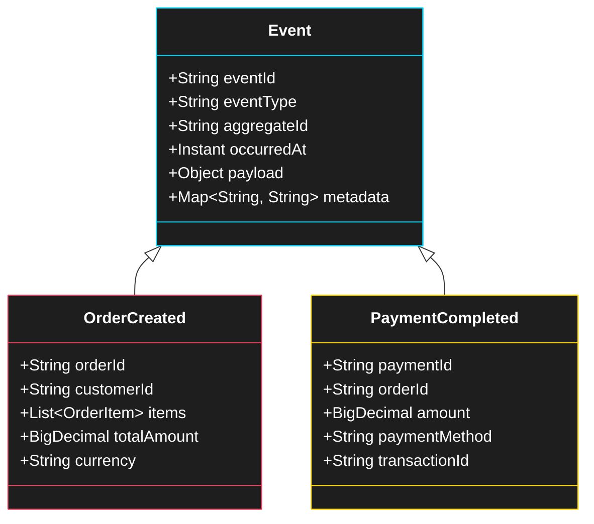
```mermaid
classDiagram
    class Event {
        +String eventId
        +String eventType
        +String aggregateId
        +Instant occurredAt
        +Object payload
        +Map&lt;String, String&gt; metadata
    }

    class OrderCreated {
        +String orderId
        +String customerId
        +List&lt;OrderItem&gt; items
        +BigDecimal totalAmount
        +String currency
    }

    class PaymentCompleted {
        +String paymentId
        +String orderId
        +BigDecimal amount
        +String paymentMethod
        +String transactionId
    }

    Event <|-- OrderCreated
    Event <|-- PaymentCompleted

    style Event fill:#1e1e1e,stroke:#00d9ff,color:#ffffff
    style OrderCreated fill:#1e1e1e,stroke:#e94560,color:#ffffff
    style PaymentCompleted fill:#1e1e1e,stroke:#ffd700,color:#ffffff
```

**事件的特性：**

- **不可变性**：事件一旦发生就不能被修改或删除
- **时间戳**：记录事件发生的时间
- **因果关系**：事件之间存在因果顺序
- **业务语义**：事件表达业务意图

### 2.2 事件发布者（Event Publisher）

事件发布者是产生事件的组件，它将业务操作转换为事件并发送到事件总线。

```java
// 订单服务 - 事件发布者示例
public class OrderService {
    
    private final ApplicationEventPublisher eventPublisher;
    
    public OrderService(ApplicationEventPublisher eventPublisher) {
        this.eventPublisher = eventPublisher;
    }
    
    public Order createOrder(CreateOrderRequest request) {
        // 1. 创建订单
        Order order = Order.builder()
                .orderId(UUID.randomUUID().toString())
                .customerId(request.getCustomerId())
                .items(request.getItems())
                .totalAmount(calculateTotal(request.getItems()))
                .status(OrderStatus.CREATED)
                .createdAt(Instant.now())
                .build();
        
        // 2. 保存订单
        orderRepository.save(order);
        
        // 3. 发布订单创建事件
        OrderCreatedEvent event = new OrderCreatedEvent(
                order.getOrderId(),
                order.getCustomerId(),
                order.getItems(),
                order.getTotalAmount(),
                order.getCurrency()
        );
        
        eventPublisher.publish(event);
        
        return order;
    }
}

// 订单创建事件
public record OrderCreatedEvent(
        String orderId,
        String customerId,
        List<OrderItem> items,
        BigDecimal totalAmount,
        String currency
) {}
```

### 2.3 事件消费者（Event Consumer）

事件消费者订阅并处理来自事件总线的事件。

```java
// 通知服务 - 事件消费者示例
@Service
public class NotificationEventConsumer {
    
    private final NotificationService notificationService;
    
    @EventListener
    public void handleOrderCreated(OrderCreatedEvent event) {
        // 发送订单确认通知
        notificationService.sendOrderConfirmation(
                event.customerId(),
                event.orderId(),
                event.totalAmount()
        );
    }
}

// 审计服务 - 另一个事件消费者
@Service
public class AuditEventConsumer {
    
    private final AuditService auditService;
    
    @EventListener
    public void handleOrderCreated(OrderCreatedEvent event) {
        // 记录审计日志
        auditService.logEvent(
                AuditEvent.builder()
                        .action("ORDER_CREATED")
                        .entityId(event.orderId())
                        .userId(event.customerId())
                        .timestamp(Instant.now())
                        .build()
        );
    }
}
```

### 2.4 事件总线（Event Bus）

事件总线是事件传递的中间层，负责事件的路由、分发和持久化。

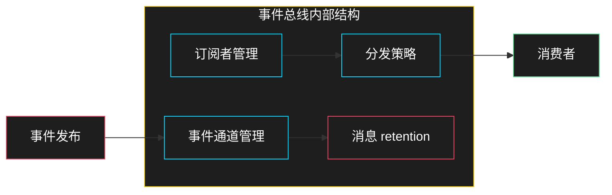
```mermaid
flowchart LR
    subgraph EBUS["事件总线内部结构"]
        CH["事件通道管理"]
        SUB["订阅者管理"]
        DIS["分发策略"]
        RET["消息 retention"]
    end

    PUB["事件发布"] --> CH
    SUB --> DIS
    DIS --> CON["消费者"]
    CH --> RET

    style EBUS fill:#1e1e1e,stroke:#ffd700,color:#ffffff
    style CH fill:#1e1e1e,stroke:#00d9ff,color:#ffffff
    style SUB fill:#1e1e1e,stroke:#00d9ff,color:#ffffff
    style DIS fill:#1e1e1e,stroke:#00d9ff,color:#ffffff
    style RET fill:#1e1e1e,stroke:#e94560,color:#ffffff
    style CON fill:#1e1e1e,stroke:#53d28a,color:#ffffff
    style PUB fill:#1e1e1e,stroke:#e94560,color:#ffffff
```

**事件总线的核心功能：**

| 功能 | 描述 |
|------|------|
| **路由** | 根据事件类型和订阅关系将事件分发到正确的消费者 |
| **过滤** | 支持基于内容或属性的事件过滤 |
| **转换** | 支持事件格式的转换和适配 |
| **持久化** | 存储事件以支持重放和回溯 |
| **顺序保证** | 确保同一分区内事件的处理顺序 |
| **可靠性** | 提供至少一次或精确一次的消息传递语义 |

---

## 3. 事件驱动 vs 请求驱动对比

### 3.1 架构形态对比

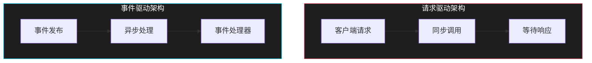
```mermaid
flowchart TB
    subgraph RequestDriven["请求驱动架构"]
        REQ["客户端请求"]
        SYN["同步调用"]
        RESP["等待响应"]

        REQ --> SYN
        SYN --> RESP
    end

    subgraph EventDriven["事件驱动架构"]
        EVT["事件发布"]
        ASYNC["异步处理"]
        HANDLER["事件处理器"]

        EVT --> ASYNC
        ASYNC --> HANDLER
    end

    style RequestDriven fill:#1e1e1e,stroke:#e94560,color:#ffffff
    style EventDriven fill:#1e1e1e,stroke:#00d9ff,color:#ffffff
```

### 3.2 核心维度对比表

| 对比维度 | 请求驱动架构 | 事件驱动架构 |
|---------|-------------|-------------|
| **调用方式** | 同步调用（Synchronous） | 异步处理（Asynchronous） |
| **耦合度** | 强耦合（服务间直接依赖） | 松耦合（通过事件间接交互） |
| **响应时间** | 需要等待处理完成 | 立即返回，处理异步进行 |
| **扩展性** | 较难独立扩展 | 可以独立扩展各组件 |
| **一致性模型** | 实时一致性 | 最终一致性 |
| **故障传播** | 调用链长时故障容易扩散 | 故障隔离，不易扩散 |
| **适用场景** | 简单查询、需要即时响应 | 复杂业务流程、多系统集成 |
| **事务处理** | 较容易保证 ACID | 需要额外机制保证一致性 |
| **调试难度** | 较低（调用链路清晰） | 较高（异步流程难以追踪） |

### 3.3 时序图对比

**请求驱动架构**：同步调用链，任何环节失败都会影响整体

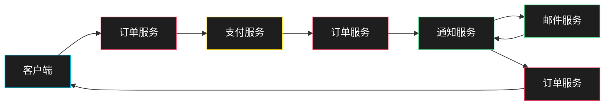
```mermaid
flowchart LR
    C[客户端] --> O1[订单服务]
    O1 --> P[支付服务]
    P --> O2[订单服务]
    O2 --> N[通知服务]
    N --> E[邮件服务]
    E --> N
    N --> O3[订单服务]
    O3 --> C

    style C fill:#1e1e1e,stroke:#00d9ff,color:#ffffff
    style O1 fill:#1e1e1e,stroke:#e94560,color:#ffffff
    style O2 fill:#1e1e1e,stroke:#e94560,color:#ffffff
    style O3 fill:#1e1e1e,stroke:#e94560,color:#ffffff
    style P fill:#1e1e1e,stroke:#ffd700,color:#ffffff
    style N fill:#1e1e1e,stroke:#53d28a,color:#ffffff
    style E fill:#1e1e1e,stroke:#53d28a,color:#ffffff
```

**事件驱动架构**：各服务独立处理，失败不影响订单创建

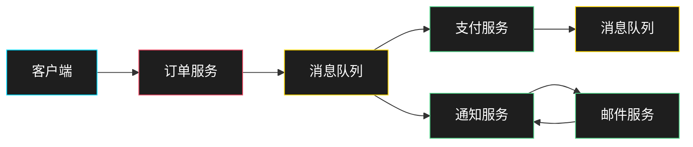
```mermaid
flowchart LR
    C[客户端] --> O[订单服务]
    O --> MQ[消息队列]
    MQ --> P[支付服务]
    MQ --> N[通知服务]
    P --> MQ2[消息队列]
    N --> E[邮件服务]
    E --> N

    style C fill:#1e1e1e,stroke:#00d9ff,color:#ffffff
    style O fill:#1e1e1e,stroke:#e94560,color:#ffffff
    style MQ fill:#1e1e1e,stroke:#ffd700,color:#ffffff
    style MQ2 fill:#1e1e1e,stroke:#ffd700,color:#ffffff
    style P fill:#1e1e1e,stroke:#53d28a,color:#ffffff
    style N fill:#1e1e1e,stroke:#53d28a,color:#ffffff
    style E fill:#1e1e1e,stroke:#53d28a,color:#ffffff
```

### 3.4 决策矩阵：何时选择事件驱动架构

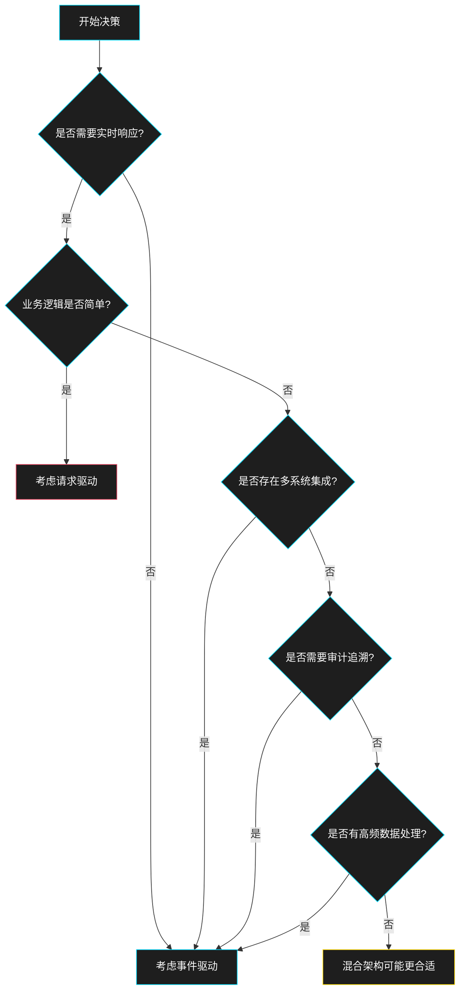
```mermaid
flowchart TD
    START["开始决策"] --> Q1{"是否需要实时响应?"}
    Q1 -->|"是"| Q2{"业务逻辑是否简单?"}
    Q1 -->|"否"| GOOD_EVENT["考虑事件驱动"]

    Q2 -->|"是"| GOOD_REQUEST["考虑请求驱动"]
    Q2 -->|"否"| Q3{"是否存在多系统集成?"}

    Q3 -->|"是"| GOOD_EVENT
    Q3 -->|"否"| Q4{"是否需要审计追溯?"}

    Q4 -->|"是"| GOOD_EVENT
    Q4 -->|"否"| Q5{"是否有高频数据处理?"}

    Q5 -->|"是"| GOOD_EVENT
    Q5 -->|"否"| MIXED["混合架构可能更合适"]

    style START fill:#1e1e1e,stroke:#00d9ff,color:#ffffff
    style Q1 fill:#1e1e1e,stroke:#00d9ff,color:#ffffff
    style Q2 fill:#1e1e1e,stroke:#00d9ff,color:#ffffff
    style Q3 fill:#1e1e1e,stroke:#00d9ff,color:#ffffff
    style Q4 fill:#1e1e1e,stroke:#00d9ff,color:#ffffff
    style Q5 fill:#1e1e1e,stroke:#00d9ff,color:#ffffff
    style GOOD_EVENT fill:#1e1e1e,stroke:#00d9ff,color:#ffffff
    style GOOD_REQUEST fill:#1e1e1e,stroke:#e94560,color:#ffffff
    style MIXED fill:#1e1e1e,stroke:#ffd700,color:#ffffff
```

---

## 4. 事件驱动架构模式

### 4.1 发布-订阅模式（Publish-Subscribe）

发布-订阅模式是最基本的事件驱动模式。发布者将事件发布到主题，订阅者订阅感兴趣的主题来接收事件。

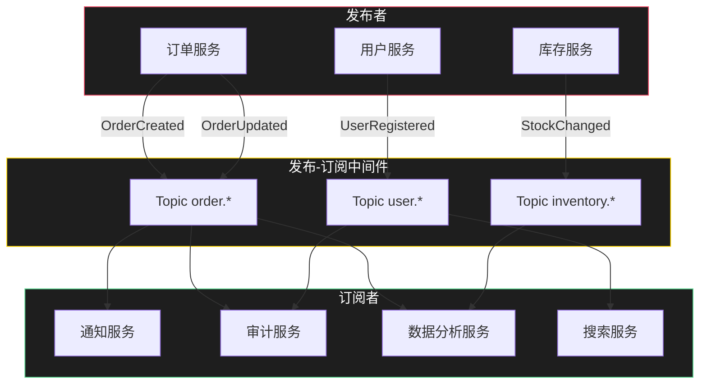
```mermaid
flowchart TB
    subgraph Publishers["发布者"]
        P1["订单服务"]
        P2["用户服务"]
        P3["库存服务"]
    end

    subgraph PubSub["发布-订阅中间件"]
        T1["Topic order.*"]
        T2["Topic user.*"]
        T3["Topic inventory.*"]
    end

    subgraph Subscribers["订阅者"]
        S1["通知服务"]
        S2["审计服务"]
        S3["数据分析服务"]
        S4["搜索服务"]
    end

    P1 -->|"OrderCreated"| T1
    P1 -->|"OrderUpdated"| T1
    P2 -->|"UserRegistered"| T2
    P3 -->|"StockChanged"| T3

    T1 --> S1
    T1 --> S2
    T1 --> S3
    T2 --> S2
    T2 --> S4
    T3 --> S3

    style Publishers fill:#1e1e1e,stroke:#e94560,color:#ffffff
    style PubSub fill:#1e1e1e,stroke:#ffd700,color:#ffffff
    style Subscribers fill:#1e1e1e,stroke:#53d28a,color:#ffffff
```

**代码示例：**

```java
// 发布者
@Service
public class OrderPublisher {
    
    private final KafkaTemplate<String, Object> kafkaTemplate;
    
    public OrderPublisher(KafkaTemplate<String, Object> kafkaTemplate) {
        this.kafkaTemplate = kafkaTemplate;
    }
    
    public void publishOrderEvent(OrderCreatedEvent event) {
        kafkaTemplate.send("order.events", event.orderId(), event);
    }
}

// 订阅者 - 使用 Spring Kafka
@Configuration
public class KafkaConsumerConfig {
    
    @Bean
    public ConcurrentKafkaListenerContainerFactory<String, Object> kafkaListenerContainerFactory(
            ConsumerFactory<String, Object> consumerFactory) {
        ConcurrentKafkaListenerContainerFactory<String, Object> factory =
                new ConcurrentKafkaListenerContainerFactory<>();
        factory.setConsumerFactory(consumerFactory);
        factory.setConcurrency(3); // 并发消费者数
        return factory;
    }
}

@Service
public class NotificationSubscriber {
    
    @KafkaListener(topics = "order.events", groupId = "notification-group")
    public void handleOrderEvent(ConsumerRecord<String, OrderCreatedEvent> record) {
        OrderCreatedEvent event = record.value();
        notificationService.sendOrderConfirmation(event);
    }
}
```

### 4.2 消息队列模式（Message Queue）

消息队列模式提供点对点的消息传递，消息被持久化在队列中，确保消息的可靠传递。

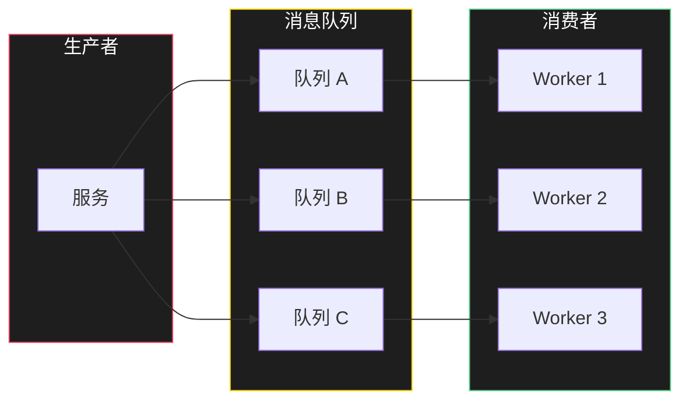
```mermaid
flowchart LR
    subgraph Producer["生产者"]
        PR["服务"]
    end

    subgraph Queue["消息队列"]
        Q1["队列 A"]
        Q2["队列 B"]
        Q3["队列 C"]
    end

    subgraph Consumer["消费者"]
        C1["Worker 1"]
        C2["Worker 2"]
        C3["Worker 3"]
    end

    PR --> Q1 & Q2 & Q3
    Q1 --> C1
    Q2 --> C2
    Q3 --> C3

    style Producer fill:#1e1e1e,stroke:#e94560,color:#ffffff
    style Queue fill:#1e1e1e,stroke:#ffd700,color:#ffffff
    style Consumer fill:#1e1e1e,stroke:#53d28a,color:#ffffff
```

**代码示例 - RabbitMQ：**

```java
// 配置 RabbitMQ
@Configuration
public class RabbitMQConfig {
    
    public static final String ORDER_QUEUE = "order.processing.queue";
    public static final String ORDER_EXCHANGE = "order.exchange";
    public static final String ORDER_ROUTING_KEY = "order.process";
    
    @Bean
    public Queue orderQueue() {
        return QueueBuilder.durable(ORDER_QUEUE)
                .withArgument("x-dead-letter-exchange", "order.dlx")
                .withArgument("x-dead-letter-routing-key", "order.dead")
                .build();
    }
    
    @Bean
    public DirectExchange orderExchange() {
        return new DirectExchange(ORDER_EXCHANGE);
    }
    
    @Bean
    public Binding orderBinding(Queue orderQueue, DirectExchange orderExchange) {
        return BindingBuilder.bind(orderQueue)
                .to(orderExchange)
                .with(ORDER_ROUTING_KEY);
    }
}

// 生产者
@Service
public class OrderProducer {
    
    private final RabbitTemplate rabbitTemplate;
    
    public void sendOrderForProcessing(Order order) {
        rabbitTemplate.convertAndSend(
                RabbitMQConfig.ORDER_EXCHANGE,
                RabbitMQConfig.ORDER_ROUTING_KEY,
                order
        );
    }
}

// 消费者
@Service
public class OrderProcessor {
    
    @RabbitListener(queues = RabbitMQConfig.ORDER_QUEUE, concurrency = "3-10")
    public void processOrder(Order order) {
        // 处理订单逻辑
        // 失败时抛出 AmqpRejectAndDontRequeueException 触发死信队列
    }
}
```

### 4.3 事件溯源模式（Event Sourcing）

事件溯源是一种将状态变化存储为一系列不可变事件的模式。系统状态可以通过重放事件来重建。

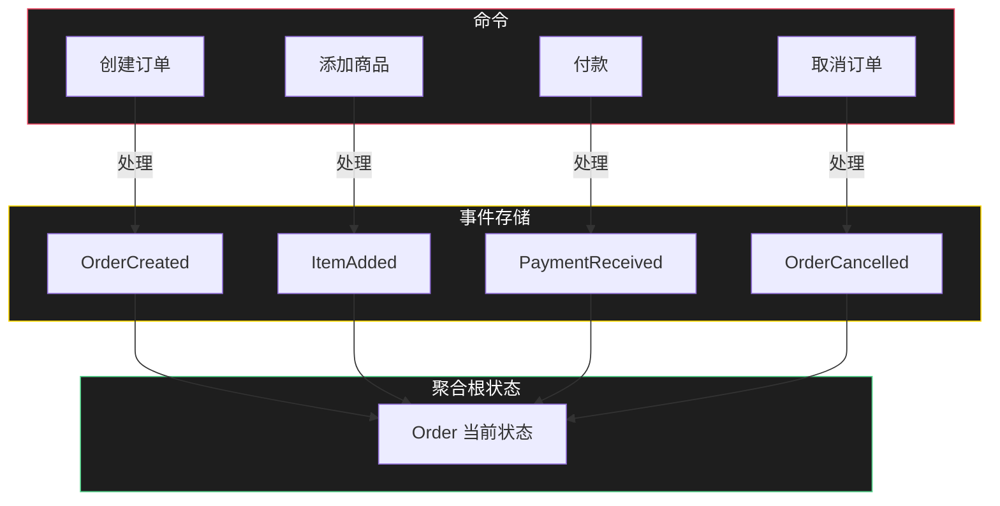
```mermaid
flowchart TB
    subgraph Commands["命令"]
        CMD1["创建订单"]
        CMD2["添加商品"]
        CMD3["付款"]
        CMD4["取消订单"]
    end

    subgraph Events["事件存储"]
        EVT1["OrderCreated"]
        EVT2["ItemAdded"]
        EVT3["PaymentReceived"]
        EVT4["OrderCancelled"]
    end

    subgraph State["聚合根状态"]
        AGG["Order 当前状态"]
    end

    CMD1 -->|"处理"| EVT1
    CMD2 -->|"处理"| EVT2
    CMD3 -->|"处理"| EVT3
    CMD4 -->|"处理"| EVT4

    EVT1 --> AGG
    EVT2 --> AGG
    EVT3 --> AGG
    EVT4 --> AGG

    style Commands fill:#1e1e1e,stroke:#e94560,color:#ffffff
    style Events fill:#1e1e1e,stroke:#ffd700,color:#ffffff
    style State fill:#1e1e1e,stroke:#53d28a,color:#ffffff
```

**代码示例：**

```java
// 事件定义
public abstract class DomainEvent {
    private final String eventId;
    private final String aggregateId;
    private final Instant occurredAt;
    
    protected DomainEvent(String aggregateId) {
        this.eventId = UUID.randomUUID().toString();
        this.aggregateId = aggregateId;
        this.occurredAt = Instant.now();
    }
}

public class OrderCreated extends DomainEvent {
    private final String orderId;
    private final String customerId;
    private final List<OrderItem> items;
    
    public OrderCreated(String orderId, String customerId, List<OrderItem> items) {
        super(orderId);
        this.orderId = orderId;
        this.customerId = customerId;
        this.items = items;
    }
}

// 事件溯源聚合根
public class OrderAggregate {
    
    private String orderId;
    private String customerId;
    private List<OrderItem> items;
    private OrderStatus status;
    private BigDecimal totalAmount;
    private int version;
    
    // 命令处理 - 投掷事件
    public OrderCreated createOrder(String customerId, List<OrderItem> items) {
        validateOrder(items);
        return new OrderCreated(
                UUID.randomUUID().toString(),
                customerId,
                items
        );
    }
    
    // 状态重放
    public void apply(OrderCreated event) {
        this.orderId = event.getOrderId();
        this.customerId = event.getCustomerId();
        this.items = new ArrayList<>(event.getItems());
        this.status = OrderStatus.CREATED;
        this.totalAmount = calculateTotal(event.getItems());
    }
    
    // 从事件历史重建状态
    public static OrderAggregate reconstruct(List<DomainEvent> events) {
        OrderAggregate order = new OrderAggregate();
        for (DomainEvent event : events) {
            if (event instanceof OrderCreated) {
                order.apply((OrderCreated) event);
            } else if (event instanceof OrderCancelled) {
                order.apply((OrderCancelled) event);
            }
        }
        return order;
    }
}

// 事件存储库
public class EventStore {
    
    private final JdbcTemplate jdbcTemplate;
    
    public void appendEvents(String aggregateId, List<DomainEvent> events) {
        for (DomainEvent event : events) {
            jdbcTemplate.update(
                "INSERT INTO events (aggregate_id, event_type, event_data, occurred_at) VALUES (?, ?, ?, ?)",
                aggregateId,
                event.getClass().getSimpleName(),
                toJson(event),
                event.getOccurredAt()
            );
        }
    }
    
    public List<DomainEvent> getEventsForAggregate(String aggregateId) {
        List<EventRecord> records = jdbcTemplate.query(
            "SELECT * FROM events WHERE aggregate_id = ? ORDER BY occurred_at",
            (rs, rowNum) -> new EventRecord(
                rs.getString("event_type"),
                rs.getString("event_data"),
                rs.getTimestamp("occurred_at").toInstant()
            ),
            aggregateId
        );
        
        return records.stream()
            .map(this::deserialize)
            .collect(Collectors.toList());
    }
}
```

### 4.4 CQRS 模式（Command Query Responsibility Segregation）

CQRS 将命令操作（写）和查询操作（读）分离到不同的模型中，配合事件驱动实现读写分离。

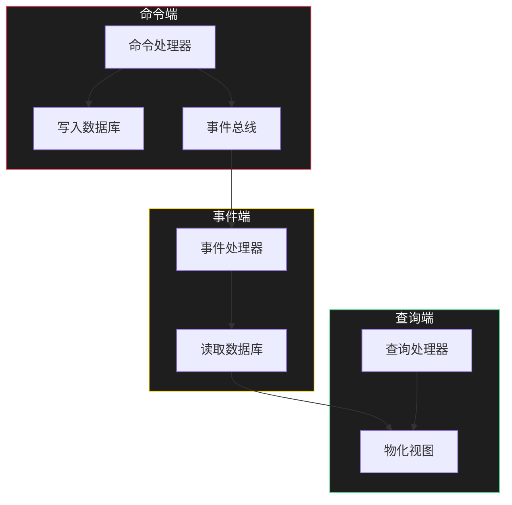
```mermaid
flowchart TB
    subgraph CommandSide["命令端"]
        CMD["命令处理器"]
        CMD_DB["写入数据库"]
        EVT_BUS["事件总线"]
    end

    subgraph EventSide["事件端"]
        EVT_HND["事件处理器"]
        READ_DB["读取数据库"]
    end

    subgraph QuerySide["查询端"]
        QRY["查询处理器"]
        VIEW["物化视图"]
    end

    CMD --> CMD_DB
    CMD --> EVT_BUS
    EVT_BUS --> EVT_HND
    EVT_HND --> READ_DB
    READ_DB --> VIEW
    QRY --> VIEW

    style CommandSide fill:#1e1e1e,stroke:#e94560,color:#ffffff
    style EventSide fill:#1e1e1e,stroke:#ffd700,color:#ffffff
    style QuerySide fill:#1e1e1e,stroke:#53d28a,color:#ffffff
```

**代码示例：**

```java
// 命令端 - 处理创建订单命令
public class OrderCommandHandler {
    
    private final EventStore eventStore;
    private final DomainEventPublisher eventPublisher;
    
    public void handle(CreateOrderCommand command) {
        OrderAggregate order = new OrderAggregate();
        OrderCreated created = order.createOrder(
                command.getCustomerId(),
                command.getItems()
        );
        
        // 保存事件
        eventStore.appendEvents(created.getAggregateId(), List.of(created));
        
        // 发布事件更新读取模型
        eventPublisher.publish(created);
    }
}

// 查询端 - 读取模型同步
public class OrderReadModelUpdater {
    
    private final JdbcTemplate jdbcTemplate;
    
    @EventListener
    public void handleOrderCreated(OrderCreatedEvent event) {
        jdbcTemplate.update(
            "INSERT INTO order_read_model (order_id, customer_id, status, total_amount, created_at) VALUES (?, ?, ?, ?, ?)",
            event.orderId(),
            event.customerId(),
            "CREATED",
            event.totalAmount(),
            Instant.now()
        );
    }
    
    @EventListener
    public void handleOrderUpdated(OrderUpdatedEvent event) {
        jdbcTemplate.update(
            "UPDATE order_read_model SET status = ?, updated_at = ? WHERE order_id = ?",
            event.newStatus(),
            Instant.now(),
            event.orderId()
        );
    }
}

// 查询端 - 提供高效的读取接口
public class OrderQueryService {
    
    private final JdbcTemplate jdbcTemplate;
    
    public OrderSummary getOrderSummary(String orderId) {
        return jdbcTemplate.queryForObject(
            "SELECT order_id, customer_id, status, total_amount FROM order_read_model WHERE order_id = ?",
            (rs, rowNum) -> new OrderSummary(
                rs.getString("order_id"),
                rs.getString("customer_id"),
                rs.getString("status"),
                rs.getBigDecimal("total_amount")
            ),
            orderId
        );
    }
    
    public List<OrderSummary> getOrdersByCustomer(String customerId) {
        return jdbcTemplate.query(
            "SELECT order_id, status, total_amount, created_at FROM order_read_model WHERE customer_id = ? ORDER BY created_at DESC",
            (rs, rowNum) -> new OrderSummary(
                rs.getString("order_id"),
                customerId,
                rs.getString("status"),
                rs.getBigDecimal("total_amount")
            ),
            customerId
        );
    }
}
```

---

## 5. 消息中间件选型

### 5.1 主流消息中间件对比

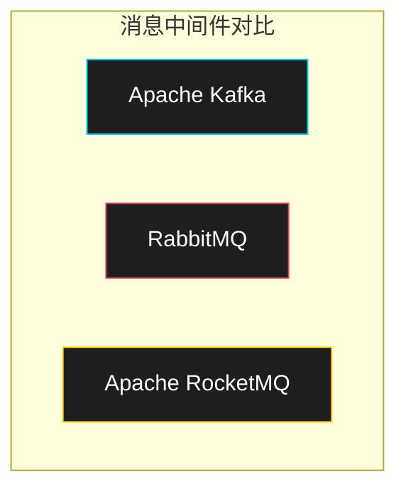
```mermaid
flowchart TB
    subgraph Comparison["消息中间件对比"]
        K["Apache Kafka"]
        R["RabbitMQ"]
        RM["Apache RocketMQ"]
    end

    style K fill:#1e1e1e,stroke:#00d9ff,color:#ffffff
    style R fill:#1e1e1e,stroke:#e94560,color:#ffffff
    style RM fill:#1e1e1e,stroke:#ffd700,color:#ffffff
```

| 特性 | Apache Kafka | RabbitMQ | Apache RocketMQ |
|------|-------------|----------|-----------------|
| **定位** | 分布式流处理平台 | 传统消息队列 | 金融级消息队列 |
| **吞吐量** | 极高（百万级/秒） | 中等（万级/秒） | 高（十万级/秒） |
| **延迟** | 毫秒级 | 微秒级 | 毫秒级 |
| **消息顺序** | 支持分区有序 | 支持单队列有序 | 支持消息顺序 |
| **消息持久化** | 高效持久化 | 支持但不高效 | 高效持久化 |
| **事务消息** | 支持（exactly-once） | 支持（手动实现） | 原生支持 |
| **延迟消息** | 需第三方支持 | 支持 | 原生支持 |
| **死信队列** | 需手动实现 | 原生支持 | 原生支持 |
| **集群部署** | 原生支持 | 需要 Federation 插件 | 原生支持 |
| **多租户** | 支持 | 支持 | 支持 |
| **官方维护** | Confluent/Apache | VMware | Alibaba/Apache |

### 5.2 Kafka 核心概念与代码示例

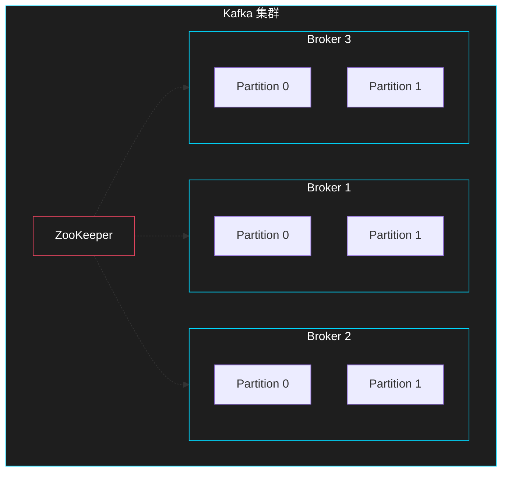
```mermaid
flowchart TB
    subgraph Kafka["Kafka 集群"]
        ZK["ZooKeeper"]
        subgraph Broker1["Broker 1"]
            P1A["Partition 0"]
            P1B["Partition 1"]
        end
        subgraph Broker2["Broker 2"]
            P2A["Partition 0"]
            P2B["Partition 1"]
        end
        subgraph Broker3["Broker 3"]
            P3A["Partition 0"]
            P3B["Partition 1"]
        end
    end

    ZK -.-> Broker1 & Broker2 & Broker3

    style Kafka fill:#1e1e1e,stroke:#00d9ff,color:#ffffff
    style ZK fill:#1e1e1e,stroke:#e94560,color:#ffffff
    style Broker1 fill:#1e1e1e,stroke:#00d9ff,color:#ffffff
    style Broker2 fill:#1e1e1e,stroke:#00d9ff,color:#ffffff
    style Broker3 fill:#1e1e1e,stroke:#00d9ff,color:#ffffff
```

**Kafka 代码示例：**

```java
// Kafka 生产者配置
@Configuration
public class KafkaProducerConfig {
    
    @Bean
    public ProducerFactory<String, Object> producerFactory() {
        Map<String, Object> configProps = new HashMap<>();
        configProps.put(ProducerConfig.BOOTSTRAP_SERVERS_CONFIG, "localhost:9092");
        configProps.put(ProducerConfig.KEY_SERIALIZER_CLASS_CONFIG, StringSerializer.class);
        configProps.put(ProducerConfig.VALUE_SERIALIZER_CLASS_CONFIG, JsonSerializer.class);
        configProps.put(ProducerConfig.ACKS_CONFIG, "all");
        configProps.put(ProducerConfig.RETRIES_CONFIG, 3);
        configProps.put(ProducerConfig.ENABLE_IDEMPOTENCE_CONFIG, true);
        return new DefaultKafkaProducerFactory<>(configProps);
    }
    
    @Bean
    public KafkaTemplate<String, Object> kafkaTemplate() {
        return new KafkaTemplate<>(producerFactory());
    }
}

// Kafka 消费者配置
@Configuration
public class KafkaConsumerConfig {
    
    @Bean
    public ConsumerFactory<String, Object> consumerFactory() {
        Map<String, Object> props = new HashMap<>();
        props.put(ConsumerConfig.BOOTSTRAP_SERVERS_CONFIG, "localhost:9092");
        props.put(ConsumerConfig.GROUP_ID_CONFIG, "order-service-group");
        props.put(ConsumerConfig.KEY_DESERIALIZER_CLASS_CONFIG, StringDeserializer.class);
        props.put(ConsumerConfig.VALUE_DESERIALIZER_CLASS_CONFIG, JsonDeserializer.class);
        props.put(ConsumerConfig.AUTO_OFFSET_RESET_CONFIG, "earliest");
        props.put(ConsumerConfig.ENABLE_AUTO_COMMIT_CONFIG, false);
        return new DefaultKafkaConsumerFactory<>(props);
    }
}

// 订单事件发布
@Service
public class OrderEventPublisher {
    
    private final KafkaTemplate<String, Object> kafkaTemplate;
    
    public void publishOrderCreated(OrderCreatedEvent event) {
        kafkaTemplate.send("order-events", event.orderId(), event)
            .whenComplete((result, ex) -> {
                if (ex == null) {
                    RecordMetadata metadata = result.getRecordMetadata();
                    log.info("Published event to topic {} partition {} offset {}",
                        metadata.topic(),
                        metadata.partition(),
                        metadata.offset()
                    );
                } else {
                    log.error("Failed to publish event", ex);
                }
            });
    }
}

// 订单事件消费
@Service
public class OrderEventConsumer {
    
    @KafkaListener(
        topics = "order-events",
        groupId = "notification-service",
        containerFactory = "kafkaListenerContainerFactory"
    )
    public void handleOrderCreated(
            @Payload OrderCreatedEvent event,
            @Header(KafkaHeaders.RECEIVED_PARTITION) int partition,
            @Header(KafkaHeaders.OFFSET) long offset) {
        
        log.info("Received order event from partition {} offset {}", partition, offset);
        
        try {
            notificationService.sendOrderConfirmation(event);
            log.info("Successfully processed order: {}", event.orderId());
        } catch (Exception e) {
            log.error("Failed to process order: {}", event.orderId(), e);
            throw e; // 重试或发送到死信队列
        }
    }
}
```

### 5.3 RabbitMQ 核心概念与代码示例

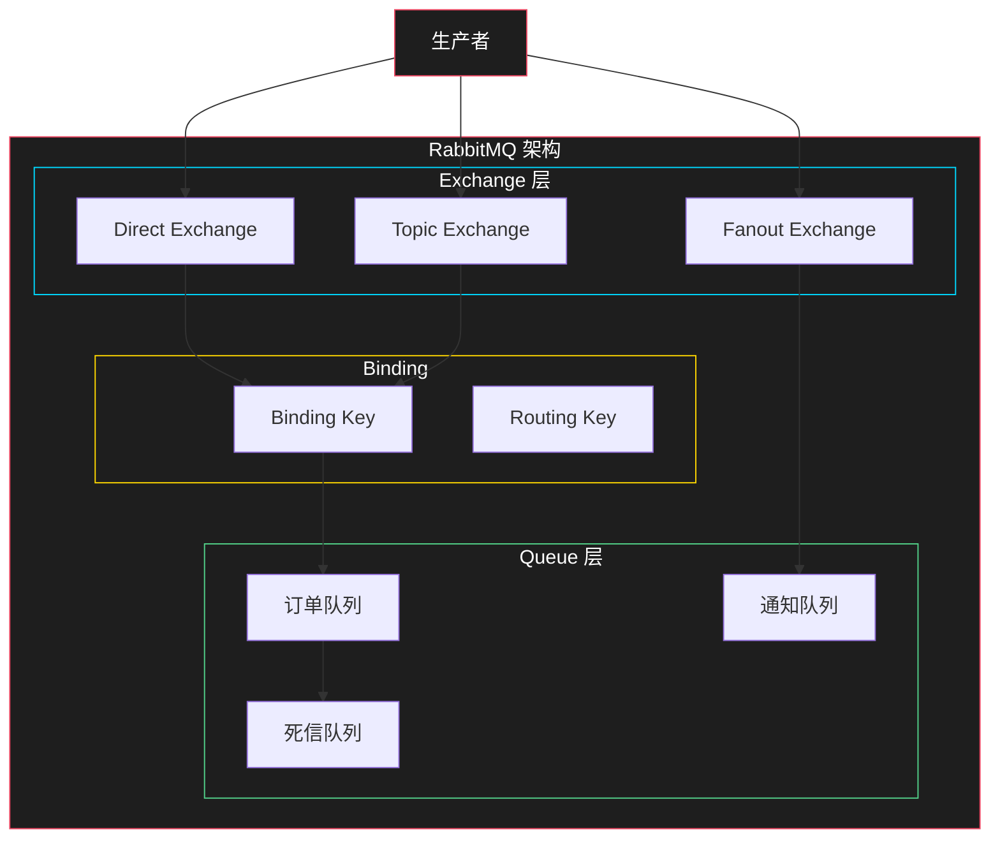
```mermaid
flowchart TB
    subgraph RabbitMQ["RabbitMQ 架构"]
        subgraph Exchange["Exchange 层"]
            EX1["Direct Exchange"]
            EX2["Topic Exchange"]
            EX3["Fanout Exchange"]
        end

        subgraph Binding["Binding"]
            B1["Binding Key"]
            B2["Routing Key"]
        end

        subgraph Queue["Queue 层"]
            Q1["订单队列"]
            Q2["通知队列"]
            Q3["死信队列"]
        end
    end

    P["生产者"] --> EX1 & EX2 & EX3
    EX1 --> B1
    EX2 --> B1
    B1 --> Q1
    Q1 --> Q3
    EX3 --> Q2

    style RabbitMQ fill:#1e1e1e,stroke:#e94560,color:#ffffff
    style Exchange fill:#1e1e1e,stroke:#00d9ff,color:#ffffff
    style Binding fill:#1e1e1e,stroke:#ffd700,color:#ffffff
    style Queue fill:#1e1e1e,stroke:#53d28a,color:#ffffff
    style P fill:#1e1e1e,stroke:#e94560,color:#ffffff
```

**RabbitMQ 代码示例：**

```java
// RabbitMQ 配置
@Configuration
public class RabbitMQConfig {
    
    // 交换机
    @Bean
    public DirectExchange orderExchange() {
        return new DirectExchange("order.exchange", true, false);
    }
    
    // 死信交换机
    @Bean
    public DirectExchange deadLetterExchange() {
        return new DirectExchange("order.dlx", true, false);
    }
    
    // 订单队列（带死信配置）
    @Bean
    public Queue orderQueue() {
        return QueueBuilder.durable("order.queue")
                .withArgument("x-dead-letter-exchange", "order.dlx")
                .withArgument("x-dead-letter-routing-key", "order.dead")
                .withArgument("x-message-ttl", 30000) // 30秒 TTL
                .build();
    }
    
    // 死信队列
    @Bean
    public Queue deadLetterQueue() {
        return QueueBuilder.durable("order.dlq").build();
    }
    
    // 绑定
    @Bean
    public Binding orderBinding() {
        return BindingBuilder
                .bind(orderQueue())
                .to(orderExchange())
                .with("order.created");
    }
    
    @Bean
    public Binding deadLetterBinding() {
        return BindingBuilder
                .bind(deadLetterQueue())
                .to(deadLetterExchange())
                .with("order.dead");
    }
}

// 生产者
@Service
public class OrderProducer {
    
    private final RabbitTemplate rabbitTemplate;
    
    public void sendOrderMessage(Order order) {
        Message message = MessageBuilder
                .withBody(toJson(order))
                .setContentType(MessageProperties.CONTENT_TYPE_JSON)
                .setDeliveryMode(MessageDeliveryMode.PERSISTENT)
                .build();
        
        rabbitTemplate.send(
                "order.exchange",
                "order.created",
                message,
                new CorrelationData(order.getOrderId())
        );
    }
}

// 消费者
@Service
public class OrderConsumer {
    
    @RabbitListener(queues = "order.queue", concurrency = "3-10")
    public void handleOrderMessage(Message message, Channel channel) throws IOException {
        long deliveryTag = message.getMessageProperties().getDeliveryTag();
        
        try {
            Order order = fromJson(message.getBody(), Order.class);
            processOrder(order);
            channel.basicAck(deliveryTag, false);
        } catch (Exception e) {
            // 拒绝消息并重新入队（最多重试3次）
            Integer retryCount = getRetryCount(message);
            if (retryCount < 3) {
                channel.basicNack(deliveryTag, false, true);
            } else {
                // 超过重试次数，发送到死信队列
                channel.basicReject(deliveryTag, false);
            }
        }
    }
}
```

### 5.4 RocketMQ 核心概念与代码示例

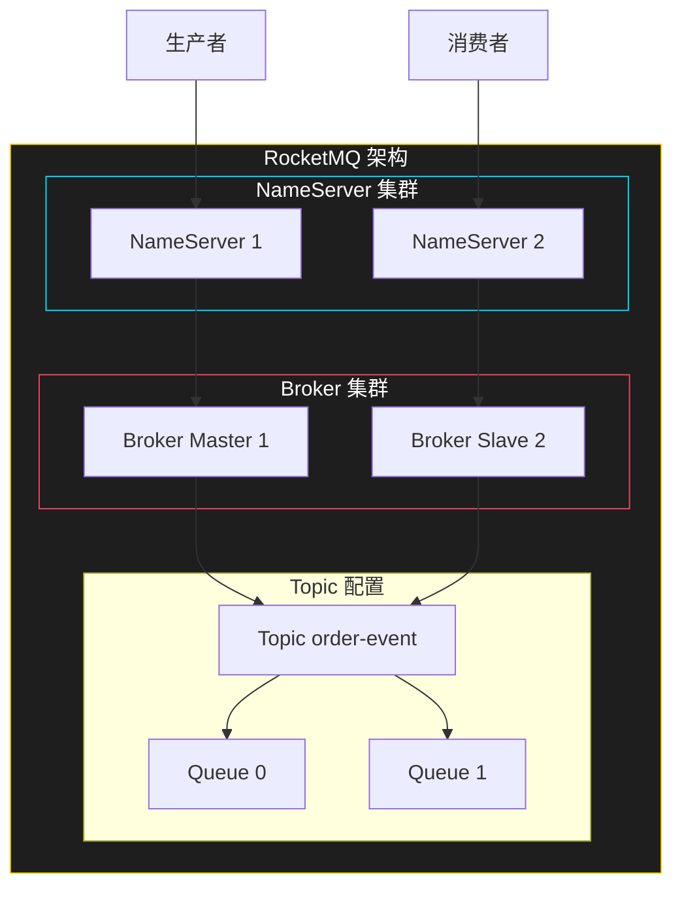
```mermaid
flowchart TB
    subgraph RocketMQ["RocketMQ 架构"]
        subgraph NameServer["NameServer 集群"]
            NS1["NameServer 1"]
            NS2["NameServer 2"]
        end

        subgraph BrokerCluster["Broker 集群"]
            B1["Broker Master 1"]
            B2["Broker Slave 2"]
        end

        subgraph Topics["Topic 配置"]
            T1["Topic order-event"]
            T2["Queue 0"]
            T3["Queue 1"]
        end
    end

    P["生产者"] --> NS1
    C["消费者"] --> NS2
    NS1 --> B1
    NS2 --> B2
    B1 --> T1
    B2 --> T1
    T1 --> T2 & T3

    style RocketMQ fill:#1e1e1e,stroke:#ffd700,color:#ffffff
    style NameServer fill:#1e1e1e,stroke:#00d9ff,color:#ffffff
    style BrokerCluster fill:#1e1e1e,stroke:#e94560,color:#ffffff
```

**RocketMQ 代码示例：**

```java
// RocketMQ 生产者配置
@Configuration
public class RocketMQConfig {
    
    @Bean
    public DefaultMQProducer orderProducer() throws MQClientException {
        DefaultMQProducer producer = new DefaultMQProducer("order-producer-group");
        producer.setNamesrvAddr("localhost:9876");
        producer.setRetryTimesWhenSendFailed(3);
        producer.enableMsgTrace(); // 开启消息轨迹
        producer.start();
        return producer;
    }
    
    @Bean
    public TransactionMQProducer transactionProducer() throws MQClientException {
        TransactionMQProducer producer = new TransactionMQProducer("order-transaction-group");
        producer.setNamesrvAddr("localhost:9876");
        producer.setTransactionListener(new OrderTransactionListener());
        producer.start();
        return producer;
    }
}

// 事务消息生产者
@Service
public class OrderTransactionProducer {
    
    private final TransactionMQProducer transactionProducer;
    
    public void sendOrderWithTransaction(Order order) {
        Message message = new Message(
                "order-topic",
                "order-created",
                order.getOrderId(),
                toJson(order).getBytes()
        );
        
        transactionProducer.sendMessageInTransaction(message, new LocalTransactionState());
    }
}

// RocketMQ 消费者
@Service
public class OrderConsumer {
    
    @MQConsumerListener(
        topic = "order-topic",
        consumerGroup = "order-consumer-group",
        selectorExpression = "order-created"
    )
    public void handleOrderMessage(Message message, ConsumeContext context) {
        try {
            Order order = fromJson(new String(message.getBody()), Order.class);
            processOrder(order);
            context.commit(); // 提交消费成功
        } catch (Exception e) {
            context.reset(); // 重置消费位置重试
        }
    }
}
```

### 5.5 选型决策指南

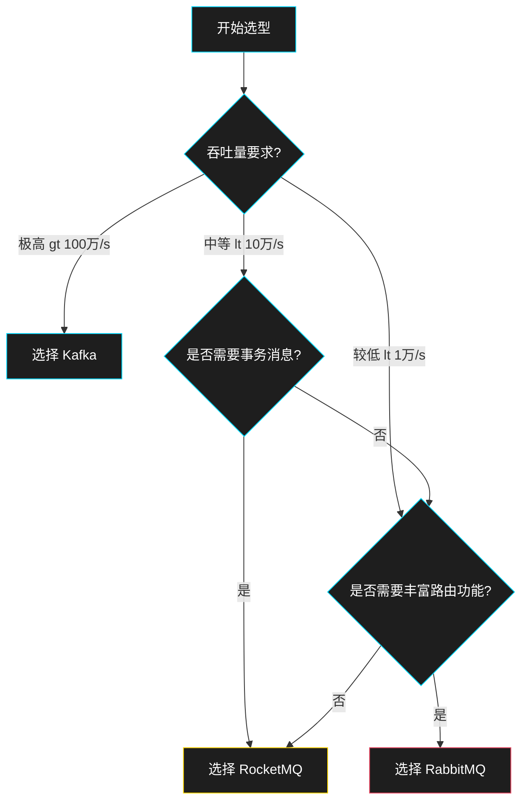
```mermaid
flowchart TD
    START["开始选型"] --> Q1{"吞吐量要求?"}

    Q1 -->|"极高 gt 100万/s"| K["选择 Kafka"]
    Q1 -->|"中等 lt 10万/s"| Q2{"是否需要事务消息?"}
    Q1 -->|"较低 lt 1万/s"| Q3

    Q2 -->|"是"| RM["选择 RocketMQ"]
    Q2 -->|"否"| Q3{"是否需要丰富路由功能?"}

    Q3 -->|"是"| R["选择 RabbitMQ"]
    Q3 -->|"否"| RM

    style K fill:#1e1e1e,stroke:#00d9ff,color:#ffffff
    style R fill:#1e1e1e,stroke:#e94560,color:#ffffff
    style RM fill:#1e1e1e,stroke:#ffd700,color:#ffffff
    style START fill:#1e1e1e,stroke:#00d9ff,color:#ffffff
    style Q1 fill:#1e1e1e,stroke:#00d9ff,color:#ffffff
    style Q2 fill:#1e1e1e,stroke:#00d9ff,color:#ffffff
    style Q3 fill:#1e1e1e,stroke:#00d9ff,color:#ffffff
```

---

## 6. 工程实践案例

### 6.1 订单系统事件处理

#### 6.1.1 业务场景分析

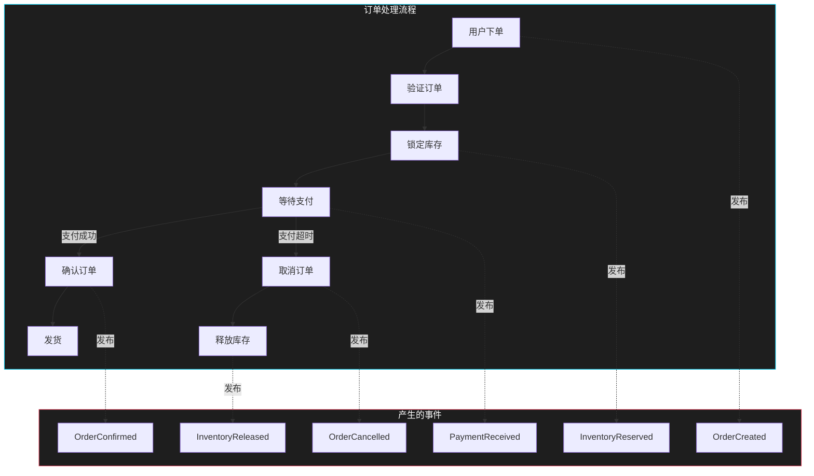
```mermaid
flowchart TB
    subgraph OrderProcess["订单处理流程"]
        START["用户下单"] --> VALIDATE["验证订单"]
        VALIDATE --> RESERVE["锁定库存"]
        RESERVE --> PAYMENT["等待支付"]
        PAYMENT -->|"支付成功"| CONFIRM["确认订单"]
        PAYMENT -->|"支付超时"| CANCEL["取消订单"]
        CONFIRM --> SHIP["发货"]
        CANCEL --> RELEASE["释放库存"]
    end

    subgraph Events["产生的事件"]
        E1["OrderCreated"]
        E2["InventoryReserved"]
        E3["PaymentReceived"]
        E4["OrderConfirmed"]
        E5["OrderCancelled"]
        E6["InventoryReleased"]
    end

    START -.->|"发布"| E1
    RESERVE -.->|"发布"| E2
    PAYMENT -.->|"发布"| E3
    CONFIRM -.->|"发布"| E4
    CANCEL -.->|"发布"| E5
    RELEASE -.->|"发布"| E6

    style OrderProcess fill:#1e1e1e,stroke:#00d9ff,color:#ffffff
    style Events fill:#1e1e1e,stroke:#e94560,color:#ffffff
```

#### 6.1.2 完整代码实现

```java
// ========== 1. 事件定义 ==========

// 订单领域事件基类
public abstract class OrderDomainEvent {
    private final String eventId;
    private final String orderId;
    private final Instant occurredAt;
    
    protected OrderDomainEvent(String orderId) {
        this.eventId = UUID.randomUUID().toString();
        this.orderId = orderId;
        this.occurredAt = Instant.now();
    }
}

// 订单创建事件
public record OrderCreatedEvent(
        String orderId,
        String customerId,
        String customerEmail,
        List<OrderItemDTO> items,
        BigDecimal totalAmount
) implements OrderEvent {
    public OrderCreatedEvent(String orderId, String customerId, 
                             String customerEmail, List<OrderItemDTO> items,
                             BigDecimal totalAmount) {
        this.orderId = orderId;
        this.customerId = customerId;
        this.customerEmail = customerEmail;
        this.items = List.copyOf(items);
        this.totalAmount = totalAmount;
    }
}

// 库存预留事件
public record InventoryReservedEvent(
        String orderId,
        List<ReservedItem> reservedItems
) implements OrderEvent {}

// 支付完成事件
public record PaymentCompletedEvent(
        String orderId,
        String paymentId,
        BigDecimal paidAmount,
        String paymentMethod
) implements OrderEvent {}

// 订单取消事件
public record OrderCancelledEvent(
        String orderId,
        String reason,
        String cancelledBy
) implements OrderEvent {}

// ========== 2. 订单聚合根 ==========

public class OrderAggregate {
    
    private String orderId;
    private String customerId;
    private OrderStatus status;
    private List<OrderItem> items;
    private BigDecimal totalAmount;
    private String paymentId;
    private Instant createdAt;
    private Instant expiredAt;
    
    // 创建订单
    public OrderCreatedEvent createOrder(CreateOrderCommand command) {
        validateOrder(command);
        return new OrderCreatedEvent(
                UUID.randomUUID().toString(),
                command.getCustomerId(),
                command.getCustomerEmail(),
                toItemDTOs(command.getItems()),
                calculateTotal(command.getItems())
        );
    }
    
    // 应用订单创建事件
    public void apply(OrderCreatedEvent event) {
        this.orderId = event.orderId();
        this.customerId = event.customerId();
        this.status = OrderStatus.CREATED;
        this.items = toOrderItems(event.items());
        this.totalAmount = event.totalAmount();
        this.createdAt = Instant.now();
        this.expiredAt = createdAt.plusMinutes(30); // 30分钟支付超时
    }
    
    // 确认订单
    public OrderConfirmedEvent confirmOrder(String paymentId) {
        if (this.status != OrderStatus.PAID) {
            throw new IllegalStateException("Order must be paid before confirmation");
        }
        return new OrderConfirmedEvent(this.orderId, paymentId);
    }
    
    // 取消订单
    public OrderCancelledEvent cancelOrder(String reason, String cancelledBy) {
        if (this.status == OrderStatus.SHIPPED || this.status == OrderStatus.DELIVERED) {
            throw new IllegalStateException("Cannot cancel shipped or delivered order");
        }
        return new OrderCancelledEvent(this.orderId, reason, cancelledBy);
    }
    
    private void validateOrder(CreateOrderCommand command) {
        if (command.getItems() == null || command.getItems().isEmpty()) {
            throw new IllegalArgumentException("Order items cannot be empty");
        }
        if (command.getCustomerId() == null) {
            throw new IllegalArgumentException("Customer ID is required");
        }
    }
}

// ========== 3. 订单服务（命令端）==========

@Service
public class OrderCommandService {
    
    private final OrderRepository orderRepository;
    private final EventPublisher eventPublisher;
    private final IdempotencyService idempotencyService;
    
    @Transactional
    public CreateOrderResponse createOrder(CreateOrderCommand command) {
        // 幂等性检查
        if (idempotencyService.isProcessed(command.getIdempotencyKey())) {
            return idempotencyService.getExistingResponse(command.getIdempotencyKey());
        }
        
        OrderAggregate order = new OrderAggregate();
        OrderCreatedEvent event = order.createOrder(command);
        order.apply(event);
        
        // 保存订单和事件
        orderRepository.save(order);
        eventStore.append(event);
        
        // 发布事件
        eventPublisher.publish("order.events", event.orderId(), event);
        
        // 记录幂等性
        CreateOrderResponse response = new CreateOrderResponse(event.orderId());
        idempotencyService.saveResponse(command.getIdempotencyKey(), response);
        
        return response;
    }
    
    @Transactional
    public void confirmOrder(String orderId, String paymentId) {
        OrderAggregate order = orderRepository.findById(orderId);
        OrderConfirmedEvent event = order.confirmOrder(paymentId);
        
        orderRepository.save(order);
        eventStore.append(event);
        eventPublisher.publish("order.events", event.orderId(), event);
    }
    
    @Transactional
    public void cancelOrder(String orderId, String reason, String cancelledBy) {
        OrderAggregate order = orderRepository.findById(orderId);
        OrderCancelledEvent event = order.cancelOrder(reason, cancelledBy);
        
        orderRepository.save(order);
        eventStore.append(event);
        eventPublisher.publish("order.events", event.orderId(), event);
    }
}

// ========== 4. 事件处理器（消费者）==========

// 库存服务 - 处理订单创建事件
@Service
public class InventoryEventHandler {
    
    private final InventoryService inventoryService;
    
    @KafkaListener(topics = "order.events", groupId = "inventory-group")
    public void handleOrderCreated(OrderCreatedEvent event) {
        try {
            List<ReservedItem> reservedItems = inventoryService.reserveInventory(
                    event.orderId(),
                    event.items()
            );
            
            // 发布库存预留成功事件
            eventPublisher.publish(
                    "inventory.events",
                    event.orderId(),
                    new InventoryReservedEvent(event.orderId(), reservedItems)
            );
        } catch (InsufficientStockException e) {
            // 发布库存不足事件，触发订单自动取消
            eventPublisher.publish(
                    "inventory.events",
                    event.orderId(),
                    new InventoryInsufficientEvent(event.orderId(), e.getMessage())
            );
        }
    }
}

// 支付服务 - 处理订单创建事件，发送支付待办
@Service
public class PaymentEventHandler {
    
    private final PaymentService paymentService;
    
    @KafkaListener(topics = "order.events", groupId = "payment-group")
    public void handleOrderCreated(OrderCreatedEvent event) {
        // 创建待支付订单
        paymentService.createPaymentTask(
                PaymentTask.builder()
                        .orderId(event.orderId())
                        .amount(event.totalAmount())
                        .customerEmail(event.customerEmail())
                        .expiredAt(Instant.now().plusMinutes(30))
                        .build()
        );
    }
}

// 通知服务 - 处理多个事件
@Service
public class NotificationEventHandler {
    
    @KafkaListener(topics = "order.events", groupId = "notification-group")
    public void handleOrderEvent(Object event) {
        if (event instanceof OrderCreatedEvent e) {
            notificationService.sendOrderConfirmation(e);
        } else if (event instanceof OrderConfirmedEvent e) {
            notificationService.sendOrderConfirmed(e);
        } else if (event instanceof OrderCancelledEvent e) {
            notificationService.sendOrderCancelled(e);
        }
    }
}

// 审计服务 - 记录所有事件
@Service
public class AuditEventHandler {
    
    private final AuditRepository auditRepository;
    
    @KafkaListener(topics = ["order.events", "inventory.events", "payment.events"], 
                   groupId = "audit-group")
    public void handleAnyEvent(Object event) {
        AuditLog log = AuditLog.builder()
                .eventType(event.getClass().getSimpleName())
                .eventData(toJson(event))
                .occurredAt(Instant.now())
                .build();
        auditRepository.save(log);
    }
}
```

#### 6.1.3 订单事件处理完整流程

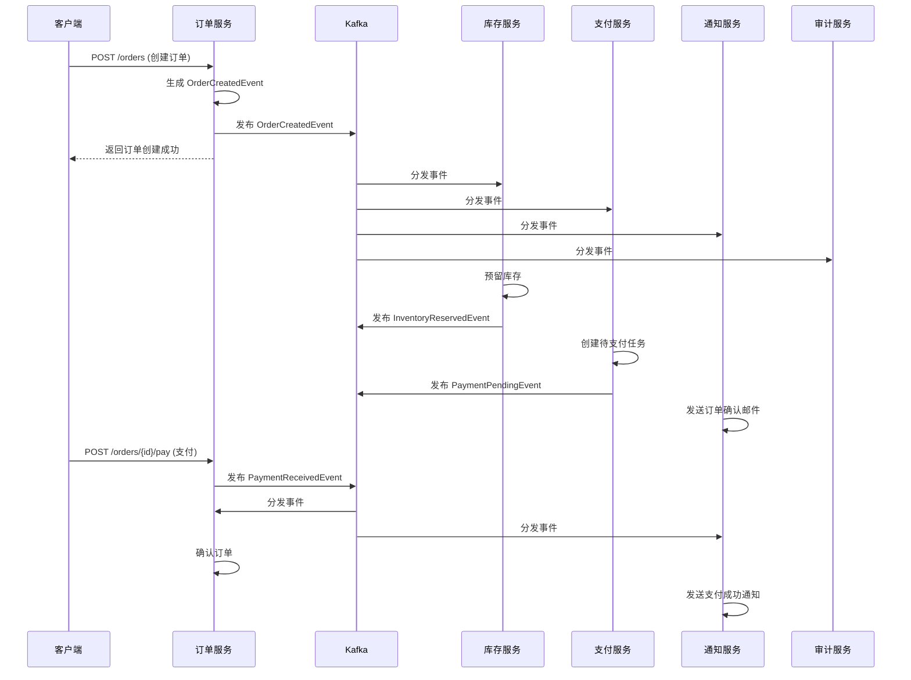
```mermaid
sequenceDiagram
    participant Client as 客户端
    participant Order as 订单服务
    participant Kafka as Kafka
    participant Inventory as 库存服务
    participant Payment as 支付服务
    participant Notify as 通知服务
    participant Audit as 审计服务

    Client->>Order: POST /orders (创建订单)
    Order->>Order: 生成 OrderCreatedEvent
    Order->>Kafka: 发布 OrderCreatedEvent
    Order-->>Client: 返回订单创建成功

    Kafka->>Inventory: 分发事件
    Kafka->>Payment: 分发事件
    Kafka->>Notify: 分发事件
    Kafka->>Audit: 分发事件

    Inventory->>Inventory: 预留库存
    Inventory->>Kafka: 发布 InventoryReservedEvent

    Payment->>Payment: 创建待支付任务
    Payment->>Kafka: 发布 PaymentPendingEvent

    Notify->>Notify: 发送订单确认邮件

    Client->>Order: POST /orders/{id}/pay (支付)
    Order->>Kafka: 发布 PaymentReceivedEvent

    Kafka->>Order: 分发事件
    Kafka->>Notify: 分发事件

    Order->>Order: 确认订单
    Notify->>Notify: 发送支付成功通知
```

### 6.2 用户行为追踪系统

#### 6.2.1 业务场景分析

```mermaid
flowchart TB
    subgraph Collection["数据采集层"]
        WEB["Web 前端"]
        APP["移动 App"]
        MINI["小程序"]
    end

    subgraph Transmission["传输层"]
        GA["Gateway Agent"]
        Kafka["Kafka"]
    end

    subgraph Processing["处理层"]
        STREAM["流处理引擎"]
        BATCH["批处理引擎"]
    end

    subgraph Storage["存储层"]
        CLICK["ClickHouse 实时分析"]
        HIVE["Hive 历史归档"]
        ES["Elasticsearch 即席查询"]
    end

    subgraph Application["应用层"]
        DASH["实时大屏"]
        REPORT["报表系统"]
        REC["推荐系统"]
    end

    WEB & APP & MINI -->|"HTTPS"| GA
    GA --> Kafka
    Kafka --> STREAM
    Kafka --> BATCH

    STREAM --> CLICK & ES
    BATCH --> HIVE

    CLICK & ES & HIVE --> DASH & REPORT & REC

    style Collection fill:#1e1e1e,stroke:#00d9ff,color:#ffffff
    style Transmission fill:#1e1e1e,stroke:#e94560,color:#ffffff
    style Processing fill:#1e1e1e,stroke:#ffd700,color:#ffffff
    style Storage fill:#1e1e1e,stroke:#53d28a,color:#ffffff
    style Application fill:#1e1e1e,stroke:#00d9ff,color:#ffffff
```

#### 6.2.2 完整代码实现

```java
// ========== 1. 用户行为事件定义 ==========

public enum BehaviorType {
    PAGE_VIEW,      // 页面浏览
    CLICK,          // 点击
    SEARCH,         // 搜索
    ADD_TO_CART,    // 添加购物车
    PURCHASE,       // 购买
    SIGN_IN,        // 登录
    SIGN_OUT,       // 登出
    SCROLL,         // 滚动
    VIDEO_PLAY,     // 视频播放
    FORM_SUBMIT     // 表单提交
}

public record UserBehaviorEvent(
        String eventId,           // 事件唯一 ID
        String sessionId,         // 会话 ID
        String userId,            // 用户 ID（可为 null）
        String deviceId,          // 设备 ID
        BehaviorType eventType,   // 事件类型
        String pageUrl,           // 页面 URL
        String elementId,         // 元素 ID
        String elementName,       // 元素名称
        Map<String, Object> properties, // 自定义属性
        Instant occurredAt,       // 发生时间
        String clientIp,          // 客户端 IP
        String userAgent,         // User Agent
        String country,           // 国家
        String province,          // 省份
        String city               // 城市
) {
    public UserBehaviorEvent {
        if (eventId == null) eventId = UUID.randomUUID().toString();
        if (occurredAt == null) occurredAt = Instant.now();
    }
}

// ========== 2. 事件采集网关 ==========

@RestController
public class BehaviorCollectorGateway {
    
    private final KafkaTemplate<String, UserBehaviorEvent> kafkaTemplate;
    private final ObjectMapper objectMapper;
    
    @PostMapping("/api/v1/collect")
    public ResponseEntity<Void> collect(@RequestBody List<UserBehaviorEvent> events) {
        for (UserBehaviorEvent event : events) {
            // 使用设备 ID 作为 partition key，保证同一设备事件有序
            kafkaTemplate.send(
                    "user-behavior-events",
                    event.deviceId(),
                    event
            );
        }
        return ResponseEntity.accepted().build();
    }
    
    // 埋点脚本生成的像素请求
    @GetMapping("/api/v1/track.gif")
    public void track(HttpServletRequest request, HttpServletResponse response) throws IOException {
        // 解析埋点参数
        String data = request.getParameter("data");
        UserBehaviorEvent event = objectMapper.readValue(
                new String(Base64.getDecoder().decode(data)),
                UserBehaviorEvent.class
        );
        
        // 异步发送，不阻塞页面
        CompletableFuture.runAsync(() -> 
                kafkaTemplate.send("user-behavior-events", event.deviceId(), event)
        );
        
        // 返回 1x1 透明 GIF
        response.setContentType("image/gif");
        response.getOutputStream().write(GIF_1X1);
    }
}

// ========== 3. 流处理 - 实时统计 ==========

@Service
public class RealtimeStatisticsProcessor {
    
    private final RedisTemplate<String, String> redisTemplate;
    
    @KafkaListener(topics = "user-behavior-events", groupId = "realtime-stats-group")
    public void processBehavior(UserBehaviorEvent event) {
        String dateKey = DateTimeFormatter.ofPattern("yyyyMMdd")
                .format(event.occurredAt());
        
        switch (event.eventType()) {
            case PAGE_VIEW -> incrementPageView(event.pageUrl(), dateKey);
            case CLICK -> incrementClick(event.elementId(), dateKey);
            case ADD_TO_CART -> incrementCartAddition(event.userId(), dateKey);
            case PURCHASE -> incrementPurchase(event.userId(), dateKey);
        }
    }
    
    private void incrementPageView(String pageUrl, String dateKey) {
        String key = String.format("stats:pv:%s:%s", dateKey, pageUrl);
        redisTemplate.opsForValue().increment(key);
        
        // 实时更新 UV
        String uvKey = String.format("stats:uv:%s", dateKey);
        redisTemplate.opsForSet().add(uvKey, pageUrl.split("\\?")[0]);
    }
    
    private void incrementClick(String elementId, String dateKey) {
        String key = String.format("stats:click:%s:%s", dateKey, elementId);
        redisTemplate.opsForValue().increment(key);
    }
    
    public Map<String, Object> getRealtimeStats(String dateKey) {
        Map<String, Object> stats = new HashMap<>();
        
        // 获取今日 PV
        Set<String> keys = redisTemplate.keys("stats:pv:" + dateKey + ":*");
        long totalPv = keys.stream()
                .mapToLong(k -> Long.parseLong(redisTemplate.opsForValue().get(k)))
                .sum();
        stats.put("totalPv", totalPv);
        
        // 获取今日 UV
        Long uv = redisTemplate.opsForSet().size("stats:uv:" + dateKey);
        stats.put("totalUv", uv);
        
        return stats;
    }
}

// ========== 4. 批处理 - 用户画像 ==========

@Component
public class UserProfileProcessor {
    
    private final JdbcTemplate jdbcTemplate;
    
    @KafkaListener(topics = "user-behavior-events", groupId = "user-profile-group")
    public void processForUserProfile(UserBehaviorEvent event) {
        if (event.userId() == null) return;
        
        // 更新用户行为统计
        updateUserBehaviorStats(event);
        
        // 更新用户兴趣标签
        updateUserInterestTags(event);
        
        // 更新用户活跃度
        updateUserActivityScore(event);
    }
    
    private void updateUserBehaviorStats(UserBehaviorEvent event) {
        String sql = """
            INSERT INTO user_behavior_stats 
                (user_id, behavior_type, count, last_occurred_at)
            VALUES (?, ?, 1, ?)
            ON CONFLICT (user_id, behavior_type) 
            DO UPDATE SET 
                count = user_behavior_stats.count + 1,
                last_occurred_at = ?
            """;
        
        jdbcTemplate.update(sql, 
                event.userId(),
                event.eventType().name(),
                event.occurredAt(),
                event.occurredAt()
        );
    }
    
    private void updateUserInterestTags(UserBehaviorEvent event) {
        if (event.eventType() == BehaviorType.PAGE_VIEW) {
            // 从页面 URL 提取分类信息
            String category = extractCategoryFromUrl(event.pageUrl());
            if (category != null) {
                String sql = """
                    UPDATE user_profiles 
                    SET interests = array_append(interests, ?),
                        updated_at = NOW()
                    WHERE user_id = ?
                    """;
                jdbcTemplate.update(sql, category, event.userId());
            }
        }
    }
    
    private void updateUserActivityScore(UserBehaviorEvent event) {
        // 根据行为类型计算活跃度得分
        int score = switch (event.eventType()) {
            case PAGE_VIEW -> 1;
            case CLICK -> 2;
            case SEARCH -> 3;
            case ADD_TO_CART -> 5;
            case PURCHASE -> 10;
            default -> 1;
        };
        
        String sql = """
            UPDATE user_profiles 
            SET activity_score = activity_score + ?,
                last_active_at = ?,
                updated_at = NOW()
            WHERE user_id = ?
            """;
        
        jdbcTemplate.update(sql, score, event.occurredAt(), event.userId());
    }
}

// ========== 5. 推荐系统事件处理 ==========

@Service
public class RecommendationEventHandler {
    
    private final RecommendationEngine recommendationEngine;
    
    @KafkaListener(topics = "user-behavior-events", groupId = "recommendation-group")
    public void handleBehavior(UserBehaviorEvent event) {
        if (event.userId() == null) return;
        
        switch (event.eventType()) {
            case ADD_TO_CART -> handleAddToCart(event);
            case PURCHASE -> handlePurchase(event);
            case PAGE_VIEW -> handlePageView(event);
        }
    }
    
    private void handleAddToCart(UserBehaviorEvent event) {
        // 提取商品 ID
        String productId = extractProductId(event.properties());
        if (productId != null) {
            // 异步更新用户协同过滤数据
            CompletableFuture.runAsync(() ->
                    recommendationEngine.updateCollaborativeData(
                            event.userId(),
                            productId,
                            "cart"
                    )
            );
        }
    }
    
    private void handlePurchase(UserBehaviorEvent event) {
        // 购买完成后，更新用户的推荐偏好
        String productId = extractProductId(event.properties());
        if (productId != null) {
            CompletableFuture.runAsync(() ->
                    recommendationEngine.updateUserPreferences(
                            event.userId(),
                            productId
                    )
            );
        }
    }
    
    private void handlePageView(UserBehaviorEvent event) {
        // 记录用户浏览历史，用于实时推荐
        String productId = extractProductId(event.properties());
        if (productId != null) {
            redisTemplate.opsForList().leftPush(
                    "user:" + event.userId() + ":viewed",
                    productId
            );
            // 只保留最近 100 条
            redisTemplate.opsForList().trim(
                    "user:" + event.userId() + ":viewed",
                    0, 99
            );
        }
    }
}
```

#### 6.2.3 用户行为追踪数据流

```mermaid
flowchart LR
    subgraph Client["客户端"]
        JS["埋点 SDK"]
    end

    subgraph Collection["采集"]
        GW["Gateway"]
        Kafka["Kafka Cluster"]
    end

    subgraph RealTime["实时处理"]
        FLINK["Flink 流处理"]
        REDIS["Redis"]
    end

    subgraph Storage["存储"]
        CK["ClickHouse"]
        HB["HBase"]
    end

    subgraph Analytics["分析"]
        DASH["Grafana"]
        REPORT["报表"]
    end

    JS -->|"批量/实时"| GW
    GW --> Kafka
    Kafka --> FLINK
    FLINK -->|"聚合统计"| REDIS
    FLINK -->|"明细数据"| CK
    FLINK -->|"用户画像"| HB

    REDIS --> DASH
    CK --> REPORT

    style Client fill:#1e1e1e,stroke:#00d9ff,color:#ffffff
    style Collection fill:#1e1e1e,stroke:#e94560,color:#ffffff
    style RealTime fill:#1e1e1e,stroke:#ffd700,color:#ffffff
    style Storage fill:#1e1e1e,stroke:#53d28a,color:#ffffff
    style Analytics fill:#1e1e1e,stroke:#00d9ff,color:#ffffff
```

---

## 7. 事件驱动架构的挑战

### 7.1 事务一致性

事件驱动架构中的事务一致性是一个核心挑战。由于事件是异步处理的，传统的 ACID 事务无法跨多个服务保证原子性。

#### 7.1.1 问题分析

```mermaid
flowchart TB
    subgraph Problem["事务一致性问题"]
        O["订单服务"]
        I["库存服务"]
        P["支付服务"]
    end

    subgraph Events["事件序列"]
        E1["OrderCreated"]
        E2["InventoryReserved"]
        E3["PaymentReceived"]
    end

    O -->|"成功"| E1
    I -->|"成功"| E2
    P -->|"失败"| E3

    style Problem fill:#1e1e1e,stroke:#e94560,color:#ffffff
    style Events fill:#1e1e1e,stroke:#00d9ff,color:#ffffff
```

**常见问题场景：**

- **库存预留成功，支付失败**：需要回滚库存
- **订单创建成功，库存预留失败**：需要取消订单
- **部分消费者成功，部分失败**：数据不一致

#### 7.1.2 解决方案：Saga 模式

```mermaid
flowchart TB
    subgraph Saga["Saga 编排"]
        START["开始"] --> STEP1["预留库存"]
        STEP1 -->|"成功"| STEP2["扣减库存"]
        STEP2 -->|"成功"| STEP3["处理支付"]
        STEP3 -->|"失败"| COMP3["补偿支付"]
        COMP3 -->|"成功"| COMP2["恢复库存"]
        COMP2 -->|"成功"| END["结束"]
    end

    style Saga fill:#1e1e1e,stroke:#00d9ff,color:#ffffff
    style START fill:#1e1e1e,stroke:#53d28a,color:#ffffff
    style STEP1 fill:#1e1e1e,stroke:#00d9ff,color:#ffffff
    style STEP2 fill:#1e1e1e,stroke:#00d9ff,color:#ffffff
    style STEP3 fill:#1e1e1e,stroke:#00d9ff,color:#ffffff
    style COMP3 fill:#1e1e1e,stroke:#e94560,color:#ffffff
    style COMP2 fill:#1e1e1e,stroke:#e94560,color:#ffffff
    style END fill:#1e1e1e,stroke:#e94560,color:#ffffff
```

**代码实现：**

```java
// Saga 编排器
public class OrderCreationSaga {
    
    private final InventoryService inventoryService;
    private final PaymentService paymentService;
    private final EventPublisher eventPublisher;
    
    // 正向操作
    public void execute(CreateOrderCommand command) {
        String orderId = UUID.randomUUID().toString();
        List<ReservedItem> reservedItems = null;
        String paymentId = null;
        
        try {
            // Step 1: 创建订单
            OrderCreatedEvent orderEvent = createOrder(orderId, command);
            eventPublisher.publish(orderEvent);
            
            // Step 2: 预留库存
            reservedItems = inventoryService.reserve(orderId, command.getItems());
            InventoryReservedEvent inventoryEvent = 
                    new InventoryReservedEvent(orderId, reservedItems);
            eventPublisher.publish(inventoryEvent);
            
            // Step 3: 处理支付
            paymentId = paymentService.processPayment(orderId, command.getAmount());
            PaymentCompletedEvent paymentEvent = 
                    new PaymentCompletedEvent(orderId, paymentId, command.getAmount());
            eventPublisher.publish(paymentEvent);
            
            // Step 4: 确认订单
            OrderConfirmedEvent confirmEvent = 
                    new OrderConfirmedEvent(orderId, paymentId);
            eventPublisher.publish(confirmEvent);
            
        } catch (Exception e) {
            // 补偿操作
            compensate(orderId, paymentId, reservedItems, e);
        }
    }
    
    // 补偿操作
    private void compensate(String orderId, String paymentId, 
                           List<ReservedItem> reservedItems, Exception originalError) {
        log.error("Saga compensation triggered for order {}: {}", orderId, originalError.getMessage());
        
        // 补偿支付
        if (paymentId != null) {
            try {
                paymentService.refund(paymentId);
                eventPublisher.publish(new PaymentRefundedEvent(orderId, paymentId));
            } catch (Exception e) {
                log.error("Failed to compensate payment: {}", e.getMessage());
                // 记录人工处理
                sendAlert("Payment compensation failed", orderId);
            }
        }
        
        // 补偿库存
        if (reservedItems != null && !reservedItems.isEmpty()) {
            try {
                inventoryService.release(orderId, reservedItems);
                eventPublisher.publish(new InventoryReleasedEvent(orderId));
            } catch (Exception e) {
                log.error("Failed to compensate inventory: {}", e.getMessage());
                sendAlert("Inventory compensation failed", orderId);
            }
        }
        
        // 取消订单
        try {
            eventPublisher.publish(new OrderCancelledEvent(orderId, 
                    "Saga compensation: " + originalError.getMessage(), "SYSTEM"));
        } catch (Exception e) {
            log.error("Failed to publish order cancellation: {}", e.getMessage());
        }
    }
}
```

#### 7.1.3 解决方案：事务性发件箱模式（Transactional Outbox）

```mermaid
flowchart TB
    subgraph DB["数据库事务"]
        APP["应用"]
        TB1["业务表"]
        TB2["发件箱表"]
    end

    subgraph Relay["中继"]
        POLL["轮询进程"]
        MQ["消息队列"]
    end

    APP -->|"写入业务 + 发件箱"| TB1 & TB2
    POLL -->|"读取发件箱"| TB2
    POLL -->|"发布消息"| MQ

    style DB fill:#1e1e1e,stroke:#00d9ff,color:#ffffff
    style Relay fill:#1e1e1e,stroke:#e94560,color:#ffffff
```

**代码实现：**

```java
// 实体定义
@Entity
@Table(name = "orders")
public class Order {
    @Id
    private String orderId;
    private String customerId;
    private OrderStatus status;
    // ... 其他字段
}

@Entity
@Table(name = "outbox_events")
public class OutboxEvent {
    @Id
    private String eventId;
    private String aggregateType;
    private String aggregateId;
    private String eventType;
    private String payload;
    private Instant createdAt;
    private boolean published;
    private Instant publishedAt;
}

// 发件箱仓储
@Repository
public class OutboxRepository {
    
    private final JdbcTemplate jdbcTemplate;
    
    @Transactional
    public void saveOrderWithOutbox(Order order, Object event) {
        // 在同一个事务中保存订单和事件
        jdbcTemplate.update(
            "INSERT INTO orders (order_id, customer_id, status) VALUES (?, ?, ?)",
            order.getOrderId(), order.getCustomerId(), order.getStatus().name()
        );
        
        jdbcTemplate.update(
            "INSERT INTO outbox_events (event_id, aggregate_type, aggregate_id, event_type, payload, created_at, published) VALUES (?, ?, ?, ?, ?, ?, false)",
            UUID.randomUUID().toString(),
            "Order",
            order.getOrderId(),
            event.getClass().getSimpleName(),
            toJson(event),
            Instant.now()
        );
    }
    
    public List<OutboxEvent> getUnpublishedEvents(int batchSize) {
        return jdbcTemplate.query(
            "SELECT * FROM outbox_events WHERE published = false ORDER BY created_at LIMIT ?",
            (rs, rowNum) -> new OutboxEvent(
                rs.getString("event_id"),
                rs.getString("aggregate_type"),
                rs.getString("aggregate_id"),
                rs.getString("event_type"),
                rs.getString("payload"),
                rs.getTimestamp("created_at").toInstant(),
                rs.getBoolean("published"),
                rs.getTimestamp("published_at") != null ? 
                        rs.getTimestamp("published_at").toInstant() : null
            ),
            batchSize
        );
    }
    
    @Transactional
    public void markAsPublished(List<String> eventIds) {
        String ids = eventIds.stream().map(id -> "'" + id + "'").collect(Collectors.joining(","));
        jdbcTemplate.update(
            "UPDATE outbox_events SET published = true, published_at = ? WHERE event_id IN (" + ids + ")",
            Instant.now()
        );
    }
}

// 发件箱处理器
@Component
public class OutboxProcessor {
    
    private final OutboxRepository outboxRepository;
    private final KafkaTemplate<String, Object> kafkaTemplate;
    
    @Scheduled(fixedDelay = 100) // 每 100ms 轮询
    public void processOutbox() {
        List<OutboxEvent> events = outboxRepository.getUnpublishedEvents(100);
        
        for (OutboxEvent event : events) {
            try {
                kafkaTemplate.send(
                    getTopic(event.getEventType()),
                    event.getAggregateId(),
                    fromJson(event.getPayload(), Object.class)
                ).get(5, TimeUnit.SECONDS);
                
                outboxRepository.markAsPublished(List.of(event.getEventId()));
            } catch (Exception e) {
                log.error("Failed to publish outbox event: {}", event.getEventId(), e);
            }
        }
    }
}
```

### 7.2 事件顺序保证

#### 7.2.1 问题分析

在分布式系统中，事件的顺序保证是一个挑战。多个消费者并行处理时，事件的处理顺序可能与发布顺序不一致。

```mermaid
flowchart LR
    subgraph Producer["生产者"]
        P["Order Service"]
    end

    subgraph Kafka["Kafka"]
        P1["Partition 0"]
        P2["Partition 1"]
    end

    subgraph Consumer["消费者"]
        C1["Consumer A"]
        C2["Consumer B"]
    end

    P -->|"Event 1"| P1
    P -->|"Event 2"| P2
    P -->|"Event 3"| P1

    P1 --> C1
    P2 --> C2

    NOTE["Note: Event ordering not guaranteed"]

    style Producer fill:#1e1e1e,stroke:#e94560,color:#ffffff
    style Kafka fill:#1e1e1e,stroke:#ffd700,color:#ffffff
    style Consumer fill:#1e1e1e,stroke:#53d28a,color:#ffffff
    style P1 fill:#1e1e1e,stroke:#ffd700,color:#ffffff
    style P2 fill:#1e1e1e,stroke:#ffd700,color:#ffffff
    style C1 fill:#1e1e1e,stroke:#53d28a,color:#ffffff
    style C2 fill:#1e1e1e,stroke:#53d28a,color:#ffffff
```

#### 7.2.2 解决方案

```java
// 1. 使用 Partition Key 保证同一聚合的事件有序
@Service
public class OrderedEventPublisher {
    
    private final KafkaTemplate<String, Object> kafkaTemplate;
    
    public void publishOrderEvent(OrderEvent event) {
        // 使用 orderId 作为 key，保证同一订单的所有事件发送到同一分区
        kafkaTemplate.send(
            "order-events",
            event.orderId(),  // Partition Key
            event
        );
    }
}

// 2. 消费者端顺序处理
@Service
public class OrderedEventConsumer {
    
    @KafkaListener(
        topics = "order-events",
        groupId = "order-processing-group",
        containerFactory = "kafkaListenerContainerFactory"
    )
    public void handleOrderEvent(
            ConsumerRecord<String, OrderEvent> record,
            @Header(KafkaHeaders.RECEIVED_PARTITION) int partition) {
        
        // 单分区顺序处理
        OrderEvent event = record.value();
        log.info("Processing event {} from partition {} offset {}", 
                event.getClass().getSimpleName(), partition, record.offset());
        
        // 根据事件类型处理
        if (event instanceof OrderCreatedEvent e) {
            handleCreated(e);
        } else if (event instanceof OrderUpdatedEvent e) {
            handleUpdated(e);
        } else if (event instanceof OrderCancelledEvent e) {
            handleCancelled(e);
        }
    }
}

// 3. 乱序事件检测与处理
@Service
public class OrderEventValidator {
    
    private final Map<String, AtomicInteger> processedSequence = new ConcurrentHashMap<>();
    
    public boolean validateAndUpdate(String orderId, int expectedSequence) {
        AtomicInteger current = processedSequence.computeIfAbsent(
            orderId, k -> new AtomicInteger(0)
        );
        
        int currentSequence = current.get();
        if (expectedSequence < currentSequence) {
            log.warn("Detected out-of-order event for order {}: expected >= {}, got {}",
                    orderId, currentSequence, expectedSequence);
            return false; // 拒绝旧事件
        }
        
        current.set(expectedSequence);
        return true;
    }
    
    public void processEvent(OrderEvent event) {
        int sequence = extractSequence(event);
        if (validateAndUpdate(event.orderId(), sequence)) {
            // 处理事件
            doProcess(event);
        } else {
            // 事件已被拒绝，记录并忽略
            log.info("Ignoring out-of-order event: {}", event);
        }
    }
}
```

### 7.3 幂等性处理

#### 7.3.1 问题分析

在事件驱动架构中，由于网络重试或消息中间件的至少一次语义，同一事件可能被重复消费多次。幂等性处理确保重复事件不会导致业务错误。

```mermaid
flowchart TB
    subgraph Producer["生产者"]
        P["订单服务"]
    end

    subgraph MQ["消息队列"]
        K["Kafka"]
    end

    subgraph Consumer["消费者"]
        C["通知服务"]
    end

    P -->|"发送消息"| K
    K -->|"网络抖动重试"| K
    K -->|"重复投递"| C

    style Producer fill:#1e1e1e,stroke:#e94560,color:#ffffff
    style MQ fill:#1e1e1e,stroke:#ffd700,color:#ffffff
    style Consumer fill:#1e1e1e,stroke:#53d28a,color:#ffffff
```

#### 7.3.2 幂等性解决方案

```java
// 1. 事件本身带幂等键
public record OrderCreatedEvent(
    String eventId,        // 全局唯一 ID
    String orderId,
    String idempotencyKey, // 业务幂等键
    // ... 其他字段
) {
    public String getIdempotencyKey() {
        return orderId + "-created"; // 业务级别的幂等键
    }
}

// 2. 消费者端幂等处理
@Service
public class IdempotentOrderProcessor {
    
    private final Set<String> processedEvents = ConcurrentHashMap.newKeySet();
    private final RedisTemplate<String, String> redisTemplate;
    private final Duration IDEMPOTENT_WINDOW = Duration.ofHours(24);
    
    @KafkaListener(topics = "order-events", groupId = "idempotent-processor-group")
    public void handleOrderCreatedEvent(OrderCreatedEvent event) {
        String idempotencyKey = event.getIdempotencyKey();
        
        // 方案 1: 内存缓存（适合单实例）
        if (processedEvents.contains(event.eventId())) {
            log.info("Event already processed: {}", event.eventId());
            return;
        }
        
        // 方案 2: Redis 缓存（适合分布式）
        String cacheKey = "processed:event:" + idempotencyKey;
        Boolean alreadyProcessed = redisTemplate.hasKey(cacheKey);
        
        if (Boolean.TRUE.equals(alreadyProcessed)) {
            log.info("Event already processed (from Redis): {}", event.eventId());
            return;
        }
        
        try {
            // 业务处理
            doProcessOrder(event);
            
            // 标记为已处理
            redisTemplate.opsForValue().set(
                cacheKey, 
                "1", 
                IDEMPOTENT_WINDOW
            );
            
            // 内存缓存也记录（防止同实例重复处理）
            processedEvents.add(event.eventId());
            
        } catch (Exception e) {
            log.error("Failed to process event: {}", event.eventId(), e);
            throw e; // 让 Kafka 重试
        }
    }
    
    private void doProcessOrder(OrderCreatedEvent event) {
        // 实际的业务处理逻辑
        notificationService.sendOrderConfirmation(event);
    }
}

// 3. 数据库层面幂等
@Service
public class DatabaseIdempotentProcessor {
    
    private final JdbcTemplate jdbcTemplate;
    
    @Transactional
    public void processWithDatabaseIdempotency(OrderCreatedEvent event) {
        // 使用数据库唯一约束保证幂等
        String sql = """
            INSERT INTO processed_order_events (event_id, order_id, processed_at)
            VALUES (?, ?, ?)
            ON CONFLICT (event_id) DO NOTHING
            """;
        
        int updated = jdbcTemplate.update(sql,
                event.eventId(),
                event.orderId(),
                Instant.now()
        );
        
        if (updated > 0) {
            // 成功插入，说明是新事件，执行处理
            doProcess(event);
        } else {
            // 冲突，说明事件已处理
            log.info("Event already processed in database: {}", event.eventId());
        }
    }
}

// 4. 消费端手动提交 Offset
@Service
public class ManualOffsetCommitProcessor {
    
    private final KafkaTemplate<String, Object> kafkaTemplate;
    private final Map<String, Long> lastProcessedOffset = new ConcurrentHashMap<>();
    
    @KafkaListener(
        topics = "order-events",
        groupId = "manual-offset-group",
        containerFactory = "kafkaListenerContainerFactory"
    )
    public void handle(ConsumerRecord<String, OrderCreatedEvent> record, 
                      Acknowledgment acknowledgment) {
        try {
            String eventId = record.value().eventId();
            
            // 业务处理
            doProcess(record.value());
            
            // 手动提交 offset（只有在处理成功后才提交）
            acknowledgment.acknowledge();
            
            lastProcessedOffset.put(
                record.topic() + "-" + record.partition(), 
                record.offset()
            );
            
        } catch (Exception e) {
            log.error("Processing failed, will retry", e);
            // 不提交 offset，Kafka 会重试
            throw e;
        }
    }
}
```

### 7.4 挑战应对策略总结

```mermaid
flowchart TB
    subgraph Challenges["事件驱动架构挑战"]
        C1["事务一致性"]
        C2["事件顺序"]
        C3["幂等性"]
    end

    subgraph Solutions["解决方案"]
        S1["Saga 模式"]
        S2["事务性发件箱"]
        S3["消息表"]
        S4["Partition Key"]
        S5["Sequence 验证"]
        S6["Redis 去重"]
        S7["数据库唯一约束"]
    end

    C1 --> S1 & S2 & S3
    C2 --> S4 & S5
    C3 --> S6 & S7

    style Challenges fill:#1e1e1e,stroke:#e94560,color:#ffffff
    style Solutions fill:#1e1e1e,stroke:#00d9ff,color:#ffffff
```

| 挑战 | 解决方案 | 适用场景 |
|------|---------|---------|
| 事务一致性 | Saga 模式 | 跨服务的业务流程 |
| 事务一致性 | 事务性发件箱 | 需要可靠事件发布 |
| 事件顺序 | Partition Key | 同一聚合的事件 |
| 事件顺序 | Sequence 验证 | 需要严格顺序的场景 |
| 幂等性 | Redis 去重 | 高并发分布式环境 |
| 幂等性 | 数据库唯一约束 | 需要持久化去重记录 |

---

## 总结

事件驱动架构是一种强大的架构模式，能够实现系统间的松耦合、高扩展性和最终一致性。在实际应用中，需要根据业务场景选择合适的消息中间件和架构模式。

**核心要点回顾：**

1. **事件驱动 vs 请求驱动**：事件驱动适合复杂业务流程、多系统集成；请求驱动适合简单查询和即时响应
2. **架构模式选择**：
   - 发布-订阅适合一对多场景
   - 消息队列适合点对点场景
   - 事件溯源适合需要审计历史的场景
   - CQRS 适合读写分离场景
3. **消息中间件选型**：
   - Kafka：适合高吞吐量场景
   - RabbitMQ：适合灵活路由场景
   - RocketMQ：适合金融级事务场景
4. **关键挑战应对**：通过 Saga 模式、发件箱模式、幂等性处理等手段解决一致性、顺序和幂等性问题

---

**相关章节**

- [第五章：微服务架构](./05_微服务架构.md) - 了解微服务间的通信模式
- [第七章：六边形架构](./07_六边形架构.md) - 了解如何构建以业务为核心的系统
