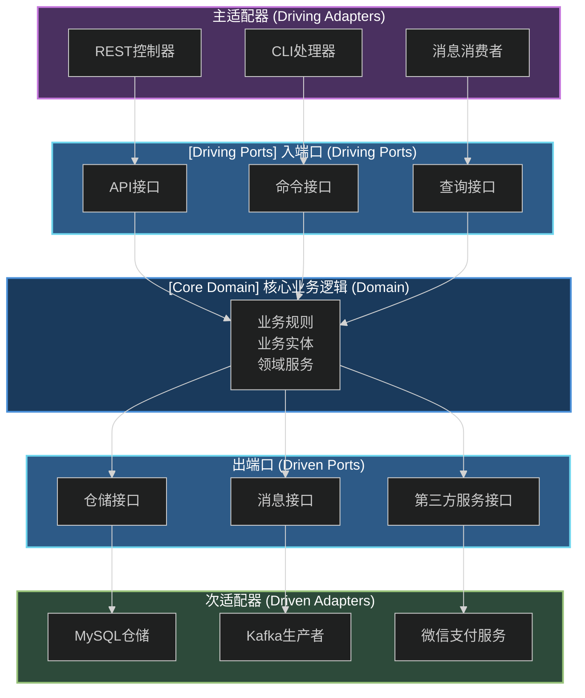
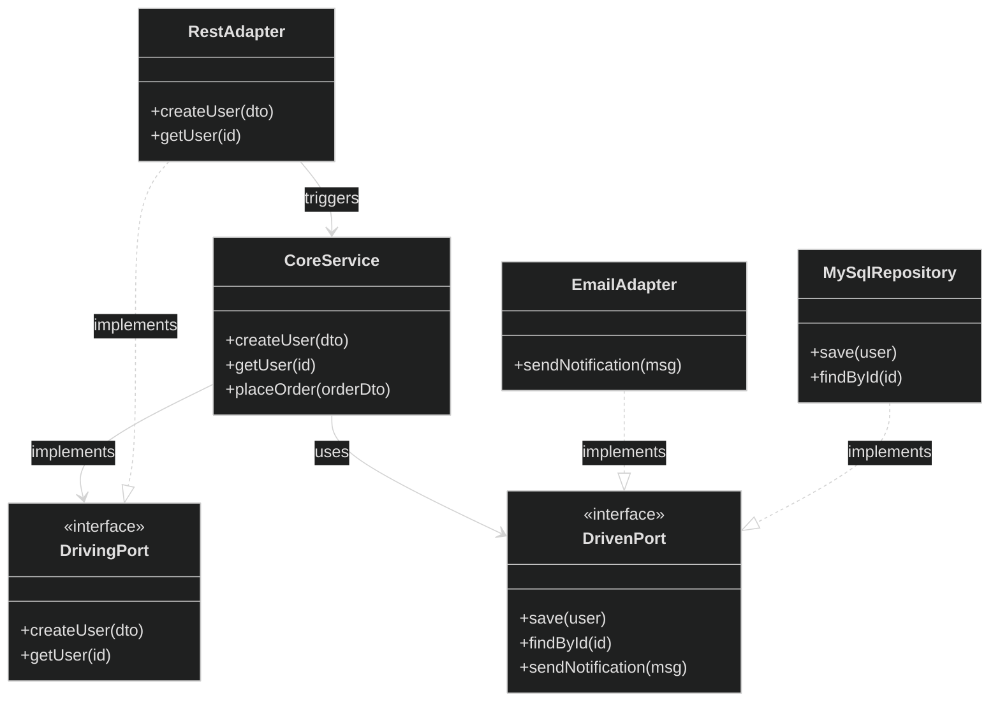
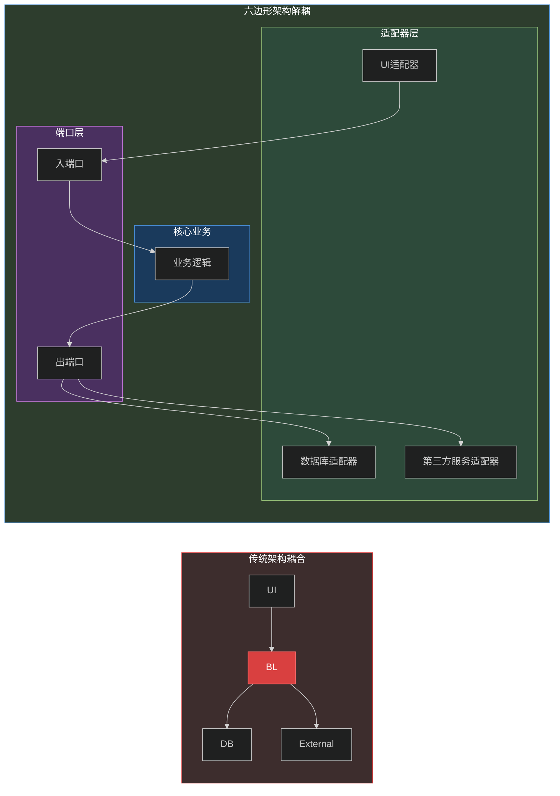
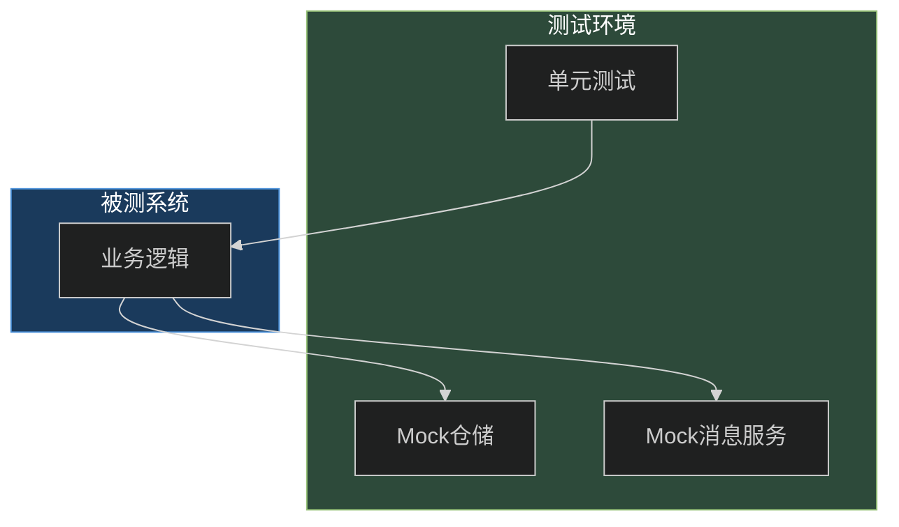
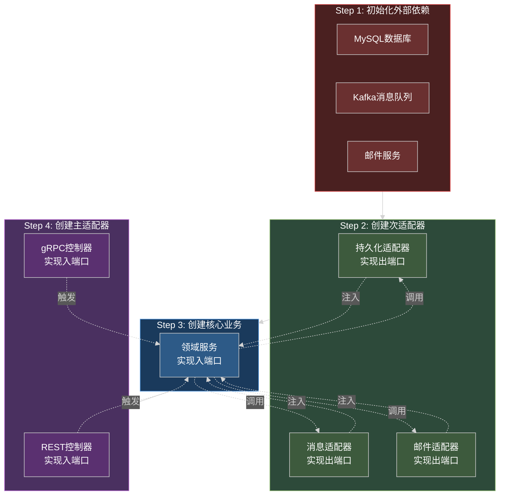
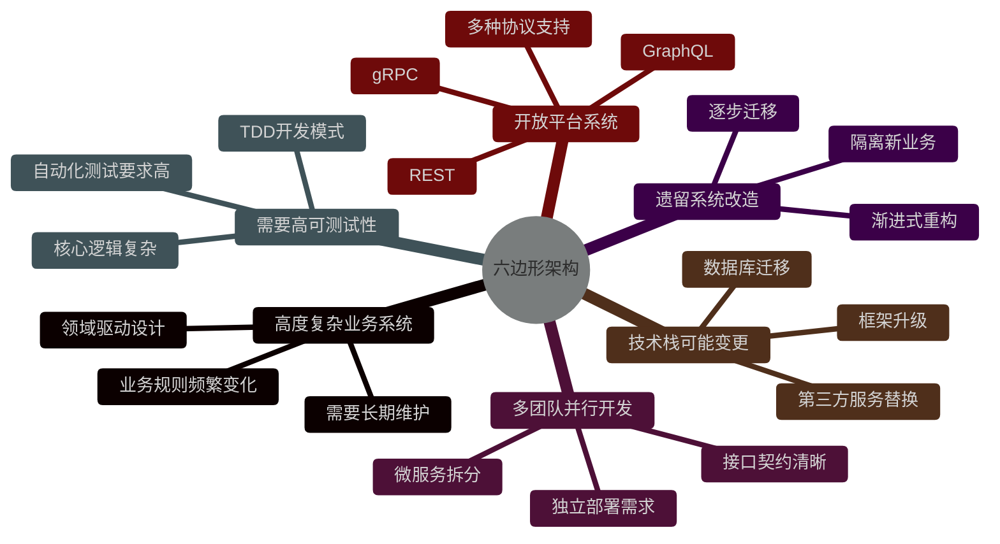

# 第7章：六边形架构（Hexagonal Architecture）

## 概述

六边形架构（Hexagonal Architecture），又称端口与适配器架构（Ports and Adapters Architecture），由 Alistair Cockburn 于2005年提出。这种架构模式的核心目标是将**业务逻辑**从**外部依赖**中彻底解耦出来，使应用程序能够以完全独立于外部组件的方式存在和运行。

在传统的分层架构中，业务逻辑往往与数据访问层、第三方服务、UI框架等外部组件紧密耦合。这种耦合导致：更换数据库需要修改业务代码、单元测试需要启动真实数据库、前端改动可能影响后端逻辑等问题。

六边形架构通过引入"端口"和"适配器"两个抽象层，建立了业务逻辑与外部世界的清晰边界，实现了真正的**可插拔**设计。

---

## 核心概念

六边形架构的核心结构可以用下图表示：



### 1. 端口（Port）

**端口是核心业务逻辑与外部世界交互的接口定义**。它是一种抽象契约，定义了业务逻辑需要或被需要的行为。

#### 入端口（Driving Port / Primary Port）

由外部主动触发的接口，定义在核心业务逻辑中。例如：

- `UserService` 接口：定义创建用户、查询用户等方法
- `OrderCommandService` 接口：定义处理订单命令的方法

#### 出端口（Driven Port / Secondary Port）

由核心业务逻辑主动调用的接口，用于与外部组件交互。例如：

- `UserRepository` 接口：定义数据的持久化操作
- `NotificationService` 接口：定义消息发送能力



### 2. 适配器（Adapter）

**适配器是端口的具体实现**。它负责将外部世界的技术与核心业务逻辑隔离开来。

#### 主适配器（Primary / Driving Adapter）

连接核心业务逻辑与触发它的外部参与者（用户、测试、其他服务）。例如：

- REST Controller：处理 HTTP 请求
- CLI Handler：处理命令行输入
- Message Consumer：处理消息队列中的消息

#### 次适配器（Secondary / Driven Adapter）

实现核心业务逻辑所需的后端功能。例如：

- MySQL Repository：实现数据持久化
- Kafka Producer：实现消息发送
- 微信支付适配器：实现支付功能

### 3. 核心业务逻辑（Domain）

**核心业务逻辑是完全独立于任何外部框架和技术的业务规则本身**。它包含：

- **领域实体（Entity）**：业务对象及其核心属性
- **领域服务（Domain Service）**：跨实体的业务逻辑
- **值对象（Value Object）**：不可变的业务概念
- **领域事件（Domain Event）**：业务中发生的重要事件

---

## 六边形架构的核心理念

### 1. 业务逻辑与外部依赖解耦



### 2. 可测试性

由于业务逻辑与外部依赖完全解耦，单元测试可以直接通过模拟适配器进行，无需启动真实的数据库或第三方服务。



### 3. 易于替换外部组件

当需要更换数据库、消息队列或第三方服务时，只需要实现新的适配器，业务逻辑代码无需任何改动。

---

## 与传统分层架构对比

```mermaid
%%{init: {"theme": "dark"}}%%
flowchart TB
    subgraph Traditional["传统三层架构"]
        subgraph T_UI["表现层"]
            T1["Controller"]
            T2["View"]
        end
        subgraph T_BL["业务逻辑层"]
            T3["Service"]
        end
        subgraph T_DA["数据访问层"]
            T4["DAO"]
            T5["Repository"]
        end

        T_UI --> T_BL
        T_BL --> T_DA
    end

    subgraph Hex["六边形架构"]
        subgraph H_Outer["外部（适配器）"]
            H1["REST API"]
            H2["MySQL"]
            H3["Kafka"]
        end
        subgraph H_Port["端口层"]
            H4["Port Interfaces"]
        end
        subgraph H_Core["核心业务"]
            H5["Domain Logic"]
        end

        H_Outer <--> H_Port
        H_Port <--> H_Core
    end

    style Traditional fill:#3d2d2d,stroke:#d94040,color:#fff
    style Hex fill:#2d3d2d,stroke:#4a90d9,color:#fff
    style T_UI fill:#4a3030,stroke:#d94040,color:#fff
    style T_BL fill:#5a3535,stroke:#d94040,color:#fff
    style T_DA fill:#6a4040,stroke:#d94040,color:#fff
    style H_Outer fill:#2d4a3a,stroke:#98c379,color:#fff
    style H_Port fill:#4a3060,stroke:#c678dd,color:#fff
    style H_Core fill:#1a3a5c,stroke:#4a90d9,color:#fff
```



| 特性 | 传统三层架构 | 六边形架构 |
|------|-------------|-----------|
| 业务逻辑依赖 | 依赖数据访问层 | 依赖端口接口，不依赖适配器 |
| 可测试性 | 需要真实数据库 | 可以完全mock |
| 替换成本 | 更换数据库影响业务代码 | 只需更换适配器 |
| 关注点分离 | 各层有明确定义 | 通过端口隔离 |
| 适配器数量 | 隐式单一 | 多样化可插拔 |

---

## 工程实践案例

### Java 实现示例

#### 1. 定义领域实体

```java
// src/main/java/com/example/domain/model/User.java
package com.example.domain.model;

import java.time.LocalDateTime;
import java.util.Objects;

/**
 * 用户领域实体 - 核心业务逻辑的一部分
 * 纯Java对象，不依赖任何框架
 */
public class User {
    private final String id;
    private final String name;
    private final String email;
    private final LocalDateTime createdAt;

    public User(String id, String name, String email, LocalDateTime createdAt) {
        this.id = Objects.requireNonNull(id, "id不能为空");
        this.name = Objects.requireNonNull(name, "name不能为空");
        this.email = Objects.requireNonNull(email, "email不能为空");
        this.createdAt = createdAt != null ? createdAt : LocalDateTime.now();
    }

    public String getId() { return id; }
    public String getName() { return name; }
    public String getEmail() { return email; }
    public LocalDateTime getCreatedAt() { return createdAt; }

    /**
     * 领域业务规则：验证邮箱格式
     */
    public boolean hasValidEmail() {
        return email != null && email.contains("@");
    }

    @Override
    public boolean equals(Object o) {
        if (this == o) return true;
        if (o == null || getClass() != o.getClass()) return false;
        User user = (User) o;
        return Objects.equals(id, user.id);
    }

    @Override
    public int hashCode() {
        return Objects.hash(id);
    }
}
```

#### 2. 定义端口接口

```java
// src/main/java/com/example/domain/port/in/UserCommandPort.java
package com.example.domain.port.in;

import com.example.domain.model.User;

/**
 * 入端口（Driving Port）- 用户命令接口
 * 定义创建用户的业务用例
 */
public interface UserCommandPort {
    User createUser(CreateUserCommand command);
    void deleteUser(String userId);
}

public record CreateUserCommand(String name, String email) {}
```

```java
// src/main/java/com/example/domain/port/in/UserQueryPort.java
package com.example.domain.port.in;

import com.example.domain.model.User;
import java.util.List;
import java.util.Optional;

/**
 * 入端口（Driving Port）- 用户查询接口
 */
public interface UserQueryPort {
    Optional<User> findById(String id);
    List<User> findAll();
    List<User> findByEmail(String email);
}
```

```java
// src/main/java/com/example/domain/port/out/UserPersistencePort.java
package com.example.domain.port.out;

import com.example.domain.model.User;
import java.util.List;
import java.util.Optional;

/**
 * 出端口（Driven Port）- 用户持久化接口
 * 核心业务逻辑依赖此接口，不依赖具体实现
 */
public interface UserPersistencePort {
    User save(User user);
    Optional<User> findById(String id);
    List<User> findAll();
    List<User> findByEmail(String email);
    void deleteById(String id);
}
```

```java
// src/main/java/com/example/domain/port/out/NotificationPort.java
package com.example.domain.port.out;

/**
 * 出端口（Driven Port）- 通知接口
 */
public interface NotificationPort {
    void sendWelcomeEmail(String email, String userName);
    void sendAccountDeletionNotice(String email);
}
```

#### 3. 实现核心业务逻辑

```java
// src/main/java/com/example/domain/service/UserApplicationService.java
package com.example.domain.service;

import com.example.domain.model.User;
import com.example.domain.port.in.UserCommandPort;
import com.example.domain.port.in.UserCommandPort.CreateUserCommand;
import com.example.domain.port.in.UserQueryPort;
import com.example.domain.port.out.NotificationPort;
import com.example.domain.port.out.UserPersistencePort;
import java.time.LocalDateTime;
import java.util.List;
import java.util.Optional;
import java.util.UUID;

/**
 * 用户应用服务 - 核心业务逻辑实现
 * 完全独立于任何外部框架
 */
public class UserApplicationService implements UserCommandPort, UserQueryPort {

    private final UserPersistencePort persistencePort;
    private final NotificationPort notificationPort;

    public UserApplicationService(
            UserPersistencePort persistencePort,
            NotificationPort notificationPort) {
        this.persistencePort = persistencePort;
        this.notificationPort = notificationPort;
    }

    @Override
    public User createUser(CreateUserCommand command) {
        // 业务校验
        if (command.name() == null || command.name().isBlank()) {
            throw new IllegalArgumentException("用户名不能为空");
        }
        if (command.email() == null || !command.email().contains("@")) {
            throw new IllegalArgumentException("邮箱格式不正确");
        }

        // 检查邮箱唯一性
        List<User> existing = persistencePort.findByEmail(command.email());
        if (!existing.isEmpty()) {
            throw new IllegalStateException("邮箱已被注册");
        }

        // 创建用户
        User user = new User(
            UUID.randomUUID().toString(),
            command.name(),
            command.email(),
            LocalDateTime.now()
        );

        // 持久化
        User savedUser = persistencePort.save(user);

        // 发送欢迎通知（通过端口，不关心具体实现）
        notificationPort.sendWelcomeEmail(savedUser.getEmail(), savedUser.getName());

        return savedUser;
    }

    @Override
    public void deleteUser(String userId) {
        Optional<User> user = persistencePort.findById(userId);
        if (user.isEmpty()) {
            throw new IllegalArgumentException("用户不存在: " + userId);
        }

        persistencePort.deleteById(userId);
        notificationPort.sendAccountDeletionNotice(user.get().getEmail());
    }

    @Override
    public Optional<User> findById(String id) {
        return persistencePort.findById(id);
    }

    @Override
    public List<User> findAll() {
        return persistencePort.findAll();
    }

    @Override
    public List<User> findByEmail(String email) {
        return persistencePort.findByEmail(email);
    }
}
```

#### 4. 实现适配器

```java
// src/main/java/com/example/adapter/out/persistence/jpa/UserJpaAdapter.java
package com.example.adapter.out.persistence.jpa;

import com.example.domain.model.User;
import com.example.domain.port.out.UserPersistencePort;
import org.springframework.stereotype.Repository;

import java.util.List;
import java.util.Optional;

/**
 * 次适配器（Driven Adapter）- JPA持久化实现
 * 依赖Spring Data JPA
 */
@Repository
public class UserJpaAdapter implements UserPersistencePort {

    private final SpringDataUserRepository repository;

    public UserJpaAdapter(SpringDataUserRepository repository) {
        this.repository = repository;
    }

    @Override
    public User save(User user) {
        UserEntity entity = toEntity(user);
        UserEntity saved = repository.save(entity);
        return toDomain(saved);
    }

    @Override
    public Optional<User> findById(String id) {
        return repository.findById(id).map(this::toDomain);
    }

    @Override
    public List<User> findAll() {
        return repository.findAll().stream().map(this::toDomain).toList();
    }

    @Override
    public List<User> findByEmail(String email) {
        return repository.findByEmail(email).stream().map(this::toDomain).toList();
    }

    @Override
    public void deleteById(String id) {
        repository.deleteById(id);
    }

    private UserEntity toEntity(User user) {
        return new UserEntity(
            user.getId(),
            user.getName(),
            user.getEmail(),
            user.getCreatedAt()
        );
    }

    private User toDomain(UserEntity entity) {
        return new User(
            entity.getId(),
            entity.getName(),
            entity.getEmail(),
            entity.getCreatedAt()
        );
    }
}
```

```java
// src/main/java/com/example/adapter/out/notification/EmailAdapter.java
package com.example.adapter.out.notification;

import com.example.domain.port.out.NotificationPort;
import org.slf4j.Logger;
import org.slf4j.LoggerFactory;
import org.springframework.stereotype.Component;

/**
 * 次适配器（Driven Adapter）- 邮件通知实现
 */
@Component
public class EmailAdapter implements NotificationPort {

    private static final Logger log = LoggerFactory.getLogger(EmailAdapter.class);

    @Override
    public void sendWelcomeEmail(String email, String userName) {
        log.info("发送欢迎邮件到 {}，用户名: {}", email, userName);
        // 实际发送邮件逻辑
    }

    @Override
    public void sendAccountDeletionNotice(String email) {
        log.info("发送账号删除通知到 {}", email);
        // 实际发送邮件逻辑
    }
}
```

```java
// src/main/java/com/example/adapter/in/rest/UserController.java
package com.example.adapter.in.rest;

import com.example.adapter.in.rest.dto.CreateUserRequest;
import com.example.adapter.in.rest.dto.UserResponse;
import com.example.domain.model.User;
import com.example.domain.port.in.UserCommandPort;
import com.example.domain.port.in.UserCommandPort.CreateUserCommand;
import com.example.domain.port.in.UserQueryPort;
import org.springframework.http.HttpStatus;
import org.springframework.web.bind.annotation.*;

import java.util.List;

/**
 * 主适配器（Driving Adapter）- REST控制器
 * 负责接收HTTP请求并调用业务逻辑
 */
@RestController
@RequestMapping("/api/users")
public class UserController {

    private final UserCommandPort commandPort;
    private final UserQueryPort queryPort;

    public UserController(UserCommandPort commandPort, UserQueryPort queryPort) {
        this.commandPort = commandPort;
        this.queryPort = queryPort;
    }

    @PostMapping
    @ResponseStatus(HttpStatus.CREATED)
    public UserResponse createUser(@RequestBody CreateUserRequest request) {
        CreateUserCommand command = new CreateUserCommand(
            request.name(),
            request.email()
        );
        User user = commandPort.createUser(command);
        return toResponse(user);
    }

    @GetMapping("/{id}")
    public UserResponse getUser(@PathVariable String id) {
        return queryPort.findById(id)
            .map(this::toResponse)
            .orElseThrow(() -> new RuntimeException("用户不存在"));
    }

    @GetMapping
    public List<UserResponse> getAllUsers() {
        return queryPort.findAll().stream().map(this::toResponse).toList();
    }

    @DeleteMapping("/{id}")
    @ResponseStatus(HttpStatus.NO_CONTENT)
    public void deleteUser(@PathVariable String id) {
        commandPort.deleteUser(id);
    }

    private UserResponse toResponse(User user) {
        return new UserResponse(
            user.getId(),
            user.getName(),
            user.getEmail(),
            user.getCreatedAt().toString()
        );
    }
}
```

#### 5. Spring 依赖注入配置

```java
// src/main/java/com/example/config/AppConfig.java
package com.example.config;

import com.example.adapter.out.notification.EmailAdapter;
import com.example.adapter.out.persistence.jpa.UserJpaAdapter;
import com.example.domain.port.out.NotificationPort;
import com.example.domain.port.out.UserPersistencePort;
import com.example.domain.service.UserApplicationService;
import org.springframework.context.annotation.Bean;
import org.springframework.context.annotation.Configuration;

/**
 * 六边形架构的端口与适配器组装配置
 * 所有依赖关系在此处建立，业务逻辑无需知晓
 */
@Configuration
public class AppConfig {

    @Bean
    public UserPersistencePort userPersistencePort(SpringDataUserRepository repository) {
        return new UserJpaAdapter(repository);
    }

    @Bean
    public NotificationPort notificationPort() {
        return new EmailAdapter();
    }

    @Bean
    public UserApplicationService userApplicationService(
            UserPersistencePort persistencePort,
            NotificationPort notificationPort) {
        return new UserApplicationService(persistencePort, notificationPort);
    }
}
```

---

### Go 实现示例

#### 1. 定义领域实体

```go
// domain/model/user.go
package model

import (
	"errors"
	"time"
)

var (
	ErrInvalidUserID   = errors.New("user id cannot be empty")
	ErrInvalidUserName = errors.New("user name cannot be empty")
	ErrInvalidEmail    = errors.New("email cannot be empty")
	ErrEmailExists     = errors.New("email already exists")
)

// User 领域实体 - 纯Go结构体，不依赖任何外部包
type User struct {
	ID        string
	Name      string
	Email     string
	CreatedAt time.Time
}

// NewUser 创建用户时的工厂方法，包含业务校验
func NewUser(id, name, email string, createdAt ...time.Time) (*User, error) {
	if id == "" {
		return nil, ErrInvalidUserID
	}
	if name == "" {
		return nil, ErrInvalidUserName
	}
	if email == "" || !containsAt(email) {
		return nil, ErrInvalidEmail
	}

	created := time.Now()
	if len(createdAt) > 0 {
		created = createdAt[0]
	}

	return &User{
		ID:        id,
		Name:      name,
		Email:     email,
		CreatedAt: created,
	}, nil
}

// HasValidEmail 领域业务规则：验证邮箱格式
func (u *User) HasValidEmail() bool {
	return u.Email != "" && containsAt(u.Email)
}

func containsAt(s string) bool {
	for i := 0; i < len(s); i++ {
		if s[i] == '@' {
			return true
		}
	}
	return false
}
```

#### 2. 定义端口接口

```go
// domain/port/in/user_command_port.go
package port

import "example/domain/model"

// UserCommandPort 入端口 - 用户命令接口
type UserCommandPort interface {
	CreateUser(cmd CreateUserCommand) (*model.User, error)
	DeleteUser(userID string) error
}

// CreateUserCommand 创建用户命令
type CreateUserCommand struct {
	Name  string
	Email string
}
```

```go
// domain/port/in/user_query_port.go
package port

import "example/domain/model"

// UserQueryPort 入端口 - 用户查询接口
type UserQueryPort interface {
	FindByID(id string) (*model.User, error)
	FindAll() ([]*model.User, error)
	FindByEmail(email string) ([]*model.User, error)
}
```

```go
// domain/port/out/user_persistence_port.go
package port

import "example/domain/model"

// UserPersistencePort 出端口 - 用户持久化接口
// 核心业务逻辑依赖此接口，不依赖具体实现
type UserPersistencePort interface {
	Save(user *model.User) (*model.User, error)
	FindByID(id string) (*model.User, error)
	FindAll() ([]*model.User, error)
	FindByEmail(email string) ([]*model.User, error)
	DeleteByID(id string) error
}
```

```go
// domain/port/out/notification_port.go
package port

// NotificationPort 出端口 - 通知接口
type NotificationPort interface {
	SendWelcomeEmail(email, userName string) error
	SendAccountDeletionNotice(email string) error
}
```

#### 3. 实现核心业务逻辑

```go
// domain/service/user_application_service.go
package service

import (
	"errors"

	"example/domain/model"
	"example/domain/port"
)

// UserApplicationService 用户应用服务 - 核心业务逻辑实现
// 完全独立于任何外部框架，不依赖HTTP、数据库等
type UserApplicationService struct {
	persistencePort   port.UserPersistencePort
	notificationPort  port.NotificationPort
}

// NewUserApplicationService 构造函数注入依赖
func NewUserApplicationService(
	persistencePort port.UserPersistencePort,
	notificationPort port.NotificationPort,
) *UserApplicationService {
	return &UserApplicationService{
		persistencePort:  persistencePort,
		notificationPort: notificationPort,
	}
}

// 确保实现了所有端口接口
var _ port.UserCommandPort = (*UserApplicationService)(nil)
var _ port.UserQueryPort = (*UserApplicationService)(nil)

// CreateUser 创建用户
func (s *UserApplicationService) CreateUser(cmd port.CreateUserCommand) (*model.User, error) {
	// 业务校验
	if cmd.Name == "" || cmd.Email == "" {
		return nil, errors.New("name and email are required")
	}

	// 检查邮箱唯一性
	existing, err := s.persistencePort.FindByEmail(cmd.Email)
	if err != nil {
		return nil, err
	}
	if len(existing) > 0 {
		return nil, model.ErrEmailExists
	}

	// 创建用户
	user, err := model.NewUser(
		generateUUID(),
		cmd.Name,
		cmd.Email,
	)
	if err != nil {
		return nil, err
	}

	// 持久化
	savedUser, err := s.persistencePort.Save(user)
	if err != nil {
		return nil, err
	}

	// 发送欢迎通知（通过端口，不关心具体实现）
	_ = s.notificationPort.SendWelcomeEmail(savedUser.Email, savedUser.Name)

	return savedUser, nil
}

// DeleteUser 删除用户
func (s *UserApplicationService) DeleteUser(userID string) error {
	user, err := s.persistencePort.FindByID(userID)
	if err != nil {
		return err
	}
	if user == nil {
		return errors.New("user not found: " + userID)
	}

	if err := s.persistencePort.DeleteByID(userID); err != nil {
		return err
	}

	return s.notificationPort.SendAccountDeletionNotice(user.Email)
}

// FindByID 根据ID查询用户
func (s *UserApplicationService) FindByID(id string) (*model.User, error) {
	return s.persistencePort.FindByID(id)
}

// FindAll 查询所有用户
func (s *UserApplicationService) FindAll() ([]*model.User, error) {
	return s.persistencePort.FindAll()
}

// FindByEmail 根据邮箱查询用户
func (s *UserApplicationService) FindByEmail(email string) ([]*model.User, error) {
	return s.persistencePort.FindByEmail(email)
}

func generateUUID() string {
	// 简化实现，实际应使用uuid库
	return "uuid-" + randomString(16)
}

func randomString(n int) string {
	const letters = "abcdefghijklmnopqrstuvwxyzABCDEFGHIJKLMNOPQRSTUVWXYZ0123456789"
	b := make([]byte, n)
	for i := range b {
		b[i] = letters[i%len(letters)]
	}
	return string(b)
}
```

#### 4. 实现适配器

```go
// adapter/out/persistence/mysql/user_mysql_adapter.go
package mysql

import (
	"database/sql"
	"errors"

	"example/domain/model"
	"example/domain/port"
)

// UserMySQLAdapter 次适配器 - MySQL持久化实现
type UserMySQLAdapter struct {
	db *sql.DB
}

// NewUserMySQLAdapter 构造函数
func NewUserMySQLAdapter(db *sql.DB) *UserMySQLAdapter {
	return &UserMySQLAdapter{db: db}
}

// 确保实现了端口接口
var _ port.UserPersistencePort = (*UserMySQLAdapter)(nil)

// Save 保存用户
func (a *UserMySQLAdapter) Save(user *model.User) (*model.User, error) {
	query := `INSERT INTO users (id, name, email, created_at) VALUES (?, ?, ?, ?)`
	_, err := a.db.Exec(query, user.ID, user.Name, user.Email, user.CreatedAt)
	if err != nil {
		return nil, err
	}
	return user, nil
}

// FindByID 根据ID查询
func (a *UserMySQLAdapter) FindByID(id string) (*model.User, error) {
	query := `SELECT id, name, email, created_at FROM users WHERE id = ?`
	row := a.db.QueryRow(query, id)

	var user model.User
	err := row.Scan(&user.ID, &user.Name, &user.Email, &user.CreatedAt)
	if err != nil {
		if errors.Is(err, sql.ErrNoRows) {
			return nil, nil
		}
		return nil, err
	}
	return &user, nil
}

// FindAll 查询所有
func (a *UserMySQLAdapter) FindAll() ([]*model.User, error) {
	query := `SELECT id, name, email, created_at FROM users`
	rows, err := a.db.Query(query)
	if err != nil {
		return nil, err
	}
	defer rows.Close()

	var users []*model.User
	for rows.Next() {
		var user model.User
		if err := rows.Scan(&user.ID, &user.Name, &user.Email, &user.CreatedAt); err != nil {
			return nil, err
		}
		users = append(users, &user)
	}
	return users, nil
}

// FindByEmail 根据邮箱查询
func (a *UserMySQLAdapter) FindByEmail(email string) ([]*model.User, error) {
	query := `SELECT id, name, email, created_at FROM users WHERE email = ?`
	rows, err := a.db.Query(query, email)
	if err != nil {
		return nil, err
	}
	defer rows.Close()

	var users []*model.User
	for rows.Next() {
		var user model.User
		if err := rows.Scan(&user.ID, &user.Name, &user.Email, &user.CreatedAt); err != nil {
			return nil, err
		}
		users = append(users, &user)
	}
	return users, nil
}

// DeleteByID 删除用户
func (a *UserMySQLAdapter) DeleteByID(id string) error {
	query := `DELETE FROM users WHERE id = ?`
	_, err := a.db.Exec(query, id)
	return err
}
```

```go
// adapter/out/notification/email_adapter.go
package notification

import (
	"log"
)

// EmailAdapter 次适配器 - 邮件通知实现
type EmailAdapter struct{}

// NewEmailAdapter 构造函数
func NewEmailAdapter() *EmailAdapter {
	return &EmailAdapter{}
}

// SendWelcomeEmail 发送欢迎邮件
func (a *EmailAdapter) SendWelcomeEmail(email, userName string) error {
	log.Printf("[Email] Sending welcome email to %s, user: %s", email, userName)
	// 实际发送邮件逻辑
	return nil
}

// SendAccountDeletionNotice 发送账号删除通知
func (a *EmailAdapter) SendAccountDeletionNotice(email string) error {
	log.Printf("[Email] Sending account deletion notice to %s", email)
	// 实际发送邮件逻辑
	return nil
}
```

```go
// adapter/in/http/user_handler.go
package http

import (
	"encoding/json"
	"net/http"

	"example/domain/port"
)

// UserHandler 主适配器 - HTTP处理器
type UserHandler struct {
	commandPort port.UserCommandPort
	queryPort   port.UserQueryPort
}

// NewUserHandler 构造函数注入依赖
func NewUserHandler(commandPort port.UserCommandPort, queryPort port.UserQueryPort) *UserHandler {
	return &UserHandler{
		commandPort: commandPort,
		queryPort:   queryPort,
	}
}

// CreateUser 处理创建用户请求
func (h *UserHandler) CreateUser(w http.ResponseWriter, r *http.Request) {
	var cmd port.CreateUserCommand
	if err := json.NewDecoder(r.Body).Decode(&cmd); err != nil {
		http.Error(w, err.Error(), http.StatusBadRequest)
		return
	}

	user, err := h.commandPort.CreateUser(cmd)
	if err != nil {
		http.Error(w, err.Error(), http.StatusInternalServerError)
		return
	}

	w.Header().Set("Content-Type", "application/json")
	w.WriteHeader(http.StatusCreated)
	json.NewEncoder(w).Encode(user)
}

// GetUser 处理获取用户请求
func (h *UserHandler) GetUser(w http.ResponseWriter, r *http.Request) {
	id := r.URL.Query().Get("id")
	if id == "" {
		http.Error(w, "id is required", http.StatusBadRequest)
		return
	}

	user, err := h.queryPort.FindByID(id)
	if err != nil {
		http.Error(w, err.Error(), http.StatusInternalServerError)
		return
	}
	if user == nil {
		http.Error(w, "user not found", http.StatusNotFound)
		return
	}

	w.Header().Set("Content-Type", "application/json")
	json.NewEncoder(w).Encode(user)
}
```

#### 5. 依赖注入组装

```go
// main.go
package main

import (
	"database/sql"
	"log"
	"net/http"

	"example/adapter/in/http"
	"example/adapter/out/notification"
	"example/adapter/out/persistence/mysql"
	"example/domain/service"
	_ "github.com/go-sql-driver/mysql"
)

func main() {
	// 1. 初始化数据库连接（外部依赖）
	db, err := sql.Open("mysql", "user:password@tcp(localhost:3306)/testdb")
	if err != nil {
		log.Fatal(err)
	}
	defer db.Close()

	// 2. 创建次适配器（Driven Adapters）
	userPersistenceAdapter := mysql.NewUserMySQLAdapter(db)
	emailAdapter := notification.NewEmailAdapter()

	// 3. 创建核心业务逻辑服务，注入端口实现
	userService := service.NewUserApplicationService(
		userPersistenceAdapter, // 实现 UserPersistencePort
		emailAdapter,            // 实现 NotificationPort
	)

	// 4. 创建主适配器（Driving Adapters）
	userHandler := http.NewUserHandler(userService, userService)

	// 5. 注册路由
	http.HandleFunc("/api/users", userHandler.CreateUser)
	http.HandleFunc("/api/users/get", userHandler.GetUser)

	// 6. 启动服务器
	log.Println("Server starting on :8080")
	log.Fatal(http.ListenAndServe(":8080", nil))
}
```

---

## 架构组装流程图



---

## 适用场景分析



### 最佳实践场景

1. **DDD（领域驱动设计）项目**
   - 六边形架构与DDD天然契合
   - 领域模型作为核心，外部适配器作为实现

2. **微服务架构**
   - 服务边界清晰
   - 便于定义API契约
   - 支持独立演进

3. **需要长期维护的企业系统**
   - 业务逻辑稳定性高
   - 技术债务可控
   - 便于接替人员理解

4. **高度依赖外部服务的系统**
   - 便于Mock外部依赖
   - 支持本地开发
   - 隔离外部系统故障

### 不适用场景

1. **简单的CRUD应用**
   - 过度设计
   - 增加不必要的复杂度

2. **生命周期短暂的概念验证项目**
   - 快速原型阶段不需要
   - 后续大概率重写

---

## 总结

六边形架构通过引入**端口**和**适配器**两个抽象层，实现了：

1. **业务逻辑的纯粹性**：核心业务不依赖任何外部框架和基础设施
2. **测试的便利性**：可以通过Mock适配器进行完全隔离的单元测试
3. **技术的可替换性**：数据库、消息队列、第三方服务都可以轻松替换
4. **团队协作的清晰性**：接口契约先行，并行开发成为可能

这种架构模式虽然增加了一定的复杂度，但对于需要长期维护、业务复杂、团队协作密切的系统来说，其带来的收益远超代价。

---

## 参考资料

- Alistair Cockburn - "Hexagonal Architecture" (2005)
- 《实现领域驱动设计》- Vaughn Vernon
- 《整洁架构》- Robert C. Martin
