# 第8章 高可用架构设计

## 8.1 高可用架构概述

高可用性（High Availability，HA）是指系统在期望的性能水平下持续运行的能力，通常通过减少停机时间来衡量。在现代分布式系统中，高可用架构是确保业务连续性的核心基础设施。

### 8.1.1 为什么需要高可用架构

在互联网应用中，任何非计划内的服务中断都可能造成严重的业务损失：

- **电商场景**：一次持续10分钟的平台故障可能导致数百万的交易损失
- **金融系统**：服务不可用可能引发监管合规问题和客户信任危机
- **即时通讯**：可用性问题直接导致用户流失

### 8.1.2 高可用架构演进

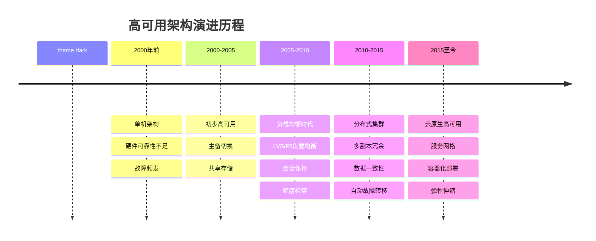
```mermaid
timeline
    title 高可用架构演进历程
    theme dark

    2000年前 : 单机架构
             : 硬件可靠性不足
             : 故障频发

    2000-2005 : 初步高可用
             : 主备切换
             : 共享存储

    2005-2010 : 负载均衡时代
             : LVS/F5负载均衡
             : 会话保持
             : 健康检查

    2010-2015 : 分布式集群
             : 多副本冗余
             : 数据一致性
             : 自动故障转移

    2015至今 : 云原生高可用
             : 服务网格
             : 容器化部署
             : 弹性伸缩
```

### 8.1.3 高可用架构全景图

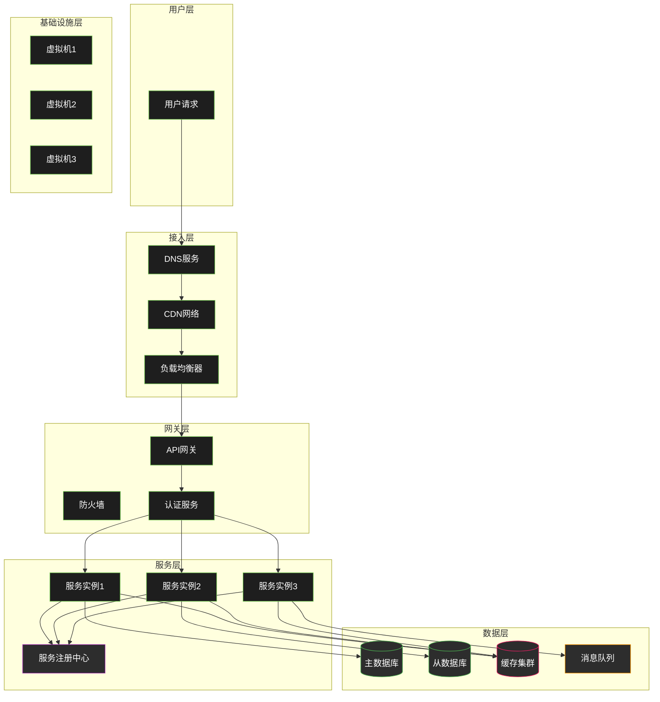
```mermaid
graph TB
    subgraph 用户层
        U["用户请求"]
    end

    subgraph 接入层
        LB["负载均衡器"]
        CDN["CDN网络"]
        DNS["DNS服务"]
    end

    subgraph 网关层
        GW["API网关"]
        WAF["防火墙"]
        Auth["认证服务"]
    end

    subgraph 服务层
        S1["服务实例1"]
        S2["服务实例2"]
        S3["服务实例3"]
        Registry["服务注册中心"]
    end

    subgraph 数据层
        DB1[("主数据库")]
        DB2[("从数据库")]
        Cache[("缓存集群")]
        MQ["消息队列"]
    end

    subgraph 基础设施层
        VM1["虚拟机1"]
        VM2["虚拟机2"]
        VM3["虚拟机3"]
    end

    U --> DNS
    DNS --> CDN
    CDN --> LB
    LB --> GW
    GW --> Auth
    Auth --> S1
    Auth --> S2
    Auth --> S3
    S1 --> Registry
    S2 --> Registry
    S3 --> Registry
    S1 --> Cache
    S2 --> Cache
    S3 --> Cache
    S1 --> DB1
    S2 --> DB2
    S3 --> MQ

    style U fill:#1e1e1e,color:#ffffff,stroke:#6abf4a
    style LB fill:#1e1e1e,color:#ffffff,stroke:#6abf4a
    style CDN fill:#1e1e1e,color:#ffffff,stroke:#6abf4a
    style DNS fill:#1e1e1e,color:#ffffff,stroke:#6abf4a
    style GW fill:#1e1e1e,color:#ffffff,stroke:#6abf4a
    style WAF fill:#1e1e1e,color:#ffffff,stroke:#6abf4a
    style Auth fill:#1e1e1e,color:#ffffff,stroke:#6abf4a
    style S1 fill:#1e1e1e,color:#ffffff,stroke:#6abf4a
    style S2 fill:#1e1e1e,color:#ffffff,stroke:#6abf4a
    style S3 fill:#1e1e1e,color:#ffffff,stroke:#6abf4a
    style Registry fill:#2d2d2d,color:#ffffff,stroke:#9c27b0
    style DB1 fill:#2d2d2d,color:#ffffff,stroke:#4caf50
    style DB2 fill:#2d2d2d,color:#ffffff,stroke:#4caf50
    style Cache fill:#2d2d2d,color:#ffffff,stroke:#e91e63
    style MQ fill:#2d2d2d,color:#ffffff,stroke:#ff9800
    style VM1 fill:#1e1e1e,color:#ffffff,stroke:#6abf4a
    style VM2 fill:#1e1e1e,color:#ffffff,stroke:#6abf4a
    style VM3 fill:#1e1e1e,color:#ffffff,stroke:#6abf4a
```

---

## 8.2 衡量指标

### 8.2.1 可用性（Availability）

可用性是最直观的高可用衡量指标，通常用百分比表示：

```
可用性 = 系统正常工作时间 / (系统正常工作时间 + 停机时间) × 100%
```

常见的可用性等级：

| 可用性等级 | 停机时间/年 | 停机时间/月 | 停机时间/周 |
|-----------|------------|-------------|-------------|
| 99%       | 3.65天     | 7.3小时     | 1.68小时    |
| 99.5%     | 1.83天     | 3.65小时    | 50.4分钟    |
| 99.9%     | 8.76小时   | 43.8分钟    | 10.1分钟    |
| 99.99%    | 52.6分钟   | 4.38分钟    | 1.01分钟    |
| 99.999%   | 5.26分钟   | 26.3秒      | 6.05秒      |

### 8.2.2 MTBF（Mean Time Between Failures）

**平均故障间隔时间**，衡量系统两次故障之间的平均正常运行时间。

```
MTBF = 总运行时间 / 故障次数
```

**示例计算**：

```python
# 假设系统在一年内运行了365天，其中发生了2次故障
total_uptime_hours = 365 * 24 - (2 * 4)  # 减去2次故障的4小时停机时间
failure_count = 2

mtbf_hours = total_uptime_hours / failure_count
mtbf_days = mtbf_hours / 24

print(f"MTBF: {mtbf_hours} 小时 ≈ {mtbf_days:.1f} 天")
# 输出: MTBF: 4372 小时 ≈ 182.2 天
```

### 8.2.3 MTTR（Mean Time To Repair）

**平均修复时间**，衡量系统从故障状态恢复到正常运行所需的平均时间。

```
MTTR = 总修复时间 / 修复次数
```

### 8.2.4 指标关系

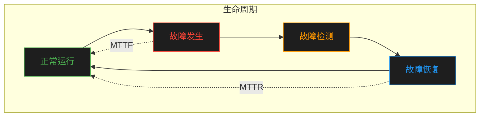
```mermaid
graph TB
    subgraph 生命周期
        A["正常运行"] --> B["故障发生"]
        B --> C["故障检测"]
        C --> D["故障恢复"]
        D --> A
    end

    style A fill:#1e1e1e,color:#4caf50,stroke:#4caf50
    style B fill:#1e1e1e,color:#f44336,stroke:#f44336
    style C fill:#1e1e1e,color:#ff9800,stroke:#ff9800
    style D fill:#1e1e1e,color:#2196f3,stroke:#2196f3

    B -.-> |"MTTF"| A
    D -.-> |"MTTR"| A
```

**公式推导**：

```
可用性 = MTBF / (MTBF + MTTR)
```

这意味着要提高可用性，我们需要：
- **提高 MTBF**：增加系统可靠性，减少故障发生
- **降低 MTTR**：快速检测故障、快速恢复服务

---

## 8.3 常见高可用模式

### 8.3.1 负载均衡（Load Balancer）

负载均衡是高可用架构的基础组件，将请求分发到多个服务器，避免单点过载。

#### 负载均衡算法

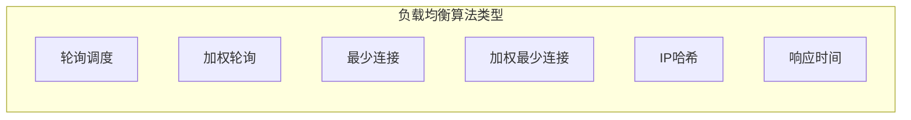
```mermaid
graph LR
    subgraph 负载均衡算法类型
        RR["轮询调度"]
        WRR["加权轮询"]
        LC["最少连接"]
        WLC["加权最少连接"]
        IP_H["IP哈希"]
        RT["响应时间"]
    end
```

**Java 实现简单负载均衡器**：

```java
public interface LoadBalancer {
    String select(List<String> servers);
}
```

```java
public class RoundRobinLoadBalancer implements LoadBalancer {
    private final AtomicInteger index = new AtomicInteger(0);

    @Override
    public String select(List<String> servers) {
        if (servers == null || servers.isEmpty()) {
            throw new IllegalArgumentException("服务器列表不能为空");
        }
        int pos = Math.abs(index.getAndIncrement() % servers.size());
        return servers.get(pos);
    }
}
```

```java
public class WeightedRoundRobinLoadBalancer implements LoadBalancer {
    private final Map<String, Integer> serverWeights;
    private final AtomicInteger currentIndex = new AtomicInteger(-1);
    private final AtomicInteger currentWeight = new AtomicInteger(0);

    public WeightedRoundRobinLoadBalancer(Map<String, Integer> serverWeights) {
        this.serverWeights = serverWeights;
    }

    @Override
    public String select(List<String> servers) {
        int totalWeight = servers.stream()
                .mapToInt(s -> serverWeights.getOrDefault(s, 1))
                .sum();

        while (true) {
            int idx = (currentIndex.get() + 1) % servers.size();
            int weight = currentWeight.get();

            if (idx == 0) {
                weight = currentWeight.get() - 1;
                if (weight <= 0) {
                    weight = totalWeight;
                }
                currentWeight.set(weight);
            }

            currentIndex.set(idx);
            String server = servers.get(idx);
            int serverWeight = serverWeights.getOrDefault(server, 1);

            if (serverWeight >= weight) {
                return server;
            }
        }
    }
}
```

#### Nginx 负载均衡配置

```nginx
upstream backend {
    # 加权轮询（默认）
    server 192.168.1.10:8080 weight=5;
    server 192.168.1.11:8080 weight=3;
    server 192.168.1.12:8080 weight=2;

    # 最少连接优先
    # server 192.168.1.10:8080 weight=5;
    # server 192.168.1.11:8080 weight=3;

    keepalive 32;
}

server {
    listen 80;

    location / {
        proxy_pass http://backend;
        proxy_set_header Host $host;
        proxy_set_header X-Real-IP $remote_addr;
        proxy_set_header X-Forwarded-For $proxy_add_x_forwarded_for;

        # 健康检查配置
        proxy_connect_timeout 5s;
        proxy_next_upstream error timeout http_502;
    }
}
```

#### 负载均衡架构

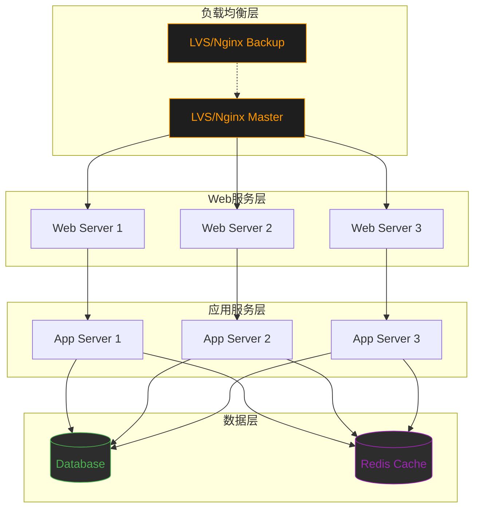
```mermaid
graph TB
    subgraph 负载均衡层
        L1["LVS/Nginx Master"]
        L2["LVS/Nginx Backup"]
    end

    subgraph Web服务层
        W1["Web Server 1"]
        W2["Web Server 2"]
        W3["Web Server 3"]
    end

    subgraph 应用服务层
        A1["App Server 1"]
        A2["App Server 2"]
        A3["App Server 3"]
    end

    subgraph 数据层
        DB[("Database")]
        Cache[("Redis Cache")]
    end

    L1 --> W1
    L1 --> W2
    L1 --> W3
    L2 -.-> L1

    W1 --> A1
    W2 --> A2
    W3 --> A3

    A1 --> DB
    A2 --> DB
    A3 --> DB
    A1 --> Cache
    A2 --> Cache
    A3 --> Cache

    style L1 fill:#1e1e1e,color:#ff9800,stroke:#ff9800
    style L2 fill:#1e1e1e,color:#ff9800,stroke:#ff9800
    style DB fill:#2d2d2d,color:#4caf50,stroke:#4caf50
    style Cache fill:#2d2d2d,color:#9c27b0,stroke:#9c27b0
```

### 8.3.2 集群（Cluster）

集群通过多台服务器协同工作，提供比单台服务器更高的处理能力和可用性。

#### 集群类型

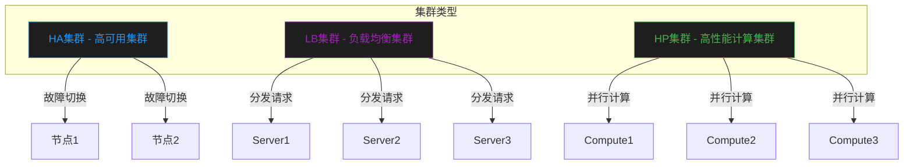
```mermaid
graph TB
    subgraph 集群类型
        HA["HA集群 - 高可用集群"]
        LB["LB集群 - 负载均衡集群"]
        HP["HP集群 - 高性能计算集群"]
    end

    HA -->|"故障切换"| N1["节点1"]
    HA -->|"故障切换"| N2["节点2"]

    LB -->|"分发请求"| S1["Server1"]
    LB -->|"分发请求"| S2["Server2"]
    LB -->|"分发请求"| S3["Server3"]

    HP -->|"并行计算"| C1["Compute1"]
    HP -->|"并行计算"| C2["Compute2"]
    HP -->|"并行计算"| C3["Compute3"]

    style HA fill:#1e1e1e,color:#2196f3,stroke:#2196f3
    style LB fill:#1e1e1e,color:#9c27b0,stroke:#9c27b0
    style HP fill:#1e1e1e,color:#4caf50,stroke:#4caf50
```

#### Keepalived 高可用集群配置

```bash
# /etc/keepalived/keepalived.conf

global_defs {
    router_id lb_master
    vrrp_version 3
}

vrrp_instance VI_1 {
    state MASTER                    # 备份节点设为 BACKUP
    interface eth0
    virtual_router_id 51
    priority 100                   # 备份节点设为低于100的值
    advert_int 1
    authentication {
        auth_type PASS
        auth_pass 1111
    }
    virtual_ipaddress {
        192.168.1.100/24           # 虚拟IP地址
    }
    track_script {
        check_nginx
    }
    notify_master "/etc/keepalived/notify.sh master"
    notify_backup "/etc/keepalived/notify.sh backup"
}

virtual_server 192.168.1.100 80 {
    delay_loop 6
    lb_algo rr                      # 轮询算法
    lb_kind DR                      # 直接路由模式
    persistence_timeout 50

    real_server 192.168.1.10 80 {
        weight 1
        TCP_CHECK {
            connect_timeout 3
            nb_get_retry 3
            delay_before_retry 3
            connect_port 80
        }
    }

    real_server 192.168.1.11 80 {
        weight 1
        TCP_CHECK {
            connect_timeout 3
            nb_get_retry 3
            delay_before_retry 3
            connect_port 80
        }
    }
}
```

```bash
#!/bin/bash
# /etc/keepalived/notify.sh

case "$1" in
    "master")
        echo "成为主节点，执行切换操作" | logger
        systemctl start nginx
        ;;
    "backup")
        echo "成为备份节点" | logger
        ;;
    "fault")
        echo "检测到故障" | logger
        systemctl stop nginx
        ;;
esac
```

### 8.3.3 主备切换（Failover）

主备切换是确保关键服务持续可用的核心机制，当主节点故障时，备用节点自动接管服务。

#### 主备切换流程

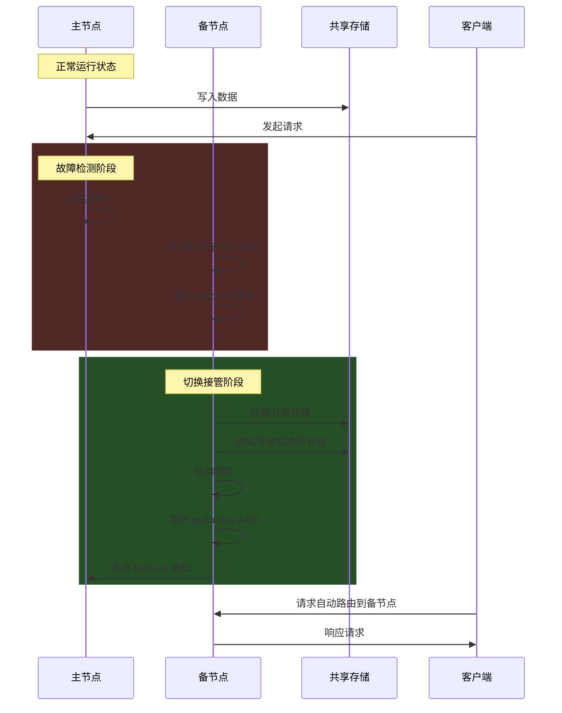
```mermaid
sequenceDiagram
    participant M as 主节点
    participant B as 备节点
    participant S as 共享存储
    participant C as 客户端

    Note over M: 正常运行状态
    M->>S: 写入数据
    C->>M: 发起请求

    rect rgb(80, 40, 40)
        Note over M: 故障检测阶段
        M-xM: 心跳超时
        B->>B: 检测到主节点不可用
        B->>B: 启动 failover 流程
    end

    rect rgb(40, 80, 40)
        Note over B: 切换接管阶段
        B->>S: 挂载共享存储
        B->>S: 通知存储切换所有权
        B->>B: 启动服务
        B->>B: 发送 gratuitous ARP
        B->>M: 发送 failover 通知
    end

    C->>B: 请求自动路由到备节点
    B->>C: 响应请求
```

#### ZooKeeper 选主实现

```java
public class ZooKeeperLeaderSelector implements LeaderLatchListener {

    private final LeaderLatch leaderLatch;
    private final String clientId;
    private volatile boolean isLeader = false;

    public ZooKeeperLeaderSelector(CuratorFramework client, String path, String clientId) {
        this.clientId = clientId;
        this.leaderLatch = new LeaderLatch(client, path, clientId);
        this.leaderLatch.addListener(this);

        try {
            leaderLatch.start();
        } catch (Exception e) {
            throw new RuntimeException("启动选主失败", e);
        }
    }

    @Override
    public void isLeader() {
        isLeader = true;
        System.out.println(clientId + " 成为主节点，开始提供服务");
        // 执行业务初始化逻辑
        initializeServices();
    }

    @Override
    public void notLeader() {
        isLeader = false;
        System.out.println(clientId + " 降级为从节点");
        // 清理业务资源
        cleanupServices();
    }

    private void initializeServices() {
        // 初始化主节点专属服务
    }

    private void cleanupServices() {
        // 清理资源
    }

    public boolean isLeader() {
        return isLeader;
    }

    public void close() throws IOException {
        leaderLatch.close();
    }
}
```

#### Etcd 高可用选主

```go
// Go 语言 etcd选主实现
package main

import (
    "context"
    "fmt"
    "log"
    "time"

    "github.com/coreos/etcd/clientv3"
    "github.com/coreos/etcd/clientv3/concurrency"
)

type EtcdLeaderElection struct {
    client *clientv3.Client
    session *concurrency.Session
    election *concurrency.Election
}

func NewEtcdLeaderElection(endpoints []string, prefix string) (*EtcdLeaderElection, error) {
    client, err := clientv3.New(clientv3.Config{
        Endpoints:   endpoints,
        DialTimeout: 5 * time.Second,
    })
    if err != nil {
        return nil, err
    }

    session, err := concurrency.NewSession(client)
    if err != nil {
        return nil, err
    }

    election := concurrency.NewElection(session, prefix)

    return &EtcdLeaderElection{
        client:   client,
        session:  session,
        election: election,
    }, nil
}

// 参与竞选
func (e *EtcdLeaderElection) Campaign(ctx context.Context, leaderValue string) error {
    return e.election.Campaign(ctx, leaderValue)
}

// 获取当前leader
func (e *EtcdLeaderElection) Observe(ctx context.Context) (<-chan string, error) {
    ch := make(chan string, 1)

    go func() {
        for resp := range e.election.Chan(ctx) {
            if len(resp.Kvs) > 0 {
                select {
                case ch <- string(resp.Kvs[0].Value):
                default:
                }
            }
        }
    }()

    return ch, nil
}

// 释放leader权限
func (e *EtcdLeaderElection) Resign(ctx context.Context) error {
    return e.election.Resign(ctx)
}

func main() {
    endpoints := []string{"http://localhost:2379"}
    election, err := NewEtcdLeaderElection(endpoints, "/myapp/leader")
    if err != nil {
        log.Fatal(err)
    }

    ctx := context.Background()

    // 参与竞选
    err = election.Campaign(ctx, "server-1")
    if err != nil {
        log.Fatal(err)
    }

    // 观察leader变化
    ch, err := election.Observe(ctx)
    if err != nil {
        log.Fatal(err)
    }

    select {
    case leader := <-ch:
        fmt.Printf("当前Leader: %s\n", leader)
    case <-time.After(10 * time.Second):
        fmt.Println("获取Leader超时")
    }

    // 释放权限
    defer election.Resign(ctx)
}
```

### 8.3.4 异地多活

异地多活是应对区域性灾难的最高级别保障，数据和业务分布在多个地理位置的数据中心。

#### 异地多活架构

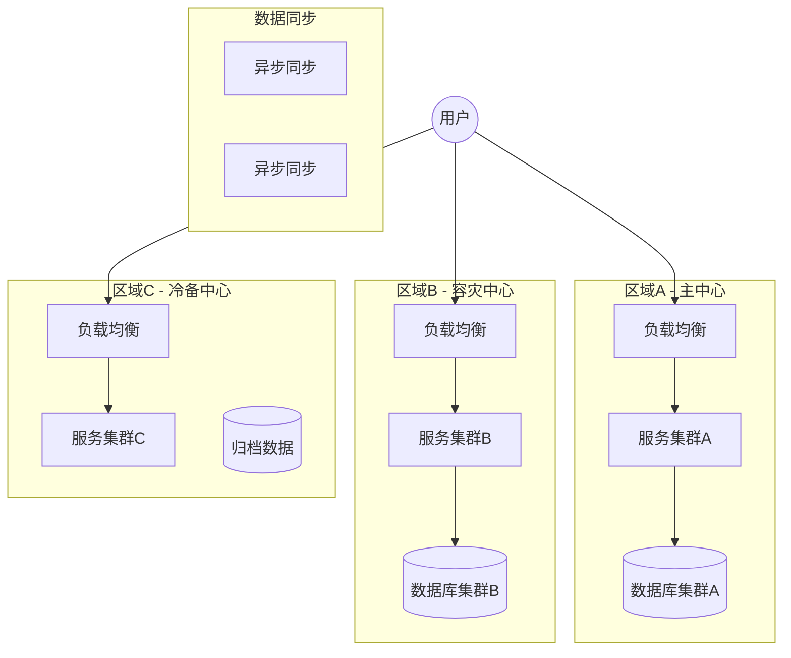
```mermaid
graph TB
    subgraph 区域A ["区域A - 主中心"]
        LBA["负载均衡"]
        SVA["服务集群A"]
        DBA[("数据库集群A")]
    end

    subgraph 区域B ["区域B - 容灾中心"]
        LBB["负载均衡"]
        SVB["服务集群B"]
        DBB[("数据库集群B")]
    end

    subgraph 区域C ["区域C - 冷备中心"]
        LBC["负载均衡"]
        SVC["服务集群C"]
        DBC[("归档数据")]
    end

    subgraph 数据同步
        SyncAB["异步同步"]
        SyncBC["异步同步"]
    end

    Users(("用户"))

    Users --> LBA
    Users --> LBB
    Users --> LBC

    LBA --> SVA
    LBB --> SVB
    LBC --> SVC

    SVA --> DBA
    SVB --> DBB

```

#### 两地三中心架构

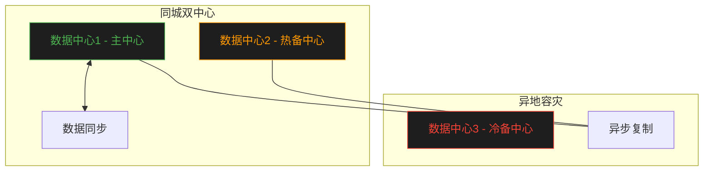
```mermaid
graph TB
    subgraph 同城 ["同城双中心"]
        DC1["数据中心1 - 主中心"]
        DC2["数据中心2 - 热备中心"]
        Sync1["数据同步"]
    end

    subgraph 异地 ["异地容灾"]
        DC3["数据中心3 - 冷备中心"]
        Sync2["异步复制"]
    end

    DC1 <--> Sync1
    DC1 --- Sync2
    DC2 --- Sync2
    DC3

    style DC1 fill:#1e1e1e,color:#4caf50,stroke:#4caf50
    style DC2 fill:#1e1e1e,color:#ff9800,stroke:#ff9800
    style DC3 fill:#1e1e1e,color:#f44336,stroke:#f44336
```

---

## 8.4 容错设计

容错设计确保系统在部分组件故障时仍能继续提供服务，通过预防、检测和恢复机制最大化系统可用性。

### 8.4.1 限流（Rate Limiting）

限流保护系统在流量突增时不被冲垮，通过限制单位时间内的请求数量来保护下游服务。

#### 限流算法

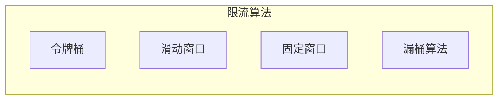
```mermaid
graph LR
    subgraph 限流算法
        TC["令牌桶"]
        SL["滑动窗口"]
        FC["固定窗口"]
        LD["漏桶算法"]
    end
```

**令牌桶算法实现**：

```java
public class TokenBucketRateLimiter {
    private final long capacity;           // 桶容量
    private final long refillRate;        // 每秒补充的令牌数
    private volatile long tokens;         // 当前令牌数
    private volatile long lastRefillTime; // 上次补充时间

    public TokenBucketRateLimiter(long capacity, long refillRate) {
        this.capacity = capacity;
        this.refillRate = refillRate;
        this.tokens = capacity;
        this.lastRefillTime = System.nanoTime();
    }

    public synchronized boolean tryAcquire() {
        refill();
        if (tokens > 0) {
            tokens--;
            return true;
        }
        return false;
    }

    public synchronized boolean tryAcquire(int permits) {
        refill();
        if (tokens >= permits) {
            tokens -= permits;
            return true;
        }
        return false;
    }

    private void refill() {
        long now = System.nanoTime();
        long elapsed = now - lastRefillTime;

        // 计算应该补充的令牌数
        long newTokens = (elapsed * refillRate) / 1_000_000_000L;
        if (newTokens > 0) {
            tokens = Math.min(capacity, tokens + newTokens);
            lastRefillTime = now;
        }
    }

    public long getAvailableTokens() {
        return tokens;
    }
}
```

**滑动窗口限流实现**：

```java
public class SlidingWindowRateLimiter {
    private final int windowSizeInSeconds;
    private final int maxRequests;
    private final Deque<Long> timestamps;

    public SlidingWindowRateLimiter(int windowSizeInSeconds, int maxRequests) {
        this.windowSizeInSeconds = windowSizeInSeconds;
        this.maxRequests = maxRequests;
        this.timestamps = new ConcurrentLinkedDeque<>();
    }

    public synchronized boolean tryAcquire() {
        long now = System.currentTimeMillis();
        long windowStart = now - windowSizeInSeconds * 1000L;

        // 清理窗口外的请求记录
        while (!timestamps.isEmpty() && timestamps.peekFirst() < windowStart) {
            timestamps.pollFirst();
        }

        if (timestamps.size() < maxRequests) {
            timestamps.offerLast(now);
            return true;
        }
        return false;
    }

    public int getCurrentRequestCount() {
        long now = System.currentTimeMillis();
        long windowStart = now - windowSizeInSeconds * 1000L;

        return (int) timestamps.stream()
                .filter(t -> t >= windowStart)
                .count();
    }
}
```

#### Guava RateLimiter 使用

```java
import com.google.common.util.concurrent.RateLimiter;

public class RateLimiterExample {

    public static void main(String[] args) {
        // 创建每秒处理10个请求的限流器
        RateLimiter limiter = RateLimiter.create(10.0);

        for (int i = 0; i < 20; i++) {
            // 尝试获取令牌，等待时间不超过5秒
            boolean acquired = limiter.tryAcquire(1, 5, TimeUnit.SECONDS);
            if (acquired) {
                System.out.println("请求 " + i + " 获取令牌成功");
            } else {
                System.out.println("请求 " + i + " 被限流");
            }
        }
    }
}
```

#### Sentinel 分布式限流

```java
import com.alibaba.csp.sentinel.Entry;
import com.alibaba.csp.sentinel.SphU;
import com.alibaba.csp.sentinel.slots.block.RuleConstant;
import com.alibaba.csp.sentinel.slots.block.flow.FlowRule;
import com.alibaba.csp.sentinel.slots.block.flow.FlowRuleManager;

import java.util.Arrays;

public class SentinelRateLimiter {

    public static void main(String[] args) {
        // 初始化限流规则
        initFlowRules();

        // 模拟请求
        for (int i = 0; i < 20; i++) {
            try (Entry entry = SphU.entry("helloResource")) {
                // 被保护的业务逻辑
                System.out.println("处理请求: " + i);
            } catch (BlockException ex) {
                // 被限流时的处理
                System.out.println("请求 " + i + " 被限流");
            }
        }
    }

    private static void initFlowRules() {
        FlowRule rule = new FlowRule()
            .setResource("helloResource")
            .setGrade(RuleConstant.FLOW_GRADE_QPS)    // 按QPS限流
            .setCount(10)                              // 阈值10
            .setControlBehavior(RuleConstant.CONTROL_BEHAVIOR_DEFAULT);

        FlowRuleManager.loadRules(Arrays.asList(rule));
    }
}
```

### 8.4.2 熔断（Circuit Breaker）

熔断器模式在检测到下游服务持续故障时，快速失败并阻止请求继续发送到故障服务。

#### 熔断器状态机

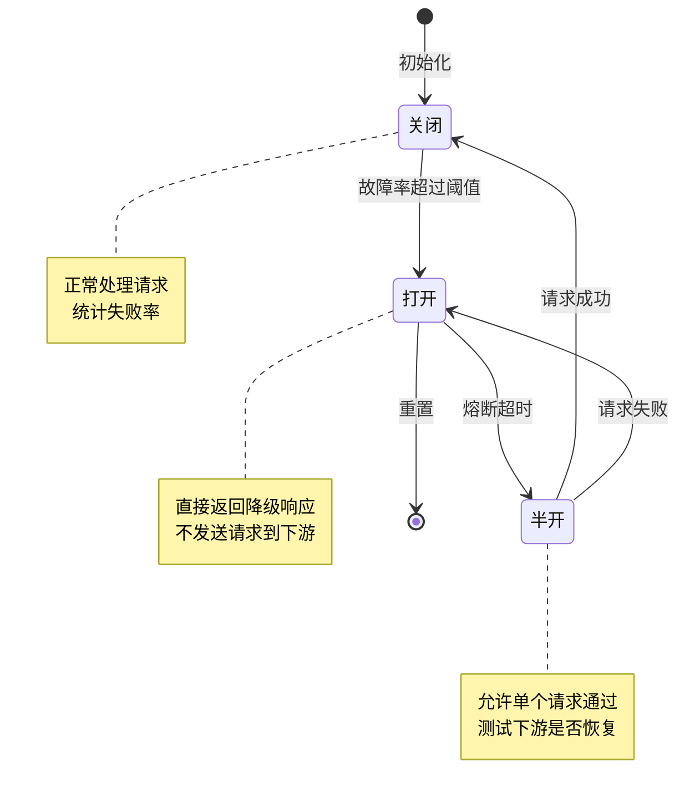
```mermaid
stateDiagram-v2
    [*] --> 关闭: 初始化
    关闭 --> 打开: 故障率超过阈值
    打开 --> 半开: 熔断超时
    半开 --> 关闭: 请求成功
    半开 --> 打开: 请求失败
    打开 --> [*]: 重置

    note right of 关闭
        正常处理请求
        统计失败率
    end note

    note right of 打开
        直接返回降级响应
        不发送请求到下游
    end note

    note right of 半开
        允许单个请求通过
        测试下游是否恢复
    end note
```

#### 熔断器实现

```java
public class CircuitBreaker {

    public enum State {
        CLOSED,    // 关闭状态：正常处理请求
        OPEN,      // 打开状态：快速失败
        HALF_OPEN  // 半开状态：尝试恢复
    }

    private final String name;
    private final int failureThreshold;     // 触发熔断的失败次数
    private final long recoveryTimeout;    // 熔断恢复超时
    private final long halfOpenMaxAttempts;// 半开状态允许的尝试次数

    private volatile State state = State.CLOSED;
    private volatile int failureCount = 0;
    private volatile int successCount = 0;
    private volatile long lastFailureTime = 0;
    private volatile int halfOpenAttempts = 0;

    private final AtomicLong totalRequests = new AtomicLong(0);
    private final AtomicLong failedRequests = new AtomicLong(0);

    public CircuitBreaker(String name, int failureThreshold,
                          long recoveryTimeout, int halfOpenMaxAttempts) {
        this.name = name;
        this.failureThreshold = failureThreshold;
        this.recoveryTimeout = recoveryTimeout;
        this.halfOpenMaxAttempts = halfOpenMaxAttempts;
    }

    public <T> T execute(Callable<T> action, Callable<T> fallback) throws Exception {
        if (!allowRequest()) {
            return fallback.call();
        }

        totalRequests.incrementAndGet();

        try {
            T result = action.call();
            recordSuccess();
            return result;
        } catch (Exception e) {
            recordFailure();
            return fallback.call();
        }
    }

    private boolean allowRequest() {
        switch (state) {
            case CLOSED:
                return true;

            case OPEN:
                // 检查是否应该转换到半开状态
                if (System.currentTimeMillis() - lastFailureTime >= recoveryTimeout) {
                    transitionToHalfOpen();
                    return true;
                }
                return false;

            case HALF_OPEN:
                // 限制半开状态的尝试次数
                return halfOpenAttempts < halfOpenMaxAttempts;

            default:
                return false;
        }
    }

    private void recordSuccess() {
        switch (state) {
            case CLOSED:
                failureCount = 0;
                break;
            case HALF_OPEN:
                successCount++;
                if (successCount >= halfOpenMaxAttempts) {
                    transitionToClosed();
                }
                break;
        }
    }

    private void recordFailure() {
        lastFailureTime = System.currentTimeMillis();
        failedRequests.incrementAndGet();
        failureCount++;

        switch (state) {
            case CLOSED:
                if (failureCount >= failureThreshold) {
                    transitionToOpen();
                }
                break;
            case HALF_OPEN:
                transitionToOpen();
                break;
        }
    }

    private void transitionToOpen() {
        state = State.OPEN;
        System.out.println(name + " 转换到 OPEN 状态");
    }

    private void transitionToHalfOpen() {
        state = State.HALF_OPEN;
        halfOpenAttempts = 1;
        successCount = 0;
        System.out.println(name + " 转换到 HALF_OPEN 状态");
    }

    private void transitionToClosed() {
        state = State.CLOSED;
        failureCount = 0;
        successCount = 0;
        halfOpenAttempts = 0;
        System.out.println(name + " 转换到 CLOSED 状态");
    }

    public State getState() {
        return state;
    }

    public double getFailureRate() {
        long total = totalRequests.get();
        if (total == 0) return 0;
        return (double) failedRequests.get() / total;
    }
}
```

#### Resilience4j 熔断器配置

```java
import io.github.resilience4j.circuitbreaker.CircuitBreaker;
import io.github.resilience4j.circuitbreaker.CircuitBreakerConfig;
import io.github.resilience4j.circuitbreaker.CircuitBreakerRegistry;

import java.time.Duration;
import java.util.function.Supplier;

public class Resilience4jExample {

    public static void main(String[] args) {
        // 创建熔断器配置
        CircuitBreakerConfig config = CircuitBreakerConfig.custom()
            .failureRateThreshold(50)                    // 失败率阈值50%
            .slowCallRateThreshold(80)                  // 慢调用率阈值80%
            .slowCallDurationThreshold(Duration.ofSeconds(3)) // 慢调用阈值3秒
            .waitDurationInOpenState(Duration.ofMinutes(1))   // 熔断持续时间1分钟
            .permittedNumberOfCallsInHalfOpenState(5)   // 半开状态允许5次调用
            .slidingWindowType(CircuitBreakerConfig.SlidingWindowType.COUNT_BASED)
            .slidingWindowSize(10)                      // 滑动窗口大小10次
            .minimumNumberOfCalls(5)                    // 最小调用次数5次
            .build();

        // 创建熔断器注册表
        CircuitBreakerRegistry registry = CircuitBreakerRegistry.of(config);

        // 创建熔断器
        CircuitBreaker circuitBreaker = registry.circuitBreaker("userService");

        // 使用熔断器包装服务调用
        Supplier<String> decoratedSupplier = CircuitBreaker
            .<String>decorateSupplier(circuitBreaker, this::callUserService)
            .andThenCompose(result -> {
                // 结果转换
                return CompletableFuture.completedFuture("Processed: " + result);
            });

        try {
            String result = decoratedSupplier.get();
            System.out.println("Result: " + result);
        } catch (Exception e) {
            System.out.println("Fallback triggered: " + e.getMessage());
        }
    }

    private String callUserService() {
        // 实际的服务调用逻辑
        throw new RuntimeException("Service unavailable");
    }
}
```

### 8.4.3 降级（Degradation）

降级是在系统压力过大或依赖服务故障时，有计划地关闭非核心功能，保证核心业务可用。

#### 降级策略层次

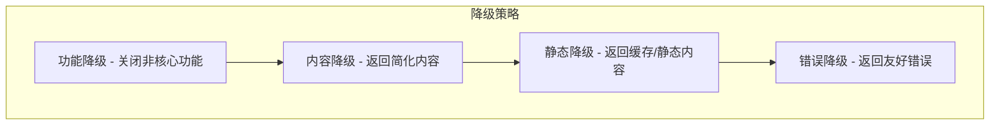
```mermaid
graph TB
    subgraph 降级策略
        BF["功能降级 - 关闭非核心功能"]
        CD["内容降级 - 返回简化内容"]
        SD["静态降级 - 返回缓存/静态内容"]
        ED["错误降级 - 返回友好错误"]
    end

    BF --> CD
    CD --> SD
    SD --> ED
```

#### 降级服务实现

```java
public interface DegradableService<T> {
    T call();
    T getFallback();
    boolean isDegraded();
}

public class ProductService implements DegradableService<ProductDetail> {

    private final ProductDetailService productDetailService;
    private final ReviewService reviewService;
    private final RecommendationService recommendationService;

    // 降级标志
    private volatile boolean detailDegraded = false;
    private volatile boolean reviewDegraded = false;
    private volatile boolean recommendationDegraded = false;

    public ProductDetail getProductDetail(Long productId) {
        ProductDetail detail = new ProductDetail();
        detail.setProductId(productId);

        // 核心数据必须获取
        try {
            detail.setBasicInfo(productDetailService.getBasicInfo(productId));
        } catch (Exception e) {
            throw new ServiceException("商品信息获取失败");
        }

        // 非核心数据降级处理
        if (!reviewDegraded) {
            try {
                detail.setReviews(reviewService.getReviews(productId));
            } catch (Exception e) {
                reviewDegraded = true;
                detail.setReviews(getDefaultReviews());
            }
        }

        if (!recommendationDegraded) {
            try {
                detail.setRecommendations(recommendationService.getRecommendations(productId));
            } catch (Exception e) {
                recommendationDegraded = true;
                detail.setRecommendations(Collections.emptyList());
            }
        }

        return detail;
    }

    private List<Review> getDefaultReviews() {
        return Collections.singletonList(
            new Review("系统繁忙，评价暂不可用", LocalDateTime.now())
        );
    }
}
```

### 8.4.4 回退（Fallback）

回退是在服务调用失败时，返回一个预设的默认值或缓存数据，保证业务流程继续执行。

#### Fallback 设计模式

```java
public class FallbackFactory {

    // 静态配置的回退值
    private static final Map<String, Object> STATIC_FALLBACKS = new HashMap<>();

    // 缓存的回退值
    private final Cache<String, Object> fallbackCache;

    static {
        STATIC_FALLBACKS.put("user.name", "Guest");
        STATIC_FALLBACKS.put("product.stock", "100");
        STATIC_FALLBACKS.put("order.maxItems", "50");
    }

    public <T> T getFallback(String key, Class<T> type, Supplier<T> primarySupplier) {
        try {
            T result = primarySupplier.get();
            // 成功时更新缓存
            if (result != null) {
                fallbackCache.put(key, result);
            }
            return result;
        } catch (Exception e) {
            // 失败时尝试从缓存获取
            T cached = getFromCache(key, type);
            if (cached != null) {
                return cached;
            }

            // 最后尝试静态配置
            return getStaticFallback(key, type);
        }
    }

    @SuppressWarnings("unchecked")
    private <T> T getFromCache(String key, Class<T> type) {
        Object value = fallbackCache.getIfPresent(key);
        if (value != null && type.isInstance(value)) {
            return (T) value;
        }
        return null;
    }

    @SuppressWarnings("unchecked")
    private <T> T getStaticFallback(String key, Class<T> type) {
        Object value = STATIC_FALLBACKS.get(key);
        if (value != null && type.isInstance(value)) {
            return (T) value;
        }
        // 返回类型默认值
        return getDefaultValue(type);
    }

    private <T> T getDefaultValue(Class<T> type) {
        if (type == String.class) return (T) "";
        if (type == Integer.class) return (T) Integer.valueOf(0);
        if (type == Long.class) return (T) Long.valueOf(0L);
        if (type == Boolean.class) return (T) Boolean.FALSE;
        if (type == List.class) return (T) Collections.emptyList();
        return null;
    }
}
```

#### 装饰器模式的 Fallback

```java
@FunctionalInterface
public interface RemoteService<T> {
    T call() throws Exception;
}

public class FallbackDecorator<T> implements RemoteService<T> {

    private final RemoteService<T> primary;
    private final RemoteService<T> fallback;

    public FallbackDecorator(RemoteService<T> primary, RemoteService<T> fallback) {
        this.primary = primary;
        this.fallback = fallback;
    }

    @Override
    public T call() throws Exception {
        try {
            return primary.call();
        } catch (Exception e) {
            System.out.println("主服务调用失败，触发fallback: " + e.getMessage());
            return fallback.call();
        }
    }

    public static void main(String[] args) throws Exception {
        RemoteService<String> primary = () -> {
            throw new RuntimeException("服务不可用");
        };

        RemoteService<String> fallback = () -> "Fallback Response";

        FallbackDecorator<String> decorator = new FallbackDecorator<>(primary, fallback);
        String result = decorator.call();
        System.out.println(result); // 输出: Fallback Response
    }
}
```

#### 降级与回退对比

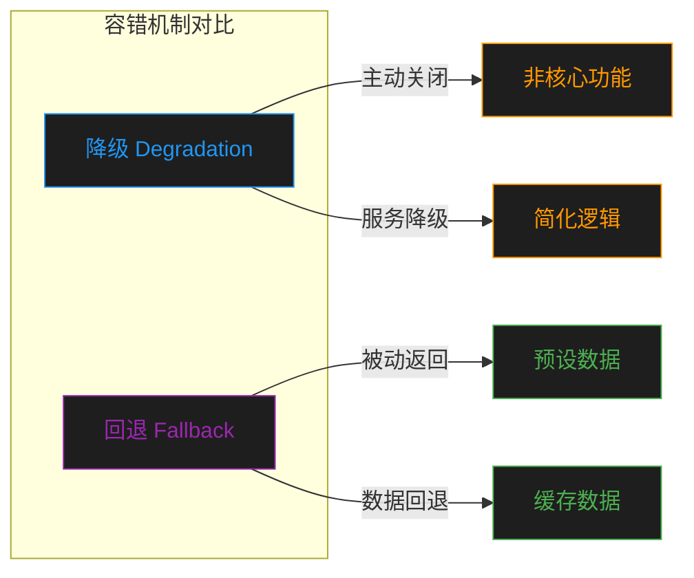
```mermaid
graph LR
    subgraph 容错机制对比
        D["降级 Degradation"]
        F["回退 Fallback"]
    end

    D --> |"主动关闭"| NF["非核心功能"]
    F --> |"被动返回"| FD["预设数据"]

    D --> |"服务降级"| SM["简化逻辑"]
    F --> |"数据回退"| SC["缓存数据"]

    style D fill:#1e1e1e,color:#2196f3,stroke:#2196f3
    style F fill:#1e1e1e,color:#9c27b0,stroke:#9c27b0
    style NF fill:#1e1e1e,color:#ff9800,stroke:#ff9800
    style FD fill:#1e1e1e,color:#4caf50,stroke:#4caf50
    style SM fill:#1e1e1e,color:#ff9800,stroke:#ff9800
    style SC fill:#1e1e1e,color:#4caf50,stroke:#4caf50
```

---

## 8.5 工程实践案例

### 8.5.1 微服务高可用设计

#### 微服务高可用架构

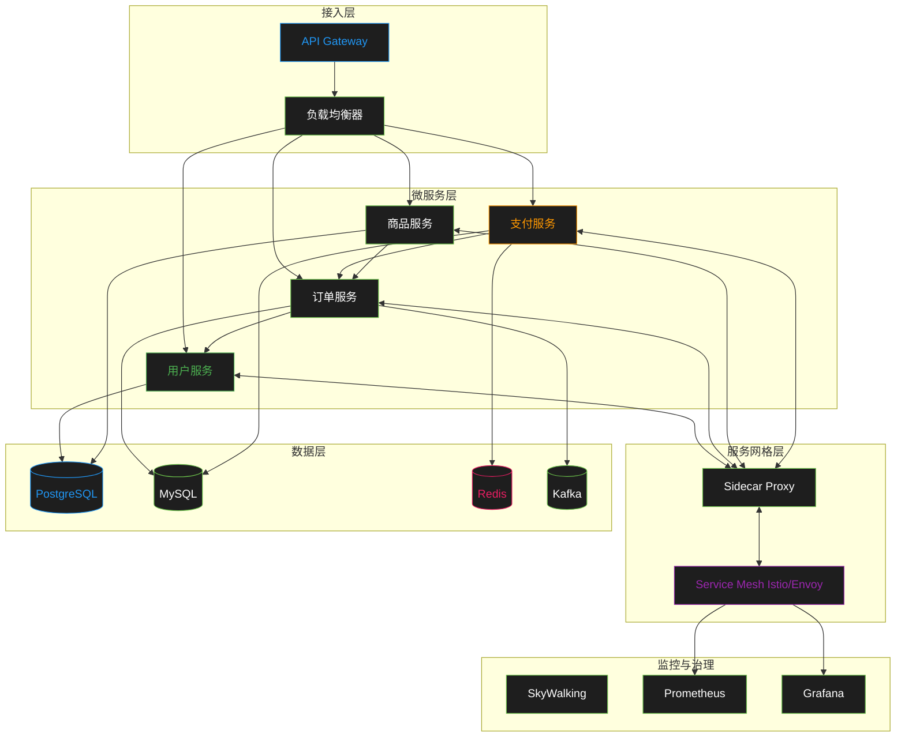
```mermaid
graph TB
    subgraph 接入层
        GW["API Gateway"]
        LB["负载均衡器"]
    end

    subgraph 服务网格层
        SM["Service Mesh Istio/Envoy"]
        SC["Sidecar Proxy"]
    end

    subgraph 微服务层
        MS1["用户服务"]
        MS2["订单服务"]
        MS3["商品服务"]
        MS4["支付服务"]
    end

    subgraph 数据层
        PG[("PostgreSQL")]
        MC[("MySQL")]
        RD[("Redis")]
        MQ[("Kafka")]
    end

    subgraph 监控与治理
        SK["SkyWalking"]
        PM["Prometheus"]
        GJ["Grafana"]
    end

    GW --> LB
    LB --> MS1
    LB --> MS2
    LB --> MS3
    LB --> MS4

    MS1 <--> SC
    MS2 <--> SC
    MS3 <--> SC
    MS4 <--> SC

    SC <--> SM
    SM --> GJ
    SM --> PM

    MS1 --> PG
    MS2 --> MC
    MS2 --> MQ
    MS3 --> PG
    MS4 --> MC
    MS4 --> RD

    MS2 --> MS1
    MS4 --> MS2
    MS3 --> MS2

    style GW fill:#1e1e1e,color:#2196f3,stroke:#2196f3
    style SM fill:#1e1e1e,color:#9c27b0,stroke:#9c27b0
    style MS1 fill:#1e1e1e,color:#4caf50,stroke:#4caf50
    style MS4 fill:#1e1e1e,color:#ff9800,stroke:#ff9800
    style PG fill:#1e1e1e,color:#2196f3,stroke:#2196f3
    style RD fill:#1e1e1e,color:#e91e63,stroke:#e91e63
    style LB fill:#1e1e1e,color:#ffffff,stroke:#6abf4a
    style SC fill:#1e1e1e,color:#ffffff,stroke:#6abf4a
    style MS2 fill:#1e1e1e,color:#ffffff,stroke:#6abf4a
    style MS3 fill:#1e1e1e,color:#ffffff,stroke:#6abf4a
    style MC fill:#1e1e1e,color:#ffffff,stroke:#6abf4a
    style MQ fill:#1e1e1e,color:#ffffff,stroke:#6abf4a
    style SK fill:#1e1e1e,color:#ffffff,stroke:#6abf4a
    style PM fill:#1e1e1e,color:#ffffff,stroke:#6abf4a
    style GJ fill:#1e1e1e,color:#ffffff,stroke:#6abf4a
```

#### Spring Cloud 高可用实战

**服务注册中心集群**：

```yaml
# application.yml - 高可用Eureka配置
spring:
  application:
    name: eureka-server-cluster

---
spring:
  profiles: node1
server:
  port: 8761
eureka:
  instance:
    hostname: eureka-node1
  client:
    register-with-eureka: false
    fetch-registry: false
    service-url:
      defaultZone: http://eureka-node2:8762/eureka/,http://eureka-node3:8763/eureka/

---
spring:
  profiles: node2
server:
  port: 8762
eureka:
  instance:
    hostname: eureka-node2
  client:
    register-with-eureka: false
    fetch-registry: false
    service-url:
      defaultZone: http://eureka-node1:8761/eureka/,http://eureka-node3:8763/eureka/

---
spring:
  profiles: node3
server:
  port: 8763
eureka:
  instance:
    hostname: eureka-node3
  client:
    register-with-eureka: false
    fetch-registry: false
    service-url:
      defaultZone: http://eureka-node1:8761/eureka/,http://eureka-node2:8762/eureka/
```

**服务消费者配置**：

```yaml
spring:
  application:
    name: order-service
  cloud:
    loadbalancer:
      ribbon:
        enabled: true

eureka:
  client:
    service-url:
      defaultZone: http://eureka-node1:8761/eureka/,http://eureka-node2:8762/eureka/,http://eureka-node3:8763/eureka/
    healthcheck:
      enabled: true
  instance:
    prefer-ip-address: true
    lease-renewal-interval-in-seconds: 10
    lease-expiration-duration-in-seconds: 30
```

**Feign 客户端配置**：

```java
@FeignClient(
    name = "user-service",
    fallback = UserServiceFallback.class,
    configuration = FeignConfig.class
)
public interface UserServiceClient {

    @GetMapping("/user/{id}")
    User getUser(@PathVariable("id") Long id);

    @PostMapping("/user")
    User createUser(@RequestBody User user);
}
```

```java
@Component
public class UserServiceFallback implements UserServiceClient {

    private static final Logger log = LoggerFactory.getLogger(UserServiceFallback.class);

    @Override
    public User getUser(Long id) {
        log.warn("User service fallback triggered for user id: {}", id);
        return new User(id, "Anonymous", "fallback@example.com");
    }

    @Override
    public User createUser(User user) {
        log.warn("User service fallback triggered for create user");
        throw new ServiceUnavailableException("User service temporarily unavailable");
    }
}
```

**Sentinel 熔断降级配置**：

```java
@Configuration
public class SentinelConfig {

    @Bean
    public SentinelResourceAspect sentinelResourceAspect() {
        return new SentinelResourceAspect();
    }
}
```

```java
@Service
public class ProductService {

    @Autowired
    private ProductClient productClient;

    @SentinelResource(
        value = "getProduct",
        fallback = "getProductFallback",
        blockHandler = "getProductBlockHandler",
        exceptionsToIgnore = {ProductNotFoundException.class}
    )
    public Product getProduct(Long productId) {
        return productClient.getProduct(productId);
    }

    // Fallback 方法
    public Product getProductFallback(Long productId, Throwable throwable) {
        log.error("getProduct fallback triggered for id: {}, error: {}",
                  productId, throwable.getMessage());

        // 返回缓存数据或默认值
        return productCache.getIfPresent(productId)
            .orElseGet(() -> Product.getDefaultProduct(productId));
    }

    // 限流处理方法
    public Product getProductBlockHandler(Long productId, BlockException ex) {
        log.warn("getProduct blocked for id: {}, reason: {}",
                 productId, ex.getClass().getSimpleName());

        return Product.getLimitedProduct(productId);
    }
}
```

### 8.5.2 数据库高可用方案

#### 数据库高可用架构

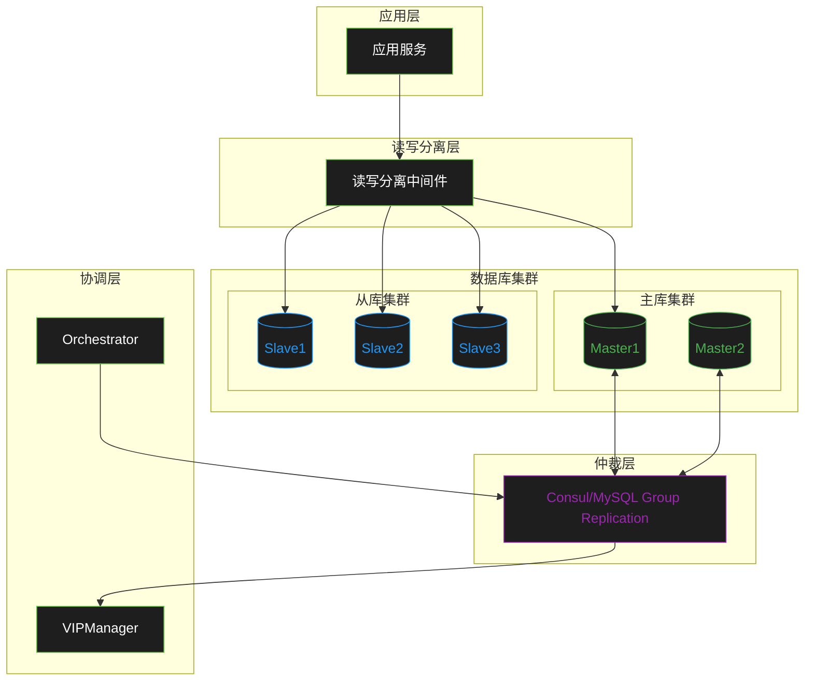
```mermaid
graph TB
    subgraph 应用层
        APP["应用服务"]
    end

    subgraph 读写分离层
        DR["读写分离中间件"]
    end

    subgraph 数据库集群
        subgraph Master ["主库集群"]
            M1[("Master1")]
            M2[("Master2")]
        end

        subgraph Slave ["从库集群"]
            S1[("Slave1")]
            S2[("Slave2")]
            S3[("Slave3")]
        end
    end

    subgraph 仲裁层
        CM["Consul/MySQL Group Replication"]
    end

    subgraph 协调层
        Orch["Orchestrator"]
        VIP["VIPManager"]
    end

    APP --> DR
    DR --> M1
    DR --> S1
    DR --> S2
    DR --> S3

    M1 <--> CM
    M2 <--> CM

    CM --> VIP
    Orch --> CM

    style M1 fill:#1e1e1e,color:#4caf50,stroke:#4caf50
    style M2 fill:#1e1e1e,color:#4caf50,stroke:#4caf50
    style S1 fill:#1e1e1e,color:#2196f3,stroke:#2196f3
    style S2 fill:#1e1e1e,color:#2196f3,stroke:#2196f3
    style S3 fill:#1e1e1e,color:#2196f3,stroke:#2196f3
    style CM fill:#1e1e1e,color:#9c27b0,stroke:#9c27b0
    style APP fill:#1e1e1e,color:#ffffff,stroke:#6abf4a
    style DR fill:#1e1e1e,color:#ffffff,stroke:#6abf4a
    style Orch fill:#1e1e1e,color:#ffffff,stroke:#6abf4a
    style VIP fill:#1e1e1e,color:#ffffff,stroke:#6abf4a
```

#### MySQL MGR（MySQL Group Replication）配置

```ini
# my.cnf 配置

# 组复制配置
transaction_write_set_extraction = XXHASH64
loose-group_replication_group_name = "aaaaaaaa-bbbb-cccc-dddd-eeeeeeeeeeee"
loose-group_replication_start_on_boot = OFF
loose-group_replication_local_address = "mysql1:33061"
loose-group_replication_group_seeds = "mysql1:33061,mysql2:33061,mysql3:33061"
loose-group_replication_bootstrap_group = OFF

# 复制度设置
loose-group_replication_recovery_get_public_key = ON
loose-group_replication_single_primary_mode = ON
loose-group_replication_communication_stack = XCOM

# 服务器ID
server-id = 1
log-bin = mysql-bin
binlog_format = ROW
```

```sql
-- 设置复制账号
SET SQL_LOG_BIN=0;
CREATE USER repl_user@'%' IDENTIFIED BY 'repl_password';
GRANT REPLICATION SLAVE, REPLICATION CLIENT ON *.* TO repl_user@'%';
SET SQL_LOG_BIN=1;

-- 启动组复制
SET GLOBAL group_replication_bootstrap_group = ON;
START GROUP_REPLICATION;
SET GLOBAL group_replication_bootstrap_group = OFF;

-- 验证组复制状态
SELECT * FROM performance_schema.replication_group_members;
```

#### Redis 高可用方案

**Redis Sentinel 架构**：

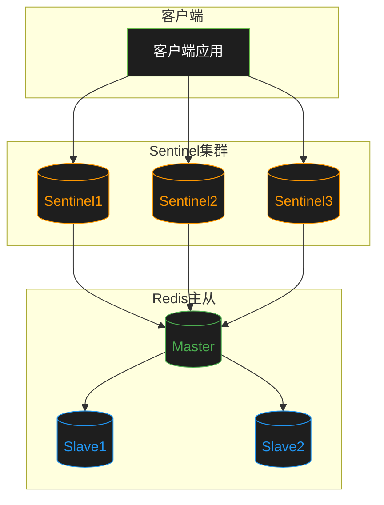
```mermaid
graph TB
    subgraph 客户端
        CL["客户端应用"]
    end

    subgraph Sentinel集群
        S1[("Sentinel1")]
        S2[("Sentinel2")]
        S3[("Sentinel3")]
    end

    subgraph Redis主从
        M[("Master")]
        S[("Slave1")]
        S2B[("Slave2")]
    end

    CL --> S1
    CL --> S2
    CL --> S3

    S1 --> M
    S2 --> M
    S3 --> M

    M --> S
    M --> S2B

    style M fill:#1e1e1e,color:#4caf50,stroke:#4caf50
    style S1 fill:#1e1e1e,color:#ff9800,stroke:#ff9800
    style S2 fill:#1e1e1e,color:#ff9800,stroke:#ff9800
    style S3 fill:#1e1e1e,color:#ff9800,stroke:#ff9800
    style S fill:#1e1e1e,color:#2196f3,stroke:#2196f3
    style S2B fill:#1e1e1e,color:#2196f3,stroke:#2196f3
    style CL fill:#1e1e1e,color:#ffffff,stroke:#6abf4a
```

**Redis Sentinel 配置**：

```conf
# sentinel.conf

# Sentinel 监控的主节点
sentinel monitor mymaster 192.168.1.10 6379 2

# 认证密码
sentinel auth-pass mymaster password123

# 主节点故障转移超时
sentinel down-after-milliseconds mymaster 30000

# 并行同步从节点数
parallel-syncs mymaster 1

# 故障转移有效期
sentinel failover-timeout mymaster 180000

# 自动发现其他 Sentinel
sentinel known-replica mymaster 192.168.1.11 6379
sentinel known-replica mymaster 192.168.1.12 6379
sentinel known-sentinel mymaster 192.168.1.20 26379
```

**Java Redis Sentinel 客户端**：

```java
import org.apache.commons.pool2.impl.GenericObjectPoolConfig;
import redis.clients.jedis.JedisPooled;
import redis.clients.jedis.Jedis;
import redis.clients.jedis.exceptions.JedisConnectionException;
import redis.clients.jedis.exceptions.JedisException;

public class RedisHighAvailabilityClient {

    private JedisPooled jedisPool;
    private final String masterName;
    private volatile String currentMaster;

    public RedisHighAvailabilityClient(String masterName, String... sentinelNodes) {
        this.masterName = masterName;

        String sentinelConfig = Arrays.stream(sentinelNodes)
            .map(node -> node.split(":")[0] + ":" + node.split(":")[1])
            .collect(Collectors.joining(","));

        GenericObjectPoolConfig poolConfig = new GenericObjectPoolConfig();
        poolConfig.setMaxTotal(100);
        poolConfig.setMaxIdle(50);
        poolConfig.setMinIdle(10);
        poolConfig.setTestOnBorrow(true);
        poolConfig.setTestOnReturn(true);
        poolConfig.setTestWhileIdle(true);

        // 方式1：使用JedisSentinelPool
        useJedisSentinelPool(sentinelNodes, poolConfig);
    }

    private void useJedisSentinelPool(String[] sentinelNodes, GenericObjectPoolConfig config) {
        Set<String> sentinelSet = new HashSet<>(Arrays.asList(sentinelNodes));

        JedisSentinelPool pool = new JedisSentinelPool(
            masterName,
            sentinelSet,
            config,
            3000,    // connectionTimeout
            3000,    // soTimeout
            "password123"
        );

        this.jedisPool = new JedisPooled(pool.getResource());
        this.currentMaster = pool.getCurrentHostMaster().getHost();
    }

    public String get(String key) {
        return executeWithRetry(() -> jedisPool.get(key));
    }

    public void set(String key, String value) {
        executeWithRetry(() -> {
            jedisPool.set(key, value);
            return null;
        });
    }

    public <T> T executeWithRetry(RedisOperation<T> operation) {
        int maxRetries = 3;
        int retryCount = 0;

        while (retryCount < maxRetries) {
            try {
                return operation.execute();
            } catch (JedisConnectionException e) {
                retryCount++;
                if (retryCount >= maxRetries) {
                    throw new JedisException("Redis operation failed after " + maxRetries + " retries", e);
                }
                // 等待后重试
                try {
                    Thread.sleep(100 * retryCount);
                } catch (InterruptedException ie) {
                    Thread.currentThread().interrupt();
                    throw new JedisException("Operation interrupted", ie);
                }
            }
        }
        throw new JedisException("Should not reach here");
    }

    @FunctionalInterface
    interface RedisOperation<T> {
        T execute();
    }
}
```

**Redis Cluster 方案**：

```java
import redis.clients.jedis.HostAndPort;
import redis.clients.jedis.JedisCluster;
import redis.clients.jedis.exceptions.JedisClusterException;

public class RedisClusterClient {

    private final JedisCluster cluster;

    public RedisClusterClient(Set<HostAndPort> nodes) {
        GenericObjectPoolConfig poolConfig = new GenericObjectPoolConfig();
        poolConfig.setMaxTotal(100);
        poolConfig.setMaxIdle(50);

        this.cluster = new JedisCluster(
            nodes,
            3000,      // connectionTimeout
            3000,      // soTimeout
            5,         // maxRedirections
            "password123",
            poolConfig
        );
    }

    public String get(String key) {
        try {
            return cluster.get(key);
        } catch (JedisClusterException e) {
            // 处理集群特定异常
            throw new RuntimeException("Redis cluster operation failed", e);
        }
    }

    public void set(String key, String value) {
        try {
            cluster.set(key, value);
        } catch (JedisClusterException e) {
            throw new RuntimeException("Redis cluster operation failed", e);
        }
    }

    // 自动重定向处理
    public void setWithRedirect(String key, String value) {
        int maxRetries = 5;
        for (int i = 0; i < maxRetries; i++) {
            try {
                cluster.set(key, value);
                return;
            } catch (JedisClusterException e) {
                if (i == maxRetries - 1) {
                    throw e;
                }
                // MOVED 重定向会自动处理
            }
        }
    }

    public void close() {
        cluster.close();
    }
}
```

---

## 8.6 高可用架构设计原则

### 8.6.1 核心设计原则

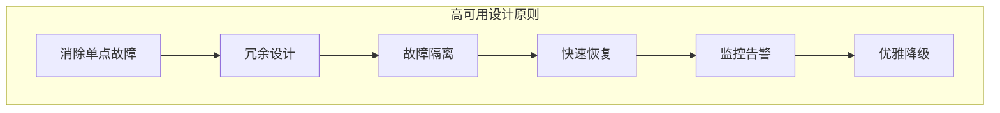
```mermaid
graph TB
    subgraph 高可用设计原则
        S1["消除单点故障"]
        S2["冗余设计"]
        S3["故障隔离"]
        S4["快速恢复"]
        S5["监控告警"]
        S6["优雅降级"]
    end

    S1 --> S2
    S2 --> S3
    S3 --> S4
    S4 --> S5
    S5 --> S6
```

### 8.6.2 详细设计原则

#### 1. 消除单点故障（Single Point of Failure）

**原则**：系统中不应存在任何单点组件，所有关键组件都应有冗余备份。

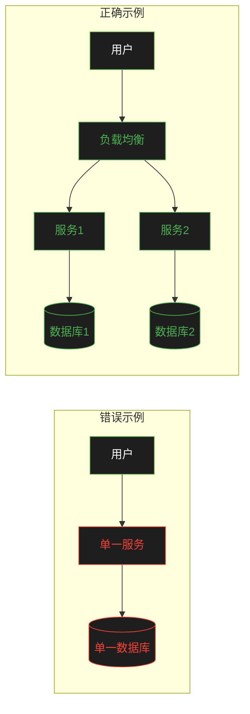
```mermaid
graph LR
    subgraph 错误示例
        U["用户"] --> S["单一服务"]
        S --> D[("单一数据库")]
    end

    subgraph 正确示例
        U2["用户"] --> LB["负载均衡"]
        LB --> S1["服务1"]
        LB --> S2["服务2"]
        S1 --> D1[("数据库1")]
        S2 --> D2[("数据库2")]
    end

    style S fill:#1e1e1e,color:#f44336,stroke:#f44336
    style D fill:#1e1e1e,color:#f44336,stroke:#f44336
    style U fill:#1e1e1e,color:#ffffff,stroke:#6abf4a
    style LB fill:#1e1e1e,color:#4caf50,stroke:#4caf50
    style S1 fill:#1e1e1e,color:#4caf50,stroke:#4caf50
    style S2 fill:#1e1e1e,color:#4caf50,stroke:#4caf50
    style D1 fill:#1e1e1e,color:#4caf50,stroke:#4caf50
    style D2 fill:#1e1e1e,color:#4caf50,stroke:#4caf50
    style U2 fill:#1e1e1e,color:#ffffff,stroke:#6abf4a
```

#### 2. 冗余设计（Redundancy）

**原则**：通过复制和冗余确保系统具有处理单点故障的能力。

| 冗余级别 | 说明 | 成本 | 适用场景 |
|---------|------|------|---------|
| 1+1冗余 | 两套完全独立系统 | 高 | 核心业务 |
| N+1冗余 | N套主用 + 1套备用 | 中高 | 重要服务 |
| N+M冗余 | N套主用 + M套备用 | 中 | 规模服务 |
| N+0冗余 | N套负载分担 | 中低 | 高吞吐场景 |

#### 3. 故障隔离（Failure Isolation）

**原则**：采用舱壁模式（Bulkhead Pattern）隔离故障，防止故障扩散。

```java
// 舱壁模式实现
public class BulkheadService {

    // 不同依赖使用独立的线程池
    private final ExecutorService userServicePool =
        Executors.newFixedThreadPool(10);

    private final ExecutorService orderServicePool =
        Executors.newFixedThreadPool(20);

    private final ExecutorService paymentServicePool =
        Executors.newFixedThreadPool(5);

    public CompletableFuture<User> getUser(Long userId) {
        return CompletableFuture.supplyAsync(
            () -> userService.call(userId),
            userServicePool
        );
    }

    public CompletableFuture<Order> createOrder(Order order) {
        return CompletableFuture.supplyAsync(
            () -> orderService.create(order),
            orderServicePool
        );
    }

    public CompletableFuture<Payment> processPayment(Payment payment) {
        return CompletableFuture.supplyAsync(
            () -> paymentService.process(payment),
            paymentServicePool
        );
    }
}
```

#### 4. 快速恢复（Fast Recovery）

**原则**：建立完善的故障检测和恢复机制，最小化MTTR。

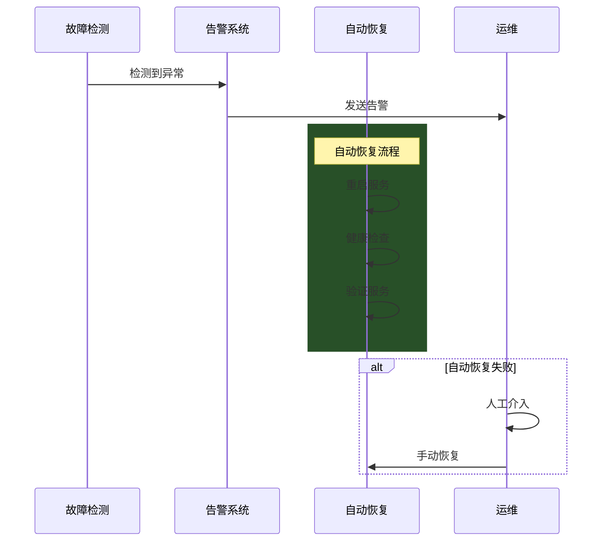
```mermaid
sequenceDiagram
    participant F as 故障检测
    participant A as 告警系统
    participant R as 自动恢复
    participant O as 运维

    F->>A: 检测到异常
    A->>O: 发送告警

    rect rgb(40, 80, 40)
        Note over R: 自动恢复流程
        R->>R: 重启服务
        R->>R: 健康检查
        R->>R: 验证服务
    end

    alt 自动恢复失败
        O->>O: 人工介入
        O->>R: 手动恢复
    end
```

#### 5. 监控告警（Monitoring）

**原则**：建立完善的监控体系，实现故障的早发现、早处理。

```java
// 健康检查接口实现
@RestController
@RequestMapping("/actuator")
public class HealthIndicator {

    @Autowired
    private DatabaseService databaseService;

    @Autowired
    private RedisService redisService;

    @Autowired
    private ExternalService externalService;

    @GetMapping("/health")
    public Health health() {
        Health.Builder builder = new Health.Builder();

        boolean allHealthy = true;

        // 数据库健康检查
        if (!checkDatabase()) {
            builder.down().withDetail("database", "unavailable");
            allHealthy = false;
        }

        // 缓存健康检查
        if (!checkRedis()) {
            builder.down().withDetail("redis", "unavailable");
            allHealthy = false;
        }

        // 外部依赖健康检查
        if (!checkExternal()) {
            builder.withDetail("external", "degraded");
        }

        if (allHealthy) {
            builder.up();
        }

        return builder.build();
    }

    private boolean checkDatabase() {
        try {
            return databaseService.healthCheck();
        } catch (Exception e) {
            return false;
        }
    }

    private boolean checkRedis() {
        try {
            return redisService.healthCheck();
        } catch (Exception e) {
            return false;
        }
    }

    private boolean checkExternal() {
        try {
            return externalService.healthCheck();
        } catch (Exception e) {
            return false;
        }
    }
}
```

#### 6. 优雅降级（Graceful Degradation）

**原则**：当系统无法处理全部请求时，有计划地关闭非核心功能，保证核心业务可用。

```java
public class GracefulDegradationManager {

    private final Map<String, FeatureFlag> features = new ConcurrentHashMap<>();

    public GracefulDegradationManager() {
        // 初始化功能开关
        features.put("recommendation", new FeatureFlag(true, Priority.HIGH));
        features.put("comment", new FeatureFlag(true, Priority.MEDIUM));
        features.put("ad", new FeatureFlag(true, Priority.LOW));
        features.put("analytics", new FeatureFlag(false, Priority.LOW));
    }

    public boolean isFeatureEnabled(String featureName) {
        FeatureFlag flag = features.get(featureName);
        return flag != null && flag.enabled;
    }

    public void setFeatureEnabled(String featureName, boolean enabled) {
        FeatureFlag flag = features.get(featureName);
        if (flag != null) {
            flag.enabled = enabled;
        }
    }

    public void degradeToPriority(Priority maxPriority) {
        features.values().forEach(flag -> {
            if (flag.priority.getValue() > maxPriority.getValue()) {
                flag.enabled = false;
            }
        });
    }

    public void restoreAll() {
        features.values().forEach(flag -> flag.enabled = true);
    }

    public static class FeatureFlag {
        volatile boolean enabled;
        Priority priority;

        public FeatureFlag(boolean enabled, Priority priority) {
            this.enabled = enabled;
            this.priority = priority;
        }
    }

    public enum Priority {
        CRITICAL(1),
        HIGH(2),
        MEDIUM(3),
        LOW(4);

        private final int value;

        Priority(int value) {
            this.value = value;
        }

        public int getValue() {
            return value;
        }
    }
}
```

### 8.6.3 高可用检查清单

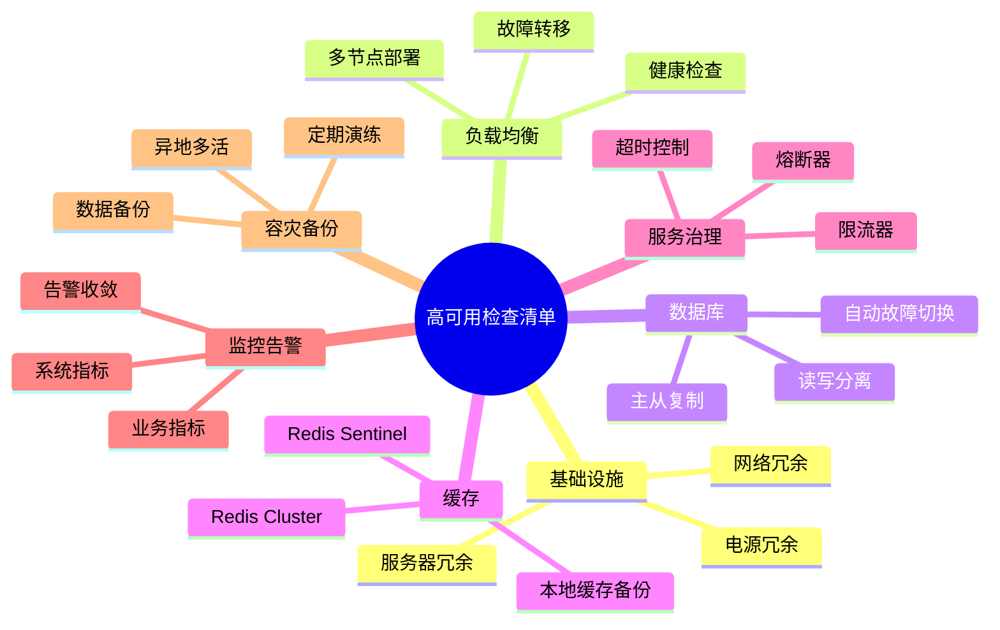
```mermaid
mindmap
  root((高可用检查清单))
    基础设施
      网络冗余
      电源冗余
      服务器冗余
    负载均衡
      多节点部署
      健康检查
      故障转移
    数据库
      主从复制
      读写分离
      自动故障切换
    缓存
      Redis Sentinel
      Redis Cluster
      本地缓存备份
    服务治理
      熔断器
      限流器
      超时控制
    监控告警
      业务指标
      系统指标
      告警收敛
    容灾备份
      数据备份
      异地多活
      定期演练
```

---

## 8.7 本章小结

本章系统介绍了高可用架构设计的核心知识：

1. **高可用指标**：通过可用性、MTBF、MTTR三个核心指标量化系统可靠性
2. **高可用模式**：负载均衡、集群、主备切换、异地多活构成完整的高可用体系
3. **容错设计**：限流、熔断、降级、回退形成立体的容错防护网
4. **工程实践**：微服务高可用和数据库高可用方案提供了落地参考
5. **设计原则**：消除单点、冗余设计、故障隔离、快速恢复、监控告警、优雅降级

高可用架构不是一次性设计完成的，需要持续迭代和优化。通过监控发现问题，通过容错保护系统，通过自动化提升效率，最终实现业务的高可用目标。

---

**推荐阅读**：

- 《Designing Data-Intensive Applications》- Martin Kleppmann
- 《Site Reliability Engineering》- Google
- 《Chaos Engineering》- Netflix

**相关工具**：

- Sentinel（阿里）- 流量控制、熔断降级
- Resilience4j - 熔断、重试、限流
- Chaos Monkey - 故障注入测试
