# 第9章：高性能架构设计

> 本章学习时间：约3小时
> 核心目标：掌握系统性能优化的核心方法论，建立全链路性能优化思维

## 9.1 性能优化概述

### 9.1.1 为什么需要性能优化

在互联网系统中，用户体验与系统性能密切相关。研究表明：

- **页面加载时间超过3秒**，53%的用户会离开网站
- **延迟增加100ms**，销售额可能下降约1%
- **系统响应时间翻倍**，用户满意度下降约30%

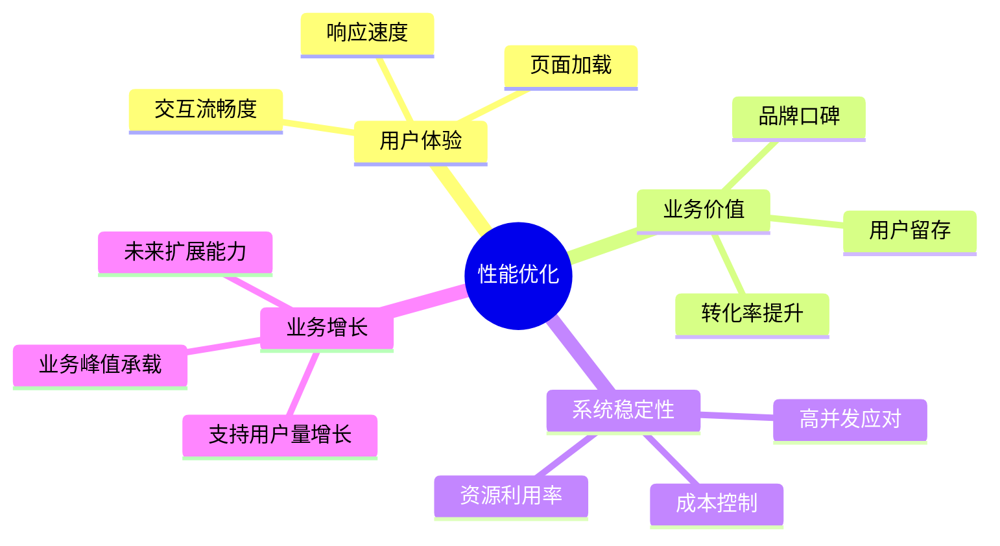

### 9.1.2 性能优化的核心思想

性能优化是一个系统工程，需要遵循以下核心思想：

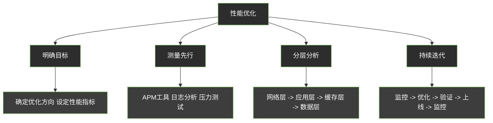

**优化原则：**

1. **测量先行**：不盲目安化，通过数据驱动优化方向
2. **二八定律**：80%的问题集中在20%的热点代码
3. **性价比优先**：优先优化投入产出比高的部分
4. **不能伤害系统可靠性**：优化不能降低系统的可用性

---

## 9.2 性能衡量指标

### 9.2.1 响应时间（Response Time, RT）

响应时间是衡量系统性能最直接的指标，表示从发起请求到收到响应的时间。

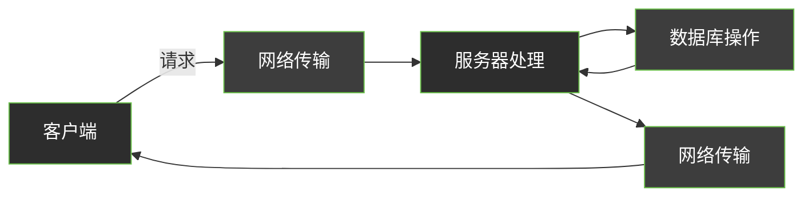

**响应时间的组成：**

| 阶段 | 说明 | 典型耗时 |
|------|------|----------|
| 网络延迟 | 数据在网络中传输的时间 | 1-50ms |
| 服务处理时间 | 服务器执行业务逻辑 | 5-200ms |
| 数据库查询 | SQL执行和结果返回 | 1-100ms |
| 缓存命中 | 内存访问 | 0.1-1ms |
| 等待时间 | 线程/进程排队 | 0-1000ms |

**常用百分位数：**

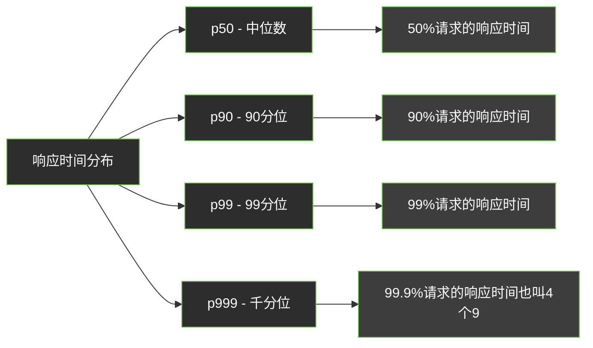

### 9.2.2 TPS（Transactions Per Second）

TPS是每秒处理的事务数量，是衡量系统吞吐量的核心指标。

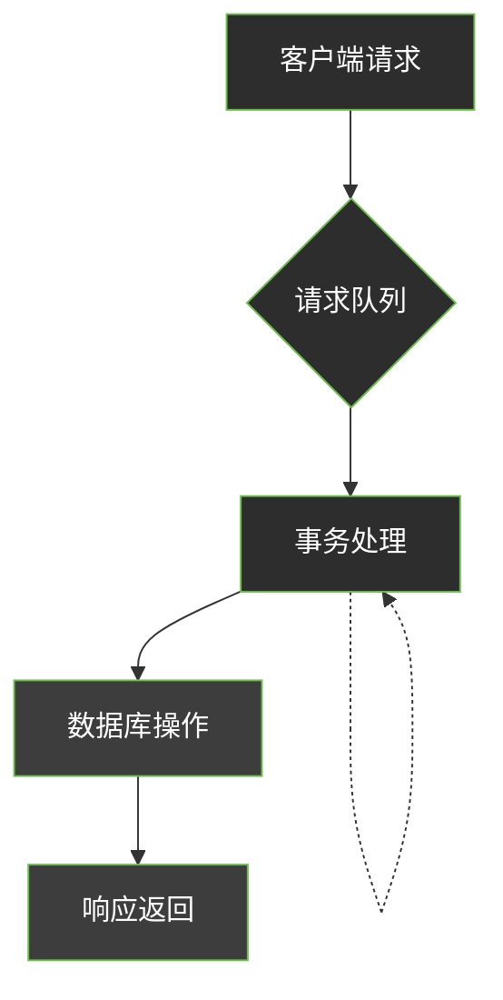

**TPS计算公式：**

```
TPS = 总事务数 / 总时间（秒）
```

**示例：** 10秒内处理了1000个事务，则 TPS = 100

### 9.2.3 QPS（Queries Per Second）

QPS是每秒查询数量，主要用于衡量数据库或搜索系统等查询密集型系统的性能。

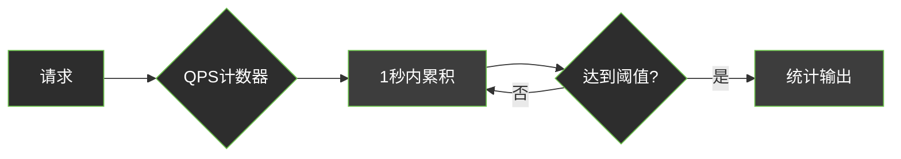

**TPS vs QPS 的区别：**

| 指标 | 适用范围 | 衡量对象 |
|------|----------|----------|
| TPS | 事务型系统 | 完整业务流程 |
| QPS | 查询型系统 | 单个查询操作 |

### 9.2.4 并发数

并发数是指系统同时处理的请求数量，反映系统的负载能力。

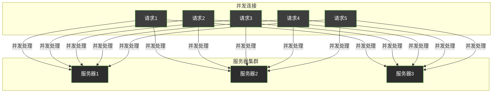

**并发数的三个层面：**

1. **连接并发**：服务器同时建立的连接数
2. **请求并发**：同时处理的请求数
3. **用户并发**：实际同时访问的用户数

### 9.2.5 吞吐量

吞吐量是指单位时间内系统处理的数据量，是系统性能的综合体现。

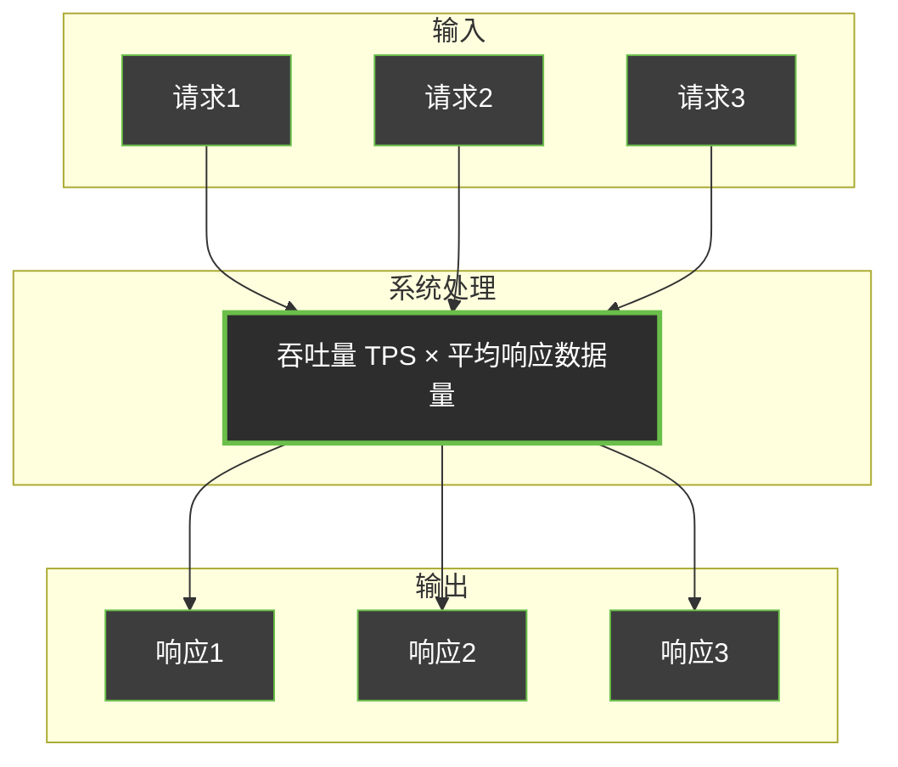

**吞吐量相关公式：**

```
吞吐量 = 并发数 / 平均响应时间

并发数 = TPS × 平均响应时间
```

### 9.2.6 性能指标关系总结

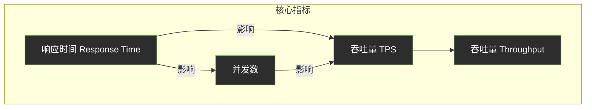

---

## 9.3 性能优化层次

性能优化需要从全局视角出发，逐层分析和优化。整体架构如下：

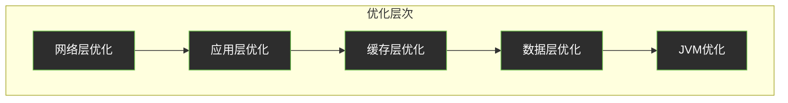

---

## 9.4 应用层优化

### 9.4.1 代码级别优化

**1. 减少不必要的对象创建**

```java
// ❌ 低效：每次调用都创建StringBuilder
public String inefficientConcat(String... parts) {
    StringBuilder sb = new StringBuilder();
    for (String part : parts) {
        sb.append(part);
    }
    return sb.toString();
}

// ✅ 高效：复用StringBuilder或使用String.join
public String efficientConcat(String... parts) {
    return String.join("", parts);
}
```

**2. 使用局部变量减少堆访问**

```java
// ❌ 低效：循环中重复访问数组长度
for (int i = 0; i < array.length; i++) {
    // array.length 每次都要查询
}

// ✅ 高效：缓存数组长度
int len = array.length;
for (int i = 0; i < len; i++) {
    // 使用局部变量len
}
```

**3. 批量操作替代循环调用**

```java
// ❌ 低效：循环插入
for (User user : userList) {
    userMapper.insert(user);
}

// ✅ 高效：批量插入
userMapper.batchInsert(userList);
```

### 9.4.2 算法优化

**时间复杂度优化示例：**

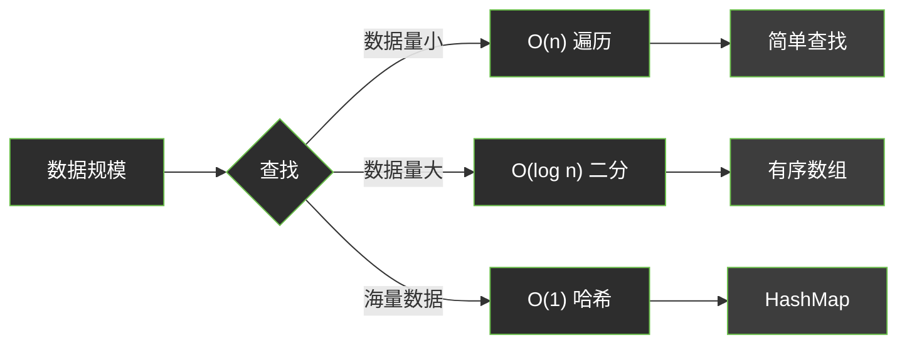

**代码示例：查询优化**

```java
// ❌ 低效：嵌套循环 O(n²)
public User findUserById(List<User> users, long id) {
    for (User user : users) {
        if (user.getId() == id) {
            return user;
        }
    }
    return null;
}

// ✅ 高效：使用Map索引 O(1)
public User findUserById(Map<Long, User> userMap, long id) {
    return userMap.get(id);
}
```

### 9.4.3 并发优化

**使用并行流处理：**

```java
// ❌ 顺序处理
List<String> results = new ArrayList<>();
for (String item : items) {
    results.add(process(item));
}

// ✅ 并行处理
List<String> results = items.parallelStream()
    .map(this::process)
    .collect(Collectors.toList());
```

---

## 9.5 缓存策略

缓存是性能优化中最有效的手段之一，可以显著减少数据库访问压力。

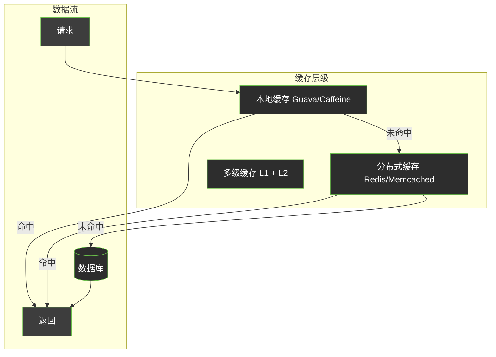

### 9.5.1 本地缓存

本地缓存位于应用进程内，访问速度最快，但无法跨进程共享。

**Caffeine使用示例：**

```java
import com.github.benmanes.caffeine.cache.Cache;
import com.github.benmanes.caffeine.cache.Caffeine;

public class LocalCacheExample {
    
    // 创建本地缓存
    private final Cache<String, User> userCache = Caffeine.newBuilder()
        .maximumSize(10_000)           // 最大容量
        .expireAfterWrite(10, TimeUnit.MINUTES)  // 写入后过期
        .recordStats()                  // 记录统计数据
        .build();
    
    public User getUser(String userId) {
        return userCache.get(userId, this::loadUserFromDB);
    }
    
    private User loadUserFromDB(String userId) {
        // 从数据库加载
        return userRepository.findById(userId);
    }
    
    // 获取缓存统计
    public void printStats() {
        CacheStats stats = userCache.stats();
        System.out.println("Hit Rate: " + stats.hitRate());
        System.out.println("Eviction Count: " + stats.evictionCount());
    }
}
```

### 9.5.2 分布式缓存

分布式缓存支持跨进程共享，适合大规模集群部署。

**Redis使用示例：**

```java
import org.springframework.data.redis.core.RedisTemplate;
import java.util.concurrent.TimeUnit;

@Service
public class RedisCacheService {
    
    @Autowired
    private RedisTemplate<String, Object> redisTemplate;
    
    // 设置缓存
    public void set(String key, Object value, long timeout) {
        redisTemplate.opsForValue().set(key, value, timeout, TimeUnit.SECONDS);
    }
    
    // 获取缓存
    public Object get(String key) {
        return redisTemplate.opsForValue().get(key);
    }
    
    // 获取缓存，如果不存在则加载
    public <T> T getWithLoader(String key, Class<T> clazz, Supplier<T> loader, long timeout) {
        Object value = get(key);
        if (value != null) {
            return (T) value;
        }
        
        // 缓存未命中，加载数据
        T newValue = loader.get();
        if (newValue != null) {
            set(key, newValue, timeout);
        }
        return newValue;
    }
    
    // 删除缓存
    public void delete(String key) {
        redisTemplate.delete(key);
    }
    
    // 批量获取
    public <T> List<T> multiGet(List<String> keys, Class<T> clazz) {
        List<Object> values = redisTemplate.opsForValue().multiGet(keys);
        return values.stream()
            .filter(Objects::nonNull)
            .map(v -> (T) v)
            .collect(Collectors.toList());
    }
}
```

### 9.5.3 多级缓存架构

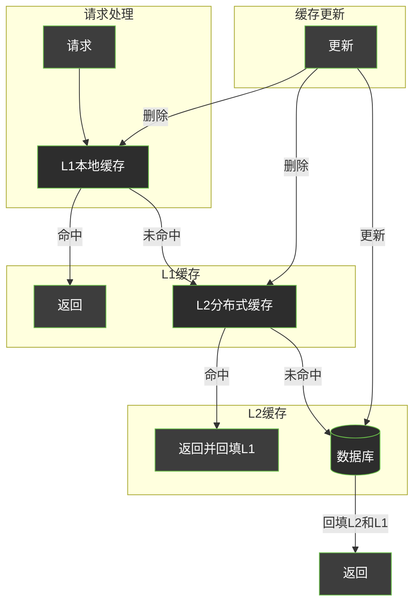

**多级缓存实现：**

```java
@Service
public class MultiLevelCacheService {
    
    // L1: 本地缓存
    private final Cache<String, User> localCache = Caffeine.newBuilder()
        .maximumSize(5000)
        .expireAfterWrite(1, TimeUnit.MINUTES)
        .build();
    
    @Autowired
    private RedisTemplate<String, User> redisTemplate;
    
    private static final String REDIS_KEY_PREFIX = "user:";
    
    public User getUser(String userId) {
        String cacheKey = REDIS_KEY_PREFIX + userId;
        
        // 1. 查询L1本地缓存
        User user = localCache.getIfPresent(cacheKey);
        if (user != null) {
            return user;
        }
        
        // 2. 查询L2分布式缓存
        user = redisTemplate.opsForValue().get(cacheKey);
        if (user != null) {
            // 回填L1
            localCache.put(cacheKey, user);
            return user;
        }
        
        // 3. 查询数据库
        user = userRepository.findById(userId);
        if (user != null) {
            // 回填L1和L2
            localCache.put(cacheKey, user);
            redisTemplate.opsForValue().set(cacheKey, user, 10, TimeUnit.MINUTES);
        }
        
        return user;
    }
    
    // 更新时清除多级缓存
    public void updateUser(User user) {
        String cacheKey = REDIS_KEY_PREFIX + user.getId();
        
        // 更新数据库
        userRepository.save(user);
        
        // 清除L1
        localCache.invalidate(cacheKey);
        
        // 清除L2
        redisTemplate.delete(cacheKey);
    }
}
```

---

## 9.6 异步处理

异步处理可以将耗时操作从主流程中剥离，提高系统的并发能力和响应速度。

### 9.6.1 消息队列异步化

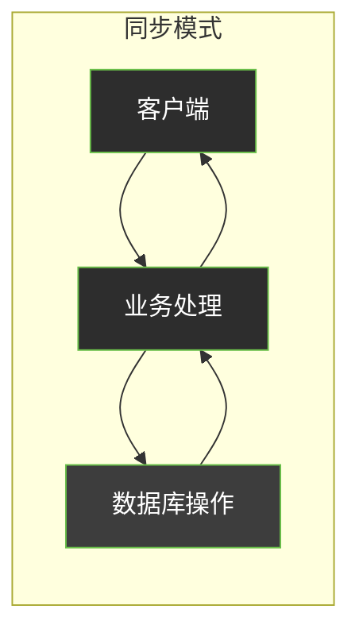

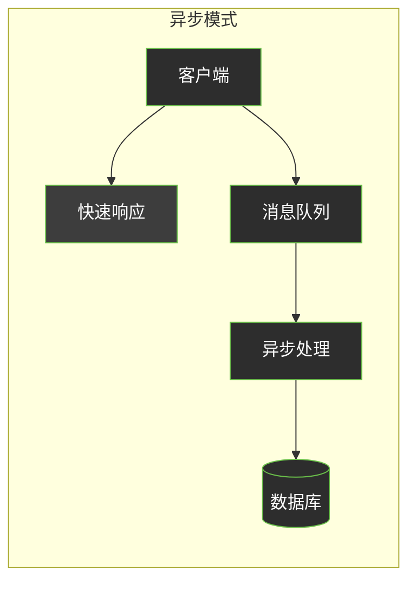

### 9.6.2 消息队列使用示例

**Spring Boot + RabbitMQ 示例：**

```java
// 消息生产者
@Service
public class OrderService {
    
    @Autowired
    private RabbitTemplate rabbitTemplate;
    
    public void createOrder(Order order) {
        // 1. 快速创建订单（状态待支付）
        order.setStatus(OrderStatus.PENDING);
        orderRepository.save(order);
        
        // 2. 发送消息到队列，异步处理
        rabbitTemplate.convertAndSend(
            "order.exchange",    // 交换机
            "order.create",      // 路由键
            order.getId()        // 消息内容
        );
        
        // 3. 立即返回响应
        return order.getId();
    }
}

// 消息消费者
@Component
public class OrderMessageConsumer {
    
    @Autowired
    private OrderService orderService;
    
    @Autowired
    private InventoryService inventoryService;
    
    @RabbitListener(queues = "order.create.queue")
    public void handleOrderCreate(Long orderId) {
        // 1. 扣减库存
        inventoryService.decreaseStock(orderId);
        
        // 2. 发送通知
        notificationService.sendOrderCreated(orderId);
        
        // 3. 更新订单状态
        orderService.confirmOrder(orderId);
    }
}
```

### 9.6.3 批量处理优化

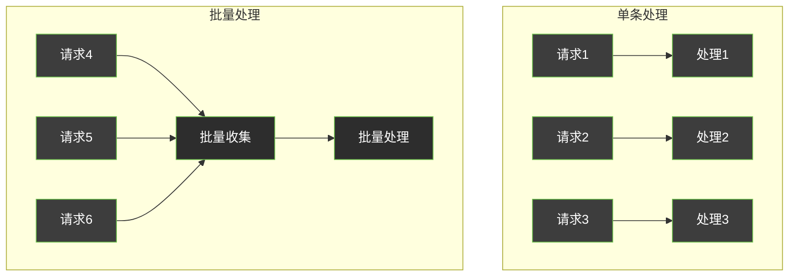

**批量发送短信示例：**

```java
@Service
public class SmsService {
    
    private final List<String> smsBuffer = new ArrayList<>();
    private final int BATCH_SIZE = 100;
    private final long FLUSH_INTERVAL_MS = 1000;
    
    @Autowired
    private SmsProvider smsProvider;
    
    // 添加到缓冲区
    public void sendSms(String phone, String message) {
        synchronized (smsBuffer) {
            smsBuffer.add(phone + ":" + message);
            
            // 达到批量大小，触发发送
            if (smsBuffer.size() >= BATCH_SIZE) {
                flush();
            }
        }
    }
    
    // 定时刷新
    @Scheduled(fixedDelay = 1000)
    public void scheduledFlush() {
        synchronized (smsBuffer) {
            if (!smsBuffer.isEmpty()) {
                flush();
            }
        }
    }
    
    // 批量发送
    private void flush() {
        if (smsBuffer.isEmpty()) {
            return;
        }
        
        List<String> toSend = new ArrayList<>(smsBuffer);
        smsBuffer.clear();
        
        // 批量发送
        smsProvider.batchSend(toSend);
    }
}
```

---

## 9.7 数据库优化

### 9.7.1 索引优化

索引是数据库优化的基础，合理的索引设计能大幅提升查询性能。

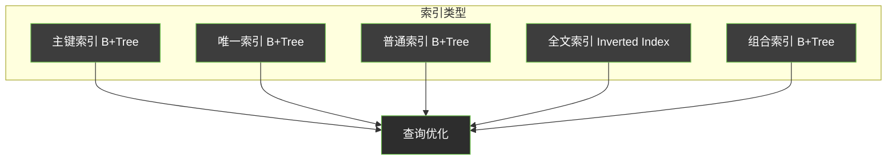

**索引设计原则：**

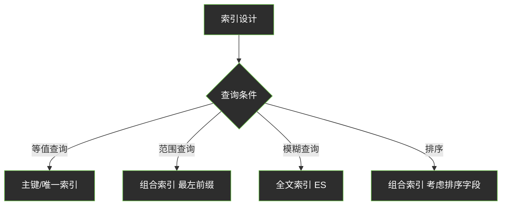

**MySQL索引示例：**

```sql
-- 创建组合索引遵循最左前缀原则
CREATE INDEX idx_user_status_time ON orders(user_id, status, create_time);

-- 查询能使用索引的情况
SELECT * FROM orders WHERE user_id = 1;                    -- ✅ 使用索引
SELECT * FROM orders WHERE user_id = 1 AND status = 1;       -- ✅ 使用索引
SELECT * FROM orders WHERE user_id = 1 AND create_time > ...; -- ✅ 使用索引

-- 查询不能使用索引的情况
SELECT * FROM orders WHERE status = 1;                      -- ❌ 不使用索引
SELECT * FROM orders WHERE create_time > ...;               -- ❌ 不使用索引
```

### 9.7.2 查询优化

**SQL编写优化：**

```java
// ❌ 低效SQL
@Select("SELECT * FROM orders WHERE status = #{status}")
List<Order> findByStatus(int status);

// ✅ 高效SQL - 指定列
@Select("SELECT id, user_id, total_amount, status, create_time " +
        "FROM orders WHERE status = #{status}")
List<Order> findByStatus(int status);

// ❌ 低效：SELECT *
@Select("SELECT * FROM user WHERE id = #{id}")

// ✅ 高效：只查询需要的列
@Select("SELECT id, name, email FROM user WHERE id = #{id}")
```

**使用EXPLAIN分析查询：**

```sql
EXPLAIN SELECT * FROM orders WHERE user_id = 123;

-- 关键字段：
-- type: const, eq_ref, ref, range, index, ALL (从左到右性能递减)
-- key: 实际使用的索引
-- rows: 扫描行数，越少越好
-- Extra: Using filesort, Using temporary 等需要关注的提示
```

### 9.7.3 分库分表

当单表数据量过大时，需要进行分库分表处理。

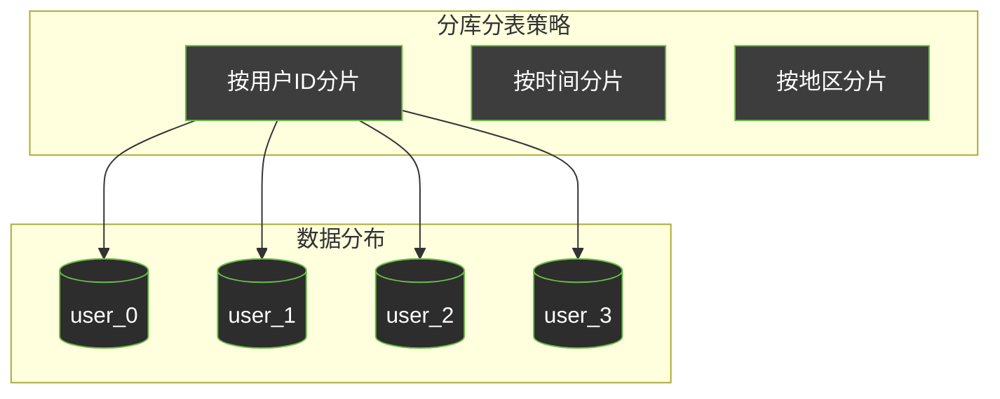

**ShardingSphere分库分表示例：**

```yaml
# application.yml
spring:
  shardingsphere:
    datasource:
      names: ds0, ds1
      ds0:
        url: jdbc:mysql://localhost:3306/orders_0
        driver-class-name: com.mysql.cj.jdbc.Driver
      ds1:
        url: jdbc:mysql://localhost:3306/orders_1
        driver-class-name: com.mysql.cj.jdbc.Driver
    
    sharding:
      tables:
        orders:
          actual-data-nodes: ds$->{0..1}.orders_$->{0..3}
          table-strategy:
            inline:
              sharding-column: user_id
              algorithm-expression: orders_$->{user_id % 4}
          key-generator:
            column: id
            type: SNOWFLAKE
```

---

## 9.8 网络优化

### 9.8.1 连接池优化

数据库连接池是网络优化的基础，合理配置能显著提升性能。

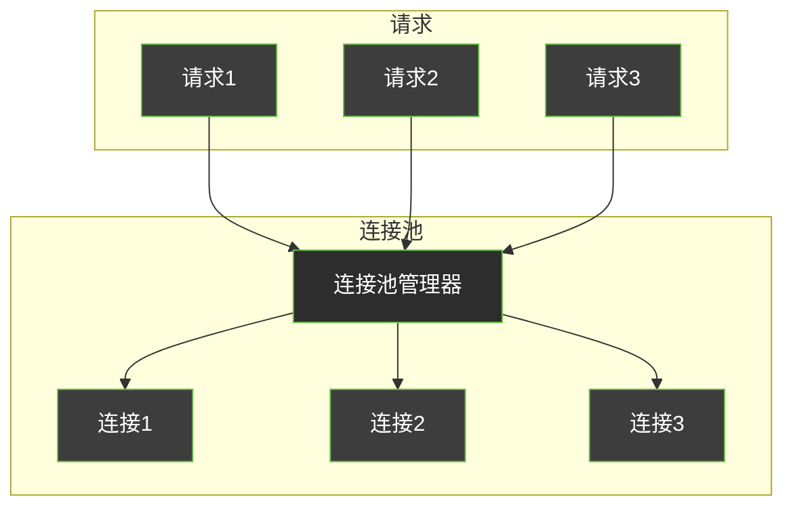

**HikariCP配置示例：**

```yaml
# application.yml
spring:
  datasource:
    url: jdbc:mysql://localhost:3306/mydb
    driver-class-name: com.mysql.cj.jdbc.Driver
    username: root
    password: password
    
    # HikariCP配置
    hikari:
      # 最小空闲连接数
      minimum-idle: 10
      # 最大连接数
      maximum-pool-size: 50
      # 连接最大生命周期
      max-lifetime: 1800000  # 30分钟
      # 连接超时时间
      connection-timeout: 30000  # 30秒
      # 空闲超时
      idle-timeout: 600000  # 10分钟
```

### 9.8.2 HTTP/2 与压缩

```mermaid
flowchart LR
    subgraph HTTP/1.1
        A1[请求1] --> S1[串行处理]
        A2[请求2] --> S1
        A3[请求3] --> S1
    end

    subgraph HTTP/2
        B1[请求1] --> P[并行处理]
        B2[请求2] --> P
        B3[请求3] --> P
    end

    style A1 fill:#3d3d3d,stroke:#6abf4a,color:#ffffff
    style A2 fill:#3d3d3d,stroke:#6abf4a,color:#ffffff
    style A3 fill:#3d3d3d,stroke:#6abf4a,color:#ffffff
    style S1 fill:#2d2d2d,stroke:#6abf4a,color:#ffffff
    style B1 fill:#3d3d3d,stroke:#6abf4a,color:#ffffff
    style B2 fill:#3d3d3d,stroke:#6abf4a,color:#ffffff
    style B3 fill:#3d3d3d,stroke:#6abf4a,color:#ffffff
    style P fill:#2d2d2d,stroke:#6abf4a,color:#ffffff
```

**Nginx HTTP/2 配置：**

```nginx
server {
    listen 443 ssl http2;
    
    # 启用SSL会话缓存
    ssl_session_cache shared:SSL:10m;
    ssl_session_timeout 10m;
    
    # 启用Gzip压缩
    gzip on;
    gzip_types text/plain application/json application/javascript text/css;
    gzip_min_length 1024;
    
    # 保持连接
    keepalive_timeout 65;
    
    location / {
        proxy_pass http://backend;
        proxy_http_version 1.1;
        proxy_set_header Connection "";
    }
}
```

---

## 9.9 JVM调优

### 9.9.1 垃圾回收概述

```mermaid
flowchart TB
    subgraph 垃圾回收器
        G1[G1垃圾回收器]
        ZGC[ZGC]
        CMS[CMS回收器]
        PS[Parallel GC]
    end

    subgraph 分代回收
        YGC[Young GC]
        FGC[Full GC]
    end

    G1 --> YGC
    G1 --> FGC
    ZGC --> YGC
    ZGC --> FGC

    style G1 fill:#2d2d2d,stroke:#6abf4a,color:#ffffff
    style ZGC fill:#2d2d2d,stroke:#6abf4a,color:#ffffff
    style CMS fill:#3d3d3d,stroke:#6abf4a,color:#ffffff
    style PS fill:#3d3d3d,stroke:#6abf4a,color:#ffffff
    style YGC fill:#2d2d2d,stroke:#6abf4a,color:#ffffff
    style FGC fill:#2d2d2d,stroke:#6abf4a,color:#ffffff
```

### 9.9.2 JVM参数配置

```bash
# 堆内存配置
-Xms4g          # 初始堆大小
-Xmx4g          # 最大堆大小
-Xmn2g          # 年轻代大小
-Xss512k        # 线程栈大小

# G1垃圾回收器配置
-XX:+UseG1GC                                    # 使用G1回收器
-XX:MaxGCPauseMillis=200                        # 最大GC停顿时间
-XX:G1HeapRegionSize=16m                        # Region大小
-XX:InitiatingHeapOccupancyPercent=45           # 触发GC的堆使用率

# 日志配置
-XX:+PrintGCDetails                             # 打印GC详情
-XX:+PrintGCDateStamps                          # 打印时间戳
-Xloggc:/var/log/gc.log                         # GC日志文件
```

### 9.9.3 内存配置示例

```yaml
# Kubernetes JVM配置示例
env:
  - name: JAVA_OPTS
    value: >
      -Xms2g
      -Xmx2g
      -Xmn1g
      -Xss512k
      -XX:+UseG1GC
      -XX:MaxGCPauseMillis=200
      -XX:+HeapDumpOnOutOfMemoryError
      -XX:HeapDumpPath=/var/log/heapdump.hprof
      -XX:+PrintGCDetails
      -Xlog:gc*:file=/var/log/gc.log:time
```

---

## 9.10 工程实践案例

### 9.10.1 Redis缓存设计实战

**案例：商品信息缓存系统**

```mermaid
flowchart TB
    subgraph 缓存架构
        API[API层]
        Cache[缓存服务]
        Redis[(Redis 集群)]
        DB[(MySQL)]
    end

    subgraph 缓存策略
        P1[读多写少 商品详情]
        P2[高频访问 库存信息]
        P3[热点数据 推荐列表]
    end

    API --> Cache
    Cache --> Redis
    Cache --> DB
    Redis -.->|回填| Cache

    style API fill:#3d3d3d,stroke:#6abf4a,color:#ffffff
    style Cache fill:#3d3d3d,stroke:#6abf4a,color:#ffffff
    style Redis fill:#2d2d2d,stroke:#6abf4a,color:#ffffff
    style DB fill:#2d2d2d,stroke:#6abf4a,color:#ffffff
    style P1 fill:#3d3d3d,stroke:#6abf4a,color:#ffffff
    style P2 fill:#3d3d3d,stroke:#6abf4a,color:#ffffff
    style P3 fill:#3d3d3d,stroke:#6abf4a,color:#ffffff
```

**完整实现代码：**

```java
@Service
public class ProductCacheService {
    
    private static final String PRODUCT_KEY_PREFIX = "product:";
    private static final String STOCK_KEY_PREFIX = "stock:";
    private static final String HOT_PRODUCT_KEY = "hot:products";
    
    private static final long PRODUCT_CACHE_TTL = 30;    // 分钟
    private static final long STOCK_CACHE_TTL = 5;       // 分钟
    
    @Autowired
    private RedisTemplate<String, Object> redisTemplate;
    
    @Autowired
    private ProductRepository productRepository;
    
    /**
     * 获取商品详情（ Cache-Aside 模式）
     */
    public Product getProduct(Long productId) {
        String cacheKey = PRODUCT_KEY_PREFIX + productId;
        
        // 1. 查询缓存
        Product product = (Product) redisTemplate.opsForValue().get(cacheKey);
        if (product != null) {
            return product;
        }
        
        // 2. 缓存未命中，查询数据库
        product = productRepository.findById(productId);
        if (product == null) {
            return null;
        }
        
        // 3. 写入缓存
        redisTemplate.opsForValue().set(cacheKey, product, 
            PRODUCT_CACHE_TTL, TimeUnit.MINUTES);
        
        return product;
    }
    
    /**
     * 更新商品（Cache-Aside + 延迟双删）
     */
    @Transactional
    public void updateProduct(Product product) {
        // 1. 先删除缓存
        String cacheKey = PRODUCT_KEY_PREFIX + product.getId();
        redisTemplate.delete(cacheKey);
        
        // 2. 更新数据库
        productRepository.save(product);
        
        // 3. 延迟删除缓存（解决并发问题）
        CompletableFuture.delayedExecutor(500, TimeUnit.MILLISECONDS)
            .execute(() -> redisTemplate.delete(cacheKey));
    }
    
    /**
     * 热点数据预热
     */
    public void preloadHotProducts() {
        // 从数据库查询热点商品
        List<Product> hotProducts = productRepository.findHotProducts();
        
        // 写入Redis Set
        redisTemplate.opsForSet().add(HOT_PRODUCT_KEY, 
            hotProducts.toArray());
        
        // 设置过期时间
        redisTemplate.expire(HOT_PRODUCT_KEY, 1, TimeUnit.HOURS);
    }
    
    /**
     * 分布式锁实现
     */
    public Product getProductWithLock(Long productId) {
        String cacheKey = PRODUCT_KEY_PREFIX + productId;
        String lockKey = "lock:" + cacheKey;
        String lockValue = UUID.randomUUID().toString();
        
        try {
            // 尝试获取锁（SET NX EX）
            Boolean acquired = redisTemplate.opsForValue()
                .setIfAbsent(lockKey, lockValue, 10, TimeUnit.SECONDS);
            
            if (Boolean.TRUE.equals(acquired)) {
                // 获取锁成功，查询并回填缓存
                Product product = productRepository.findById(productId);
                if (product != null) {
                    redisTemplate.opsForValue().set(cacheKey, product,
                        PRODUCT_CACHE_TTL, TimeUnit.MINUTES);
                }
                return product;
            } else {
                // 获取锁失败，短暂等待后重试
                Thread.sleep(50);
                return getProduct(productId);
            }
        } catch (InterruptedException e) {
            Thread.currentThread().interrupt();
            return productRepository.findById(productId);
        } finally {
            // 释放锁（Lua脚本保证原子性）
            String script = 
                "if redis.call('get', KEYS[1]) == ARGV[1] then " +
                "    return redis.call('del', KEYS[1]) " +
                "else return 0 end";
            redisTemplate.execute(
                new DefaultRedisScript<>(script, Long.class),
                Collections.singletonList(lockKey),
                lockValue
            );
        }
    }
}
```

### 9.10.2 数据库读写分离

**架构图：**

```mermaid
flowchart TB
    subgraph 应用层
        APP[应用服务]
    end

    subgraph 读写分离
        RWS[读写分离路由]
    end

    subgraph 数据层
        WDB[(主库 写)]
        RDB1[(从库1 读)]
        RDB2[(从库2 读)]
    end

    APP --> RWS
    RWS -->|写操作| WDB
    RWS -->|读操作| RDB1
    RWS -->|读操作| RDB2

    WDB -.->|同步| RDB1
    WDB -.->|同步| RDB2

    style APP fill:#3d3d3d,stroke:#6abf4a,color:#ffffff
    style RWS fill:#2d2d2d,stroke:#6abf4a,color:#ffffff
    style WDB fill:#2d2d2d,stroke:#6abf4a,color:#ffffff
    style RDB1 fill:#2d2d2d,stroke:#6abf4a,color:#ffffff
    style RDB2 fill:#2d2d2d,stroke:#6abf4a,color:#ffffff
```

**ShardingSphere读写分离配置：**

```yaml
spring:
  shardingsphere:
    datasource:
      names: master, slave0, slave1
      master:
        url: jdbc:mysql://master:3306/mydb
        driver-class-name: com.mysql.cj.jdbc.Driver
      slave0:
        url: jdbc:mysql://slave0:3306/mydb
        driver-class-name: com.mysql.cj.jdbc.Driver
      slave1:
        url: jdbc:mysql://slave1:3306/mydb
        driver-class-name: com.mysql.cj.jdbc.Driver
    
    rules:
      read-write-splitting:
        data-sources:
          prd_ds:
            type: Static
            props:
              master-data-source-name: master
              slave-data-source-names: slave0, slave1
            load-balancer:
              type: ROUND_ROBIN  # 负载均衡策略
              props:
                # 权重配置
```

**MyBatis读写分离实现：**

```java
// 动态数据源切换
public class RoutingDataSource extends AbstractRoutingDataSource {
    
    private static final ThreadLocal<String> contextHolder = 
        new ThreadLocal<>();
    
    public static void setReadOnly() {
        contextHolder.set("read");
    }
    
    public static void setWritable() {
        contextHolder.set("write");
    }
    
    public static void clear() {
        contextHolder.remove();
    }
    
    @Override
    protected Object determineCurrentLookupKey() {
        String key = contextHolder.get();
        return key != null ? key : "write";
    }
}

// AOP切换数据源
@Aspect
@Component
public class DataSourceAspect {
    
    @Pointcut("execution(* com.example.mapper..*.select*(..))")
    public void readPointcut() {}
    
    @Pointcut("execution(* com.example.mapper..*.insert*(..)) || " +
             "execution(* com.example.mapper..*.update*(..)) || " +
             "execution(* com.example.mapper..*.delete*(..))")
    public void writePointcut() {}
    
    @Around("readPointcut()")
    public Object switchToRead(ProceedingJoinPoint joinPoint) throws Throwable {
        try {
            RoutingDataSource.setReadOnly();
            return joinPoint.proceed();
        } finally {
            RoutingDataSource.clear();
        }
    }
    
    @Around("writePointcut()")
    public Object switchToWrite(ProceedingJoinPoint joinPoint) throws Throwable {
        try {
            RoutingDataSource.setWritable();
            return joinPoint.proceed();
        } finally {
            RoutingDataSource.clear();
        }
    }
}
```

### 9.10.3 消息队列削峰实战

**场景：秒杀系统削峰**

```mermaid
flowchart TB
    subgraph 用户请求
        U1[用户1]
        U2[用户2]
        U3[用户N]
    end

    subgraph 流量控制
        LIMIT[限流器]
        QUEUE[消息队列]
    end

    subgraph 异步处理
        WORKER1[Worker1]
        WORKER2[Worker2]
        WORKER3[WorkerN]
    end

    subgraph 数据层
        STOCK[(库存服务)]
        ORDER[(订单服务)]
    end

    U1 & U2 & U3 --> LIMIT
    LIMIT -->|请求| QUEUE
    QUEUE --> WORKER1 & WORKER2 & WORKER3
    WORKER1 & WORKER2 & WORKER3 --> STOCK
    WORKER1 & WORKER2 & WORKER3 --> ORDER

    style U1 fill:#3d3d3d,stroke:#6abf4a,color:#ffffff
    style U2 fill:#3d3d3d,stroke:#6abf4a,color:#ffffff
    style U3 fill:#3d3d3d,stroke:#6abf4a,color:#ffffff
    style LIMIT fill:#2d2d2d,stroke:#6abf4a,color:#ffffff
    style QUEUE fill:#2d2d2d,stroke:#6abf4a,color:#ffffff
    style WORKER1 fill:#3d3d3d,stroke:#6abf4a,color:#ffffff
    style WORKER2 fill:#3d3d3d,stroke:#6abf4a,color:#ffffff
    style WORKER3 fill:#3d3d3d,stroke:#6abf4a,color:#ffffff
    style STOCK fill:#2d2d2d,stroke:#6abf4a,color:#ffffff
    style ORDER fill:#2d2d2d,stroke:#6abf4a,color:#ffffff
```

**完整实现：**

```java
// 秒杀服务
@Service
public class SeckillService {
    
    private static final int MAX_QUEUE_SIZE = 10000;
    private static final int CORE_POOL_SIZE = 10;
    private static final int MAX_POOL_SIZE = 50;
    
    @Autowired
    private RedisTemplate<String, Object> redisTemplate;
    
    @Autowired
    private RabbitTemplate rabbitTemplate;
    
    @Autowired
    private SeckillStockMapper stockMapper;
    
    /**
     * 秒杀请求预处理
     */
    public Result<String> seckill(Long userId, Long productId) {
        // 1. 限流检查
        String rateLimitKey = "rate_limit:seckill:" + productId;
        Long count = redisTemplate.opsForValue().increment(rateLimitKey);
        if (count != null && count > MAX_QUEUE_SIZE) {
            return Result.error("活动太火爆，请稍后再试");
        }
        // 设置限流key过期时间
        redisTemplate.expire(rateLimitKey, 1, TimeUnit.MINUTES);
        
        // 2. 重复购买检查
        String purchaseKey = "seckill:purchased:" + productId + ":" + userId;
        if (Boolean.TRUE.equals(redisTemplate.hasKey(purchaseKey))) {
            return Result.error("您已参与过本活动");
        }
        
        // 3. 发送消息到队列
        SeckillMessage message = new SeckillMessage(userId, productId);
        rabbitTemplate.convertAndSend(
            "seckill.exchange",
            "seckill.order",
            message
        );
        
        // 4. 立即返回排队中
        return Result.success("排队中，请稍后查询结果");
    }
}

// 秒杀消息消费者
@Component
public class SeckillMessageConsumer {
    
    @Autowired
    private SeckillStockMapper stockMapper;
    
    @Autowired
    private OrderService orderService;
    
    @Autowired
    private RedisTemplate<String, Object> redisTemplate;
    
    private static final String STOCK_KEY = "seckill:stock:";
    private static final String PURCHASED_KEY = "seckill:purchased:";
    
    @RabbitListener(queues = "seckill.order.queue", concurrency = "10-50")
    public void handleSeckill(SeckillMessage message) {
        Long userId = message.getUserId();
        Long productId = message.getProductId();
        
        try {
            // 1. Redis原子扣减库存
            String stockKey = STOCK_KEY + productId;
            Long stock = redisTemplate.opsForValue().decrement(stockKey);
            
            if (stock == null || stock < 0) {
                // 库存不足
                notifyUser(userId, productId, "库存不足");
                return;
            }
            
            // 2. 标记用户已购买
            String purchasedKey = PURCHASED_KEY + productId + ":" + userId;
            redisTemplate.opsForValue().set(purchasedKey, "1", 24, TimeUnit.HOURS);
            
            // 3. 创建订单
            orderService.createSeckillOrder(userId, productId);
            
            // 4. 更新数据库库存
            updateDatabaseStock(productId);
            
            // 5. 通知用户成功
            notifyUser(userId, productId, "秒杀成功");
            
        } catch (Exception e) {
            // 释放Redis库存
            redisTemplate.opsForValue().increment(STOCK_KEY + productId);
            notifyUser(userId, productId, "系统繁忙，请稍后");
            log.error("Seckill error", e);
        }
    }
    
    private void updateDatabaseStock(Long productId) {
        // 异步更新数据库
        CompletableFuture.runAsync(() -> {
            stockMapper.decreaseStock(productId);
        });
    }
    
    private void notifyUser(Long userId, Long productId, String message) {
        // 发送通知（WebSocket/短信/邮件等）
    }
}
```

---

## 9.11 本章总结

### 9.11.1 核心知识点

```mermaid
mindmap
  root((高性能架构))
    性能指标
      响应时间 RT
      TPS/QPS
      并发数
      吞吐量
    优化层次
      应用层优化
      缓存策略
      异步处理
      数据库优化
      网络优化
      JVM调优
    工程实践
      Redis缓存设计
      读写分离
      消息队列削峰

    styling
      fill:#2d2d2d
      stroke:#6abf4a
      color:#ffffff
```

### 9.11.2 优化 checklist

| 层级 | 优化项 | 检查清单 |
|------|--------|----------|
| 应用层 | 代码优化 | 减少对象创建、批量操作、算法优化 |
| 缓存层 | 多级缓存 | 本地缓存 + 分布式缓存、缓存失效策略 |
| 异步层 | 消息队列 | 削峰填谷、异步解耦、可靠投递 |
| 数据库 | 索引优化 | 合理索引、慢查询优化、分库分表 |
| 网络层 | 连接复用 | HTTP/2、连接池、压缩传输 |
| JVM | GC优化 | 选择合适GC器、合理内存配置 |

### 9.11.3 进一步学习

- 深入学习各中间件的调优参数
- 掌握APM工具（Skywalking、Pinpoint）的使用
- 学习全链路压测方案
- 研究K8s环境下的性能调优

---

> 本章完