# 第10章：可扩展性架构设计

## 10.1 可扩展性概述

可扩展性（Scalability）是系统在负载增加时，通过增加资源来提升系统性能和处理能力的能力。一个具有良好的可扩展性的系统，能够在业务增长时平滑地进行扩容，而无需对系统架构进行大规模重构。

### 10.1.1 为什么需要可扩展性

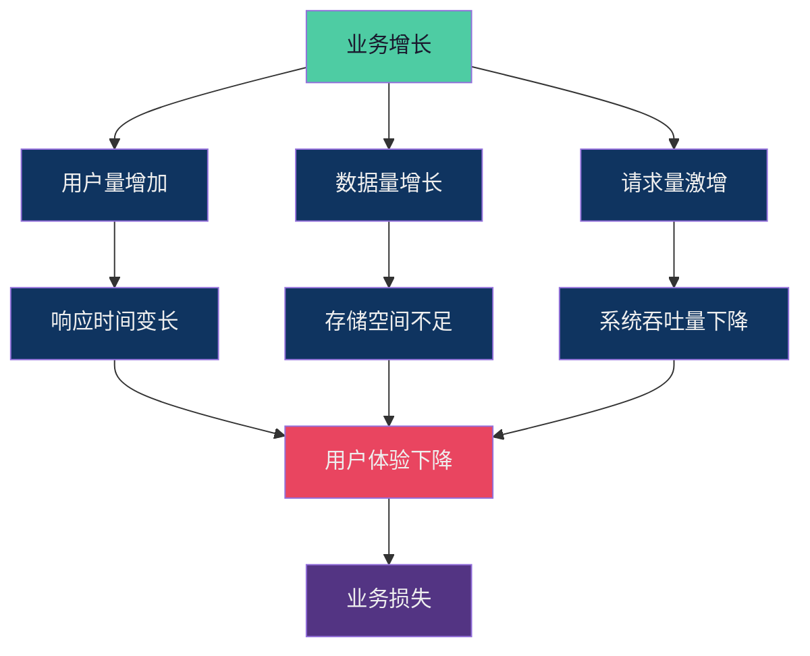

### 10.1.2 可扩展性的核心目标

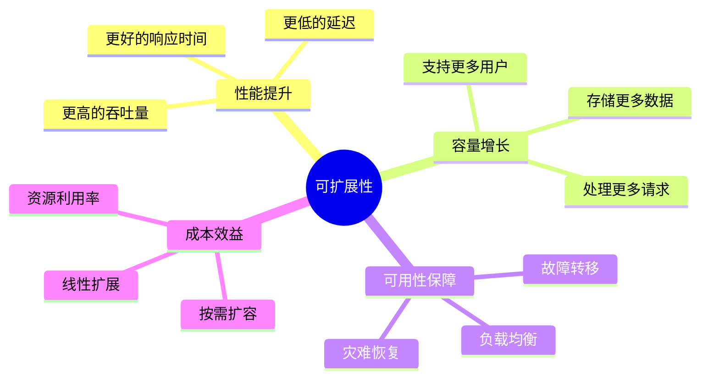

## 10.2 水平扩展 vs 垂直扩展

这是两种最基本的扩展方式，各有优劣，适用于不同的场景。

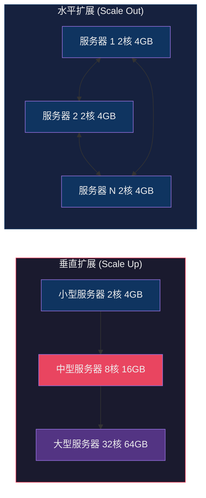

### 10.2.1 垂直扩展

垂直扩展是通过增加单台服务器的硬件资源来提升系统能力。

**优点：**
- 实施简单，无需修改应用代码
- 适合有状态服务（如数据库主库）
- 短期内效果显著
- 运维复杂度较低

**缺点：**
- 单机性能有上限，无法无限扩展
- 硬件成本非线性增长（高端设备价格指数级上升）
- 单点故障风险
- 扩展周期长，需要停机升级

**适用场景：**
- 数据库主库
- 缓存服务器
- 单机能够承载的应用

### 10.2.2 水平扩展

水平扩展是通过增加服务器数量来提升系统能力。

**优点：**
-理论上无性能上限
- 成本线性增长
- 高可用性强，无单点故障
- 扩展速度快，灰度发布

**缺点：**
- 架构复杂度高
- 需要应用支持分布式（如无状态设计）
- 数据一致性问题
- 运维复杂度高

**适用场景：**
- Web应用服务器
- 微服务
- 无状态计算任务

### 10.2.3 扩展策略对比

> 以下为Markdown表格，非mermaid图：

| 维度 | 垂直扩展 | 水平扩展 |
|------|----------|----------|
| 扩展方式 | 增加单机资源 | 增加服务器数量 |
| 成本增长 | 非线性（高端设备昂贵） | 线性（标准设备） |
| 性能上限 | 受单机限制 | 理论上无上限 |
| 可用性 | 单点故障 | 高可用 |
| 复杂度 | 低 | 高 |
| 扩展时间 | 长（需停机） | 短（在线扩展） |
| 适用场景 | 有状态服务 | 无状态服务 |

## 10.3 数据库扩展策略

数据库是系统扩展中最复杂的部分，因为数据有状态，需要精心设计扩展策略。

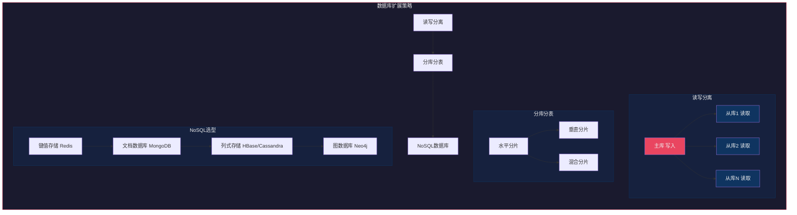

### 10.3.1 读写分离

读写分离是将数据库的读和写操作分离到不同的服务器上，利用从库来分担读压力。

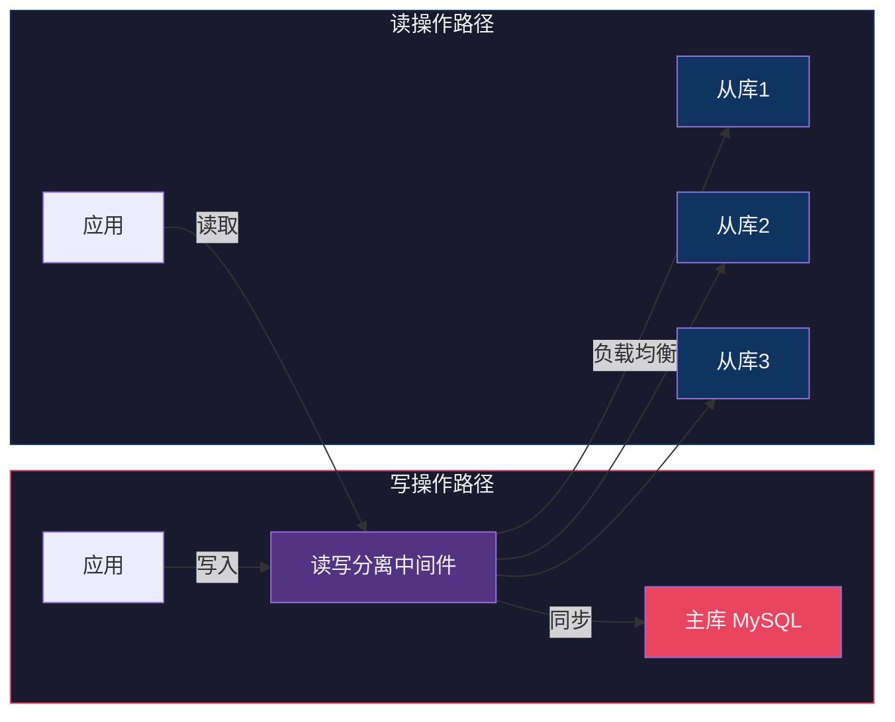

**核心配置示例（MySQL主从）：**

```yaml
# MySQL Master 配置
server-id = 1
log-bin = mysql-bin
binlog-format = ROW
sync-binlog = 1

# MySQL Slave 配置
server-id = 2
relay-log = relay-bin
read-only = ON
replicate-do-db = app_db
```

**应用层实现（Java示例）：**

```java
// 读写分离数据源配置
@Configuration
public class DataSourceConfig {
    
    @Bean
    public DataSource routerDataSource() {
        Map<Object, Object> targetDataSources = new HashMap<>();
        targetDataSources.put("master", masterDataSource());
        targetDataSources.put("slave1", slave1DataSource());
        targetDataSources.put("slave2", slave2DataSource());
        
        RoutingDataSource routingDataSource = new RoutingDataSource();
        routingDataSource.setTargetDataSources(targetDataSources);
        routingDataSource.setDefaultTargetDataSource(masterDataSource());
        
        return routingDataSource;
    }
}

// 自定义路由注解
@Target(ElementType.METHOD)
@Retention(RetentionPolicy.RUNTIME)
public @interface ReadOnly {
    boolean value() default true;
}

// 数据源路由切面
@Aspect
@Component
public class DataSourceRoutingAspect {
    
    @Around("@annotation(readOnly)")
    public Object routeRead(ProceedingJoinPoint point, ReadOnly readOnly) throws Throwable {
        if (readOnly.value()) {
            DataSourceContextHolder.setReadOnly();
        } else {
            DataSourceContextHolder.setMaster();
        }
        try {
            return point.proceed();
        } finally {
            DataSourceContextHolder.clear();
        }
    }
}

// 服务使用示例
@Service
public class UserService {
    
    @Autowired
    private UserMapper userMapper;
    
    // 读操作 - 路由到从库
    @ReadOnly(true)
    public User getUserById(Long id) {
        return userMapper.selectById(id);
    }
    
    // 写操作 - 路由到主库
    public void createUser(User user) {
        userMapper.insert(user);
    }
}
```

**数据延迟问题处理：**

```java
// 强制读取主库（用于对数据一致性要求高的场景）
public class MasterQuery {
    
    @Autowired
    @Qualifier("masterDataSource")
    private DataSource masterDataSource;
    
    public User getUserConsistent(Long id) {
        // 使用主库数据源执行查询
        return executeWithDataSource(masterDataSource, () -> {
            // 执行查询逻辑
            return userMapper.selectById(id);
        });
    }
}
```

### 10.3.2 分库分表

当单库单表无法满足数据量和并发量需求时，需要进行分库分表。

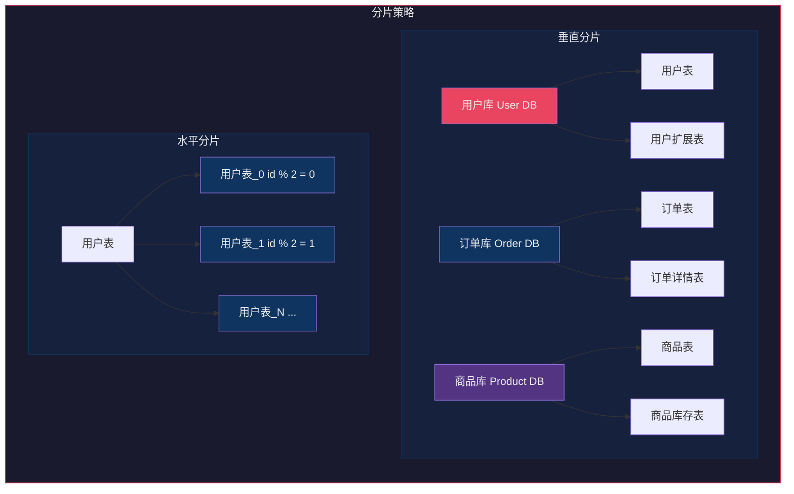

#### 10.3.2.1 垂直分片

垂直分片是按照业务功能将表拆分到不同的数据库中。

```sql
-- 原始用户表
CREATE TABLE users (
    id BIGINT PRIMARY KEY,
    username VARCHAR(50),
    email VARCHAR(100),
    phone VARCHAR(20),
    avatar VARCHAR(255),
    profile TEXT,          -- 用户简介，可能很大
    settings JSON,        -- 用户设置
    create_time DATETIME,
    update_time DATETIME
);

-- 拆分为基础信息表
CREATE TABLE users (
    id BIGINT PRIMARY KEY,
    username VARCHAR(50),
    email VARCHAR(100),
    phone VARCHAR(20),
    create_time DATETIME,
    update_time DATETIME
);

-- 拆分为扩展信息表
CREATE TABLE user_profiles (
    id BIGINT PRIMARY KEY,
    user_id BIGINT,
    avatar VARCHAR(255),
    profile TEXT,
    settings JSON,
    FOREIGN KEY (user_id) REFERENCES users(id)
);
```

#### 10.3.2.2 水平分片

水平分片是按照数据特征将表拆分到多个库或表中。

**分片键选择原则：**
- 选择查询最频繁的字段
- 选择分布均匀的字段（避免数据倾斜）
- 选择不会频繁变更的字段

```java
// 分片算法实现
public class ShardingAlgorithm {
    
    // 哈希分片
    public static int hashSharding(long userId, int shardCount) {
        return (int) (userId % shardCount);
    }
    
    // 范围分片
    public static int rangeSharding(long userId, int shardCount) {
        return (int) (userId / 1000000 % shardCount);
    }
    
    // 一致性哈希分片（解决扩容问题）
    private static final int VIRTUAL_NODE_COUNT = 150;
    private final TreeMap<Long, Integer> circle = new TreeMap<>();
    
    public void init(List<String> nodes) {
        for (String node : nodes) {
            // 每个物理节点添加虚拟节点
            for (int i = 0; i < VIRTUAL_NODE_COUNT; i++) {
                long hash = hash("SHARD-" + node + "-NODE-" + i);
                circle.put(hash, Integer.parseInt(node.replace("shard_", "")));
            }
        }
    }
    
    public int getShardingKey(String key) {
        long hash = hash(key);
        Map.Entry<Long, Integer> entry = circle.ceilingEntry(hash);
        if (entry == null) {
            entry = circle.firstEntry();
        }
        return entry.getValue();
    }
    
    private long hash(String key) {
        // MurmurHash 算法
        return Math.abs(key.hashCode());
    }
}
```

**分片后跨库查询：**

```java
// 并行查询多个分片
public class CrossShardQuery {
    
    @Autowired
    private ShardingRouter shardingRouter;
    
    public List<Order> getOrdersByUserId(Long userId) {
        // 计算分片
        int shardIndex = shardingRouter.calculateShard(userId);
        
        // 查询单个分片
        String sql = "SELECT * FROM orders WHERE user_id = ?";
        return jdbcTemplate.query(sql, userId);
    }
    
    public List<Order> getAllOrdersByDate(LocalDate date) {
        // 需要查询所有分片并聚合
        List<CompletableFuture<List<Order>>> futures = new ArrayList<>();
        
        for (int i = 0; i < shardingRouter.getShardCount(); i++) {
            CompletableFuture<List<Order>> future = CompletableFuture.supplyAsync(() -> {
                return queryOrdersFromShard(i, date);
            });
            futures.add(future);
        }
        
        // 合并结果
        return futures.stream()
            .map(CompletableFuture::join)
            .flatMap(List::stream)
            .collect(Collectors.toList());
    }
}
```

### 10.3.3 NoSQL数据库选型

不同类型的NoSQL数据库适用于不同的业务场景。

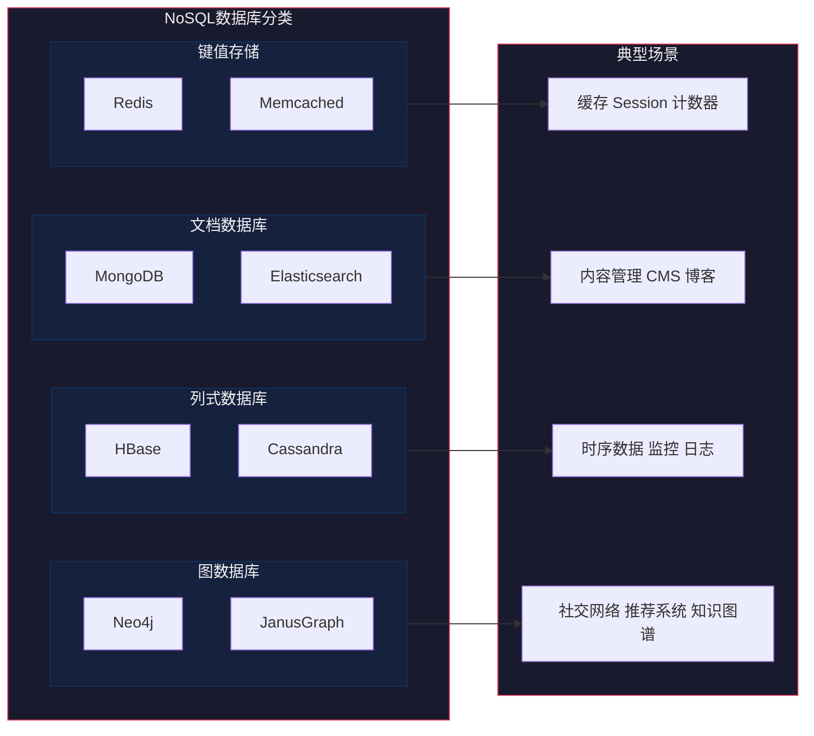

**Redis集群架构：**

```yaml
# Redis Cluster 配置
cluster-enabled yes
cluster-config-file nodes.conf
cluster-node-timeout 15000
cluster-replica-validity-factor 10
cluster-migration-barrier 1

# 插槽分配示例
# 16384个插槽分布在3个主节点
# 节点1: 插槽 0-5460
# 节点2: 插槽 5461-10922
# 节点3: 插槽 10923-16383
```

```java
// Redis Cluster 客户端使用
public class RedisClusterExample {
    
    private RedisClusterClient clusterClient;
    
    public void init() {
        // 集群节点配置
        List<RedisURI> nodes = Arrays.asList(
            RedisURI.create("redis://10.0.0.1:7000"),
            RedisURI.create("redis://10.0.0.2:7000"),
            RedisURI.create("redis://10.0.0.3:7000"),
            RedisURI.create("redis://10.0.0.4:7000"),
            RedisURI.create("redis://10.0.0.5:7000"),
            RedisURI.create("redis://10.0.0.6:7000")
        );
        
        clusterClient = RedisClusterClient.create(nodes);
    }
    
    public void operations() {
        StatefulRedisClusterConnection<String, String> connection = 
            clusterClient.connectCluster();
        
        // 自动路由到正确节点
        connection.sync().set("user:1001", "{\"name\":\"张三\"}");
        String value = connection.sync().get("user:1001");
        
        // 支持跨槽操作（使用Hash Tags）
        connection.sync().mset("user:1001:profile", "北京", 
                              "user:1001:age", "28");
    }
}
```

## 10.4 应用层扩展

应用层扩展是构建高并发系统的核心，需要从架构设计上保证应用的无状态性和可伸缩性。

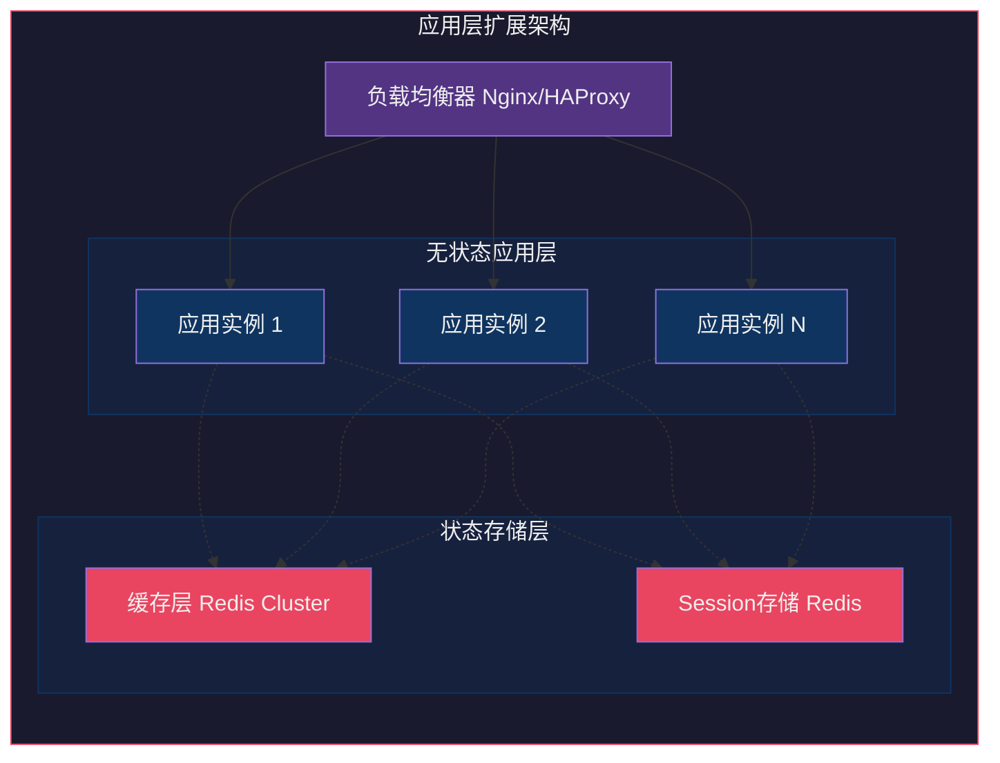

### 10.4.1 无状态设计

无状态设计是应用层扩展的基础。应用实例不存储用户会话状态，所有状态都存储在外部存储中。

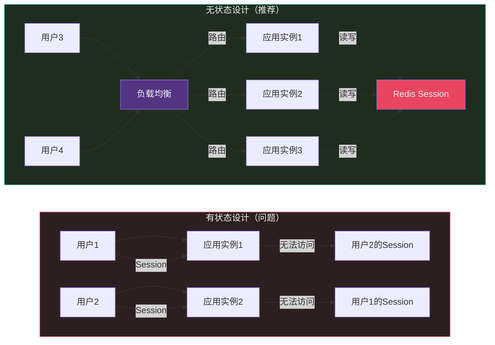

**无状态应用实现：**

```java
// Spring Boot 无状态服务实现

// 1. 不使用 HttpSession 存储用户数据
@RestController
@RequestMapping("/api/users")
public class UserController {
    
    @Autowired
    private UserService userService;
    
    @Autowired
    private TokenService tokenService;
    
    // 用户认证通过后返回Token，客户端自行保管
    @PostMapping("/login")
    public Result<LoginVO> login(@RequestBody LoginDTO dto) {
        User user = userService.authenticate(dto.getUsername(), dto.getPassword());
        
        // 生成Token而非存储Session
        String token = tokenService.generateToken(user.getId());
        
        return Result.success(LoginVO.builder()
            .token(token)
            .userId(user.getId())
            .expiresIn(7200)
            .build());
    }
    
    // 后续请求通过Token获取用户信息
    @GetMapping("/profile")
    public Result<UserVO> getProfile(@RequestHeader("Authorization") String token) {
        Long userId = tokenService.validateToken(token);
        User user = userService.getUserById(userId);
        return Result.success(UserVO.from(user));
    }
}

// 2. Token服务
@Service
public class TokenService {
    
    @Autowired
    private StringRedisTemplate redisTemplate;
    
    private static final String TOKEN_PREFIX = "auth:token:";
    private static final long TOKEN_EXPIRE = 7200L; // 2小时
    
    public String generateToken(Long userId) {
        String token = UUID.randomUUID().toString();
        
        // Token存储在Redis中
        redisTemplate.opsForValue().set(
            TOKEN_PREFIX + token,
            userId.toString(),
            TOKEN_EXPIRE,
            TimeUnit.SECONDS
        );
        
        return token;
    }
    
    public Long validateToken(String token) {
        String userId = redisTemplate.opsForValue().get(TOKEN_PREFIX + token);
        if (userId == null) {
            throw new AuthException("Token已过期");
        }
        
        // 续期
        redisTemplate.expire(TOKEN_PREFIX + token, TOKEN_EXPIRE, TimeUnit.SECONDS);
        
        return Long.parseLong(userId);
    }
}

// 3. 请求上下文（不存储在内存）
@Component
public class RequestContext {
    
    private static final ThreadLocal<Long> USER_ID = new ThreadLocal<>();
    
    public static void setUserId(Long userId) {
        USER_ID.set(userId);
    }
    
    public static Long getUserId() {
        return USER_ID.get();
    }
    
    public static void clear() {
        USER_ID.remove();
    }
}

// 4. 过滤器设置上下文
@Component
public class AuthFilter extends OncePerRequestFilter {
    
    @Autowired
    private TokenService tokenService;
    
    @Override
    protected void doFilterInternal(HttpServletRequest request, 
                                    HttpServletResponse response,
                                    FilterChain chain) throws Exception {
        try {
            String token = request.getHeader("Authorization");
            if (token != null && token.startsWith("Bearer ")) {
                Long userId = tokenService.validateToken(token.substring(7));
                RequestContext.setUserId(userId);
            }
            chain.doFilter(request, response);
        } finally {
            RequestContext.clear();
        }
    }
}
```

### 10.4.2 弹性计算（容器化与Kubernetes）

容器化和编排平台使得应用的弹性扩展变得简单高效。

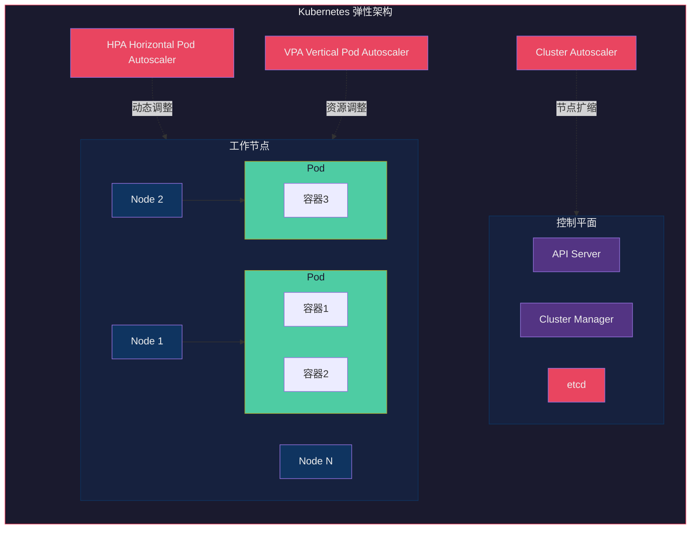

**Kubernetes部署配置：**

```yaml
# deployment.yaml
apiVersion: apps/v1
kind: Deployment
metadata:
  name: user-service
  labels:
    app: user-service
spec:
  replicas: 3
  selector:
    matchLabels:
      app: user-service
  template:
    metadata:
      labels:
        app: user-service
    spec:
      containers:
      - name: user-service
        image: registry.example.com/user-service:v1.0.0
        ports:
        - containerPort: 8080
        resources:
          requests:
            memory: "256Mi"
            cpu: "250m"
          limits:
            memory: "512Mi"
            cpu: "500m"
        env:
        - name: SPRING_PROFILES_ACTIVE
          value: "prod"
        - name: REDIS_HOST
          value: "redis-cluster.default.svc"
        livenessProbe:
          httpGet:
            path: /actuator/health/liveness
            port: 8080
          initialDelaySeconds: 60
          periodSeconds: 10
        readinessProbe:
          httpGet:
            path: /actuator/health/readiness
            port: 8080
          initialDelaySeconds: 30
          periodSeconds: 5
---
# HPA配置 - 基于CPU和内存自动扩缩容
apiVersion: autoscaling/v2
kind: HorizontalPodAutoscaler
metadata:
  name: user-service-hpa
spec:
  scaleTargetRef:
    apiVersion: apps/v1
    kind: Deployment
    name: user-service
  minReplicas: 3
  maxReplicas: 20
  metrics:
  - type: Resource
    resource:
      name: cpu
      target:
        type: Utilization
        averageUtilization: 70
  - type: Resource
    resource:
      name: memory
      target:
        type: Utilization
        averageUtilization: 80
  behavior:
    scaleDown:
      stabilizationWindowSeconds: 300
      policies:
      - type: Percent
        value: 10
        periodSeconds: 60
    scaleUp:
      stabilizationWindowSeconds: 0
      policies:
      - type: Percent
        value: 100
        periodSeconds: 15
```

**弹性扩缩容流程：**

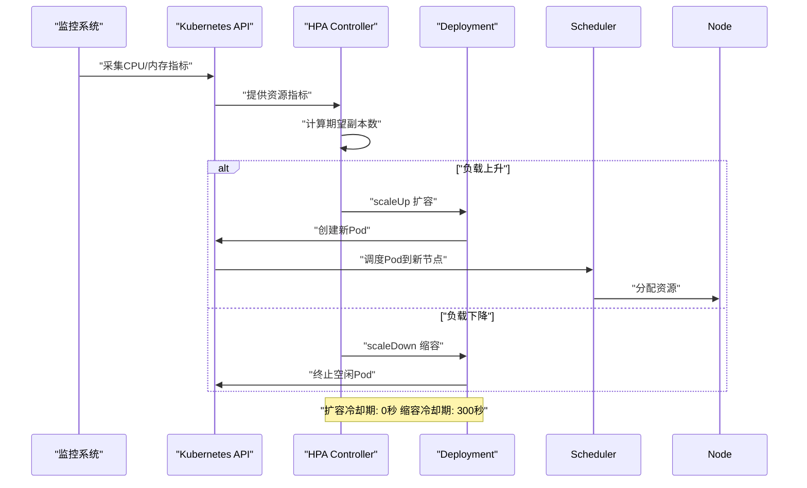

### 10.4.3 服务编排

服务编排管理多个微服务的部署、扩展和网络配置。

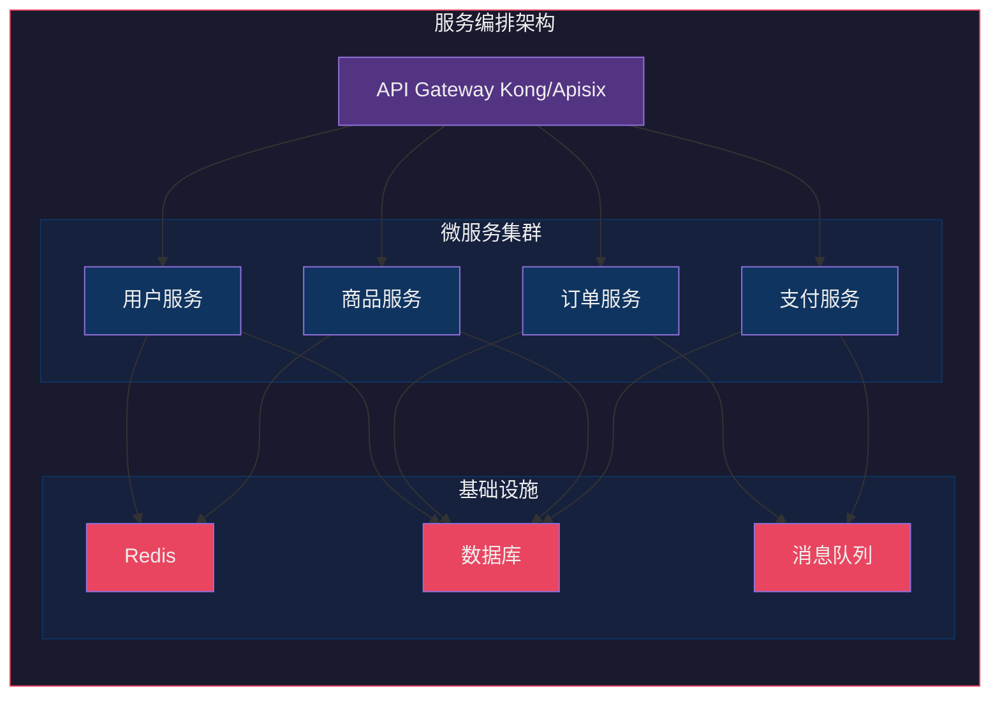

**Spring Cloud服务注册与发现：**

```java
// 服务提供者配置
@SpringBootApplication
@EnableEurekaClient
public class UserServiceApplication {
    public static void main(String[] args) {
        SpringApplication.run(UserServiceApplication.class, args);
    }
}

# application.yml
spring:
  application:
    name: user-service
  cloud:
    consul:
      host: consul-server
      port: 8500

eureka:
  client:
    service-url:
      defaultZone: http://eureka-server:8761/eureka/
  instance:
    prefer-ip-address: true
    lease-renewal-interval-in-seconds: 30
```

```java
// 服务消费者 - 使用Feign进行服务调用
@FeignClient(name = "user-service", fallback = UserServiceFallback.class)
public interface UserServiceClient {
    
    @GetMapping("/users/{id}")
    UserVO getUser(@PathVariable("id") Long id);
    
    @PostMapping("/users")
    UserVO createUser(@RequestBody CreateUserDTO dto);
}

@Component
public class UserServiceFallback implements UserServiceClient {
    
    private static final Logger log = LoggerFactory.getLogger(UserServiceFallback.class);
    
    @Override
    public UserVO getUser(Long id) {
        log.warn("User service fallback for getUser: {}", id);
        return UserVO.builder()
            .id(id)
            .name("Unknown")
            .fallback(true)
            .build();
    }
    
    @Override
    public UserVO createUser(CreateUserDTO dto) {
        throw new ServiceUnavailableException("User service unavailable");
    }
}

// 使用Ribbon进行负载均衡
@Configuration
public class RibbonConfig {
    
    @Bean
    public IRule ribbonRule() {
        // 权重负载均衡
        return new WeightedResponseTimeRule();
    }
}
```

## 10.5 扩展性设计原则

在系统设计初期就遵循扩展性原则，可以避免后期大规模重构。

```mermaid
mindmap
  root((扩展性设计原则))
    模块化设计
      单一职责
      领域边界清晰
      低耦合高内聚
      独立部署
    插件化架构
      插件生命周期管理
      插件隔离
      热插拔支持
    配置化设计
      外部化配置
      动态配置
      Feature Toggle
    松耦合
      事件驱动
      异步通信
      服务解耦

  style root fill:#e94560,color:#eee
  style 模块化设计 fill:#0f3460,color:#eee
  style 插件化架构 fill:#0f3460,color:#eee
  style 配置化设计 fill:#0f3460,color:#eee
  style 松耦合 fill:#0f3460,color:#eee
```

### 10.5.1 模块化设计

模块化是扩展性的基础，将系统划分为独立的、可替换的模块。

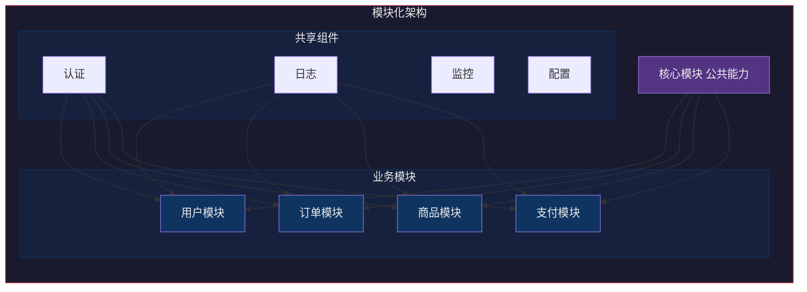

**模块化代码结构：**

```java
// 订单模块 - 清晰的领域边界
package com.example.order;

import com.example.order.domain.Order;
import com.example.order.domain.OrderItem;
import com.example.order.dto.CreateOrderRequest;
import com.example.order.event.OrderCreatedEvent;
import com.example.order.exception.OrderException;

// 领域层 - 核心业务逻辑
public class OrderDomainService {
    
    public Order createOrder(CreateOrderRequest request) {
        // 1. 校验业务规则
        validateOrderRequest(request);
        
        // 2. 计算价格
        Money totalAmount = calculateTotalAmount(request);
        
        // 3. 创建订单聚合根
        Order order = Order.create(request.getUserId(), request.getItems());
        order.calculateTotal(totalAmount);
        
        // 4. 发布领域事件
        order.publishEvent(new OrderCreatedEvent(order));
        
        return order;
    }
}

// 应用层 - 编排领域服务
@Service
@Transactional
public class OrderApplicationService {
    
    @Autowired
    private OrderDomainService orderDomainService;
    
    @Autowired
    private OrderRepository orderRepository;
    
    @Autowired
    private EventPublisher eventPublisher;
    
    public OrderDTO createOrder(CreateOrderRequest request) {
        Order order = orderDomainService.createOrder(request);
        orderRepository.save(order);
        eventPublisher.publish(new OrderCreatedEvent(order));
        return OrderDTO.from(order);
    }
}

// 接口层 - 暴露对外API
@RestController
@RequestMapping("/api/orders")
public class OrderController {
    
    @Autowired
    private OrderApplicationService orderService;
    
    @PostMapping
    public Result<OrderDTO> createOrder(@RequestBody @Valid CreateOrderRequest request) {
        return Result.success(orderService.createOrder(request));
    }
}
```

### 10.5.2 插件化架构

插件化架构允许在运行时动态加载和卸载功能模块。

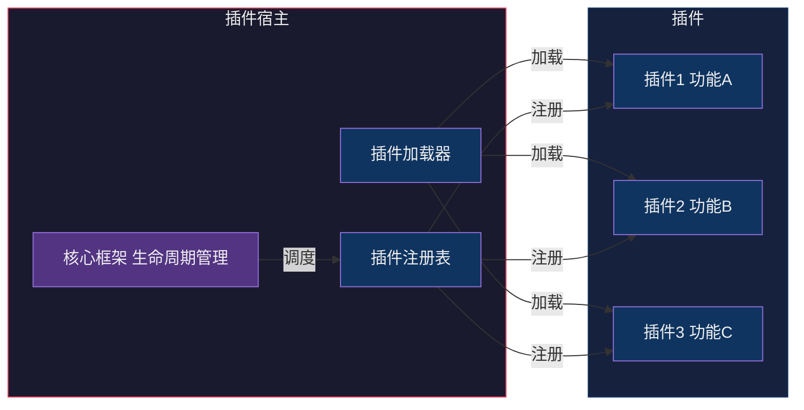

**插件化框架实现：**

```java
// 插件接口定义
public interface Plugin {
    String getId();
    String getName();
    Version getVersion();
    
    void onLoad();
    void onEnable();
    void onDisable();
    void onUnload();
    
    PluginDescriptor getDescriptor();
}

// 插件上下文
public class PluginContext {
    private final Map<String, Plugin> plugins = new ConcurrentHashMap<>();
    private final Map<String, ExtensionPoint> extensions = new ConcurrentHashMap<>();
    private final ClassLoader parentClassLoader;
    
    public PluginContext() {
        this.parentClassLoader = getClass().getClassLoader();
    }
    
    public void loadPlugin(PluginDescriptor descriptor, URL jarUrl) throws Exception {
        // 创建隔离的类加载器
        URLClassLoader classLoader = new URLClassLoader(
            new URL[]{jarUrl}, 
            parentClassLoader
        );
        
        // 加载插件类
        Class<?> pluginClass = classLoader.loadClass(descriptor.getMainClass());
        Plugin plugin = (Plugin) pluginClass.getDeclaredConstructor().newInstance();
        
        // 注册插件
        plugins.put(plugin.getId(), plugin);
        
        // 调用生命周期方法
        plugin.onLoad();
        plugin.onEnable();
    }
    
    public void unloadPlugin(String pluginId) {
        Plugin plugin = plugins.remove(pluginId);
        if (plugin != null) {
            plugin.onDisable();
            plugin.onUnload();
        }
    }
    
    public void registerExtension(ExtensionPoint point) {
        extensions.put(point.getExtensionId(), point);
    }
    
    public <T> T getExtension(String extensionId) {
        return (T) extensions.get(extensionId);
    }
}

// 插件使用示例
public class CustomPlugin implements Plugin {
    
    private PluginContext context;
    private boolean enabled = false;
    
    @Override
    public void onLoad() {
        // 注册扩展点
        context.registerExtension(new MyExtensionPoint());
    }
    
    @Override
    public void onEnable() {
        enabled = true;
    }
    
    @Override
    public void onDisable() {
        enabled = false;
    }
}
```

### 10.5.3 配置化设计

将业务逻辑与配置分离，使系统可以通过配置调整行为，无需修改代码。

```yaml
# feature-toggle.yaml
features:
  new_payment_flow:
    enabled: true
    rollout_percentage: 30
    target_users:
      - premium
      - vip
  
  social_login:
    enabled: true
    providers:
      - google
      - facebook
      - wechat
  
  recommendation_engine:
    enabled: false
    algorithm: collaborative_filtering
    refresh_interval: 3600
```

```java
// Feature Toggle 实现
@Configuration
public class FeatureToggleConfig {
    
    @Value("${features.new_payment_flow.enabled:false}")
    private boolean newPaymentFlowEnabled;
    
    @Value("${features.new_payment_flow.rollout_percentage:0}")
    private int rolloutPercentage;
    
    @Bean
    public FeatureManager featureManager() {
        return new FeatureManager(
            newPaymentFlowEnabled, 
            rolloutPercentage
        );
    }
}

@Service
public class PaymentService {
    
    @Autowired
    private FeatureManager featureManager;
    
    @Autowired
    @Qualifier("newPaymentFlow")
    private PaymentFlow newPaymentFlow;
    
    @Autowired
    @Qualifier("oldPaymentFlow")
    private PaymentFlow oldPaymentFlow;
    
    public PaymentResult processPayment(PaymentRequest request) {
        // 根据Feature Toggle选择支付流程
        if (featureManager.isEnabled("new_payment_flow", request.getUserId())) {
            return newPaymentFlow.process(request);
        } else {
            return oldPaymentFlow.process(request);
        }
    }
}
```

## 10.6 工程实践案例

### 10.6.1 电商大促系统扩展

电商大促（如双11）对系统扩展性是极大的考验，需要应对流量激增10-100倍的压力。

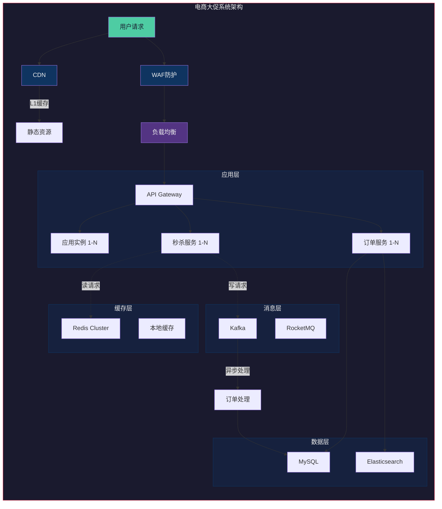

**核心代码实现：**

```java
// 秒杀服务 - 应对高并发
@Service
public class FlashSaleService {
    
    @Autowired
    private StockService stockService;
    
    @Autowired
    private OrderService orderService;
    
    @Autowired
    private RedisTemplate<String, String> redisTemplate;
    
    private static final String STOCK_KEY = "flash:stock:";
    private static final String RATE_LIMIT_KEY = "flash:ratelimit:";
    private static final String USER_PURCHASED_KEY = "flash:purchased:";
    
    /**
     * 秒杀下单 - 三层防护
     * 1. 验证码过滤（前端）
     * 2. 限流（Redis计数器）
     * 3. 库存扣减（Redis Lua脚本保证原子性）
     */
    public FlashSaleResult seckill(FlashSaleRequest request) {
        String userId = request.getUserId();
        String productId = request.getProductId();
        
        // 第一层：限流保护
        if (!checkRateLimit(userId, productId)) {
            return FlashSaleResult.rateLimited();
        }
        
        // 第二层：用户防刷（同用户同商品限制购买次数）
        if (checkUserPurchased(userId, productId)) {
            return FlashSaleResult.alreadyPurchased();
        }
        
        // 第三层：库存扣减（Lua脚本保证原子性）
        boolean stockDeducted = deductStock(productId);
        if (!stockDeducted) {
            return FlashSaleResult.soldOut();
        }
        
        // 库存扣减成功，创建订单（异步）
        try {
            createOrderAsync(request);
            return FlashSaleResult.success();
        } catch (Exception e) {
            // 回滚库存
            rollbackStock(productId);
            throw e;
        }
    }
    
    /**
     * Redis Lua脚本 - 原子性库存扣减
     */
    public boolean deductStock(String productId) {
        String script = """
            local stock = redis.call('GET', KEYS[1])
            if tonumber(stock) <= 0 then
                return 0
            end
            redis.call('DECR', KEYS[1])
            return 1
            """;
        
        Long result = redisTemplate.execute(
            new DefaultRedisScript<>(script, Long.class),
            Collections.singletonList(STOCK_KEY + productId)
        );
        
        return result != null && result == 1;
    }
    
    /**
     * 限流检查 - 滑动窗口算法
     */
    public boolean checkRateLimit(String userId, String productId) {
        String key = RATE_LIMIT_KEY + productId;
        long now = System.currentTimeMillis();
        long windowStart = now - 60000; // 1分钟窗口
        
        // 移除窗口外记录
        redisTemplate.opsForZSet().removeRangeByScore(key, 0, windowStart);
        
        // 统计窗口内请求数
        Long count = redisTemplate.opsForZSet().zCard(key);
        if (count >= 100) { // 每分钟最多100次
            return false;
        }
        
        // 记录本次请求
        redisTemplate.opsForZSet().add(key, userId + ":" + now, now);
        redisTemplate.expire(key, 2, TimeUnit.MINUTES);
        
        return true;
    }
}

// 订单异步创建
@Async("orderExecutor")
public void createOrderAsync(FlashSaleRequest request) {
    try {
        CreateOrderDTO orderDTO = CreateOrderDTO.builder()
            .userId(request.getUserId())
            .productId(request.getProductId())
            .quantity(1)
            .price(request.getPrice())
            .build();
        
        orderService.createOrder(orderDTO);
        
        // 标记用户已购买
        redisTemplate.opsForSet().add(
            USER_PURCHASED_KEY + request.getUserId() + ":" + request.getProductId(),
            request.getFlashSaleId()
        );
        
    } catch (Exception e) {
        log.error("Create order failed: {}", request, e);
        // 触发库存回滚
        rollbackStock(request.getProductId());
    }
}
```

**Kubernetes弹性配置：**

```yaml
# 秒杀服务弹性配置
apiVersion: autoscaling/v2
kind: HorizontalPodAutoscaler
metadata:
  name: flash-sale-hpa
spec:
  scaleTargetRef:
    apiVersion: apps/v1
    kind: Deployment
    name: flash-sale-service
  minReplicas: 10
  maxReplicas: 500
  metrics:
  - type: External
    external:
      metric:
        name: nginx_vts_nginx_http_request_count
        selector:
          matchLabels:
            service: flash-sale
      target:
        type: AverageValue
        averageValue: "1000"
  - type: Resource
    resource:
      name: cpu
      target:
        type: Utilization
        averageUtilization: 60
  behavior:
    scaleUp:
      stabilizationWindowSeconds: 0
      policies:
      - type: Pods
        value: 100
        periodSeconds: 60
    scaleDown:
      stabilizationWindowSeconds: 600
      policies:
      - type: Pods
        value: 10
        periodSeconds: 60
```

### 10.6.2 用户中心扩展设计

用户中心是所有业务的基础服务，需要支撑高并发访问和数据量增长。

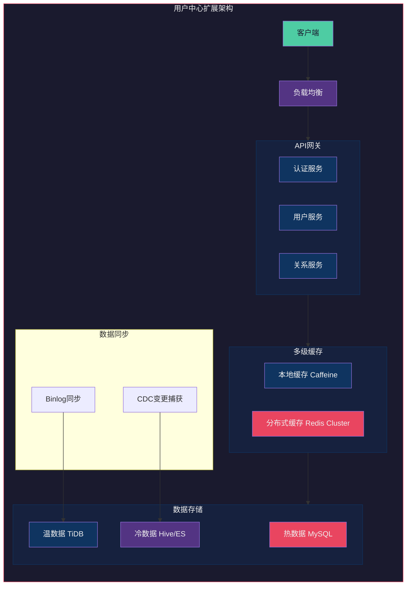

**多级缓存实现：**

```java
// 多级缓存注解
@Target(ElementType.METHOD)
@Retention(RetentionPolicy.RUNTIME)
public @interface Cacheable {
    String key();
    int localExpire() default 60;      // 本地缓存过期时间（秒）
    int remoteExpire() default 3600;    // 分布式缓存过期时间（秒）
    boolean sync() default true;       // 是否同步加载
}

// 多级缓存实现
@Service
public class UserCacheService {
    
    private Cache<String, UserVO> localCache;
    private RedisTemplate<String, UserVO> redisTemplate;
    
    public UserCacheService() {
        // 本地缓存配置 - Caffeine
        localCache = Caffeine.newBuilder()
            .maximumSize(10000)
            .expireAfterWrite(60, TimeUnit.SECONDS)
            .scheduler(Scheduler.systemScheduler())
            .build();
    }
    
    public UserVO getUser(Long userId) {
        String cacheKey = "user:" + userId;
        
        // 1. 查询本地缓存
        UserVO user = localCache.getIfPresent(cacheKey);
        if (user != null) {
            return user;
        }
        
        // 2. 查询分布式缓存
        user = redisTemplate.opsForValue().get(cacheKey);
        if (user != null) {
            // 回填本地缓存
            localCache.put(cacheKey, user);
            return user;
        }
        
        // 3. 查询数据库
        user = loadFromDatabase(userId);
        
        // 4. 回填各级缓存
        localCache.put(cacheKey, user);
        redisTemplate.opsForValue().set(cacheKey, user, 1, TimeUnit.HOURS);
        
        return user;
    }
    
    public void invalidateUser(Long userId) {
        String cacheKey = "user:" + userId;
        
        // 删除本地缓存
        localCache.invalidate(cacheKey);
        
        // 删除分布式缓存
        redisTemplate.delete(cacheKey);
    }
    
    // 缓存更新时双写
    public void updateUser(UserVO user) {
        // 先更新数据库
        updateDatabase(user);
        
        // 再更新缓存
        String cacheKey = "user:" + user.getId();
        localCache.put(cacheKey, user);
        redisTemplate.opsForValue().set(cacheKey, user, 1, TimeUnit.HOURS);
    }
}
```

**用户数据分片策略：**

```java
// 基于用户ID的哈希分片
public class UserShardingService {
    
    private static final int SHARD_COUNT = 16; // 分成16个分片
    
    public String getShardingKey(Long userId) {
        int shardIndex = (int) (userId % SHARD_COUNT);
        return String.format("shard_%02d", shardIndex);
    }
    
    public DataSource getDataSource(Long userId) {
        String shardKey = getShardingKey(userId);
        return dataSourceMap.get(shardKey);
    }
    
    // 查询用户时自动路由到正确分片
    public User getUserById(Long userId) {
        DataSource ds = getDataSource(userId);
        String shardKey = getShardingKey(userId);
        
        try (Connection conn = ds.getConnection()) {
            return conn.query(
                "SELECT * FROM users WHERE id = ?",
                userId
            );
        }
    }
    
    // 跨分片查询（需要扫描所有分片）
    public List<User> searchUsersByPhone(String phone) {
        List<CompletableFuture<List<User>>> futures = new ArrayList<>();
        
        for (int i = 0; i < SHARD_COUNT; i++) {
            String shardKey = String.format("shard_%02d", i);
            DataSource ds = dataSourceMap.get(shardKey);
            
            CompletableFuture<List<User>> future = CompletableFuture.supplyAsync(() -> {
                return queryUsersByPhoneFromShard(ds, phone);
            });
            futures.add(future);
        }
        
        return futures.stream()
            .map(CompletableFuture::join)
            .flatMap(List::stream)
            .collect(Collectors.toList());
    }
}
```

**用户中心API服务：**

```java
// 用户服务API
@RestController
@RequestMapping("/api/users")
public class UserApiController {
    
    @Autowired
    private UserService userService;
    
    @Autowired
    private UserCacheService cacheService;
    
    /**
     * 获取用户信息 - 多级缓存
     */
    @Cacheable(key = "'user:' + #userId", localExpire = 60, remoteExpire = 3600)
    public UserVO getUser(@PathVariable Long userId) {
        return cacheService.getUser(userId);
    }
    
    /**
     * 更新用户信息 - 缓存双写
     */
    @PostMapping("/{userId}")
    public Result<Void> updateUser(@PathVariable Long userId, 
                                   @RequestBody @Valid UpdateUserRequest request) {
        UserVO user = userService.updateUser(userId, request);
        cacheService.updateUser(user);
        return Result.success();
    }
    
    /**
     * 批量获取用户信息 - 缓存优化
     */
    @PostMapping("/batch")
    public Result<Map<Long, UserVO>> batchGetUsers(@RequestBody List<Long> userIds) {
        Map<Long, UserVO> result = new HashMap<>();
        
        // 先批量查缓存
        List<Long> missIds = new ArrayList<>();
        for (Long userId : userIds) {
            UserVO cached = cacheService.getUser(userId);
            if (cached != null) {
                result.put(userId, cached);
            } else {
                missIds.add(userId);
            }
        }
        
        // 缓存未命中，再查数据库
        if (!missIds.isEmpty()) {
            List<User> dbUsers = userService.getUsersByIds(missIds);
            for (User user : dbUsers) {
                UserVO vo = UserVO.from(user);
                result.put(user.getId(), vo);
                cacheService.cacheUser(vo);
            }
        }
        
        return Result.success(result);
    }
}
```

## 10.7 总结

可扩展性架构设计是构建高性能、高可用系统的基础。本章涵盖了以下核心内容：

```mermaid
mindmap
  root((可扩展性架构设计))
    扩展策略
      水平扩展
        无状态设计
        服务无中心化
        线性成本增长
      垂直扩展
        硬件升级
        适合有状态服务
        实现简单
    数据库扩展
      读写分离
        主从同步
        读负载分担
        数据延迟处理
      分库分表
        水平分片
        垂直分片
        分片键选择
      NoSQL
        按场景选型
        发挥各自优势
    应用层扩展
      无状态架构
        Session外置
        Token认证
      容器化编排
        Kubernetes
        自动扩缩容
      服务治理
        注册发现
        负载均衡
    设计原则
      模块化
      插件化
      配置化
    工程实践
      电商大促
      用户中心

  style root fill:#e94560,color:#eee
  style 扩展策略 fill:#0f3460,color:#eee
  style 数据库扩展 fill:#0f3460,color:#eee
  style 应用层扩展 fill:#0f3460,color:#eee
  style 设计原则 fill:#0f3460,color:#eee
  style 工程实践 fill:#0f3460,color:#eee
```

**关键要点：**

1. **选择合适的扩展策略**：无状态服务优先水平扩展，有状态服务考虑垂直扩展与分片结合

2. **数据库扩展是难点**：读写分离、分库分表、NoSQL选型需要根据业务场景精心设计

3. **无状态设计是扩展基础**：将状态外置到Redis等缓存层，应用实例可以无差别地水平扩展

4. **容器化和编排是现代化武器**：Kubernetes提供了声明式的弹性扩缩容能力

5. **设计原则指导实践**：模块化、插件化、配置化使系统更具灵活性和可维护性

6. **工程实践验证架构**：真实的业务场景（大促、用户中心）考验架构的扩展能力

**下一步学习：**
- 第11章：安全性架构设计
- 第12章：高性能架构设计
- 第13章：高可用架构设计
