# 第11章 架构设计流程与文档

## 概述

架构设计不是一蹴而就的灵感迸发，而是一个系统性、可迭代的工程过程。本章将详细介绍完整的架构设计流程、配套的文档体系，以及如何在实际项目中应用这些方法和工具。理解这些内容，将帮助架构师和开发团队建立标准化的架构设计能力。

---

## 11.1 架构设计流程

架构设计流程是一套从业务需求到技术实现之间的桥梁，它确保技术方案与业务目标保持一致，同时兼顾系统的可维护性、可扩展性和可靠性。

### 11.1.1 整体流程概览

架构设计流程包含六个核心阶段，形成一个闭环的迭代周期：

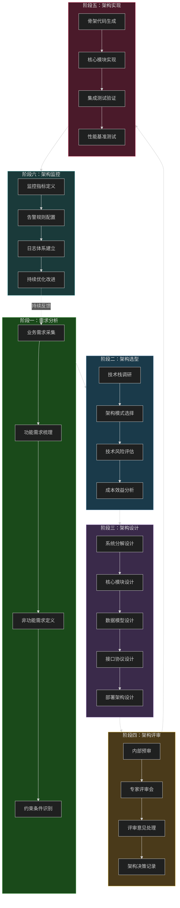

### 11.1.2 阶段一：需求分析

需求分析是整个架构设计流程的起点，其质量直接影响后续所有阶段的效果。很多架构问题本质上都是需求分析不充分导致的。

#### 业务需求采集

业务需求采集的核心是与利益相关者进行有效沟通。这里需要明确几个关键角色：

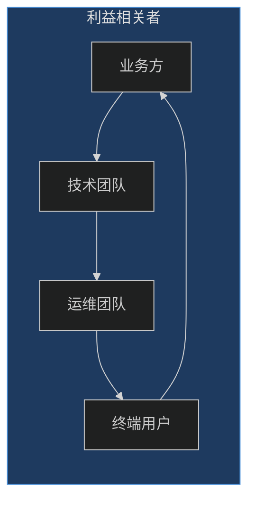

**需求访谈要点：**

```markdown
# 需求访谈模板

## 访谈准备
- [ ] 确认访谈对象角色和职责
- [ ] 准备业务背景资料
- [ ] 列出关键问题清单

## 访谈内容
1. 业务目标
   - 系统的核心价值是什么？
   - 成功标准如何定义？
   - 预期上线时间？

2. 用户画像
   - 目标用户群体有哪些？
   - 用户使用场景是什么？
   - 用户痛点是什么？

3. 业务规则
   - 核心业务流程是什么？
   - 业务边界和约束？
   - 异常场景如何处理？
```

#### 功能需求梳理

功能需求需要用结构化的方式表达，推荐使用用户故事模板：

```markdown
# 用户故事示例

## 故事模板
作为 [角色]，我想要 [功能]，以便 [业务价值]

## 示例
作为 电商平台管理员
我想要 查看实时销售数据看板
以便 及时调整营销策略

## 验收标准
- [ ] 数据延迟不超过 5 秒
- [ ] 支持按小时/日/周维度切换
- [ ] 支持导出 Excel 报表
```

#### 非功能需求定义

非功能需求通常包括性能、可用性、安全性、可扩展性等方面。这些需求必须明确量化，否则无法验证：

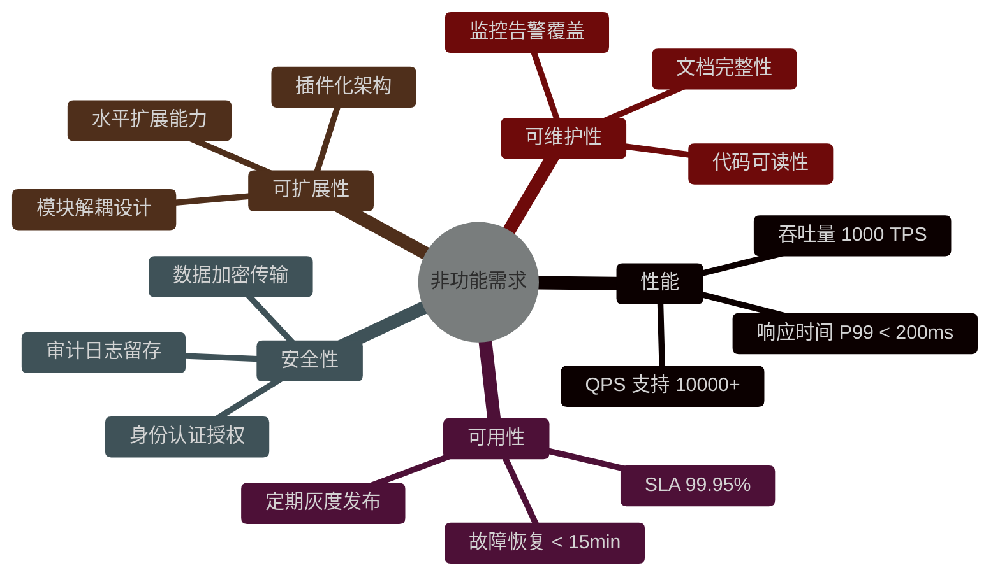

**非功能需求量化示例：**

```yaml
# 非功能需求规格

system_requirements:
  performance:
    response_time:
      p50: < 50ms
      p95: < 100ms
      p99: < 200ms
    throughput:
      concurrent_users: 10000
      requests_per_second: 5000
      peak_buffer: 1.5

  availability:
    sla: 99.95%
    mttr: < 15minutes
    mtbf: > 720hours
    backup_frequency: every 4 hours

  security:
    encryption: TLS 1.3
    data_retention: 7 years
    audit_log: 3 years
    penetration_test: annually

  scalability:
    horizontal_scaling: true
    max_nodes: 100
    auto_scaling_threshold: 70%
```

### 11.1.3 阶段二：架构选型

架构选型是技术决策的关键环节，需要综合考虑业务场景、团队能力、技术生态等多方面因素。

#### 技术栈调研

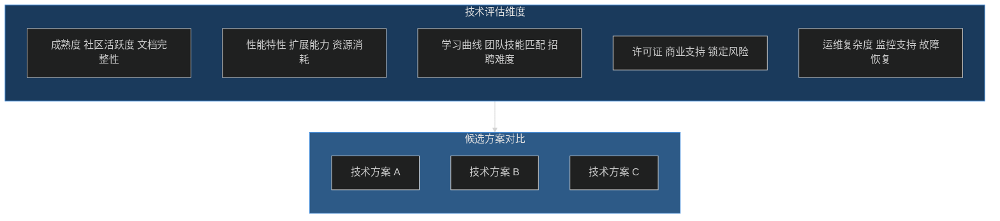

#### 常见架构模式选择

根据业务场景不同，可以选择不同的架构模式：

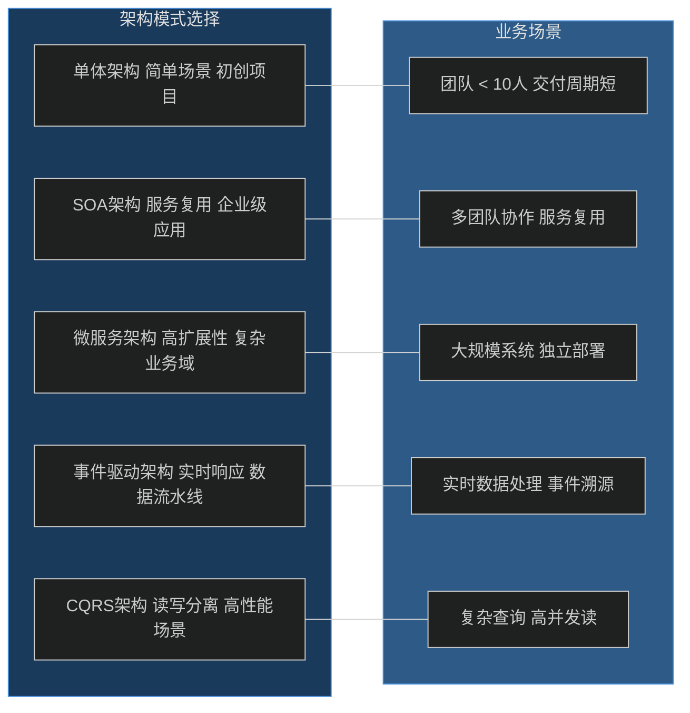

**架构选型决策树：**

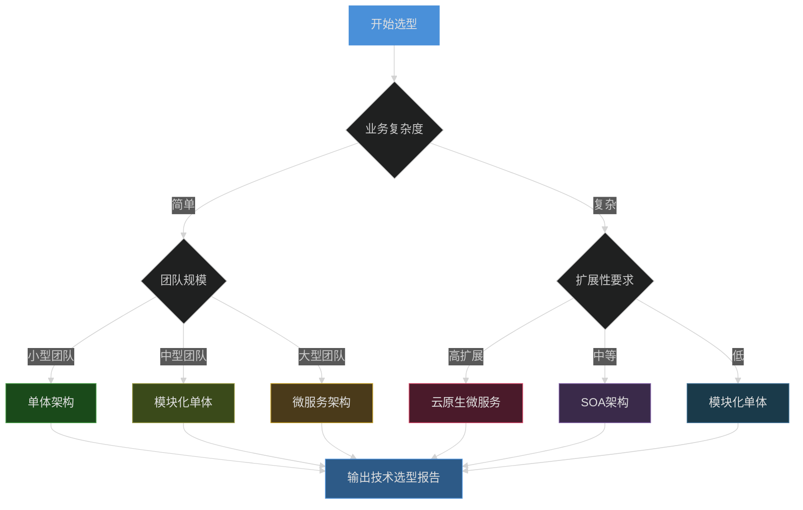

### 11.1.4 阶段三：架构设计

在完成需求分析和架构选型后，就进入了核心的架构设计阶段。这个阶段需要产出完整的技术方案。

#### 系统分解设计

系统分解是将大型系统拆分为可管理的组件或服务的过程。推荐使用领域驱动设计（DDD）的方法论：

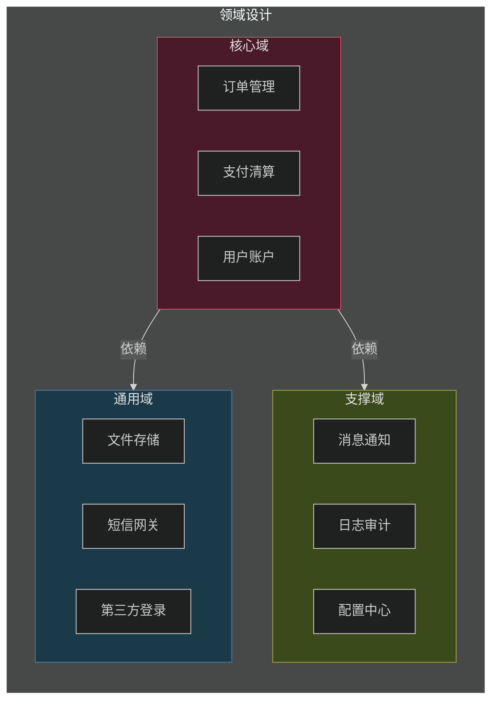

#### 核心模块设计

以电商系统为例，展示核心模块的设计：

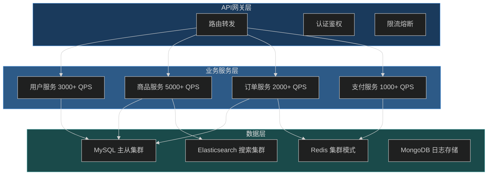

#### 接口协议设计

接口设计是系统间交互的契约，需要明确定义请求响应格式：

```typescript
// TypeScript 接口定义示例

// 统一响应格式
interface ApiResponse<T = any> {
  code: number;        // 业务状态码
  message: string;    // 提示信息
  data: T;           // 响应数据
  traceId: string;   // 链路追踪ID
  timestamp: number; // 服务器时间戳
}

// 分页响应格式
interface PageResponse<T> {
  items: T[];        // 数据列表
  total: number;     // 总记录数
  page: number;      // 当前页码
  pageSize: number;  // 每页条数
  hasMore: boolean;  // 是否有更多
}

// 用户服务接口示例
interface UserService {
  // 创建用户
  createUser(req: CreateUserRequest): Promise<ApiResponse<User>>;
  
  // 查询用户信息
  getUserById(id: string): Promise<ApiResponse<User>>;
  
  // 分页查询用户列表
  listUsers(query: ListUserQuery): Promise<ApiResponse<PageResponse<User>>>;
  
  // 更新用户信息
  updateUser(id: string, req: UpdateUserRequest): Promise<ApiResponse<User>>;
  
  // 删除用户
  deleteUser(id: string): Promise<ApiResponse<void>>;
}

// 请求类型定义
interface CreateUserRequest {
  username: string;      // 用户名，4-20字符
  email: string;         // 邮箱，唯一索引
  password: string;      // 密码，8-32字符，需加密传输
  phone?: string;       // 手机号，可选
  realName?: string;     // 真实姓名，可选
}

interface UpdateUserRequest {
  email?: string;
  phone?: string;
  realName?: string;
  avatar?: string;
}

interface ListUserQuery {
  keyword?: string;      // 搜索关键词
  status?: number;      // 用户状态
  startTime?: number;   // 注册时间范围
  endTime?: number;
  page: number;          // 页码，从1开始
  pageSize: number;      // 每页条数，最大100
}
```

### 11.1.5 阶段四：架构评审

架构评审是保障架构质量的关键环节，通过集体智慧发现潜在问题。

#### 评审流程

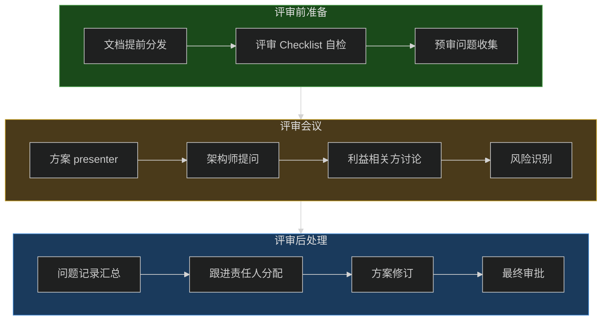

### 11.1.6 阶段五：架构实现

架构实现是将设计转化为可运行代码的过程，需要遵循一定的工程化实践。

#### 骨架代码生成

推荐使用脚手架工具生成项目骨架：

```bash
# 使用 Spring Initializr 命令行创建项目
curl https://start.spring.io/starter.tgz \
  -d type=gradle-project \
  -d language=java \
  -d bootVersion=3.2.0 \
  -d baseDir=order-service \
  -d groupId=com.example \
  -d artifactId=order-service \
  -d name=order-service \
  -d packageName=com.example.order \
  -d javaVersion=17 \
  -d dependencies=web,actuator,cloud-eureka | tar -xzvf -

# 使用 Maven 创建微服务项目
mvn io.airlift:airline:latest:run \
  -Dairline.command=generate \
  -Dairline.command.generate.template=microservice \
  -Dairline.command.generate.output=./generated
```

#### 项目结构示例

```
order-service/
├── src/
│   ├── main/
│   │   ├── java/com/example/order/
│   │   │   ├── OrderServiceApplication.java
│   │   │   ├── config/                    # 配置类
│   │   │   │   ├── FeignConfig.java
│   │   │   │   └── RedisConfig.java
│   │   │   ├── controller/                # 控制器层
│   │   │   │   └── OrderController.java
│   │   │   ├── service/                   # 服务层
│   │   │   │   ├── OrderService.java
│   │   │   │   └── impl/
│   │   │   │       └── OrderServiceImpl.java
│   │   │   ├── repository/                # 数据访问层
│   │   │   │   └── OrderRepository.java
│   │   │   ├── domain/                    # 领域模型
│   │   │   │   ├── entity/
│   │   │   │   │   └── Order.java
│   │   │   │   ├── vo/
│   │   │   │   │   └── OrderVO.java
│   │   │   │   └── enums/
│   │   │   │       └── OrderStatus.java
│   │   │   ├── dto/                       # 数据传输对象
│   │   │   │   ├── CreateOrderRequest.java
│   │   │   │   └── OrderResponse.java
│   │   │   ├── feign/                     # 远程调用客户端
│   │   │   │   └── ProductFeignClient.java
│   │   │   └── common/                    # 公共组件
│   │   │       ├── exception/
│   │   │       │   └── BusinessException.java
│   │   │       └── annotation/
│   │   │           └── RequirePermission.java
│   │   └── resources/
│   │       ├── application.yml
│   │       ├── application-dev.yml
│   │       ├── application-prod.yml
│   │       └── mapper/
│   │           └── OrderMapper.xml
│   └── test/
│       └── java/com/example/order/
│           ├── controller/
│           │   └── OrderControllerTest.java
│           ├── service/
│           │   └── OrderServiceTest.java
│           └── integration/
│               └── OrderIntegrationTest.java
├── config/
│   └── bootstrap.yml
├── script/
│   ├── init.sql
│   └── migrate.sh
├── docker/
│   └── Dockerfile
└── pom.xml
```

### 11.1.7 阶段六：架构监控

监控是保障系统稳定运行的重要手段，也是持续优化的数据基础。

#### 监控体系设计

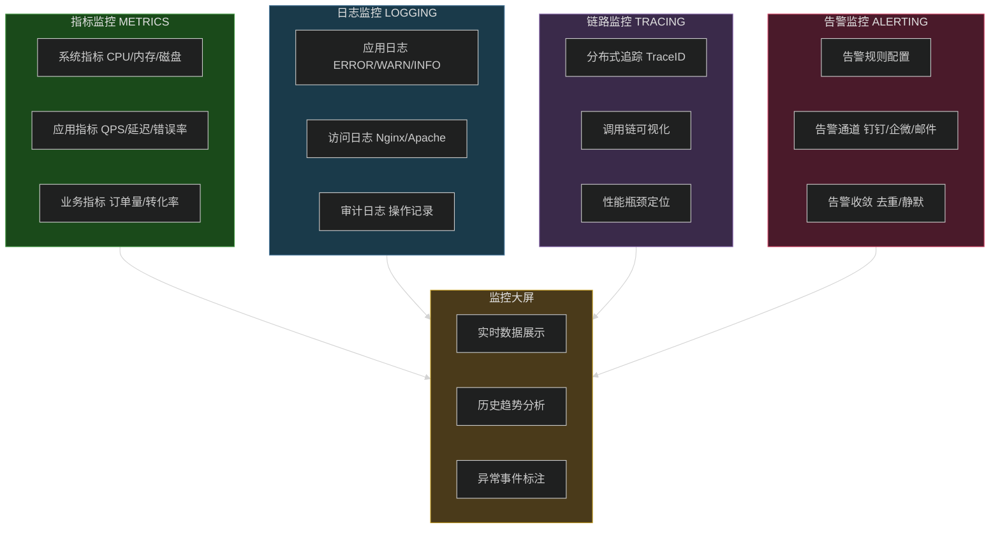

#### 监控指标定义示例

```yaml
# Prometheus 监控指标定义
metrics:
  # 业务指标
  business:
    - name: order_created_total
      type: counter
      description: 创建订单总数
      labels: [channel, payment_method]
    
    - name: order_amount_sum
      type: counter
      description: 订单金额累计
      labels: [currency]
    
    - name: active_users_gauge
      type: gauge
      description: 当前在线用户数
      labels: [user_type]

  # 应用性能指标
  performance:
    - name: http_request_duration_seconds
      type: histogram
      description: HTTP 请求耗时分布
      labels: [method, endpoint, status_code]
      buckets: [0.01, 0.05, 0.1, 0.5, 1, 2, 5]
    
    - name: http_requests_total
      type: counter
      description: HTTP 请求总数
      labels: [method, endpoint, status_code]
    
    - name: database_query_duration_seconds
      type: histogram
      description: 数据库查询耗时
      labels: [operation, table]
      buckets: [0.001, 0.005, 0.01, 0.05, 0.1, 0.5]

  # 基础设施指标
  infrastructure:
    - name: jvm_memory_used_bytes
      type: gauge
      description: JVM 内存使用量
      labels: [area]
    
    - name: jvm_gc_pause_seconds
      type: summary
      description: JVM GC 暂停时间
      labels: [action, cause]
    
    - name: thread_pool_size
      type: gauge
      description: 线程池大小
      labels: [pool_name, thread_type]
```

---

## 11.2 架构文档体系

架构文档是架构设计的载体，也是团队沟通和知识传承的基础。一个完善的文档体系应当覆盖架构的各个层面。

### 11.2.1 文档体系架构

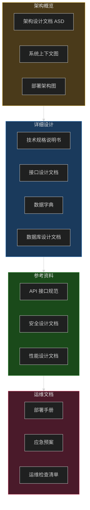

### 11.2.2 架构设计文档（ASD）

架构设计文档是架构文档体系的核心，需要全面描述系统的技术方案。

```markdown
# 架构设计文档模板

## 1. 文档信息

| 字段 | 内容 |
|------|------|
| 文档名称 | XX系统架构设计文档 |
| 版本号 | v1.0.0 |
| 作者 | 架构师姓名 |
| 评审日期 | YYYY-MM-DD |
| 状态 | 草稿/评审中/已批准 |

## 2. 业务背景

### 2.1 项目概述
简要描述项目的核心价值和目标

### 2.2 业务范围
明确系统的边界和职责

## 3. 系统架构

### 3.1 架构视图
使用 Mermaid 图展示系统架构

### 3.2 架构决策记录
记录关键的技术决策及其理由

| 决策ID | 决策内容 | 决策理由 | 替代方案 | 状态 |
|--------|----------|----------|----------|------|
| AD-001 | 采用微服务架构 | 团队规模大，需独立部署 | 单体架构 | 已批准 |

## 4. 技术选型

### 4.1 技术栈清单

| 类别 | 技术 | 版本 | 用途 |
|------|------|------|------|
| 语言 | Java | 17 | 后端开发 |
| 框架 | Spring Boot | 3.2 | 应用框架 |
| 数据库 | MySQL | 8.0 | 主数据存储 |
| 缓存 | Redis | 7.0 | 缓存层 |

## 5. 核心模块设计

### 5.1 模块划分
说明各模块的职责和边界

### 5.2 接口列表
列出关键接口及其协议

## 6. 数据架构

### 6.1 数据模型
展示核心实体关系

### 6.2 存储方案
说明各类数据的存储策略

## 7. 安全设计

### 7.1 认证授权
说明身份认证和权限控制方案

### 7.2 数据安全
说明数据加密和脱敏策略

## 8. 高可用设计

### 8.1 容错策略
说明故障处理机制

### 8.2 灾难恢复
说明备份和恢复方案

## 9. 性能设计

### 9.1 性能指标
量化性能目标

### 9.2 优化策略
说明性能优化手段
```

### 11.2.3 技术规格说明书

技术规格说明书侧重于描述具体的技术实现细节：

```markdown
# 技术规格说明书示例

## 用户服务技术规格

### 1. 技术栈

| 组件 | 规格 | 数量 |
|------|------|------|
| 应用服务器 | 4核8G | 4台 |
| MySQL | 8核16G SSD 500G | 2台主从 |
| Redis | 4核8G | 3台集群 |

### 2. 接口规格

#### 2.1 创建用户接口

**请求规格：**
```yaml
POST /api/v1/users
Content-Type: application/json

{
  "username": "string[4-20]",
  "email": "string[email format]",
  "password": "string[8-32, encrypted]",
  "phone": "string[optional, phone format]"
}
```

**响应规格：**
```yaml
HTTP/1.1 201 Created
{
  "code": 0,
  "message": "success",
  "data": {
    "id": "uuid",
    "username": "string",
    "email": "string",
    "createdAt": "ISO8601 timestamp"
  }
}
```

**错误码定义：**
| 错误码 | 说明 | 处理建议 |
|--------|------|----------|
| 10001 | 用户名已存在 | 提示更换用户名 |
| 10002 | 邮箱格式错误 | 提示正确格式 |
| 10003 | 密码强度不足 | 提示密码要求 |

### 3. 数据库设计

#### 3.1 用户表

```sql
CREATE TABLE `t_user` (
  `id` varchar(36) NOT NULL COMMENT '用户ID',
  `username` varchar(20) NOT NULL COMMENT '用户名',
  `email` varchar(100) NOT NULL COMMENT '邮箱',
  `password_hash` varchar(255) NOT NULL COMMENT '密码哈希',
  `phone` varchar(20) DEFAULT NULL COMMENT '手机号',
  `status` tinyint NOT NULL DEFAULT 1 COMMENT '状态 1-正常 0-禁用',
  `created_at` datetime NOT NULL DEFAULT CURRENT_TIMESTAMP,
  `updated_at` datetime NOT NULL DEFAULT CURRENT_TIMESTAMP ON UPDATE CURRENT_TIMESTAMP,
  PRIMARY KEY (`id`),
  UNIQUE KEY `uk_username` (`username`),
  UNIQUE KEY `uk_email` (`email`)
) ENGINE=InnoDB DEFAULT CHARSET=utf8mb4;
```

### 4. 缓存设计

| 缓存Key | 数据类型 | TTL | 更新策略 |
|---------|----------|-----|----------|
| user:info:{id} | Hash | 30min | Cache Aside |
| user:token:{token} | String | 2h | LRU淘汰 |
```

### 11.2.4 接口设计文档

接口设计文档需要提供完整的接口定义，便于前后端和下游服务对接：

```yaml
# Swagger/OpenAPI 接口文档示例

openapi: 3.0.3
info:
  title: 用户服务 API
  version: 1.0.0
  description: 用户服务接口文档

servers:
  - url: https://api.example.com
    description: 生产环境
  - url: https://api-test.example.com
    description: 测试环境

paths:
  /api/v1/users:
    post:
      summary: 创建用户
      tags:
        - 用户管理
      requestBody:
        required: true
        content:
          application/json:
            schema:
              $ref: '#/components/schemas/CreateUserRequest'
      responses:
        '201':
          description: 创建成功
          content:
            application/json:
              schema:
                $ref: '#/components/schemas/UserResponse'
        '400':
          description: 请求参数错误
          content:
            application/json:
              schema:
                $ref: '#/components/schemas/ErrorResponse'
        '409':
          description: 资源冲突
          content:
            application/json:
              schema:
                $ref: '#/components/schemas/ErrorResponse'

    get:
      summary: 查询用户列表
      tags:
        - 用户管理
      parameters:
        - name: page
          in: query
          schema:
            type: integer
            default: 1
        - name: pageSize
          in: query
          schema:
            type: integer
            default: 20
            maximum: 100
        - name: keyword
          in: query
          schema:
            type: string
      responses:
        '200':
          description: 成功
          content:
            application/json:
              schema:
                $ref: '#/components/schemas/PageResponse'

  /api/v1/users/{userId}:
    get:
      summary: 查询用户详情
      tags:
        - 用户管理
      parameters:
        - name: userId
          in: path
          required: true
          schema:
            type: string
            format: uuid
      responses:
        '200':
          description: 成功
          content:
            application/json:
              schema:
                $ref: '#/components/schemas/UserResponse'
        '404':
          description: 用户不存在

    put:
      summary: 更新用户信息
      tags:
        - 用户管理
      parameters:
        - name: userId
          in: path
          required: true
          schema:
            type: string
      requestBody:
        required: true
        content:
          application/json:
            schema:
              $ref: '#/components/schemas/UpdateUserRequest'
      responses:
        '200':
          description: 成功

    delete:
      summary: 删除用户
      tags:
        - 用户管理
      parameters:
        - name: userId
          in: path
          required: true
          schema:
            type: string
      responses:
        '204':
          description: 删除成功

components:
  schemas:
    CreateUserRequest:
      type: object
      required:
        - username
        - email
        - password
      properties:
        username:
          type: string
          minLength: 4
          maxLength: 20
          example: john_doe
        email:
          type: string
          format: email
          example: john@example.com
        password:
          type: string
          minLength: 8
          maxLength: 32
          description: 加密后的密码
        phone:
          type: string
          pattern: '^1[3-9]\d{9}$'

    UpdateUserRequest:
      type: object
      properties:
        email:
          type: string
          format: email
        phone:
          type: string
        realName:
          type: string

    UserResponse:
      type: object
      properties:
        id:
          type: string
          format: uuid
        username:
          type: string
        email:
          type: string
        phone:
          type: string
        status:
          type: integer
        createdAt:
          type: string
          format: date-time

    PageResponse:
      type: object
      properties:
        items:
          type: array
          items:
            $ref: '#/components/schemas/UserResponse'
        total:
          type: integer
        page:
          type: integer
        pageSize:
          type: integer
        hasMore:
          type: boolean

    ErrorResponse:
      type: object
      properties:
        code:
          type: integer
          example: 10001
        message:
          type: string
          example: 用户名已存在
        traceId:
          type: string
```

### 11.2.5 数据字典

数据字典用于统一数据定义，避免歧义：

```markdown
# 数据字典

## 1. 公共字段

| 字段名 | 类型 | 说明 | 备注 |
|--------|------|------|------|
| id | varchar(36) | 主键 | UUID格式 |
| created_at | datetime | 创建时间 | 默认 CURRENT_TIMESTAMP |
| updated_at | datetime | 更新时间 | 自动更新 |
| created_by | varchar(36) | 创建人 | 操作人ID |
| deleted | tinyint | 逻辑删除 | 0-正常 1-已删除 |

## 2. 用户相关

### 2.1 用户状态码

| 状态值 | 含义 | 触发条件 | 处理建议 |
|--------|------|----------|----------|
| 1 | 正常 | 注册完成 | 正常提供服务 |
| 2 | 禁用 | 违规操作 | 禁止登录，提示申诉 |
| 3 | 冻结 | 安全风险 | 限制部分功能 |
| 4 | 待激活 | 注册未激活 | 引导激活邮件 |

### 2.2 用户类型

| 类型值 | 含义 | 权限范围 |
|--------|------|----------|
| 1 | 普通用户 | 基本功能 |
| 2 | VIP用户 | 高级功能 |
| 3 | 企业用户 | 企业专属功能 |
| 99 | 管理员 | 全功能 |

## 3. 订单相关

### 3.1 订单状态机

```mermaid
%%{init: {"theme": "dark"}}%%
stateDiagram-v2
    [*] --> "待支付": 创建订单
    "待支付" --> "已取消": 超时/用户取消
    "已支付" --> "已取消": 退款
    "待支付" --> "已支付": 支付成功
    "已支付" --> "待发货": 商家确认
    "待发货" --> "已发货": 填写物流
    "已发货" --> "配送中": 物流揽收
    "配送中" --> "已到达": 物流到达
    "已到达" --> "已签收": 用户签收
    "已签收" --> "已完成": 系统确认
    "已完成" --> [*]: 订单结束
    "已取消" --> [*]: 订单结束
```

### 3.2 订单类型枚举

| 类型值 | 枚举名 | 说明 |
|--------|--------|------|
| 1 | NORMAL | 普通订单 |
| 2 | GROUP_BUY | 团购订单 |
| 3 | FLASH_SALE | 秒杀订单 |
| 4 | BARGAIN | 议价订单 |

## 4. 错误码规范

错误码采用 6 位数字，格式为：XXYYZZ
- XX: 模块编号（01-99）
- YY: 错误类别（01-99）
- ZZ: 具体错误（01-99）

### 4.1 模块编号定义

| 模块编号 | 模块名称 |
|----------|----------|
| 10 | 用户模块 |
| 20 | 商品模块 |
| 30 | 订单模块 |
| 40 | 支付模块 |
| 50 | 物流模块 |
| 99 | 系统级错误 |

### 4.2 用户模块错误码

| 错误码 | 错误信息 | 处理建议 |
|--------|----------|----------|
| 100101 | 用户名已存在 | 提示更换用户名 |
| 100102 | 邮箱格式错误 | 提示正确格式 |
| 100103 | 密码强度不足 | 提示密码要求 |
| 100104 | 用户不存在 | 提示检查输入 |
| 100105 | 用户已禁用 | 提示申诉解封 |
```

---

## 11.3 架构评审 Checklist

架构评审是确保架构质量的重要手段，一份完善的评审清单可以系统性地检查架构设计。

### 11.3.1 评审维度概览

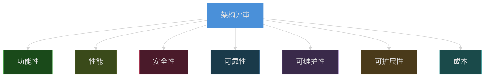

### 11.3.2 详细评审清单

```markdown
# 架构评审 Checklist

## 一、功能性评审

### 1.1 需求覆盖
- [ ] 所有业务需求都有对应的技术方案
- [ ] 核心业务流程已在设计中完整覆盖
- [ ] 边界情况和异常流程有对应处理机制
- [ ] 非功能需求有明确的量化指标

### 1.2 功能完整性
- [ ] 用户功能路径完整，无断点
- [ ] 系统间接口交互定义完整
- [ ] 数据流在各模块间传递无遗漏
- [ ] 权限控制细化到接口级别

### 1.3 可观测性
- [ ] 关键业务操作有日志记录
- [ ] 错误场景有完整的堆栈信息
- [ ] 支持分布式链路追踪
- [ ] 有业务指标监控

## 二、性能评审

### 2.1 性能目标
- [ ] 响应时间目标明确（P50/P95/P99）
- [ ] 吞吐量目标明确（TPS/QPS）
- [ ] 并发用户数目标明确
- [ ] 数据库查询性能有评估

### 2.2 性能优化
- [ ] 有缓存设计（多级缓存策略）
- [ ] 数据库有索引设计
- [ ] 异步处理有合理使用
- [ ] 有分页查询设计
- [ ] 大数据量场景有分表设计

### 2.3 压力测试
- [ ] 有性能测试计划
- [ ] 知道性能瓶颈在哪里
- [ ] 有扩容方案

## 三、安全性评审

### 3.1 身份认证
- [ ] 所有接口有认证机制
- [ ] 认证令牌有有效期
- [ ] 支持多因素认证
- [ ] 敏感操作有二次验证

### 3.2 权限控制
- [ ] 有基于角色的权限控制（RBAC）
- [ ] 权限验证在服务端完成
- [ ] 最小权限原则有执行
- [ ] 超级管理员权限有管控

### 3.3 数据安全
- [ ] 敏感数据加密存储
- [ ] 数据传输使用 HTTPS
- [ ] 敏感信息有脱敏处理
- [ ] 有数据备份机制
- [ ] 审计日志完整

### 3.4 安全防护
- [ ] 有防 XSS 攻击措施
- [ ] 有防 SQL 注入措施
- [ ] 有防 CSRF 攻击措施
- [ ] 有防请求重放措施
- [ ] 有防暴力破解措施

## 四、可靠性评审

### 4.1 高可用设计
- [ ] 无单点故障
- [ ] 服务有降级策略
- [ ] 服务有熔断策略
- [ ] 有健康检查机制
- [ ] 有故障转移方案

### 4.2 容错处理
- [ ] 网络超时有合理配置
- [ ] 重试机制有幂等保证
- [ ] 分布式事务有处理方案
- [ ] 有补偿机制

### 4.3 灾难恢复
- [ ] 有数据备份策略
- [ ] 有恢复演练计划
- [ ] RTO/RPO 指标明确
- [ ] 关键数据有异地备份

## 五、可维护性评审

### 5.1 代码质量
- [ ] 代码结构清晰，模块职责明确
- [ ] 有统一的编码规范
- [ ] 有代码审查机制
- [ ] 单元测试覆盖率 > 80%

### 5.2 文档完整性
- [ ] 架构设计文档完整
- [ ] 接口文档完整
- [ ] 数据库文档完整
- [ ] 部署文档完整
- [ ] 运维文档完整

### 5.3 配置管理
- [ ] 配置与代码分离
- [ ] 有环境区分（dev/staging/prod）
- [ ] 敏感配置加密存储
- [ ] 配置变更有记录和审批

## 六、可扩展性评审

### 6.1 水平扩展
- [ ] 无状态服务设计
- [ ] 负载均衡方案明确
- [ ] 会话管理方案支持分布式
- [ ] 定时任务支持分布式

### 6.2 垂直扩展
- [ ] 模块间无强依赖
- [ ] 接口有版本管理
- [ ] 数据库有扩展空间

### 6.3 业务扩展
- [ ] 新功能有扩展点
- [ ] 新业务线有接入方案
- [ ] 插件机制有考虑

## 七、成本评审

### 7.1 开发成本
- [ ] 技术栈与团队技能匹配
- [ ] 开发周期评估合理
- [ ] 第三方服务成本评估

### 7.2 运维成本
- [ ] 基础设施成本估算
- [ ] 人力运维成本评估
- [ ] 监控告警成本评估

### 7.3 变更成本
- [ ] 技术债务有评估
- [ ] 重构风险有预案
- [ ] 迁移方案有规划
```

---

## 11.4 架构设计原则在实际中的应用

架构设计原则是将前人经验固化的智慧，在实际应用中需要灵活把握。

### 11.4.1 SOLID 原则应用


**代码示例：**

```typescript
// 反例：违反单一职责原则
class UserService {
  createUser(user: User) { /* ... */ }
  sendEmail(email: string) { /* ... */ }      // 不应属于这里
  generateReport(users: User[]) { /* ... */ } // 不应属于这里
  validatePermission(user: User, action: string) { /* ... */ } // 不应属于这里
}

// 正例：遵循单一职责原则
class UserService {
  createUser(user: User) { /* ... */ }
  getUserById(id: string) { /* ... */ }
  updateUser(id: string, user: User) { /* ... */ }
}

class EmailService {
  sendEmail(to: string, subject: string, content: string) { /* ... */ }
  sendWelcomeEmail(user: User) { /* ... */ }
  sendPasswordResetEmail(user: User, token: string) { /* ... */ }
}

class ReportService {
  generateUserReport(users: User[]): Report { /* ... */ }
  generateSalesReport(dateRange: DateRange): Report { /* ... */ }
}

class PermissionService {
  validate(user: User, action: string): boolean { /* ... */ }
  hasRole(user: User, role: Role): boolean { /* ... */ }
}
```

```typescript
// 反例：违反开闭原则 - 使用条件判断扩展功能
class OrderProcessor {
  processOrder(order: Order) {
    if (order.type === 'NORMAL') {
      // 处理普通订单
    } else if (order.type === 'GROUP_BUY') {
      // 处理团购订单
    } else if (order.type === 'FLASH_SALE') {
      // 处理秒杀订单
    }
    // 每新增一种类型都需要修改这里
  }
}

// 正例：遵循开闭原则 - 使用策略模式
interface OrderHandler {
  canHandle(order: Order): boolean;
  process(order: Order): void;
}

class NormalOrderHandler implements OrderHandler {
  canHandle(order: Order): boolean {
    return order.type === 'NORMAL';
  }
  process(order: Order): void { /* ... */ }
}

class GroupBuyOrderHandler implements OrderHandler {
  canHandle(order: Order): boolean {
    return order.type === 'GROUP_BUY';
  }
  process(order: Order): void { /* ... */ }
}

class FlashSaleOrderHandler implements OrderHandler {
  canHandle(order: Order): boolean {
    return order.type === 'FLASH_SALE';
  }
  process(order: Order): void { /* ... */ }
}

class OrderProcessor {
  private handlers: OrderHandler[] = [];
  
  registerHandler(handler: OrderHandler) {
    this.handlers.push(handler);
  }
  
  processOrder(order: Order) {
    const handler = this.handlers.find(h => h.canHandle(order));
    if (!handler) {
      throw new Error(`No handler found for order type: ${order.type}`);
    }
    handler.process(order);
  }
  // 新增类型只需添加新的 Handler，无需修改现有代码
}
```

### 11.4.2 DRY 与 KISS 原则

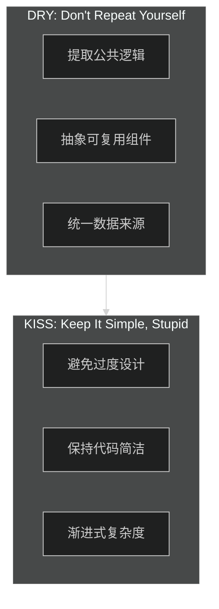

**DRY 原则示例：**

```typescript
// 反例：重复代码
function createUserResponse(user: User) {
  return {
    id: user.id,
    username: user.username,
    email: user.email,
    phone: user.phone,
    createdAt: user.createdAt,
  };
}

function createAdminResponse(admin: Admin) {
  return {
    id: admin.id,
    username: admin.username,
    email: admin.email,
    phone: admin.phone,
    createdAt: admin.createdAt,
    permissions: admin.permissions,
  };
}

// 正例：提取公共逻辑
interface UserBasicInfo {
  id: string;
  username: string;
  email: string;
  phone?: string;
  createdAt: Date;
}

function toUserBasicResponse<T extends UserBasicInfo>(user: T): UserBasicInfo {
  return {
    id: user.id,
    username: user.username,
    email: user.email,
    phone: user.phone,
    createdAt: user.createdAt,
  };
}

function toAdminResponse(admin: Admin): AdminResponse {
  return {
    ...toUserBasicResponse(admin),
    permissions: admin.permissions,
  };
}
```

### 11.4.3 领域驱动设计（DDD）实践

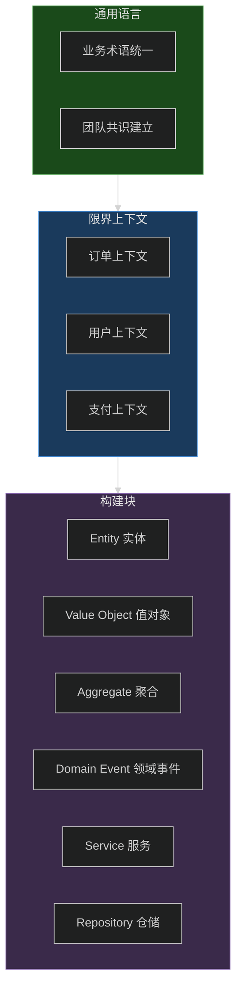

**DDD 实践示例：**

```typescript
// 领域层：实体
class Order extends AggregateRoot {
  private _id: OrderId;
  private _customerId: CustomerId;
  private _items: OrderItem[];
  private _status: OrderStatus;
  private _totalAmount: Money;
  
  // 工厂方法创建订单
  static create(customerId: CustomerId, items: OrderItem[]): Order {
    const order = new Order();
    order._id = OrderId.generate();
    order._customerId = customerId;
    order._items = items;
    order._status = OrderStatus.PENDING;
    order._totalAmount = Money.sum(items.map(i => i.subtotal));
    order.addDomainEvent(new OrderCreatedEvent(order));
    return order;
  }
  
  // 领域方法
  confirm(): void {
    if (this._status !== OrderStatus.PENDING) {
      throw new DomainException('只有待支付订单可以确认');
    }
    this._status = OrderStatus.CONFIRMED;
    this.addDomainEvent(new OrderConfirmedEvent(this));
  }
  
  pay(paymentMethod: PaymentMethod): void {
    if (this._status !== OrderStatus.CONFIRMED) {
      throw new DomainException('只有已确认订单可以支付');
    }
    // 调用支付服务
    const payment = Payment.create(this._id, this._totalAmount, paymentMethod);
    payment.process();
    this._status = OrderStatus.PAID;
    this.addDomainEvent(new OrderPaidEvent(this));
  }
  
  cancel(reason: string): void {
    if (![OrderStatus.PENDING, OrderStatus.CONFIRMED].includes(this._status)) {
      throw new DomainException('当前状态不允许取消');
    }
    this._status = OrderStatus.CANCELLED;
    this.addDomainEvent(new OrderCancelledEvent(this, reason));
  }
}

// 值对象
class Money {
  private constructor(
    private readonly _amount: number,
    private readonly _currency: Currency
  ) {}
  
  static of(amount: number, currency: Currency = Currency.CNY): Money {
    return new Money(amount, currency);
  }
  
  add(other: Money): Money {
    if (this._currency !== other._currency) {
      throw new DomainException('不同货币不能相加');
    }
    return new Money(this._amount + other._amount, this._currency);
  }
  
  multiply(factor: number): Money {
    return new Money(this._amount * factor, this._currency);
  }
}

// 领域服务
class OrderDomainService {
  constructor(
    private readonly orderRepository: OrderRepository,
    private readonly inventoryService: InventoryService,
    private readonly pricingService: PricingService
  ) {}
  
  async createOrder(command: CreateOrderCommand): Promise<Order> {
    // 验证库存
    await this.inventoryService.reserve(command.items);
    
    // 计算价格
    const pricedItems = await this.pricingService.calculatePrices(command.items);
    
    // 创建订单
    const order = Order.create(command.customerId, pricedItems);
    
    await this.orderRepository.save(order);
    
    return order;
  }
}

// 仓储接口
interface OrderRepository {
  findById(id: OrderId): Promise<Order | null>;
  findByCustomerId(customerId: CustomerId): Promise<Order[]>;
  save(order: Order): Promise<void>;
  delete(order: Order): Promise<void>;
}
```

---

## 11.5 架构演进与技术债务管理

系统架构不是一成不变的，需要随着业务发展持续演进。

### 11.5.1 架构演进阶段

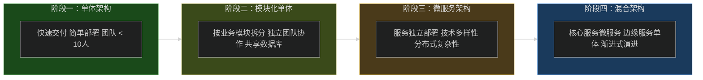

### 11.5.2 技术债务管理框架

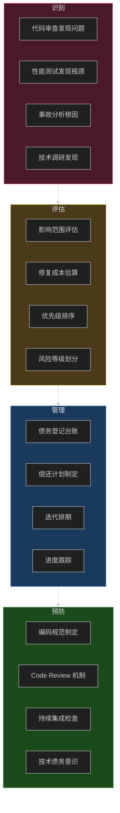

### 11.5.3 技术债务登记表示例

```markdown
# 技术债务登记表示例

| 债务ID | 债务描述 | 发现日期 | 影响范围 | 修复成本 | 优先级 | 状态 | 负责人 |
|--------|----------|----------|----------|----------|--------|------|--------|
| TD-001 | 用户服务使用 MD5 存储密码 | 2024-01-15 | 全部用户 | 3人日 | P1 | 进行中 | @张三 |
| TD-002 | 订单服务缺少索引 | 2024-02-20 | 查询性能 | 1人日 | P2 | 待处理 | @李四 |
| TD-003 | 配置硬编码在代码中 | 2024-03-10 | 部署灵活性 | 5人日 | P3 | 计划中 | @王五 |
| TD-004 | 缺少统一的异常处理 | 2024-03-15 | 可维护性 | 2人日 | P2 | 待处理 | @赵六 |

## 优先级定义

| 优先级 | 定义 | 处理策略 |
|--------|------|----------|
| P1 | 严重安全问题 | 立即修复 |
| P2 | 性能或稳定性影响 | 本迭代处理 |
| P3 | 可维护性问题 | 计划内迭代处理 |
| P4 | 代码优化 | 空闲时处理 |

## 债务分类

| 分类 | 说明 | 示例 |
|------|------|------|
| 安全债务 | 安全漏洞或风险 | 弱加密算法、明文密码 |
| 性能债务 | 性能问题 | 缺少索引、N+1查询 |
| 可维护性债务 | 代码质量问题 | 重复代码、硬编码 |
| 测试债务 | 测试覆盖不足 | 缺少单元测试 |
| 文档债务 | 文档缺失或过时 | 缺少API文档 |
```

### 11.5.4 重构策略

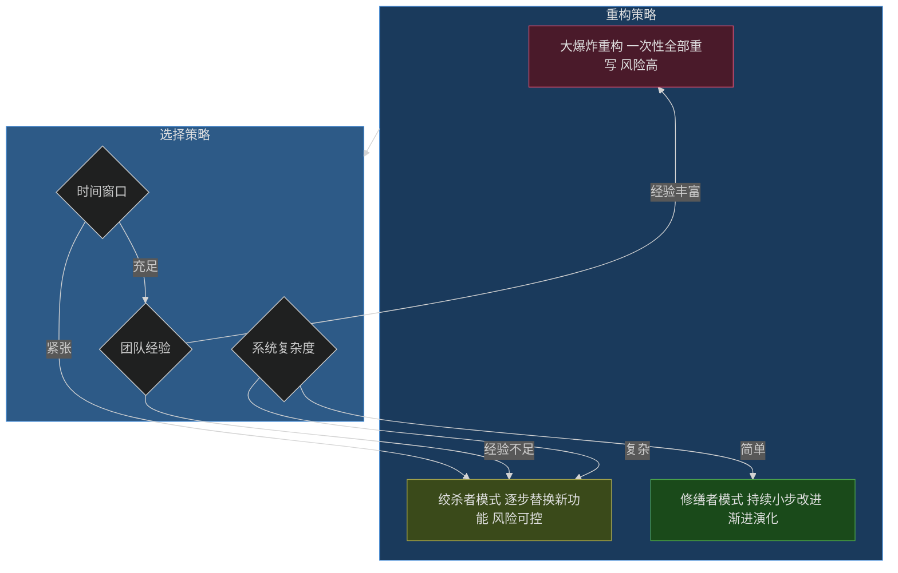

**绞杀者模式实践示例：**

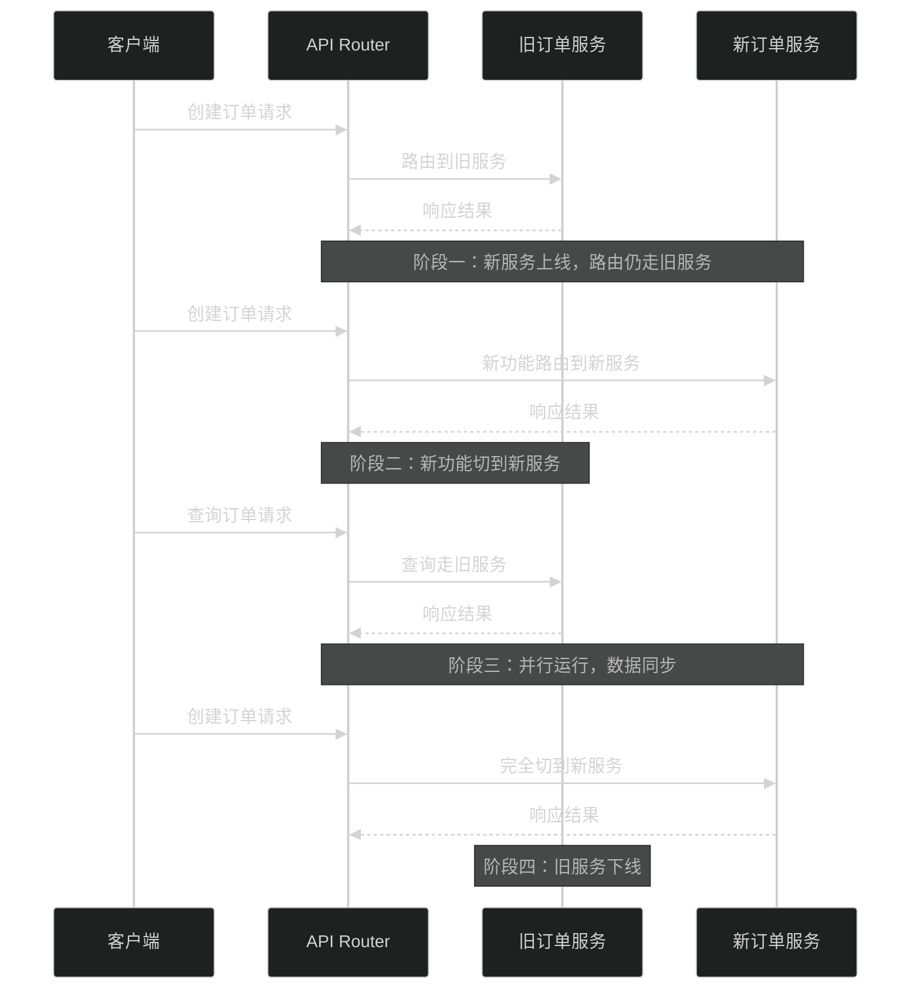

---

## 11.6 工程实践案例

### 案例背景

某电商平台业务快速发展，原有单体架构面临以下挑战：

- 订单量从日均 1 万增长到日均 50 万
- 团队从 5 人扩展到 30 人
- 系统可用性要求从 99% 提升到 99.95%
- 业务需求迭代周期从周级别压缩到天级别

### 实践过程

```mermaid
%%{init: {"theme": "dark"}}%%
flowchart TB
    subgraph Phase1["阶段一：评估与规划"]
        P1["现状调研"] --> P2["痛点分析"]
        P2 --> P3["演进路线制定"]
        P3 --> P4["技术债务盘点"]
    end
    
    subgraph Phase2["阶段二：架构拆分"]
        P4 --> P5["限界上下文划分"]
        P5 --> P6["服务边界定义"]
        P6 --> P7["接口契约制定"]
    end
    
    subgraph Phase3["阶段三：逐步拆分"]
        P7 --> P8["用户服务拆分"]
        P8 --> P9["商品服务拆分"]
        P9 --> P10["订单服务拆分"]
        P10 --> P11["支付服务拆分"]
    end
    
    subgraph Phase4["阶段四：全量切换"]
        P11 --> P12["流量切换"]
        P12 --> P13["旧服务下线"]
        P13 --> P14["持续优化"]
    end
    
    Phase1 --> Phase2 --> Phase3 --> Phase4
    
    style Phase1 fill:#1a4a1a,stroke:#4a9f4a,color:#e0e0e0
    style Phase2 fill:#3a4a1a,stroke:#9f9f4a,color:#e0e0e0
    style Phase3 fill:#4a3a1a,stroke:#c9a227,color:#e0e0e0
    style Phase4 fill:#1a3a5c,stroke:#4a90d9,color:#e0e0e0
```

### 关键决策记录

| 决策ID | 决策内容 | 决策理由 | 影响 |
|--------|----------|----------|------|
| ADR-001 | 采用绞杀者模式进行拆分 | 降低风险，支持灰度验证 | 拆分周期延长但风险可控 |
| ADR-002 | 用户服务优先拆分 | 依赖简单，收益明确 | 用户中心化，数据同步需求 |
| ADR-003 | 使用 gRPC 进行服务间通信 | 高性能，支持多语言 | 增加学习成本 |
| ADR-004 | 引入配置中心统一管理配置 | 解决配置散落问题 | 需迁移历史配置 |
| ADR-005 | 保留 MySQL，分库分表扩展 | 团队 MySQL 经验丰富 | 中间件增加运维复杂度 |

### 实施效果

```yaml
# 改造前后对比

before:
  metrics:
    order_daily_volume: 10,000
    peak_qps: 500
    response_time_p99: 2000ms
    availability: 99.0%
    deployment_frequency: weekly
    recovery_time: 4hours
    
  team:
    size: 5
    deployment_mode: all-hands

after:
  metrics:
    order_daily_volume: 500,000
    peak_qps: 10,000
    response_time_p99: 200ms
    availability: 99.95%
    deployment_frequency: daily
    recovery_time: 15minutes
    
  team:
    size: 30
    deployment_mode: autonomous-teams
```

---

## 11.7 本章小结

本章系统介绍了架构设计流程与文档的完整体系，主要内容包括：

**架构设计流程的六个阶段：**

1. **需求分析** - 采集业务需求，梳理功能需求，定义非功能需求
2. **架构选型** - 调研技术栈，选择架构模式，评估技术风险
3. **架构设计** - 系统分解，模块设计，数据模型，接口协议
4. **架构评审** - 内部预审，专家评审，决策记录
5. **架构实现** - 骨架代码，核心模块，测试验证
6. **架构监控** - 指标监控，日志体系，告警规则

**架构文档体系：**

- 架构设计文档（ASD）作为核心文档
- 技术规格说明书定义实现细节
- 接口设计文档规范服务契约
- 数据字典统一数据定义

**架构评审 Checklist 从八个维度进行检查：**

- 功能性、性能、安全性
- 可靠性、可维护性、可扩展性
- 成本

**架构设计原则在实际中的应用：**

- SOLID 原则指导面向对象设计
- DRY/KISS 原则提升代码质量
- DDD 指导领域建模

**架构演进与技术债务管理：**

- 渐进式架构演进路线
- 技术债务识别、评估、管理框架
- 重构策略选择

掌握这些内容，将帮助架构师建立系统化的架构设计能力，提升架构设计的质量和效率。
