# 第12章：案例实战 - 电商系统架构设计

> 本章将通过一个完整的电商系统案例，系统性地应用前面章节所学的架构设计原则、模式和特性设计方法。通过从需求分析到架构落地的完整流程，读者将掌握如何将理论知识转化为可落地的工程方案。

---

## 12.1 电商系统需求分析

### 12.1.1 核心功能模块

电商系统是一个复杂的业务系统，我们首先需要进行功能模块的划分。根据业务边界和职责划分，电商系统的核心功能可以分解为以下几个领域：

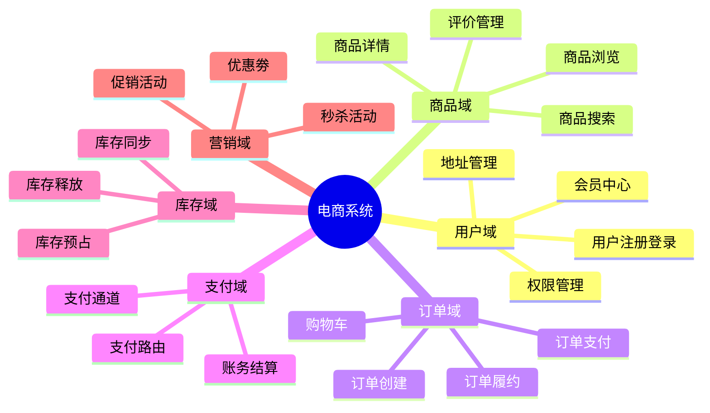

**用户域（User Domain）** 是电商系统的入口，负责用户全生命周期管理。核心功能包括用户注册登录、会员等级体系、收货地址管理、积分管理以及基于RBAC的权限控制。用户数据是所有业务的基础，用户的认证鉴权更是系统安全的第一道防线。

**商品域（Product Domain）** 是电商平台的核心供给侧。核心功能包括商品Catalog管理、商品搜索与推荐（通常基于Elasticsearch实现）、商品详情展示、商品图片管理（通常接入CDN）、以及商品评价与问答系统。商品域需要支持海量SKU的存储和高效检索，同时需要维护商品与库存、优惠活动的关联关系。

**订单域（Order Domain）** 是交易闭环的核心。核心功能包括购物车管理（支持临时的商品暂存）、订单创建（涉及价格计算、库存预占、优惠抵扣）、订单状态流转（待支付、待发货、待收货、已完成、已取消）、以及售后服务（退款退货）。订单域的设计需要保证交易的ACID特性，同时需要处理分布式事务问题。

**支付域（Payment Domain）** 负责资金流转的完整闭环。核心功能包括聚合支付通道（支付宝、微信支付、银联等）、支付路由（根据渠道可用性、费率最优选择通道）、支付结果回调处理、账务核对与差错处理。支付系统的设计需要遵循监管合规要求，资金操作必须保证幂等性和一致性。

**库存域（Inventory Domain）** 管理商品的可销售数量。核心功能包括库存预占（在订单创建时锁定库存）、库存释放（订单取消或超时未支付时释放）、库存同步（与仓库系统、供应商系统的数据同步）、以及库存预警。库存系统的并发控制是电商系统最核心的技术挑战之一。

**营销域（Marketing Domain）** 负责用户增长和转化提升。核心功能包括优惠券管理（满减券、折扣券、兑换券）、促销活动（满减活动、折扣活动）、秒杀系统（瞬间大量并发请求）、以及用户行为分析。营销系统的设计需要在灵活性和性能之间取得平衡。

### 12.1.2 用户规模与性能目标

在开始架构设计之前，我们必须明确系统的性能目标。性能目标不是拍脑袋得出的数字，而是根据业务规模、用户行为特征、行业标准综合计算得出。

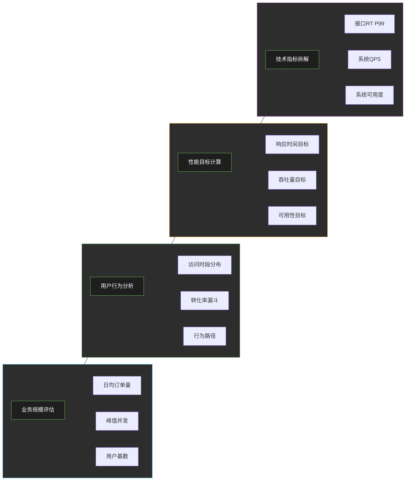

**业务规模评估**：假设我们设计的电商平台目标是在一年内达到日均订单量10万单，注册用户500万，SKU数量500万，商品详情页日均PV 5000万。这是一个典型中型电商平台的规模，对标垂直领域头部电商平台（如曾经的凡客诚品、当当网非核心品类）。

**性能目标计算**：

| 指标 | 目标值 | 说明 |
|------|--------|------|
| 接口响应时间 | P99 < 200ms | 99%的请求需要在200ms内完成 |
| 系统吞吐量 | 支持5000 QPS | 基于峰值QPS 3000，按1.5倍余量设计 |
| 系统可用性 | 99.95% | 相当于年故障时长<4.38小时 |
| 数据一致性 | 强一致 | 库存扣减、支付等核心操作必须一致 |
| 秒杀可用性 | 峰值处理能力10万QPS | 秒杀场景的特殊要求 |

**技术指标拆解**：根据阿姆达尔定律，系统各环节需要协同优化才能达成整体目标。前端页面首屏加载时间<1.5秒，CDN缓存命中率达到95%以上，Nginx层处理能力达到10万QPS，应用层响应时间P99<100ms，数据库单库QPS控制在5000以内（通过读写分离和分库分表）。

### 12.1.3 高可用要求

电商系统作为直接面向消费者的平台，对可用性的要求极为严苛。一次系统故障不仅意味着直接的经济损失，更会导致用户信任度的下降。根据业务影响程度不同，我们对各模块的可用性要求进行了分级：

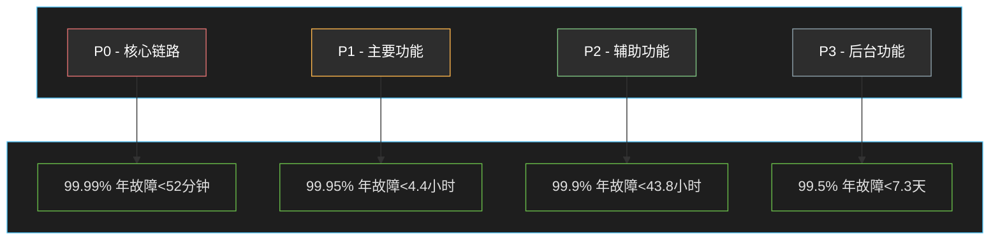

**P0核心链路（99.99%）**：包括用户登录（否则用户无法访问）、商品详情页（用户无法下单）、订单创建（核心交易无法完成）、支付（资金无法流转）。这些功能的中断将直接导致订单损失和用户流失，必须保证99.99%的可用性。

**P1主要功能（99.95%）**：包括商品搜索、购物车管理、用户地址管理等。这些功能虽然影响用户体验，但用户可以通过其他方式绕过，不会直接导致订单损失。

**P2辅助功能（99.9%）**：包括商品评价、收藏夹、个性化推荐等。这些功能属于锦上添花，可以适当降低可用性要求以换取开发效率和成本优化。

**P3后台功能（99.5%）**：包括运营管理后台、数据报表、客服系统等。这些功能主要面向内部用户，短时间不可用不会直接影响用户体验。

---

## 12.2 整体架构设计

### 12.2.1 系统架构图

电商系统的整体架构采用经典的分层架构+微服务化部署的混合模式。在接入层采用CDN+Nginx的经典组合，在应用层采用Spring Cloud微服务架构，在数据层采用MySQL分库分表+Redis缓存+Elasticsearch搜索的多元化存储方案。

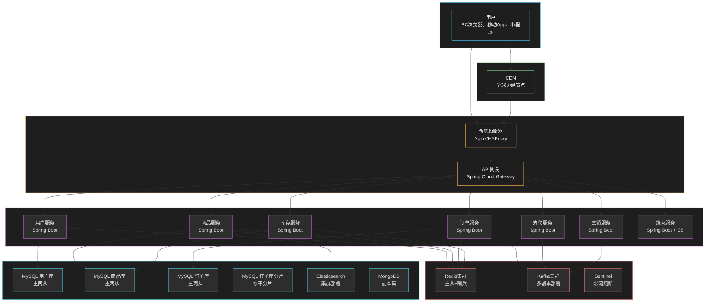

### 12.2.2 技术选型

技术选型是架构设计的核心环节，需要综合考虑业务需求、团队能力、技术成熟度、生态完善度、运维成本等多个维度。以下是我们为电商系统选择的技术栈及其选型理由：

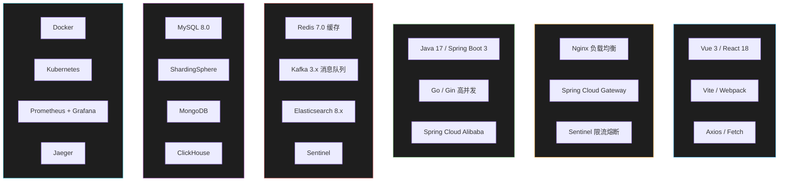

**后端主语言选择Java**：选择Java作为主要业务服务的开发语言，主要考虑以下因素：Spring Cloud生态成熟完善，能够快速构建微服务架构；团队对Java技术栈最为熟悉，可以快速迭代开发；Java的强类型系统和完善的IDE支持有助于代码质量和维护效率；社区活跃，组件丰富，遇到问题容易找到解决方案。

**高并发场景选择Go**：秒杀服务选择Go语言，主要考虑：Go的Goroutine模型天然适合高并发场景，能够用少量资源处理大量连接；Go的内存占用低，适合无状态服务的快速扩缩容；Go程序编译成单个二进制文件，部署简单，启动快速。实际项目中，也可以根据团队情况统一使用Java，通过WebFlux等方案提升并发处理能力。

**关系型数据库选择MySQL 8.0**：MySQL依然是互联网行业最成熟的关系型数据库选择。8.0版本引入了窗口函数、CTE等高级特性，提升了SQL表达能力。配合ShardingSphere的分库分表方案，可以水平扩展到数十TB的数据规模。

**缓存选择Redis**：Redis以其丰富的数据结构和完善的持久化方案，成为缓存领域的标准选择。Redis 7.0的流数据类型更好地支持了消息队列场景。主从+哨兵的部署方案在保证可用性的同时，提供了约5万QPS的读取能力。

**消息队列选择Kafka**：Kafka凭借其高吞吐、持久化、多副本的特性，成为日志收集和事件流处理的首选。配合Spring Cloud Stream，可以实现优雅的事件驱动架构。订单创建、支付完成等核心事件通过Kafka广播到相关服务。

**搜索选择Elasticsearch**：ES的倒排索引和丰富的查询DSL使其成为商品搜索的首选方案。结合ik分词器，可以实现中文语义搜索。通过ES的聚合功能，还可以实现商品facet搜索（分类筛选、品牌筛选、价格区间等）。

### 12.2.3 分层设计

分层架构是软件工程中最经典也最有效的架构模式。通过清晰的职责划分，每一层只关注自己的职责，通过定义良好的接口与上下层通信。以下是电商系统的分层设计：

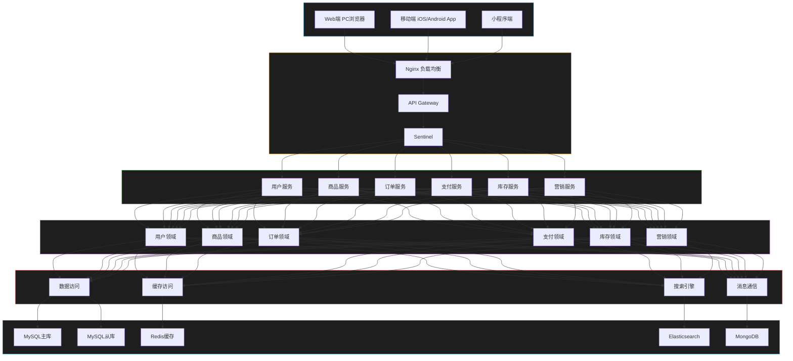

**分层原则**：

**用户层**：负责用户界面的渲染和交互处理，可以是Web页面、移动App或小程序。这一层不包含业务逻辑，仅负责数据展示和用户输入收集。

**网关层**：作为系统的统一入口，负责路由转发、认证鉴权、限流熔断、协议转换等工作。网关层是系统安全的第一道屏障，也是跨横切关注点（Cross-Cutting Concerns）的集中处理点。

**业务服务层**：按照业务领域划分的服务，每个服务负责一个完整的业务领域。这一层实现了业务服务的编排，通过调用多个领域能力完成复杂的业务场景。

**领域能力层**：包含核心业务逻辑的领域模型，是系统最核心的价值所在。这一层遵循领域驱动设计（DDD）的思想，包含实体、值对象、领域服务、领域事件等概念。

**基础设施层**：提供技术基础设施的能力抽象，如数据库访问、缓存访问、消息通信等。这一层通过适配器模式屏蔽了底层技术细节，使得上层领域模型可以专注于业务逻辑。

**数据层**：数据的最终存储位置，包括关系型数据库、键值存储、搜索引擎、文档数据库等。数据层的设计需要考虑数据的特点选择合适的存储引擎。

---

## 12.3 核心模块设计

### 12.3.1 用户模块

用户模块是电商系统的入口，负责用户全生命周期管理。核心功能包括用户注册、登录认证、会员等级、地址管理等。以下是用户模块的详细设计：

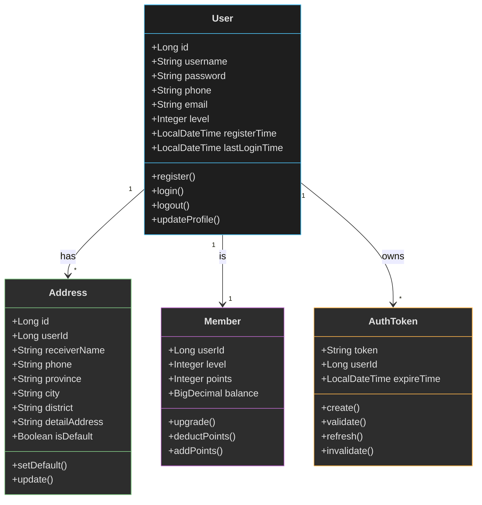

**核心接口设计**：

| 接口 | 方法 | 说明 |
|------|------|------|
| /api/user/register | POST | 用户注册 |
| /api/user/login | POST | 用户登录 |
| /api/user/logout | POST | 用户登出 |
| /api/user/info | GET | 获取用户信息 |
| /api/user/update | PUT | 更新用户信息 |
| /api/address/list | GET | 获取地址列表 |
| /api/address/add | POST | 添加地址 |
| /api/address/update | PUT | 更新地址 |
| /api/address/delete | DELETE | 删除地址 |
| /api/address/set-default | PUT | 设置默认地址 |

**安全设计**：密码采用BCrypt加密存储，登录成功后生成JWT Token作为认证凭证，Token有效期设置为2小时，支持Refresh Token续期。用户敏感操作（如修改密码、修改手机号）需要二次验证。

```java
// Java Spring Boot 实现
@RestController
@RequestMapping("/api/user")
public class UserController {

    @Autowired
    private UserService userService;

    @Autowired
    private TokenService tokenService;

    /**
     * 用户注册
     */
    @PostMapping("/register")
    public Result~UserRegisterResponse~ register(@RequestBody @Valid UserRegisterRequest request) {
        // 1. 验证验证码
        verifyCodeService.verify(request.getPhone(), request.getVerifyCode());

        // 2. 创建用户
        User user = new User();
        user.setUsername(request.getUsername());
        user.setPassword(bcryptPasswordEncoder.encode(request.getPassword()));
        user.setPhone(request.getPhone());
        user.setRegisterTime(LocalDateTime.now());

        userService.save(user);

        // 3. 创建会员记录
        memberService.createMember(user.getId());

        // 4. 返回Token
        String token = tokenService.createToken(user.getId());

        return Result.success(new UserRegisterResponse(user.getId(), token));
    }

    /**
     * 用户登录
     */
    @PostMapping("/login")
    public Result~UserLoginResponse~ login(@RequestBody @Valid UserLoginRequest request) {
        // 1. 根据用户名查询用户
        User user = userService.findByUsername(request.getUsername());
        if (user == null) {
            throw new BusinessException("用户名或密码错误");
        }

        // 2. 验证密码
        if (!bcryptPasswordEncoder.matches(request.getPassword(), user.getPassword())) {
            throw new BusinessException("用户名或密码错误");
        }

        // 3. 更新最后登录时间
        user.setLastLoginTime(LocalDateTime.now());
        userService.update(user);

        // 4. 创建Token
        String token = tokenService.createToken(user.getId());

        // 5. 返回用户信息和Token
        UserLoginResponse response = new UserLoginResponse();
        response.setUserId(user.getId());
        response.setUsername(user.getUsername());
        response.setToken(token);

        return Result.success(response);
    }
}

// 认证服务 - Token管理
@Service
public class TokenService {

    @Autowired
    private RedisTemplate~String, String~ redisTemplate;

    private static final String TOKEN_PREFIX = "auth:token:";
    private static final long TOKEN_EXPIRE_SECONDS = 7200; // 2小时

    /**
     * 创建Token
     */
    public String createToken(Long userId) {
        String token = UUID.randomUUID().toString().replace("-", "");
        String key = TOKEN_PREFIX + token;

        redisTemplate.opsForValue().set(key, userId.toString(),
            TOKEN_EXPIRE_SECONDS, TimeUnit.SECONDS);

        return token;
    }

    /**
     * 验证Token
     */
    public Long validateToken(String token) {
        String key = TOKEN_PREFIX + token;
        String userId = redisTemplate.opsForValue().get(key);

        if (userId == null) {
            return null;
        }

        // 续期
        redisTemplate.expire(key, TOKEN_EXPIRE_SECONDS, TimeUnit.SECONDS);

        return Long.parseLong(userId);
    }

    /**
     * 销毁Token
     */
    public void invalidateToken(String token) {
        String key = TOKEN_PREFIX + token;
        redisTemplate.delete(key);
    }
}
```

### 12.3.2 商品模块

商品模块负责商品信息的存储和检索，是用户浏览商品、搜索商品的基础。商品数据具有数据量大（百万级SKU）、读多写少（浏览量远大于修改量）、结构复杂（有多级分类、品牌、属性、sku变体）等特点。

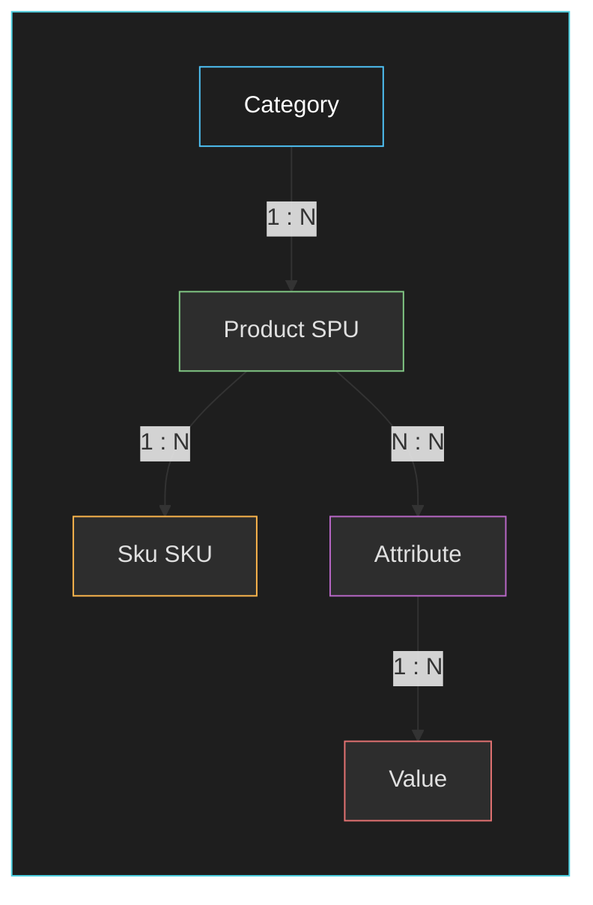

**商品数据模型**：

| 模型 | 说明 | 特点 |
|------|------|------|
| Category | 分类表 | 支持三级分类（类目树），路径存储便于查询 |
| Product(SPU) | 商品表 | 通用属性，如品牌、产地、保质期等 |
| Sku | SKU表 | 库存量、价格、规格参数等销售属性 |
| Attribute | 属性表 | 筛选属性、排序属性、关键属性 |
| SkuAttribute | SKU属性关联表 | SKU与属性值的对应关系 |

**缓存策略**：商品详情页是典型的热点数据场景，采用多级缓存策略：用户请求首先访问CDN（缓存静态资源），未命中则到Nginx（缓存HTML片段），再未命中到Redis分布式缓存，最后回源到数据库。商品基础信息缓存5分钟，商品价格（高频变化）缓存1分钟。

```java
// Java Spring Boot 实现 - 商品服务

@Service
public class ProductService {

    @Autowired
    private ProductRepository productRepository;

    @Autowired
    private SkuRepository skuRepository;

    @Autowired
    private RedisTemplate~String, Object~ redisTemplate;

    @Autowired
    private ElasticsearchTemplate elasticsearchTemplate;

    private static final String PRODUCT_CACHE_PREFIX = "product:";
    private static final String SKU_CACHE_PREFIX = "sku:";
    private static final long PRODUCT_CACHE_TTL = 300; // 5分钟

    /**
     * 获取商品详情 - 多级缓存
     */
    public ProductDetailDTO getProductDetail(Long productId) {
        String cacheKey = PRODUCT_CACHE_PREFIX + productId;

        // 1. 查询Redis缓存
        ProductDetailDTO cached = (ProductDetailDTO) redisTemplate.opsForValue().get(cacheKey);
        if (cached != null) {
            return cached;
        }

        // 2. 查询数据库
        Product product = productRepository.findById(productId)
            .orElseThrow(() -> new BusinessException("商品不存在"));

        List~Sku~ skus = skuRepository.findByProductId(productId);

        ProductDetailDTO detail = convertToDetailDTO(product, skus);

        // 3. 写入缓存
        redisTemplate.opsForValue().set(cacheKey, detail,
            PRODUCT_CACHE_TTL, TimeUnit.SECONDS);

        return detail;
    }

    /**
     * 商品搜索 - Elasticsearch
     */
    public SearchResultDTO searchProducts(SearchQuery query) {
        // 构建ES查询
        BoolQueryBuilder boolQuery = QueryBuilders.boolQuery();

        // 关键词搜索
        if (StringUtils.isNotBlank(query.getKeyword())) {
            boolQuery.must(QueryBuilders.matchQuery("name", query.getKeyword()));
        }

        // 分类筛选
        if (query.getCategoryId() != null) {
            boolQuery.filter(QueryBuilders.termQuery("categoryId", query.getCategoryId()));
        }

        // 价格区间
        if (query.getMinPrice() != null || query.getMaxPrice() != null) {
            RangeQueryBuilder priceRange = QueryBuilders.rangeQuery("minPrice");
            if (query.getMinPrice() != null) {
                priceRange.gte(query.getMinPrice());
            }
            if (query.getMaxPrice() != null) {
                priceRange.lte(query.getMaxPrice());
            }
            boolQuery.filter(priceRange);
        }

        // 分页
        PageRequest pageRequest = PageRequest.of(
            query.getPage() - 1, // ES从0开始
            query.getPageSize(),
            Sort.by(Sort.Direction.DESC, "salesVolume") // 默认按销量排序
        );

        // 执行搜索
        SearchHits~ProductEsDO~ searchHits =
            elasticsearchTemplate.search(
                new NativeSearchQuery(boolQuery, pageRequest),
                ProductEsDO.class
            );

        // 转换结果
        List~ProductSearchDTO~ products = searchHits.getSearchHits().stream()
            .map(hit -> convertToSearchDTO(hit.getContent()))
            .collect(Collectors.toList());

        SearchResultDTO result = new SearchResultDTO();
        result.setProducts(products);
        result.setTotal(searchHits.getTotalHits());
        result.setPage(query.getPage());
        result.setPageSize(query.getPageSize());

        return result;
    }
}

// 商品搜索 - Elasticsearch 文档映射
@Document(indexName = "products")
public class ProductEsDO {

    @Id
    private Long id;

    @Field(type = FieldType.Text, analyzer = "ik_max_word")
    private String name;

    @Field(type = FieldType.Keyword)
    private String brandName;

    @Field(type = FieldType.Keyword)
    private Long categoryId;

    @Field(type = FieldType.Text)
    private String description;

    @Field(type = FieldType.Double)
    private BigDecimal minPrice;

    @Field(type = FieldType.Integer)
    private Integer salesVolume;

    @Field(type = FieldType.Keyword)
    private String mainImage;

    @Field(type = FieldType.Date, format = DateFormat.date_hour_minute_second)
    private LocalDateTime createTime;
}
```

### 12.3.3 订单模块

订单模块是电商系统最核心的模块之一，负责交易闭环的完整流程。订单模块的设计需要解决几个核心问题：交易幂等性（防止重复下单）、分布式事务（订单、库存、优惠券的原子性）、高并发性能（秒杀场景）。

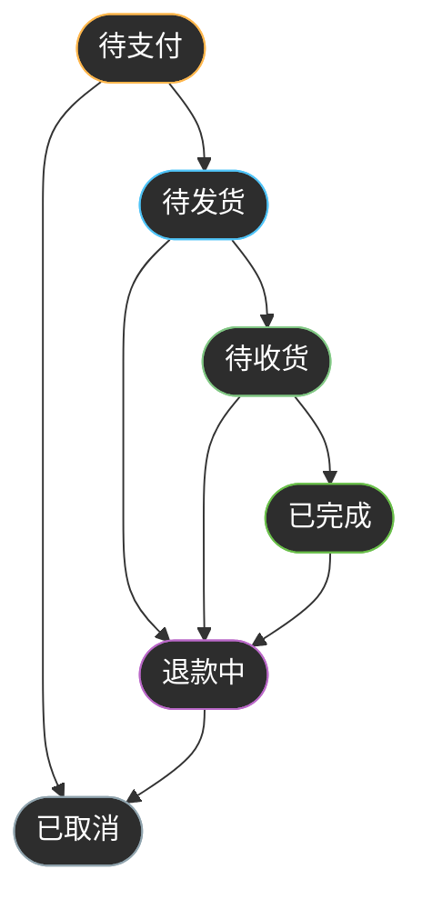

**订单状态流转**：

| 状态 | 说明 | 可执行操作 |
|------|------|-----------|
| PENDING | 待支付 | 支付、取消 |
| PAID | 已支付 | 发货、取消（需退款） |
| SHIPPED | 已发货 | 确认收货、退款 |
| COMPLETED | 已完成 | 申请售后 |
| REFUNDING | 退款中 | 退款处理 |
| CANCELLED | 已取消 | - |

**分布式事务解决方案**：订单创建涉及库存扣减、优惠券使用、余额扣减等多个操作，需要保证原子性。我们采用Seata的AT模式 + 补偿机制的混合方案：对于强一致性要求的库存扣减，使用Seata的AT模式；对于准实时要求的优惠券使用，使用本地消息表+定时任务补偿。

```java
// Java Spring Boot 实现 - 订单服务

@Service
public class OrderService {

    @Autowired
    private OrderRepository orderRepository;

    @Autowired
    private InventoryService inventoryService;

    @Autowired
    private CouponService couponService;

    @Autowired
    private PaymentService paymentService;

    @Autowired
    private RedissonClient redissonClient;

    @Autowired
    private KafkaTemplate~String, Object~ kafkaTemplate;

    /**
     * 创建订单 - 简化版
     */
    @Transactional(rollbackFor = Exception.class)
    public OrderCreateResponse createOrder(OrderCreateRequest request) {
        // 1. 获取分布式锁（防重复提交）
        String lockKey = "order:create:" + request.getUserId();
        RLock lock = redissonClient.getLock(lockKey);
        boolean locked = lock.tryLock(5, 30, TimeUnit.SECONDS);

        if (!locked) {
            throw new BusinessException("请求过于频繁，请稍后重试");
        }

        try {
            // 2. 幂等性检查 - 查询最近30秒内是否有相同请求
            String idempotentKey = generateIdempotentKey(request);
            if (checkIdempotent(idempotentKey)) {
                throw new BusinessException("订单正在处理中，请勿重复提交");
            }
            setIdempotent(idempotentKey, 30); // 30秒内不允许重复提交

            // 3. 验证商品信息
            SkuDTO sku = skuService.getSkuById(request.getSkuId());
            if (sku == null || sku.getStatus() != ProductStatus.ON_SALE) {
                throw new BusinessException("商品已下架");
            }

            // 4. 验证价格（防止篡改）
            BigDecimal skuPrice = sku.getPrice();
            if (skuPrice.compareTo(request.getPrice()) != 0) {
                throw new BusinessException("价格已变动，请重新下单");
            }

            // 5. 预占库存（分布式事务 - Seata）
            boolean stockReserved = inventoryService.reserveStock(
                request.getSkuId(),
                request.getQuantity()
            );
            if (!stockReserved) {
                throw new BusinessException("库存不足");
            }

            // 6. 计算优惠
            BigDecimal totalAmount = skuPrice.multiply(BigDecimal.valueOf(request.getQuantity()));
            BigDecimal discountAmount = calculateDiscount(request.getUserId(), totalAmount);
            BigDecimal payAmount = totalAmount.subtract(discountAmount);

            // 7. 创建订单
            Order order = new Order();
            order.setOrderNo(generateOrderNo()); // 订单号：时间戳+随机数
            order.setUserId(request.getUserId());
            order.setSkuId(request.getSkuId());
            order.setQuantity(request.getQuantity());
            order.setSkuPrice(skuPrice);
            order.setTotalAmount(totalAmount);
            order.setDiscountAmount(discountAmount);
            order.setPayAmount(payAmount);
            order.setStatus(OrderStatus.PENDING);
            order.setCreateTime(LocalDateTime.now());
            order.setPayExpireTime(LocalDateTime.now().plusMinutes(30)); // 30分钟支付超时

            orderRepository.save(order);

            // 8. 发送订单创建事件（用于同步到ES、触发后续流程等）
            OrderCreatedEvent event = new OrderCreatedEvent(order);
            kafkaTemplate.send("order-topic", event);

            // 9. 返回订单信息
            OrderCreateResponse response = new OrderCreateResponse();
            response.setOrderId(order.getId());
            response.setOrderNo(order.getOrderNo());
            response.setPayAmount(payAmount);
            response.setPayExpireTime(order.getPayExpireTime());

            return response;

        } finally {
            lock.unlock();
        }
    }

    /**
     * 支付回调处理
     */
    @Transactional(rollbackFor = Exception.class)
    public void handlePaymentCallback(PaymentCallbackRequest request) {
        // 1. 验证签名
        if (!paymentService.verifyCallbackSignature(request)) {
            throw new BusinessException("签名验证失败");
        }

        // 2. 幂等性检查
        String idempotentKey = "payment:callback:" + request.getTradeNo();
        if (checkIdempotent(idempotentKey)) {
            return; // 已处理，直接返回
        }

        // 3. 查询订单
        Order order = orderRepository.findByOrderNo(request.getOrderNo())
            .orElseThrow(() -> new BusinessException("订单不存在"));

        // 4. 状态校验
        if (order.getStatus() != OrderStatus.PENDING) {
            throw new BusinessException("订单状态不正确");
        }

        // 5. 更新订单状态
        order.setStatus(OrderStatus.PAID);
        order.setPayTime(LocalDateTime.now());
        order.setPayChannel(request.getChannel());
        order.setTradeNo(request.getTradeNo());
        orderRepository.update(order);

        // 6. 确认库存（真正扣减）
        inventoryService.confirmStock(order.getSkuId(), order.getQuantity());

        // 7. 使用优惠券（如果使用了）
        if (order.getCouponId() != null) {
            couponService.useCoupon(order.getUserId(), order.getCouponId());
        }

        // 8. 发送支付完成事件
        OrderPaidEvent event = new OrderPaidEvent(order);
        kafkaTemplate.send("order-paid-topic", event);
    }

    /**
     * 生成订单号
     */
    private String generateOrderNo() {
        // 格式：时间戳(14位) + 业务标识(2位) + 随机数(6位)
        return LocalDateTime.now().format(DateTimeFormatter.ofPattern("yyyyMMddHHmmss"))
            + "01"
            + String.format("%06d", new Random().nextInt(999999));
    }
}

// 订单实体
@Entity
@Table(name = "orders")
public class Order {

    @Id
    @GeneratedValue(strategy = GenerationType.IDENTITY)
    private Long id;

    @Column(unique = true, nullable = false, length = 32)
    private String orderNo; // 订单号

    @Column(nullable = false)
    private Long userId;

    @Column(nullable = false)
    private Long skuId;

    @Column(nullable = false)
    private Integer quantity;

    @Column(nullable = false, precision = 10, scale = 2)
    private BigDecimal skuPrice;

    @Column(nullable = false, precision = 10, scale = 2)
    private BigDecimal totalAmount;

    @Column(precision = 10, scale = 2)
    private BigDecimal discountAmount;

    @Column(nullable = false, precision = 10, scale = 2)
    private BigDecimal payAmount;

    @Enumerated(EnumType.STRING)
    @Column(nullable = false)
    private OrderStatus status;

    @Column
    private Long couponId;

    @Column
    private String payChannel;

    @Column(length = 64)
    private String tradeNo;

    @Column
    private LocalDateTime createTime;

    @Column
    private LocalDateTime payTime;

    @Column
    private LocalDateTime payExpireTime;

    @Column
    private LocalDateTime shipTime;

    @Column
    private LocalDateTime completeTime;

    // Getters and Setters...
}
```

### 12.3.4 支付模块

支付模块负责对接第三方支付通道，完成资金流转的闭环。支付模块的设计需要考虑高可用性（支付通道故障时的降级处理）、资金安全（防止重复支付、金额篡改）、对账准确（与第三方通道的账务核对）。

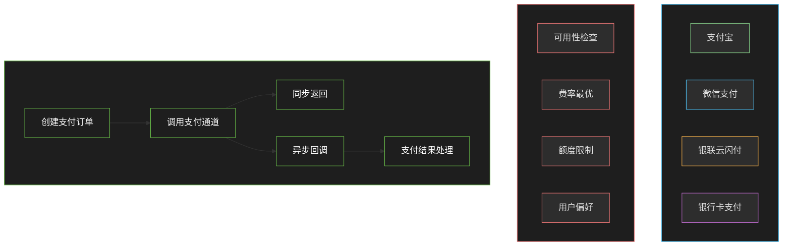

**支付路由策略**：支付路由是支付系统的核心能力，需要在可用性、费率、额度等多个约束条件下选择最优通道。

| 路由因素 | 说明 | 优先级 |
|----------|------|--------|
| 可用性 | 通道是否正常运行 | P0 |
| 额度限制 | 单笔限额、每日限额 | P0 |
| 费率 | 通道手续费率 | P1 |
| 用户偏好 | 用户上次使用的通道 | P2 |
| 优惠活动 | 支付满减活动 | P2 |

```java
// Java Spring Boot 实现 - 支付服务

@Service
public class PaymentService {

    @Autowired
    private PaymentChannelRepository channelRepository;

    @Autowired
    private PaymentTransactionRepository transactionRepository;

    @Autowired
    private AlipayService alipayService;

    @Autowired
    private WechatPayService wechatPayService;

    /**
     * 发起支付
     */
    public PaymentResponse initiatePayment(PaymentRequest request) {
        // 1. 路由选择支付通道
        PaymentChannel channel = selectPaymentChannel(request);

        // 2. 创建支付交易记录
        PaymentTransaction transaction = new PaymentTransaction();
        transaction.setTradeNo(generateTradeNo());
        transaction.setOrderNo(request.getOrderNo());
        transaction.setAmount(request.getAmount());
        transaction.setChannel(channel.getChannelCode());
        transaction.setStatus(PaymentStatus.PENDING);
        transaction.setCreateTime(LocalDateTime.now());
        transactionRepository.save(transaction);

        // 3. 调用支付通道
        PaymentChannelResponse channelResponse;
        try {
            if (PaymentChannelCode.ALIPAY.getCode().equals(channel.getChannelCode())) {
                channelResponse = alipayService.pay(request, transaction);
            } else if (PaymentChannelCode.WECHAT.getCode().equals(channel.getChannelCode())) {
                channelResponse = wechatPayService.pay(request, transaction);
            } else {
                throw new BusinessException("不支持的支付通道");
            }
        } catch (Exception e) {
            // 通道调用失败，记录错误并降级
            transaction.setStatus(PaymentStatus.FAILED);
            transaction.setErrorMessage(e.getMessage());
            transactionRepository.update(transaction);

            // 尝试备用通道
            return retryWithAlternativeChannel(request);
        }

        // 4. 更新交易状态
        transaction.setChannelTradeNo(channelResponse.getChannelTradeNo());
        transactionRepository.update(transaction);

        // 5. 返回支付信息
        PaymentResponse response = new PaymentResponse();
        response.setTradeNo(transaction.getTradeNo());
        response.setPayUrl(channelResponse.getPayUrl());
        response.setQrCode(channelResponse.getQrCode());
        response.setExpiresIn(channelResponse.getExpiresIn());

        return response;
    }

    /**
     * 支付路由选择
     */
    private PaymentChannel selectPaymentChannel(PaymentRequest request) {
        List~PaymentChannel~ channels = channelRepository.findAvailableChannels();

        // 过滤不可用通道
        channels = channels.stream()
            .filter(c -> c.isAvailable())
            .filter(c -> c.getSingleLimit().compareTo(request.getAmount()) >= 0)
            .filter(c -> c.getDailyLimit().subtract(c.getDailyUsed()).compareTo(request.getAmount()) >= 0)
            .collect(Collectors.toList());

        if (channels.isEmpty()) {
            throw new BusinessException("暂无可用支付通道");
        }

        // 按费率排序，选择最低费率
        channels.sort(Comparator.comparing(PaymentChannel::getFeeRate));

        return channels.get(0);
    }

    /**
     * 验证回调签名
     */
    public boolean verifyCallbackSignature(PaymentCallbackRequest request) {
        PaymentChannel channel = channelRepository.findByChannelCode(request.getChannel());

        if (PaymentChannelCode.ALIPAY.getCode().equals(request.getChannel())) {
            return alipayService.verifySignature(request, channel.getAppSecret());
        } else if (PaymentChannelCode.WECHAT.getCode().equals(request.getChannel())) {
            return wechatPayService.verifySignature(request, channel.getAppSecret());
        }

        return false;
    }
}

// 微信支付服务
@Service
public class WechatPayService {

    @Autowired
    private WechatPayConfig wechatPayConfig;

    /**
     * 微信支付 - 统一下单
     */
    public PaymentChannelResponse pay(PaymentRequest request, PaymentTransaction transaction) {
        // 构建微信支付请求
        Map~String, String~ params = new TreeMap<>();
        params.put("appid", wechatPayConfig.getAppId());
        params.put("mch_id", wechatPayConfig.getMchId());
        params.put("nonce_str", UUID.randomUUID().toString().replace("-", ""));
        params.put("body", request.getSubject());
        params.put("out_trade_no", transaction.getTradeNo());
        params.put("total_fee", request.getAmount().multiply(BigDecimal.valueOf(100)).intValue() + "");
        params.put("spbill_create_ip", request.getClientIp());
        params.put("notify_url", wechatPayConfig.getNotifyUrl());
        params.put("trade_type", "NATIVE");

        // 生成签名
        String sign = generateSign(params, wechatPayConfig.getApiKey());
        params.put("sign", sign);

        // 调用微信支付统一下单接口
        String responseXml = HttpClientUtil.post(
            wechatPayConfig.getPayUrl(),
            mapToXml(params)
        );

        // 解析响应
        Map~String, String~ response = xmlToMap(responseXml);

        if (!"SUCCESS".equals(response.get("return_code"))) {
            throw new PaymentException("微信支付下单失败：" + response.get("return_msg"));
        }

        if (!"SUCCESS".equals(response.get("result_code"))) {
            throw new PaymentException("微信支付下单失败：" + response.get("err_code_des"));
        }

        // 返回支付链接
        PaymentChannelResponse channelResponse = new PaymentChannelResponse();
        channelResponse.setChannelTradeNo(response.get("prepay_id"));
        channelResponse.setPayUrl(response.get("code_url"));
        channelResponse.setExpiresIn(7200); // 2小时

        return channelResponse;
    }

    /**
     * 验证微信支付签名
     */
    public boolean verifySignature(PaymentCallbackRequest request, String apiKey) {
        Map~String, String~ params = new TreeMap<>();
        params.put("return_code", request.getReturnCode());
        params.put("return_msg", request.getReturnMsg());
        params.put("result_code", request.getResultCode());
        params.put("mch_id", request.getMchId());
        params.put("transaction_id", request.getTransactionId());
        params.put("out_trade_no", request.getOutTradeNo());
        params.put("total_fee", request.getTotalFee());
        params.put("cash_fee", request.getCashFee());
        params.put("time_end", request.getTimeEnd());

        String sign = generateSign(params, apiKey);
        return sign.equals(request.getSign());
    }

    /**
     * 生成签名
     */
    private String generateSign(Map~String, String~ params, String apiKey) {
        StringBuilder sb = new StringBuilder();
        for (Map.Entry~String, String~ entry : params.entrySet()) {
            if (StringUtils.isNotBlank(entry.getValue())) {
                sb.append(entry.getKey()).append("=").append(entry.getValue()).append("&");
            }
        }
        sb.append("key=").append(apiKey);

        return MD5Util.encode(sb.toString()).toUpperCase();
    }
}
```

### 12.3.5 库存模块

库存模块负责商品库存的管理，是电商系统中最核心的技术挑战之一。库存扣减必须保证原子性、一致性，同时需要支持高并发的秒杀场景。

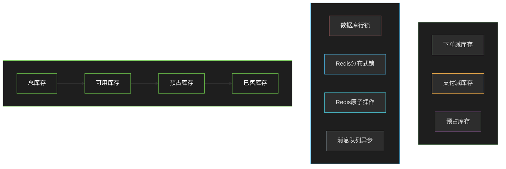

**库存扣减策略对比**：

| 策略 | 优点 | 缺点 | 适用场景 |
|------|------|------|----------|
| 下单减库存 | 库存准确、避免超卖 | 可能出现恶意下单 | 普通商品 |
| 支付减库存 | 减少库存占用 | 可能超卖 | 高价值商品 |
| 预占库存 | 平衡库存占用和超卖 | 实现复杂 | 秒杀的库存锁定 |

**超卖问题解决方案**：超卖是指多个用户同时购买最后一个库存，都扣减成功但实际库存不足的问题。解决方案包括：数据库行锁（悲观锁 SELECT FOR UPDATE）、数据库乐观锁（版本号或CAS）、Redis原子操作（DECRBY）、分布式锁（Redisson）。

```java
// Java Spring Boot 实现 - 库存服务

@Service
public class InventoryService {

    @Autowired
    private InventoryRepository inventoryRepository;

    @Autowired
    private RedissonClient redissonClient;

    @Autowired
    private RedisTemplate~String, Object~ redisTemplate;

    @Autowired
    private KafkaTemplate~String, Object~ kafkaTemplate;

    private static final String STOCK_CACHE_PREFIX = "stock:";
    private static final String STOCK_LOCK_PREFIX = "stock:lock:";

    /**
     * 预占库存 - Redis + 消息队列方案
     * 适用于秒杀场景：高性能 + 最终一致
     */
    public boolean reserveStock(Long skuId, Integer quantity) {
        String stockKey = STOCK_CACHE_PREFIX + skuId;
        String lockKey = STOCK_LOCK_PREFIX + skuId;

        // 1. 获取分布式锁
        RLock lock = redissonClient.getLock(lockKey);
        boolean locked = lock.tryLock(3, 10, TimeUnit.SECONDS);

        if (!locked) {
            // 获取锁失败，尝试使用Redis原子操作
            return reserveStockByRedis(skuId, quantity);
        }

        try {
            // 2. 查询库存（从Redis缓存）
            Integer availableStock = (Integer) redisTemplate.opsForValue().get(stockKey);
            if (availableStock == null) {
                // 缓存未命中，从数据库加载
                availableStock = inventoryRepository.getAvailableStock(skuId);
                redisTemplate.opsForValue().set(stockKey, availableStock, 5, TimeUnit.MINUTES);
            }

            // 3. 校验库存
            if (availableStock < quantity) {
                return false;
            }

            // 4. 扣减库存（更新缓存）
            redisTemplate.opsForValue().decrement(stockKey, quantity);

            // 5. 发送库存预占消息（异步更新数据库）
            StockReserveMessage message = new StockReserveMessage();
            message.setSkuId(skuId);
            message.setQuantity(quantity);
            message.setOrderNo(generateOrderNo());
            message.setTimestamp(System.currentTimeMillis());

            kafkaTemplate.send("stock-reserve-topic", message);

            return true;

        } finally {
            lock.unlock();
        }
    }

    /**
     * 使用Redis原子操作预占库存（无锁方案）
     */
    private boolean reserveStockByRedis(Long skuId, Integer quantity) {
        String stockKey = STOCK_CACHE_PREFIX + skuId;

        // Lua脚本保证原子性
        String luaScript =
            "local stock = tonumber(redis.call('GET', KEYS[1])) " +
            "if stock == nil then return -1 end " +
            "if stock >= tonumber(ARGV[1]) then " +
            "    return redis.call('DECRBY', KEYS[1], ARGV[1]) " +
            "else " +
            "    return -2 " +
            "end";

        RedisScript~Long~ script = new DefaultRedisScript~(luaScript, Long.class);
        Long result = redisTemplate.execute(script, Collections.singletonList(stockKey), quantity);

        return result != null && result >= 0;
    }

    /**
     * 确认库存 - 真正扣减
     */
    @Transactional
    public void confirmStock(Long skuId, Integer quantity) {
        Inventory inventory = inventoryRepository.findBySkuIdForUpdate(skuId)
            .orElseThrow(() -> new BusinessException("库存记录不存在"));

        if (inventory.getAvailableStock() < quantity) {
            throw new BusinessException("库存不足");
        }

        inventory.setAvailableStock(inventory.getAvailableStock() - quantity);
        inventory.setReservedStock(inventory.getReservedStock() - quantity);
        inventory.setSoldStock(inventory.getSoldStock() + quantity);

        inventoryRepository.save(inventory);

        // 发送库存变更事件
        kafkaTemplate.send("stock-change-topic",
            new StockChangeEvent(skuId, -quantity, "CONFIRM"));
    }

    /**
     * 释放库存 - 订单取消时
     */
    @Transactional
    public void releaseStock(Long skuId, Integer quantity) {
        Inventory inventory = inventoryRepository.findBySkuIdForUpdate(skuId)
            .orElseThrow(() -> new BusinessException("库存记录不存在"));

        inventory.setAvailableStock(inventory.getAvailableStock() + quantity);
        inventory.setReservedStock(inventory.getReservedStock() - quantity);

        inventoryRepository.save(inventory);

        // 恢复缓存
        String stockKey = STOCK_CACHE_PREFIX + skuId;
        redisTemplate.opsForValue().increment(stockKey, quantity);

        // 发送库存变更事件
        kafkaTemplate.send("stock-change-topic",
            new StockChangeEvent(skuId, quantity, "RELEASE"));
    }

    /**
     * 库存初始化或同步
     */
    @Transactional
    public void syncStock(Long skuId, Integer totalStock) {
        Inventory inventory = inventoryRepository.findBySkuId(skuId)
            .orElse(new Inventory());

        inventory.setSkuId(skuId);
        inventory.setTotalStock(totalStock);
        inventory.setAvailableStock(totalStock);
        inventory.setReservedStock(0);
        inventory.setSoldStock(0);

        inventoryRepository.save(inventory);

        // 同步到Redis缓存
        String stockKey = STOCK_CACHE_PREFIX + skuId;
        redisTemplate.opsForValue().set(stockKey, totalStock, 5, TimeUnit.MINUTES);
    }
}

// 库存预占消息消费者
@Component
public class StockReserveConsumer {

    @Autowired
    private InventoryRepository inventoryRepository;

    @KafkaListener(topics = "stock-reserve-topic")
    public void handleStockReserve(StockReserveMessage message) {
        // 异步更新数据库
        Inventory inventory = inventoryRepository.findBySkuIdForUpdate(message.getSkuId())
            .orElse(null);

        if (inventory != null && inventory.getAvailableStock() >= message.getQuantity()) {
            inventory.setAvailableStock(inventory.getAvailableStock() - message.getQuantity());
            inventory.setReservedStock(inventory.getReservedStock() + message.getQuantity());
            inventoryRepository.save(inventory);
        }
    }
}
```

---

## 12.4 高可用设计

### 12.4.1 限流熔断

在电商系统中，流量洪峰是常态（如秒杀、促销等活动）。如果不进行限流控制，大量请求直接打到后端服务，可能导致系统崩溃。熔断机制则是在下游服务故障时，快速失败并返回降级结果，避免级联故障扩散。

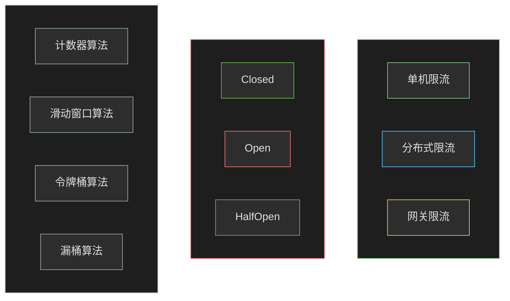

**限流算法对比**：

| 算法 | 优点 | 缺点 | 适用场景 |
|------|------|------|----------|
| 计数器 | 简单易实现 | 边界瞬时冲击 | 固定速率限流 |
| 滑动窗口 | 精度高、平滑 | 实现复杂 | API限流 |
| 令牌桶 | 支持突发流量 | 实现复杂 | 流量整形 |
| 漏桶 | 流量平滑 | 无法应对突发 | 严格限流 |

**Sentinel限流配置**：

```java
// Java Spring Boot 实现 - Sentinel限流熔断配置

@Configuration
public class SentinelConfig {

    /**
     * 配置限流规则
     */
    @PostConstruct
    public void initRules() {
        // 定义资源
        List~FlowRule~ rules = new ArrayList~<>();

        // 订单创建接口 - 每秒1000个请求
        FlowRule orderRule = new FlowRule();
        orderRule.setResource("order:create");
        orderRule.setGrade(RuleConstant.FLOW_GRADE_QPS);
        orderRule.setCount(1000);
        orderRule.setControlBehavior(RuleConstant.CONTROL_BEHAVIOR_DEFAULT);
        rules.add(orderRule);

        // 支付接口 - 每秒500个请求
        FlowRule paymentRule = new FlowRule();
        paymentRule.setResource("payment:initiate");
        paymentRule.setGrade(RuleConstant.FLOW_GRADE_QPS);
        paymentRule.setCount(500);
        paymentRule.setControlBehavior(RuleConstant.CONTROL_BEHAVIOR_DEFAULT);
        rules.add(paymentRule);

        // 商品详情 - 每秒5000个请求
        FlowRule productRule = new FlowRule();
        productRule.setResource("product:detail");
        productRule.setGrade(RuleConstant.FLOW_GRADE_QPS);
        productRule.setCount(5000);
        productRule.setControlBehavior(RuleConstant.CONTROL_BEHAVIOR_DEFAULT);
        rules.add(productRule);

        FlowRuleManager.loadRules(rules);
    }

    /**
     * 配置熔断规则
     */
    @PostConstruct
    public void initDegradeRules() {
        List~DegradeRule~ rules = new ArrayList~<>();

        // 库存服务 - 慢调用比例熔断
        DegradeRule inventoryRule = new DegradeRule();
        inventoryRule.setResource("inventory:reserve");
        inventoryRule.setGrade(RuleConstant.DEGRADE_GRADE_RT);
        inventoryRule.setCount(200); // RT阈值200ms
        inventoryRule.setTimeWindow(10); // 10秒后尝试恢复
        rules.add(inventoryRule);

        // 支付服务 - 异常比例熔断
        DegradeRule paymentRule = new DegradeRule();
        paymentRule.setResource("payment:initiate");
        paymentRule.setGrade(RuleConstant.DEGRADE_GRADE_EXCEPTION_RATIO);
        paymentRule.setCount(0.3); // 30%异常比例
        paymentRule.setTimeWindow(10);
        rules.add(paymentRule);

        DegradeRuleManager.loadRules(rules);
    }
}

// 使用Sentinel注解定义资源
public class OrderService {

    @SentinelResource(value = "order:create",
        blockHandler = "createOrderBlockHandler",
        fallback = "createOrderFallback")
    public OrderCreateResponse createOrder(OrderCreateRequest request) {
        // 业务逻辑
        return doCreateOrder(request);
    }

    /**
     * 限流/熔断降级处理
     */
    public OrderCreateResponse createOrderBlockHandler(
            OrderCreateRequest request,
            BlockException ex) {

        if (ex instanceof FlowException) {
            throw new BusinessException("请求过于频繁，请稍后重试");
        } else if (ex instanceof DegradeException) {
            throw new BusinessException("服务繁忙，请稍后重试");
        }

        throw new BusinessException("系统繁忙");
    }

    /**
     * 业务异常降级处理
     */
    public OrderCreateResponse createOrderFallback(OrderCreateRequest request, Throwable ex) {
        // 记录异常日志
        log.error("创建订单失败", ex);

        // 返回降级结果
        OrderCreateResponse response = new OrderCreateResponse();
        response.setSuccess(false);
        response.setMessage("系统繁忙，请稍后重试");
        return response;
    }
}

// 网关层Sentinel配置
@Configuration
public class GatewaySentinelConfig {

    @Bean
    public SentinelGatewayFilter sentinelGatewayFilter() {
        return new SentinelGatewayFilter();
    }

    @PostConstruct
    public void initGatewayRules() {
        Set~GatewayFlowRule~ rules = new HashSet~();

        // 全局路由限流
        rules.add(new GatewayFlowRule("order-route")
            .setCount(1000)
            .setIntervalSec(1)
        );

        rules.add(new GatewayFlowRule("product-route")
            .setCount(5000)
            .setIntervalSec(1)
        );

        rules.add(new GatewayFlowRule("payment-route")
            .setCount(500)
            .setIntervalSec(1)
        );

        GatewayRuleManager.loadRules(rules);
    }
}
```

### 12.4.2 缓存策略

缓存是电商系统性能优化的核心手段。通过多级缓存策略，可以大大减少数据库的压力，提升系统的响应速度。但缓存也带来了缓存一致性、缓存穿透、缓存雪崩等问题，需要精心设计。

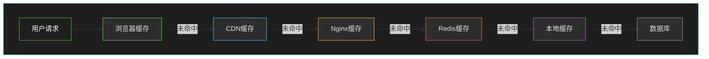

**缓存问题及解决方案**：

| 问题 | 描述 | 解决方案 |
|------|------|----------|
| 缓存穿透 | 查询不存在的数据，大量请求打到数据库 | 布隆过滤器/null值缓存 |
| 缓存击穿 | 热点key过期瞬间，大量请求击穿到数据库 | 互斥锁/永不过期+异步更新 |
| 缓存雪崩 | 大量key同时过期或Redis故障 | 多级缓存/过期时间随机化/主从切换 |
| 数据一致性 | 缓存与数据库数据不一致 | 延迟双删/异步消息同步 |

```java
// Java Spring Boot 实现 - 多级缓存

@Service
public class ProductCacheService {

    // 本地缓存 - Caffeine
    private Cache~Long, ProductDTO~ localCache = Caffeine.newBuilder()
        .maximumSize(10000)
        .expireAfterWrite(1, TimeUnit.MINUTES)
        .build();

    @Autowired
    private RedisTemplate~String, Object~ redisTemplate;

    @Autowired
    private ProductRepository productRepository;

    private static final String REDIS_CACHE_PREFIX = "product:";

    /**
     * 多级缓存读取
     */
    public ProductDTO getProduct(Long productId) {
        // 1. 查询本地缓存
        ProductDTO cached = localCache.getIfPresent(productId);
        if (cached != null) {
            return cached;
        }

        // 2. 查询Redis缓存
        String redisKey = REDIS_CACHE_PREFIX + productId;
        cached = (ProductDTO) redisTemplate.opsForValue().get(redisKey);
        if (cached != null) {
            // 回填本地缓存
            localCache.put(productId, cached);
            return cached;
        }

        // 3. 查询数据库
        Product product = productRepository.findById(productId)
            .orElseThrow(() -> new BusinessException("商品不存在"));
        ProductDTO dto = convertToDTO(product);

        // 4. 回填缓存
        redisTemplate.opsForValue().set(redisKey, dto, 5, TimeUnit.MINUTES);
        localCache.put(productId, dto);

        return dto;
    }

    /**
     * 缓存更新策略：Cache Aside + 延迟双删
     */
    @Transactional
    public void updateProduct(Product product) {
        // 1. 更新数据库
        productRepository.save(product);

        // 2. 删除Redis缓存（延迟双删 - 第一次删除）
        String redisKey = REDIS_CACHE_PREFIX + product.getId();
        redisTemplate.delete(redisKey);

        // 3. 清除本地缓存
        localCache.invalidate(product.getId());

        // 4. 延迟双删 - 异步延迟500ms再删除一次
        CompletableFuture.runAsync(() -> {
            try {
                Thread.sleep(500);
                redisTemplate.delete(redisKey);
            } catch (InterruptedException e) {
                Thread.currentThread().interrupt();
            }
        });
    }

    /**
     * 缓存预热 - 热点商品
     */
    public void preloadHotProducts(List~Long~ productIds) {
        List~Product~ products = productRepository.findByIdIn(productIds);

        for (Product product : products) {
            ProductDTO dto = convertToDTO(product);

            // 写入Redis缓存
            String redisKey = REDIS_CACHE_PREFIX + product.getId();
            redisTemplate.opsForValue().set(redisKey, dto, 5, TimeUnit.MINUTES);

            // 写入本地缓存
            localCache.put(product.getId(), dto);
        }
    }
}

// 布隆过滤器防止缓存穿透
@Service
public class BloomFilterService {

    private BloomFilter~Long~ bloomFilter;

    @PostConstruct
    public void init() {
        // 初始化布隆过滤器
        bloomFilter = BloomFilter.create(
            Funnels.longFunnel(),
            10000000, // 预期插入数量
            0.01 // 误判率
        );
    }

    /**
     * 初始化商品ID到布隆过滤器
     */
    public void initProductIds(List~Long~ productIds) {
        for (Long productId : productIds) {
            bloomFilter.put(productId);
        }
    }

    /**
     * 检查商品ID是否存在（可能存在误判）
     */
    public boolean mightContain(Long productId) {
        return bloomFilter.mightContain(productId);
    }
}

// 使用布隆过滤器优化查询
@Service
public class ProductServiceOptimized {

    @Autowired
    private BloomFilterService bloomFilterService;

    @Autowired
    private ProductCacheService productCacheService;

    public ProductDTO getProduct(Long productId) {
        // 1. 布隆过滤器检查
        if (!bloomFilterService.mightContain(productId)) {
            // 一定不存在，直接返回
            throw new BusinessException("商品不存在");
        }

        // 2. 查询缓存
        return productCacheService.getProduct(productId);
    }
}
```

### 12.4.3 降级方案

降级是非核心功能在系统压力过大或依赖服务故障时的兜底策略。通过主动降级，可以释放系统资源，保证核心功能的可用性。

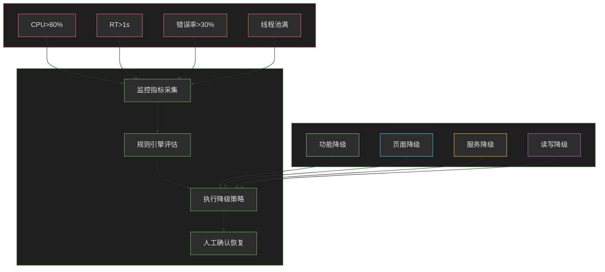

**降级开关设计**：

| 降级开关 | 说明 | 影响范围 |
|----------|------|----------|
| recommend:disable | 关闭推荐服务 | 商品详情页不显示推荐 |
| promotion:disable | 关闭优惠计算 | 使用原价下单 |
| search:disable | 关闭搜索服务 | 只显示分类下商品 |
| comment:disable | 关闭评价展示 | 商品页不显示评价 |

```java
// Java Spring Boot 实现 - 降级开关

@Component
public class FeatureToggle {

    @Autowired
    private RedisTemplate~String, String~ redisTemplate;

    private static final String TOGGLE_PREFIX = "toggle:";

    /**
     * 检查功能开关
     */
    public boolean isEnabled(String feature) {
        String key = TOGGLE_PREFIX + feature;
        String value = redisTemplate.opsForValue().get(key);
        return !"disabled".equals(value);
    }

    /**
     * 关闭功能
     */
    public void disable(String feature) {
        String key = TOGGLE_PREFIX + feature;
        redisTemplate.opsForValue().set(key, "disabled");
    }

    /**
     * 开启功能
     */
    public void enable(String feature) {
        String key = TOGGLE_PREFIX + feature;
        redisTemplate.delete(key);
    }
}

// 使用降级开关
@Service
public class RecommendationService {

    @Autowired
    private FeatureToggle featureToggle;

    @Autowired
    private ProductRepository productRepository;

    /**
     * 获取商品推荐 - 降级实现
     */
    public List~ProductDTO~ getRecommendations(Long userId, int limit) {
        // 检查降级开关
        if (!featureToggle.isEnabled("recommend")) {
            // 降级：返回热销商品
            return getHotSellingProducts(limit);
        }

        // 正常逻辑：个性化推荐
        try {
            return computePersonalizedRecommendations(userId, limit);
        } catch (Exception e) {
            // 推荐计算失败，降级返回
            log.error("推荐服务异常，降级返回热销商品", e);
            return getHotSellingProducts(limit);
        }
    }

    /**
     * 热销商品（降级后返回的兜底数据）
     */
    private List~ProductDTO~ getHotSellingProducts(int limit) {
        List~Product~ products = productRepository.findTopBySalesVolume(limit);
        return products.stream()
            .map(this::convertToDTO)
            .collect(Collectors.toList());
    }
}

// 促销计算降级
@Service
public class PromotionService {

    @Autowired
    private FeatureToggle featureToggle;

    /**
     * 计算订单优惠 - 降级版本
     */
    public DiscountResult calculateDiscount(Order order) {
        DiscountResult result = new DiscountResult();
        result.setOriginalAmount(order.getTotalAmount());
        result.setDiscountAmount(BigDecimal.ZERO);
        result.setFinalAmount(order.getTotalAmount());
        result.setDiscountDesc("系统繁忙，优惠暂不可用");

        // 检查促销降级开关
        if (!featureToggle.isEnabled("promotion")) {
            return result;
        }

        try {
            // 正常计算优惠
            return doCalculateDiscount(order);
        } catch (Exception e) {
            log.error("优惠计算异常，返回原价", e);
            return result;
        }
    }
}
```

---

## 12.5 性能优化设计

### 12.5.1 热点数据缓存

电商系统的访问具有明显的热点特征：少量商品占据了大量访问量（如爆款商品）。针对热点数据的缓存优化，是提升系统性能的关键。

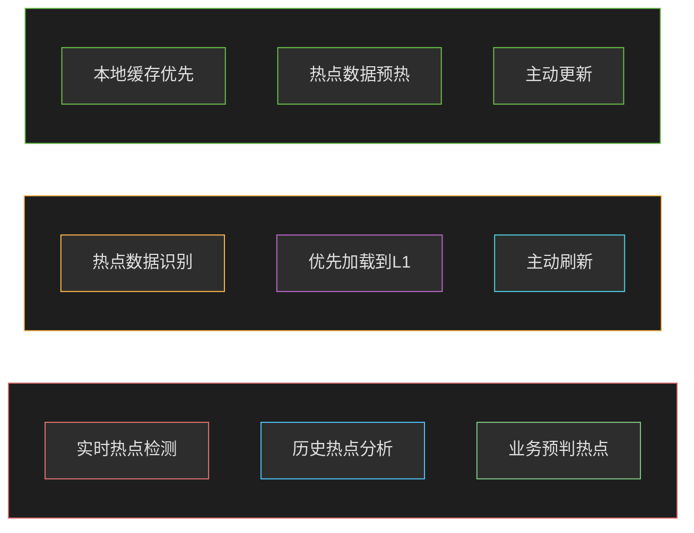

**热点数据识别策略**：

| 策略 | 说明 | 实现难度 |
|------|------|----------|
| 实时统计 | 基于滑动窗口统计访问量 | 中 |
| 降级预判 | 基于秒杀商品表预判 | 低 |
| 历史分析 | 基于历史数据挖掘 | 高 |
| 业务标记 | 运营人员标记 | 低 |

```java
// Java Spring Boot 实现 - 热点数据缓存

@Service
public class HotDataService {

    @Autowired
    private RedisTemplate~String, Object~ redisTemplate;

    @Autowired
    private ProductRepository productRepository;

    // 本地缓存存储热点数据
    private Cache~Long, HotSkuData~ hotDataCache = Caffeine.newBuilder()
        .maximumSize(1000)
        .expireAfterWrite(30, TimeUnit.SECONDS) // 30秒过期，强制刷新
        .build();

    // 热点Key前缀
    private static final String HOT_KEY_PREFIX = "hot:sku:";
    private static final String HOT_SCORE_PREFIX = "hot:score:";

    /**
     * 记录数据访问（实时热点识别）
     */
    public void recordAccess(Long skuId) {
        // 使用Redis Sorted Set记录访问量
        String scoreKey = HOT_SCORE_PREFIX + skuId;
        redisTemplate.opsForZSet().incrementScore("sku:access:ranking", skuId.toString(), 1);
    }

    /**
     * 获取热点SKU列表
     */
    public List~Long~ getHotSkuIds(int topN) {
        // 获取访问量Top N的SKU
        Set~String~ topSkuIds = redisTemplate.opsForZSet()
            .reverseRange("sku:access:ranking", 0, topN - 1);

        if (topSkuIds == null || topSkuIds.isEmpty()) {
            return Collections.emptyList();
        }

        return topSkuIds.stream()
            .map(Long::parseLong)
            .collect(Collectors.toList());
    }

    /**
     * 获取热点数据 - 自动热点探测 + 多级缓存
     */
    public HotSkuData getHotSkuData(Long skuId) {
        // 1. 先查本地缓存
        HotSkuData cached = hotDataCache.getIfPresent(skuId);
        if (cached != null) {
            return cached;
        }

        // 2. 查Redis热点缓存
        String hotKey = HOT_KEY_PREFIX + skuId;
        cached = (HotSkuData) redisTemplate.opsForValue().get(hotKey);
        if (cached != null) {
            hotDataCache.put(skuId, cached);
            return cached;
        }

        // 3. 从数据库加载
        Sku sku = skuRepository.findById(skuId)
            .orElseThrow(() -> new BusinessException("商品不存在"));

        cached = new HotSkuData();
        cached.setSkuId(skuId);
        cached.setPrice(sku.getPrice());
        cached.setStock(sku.getStock());
        cached.setSalesVolume(sku.getSalesVolume());
        cached.setPromotionPrice(sku.getPromotionPrice());

        // 4. 写入缓存
        redisTemplate.opsForValue().set(hotKey, cached, 1, TimeUnit.MINUTES);
        hotDataCache.put(skuId, cached);

        return cached;
    }

    /**
     * 预热热点数据
     */
    @Scheduled(fixedRate = 60000) // 每分钟执行
    public void preloadHotData() {
        // 1. 获取当前热点SKU
        List~Long~ hotSkuIds = getHotSkuIds(100);

        if (hotSkuIds.isEmpty()) {
            return;
        }

        // 2. 从数据库批量加载
        List~Sku~ skus = skuRepository.findByIdIn(hotSkuIds);

        for (Sku sku : skus) {
            HotSkuData data = new HotSkuData();
            data.setSkuId(sku.getId());
            data.setPrice(sku.getPrice());
            data.setStock(sku.getStock());
            data.setSalesVolume(sku.getSalesVolume());
            data.setPromotionPrice(sku.getPromotionPrice());

            // 3. 写入缓存
            String hotKey = HOT_KEY_PREFIX + sku.getId();
            redisTemplate.opsForValue().set(hotKey, data, 1, TimeUnit.MINUTES);
            hotDataCache.put(sku.getId(), data);
        }

        log.info("热点数据预热完成，共加载{}个SKU", skus.size());
    }
}

// 热点数据价格标记注解
@Target(ElementType.METHOD)
@Retention(RetentionPolicy.RUNTIME)
public @interface HotData {
    String key() default "";
    int cacheSeconds() default 60;
}

// AOP自动处理热点数据
@Aspect
@Component
public class HotDataAspect {

    @Autowired
    private HotDataService hotDataService;

    @Around("@annotation(hotData)")
    public Object handleHotData(ProceedingJoinPoint joinPoint, HotData hotData) throws Throwable {
        MethodSignature signature = (MethodSignature) joinPoint.getSignature();
        Method method = signature.getMethod();

        // 获取方法参数中的skuId
        Long skuId = extractSkuId(joinPoint.getArgs(), method);
        if (skuId == null) {
            return joinPoint.proceed();
        }

        // 记录访问（用于热点识别）
        hotDataService.recordAccess(skuId);

        // 获取热点数据
        HotSkuData hotData = hotDataService.getHotSkuData(skuId);

        // 替换方法参数
        Object[] newArgs = replaceSkuIdArgument(joinPoint.getArgs(), method, hotData);

        return joinPoint.proceed(newArgs);
    }
}
```

### 12.5.2 异步处理

异步处理是提升系统吞吐量的关键手段。通过将非核心流程异步化，可以大大减少用户等待时间，提升系统响应速度。

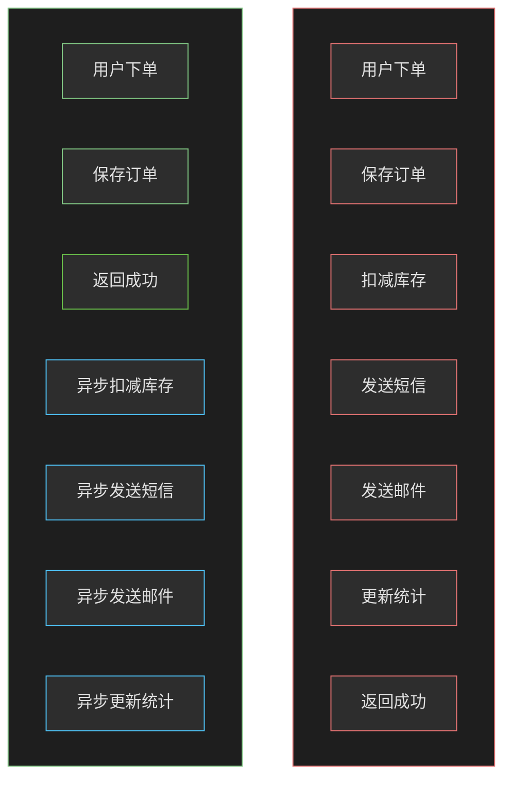

**异步化策略**：

| 场景 | 异步化方式 | 说明 |
|------|------------|------|
| 订单完成通知 | Kafka消息 | 可靠投递，消息持久化 |
| 库存同步 | 本地消息表 | 保证最终一致 |
| 发送短信 | 消息队列+重试 | 解耦，削峰 |
| 搜索索引更新 | 消息队列 | 异步构建索引 |
| 统计数据更新 | 定时任务+批量 | 减少数据库压力 |

```java
// Java Spring Boot 实现 - 异步消息处理

@Service
public class OrderAsyncService {

    @Autowired
    private KafkaTemplate~String, Object~ kafkaTemplate;

    @Autowired
    private InventoryService inventoryService;

    @Autowired
    private NotificationService notificationService;

    @Autowired
    private StatisticsService statisticsService;

    /**
     * 订单创建 - 异步化处理
     */
    @Transactional
    public Order createOrder(OrderCreateRequest request) {
        // 1. 创建订单（同步）
        Order order = doCreateOrder(request);

        // 2. 发送订单创建事件（异步）
        OrderCreatedEvent event = new OrderCreatedEvent(order);
        kafkaTemplate.send("order-topic", order.getOrderNo(), event);

        // 3. 立即返回（不等后续处理）
        return order;
    }

    /**
     * 订单创建事件处理 - 库存扣减
     */
    @KafkaListener(topics = "order-topic", groupId = "inventory-group")
    public void handleOrderCreatedForInventory(OrderCreatedEvent event) {
        try {
            inventoryService.reserveStock(event.getSkuId(), event.getQuantity());
        } catch (Exception e) {
            log.error("库存预占失败，orderNo={}", event.getOrderNo(), e);
            // 发送库存预占失败事件，触发订单取消
            kafkaTemplate.send("order-cancel-topic", event.getOrderNo(),
                new OrderCancelEvent(event.getOrderNo(), "库存预占失败"));
        }
    }

    /**
     * 订单创建事件处理 - 发送通知
     */
    @KafkaListener(topics = "order-topic", groupId = "notification-group")
    public void handleOrderCreatedForNotification(OrderCreatedEvent event) {
        try {
            // 发送订单创建成功通知
            notificationService.sendOrderCreatedNotification(event);
        } catch (Exception e) {
            log.error("发送订单通知失败", e);
            // 记录失败，后续补偿
        }
    }

    /**
     * 订单创建事件处理 - 统计更新
     */
    @KafkaListener(topics = "order-topic", groupId = "statistics-group")
    public void handleOrderCreatedForStatistics(OrderCreatedEvent event) {
        try {
            // 批量更新统计数据
            statisticsService.incrementOrderCount(event.getUserId());
            statisticsService.updateSalesVolume(event.getSkuId(), event.getQuantity());
        } catch (Exception e) {
            log.error("更新统计数据失败", e);
        }
    }
}

// 本地消息表 - 保证本地操作与消息发送的原子性
@TableName("local_message")
public class LocalMessage {

    @Id
    private Long id;

    private String messageId; // 消息唯一ID
    private String topic; // 消息主题
    private String content; // 消息内容
    private Integer status; // 状态：0待发送，1发送中，2已发送，3发送失败
    private Integer retryCount; // 重试次数
    private LocalDateTime createTime;
    private LocalDateTime updateTime;
    private LocalDateTime sendTime;
}

// 本地消息表服务
@Service
public class LocalMessageService {

    @Autowired
    private LocalMessageMapper localMessageMapper;

    @Autowired
    private KafkaTemplate~String, String~ kafkaTemplate;

    /**
     * 保存本地消息（与本地事务同库）
     */
    public void saveLocalMessage(Transaction transaction, String topic, String content) {
        LocalMessage message = new LocalMessage();
        message.setMessageId(UUID.randomUUID().toString());
        message.setTopic(topic);
        message.setContent(content);
        message.setStatus(0);
        message.setCreateTime(LocalDateTime.now());

        // 通过SqlSession执行，与业务操作在同一个事务中
        localMessageMapper.insert(message);
    }

    /**
     * 定时扫描发送本地消息
     */
    @Scheduled(fixedDelay = 1000)
    public void sendPendingMessages() {
        // 查询待发送消息（最多100条）
        List~LocalMessage~ messages = localMessageMapper
            .findByStatusWithLimit(0, 100);

        for (LocalMessage message : messages) {
            try {
                // 更新为发送中状态
                message.setStatus(1);
                localMessageMapper.update(message);

                // 发送消息
                kafkaTemplate.send(message.getTopic(), message.getContent());

                // 更新为已发送
                message.setStatus(2);
                message.setSendTime(LocalDateTime.now());
                localMessageMapper.update(message);

            } catch (Exception e) {
                // 发送失败，重试逻辑
                handleSendFailure(message);
            }
        }
    }

    /**
     * 处理发送失败
     */
    private void handleSendFailure(LocalMessage message) {
        message.setRetryCount(message.getRetryCount() + 1);

        if (message.getRetryCount() >= 3) {
            // 超过最大重试次数，标记为失败
            message.setStatus(3);
        } else {
            // 退回待发送状态，等待下次重试
            message.setStatus(0);
        }

        localMessageMapper.update(message);
    }
}
```

### 12.5.3 数据库优化

数据库是电商系统最核心也最脆弱的组件。大部分电商系统的性能瓶颈都在数据库层。数据库优化需要从多个维度综合考虑：索引优化、SQL优化、分库分表、读写分离。

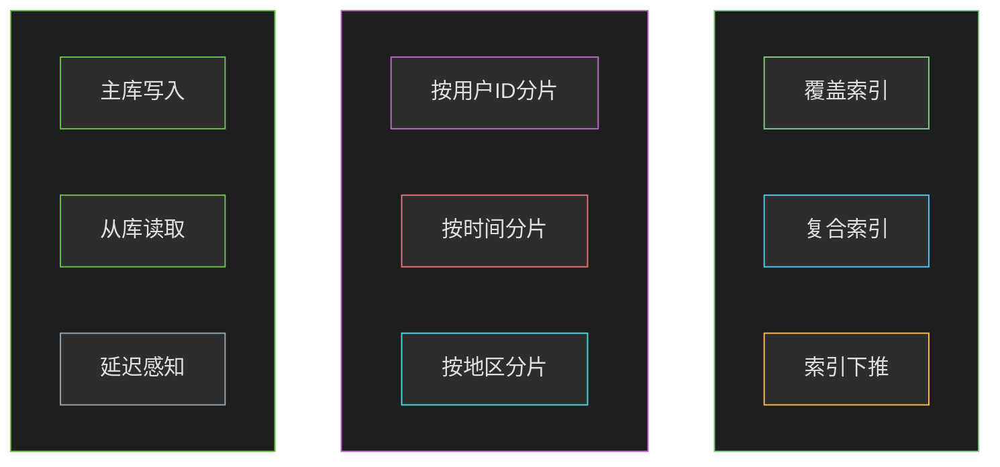

**数据库优化策略**：

| 优化项 | 具体措施 | 预期效果 |
|--------|----------|----------|
| 索引优化 | 添加复合索引、覆盖索引 | 查询提升10-100倍 |
| SQL优化 | 避免全表扫描、减少子查询 | 降低响应时间50% |
| 分库分表 | 按用户ID水平分片 | 单库QPS从5000降到500 |
| 读写分离 | 主从同步、读从库 | 读取性能线性扩展 |
| 连接池 | HikariCP优化配置 | 连接复用、减少开销 |

```sql
-- 订单表优化示例

-- 1. 订单表结构优化
CREATE TABLE orders (
    id BIGINT PRIMARY KEY AUTO_INCREMENT,
    order_no VARCHAR(32) NOT NULL COMMENT '订单号',
    user_id BIGINT NOT NULL COMMENT '用户ID',
    sku_id BIGINT NOT NULL COMMENT '商品ID',
    quantity INT NOT NULL COMMENT '数量',
    total_amount DECIMAL(10,2) NOT NULL COMMENT '总金额',
    pay_amount DECIMAL(10,2) NOT NULL COMMENT '实付金额',
    status VARCHAR(20) NOT NULL COMMENT '订单状态',
    create_time DATETIME NOT NULL COMMENT '创建时间',
    pay_time DATETIME COMMENT '支付时间',
    INDEX idx_user_id (user_id),
    INDEX idx_sku_id (sku_id),
    INDEX idx_status (status),
    INDEX idx_create_time (create_time),
    -- 复合索引优化：覆盖常见查询场景
    INDEX idx_user_status_time (user_id, status, create_time),
    UNIQUE INDEX uk_order_no (order_no)
) ENGINE=InnoDB DEFAULT CHARSET=utf8mb4;

-- 2. 分页查询优化（避免深度分页）
-- 低效查询：
SELECT * FROM orders WHERE user_id = 12345
ORDER BY create_time DESC LIMIT 1000000, 10;

-- 优化方案1：使用ID游标
SELECT * FROM orders
WHERE user_id = 12345 AND id < #{lastId}
ORDER BY create_time DESC LIMIT 10;

-- 优化方案2：延迟关联
SELECT o.* FROM orders o
INNER JOIN (
    SELECT id FROM orders
    WHERE user_id = 12345
    ORDER BY create_time DESC
    LIMIT 1000000, 10
) t ON o.id = t.id;

-- 3. 热点查询优化
-- 查询用户最近订单（使用覆盖索引）
SELECT order_no, total_amount, status, create_time
FROM orders
WHERE user_id = 12345 AND status = 'PENDING'
ORDER BY create_time DESC
LIMIT 10;

-- 4. 统计查询优化（使用物化视图或缓存）
-- 低效：实时统计
SELECT COUNT(*) FROM orders
WHERE status = 'COMPLETED'
AND DATE(create_time) = CURDATE();

-- 优化：定时任务+缓存
-- 或使用ClickHouse进行实时OLAP分析
```

```java
// Java ShardingSphere分库分表配置

@Configuration
public class ShardingSphereDataSourceConfig {

    @Bean
    public DataSource getDataSource() {
        // 配置分片规则
        ShardingRuleConfiguration shardingRuleConfig = new ShardingRuleConfiguration();

        // 订单表分片规则：按user_id取模分片
        TableRuleConfiguration orderTableRule = new TableRuleConfiguration("orders", "ds${0..1}.orders_${0..15}");
        orderTableRule.setTableShardingStrategyConfig(
            new StandardShardingStrategyConfiguration(
                "user_id",
                new ModShardAlgorithm(2, 16) // 2个库，16张表
            )
        );

        // 主键生成策略
        orderTableRule.setKeyGeneratorConfig(new KeyGeneratorConfiguration("SNOWFLAKE", "id"));

        shardingRuleConfig.getTableRuleConfigs().add(orderTableRule);

        // 默认分片库
        shardingRuleConfig.setDefaultDatabaseShardingStrategyConfig(
            new StandardShardingStrategyConfiguration("user_id", new ModShardAlgorithm(2, 16))
        );

        // 创建数据源
        Map~String, DataSourceFactory~ dataSourceMap = createDataSourceMap();

        try {
            return ShardingDataSourceFactory.createDataSource(dataSourceMap, shardingRuleConfig, new Properties());
        } catch ( SQLException e) {
            throw new RuntimeException("创建分片数据源失败", e);
        }
    }

    private Map~String, DataSourceFactory~ createDataSourceMap() {
        Map~String, DataSourceFactory~ result = new HashMap~();

        // 配置两个数据源
        result.put("ds0", createDataSource("jdbc:mysql://localhost:3306/ec_order_0"));
        result.put("ds1", createDataSource("jdbc:mysql://localhost:3306/ec_order_1"));

        return result;
    }

    private DataSource createDataSource(String url) {
        HikariDataSource dataSource = new HikariDataSource();
        dataSource.setJdbcUrl(url);
        dataSource.setUsername("root");
        dataSource.setPassword("password");
        dataSource.setMaximumPoolSize(50);
        dataSource.setMinimumIdle(10);
        return dataSource;
    }
}

// 自定义分片算法
public class ModShardAlgorithm implements StandardShardingAlgorithm~Long~ {

    private int databaseCount;
    private int tableCount;

    @Override
    public String doSharding(Collection~String~ availableTargetNames, PreciseShardingValue~Long~ shardingValue) {
        long userId = shardingValue.getValue();

        // 计算库分片索引
        int databaseIndex = (int) (userId % databaseCount);

        // 计算表分片索引
        int tableIndex = (int) ((userId / databaseCount) % tableCount);

        String databaseName = "ds" + databaseIndex;
        String tableName = "orders_" + tableIndex;

        return databaseName + "." + tableName;
    }

    @Override
    public Collection~String~ doSharding(
            Collection~String~ availableTargetNames,
            RangeShardingValue~Long~ shardingValue) {

        // 范围查询需要扫描多个分片
        return availableTargetNames;
    }
}
```

---

## 12.6 可扩展性设计

### 12.6.1 秒杀系统扩展

秒杀是电商系统最具挑战性的场景之一，需要在极短时间内处理海量并发请求。秒杀系统的设计核心是：高读性能（静态化、CDN）、高写性能（Redis原子操作、消息队列）、防刷（限流、验证码）、防超卖（库存预占）。

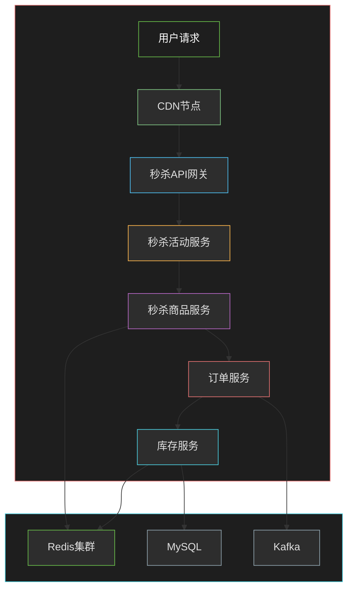

**秒杀系统关键技术方案**：

| 技术点 | 方案 | 说明 |
|--------|------|------|
| 流量拦截 | 验证码+限流 | 减少无效请求 |
| 库存缓存 | Redis | 热点数据预加载 |
| 扣减方式 | Lua原子脚本 | 保证不超卖 |
| 请求队列 | Kafka | 削峰填谷 |
| 异步下单 | 消息消费 | 减轻数据库压力 |
| 限流策略 | Sentinel | 多维度限流 |

```go
// Go 实现 - 秒杀服务

package main

import (
    "context"
    "encoding/json"
    "fmt"
    "github.com/redis/go-redis/v9"
    "github.com/segmentio/kafka-go"
    "time"
)

type SeckillService struct {
    redisClient *redis.Client
    kafkaWriter *kafka.Writer
}

type SeckillRequest struct {
    UserId    int64  `json:"user_id"`
    SkuId     int64  `json:"sku_id"`
    Quantity  int    `json:"quantity"`
    Timestamp int64  `json:"timestamp"`
    Sign      string `json:"sign"`
}

type SeckillResponse struct {
    Success   bool   `json:"success"`
    Message   string `json:"message"`
    OrderId   string `json:"order_id,omitempty"`
}

// Lua脚本：原子扣减库存
const stockDecrScript = `
local stock = tonumber(redis.call('GET', KEYS[1]))
if stock == nil then
    return -1  -- 库存未初始化
end
if stock < tonumber(ARGV[1]) then
    return -2  -- 库存不足
end
return redis.call('DECRBY', KEYS[1], ARGV[1])
`

// 秒杀下单
func (s *SeckillService) Seckill(ctx context.Context, req *SeckillRequest) (*SeckillResponse, error) {
    // 1. 验证签名（防篡改）
    if !s.verifySign(req) {
        return &SeckillResponse{
            Success: false,
            Message: "签名验证失败",
        }, nil
    }

    // 2. 验证活动时间
    if !s.isSeckillActive(ctx, req.SkuId) {
        return &SeckillResponse{
            Success: false,
            Message: "秒杀活动未开始或已结束",
        }, nil
    }
    defer s.deleteActivityCache(ctx, req.SkuId)

    // 3. 验证用户购买资格（每人限1件）
    if s.hasUserPurchased(ctx, req.UserId, req.SkuId) {
        return &SeckillResponse{
            Success: false,
            Message: "您已参与过秒杀活动",
        }, nil
    }

    // 4. 原子扣减库存（Redis + Lua）
    stockKey := fmt.Sprintf("seckill:stock:%d", req.SkuId)
    result, err := s.redisClient.Eval(ctx, stockDecrScript, []string{stockKey}, req.Quantity).Int64()
    if err != nil {
        return nil, fmt.Errorf("库存扣减失败: %w", err)
    }

    if result == -1 {
        return &SeckillResponse{
            Success: false,
            Message: "活动未开始，请稍后重试",
        }, nil
    }
    if result == -2 {
        return &SeckillResponse{
            Success: false,
            Message: "库存不足",
        }, nil
    }

    // 5. 发送订单消息到Kafka
    orderMsg := &OrderMessage{
        OrderId:     generateOrderId(),
        UserId:      req.UserId,
        SkuId:       req.SkuId,
        Quantity:    req.Quantity,
        CreateTime:  time.Now(),
    }
    msgBytes, _ := json.Marshal(orderMsg)
    err = s.kafkaWriter.WriteMessages(ctx, kafka.Message{
        Topic: "seckill-orders",
        Key:   []byte(fmt.Sprintf("%d", req.UserId)),
        Value: msgBytes,
    })
    if err != nil {
        // 库存回滚
        s.rollbackStock(ctx, req.SkuId, req.Quantity)
        return nil, fmt.Errorf("订单创建失败: %w", err)
    }

    // 6. 标记用户购买资格
    s.markUserPurchased(ctx, req.UserId, req.SkuId)

    return &SeckillResponse{
        Success: true,
        Message: "秒杀成功，订单已创建",
        OrderId: orderMsg.OrderId,
    }, nil
}

// 验证签名
func (s *SeckillService) verifySign(req *SeckillRequest) bool {
    // 实际应该用密钥验证签名
    expectedSign := fmt.Sprintf("%d%d%d", req.UserId, req.SkuId, req.Timestamp)
    return req.Sign == expectedSign
}

// 验证活动是否在进行
func (s *SeckillService) isSeckillActive(ctx context.Context, skuId int64) bool {
    key := fmt.Sprintf("seckill:active:%d", skuId)
    exists, _ := s.redisClient.Exists(ctx, key).Result()
    return exists > 0
}

// 活动预热：提前加载库存到Redis
func (s *SeckillService) PreloadStock(ctx context.Context, skuId int64, totalStock int) error {
    stockKey := fmt.Sprintf("seckill:stock:%d", skuId)
    return s.redisClient.Set(ctx, stockKey, totalStock, 24*time.Hour).Err()
}

// 清理活动缓存
func (s *SeckillService) deleteActivityCache(ctx context.Context, skuId int64) {
    key := fmt.Sprintf("seckill:active:%d", skuId)
    s.redisClient.Del(ctx, key)
}

// 检查用户是否已购买
func (s *SeckillService) hasUserPurchased(ctx context.Context, userId, skuId int64) bool {
    key := fmt.Sprintf("seckill:purchased:%d:%d", userId, skuId)
    exists, _ := s.redisClient.Exists(ctx, key).Result()
    return exists > 0
}

// 标记用户已购买
func (s *SeckillService) markUserPurchased(ctx context.Context, userId, skuId int64) {
    key := fmt.Sprintf("seckill:purchased:%d:%d", userId, skuId)
    // 设置24小时过期
    s.redisClient.Set(ctx, key, "1", 24*time.Hour)
}

// 库存回滚
func (s *SeckillService) rollbackStock(ctx context.Context, skuId int64, quantity int) {
    stockKey := fmt.Sprintf("seckill:stock:%d", skuId)
    s.redisClient.IncrBy(ctx, stockKey, int64(quantity))
}

// 生成订单ID
func generateOrderId() string {
    return fmt.Sprintf("SK%s%d", time.Now().Format("20060102150405"), time.Now().Nanosecond()%1000)
}

// 订单消息
type OrderMessage struct {
    OrderId    string    `json:"order_id"`
    UserId     int64     `json:"user_id"`
    SkuId      int64     `json:"sku_id"`
    Quantity   int       `json:"quantity"`
    CreateTime time.Time `json:"create_time"`
}
```

### 12.6.2 促销系统扩展

促销系统需要支持多种促销规则（满减、折扣、买赠、秒杀等），同时需要保证促销计算的性能和准确性。促销系统的设计核心是：规则引擎（灵活配置）、促销叠加计算（复杂规则）、高并发支持（Redis缓存）。

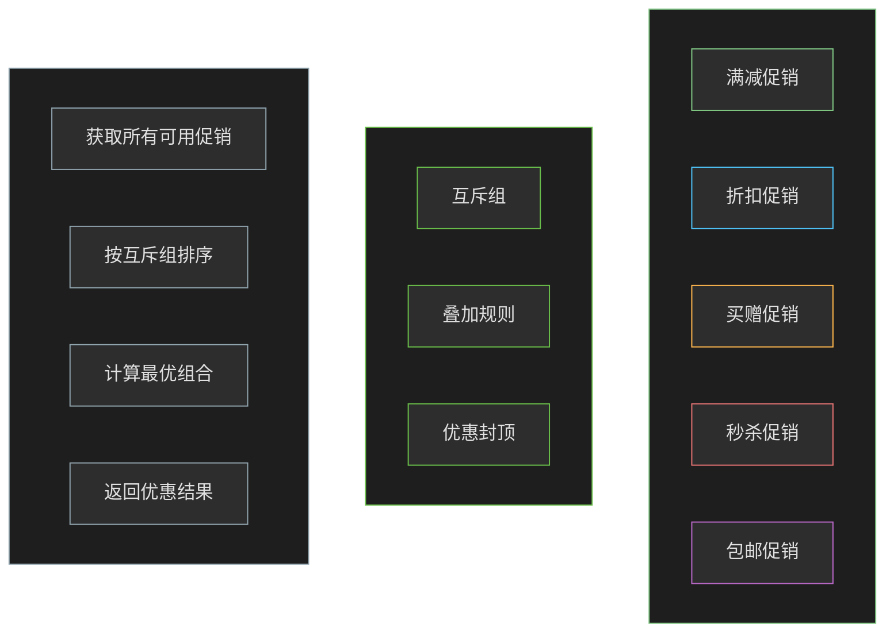

**促销规则设计**：

| 促销类型 | 规则示例 | 实现方式 |
|----------|----------|----------|
| 满减 | 满100减20、满200减50 | 门槛金额+减掉金额 |
| 折扣 | 8折、7.5折 | 折扣比例 |
| 买赠 | 买2送1、买3送2 | 购买数量+赠送数量 |
| 秒杀 | 原价100秒杀价50 | 固定优惠金额 |
| 包邮 | 满99包邮 | 门槛金额 |

```java
// Java Spring Boot 实现 - 促销规则引擎

// 促销规则接口
public interface PromotionRule {
    /**
     * 规则名称
     */
    String getName();

    /**
     * 是否适用此规则
     */
    boolean isApplicable(Order order, Promotion promotion);

    /**
     * 计算优惠金额
     */
    BigDecimal calculateDiscount(Order order, Promotion promotion);
}

// 满减促销规则
@Component
public class FullMinusPromotionRule implements PromotionRule {

    @Override
    public String getName() {
        return "满减促销";
    }

    @Override
    public boolean isApplicable(Order order, Promotion promotion) {
        // 满足门槛金额
        BigDecimal threshold = promotion.getConfig().getBigDecimal("threshold");
        return order.getTotalAmount().compareTo(threshold) >= 0;
    }

    @Override
    public BigDecimal calculateDiscount(Order order, Promotion promotion) {
        // 直接返回优惠金额
        return promotion.getConfig().getBigDecimal("discount");
    }
}

// 折扣促销规则
@Component
public class DiscountPromotionRule implements PromotionRule {

    @Override
    public String getName() {
        return "折扣促销";
    }

    @Override
    public boolean isApplicable(Order order, Promotion promotion) {
        // 所有商品适用
        return true;
    }

    @Override
    public BigDecimal calculateDiscount(Order order, Promotion promotion) {
        BigDecimal discountRate = promotion.getConfig().getBigDecimal("discountRate");
        BigDecimal discount = order.getTotalAmount()
            .multiply(BigDecimal.ONE.subtract(discountRate));
        // 封顶金额
        BigDecimal maxDiscount = promotion.getConfig().getBigDecimal("maxDiscount");
        if (maxDiscount != null && discount.compareTo(maxDiscount) > 0) {
            discount = maxDiscount;
        }
        return discount;
    }
}

// 促销计算引擎
@Service
public class PromotionEngine {

    @Autowired
    private Map~String, PromotionRule~ promotionRules;

    /**
     * 计算最优优惠组合
     */
    public PromotionResult calculateBestPromotion(Order order, List~Promotion~ availablePromotions) {
        PromotionResult result = new PromotionResult();
        result.setOriginalAmount(order.getTotalAmount());
        result.setDiscountAmount(BigDecimal.ZERO);

        // 1. 按互斥组过滤
        List~Promotion~ applicablePromotions = filterByMutexGroup(order, availablePromotions);

        // 2. 计算每种促销的优惠
        List~PromotionDiscount~ allDiscounts = new ArrayList~();
        for (Promotion promotion : applicablePromotions) {
            PromotionRule rule = promotionRules.get(promotion.getRuleType());
            if (rule != null && rule.isApplicable(order, promotion)) {
                BigDecimal discount = rule.calculateDiscount(order, promotion);
                allDiscounts.add(new PromotionDiscount(promotion, discount));
            }
        }

        // 3. 按优惠金额降序排序
        allDiscounts.sort(Comparator.comparing(PromotionDiscount::getDiscount).reversed());

        // 4. 选择最优优惠组合（贪心策略，实际可能需要动态规划）
        BigDecimal totalDiscount = BigDecimal.ZERO;
        List~Promotion~ selectedPromotions = new ArrayList~();

        for (PromotionDiscount pd : allDiscounts) {
            // 检查是否与其他已选促销互斥
            if (!isMutexWithSelected(pd.getPromotion(), selectedPromotions)) {
                totalDiscount = totalDiscount.add(pd.getDiscount());
                selectedPromotions.add(pd.getPromotion());
            }
        }

        result.setDiscountAmount(totalDiscount);
        result.setFinalAmount(order.getTotalAmount().subtract(totalDiscount));
        result.setSelectedPromotions(selectedPromotions);

        return result;
    }

    /**
     * 按互斥组过滤
     */
    private List~Promotion~ filterByMutexGroup(Order order, List~Promotion~ promotions) {
        // 同一互斥组只保留最优的促销
        Map~String, Promotion~ bestByGroup = new HashMap~();

        for (Promotion promotion : promotions) {
            String mutexGroup = promotion.getMutexGroup();
            if (mutexGroup == null) {
                bestByGroup.put(promotion.getId().toString(), promotion);
                continue;
            }

            Promotion existing = bestByGroup.get(mutexGroup);
            if (existing == null) {
                bestByGroup.put(mutexGroup, promotion);
            } else {
                // 保留优惠力度更大的
                if (comparePromotion(promotion, existing) > 0) {
                    bestByGroup.put(mutexGroup, promotion);
                }
            }
        }

        return new ArrayList~(bestByGroup.values());
    }

    /**
     * 检查是否与已选促销互斥
     */
    private boolean isMutexWithSelected(Promotion promotion, List~Promotion~ selected) {
        Set~String~ mutexGroups = promotion.getMutexGroups();
        for (Promotion sel : selected) {
            if (!Collections.disjoint(mutexGroups, sel.getMutexGroups())) {
                return true;
            }
        }
        return false;
    }
}

// 促销计算结果
public class PromotionResult {
    private BigDecimal originalAmount;
    private BigDecimal discountAmount;
    private BigDecimal finalAmount;
    private List~Promotion~ selectedPromotions;
    private List~String~ appliedRules;
}

// 促销实体
@Entity
@Table(name = "promotions")
public class Promotion {

    @Id
    private Long id;

    private String name;

    @Enumerated(EnumType.STRING)
    private PromotionType type; // FULL_MINUS, DISCOUNT, BUY_GIFT, FLASH_SALE

    private String ruleType; // 规则类型，对应PromotionRule的Bean名称

    @Column(columnDefinition = "json")
    private String config; // 规则配置，JSON格式

    private String mutexGroup; // 互斥组

    @ElementCollection
    private Set~String~ mutexGroups; // 多个互斥组

    private LocalDateTime startTime;
    private LocalDateTime endTime;

    private Integer priority; // 优先级
    private Boolean enabled;
}
```

---

## 12.7 完整架构代码示例

### 12.7.1 Spring Cloud微服务框架

以下是电商系统核心服务的Spring Cloud项目结构和关键配置。

```bash
# 项目结构
ecommerce/
├── pom.xml                          # 父POM
├── config/
│   └── application.yml              # 公共配置
├── e-commerce-common/               # 公共模块
│   ├── pom.xml
│   └── src/main/java/
│       └── com/ecommerce/common/
│           ├── Result.java          # 统一响应
│           ├── BusinessException.java
│           └── Constants.java
├── e-commerce-gateway/               # 网关服务
│   ├── pom.xml
│   └── src/main/java/
│       └── com/ecommerce/gateway/
│           ├── GatewayApplication.java
│           └── GatewayConfig.java
├── e-commerce-user/                 # 用户服务
│   ├── pom.xml
│   └── src/main/java/
│       └── com/ecommerce/user/
│           ├── UserApplication.java
│           ├── controller/
│           ├── service/
│           ├── repository/
│           └── domain/
├── e-commerce-product/              # 商品服务
├── e-commerce-order/               # 订单服务
├── e-commerce-payment/             # 支付服务
└── e-commerce-inventory/           # 库存服务
```

```xml
<!-- 父POM -->
<?xml version="1.0" encoding="UTF-8"?>
<project xmlns="http://maven.apache.org/POM/4.0.0">
    <modelVersion>4.0.0</modelVersion>

    <groupId>com.ecommerce</groupId>
    <artifactId>ecommerce-parent</artifactId>
    <version>1.0.0</version>
    <packaging>pom</packaging>

    <modules>
        <module>ecommerce-common</module>
        <module>ecommerce-gateway</module>
        <module>ecommerce-user</module>
        <module>ecommerce-product</module>
        <module>ecommerce-order</module>
        <module>ecommerce-payment</module>
        <module>ecommerce-inventory</module>
    </modules>

    <properties>
        <java.version>17</java.version>
        <spring-boot.version>3.2.0</spring-boot.version>
        <spring-cloud.version>2023.0.0</spring-cloud.version>
        <spring-cloud-alibaba.version>2023.0.0.0</spring-cloud-alibaba.version>
    </properties>

    <dependencyManagement>
        <dependencies>
            <dependency>
                <groupId>org.springframework.boot</groupId>
                <artifactId>spring-boot-dependencies</artifactId>
                <version>${spring-boot.version}</version>
                <type>pom</type>
                <scope>import</scope>
            </dependency>
            <dependency>
                <groupId>org.springframework.cloud</groupId>
                <artifactId>spring-cloud-dependencies</artifactId>
                <version>${spring-cloud.version}</version>
                <type>pom</type>
                <scope>import</scope>
            </dependency>
            <dependency>
                <groupId>com.alibaba.cloud</groupId>
                <artifactId>spring-cloud-alibaba-dependencies</artifactId>
                <version>${spring-cloud-alibaba.version}</version>
                <type>pom</type>
                <scope>import</scope>
            </dependency>
        </dependencies>
    </dependencyManagement>
</project>
```

```yaml
# application.yml - 公共配置
spring:
  application:
    name: ${APP_NAME:ecommerce-service}
  profiles:
    active: ${SPRING_PROFILES_ACTIVE:dev}
  datasource:
    driver-class-name: com.mysql.cj.jdbc.Driver
    url: jdbc:mysql://${DB_HOST:localhost}:${DB_PORT:3306}/${DB_NAME:ecommerce}?useSSL=false&serverTimezone=Asia/Shanghai
    username: ${DB_USER:root}
    password: ${DB_PASSWORD:password}
    hikari:
      maximum-pool-size: 20
      minimum-idle: 5
      connection-timeout: 30000
  data:
    redis:
      host: ${REDIS_HOST:localhost}
      port: ${REDIS_PORT:6379}
      password: ${REDIS_PASSWORD:}
      database: 0
      lettuce:
        pool:
          max-active: 50
          max-idle: 20
          min-idle: 5

server:
  port: ${SERVER_PORT:8080}

spring cloud:
  nacos:
    discovery:
      server-addr: ${NACOS_HOST:localhost}:${NACOS_PORT:8848}
      namespace: ${NACOS_NAMESPACE:public}
    config:
      server-addr: ${NACOS_HOST:localhost}:${NACOS_PORT:8848}
      file-extension: yaml

logging:
  level:
    com.ecommerce: ${LOG_LEVEL:INFO}
```

### 12.7.2 网关服务配置

```java
// GatewayApplication.java
@SpringBootApplication
@EnableDiscoveryClient
public class GatewayApplication {
    public static void main(String[] args) {
        SpringApplication.run(GatewayApplication.class, args);
    }
}

// GatewayConfig.java - 路由和过滤器配置
@Configuration
public class GatewayConfig {

    @Autowired
    private SentinelGatewayProperties sentinelProperties;

    @Bean
    public RouteLocator customRouteLocator(RouteLocatorBuilder builder) {
        return builder.routes()
            // 用户服务
            .route("user-route", r -> r.path("/api/user/**")
                .filters(f -> f.stripPrefix(1)
                    .filter(new AuthFilter())
                    .hystrix("userFallback", HystrixFallbackHandler.class))
                .uri("lb://ecommerce-user"))
            // 商品服务
            .route("product-route", r -> r.path("/api/product/**")
                .filters(f -> f.stripPrefix(1)
                    .cacheRequestBody(true))
                .uri("lb://ecommerce-product"))
            // 订单服务
            .route("order-route", r -> r.path("/api/order/**")
                .filters(f -> f.stripPrefix(1)
                    .filter(new AuthFilter())
                    .requestRateLimiter()
                        .configure(c -> c.setRateLimiter(new RedisRateLimiter())))
                .uri("lb://ecommerce-order"))
            // 支付服务
            .route("payment-route", r -> r.path("/api/payment/**")
                .filters(f -> f.stripPrefix(1)
                    .filter(new AuthFilter()))
                .uri("lb://ecommerce-payment"))
            .build();
    }
}

// AuthFilter.java - 认证过滤器
@Component
public class AuthFilter implements GatewayFilter {
    @Override
    public Mono<Void> filter(ServerWebExchange exchange, GatewayFilterChain chain) {
        String token = exchange.getRequest().getHeaders().getFirst("Authorization");

        if (StringUtils.isBlank(token)) {
            exchange.getResponse().setStatusCode(HttpStatus.UNAUTHORIZED);
            return exchange.getResponse().setComplete();
        }

        // 验证Token（调用用户服务）
        // 将用户ID注入到请求头
        return chain.filter(exchange);
    }
}

// 限流配置
@Configuration
public class RateLimiterConfig {
    @Bean
    public RedisRateLimiter redisRateLimiter(RedisTemplate~String, Object~ redisTemplate) {
        return new RedisRateLimiter(1000, 2000); // QPS, Burst
    }
}
```

### 12.7.3 订单服务完整实现

```java
// OrderApplication.java
@SpringBootApplication
@EnableDiscoveryClient
@EnableFeignClients
@EnableCircuitBreaker
public class OrderApplication {
    public static void main(String[] args) {
        SpringApplication.run(OrderApplication.class, args);
    }
}

// OrderController.java
@RestController
@RequestMapping("/order")
public class OrderController {

    @Autowired
    private OrderService orderService;

    @Autowired
    private AuthService authService;

    /**
     * 创建订单
     */
    @PostMapping("/create")
    @SentinelResource(value = "order:create",
        blockHandler = "createBlockHandler",
        fallback = "createFallback")
    public Result~OrderCreateResponse~ createOrder(
            @RequestHeader("X-User-Id") Long userId,
            @RequestBody @Valid OrderCreateRequest request) {

        request.setUserId(userId);
        OrderCreateResponse response = orderService.createOrder(request);

        return Result.success(response);
    }

    /**
     * 订单详情
     */
    @GetMapping("/{orderNo}")
    public Result~OrderDTO~ getOrderDetail(
            @RequestHeader("X-User-Id") Long userId,
            @PathVariable String orderNo) {

        OrderDTO order = orderService.getOrderDetail(userId, orderNo);
        return Result.success(order);
    }

    /**
     * 订单列表
     */
    @GetMapping("/list")
    public Result~PageResult~ listOrders(
            @RequestHeader("X-User-Id") Long userId,
            @RequestParam(defaultValue = "1") int page,
            @RequestParam(defaultValue = "10") int pageSize) {

        PageResult result = orderService.listOrders(userId, page, pageSize);
        return Result.success(result);
    }

    /**
     * 取消订单
     */
    @PostMapping("/{orderNo}/cancel")
    public Result~Void~ cancelOrder(
            @RequestHeader("X-User-Id") Long userId,
            @PathVariable String orderNo) {

        orderService.cancelOrder(userId, orderNo);
        return Result.success(null);
    }

    // 限流降级
    public Result~OrderCreateResponse~ createBlockHandler(
            @RequestHeader("X-User-Id") Long userId,
            @RequestBody OrderCreateRequest request,
            BlockException ex) {
        return Result.fail("请求过于频繁，请稍后重试");
    }

    // 业务异常降级
    public Result~OrderCreateResponse~ createFallback(
            @RequestHeader("X-User-Id") Long userId,
            @RequestBody OrderCreateRequest request,
            Throwable ex) {
        log.error("创建订单失败, userId={}", userId, ex);
        return Result.fail("系统繁忙，请稍后重试");
    }
}

// OrderService.java
@Service
@Transactional(rollbackFor = Exception.class)
public class OrderService {

    @Autowired
    private OrderRepository orderRepository;

    @Autowired
    private OrderItemRepository orderItemRepository;

    @Autowired
    private InventoryServiceClient inventoryClient;

    @Autowired
    private PaymentServiceClient paymentClient;

    @Autowired
    private PromotionServiceClient promotionClient;

    @Autowired
    private RedissonClient redissonClient;

    @Autowired
    private KafkaTemplate~String, Object~ kafkaTemplate;

    @Autowired
    private ObjectMapper objectMapper;

    /**
     * 创建订单
     */
    public OrderCreateResponse createOrder(OrderCreateRequest request) {
        // 1. 分布式锁防重
        String lockKey = "order:create:" + request.getUserId();
        RLock lock = redissonClient.getLock(lockKey);

        try {
            if (!lock.tryLock(5, 30, TimeUnit.SECONDS)) {
                throw new BusinessException("订单正在处理中，请勿重复提交");
            }

            // 2. 幂等检查
            String idempotentKey = "order:idempotent:" + request.getUserId() + ":" + request.getSkuId();
            if (Boolean.TRUE.equals(redisTemplate.hasKey(idempotentKey))) {
                throw new BusinessException("订单正在处理中");
            }
            redisTemplate.opsForValue().set(idempotentKey, "1", 30, TimeUnit.SECONDS);

            // 3. 验证商品信息
            ProductDTO product = productClient.getProduct(request.getSkuId());
            if (product == null || product.getStatus() != ProductStatus.ON_SALE) {
                throw new BusinessException("商品已下架");
            }

            // 4. 验证价格
            if (product.getPrice().compareTo(request.getPrice()) != 0) {
                throw new BusinessException("价格已变动，请重新下单");
            }

            // 5. 预占库存（Feign调用）
            boolean stockReserved = inventoryClient.reserveStock(
                request.getSkuId(),
                request.getQuantity()
            );
            if (!stockReserved) {
                throw new BusinessException("库存不足");
            }

            // 6. 计算优惠
            PromotionResult promotionResult = promotionClient.calculateDiscount(
                OrderPromotionRequest.builder()
                    .userId(request.getUserId())
                    .skuId(request.getSkuId())
                    .quantity(request.getQuantity())
                    .totalAmount(product.getPrice().multiply(BigDecimal.valueOf(request.getQuantity())))
                    .build()
            );

            // 7. 计算订单金额
            BigDecimal totalAmount = product.getPrice().multiply(BigDecimal.valueOf(request.getQuantity()));
            BigDecimal discountAmount = promotionResult.getDiscountAmount();
            BigDecimal payAmount = totalAmount.subtract(discountAmount);

            // 8. 创建订单
            Order order = new Order();
            order.setOrderNo(generateOrderNo());
            order.setUserId(request.getUserId());
            order.setStatus(OrderStatus.PENDING);
            order.setTotalAmount(totalAmount);
            order.setDiscountAmount(discountAmount);
            order.setPayAmount(payAmount);
            order.setCreateTime(LocalDateTime.now());
            order.setPayExpireTime(LocalDateTime.now().plusMinutes(30));

            orderRepository.save(order);

            // 9. 创建订单项
            OrderItem item = new OrderItem();
            item.setOrderId(order.getId());
            item.setSkuId(request.getSkuId());
            item.setSkuName(product.getName());
            item.setPrice(product.getPrice());
            item.setQuantity(request.getQuantity());
            item.setTotalAmount(totalAmount);
            orderItemRepository.save(item);

            // 10. 发送订单创建事件
            OrderCreatedEvent event = new OrderCreatedEvent();
            event.setOrderId(order.getId());
            event.setOrderNo(order.getOrderNo());
            event.setUserId(order.getUserId());
            event.setSkuId(request.getSkuId());
            event.setQuantity(request.getQuantity());
            event.setPayAmount(payAmount);

            kafkaTemplate.send("order-topic", order.getOrderNo(), event);

            // 11. 构建响应
            OrderCreateResponse response = new OrderCreateResponse();
            response.setOrderId(order.getId());
            response.setOrderNo(order.getOrderNo());
            response.setPayAmount(payAmount);
            response.setDiscountAmount(discountAmount);
            response.setPayExpireTime(order.getPayExpireTime());

            return response;

        } catch (InterruptedException e) {
            Thread.currentThread().interrupt();
            throw new BusinessException("系统繁忙，请稍后重试");
        } finally {
            if (lock.isHeldByCurrentThread()) {
                lock.unlock();
            }
        }
    }

    /**
     * 生成订单号
     */
    private String generateOrderNo() {
        return LocalDateTime.now().format(DateTimeFormatter.ofPattern("yyyyMMddHHmmss"))
            + String.format("%03d", new Random().nextInt(1000));
    }
}

// OrderRepository.java
@Repository
public interface OrderRepository extends JpaRepository~Order, Long~ {

    Optional~Order~ findByOrderNo(String orderNo);

    Optional~Order~ findByOrderNoAndUserId(String orderNo, Long userId);

    List~Order~ findByUserIdOrderByCreateTimeDesc(Long userId, Pageable pageable);

    @Query("SELECT o FROM Order o WHERE o.userId = :userId ORDER BY o.createTime DESC")
    Page~Order~ findPageByUserId(@Param("userId") Long userId, Pageable pageable);

    @Query("SELECT COUNT(o) FROM Order o WHERE o.userId = :userId AND o.status = :status")
    long countByUserIdAndStatus(@Param("userId") Long userId, @Param("status") OrderStatus status);
}

// 订单实体
@Entity
@Table(name = "orders", indexes = {
    @Index(name = "idx_user_id", columnList = "userId"),
    @Index(name = "idx_status", columnList = "status"),
    @Index(name = "idx_create_time", columnList = "createTime")
})
public class Order {

    @Id
    @GeneratedValue(strategy = GenerationType.IDENTITY)
    private Long id;

    @Column(unique = true, nullable = false, length = 32)
    private String orderNo;

    @Column(nullable = false)
    private Long userId;

    @Enumerated(EnumType.STRING)
    @Column(nullable = false, length = 20)
    private OrderStatus status;

    @Column(nullable = false, precision = 10, scale = 2)
    private BigDecimal totalAmount;

    @Column(precision = 10, scale = 2)
    private BigDecimal discountAmount;

    @Column(nullable = false, precision = 10, scale = 2)
    private BigDecimal payAmount;

    @Column(length = 20)
    private String payChannel;

    @Column(length = 64)
    private String tradeNo;

    @Column
    private LocalDateTime payTime;

    @Column
    private LocalDateTime createTime;

    @Column
    private LocalDateTime payExpireTime;

    @Column
    private LocalDateTime shipTime;

    @Column
    private LocalDateTime completeTime;

    @Column
    private LocalDateTime cancelTime;

    @Column(length = 200)
    private String cancelReason;

    // Getters and Setters...
}

// 订单状态枚举
public enum OrderStatus {
    PENDING,     // 待支付
    PAID,        // 已支付
    SHIPPED,     // 已发货
    CONFIRMED,   // 已确认收货
    COMPLETED,   // 已完成
    CANCELLED,   // 已取消
    REFUNDING,   // 退款中
    REFUNDED     // 已退款
}
```

---

## 12.8 本章小结

本章通过一个完整的电商系统案例，系统性地应用了前面章节所学的架构设计知识。以下是本章的核心要点回顾：

### 架构设计方法论

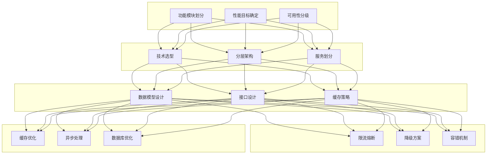

### 核心设计原则应用

**分层原则**：通过用户层、网关层、业务服务层、领域能力层、基础设施层、数据层的清晰划分，实现了职责分离和模块解耦。

**单一职责原则**：每个微服务只负责一个业务领域，如用户服务只处理用户相关逻辑，库存服务只处理库存相关逻辑。

**开闭原则**：通过促销规则引擎的设计，新增促销类型只需添加新的规则实现，无需修改核心代码。

**高可用设计**：通过限流、熔断、降级等多重保护机制，保证系统在异常情况下的稳定性。

**缓存为王**：电商系统的性能瓶颈主要在数据库，通过多级缓存策略（本地缓存、Redis、CDN），大大减轻了数据库压力。

**异步解耦**：通过消息队列实现核心流程的异步化，提升系统吞吐量和用户体验。

### 常见问题与解决方案

| 问题 | 解决方案 |
|------|----------|
| 高并发超卖 | Redis原子操作 + Lua脚本 |
| 分布式事务 | Seata AT模式 + 本地消息表 |
| 缓存一致性 | 延迟双删 + 消息补偿 |
| 热点数据性能 | 多级缓存 + 热点探测 |
| 服务雪崩 | 限流熔断 + 降级兜底 |

### 进一步学习建议

1. **深入微服务治理**：学习Service Mesh（Istio）架构，了解更精细的流量管理和安全控制
2. **实时数据处理**：学习Flink/Storm等流处理框架，实现实时推荐和风控
3. **高并发系统优化**：学习Linux内核参数调优、JVM调优、GC优化
4. **云原生架构**：学习Kubernetes、Prometheus、Grafana等云原生技术栈

---

## 参考资源

- Spring Cloud官方文档：https://spring.io/projects/spring-cloud
- Sentinel官方文档：https://sentinelguard.io/zh-cn/
- ShardingSphere官方文档：https://shardingsphere.apache.org/
- Redis设计与实现：https://redis.io/
- 领域驱动设计：Eric Evans《Domain-Driven Design》
