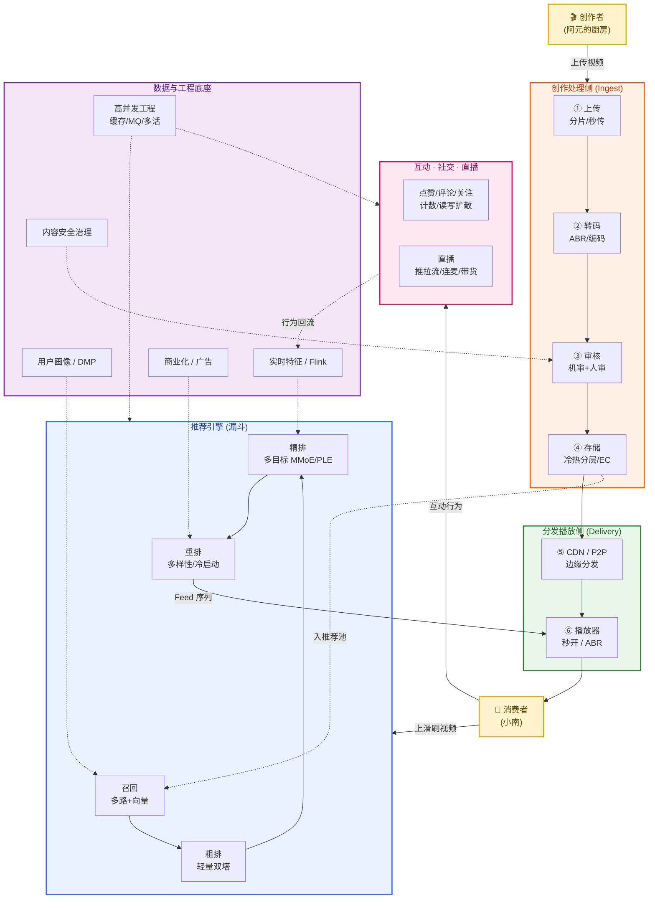
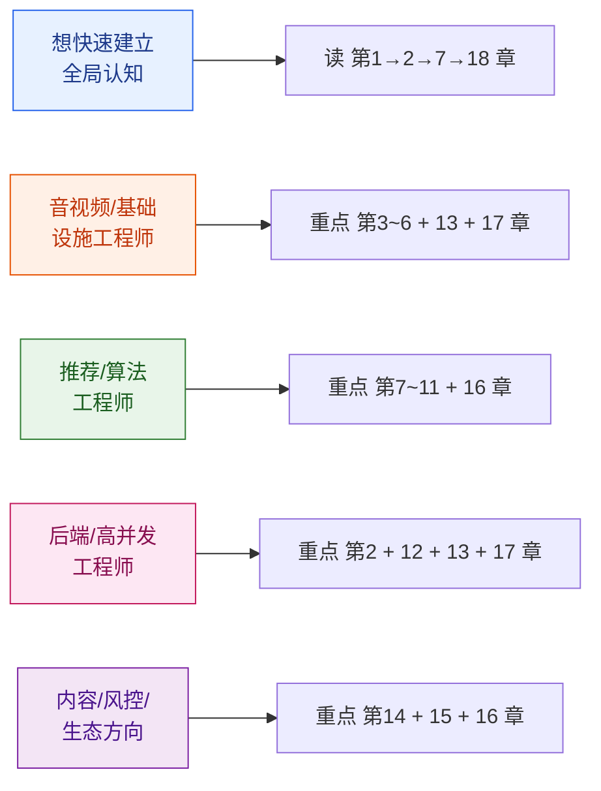

# 短视频平台系统设计 · 全景教程

> 一份面向工程师的、端到端覆盖的短视频平台系统设计教程。从一条视频的「上传 → 转码 → 审核 → 存储 → CDN 分发 → 秒开播放」的基础设施链路，到「召回 → 粗排 → 精排 → 重排」的推荐漏斗与沉浸式 Feed 流，再到互动社交、直播、内容安全、创作者生态、商业化变现，直至支撑亿级 DAU 的高并发工程架构。
>
> **风格定位**：深入原理 + 算法公式 + 代码示例 + 架构图解。
> **目标读者**：想体系化掌握短视频/大型 UGC 平台的后端 / 算法 / 音视频 / 架构工程师。

---

## 一、为什么要学短视频平台系统设计

短视频是过去十年增长最快的互联网形态——抖音/TikTok、快手、YouTube Shorts、B站、小红书，每天承载着数十亿次的视频消费。一个短视频平台是当今工程难度最高的系统之一：

它要在用户**上滑的一瞬间**，从**数十亿条视频**里挑出最合适的几条，在 **200 毫秒内秒开**画面；同时还要扛住创作者每天上传的**上亿条**新视频的转码与审核，支撑头部主播**千万级**的同时在线，并在所有这些之上叠加点赞、评论、关注、直播、电商、广告……

它是一个罕见的"**音视频 × 算法 × 高并发 × 数据 × 内容治理**"五位一体的系统：

- **音视频工程**：上传、转码、编码优化、CDN 分发、自适应码率、秒开
- **推荐算法**：向量召回、多目标排序（完播/时长/互动）、冷启动、实时化
- **高并发工程**：亿级计数、读写扩散、多级缓存、削峰、异地多活
- **数据闭环**：实时特征、在线学习、行为序列、流式计算
- **内容治理**：多模态审核、版权指纹、创作者生态、商业化平衡

学透它，等于同时打通了音视频系统、推荐系统、分布式高并发、机器学习工程四条主线。

---

## 二、全景架构图

下面这张图是整篇教程的"地图"。它把短视频平台拆成五大域：**创作处理侧**（视频怎么进来）、**分发播放侧**（视频怎么出去）、**推荐引擎**（给谁看什么）、**互动与直播**（看完之后做什么）、**数据与工程底座**（一切的支撑）。后续每章聚焦其中一块，读完全篇后回看这张图，把所有模块串起来。

---

## 三、章节目录

### 第一部分 · 基础与全景

| 章节 | 标题 | 核心内容 |
| --- | --- | --- |
| [第 1 章](./01-导论-短视频平台全景与核心指标.md) | 导论：短视频平台全景与核心指标 | 短视频本质、三方角色、核心指标（DAU/时长/完播/留存/LTV）、两大引擎（基础设施 vs 推荐）、贯穿案例 |
| [第 2 章](./02-整体架构与刷视频的生命周期.md) | 整体架构与一次"刷视频"的生命周期 | 端到端架构、一次上滑的完整链路、读写两条主路径、规模与延迟挑战、技术栈全景 |

### 第二部分 · 视频基础设施（创作侧 → 分发侧）

| 章节 | 标题 | 核心内容 |
| --- | --- | --- |
| [第 3 章](./03-视频上传与预处理.md) | 视频上传与预处理 | 分片上传、断点续传、秒传去重（内容 hash）、客户端预处理、就近接入加速、上传链路设计 |
| [第 4 章](./04-转码流水线与编码优化.md) | 转码流水线与编码优化 | 转码集群、并行分片转码、GOP/关键帧、ABR 码率阶梯、H.264/H.265/AV1 选型、Per-Title Encoding、VMAF |
| [第 5 章](./05-存储与CDN分发.md) | 存储与 CDN 分发 | 对象存储、冷热分层、纠删码 EC、多层 CDN、调度（HTTP-DNS）、预热、命中率、P2P-CDN |
| [第 6 章](./06-播放体验与QoS秒开.md) | 播放体验与 QoS（秒开） | 首帧时间 TTFF、预加载/预渲染、播放器池化、ABR 算法（BBA/MPC）、卡顿率、QoE 指标体系、封装协议 HLS/DASH/CMAF |

### 第三部分 · 推荐系统全链路

| 章节 | 标题 | 核心内容 |
| --- | --- | --- |
| [第 7 章](./07-推荐系统总体架构.md) | 推荐系统总体架构 | 推荐漏斗、各层规模与延迟预算、推荐目标体系、整体数据流、与广告漏斗的异同 |
| [第 8 章](./08-召回.md) | 召回 | 多路召回、双塔/DSSM、向量检索 ANN/HNSW、ItemCF/Swing、召回评估、召回融合 |
| [第 9 章](./09-粗排与精排.md) | 粗排与精排 | 粗排轻量双塔、精排 DIN/DIEN 行为序列、多目标建模 ESMM/MMoE/PLE、Watch-Time 建模、完播率长度归一化、多目标融合公式 |
| [第 10 章](./10-重排多样性与冷启动.md) | 重排、多样性与冷启动 | 重排目标、DPP/MMR 打散、滑窗规则、已看去重（Bloom Filter）、新用户/新视频冷启动、EE 探索（Thompson/UCB） |
| [第 11 章](./11-Feed流与实时化.md) | Feed 流与实时化 | 沉浸式单列 Feed、推拉模型、滑动预取、实时特征、在线学习、Flink 流处理、行为归因时效 |

### 第四部分 · 互动、社交与直播

| 章节 | 标题 | 核心内容 |
| --- | --- | --- |
| [第 12 章](./12-互动与社交系统.md) | 互动与社交系统 | 点赞计数系统（Redis+异步落库+对账）、关注关系读写扩散、评论系统、通知/IM、关注页 vs 推荐页 |
| [第 13 章](./13-直播系统.md) | 直播系统 | 推拉流协议（RTMP/SRT/WebRTC/LL-HLS）、延迟分级、连麦 SFU/MCU、弹幕、礼物打赏、直播带货、热点容灾 |

### 第五部分 · 安全、生态与商业化

| 章节 | 标题 | 核心内容 |
| --- | --- | --- |
| [第 14 章](./14-内容安全与审核.md) | 内容安全与审核 | 多模态机审、机审+人审协同、先发后审/分级审核、内容指纹（Content ID）、查重搬运、审核吞吐与时效 |
| [第 15 章](./15-创作者生态与中台.md) | 创作者生态与中台 | 流量分发公平性、新人扶持、创作者激励（分成/商单/打赏）、热点运营、数据看板、MCN、版权保护 |
| [第 16 章](./16-商业化与广告变现.md) | 商业化与广告变现 | 信息流广告插入、激励视频、电商挂车、直播带货变现、广告与自然内容混排（竞价 vs 推荐分统一）、体验与营收平衡 |

### 第六部分 · 工程与收口

| 章节 | 标题 | 核心内容 |
| --- | --- | --- |
| [第 17 章](./17-高并发工程架构实战.md) | 高并发工程架构实战 | 微服务/网关、多级缓存、缓存三大问题、削峰填谷（MQ）、热点 key 应对、存储选型、异地多活、容灾降级 |
| [第 18 章](./18-全链路串讲与学习路径.md) | 全链路串讲与学习路径 | 端到端全链路串讲、模块协同回顾、经典论文与开源项目、面试要点、学习路径 |

---

## 四、阅读建议

- **建议顺序**：按章节顺序通读。第二部分（基础设施）与第三部分（推荐）弱耦合，可按兴趣调序；第四、五、六部分建立在前面基础之上。
- **核心三章**：第 6 章（秒开播放）、第 9 章（多目标精排）、第 12 章（互动与读写扩散）是音视频、算法、高并发三条主线的浓缩，值得反复看。
- **工程落地**：第 17 章把前面所有模块的工程约束统一收口，做架构设计前必读。

---

## 五、贯穿全篇的一个例子

为了让 18 章不割裂，全篇用同一组虚构角色串联：

> **「闪刷」短视频**：一个日活 **1.5 亿**、视频库 **50 亿条**的沉浸式短视频平台（平台方）。
>
> **「阿元的厨房」**：一位美食创作者，专拍 60 秒家常菜教程，今天要上传一条新视频《3 分钟搞定番茄牛腩》（创作者）。
>
> **小南**：22 岁，住上海，女生，兴趣是美食、萌宠、旅行，每天晚上躺在床上刷一小时「闪刷」（消费者）。

我们将跟随这条《番茄牛腩》视频的旅程：

这条视频会穿过上传、转码、审核、存储、CDN、召回、排序、播放、互动、直播、商业化的每一个环节——它就是我们理解整个系统的"导游"。

---

## 六、规模基准（贯穿全篇的数量级假设）

为了让讨论具体，本教程统一采用以下「闪刷」平台的规模假设（数量级参考真实头部平台公开数据）：

| 维度 | 假设值 | 参考来源（数量级） |
| --- | --- | --- |
| 日活 DAU | 1.5 亿 | 快手 2020 春节 3 亿；微博 1 亿+ |
| 视频库总量 | 50 亿条 | 快手 200 亿条+ |
| 日均上传 | 5000 万条 | 行业头部亿级 |
| 推荐请求峰值 QPS | 百万级 | 微博峰值百万级 QPS |
| 单次推荐端到端延迟 | < 100ms | TikTok 目标值 |
| 首帧时间 TTFF | < 200ms | 抖音头部目标 |
| 累计点赞量 | 千亿级 | 快手 3500 亿+ |
| 头部主播单场在线 | 千万级 | S 赛/头部直播 |

> 📌 本教程所有外部资料来源已在各章末尾「参考来源」中以链接标注。数值为数量级示意，实际因平台而异。下面进入正文。
