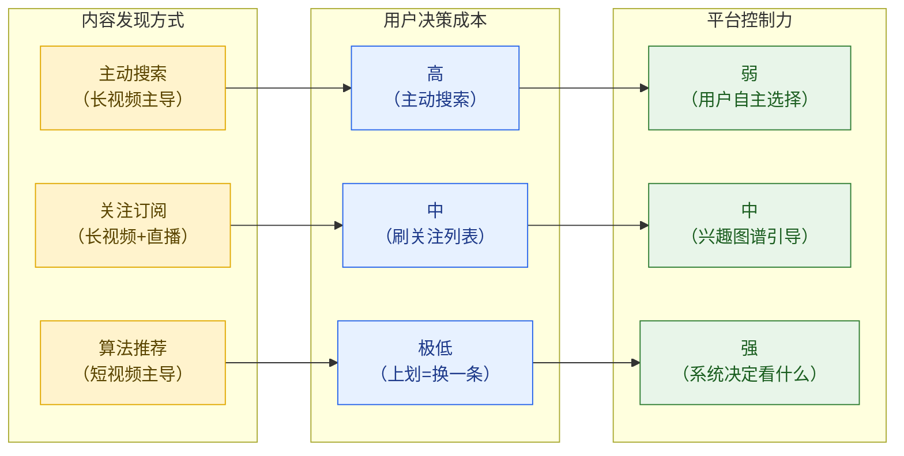
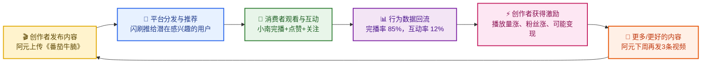
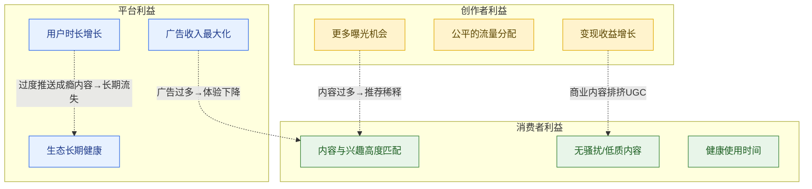
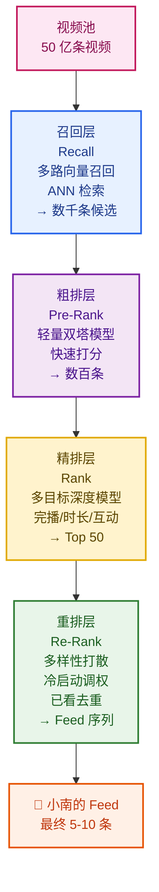
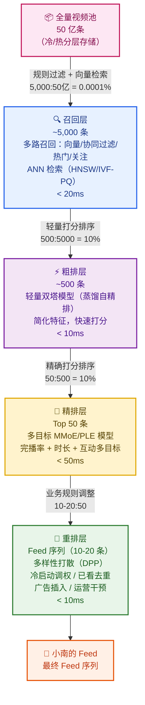
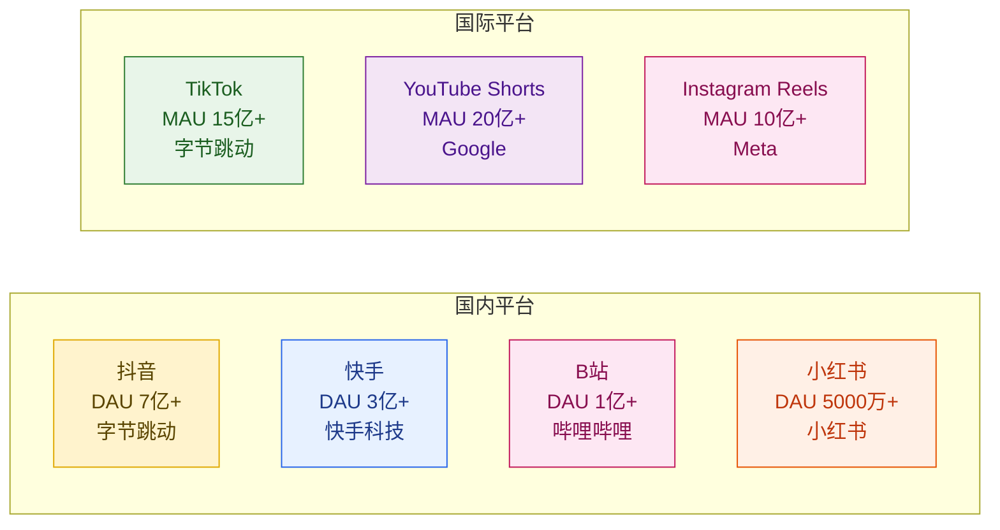
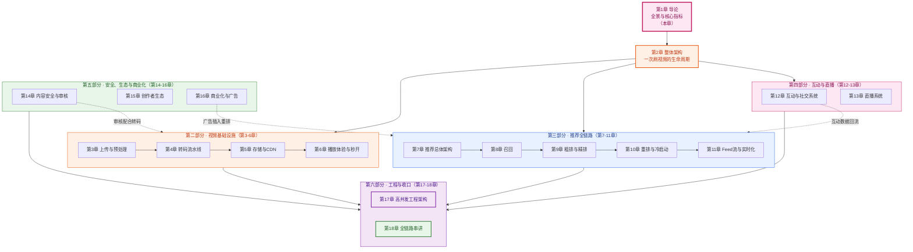

# 第 1 章 · 导论：短视频平台全景与核心指标

---

## 本章导读

本章是整篇教程的起点。我们不急着讨论分布式架构或排序算法，而是先建立一张"思维地图"：短视频平台到底是什么、为谁而存在、靠什么指标来衡量健康与否。

读完本章，你将能回答：

- 短视频的本质是什么？与长视频、直播的核心差异在哪里？
- 创作者、消费者、平台三方角色如何形成"内容飞轮"，他们之间的利益张力是什么？
- 短视频平台的核心指标（DAU、完播率、留存、LTV……）背后的业务逻辑是什么，与系统设计有怎样的直接联系？
- 两大引擎（视频基础设施 vs 推荐引擎）分别负责什么，边界在哪里？
- 为什么从 50 亿条视频到最终推给用户的几条 Feed，必须经过多层漏斗？
- 行业主要玩家的规模与技术亮点是什么？
- 一条《番茄牛腩》视频从上传到被小南刷到，完整经历了哪些系统环节？

本章是后续所有章节的概念基础——无论你跳到哪一章，遇到不清楚的指标或术语，都可以回来查这里。

---

## 1.1 短视频的本质：碎片化注意力与推荐驱动

### 1.1.1 什么是"短视频"

"短视频"这个词在行业里并没有统一的时长定义。从 TikTok 最初的 15 秒，到后来扩展的 3 分钟、10 分钟，再到抖音目前支持的 15 分钟，时长上限一直在扩张。但无论时长如何变化，短视频的核心特征始终如一：

> **短视频是以「沉浸式单列 Feed + 推荐驱动分发」为核心体验的视频消费形态。**

这个定义里有两个关键词：

**沉浸式单列 Feed**：屏幕上同一时间只展示一条视频，上滑切换下一条。没有多列布局、没有封面墙、没有搜索框——用户不需要主动"选择"，只需要被动接受系统推送，然后决定"留下来看"还是"上划走人"。这个设计让用户的决策成本降到了极致，也让平台对"用户注意力"的掌控达到了前所未有的程度。

**推荐驱动分发**：区别于传统的"关注驱动"（只看你关注的人）和"搜索驱动"（主动搜索你想要的），短视频是"推荐驱动"——你不认识创作者，但系统认为你会喜欢这条视频，就把它推给你。这是短视频平台能够快速扶持新创作者、让"素人爆款"出现的核心机制。

### 1.1.2 碎片化注意力经济

从用户行为的角度看，短视频消费是对**碎片化时间**的极致利用：

- **场景**：厕所、地铁、睡前、排队……每个空闲间隙都是潜在的消费场景
- **时长**：单次决策（"这条值不值得看完"）在 **3 秒内**完成。前 3 秒是内容的生死线
- **节奏**：上滑切换的成本极低（不到 0.1 秒），用户可以瞬间"逃离"任何不喜欢的内容
- **叠加效应**：从一条视频到下一条，推荐系统不断逼近用户的真实兴趣，越刷越难停下来

这个用户心理学特征，直接决定了系统设计的优化目标：**一切以用留时长（Watch Time）为核心，以完播率（Finish Rate）为最直接的质量信号**。

### 1.1.3 短视频 vs 长视频 vs 直播：三种内容形态的对比

这三种形态经常在同一个平台共存（B站同时有长视频、短视频、直播；抖音也在做长视频），但它们的系统设计逻辑截然不同：

| 维度 | 短视频 | 长视频 | 直播 |
|------|--------|--------|------|
| **典型时长** | 15 秒 – 10 分钟 | 20 分钟 – 2+ 小时 | 无限制（数小时） |
| **内容产生者** | UGC 为主（普通创作者） | PGC/PUGC 为主（专业团队） | 主播实时产出 |
| **分发驱动** | 推荐驱动（80%+ 流量来自推荐） | 关注驱动 + 搜索驱动 | 关注驱动 + 实时热门 |
| **存储模式** | 静态文件，可提前转码 | 静态文件，多清晰度 | 实时流，超低延迟 |
| **核心质量指标** | 完播率、互动率 | 完成度、订阅率 | 在线人数、打赏额 |
| **推荐窗口** | 实时（上滑即推） | 搜索 + 主动选择 | 实时榜单 |
| **技术难点** | 大规模推荐 + 秒开播放 | 高清转码 + 版权保护 | 超低延迟推流 + 高并发 |
| **冷启动** | 困难（新视频无历史数据） | 较容易（内容质量可预判） | 较容易（主播有粉丝基础） |
| **内容库规模** | 极大（50 亿+条） | 较小（千万级） | 实时流，无历史积累问题 |
| **代表平台** | 抖音、TikTok、快手 | 爱奇艺、Netflix、B站长视频 | 斗鱼、虎牙、B站直播 |

**关键差异深入分析**：

短视频与长视频最本质的区别在于**推荐依赖度**。Netflix 或爱奇艺的用户大多数知道自己想看什么（《纸牌屋》第三季、周杰伦演唱会），他们主动搜索；而抖音的用户往往是"我不知道我要看什么，但我就是想刷刷"——这意味着推荐系统不是锦上添花，而是**核心基础设施**，一旦推荐质量下降，用户时长立刻暴跌。

这也解释了为什么抖音在推荐算法上的投入远超任何一个竞争对手，而 Netflix 的技术博客里讨论最多的却是 CDN 和转码优化。

---

## 1.2 三方角色与内容飞轮

### 1.2.1 三大核心角色

短视频生态由三方构成，缺一不可：

| 角色 | 代表 | 核心诉求 | 核心贡献 |
|------|------|----------|----------|
| **创作者（Creator）** | 「阿元的厨房」——上传《3分钟搞定番茄牛腩》 | 流量增长、粉丝增加、变现收益 | 生产内容 |
| **消费者（Viewer）** | 小南——22岁，上海，美食/萌宠/旅行爱好者 | 好看好玩的内容、流畅体验、发现新事物 | 贡献注意力与行为数据 |
| **平台（Platform）** | 「闪刷」——日活1.5亿，视频库50亿条 | 用户时长增长、广告收入、生态健康 | 撮合分发、提供基础设施 |

**我们的例子贯穿全篇**：

> 「阿元的厨房」（美食博主，今天上传了《3分钟搞定番茄牛腩》，一段60秒的短视频）  
> 小南（22岁，上海女生，晚上躺在床上刷「闪刷」，每天刷约一小时）  
> 「闪刷」（平台，需要从 50 亿条视频里找到合适的内容推给小南）

### 1.2.2 内容飞轮：平台增长的底层逻辑

短视频平台的核心商业逻辑可以用一张"内容飞轮"图来概括。飞轮一旦转起来，就会形成自我强化的正向循环：

**飞轮的每一环与系统设计的关系**：

- **创作者发布内容** → 第 3、4 章（上传与转码流水线）：如何让创作者的上传体验流畅、快速进入推荐池
- **平台分发与推荐** → 第 7-11 章（推荐系统全链路）：如何把对的内容推给对的人
- **消费者观看与互动** → 第 6 章（秒开播放）、第 12 章（互动系统）：如何保证流畅播放和互动低延迟
- **行为数据回流** → 第 11 章（Feed流与实时化）：如何实时收集并利用行为信号
- **创作者获得激励** → 第 15 章（创作者生态）：如何设计公平的流量分配和变现体系

飞轮的关键在于**每一环的摩擦都要尽量小**：上传越方便、推荐越精准、播放越流畅、互动越即时、数据越实时，飞轮转得越快，平台增长越健康。

### 1.2.3 三方利益张力：系统设计的终极矛盾

然而，三方利益并非总是一致的。系统设计中最难的决策，恰恰来自三方利益的冲突：

**创作者的诉求（流量）**：
- 每条视频都应该得到足够的曝光机会（公平性）
- 头部创作者希望流量集中到自己（马太效应）
- 新人创作者希望有冷启动机会（新人扶持）

**消费者的诉求（体验）**：
- 看到真正感兴趣的内容（推荐精准性）
- 不被低质量/重复/骚扰内容打扰（内容质量）
- 不过度沉迷（健康使用）

**平台的诉求（商业化）**：
- 插入广告（可能影响体验）
- 最大化用户时长（可能过度娱乐化）
- 扶持商业化内容（可能压制纯 UGC）

**贯穿全教程的核心问题**：每一个系统设计决策，都要问自己——**这个设计对三方分别意味着什么？短期和长期是否一致？**

例如：精排模型里完播率权重提高 10%，对消费者是好事（更喜欢的内容），对头部创作者是好事（优质内容更容易被推），但对新人创作者可能是坏事（新视频缺乏历史完播数据，在冷启动阶段更难获得流量）。

---

## 1.3 核心指标体系：平台健康的量化语言

本节是本章最重要的部分。指标体系是后续所有系统设计讨论的"共同语言"——工程师和产品经理说"完播率下降了 3%"，背后指代的是什么、对系统意味着什么，必须在这里弄清楚。

### 1.3.1 规模指标：平台基本盘

**DAU（Daily Active User，日活跃用户数）**：

$$\text{DAU} = \text{当天有打开 App 并产生至少一次有效行为的用户数}$$

「闪刷」的 DAU 为 1.5 亿。DAU 是一切商业化的分母——广告收入、ARPU（每用户平均收入）都基于 DAU 计算。

**MAU（Monthly Active User，月活跃用户数）**：

$$\text{MAU} = \text{当月有产生有效行为的用户数（去重）}$$

**DAU/MAU 粘性比（Stickiness Ratio）**：

$$\boxed{\text{Stickiness} = \frac{\text{DAU}}{\text{MAU}}}$$

粘性比越高，说明用户每天都回来的比例越高，平台越"上瘾"。通常：
- 粘性比 > 50%：顶级粘性（抖音、微信这个量级）
- 粘性比 30%-50%：健康
- 粘性比 < 20%：用户是偶尔才打开

**与系统设计的关系**：粘性比下降往往是推荐质量或内容质量下降的先行指标，比 DAU 更敏感。在推荐系统 A/B 实验中，这是一个重要的护航指标。

---

### 1.3.2 使用深度指标：用户是否真的在用

**人均使用时长（Average Session Duration / Daily Usage Time）**：

$$\text{人均时长} = \frac{\text{全平台总使用时长（分钟）}}{\text{DAU}}$$

这是短视频平台最核心的健康指标之一。抖音在 2021 年的人均使用时长已超过 **100 分钟/天**，快手为 **120 分钟/天**。「闪刷」的目标是人均 **90 分钟/天**。

**人均播放视频数（Videos Played Per User Per Day）**：

$$\text{人均播放数} = \frac{\text{全平台总播放次数}}{\text{DAU}}$$

假设「闪刷」人均时长 90 分钟，平均视频时长 45 秒，则人均播放数约为 **120 条/天**。

**与系统设计的关系**：人均时长是精排模型优化的终极目标之一（不是唯一目标，还要考虑长期留存）。推荐系统每次迭代，都会在 A/B 实验中观察人均时长的变化。

---

### 1.3.3 内容质量指标：视频本身的吸引力

**完播率（Finish Rate / Completion Rate）**：

$$\boxed{\text{完播率} = \frac{\text{完整观看的次数}}{\text{开始播放的次数}}}$$

注意：实践中"完整观看"通常定义为"观看时长 ≥ 视频总时长 × 0.9"（而非 100%，因为最后几帧可能是空白）。

完播率是短视频推荐系统**最重要的单一信号**：
- 高完播率 → 内容对这类用户有吸引力 → 应该继续推
- 低完播率 → 内容无聊或标题党 → 降权或限流

**但完播率有一个内生偏差**：短视频（15秒）天然比长视频（3分钟）完播率高，因此直接比较不同时长视频的完播率是不公平的。解决方法是**时长归一化完播率**：

$$\text{归一化完播率} = \frac{\text{实际观看时长}}{\text{视频总时长}}$$

即使用户在 15 秒视频看完前就滑走了，看了 12 秒（归一化完播率 0.8）比看了 2 秒（归一化完播率 0.13）对内容质量的评价是完全不同的。

**平均播放时长（Average Watch Time / Watch Duration）**：

$$\text{平均播放时长} = \frac{\text{全平台总观看时长（秒）}}{\text{总播放次数}}$$

Watch Time 是 YouTube 算法的核心信号，也是短视频平台精排的重要 label。原因：Watch Time 综合了"完播率"和"是否反复看"（loop），能更准确地反映内容价值。

**互动率指标**：

$$\text{点赞率（Like Rate）} = \frac{\text{点赞次数}}{\text{播放次数}}$$

$$\text{评论率（Comment Rate）} = \frac{\text{评论次数}}{\text{播放次数}}$$

$$\text{转发率（Share Rate）} = \frac{\text{转发次数}}{\text{播放次数}}$$

$$\text{关注转化率（Follow Rate）} = \frac{\text{关注创作者次数}}{\text{播放次数}}$$

一般来说，互动率的排序为：点赞率 > 评论率 > 转发率 > 关注转化率（从高到低）。一条普通短视频的典型值：点赞率 3%-8%，评论率 0.5%-2%，转发率 0.3%-1%。

**负反馈率（Negative Feedback Rate）**：

$$\text{负反馈率} = \frac{\text{举报 + 不感兴趣 + 长按关闭}}{\text{播放次数}}$$

负反馈是内容质量的"否决票"。负反馈率高的内容会被降权，负反馈率极高的会被直接过滤出推荐池。**负反馈率的权重往往高于同等大小的正向信号**，因为用户主动表达不满的成本更高，信号更可信。

---

### 1.3.4 用户价值指标：长期健康

**次日留存率（Day-1 Retention）**：

$$\text{Day-1 留存} = \frac{\text{第 N 天新增用户中，第 N+1 天仍活跃的用户数}}{\text{第 N 天新增用户数}}$$

类似地，**7日留存（Day-7 Retention）** 和 **30日留存（Day-30 Retention）** 分别衡量更长周期的用户粘性。

典型数字参考（头部短视频平台）：
- Day-1 留存：45% - 60%
- Day-7 留存：25% - 40%
- Day-30 留存：15% - 25%

**留存曲线**对系统设计的意义：如果 Day-1 留存高但 Day-30 留存崩塌，往往是推荐系统过度优化短期时长（给用户推成瘾内容），导致用户产生"刷完后空虚感"，长期流失。这是推荐系统需要特别防范的"虚假繁荣"场景。

**CTR（Click-Through Rate，点击率）**：

在短视频场景，CTR 通常指 Feed 流中**停留超过 3 秒的比例**（即"停留率"，有时也叫 Play Through Rate）：

$$\text{短视频 CTR（停留率）} = \frac{\text{停留 3 秒以上的次数}}{\text{曝光次数}}$$

3 秒是短视频中"用户决定是否要看这条"的分水岭——能撑过 3 秒，说明内容的第一帧（封面/标题/开头）抓住了用户。

**LTV（Life Time Value，用户生命周期价值）**：

$$\boxed{\text{LTV} = \text{ARPU（每日每用户收入）} \times \text{平均活跃天数}}$$

或者更精确地：

$$\text{LTV} = \sum_{t=0}^{T} \text{ARPU}_t \times \text{Retention}_t$$

LTV 是用户获取成本（CAC）的上限依据。如果小南在「闪刷」的 LTV 是 200 元（两年内产生的广告收益），那平台花 80 元做广告把她拉进来是合理的（ROI = 200/80 = 2.5）。

**ARPU（Average Revenue Per User，每用户平均收入）**：

$$\text{ARPU} = \frac{\text{总收入（广告+直播+电商佣金）}}{\text{DAU}}$$

---

### 1.3.5 创作者侧指标

平台不只要看消费者的数据，还要监控创作者生态的健康度：

| 指标 | 定义 | 为什么重要 |
|------|------|----------|
| **日发布量（Daily Uploads）** | 每天新上传视频总数 | 内容生态活跃度 |
| **创作者活跃率** | 近 30 天有发布行为的创作者 / 注册创作者总数 | 创作者是否在持续创作 |
| **创作者涨粉速度** | 新粉丝数 / 视频播放数 | 内容是否帮助创作者成长 |
| **Breakout Rate** | 新创作者在 90 天内获得第一批忠实粉丝（如 1000 粉）的比例 | 新人扶持效果 |
| **变现渗透率** | 开通变现功能的创作者 / 活跃创作者总数 | 平台变现生态 |

「闪刷」的目标：日发布量 5000 万条，头部创作者（粉丝 > 100万）占比 0.1%，中腰部（粉丝 10万-100万）占比 5%。

---

### 1.3.6 完整指标速查表

| 指标 | 英文 | 公式 / 定义 | 谁最关心 | 与系统设计的关联 |
|------|------|------------|---------|----------------|
| DAU | Daily Active User | 日活跃用户数 | 全平台 | 系统扩容基准 |
| MAU | Monthly Active User | 月活跃用户数 | 全平台 | 与 DAU 构成粘性比 |
| 粘性比 | Stickiness | DAU / MAU | 产品 / 增长 | 推荐质量先行指标 |
| 人均时长 | Daily Usage Time | 总时长 / DAU | 推荐团队 | 精排优化目标 |
| 人均播放数 | Videos Per User | 总播放 / DAU | 推荐团队 | 吞吐量规划依据 |
| 完播率 | Finish Rate | 完播次数 / 播放次数 | 推荐 / 创作者 | 精排最核心 label |
| 归一化完播率 | Normalized Finish Rate | 实际时长 / 视频总时长 | 推荐团队 | 解决时长偏差 |
| 平均播放时长 | Watch Time | 总观看时长 / 总播放次数 | 推荐团队 | 精排 label |
| 点赞率 | Like Rate | 点赞次数 / 播放次数 | 推荐 / 创作者 | 精排特征 |
| 评论率 | Comment Rate | 评论次数 / 播放次数 | 推荐 / 创作者 | 精排特征 |
| 转发率 | Share Rate | 转发次数 / 播放次数 | 推荐 / 运营 | 社交传播信号 |
| 关注转化率 | Follow Rate | 关注次数 / 播放次数 | 创作者 / 推荐 | 创作者价值信号 |
| 负反馈率 | Negative Feedback | 举报+不感兴趣次数 / 播放次数 | 内容安全 / 推荐 | 内容质量"否决票" |
| CTR（停留率） | Click-Through Rate | 3秒停留次数 / 曝光次数 | 推荐团队 | 召回与精排评估 |
| Day-1 留存 | Day-1 Retention | 次日活跃 / 当日新增 | 增长 / 产品 | 长期健康指标 |
| Day-7/30 留存 | Day-7/30 Retention | 同上 | 增长 / 产品 | 检测"虚假繁荣" |
| ARPU | Avg Revenue Per User | 总收入 / DAU | 商业化 | 变现效率 |
| LTV | Life Time Value | ARPU × 留存天数 | 增长 / 商业化 | 用户获取上限 |
| 日发布量 | Daily Uploads | 每天新上传视频数 | 内容生态 / 运营 | 入库流水线压力 |
| 创作者活跃率 | Creator Activity Rate | 活跃创作者 / 注册创作者 | 内容生态 | 飞轮健康度 |

---

## 1.4 两大引擎：基础设施引擎与推荐引擎

短视频平台的技术架构，可以在最顶层划分为两大引擎，它们分别解决不同性质的问题：

### 1.4.1 视频基础设施引擎（第 3-6 章）

> **核心问题：如何让一条视频从创作者手机进入用户眼球？**

基础设施引擎解决的是**确定性问题**：视频一定要能上传、一定要能播放、一定要快。它的成功标准是：
- 上传成功率 > 99.9%
- 转码时延 < 30 分钟（普通视频）
- 首帧时间 TTFF < 200ms（秒开）
- 卡顿率 < 0.1%

### 1.4.2 推荐引擎（第 7-11 章）

> **核心问题：在正确的时间，把正确的视频推给正确的人？**

推荐引擎解决的是**概率性问题**：我们无法确切知道小南会喜欢哪条视频，但可以通过机器学习估算概率，然后把概率最高的那批推给她。它的成功标准是：
- 端到端推荐延迟 < 100ms
- 完播率高于随机基线 2-3 倍
- 长期留存不因短期时长优化而下降

**两大引擎的本质区别**：

| 维度 | 基础设施引擎 | 推荐引擎 |
|------|------------|---------|
| **问题性质** | 确定性（能不能做到） | 概率性（能不能做到最好） |
| **优化目标** | 速度、可靠性、成本 | 用户满意度、时长、留存 |
| **成功标准** | SLA（99.9%可用、TTFF<200ms） | A/B 实验下各指标提升 |
| **技术栈** | 音视频编解码、CDN、分布式存储 | 机器学习、向量检索、流计算 |
| **演进节奏** | 相对稳定（行业标准演进慢） | 高频迭代（每周甚至每日上线新模型） |

---

## 1.5 漏斗思想：从 50 亿到 Feed 序列

### 1.5.1 为什么不能"暴力评分"

「闪刷」有 50 亿条视频，推荐系统每次要给小南选出 10 条。

**最直觉的方案**：对所有 50 亿条视频用精排模型打分，取 Top 10。

**现实中为什么不行**：

设精排模型单次推断耗时 1ms（这已经是优化得很好的深度模型了），对 50 亿条视频评分需要：

$$50 \times 10^9 \times 1\text{ms} = 5 \times 10^6\text{s} \approx 57 \text{ 天}$$

即便有 1000 台 GPU 并行，也需要 **82 分钟**——而我们的端到端延迟目标是 **< 100ms**。

这就是为什么推荐系统必须是**多级漏斗**结构。

### 1.5.2 推荐漏斗的各层设计

**每一层的设计哲学**：

| 层次 | 候选规模 | 核心任务 | 技术特点 | 延迟预算 |
|------|---------|---------|---------|---------|
| **召回** | 50亿 → 5000 | 不遗漏好内容 | 高召回率优先，精度次之 | < 20ms |
| **粗排** | 5000 → 500 | 快速过滤明显不相关 | 轻量模型，简化特征 | < 10ms |
| **精排** | 500 → 50 | 精确估算每条视频的价值 | 复杂多目标模型，全特征 | < 50ms |
| **重排** | 50 → 10-20 | 考虑整体 Feed 体验 | 多样性、运营干预、商业化 | < 10ms |
| **端到端** | — | — | — | < 100ms |

**为什么每一层存在**：

- **为什么需要召回层，而不是直接精排？** 精排模型太重，只能处理几百条候选；召回层用低成本的方法（向量近似检索）把数十亿压缩到数千，为精排提供原料。
- **为什么需要粗排层，而不是召回直接进精排？** 召回出来的 5000 条候选，精排处理需要 5000 次完整神经网络推断，仍然太慢。粗排是精排的"快速预筛"，用 1/10 的计算成本砍掉 9/10 的明显不相关候选。
- **为什么需要重排层？** 精排只看单条视频的价值，不考虑 Feed 整体体验——比如 10 条全是美食视频会让人腻。重排保证 Feed 的多样性，同时进行广告插入、冷启动调权等业务层面的调整。

### 1.5.3 召回的多路策略

召回层并不只有一路，而是**多路并行**：

| 召回路 | 原理 | 目的 |
|--------|------|------|
| **向量召回（双塔）** | 用户向量与视频向量的点积相似度 | 捕捉深层兴趣 |
| **协同过滤（ItemCF/Swing）** | 看了你看过的视频的用户还看了什么 | 捕捉行为相似性 |
| **热门召回** | 全局热度榜 Top N | 保证内容不过于个性化 |
| **关注召回** | 你关注的创作者的新发视频 | 关注关系满足 |
| **主题/标签召回** | 你感兴趣的标签下的内容 | 兴趣标签匹配 |
| **地理/实时热点** | 同城或当前热点 | 实时性与本地化 |
| **冷启动召回** | 新视频的专属召回通道 | 确保新内容有曝光机会 |

多路召回的结果**合并去重**后送入粗排。召回层的设计原则是：**宁可多召回，不要漏掉好内容**（召回层是高召回率导向，精排层才是高精度导向）。

---

## 1.6 行业规模与主要玩家

### 1.6.1 全球短视频市场

2023 年，全球短视频市场规模约 **1500 亿美元**，预计 2027 年超过 3000 亿美元，年复合增长率约 20%。驱动力来自：移动互联网普及（尤其是印度、东南亚）、5G 推广降低流量成本、广告主从图文向视频转移。

### 1.6.2 主要玩家深度对比

| 平台 | DAU / MAU | 视频库规模 | 技术亮点 | 差异化定位 |
|------|----------|----------|---------|----------|
| **抖音** | DAU 7 亿+（国内+海外） | 百亿级 | 多目标精排、实时推荐、AIGC 创作工具 | 算法推荐极致、商业化最成熟 |
| **TikTok** | MAU 15 亿+ | 同上（共享技术底座） | 全球化 CDN、多语言 NLP 理解 | 海外市场、Z世代文化输出 |
| **快手** | DAU 3 亿+；累计点赞 **3500 亿+**；视频 **200 亿条+** | 200 亿条 | 去中心化分发（腰部创作者友好）、直播技术领先 | 真实社区感、下沉市场 |
| **B站** | DAU 1 亿+；视频 **3 亿+条** | 3 亿条 | 弹幕技术、高质量 PUGC 生态 | Z世代、游戏/动漫/知识 |
| **YouTube Shorts** | MAU 20 亿+（共享 YT 基础设施） | 依托 YouTube 10 亿+条 | 全球最强 CDN、超强长视频转短视频工具 | 长短视频联动生态 |
| **Instagram Reels** | MAU 10 亿+ | — | 与图文内容无缝融合 | 生活方式、时尚、创作者经济 |
| **小红书** | DAU 5000 万+ | — | 图文+短视频双内容形态、社区信任体系 | 种草经济、女性用户、购物决策 |

**快手公开数据详解**（截至 2023 年公开报告）：
- DAU **3.74 亿**（2023 年 Q4）
- 累计点赞量 **3500 亿+**
- 视频总量 **200 亿条+**
- 日均直播场次 **700 万+**
- 每日直播观看人次 **1 亿+**

这些数字让「闪刷」（日活 1.5 亿、视频库 50 亿）的规模假设显得合理——介于 B 站和快手之间的量级。

### 1.6.3 技术竞争格局

短视频平台的技术竞争，本质上是**推荐算法**和**基础设施**两条赛道的竞争：

- **算法维度**：抖音以多目标精排见长，快手以公平分发（去中心化）见长，YouTube Shorts 以与搜索/长视频数据联动见长
- **基础设施维度**：字节、快手在国内 CDN 和转码方面均有自建能力；YouTube 背靠 Google 全球 CDN，基础设施最强
- **生态维度**：B 站以弹幕文化和 PUGC 生态见长；小红书以种草社区和购物决策见长

---

## 1.7 一次曝光的完整旅程：番茄牛腩的一生

这一节用《番茄牛腩》视频串联所有概念，感受一条视频从上传到被用户刷到的完整链路。这个故事将在后续每一章都被深化。

### 1.7.1 分步旅程图

```mermaid
flowchart TB
    S1["① 阿元拍摄完成<br/>60秒短视频，1.2GB 原始文件<br/>iPhone 12 Pro Max 录制"]
    S2["② 客户端上传<br/>分片（每片 4MB）<br/>断点续传<br/>就近接入上海 PoP"]
    S3["③ 转码流水线<br/>分片并行转码<br/>输出：360p/720p/1080p<br/>H.264 + H.265 双轨<br/>提取封面帧 + 关键帧<br/>耗时：约 3 分钟"]
    S4["④ 内容审核<br/>多模态机审（图像/音频/OCR）<br/>通过 → 进入推荐池<br/>（违规 → 人审队列）<br/>耗时：约 5 分钟"]
    S5["⑤ 入库与冷启动<br/>进入推荐系统视频池<br/>初始 embedding 生成<br/>分配小流量探测（约 100 次曝光）"]
    S6["⑥ 推荐系统处理<br/>召回：多路检索<br/>粗排：双塔打分<br/>精排：完播/时长多目标<br/>重排：多样性调整"]
    S7["⑦ 小南刷到<br/>距视频上传约 15 分钟<br/>秒开播放（TTFF &lt;200ms）<br/>自适应码率 ABR"]
    S8["⑧ 小南完播+互动<br/>完播率 100%（60秒全看完）<br/>点赞 ✓<br/>关注「阿元的厨房」✓<br/>收藏至「想做的菜」清单 ✓"]
    S9["⑨ 行为数据回流<br/>完播信号 → 完播率统计<br/>点赞/关注 → 精排模型正样本<br/>实时写入 Flink 流处理<br/>延迟：~3 秒实时生效"]
    S10["⑩ 推荐加速<br/>闪刷判定视频质量优秀<br/>扩大流量分配（从 100 次 → 5000 次 → 10 万次）<br/>阿元粉丝 +1247（当天）"]

    S1 --> S2 --> S3 --> S4 --> S5 --> S6 --> S7 --> S8 --> S9 --> S10

    style S1 fill:#fff3cd,stroke:#e0a800,stroke-width:2px,color:#5a4500
    style S2 fill:#fff0e6,stroke:#e65100,stroke-width:2px,color:#bf360c
    style S3 fill:#fff0e6,stroke:#e65100,stroke-width:2px,color:#bf360c
    style S4 fill:#fde7f3,stroke:#c2185b,stroke-width:2px,color:#880e4f
    style S5 fill:#e7f1ff,stroke:#2563eb,stroke-width:2px,color:#1e3a8a
    style S6 fill:#e7f1ff,stroke:#2563eb,stroke-width:2px,color:#1e3a8a
    style S7 fill:#e8f5e9,stroke:#2e7d32,stroke-width:2px,color:#1b5e20
    style S8 fill:#e8f5e9,stroke:#2e7d32,stroke-width:2px,color:#1b5e20
    style S9 fill:#f3e5f5,stroke:#7b1fa2,stroke-width:2px,color:#4a148c
    style S10 fill:#fff3cd,stroke:#e0a800,stroke-width:2px,color:#5a4500
```

### 1.7.2 各步骤系统细节

**步骤①-②：上传（第 3 章）**

阿元在手机上点击「发布」后，客户端做了这些事：
- 视频压缩（从 1.2GB 原始文件压缩到约 150MB）
- 计算内容 Hash（用于秒传去重——如果服务端已有同样内容的视频，不用重新上传）
- 分片（4MB 一片，共约 37 片）
- 并行上传分片（多路并发，利用带宽）
- 就近接入：手机在上海，流量就近进入「闪刷」上海 PoP（Point of Presence），而非绕路到北京总部机房

**步骤③：转码（第 4 章）**

转码集群收到分片文件后：
- **并行分片转码**：37 片同时分发给 37 台转码机器，并行处理，将总耗时从"37 × 单片转码时间"压缩到接近"1 × 单片转码时间"
- **ABR 码率阶梯**：输出 360p（500kbps）、720p（1.5Mbps）、1080p（3Mbps）三档，网络好的用户自动播放高清，网络差的用户不卡顿
- **编码格式**：H.264（兼容性好）和 H.265（同质量文件更小 40%）双轨并行，根据客户端能力选择播放格式
- **关键帧提取**：每隔 1 秒提取一帧，生成视频封面候选和用于快速 Seek 的索引

**步骤④：审核（第 14 章）**

机审模型在秒级内完成：
- 视频帧级违禁内容检测（色情/暴力/血腥等）
- 语音识别 + 文本违禁词检测
- OCR 文字检测
- 视频指纹比对（是否搬运他人内容）

《番茄牛腩》是合法烹饪内容，所有检测通过，5 分钟内进入推荐池。

**步骤⑤：冷启动（第 10 章）**

新视频没有历史播放数据，推荐系统不知道该不该推。「闪刷」的冷启动策略：
1. 给阿元的视频分配**初始小流量**（约 100 次曝光），随机选取相似兴趣用户
2. 观测 100 次曝光的反应：完播率、点赞率、评论率
3. 如果数据好，**指数级扩流**：100 → 500 → 2000 → 10000……
4. 如果数据差，停止扩流（视频质量不够好）

这个机制确保了"好内容终将被发现"，也保护了用户不被大量低质量内容轰炸。

**步骤⑥：推荐（第 7-11 章）**

小南晚上 10 点打开「闪刷」刷视频，推荐系统在 **< 100ms** 内完成：
1. **召回**：从 50 亿视频中，通过多路召回（小南的兴趣向量 × 视频内容向量的相似度）取出约 5000 条候选，其中包括《番茄牛腩》
2. **粗排**：对 5000 条轻量打分，取 Top 500，《番茄牛腩》因为冷启动阶段完播率较高，通过粗排
3. **精排**：对 500 条用完整多目标模型打分，预估小南看《番茄牛腩》的完播概率（模型输出：82%）、点赞概率（8%）、关注概率（3%）
4. **重排**：组合多条视频，确保 Feed 里不全是美食（加入一条萌宠、一条旅游），《番茄牛腩》排在第 3 条

**步骤⑦：秒开播放（第 6 章）**

小南上划到第 3 条，《番茄牛腩》开始播放：
- 播放器在上一条视频播放时已经在**预加载**《番茄牛腩》的前 5 秒
- 小南上划的瞬间，前 5 秒已在本地缓冲区，首帧时间 **< 50ms**（远好于 200ms 目标）
- 手机连接 5G，播放器自动选择 1080p 档

**步骤⑧-⑩：行为回流（第 11 章）**

小南完播并点赞，这个信号在 **3 秒内**通过 Kafka → Flink → 特征存储回流，影响：
- 「推荐系统」下次给小南推荐时，美食类权重微增
- 「冷启动系统」判定《番茄牛腩》冷启动数据良好，把流量扩大 50 倍
- 「创作者后台」阿元能在 5 分钟内看到涨粉和播放量数据

---

## 1.8 本教程学习地图：18 章关系图

### 1.8.1 章节依赖关系

### 1.8.2 按角色的阅读建议

**想快速建立全局认知**（2 天速读）：
→ 第 1 章 + 第 2 章 + 第 7 章 + 第 18 章

**音视频/基础设施工程师**：
→ 重点：第 3-6 章（上传/转码/存储/CDN/播放）+ 第 13 章（直播）+ 第 17 章（高并发）

**推荐/算法工程师**：
→ 重点：第 7-11 章（推荐全链路）+ 第 16 章（广告与推荐融合）

**后端/高并发工程师**：
→ 重点：第 2 章 + 第 12 章（互动系统）+ 第 13 章（直播）+ 第 17 章（高并发）

**内容安全/风控/生态方向**：
→ 重点：第 14 章（内容安全）+ 第 15 章（创作者生态）+ 第 16 章（商业化）

**核心三章**（如果只能读三章）：
1. **第 6 章**（秒开播放）：音视频工程的浓缩，理解 TTFF/ABR/卡顿率
2. **第 9 章**（多目标精排）：推荐算法的核心，MMoE/完播率建模
3. **第 12 章**（互动与读写扩散）：高并发工程的典型场景，点赞/关注/评论

---

## 本章小结

本章建立了短视频平台系统设计的概念基础。用六个核心要点来收束：

**1. 短视频的本质是推荐驱动的注意力消费**

与长视频（搜索/关注驱动）的根本区别在于：用户不主动选择，平台决定给用户看什么。这使得推荐系统不是功能点，而是产品核心。

**2. 内容飞轮是平台增长的底层逻辑**

创作者发布 → 平台分发 → 消费者反馈 → 创作者激励 → 更多创作，任何一环的摩擦都会减缓飞轮的转速。系统设计的终极目标是**让飞轮每一环摩擦最小化**。

**3. 完播率和用留时长是推荐系统最核心的信号**

完播率反映内容对特定用户的吸引力，Watch Time 综合了完播和反复观看。两者是精排模型的主要 label，但需要警惕"过度优化短期时长导致长期留存下滑"的陷阱。

**4. 多层漏斗是推荐系统的必然选择**

50 亿条视频 → 5000（召回）→ 500（粗排）→ 50（精排）→ 10-20（重排），端到端 < 100ms。暴力全量评分在物理上不可能，漏斗是**精度与效率权衡**的最优解。

**5. 两大引擎各司其职**

基础设施引擎（上传/转码/存储/CDN/播放）解决"能不能做到"的确定性问题；推荐引擎解决"能不能做到最好"的概率性问题。两者共同支撑一次流畅的视频消费体验。

**6. 指标体系是系统设计的语言**

完播率、留存率、ARPU、LTV——这些不只是产品指标，它们直接影响推荐模型的优化目标、系统容量的规划依据、商业化策略的制定。工程师理解指标，才能理解"为什么系统要这样设计"。

**下一章预告**：

有了概念地图，接下来进入系统架构。第 2 章将展开「闪刷」的整体技术架构，并通过"小南上滑一次"的完整链路——从手机屏幕上的一个手势，到 100ms 后视频开始播放——串联起每一个技术模块的角色和协作方式。你将第一次看到完整的读路径（刷视频）和写路径（上传视频）如何在同一个系统里共存，以及规模挑战（百万 QPS、5000 万日上传、50 亿视频库）如何在架构上被应对。

---

## 参考来源

1. 快手科技 (2023). *快手 2023 年第四季度及全年业绩公告*. 快手投资者关系网站. https://ir.kuaishou.com/

2. ByteDance (2023). *TikTok Quarterly Update*. TikTok Newsroom. https://newsroom.tiktok.com/en-us/

3. Covington, P., Adams, J., & Sargin, E. (2016). *Deep Neural Networks for YouTube Recommendations*. ACM RecSys 2016. https://dl.acm.org/doi/10.1145/2959100.2959190

4. Zhao, Z., Hong, L., Wei, L., et al. (2019). *Recommending What Video to Watch Next: A Multitask Ranking System*. Google / YouTube. ACM RecSys 2019. https://dl.acm.org/doi/10.1145/3298689.3346997

5. Tang, J., et al. (2020). *Progressive Training of Multi-Task Neural Networks for Automatic Audiovisual Video Description*. https://arxiv.org/abs/2003.00476

6. Ma, X., et al. (2018). *Modeling Task Relationships in Multi-task Learning with Multi-gate Mixture-of-Experts (MMoE)*. Google / YouTube. KDD 2018. https://dl.acm.org/doi/10.1145/3219819.3220007

7. Lv, F., et al. (2021). *Clique-Based Collaborative Filtering (Swing)*. Alibaba. https://arxiv.org/abs/2010.12243

8. TikTok Engineering (2022). *TikTok's Approach to Recommendation Systems*. TikTok Engineering Blog. https://engineering.tiktok.com/

9. Kuaishou Technology (2022). *技术博客：快手推荐系统的工程实践*. https://mp.weixin.qq.com/s/

10. Statista (2024). *Short-form Video Market Worldwide 2024-2027*. https://www.statista.com/outlook/dmo/app/social-media/short-video/worldwide
