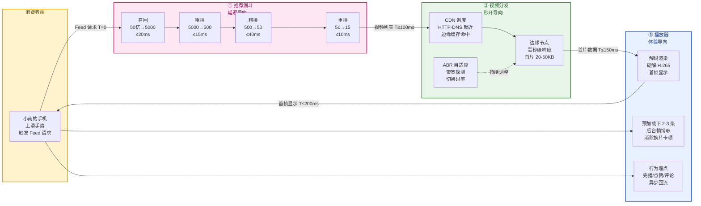
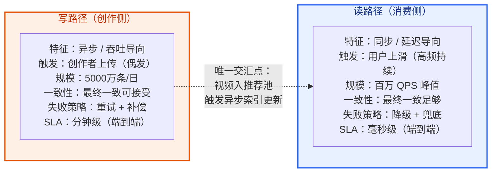
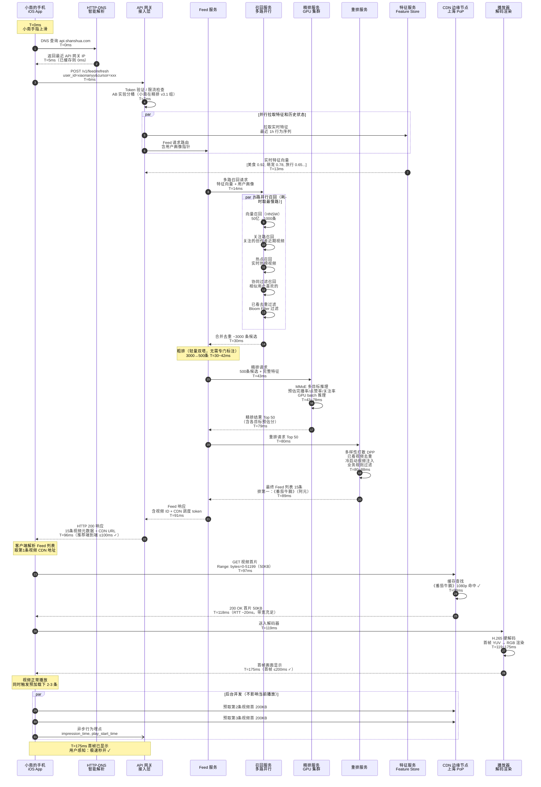
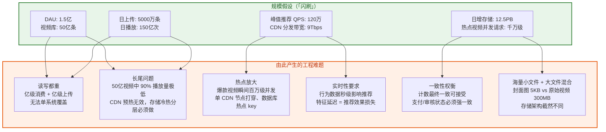
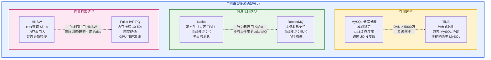
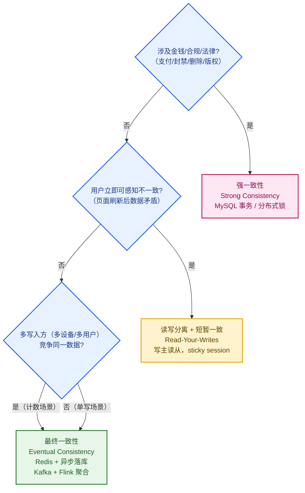
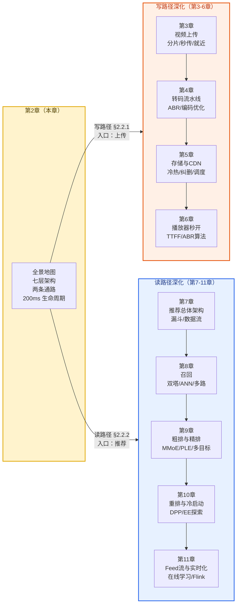

# 第 2 章 · 整体架构与一次"刷视频"的生命周期

> **所属系列**：《短视频平台系统设计 · 全景教程》第一部分 · 基础与全景
> **上一章**：[第 1 章 · 导论：短视频平台全景与核心指标](./01-导论-短视频平台全景与核心指标.md)
> **下一章**：[第 3 章 · 视频上传与预处理](./03-视频上传与预处理.md)

---

## 本章导读

第 1 章建立了对「闪刷」平台的整体认知：三方角色、核心指标、两大引擎。本章扮演**全景地图**的角色——在正式深入每一条流水线之前，先把整张图铺开来看清楚。

核心视角有四个：

1. **分层架构视角**：短视频平台由哪些层组成，每层职责是什么，层与层之间如何连接？
2. **两条数据通路视角**：写路径（创作侧）与读路径（消费侧），SLA 迥异，工程哲学截然不同。
3. **生命周期视角**：小南上滑一次，在 200ms 内究竟发生了什么？逐毫秒拆解完整链路。
4. **规模与挑战视角**：从 1.5 亿 DAU 的假设出发，推导出 QPS、带宽、存储的真实压力数字。

本章是第 3-6 章（视频基础设施，写路径）和第 7-11 章（推荐系统，读路径）的共同导航。读完本章，你应该能在心里默画出整个系统的骨架，知道后续每一章在填充哪块"血肉"。

---

## 2.1 分层架构总览

### 2.1.1 七层架构模型

短视频平台的架构可以清晰地分为七层。从用户手机屏幕到最底层的存储，每一层都有明确的职责边界：

```mermaid
flowchart TB
    subgraph L1["① 客户端层 Client Layer"]
        direction LR
        iOS["iOS App<br/>Swift/ObjC<br/>播放器 SDK"]
        Android["Android App<br/>Kotlin/Java<br/>播放器 SDK"]
        Web["Web/小程序<br/>H5/MSE<br/>JS 播放器"]
    end

    subgraph L2["② 接入层 Access Layer"]
        direction LR
        CDN_Edge["CDN 边缘节点<br/>静态资源 / 视频分发<br/>100+ PoP 全球覆盖"]
        Gateway["API 网关<br/>认证鉴权 / 限流<br/>协议转换 gRPC↔HTTP"]
        LB["负载均衡<br/>四层 LVS<br/>七层 Nginx"]
    end

    subgraph L3["③ 业务服务层 Business Service Layer"]
        direction LR
        UserSvc["用户服务<br/>注册/登录/关注<br/>MySQL + Redis"]
        VideoSvc["视频服务<br/>元数据管理<br/>发布状态机"]
        FeedSvc["Feed 流服务<br/>推/拉模型<br/>读写扩散"]
        InteractSvc["互动服务<br/>点赞/评论/收藏<br/>计数 Redis"]
        LiveSvc["直播服务<br/>推拉流调度<br/>RTMP/WebRTC"]
    end

    subgraph L4["④ 推荐与算法层 Recommendation Layer"]
        direction LR
        Recall["召回服务<br/>多路向量检索<br/>HNSW/Faiss"]
        PreRank["粗排服务<br/>轻量双塔<br/>百亿 QPS 吞吐"]
        Rank["精排服务<br/>多目标 MMoE/PLE<br/>GPU 推理集群"]
        ReRank["重排服务<br/>多样性/冷启动<br/>DPP/滑窗规则"]
    end

    subgraph L5["⑤ 媒体处理层 Media Processing Layer"]
        direction LR
        Upload["上传接入<br/>分片/秒传/就近<br/>分布式上传网关"]
        Transcode["转码集群<br/>FFmpeg/H.265<br/>ABR 码率阶梯"]
        Audit["审核流水线<br/>多模态机审<br/>机审+人审协同"]
        VQ["视频质检<br/>VMAF/SSIM<br/>封面提取"]
    end

    subgraph L6["⑥ 存储层 Storage Layer"]
        direction LR
        ObjStore["对象存储<br/>视频文件/封面<br/>S3 协议兼容"]
        MySQL_DB["关系型 DB<br/>MySQL 分库分表<br/>用户/视频元数据"]
        Redis_Cache["缓存集群<br/>Redis Cluster<br/>热点数据/计数"]
        HBase_DB["宽表存储<br/>HBase/Cassandra<br/>行为序列/特征"]
        Graph_DB["图数据库<br/>ByteGraph/Neo4j<br/>社交关系图"]
    end

    subgraph L7["⑦ 数据平台层 Data Platform Layer"]
        direction LR
        Kafka_Stream["消息队列<br/>Kafka/RocketMQ<br/>行为事件流"]
        Flink_RT["实时计算<br/>Flink<br/>实时特征/计数"]
        Spark_Off["离线计算<br/>Spark/MapReduce<br/>模型训练/报表"]
        OLAP_DB["OLAP 引擎<br/>ClickHouse/Doris<br/>实时报表查询"]
    end

    L1 <-->|"HTTPS/QUIC<br/>视频流 HLS/DASH"| L2
    L2 <-->|"内网 RPC<br/>gRPC/Thrift"| L3
    L3 <-->|"推荐请求<br/>特征查询"| L4
    L3 <-->|"视频元数据<br/>发布触发"| L5
    L3 & L4 & L5 <-->|"读写数据"| L6
    L6 -->|"变更事件<br/>行为日志"| L7
    L7 -.->|"实时特征回流<br/>模型更新"| L4

    style L1 fill:#fff3cd,stroke:#e0a800,stroke-width:2px,color:#5a4500
    style L2 fill:#e7f1ff,stroke:#2563eb,stroke-width:2px,color:#1e3a8a
    style L3 fill:#e8f5e9,stroke:#2e7d32,stroke-width:2px,color:#1b5e20
    style L4 fill:#fde7f3,stroke:#c2185b,stroke-width:2px,color:#880e4f
    style L5 fill:#fff0e6,stroke:#e65100,stroke-width:2px,color:#bf360c
    style L6 fill:#f3e5f5,stroke:#7b1fa2,stroke-width:2px,color:#4a148c
    style L7 fill:#e7f1ff,stroke:#2563eb,stroke-width:2px,color:#1e3a8a
```



### 2.1.2 各层职责详解

**① 客户端层**

用户的唯一感知界面。iOS/Android 原生 App 内嵌高性能播放器 SDK，承担预加载、预渲染、自适应码率（ABR）和首帧极速渲染。Web/小程序通过 Media Source Extensions（MSE）实现类似能力。客户端还负责行为埋点——每一次滑动、停留、完播、点赞，都会被采集并回流到数据平台。

**② 接入层**

平台与外部世界的边界。CDN 边缘节点在全球 100+ PoP 点负责视频分发，把热门视频缓存到离用户最近的节点；API 网关承担鉴权、限流、协议转换、AB 实验流量染色；四层 LVS 做 TCP 层的负载均衡，七层 Nginx 做 HTTP 层的路由与卸载。

**③ 业务服务层**

平台的"大脑"，由多个微服务组成。每个服务有独立的数据库和缓存，通过 gRPC 相互调用。关键服务包括：用户服务（关注关系、黑白名单）、视频服务（元数据、发布状态机）、Feed 流服务（推拉模型、读写扩散）、互动服务（点赞/评论计数）、直播服务（推拉流调度）。

**④ 推荐与算法层**

「闪刷」的核心竞争力。推荐漏斗从 50 亿条视频里，经过召回→粗排→精排→重排四层筛选，在 <100ms 内为小南找到最合适的 10-20 条视频。这一层是纯计算密集型，依赖 GPU 集群。

**⑤ 媒体处理层**

处理阿元上传的视频的异步流水线：分片上传接入→转码成多码率多分辨率版本→多模态机器审核→入推荐候选池。这一层是吞吐导向的，不要求低延迟，但要求高可靠性和可扩展性。

**⑥ 存储层**

持久化所有数据。视频文件走对象存储（兼容 S3 协议，冷热分层+纠删码）；用户/视频元数据走 MySQL 分库分表或 TiDB；热点计数和缓存走 Redis Cluster；用户行为序列、推荐特征走 HBase/Cassandra；关注关系走图数据库 ByteGraph。

**⑦ 数据平台层**

所有行为事件的汇聚点和"燃料工厂"。Kafka 接入行为流，Flink 做实时特征计算和实时计数，Spark 做离线模型训练和报表，ClickHouse/Doris 支撑实时 OLAP 查询。数据平台产出的实时特征和模型参数，源源不断地反哺推荐层，形成数据飞轮。

---

## 2.2 两条核心数据通路

短视频系统本质上是**两条截然不同的数据通路叠加在一起**：写路径服务于创作者，读路径服务于消费者。它们在 SLA 要求、一致性模型、工程挑战上几乎是对立的。

### 2.2.1 写路径：视频从上传到推荐池

```mermaid
flowchart LR
    subgraph CLIENT_W["创作者端"]
        App_W["阿元的厨房<br/>《番茄牛腩》<br/>320MB 原始视频"]
    end

    subgraph INGEST["① 上传接入<br/>吞吐导向"]
        Chunk["分片上传<br/>每片 2-5MB<br/>断点续传"]
        SecUpload["秒传校验<br/>SHA-256 内容 Hash<br/>去重命中率 ~30%"]
        UploadGW["上传网关<br/>就近 PoP 接入<br/>QUIC 加速"]
    end

    subgraph PROCESS["② 异步处理流水线<br/>可靠性导向"]
        MQ1["消息队列<br/>Kafka<br/>上传完成事件"]
        TC["转码集群<br/>横向扩展<br/>GPU/CPU 混合"]
        ABR["ABR 码率梯队<br/>240p/480p/720p/1080p<br/>H.264/H.265/AV1"]
        Audit_W["多模态机审<br/>帧级分析<br/>OCR/ASR/视觉"]
    end

    subgraph STORE_W["③ 存储与分发准备<br/>持久性导向"]
        ObjStore_W["对象存储<br/>多副本 / EC 纠删<br/>冷热分层"]
        CDN_W["CDN 预热<br/>推测热点<br/>边缘缓存"]
        Meta_W["元数据入库<br/>MySQL<br/>视频状态更新"]
    end

    subgraph RECO_POOL["④ 入推荐池<br/>实时性导向"]
        VideoIndex["视频特征提取<br/>多模态 Embedding<br/>标签/类目"]
        RecallIdx["召回索引更新<br/>向量写入 HNSW<br/>倒排更新"]
        ColdStart["冷启动队列<br/>分配初始流量<br/>小流量探测"]
    end

    App_W -->|"HTTPS/QUIC 上传"| Chunk --> SecUpload --> UploadGW
    UploadGW -->|"原始文件入库"| MQ1
    MQ1 --> TC --> ABR
    ABR --> Audit_W
    Audit_W -->|"审核通过"| ObjStore_W
    ObjStore_W --> CDN_W
    ObjStore_W --> Meta_W
    Meta_W -->|"触发特征提取"| VideoIndex
    VideoIndex --> RecallIdx --> ColdStart

    style CLIENT_W fill:#fff3cd,stroke:#e0a800,stroke-width:2px,color:#5a4500
    style INGEST fill:#fff0e6,stroke:#e65100,stroke-width:2px,color:#bf360c
    style PROCESS fill:#fff0e6,stroke:#e65100,stroke-width:2px,color:#bf360c
    style STORE_W fill:#f3e5f5,stroke:#7b1fa2,stroke-width:2px,color:#4a148c
    style RECO_POOL fill:#e7f1ff,stroke:#2563eb,stroke-width:2px,color:#1e3a8a
```



**写路径的 SLA 特征**：

| 阶段 | 目标延迟 | 优先级 | 关键指标 |
|------|---------|-------|---------|
| 上传接入（用户感知）| 上传速度 ≥ 10Mbps | 吞吐优先 | 上传成功率 > 99.9% |
| 转码完成 | ≤ 5 分钟（60s 视频）| 可靠性优先 | 转码成功率 > 99.95% |
| 审核通过 | 机审 ≤ 5 分钟 | 时效优先 | 漏审率 < 0.01% |
| 入推荐池 | 审核后 ≤ 1 分钟 | 实时性优先 | P99 入池延迟 < 2min |

写路径是**异步的、吞吐导向的**。阿元上传完成后，她的视频会经过多个异步队列和 Worker，整个流程可能花 5-15 分钟，但对创作者的体验影响极小——她只需要看到"上传成功"即可，后续处理是系统自动完成的。

### 2.2.2 读路径：从上滑到首帧画面



**读路径的 SLA 特征**：

| 阶段 | 目标延迟 | 优先级 | 关键指标 |
|------|---------|-------|---------|
| 推荐漏斗端到端 | < 100ms P99 | 延迟优先 | 推荐准确率 > 推荐延迟 |
| CDN 首字节 TTFB | < 50ms（命中缓存）| 命中率优先 | CDN 命中率 > 90% |
| 首帧时间 TTFF | < 200ms | 体验优先 | TTFF < 200ms 占比 > 80% |
| 卡顿率 | < 0.5% | 流畅性优先 | 缓冲比率 Buffering Ratio |

读路径是**同步的、延迟导向的**。小南的每一次上滑都是一次实时请求，100ms 内必须返回视频列表，200ms 内必须看到画面。任何一毫秒的超出都是直接可感知的体验损耗。

### 2.2.3 两条路径的核心对比



**关键工程结论**：
- 写路径：宁愿慢，不能错。转码失败可以重试，视频审核宁缺毋滥。
- 读路径：宁愿降级，不能超时。推荐质量可以稍差，但绝不能让小南等超过 200ms。

---

## 2.3 一次"上滑刷视频"的完整生命周期

这是本章的核心——把小南上滑那 200 毫秒里发生的每一件事，用时序图完整呈现出来。

### 2.3.1 完整时序图



### 2.3.2 关键路径说明

时序图中有几个设计细节值得专门说明：

**并行是节省延迟的最重要手段**

步骤 5-8 中，特征拉取和 Feed 服务路由是**并行**发起的。步骤 11 中，召回的 5 条路径也是**并行**执行的——整体延迟取最慢的那路（约 16ms），而非 5 路之和。如果串行，光召回就要 80ms+。

**粗排内嵌在 Feed 服务里**

本例中粗排没有独立的时序步骤，它是 Feed 服务在拿到召回结果（3000条）后，在本地用轻量双塔模型快速打分的一步（T=30-42ms），无需额外 RPC，节省 2-5ms 的网络开销。

**CDN 命中是 200ms 首帧的关键**

如果 CDN 缓存未命中，边缘节点需要回源到对象存储，额外增加 50-200ms，直接导致 TTFF 超标。因此热门视频的 CDN 命中率必须保持在 90%+ 以上（详见第 5 章）。

**行为埋点全程异步**

播放开始、完播、点赞、评论等埋点事件全部通过异步 UDP 或批量 HTTP 发送，不占主路径延迟预算。这些数据进入 Kafka，再由 Flink 实时消费，秒级更新用户特征，影响下一次推荐。

---

## 2.4 延迟预算精确分解

### 2.4.1 推荐链路 100ms 预算分解

「闪刷」的推荐 SLA 目标是 P99 < 100ms。把这 100ms 精确分配给每一个子模块：

| 阶段 | 模块 | P50 延迟 | P99 延迟 | 分配预算 | 说明 |
|------|------|---------|---------|---------|------|
| 接入解析 | API 网关 | 1ms | 3ms | 5ms | Token 验证 + AB 分桶 |
| 特征拉取 | Feature Store | 4ms | 8ms | 10ms | Redis 本地缓存，并行 |
| 多路召回 | Recall Service | 12ms | 18ms | 22ms | 5路并行取最慢，HNSW+Bloom |
| 粗排过滤 | 内嵌 Feed Service | 8ms | 14ms | 16ms | 轻量双塔，CPU 本地推理 |
| 精排推理 | Rank Service GPU | 20ms | 35ms | 40ms | MMoE，GPU batch 推理 |
| 重排规则 | ReRank Service | 3ms | 6ms | 8ms | DPP 打散 + 规则过滤 |
| 序列化响应 | API 网关 | 1ms | 3ms | 4ms | Protobuf 序列化 |
| 内网传输抖动 | 基础设施 | 0.5ms | 3ms | 5ms | 机架内 < 1ms；跨机房 +5ms |
| **安全缓冲** | — | — | — | **~4ms** | 应对不可预测长尾 |
| **总计** | — | **~49ms** | **~90ms** | **≤100ms** | 特征+召回并行后实际约 86ms |

$$\text{推荐延迟} = T_{\text{接入}} + T_{\text{特征}} + \max(T_{\text{召回各路}}) + T_{\text{粗排}} + T_{\text{精排}} + T_{\text{重排}} + T_{\text{序列化}} \leq 100\text{ms}$$

> **并行化是关键**：特征拉取（10ms）与 Feed 服务路由可以并行；召回 5 路并行。若全部串行，理论最差延迟会超过 150ms。

### 2.4.2 首帧时间 200ms 预算分解

首帧时间（TTFF，Time To First Frame）是从用户手指上滑到第一帧画面显示的端到端耗时：

$$\text{TTFF} = T_{\text{推荐}} + T_{\text{DNS}} + T_{\text{TCP连接}} + T_{\text{首片下载}} + T_{\text{解码渲染}} \leq 200\text{ms}$$

| 阶段 | 典型值（热路径）| P99 | 优化手段 |
|------|--------------|-----|---------|
| 推荐漏斗（含网络往返）| 96ms | 105ms | 详见上表 |
| DNS 解析 | 0ms（缓存）/ 5ms（首次） | 8ms | HTTP-DNS 预解析，App 启动时加载 |
| TCP/TLS 握手 | 0ms（连接复用）/ 20ms（新连接） | 30ms | QUIC 0-RTT，连接池复用 |
| CDN 首片下载（50KB）| 20ms（命中边缘）| 40ms | 边缘缓存命中，大带宽节点 |
| H.265 解码首帧 | 30ms（硬解）| 50ms | 硬件解码器，GOP 首帧提前 |
| 渲染到屏幕 | 8ms | 16ms | GPU 渲染管线，帧缓冲预备 |
| **总计** | **~154ms** | **≤200ms** | 多数场景 <170ms |

**冷路径（最坏情况）降级措施**：

当 CDN 未命中（回源延迟 200ms+）或网络差时，播放器会显示**模糊封面占位图**（已预下载的 5KB 缩略图）避免黑屏，同时继续下载首片。用户感知到的是"模糊→清晰"的渐进过程，而非黑屏等待，体验大幅改善。

```
TTFF 超标的主要原因（按频率排序）：
1. CDN 缓存冷门视频未命中（回源 200ms+）→ 边缘预热 / 长尾视频降分辨率
2. 网络质量差（3G/弱 Wi-Fi）→ 先下低码率版本（240p 首片更小）
3. 推荐超时（精排 GPU 负载高）→ 降级到粗排分兜底
4. 首片 GOP 过大（关键帧间距 > 2s）→ 转码时强制 1s 一个 I 帧
```

---

## 2.5 规模假设与工程压力推导

### 2.5.1 从 DAU 推导关键 QPS

「闪刷」平台假设：日活 DAU = 1.5 亿，人均每天刷 100 条视频（约 1 小时），日均活跃时长 9:00-23:00（14小时），晚高峰 20:00-22:00（峰值系数约 4×）。

$$\text{日播放次数} = 1.5 \times 10^8 \times 100 = 150 \text{ 亿次/天}$$

$$\text{平均推荐 QPS} = \frac{150 \times 10^9}{14 \times 3600} \approx 298{,}000 \text{ QPS} \approx 30 \text{ 万 QPS}$$

$$\text{峰值推荐 QPS} = 30 \text{ 万} \times 4 = \boxed{120 \text{ 万 QPS}}$$

推荐系统要扛住 **120 万 QPS** 的峰值，这意味着精排服务需要 **数千张 GPU 卡**并行推理。

### 2.5.2 带宽与存储压力

**带宽估算**（视频分发侧）：

假设平均码率 1Mbps（720p ABR 平均），人均单次播放消费 30 秒视频内容：

$$\text{分发带宽峰值} = 1.5 \times 10^8 \times \frac{30}{14 \times 3600} \times 4 \times 1 \text{ Mbps} \approx \boxed{9 \text{ Tbps}}$$

9 Tbps 的分发带宽，需要全球 CDN 节点联合承担。单个超大 PoP 节点带宽通常在 100-500 Gbps，因此需要 **20-100 个** 核心 PoP 节点。

**存储增长估算**：

日均上传 5000 万条，平均原始大小 50MB，转码后多规格版本约 5× 原始大小：

$$\text{日增存储} = 5000 \text{ 万} \times 50 \text{ MB} \times 5 = \frac{5 \times 10^7 \times 250}{10^{15}} \approx \boxed{12.5 \text{ PB/天}}$$

一年累计新增约 **4.5 EB**，这是为什么短视频平台必须使用纠删码（EC）降低存储成本，以及大量使用冷存储（磁带/低频存储）的根本原因。

### 2.5.3 规模与挑战矩阵



---

## 2.6 技术栈全景

下表给出「闪刷」平台每一层的典型技术选型，以及选型背后的核心理由：

### 2.6.1 各层技术选型表

| 层次 | 模块 | 技术选型 | 选型核心理由 |
|------|------|---------|------------|
| **接入层** | CDN | 自建 CDN + Akamai/CloudFront 混合 | 自建控制调度策略，商用 CDN 兜底全球覆盖 |
| **接入层** | API 网关 | Nginx + 自研 Go 网关 | Nginx 处理静态，自研网关承载鉴权/AB/限流业务逻辑 |
| **接入层** | 负载均衡 | LVS（四层）+ Nginx（七层）| 成熟稳定，LVS 性能极高（百万 CPS）|
| **业务服务** | 微服务 RPC | gRPC + Thrift | gRPC 跨语言支持好；Thrift 高性能，字节内部大量使用 |
| **业务服务** | 服务注册发现 | Consul / ETCD | 高可用，K-V 存储兼作配置中心 |
| **推荐系统** | 向量检索 | Faiss / HNSW | Faiss GPU 加速离线建索引；HNSW 在线低延迟 ANN |
| **推荐系统** | 精排模型推理 | TensorFlow Serving / Triton | Triton 支持多框架，GPU 利用率高，动态 batch |
| **媒体处理** | 转码引擎 | FFmpeg + 自研调度 | FFmpeg 社区活跃，编解码能力全面；自研调度做分片并行 |
| **媒体处理** | 视频质量评估 | VMAF / SSIM | Netflix 开源 VMAF 与人眼感知最相关 |
| **缓存** | 分布式缓存 | Redis Cluster 6.x | 高性能、数据结构丰富（ZSet/HLL/Bitmap）|
| **消息队列** | 事件流 | Kafka（高吞吐场景）/ RocketMQ（高可靠场景）| Kafka 适合日志/行为流；RocketMQ 适合业务事件（事务消息）|
| **存储 - 视频** | 对象存储 | 自建（S3 兼容）/ 腾讯 COS / 阿里 OSS | 头部平台自建，中小平台商用云存储 |
| **存储 - 关系型** | OLTP 数据库 | MySQL（分库分表）/ TiDB | MySQL 成熟；TiDB 分布式，无需手动分库分表 |
| **存储 - 宽表** | KV/宽表 | HBase / Cassandra | 海量行为序列存储，写多读少，时间序列友好 |
| **存储 - 图** | 图数据库 | ByteGraph / JanusGraph | 关注/粉丝图，多跳查询；ByteGraph 字节自研，支撑社交图 |
| **实时计算** | 流处理 | Flink | 有状态流计算，低延迟，Exactly-Once 语义 |
| **离线计算** | 批处理 | Spark / MapReduce | Spark 速度快，RDD/DataFrame API 成熟 |
| **OLAP** | 实时分析 | ClickHouse / Apache Doris | 列存，亿级数据秒级查询，适合日报/实时大盘 |
| **特征平台** | Feature Store | 自研 / Feast | 统一在线/离线特征，保证训练-服务一致性 |

### 2.6.2 核心技术选型的张力图



---

## 2.7 一致性与 CAP 取舍

短视频平台是一个典型的"读多写多"的分布式系统，不同场景对一致性的需求截然不同。正确地取舍是系统稳定性和性能的关键。

### 2.7.1 强一致性场景

以下场景**必须强一致（CP）**，不允许出现数据矛盾：

| 场景 | 原因 | 实现手段 |
|------|------|---------|
| 视频审核状态 | 已审核未通过的视频绝不能展示给用户（法律/合规）| MySQL 单写，状态机锁定 |
| 支付/创作者分成 | 金钱不能重复计算或丢失 | 分布式事务（Seata/TCC）|
| 用户封禁状态 | 被封禁用户必须立即无法使用 | 写穿透缓存，强制缓存失效 |
| 视频删除/下架 | 用户删除后不能再被推荐到（GDPR）| 同步删除推荐索引 |

### 2.7.2 最终一致性场景

以下场景**可以接受最终一致（AP）**，允许短暂不一致：

| 场景 | 可接受延迟 | 实现手段 | 影响 |
|------|---------|---------|------|
| 点赞/收藏/分享计数 | 秒级到分钟级 | Redis 计数 + 异步落库 | 显示"10万"实际 9.9 万，可接受 |
| 关注关系读扩散 | 秒级 | 写主库，读从库（主从延迟）| 刚关注后偶发看不到对方动态 |
| 播放量统计 | 分钟级 | Flink 聚合后写 OLAP | 不影响用户体验 |
| 推荐候选池更新 | 1-2 分钟 | 异步索引更新队列 | 新视频略微延迟进入推荐池 |
| 用户画像更新 | 小时级 | 离线批量计算 | 兴趣标签轻微滞后，不影响效果 |

### 2.7.3 一致性决策框架



**核心原则**：

> **宁让计数偏差，不让合规失控。** 点赞数显示 99,999 还是 100,001，用户感知不到差别；但一条涉黄视频被推送到小南面前，则是不可接受的。把强一致预算用在刀刃上。

---

## 2.8 本章内容与后续章节的衔接

本章是全篇教程的"地图"。我们在这里建立了对整个系统的骨架认知，接下来的每一章都是在填充这张地图的某一块：



---

## 本章小结

本章从架构师视角完整拆解了「闪刷」平台的骨架，核心结论如下：

**1. 七层架构是分职责而非分系统**

七层（客户端→接入→业务服务→推荐→媒体处理→存储→数据平台）每层职责清晰，层间通过定义明确的接口交互。这种分层不是物理隔离，而是逻辑隔离——使得每层可以独立扩展和演进。

**2. 写路径和读路径是两套完全不同的工程哲学**

写路径（上传→转码→审核→入池）是异步的、吞吐导向的，SLA 是分钟级。读路径（上滑→推荐→分发→首帧）是同步的、延迟导向的，SLA 是毫秒级。把这两条路径的工程方法混用是常见的设计错误。

**3. 200ms 首帧是一道精心设计的工程奇迹**

把 100ms 的推荐预算和另外 100ms 的分发+解码预算串联起来，要求推荐、CDN、播放器三个系统精确协作。任何一个环节的超时都会导致体验劣化——这也是为什么每一层都有完善的降级策略。

**4. 规模推导是架构决策的前提**

150 亿次日播放 → 120 万 QPS 峰值推荐 → 数千 GPU 推理卡；12.5PB 日增存储 → 纠删码+冷热分层是必选项，不是可选项。先推数字，再做选型，避免"凭直觉设计系统"。

**5. 一致性不是全局最强，而是按场景精准配置**

计数/Feed 流选最终一致以换取高吞吐；合规/支付选强一致以守住安全底线。把 CAP 预算用在刀刃上，是分布式系统设计的核心功力。

**下一章预告**：我们沿着写路径出发，深入第一个关键节点——**视频上传**。阿元上传那 320MB 的《番茄牛腩》，分片是怎么分的？秒传的内容 hash 如何计算和比对？就近接入是怎么调度到离她最近的 PoP 点的？断点续传在工程上怎么保证可靠性？第 3 章见。

---

## 参考来源

1. **TikTok Engineering Blog — Recommendation System Architecture** · ByteDance Tech：[https://engineering.tiktok.com/](https://engineering.tiktok.com/)（TikTok 推荐系统工程实践，首帧优化目标数据来源）

2. **Kuaishou Technology Report 2020** · 快手技术团队：[https://www.kuaishou.com/about](https://www.kuaishou.com/about)（快手公开数据：DAU、视频库规模、带宽规模）

3. **YouTube Vitals — Core Web Vitals for Video** · Google Developers：[https://developers.google.com/youtube/vitals](https://developers.google.com/youtube/vitals)（视频首帧时间 TTFF 定义与指标体系）

4. **Flink: Stateful Computations over Data Streams** · Apache Flink 官方文档：[https://flink.apache.org/](https://flink.apache.org/)（实时特征计算架构参考）

5. **Netflix VMAF — Video Multimethod Assessment Fusion** · Netflix Open Source：[https://github.com/Netflix/vmaf](https://github.com/Netflix/vmaf)（视频质量评估模型，Per-Title Encoding 参考）

6. **Hierarchical Navigable Small World (HNSW)** · Malkov & Yashunin 2018：[https://arxiv.org/abs/1603.09320](https://arxiv.org/abs/1603.09320)（向量近邻检索核心算法，召回层技术基础）

7. **CAP Theorem Revisited** · Martin Kleppmann, 《Designing Data-Intensive Applications》：[https://dataintensive.net/](https://dataintensive.net/)（分布式一致性取舍的系统性框架）

8. **Faiss: A Library for Efficient Similarity Search** · Facebook AI Research：[https://github.com/facebookresearch/faiss](https://github.com/facebookresearch/faiss)（向量检索库，亿级 Embedding 离线建索引参考）

---

> **下一章**：[第 3 章 · 视频上传与预处理](./03-视频上传与预处理.md) — 深入分片上传、断点续传、秒传去重、就近 PoP 接入加速的算法与工程细节，跟随《番茄牛腩》走完视频进入平台的第一公里。
