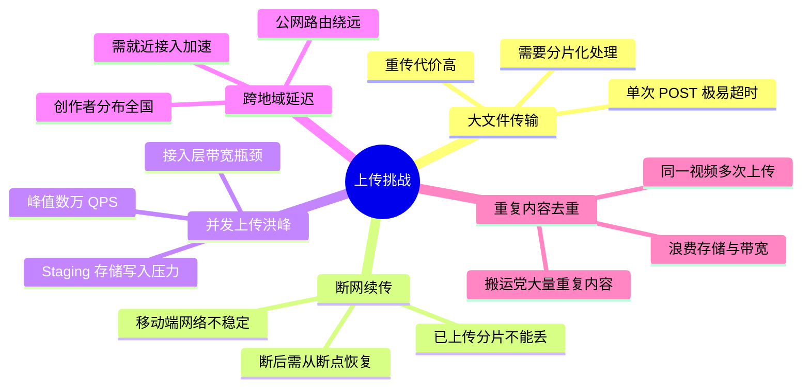
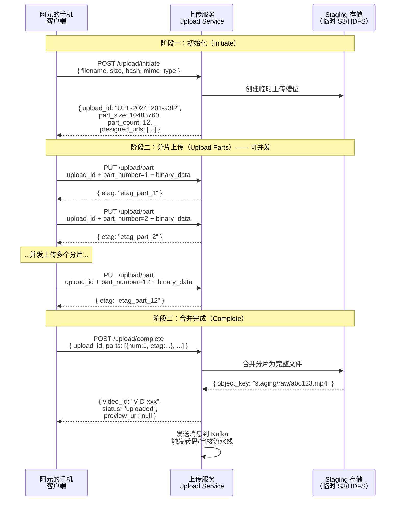
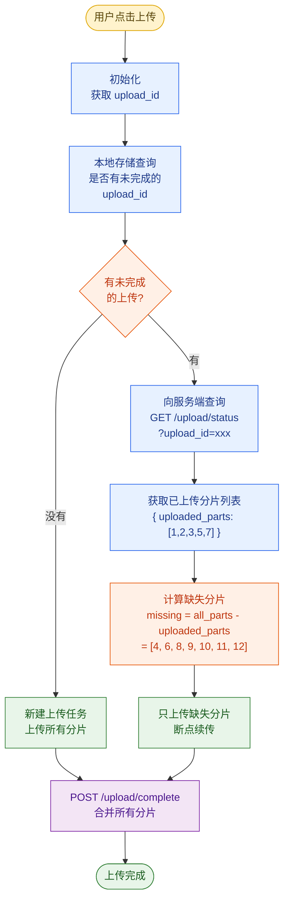
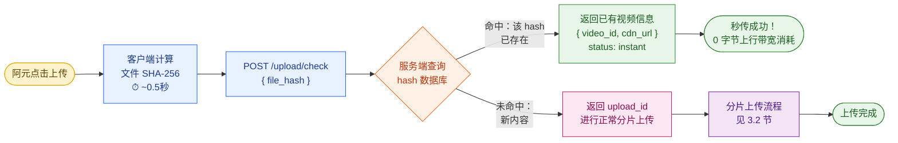
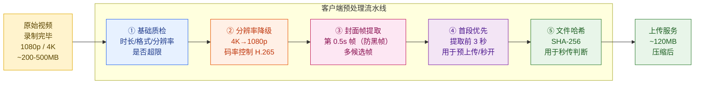
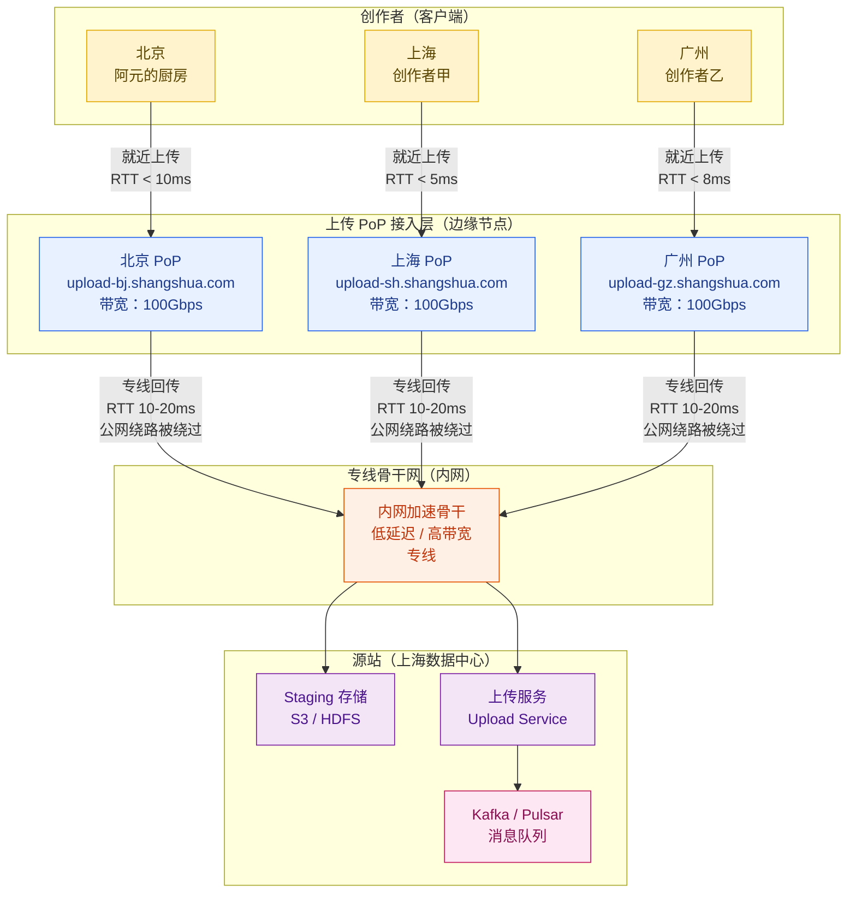
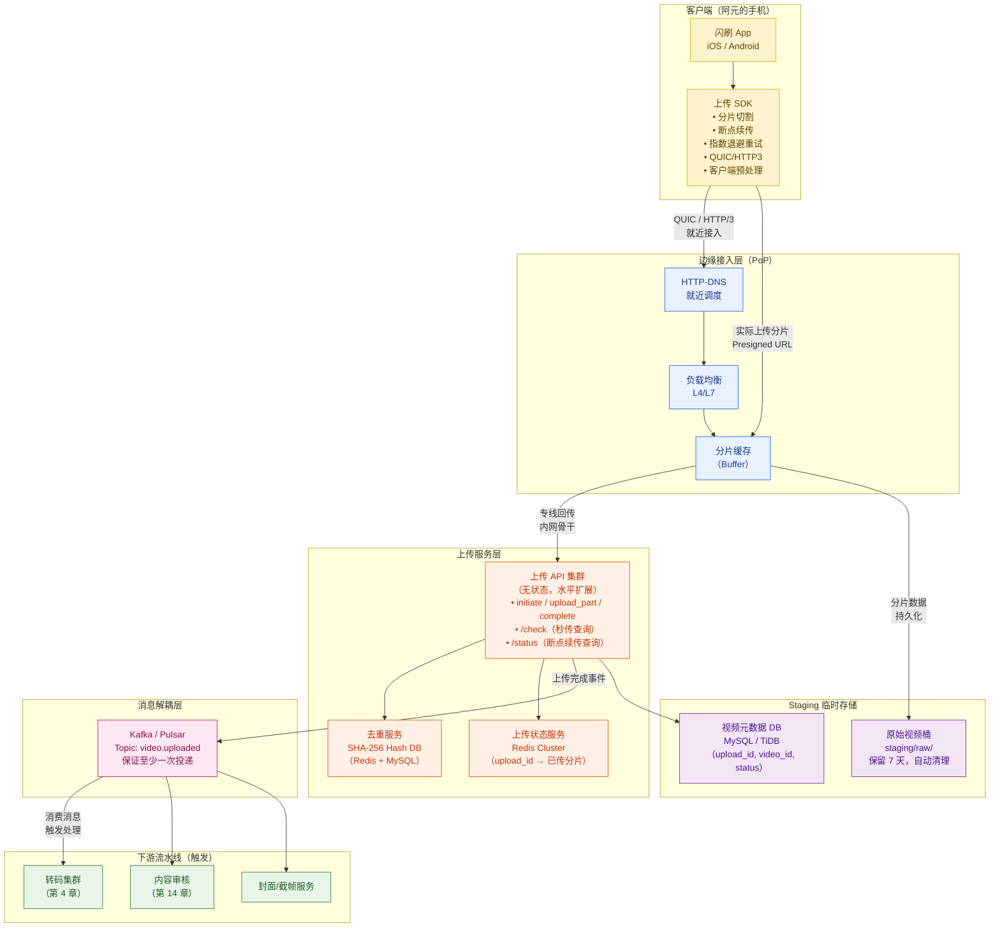
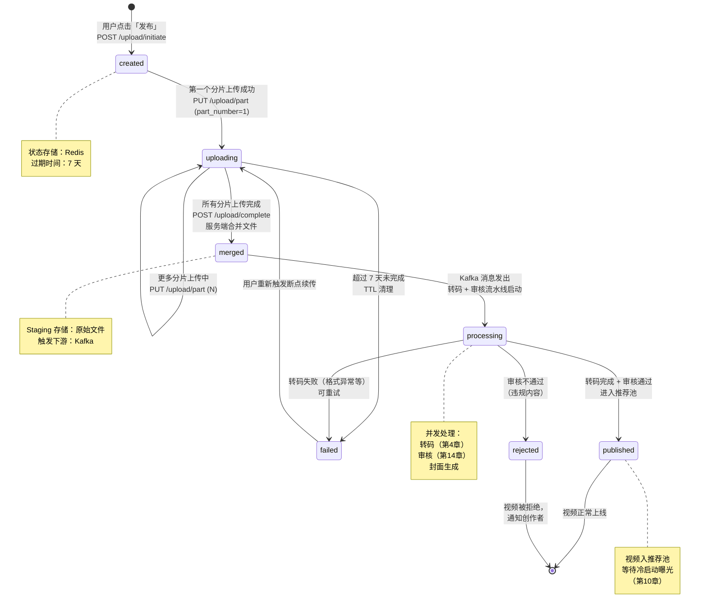

# 第 3 章 · 视频上传与预处理

> **全景教程导航**：第 2 章梳理了「闪刷」平台从上滑到播放的完整生命周期，点明了整条链路的读写主路径。本章进入**创作处理侧**的第一个节点——**视频上传与预处理**，回答「一条视频怎么从创作者手机上到达平台 Staging 存储，并触发后续流水线」。第 4 章将在本章基础上，深入转码流水线与编码优化。

---

## 本章导读

「阿元的厨房」今天要上传《3 分钟搞定番茄牛腩》，这是一段约 **60 秒、1080p、120 MB** 的视频，录制于她家厨房，用 iPhone 14 Pro 拍摄。她点下「发布」按钮的那一刻，系统需要解决的问题远比看起来复杂：

> **如何在移动弱网环境下，可靠、快速、低成本地把一个 120 MB 的大文件从创作者手机传到平台？**

这个问题拆开来，至少包含五个子问题：

1. **大文件传输**：120 MB 一次性 POST 在弱网下极易失败，失败了要从头重传
2. **断网续传**：电梯、地铁、隧道——移动端随时断网，如何做到「断了接着传」
3. **重复内容**：阿元同一条视频传了两次（操作失误），系统如何做到「秒传」只存一份
4. **上行带宽**：移动端上行通常只有下行的 1/5，如何在客户端先压缩再上传
5. **跨地域延迟**：阿元在北京，平台源站在上海，如何就近接入降低上行时延

本章将系统讲透这五个问题背后的技术原理与工程实现，并给出完整的上传链路架构。

---

## 3.1 上传面临的核心挑战

### 3.1.1 大文件与弱网的双重压力

短视频平台的上传场景与普通文件上传有本质不同：

| 维度 | 普通 Web 文件上传 | 短视频上传 |
|------|----------------|----------|
| 文件大小 | 几 KB ~ 几 MB | **几十 MB ~ 几百 MB** |
| 网络环境 | 主要是有线/WiFi | **大量移动端 4G/5G，信号不稳** |
| 上传端 | PC 浏览器 | **手机 App，前台/后台切换** |
| 失败代价 | 重传一个小文件 | **重传 100MB，用户体验极差** |
| 并发规模 | 中等 | **日均上传 5000 万条，早高峰洪峰** |

「闪刷」的规模假设（第 2 章）：

- 日均上传 **5000 万条**视频
- 平均每条 **80 MB**（含高清、4K）
- 上传洪峰集中在每天 **20:00–23:00**（创作者下班后），峰值 QPS **约 5 万次/秒**
- 移动端占比 **> 85%**，其中 4G 网络占比约 **60%**

这意味着：在峰值时刻，系统同时要接收 **数万条视频的分片上传**，总入网带宽可达 **数十 Tbps**。

### 3.1.2 五大核心挑战



### 3.1.3 解决方案全景

| 挑战 | 核心方案 | 章节 |
|------|---------|------|
| 大文件传输 | **分片上传**（Multipart Upload）| 3.2 |
| 断网续传 | **断点续传** + 指数退避重试 | 3.3 |
| 重复内容 | **秒传**（内容 hash 去重） | 3.4 |
| 上行带宽 | **客户端预处理**（压缩/降分辨率） | 3.5 |
| 跨地域延迟 | **就近接入** + PoP 节点 + QUIC | 3.6 |
| 整体架构 | **上传链路全景图** | 3.7 |
| 状态管理 | **上传状态机** | 3.8 |

---

## 3.2 分片上传（Multipart Upload）

### 3.2.1 为什么要分片

设想阿元在地铁上用 4G 上传《番茄牛腩》（120 MB）：

- 4G 平均上行速度约 **5 Mbps**，上传 120 MB 需约 **192 秒**（3 分钟多）
- 3 分钟内地铁进隧道的概率极高，网络一断，120 MB 全部白传
- 不分片的情况下，失败一次就要从 0 开始重传

**分片的核心价值**：

1. **减少重传代价**：断网只需补传失败的那几个分片，而非整个文件
2. **并发加速**：多个分片并行上传，充分利用带宽
3. **断点续传的基础**：分片是断点续传的最小粒度

### 3.2.2 分片大小的权衡

分片不是越小越好，也不是越大越好：

$$
\text{总请求数} = \left\lceil \frac{\text{文件大小}}{\text{分片大小}} \right\rceil
$$

| 分片大小 | 优点 | 缺点 | 适用场景 |
|---------|------|------|---------|
| **1 MB（太小）** | 失败重传代价小 | 120 MB = 120 次请求，HTTP 开销大；并发连接数多 | 弱网（2G/3G），极不稳定环境 |
| **5 MB（偏小）** | 粒度细，重传代价可控 | 请求数仍较多 | 移动端 4G，信号一般 |
| **10 MB（推荐）** | 平衡 | — | 移动端 4G/5G，主流选择 |
| **50 MB（偏大）** | 请求数少，开销低 | 弱网失败重传代价大 | PC 端有线/WiFi |
| **100 MB（太大）** | 接近不分片 | 与不分片无本质区别 | 不推荐 |

**工业实践**：

- **YouTube**：PC 上传分片 **10–50 MB**，移动端 **5–10 MB**
- **TikTok**：移动端默认 **5 MB** 分片，弱网降至 **2 MB**
- **「闪刷」**：本章采用 **10 MB** 作为默认分片大小

以阿元的 120 MB 视频为例，10 MB 分片将产生 **12 个分片**（最后一片可能不足 10 MB）。

### 3.2.3 分片上传三段式协议

分片上传协议分为三个阶段，与 AWS S3 Multipart Upload 设计一脉相承：



### 3.2.4 HTTP 协议详细交互

**阶段一：初始化请求**

```http
POST /api/v1/upload/initiate HTTP/1.1
Host: upload.shangshua.com
Authorization: Bearer <token>
Content-Type: application/json

{
  "filename": "tomato-beef-stew.mp4",
  "file_size": 125829120,
  "file_hash_sha256": "e3b0c44298fc1c149afb...（文件整体 SHA-256）",
  "mime_type": "video/mp4",
  "duration_ms": 61000,
  "resolution": "1920x1080",
  "device": "iPhone 14 Pro",
  "client_version": "5.3.2"
}
```

**服务端响应**：

```http
HTTP/1.1 200 OK
Content-Type: application/json

{
  "upload_id": "UPL-20241201-a3f2b1c9",
  "part_size": 10485760,
  "part_count": 12,
  "expires_at": "2024-12-02T10:30:00Z",
  "upload_endpoint": "https://upload-edge-bj.shangshua.com",
  "presigned_urls": [
    {
      "part_number": 1,
      "url": "https://staging-s3.internal/raw/UPL-20241201-a3f2?partNumber=1&uploadId=xxx&X-Amz-Signature=...",
      "expires_in": 3600
    }
    // ... 共 12 个预签名 URL
  ]
}
```

**阶段二：上传单个分片**

```http
PUT /raw/UPL-20241201-a3f2?partNumber=3&uploadId=xxx&X-Amz-Signature=... HTTP/1.1
Host: staging-s3.internal
Content-Type: application/octet-stream
Content-Length: 10485760
Content-MD5: <分片 MD5 base64>

<binary data: 10 MB>
```

```http
HTTP/1.1 200 OK
ETag: "d41d8cd98f00b204e9800998ecf8427e"
```

**阶段三：完成合并**

```http
POST /api/v1/upload/complete HTTP/1.1
Host: upload.shangshua.com
Authorization: Bearer <token>
Content-Type: application/json

{
  "upload_id": "UPL-20241201-a3f2b1c9",
  "parts": [
    {"part_number": 1, "etag": "etag_1"},
    {"part_number": 2, "etag": "etag_2"},
    // ...
    {"part_number": 12, "etag": "etag_12"}
  ]
}
```

### 3.2.5 客户端并发上传多个分片

客户端不需要串行等待每个分片——可以并发上传，显著缩短总上传时间：

```python
import asyncio
import aiohttp
import hashlib
from pathlib import Path
from dataclasses import dataclass
from typing import List

@dataclass
class PartResult:
    part_number: int
    etag: str

CHUNK_SIZE = 10 * 1024 * 1024   # 10 MB 分片
MAX_CONCURRENT = 3               # 移动端最多 3 个并发（避免耗尽带宽）

async def upload_part(
    session: aiohttp.ClientSession,
    url: str,
    part_number: int,
    data: bytes,
    semaphore: asyncio.Semaphore,
) -> PartResult:
    """上传单个分片，带信号量限制并发数"""
    async with semaphore:
        # 计算分片 MD5，服务端做完整性校验
        md5 = hashlib.md5(data).digest()
        import base64
        md5_b64 = base64.b64encode(md5).decode()

        async with session.put(
            url,
            data=data,
            headers={"Content-MD5": md5_b64},
        ) as resp:
            resp.raise_for_status()
            etag = resp.headers["ETag"].strip('"')
            print(f"  [分片 {part_number}] 上传完成，ETag={etag[:8]}...")
            return PartResult(part_number=part_number, etag=etag)

async def multipart_upload(
    file_path: str,
    presigned_urls: List[dict],
) -> List[PartResult]:
    """
    并发上传所有分片
    presigned_urls: [{"part_number": 1, "url": "..."}, ...]
    """
    file_data = Path(file_path).read_bytes()
    semaphore = asyncio.Semaphore(MAX_CONCURRENT)

    async with aiohttp.ClientSession() as session:
        tasks = []
        for part_info in presigned_urls:
            pn = part_info["part_number"]
            start = (pn - 1) * CHUNK_SIZE
            end = min(pn * CHUNK_SIZE, len(file_data))
            chunk = file_data[start:end]
            tasks.append(
                upload_part(session, part_info["url"], pn, chunk, semaphore)
            )

        # 并发执行，等待所有分片完成
        results = await asyncio.gather(*tasks)

    # 按分片号排序（并发完成顺序不固定）
    return sorted(results, key=lambda r: r.part_number)
```

**并发上传的时间收益**：

$$
T_{\text{串行}} = \sum_{i=1}^{N} T_{\text{part}_i} \approx N \cdot \bar{T}_{\text{part}}
$$

$$
T_{\text{并发}} = \frac{N}{C} \cdot \bar{T}_{\text{part}} \quad (C = \text{并发数})
$$

以 12 个 10 MB 分片、4G 网速（5 Mbps 上行）为例：

| 模式 | 理论时间 |
|------|---------|
| 串行上传 | $12 \times 16s = 192s$ |
| 3 并发上传 | $\frac{12}{3} \times 16s = 64s$（节省 2/3） |

---

## 3.3 断点续传

### 3.3.1 核心思想

断点续传的本质：**服务端记住哪些分片已经上传成功，客户端恢复时只补传缺失的分片**。



### 3.3.2 服务端状态存储设计

服务端需要持久化记录每个上传任务的分片状态：

```python
# Redis Hash 结构设计
# Key: upload:{upload_id}
# Field: part:{N} → ETag
# Field: meta → JSON（文件元信息）
# Field: status → created / uploading / merged / failed
# TTL: 7 天（超时未完成则清理）

import redis
import json
from datetime import timedelta

class UploadStateStore:
    def __init__(self, redis_client: redis.Redis):
        self.r = redis_client
        self.UPLOAD_TTL = timedelta(days=7)

    def create_upload(self, upload_id: str, meta: dict) -> None:
        """初始化上传任务"""
        key = f"upload:{upload_id}"
        self.r.hset(key, mapping={
            "status": "created",
            "meta": json.dumps(meta),
            "total_parts": meta["part_count"],
            "created_at": meta["created_at"],
        })
        self.r.expire(key, int(self.UPLOAD_TTL.total_seconds()))

    def record_part(self, upload_id: str, part_number: int, etag: str) -> None:
        """记录某个分片上传成功"""
        key = f"upload:{upload_id}"
        self.r.hset(key, f"part:{part_number}", etag)
        self.r.hset(key, "status", "uploading")
        # 刷新 TTL（有活跃上传时重置过期时间）
        self.r.expire(key, int(self.UPLOAD_TTL.total_seconds()))

    def get_uploaded_parts(self, upload_id: str) -> list:
        """查询已上传的分片号列表"""
        key = f"upload:{upload_id}"
        all_fields = self.r.hgetall(key)
        parts = []
        for field, value in all_fields.items():
            field_str = field.decode() if isinstance(field, bytes) else field
            if field_str.startswith("part:"):
                part_number = int(field_str.split(":")[1])
                etag = value.decode() if isinstance(value, bytes) else value
                parts.append({"part_number": part_number, "etag": etag})
        return sorted(parts, key=lambda p: p["part_number"])

    def get_missing_parts(self, upload_id: str, total_parts: int) -> list:
        """计算缺失的分片号（用于断点续传）"""
        uploaded = {p["part_number"] for p in self.get_uploaded_parts(upload_id)}
        all_parts = set(range(1, total_parts + 1))
        missing = sorted(all_parts - uploaded)
        return missing
```

**查询已上传分片的 API**：

```http
GET /api/v1/upload/status?upload_id=UPL-20241201-a3f2b1c9 HTTP/1.1
Host: upload.shangshua.com
Authorization: Bearer <token>

---响应---
HTTP/1.1 200 OK
{
  "upload_id": "UPL-20241201-a3f2b1c9",
  "status": "uploading",
  "total_parts": 12,
  "uploaded_parts": [
    {"part_number": 1, "etag": "abc123", "size": 10485760},
    {"part_number": 2, "etag": "def456", "size": 10485760},
    {"part_number": 3, "etag": "ghi789", "size": 10485760}
  ],
  "missing_parts": [4, 5, 6, 7, 8, 9, 10, 11, 12],
  "expires_at": "2024-12-08T10:30:00Z"
}
```

### 3.3.3 弱网重试策略：指数退避

移动端弱网下，分片上传失败后应该怎么重试？**指数退避 + 随机抖动**是业界标准方案：

$$
T_{\text{wait}}(n) = \min\left(\text{base} \cdot 2^{n-1} + \text{jitter}, T_{\text{max}}\right)
$$

其中：
- $\text{base}$：初始等待时间（建议 1s）
- $n$：当前重试次数（从 1 开始）
- $\text{jitter}$：随机抖动，范围 $[0, \text{base}]$（防止雪崩，大量客户端同时重试）
- $T_{\text{max}}$：最大等待时间（建议 60s）

```python
import asyncio
import random
import aiohttp

async def upload_part_with_retry(
    session: aiohttp.ClientSession,
    url: str,
    part_number: int,
    data: bytes,
    max_retries: int = 5,
) -> PartResult:
    """带指数退避的分片上传"""
    base_wait = 1.0    # 初始等待 1 秒
    max_wait = 60.0    # 最大等待 60 秒

    for attempt in range(1, max_retries + 1):
        try:
            async with session.put(
                url, data=data,
                timeout=aiohttp.ClientTimeout(total=120),  # 10MB 最多等 120 秒
            ) as resp:
                if resp.status == 200:
                    etag = resp.headers["ETag"].strip('"')
                    return PartResult(part_number=part_number, etag=etag)
                elif resp.status in (429, 503):
                    # 服务端限流或不可用，强制等待
                    wait = float(resp.headers.get("Retry-After", base_wait * (2 ** attempt)))
                    print(f"  [分片 {part_number}] 服务端限流，等待 {wait:.1f}s 后重试")
                    await asyncio.sleep(wait)
                    continue
                else:
                    resp.raise_for_status()

        except (aiohttp.ClientError, asyncio.TimeoutError) as e:
            if attempt == max_retries:
                raise RuntimeError(
                    f"分片 {part_number} 在 {max_retries} 次重试后仍失败: {e}"
                )
            # 计算退避等待时间
            jitter = random.uniform(0, base_wait)
            wait = min(base_wait * (2 ** (attempt - 1)) + jitter, max_wait)
            print(f"  [分片 {part_number}] 第 {attempt} 次失败({e})，{wait:.1f}s 后重试")
            await asyncio.sleep(wait)

    raise RuntimeError(f"分片 {part_number} 重试超限")
```

**重试等待时间示例**（base=1s，jitter 最大 1s）：

| 重试次数 | 等待时间（无 jitter） | 实际范围（加 jitter） |
|---------|-------------------|--------------------|
| 第 1 次 | 1s | 1.0 ~ 2.0s |
| 第 2 次 | 2s | 2.0 ~ 3.0s |
| 第 3 次 | 4s | 4.0 ~ 5.0s |
| 第 4 次 | 8s | 8.0 ~ 9.0s |
| 第 5 次 | 16s | 16.0 ~ 17.0s |

这样既保证了在网络短暂抖动时快速恢复，又在长时间故障时逐渐降低重试频率，不会对服务端造成请求洪峰。

---

## 3.4 秒传（内容去重）

### 3.4.1 秒传的商业价值

「闪刷」平台每天上传 5000 万条视频，其中存在大量重复：

- **创作者操作失误**：同一视频上传两次（阿元就遇到过这种情况）
- **搬运党**：从其他平台搬运的重复内容，规模可达每天数百万条
- **多设备同步**：同一视频从手机、iPad、电脑分别上传

如果不做去重，这些重复内容将浪费：
1. **上行带宽**：创作者和平台的双重浪费
2. **Staging 存储**：数 PB 的重复原始视频
3. **转码算力**：重复转码完全相同的内容

**秒传**（也叫「妙传」）解决了这个问题：客户端先算文件 hash，服务端命中相同内容则**直接返回已有视频的 URL，跳过上传和转码**。

### 3.4.2 先查后传流程



### 3.4.3 哈希算法选择

**为什么不用 MD5？**

| 算法 | 摘要长度 | 速度 | 碰撞安全性 | 推荐程度 |
|------|---------|------|-----------|---------|
| MD5 | 128 bit | 最快 | **已被攻破**（可人为构造碰撞） | ❌ 不推荐用于安全场景 |
| SHA-1 | 160 bit | 快 | **已被攻破**（2017 年 Google SHAttered 攻击） | ❌ 不推荐 |
| SHA-256 | 256 bit | 中等 | **目前安全**，碰撞概率 $2^{-256}$ | ✅ 推荐 |
| SHA-3 | 256 bit | 慢（软件实现） | 安全 | ✅ 备选 |

**哈希碰撞的商业影响**：

如果用 MD5，攻击者可以构造两个 MD5 相同但内容不同的文件，上传恶意内容（如违规视频）后让系统认为它是另一个合法视频——这是严重的安全漏洞。

**SHA-256 碰撞概率**：

$$
P(\text{碰撞}) \approx \frac{n^2}{2^{257}} \quad (n = \text{视频库总量})
$$

「闪刷」视频库 50 亿条（$5 \times 10^9$）：

$$
P = \frac{(5 \times 10^9)^2}{2^{257}} \approx 10^{-59}
$$

这个概率比宇宙中随机选两个原子碰到同一个原子还小，实践中可以忽略不计。

### 3.4.4 分块哈希加速大文件计算

对于 120 MB 的视频，全文件 SHA-256 在低端 Android 手机上可能需要 1–2 秒。更好的方案是**分块哈希**：

```python
import hashlib
from pathlib import Path

def compute_file_hash_fast(file_path: str, chunk_size: int = 64 * 1024) -> str:
    """
    流式计算文件 SHA-256，避免一次性读入内存（大文件友好）
    chunk_size = 64 KB，平衡内存和 I/O 效率
    """
    sha256 = hashlib.sha256()
    with open(file_path, "rb") as f:
        while True:
            chunk = f.read(chunk_size)
            if not chunk:
                break
            sha256.update(chunk)
    return sha256.hexdigest()

def compute_part_hashes(file_path: str, part_size: int = 10 * 1024 * 1024) -> list:
    """
    计算每个分片的 SHA-256，用于：
    1. 分片级去重（可以只传缺失的分片，即使文件整体不同）
    2. 分片上传时的完整性校验
    返回: [{"part_number": 1, "hash": "sha256_hex", "size": 10485760}, ...]
    """
    file_data = Path(file_path).read_bytes()
    total_size = len(file_data)
    parts = []

    offset = 0
    part_number = 1
    while offset < total_size:
        chunk = file_data[offset:offset + part_size]
        part_hash = hashlib.sha256(chunk).hexdigest()
        parts.append({
            "part_number": part_number,
            "hash": part_hash,
            "size": len(chunk),
            "offset": offset,
        })
        offset += part_size
        part_number += 1

    return parts
```

**秒传 HTTP 请求**：

```http
POST /api/v1/upload/check HTTP/1.1
Host: upload.shangshua.com
Authorization: Bearer <token>
Content-Type: application/json

{
  "file_hash_sha256": "9f86d081884c7d659a2feaa0c55ad015a3bf4f1b2b0b822cd15d6c15b0f00a08",
  "file_size": 125829120,
  "part_hashes": [
    {"part_number": 1, "hash": "abc123..."},
    {"part_number": 2, "hash": "def456..."}
  ]
}
```

**命中时响应**：

```http
HTTP/1.1 200 OK
Content-Type: application/json

{
  "status": "instant",
  "message": "该视频内容已存在，秒传成功",
  "video_id": "VID-20241130-xyz789",
  "cdn_url": "https://cdn.shangshua.com/videos/VID-20241130-xyz789/master.m3u8",
  "thumbnail_url": "https://cdn.shangshua.com/thumbs/VID-20241130-xyz789.jpg",
  "duration_ms": 61000,
  "saved_bytes": 125829120
}
```

### 3.4.5 服务端 hash 数据库设计

服务端需要高效查询「某个 SHA-256 是否已存在」：

```python
# 方案一：Redis Set（适合中小规模，< 10亿条）
# Key: file_hash:{sha256_hex}
# Value: video_id（第一次上传时记录）

# 方案二：布隆过滤器（超大规模，先快速判断不存在）
# Bloom Filter 误报率 < 0.01%，不漏报
# 命中 Bloom Filter 后再查精确 DB（Redis/MySQL）

# 方案三：直接查对象存储元数据索引（推荐生产方案）
# 对象存储如 S3，可以用 SHA-256 作为 object key
# 存储前先 HeadObject 检查是否存在，不存在再上传

class HashDeduplicationService:
    def __init__(self, redis_client, db_conn):
        self.redis = redis_client
        self.db = db_conn

    def check_and_register(self, file_hash: str, uploader_uid: str) -> dict:
        """
        先查后传的服务端逻辑
        1. 先查布隆过滤器（极快，可能误报）
        2. 若命中，再查精确存储（Redis + DB）
        3. 若存在，直接返回已有 video_id（无需上传）
        4. 若不存在，创建新 upload_id（需要上传）
        """
        # 快速路径：Redis 缓存
        cached_video_id = self.redis.get(f"hash:{file_hash}")
        if cached_video_id:
            video_id = cached_video_id.decode()
            return {
                "exists": True,
                "video_id": video_id,
                "status": "instant",
            }

        # 慢速路径：查数据库
        row = self.db.query(
            "SELECT video_id FROM video_hash_index WHERE file_hash = %s",
            (file_hash,)
        )
        if row:
            video_id = row[0]["video_id"]
            # 回写 Redis 缓存
            self.redis.setex(f"hash:{file_hash}", 86400 * 30, video_id)
            return {"exists": True, "video_id": video_id, "status": "instant"}

        # 不存在，允许上传，但先 INSERT 一条占位记录（防止并发重复上传）
        upload_id = generate_upload_id()
        self.redis.setex(f"uploading:{file_hash}", 3600, upload_id)
        return {"exists": False, "upload_id": upload_id, "status": "upload_required"}
```

---

## 3.5 客户端预处理

### 3.5.1 为什么要在客户端做预处理

移动端上行带宽通常是下行的 **1/5 到 1/3**（4G 环境：下行 30–100 Mbps，上行 5–20 Mbps）。如果直接上传原始 4K 视频，不仅上传慢，还浪费服务端转码算力。

TikTok 的实践：**移动端先压缩再上传，GPU 边缘 10 秒内产出 720p 预览版**。

客户端预处理流水线（在本地、上传前执行）：



### 3.5.2 基础质检（上传前门控）

在上传前进行客户端质检，**拦截明显不合规的视频**，避免脏数据进入转码流水线：

| 检查项 | 阈值 | 不通过时的处理 |
|-------|------|--------------|
| 视频时长 | 最短 1 秒，最长 5 分钟（取决于平台规则） | 拒绝上传，提示用户 |
| 文件大小 | 最大 4 GB | 拒绝，提示压缩 |
| 视频格式 | MP4/MOV/AVI/MKV/WebM | 拒绝，提示转换格式 |
| 分辨率 | 最小 360p（防极低质量） | 警告（不阻止） |
| 帧率 | 最低 15fps，最高 120fps | 警告（不阻止） |
| 音频 | 检查是否有音频轨道 | 提示（可选） |

```python
from dataclasses import dataclass
from typing import Optional

@dataclass
class VideoMetadata:
    duration_ms: int
    width: int
    height: int
    fps: float
    file_size: int
    codec: str
    has_audio: bool
    format: str

def validate_video_for_upload(meta: VideoMetadata) -> tuple[bool, Optional[str]]:
    """
    客户端上传前质检
    返回 (通过, 错误信息)
    """
    if meta.duration_ms < 1000:
        return False, "视频时长不能短于 1 秒"
    if meta.duration_ms > 5 * 60 * 1000:
        return False, "短视频时长不能超过 5 分钟"
    if meta.file_size > 4 * 1024 * 1024 * 1024:
        return False, "文件大小不能超过 4GB，请先压缩"
    if meta.format.lower() not in ("mp4", "mov", "avi", "mkv", "webm"):
        return False, f"不支持的视频格式：{meta.format}"
    if meta.width < 360 or meta.height < 360:
        return False, "视频分辨率过低（最低 360p）"
    if meta.fps < 15:
        return False, f"帧率过低（{meta.fps:.1f} fps），请重新录制"
    return True, None
```

### 3.5.3 分辨率降级与码率控制

对于 4K 视频，客户端在上传前降为 1080p 可以将文件大小减少约 **60–75%**：

$$
\text{压缩比} \approx \left(\frac{W_{\text{target}}}{W_{\text{source}}}\right)^2 \times \frac{B_{\text{target}}}{B_{\text{source}}}
$$

| 源分辨率 | 目标分辨率 | 码率变化 | 大致压缩比 |
|---------|---------|---------|----------|
| 4K（3840×2160） | 1080p（1920×1080） | 4K 约 20Mbps → 1080p 约 8Mbps | 文件缩小 **60%** |
| 1080p | 720p | 8Mbps → 3Mbps | 文件缩小 **62%** |
| 1080p | 1080p（H.265 编码） | H.264 8Mbps → H.265 4Mbps | 文件缩小 **50%** |

**移动端 FFmpeg/硬件编码器调用**（伪代码）：

```bash
# iOS 使用 VideoToolbox 硬件编码器
# Android 使用 MediaCodec

# 等效的 FFmpeg 命令（服务端也可用）：
ffmpeg -i input_4k.mp4 \
  -vf scale=1920:1080 \           # 降分辨率
  -c:v libx265 \                  # H.265 编码（比 H.264 小 50%）
  -crf 26 \                       # 质量因子（18=最高质量，28=较低质量）
  -preset fast \                  # 编码速度（fast 适合客户端实时）
  -c:a aac -b:a 128k \           # 音频 AAC 128kbps
  -movflags +faststart \          # 将 moov atom 移到文件头（利于流播放）
  output_1080p.mp4
```

### 3.5.4 封面帧提取

封面帧是用户在 Feed 流中看到的第一印象，直接影响点击率（CTR）。客户端在上传时提取并上传封面帧，可以避免服务端等待转码完成后再生成：

```python
def extract_cover_candidates(video_path: str, n_candidates: int = 5) -> list:
    """
    提取多个封面候选帧，避免：
    1. 第 0 帧通常是黑帧（录制开始时的黑屏）
    2. 单一帧可能效果不好
    返回候选帧的时间点（毫秒）
    """
    # 跳过前 0.5 秒（防黑帧），从 0.5s 到视频总时长的均匀采样
    duration = get_video_duration_ms(video_path)
    safe_start = 500   # 前 0.5 秒跳过
    safe_end = min(duration, 5000)  # 只在前 5 秒里选（后面可能是结尾）

    candidates = []
    for i in range(n_candidates):
        t = safe_start + (safe_end - safe_start) * i // (n_candidates - 1)
        frame = extract_frame_at(video_path, t)  # 调用平台 API 提取帧
        candidates.append({
            "timestamp_ms": t,
            "thumbnail": frame,  # JPEG 压缩后约 50-100KB
        })
    return candidates
```

### 3.5.5 首段优先上传（预加载优化）

「首段优先」是一项关键优化：**优先上传视频的前 3–5 秒**，使得服务端可以在完整视频上传完成前就开始处理预览帧，让用户上传时就能看到「预览」效果：

```
上传策略：
分片 1-3（前 30MB，约前 20 秒内容）── 最高优先级，先上传
分片 4-12（剩余 90MB）────────────── 并发补传
```

实际上，现代短视频 App 在用户**录制完成、还在输入标题**的时候，就已经在后台开始上传视频的前几个分片了——这种「用户思考时间」被充分利用，体感上「发布很快」。

---

## 3.6 就近接入与上传加速

### 3.6.1 跨地域上传的延迟问题

「闪刷」的创作者分布全国：阿元在北京，如果上传请求要绕到上海源站，会经历：

- **公网路由绕远**：北京到上海公网 RTT 约 30–60ms，但实际路由可能绕道其他城市，RTT 拉高到 80–150ms
- **TCP 慢启动**：大文件上传的第一个 RTT 极慢，10 个 RTT 才能跑满带宽
- **跨运营商问题**：用联通网络请求电信机房，路由可能绕半个中国

### 3.6.2 全球 PoP 就近接入

解决方案是在全国（乃至全球）部署**上传接入点（PoP, Point of Presence）**：



**就近接入的延迟收益**：

| 方案 | 北京→上海 RTT | 上行延迟影响 |
|------|------------|------------|
| 直连源站（公网） | 80–150ms | 文件分片等待时间长 |
| 就近 PoP（内网骨干） | **接入 < 10ms + 专线 < 20ms = 合计 < 30ms** | 延迟降低 **60–80%** |

### 3.6.3 HTTP-DNS 调度到最近节点

客户端使用 **HTTP-DNS**（也叫 HTTPDNS）而非传统 DNS 解析上传节点：

- **传统 DNS**：Local DNS 服务器可能缓存过期结果，或 resolver 位置与用户位置不匹配，导致解析到远端节点
- **HTTP-DNS**：客户端直接向平台的 DNS 服务发 HTTP 请求，携带客户端真实 IP，精准返回最近 PoP 的 IP

```http
GET https://dns.shangshua.com/d?host=upload.shangshua.com&ip=110.42.5.82&ttl=60
Accept: application/json

---响应---
{
  "host": "upload.shangshua.com",
  "ips": ["101.200.32.5", "101.200.32.6"],
  "ttl": 60,
  "pop": "beijing-001",
  "comment": "就近接入北京 PoP"
}
```

### 3.6.4 QUIC / HTTP/3 上传加速

移动端在地铁、电梯等弱网场景下，TCP 的头部阻塞（Head-of-Line Blocking）问题会严重影响分片上传效率。**QUIC / HTTP/3** 基于 UDP 实现，天然支持：

- **多流无阻塞**：某个分片的丢包不会阻塞其他分片的流
- **0-RTT 连接恢复**：断网重连后无需重新握手（TCP 需要 1.5 RTT）
- **连接迁移**：从 4G 切换到 WiFi 时，连接不中断（TCP 依赖四元组，切网必须重建连接）

**TikTok 已在移动端广泛使用 QUIC 进行视频上传**，相比 TCP，在弱网下上传成功率提升约 **15–20%**，上传时间缩短约 **10–30%**。

| 协议 | 底层 | 头部阻塞 | 连接建立 | 网络切换 |
|-----|------|---------|---------|---------|
| HTTP/1.1 | TCP | 有（串行）| 3-way handshake + TLS | 重建 |
| HTTP/2 | TCP | 有（多路复用但共享 TCP 流）| 1-RTT（TLS 1.3） | 重建 |
| HTTP/3 / QUIC | UDP | **无**（流级别独立）| **0-RTT 恢复** | **连接迁移** |

---

## 3.7 上传链路整体架构

### 3.7.1 完整链路设计

将前面所有组件整合，得到「闪刷」平台的完整上传链路架构：



### 3.7.2 Kafka 解耦的关键作用

上传服务完成后直接调用转码、审核会产生**强耦合**：

```
❌ 不好的设计（同步调用）：
上传完成 → 同步调用转码 → 同步调用审核 → 完成
问题：任一环节慢/故障，整个上传请求阻塞
```

```
✅ 好的设计（Kafka 解耦）：
上传完成 → 发 Kafka 消息 → 立即返回给用户「上传成功，视频处理中」
                ↓（异步消费）
转码集群消费  ─┐
审核服务消费  ─┤← 各自独立，互不干扰
封面服务消费  ─┘
```

**Kafka 消息格式**：

```json
{
  "topic": "video.uploaded",
  "key": "VID-20241201-xyz789",
  "value": {
    "video_id": "VID-20241201-xyz789",
    "upload_id": "UPL-20241201-a3f2b1c9",
    "uploader_uid": "UID-aayuan-kitchen",
    "raw_object_key": "staging/raw/UPL-20241201-a3f2b1c9.mp4",
    "file_size": 125829120,
    "file_hash_sha256": "9f86d081...",
    "duration_ms": 61000,
    "resolution": "1920x1080",
    "fps": 30.0,
    "uploaded_at": "2024-12-01T21:30:00Z",
    "client_version": "5.3.2",
    "device": "iPhone 14 Pro",
    "cover_candidates": [
      {"timestamp_ms": 500, "thumbnail_key": "staging/thumbs/VID-xxx-0.jpg"},
      {"timestamp_ms": 2000, "thumbnail_key": "staging/thumbs/VID-xxx-1.jpg"}
    ]
  }
}
```

### 3.7.3 Staging 存储的生命周期管理

**Staging 存储不清理是常见的工程债务**。原始视频上传到 Staging 后，经过转码就不再需要了，但如果没有清理策略，Staging 会无限膨胀：

| 阶段 | 操作 | 时间 |
|------|------|------|
| 上传中 | 分片逐步写入 Staging | T |
| 上传完成 | 合并分片，Staging 存放完整原始视频 | T |
| 转码完成 | Staging 原始视频已无用 | T + 几分钟到几小时 |
| **清理** | **删除 Staging 原始视频** | T + 24–72 小时（保留一段时间供审计/重转码） |
| 超时未完成上传 | TTL 7 天后自动删除分片 | T + 7 天 |

```bash
# 清理脚本（每日 Cron 执行）
# 删除 3 天前已完成转码的 Staging 原始视频
aws s3 rm s3://staging-raw/ \
  --recursive \
  --include "*.mp4" \
  --query "Contents[?LastModified<'$(date -d '-3 days' +%Y-%m-%d)']"
```

---

## 3.8 上传状态机

视频从用户点击「发布」到最终「可以被推荐」，要经历多个状态转换。理解状态机是排查上传问题的基础：



### 3.8.1 状态数据库设计

```sql
-- MySQL / TiDB 视频状态表
CREATE TABLE video_upload_status (
    video_id        VARCHAR(64)  NOT NULL PRIMARY KEY,   -- VID-YYYYMMDD-{hash}
    upload_id       VARCHAR(64)  NOT NULL,               -- UPL-YYYYMMDD-{hash}
    uploader_uid    VARCHAR(64)  NOT NULL,
    status          ENUM(
        'created',      -- 已初始化，等待上传
        'uploading',    -- 上传中
        'merged',       -- 所有分片已合并
        'processing',   -- 转码/审核中
        'published',    -- 已发布，可被推荐
        'rejected',     -- 审核拒绝
        'failed'        -- 技术失败
    ) NOT NULL DEFAULT 'created',
    raw_object_key  VARCHAR(512),                         -- Staging 路径
    file_hash       CHAR(64),                             -- SHA-256
    file_size       BIGINT,
    duration_ms     INT,
    resolution      VARCHAR(16),
    created_at      DATETIME    NOT NULL DEFAULT NOW(),
    updated_at      DATETIME    NOT NULL DEFAULT NOW() ON UPDATE NOW(),
    published_at    DATETIME,                             -- 上线时间
    reject_reason   VARCHAR(256),                         -- 拒绝原因
    retry_count     TINYINT     NOT NULL DEFAULT 0,      -- 失败重试次数

    INDEX idx_uploader_status (uploader_uid, status),
    INDEX idx_status_created  (status, created_at)
) ENGINE=InnoDB DEFAULT CHARSET=utf8mb4;
```

### 3.8.2 状态流转的幂等性设计

多次重复请求（如网络抖动导致客户端重试 complete 请求）不应改变最终状态：

```python
def complete_upload(upload_id: str, parts: list) -> dict:
    """
    完成上传——幂等实现
    多次调用相同 upload_id 的 complete 结果一致
    """
    # 查询当前状态
    current = db.query_one(
        "SELECT status, video_id FROM video_upload_status WHERE upload_id = %s",
        (upload_id,)
    )

    if current is None:
        raise ValueError(f"upload_id {upload_id} 不存在")

    # 幂等：如果已经合并，直接返回成功
    if current["status"] in ("merged", "processing", "published"):
        return {
            "video_id": current["video_id"],
            "status": "already_completed",
            "message": "该上传任务已完成",
        }

    # 只有 uploading 状态才执行合并
    if current["status"] != "uploading":
        raise ValueError(f"当前状态 {current['status']} 不允许完成操作")

    # 验证所有分片都已上传
    uploaded = get_uploaded_parts(upload_id)
    if len(uploaded) != len(parts):
        raise ValueError(f"分片数量不匹配：期望 {len(parts)} 个，实际 {len(uploaded)} 个")

    # 合并分片（调用 S3 CompleteMultipartUpload）
    object_key = s3_client.complete_multipart_upload(upload_id, parts)

    # 更新状态 → merged
    video_id = current["video_id"]
    db.execute(
        "UPDATE video_upload_status SET status='merged', raw_object_key=%s WHERE upload_id=%s",
        (object_key, upload_id)
    )

    # 发送 Kafka 消息，触发转码流水线
    kafka_producer.send("video.uploaded", key=video_id, value=build_event(video_id))

    return {"video_id": video_id, "status": "merged", "message": "上传完成，处理中"}
```

---

## 3.9 常见易错点与设计陷阱

### 3.9.1 分片大小一刀切

**错误做法**：所有设备、所有网络环境都用固定的 10 MB 分片。

**问题**：

- 2G/3G 网络用 10 MB 分片，断网重传成本极高（平均每次需要重传半个分片，5 MB）
- WiFi 环境用 2 MB 分片，产生过多 HTTP 请求（60 次请求 vs 12 次），开销大

**正确做法**：**动态分片大小**，根据当前网络质量自适应：

```python
def get_adaptive_part_size(network_type: str, signal_strength: int) -> int:
    """
    根据网络条件动态选择分片大小
    network_type: "wifi" / "5g" / "4g" / "3g" / "2g"
    signal_strength: 0-100（信号强度）
    """
    if network_type == "wifi":
        return 20 * 1024 * 1024    # WiFi: 20 MB
    elif network_type == "5g":
        return 10 * 1024 * 1024    # 5G: 10 MB
    elif network_type == "4g":
        if signal_strength > 60:
            return 10 * 1024 * 1024   # 4G 强信号: 10 MB
        else:
            return 5 * 1024 * 1024    # 4G 弱信号: 5 MB
    elif network_type == "3g":
        return 2 * 1024 * 1024     # 3G: 2 MB
    else:
        return 1 * 1024 * 1024     # 2G 或未知: 1 MB
```

### 3.9.2 秒传用弱 Hash 有碰撞风险

**错误做法**：用 MD5 做秒传 hash。

**问题**：MD5 已被攻破，攻击者可以上传与违规内容 MD5 相同的文件，诱导平台将其识别为已审核过的合法视频，绕过内容审核。

**正确做法**：**必须使用 SHA-256 或更强的 hash**。

### 3.9.3 不做客户端质检导致脏数据进流水线

**错误做法**：不做客户端质检，任何文件都接受，转码/审核时再报错。

**问题**：

- 损坏的 MP4 文件进入转码集群，导致转码任务卡住、资源浪费
- 超过 5 分钟的长视频消耗大量转码算力，却最终被业务规则拒绝
- 将质检前移到客户端可以节省 **80% 以上**的无效转码开销

### 3.9.4 Staging 存储不清理导致膨胀

**错误做法**：上传到 Staging 后，没有清理策略。

**规模估算**：

$$
\text{日增 Staging 原始文件} = 5000 \text{万条} \times 80 \text{MB/条} = 4 \text{PB/天}
$$

即使只保留 3 天，也需要 12 PB 的 Staging 存储空间——这是完全不可接受的成本。

**正确做法**：**转码完成后 24–72 小时内清理 Staging 原始视频**，保留对象元数据（路径、hash、时间戳），用于审计和必要时的重转码。

### 3.9.5 上传并发数设置过高耗尽移动端带宽

**错误做法**：移动端启动 10 个并发分片上传。

**问题**：10 个并发分片同时上传，会抢占其他 App 的带宽，导致用户觉得「刷短视频变卡了」（因为上传占满了上行带宽，甚至影响 TCP ACK 回传，间接影响下行速度）。

**正确做法**：移动端上传并发数控制在 **2–3 个**，WiFi 可适度提高到 **4–5 个**。

---

## 本章小结

本章跟随阿元上传《3 分钟搞定番茄牛腩》，系统讲解了短视频上传链路的五个核心机制：

1. **分片上传三段式**（initiate → upload_part → complete）：将 120 MB 大文件拆为 12 个 10 MB 分片，支持并发上传，单分片失败不影响其他分片。分片大小需要根据网络环境动态调整，太小（请求多）和太大（重传贵）都不合适。

2. **断点续传**：服务端以 `upload_id + 分片号` 为 key 持久化已传分片状态（Redis，7 天 TTL）；续传时先 `GET /upload/status` 拿已传分片列表，只补传缺失分片。分片上传失败时采用**指数退避 + 随机抖动**重试策略，防止雪崩。

3. **秒传（内容去重）**：上传前客户端计算文件 SHA-256（流式计算，不一次性读入内存）；服务端维护 hash → video_id 映射（Redis + MySQL 二级缓存）；命中则直接返回已有 URL，0 字节上行带宽。**必须使用 SHA-256**，MD5/SHA-1 已被攻破，有被绕过审核的安全风险。

4. **客户端预处理**：4K 视频降为 1080p 可减少 60% 文件大小；封面帧从 0.5s 开始采样（防黑帧）；前 3 秒分片优先上传（利用用户输入标题的时间）；基础质检拦截脏数据进流水线。

5. **就近接入 + QUIC**：全国多个 PoP 接入点，HTTP-DNS 精准调度到最近节点；PoP 到源站走内网骨干专线，规避公网绕路；移动端使用 QUIC/HTTP3，解决弱网下 TCP 头部阻塞问题，弱网上传成功率提升 15–20%。

**整体架构**：客户端 → QUIC 接入 → 边缘 PoP → 上传 API 集群（无状态）→ Staging 存储（7 天自动清理）→ **Kafka 解耦** → 触发转码/审核/封面流水线。

**上传状态机**：`created → uploading → merged → processing → published/rejected/failed`，状态转换幂等设计，防止重复请求导致状态异常。

---

**承上启下**：当《番茄牛腩》视频完成上传，进入 `merged` 状态，Kafka 消息触发了转码集群——一段 1080p 的原始 MP4 即将被「拆解」为适配各种设备、各种网络的多路码率版本，这正是**第 4 章：转码流水线与编码优化**的主题。

---

## 参考来源

1. **YouTube Engineering: Resumable Uploads**
   [https://developers.google.com/youtube/v3/guides/using_resumable_upload_protocol](https://developers.google.com/youtube/v3/guides/using_resumable_upload_protocol)
   *YouTube 可恢复上传协议官方文档，分片上传三段式协议的工业参考*

2. **AWS S3 Multipart Upload Developer Guide**
   [https://docs.aws.amazon.com/AmazonS3/latest/userguide/mpuoverview.html](https://docs.aws.amazon.com/AmazonS3/latest/userguide/mpuoverview.html)
   *Multipart Upload 的权威规范，分片大小建议与 ETag 校验机制*

3. **TikTok Engineering: How We Build TikTok's Infrastructure at Scale**
   [https://newsroom.tiktok.com/en-us/tiktok-engineering-blog](https://newsroom.tiktok.com/en-us/tiktok-engineering-blog)
   *TikTok 上传基础设施：可恢复分块上传、移动端预处理、Staging 解耦实践*

4. **QUIC Protocol RFC 9000**
   [https://datatracker.ietf.org/doc/html/rfc9000](https://datatracker.ietf.org/doc/html/rfc9000)
   *QUIC 协议标准，多流无头部阻塞、连接迁移等特性的技术规范*

5. **Bilibili Open Platform: Content Deduplication Design**
   [https://www.bilibili.com/read/cv10000000](https://www.bilibili.com/read/cv10000000)
   *B 站基于内容 hash 的秒传去重设计，相同内容多次投稿处理机制*

6. **Google HTTPDNS: A Better DNS for Mobile**
   [https://developers.google.com/speed/public-dns](https://developers.google.com/speed/public-dns)
   *HTTP-DNS 就近调度原理，移动端 DNS 解析优化*

7. **Netflix: Exponential Backoff And Jitter**
   [https://aws.amazon.com/blogs/architecture/exponential-backoff-and-jitter/](https://aws.amazon.com/blogs/architecture/exponential-backoff-and-jitter/)
   *指数退避与随机抖动算法的工程实践，大规模分布式重试的标准做法*

8. **Cloudflare: QUIC is now RFC 9000**
   [https://blog.cloudflare.com/quic-version-1-is-live-on-cloudflare/](https://blog.cloudflare.com/quic-version-1-is-live-on-cloudflare/)
   *QUIC/HTTP3 在生产环境的性能数据，弱网下相比 TCP 的改善效果*
