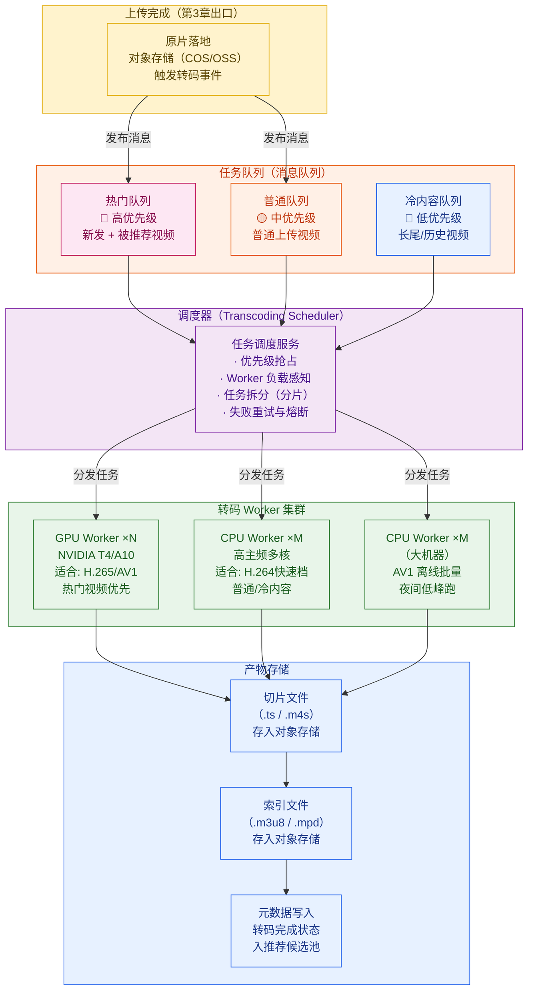
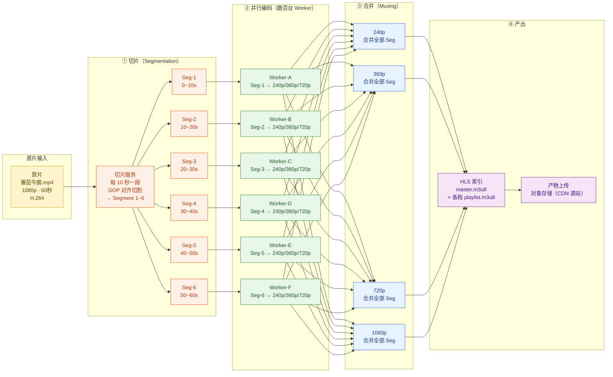
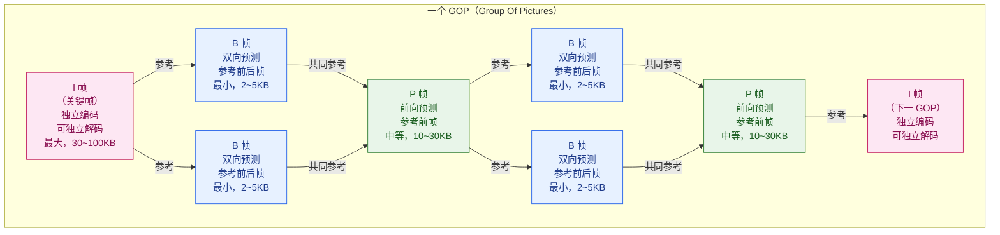
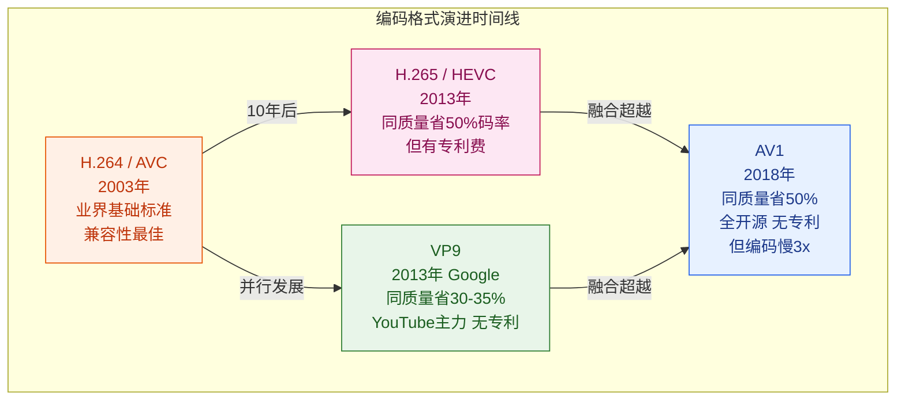
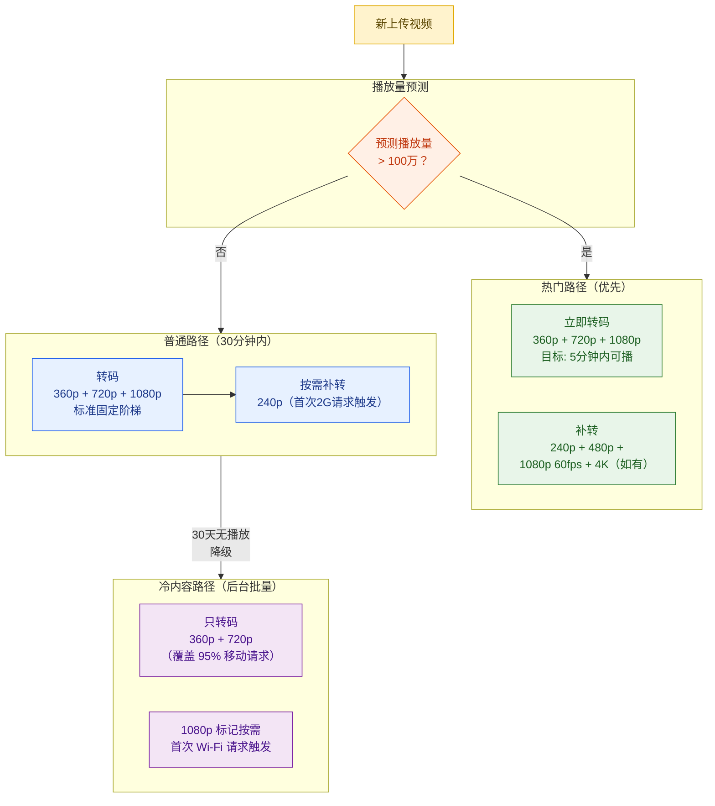

# 第 4 章 · 转码流水线与编码优化

> **全景教程导航**：第 3 章讲解了视频上传与预处理——阿元把《番茄牛腩》原始素材分片上传、秒传去重、就近接入后，一个 1080p 的 MP4 原片已经安全落地在上传服务器（详见第 3 章）。本章接棒，聚焦这条视频真正"变可用"的核心环节：**转码**。原片从 1 种规格变成覆盖全端网络的多档流，背后是一套工业级流水线。

---

## 本章导读

阿元上传的原片是 1080p H.264，文件大小 480 MB，时长约 60 秒。这条视频要在"闪刷"平台上被正常播放，还差最后一步：

> **把一种编码格式/分辨率的原片，转换成适配不同设备、网络、码率的多档视频流，并产出 HLS/DASH 索引文件，供播放器进行自适应码率（ABR）切换。**

这就是**转码**（Transcoding）要做的事。

如果没有转码，一个使用 2G 网络的手机用户打开这条视频，要么卡死，要么等待几十秒才能播放——这与"秒开"的目标相差十万八千里。

本章系统讲解：

1. 为什么必须转码：多端适配、ABR 前提、格式统一、带宽节省
2. **转码集群架构**：任务队列、调度器、Worker 池、产物回写
3. **并行分片转码**：把小时级任务压到分钟级的工程方案
4. **GOP 与关键帧**：I/P/B 帧结构，为什么 HLS 切片边界要对齐 I 帧
5. **ABR 码率阶梯**：从 240p 到 4K 的完整档位表与设计依据
6. **编码格式选型**：H.264 / H.265 / VP9 / AV1 的深度对比
7. **Per-Title Encoding**（Netflix 方案）：VMAF 驱动的内容自适应编码，省 20%+ 带宽
8. 转码成本优化：GPU、分级策略、冷内容按需转码
9. 易错点全景与贯穿案例

---

## 4.1 为什么必须转码

### 4.1.1 多端设备与网络的现实碎片化

"闪刷"平台的用户横跨 iPhone 15 Pro Max 到低端安卓机，网络从 Wi-Fi 到农村 2G，操作系统从 iOS 16 到 Android 9，浏览器从 Chrome 到 UC。一条原始视频文件**不可能**满足如此多样的终端需求：

| 场景 | 需要的规格 | 原片（1080p 480MB）能否直接播 |
|------|-----------|---------------------------|
| 低端安卓 + 2G | 240p，300kbps | 无法流畅播放，会卡死 |
| 普通 4G 手机 | 720p，2.5Mbps | 勉强，但体验不稳定 |
| Wi-Fi 旗舰机 | 1080p，6Mbps | 可以，但文件太大 |
| 嵌入 Web 浏览器 | 需要 HLS/DASH 容器格式 | 原始 MP4 无法 ABR |
| 智能电视 4K | 2160p，20Mbps | 原片只有 1080p，无法升级 |

### 4.1.2 ABR（自适应码率）的前提

ABR（Adaptive Bitrate Streaming）是现代视频播放体验的基石，允许播放器在网络波动时动态切换码率——从 720p 无缝降到 360p，再升回来。但 ABR 有一个硬性前提：

> **必须提前准备好多个码率档位的视频切片（Segment），才能在播放时实时切换。**

这正是转码的核心任务：把原片切成多档，每档再切成 2 秒一个的小片段，产出 M3U8（HLS）或 MPD（DASH）索引文件。没有预先转码的多档流，播放器就无法做 ABR，只能在单一码率下硬撑。

### 4.1.3 格式统一与兜底

用户上传的原片格式五花八门：

```
MOV（iPhone 直出）、MKV（PC 录屏）、AVI（旧安卓相机）
HEVC（iPhone 13+）、ProRes（专业相机）、WMV（Windows 老版本）
```

播放器无法识别全部这些格式，CDN 也无法高效分发。转码统一输出为 **MP4 + H.264（兜底）** 或 **fMP4 + H.265/AV1（高端）**，确保任何终端都能播放。

### 4.1.4 节省存储与带宽

直觉上，多档转码会增加存储成本。但现实中，通过精心设计的码率阶梯 + Per-Title Encoding，**多档转码反而节省带宽**：

- 用户在移动端大多数时候看 360p-720p，无需传输 1080p
- Per-Title Encoding 根据内容复杂度动态调整，平均节省 20% 带宽
- 冷内容只转少数档位，节省存储

**阿元的案例小算盘**：
```
原片：480 MB（1080p 60秒）
全档转码输出（240p~1080p 共 6 档）：约 320 MB（平均码率降低 + 去冗余）
对比"直接存 1 份原片"：若每次播放都用 1080p，1亿次播放 = 48 PB 流量
对比"6 档 ABR"：平均用户下载 360p，1亿次播放 = 约 6 PB 流量——节省 87.5%
```

---

## 4.2 转码集群架构

### 4.2.1 整体架构图

"闪刷"每天上传 **5000 万条**视频，转码集群需要在几分钟内完成**热门视频**的多档转码，并在数小时内处理完全量。



### 4.2.2 任务优先级设计

不是所有视频的转码优先级相同。"闪刷"平台将转码任务分为三个优先级队列：

| 队列 | 触发条件 | 延迟目标 | 典型比例 |
|------|---------|---------|---------|
| **热门队列** | 上传后被推荐系统预判为高潜力；头部创作者发布；节日/热点话题相关 | < 5 分钟出 720p 可播版 | 5% 视频，占 60% 算力 |
| **普通队列** | 普通注册用户正常上传 | < 30 分钟出全档 | 70% 视频，占 35% 算力 |
| **冷内容队列** | 长尾老视频补充编码（如存量 H.264 补转 AV1）；非活跃账号 | 数小时甚至隔天 | 25% 视频，占 5% 算力 |

**优先级抢占机制**：调度器感知到热门队列积压时，可以暂停普通队列的任务（释放 Worker），集中资源跑热门转码。这是 TikTok/抖音保证爆款视频快速可播的核心机制之一。

```python
# 伪代码：调度器优先级感知
def schedule_next_task(available_worker: Worker) -> TranscodeTask:
    """
    调度器选任务逻辑：热门队列优先，空时才取普通/冷内容
    """
    # 热门队列始终优先
    task = hot_queue.dequeue_nowait()
    if task:
        return task

    # 热门队列空，且普通队列等待时间 < 阈值，才取普通任务
    if normal_queue.pending_count() > 0 and not hot_queue.is_backlogged():
        task = normal_queue.dequeue_with_timeout(timeout_ms=100)
        if task:
            return task

    # 兜底：取冷内容任务（夜间填充）
    return cold_queue.dequeue_with_timeout(timeout_ms=500)
```

### 4.2.3 预转码 vs 按需转码

两种转码策略有根本不同的 ROI 取向：

| 维度 | 预转码（Pre-encode）| 按需转码（On-demand / Just-in-Time）|
|------|-------------------|-------------------------------------|
| **核心思想** | 视频上传后立即转出所有档位，提前存好 | 第一次有用户请求该档位时才转码 |
| **首播延迟** | 极低（转码完成即可播）| 高（首次请求要等转码完成，秒~分钟级）|
| **存储成本** | 高（所有视频都存 N 档）| 低（只存真实被请求的档位）|
| **适合内容** | 热门视频、新发视频、短视频 | 长尾冷内容（可能一辈子只被请求 1 次）|
| **代表平台** | TikTok 新视频、YouTube 热门视频 | YouTube 4K 超长老视频、Netflix 非热门内容 |

**"闪刷"的混合策略**：
```
新上传视频：
  → 立即预转 360p + 720p（保证最快可播）
  → 异步补转 240p、480p、1080p
  → 热门视频补转 1080p 60fps、HDR

冷内容（30 天无播放）：
  → 仅保留 360p 和 720p
  → 1080p 档位标记为"可按需转码"
  → 首次请求 1080p 时，实时触发转码（用户等待 10-30 秒）
```

这种策略能节省约 **35%** 的存储成本，因为大量长尾视频的高清档位从未被请求过。

---

## 4.3 并行分片转码

### 4.3.1 为什么需要并行分片

一台普通服务器对一段 60 秒视频做全质量转码，需要约 2-3 分钟（H.264 快速档）或 15-20 分钟（H.265 慢速档）。如果要同时输出 6 个码率档位，串行处理需要约 10-90 分钟。

对于"闪刷"的 SLA 要求（热门视频 5 分钟内可播），这远远不够。**并行分片转码（Parallel Segmented Transcoding）** 是解决方案。

**核心思想**：
> 把原视频切成若干小片段（Segment），每段独立分发给不同机器并行编码，最后合并。把数小时的任务压到数十分钟。

这正是 YouTube、Netflix、TikTok 的做法。

### 4.3.2 并行分片转码流程图



### 4.3.3 时间对比：串行 vs 并行

以阿元的《番茄牛腩》（60 秒，1080p）为例：

| 方案 | 描述 | 720p H.264 完成时间 | 全档（6 档）完成时间 |
|------|------|-------------------|-------------------|
| **串行单机** | 1 台机器，逐档转码 | 约 90 秒 | 约 10 分钟 |
| **并行多档（无分片）** | 6 台机器各负责一档 | 约 90 秒 | 约 90 秒 |
| **并行分片 + 多档** | 分 6 片 × 6 档 = 36 Worker | **约 15 秒** | **约 15 秒** |
| **TikTok 目标（GPU）** | GPU 并行分片 | **< 10 秒** | < 60 秒 |

关键结论：**通过并行分片 + 多档并发，把数分钟任务压到 10-15 秒**，满足热门视频"秒级可播"的体验目标。

### 4.3.4 分片的技术细节

分片时有两个关键约束：

**约束 1：分片边界必须对齐 GOP（关键帧）**

不能在 P 帧或 B 帧处切断，否则每个 Segment 无法独立解码（见 4.4 节详解）。切片时，系统先扫描 GOP 边界（I 帧位置），选择距离目标切片时间点最近的 I 帧作为切割点。

**约束 2：参考帧不能跨 Segment**

编码器会让 P/B 帧参考同一 Segment 内的帧，不允许参考其他 Segment 的帧。每个 Segment 编码时需要独立初始化编码器，相当于每段都是一个独立的"小视频"。

```bash
# 使用 FFmpeg 进行 GOP 对齐切片（示意）
# -c copy: 不重新编码原片（只做切割，速度快）
# -segment_time 10: 目标每段 10 秒（实际以 GOP 边界对齐）
# -force_key_frames: 每 10 秒强制插入关键帧（预处理阶段）

# 步骤 1：先做预处理，强制 GOP 边界对齐
ffmpeg -i 番茄牛腩.mp4 \
  -c:v libx264 \
  -force_key_frames "expr:gte(t,n_forced*10)" \  # 每 10 秒强制 I 帧
  -c:a aac \
  番茄牛腩_gop_aligned.mp4

# 步骤 2：按 GOP 边界切片
ffmpeg -i 番茄牛腩_gop_aligned.mp4 \
  -c copy \
  -f segment \
  -segment_time 10 \
  -reset_timestamps 1 \
  segment_%03d.mp4   # 输出 segment_000.mp4, segment_001.mp4, ...
```

---

## 4.4 GOP 与关键帧

### 4.4.1 视频编码的三种帧类型

现代视频编码通过**帧间预测**压缩数据：不是每帧都独立编码，而是只存储帧与帧之间的"差异"。这引入了三种帧类型：



| 帧类型 | 全称 | 编码方式 | 能否独立解码 | 典型大小 | 压缩效率 |
|--------|------|---------|------------|---------|---------|
| **I 帧** | Intra-coded Frame（帧内编码帧） | 类似 JPEG，只用本帧数据 | ✅ 可以 | 30~100 KB | 最低 |
| **P 帧** | Predictive Frame（前向预测帧） | 参考前面的 I 帧或 P 帧，只存差异 | ❌ 需要前面的帧 | 10~30 KB | 中等 |
| **B 帧** | Bidirectional Frame（双向预测帧） | 参考前面和后面的帧，差异更小 | ❌ 需要前后帧 | 2~5 KB | 最高 |

**GOP（Group of Pictures）** 是从一个 I 帧到下一个 I 帧之间的帧序列，通常写作 `IBBPBBP...I`。

**GOP 大小（GOP Size / Keyframe Interval）**对转码有重大影响：

| GOP 大小 | 每秒关键帧数 | I 帧比例 | 视频体积 | Seek 精度 | ABR 切换速度 |
|---------|-----------|---------|---------|---------|------------|
| 30 帧（1 秒，30fps）| 1 个/秒 | 高 | 大（~+30%）| 精确 | 快 |
| 60 帧（2 秒，30fps）| 0.5 个/秒 | 中 | 标准 | 一般 | **推荐值** |
| 300 帧（10 秒，30fps）| 0.1 个/秒 | 低 | 小 | 差，有 seek 延迟 | 慢，切换有 artifact |

**"闪刷"配置**：GOP 大小设为 **2 秒 × 帧率**（30fps 时为 60 帧）。这是 HLS/DASH 2 秒切片的直接匹配。

### 4.4.2 为什么 HLS 切片边界必须对齐 I 帧

这是一个关键的工程约束，不理解它就会出现"seek 卡顿"和"ABR 切换花屏"的 bug。

**场景 1：用户 seek（拖进度条）到第 35 秒**

```
如果切片边界不是 I 帧：
  播放器请求 30-32s 的切片
  → 切片从 P 帧开始
  → P 帧需要参考 28s 的 I 帧才能解码
  → 28s 的帧数据不在当前切片里
  → 解码器报错或产生花屏
  → 用户看到卡顿/绿屏

如果切片边界是 I 帧：
  播放器请求 30-32s 的切片
  → 切片从 I 帧开始
  → I 帧可以独立解码，无需历史帧
  → 立即解码播放
  → Seek 无缝流畅
```

**场景 2：ABR 从 720p 切换到 360p**

```
切换时刻：t = 34.5s（正在播放 720p 的第 34-36s 切片）

如果 360p 切片边界不对齐 720p：
  360p 的切片范围是 33-35s（从 P 帧开始）
  → 切换时 360p 解码器缺少参考帧
  → 产生花屏或解码错误

如果两个档位切片边界完全对齐（都从 I 帧开始）：
  360p 的切片范围也是 34-36s（从 I 帧开始）
  → 无缝切换，无花屏
```

**工程结论**：
> HLS 切片（`.ts` / `.m4s`）的边界，必须是 I 帧的位置。因此，转码时必须在每个切片边界强制插入关键帧（`force_key_frames`），哪怕这会稍微增加文件体积。

```bash
# FFmpeg 转码时强制切片边界为关键帧（生产配置）
ffmpeg -i input.mp4 \
  -c:v libx264 \
  -preset fast \
  -crf 23 \
  -g 60 \                                           # GOP 大小：60帧（2秒@30fps）
  -keyint_min 60 \                                  # 最小关键帧间隔，防止自适应插入
  -sc_threshold 0 \                                 # 禁止场景切换时自动插 I 帧（保持固定 GOP）
  -force_key_frames "expr:gte(t,n_forced*2)" \      # 每 2 秒强制一个 I 帧
  -hls_time 2 \                                     # HLS 切片目标时长 2 秒
  -hls_playlist_type vod \
  -hls_segment_filename "segment_%05d.ts" \
  playlist.m3u8
```

---

## 4.5 ABR 码率阶梯（Bitrate Ladder）

### 4.5.1 什么是码率阶梯

码率阶梯（Bitrate Ladder）是预先定义的多档分辨率 × 码率组合，每一档是一个"梯级"。播放器根据网络状况在梯级之间切换。

**设计码率阶梯的三个核心原则**：
1. **相邻档位码率差约 50%**：保证切换足够平滑，从 720p 降到 480p，用户感知不明显
2. **覆盖主流使用场景**：移动端 2G（240p）到 Wi-Fi 4K（2160p）
3. **各档画质主观感受均衡**：不同内容的复杂度不同，同一码率在不同内容下画质差距很大（Per-Title Encoding 解决这个问题，见 4.7 节）

### 4.5.2 完整档位表

以下是"闪刷"平台的标准码率阶梯（参考 Netflix、YouTube 公开数据与业界惯例）：

| 档位 | 分辨率 | 帧率 | 视频码率（H.264）| 视频码率（H.265/VP9）| 音频码率 | 总码率 | 典型网络要求 |
|------|--------|------|-----------------|--------------------|---------|----|------------|
| **240p** | 426×240 | 24fps | 300~500 kbps | 150~250 kbps | 64 kbps | ~550 kbps | 2G（1Mbps+）|
| **360p** | 640×360 | 24fps | 500~800 kbps | 280~400 kbps | 96 kbps | ~880 kbps | 3G（1.5Mbps+）|
| **480p** | 854×480 | 30fps | 1~1.5 Mbps | 550~800 kbps | 128 kbps | ~1.6 Mbps | 4G（3Mbps+）|
| **720p** | 1280×720 | 30fps | 2.5~3 Mbps | 1.3~1.6 Mbps | 128 kbps | ~3.1 Mbps | 4G（5Mbps+）|
| **1080p** | 1920×1080 | 30fps | 5~8 Mbps | 2.5~4 Mbps | 192 kbps | ~6.5 Mbps | Wi-Fi（10Mbps+）|
| **1080p 60fps** | 1920×1080 | 60fps | 8~12 Mbps | 4~6 Mbps | 192 kbps | ~10 Mbps | Wi-Fi（15Mbps+）|
| **4K（2160p）** | 3840×2160 | 30fps | 15~25 Mbps | 8~12 Mbps | 192 kbps | ~20 Mbps | 千兆 Wi-Fi |

**移动端重点档位**：360p、480p、720p 覆盖了移动用户 90%+ 的场景，是转码资源优先保证的档位。

**码率步进说明**：
```
240p → 360p：约 60% 增长（500 kbps → 800 kbps）
360p → 480p：约 70% 增长（800 kbps → 1.3 Mbps）
480p → 720p：约 100% 增长（1.3 Mbps → 2.5 Mbps）
720p → 1080p：约 100% 增长（2.5 Mbps → 5 Mbps）
```

每档码率约是上一档的 1.5~2 倍，保证 ABR 切换时画质变化幅度不会过于突兀。

### 4.5.3 阿元的《番茄牛腩》实际转码参数

```bash
# ========== 生产环境转码命令（简化版，实际为并行分片执行）==========

# 档位 1：240p（移动端 2G 兜底）
ffmpeg -i 番茄牛腩_segment_001.mp4 \
  -c:v libx264 -preset fast -crf 28 \
  -vf scale=426:240 \
  -b:v 400k -maxrate 500k -bufsize 800k \
  -c:a aac -b:a 64k \
  -g 48 -keyint_min 48 \      # 2秒 GOP @24fps
  output_240p_seg001.ts

# 档位 4：720p（移动端主力档）
ffmpeg -i 番茄牛腩_segment_001.mp4 \
  -c:v libx264 -preset fast -crf 22 \
  -vf scale=1280:720 \
  -b:v 2800k -maxrate 3000k -bufsize 5000k \
  -c:a aac -b:a 128k \
  -g 60 -keyint_min 60 \      # 2秒 GOP @30fps
  output_720p_seg001.ts

# 档位 5：1080p（Wi-Fi 高清）
ffmpeg -i 番茄牛腩_segment_001.mp4 \
  -c:v libx264 -preset medium -crf 19 \
  -vf scale=1920:1080 \
  -b:v 6000k -maxrate 8000k -bufsize 12000k \
  -c:a aac -b:a 192k \
  -g 60 -keyint_min 60 \
  output_1080p_seg001.ts
```

---

## 4.6 编码格式选型：H.264 / H.265 / VP9 / AV1

### 4.6.1 四种主流格式的发展脉络



### 4.6.2 详细对比表

| 维度 | H.264 / AVC | H.265 / HEVC | VP9 | AV1 |
|------|-------------|--------------|-----|-----|
| **标准组织** | ITU-T / ISO | ITU-T / ISO | Google | AOMedia（Google/Netflix/Amazon/Mozilla 等）|
| **发布年份** | 2003 | 2013 | 2013 | 2018 |
| **压缩效率（vs H.264）** | 基准 | **省 ~50%** | **省 ~30-35%** | **省 ~50%** |
| **专利/授权费** | 有（MPEG-LA）| **有，且复杂昂贵** | **无** | **完全免费** |
| **硬件解码支持** | 全部设备（2008年+）| 较好（2016年+安卓/iOS）| 较好（2018年+）| 较新（2020年+ iPhone，部分安卓）|
| **软件编码速度** | 快（基准 1x）| 慢（约 0.5x）| 中（约 0.7x）| **极慢（约 0.3x，FFmpeg 软编）** |
| **GPU 编码支持** | 成熟（NVENC）| 成熟（NVENC HEVC）| 有限 | 较新（AV1 NVENC，A30+）|
| **典型使用平台** | 全平台兜底 | Apple 生态、直播 | YouTube（主力）| Netflix、YouTube（升级）|
| **推荐使用场景** | 兼容性第一；移动直播实时编码 | Apple 设备优先；需要更低码率但不在乎授权费 | 非 Apple 平台批量转码 | 长期存档；离线批量转码老内容 |

### 4.6.3 H.264：无处不在的兜底格式

H.264 是短视频平台的"保险底线"：

```
支持设备：2008年后所有设备，覆盖率接近 100%
编码速度：最快，1台 CPU Worker 实时编码 1080p@30fps 绰绰有余
授权费：约 $0.02/设备或按条款，对大平台有上限约定
适用档位：240p~1080p 全档；移动端 ABR 的主力
```

H.264 的主要缺点只有一个：**码率效率比 H.265/AV1 低约 50%**。但在需要最广兼容性时，它无可替代。

### 4.6.4 H.265 / HEVC：高效但昂贵

H.265 理论压缩比是 H.264 的 2 倍，但授权费问题是其软肋：

```
专利方：MPEG-LA、HEVC Advance、Velos Media 三个专利池并存
授权费：每台设备 $0.40 起，无上限
使用困境：三个专利池分别授权，意味着平台要签三份合同
实际情况：大量平台（Netflix、YouTube）选择 VP9/AV1 绕开专利费
```

"闪刷"的策略：在 **Apple 设备**（iPhone/iPad/Mac）上优先使用 H.265，因为 Apple 设备拥有出色的 H.265 硬件解码器（VideoToolbox），且 Apple 已在其授权费中处理好了专利问题。

### 4.6.5 VP9：Google 的免费替代方案

VP9 是 Google 为了绕开 H.265 专利开发的格式，YouTube 是其最大用户：

```
压缩效率：比 H.264 省 30~35%，比 H.265 略差约 15%
硬件支持：Chrome（全平台）、Android 5.0+、部分 Smart TV
编码速度：比 H.265 快约 40%，是 AV1 软编的 2~3 倍
专利费：完全免费
YouTube 现状：默认使用 VP9，覆盖约 80%+ 的请求
```

### 4.6.6 AV1：下一代开放标准

AV1 是目前压缩率最高的开放格式，但编码速度是大障碍：

```
压缩效率：比 H.264 省约 50%，与 H.265 接近但在同等质量下略好
专利：完全免费（AOMedia 联盟成员已承诺专利免费）
编码速度（软件）：FFmpeg libaom 比 libx264 慢约 10~30 倍（！）
GPU 编码：NVIDIA A30+（AV1 NVENC）；Intel Arc；AMD RDNA3 等新卡已支持
硬件解码：iPhone 14+，部分 Android 2022+ 旗舰，Chrome 91+，Smart TV 快速普及
```

**"闪刷"AV1 使用策略**：
```
当前（2024年）：
  - 仅对冷内容做夜间批量 AV1 再编码（降低长期存储成本）
  - 对支持 AV1 硬解的新设备（iPhone 14+）优先投递 AV1 版本
  - 不做 AV1 实时编码（算力成本过高）

中期规划（2026年~）：
  - 新上传视频增加 AV1 档位（GPU NVENC 加速，速度可接受）
  - 逐步替换 H.264 成为主力格式
```

### 4.6.7 平台格式策略汇总

| 内容类型 | 首选格式 | 兜底格式 | 原因 |
|---------|---------|---------|------|
| 新发视频（热门路径）| H.264 + VP9 | H.264 | 速度优先，快速可播 |
| Apple 设备投递 | H.265 | H.264 | Apple 硬解优势 |
| Android 主流设备 | VP9 | H.264 | 省带宽，无专利费 |
| 长期存档 / 冷内容 | AV1 | VP9 | 最省存储，离线批量编码 |
| 直播实时编码 | H.264（fast/ultrafast）| H.264 | 实时性第一，无法用慢格式 |

---

## 4.7 Per-Title Encoding（Netflix 方案）

### 4.7.1 固定阶梯的问题：一刀切的弊端

传统的固定码率阶梯（如上节的标准表）有一个根本性问题：

> **不同内容的复杂度差异巨大，同一档码率给出的画质因内容而异。**

考虑两类极端内容：
- **动画片《米奇妙妙屋》**：背景平坦，颜色块状，运动少。编码器压缩效率极高，**1.5 Mbps 就能给出接近无损的 1080p 画质**
- **自然纪录片《地球脉动》**：茂密森林、快速运动的动物、复杂光影。编码器压缩困难，**3 Mbps 下 1080p 依然有明显压缩模糊**

如果用同一个固定阶梯：
```
固定阶梯：720p = 2.5 Mbps

对动画片：浪费！1 Mbps 就足够了，多出了 1.5 Mbps 白白传输
对纪录片：不够！2.5 Mbps 的 720p 画质勉强，而 1.5 Mbps 的 1080p 反而更好看
```

### 4.7.2 Per-Title Encoding 的核心思路

Netflix 在 2015 年发布了 Per-Title Encoding 方案，核心思路：

> **对每一部内容单独建立 Rate-Distortion（RD，码率-失真）曲线，在各码率点上找到最优分辨率，生成该内容独有的码率阶梯。**

不再是"所有内容用同一个阶梯"，而是"每部内容都有自己的最优阶梯"。

### 4.7.3 RD 曲线与质量度量 VMAF

**Rate-Distortion 曲线（RD 曲线）**：

对于一个视频内容，在不同的码率（Rate）下编码，得到不同的画质（Distortion 的反面）。把（码率，画质）点连起来就是 RD 曲线。

$$\text{RD 曲线：} \text{Quality}(r) = f(\text{bitrate}=r, \text{resolution}, \text{content\_complexity})$$

**VMAF（Video Multimethod Assessment Fusion）**：

传统画质度量（PSNR、SSIM）与人类主观感受相关性差。Netflix 2016 年提出 VMAF，用机器学习模型预测人类的主观视觉质量感受：

$$\text{VMAF} = g(\text{SSIM}, \text{PSNR}, \text{DLM}, \text{VIF}, \text{motion}) \in [0, 100]$$

- 0 = 完全无法接受（严重模糊/块状）
- 100 = 完美质量（与原片无差异）
- **Netflix 目标**：最低档 VMAF ≥ 65，主力档 VMAF ≥ 85，最高档 VMAF ≥ 93

```python
# VMAF 计算示例（使用 ffmpeg-quality-metrics 工具）
import subprocess

def compute_vmaf(reference: str, distorted: str) -> float:
    """
    计算压缩视频相对于原片的 VMAF 分数
    reference: 原片路径
    distorted: 压缩后视频路径
    返回: VMAF 分数 (0~100)
    """
    cmd = [
        "ffmpeg",
        "-i", distorted,
        "-i", reference,
        "-lavfi", "[0:v][1:v]libvmaf=log_fmt=json:log_path=vmaf_log.json",
        "-f", "null", "-"
    ]
    subprocess.run(cmd, capture_output=True)

    import json
    with open("vmaf_log.json") as f:
        result = json.load(f)
    # 提取平均 VMAF 分数
    return result["pooled_metrics"]["vmaf"]["mean"]
```

### 4.7.4 RD 曲线示意图（各分辨率对比）


**Per-Title 优化的关键洞察**：
对于某个目标码率（如 1.5 Mbps），**较低分辨率**（如 720p）的编码效率可能高于**较高分辨率**（如 1080p）：

$$\text{VMAF}(720p, 1.5\text{ Mbps}) > \text{VMAF}(1080p, 1.5\text{ Mbps})$$

原因：在低码率下，1080p 的每个像素分到的比特极少，导致严重的块状和模糊；而 720p 有更多比特/像素，画面更清晰，VMAF 分数反而更高。**降低分辨率并不总意味着降低体验**。

### 4.7.5 内容复杂度对比

```
动画片（低复杂度）：
  标准阶梯：720p@2.5Mbps，VMAF=92
  Per-Title：1080p@1.5Mbps，VMAF=95  ← 分辨率更高、码率更低、质量更好！

自然纪录片（高复杂度）：
  标准阶梯：720p@2.5Mbps，VMAF=78
  Per-Title：720p@3.5Mbps，VMAF=85  ← 需要更高码率维持画质（不强行上 1080p）

平均效果（Netflix 实测）：
  平均节省带宽：约 20%
  Per-Scene Encoding（场景级优化）：再节省约 10%（共约 30%）
  Netflix 每部内容约产出 120 个流（比标准阶梯的 20 个多 6 倍，覆盖更多设备）
```

### 4.7.6 Per-Title 工程实现步骤

```python
def per_title_encode(video_path: str) -> list[dict]:
    """
    Per-Title Encoding 主流程
    返回该视频的最优码率阶梯
    """
    # 步骤 1：采样分析内容复杂度
    # 不对全片分析（太慢），对每分钟取若干帧计算运动复杂度
    complexity = analyze_content_complexity(video_path)
    # complexity: {"motion_score": 0.72, "texture_score": 0.85, "color_variance": 0.45}

    # 步骤 2：针对各分辨率/码率组合，编码探针版本（Probe Encode）
    # 用快速编码器（libx264 ultrafast）生成低质量探针，速度快但足以建 RD 曲线
    target_resolutions = [240, 360, 480, 720, 1080]
    test_bitrates = [200, 400, 600, 800, 1200, 1800, 2500, 4000, 6000, 8000]  # kbps

    rd_points = {}  # {(resolution, bitrate): vmaf_score}

    for res in target_resolutions:
        for bitrate in test_bitrates:
            probe_file = encode_probe(video_path, resolution=res, bitrate_kbps=bitrate)
            vmaf = compute_vmaf(reference=video_path, distorted=probe_file)
            rd_points[(res, bitrate)] = vmaf

    # 步骤 3：为每个目标 VMAF 质量点，找最优（最低码率、最高分辨率）组合
    target_vmaf_levels = [65, 75, 85, 90, 93]
    optimal_ladder = []

    for target_vmaf in target_vmaf_levels:
        # 找到所有能达到 target_vmaf 的（分辨率，码率）组合
        candidates = [
            (res, bitrate, vmaf)
            for (res, bitrate), vmaf in rd_points.items()
            if vmaf >= target_vmaf
        ]
        if not candidates:
            continue

        # 选出：码率最低的候选中，分辨率最高的（最高性价比）
        best = min(candidates, key=lambda x: (x[1], -x[0]))
        optimal_ladder.append({
            "resolution": best[0],
            "bitrate_kbps": best[1],
            "vmaf": best[2],
            "target_vmaf": target_vmaf
        })

    return optimal_ladder

# 示例输出（动画片 vs 纪录片）
# 动画片的最优阶梯：
# [{"resolution": 360, "bitrate_kbps": 400, "vmaf": 66},
#  {"resolution": 720, "bitrate_kbps": 800, "vmaf": 77},
#  {"resolution": 1080, "bitrate_kbps": 1500, "vmaf": 86},
#  {"resolution": 1080, "bitrate_kbps": 3000, "vmaf": 92}]
#
# 纪录片的最优阶梯：
# [{"resolution": 360, "bitrate_kbps": 600, "vmaf": 66},
#  {"resolution": 480, "bitrate_kbps": 1200, "vmaf": 76},
#  {"resolution": 720, "bitrate_kbps": 2500, "vmaf": 86},
#  {"resolution": 1080, "bitrate_kbps": 6000, "vmaf": 91}]
```

### 4.7.7 ML 预测内容复杂度（加速版本）

完整的探针编码（Probe Encode）耗时可观。Netflix 后来引入了机器学习模型，**直接从视频帧预测内容复杂度**，跳过逐点探针编码：

```
输入特征：
  · 空间复杂度（Spatial Complexity）：帧内纹理复杂程度，用 DCT 能量或 SI（Spatial Information）度量
  · 时间复杂度（Temporal Complexity）：相邻帧差异，用 TI（Temporal Information）或光流估计
  · 内容类别：动画/真人/动作/静态 等（可用 CNN 分类）

输出：
  · 预测最优码率阶梯（直接跳过探针编码）
  · 或：预测 RD 曲线斜率（快速逼近最优点）

效果：编码时间从"探针编码 × 几十个点"降低约 80%，同时精度损失 < 5%
```

### 4.7.8 Per-Title 对"闪刷"的适用分析

| 维度 | Netflix 场景 | "闪刷"短视频场景 |
|------|------------|-----------------|
| 内容时长 | 1~3 小时长片 | 15 秒~3 分钟短视频 |
| 内容数量 | 数千部精品 | 每天 5000 万条 |
| 探针编码代价 | 可接受（长片，值得优化）| **代价极高**（海量短视频）|
| 适用策略 | 完整 Per-Title | **ML 快速预测版本** |
| 预期收益 | 节省 ~20% 带宽 | 对热门视频节省 ~15% 带宽 |

**"闪刷"落地策略**：
- 热门视频（预测播放量 > 100 万）：运行 ML 快速复杂度预测 → 动态码率阶梯
- 普通视频：使用标准固定阶梯（平衡速度与收益）
- 探针编码：仅对头部内容（原创综艺、高质量纪录片）运行完整探针

---

## 4.8 转码成本优化

### 4.8.1 GPU 转码加速

CPU 软件编码（libx264/libvpx）是转码集群的最大算力消耗。GPU 编码器（NVENC/QuickSync/AMF）能在接近实时的速度下完成编码，但画质略低于同参数 CPU 编码：

| 编码器 | 平台 | 速度（相对 libx264 medium）| 质量损失 | 适用场景 |
|--------|------|--------------------------|---------|---------|
| `libx264 ultrafast` | CPU | 10x 快 | 较大（+20% 码率）| 直播实时 |
| `libx264 fast` | CPU | 4x 快 | 小（+5~8%）| 热门视频快速档 |
| `libx264 medium` | CPU | 1x（基准）| 基准 | 普通视频 |
| `libx264 slow` | CPU | 0.3x 慢 | -5%（省 5%）| 1080p 高清档 |
| `h264_nvenc` | GPU（NVIDIA）| **8~15x 快** | +8~12% | **生产首选（热门视频）**|
| `hevc_nvenc` | GPU | 8~12x 快 | +10% | H.265 档位 |
| `av1_nvenc` | GPU（A30+）| 3~5x 快 | +5~8% | 新一代 AV1 |

**GPU 选型（"闪刷"集群参考配置）**：
```yaml
# 转码 Worker 机器配置（参考 2024 AWS/阿里云）
hot_worker:
  instance_type: "GPU g5.xlarge (NVIDIA A10G)"
  vcpu: 4
  memory: 16GB
  gpu: "NVIDIA A10G (24GB)"
  用途: 热门视频 H.264 + H.265 快速转码
  吞吐: ~40 路 720p H.264 并发编码

normal_worker:
  instance_type: "CPU c6i.4xlarge"
  vcpu: 16
  memory: 32GB
  用途: 普通视频 CPU 软件编码
  吞吐: ~8 路 720p H.264 medium 并发

cold_worker:
  instance_type: "CPU c6i.8xlarge（夜间 Spot 实例）"
  vcpu: 32
  memory: 64GB
  用途: 夜间批量 AV1 再编码
  吞吐: ~4 路 720p AV1（libaom-av1 slow）并发
```

### 4.8.2 分级转码：热内容多档，冷内容少档



**存储成本估算**：

假设"闪刷"50 亿条视频库，平均时长 40 秒：

```
全档策略（6档 × 50亿条）：
  平均每条视频存储 = 240MB（全档）
  总存储 = 50亿 × 240MB = 1.2 EB（!!!）

分级策略（冷内容只存2档，热内容全档）：
  热门视频（5%，2.5亿条）：全6档 = 600 PB
  普通视频（70%，35亿条）：3档 = 840 PB
  冷内容（25%，12.5亿条）：2档 = 150 PB
  总存储 ≈ 1.59 PB（比全档策略节省约 40%）
```

> **注**：实际存储还会用纠删码 EC 压缩，以及冷数据迁移到廉价存储，进一步降低成本（详见第 5 章）。

### 4.8.3 转码成本 ROI 分析

```
转码成本来源：
  1. 计算（CPU/GPU）：约占 60%
  2. 存储（S3/OSS）：约占 30%
  3. 网络（读原片 + 写产物）：约占 10%

降低转码 ROI 的手段：

手段 1：GPU 替换 CPU 热门视频转码
  → 每 GPU 实例替换 10 个 CPU 实例
  → 单位成本降低约 40%（GPU 贵但效率高）

手段 2：冷内容按需转码（Lazy Transcoding）
  → 不预转码从不被请求的档位
  → 存储节省 30~40%

手段 3：Spot/竞价实例跑冷内容批量转码
  → 夜间低峰竞价 GPU 实例价格约为按需价格的 30%
  → AV1 重编码任务全部放夜间 Spot 跑

手段 4：Per-Title Encoding
  → 减少不必要码率，带宽节省 15~20%
  → 长期带宽节省 > 存储增加（探针编码多占的空间）
```

---

## 4.9 易错点全景

### 4.9.1 固定阶梯"一刀切"

**问题**：所有视频用同一个码率阶梯，动画片浪费码率，复杂内容画质差。
**后果**：带宽浪费 15~30%，或部分内容体验明显差于竞品。
**解法**：至少按内容类别（动画/真人/动作）分组使用不同阶梯；理想情况使用 Per-Title Encoding。

### 4.9.2 GOP 边界未对齐导致 Seek 卡顿

**问题**：HLS 切片边界是任意帧，不是 I 帧。
**现象**：用户拖动进度条到特定时间点，出现 1~3 秒的绿屏/花屏/卡顿。
**排查命令**：
```bash
# 检查视频的关键帧位置
ffprobe -v quiet -select_streams v -show_frames \
  -show_entries frame=pkt_pts_time,key_frame \
  -of csv output_720p.ts | grep "^frame,1" | head -20
# 输出示例: frame,1,0.000000  frame,1,2.000000  frame,1,4.000000
# 如果关键帧间隔不一致（有 3.7s、5.2s 等），说明 GOP 配置有问题
```

**解法**：转码时配置 `-g` 和 `-force_key_frames`，确保切片边界严格在 I 帧处。

### 4.9.3 多档切片边界不对齐导致 ABR 切换花屏

**问题**：不同码率档位的切片边界时间点不同（如 720p 切片从 0、2.01、4.02s 开始，360p 从 0、2.0、3.99s 开始）。
**现象**：ABR 从 720p 切换 360p 时，新档位切片从 P 帧开始，解码器没有参考帧，产生花屏。
**解法**：多档转码必须用相同的 GOP 参数，且同一分片节点时间完全一致（使用同一个原始分片）。

### 4.9.4 冷内容也全档预转码

**问题**：对所有视频不加区分地转码全部 6 档。
**后果**：25% 的冷内容占用了大量存储，但高清档位从未被请求，纯属浪费。
**解法**：建立冷热分层策略（见 4.8.2 节），冷内容只转 2~3 档，高清档位按需触发。

### 4.9.5 忽视 VMAF 只看码率

**问题**：转码质量评估只用码率和 PSNR，不用 VMAF。
**后果**：内容复杂度高的视频在低码率下画质远差于预期，用户体验差；内容简单的视频码率过高，浪费带宽。
**解法**：在转码质量监控中引入 VMAF 指标，对抽样视频定期运行 VMAF 评测，建立各档位 VMAF 基线（如 720p 目标 VMAF ≥ 85）。

### 4.9.6 转码产物未做一致性校验

**问题**：转码 Worker 偶发崩溃导致产物残缺，但系统误认为转码成功（只检查了任务完成消息）。
**现象**：部分用户播放视频到一半卡死（切片文件实际残缺）。
**解法**：
```bash
# 转码完成后，对每个切片做完整性检查
ffprobe -v error -i output_720p_seg001.ts
# 如果返回非零退出码，说明文件有问题，触发重转

# 同时检查时长是否与预期匹配（误差 < 100ms）
ffprobe -v quiet -show_entries format=duration \
  -of default=noprint_wrappers=1:nokey=1 output_720p_seg001.ts
```

---

## 本章小结

本章系统讲解了转码流水线与编码优化的全貌，以阿元的《番茄牛腩》为贯穿案例，从"一个原片"到"6 档可播流"的完整旅程。

| 知识点 | 关键结论 |
|--------|---------|
| **为什么转码** | 多端适配、ABR 前提、格式统一、节省带宽——不转码无法支撑秒开播放体验 |
| **转码集群** | 三级优先队列（热/普通/冷）+ 调度器 + CPU/GPU Worker；热门视频优先抢占 Worker |
| **预转码 vs 按需** | 热门视频预转（空间换时间）；冷内容按需（时间换空间）；混合策略节省 35%+ 存储 |
| **并行分片转码** | 切成 10 秒片段 × 数百 Worker 并行，60 秒视频压到 15 秒内完成全档转码 |
| **GOP 与关键帧** | I/P/B 帧各司其职；切片边界必须是 I 帧；多档边界必须对齐，否则 Seek/ABR 花屏 |
| **ABR 码率阶梯** | 6 档（240p~1080p），相邻档步进约 50%~100%；移动端重点覆盖 360p~720p |
| **编码格式** | H.264 万能兜底；H.265 Apple 优先；VP9 Android 省带宽；AV1 长期存档趋势 |
| **Per-Title Encoding** | VMAF 驱动，每内容独立建 RD 曲线找最优阶梯；Netflix 实测省 20% 带宽 |
| **成本优化** | GPU 加速热门视频；分级转码冷热分层；Spot 实例跑 AV1 批量；Per-Title 省带宽 |

**技能点自测**：

- [ ] 能否说出 I/P/B 三种帧的区别，以及为什么 HLS 切片必须从 I 帧开始？
- [ ] 能否设计"5000 万条/天上传量"下的转码集群优先级调度策略？
- [ ] 能否解释 Per-Title Encoding 为什么可以让动画片在更低码率下达到更高分辨率？
- [ ] 能否画出并行分片转码的完整流程，说明分片的约束条件？
- [ ] 能否对比 VP9 和 AV1 的核心差异，以及各自适合哪种场景？

**下一章预告**：转码完成后，《番茄牛腩》的 6 档切片文件已经产出并写入对象存储。这些文件如何组织存储（冷热分层、纠删码）？如何通过多层 CDN 以极低延迟分发到全国各地的用户设备？如何预热热门视频、提升 CDN 命中率？这些是**第 5 章：存储与 CDN 分发**的核心内容。

---

## 参考来源

1. **Netflix Technology Blog — Per-Title Encode Optimization (2015)**
   Caitlin Fennessy. "Per-title encode optimization."
   https://netflixtechblog.com/per-title-encode-optimization-7e99442b62a2
   · Per-Title Encoding 的原始提出论文，包含 RD 曲线建立方法与 Netflix 实测数据

2. **Netflix Technology Blog — VMAF: The Journey Continues (2018)**
   Zhi Li et al. "VMAF: The Journey Continues."
   https://netflixtechblog.com/vmaf-the-journey-continues-44b51ee9ed12
   · VMAF 质量度量指标的详细介绍，包含与 PSNR/SSIM 的对比及人类感知校准方法

3. **Netflix Technology Blog — Optimized Shot-Based Encodes (2018)**
   Anne Aaron et al. "Optimized Shot-Based Encodes: Now Streaming!"
   https://netflixtechblog.com/optimized-shot-based-encodes-now-streaming-4b9464204830
   · Per-Scene Encoding 的扩展方案，介绍如何在场景粒度上进一步优化码率

4. **Mux Video — Understanding the ABR Ladder (2022)**
   Dylan Jhaveri. "The History of HTTP Streaming Video."
   https://mux.com/blog/the-history-of-http-video-streaming/
   · ABR 码率阶梯设计指南，包含各档位码率建议值与行业最佳实践

5. **Facebook Engineering — Engineering the Future of Video at Facebook (2021)**
   Jordan Steele et al. "Improving video call quality and bandwidth usage in Messenger."
   https://engineering.fb.com/2021/01/07/video-engineering/av1-encoding/
   · Meta 的 AV1 编码部署实践，包含 GPU AV1 加速方案与编码速度对比数据

6. **YouTube Engineering Blog — VP9 Bitrate Savings and Quality Improvement (2016)**
   https://developers.google.com/youtube/v3/live/guides/encoding
   · YouTube VP9 部署实践，VP9 vs H.264 码率节省实测数据（~35%）

7. **Apple Documentation — HTTP Live Streaming Overview**
   https://developer.apple.com/documentation/http-live-streaming
   · HLS 协议规范，包含切片边界、索引文件格式、ABR 切换策略的官方定义

8. **FFmpeg Documentation — Encoding for Streaming**
   https://trac.ffmpeg.org/wiki/Encode/H.264
   · FFmpeg H.264/H.265/VP9 编码参数详细文档，包含 GOP 设置、CRF/ABR 模式、preset 选择
