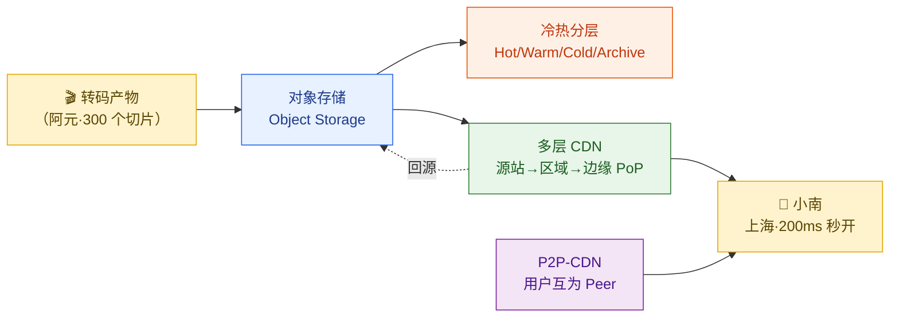
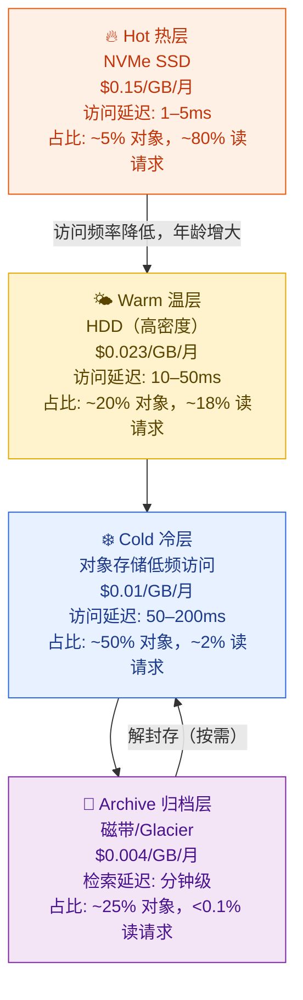
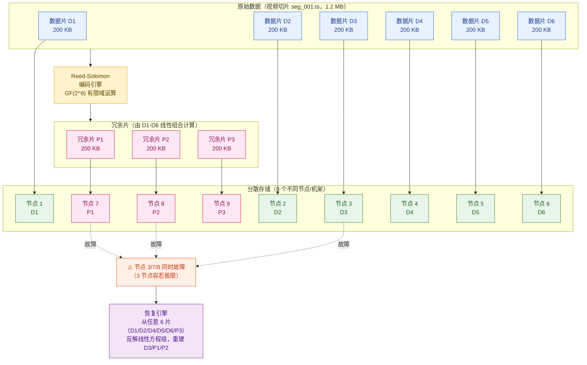
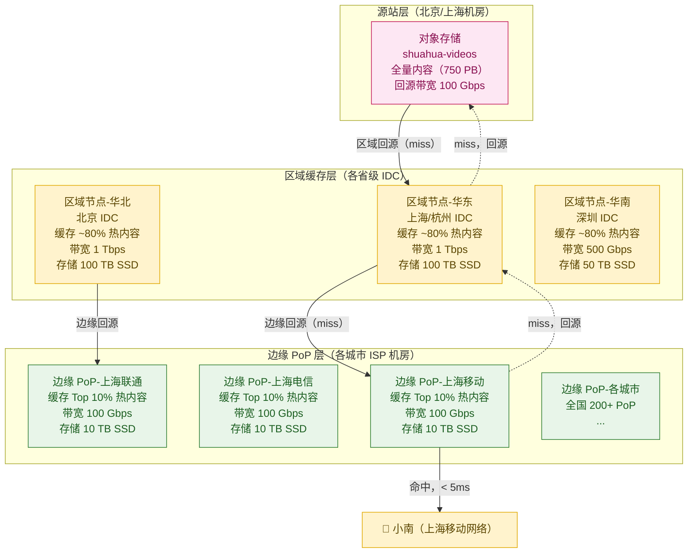
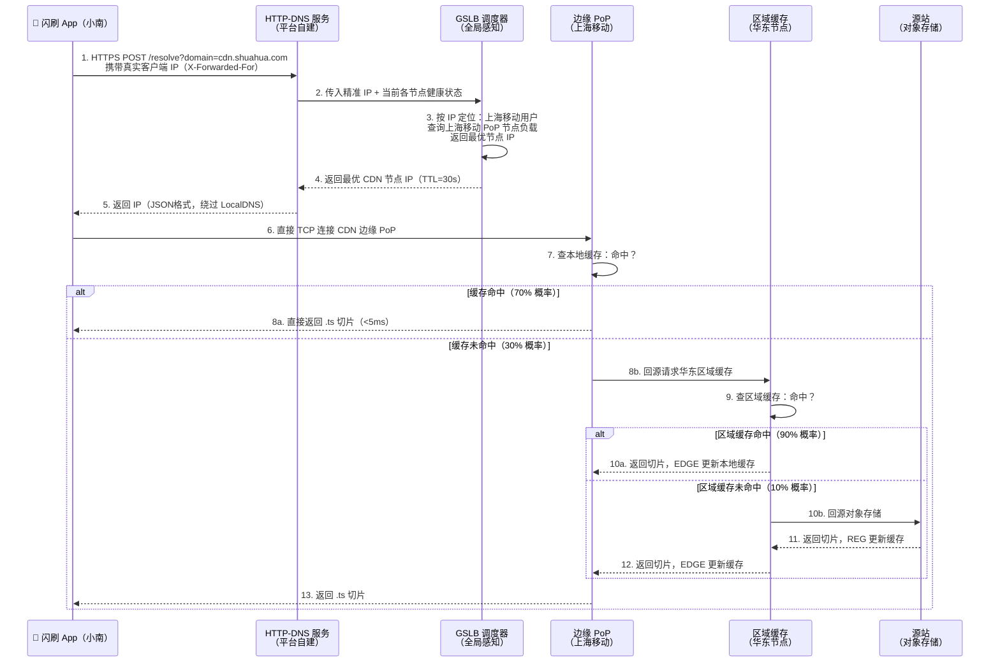
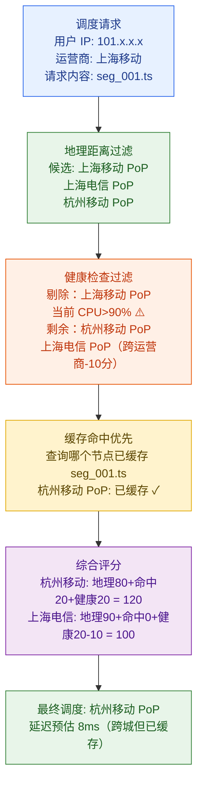
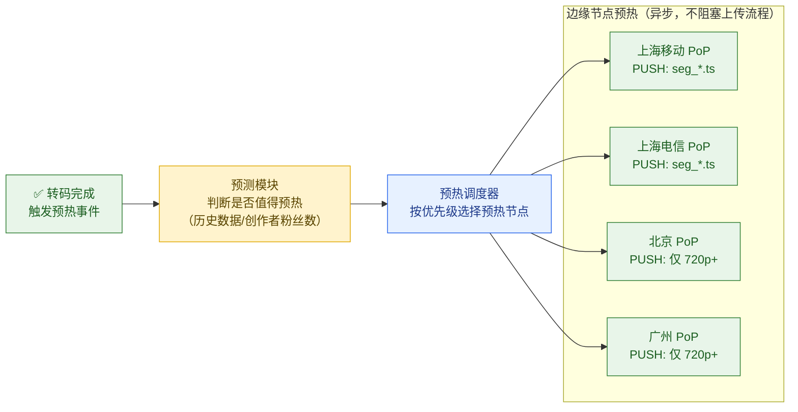
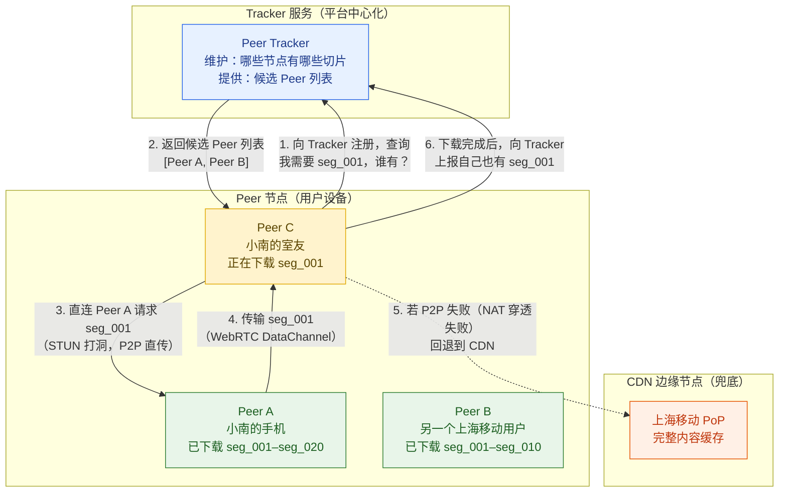
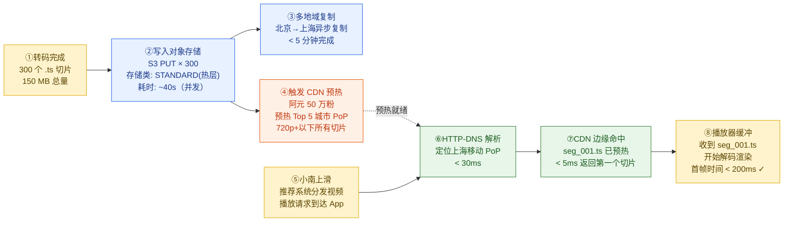

# 第 5 章 · 存储与 CDN 分发

> **所属系列**：《短视频平台系统设计 · 全景教程》第二部分 · 视频基础设施
> **上一章**：[第 4 章 · 转码流水线与编码优化](./04-转码流水线与编码优化.md)
> **下一章**：[第 6 章 · 播放体验与 QoS（秒开）](./06-播放体验与QoS秒开.md)

---

## 本章导读

第 4 章讲完了转码：阿元的《番茄牛腩》视频已经从一个 500 MB 的原始 MP4，被切分成 4 个码率档位（240p/480p/720p/1080p）、每个档位数十个 2 秒切片的 HLS 文件树，总共产生了约 300 个文件、合计 150 MB 的转码产物。

现在面临两个紧迫问题：

1. **这些文件存在哪里？** 平台每天上传 5000 万条视频，库存 50 亿条——总量已达 **PB 级**。不同年龄的视频访问模式天差地别：爆款视频一小时内被播放百万次，而一年前的长尾内容可能几周都无人问津。全部用同一种存储，要么成本爆炸，要么性能不够。

2. **文件如何到达小南的手机？** 小南在上海，平台的源站服务器在北京机房——如果每次播放都回源，光网络延迟就超过 50ms，加上带宽竞争，秒开根本无从谈起。

本章回答这两个问题，完整覆盖从**存储选型 → 冷热分层 → 纠删码 → 多层 CDN 架构 → 调度策略 → 预热与命中率 → P2P-CDN** 的完整分发链路。



**本章贯穿案例**：阿元的《番茄牛腩》从上传完成到进入 CDN 边缘节点，再到小南的上海手机收到第一个 .ts 切片的完整旅程。

---

## 5.1 存储挑战：PB 级规模下的四重矛盾

### 5.1.1 规模有多大

以「闪刷」平台为基准（第 1 章规模假设）：

| 维度 | 数值 | 计算过程 |
|------|------|---------|
| 视频库总量 | 50 亿条 | — |
| 每条视频转码产物 | ~150 MB | 4 码率 × 多切片 |
| 视频库存储总量 | **~750 PB** | 50 亿 × 150 MB |
| 日新增上传 | 5000 万条 × 150 MB | **≈ 7.5 PB/天** |
| 日读取流量（播放） | 1.5 亿 DAU × 平均 30 分钟 | **约 3 PB/天出口带宽** |

750 PB 是什么概念？即使按最便宜的 HDD 阵列（$25/TB），光硬件成本也超过 **1800 万美元**，加上机房、运维、带宽，年度存储成本轻松破亿。**存储成本是短视频平台 COGS（商品销售成本）中最大的单项支出之一。**

### 5.1.2 四重矛盾

短视频存储面临的核心矛盾，不是"存不下"而是"存贵了"：

```
矛盾 1：读热点 vs 长尾冷数据
  爆款视频（前 1% 内容）占约 80% 的播放量 → 需要高速存储
  长尾视频（后 80% 内容）几周甚至几月无人访问 → 不值得放高速存储

矛盾 2：高并发读 vs 写入成本
  爆款视频秒级百万次请求 → 要求存储支持高并发随机读
  批量写入（转码产物落盘）是顺序写 → 要求高吞吐写入

矛盾 3：成本压力 vs 可靠性要求
  视频内容是创作者资产，丢失不可接受（要求 99.999999% 持久性）
  存储成本必须控制（多副本 = 多倍成本）

矛盾 4：海量小文件 vs 大文件混合
  视频切片（.ts）通常 200KB–2MB，是"海量小文件"
  原始视频（.mp4）可达数 GB，是"大文件"
  传统文件系统在海量小文件场景下 inode 耗尽、元数据膨胀
```

解决这四重矛盾，需要三个核心机制：**对象存储**（解决海量对象管理）、**冷热分层**（解决成本 vs 性能矛盾）、**纠删码**（解决可靠性 vs 冗余成本矛盾）。

---

## 5.2 对象存储：为什么视频不能用文件系统或数据库

### 5.2.1 三种存储模型的对比

在讨论冷热分层之前，先理解为什么视频内容的首选是**对象存储（Object Storage）**，而非传统文件系统或数据库。

| 维度 | 传统文件系统（NFS/POSIX） | 关系型数据库（MySQL/PostgreSQL） | 对象存储（S3/Ceph/GCS） |
|------|-------------------------|-------------------------------|------------------------|
| 接口模型 | 树形目录 + inode | 表 + 行 + 字段 | KV（key → 对象二进制） |
| 扩展方式 | 纵向扩展为主 | 分片扩展复杂 | 水平线性扩展 |
| 小文件性能 | inode 竞争，元数据膨胀 | BLOB 字段有大小限制 | 天然支持，每个切片一个 key |
| 大文件支持 | 受限于单卷大小 | 不推荐（事务开销高） | 分段上传（Multipart）原生支持 |
| HTTP 直接访问 | 需要额外 Web 服务层 | 不直接支持 | **原生 HTTP GET，CDN 直接拉取** |
| 元数据管理 | 目录树占内存 | schema 固定 | 自定义 metadata 灵活附加 |
| 成本（PB 级） | 高（企业 NAS）| 极高（RDBMS 不适合 PB 级 BLOB）| **低**（商业云 $0.023/GB） |
| 版本化 | 需要自实现 | 需要自实现 | 原生支持对象版本 |
| 可靠性设计 | 需要上层 RAID | 主从复制 | 内建多副本/纠删码 |

**结论**：对象存储在 PB 级、海量对象、HTTP 直接拉取三个维度上全面胜出，是视频平台的标准选型。

### 5.2.2 对象存储的核心设计

对象存储的核心模型极度简单，这正是它能水平扩展到 EB 级的原因：

```
Bucket（桶）= 命名空间
Object（对象）= 二进制内容 + Metadata（键值对）
Key（键）= 对象的唯一标识符（路径格式，但不代表真实目录树）

例：
  Bucket: shuahua-videos
  Key:    videos/2024/01/15/vid_abc123/1080p/seg_001.ts
  Size:   1.2 MB
  Metadata: {
    "video-id": "vid_abc123",
    "quality": "1080p",
    "segment": "001",
    "codec": "h264",
    "duration": "2.0s",
    "upload-time": "2024-01-15T09:30:00Z"
  }
```

**核心操作**只有三个：`PUT`（写入）、`GET`（读取，支持 Range 请求）、`DELETE`（删除）。不支持原地修改（Immutable），这正好符合视频切片的特性——切片一旦生成就不会变化。

### 5.2.3 为什么 S3 兼容接口成为事实标准

AWS S3（Simple Storage Service，2006 年发布）定义了对象存储的 API 规范，此后几乎所有主流对象存储（阿里云 OSS、腾讯云 COS、Google GCS、MinIO、Ceph RadosGW）都实现了 S3 兼容接口。

这使得转码服务写入代码只需依赖 `s3:PutObject`，无需关心底层是哪个存储后端：

```python
import boto3

s3 = boto3.client(
    's3',
    endpoint_url='https://oss-cn-beijing.aliyuncs.com',  # 阿里云 OSS（S3 兼容）
    aws_access_key_id=ACCESS_KEY,
    aws_secret_access_key=SECRET_KEY,
)

def upload_segment(video_id: str, quality: str, seg_idx: int, data: bytes):
    """
    转码完成后，将 .ts 切片上传到对象存储
    key 格式遵循分层设计：{年/月/日}/{视频ID}/{质量}/{切片序号}.ts
    利用 S3 前缀做逻辑分区，便于生命周期策略按目录批量操作
    """
    key = f"videos/2024/01/15/{video_id}/{quality}/seg_{seg_idx:05d}.ts"
    s3.put_object(
        Bucket='shuahua-videos',
        Key=key,
        Body=data,
        ContentType='video/MP2T',
        Metadata={
            'video-id': video_id,
            'quality': quality,
            'segment': str(seg_idx),
        },
        # StorageClass 由冷热分层策略决定，见 5.3 节
        StorageClass='STANDARD',
    )
```

**阿元的案例**：转码集群将《番茄牛腩》的 300 个切片依次 PUT 到对象存储，总耗时约 40 秒（300 个并发 PUT，每个 ~130ms）。写入完成后，生成一个 .m3u8 播放列表文件，同样以 `PUT` 写入，作为播放器的入口清单。

---

## 5.3 冷热分层：用四层介质匹配访问频率

### 5.3.1 访问模式的长尾特性

视频访问遵循严格的**幂律分布（Power-law distribution）**：

$$
P(\text{rank} = k) \propto k^{-\alpha}, \quad \alpha \approx 0.8\text{–}1.2
$$

实测数据（行业参考）：
- **Top 1% 的视频**承担约 **80%** 的播放请求
- **Top 10% 的视频**承担约 **95%** 的播放请求
- **后 50% 的视频**每天访问次数可能为 **0**

这意味着：把所有视频都放在高速 SSD 上是极大浪费；但把所有视频都放在廉价介质上又会让热视频响应缓慢。**冷热分层**正是用不同价位的存储介质匹配不同访问频率的内容。

### 5.3.2 四层分层架构



| 层级 | 英文 | 存储介质 | 典型单价 | 访问延迟 | 适用内容 | 迁移触发条件 |
|------|------|---------|---------|---------|---------|------------|
| 热层 | Hot | NVMe SSD / 全闪存 | $0.15/GB/月 | 1–5 ms | 近 48 小时内有播放的视频；新上传视频默认进入 | 超过 48 小时未播放 |
| 温层 | Warm | HDD / SATA SSD 混合 | $0.023/GB/月 | 10–50 ms | 近 30 天有播放的视频 | 超过 30 天未播放，或上周播放次数 < 10 |
| 冷层 | Cold | 对象存储低频访问类 | $0.01/GB/月 | 50–200 ms | 上传超过 30 天、且近 90 天播放次数 < 5 | 超过 90 天未播放 |
| 归档 | Archive | 磁带 / AWS Glacier / 阿里云归档 | $0.004/GB/月 | 分钟级 | 超过 1 年无访问的内容；法规合规留存 | 超过 1 年未播放 |

**B 站实践参考**：B 站公开分享的方案中，核心热门视频放在全 SSD Ceph 集群（PB 级规模），冷数据下沉到 HDD 集群，整体存储成本较纯 SSD 降低约 **60–70%**。Netflix 在其技术博客中提到，分层存储相比全部使用标准层，每年可节省数亿美元存储成本。

### 5.3.3 迁移策略实现

分层迁移由一个**异步后台服务**（Life-cycle Manager）定期扫描对象的访问频率和年龄，执行迁移：

```python
import boto3
from datetime import datetime, timedelta

class LifecycleManager:
    """
    冷热分层生命周期管理器
    每小时扫描一次访问统计，触发跨层迁移
    """

    def __init__(self):
        self.s3 = boto3.client('s3', endpoint_url=OSS_ENDPOINT)
        self.redis = RedisClient()  # 访问计数存 Redis

    def get_access_count(self, video_id: str, days: int) -> int:
        """从 Redis 读取近 N 天的播放次数（Sorted Set 按日期分桶）"""
        keys = [f"play:{video_id}:{(datetime.now() - timedelta(days=i)).strftime('%Y%m%d')}"
                for i in range(days)]
        return sum(self.redis.mget_int(keys))

    def decide_storage_class(self, video_id: str, upload_age_days: int) -> str:
        """
        根据访问频率和年龄决定存储层级
        返回 S3 StorageClass 字符串
        """
        play_48h = self.get_access_count(video_id, days=2)
        play_30d = self.get_access_count(video_id, days=30)
        play_90d = self.get_access_count(video_id, days=90)
        play_1y  = self.get_access_count(video_id, days=365)

        if upload_age_days <= 2 or play_48h >= 1:
            return 'STANDARD'          # 热层：NVMe SSD

        elif play_30d >= 10:
            return 'STANDARD_IA'       # 温层：低频访问标准

        elif play_90d >= 5:
            return 'ONEZONE_IA'        # 冷层：单区域低频

        elif play_1y >= 1:
            return 'GLACIER'           # 归档层（分钟级恢复）

        else:
            return 'DEEP_ARCHIVE'      # 深度归档（小时级恢复）

    def migrate_object(self, bucket: str, key: str, target_class: str):
        """
        迁移对象到目标存储类
        S3/OSS 通过 CopyObject 实现跨存储类迁移（原子操作）
        """
        self.s3.copy_object(
            Bucket=bucket,
            CopySource={'Bucket': bucket, 'Key': key},
            Key=key,
            StorageClass=target_class,
            MetadataDirective='COPY',   # 保留原 Metadata
        )
```

**阿元的案例时间线**：
- **上传后 0–48 小时**：《番茄牛腩》在热层（NVMe SSD），响应最快。视频刚发布，可能被推荐系统推流，迎来第一波播放高峰。
- **第 3–30 天**：如果播放量维持（>10 次/30 天），降至温层（HDD）。CDN 边缘节点仍有缓存，绝大多数用户感知不到存储介质变化。
- **第 31–90 天**：长尾期，降至冷层，单次回源延迟稍长，但 CDN 缓存兜底。
- **1 年后**：如果没有显著播放，进入归档层。用户点播时需要先**解封存**（Restore）到冷层，等待数分钟后才能正常播放——平台通常会弹出"视频准备中"提示。

---

## 5.4 纠删码（Erasure Coding）：用 1.5 倍空间实现高可靠

### 5.4.1 多副本 vs 纠删码

传统上，存储系统通过**多副本**保证数据可靠性：3 副本方案将每份数据存三份，任意 2 份损坏都能恢复。但代价是 **3 倍存储空间**。

$$
\text{存储开销（3副本）} = 3 \times \text{原始大小}
$$

对于 750 PB 的视频库，3 副本意味着实际存储 **2250 PB**——成本极其高昂。

**纠删码（Erasure Coding，EC）** 是另一种思路：将原始数据切分为 **K 个数据片（data shards）**，通过 Reed-Solomon 等编码算法生成 **M 个冗余片（parity shards）**。存储时，这 K+M 个片分散存到 K+M 个不同节点，**任意 K 片可恢复完整数据**（即允许任意 M 个节点同时故障）。

$$
\text{存储开销（EC K+M）} = \frac{K + M}{K} \times \text{原始大小}
$$

### 5.4.2 常见 EC 配置对比

| 配置 | 数据片 K | 冗余片 M | 容错节点数 | 存储开销倍数 | 可用性（年） | 适用场景 |
|------|---------|---------|-----------|------------|------------|---------|
| 3 副本 | 1 | 2 | 2 | **3.0×** | 11个9 | 热数据、高并发读 |
| **4+2** | 4 | 2 | 2 | **1.5×** | 11个9 | 温/冷数据平衡 |
| **6+3** | 6 | 3 | 3 | **1.5×** | 12个9 | 冷数据、大规模集群 |
| 8+2 | 8 | 2 | 2 | **1.25×** | 11个9 | 归档数据最优成本 |
| 17+3 | 17 | 3 | 3 | **1.18×** | 12个9 | 超大规模归档（Azure/Facebook） |

以 **6+3** 配置为例，**相比 3 副本节省 50% 存储空间**：

$$
\text{6+3 开销} = \frac{6+3}{6} = 1.5 \times \text{原始大小}
$$

$$
\text{节省} = \frac{3.0 - 1.5}{3.0} = 50\%
$$

对于 750 PB 的视频库，从 3 副本切换到 6+3 EC，**可节省约 1125 PB 存储**，年度成本节省超亿美元。

### 5.4.3 EC 原理图解



### 5.4.4 EC 的代价：为什么热数据不用 EC

EC 虽然节省空间，但有两个明显缺点：

**1. 读放大（Read Amplification）**
- 3 副本读取：从任意一个副本直接读，单次 IO
- EC 6+3 读取：必须并行读取至少 6 个片后本地解码，需要 **6 次并发 IO**

```
3副本读取延迟 ≈ max(1次IO) ≈ 1ms（SSD）
EC 6+3 读取延迟 ≈ max(6次并发IO) + 解码CPU ≈ 5–15ms
```

对于高频访问的热视频，读放大会显著增加延迟和 CPU 开销。

**2. 修复写放大（Repair Write Amplification）**
当某个节点故障需要修复时，EC 需要读取其余 K 个片（网络 IO）再在新节点写入恢复的数据片——修复一个 200 KB 的片需要读取 6×200 KB = 1200 KB 的数据，写放大约 6 倍。高频写入场景会加剧这个问题。

**实践原则**：
- **热层**：3 副本，随机读快，写入无放大
- **温/冷层**：EC 4+2 或 6+3，节省空间，接受稍高延迟
- **归档层**：EC 8+2 或更高，最大化空间利用率

---

## 5.5 就近存储与多地域复制

### 5.5.1 就近存储的动机

「闪刷」平台有北京、上海、深圳三个主要机房，在全球还有海外节点。如果所有视频都写入北京机房，那么：
- 深圳用户上传视频，数据要跑 2000 km
- 海外用户上传，时延可能超过 200ms
- 北京机房承担全部写入压力

**就近存储策略**：用户上传时，接入服务根据用户 IP 路由到最近机房写入。阿元在杭州，就近写入上海机房。

### 5.5.2 多地域异步复制

视频写入"主机房"后，需要**异步复制**到其他地域，原因：
1. **容灾**：主机房故障时，其他地域有完整副本，可以切换服务
2. **CDN 回源就近**：深圳 CDN 节点回源时，从深圳机房拉比从北京拉快得多
3. **播放体验**：上海视频被复制到北京机房后，北方用户的 CDN 回源延迟更低

```yaml
# 多地域复制配置示例（阿里云 OSS 跨区域复制规则）
replication_rules:
  - id: beijing-to-shanghai
    source_bucket: shuahua-videos-bj
    dest_bucket: shuahua-videos-sh
    dest_region: cn-shanghai
    sync_role: acs:ram::1234567890:role/OSSReplicationRole
    status: Enabled
    prefix_filter: "videos/"     # 只复制视频内容，不复制临时文件
    historical_object_replication: false  # 增量复制，不回填历史
    action: ALL                  # PUT/DELETE 都同步

  - id: beijing-to-shenzhen
    source_bucket: shuahua-videos-bj
    dest_bucket: shuahua-videos-sz
    dest_region: cn-shenzhen
    status: Enabled
    prefix_filter: "videos/"
```

**复制延迟**：异步复制通常在 **1–5 分钟**内完成（同地域）或 **5–30 分钟**（跨地域），在此之前，其他地域 CDN 回源会先打到主机房。新视频上传后的 CDN 预热（5.7 节）会主动推送，覆盖这个窗口。

---

## 5.6 多层 CDN 架构：让切片飞速到达上海边缘

### 5.6.1 为什么不能直接从源站拉视频

假设不用 CDN，小南播放视频的路径是：

```
小南手机（上海）→ [互联网] → 源站（北京机房）→ 返回 .ts 切片
```

- 网络延迟：北京-上海 RTT 约 **30–50ms**
- 带宽竞争：源站同时服务数亿用户播放请求，带宽成本极高
- 单点风险：源站故障 = 全平台无法播放

CDN（Content Delivery Network）的核心思路是**把内容前置到离用户最近的节点（PoP，Point of Presence）**，用户从 PoP 拉取，延迟降至 **1–5ms**，带宽成本大幅降低（边缘带宽比中心带宽便宜 5–10 倍），源站压力也转移到 CDN 边缘。

### 5.6.2 三层 CDN 架构详解



**三层缓存的分工**：

| 层级 | 节点数 | 缓存什么 | 命中率目标 | 回源目标 |
|------|--------|---------|-----------|---------|
| 边缘 PoP | 200+ | Top 10% 热内容（过去 24 小时高频播放）| ~70% | 回源到区域缓存 |
| 区域缓存 | 5–10 | ~80% 热内容（过去 7 天有播放）| ~90%（对边缘回源的命中率）| 回源到源站 |
| 源站 | 2–3 | 全量兜底 | 100% | — |

**综合命中率**：

$$
r_{\text{综合}} = r_{\text{edge}} + (1 - r_{\text{edge}}) \times r_{\text{regional}} + (1 - r_{\text{edge}})(1 - r_{\text{regional}}) \times 1
$$

$$
= 0.70 + 0.30 \times 0.90 + 0.30 \times 0.10 \times 1 = 0.70 + 0.27 + 0.03 = 100\%
$$

但**源站被打到的比例**（源站命中率的反面）= $(1-0.70)(1-0.90) = 3\%$，意味着 97% 的请求不回源，**源站流量被降低 33 倍**。

### 5.6.3 B 站自建 CDN 架构实践

B 站在 2020 年前后实现了 CDN 的自建化，核心是将 CDN 拆分为 **4 层 LB（负载均衡）+ 7 层缓存/回源** 的架构：

- **4 层（L4）LB**：基于 LVS/IPVS，负责将用户连接按 IP/ISP 调度到最近的 7 层节点，处理 TCP/UDP 层转发，不感知应用协议
- **7 层（L7）缓存**：基于 Nginx + Lua 或自研 Go 缓存服务，实现 HTTP Range 请求支持、缓存命中判断、回源逻辑、切片级缓存

```nginx
# Nginx CDN 边缘节点核心配置（简化示例）
http {
    # 切片级缓存配置：按 .ts 文件内容 hash 做 cache key
    proxy_cache_path /data/cache levels=2:2 keys_zone=video_cache:1g
                     max_size=100g inactive=24h use_temp_path=off;

    server {
        listen 80;

        location ~ \.ts$ {
            proxy_cache video_cache;
            # cache key 不含 query string（避免相同内容被重复缓存）
            proxy_cache_key "$scheme$proxy_host$uri";
            proxy_cache_valid 200 24h;   # 切片 TTL 24 小时
            proxy_cache_valid 404 10s;   # 404 短 TTL，防止错误穿透

            # Range 请求直接透传（播放器按需拉切片）
            proxy_set_header Range $http_range;

            # 回源到区域缓存节点
            proxy_pass http://regional_cache_upstream;

            # 缓存命中标记（监控用）
            add_header X-Cache-Status $upstream_cache_status;
        }

        location ~ \.m3u8$ {
            # 播放列表不缓存（直播场景 TTL 极短；点播 TTL 5 分钟）
            proxy_cache video_cache;
            proxy_cache_key "$scheme$proxy_host$uri";
            proxy_cache_valid 200 5m;
            proxy_pass http://regional_cache_upstream;
        }
    }
}
```

---

## 5.7 CDN 调度：HTTP-DNS 与 GSLB 全局调度

### 5.7.1 为什么传统 DNS 不够用

传统 DNS 调度的流程：用户 DNS 请求 → Local DNS（ISP 分配）→ 平台权威 DNS → 返回 CDN 节点 IP。

**问题**：Local DNS 会缓存查询结果，TTL 内所有同机器的请求都路由到相同节点。而且 Local DNS 的位置未必能准确代表用户的实际位置（企业 VPN、跨运营商 DNS 等场景），导致调度不准。

国内主流方案是 **HTTP-DNS**（也称 HttpDNS）。

### 5.7.2 HTTP-DNS：绕过 Local DNS 污染



**HTTP-DNS 的优势**：
1. **精准定位**：App 直接上报真实 IP，GSLB 能精确到用户的运营商+城市
2. **绕过污染**：不经过 Local DNS，避免运营商 DNS 劫持和缓存问题
3. **动态感知**：TTL 可设置到 30s，节点故障后 30s 内所有新请求切换到健康节点
4. **国内合规**：国内监管对 Anycast 有限制，HTTP-DNS 是合规的替代方案

**海外方案**：国际场景通常用 **Anycast + DNS 加权**，不同 PoP 宣告相同 IP 段，BGP 自动路由到最近节点，无需 HTTP-DNS 的额外握手。

### 5.7.3 GSLB 全局调度策略

GSLB（Global Server Load Balancing）是 CDN 调度的大脑，综合多个维度决策：



GSLB 调度因素权重（参考值）：

| 因素 | 权重 | 说明 |
|------|------|------|
| 地理距离 / 网络延迟 | 40% | 最近节点优先，同运营商加分 |
| 节点健康度（CPU/带宽/错误率）| 30% | CPU>90% 或错误率>1% 降权 |
| 缓存命中（是否已有该内容）| 20% | 已缓存的节点加权，减少回源 |
| 节点容量剩余 | 10% | 剩余带宽/连接数 |

---

## 5.8 CDN 预热与命中率优化

### 5.8.1 新视频上传后的"首批用户问题"

**问题场景**：阿元的《番茄牛腩》刚完成转码（上传后约 2 分钟），推荐系统将其推给第一批 1000 位用户。此时 CDN 边缘节点对这个视频一无所知，1000 个用户同时播放，1000 个请求全部**穿透**到源站（称为 **Cache Stampede，缓存踩踏**）。源站单视频 QPS 瞬间飙升，如果视频恰好是爆款，这个问题会更严重。

**解决方案：CDN 预热（Prefetch / Warm-up）**



**预热策略分级**：

| 视频类型 | 预热范围 | 预热内容 | 触发条件 |
|---------|---------|---------|---------|
| 头部创作者（>100 万粉）新发布 | 全国所有 PoP | 所有码率 | 立即触发 |
| 普通创作者新发布 | 预测覆盖前 5 城市 PoP | 720p 以下 | 触发后 5 分钟内 |
| 运营活动内容（节日/热点）| 全国 + 部分海外 PoP | 所有码率 | 提前 30 分钟预热 |
| 普通长尾内容 | 不主动预热 | — | 靠自然缓存填充 |

```python
def trigger_cdn_prefetch(video_id: str, creator_id: str):
    """
    视频转码完成后触发 CDN 预热
    根据创作者规模决定预热范围
    """
    creator_fans = get_creator_fans(creator_id)
    segments = list_segments(video_id)  # 获取所有切片 key 列表

    if creator_fans >= 1_000_000:
        # 头部创作者：全量预热所有 PoP，所有码率
        pop_list = cdn_client.list_all_pops()
        qualities = ['240p', '480p', '720p', '1080p']
    elif creator_fans >= 10_000:
        # 中腰部创作者：预测用户地理分布，预热 Top 5 城市
        pop_list = predict_top_pops(creator_id, top_k=5)
        qualities = ['480p', '720p']
    else:
        # 小创作者：不主动预热，CDN 自然填充
        return

    # 构建预热 URL 列表（每个切片 × 每个码率 × 每个 PoP）
    prefetch_urls = [
        f"https://cdn.shuahua.com/videos/{video_id}/{q}/{seg}"
        for seg in segments
        for q in qualities
    ]

    # 调用 CDN 厂商预热 API（阿里云 CDN 举例）
    cdn_client.push_object_cache(
        object_path=prefetch_urls,
        area='domestic',    # 国内节点
        l2=True,            # 推送到 L2 区域节点（l2=True 才会继续下推到边缘）
    )
```

### 5.8.2 命中率优化技巧

**1. 缓存互斥（Cache Mutex / Dog-piling 防护）**

当缓存 miss 时，多个请求同时打向源站是一个常见的雪崩问题。解决方法：

```lua
-- Nginx Lua 实现缓存互斥（防止并发 miss 打穿源站）
local cache_key = ngx.var.uri
local lock = resty_lock:new("video_lock")
local elapsed, err = lock:lock(cache_key)

if not elapsed then
    -- 无法获取锁，说明另一个请求正在回源，等待一会儿后重试
    ngx.sleep(0.05)
    -- 重新查缓存，此时大概率已有结果
    local cached = cache:get(cache_key)
    if cached then
        ngx.say(cached)
        return
    end
end
-- 持锁回源，其他请求在等待
local res = fetch_from_upstream(cache_key)
cache:set(cache_key, res, 86400)
lock:unlock()
ngx.say(res)
```

**2. 闲时热资源外迁（Off-peak Migration）**

凌晨低峰期，CDN 后台将预测明天会热的内容主动推送到边缘节点（类似"预排货"到快递站），使得白天高峰期命中率更高。

**3. 切片 TTL 的平衡**

点播切片 TTL 可以设置较长（24 小时甚至更长），因为点播内容一旦生成就不变化。但**直播 HLS 切片**的 TTL 必须极短（2–10 秒），否则 CDN 缓存了过期的 .ts 文件，用户会收到"已过时"的直播画面——这是直播 CDN 最常见的故障类型之一。

**B 站案例**：B 站接入 DCDN（动态 CDN，结合静态加速和动态请求加速）后，响应耗时**降低 32%**，缓存命中率从 81% 提升至 91%。关键改进是：将区域节点的缓存容量从 HDD 升级到 SSD，同时增加了预热的智能预测（基于历史播放曲线预测次日热点）。

---

## 5.9 P2P-CDN：让用户互为节点

### 5.9.1 P2P-CDN 的核心思想

**传统 CDN** 是"中心化"的：平台建 CDN 节点，用户从 CDN 节点下载。每增加一个用户，平台的 CDN 带宽成本就增加一份。

**P2P-CDN（Peer-to-Peer CDN）** 是"去中心化"的补充：已经下载了某个切片的用户可以作为"Peer 节点"，直接把切片传给正在请求该切片的其他用户，减少从 CDN 服务器下载的量。

$$
\text{CDN 带宽节省率} = \frac{\text{P2P 交换的流量}}{\text{总播放流量}} \approx 30\%\text{–}50\%
$$

对于日播放量 3 PB 的「闪刷」，即使节省 30%，每天节省约 **0.9 PB 的 CDN 带宽成本**，年度节省极其可观。

### 5.9.2 P2P-CDN 数据交换流程



### 5.9.3 NAT 穿透：STUN/TURN 协议

P2P 最大的工程障碍是 **NAT（网络地址转换）**：绝大多数移动用户和家庭宽带用户处于 NAT 后面，没有公网 IP，两个 Peer 之间无法直接建立 TCP 连接。

**STUN（Session Traversal Utilities for NAT）**：通过 STUN 服务器探测自己的公网 IP 和端口，两个 Peer 互换各自的公网地址后尝试"打洞"（UDP hole-punching）。成功率约 80%（不同 NAT 类型影响）。

**TURN（Traversal Using Relays around NAT）**：当 STUN 打洞失败时，通过 TURN 中继服务器转发。代价是走了平台服务器，但比走 CDN 便宜（TURN 服务器不需要 CDN 的大带宽和缓存基础设施）。

```
P2P 成功率（行业参考）：
  对称 NAT + 对称 NAT: ~30%（最难穿透）
  锥形 NAT + 锥形 NAT: ~85%（常见的家用路由器）
  综合穿透成功率:     ~70%
  TURN 中继兜底后:   ~99%（但中继有带宽成本）
```

### 5.9.4 移动端的取舍

P2P-CDN 在**上传侧**对移动端用户并不友好：
- **电量**：P2P 上传需要保持 WiFi/5G 连接并持续处理请求，耗电增加 15–30%
- **流量**：上行流量消耗用户的移动数据套餐（虽然平台有义务提示）
- **热量**：持续上传导致手机发热

**实践分工**：

| 设备类型 | P2P 下载 | P2P 上传 | 说明 |
|---------|---------|---------|------|
| PC/Mac 浏览器 | ✅ 开启 | ✅ 开启 | 插电状态，不受流量限制 |
| 智能电视 / 机顶盒 | ✅ 开启 | ✅ 开启（WiFi 环境）| 常插电，流量不敏感 |
| 手机（WiFi 环境）| ✅ 开启 | ⚠️ 默认关闭，可设置开启 | 节约电量 |
| 手机（4G/5G）| ✅ 下载可开 | ❌ 禁止 | 避免消耗用户流量 |

**快手实践**：快手 P2P-CDN 系统（Fast P2P）在 PC 端开放率约 60%，有效降低了 CDN 带宽成本约 **35%**。腾讯视频 P2P 技术（基于 WebRTC）在 PC 上也达到了类似节省效果。

---

## 5.10 存储与 CDN 的成本模型

### 5.10.1 存储成本全景

将 5.2–5.4 节的技术选型落到实际成本估算（以「闪刷」750 PB 视频库为例）：

| 存储层 | 占视频库比例 | 数据量 | 副本/EC 策略 | 实际占用 | 单价（/GB/月）| 月度成本 |
|------|-----------|--------|------------|---------|-------------|---------|
| 热层（NVMe SSD）| 5% | 37.5 PB | 3 副本 | 112.5 PB | $0.15 | $~17M |
| 温层（HDD）| 20% | 150 PB | EC 4+2（1.5×）| 225 PB | $0.023 | $~5M |
| 冷层（低频访问）| 50% | 375 PB | EC 6+3（1.5×）| 562 PB | $0.01 | $~5.6M |
| 归档层（Glacier）| 25% | 187.5 PB | EC 8+2（1.25×）| 234 PB | $0.004 | $~0.9M |
| **合计** | 100% | **750 PB** | — | **~1133 PB** | — | **~$28.5M/月** |

**对比：若全部采用 3 副本热层**：750 PB × 3 = 2250 PB × $0.15 = **$337M/月**，相差近 **12 倍**！

### 5.10.2 CDN 带宽成本

```
日播放量: 3 PB/天 = 3 × 10^15 B / 86400s ≈ 278 Gbps 平均出口带宽
峰值倍数: 3× → 峰值约 830 Gbps

CDN 带宽计费（通常按 95th 百分位带宽峰值/月）：
  P95 峰值 ≈ 900 Gbps
  国内 CDN 带宽单价 ≈ $0.04/Gbps/小时 → $0.96/Gbps/天
  月度 CDN 成本 ≈ 900 Gbps × $0.96 × 30 ≈ $26M/月

P2P 节省 35%：实际 CDN 成本 ≈ $26M × 0.65 ≈ $17M/月
```

**总体基础设施成本**（存储 + CDN）：约 **$45M/月 ≈ $540M/年**。这与公开报道中头部短视频平台百亿规模基础设施投入的数量级相符。

---

## 5.11 常见易错点与工程陷阱

### 5.11.1 冷热不分层：成本爆炸

**错误做法**：早期平台为了简单，把所有视频放在相同存储类型（如全 SSD 标准层）。

**代价**：随视频库增长，存储成本线性增长，且 80% 的存储空间被从未被访问的冷数据占用。

**教训**：上线初期就应设计生命周期管理策略，哪怕初期只分热/冷两层。Netflix 内部测试表明，分层存储相比全部使用 S3 标准层，**节省存储成本 60–70%**。

### 5.11.2 EC 用于热数据：写放大致性能下降

**错误做法**：为了节省存储空间，对高频访问的热视频也采用 EC 6+3 策略。

**代价**：
- 读请求需要并发读 6 个片再解码，P99 延迟从 2ms 升至 20ms
- 转码产物写入时，EC 编码 + 9 节点并发写入，吞吐量下降
- 节点故障修复时，EC 修复操作占满网络带宽，影响在线请求

**教训**：EC 只用于写少读少的冷/归档数据；热数据坚持 3 副本。

### 5.11.3 CDN 切片缓存 TTL 设太长：直播切片过期

**错误做法**：为了提高命中率，将所有 `.ts` 文件 TTL 统一设为 24 小时。

**代价**：直播流的 HLS 切片每 2 秒更新一次，TTL 24 小时意味着 CDN 节点缓存了 24 小时前的"过时切片"，用户看到的直播画面不是实时的，甚至完全错误。

**教训**：
- 点播切片：TTL = 24 小时（内容不变）
- 直播切片：TTL = 2–5 秒（与切片时长同量级）
- 直播 m3u8 播放列表：TTL = 1 秒甚至 no-cache（每次都需要最新列表）

```nginx
# 根据请求路径区分 TTL
location /live/ {
    # 直播切片：极短 TTL
    proxy_cache_valid 200 3s;
    add_header Cache-Control "max-age=3";
}

location /vod/ {
    # 点播切片：长 TTL（内容不可变）
    proxy_cache_valid 200 86400s;
    add_header Cache-Control "max-age=86400, immutable";
}
```

### 5.11.4 不预热：爆款视频打穿源站

**错误场景**：运营活动推出一个高曝光视频（如春晚视频、重大赛事精彩集锦），未提前预热。推荐系统同时将视频推给数百万用户，首批请求全部穿透到源站，源站瞬间过载，响应延迟从 50ms 升至 5000ms。

**代价**：大量用户首帧时间超过 3 秒，甚至播放失败，投诉激增，运营活动效果大打折扣。

**教训**：
- 运营活动视频**提前 30 分钟**触发全量预热
- 推荐系统在推流前确认 CDN 预热状态（可通过回调事件联动）
- 源站配置**限速（Rate Limiting）**，防止单视频回源超过阈值

### 5.11.5 EC 修复风暴：节点故障级联

**错误场景**：EC 6+3 集群中，一个机架（含 3 个节点）因停电同时故障，系统触发 EC 修复，需要读取其余所有节点数据重建 3 个节点的数据，产生大量修复流量，导致集群其他节点 IO 被修复任务占满，正常播放请求延迟暴增。

**解决方案**：EC 修复任务设置 IO 优先级限制（QoS），限制修复带宽不超过总带宽的 30%，确保在线请求优先。同时优化 EC 修复算法，优先修复"命中率高的切片"。

---

## 5.12 端到端案例回顾：《番茄牛腩》的存储与分发旅程

至此，我们可以完整地梳理阿元的视频从转码完成到小南收到第一个切片的全链路：



**关键时间节点**：
- T+0s：转码完成，触发写入
- T+40s：全部切片写入对象存储
- T+42s：触发 CDN 预热（并行进行）
- T+5min：多地域复制完成
- T+10min：Top 5 城市 PoP 预热完成（视频已可被正常分发）
- 小南播放时：HTTP-DNS 定位最近 PoP → 边缘命中 → 切片到达 → 首帧 < 200ms

---

## 本章小结

本章系统讲解了短视频平台存储与 CDN 分发的核心设计，涉及的关键决策和结论总结如下：

| 核心决策 | 选择 | 理由 |
|---------|------|------|
| 视频文件存哪里 | 对象存储（S3 兼容）| 海量对象、不可变、HTTP 直接拉取、水平扩展 |
| 冷热如何分层 | 4 层（Hot NVMe / Warm HDD / Cold 低频 / Archive 磁带）| 幂律分布导致绝大多数内容极少访问，按频率匹配介质 |
| 热数据可靠性 | 3 副本 | 读快、随机 IO 好、无解码开销 |
| 冷数据可靠性 | EC 6+3 或 4+2 | 1.5× 开销 vs 3 副本 3× 开销，节省 50% 空间 |
| CDN 架构层次 | 三层：源站 → 区域缓存 → 边缘 PoP | 将 97% 的请求拦截在边缘，源站仅承受 3% |
| CDN 调度方案 | HTTP-DNS（国内）/ Anycast+DNS（海外）| 精准定位，绕过 Local DNS 污染 |
| 新视频首次分发 | CDN 预热（按创作者规模分级）| 避免首批用户请求打穿源站 |
| 带宽成本优化 | P2P-CDN（PC/TV 端优先）| 节省 30–50% CDN 带宽，年度成本优化显著 |

**三个最重要的反例**（不做会踩坑）：
1. 全量 SSD 不分层 → 存储成本是分层方案的 **12 倍**
2. 热数据用 EC → 读延迟增加 **3–10 倍**
3. 直播 TTL 设太长 → 用户收到 **过期切片**，直播体验崩溃

---

存储好了，CDN 备好了，内容也到达了上海边缘节点。但小南的首帧时间能否达到 < 200ms 的目标，还取决于**播放器如何高效地消费这些切片**——预加载策略、自适应码率（ABR）算法、播放器池化……这些都是下一章「播放体验与 QoS」的核心主题。

---

## 参考来源

1. [Amazon S3 Storage Classes Documentation](https://aws.amazon.com/s3/storage-classes/) — AWS 官方文档，介绍对象存储各层级的定价、延迟和适用场景（2024）
2. [Backblaze Hard Drive Stats 2023](https://www.backblaze.com/cloud-storage/resources/hard-drive-test-data) — 大规模 HDD 阵列故障率实测数据，支撑 EC 设计决策
3. [B站 DCDN 技术实践：响应耗时降低 32%](https://www.bilibili.com/read/cv17236476) — B站工程团队公开分享 DCDN 接入效果，命中率与延迟数据
4. [Ceph Documentation: Erasure Code](https://docs.ceph.com/en/latest/rados/operations/erasure-code/) — Ceph 纠删码官方文档，Reed-Solomon 编解码原理与 K+M 参数配置
5. [Netflix Tech Blog: Optimizing S3 Storage Costs](https://netflixtechblog.com/how-netflix-optimizes-aws-s3-storage-costs-by-using-tiered-storage-9ad01c4d55ec) — Netflix 分层存储实践，标准层 vs 分层方案成本对比
6. [WebRTC for the Curious: STUN/TURN](https://webrtcforthecurious.com/docs/03-connecting/) — NAT 穿透原理，STUN/TURN 协议详解，P2P 建连机制
7. [快手基础架构部：P2P 加速技术在短视频的应用](https://tech.kuaishou.com/post/p2p-cdn) — 快手 P2P-CDN（Fast P2P）技术分享，带宽节省 35% 数据
8. [阿里云 CDN 产品文档：CDN 节点调度原理](https://help.aliyun.com/zh/cdn/product-overview/how-does-alibaba-cloud-cdn-work) — HTTP-DNS、GSLB 调度机制、边缘节点架构的官方说明（2024）
