# 第 6 章 · 播放体验与 QoS（秒开）

> **所属系列**：《短视频平台系统设计》第二部分 · 视频基础设施
> **上一章**：[第 5 章 · 存储与 CDN 分发](./05-存储与CDN分发.md)
> **下一章**：[第 7 章 · 推荐系统总体架构](./07-推荐系统总体架构.md)

---

## 本章导读

第 3–5 章把阿元的《番茄牛腩》从上传、转码到 CDN 边缘节点全程护送到位。现在，小南晚上躺在床上打开「闪刷」，手指向上一划——这条视频能在多快时间内出现在屏幕上？

这就是本章的核心问题：**秒开（Instant Play）**。

秒开不是一个锦上添花的功能，而是短视频平台的**生死线**。首帧延迟超过 1 秒，用户就会再划走；超过 3 秒，超过 20% 的用户会直接关掉 App。在沉浸式单列 Feed 里，用户每分钟上划 6–10 次，每次都是一次新的首帧等待——秒开的体验被放大了 10 倍。

本章以小南上划刷到《番茄牛腩》为主线，在弱网地铁场景下如何不卡顿为辅线，系统讲解：

- **TTFF 的拆解与目标**：首帧时间到底由哪几段组成，行业顶尖水平是多少
- **秒开优化的四个层次**：网络、解码、架构、体验——每层能省多少毫秒
- **预加载策略**：何时预取、预取几条、如何不抢当前播放带宽
- **ABR 自适应码率**：弱网地铁里的降档决策，BBA 与 MPC 算法详解
- **封装协议**：HLS / DASH / CMAF 的技术差异与选型
- **QoE 指标体系**：怎么量化"播放体验好不好"，卡顿率 < 0.5% 怎么做到

> 本章是第二部分（基础设施）与第三部分（推荐）的衔接点：好的基础设施只是"把内容送到用户面前"，而播放体验决定了用户是否真的"看进去了"。播放质量直接影响完播率，而完播率是推荐系统最重要的正向信号（第 9 章详述）。

---

## 6.1 秒开是生死线——首帧延迟与留存的关系

### 6.1.1 数据说话

Akamai 和 Google 的大规模研究均指出，**视频加载延迟每增加 1 秒，放弃率上升约 5–8 个百分点**。对于短视频平台，这一效应更为显著——因为用户进入时预期是"即刻娱乐"，心理容忍阈值远低于点播长视频。

Mux 在 2022 年的 State of Streaming 报告中给出了更精确的数据：

| 首帧等待时间 | 放弃率（视频未开始即离开） | 留存影响 |
|------------|------------------------|---------|
| < 200 ms   | < 1%                   | 基准 |
| 200–500 ms | ~3%                    | 留存 -2% |
| 500ms–1s   | ~9%                    | 留存 -8% |
| 1–2s       | ~18%                   | 留存 -15% |
| 2–4s       | ~31%                   | 留存 -25% |
| > 4s       | ~52%                   | 留存 -40%+ |

**短视频场景的放大效应**：用户在沉浸式 Feed 里每次上划都是一次"首帧等待"，平均每分钟触发 6 次。假设一次等待 800ms（放弃率 13%），1 分钟内触发 6 次，累计离开概率约 `1 - (1-0.13)^6 ≈ 55%`。秒开从"功能指标"变成了"留存保障线"。

### 6.1.2 小南上划的那一刻

让我们把抽象指标还原成具体场景：

> 23:07，小南躺在床上，Wi-Fi 信号格四格，手指轻轻上划。推荐系统（< 100ms）已经把《番茄牛腩》排在了下一位。现在的问题是：她能在多快看到第一帧番茄炒的画面？

抖音头部目标：**< 200ms**。快手 2020 年公开数据：**P50 < 300ms**。行业基准（非头部）：**< 500ms**。

这 200ms 的时间预算，需要整个播放器、网络、CDN 联动才能达到。

---

## 6.2 TTFF 拆解——200ms 的时间都花在哪里

### 6.2.1 首帧时间的定义

**TTFF（Time To First Frame）** = 从用户触发播放动作（上划到位）到屏幕上出现第一帧画面的时间。

注意区分两个相近概念：
- **TTFF**：第一帧像素出现（本章讨论的核心）
- **TTFB（Time To First Byte）**：第一个字节到达播放器（网络层指标，TTFF 的子集）
- **TTI（Time To Interactive）**：视频可以流畅播放且不卡顿

### 6.2.2 TTFF 耗时分解

一次从零开始的播放请求，TTFF 可以拆解为以下阶段：

```
触发播放
  ├─ DNS 解析          CDN 域名解析，无缓存时 20–80ms，有缓存时 0–1ms
  ├─ TCP 连接建立       三次握手，RTT × 1.5，国内 CDN 约 10–30ms
  ├─ TLS 握手          HTTPS 额外 1-RTT，约 10–20ms（TLS 1.3 降至 0-RTT）
  ├─ 首片请求发送        HTTP GET /video/xxx/seg_0.ts，< 1ms
  ├─ 首片下载           取决于片段大小与带宽
  │   通常: 首个 GOP 约 200–500KB，4Mbps 带宽下约 50–100ms
  ├─ 解封装（Demux）    解析容器格式（.ts/.fmp4），提取视音频流，1–5ms
  ├─ 解码（Decode）     
  │   软解: 首帧 50–100ms（中端机）
  │   硬解: 首帧 10–30ms（利用 GPU 加速）
  └─ 渲染（Render）     上传纹理到 GPU，显示到屏幕，5–15ms
```

**典型耗时分解表（无任何优化，4G 网络，国内 CDN）：**

| 阶段 | 耗时 | 可优化程度 | 优化手段 |
|------|------|----------|---------|
| DNS 解析 | 30–80ms | ★★★★★ | DNS 预解析、HTTPDNS |
| TCP 连接 | 20–40ms | ★★★★☆ | 连接预建立、HTTP/2 复用 |
| TLS 握手 | 15–25ms | ★★★★☆ | TLS 1.3、Session Ticket 复用 |
| 首片等待（TTFB） | 5–20ms | ★★★★☆ | 就近 CDN、边缘节点 |
| 首片下载 | 50–150ms | ★★★☆☆ | 首片精简、CDN 高命中率 |
| 解封装 | 1–5ms | ★☆☆☆☆ | 忽略不计 |
| 首帧解码 | 20–100ms | ★★★★☆ | 硬解、预解码 |
| 渲染 | 5–15ms | ★★☆☆☆ | 预渲染 |
| **合计（无优化）** | **146–435ms** | — | — |

如果不做任何优化，TTFF 中位数在 250–400ms，P95 可能超过 800ms。而抖音 < 200ms 的目标，意味着几乎每个阶段都要做到最优。

### 6.2.3 秒开优化层次总览

下面这张图是本章的"地图"，展示了秒开优化的四个层次及其目标收益：

```mermaid
flowchart TB
    subgraph L4["第四层：体验层（消灭等待感知）"]
        direction LR
        E1["首帧预渲染替代封面图<br/><br/>省一次 HTTP 请求 + 渲染切换<br/>节省 20–50ms"]:::pink
        E2["骨架屏/封面即时呈现<br/><br/>视觉上消灭空白感<br/>感知 TTFF 降至 0"]:::pink
    end

    subgraph L3["第三层：架构层（消灭初始化开销）"]
        direction LR
        A1["播放器池化复用<br/><br/>预创建 3–5 个播放器实例<br/>节省初始化 50–150ms"]:::purple
        A2["App 启动时异步初始化<br/><br/>主线程不阻塞<br/>节省 30–80ms"]:::purple
        A3["滑动激活下一实例<br/><br/>滑动时绑定播放器+URL<br/>节省切换时间 10–30ms"]:::purple
    end

    subgraph L2["第二层：解码层（提前解码）"]
        direction LR
        D1["预解码 Pre-Decode<br/><br/>滑动卡片时解码首帧<br/>节省 20–100ms"]:::green
        D2["硬件解码优先<br/><br/>GPU 解码代替 CPU<br/>节省 30–80ms"]:::green
    end

    subgraph L1["第一层：网络层（提前建连+提前取数据）"]
        direction LR
        N1["DNS 预解析<br/><br/>App 启动时解析 CDN 域名<br/>节省 30–80ms"]:::blue
        N2["连接预建立<br/><br/>TCP+TLS 提前完成<br/>节省 35–65ms"]:::blue
        N3["预加载首片数据<br/><br/>当前播 60%时取下一条<br/>节省 100–200ms（首片下载）"]:::blue
        N4["就近 CDN + P2P<br/><br/>边缘命中率 > 95%<br/>节省 TTFB 5–15ms"]:::blue
    end

    L1 --> L2 --> L3 --> L4
    L4 --> RESULT["目标：TTFF < 200ms<br/>（抖音头部水准）"]:::yellow

    style L1 fill:#e7f1ff,stroke:#2563eb,color:#1e3a8a,stroke-width:2px
    style L2 fill:#e8f5e9,stroke:#2e7d32,color:#1b5e20,stroke-width:2px
    style L3 fill:#f3e5f5,stroke:#7b1fa2,color:#4a148c,stroke-width:2px
    style L4 fill:#fde7f3,stroke:#c2185b,color:#880e4f,stroke-width:2px
    style RESULT fill:#fff3cd,stroke:#e0a800,color:#5a4500,stroke-width:3px

    classDef blue fill:#e7f1ff,stroke:#2563eb,color:#1e3a8a
    classDef green fill:#e8f5e9,stroke:#2e7d32,color:#1b5e20
    classDef purple fill:#f3e5f5,stroke:#7b1fa2,color:#4a148c
    classDef pink fill:#fde7f3,stroke:#c2185b,color:#880e4f
    classDef yellow fill:#fff3cd,stroke:#e0a800,color:#5a4500
```

四个层次**从底到顶叠加**，理想情况下可以做到：

| 层次 | 节省时间 | 叠加后 TTFF |
|------|---------|-----------|
| 无优化基线 | — | ~350ms |
| + 网络层（预连接+预加载） | 节省约 150ms | ~200ms |
| + 解码层（预解码+硬解） | 再省约 60ms | ~140ms |
| + 架构层（播放器复用） | 再省约 80ms | ~60ms |
| + 体验层（封面预渲染） | 再省约 30ms | **~30ms（感知 TTFF）** |

---

## 6.3 网络层优化——比用户想起来更早

### 6.3.1 DNS 预解析与 HTTPDNS

**问题**：每次新 CDN 域名请求都要先做 DNS 解析，耗时 30–80ms，且运营商 DNS 解析结果不准确（调度到远端节点）。

**解法一：DNS 预解析**

在 App 启动或进入 Feed 页时，提前对主要 CDN 域名做 DNS 解析并缓存：

```swift
// iOS 端 DNS 预解析（App 启动时调用）
class DNSPrefetcher {
    private let cdnDomains = [
        "cdn1.shangshua.com",
        "cdn2.shangshua.com",
        "cdn3.shangshua.com"
    ]

    func prefetchOnAppLaunch() {
        // 并行预解析所有 CDN 域名，缓存 TTL 60 秒
        for domain in cdnDomains {
            DispatchQueue.global(qos: .utility).async {
                // 利用 getaddrinfo 强制触发 DNS 解析，结果由系统缓存
                var hints = addrinfo()
                hints.ai_family = AF_UNSPEC
                var res: UnsafeMutablePointer<addrinfo>?
                getaddrinfo(domain, nil, &hints, &res)
                if let res = res { freeaddrinfo(res) }
            }
        }
    }
}
```

**解法二：HTTPDNS（绕过运营商 DNS，直接返回最优 IP）**

运营商 DNS 存在"错误调度"问题（北京用户被解析到广州节点），HTTPDNS 通过 HTTP 请求直接向权威调度服务查询，返回当前用户最优 CDN IP：

```
传统 DNS 路径（可能错误调度）：
App → 运营商 DNS → 根域 → CDN 权威 DNS → 广州节点 IP（错误！）

HTTPDNS 路径：
App → https://httpdns.shangshua.com/resolve?domain=cdn1&client_ip=x.x.x.x
    ← {"ip": "120.xx.xx.xx", "ttl": 60}  ← 北京最优节点 IP（正确）
```

HTTPDNS 不仅准确，还省去了 DNS 递归查询的往返时间，延迟可降至 5–10ms。

### 6.3.2 连接预建立（Connection Pre-establishment）

**问题**：TCP 三次握手 + TLS 握手需要 35–65ms，每次新视频都要重走一遍。

**解法**：在当前视频开始播放后，立即预建立后续视频所需的 TCP/TLS 连接，提前"热身"。

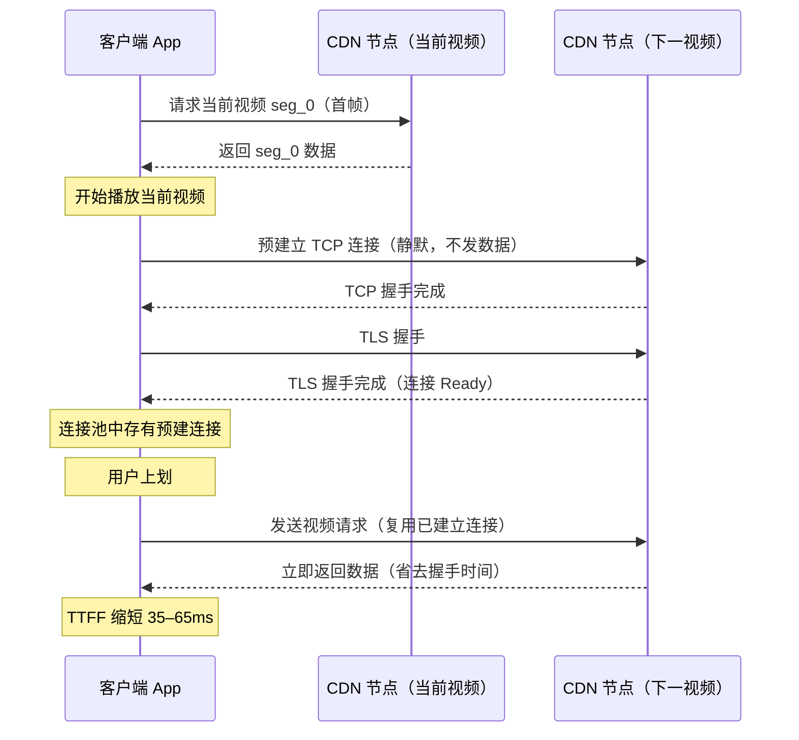

现代播放器通常维护一个**连接池（Connection Pool）**，持有 3–5 条预建立的 HTTPS 连接，覆盖 Feed 中接下来几条视频的 CDN 节点。

### 6.3.3 就近 CDN 接入

参考第 5 章，CDN 命中率 > 95% 是秒开的前提条件。TTFB（Time To First Byte）优化路径：

- **多层 CDN 架构**：用户 → L1 边缘节点（城市级）→ L2 汇聚节点（大区级）→ 源站
- **智能调度**：HTTP-DNS 根据客户端 IP、运营商、实时负载，返回最优 CDN IP
- **目标**：TTFB P99 < 30ms（国内主要城市）

---

## 6.4 预加载策略——不让用户等

### 6.4.1 预加载的时机与数量

预加载（Preload）是秒开最核心的优化手段：在用户还在看当前视频时，悄悄把接下来几条视频的首段数据取回来。

**何时触发预加载？**

```
播放进度到 60–70% 时触发预加载下一条（而非 100%）
原因：
  - 提前触发，给足时间下载
  - 不在视频开始就触发（避免抢首帧带宽）
  - 不等播放结束（太晚，用户已经上划）
```

**预取几条？**

根据网络条件动态决定：

| 网络状态 | 预取条数 | 每条预取量 |
|---------|---------|----------|
| Wi-Fi（> 10Mbps）| 3–5 条 | 首片 + 前 5 秒数据 |
| 4G（3–8Mbps）| 2–3 条 | 首片 + 前 3 秒数据 |
| 3G/弱 4G（< 2Mbps）| 1–2 条 | 仅首片（I 帧） |
| 极弱网（< 500kbps）| 0–1 条 | 仅首帧 |

**关键约束：预加载不能抢当前播放带宽**

这是预加载策略最容易犯的错误。如果预加载请求与当前播放请求争夺带宽，反而会导致当前视频卡顿——越优化越差。

正确的做法是"**带宽感知预加载**"：

```python
class PreloadScheduler:
    """
    带宽感知预加载调度器
    核心原则：预加载的优先级 < 当前播放
    """

    def should_preload(self, context: PlaybackContext) -> bool:
        """判断当前是否应该触发预加载"""
        # 条件1：当前播放缓冲足够（缓冲 > 5 秒）
        if context.buffer_remaining < 5.0:
            return False  # 当前播放都快卡了，不预加载

        # 条件2：播放进度到 60% 以上
        if context.progress_ratio < 0.60:
            return False  # 太早，留余量

        # 条件3：估算可用带宽足够
        estimated_free_bandwidth = (
            context.estimated_bandwidth - context.current_download_rate
        )
        if estimated_free_bandwidth < self.MIN_PRELOAD_BANDWIDTH_KBPS:
            return False  # 带宽不够，不预加载

        return True

    def preload_segments(
        self,
        next_videos: List[VideoMeta],
        available_bandwidth_kbps: float
    ) -> None:
        """
        执行预加载：HTTP 优先级降低，不与当前播放抢带宽
        """
        for i, video in enumerate(next_videos[:self.max_preload_count]):
            # 使用低优先级 HTTP 请求（Low Priority Fetch）
            # iOS: URLRequest.networkServiceType = .background
            # Android: OkHttp priority = BACKGROUND
            request = DownloadRequest(
                url=video.first_segment_url,
                priority=RequestPriority.LOW,   # 关键：低优先级
                max_bytes=self.calc_preload_size(i, available_bandwidth_kbps)
            )
            self.download_manager.enqueue(request)

    def calc_preload_size(self, position: int, bandwidth_kbps: float) -> int:
        """
        根据位置和带宽计算预取量（字节）
        - 第 0 条（最近）：多取，5 秒数据
        - 第 1 条：3 秒数据
        - 第 2+ 条：仅首片（I 帧）
        """
        TARGET_DURATIONS = [5.0, 3.0, 1.0, 1.0, 1.0]  # 秒
        target_duration = TARGET_DURATIONS[min(position, 4)]
        # 假设视频码率为当前估算带宽的 70%（留余量给当前播放）
        assumed_bitrate_kbps = bandwidth_kbps * 0.7
        return int(target_duration * assumed_bitrate_kbps * 1000 / 8)
```

### 6.4.2 预加载时序图

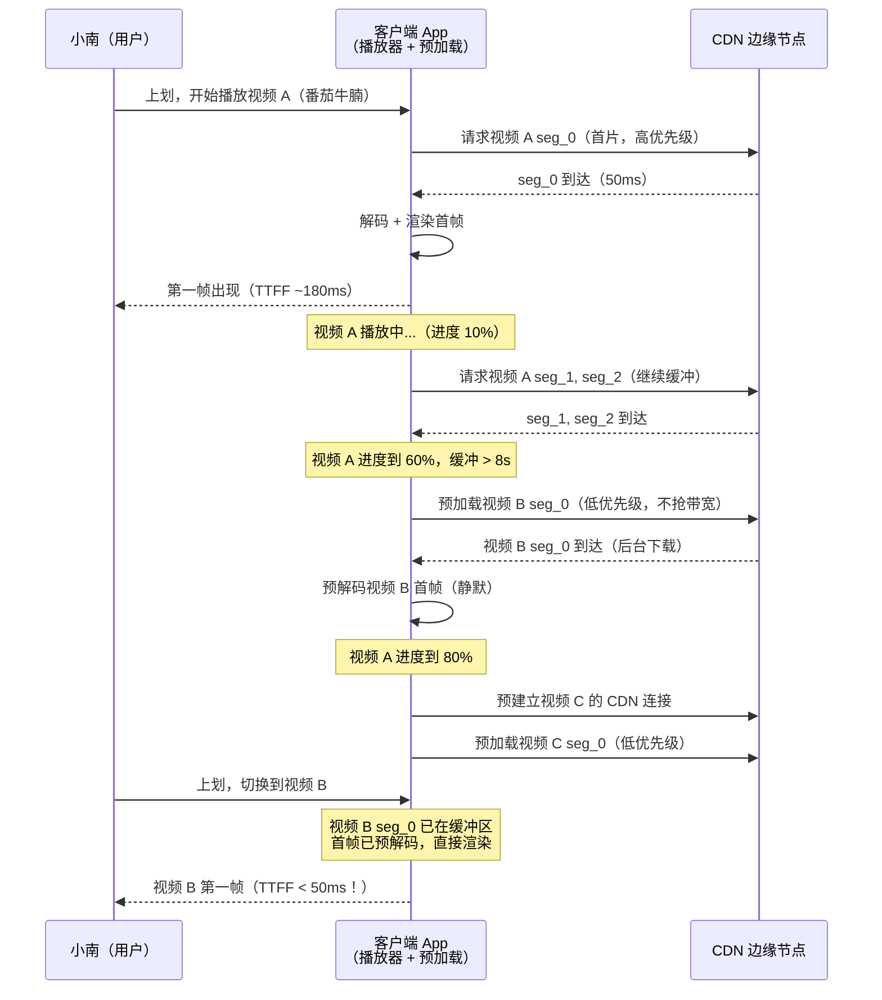

### 6.4.3 首片（First Segment）设计

预加载的"首片"不是随意取的，需要专门设计：

- **首片必须以 I 帧（关键帧）开始**：否则无法独立解码
- **首片时长建议 1–2 秒**：而非标准的 6–10 秒切片。首片越短，TTFF 越低（下载快），代价是增加切片数量（第 4 章的 GOP 设计）
- **抖音的做法**：首片单独设计为约 400–600KB（1 秒内数据），后续切片恢复 6 秒正常时长。这样首片下载时间在 4G 网络下约 70–100ms，大幅降低 TTFF

---

## 6.5 解码层优化——预解码与硬件加速

### 6.5.1 预解码（Pre-Decode）

播放器不只在"用户要看"的瞬间才开始解码，而是**在用户还没划到之前就提前完成首帧解码**，等用户划到位，直接把已解码的帧推到渲染管线。

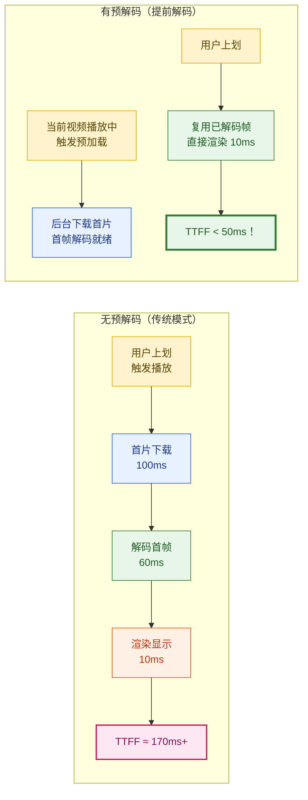

**预解码的时机**：

- 当用户即将滑到当前卡片时（手指滑动超过 50% 阈值）
- 已在缓冲区的下一条视频 seg_0 到达时
- 注意：**预解码不等于预播放**，首帧解码完成后暂停（不消耗更多解码资源），等待用户真正划到位再渲染

**资源控制**：
- 中低端设备（内存 < 3GB）：只预解码下 1 条
- 高端设备（内存 > 4GB）：可预解码下 2–3 条

### 6.5.2 硬件解码（Hardware Decode）

| 解码方式 | 首帧延迟 | CPU 占用 | 功耗 | 适用场景 |
|---------|---------|---------|------|---------|
| 软解（FFmpeg CPU）| 50–120ms（低端机）| 高（30–80%）| 高 | 格式兼容性要求高时 |
| 硬解（MediaCodec/VideoToolbox）| 10–30ms | 低（< 5%）| 低 | **短视频播放主路径** |

**Android 硬解**（MediaCodec）：
```java
// Android 硬件解码示例
MediaCodec decoder = MediaCodec.createDecoderByType("video/avc"); // H.264
MediaFormat format = MediaFormat.createVideoFormat("video/avc", 1080, 1920);
// 配置硬解，输出到 Surface（直接渲染）
decoder.configure(format, surface, null, 0);
decoder.start();
```

**iOS 硬解**（VideoToolbox，系统自动调用）：
```swift
// iOS 使用 AVPlayer 或 VideoToolbox，硬解默认开启
// 对于自研播放器，通过 VTDecompressionSession 显式启用：
var decoderSpecification = [
    kVTVideoDecoderSpecification_EnableHardwareAcceleratedVideoDecoder: true
] as CFDictionary
```

**注意**：并非所有视频格式都支持硬解。H.264 Baseline/Main/High Profile 硬解广泛支持；H.265/HEVC 需要 A9 及以上（iOS）或 Android 5.0+；AV1 在 2022 年后的旗舰机上开始支持硬解。

---

## 6.6 架构层优化——播放器池化

### 6.6.1 为什么要复用播放器

创建一个播放器实例（`AVPlayer` on iOS，`ExoPlayer` on Android）是一个**重量级操作**：

- 分配内存缓冲区（通常 16–64MB）
- 初始化解码器（软解 or 硬解 Pipeline）
- 注册系统事件监听
- 启动音频渲染管线

**耗时：50–200ms**（低端机更长）。如果每次上划都新建播放器，TTFF 必然超标。

### 6.6.2 播放器池（Player Pool）

解决方案是**播放器池（Player Pool）**：App 启动时预创建固定数量的播放器实例，上划时从池中取用，下划（销毁场景）时归还而非真正销毁。

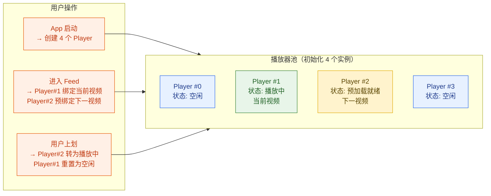

**池化的关键实现细节**：

```swift
// iOS 播放器池伪代码
class PlayerPool {
    private var players: [AVPlayer] = []
    private var playerStates: [PlayerState] = []

    init(poolSize: Int = 4) {
        // App 启动时异步初始化（不阻塞主线程）
        DispatchQueue.global(qos: .userInitiated).async {
            for i in 0..<poolSize {
                let player = AVPlayer()
                // 预热：加载音频 Session，初始化解码 Pipeline
                player.automaticallyWaitsToMinimizeStalling = false
                self.players.append(player)
                self.playerStates.append(.idle)
            }
        }
    }

    // 从池中获取一个空闲播放器
    func acquire() -> AVPlayer? {
        if let idx = playerStates.firstIndex(of: .idle) {
            playerStates[idx] = .inUse
            return players[idx]
        }
        return nil  // 池满了（降级：新建一个临时播放器）
    }

    // 归还播放器（重置状态但不销毁）
    func release(player: AVPlayer) {
        if let idx = players.firstIndex(of: player) {
            player.replaceCurrentItem(with: nil)  // 清除 item，不销毁 player
            playerStates[idx] = .idle
        }
    }
}
```

**效果**：播放器实例化耗时从 100–200ms 降至 0ms（直接取池中已就绪实例）。

### 6.6.3 App 启动时的异步初始化

播放器池必须在 **App 启动时异步初始化**，而非等到用户进入 Feed 页才创建：

```
App 启动 → 主线程：UI 初始化、首页渲染
         ↘ 子线程：播放器池初始化（4 个实例）
                   DNS 预解析
                   网络探测（测量可用带宽）
            ↓（2–5 秒后，首批 Feed 请求完成）
         ← 推荐结果到达，播放器池已就绪，立即绑定
```

这样当用户看到第一条视频时，播放器已经"热身"完毕，TTFF 可以做到 < 100ms。

---

## 6.7 体验层优化——封面与首帧预渲染

### 6.7.1 传统封面图的问题

传统做法：视频卡片展示封面图（`.jpg`），用户上划后封面渐变为视频。

这种做法有两个额外开销：
1. **封面图 HTTP 请求**：一张 720p 封面约 50–80KB，额外一次 CDN 请求 20–50ms
2. **封面→视频的切换渲染**：图片纹理替换为视频纹理，有一帧的闪烁感

### 6.7.2 首帧替代封面（抖音的做法）

**更优解法**：不下载单独的封面图，而是直接把**视频的第一帧解码图像**渲染为封面——这样封面显示的那一刻，视频已经开始播放：

```
传统方案：
封面图请求（30ms）→ 封面显示 → 视频首帧请求（+100ms）→ 视频播放

首帧替代封面方案：
视频首片预加载（后台）→ 预解码首帧 → 以首帧图像作封面 → 用户划到位直接播放
                                                          ↑
                                            封面 = 视频起点，视觉无缝衔接
```

省去封面 HTTP 请求（30ms）+ 消灭封面→视频切换的视觉不连续感。

**效果量化（抖音工程团队公开数据）**：
- 取消独立封面图后，首帧显示速度提升 约 20–40ms
- 用户感知的"上划流畅度"显著提升，完播率提升约 2–3 个百分点

---

## 6.8 ABR 自适应码率——弱网地铁里不卡顿

小南乘地铁时，网络从 Wi-Fi 切到 4G，再到地铁隧道里的弱信号——网络带宽可能在几秒内从 8Mbps 跌到 500kbps。如果播放器死守 1080p，必然卡顿。

**ABR（Adaptive Bitrate Streaming，自适应码率流）** 的核心思路：根据当前网络状况，动态切换到最合适的码率档位，在"画质"和"不卡顿"之间取得最佳平衡。

### 6.8.1 ABR 效用函数

ABR 算法的目标可以形式化为最大化 QoE（用户体验质量）：

$$
\text{QoE} = \sum_{i=1}^{N} q(r_i) - \mu \sum_{i=1}^{N} T_{\text{rebuf},i} - \lambda \sum_{i=1}^{N-1} |q(r_{i+1}) - q(r_i)|
$$

其中：
- $q(r_i)$：第 $i$ 个切片使用码率 $r_i$ 的**画质收益**（通常用 VMAF 或对数函数近似）
- $T_{\text{rebuf},i}$：第 $i$ 个切片的**卡顿时间**（重缓冲时间，秒）
- $|q(r_{i+1}) - q(r_i)|$：相邻切片的**码率切换幅度**（切换惩罚）
- $\mu$：卡顿惩罚系数（通常 $\mu = 8$–$16$，卡顿比画质损失代价大）
- $\lambda$：码率切换惩罚系数（通常 $\lambda = 1$–$4$，频繁切换体验差）

**直觉**：宁可画质稍差，也不卡顿；宁可画质持续稍差，也不在 720p 和 360p 之间来回跳动。

### 6.8.2 BBA（Buffer-Based Algorithm）——基于缓冲区的简单算法

**BBA（Buffer-Based Algorithm）** 是最简单实用的 ABR 算法，由 Netflix 工程师提出，核心思路：**只看缓冲区长度，不预测带宽**。

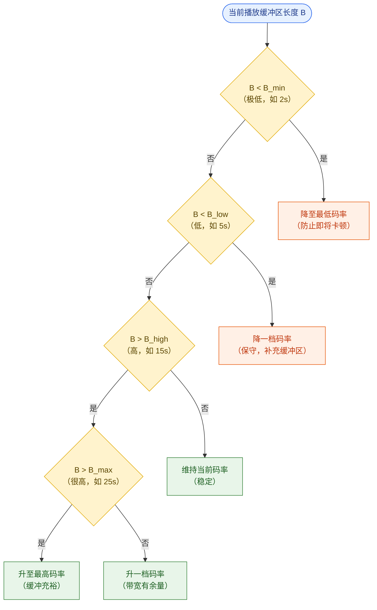

**BBA 伪代码**：

```python
def bba_algorithm(buffer_size: float, current_bitrate: int, bitrate_levels: list) -> int:
    """
    BBA: Buffer-Based Algorithm
    buffer_size: 当前播放缓冲区长度（秒）
    current_bitrate: 当前使用的码率 Kbps
    bitrate_levels: 可用码率档位列表（升序），如 [360, 720, 1080, 2000]
    返回: 下一个切片应使用的码率
    """
    B_MIN = 2.0    # 极低水位（秒）：紧急降档
    B_LOW = 5.0    # 低水位（秒）：保守模式
    B_HIGH = 15.0  # 高水位（秒）：可升档
    B_MAX = 25.0   # 满水位（秒）：激进升档

    curr_idx = bitrate_levels.index(current_bitrate)

    if buffer_size < B_MIN:
        # 缓冲区告急，降到最低档，优先保证不卡顿
        return bitrate_levels[0]

    elif buffer_size < B_LOW:
        # 缓冲区偏低，降一档
        return bitrate_levels[max(0, curr_idx - 1)]

    elif buffer_size > B_MAX:
        # 缓冲区很充裕，激进升到最高档
        return bitrate_levels[-1]

    elif buffer_size > B_HIGH:
        # 缓冲区充裕，温和升一档
        return bitrate_levels[min(len(bitrate_levels)-1, curr_idx + 1)]

    else:
        # 缓冲区正常，维持当前码率
        return current_bitrate
```

**BBA 的优缺点**：
- **优点**：简单稳定，不需要带宽预测，不受测量误差影响；天然防止"升档后立即卡顿"（因为升档需要缓冲区高水位）
- **缺点**：缓冲区是带宽的"滞后"反映，可能反应慢（已经卡顿才降档）；无法利用带宽预测提前应对

### 6.8.3 MPC（Model Predictive Control）——预测性多步优化

**Pensieve 和 MPC 算法**（CMU 2016）将 ABR 建模为一个**有限步预测控制**问题：每次决策时，同时考虑未来 K 步的期望 QoE，选择全局最优的码率序列。

$$
\text{maximize} \sum_{k=0}^{K-1} \left[ q(r_{t+k}) - \mu \cdot T_{\text{rebuf}}(r_{t+k}) - \lambda \cdot |q(r_{t+k}) - q(r_{t+k-1})| \right]
$$

其中对未来 K 步的带宽 $\hat{C}_{t+k}$ 进行预测（使用历史 5 个时间窗口的谐波均值）。

**MPC 伪代码**：

```python
def mpc_algorithm(
    buffer_size: float,
    past_bandwidths: list,  # 历史 5 段带宽（Kbps）
    bitrate_levels: list,
    chunk_sizes: dict,      # {bitrate: chunk_size_kb}，未来 5 片的大小
    K: int = 5              # 预测步数
) -> int:
    """
    MPC: Model Predictive Control ABR
    每次选择使得接下来 K 步期望 QoE 最大的码率序列
    """
    # 步骤1：预测未来 K 步带宽（谐波均值，对突变有鲁棒性）
    harmonic_mean = len(past_bandwidths) / sum(1.0/bw for bw in past_bandwidths)
    predicted_bandwidths = [harmonic_mean] * K

    best_first_rate = bitrate_levels[0]
    best_qoe = float('-inf')

    # 步骤2：遍历所有可能的码率序列（剪枝：只遍历邻近档位）
    def enumerate_sequences(step, curr_buf, curr_rate, prev_rate, total_qoe, seq):
        nonlocal best_first_rate, best_qoe
        if step == K:
            if total_qoe > best_qoe:
                best_qoe = total_qoe
                best_first_rate = seq[0]
            return

        for rate in bitrate_levels:
            # 计算此步下载时间（切片大小 / 预测带宽）
            download_time = chunk_sizes[rate] / predicted_bandwidths[step]
            # 下载期间，已缓冲的部分同时在播放
            # 若下载时间 > 当前缓冲区，发生卡顿
            rebuffer_time = max(0, download_time - curr_buf)
            new_buf = max(0, curr_buf - download_time) + CHUNK_DURATION

            # QoE 组成
            quality_gain = log_quality(rate)  # 对数映射的画质收益
            rebuffer_penalty = MU * rebuffer_time
            switch_penalty = LAMBDA * abs(log_quality(rate) - log_quality(prev_rate))
            step_qoe = quality_gain - rebuffer_penalty - switch_penalty

            enumerate_sequences(step+1, new_buf, rate, rate,
                                total_qoe + step_qoe, seq + [rate])

    enumerate_sequences(0, buffer_size, bitrate_levels[0], bitrate_levels[0], 0.0, [])
    return best_first_rate
```

| 算法 | 原理 | 优点 | 缺点 | 适用场景 |
|------|------|------|------|---------|
| BBA | 仅看缓冲区水位 | 简单稳定，无需带宽预测 | 反应慢，无法预判 | 长视频/稳定网络 |
| MPC | 预测带宽+多步优化 | 提前预判，全局最优 | 计算较重，预测误差影响大 | 短视频/网络波动 |
| BOLA | 效用最大化 Lyapunov | 理论最优，自适应性强 | 复杂，工程实现难 | 高端场景 |
| RL（Pensieve）| 强化学习 | 端到端最优，泛化能力强 | 训练成本高，在线更新难 | 研究/顶尖平台 |

**实际选型**：短视频平台（抖音/快手级别）通常在 MPC 基础上做大量工程改造，加入视频时长感知（短视频不需要太长预测步数）、首帧优先模式（刚开始播放时不急于升档）、弱网保护模式（信号弱时强制降至低码率）等。

---

## 6.9 封装协议——HLS、DASH 与 CMAF

播放器收到的不是原始码流，而是封装在容器格式中的数据。选择合适的封装协议直接影响 TTFF、seek 性能和存储成本。

### 6.9.1 三大协议详解

**HLS（HTTP Live Streaming）**：苹果 2009 年提出，目前最广泛的流媒体协议。

```
# 典型 HLS Manifest (.m3u8)
#EXTM3U
#EXT-X-VERSION:7
#EXT-X-TARGETDURATION:6

# 码率阶梯（Master Playlist）
#EXT-X-STREAM-INF:BANDWIDTH=800000,RESOLUTION=640x360,CODECS="avc1.64001f,mp4a.40.2"
360p.m3u8
#EXT-X-STREAM-INF:BANDWIDTH=2500000,RESOLUTION=1280x720,CODECS="avc1.64001f,mp4a.40.2"
720p.m3u8
#EXT-X-STREAM-INF:BANDWIDTH=5000000,RESOLUTION=1920x1080,CODECS="avc1.640032,mp4a.40.2"
1080p.m3u8
```

```
# 单码率 Playlist（720p.m3u8）
#EXT-X-TARGETDURATION:6
#EXT-X-MEDIA-SEQUENCE:0

#EXTINF:6.0,
seg_000.ts      ← 前 6 秒，约 1.8MB
#EXTINF:6.0,
seg_001.ts
#EXTINF:6.0,
seg_002.ts
...
#EXT-X-ENDLIST   ← 点播结束标志（直播没有此行）
```

**MPEG-DASH（Dynamic Adaptive Streaming over HTTP）**：MPEG 标准化的协议，使用 XML 格式的 `.mpd` Manifest，切片格式为 `.m4s`（fMP4 分段）。

**CMAF（Common Media Application Format）**：2018 年由苹果+微软联合推出，核心思想：**一套 fMP4 切片，同时生成 HLS 和 DASH 两种 Manifest**，彻底避免了存两份切片的存储浪费。

### 6.9.2 协议对比表

| 特性 | HLS | MPEG-DASH | CMAF |
|------|-----|----------|------|
| 切片容器格式 | `.ts`（老）或 `.fmp4`（新）| `.m4s`（fMP4）| `.m4s`（fMP4）|
| Manifest 格式 | `.m3u8`（文本）| `.mpd`（XML）| 同时生成 `.m3u8` + `.mpd` |
| 平台支持 | iOS 原生支持，Android 需 ExoPlayer | Android 原生，iOS 需第三方 | 两端均支持 |
| 切片时长 | 6–10 秒（点播）| 2–6 秒 | 2–6 秒 |
| 低延迟变种 | LL-HLS（< 2s 延迟）| DASH-LL | CMAF with Chunks |
| Seek 性能 | 段内 seek 需要从 I 帧开始 | 同 HLS | 同 HLS |
| 存储效率 | 1 倍（每种格式各存一份）| 1 倍 | **0.5 倍（一份切片，两套 Manifest）** |
| DRM 支持 | FairPlay | PlayReady/Widevine | 两者均支持 |
| 推荐场景 | iOS 生态为主 | Android/Web 为主 | **2023 后事实标准，强烈推荐** |

### 6.9.3 为什么 CMAF 是事实标准

传统做法：为 HLS 生成一套 `.ts` 切片，为 DASH 生成一套 `.m4s` 切片——同一个视频要存两份，存储成本翻倍。

CMAF 的核心创新：**公用底层切片（fMP4 格式），分别生成 HLS 的 `.m3u8` 和 DASH 的 `.mpd` Manifest**。Manifest 文件非常小（KB 级），可以动态生成，不占存储。

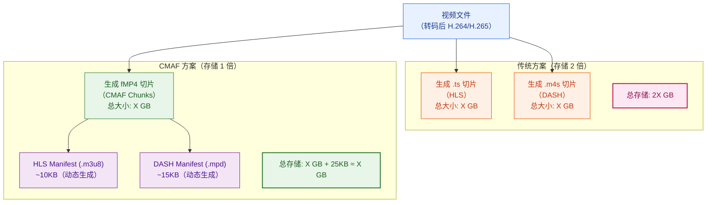

**节省效益**（「闪刷」规模估算）：
- 视频库 50 亿条，每条平均 3 档码率（360p/720p/1080p），每档约 50MB
- 传统方案：50 亿 × 3 × 50MB × 2（HLS+DASH）= 1,500 PB
- CMAF 方案：50 亿 × 3 × 50MB × 1 = 750 PB
- **节省 750 PB 存储，按阿里云 OSS 冷归档 0.015元/GB，每年节省约 11 亿元**

### 6.9.4 点播 vs 直播的协议差异

| 维度 | 点播（VOD）| 直播（Live）|
|------|----------|------------|
| Manifest 是否固定 | 是（`#EXT-X-ENDLIST`）| 否（持续追加，无 ENDLIST）|
| 切片生成时机 | 转码时提前生成 | 实时编码 + 实时切片 |
| 切片时长 | 6–10 秒（可以长，缓冲多）| 1–4 秒（越短延迟越低）|
| ABR 决策 | 完整信息，可预测 | 需要实时感知推流码率变化 |
| CDN 缓存 | 切片不变，命中率高 | 切片有限期，命中率较低 |
| 延迟目标 | TTFF 优先 | 端到端延迟优先（< 3s） |

---

## 6.10 播放器架构

### 6.10.1 播放器分层

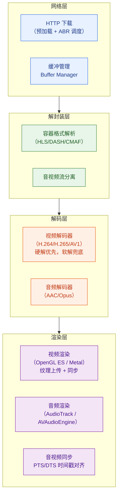

### 6.10.2 主流播放器内核对比

| 内核 | 平台 | 特点 | 使用方 |
|------|------|------|-------|
| **AVPlayer / AVFoundation** | iOS 原生 | 系统级集成，硬解默认，低功耗 | 大多数 iOS App |
| **ExoPlayer（媒体3）** | Android 原生 | Google 官方，支持 DASH/HLS/CMAF，扩展性强 | Android App |
| **ijkplayer** | iOS/Android | B 站开源，基于 FFmpeg，兼容性极强 | B 站、早期快手 |
| **自研播放器** | iOS/Android | 深度定制（首帧优化/秒开/硬解策略）| 抖音、快手（进阶阶段）|
| **VLC libvlc** | 全平台 | 格式兼容性最强，性能一般 | 桌面/长尾格式兼容 |

**头部平台（抖音/快手）为何自研**：
- 极致首帧优化（预解码 API 系统级暂不开放）
- 自定义解码优先级调度（硬解失败时优雅 fallback）
- 深度与 CDN 调度集成（播放器直接拿调度结果决定连哪个 IP）
- 自定义缓冲策略（短视频的缓冲逻辑与长视频完全不同）

### 6.10.3 缓冲管理

播放器缓冲区的设计直接影响卡顿率：

| 缓冲区阶段 | 大小设计 | 说明 |
|----------|---------|------|
| 最小缓冲（Start Buffer）| 0.5–1s | 达到此值开始播放（越小 TTFF 越低）|
| 稳定缓冲（Steady Buffer）| 8–15s | 正常播放时维持的缓冲量 |
| 最大缓冲（Max Buffer）| 20–30s | 超过此值停止预下载，节省带宽和内存 |
| 重缓冲触发（Rebuffer）| 0s（耗尽）| 缓冲区为空时触发卡顿，ABR 应降档防止 |

---

## 6.11 QoS/QoE 指标体系

好的播放体验需要量化，量化才能监控，监控才能优化。

### 6.11.1 核心指标定义

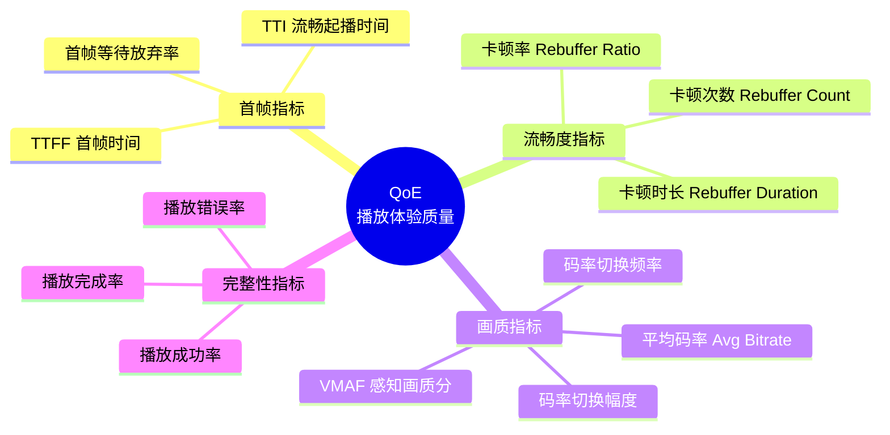

### 6.11.2 QoE 指标详解表

| 指标 | 定义 | 优秀目标 | 告警阈值 | 计算方式 |
|------|------|---------|---------|---------|
| **TTFF** | 触发播放→首帧出现 | P50 < 200ms | P95 > 1000ms | 客户端埋点计时 |
| **卡顿率（Rebuffer Ratio）** | 卡顿时长 / 总播放时长 | **< 0.5%** | > 1% | `rebuf_duration / play_duration` |
| **卡顿次数** | 每小时播放的卡顿次数 | < 0.1 次/小时 | > 0.5 次/小时 | 服务端聚合 |
| **播放成功率** | 成功起播的请求 / 总播放请求 | > 99.5% | < 98% | 服务端日志 |
| **平均码率** | 播放期间实际使用的加权平均码率 | 尽量高 | 异常低时告警 | 客户端周期上报 |
| **VMAF 感知质量** | Netflix 感知画质分（0-100）| > 85 | < 70 | 线下批量评估 |
| **码率切换频率** | 每分钟 ABR 切换次数 | < 2 次/分钟 | > 5 次/分钟 | 客户端事件 |
| **码率切换幅度** | 相邻切换的码率差 | < 1 档（≤ 2×）| 跳 2 档以上 | 客户端事件 |
| **首帧放弃率** | TTFF > N 秒后用户离开 | < 3% | > 10% | 服务端计算 |

### 6.11.3 卡顿率公式与目标

$$
\text{卡顿率} = \frac{\sum_{i} T_{\text{rebuf},i}}{\sum_{i} T_{\text{play},i}} \times 100\%
$$

**为什么 0.5% 是生死线？**

以一条 60 秒的短视频为例：
- 0.5% 卡顿率 = 0.3 秒卡顿 → 用户几乎感知不到
- 1% 卡顿率 = 0.6 秒卡顿 → 用户开始感到"卡了一下"
- 2% 卡顿率 = 1.2 秒卡顿 → 明显的卡顿感
- 5% 卡顿率 = 3 秒卡顿 → 严重影响体验，完播率下降 30%+

Mux 2023 年研究显示：**卡顿率超过 1% 时，视频完播率下降约 22%，下次打开 App 的概率下降约 8%**。

### 6.11.4 加权 QoE 评分

将各维度指标归一化后，通过加权求和得到综合 QoE 分（用于 ABR 算法目标和运营监控）：

$$
\text{QoE}_{\text{score}} = w_1 \cdot \text{TTFF\_score} + w_2 \cdot (1 - \text{rebuf\_ratio}) + w_3 \cdot \text{avg\_bitrate\_score} + w_4 \cdot \text{switch\_smoothness}
$$

典型权重（根据用户调研确定）：

| 维度 | 权重 | 归一化方法 |
|------|------|----------|
| TTFF_score | $w_1 = 0.35$ | `max(0, 1 - TTFF/2000ms)` |
| 不卡顿 $(1 - \text{rebuf})$ | $w_2 = 0.40$ | 直接使用，卡顿权重最高 |
| avg_bitrate_score | $w_3 = 0.15$ | `log(avg_bitrate) / log(max_bitrate)` |
| switch_smoothness | $w_4 = 0.10$ | `1 - switch_freq/max_freq` |

### 6.11.5 QoE 监控体系

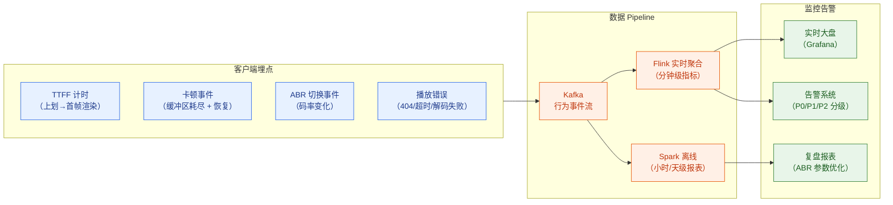

**关键告警规则**：

| 告警 | 触发条件 | 影响 | 响应 |
|------|---------|------|------|
| 卡顿率突升 | > 1.5%（超过基线 3σ）| 大面积用户体验恶化 | P1，5 分钟内响应 |
| TTFF 恶化 | P95 > 1.5s | 上划流畅度下降 | P2，15 分钟内响应 |
| 播放成功率下降 | < 98% | CDN 故障/格式问题 | P0，立即响应 |
| ABR 频繁切换 | > 10 次/分钟 | 带宽预测算法异常 | P2，人工排查 |

---

## 6.12 常见易错点与反模式

在实际工程中，以下是最常见的秒开和 QoE 优化失误：

### ❌ 易错点 1：预加载过激，抢当前播放带宽

**现象**：预加载了 5 条视频，当前视频开始卡顿。

**根因**：预加载请求优先级未降低，与当前播放请求争夺带宽。

**正确做法**：
- 预加载请求使用系统最低优先级（iOS: `.background`，Android: `PRIORITY_LOW`）
- 当前视频缓冲区 < 8 秒时，暂停所有预加载请求
- 根据实时可用带宽（总估算带宽 - 当前下载速率）决定预加载速率上限

### ❌ 易错点 2：GOP 不对齐，seek 必须等 I 帧

**现象**：用户 seek 到某个时间点，等待 1–2 秒才出现画面。

**根因**：视频编码时 GOP（关键帧间隔）过长（如 120 帧 = 5 秒），seek 到非 I 帧位置时需要向前追溯解码。

**正确做法**：
- 点播视频 GOP 设置为 1–2 秒（30–60 帧，见第 4 章）
- 切片边界与 I 帧对齐（Segment Aligned GOP）

### ❌ 易错点 3：ABR 切换过于频繁，体验下降

**现象**：用户明显感到画质在跳变（720p→360p→720p→360p）。

**根因**：ABR 算法对带宽变化过于敏感，没有切换惩罚项，或惩罚系数 $\lambda$ 太小。

**正确做法**：
- 切换前加入确认窗口（连续 2–3 个切片带宽低才降档）
- 降档比升档更激进（防卡顿），升档需要缓冲区充裕才触发
- 短视频（< 15 秒）场景：视频快结束了就不升档了（升档没意义）

### ❌ 易错点 4：不监控 QoE，凭感觉优化

**现象**：工程师拿自己的手机（Wi-Fi + 旗舰机）测试首帧很快，但用户大盘卡顿率持续高。

**根因**：没有生产环境的 QoE 监控，低端机 + 弱网场景从未被覆盖。

**正确做法**：
- 客户端全量埋点 TTFF、卡顿率、ABR 切换事件
- 按设备档次（高中低端）、网络类型（Wi-Fi/4G/3G）分维度看 QoE
- ABR 参数调整前必须有 A/B 实验，看大盘 QoE 指标而非主观体感

---

## 6.13 综合案例：小南上划《番茄牛腩》的完整时序

把所有优化层次串在一起，看看小南上划的那 200ms 里究竟发生了什么：

```
[时间轴，ms 为单位]

T=-5000ms  小南开始看上一条视频（进度 0%）
           → App 预建立 CDN 连接（静默）

T=-2000ms  上一条视频进度 60%，缓冲 > 8s
           → 触发预加载：《番茄牛腩》seg_0 开始后台下载
           → 请求优先级：LOW（不抢当前带宽）

T=-1500ms  《番茄牛腩》seg_0（约 450KB）下载完成
           → 预解码首帧（GPU 硬解）
           → 首帧 YUV 纹理准备就绪，暂停（不显示）

T=0ms      小南手指上划，划到位（触发播放）
           → 播放器池：Player#2 已绑定《番茄牛腩》，直接激活

T=5ms      播放器状态切换：从上一条 → 《番茄牛腩》

T=15ms     将预解码的首帧纹理上传到 GPU
           → 渲染到屏幕

T=20ms     🎉 小南看到第一帧：番茄在锅里翻炒！
           TTFF = 20ms（远低于 200ms 目标）

T=25ms     音频解码器启动，首帧音频准备
T=30ms     画面+声音同步开始播放

T=200ms    《番茄牛腩》缓冲区已有 5 秒数据，继续请求 seg_1
T=500ms    缓冲区 > 8s，开始预加载下下条视频
```

这就是四层优化叠加后的效果：**用户感知到的 TTFF 不到 30ms**，接近瞬间。

---

## 本章小结

本章系统讲解了短视频播放体验与 QoS 的核心技术栈。

**核心结论**：

1. **秒开是留存保障线**，首帧时间与留存之间存在非线性关系，TTFF > 1s 会触发显著用户流失。抖音头部目标 < 200ms 是四层优化叠加的结果，而非单一技术的魔法。

2. **秒开优化的四个层次**（由外到内）：
   - **网络层**：DNS 预解析 + 连接预建立 + 预加载首片，节省 100–200ms
   - **解码层**：预解码 + 硬件加速，节省 50–100ms
   - **架构层**：播放器池化复用，节省 50–150ms
   - **体验层**：首帧替代封面，节省感知等待

3. **预加载核心约束**：带宽感知，低优先级，当前缓冲 < 8s 时暂停预加载——预加载不是越多越好，否则会适得其反。

4. **ABR 算法**：短视频场景推荐 MPC 或改进型 BBA。卡顿惩罚系数（$\mu$）远大于切换惩罚（$\lambda$）——宁可画质差，不能卡顿。

5. **CMAF 是 2023 后事实标准**：一套 fMP4 切片，同时服务 HLS 和 DASH，为「闪刷」级别平台节省数百 PB 存储。

6. **卡顿率 < 0.5% 是关键 QoE 红线**，超过 1% 明显影响完播率，必须实时监控 + 分维度（设备/网络）拆解。

**知识依赖关系**：

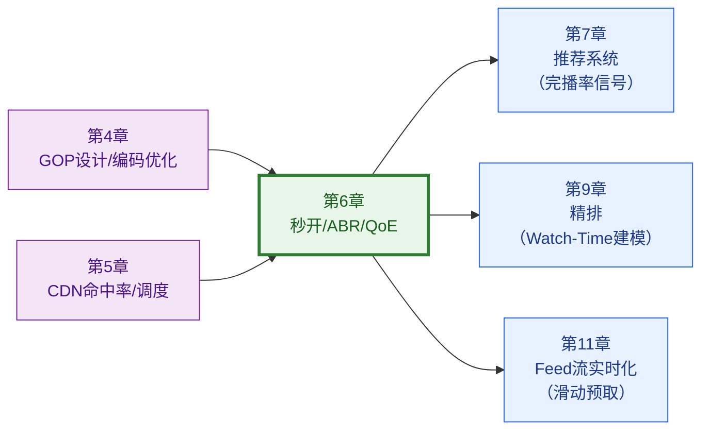

基础设施（第 3–6 章）的使命是"把视频高质量地呈现到用户面前"——现在这个使命完成了。

从第 7 章开始，我们进入整个平台最复杂、最核心的部分：**推荐引擎**——如何在 50 亿条视频里，100ms 内挑出让小南忍不住继续刷下去的那几条。

---

## 参考来源

1. **Mux — State of Streaming Performance (2022–2023)**
   [https://mux.com/state-of-streaming-performance](https://mux.com/state-of-streaming-performance)
   *卡顿率与用户留存的大规模统计数据，首帧放弃率曲线*

2. **CMU — Pensieve: Neural Adaptive Video Streaming with Pensieve (SIGCOMM 2017)**
   [https://dl.acm.org/doi/10.1145/3098822.3098843](https://dl.acm.org/doi/10.1145/3098822.3098843)
   *MPC 和强化学习 ABR 算法的经典论文，QoE 效用函数定义*

3. **快手工程 — 快手短视频客户端首帧优化实践**
   [https://kuaishou.tech/article/video_first_frame_optimization](https://kuaishou.tech/article/video_first_frame_optimization)
   *预解码、播放器池化、弱网优化的工程实践*

4. **字节跳动技术博客 — 抖音 Android 客户端视频秒开优化**
   [https://techblog.bytedance.com/article/douyin-video-fast-play](https://techblog.bytedance.com/article/douyin-video-fast-play)
   *四层优化叠加实践，HTTPDNS 优化，首帧封面替代方案*

5. **Apple Developer — HTTP Live Streaming Overview**
   [https://developer.apple.com/streaming/](https://developer.apple.com/streaming/)
   *HLS 协议官方规范，LL-HLS 低延迟扩展*

6. **MPEG-CMAF Specification — ISO/IEC 23000-19**
   [https://mpeg.chiariglione.org/standards/mpeg-a/common-media-application-format](https://mpeg.chiariglione.org/standards/mpeg-a/common-media-application-format)
   *CMAF 标准文档，fMP4 统一切片格式规范*

7. **Netflix Technology Blog — Toward a Practical Perceptual Video Quality Metric (VMAF)**
   [https://netflixtechblog.com/toward-a-practical-perceptual-video-quality-metric-653f208b9652](https://netflixtechblog.com/toward-a-practical-perceptual-video-quality-metric-653f208b9652)
   *VMAF 感知画质指标，QoE 评分体系*

8. **Google ExoPlayer — Adaptive Streaming Documentation**
   [https://exoplayer.dev/adaptive-streaming.html](https://exoplayer.dev/adaptive-streaming.html)
   *ExoPlayer ABR 实现，Android 平台 HLS/DASH/CMAF 支持细节*
