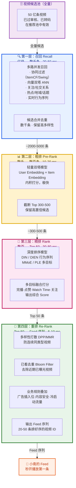
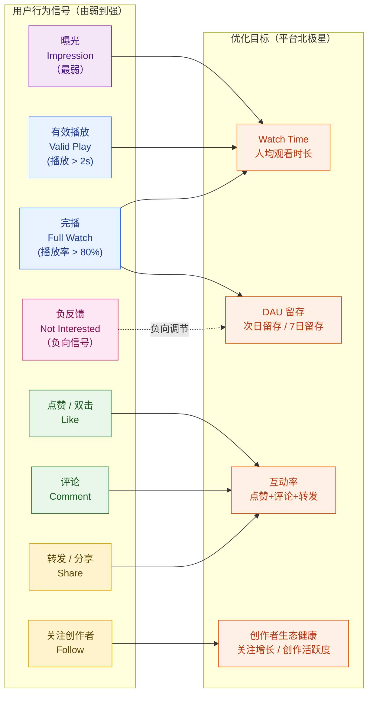
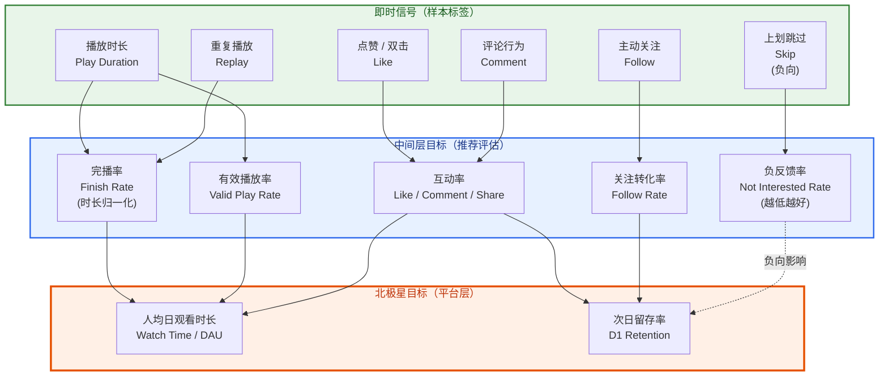
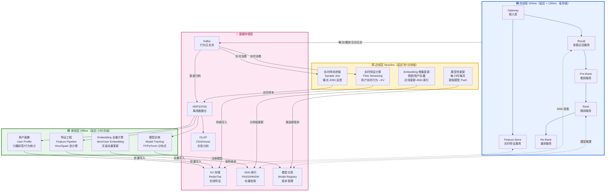
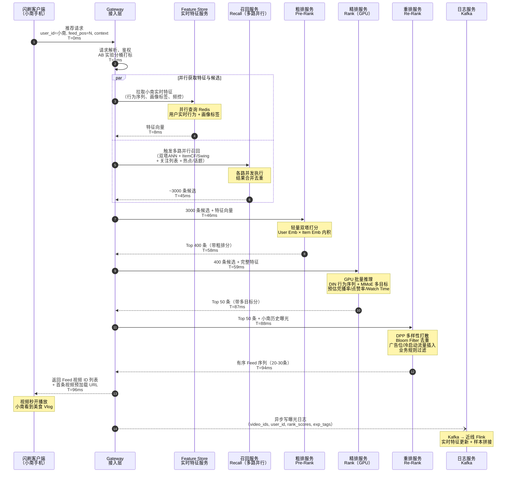
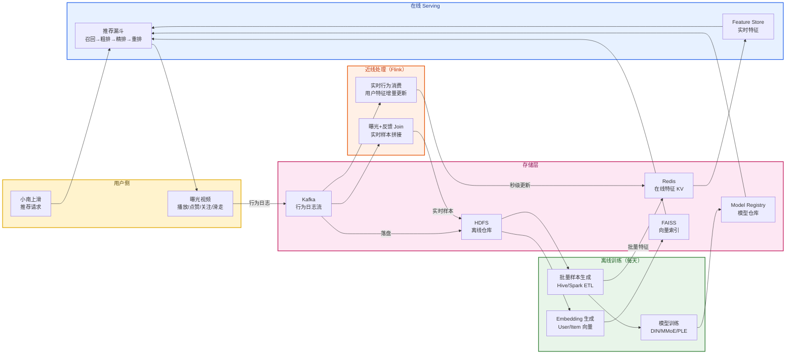
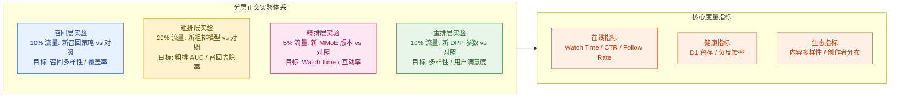
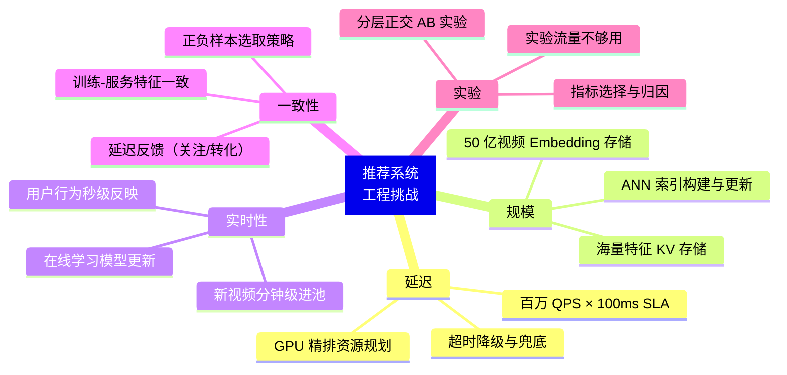

# 第 7 章 · 推荐系统总体架构

> **所属系列**：《短视频平台系统设计 · 全景教程》第三部分 · 推荐系统全链路
> **上一章**：[第 6 章 · 播放体验与 QoS（秒开）](./06-播放体验与QoS秒开.md)
> **下一章**：[第 8 章 · 召回](./08-召回.md)

---

## 本章导读

前六章我们解决了一条视频"怎么进来、怎么存好、怎么播快"的问题。从第 7 章起，进入本教程的第二条主线——**推荐系统**：那条视频究竟**凭什么出现在小南的 Feed 里**？

小南打开「闪刷」，手指向上一划，屏幕上出现的那条视频不是随机的。在她的手指触碰屏幕到视频开始播放的不足 **100 毫秒**里，闪刷的推荐引擎已经从 **50 亿条视频**里为她挑出了这一条。

这 100 毫秒里究竟发生了什么？本章回答这个问题——**短视频推荐系统的总体架构**。

核心视角有四个：

1. **漏斗视角**：50 亿视频如何被逐层压缩到最终展示的几条？为什么需要分层而不是一步到位？
2. **目标体系视角**：推荐系统优化什么？完播率、点赞、时长……多个目标如何协调？
3. **三层体系视角**：在线毫秒级打分只是冰山一角，近线和离线是整个引擎的基础设施。
4. **闭环视角**：用户行为如何反哺回模型，形成数据飞轮？

本章是第 8～11 章的**导航图**。召回（第 8 章）、粗排精排（第 9 章）、重排冷启动（第 10 章）、Feed 实时化（第 11 章）的细节将在后续章节逐层展开。本章只做架构级介绍，建立整体认知。

---

## 7.1 推荐问题定义

### 7.1.1 推荐问题的本质

短视频推荐问题的本质是：

> **给定用户 $u$、当前情境 $c$（时间、设备、网络、位置……），从视频库 $\mathcal{V}$（50 亿条）中找出一个有序序列 $S = [v_1, v_2, \ldots, v_k]$，使得用户的整体体验（满意度、时长、留存）最大化。**

用数学形式表达精排目标（多目标融合，详见 7.3 节）：

$$\hat{S} = \arg\max_{S \subseteq \mathcal{V}, |S|=k} \sum_{v \in S} \text{Score}(u, v, c)$$

$$\text{Score}(u, v, c) = \sum_{i} w_i \cdot f_i(u, v, c)$$

其中 $f_i$ 是各目标（完播率、点赞率、Watch Time 等）的预估值，$w_i$ 是对应权重。

这与搜索（Query → 相关文档）、广告（出价 × pCTR 最大化 eCPM）有本质区别：推荐没有明确的 Query，优化的是用户的长期满意度而非单次 eCPM。

### 7.1.2 沉浸式单列 Feed 的特殊性

短视频的沉浸式单列 Feed（TikTok/抖音/闪刷的核心形态）区别于图文信息流、搜索结果页，有三个独特性质：

| 维度 | 图文信息流 | 搜索结果页 | **沉浸式单列 Feed** |
|------|----------|---------|-----------------|
| 展示方式 | 多条并排可见 | 多条并排可见 | **一次只看一条** |
| 反馈强度 | 弱（点击/停留） | 弱（点击/跳出） | **极强（完播/滑走/点赞/关注）** |
| 消费顺序 | 用户自由跳读 | 用户自由跳读 | **严格序列消费** |
| 沉没成本 | 低（瞟一眼即知）| 低（摘要可预判）| **高（必须播放才知内容）** |
| 上滑代价 | 低 | 低 | **高（错过了就错过了）** |

这三个特性对推荐系统有深刻影响：

- **一次只看一条** → 第一条视频质量极关键，排序比图文流更重要。
- **强反馈信号** → 完播/滑走是高质量隐式标签，远比图文的停留时间准确。
- **序列消费** → 重排必须考虑相邻视频的类型多样性（不能连续推 5 条美食），防止视觉疲劳。

### 7.1.3 贯穿案例：小南的 Feed 请求

> 晚上 10:23，小南躺在床上，打开闪刷，上划一次。
>
> 在她的手指离开屏幕的那一刻，闪刷的推荐引擎启动了：从 **50 亿条**视频中为她挑选下一条。她上一条看完了一个美食视频，点了赞，关注了博主。她的实时状态、历史偏好、当前情境……所有信息都被推荐引擎综合考量。
>
> 100 毫秒之内，一条恰好与她相关的旅行 Vlog 出现在屏幕上，秒开。

这个过程贯穿本章每一个小节。

---

## 7.2 推荐漏斗：从 50 亿到几条

### 7.2.1 为什么需要漏斗分层

推荐系统面临和广告系统相同的根本矛盾——但规模更大：

- **候选集极大**：闪刷的视频库 **50 亿条**（TikTok 量级更高），不可能对每条都运行重模型
- **延迟极苛刻**：用户上滑到下条视频出现，端到端 **< 100 ms**（TikTok 公开目标）
- **精度要求递增**：精排模型（DIN/MMoE/PLE）推理一条视频约 1-5 ms，批量 100 条约 50-100 ms；根本无法对 50 亿候选全量运行

**核心思路与广告漏斗相同**：将"海量候选 → 最优序列"拆解为"逐层缩小、逐层提精"的**多级漏斗**。

不同点在于：广告漏斗最后用 eCPM 竞价，推荐漏斗最后用多目标融合分值；广告漏斗有出价/计费环节，推荐没有。

### 7.2.2 四层漏斗全景图



### 7.2.3 各层规格详表

以闪刷（1.5 亿 DAU，50 亿视频库）为基准，结合 TikTok/小红书等公开资料：

| 层级 | 输入候选数 | 输出候选数 | 压缩比 | 延迟预算 | 模型选型 | 计算设备 | 核心目标 |
|------|----------|---------|------|---------|---------|---------|---------|
| **召回** | ~50 亿（全量） | 2,000-5,000 | ~1,000,000:1 | 20-50 ms | 双塔/DSSM、ItemCF/Swing、ANN(HNSW/FAISS) | CPU + ANN 专属索引 | 覆盖度（Recall@K）|
| **粗排** | 2,000-5,000 | 300-500 | ~10:1 | 10-20 ms | 轻量双塔（User/Item Embedding 内积）| CPU，批量推理 | 效率-精度平衡 |
| **精排** | 300-500 | Top 50 | ~6-10:1 | 30-80 ms | DIN/DIEN + MMoE/PLE 多目标 | GPU（T4/A100）| 精准度（AUC/GAUC）|
| **重排** | Top 50 | 20-50（有序序列）| ~1-2:1 | 5-10 ms | DPP（行列式点过程）、MMR、滑窗规则 | CPU，内存计算 | 多样性 + 用户体验 |

> **TikTok 数据点**（来自 2021 年论文 Monolith）：候选集从数亿压缩到约 10 万（召回层），再到约 100 条（精排），端到端目标 < 100 ms。

### 7.2.4 为什么不能只有一层

一个常见问题是：能否直接用精排模型对全量视频打分？

**不能**。以闪刷为例做估算：

- 精排模型（MMoE，1 亿参数）对 1 条视频推理约 **2 ms**（GPU）
- 50 亿条视频全量精排：$50 \times 10^9 \times 2\text{ms} = 10^{10}\text{ms} = 1.16 \times 10^5 \text{ 小时}$
- 即便用 10 万块 GPU 并行，也需要 1.16 小时——远超 100 ms 的 SLA

**漏斗的本质是精度-效率帕累托边界的工程权衡**：

$$\text{每层 Cost} = \text{候选数} \times \text{单条打分耗时} \leq \text{该层延迟预算}$$

召回用极快的近似算法（ANN）保覆盖度，精排用重模型保精度——分层是在约束下的最优解，不是过度设计。

---

## 7.3 推荐目标体系

### 7.3.1 短视频推荐的多目标信号

短视频平台拥有极为丰富的行为反馈信号，每一种都代表用户对内容的不同程度满意度：



### 7.3.2 为什么不能只优化单一目标

这是推荐系统设计中最重要的原则之一，也是反直觉的地方。

**反例：只优化完播率**

假设我们只优化完播率（Finish Rate = 播放完成 / 曝光）：

- 系统会倾向于推荐**时长极短**的视频（3秒搞笑视频完播率 90%，10分钟纪录片完播率 20%）
- 结果：内容生态退化为大量「标题党短视频」「循环动图」
- Watch Time 实际下降（虽然每条完播率高，但每条 3 秒，总时长反而少）
- 用户审美疲劳，长期留存下降

**反例：只优化点赞率**

- 系统推荐「情绪激励」「反差对比」「猎奇内容」，天然获得高点赞
- 内容质量下降，用户逐渐感到内容空洞，留存下降（这是 Facebook 曾踩过的坑）

**为什么多目标是必须的：**

| 目标 | 单独优化的副作用 |
|------|--------------|
| 完播率 | 标题党 + 极短视频泛滥，Watch Time 下降 |
| 点赞率 | 情绪内容 + 猎奇内容泛滥，内容质量下降 |
| Watch Time | 自动播放长视频，用户被动消费，满意度低 |
| 关注率 | 优先头部创作者，新人难获流量，生态不健康 |
| 转发率 | 推荐「朋友圈体」内容，个性化下降 |

**北极星指标 = 人均时长 + 留存双目标体系**，多目标融合是在约束体系下的工程实践（详见第 9 章）。

### 7.3.3 多目标融合公式

精排输出的多目标融合分（Score）典型形式：

$$\text{Score}(u, v) = p_{\text{play}} \cdot (w_1 \cdot p_{\text{finish}} \cdot L_v + w_2 \cdot p_{\text{like}} + w_3 \cdot p_{\text{comment}} + w_4 \cdot p_{\text{follow}}) - w_{\text{neg}} \cdot p_{\text{neg}}$$

其中：
- $p_{\text{play}}$：有效播放概率（防止曝光后不播放）
- $p_{\text{finish}}$：完播率预估（**需做视频时长归一化**，防止偏向短视频）
- $L_v$：视频时长（Watch Time 分量）
- $p_{\text{like}}, p_{\text{comment}}, p_{\text{follow}}$：各互动动作概率预估
- $p_{\text{neg}}$：负反馈概率（"不感兴趣"/"举报"，带负权重）
- $w_i$：各目标权重（业务调参，通常离线实验 + 线上 A/B 共同校准）

**完播率的时长归一化**是一个关键细节：

$$p_{\text{finish\_norm}}(v) = \frac{\text{实际播放时长}(v)}{\min(L_v, L_{\text{threshold}})}$$

$L_{\text{threshold}}$ 通常取 60s 或 90s，长于阈值的视频按阈值归一化，防止超长视频完播率被严重低估。

### 7.3.4 目标体系层次图



---

## 7.4 推荐系统三层架构：在线 / 近线 / 离线

推荐的在线服务只是冰山一角。支撑每次 100 ms 推荐请求的，是一套完整的**三层体系**：在线（Online）、近线（Nearline）、离线（Offline）。

### 7.4.1 三层体系全景图



### 7.4.2 在线层（Online）— < 100 ms

在线层是推荐请求实时经过的服务集群。特点：

- **完全内存化**：所有特征查询走 Redis/Tair，无磁盘 I/O 在关键路径
- **无状态服务**：每个节点独立处理请求，水平扩展
- **依赖预热数据**：模型参数已加载到 GPU 显存，ANN 索引已加载内存，特征已在 KV 中就绪

| 在线组件 | 职责 | 延迟预算 |
|---------|------|---------|
| Gateway | 接入、认证、流量打标（AB 实验分桶）、限流熔断 | 1-2 ms |
| Feature Store | 并发拉取用户实时特征（行为序列、画像标签、上下文特征）| 5-10 ms |
| 召回服务 | 多路并行召回，合并去重 | 20-50 ms |
| 粗排服务 | 轻量双塔批量打分 | 10-20 ms |
| 精排服务 | 深度模型 GPU 推理（DIN/MMoE/PLE）| 30-80 ms |
| 重排服务 | DPP 多样性 + 业务规则 + Bloom Filter 去重 | 5-10 ms |

### 7.4.3 近线层（Nearline）— 秒/分钟级

近线层是连接在线与离线的"管道"，承担**实时性要求高但不在 100 ms 关键路径上**的任务：

| 近线任务 | 更新频率 | 技术栈 | 作用 |
|---------|---------|-------|------|
| **实时特征计算** | 秒级 | Flink → Redis | 用户刚刚的播放/点赞/关注行为，立即影响下一次推荐 |
| **实时样本拼接** | 分钟级 | Flink Join | 曝光日志 + 播放/互动反馈 → 实时训练样本，喂给在线学习 |
| **Embedding 增量更新** | 分钟/小时级 | Flink + FAISS | 新上传视频的 Embedding 增量写入 ANN 索引，分钟级进入召回候选池 |
| **模型热更新** | 小时/天级 | Model Server + 灰度 | 离线训练好的新版模型，无中断 Push 到在线精排 |

小红书在其 2023 年分享中提到，**召回层的用户兴趣向量更新延迟可做到分钟级**，显著提升新行为的推荐响应速度。

### 7.4.4 离线层（Offline）— 小时/天级

离线层是整个推荐引擎的"大脑制造工厂"，负责生产在线层所依赖的所有模型和特征：

| 离线任务 | 更新频率 | 产出物 |
|---------|---------|-------|
| **特征工程 Pipeline** | 每天 | 用户/视频各维度特征，写入 KV 供在线拉取 |
| **模型训练** | 每天（精排）/ 每周（召回）| 新版 DIN/MMoE/PLE 模型，推送到 Model Registry |
| **Item/User Embedding 全量计算** | 每天 | 50 亿视频的向量表示，导入 FAISS 向量索引 |
| **用户画像计算** | 每天 | 兴趣标签、行为统计、LTV 分层 |
| **AB 实验分析** | 实时/每天 | 各层指标对比（AUC/GAUC/在线 CTR/Watch Time）|

**关键数据链路（离线 → 在线的反哺）**：

```
在线层曝光/播放日志
    → Kafka 落盘 → HDFS
    → 离线特征 Pipeline 提取特征
    → 模型训练（以曝光+互动为正负样本）
    → 新模型注册到 Model Registry
    → 近线层 Push 到在线 GPU 服务
    → 在线精排效果提升
    → 更好的推荐 → 更多互动 → 更多高质量样本
```

这是推荐系统最重要的**数据飞轮（Data Flywheel）**，也是大平台建立规模壁垒的核心机制。

---

## 7.5 一次推荐请求的端到端时序

### 7.5.1 时序总图



### 7.5.2 关键设计决策

**1. 特征拉取与召回并行（步骤 3-8）**

Feature Store 的查询（8 ms）和多路召回（45 ms）相互独立，并行执行可节省约 8 ms。注意特征结果需要在召回结束后才合并送入粗排，因此并行的上限是二者中较慢的一方（即召回 45 ms）。

**2. 召回内部多路并行**

各路召回（双塔 ANN、ItemCF/Swing、关注列表、热点）相互独立，在召回服务内部并行触发，最终合并去重。单路召回 10-20 ms，多路并行不增加总延迟（取最慢一路）。

**3. 精排在关键路径上时间最长（30 ms）**

精排是延迟瓶颈，是延迟优化的重点：

- GPU 批量推理（batch inference）：将 400 条候选打包一次 GPU 调用，而非逐条推理
- 特征预计算：用户侧 embedding 在 Feature Store 已预算好，精排只做交叉特征计算
- 模型蒸馏：从大模型（教师）蒸馏到较小的学生模型，减少参数量但保留精度

**4. 曝光日志异步写入**

写入 Kafka、触发实时特征更新、样本拼接——这些操作不在关键路径上，异步执行保护主路径延迟。

### 7.5.3 延迟预算总表

| 阶段 | P50 | P99 | 预算 | 备注 |
|------|-----|-----|------|------|
| 接入 & 解析 | 0.5 ms | 2 ms | 2 ms | 含流量打标 |
| 特征拉取（并行） | 4 ms | 8 ms | 10 ms | 与召回并行，取较慢者 |
| 召回（多路并行） | 25 ms | 45 ms | 50 ms | 各路并行，最慢路决定总耗时 |
| 粗排 | 8 ms | 15 ms | 18 ms | CPU 批量双塔，400 条 |
| 精排 | 20 ms | 30 ms | 35 ms | GPU 批量推理，400 条 |
| 重排 | 3 ms | 8 ms | 10 ms | DPP + 规则，50 条 |
| 响应序列化 | 1 ms | 2 ms | 3 ms | — |
| 安全 Buffer | — | — | ~5 ms | 网络抖动 + 其他 |
| **关键路径合计** | **~57 ms** | **~95 ms** | **≤ 100 ms** | 特征 + 召回并行，约节省 8 ms |

---

## 7.6 特征与样本闭环

### 7.6.1 闭环架构图

推荐系统的竞争力来自数据闭环——数据越多，模型越准；模型越准，推荐越好；推荐越好，用户越黏；用户越黏，数据越多。



### 7.6.2 三类特征的来源与时效

| 特征类型 | 典型特征 | 更新频率 | 存储 | 产出方 |
|---------|---------|---------|------|-------|
| **实时特征（秒级）** | 最近 10 条播放记录、最近点赞/关注、当前 session 行为 | 秒级（Flink 实时）| Redis，TTL 24h | 近线 Flink |
| **近线特征（分钟级）** | 过去 1 小时/1 天互动统计、视频当前热度 | 分钟级（Flink 窗口）| Redis | 近线 Flink |
| **离线特征（天级）** | 用户兴趣向量、长期行为统计、视频分类/标签 | 每天（批量）| Redis（从 HDFS 导入）| 离线 Spark/Hive |

### 7.6.3 训练-服务特征一致性（线上线下一致性）

推荐系统工程中最容易被忽视、代价最大的问题之一：**训练时用的特征和线上 serving 时用的特征不一致**，导致模型效果严重下降（Training-Serving Skew）。

常见原因和解决方案：

```python
# 问题示例：训练和服务时特征计算逻辑不同
# 训练时（离线 Spark）：
train_feature = df.groupBy("user_id").agg(
    count("video_id").alias("play_count_7d")
)
# 统计过去 7 天播放数，按天边界截断

# 服务时（在线 Feature Store）：
play_count_7d = redis.get(f"user:{user_id}:play_count_7d")
# 从 Flink 计算的滑动窗口读取，可能与离线的天边界不对齐
# → Training-Serving Skew！
```

**解决方案**：使用统一的 Feature Platform（如 Feast/Tecton/自研），训练和服务共用同一份特征定义，离线回放（Point-in-Time Correct Lookup）确保训练样本使用的是历史上真实的特征值。

### 7.6.4 样本拼接：曝光 JOIN 反馈

推荐模型的训练样本需要将**曝光事件**（模型输出哪些视频）和**反馈事件**（用户实际怎么做）拼接在一起：

```python
# 样本拼接伪代码（Flink 流式处理）
class SampleJoiner:
    """
    实时拼接曝光日志和用户反馈，生成训练样本
    """
    
    def process_exposure(self, exposure_event):
        """
        曝光事件：{user_id, video_id, rank_score, exp_features, timestamp}
        """
        # 写入等待 JOIN 的 buffer（带 TTL，防止无限等待）
        self.pending_buffer.set(
            key=f"{exposure_event.user_id}:{exposure_event.video_id}",
            value=exposure_event,
            ttl_seconds=3600  # 最多等待 1 小时的反馈
        )
    
    def process_feedback(self, feedback_event):
        """
        反馈事件：{user_id, video_id, play_duration, liked, followed, timestamp}
        """
        key = f"{feedback_event.user_id}:{feedback_event.video_id}"
        exposure = self.pending_buffer.get(key)
        
        if exposure is None:
            # 没有对应曝光，可能是 TTL 过期或数据乱序
            return
        
        # 构建训练样本
        sample = TrainingSample(
            features=exposure.exp_features,
            label_finish_rate=feedback_event.play_duration / exposure.video_duration,
            label_liked=int(feedback_event.liked),
            label_followed=int(feedback_event.followed),
            label_skip=int(feedback_event.play_duration < 2.0),  # 2秒内跳过
            # 样本权重：精排候选的样本权重 > 召回未入精排的负样本
            weight=self._compute_weight(exposure.rank_stage)
        )
        
        self.output_sink.emit(sample)
```

**负样本采样的重要性**：推荐系统的正样本（播放、点赞）远少于负样本（曝光未播放）。负样本的选取策略直接影响模型效果：

- **曝光未播放** → 最强负样本（用户看到了但没有播放）
- **召回但未进入精排** → 中等负样本（系统判断较弱的候选）
- **全局随机负采样** → 辅助样本（增加覆盖广度）

---

## 7.7 推荐漏斗 vs 广告漏斗：异同对比

推荐系统和广告投放引擎在架构上有深度相似，但在目标、机制、约束上存在本质差异。

### 7.7.1 架构相似性

两者都使用**多级漏斗**，都有**三层体系（在线/近线/离线）**，都依赖**特征工程**和**深度学习排序模型**。广告投放引擎的工程经验（延迟预算设计、超时降级、Feature Store、AB 实验）对推荐系统完全通用。

这也是为什么字节跳动、美团、阿里等公司的推荐和广告团队会共享基础设施（Feature Store、推理引擎、样本平台）——核心工程件高度复用。

### 7.7.2 全面对比表

| 维度 | 短视频推荐漏斗 | 广告投放漏斗 |
|------|-------------|-----------|
| **商业逻辑** | 无竞价；目标是用户满意度/时长/留存 | 有竞价（eCPM = bid × pCTR × pCVR × 1000）；目标是平台广告收入 |
| **候选来源** | 全量视频库（50 亿条）| 在投广告库（百万～千万条） |
| **召回层** | 双塔 ANN + 协同过滤 + 社交关系 + 热点 | DNF 布尔定向匹配 + 多路召回 ANN |
| **粗排目标** | 轻量双塔，综合用户兴趣 | 轻量双塔，粗估 pCTR |
| **精排目标** | 多目标融合（完播/点赞/Watch Time/关注）| pCTR × pCVR → eCPM 出价排序 |
| **精排公式** | $\sum_i w_i \cdot f_i(u,v,c)$ | $\text{eCPM} = \text{bid} \times \hat{p}_{\text{CTR}} \times \hat{p}_{\text{CVR}} \times 1000$ |
| **重排考虑** | 序列多样性（DPP/MMR）+ 已看去重 + 冷启动流量 | 频次控制 + 多样性 + 调价（预算 Pacing）|
| **最终选择机制** | 多目标融合分排序 | eCPM 竞价（第二价格拍卖）|
| **计费/预算** | 无（推荐是公共品，不计费）| 有（CPM/CPC/oCPX，实时预算扣减）|
| **延迟目标** | < 100 ms（TikTok 目标）| < 80-100 ms（DSP 竞价超时 = 空窗）|
| **冷启动问题** | 新用户冷启动 + 新视频冷启动（关键，否则新内容无流量）| 新广告冷启动（CTR 预估方差大）|
| **反馈时效** | 实时（完播/点赞，秒级回流）| 延迟（转化归因，窗口最长 30 天）|
| **内容多样性** | 核心目标（防信息茧房，保持用户兴趣探索）| 次要目标（品牌互斥/频次控制）|
| **作弊问题** | 刷播放量/刷互动（内容侧）| 无效点击/转化作弊（流量侧，反作弊）|

### 7.7.3 混排场景：推荐与广告的融合

在闪刷 Feed 中，自然内容推荐和广告并非完全隔离，会进行**混排**：

```
推荐精排 → 自然内容候选 Top 50
广告精排 → 广告候选（按 eCPM 排序）Top 10
                ↓ 混排服务
         统一的 Feed 序列
         每隔 N 条自然内容插入一条广告
```

混排的核心挑战：**广告的 eCPM 和推荐的多目标分不在同一量纲**，需要一个转换机制（如用 RPM 统一衡量）。详见第 16 章（商业化与广告变现）。

---

## 7.8 推荐系统的工程挑战

### 7.8.1 低延迟与高吞吐的双重压力

```
推荐 QPS 峰值：百万级（晚高峰 DAU 1.5 亿 × 人均每分钟刷 5 次）
单次延迟目标：P99 < 100 ms
精排 GPU 推理：400 条候选 × 2 ms ≈ 单批 20-30 ms

所需 GPU 资源估算：
  百万 QPS × 30 ms / 1000 = 30,000 个并发 GPU 批次
  假设每块 T4 GPU 处理 4 个并发批次
  → 约需 7,500 块 T4 GPU（精排层）
```

这还不含召回（CPU 密集）和重排（CPU）的资源。这也是为什么推荐系统是大厂计算成本最高的系统之一。

**核心优化方向**：

1. **批量推理（Batch Inference）**：将多条候选打包一次 GPU 调用，分摊 CUDA Kernel 启动开销
2. **模型压缩**：量化（INT8/FP16）、剪枝、蒸馏，减少参数量同时保持精度
3. **自适应降级**：高 QPS 时自动减少精排候选数量（400 → 200），或降级到粗排分值

### 7.8.2 海量 Embedding 存储与检索

| 问题 | 规模 | 方案 |
|------|------|------|
| **视频 Item Embedding 存储** | 50 亿条 × 128 维 float32 = **2.56 TB** | 分片向量数据库（FAISS）+ 量化压缩（PQ/OPQ → 4 GB）|
| **ANN 检索速度** | 每次召回在 2.56 TB 中找最近邻，< 20 ms | HNSW 图索引，内积近似检索，P99 < 10 ms |
| **Embedding 更新频率** | 全量每天，增量每小时 | 双 Buffer 热切换，无中断更新 |
| **用户 Embedding 实时更新** | 小南刚点了赞，下次推荐即时反映 | 用户侧 Embedding 在 Feature Store 实时更新（近线 Flink）|

```python
# FAISS 向量索引召回示例（伪代码）
import faiss
import numpy as np

class ItemANNIndex:
    def __init__(self, dim=128, n_items=5_000_000_000):
        # 使用 PQ 压缩 + HNSW 索引
        # PQ 量化: 128 维 → 64 字节（8倍压缩），牺牲少量精度
        quantizer = faiss.IndexFlatIP(dim)
        self.index = faiss.IndexIVFPQ(
            quantizer,
            dim,
            n_list=65536,   # IVF 分区数
            m=64,           # PQ 子向量数
            n_bits=8        # 每子向量编码位数
        )
        self.index = faiss.index_cpu_to_gpu(
            faiss.StandardGpuResources(), 0, self.index
        )
    
    def search(self, user_embedding: np.ndarray, top_k=2000) -> list:
        """
        用用户 Embedding 检索最相关的 top_k 个视频
        """
        # user_embedding shape: (1, 128)
        distances, indices = self.index.search(
            user_embedding.astype('float32'),
            top_k
        )
        return indices[0].tolist()  # 返回视频 ID 列表
```

### 7.8.3 特征一致性（Training-Serving Skew）

如 7.6.3 节所述，这是工业界公认的最难解决的推荐工程问题之一。

**量化影响**：Google 在 2019 年的 Best Paper "Sampling-Bias-Corrected Neural Modeling for Large Corpus Item Recommendations" 中提到，Training-Serving Skew 会导致模型效果下降 **5-10%**（AUC 下降 0.003-0.008），折合推荐 CTR 下降约 3-7%。

**解决方案层次**：

```
层次 1（必须）：统一特征定义，训练和服务用同一套逻辑
层次 2（推荐）：Point-in-Time Correct Feature Lookup（离线样本回放正确历史特征值）
层次 3（进阶）：在线学习（Online Learning），用实时数据持续更新模型，减少 skew 影响
```

### 7.8.4 AB 实验体系

推荐系统是实验驱动的系统——没有 AB 实验，任何算法优化都无法安全上线。



**分层正交实验**的核心原则：召回层实验和精排层实验正交（用不同的 hash 维度分桶），同一用户可以同时参与不同层的实验，实验间互不干扰。

### 7.8.5 系统整体工程挑战汇总



---

## 7.9 案例串联：小南的 100 毫秒旅程

现在将本章所有知识点串联，完整还原小南那次上划的推荐过程：

```
T=0ms：小南上划
  → 闪刷客户端发出推荐请求
    (user_id=小南, context=22:23/上海/WiFi/iPhone15)

T=1ms：Gateway 接入
  → 解析请求，流量打标（实验组：精排 v3.2 / 召回 with_vector）
  → 并行触发特征拉取 + 多路召回

T=1-8ms：Feature Store（并行）
  → Redis 查询：小南的实时特征
    · 当前 session：刚看完美食视频，点赞，关注了@阿元的厨房
    · 过去 1 小时：美食(3)、萌宠(2)、旅行(1)
    · 长期画像：美食爱好者、旅行达人、萌宠向
    · 实时情境：深夜、WiFi、首页 Feed

T=1-45ms：多路召回（并行，取最慢路）
  · 双塔 ANN 向量召回（小南 Embedding 检索）→ 800 条
  · ItemCF/Swing（因为刚看美食→推相似美食）→ 500 条
  · 关注列表召回（@阿元的厨房 新视频）→ 20 条
  · 热点/地域召回（上海热榜）→ 300 条
  · 实时行为序列召回（最近 5 条 → 相关推荐）→ 400 条
  合并去重 → 约 1,800 条候选

T=46-58ms：粗排
  → 轻量双塔，1800 条打分
  → Top 400 条（其中包括：阿元最新番茄牛腩视频、多条旅行Vlog、几条萌宠视频）

T=59-87ms：精排（GPU）
  → MMoE 多目标预估：
    · 旅行 Vlog A：完播率 0.72、点赞率 0.08、Watch Time 预估 52s
    · 美食 B：完播率 0.85、点赞率 0.15、Watch Time 预估 35s
    · 萌宠 C：完播率 0.68、点赞率 0.12、Watch Time 预估 25s
  → 多目标融合分：旅行 Vlog A = 0.91（Watch Time 权重高）
  → Top 50 输出（旅行 Vlog A 排名第 1）

T=88-94ms：重排
  → DPP 打散：Top 50 中有 8 条美食，删去 5 条（刚看过太多）
  → Bloom Filter 去重：过滤小南过去 72 小时曝光过的视频
  → 广告插入：第 4 位插入一条美食电商广告（系统决策）
  → 冷启动流量：第 8 位插入一条新视频（探索流量）
  → 输出：[旅行 Vlog A, 萌宠 D, 美食 E, 广告, 旅行 Vlog F, ...]

T=96ms：返回 Feed 序列
  → 首条视频 URL 预加载触发
  → 小南看到：一条西藏骑行 Vlog 的封面

T=？：小南看完了整条西藏骑行视频（Watch Time = 3分18秒），双击点赞
  → 行为日志 → Kafka → 近线 Flink → 实时特征更新
  → 下一次推荐：旅行权重进一步提升
  → 数据飞轮开始转动
```

**整个漏斗压缩比**：

$$50 \times 10^9 \xrightarrow{\text{召回}} 1800 \xrightarrow{\text{粗排}} 400 \xrightarrow{\text{精排}} 50 \xrightarrow{\text{重排}} 1$$

$$\text{总压缩比} \approx 50,000,000:1$$

用时 **96 毫秒**，准确率（Watch Time）令小南满意。

---

## 本章小结

本章建立了短视频推荐系统的全景认知。核心结论：

1. **推荐问题的本质**：在给定用户、情境下，从海量候选中找使长期满意度最大的有序序列——无竞价，目标是用户留存和时长，不是 eCPM。

2. **漏斗分层是工程必然**：50 亿视频全量精排物理上不可能在 100 ms 内完成。召回（亿→千，20-50 ms）→粗排（千→百，10-20 ms）→精排（百→50，30-80 ms）→重排（→序列，5-10 ms）是效率-精度帕累托最优的架构。

3. **多目标是必须的**：只优化单一目标必然带来副作用（完播率→标题党，点赞率→情绪内容）。多目标融合 + 北极星指标（Watch Time + 留存）是正确的目标体系。

4. **三层体系（在线/近线/离线）**：在线层只是冰山一角。近线层（Flink 实时特征、秒级样本拼接）决定推荐的实时响应速度；离线层（每日模型训练、Embedding 全量更新）决定推荐的基础精度。

5. **数据闭环是核心壁垒**：用户行为 → 实时特征 → 模型训练 → 更好推荐 → 更多行为，形成飞轮。平台越大，飞轮越快，新平台越难追赶。

6. **推荐 vs 广告**：两者架构高度相似（同样漏斗、同样三层体系），区别在于广告有竞价/计费、优化 eCPM；推荐无竞价、优化用户满意度；精排目标函数不同；重排考虑不同。

**本章是第 8-11 章的导航图**。接下来进入每一层的细节展开：

- **第 8 章·召回**：双塔/DSSM 原理、向量检索 ANN/HNSW、ItemCF/Swing、多路召回融合，以及召回的评估指标。
- **第 9 章·粗排与精排**：轻量粗排双塔、精排行为序列模型（DIN/DIEN）、多目标建模（MMoE/PLE）、Watch Time 建模与完播率归一化。
- **第 10 章·重排、多样性与冷启动**：DPP 多样性打散、已看去重、新用户/新视频冷启动、探索与利用的权衡。
- **第 11 章·Feed 流与实时化**：沉浸式 Feed 的推拉模型、滑动预取、Flink 实时特征、在线学习。

> **下一章**：[第 8 章 · 召回](./08-召回.md) — 深入双塔/DSSM 的向量召回原理、HNSW 图索引的工程实现，以及工业界如何同时运行 5-10 路召回并有效融合。

---

## 参考来源

1. **TikTok Monolith: Real-Time Recommendation System** — ByteDance / RecSys 2022：[https://arxiv.org/abs/2209.07663](https://arxiv.org/abs/2209.07663)（字节跳动 TikTok 推荐系统工程论文，提到端到端 < 100ms、候选从数亿压缩到约 100 条的漏斗设计）

2. **YouTube Deep Neural Network for Recommendation** — Google Brain / RecSys 2016：[https://research.google/pubs/pub45530/](https://research.google/pubs/pub45530/)（YouTube 双塔召回 + 精排分层架构的奠基论文，工业界推荐漏斗的原型）

3. **Practical Lessons from Predicting Clicks on Ads at Facebook** — Meta / KDD 2014：[https://research.facebook.com/publications/practical-lessons-from-predicting-clicks-on-ads-at-facebook/](https://research.facebook.com/publications/practical-lessons-from-predicting-clicks-on-ads-at-facebook/)（工业级 CTR 预估实践，特征工程与模型选型的基础参考）

4. **Recommending What Video to Watch Next: A Multitask Ranking System** — Google / RecSys 2019：[https://research.google/pubs/pub48840/](https://research.google/pubs/pub48840/)（YouTube 多目标排序系统，MMoE 在推荐中的工业级应用）

5. **小红书推荐系统工程实践** — 小红书技术博客 2023：[https://mp.weixin.qq.com/s/hOVmrQJvbPxSdAcDUEQxQg](https://mp.weixin.qq.com/s/hOVmrQJvbPxSdAcDUEQxQg)（小红书召回/精排体系，分钟级 Embedding 更新，召回多样性实践）

6. **On the Factory Floor: ML Engineering for Industrial-Scale Ads Recommendation Models** — Meta Engineering：[https://engineering.fb.com/2021/07/09/data-infrastructure/ads-ranking-production-scale/](https://engineering.fb.com/2021/07/09/data-infrastructure/ads-ranking-production-scale/)（Meta 大规模推荐/广告系统工程，特征一致性、样本拼接最佳实践）

7. **Sampling-Bias-Corrected Neural Modeling for Large Corpus Item Recommendations** — Google / RecSys 2019：[https://research.google/pubs/pub48840/](https://research.google/pubs/pub48840/)（双塔向量召回、训练-服务特征一致性问题的权威论文）

8. **FAISS: A Library for Efficient Similarity Search** — Meta AI Research：[https://github.com/facebookresearch/faiss](https://github.com/facebookresearch/faiss)（工业界向量检索的事实标准，HNSW/IVF/PQ 索引实现）
