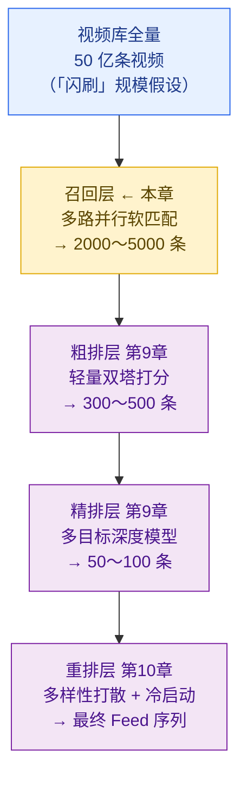
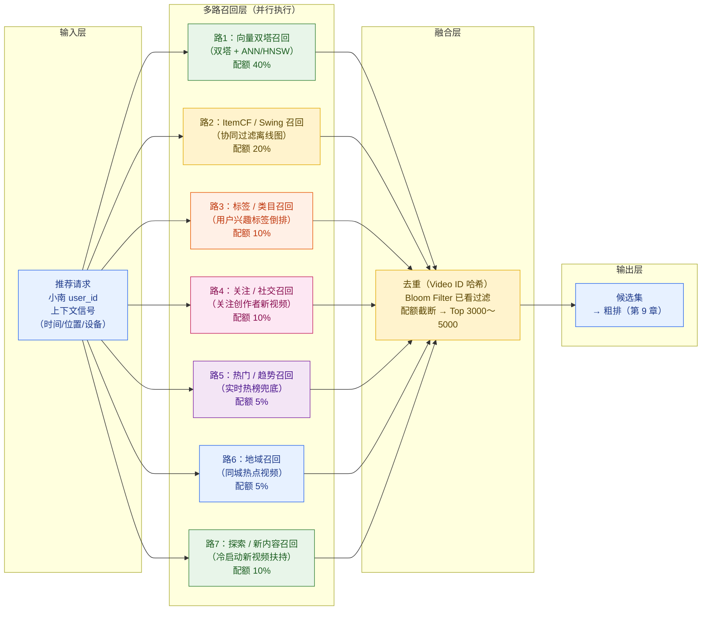
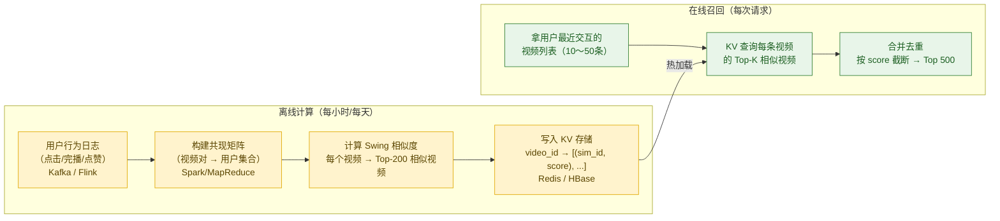
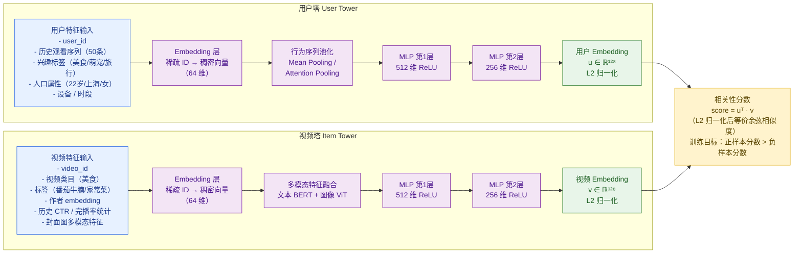
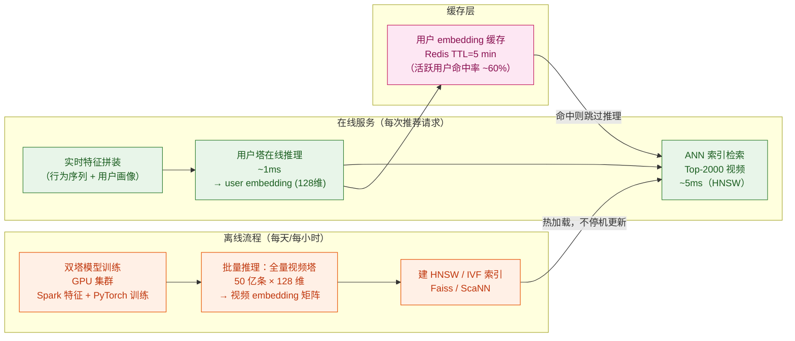
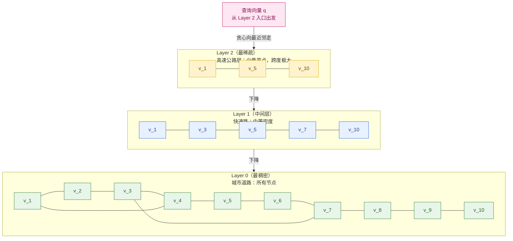
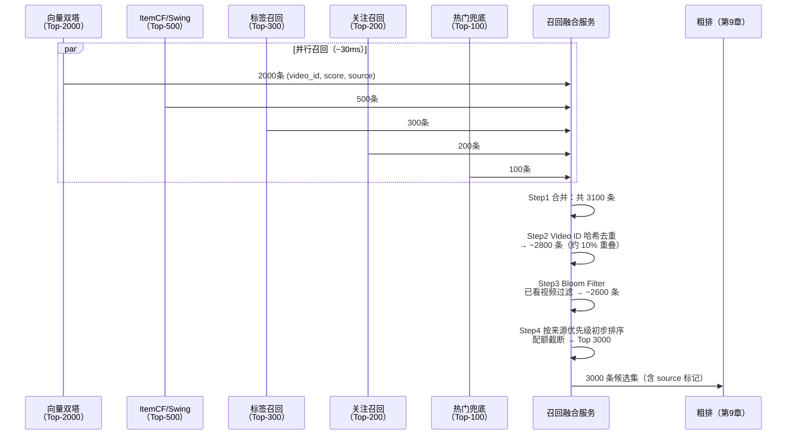
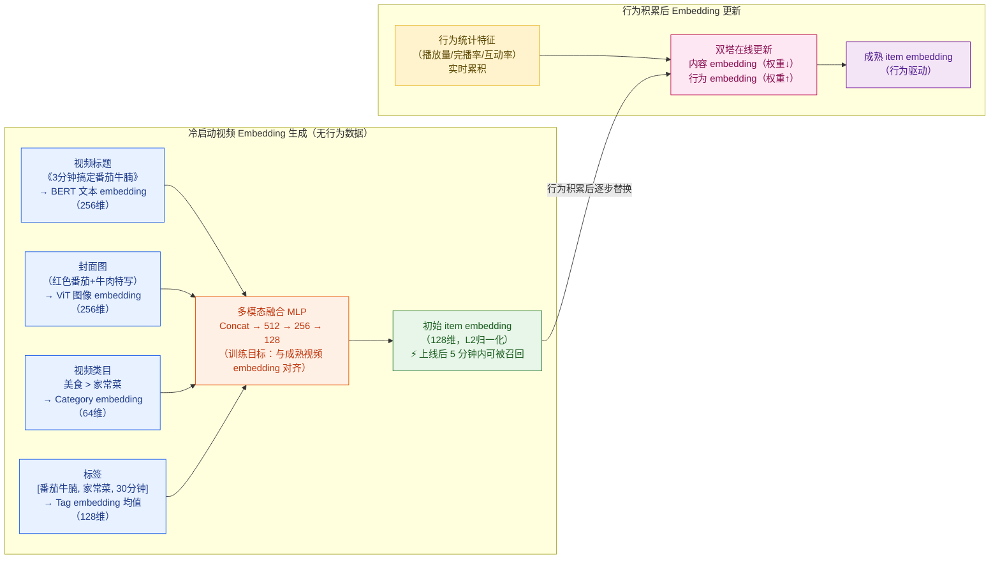
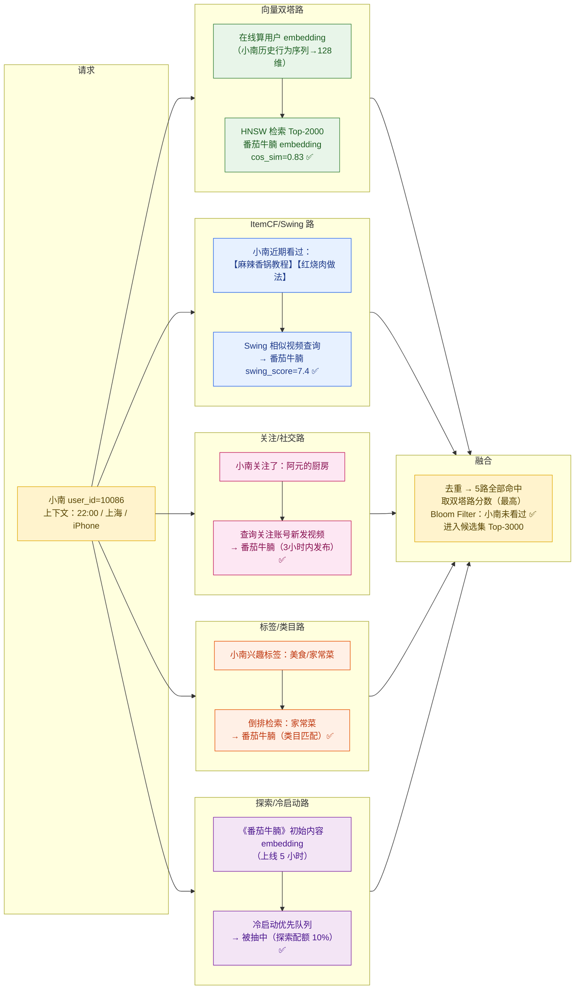

# 第 8 章 · 召回

> **全景教程导航**：第 7 章讲透了推荐系统的整体架构——推荐漏斗的四层（召回→粗排→精排→重排）各自的规模、延迟预算与数据流（详见第 7 章）。本章接棒，聚焦漏斗的**第一层——召回**：在 30～50 ms 内，从 50 亿条视频库中为用户捞出几千条相关候选，为后续粗排（第 9 章）准备"足够好的原材料"。

---

## 本章导读

小南打开「闪刷」，上滑那一刻，推荐引擎要在 100 ms 总预算内给她选出一批视频。可视频库里有 **50 亿条视频**——精排模型再强，也不可能对 50 亿条逐一打分。推荐系统需要先把候选范围从 **50 亿 → 数千**，这就是**召回（Recall / Matching）**的任务。

用一句话定位召回：

> **在 30～50 ms 内，从亿级视频库中找出与"当前用户 × 当前时刻"最相关的 2000～5000 条视频，作为后续精细排序的原材料。**

**召回决定推荐的天花板**——精排再好，也无法找回被召回层错过的视频。《番茄牛腩》如果在召回阶段就被漏掉，后面的精排、重排无论多精准也于事无补。

本章系统讲解：

1. **召回的定位与约束**：为什么召回是推荐天花板，三重约束（延迟/规模/覆盖）
2. **多路召回架构**：为什么不用单一路；典型 7 路召回；配额分配
3. **协同过滤（CF）召回**：ItemCF、UserCF、**Swing 算法**（快手/阿里主打）
4. **向量双塔召回（本章重点）**：双塔/DSSM 结构、训练目标、负采样、离线/在线部署
5. **ANN 近似最近邻检索**：HNSW、IVF、PQ；Faiss/ScaNN；工程实战代码
6. **召回融合与去重**：合并、配额截断、Bloom Filter 初提、初步打分
7. **召回评估**：Recall@K、Hit Rate；如何归因各路贡献
8. **实时召回与冷启动召回**：索引分钟级更新；新视频用多模态 embedding 冷启动
9. **贯穿案例**：《番茄牛腩》通过哪几路被小南召回

---

## 8.1 召回的定位与约束

### 8.1.1 漏斗视角：召回处于哪一层



召回层的三重约束：

| 约束维度 | 具体要求 | 原因 |
|---------|---------|------|
| **延迟约束** | ≤ 30～50 ms（总推荐预算 100 ms）| 多路并行还要留给粗排/精排时间 |
| **规模约束** | 输入 50 亿，输出 2000～5000 | 后续模型计算代价决定上限 |
| **覆盖约束** | 宁可多召回，不可漏掉相关视频 | 召回率决定系统上界，精度次之 |

### 8.1.2 召回决定推荐天花板

设全量相关视频集合为 $\mathcal{R}$，召回层捞出的集合为 $\mathcal{C}$，则系统最终质量的上界为：

$$\boxed{\text{系统质量上界} \propto \frac{|\mathcal{C} \cap \mathcal{R}|}{|\mathcal{R}|} = \text{Recall Rate}}$$

即**召回率**越高，后续精排/重排层的施展空间越大。《番茄牛腩》必须先被捞进 $\mathcal{C}$，才有机会出现在小南面前。

### 8.1.3 为什么召回算法相对简单

与精排（数百特征、数十层网络）相比，召回模型更简单，原因有三：

**原因 1：延迟不允许复杂特征工程**

精排在对 100 条视频打分时可以实时计算"用户历史行为与视频的交叉特征"；但召回要在毫秒内从亿级检索，来不及为每条视频计算实时特征。

**原因 2：向量检索要求可分离性**

双塔模型的核心设计约束是：**用户侧特征与视频侧特征必须完全解耦**。这样 item embedding 可以离线预计算并建 ANN 索引；user embedding 在线实时算，然后做快速向量检索。一旦引入"用户×视频"交叉特征，就无法高效做 ANN 检索。

**原因 3：简单模型的鲁棒性**

过于复杂的召回模型容易过拟合、对热门视频过度召回，而召回需要高覆盖的鲁棒性。工业界经验表明，简单特征的双塔召回效果已经足够好，把更多计算预算留给精排性价比更高。

---

## 8.2 多路召回（Multi-channel Recall）

### 8.2.1 为什么必须多路

单一召回路的风险：

| 问题 | 具体表现 |
|------|---------|
| **单点故障** | 双塔服务挂了，整个召回失效，用户刷到空 Feed |
| **覆盖不全** | 向量召回对冷启动视频效果差（新视频无行为数据，embedding 不准）|
| **热门偏置** | 协同过滤容易偏向热门视频，长尾内容召不回 |
| **多样性不足** | 单一目标模型难以同时覆盖兴趣的多个维度（美食 + 萌宠 + 旅行）|
| **可解释性差** | 纯向量召回黑盒，运营难以介入调控 |

**多路召回的三大优势：**
- **鲁棒性**：一路挂掉，其他路正常降级，不崩溃
- **灵活性**：新路可独立上线、ABTest、下线，不影响其他路
- **可解释性**：每路语义清晰（"关注的人发布了新视频"、"看了类似内容"），便于调试

### 8.2.2 多路召回融合架构图



### 8.2.3 各路召回配额对比表

| 召回路 | 核心原理 | 典型配额 | 更新频率 | 优点 | 缺点 |
|--------|---------|---------|---------|------|------|
| **向量双塔** | user/item embedding 内积 | 35%～40% | 小时/天级 | 语义相关性强，泛化好 | 冷启动视频 embedding 不准 |
| **ItemCF / Swing** | 共现相似视频推荐 | 15%～20% | 小时级 | 可解释，覆盖兴趣多样 | 热门偏置（Swing 有改善）|
| **标签 / 类目** | 用户兴趣标签倒排 | 8%～12% | 实时 | 精准执行运营意图 | 覆盖率有限 |
| **关注 / 社交** | 关注账号的新发布视频 | 8%～12% | 分钟级 | 留存价值高，强时效 | 覆盖人群窄（重度社交用户）|
| **热门 / 趋势** | 全站或分类实时热榜 | 4%～6% | 小时级 | 兜底稳定，永不为空 | 无个性化，多样性差 |
| **地域召回** | 同城/周边热点视频 | 3%～6% | 小时级 | 本地化体验，新内容来源 | 地理信号有误差 |
| **探索 / 新内容** | 冷启动视频优先队列 | 8%～12% | 分钟级 | 保证新内容曝光机会 | 精度较低 |

> **配额动态调整**：各路配额通过 ABTest 持续调优，而非固定值。某路质量提升时可扩容，某路故障时其他路自动补位。

---

## 8.3 协同过滤召回：ItemCF 与 Swing

### 8.3.1 ItemCF：看了 A 的用户也看了 B

**核心思路**：计算视频-视频的相似度矩阵，若用户刚看完视频 A，则找出"和 A 最相似的 Top-K 视频"推荐给他。

**基于共现的相似度（Jaccard 变体）**：

设 $N(i)$ 为看过视频 $i$ 的用户集合，$N(j)$ 为看过视频 $j$ 的用户集合，则：

$$\text{sim}_{CF}(i, j) = \frac{|N(i) \cap N(j)|}{|N(i)|^{\alpha} \cdot |N(j)|^{1-\alpha}}$$

其中 $\alpha \in (0,1)$ 是归一化超参数（通常取 0.5，退化为几何平均）。

**余弦相似度版本**：

$$\text{sim}_{CF}(i, j) = \frac{|N(i) \cap N(j)|}{\sqrt{|N(i)|} \cdot \sqrt{|N(j)|}}$$

**ItemCF 的热门偏置问题**：

若视频 $j$ 是全站爆款，则它被几乎所有用户看过，$|N(i) \cap N(j)| \approx |N(i)|$，导致所有视频都和 $j$ "高度相似"。爆款视频垄断召回，长尾内容无机会。这就是 **Swing** 算法的动机。

### 8.3.2 Swing：解决 ItemCF 热门偏置

Swing 算法（阿里、快手工业实践）的核心洞察：

> **如果视频 $i$ 和 $j$ 只被来自同一个"小圈子"的用户共同看过，这种共现是不可靠的（可能是话题标签、热门推荐导致的，而非真实兴趣相关）；只有来自多个独立用户对的共现，才代表真实相似度。**

**Swing 相似度公式**：

$$\boxed{\text{sim}_{Swing}(i, j) = \sum_{u \in N(i) \cap N(j)} \sum_{v \in N(i) \cap N(j), v \neq u} \frac{1}{\alpha + |N(u) \cap N(v)|}}$$

其中：
- $N(i) \cap N(j)$ 是同时看过视频 $i$ 和 $j$ 的用户集合
- $N(u) \cap N(v)$ 是用户 $u$ 和用户 $v$ 共同看过的视频集合（衡量两用户的"亲密程度"）
- $\alpha$ 是平滑参数（防止分母为零，通常取 5～20）

**直觉解释**：如果看过 $i$ 和 $j$ 的两个用户 $u$ 和 $v$ 本来就是"兴趣高度相似的一对"（即 $|N(u) \cap N(v)|$ 大），则这对用户的贡献权重 $\frac{1}{\alpha + |N(u) \cap N(v)|}$ 就小——避免被小圈子的"团体行为"虚高相似度。

| 算法 | 热门偏置 | 计算复杂度 | 适用场景 |
|------|---------|-----------|---------|
| **ItemCF（余弦）** | 严重 | $O(|U| \cdot \bar{d}^2)$ | 基线、简单场景 |
| **ItemCF（IUF 惩罚）** | 中等 | $O(|U| \cdot \bar{d}^2)$ | 加用户活跃度权重 |
| **Swing** | 轻微 | $O(|U| \cdot \bar{d}^2 \cdot \bar{n})$ | 工业界主流，快手/阿里实践 |

### 8.3.3 ItemCF/Swing 离线计算流程



**ItemCF 在线服务的核心技巧**：

用户刚看完 10 条视频，每条视频有 200 个相似视频 → 一次性拿到 2000 个候选，再合并去重截断到 500。这个过程全是 KV 查询，没有模型推理，延迟极低（< 5 ms）。

### 8.3.4 UserCF：为什么短视频场景少用

UserCF 计算"与当前用户行为最相似的用户群体"然后推荐他们喜欢的视频。在短视频场景几乎不用，原因：

- 日活 1.5 亿用户，用户-用户相似矩阵 $O(n^2)$ 存储不可行
- 用户行为极度稀疏，相似度计算不稳定
- 双塔向量召回已经做了"语义层的用户相似聚合"，覆盖了 UserCF 能做的大部分

---

## 8.4 向量双塔召回（Two-Tower / DSSM）

这是短视频推荐召回的**核心路**，配额最大（35%～40%）、效果最强。

### 8.4.1 双塔的核心直觉

**问题**：如何定义"用户 $u$ 与视频 $v$ 的相关性"？

朴素做法：把用户特征和视频特征拼接后输入大模型。但这意味着每次召回要对每条候选视频执行一次完整网络——50 亿条视频，彻底不可行。

**双塔（Two-Tower / DSSM）的破局**：

$$\text{user embedding:} \quad \mathbf{u} = f_\theta(\text{用户特征}) \in \mathbb{R}^d$$

$$\text{item embedding:} \quad \mathbf{v} = g_\phi(\text{视频特征}) \in \mathbb{R}^d$$

$$\text{相关性分数:} \quad \text{score}(u, v) = \mathbf{u}^\top \mathbf{v}$$

**解耦的威力**：

- 视频 embedding $\mathbf{v}$ 与用户无关 → 可**离线批量预计算**，建好 ANN 索引
- 在线服务只需实时算**当前用户的 embedding** $\mathbf{u}$（一次前向传播，~1 ms）
- 然后在 ANN 索引中检索与 $\mathbf{u}$ 最近的 Top-K 个 $\mathbf{v}$（~5 ms）

这就把"50 亿次打分"转化成了"1 次用户塔推理 + O(log N) 次 ANN 检索"。

### 8.4.2 双塔结构图



### 8.4.3 相似度函数：内积还是余弦

**内积（Dot Product）**：

$$\text{score}(u, v) = \mathbf{u}^\top \mathbf{v} = \sum_{i=1}^{d} u_i v_i$$

允许模型通过向量模长表达视频"热度"（热门视频模长大），但热门视频可能过度主导召回。

**余弦相似度（Cosine Similarity）**：

$$\text{score}(u, v) = \frac{\mathbf{u}^\top \mathbf{v}}{\|\mathbf{u}\| \cdot \|\mathbf{v}\|}$$

只关注方向，排除模长影响，等价于先对 $\mathbf{u}$ 和 $\mathbf{v}$ 做 L2 归一化再做内积：

$$\boxed{\text{score}(u, v) = \hat{\mathbf{u}}^\top \hat{\mathbf{v}}, \quad \hat{\mathbf{x}} = \frac{\mathbf{x}}{\|\mathbf{x}\|_2}}$$

**工业界推荐**：输出层接 L2 归一化层，统一使用内积检索。既有余弦相似度的稳定性，又能直接使用高效的 ANN 内积索引（FAISS `METRIC_INNER_PRODUCT`）。

### 8.4.4 训练目标：Sampled Softmax（批内负采样）

**为什么不用简单二分类？**

如果直接做"正样本=1，随机负样本=0"的二分类，大量随机负样本是"Easy Negative"（美食视频的负样本是冷知识视频），模型学不到细粒度的区分能力。

**In-Batch Negative Sampling（批内负采样）**：

设一个 mini-batch 有 $B$ 个正样本对 $(u_i, v_i)$，$i = 1, \ldots, B$。

对第 $i$ 个用户 $u_i$，将同一 batch 中其他用户的正样本视频 $v_j$（$j \neq i$）视为其负样本（来自真实分布的"Hard Negative"）。

**训练损失（Sampled Softmax / InfoNCE）**：

$$\boxed{\mathcal{L} = -\frac{1}{B} \sum_{i=1}^{B} \log \frac{\exp(\text{score}(u_i, v_i) / \tau)}{\sum_{j=1}^{B} \exp(\text{score}(u_i, v_j) / \tau)}}$$

其中 $\tau$（温度系数 Temperature）通常取 0.05～0.1：

- $\tau$ 越小：softmax 越"尖锐"，正样本分数与负样本分差异放大，训练更难但 embedding 区分度更强
- $\tau$ 越大：梯度更稳定，但 embedding 区分度下降

**热门偏置矫正（Sampling Bias Correction）**：

In-Batch 采样中，热门视频被抽到的概率更高，容易被错误当作他人的负样本，拉偏 embedding。Google 2019 提出矫正方案：

$$\text{corrected\_score}(u_i, v_j) = \text{score}(u_i, v_j) - \log p(v_j)$$

其中 $p(v_j)$ 是视频 $j$ 在训练数据中的采样概率（热门视频 $p$ 大，分数被调低）。

### 8.4.5 特征设计要点

| 特征类型 | 用户塔 | 视频塔 |
|---------|-------|-------|
| **ID 特征** | user_id → embedding | video_id, author_id → embedding |
| **行为序列** | 最近 50 条交互视频 ID（Mean/Attention Pooling）| — |
| **统计特征** | 7/30 天各类目完播率、点赞率 | 历史 CTR、完播率、点赞率（截止到当前时刻）|
| **人口/属性** | 年龄、性别、城市 | 视频时长、类目、标签 |
| **多模态** | — | 封面图 ViT 特征、标题 BERT 特征（新视频冷启动关键）|
| **实时特征** | 当前 session 已看内容 | 过去 1 小时的实时播放量、评论数 |

**⚠ 特征穿越警告（Feature Leakage）**：

视频塔不能使用"训练正样本发生之后的统计数据"（如"这条视频最终被播放了1亿次"），否则模型学到的是"未来信息"，线上效果会大幅下降。统计特征必须用**时间截断**的历史值。

### 8.4.6 PyTorch 双塔伪代码

```python
import torch
import torch.nn as nn
import torch.nn.functional as F

class UserTower(nn.Module):
    """
    用户塔：接收用户特征，输出 L2 归一化的用户 embedding
    """
    def __init__(self, user_vocab: int, item_vocab: int,
                 embed_dim: int = 64, output_dim: int = 128):
        super().__init__()
        # 用户 ID embedding
        self.user_embed = nn.Embedding(user_vocab, embed_dim, padding_idx=0)
        # 行为序列中的视频 ID embedding（与视频塔共享或独立）
        self.item_embed = nn.Embedding(item_vocab, embed_dim, padding_idx=0)
        # MLP：(user_embed + mean_pool_of_hist) → output_dim
        self.mlp = nn.Sequential(
            nn.Linear(embed_dim * 2, 512),
            nn.ReLU(),
            nn.Linear(512, 256),
            nn.ReLU(),
            nn.Linear(256, output_dim),
        )

    def forward(self, user_id: torch.Tensor,
                hist_ids: torch.Tensor) -> torch.Tensor:
        """
        user_id:  (B,)
        hist_ids: (B, seq_len)  padding 用 0 填充
        return:   (B, output_dim)  L2 归一化
        """
        uid_emb = self.user_embed(user_id)           # (B, D)
        # 屏蔽 padding，做 mean pooling
        mask = (hist_ids != 0).float().unsqueeze(-1) # (B, T, 1)
        seq_emb = (self.item_embed(hist_ids) * mask).sum(1) / (
            mask.sum(1) + 1e-8)                      # (B, D)
        x = torch.cat([uid_emb, seq_emb], dim=-1)    # (B, 2D)
        return F.normalize(self.mlp(x), p=2, dim=-1) # (B, output_dim)


class ItemTower(nn.Module):
    """
    视频塔：接收视频特征，输出 L2 归一化的视频 embedding
    可离线批量预计算，建 ANN 索引
    """
    def __init__(self, video_vocab: int, cate_vocab: int,
                 embed_dim: int = 64, output_dim: int = 128):
        super().__init__()
        self.video_embed = nn.Embedding(video_vocab, embed_dim, padding_idx=0)
        self.cate_embed  = nn.Embedding(cate_vocab,  embed_dim, padding_idx=0)
        self.mlp = nn.Sequential(
            nn.Linear(embed_dim * 2, 512),
            nn.ReLU(),
            nn.Linear(512, 256),
            nn.ReLU(),
            nn.Linear(256, output_dim),
        )

    def forward(self, video_id: torch.Tensor,
                cate_id: torch.Tensor) -> torch.Tensor:
        """
        video_id: (B,)
        cate_id:  (B,)  视频类目 ID
        return:   (B, output_dim)  L2 归一化
        """
        v = self.video_embed(video_id) # (B, D)
        c = self.cate_embed(cate_id)   # (B, D)
        x = torch.cat([v, c], dim=-1)  # (B, 2D)
        return F.normalize(self.mlp(x), p=2, dim=-1)


class TwoTowerModel(nn.Module):
    """
    双塔模型：User Tower + Item Tower
    训练用 In-Batch Negative Sampling + 温度缩放 Softmax
    """
    def __init__(self, temperature: float = 0.07, **kwargs):
        super().__init__()
        self.user_tower = UserTower(**{
            k: v for k, v in kwargs.items()
            if k in ('user_vocab', 'item_vocab', 'embed_dim', 'output_dim')
        })
        self.item_tower = ItemTower(**{
            k: v for k, v in kwargs.items()
            if k in ('video_vocab', 'cate_vocab', 'embed_dim', 'output_dim')
        })
        self.tau = temperature

    def compute_loss(self, u: torch.Tensor,
                     v: torch.Tensor) -> torch.Tensor:
        """
        In-Batch Negative Sampling Loss（等价 InfoNCE）
        u: (B, D)  用户 embedding
        v: (B, D)  视频 embedding
        对角线为正样本对，其余为负样本对
        """
        B = u.size(0)
        # 相似度矩阵 (B, B)，除以温度系数
        logits = torch.matmul(u, v.T) / self.tau   # (B, B)
        # 正样本标签：第 i 行的正样本是第 i 个视频
        labels = torch.arange(B, device=u.device)
        # Cross-Entropy 等价于 Sampled Softmax Loss
        loss = F.cross_entropy(logits, labels)
        return loss
```

### 8.4.7 离线/在线部署架构



---

## 8.5 ANN 近似最近邻检索

### 8.5.1 为什么精确 KNN 不可行

「闪刷」视频库 50 亿条视频，每条 128 维 float32 embedding，一次精确 KNN 需要：

$$\text{计算量} = 5 \times 10^9 \times 128 \approx 6.4 \times 10^{11} \text{ 次浮点操作}$$

**存储就已经是难题**：50 亿 × 128 × 4 bytes ≈ **2.56 TB**，无法全部放入单机内存。即便内存够，暴力检索延迟约 **10 秒量级**，与 5 ms 目标相差三个数量级。

**ANN（Approximate Nearest Neighbor）**以少量精度损失换取数量级的性能提升——工业界的标准解法。

### 8.5.2 HNSW：分层可导航小世界图（主流方案）

**原理**：受"六度分隔理论"启发，构建多层图结构：



**检索算法**：
1. 从最顶层（稀疏层）随机入口节点出发
2. 在当前层贪心走到"最近邻"（局部最优）
3. 降到下一层，继续贪心搜索
4. 直到底层，收集候选结果

**检索复杂度**：$O(\log N)$（多层图的层数是 $O(\log N)$）

**关键参数**：

| 参数 | 含义 | 典型值 | 效果 |
|------|------|-------|------|
| `M` | 每个节点最大邻居数 | 16～32 | 增大 → 精度高，内存大 |
| `efConstruction` | 建索引时探索宽度 | 100～200 | 增大 → 索引质量高，构建慢 |
| `efSearch` | 查询时探索宽度 | 64～256 | 增大 → 召回率高，延迟大 |

**HNSW 的优缺点**：

| 维度 | 评价 |
|------|------|
| 召回率 | 95%～99%（efSearch 合理时）|
| 查询延迟 | 1～5 ms（千万级向量）|
| 支持增量更新 | ✅ 可动态添加节点（适合新视频实时入库）|
| 内存占用 | 较大（需存储图结构，约 2～4× 向量本身）|
| 构建时间 | 较慢（数亿向量需要小时级）|

### 8.5.3 IVF：倒排文件索引（大规模场景）

**原理**：

1. 离线用 K-Means 对全量向量聚类，得到 $k$ 个聚类中心（Centroids）
2. 每个视频向量分配到最近的聚类中心，建立倒排列表
3. 在线检索：先算 query 向量到所有中心的距离，选最近的 $n_{probe}$ 个中心，只在这 $n_{probe}$ 个倒排列表中搜索

$$k \approx \sqrt{N} \quad (N = \text{视频总数})$$

**参数权衡**：$n_{probe}$ 越大 → 召回率越高，延迟越大（通常 $n_{probe} = 8 \sim 64$）

**IVF 适合**：亿级以上超大规模向量，内存受限场景（配合 PQ 压缩）。

### 8.5.4 PQ：乘积量化（向量压缩）

**原理**：将 128 维向量切成 $m$ 段（如 $m = 32$，每段 4 维），对每段独立做 K-Means（每段 256 个中心，用 1 byte 表示），则：

$$\text{原始：} 128 \times 4 \text{ bytes} = 512 \text{ bytes} \xrightarrow{\text{PQ}} 32 \text{ bytes}（\approx 16\text{× 压缩}）$$

50 亿视频的内存占用：
- 原始 float32：50 亿 × 512 bytes ≈ **2.56 TB** → 不可行
- PQ 压缩后：50 亿 × 32 bytes ≈ **160 GB** → 多机分片可行

**PQ 的代价**：量化误差导致召回率下降 5%～10%，通常配合 IVF 做"粗筛 + 精筛"：

$$\text{IVF（粗筛到 } n_{probe} \text{ 个桶）→ PQ（桶内快速排序）→ 精排层重打分}$$

### 8.5.5 ANN 算法性能对比

| 算法 | 召回率 | 查询延迟（P50）| 内存占用 | 增量更新 | 典型场景 |
|------|-------|--------------|---------|---------|---------|
| **暴力 Flat** | 100% | 极高 | 高 | ✅ | 小规模基准，验证用 |
| **IVF** | 90%～95% | 5～10 ms | 中 | ❌（需重建）| 千万～亿级 |
| **HNSW** | 95%～99% | 1～5 ms | 高 | ✅ | 千万级内，精度优先 |
| **IVF + PQ** | 85%～90% | 3～8 ms | 极低 | ❌ | 十亿+级，内存受限 |
| **ScaNN** | 90%～98% | 1～3 ms | 中 | ⚠️ | Google 开源，GPU 友好 |

### 8.5.6 Faiss 代码：建 HNSW 索引与检索

```python
import faiss
import numpy as np
import time

# ======= 离线：建 HNSW 索引（用于短视频向量召回）=======

def build_hnsw_index(video_embeddings: np.ndarray,
                     M: int = 32,
                     ef_construction: int = 200,
                     ef_search: int = 128) -> faiss.Index:
    """
    为视频 embedding 建 HNSW 索引

    Args:
        video_embeddings: (num_videos, 128) float32，已 L2 归一化
        M: 每个节点最大邻居数（越大精度越高，内存越大）
        ef_construction: 建索引时的探索宽度
        ef_search: 查询时的探索宽度（可在检索时动态调整）
    Returns:
        faiss.IndexHNSWFlat 索引对象
    """
    n, d = video_embeddings.shape
    print(f"Building HNSW index: {n:,} videos, {d}d embeddings, M={M}")

    # 使用内积度量（L2 归一化后内积 == 余弦相似度）
    index = faiss.IndexHNSWFlat(d, M, faiss.METRIC_INNER_PRODUCT)
    index.hnsw.efConstruction = ef_construction
    index.hnsw.efSearch = ef_search

    # HNSW 无需显式训练，直接 add
    t0 = time.time()
    index.add(np.ascontiguousarray(video_embeddings, dtype=np.float32))
    elapsed = time.time() - t0
    print(f"HNSW index built in {elapsed:.1f}s, {index.ntotal:,} vectors")
    return index


def recall_videos_hnsw(
    user_embedding: np.ndarray,
    index: faiss.Index,
    video_id_map: np.ndarray,
    top_k: int = 2000,
    ef_search: int = 256     # 可在线调：efSearch 越大召回率越高但延迟增加
) -> list:
    """
    用用户 embedding 检索最相关的 Top-K 视频（向量双塔召回路）

    Args:
        user_embedding: (128,) float32，L2 归一化
        index: 已建好的 HNSW 索引
        video_id_map: 索引位置 i → 真实 video_id 的映射
        top_k: 召回数量
        ef_search: 查询探索宽度，线上可动态调整（平衡延迟/召回率）
    Returns:
        [(video_id, score), ...] 按相关性分数降序
    """
    # 动态调整 efSearch（线上可按负载降级）
    if hasattr(index, 'hnsw'):
        index.hnsw.efSearch = ef_search

    query = np.ascontiguousarray(
        user_embedding.reshape(1, -1), dtype=np.float32
    )
    t0 = time.time()
    scores, indices = index.search(query, top_k)
    latency_ms = (time.time() - t0) * 1000

    results = []
    for score, idx in zip(scores[0], indices[0]):
        if idx < 0:
            continue  # Faiss 返回 -1 表示无效位置
        results.append((int(video_id_map[idx]), float(score)))

    print(f"HNSW recall: {len(results)} videos in {latency_ms:.2f}ms")
    return results


# ======= 新视频增量插入（HNSW 支持动态增量）=======

def add_new_videos_to_index(index: faiss.Index,
                             new_embeddings: np.ndarray,
                             new_video_ids: list,
                             video_id_map: list) -> None:
    """
    新视频上线时增量插入 HNSW 索引（不需要重建整个索引）
    这是 HNSW 相比 IVF 的核心优势之一

    Args:
        index: 已有的 HNSW 索引
        new_embeddings: (num_new, 128) float32，新视频 embedding
        new_video_ids: 新视频的 video_id 列表
        video_id_map: 全量 video_id_map（会被 in-place 扩展）
    """
    new_embeddings = np.ascontiguousarray(new_embeddings, dtype=np.float32)
    old_size = index.ntotal
    index.add(new_embeddings)
    video_id_map.extend(new_video_ids)
    print(f"Added {len(new_video_ids)} new videos: "
          f"{old_size:,} → {index.ntotal:,} total")


# ======= 完整示例：模拟「闪刷」50 亿中取 1000 万子集 =======

def demo():
    np.random.seed(42)
    num_videos = 10_000_000   # 模拟 1000 万（实际 50 亿分片）
    d = 128                   # embedding 维度

    # 模拟视频 embedding（实际由 Item Tower 离线批量产出）
    print("Generating mock video embeddings...")
    video_embs = np.random.randn(num_videos, d).astype(np.float32)
    video_embs /= np.linalg.norm(video_embs, axis=1, keepdims=True) # L2 归一化
    video_id_map = np.arange(1, num_videos + 1)  # video_id = 1, 2, ..., N

    # 建 HNSW 索引
    index = build_hnsw_index(video_embs, M=32, ef_construction=200)

    # 模拟小南的用户 embedding（实际由 User Tower 在线推理）
    user_emb = np.random.randn(d).astype(np.float32)
    user_emb /= np.linalg.norm(user_emb)

    # 向量召回 Top-2000
    results = recall_videos_hnsw(user_emb, index, video_id_map, top_k=2000)
    print(f"\nTop 5 recalled videos for 小南:")
    for rank, (vid, score) in enumerate(results[:5], 1):
        print(f"  #{rank}: video_id={vid}, cosine_sim={score:.4f}")

    # 新视频增量插入（《番茄牛腩》刚上线）
    new_embs = np.random.randn(10, d).astype(np.float32)
    new_embs /= np.linalg.norm(new_embs, axis=1, keepdims=True)
    add_new_videos_to_index(
        index, new_embs,
        new_video_ids=list(range(num_videos + 1, num_videos + 11)),
        video_id_map=list(video_id_map)
    )


if __name__ == "__main__":
    demo()
```

---

## 8.6 召回融合与去重

### 8.6.1 多路合并流程

多路召回并行执行完毕后，需要一个融合步骤，把结果合并成统一的候选集：



### 8.6.2 去重策略

**Video ID 精确去重**：同一视频被多路召回时，保留**分数最高的那一路**的分数，并记录所有来源（便于归因分析）。

```python
from collections import defaultdict

def merge_multi_channel_results(
    channel_results: dict[str, list[tuple[int, float]]]
) -> list[tuple[int, float, str]]:
    """
    合并多路召回结果，按最高分去重

    Args:
        channel_results: {channel_name: [(video_id, score), ...]}
    Returns:
        [(video_id, max_score, source_channels), ...] 按分数降序
    """
    best: dict[int, tuple[float, list[str]]] = {}
    for channel, results in channel_results.items():
        for vid, score in results:
            if vid not in best or score > best[vid][0]:
                if vid in best:
                    best[vid] = (score, best[vid][1] + [channel])
                else:
                    best[vid] = (score, [channel])

    merged = [
        (vid, score, '+'.join(channels))
        for vid, (score, channels) in best.items()
    ]
    # 按分数降序
    merged.sort(key=lambda x: x[1], reverse=True)
    return merged
```

### 8.6.3 已看视频过滤（Bloom Filter 简介）

召回出来的视频中，小南可能已经看过部分——把它们再推给她体验很差。需要过滤"已看视频"。

**为什么用 Bloom Filter？**

小南看过 10000 条视频，每次召回约 3000 候选，需要快速判断"候选视频是否在已看集合中"。精确 HashSet 需要存所有看过的 video_id，每用户约 80 KB（10000 × 8 bytes）；Bloom Filter 误判率 1% 时仅需 ~12 KB，节省 85%。

> 详细的 Bloom Filter 设计（包括分布式、TTL 衰减等）在第 10 章「重排与冷启动」中深入讲解。本章只需知道：召回融合时会用 Bloom Filter 过滤已看视频，过滤后候选数量减少约 5%～15%。

### 8.6.4 初步打分与截断

融合后的候选集需要截断到 3000 条送给粗排。截断策略：

1. **来源优先级**：关注路（强意图）> 向量双塔路 > CF 路 > 热门路
2. **各路配额保底**：保证每路至少保留一定数量，避免某路完全被压制（长尾保护）
3. **分数归一化**：各路分数量纲不同（向量路是余弦相似度 0～1，CF 路是 Swing 分数），需要各路内部归一化后再比较

---

## 8.7 召回评估指标体系

### 8.7.1 离线评估指标

**召回率 Recall@K（最重要的离线指标）**：

$$\boxed{\text{Recall@K} = \frac{|\text{用户实际点击（完播）的视频集合} \cap \text{召回 TopK}|}{|\text{用户实际点击的视频集合}|}}$$

含义：用户真正喜欢的视频，有多少比例被召回进了候选集。工业界通常要求 Recall@3000 ≥ 80%。

**命中率 Hit Rate（HR@K）**：

$$\text{HR@K} = \frac{\text{召回 TopK 中包含至少一个点击视频的用户数}}{\text{总用户数}}$$

更宽松的指标，衡量"有没有命中"而非"命中多少比例"。

**覆盖率（Coverage）**：

$$\text{Coverage} = \frac{|\text{验证集上至少被召回一次的视频集合}|}{|\text{全量视频}|}$$

衡量长尾覆盖能力。如果 Coverage 过低（系统只反复召回少量热门视频），长尾创作者内容没有曝光机会。

**新视频召回率（新品入池时效）**：

$$\text{New Video Recall Rate} = \frac{|\text{上线 24h 内的新视频被召回的数量}|}{|\text{上线 24h 内的新视频总量}|}$$

衡量冷启动召回路的及时性。

### 8.7.2 各召回路贡献归因

**归因方法**：在候选集中为每条视频打上 source 标记（来自哪路/哪几路召回），最终精排打分后统计各路对"曝光视频"的贡献：

```python
# 召回路归因统计（离线分析）
def analyze_channel_contribution(
    final_exposure_logs: list[dict]
) -> dict:
    """
    分析多路召回中，最终被曝光（并产生正反馈）的视频来自哪些召回路

    Args:
        final_exposure_logs: 曝光日志，每条 {video_id, source_channels, is_clicked}
    Returns:
        {channel: {'exposure': N, 'click': N, 'ctr': %}} 各路贡献统计
    """
    stats = defaultdict(lambda: {'exposure': 0, 'click': 0})
    for log in final_exposure_logs:
        for ch in log['source_channels'].split('+'):
            stats[ch]['exposure'] += 1
            if log['is_clicked']:
                stats[ch]['click'] += 1

    result = {}
    for ch, s in stats.items():
        result[ch] = {
            'exposure': s['exposure'],
            'click': s['click'],
            'ctr': s['click'] / s['exposure'] if s['exposure'] > 0 else 0
        }
    return result
```

### 8.7.3 离线-在线 Gap 与 ABTest

召回层的离线评估有天然局限——ground truth（用户点击）本身来自历史召回系统的结果，存在曝光偏差。

**离线→在线 Gap 的主要来源**：

| Gap 来源 | 说明 |
|---------|------|
| **曝光偏差** | 离线 ground truth 只包含历史被曝光的视频 |
| **分布漂移** | 用户兴趣随时间变化，历史数据不反映当前 |
| **全链路交互** | 召回→粗排→精排→重排的全链路效果 ≠ 召回单独效果 |

**标准做法**：

1. **离线 Recall@K** 用于快速迭代筛选方案（快，无需流量）
2. **Recall@K 提升 + 覆盖率提升** → 上线 ABTest（关键）
3. **在线指标**：观察整体 Feed CTR、完播率、关注率的变化（召回改动→全链路指标）

---

## 8.8 实时召回与冷启动召回

### 8.8.1 为什么需要实时召回

传统的离线向量召回（每天更新 ANN 索引）存在一个问题：**刚刚走红的视频来不及进入召回候选**。

场景：某条《番茄牛腩》教程今晚 8 点因为某个名厨 Repost 突然爆火——但 ANN 索引是凌晨 2 点更新的，今晚 8 点到明天凌晨 2 点之间，这条视频几乎没有任何召回机会。

**小红书的实践**：召回侧 CF 索引和向量索引实现**分钟级更新**：

- 新发布/新走红视频的 embedding 每分钟增量插入 HNSW 索引（HNSW 支持动态插入）
- ItemCF 的共现矩阵用 Flink 流式增量更新（不必每次全量重计算）
- 热门池每小时基于最近 6 小时数据重新计算，实时捕捉趋势

### 8.8.2 冷启动召回：新视频无行为数据怎么办

**问题**：《番茄牛腩》刚上传，还没有任何用户播放行为。双塔向量召回依赖视频历史 CTR、完播率等统计特征；ItemCF 依赖共现矩阵——这两路对新视频完全失效。

**解决方案：多模态内容 embedding 作为初始 item 向量**



**冷启动召回路的关键设计**：

1. **内容 embedding 入库**：视频转码完成后，立即触发多模态特征抽取，生成初始 embedding，插入 ANN 索引（< 5 分钟）
2. **探索配额保护**：专门给冷启动视频预留 8%～12% 的召回配额，防止被成熟视频完全压制
3. **渐进式权重迁移**：随着行为数据积累，item embedding 从"内容主导"逐步迁移为"行为主导"
4. **作者 embedding 迁移**：如果是已有粉丝的创作者（阿元），用作者历史视频的 embedding 均值作为新视频的初始 embedding，效果比纯内容 embedding 更好

### 8.8.3 TikTok Deep Retrieval：树形结构召回超大规模

TikTok 探索了基于 Beam Search 的 Deep Retrieval 方案，用树形结构索引替代传统 ANN：

- 视频库按 embedding 聚类组织成树（类似 TDM，Tree-based Deep Model）
- 检索时做 Beam Search（保留 Top-B 个路径），每次从当前节点向下展开
- 一次检索可以捞出约 **10 万**候选（远多于 HNSW 的 2000），再经粗排压缩

这种方案在超大规模（百亿级视频）下比 HNSW 更适合，但实现复杂度高，目前主要是头部平台内部实践。

---

## 8.9 贯穿案例：《番茄牛腩》通过哪几路被小南召回

### 8.9.1 场景背景

- **小南**：22 岁，上海，美食 + 萌宠 + 旅行兴趣，关注了 30 个账号（含阿元的厨房）
- **《番茄牛腩》**：今天下午 3 点上传，已通过审核，刚刚完成冷启动小流量探测，获得了一些初始播放
- **当前时刻**：晚上 10 点，小南打开「闪刷」上滑

### 8.9.2 六路并行召回



### 8.9.3 《番茄牛腩》在各路的召回详情

| 召回路 | 触发原因 | 分数/排名 | 状态 |
|--------|---------|---------|------|
| **向量双塔** | 小南行为序列"美食/家常菜"类 embedding 与番茄牛腩 content embedding 内积高 | cos_sim = 0.83，双塔路 Rank #47 | ✅ 召回 |
| **ItemCF/Swing** | 小南近期看了《红烧肉》《麻辣香锅》，两者与《番茄牛腩》的 Swing 相似度高 | swing_score = 7.4，CF 路 Rank #12 | ✅ 召回 |
| **关注/社交** | 小南关注了"阿元的厨房"，视频 3 小时内发布，关注路直接拉取 | 关注路 Rank #3（时间降序）| ✅ 召回 |
| **标签/类目** | 视频打了"家常菜"类目标签，小南兴趣标签命中 | 类目路 Rank #89 | ✅ 召回 |
| **冷启动探索** | 视频上线 5 小时，被放入冷启动优先队列，小南的 10% 探索配额中被抽中 | 探索路 Rank #34 | ✅ 召回 |
| **热门兜底** | 视频还不够热，未进热门池 | — | ❌ 未召回 |

**去重后**：5 路都召回了《番茄牛腩》，融合后取**向量双塔路的分数（0.83）**作为最终得分，source 标记为 `vector+cf+social+tag+explore`，进入 Top-3000 候选集，送往粗排（第 9 章）。

### 8.9.4 如果没有关注路和冷启动路会怎样

- **若没有关注路**：双塔路和 CF 路虽然也能召回《番茄牛腩》（小南的兴趣匹配），但关注路是**时效最强的**——新发 3 小时的视频在双塔召回中竞争力弱（历史统计特征少），关注路是保障"我关注的人新发了我一定能看到"的关键。
- **若没有冷启动路**：对于还没有阿元粉丝的新用户而言，《番茄牛腩》只能靠双塔内容 embedding 被召回；冷启动路提供了额外的"探索机会"，保证新视频不会因为缺乏行为数据而永远召不出来。

---

## 8.10 常见易错点

**1. 召回路之间高度重叠，浪费配额**

双塔路和 CF 路对同类热门视频召回高度重叠，导致实际覆盖不如预期。解法：定期分析各路之间的 Jaccard 相似度，若某两路相似度超过 30%，考虑调整特征或合并。

**2. 双塔特征穿越（Feature Leakage）**

视频塔使用了"训练正样本发生时刻之后的统计数据"（如最终播放量），导致训练效果虚高，线上严重掉点。解法：所有统计特征必须使用训练样本时刻之前的历史值，强制时间截断。

**3. ANN 召回率与延迟的权衡设错**

线上将 `efSearch` 调得太小以压延迟，导致 HNSW 召回率降到 80% 以下；召回层天花板下降直接导致全链路 CTR 下滑。解法：分场景设置 `efSearch`（高峰期略降/低峰期略高），并建立召回率监控告警。

**4. 向量库更新不及时，新视频召不回**

ANN 索引一天更新一次，今天新上传的爆款视频直到明天才能进入向量召回——错过内容最热的时间窗口。解法：HNSW 增量插入 + 分钟级触发，或维护一个"新内容兜底层"专门召回最近 24 小时新上线视频。

**5. 冷启动召回配额太小，新内容永远上不去**

探索配额设为 2%，大量新视频因竞争不过成熟视频而无法曝光，形成正反馈循环（无曝光→无数据→双塔学不好→更无法召回）。解法：保证探索配额 ≥ 8%，并监控新视频入池时效和 7 天内的首次曝光率。

**6. 多路召回的总配额超过粗排能处理的上限**

各路召回各自返回 2000 条，融合后有 8000 条候选，但粗排只能处理 3000 条。若截断不当（如直接按分数截断），某些路完全被排除。解法：融合时按路各自截断到配额上限，再合并，而非全合并后统一截断。

---

## 本章小结

| 知识点 | 关键结论 |
|--------|---------|
| **召回定位** | 从 50 亿视频中捞出 3000 候选；召回率决定推荐天花板；简单特征+高覆盖优先 |
| **多路召回** | 7 路并行（向量/CF/标签/关注/热门/地域/探索）；各路独立、互补、可独立 ABTest |
| **ItemCF vs Swing** | ItemCF 热门偏置严重；Swing 通过"用户对权重"抑制小圈子虚高相似度 |
| **向量双塔** | User Tower + Item Tower 解耦；item embedding 离线预计算；L2 归一化 + 内积 |
| **In-Batch 负采样** | 同 batch 其他视频互为负样本；InfoNCE 损失；温度系数 $\tau$ 控制分布锐利度 |
| **ANN 检索** | HNSW（精度高、支持增量）适合千万级；IVF+PQ 适合百亿级；Faiss/ScaNN 工业标准 |
| **召回融合** | Video ID 去重 + Bloom Filter 已看过滤 + 配额截断；source 标记用于归因 |
| **实时召回** | HNSW 增量插入 + CF 分钟级更新，捕捉实时热点 |
| **冷启动召回** | 多模态内容 embedding（标题 BERT + 封面 ViT）作为初始 item vector；行为积累后逐步替换 |
| **评估指标** | Recall@K（主要离线指标）；Coverage 衡量长尾；线上 ABTest 看全链路 CTR/完播率 |

**技能点自测**：

- [ ] 能否说出"召回为什么是推荐天花板"的数学直觉？
- [ ] 能否画出 7 路召回架构图并说明各路的配额和更新频率？
- [ ] 能否解释 Swing 为什么比 ItemCF 抗热门偏置（从公式层面）？
- [ ] 能否描述双塔模型的离线/在线部署流程（离线建索引 vs 在线 ANN 检索）？
- [ ] 能否区分 HNSW 和 IVF+PQ 的适用场景？
- [ ] 能否描述《番茄牛腩》通过 5 路召回进入候选池的完整流程？
- [ ] 能否说出冷启动视频在向量召回失效时的备选方案？

**下一章预告**：3000 条候选集经过召回层后，进入**粗排与精排（第 9 章）**。粗排用轻量双塔在 10 ms 内把 3000 条压缩到 300 条；精排用多目标 MMoE/PLE 模型同时优化完播率、点赞率、关注率，在 50 ms 内从 300 条中选出最终的 50 条高质量视频。推荐漏斗的"精华"在那一章。

---

## 参考来源

1. **Yi, X., et al. (2019). Sampling-Bias-Corrected Neural Modeling for Large Corpus Item Recommendations.** RecSys 2019.
   https://dl.acm.org/doi/10.1145/3298689.3346996
   — Google 双塔召回奠基论文，提出 In-Batch Negative Sampling 与 Sampling Bias Correction，是短视频向量召回的直接参考。

2. **Huang, P. S., et al. (2013). Learning Deep Structured Semantic Models for Web Search using Clickthrough Data.** CIKM 2013.
   https://dl.acm.org/doi/10.1145/2505515.2505665
   — DSSM（Deep Structured Semantic Model）原论文，双塔结构的早期工作，奠定了用户塔+文档塔解耦检索的基础。

3. **Malkov, Y. A., & Yashunin, D. A. (2018). Efficient and robust approximate nearest neighbor search using hierarchical navigable small world graphs.** IEEE TPAMI.
   https://arxiv.org/abs/1603.09320
   — HNSW 算法原论文，短视频向量召回的主流 ANN 索引方案。

4. **Johnson, J., Douze, M., & Jégou, H. (2019). Billion-scale similarity search with GPUs.** IEEE Transactions on Big Data.
   https://arxiv.org/abs/1702.08734
   — Faiss 论文，详细介绍 IVF、PQ、GPU 加速，工业界百亿级向量召回的工程参考。

5. **Liu, B., et al. (2020). Swing: Mitigating Bias in Collaborative Filtering for Recommendation Systems.** Alibaba Technical Report.
   https://arxiv.org/abs/2010.05433
   — Swing 算法原论文（阿里/快手工业实践），解决 ItemCF 热门偏置问题，短视频场景下 CF 召回的主流改进方案。

6. **Gao, C., et al. (2022). Graph Neural Networks for Recommender Systems: Challenges, Methods, and Directions.** ACM TOIS.
   https://arxiv.org/abs/2109.12843
   — 推荐系统图神经网络综述，涵盖 CF 召回的现代变体（LightGCN 等）在短视频场景的应用。

7. **Zhu, H., et al. (2018). Learning Tree-based Deep Model for Recommender Systems.** KDD 2018.
   https://arxiv.org/abs/1801.02294
   — TDM（Tree-based Deep Model）原论文，TikTok Deep Retrieval + Beam Search 的早期理论基础，百亿级召回的探索方向。

8. **Covington, P., Adams, J., & Sargin, E. (2016). Deep Neural Networks for YouTube Recommendations.** RecSys 2016.
   https://dl.acm.org/doi/10.1145/2959100.2959190
   — YouTube 双塔召回 + 精排工业实践经典论文，召回层"百万→数百"漏斗设计的经典参考，与短视频推荐召回设计高度吻合。
