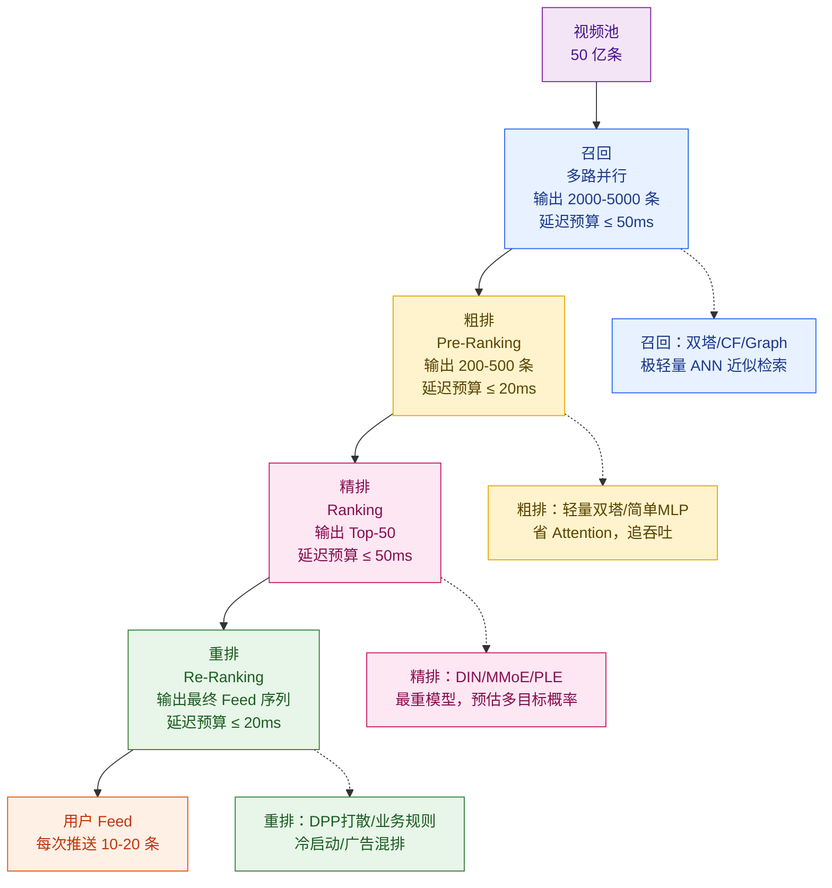
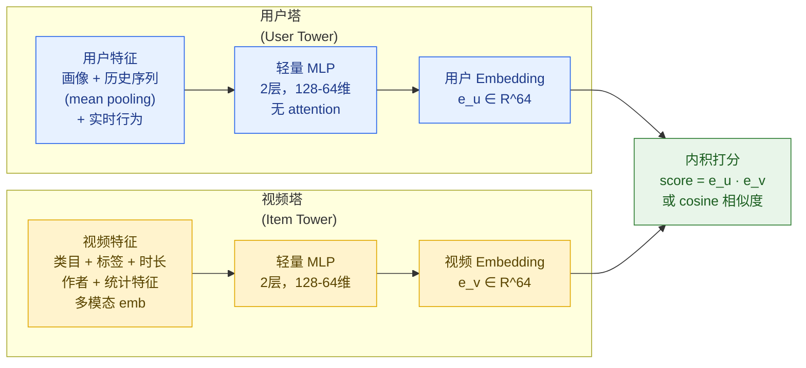
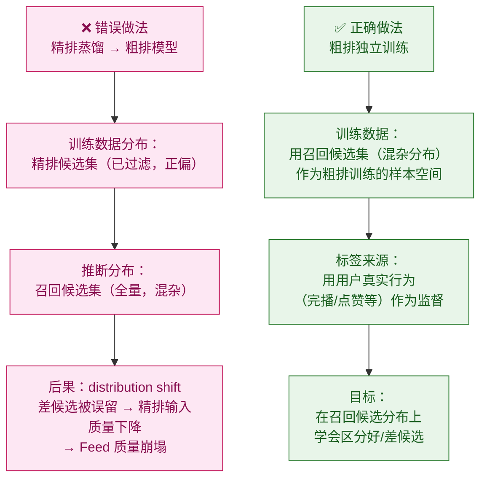
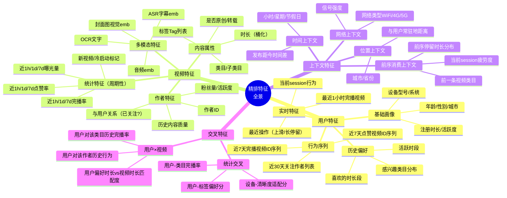
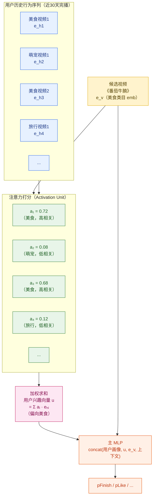
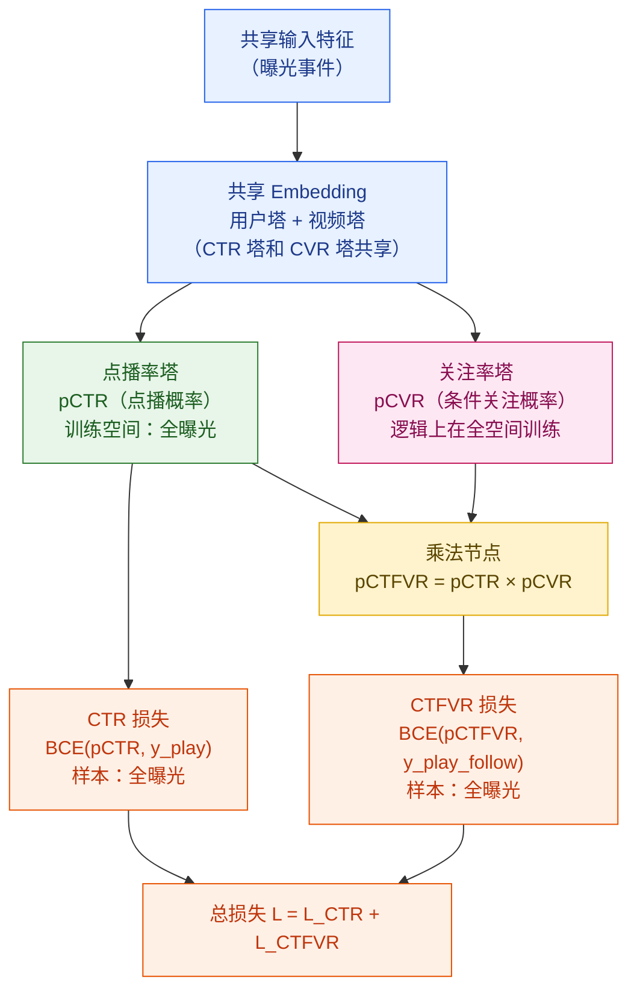
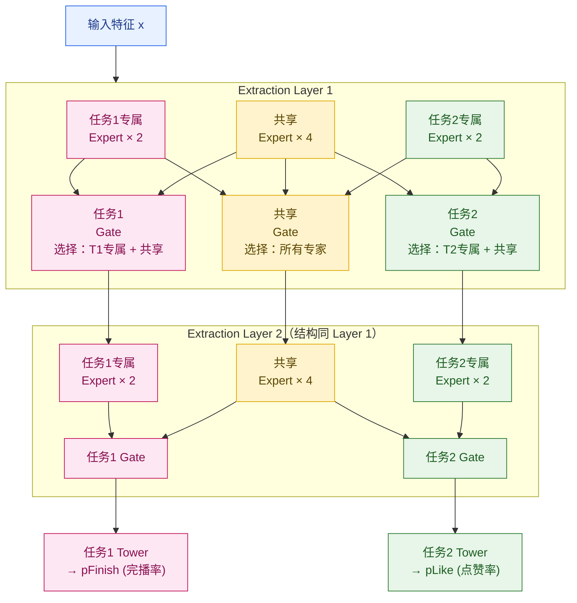
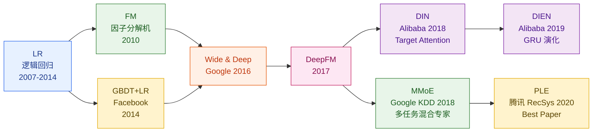
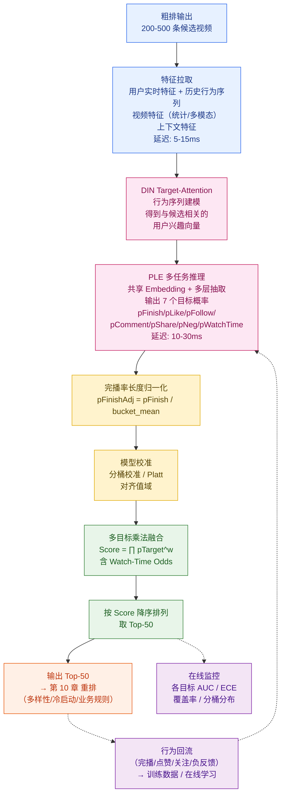

# 第 9 章 · 粗排与精排

> **系列定位**：本章是《短视频平台系统设计·全景教程》第 9 章，也是推荐漏斗三章（召回/粗排精排/重排）中**算法密度最高的核心章**。上一章（第 8 章）介绍了召回如何从 50 亿条视频池中挑出几千条候选；本章深入粗排与精排两个阶段——先用轻量模型把几千条压缩到几百条，再用最复杂的多目标模型把几百条打精细分、输出 Top-50 给第 10 章重排。

---

## 本章导读

推荐漏斗的每一层都在做同一件事：**用更高的计算代价换取更高的预测精度**。

粗排（Pre-Ranking）的核心矛盾是：候选集有几千条，精排模型太重跑不过来，怎么办？答案是用轻量模型快速过滤，但"快"的代价是精度损失——粗排的误杀率直接决定精排能看到多好的材料。

精排（Ranking）的核心矛盾是：短视频不像搜索只有一个目标（相关性），用户对一条视频有完播、点赞、评论、关注、转发等多个互动行为，这些目标之间既有正相关也有负相关，怎么同时优化？这就是多目标建模的主战场。

本章覆盖以下核心内容：

- **粗排**：位置、轻量双塔设计、与精排的一致性；以及一个极易犯的错误——用精排蒸馏版当粗排
- **精排定位与特征工程**：完整的特征体系（用户/视频/上下文/交叉）
- **行为序列建模**：DIN 的 target-attention，DIEN 的兴趣演化
- **多目标建模（本章重点）**：ESMM、MMoE、PLE 的演进与核心差异；PLE 如何解决 MMoE 的"跷跷板现象"
- **Watch-Time 建模**：YouTube 方法——加权逻辑回归
- **完播率长度归一化**：为什么不归一化会伤害长视频
- **多目标融合公式**：乘法 Score 的工程实践与推导；给小南的融合分实例
- **模型演进史**：LR → GBDT → Wide&Deep → DeepFM → DIN → MMoE/PLE
- **校准**：为什么推荐系统也需要校准（但不像广告那样严格）

**贯穿示例**：精排给小南（22 岁，上海，美食/萌宠/旅行兴趣）对《番茄牛腩》（阿元的厨房，60s 家常菜）进行多目标打分，与其他候选视频竞争 Feed 位置。

---

## 9.1 推荐漏斗全景：粗排精排在哪里

在进入粗排和精排之前，先建立完整的漏斗认知。



**三个关键数字**：从 5000 到 500 是粗排的工作（压缩 10×），从 500 到 50 是精排的工作（压缩 10×），最终用户看到 10-20 条。

### 9.1.1 各层的核心约束

| 阶段 | 输入规模 | 输出规模 | 延迟预算 | 主要约束 |
|------|---------|---------|---------|---------|
| 召回 | 50 亿条 | 2000-5000 | ≤ 50ms | ANN 向量检索速度 |
| 粗排 | 2000-5000 | 200-500 | ≤ 20ms | 模型推理吞吐量 |
| 精排 | 200-500 | 50 | ≤ 50ms | 模型复杂度与精度 |
| 重排 | 50 | 10-20 | ≤ 20ms | 多样性计算复杂度 |
| **全链路** | — | — | **≤ 100ms** | **用户体验 SLA** |

精排拿到最多的时间预算（50ms），是因为它的模型最重、但规模已经从万级压缩到了几百——这是工程上的精妙平衡。

---

## 9.2 粗排：轻量但不草率

### 9.2.1 粗排的定位

粗排坐在召回和精排之间，做一件尴尬的事：**用不够准的模型，快速过滤掉大部分不好的候选**。

它的核心矛盾：
- 输入有几千条，每条都跑精排模型根本来不及（精排单次推理 100-500ms 量级）
- 但如果随机过滤，精排就看不到好候选，最终质量崩塌

粗排的工程本质是**效率与精度的权衡**：用 20% 的计算量，保住 80% 的召回质量。

### 9.2.2 轻量双塔模型

粗排最常见的架构是**轻量双塔**，与召回双塔类似，但有关键区别：



**粗排双塔 vs 召回双塔的区别**：

| 维度 | 召回双塔 | 粗排双塔 |
|------|---------|---------|
| 视频 Embedding 预计算 | 离线全量计算，ANN 检索 | 线上实时计算（候选集已知）|
| 特征丰富度 | 较少（追速度）| 略丰富（有少量统计特征）|
| 目标 | 粗粒度相关性 | 更接近精排的排序目标 |
| 历史行为建模 | mean pooling | mean pooling（不加 attention）|
| 输出 | Top-K 视频 ID | 候选集排序分 |

粗排省掉 attention 的原因：attention 计算量是序列长度的线性函数，几千条候选 × attention 序列建模 = 时间爆炸。用 mean pooling 粗略代替，换来 10× 吞吐量提升。

### 9.2.3 粗排的特征体系

粗排特征要比召回多，但比精排少。核心原则是：**线上拉取成本低，预计算缓存友好**。

```python
# 粗排特征设计示例（中文注释）
prerank_features = {
    # 用户侧（离线预计算，低延迟）
    "user_id_emb": 64,           # 用户 ID embedding（从离线 embedding 服务拉）
    "user_category_pref": 20,    # 用户类目偏好向量（离线算好）
    "user_last_7d_stats": 10,    # 近 7 天行为统计（曝光/点播/完播次数）
    "user_realtime_session": 8,  # 当前 session 行为（mean pooling）

    # 视频侧（离线预计算）
    "video_id_emb": 64,          # 视频 ID embedding
    "video_category_onehot": 100,# 视频类目 one-hot
    "video_duration_bucket": 8,  # 时长分桶（15s/30s/60s/180s/300s/600s+）
    "video_7d_ctr": 1,           # 近 7 天点击率（统计特征）
    "video_7d_finish_rate": 1,   # 近 7 天完播率（统计特征）
    "video_7d_like_rate": 1,     # 近 7 天点赞率（统计特征）

    # 上下文（实时）
    "hour_of_day": 24,           # 当前小时 one-hot
    "day_of_week": 7,            # 星期 one-hot
    "network_type": 3,           # WiFi/4G/5G
}
# 粗排特征维度总计 ~200，精排特征维度 ~1000+
```

### 9.2.4 【关键易错点】粗排不能直接用精排蒸馏版

这是一个在工业界极易踩的坑，值得用整节来讲。

**错误做法**：把精排大模型（DeepFM + DIN）做知识蒸馏（Knowledge Distillation），让精排的输出作为软标签，训练一个小模型当粗排。

**为什么看起来合理**：蒸馏后的小模型和精排模型高度相关，理论上是精排的"压缩版"，不是应该很好吗？

**为什么实际会崩**：

粗排的输入分布和精排**完全不同**。

精排只看到粗排已经过滤后的 500 条——这 500 条本身已经是相对优质的候选（粗排已经把大部分明显不相关的过滤了）。训练数据里精排的候选集分布是**过滤后的正偏分布**。

但粗排的输入是召回直接出来的 5000 条，其中有大量质量参差不齐的候选，分布和精排训练集完全不同。

用精排蒸馏版在这个分布上推断 → **严重的 distribution shift → 粗排排序失真 → 本来应该过滤掉的差候选被留下 → 精排看到的好候选比例下降 → 最终 Feed 质量崩塌**。



**正确做法**：粗排模型在召回候选集（混杂分布）上独立训练，学习在这个分布上区分好坏候选的能力。可以用精排的分数作为辅助监督信号（soft label），但**必须保证训练数据分布与推断分布一致**。

### 9.2.5 粗排与精排的一致性问题

粗排过滤掉的候选，精排永远看不到。这带来一个结构性问题：**粗排的误杀是无声的**。

精排打分准确，但如果最好的视频在粗排就被误杀了，精排也回天无术。这就是**粗排召回率**（Recall@K）比排序指标（AUC）更重要的原因。

工业界评估粗排的核心指标：

| 指标 | 定义 | 目标 |
|------|-----|------|
| 精排 Top-K 的粗排召回率 | 精排会选出的 Top-K 视频，有多少在粗排输出中 | ≥ 90% |
| 粗排精排 NDCG 一致性 | 粗排排序与精排排序的相关系数 | Spearman ρ ≥ 0.6 |
| 粗排延迟 | 单次请求粗排推理时间 | ≤ 20ms (P99) |
| 粗排吞吐量 | QPS | 满足峰值 |

---

## 9.3 精排：最重的模型，最关键的预估

### 9.3.1 精排的核心任务

精排拿到 200-500 条经粗排过滤的候选视频，对每条视频预估多个目标概率，然后融合成一个排序分，决定谁进 Top-50 进入重排。

**精排预估的核心目标**（短视频场景）：

| 目标 | 符号 | 含义 | 业务价值 |
|------|------|------|---------|
| 完播率 | pFinish | 用户看完这条视频的概率 | 内容质量核心指标 |
| 观看时长 | pWatchTime | 预期观看时长（秒）| 平台时长核心指标 |
| 点赞 | pLike | 用户点赞的概率 | 用户满意度 |
| 评论 | pComment | 用户评论的概率 | 深度互动 |
| 关注 | pFollow | 用户关注作者的概率 | 社交关系增长 |
| 分享/转发 | pShare | 用户转发的概率 | 裂变传播 |
| 负反馈 | pNeg | 用户点"不感兴趣"/滑走的概率 | 用户体验保障 |

精排预估这些概率，但**不是每条视频都跑一个独立的七目标模型**——而是用**多任务学习**共享底层表示，在一次推理中同时输出所有目标，这是 9.5 节的重点。

### 9.3.2 精排与粗排的根本区别

| 维度 | 粗排 | 精排 |
|------|------|------|
| 候选规模 | 2000-5000 | 200-500 |
| 模型复杂度 | 轻量双塔/简单MLP | DIN/DIEN + MMoE/PLE |
| 特征丰富度 | 中等（~200维）| 丰富（~1000-2000维）|
| 行为序列建模 | mean pooling | target-attention（DIN）|
| 多目标预估 | 单目标或简单加权 | 完整多目标（7+目标）|
| 推理延迟预算 | ≤ 20ms | ≤ 50ms |
| 精度要求 | "不误杀好候选"| "每个目标概率都准" |

精排预估偏差会直接等比影响排序质量——如果完播率低估了 20%，完播率权重高的好视频会系统性地排名下降。

---

## 9.4 特征工程：精排的燃料

特征工程是精排质量的基础，通常占推荐系统工程工作量的 60% 以上。

### 9.4.1 精排特征全景



### 9.4.2 特征处理与 Embedding

**离散特征（ID 类）**：

$$\mathbf{e}_{id} = \mathbf{W}_E[id] \in \mathbb{R}^d$$

其中 $\mathbf{W}_E \in \mathbb{R}^{|\text{vocab}| \times d}$ 是 Embedding 矩阵，$d$ 通常取 16/32/64。

Embedding 维度经验公式（Google）：

$$\boxed{d = \min\left(64,\; \left\lceil |\text{vocab}|^{0.25} \right\rceil \times 4\right)}$$

**连续特征（数值类）**：
- 归一化：$x' = (x - \mu) / \sigma$（z-score）
- 分桶离散化：时长 → [0-15s, 15-30s, 30-60s, 60-180s, 180s+]，再 Embedding
- 对数变换：完播次数等幂律分布特征取 $\log(1 + x)$

**行为序列特征**：

| 序列类型 | 时间窗口 | 典型长度 | 存储 |
|---------|---------|---------|------|
| 长期完播序列 | 近 30 天 | 200-500 条 | 离线特征存储（HBase/Redis）|
| 短期点赞序列 | 近 7 天 | 50-100 条 | 离线 + 实时 |
| Session 行为 | 当前 session | 5-20 条 | 实时内存/Redis |
| 实时行为 | 近 1 小时 | 10-30 条 | Flink 实时流 |

**交叉特征（Cross Feature）**：

用户对某类目的历史完播率是一个强特征，示例：

```python
# 交叉特征计算示例（中文注释）
def compute_user_category_finish_rate(
    user_id: str,
    video_category: str,
    time_window_days: int = 7
) -> float:
    """
    计算用户对特定类目的历史完播率（交叉特征）
    这是精排中最强的交叉特征之一
    """
    # 从特征存储中拉取统计数据
    stats = feature_store.get(
        key=f"{user_id}:category_stats:{video_category}",
        fields=["expose_cnt", "finish_cnt"],
        ttl_days=time_window_days
    )
    expose = stats.get("expose_cnt", 0)
    finish = stats.get("finish_cnt", 0)

    if expose < 5:  # 样本量不足时回退到全局均值
        return global_category_finish_rate[video_category]

    # 加入贝叶斯平滑（防止样本量小时波动）
    alpha = 10  # 先验等效样本数
    prior = global_category_finish_rate[video_category]
    smoothed_rate = (finish + alpha * prior) / (expose + alpha)
    return smoothed_rate
```

### 9.4.3 特征重要性分析

精排特征中，各类特征的贡献量级（工业界经验）：

| 特征类别 | 典型贡献度 | 代表特征 |
|---------|---------|---------|
| 用户行为序列 | ★★★★★ | 近期完播/点赞序列 + DIN attention |
| 视频统计特征 | ★★★★☆ | 近1h完播率、点赞率、新鲜度 |
| 用户×视频交叉 | ★★★★☆ | 用户对该类目历史完播率 |
| 用户画像 | ★★★☆☆ | 年龄/性别/城市/设备 |
| 上下文特征 | ★★★☆☆ | 时段/网络/前序消费 |
| 多模态内容特征 | ★★★☆☆ | 封面图emb/音频emb |
| 作者特征 | ★★☆☆☆ | 粉丝量/与用户关系 |

---

## 9.5 行为序列建模：DIN 与 DIEN

用户的兴趣不是静态的标签，而是通过历史行为体现的动态偏好。一个爱美食的用户，可能在刷了三条宠物视频之后，当前兴趣已经切换到萌宠。**行为序列建模就是从历史行为序列中捕捉用户当前最相关的兴趣**。

### 9.5.1 为什么需要 Target-Attention

早期做法：把用户历史行为做 mean pooling（求平均），作为用户兴趣向量。

```
用户历史 = [美食, 美食, 萌宠, 美食, 旅行, 美食, 美食]
mean pooling → 美食倾向的综合向量
```

问题：当候选视频是《番茄牛腩》（美食），美食历史的权重应该高；当候选视频是《柯基跑酷》（萌宠），萌宠历史的权重应该高。**mean pooling 无法做到"根据候选视频，动态调整历史行为的权重"**。

DIN（Deep Interest Network，2018，阿里巴巴）的核心贡献就是引入 **Target-Attention**：让模型根据**候选视频**（目标），对用户历史行为序列中每一条行为打注意力权重，加权得到与当前候选最相关的用户兴趣表示。

### 9.5.2 DIN 结构与注意力公式



**DIN 注意力打分公式**：

对于历史行为 $i$（embedding $\mathbf{e}_i$）和候选视频（target embedding $\mathbf{e}_t$）：

$$\boxed{a_i = \text{Softmax}\left(\text{MLP}\left([\mathbf{e}_i;\; \mathbf{e}_t;\; \mathbf{e}_i - \mathbf{e}_t;\; \mathbf{e}_i \odot \mathbf{e}_t]\right)\right)}$$

四路特征拼接的含义：
- $\mathbf{e}_i$：历史行为自身
- $\mathbf{e}_t$：候选视频特征
- $\mathbf{e}_i - \mathbf{e}_t$：差异特征（两者差距）
- $\mathbf{e}_i \odot \mathbf{e}_t$：交叉特征（element-wise product，捕获协同关系）

**用户兴趣表示**：

$$\mathbf{u} = \sum_{i=1}^{H} a_i \cdot \mathbf{e}_i$$

其中 $H$ 是历史序列长度（通常取最近 200 条，更长的截断）。

**DIN PyTorch 代码（核心注意力模块）**：

```python
import torch
import torch.nn as nn
import torch.nn.functional as F


class DINTargetAttention(nn.Module):
    """
    DIN 目标注意力模块：根据候选视频 对 用户历史行为序列 打注意力权重
    核心：Activation Unit（激活单元）
    """

    def __init__(self, emb_dim: int, hidden_dims: list = None):
        super().__init__()
        if hidden_dims is None:
            hidden_dims = [64, 16]

        # 注意力 MLP：输入 4 * emb_dim（ei, et, ei-et, ei⊙et 拼接）
        att_input_dim = 4 * emb_dim
        layers = []
        for hd in hidden_dims:
            layers.extend([nn.Linear(att_input_dim, hd), nn.ReLU()])
            att_input_dim = hd
        layers.append(nn.Linear(att_input_dim, 1))  # 输出标量注意力得分
        self.att_mlp = nn.Sequential(*layers)

    def forward(
        self,
        history_emb: torch.Tensor,   # [B, seq_len, emb_dim] 用户历史行为序列
        target_emb: torch.Tensor,    # [B, emb_dim] 候选视频 embedding
        mask: torch.Tensor = None    # [B, seq_len] padding mask（True=有效）
    ) -> tuple:
        """
        Returns:
            user_interest: [B, emb_dim] 注意力加权的用户兴趣表示
            att_weights:   [B, seq_len] 各历史行为的注意力权重
        """
        B, seq_len, emb_dim = history_emb.shape

        # 扩展候选视频 embedding 到序列维度
        target_expand = target_emb.unsqueeze(1).expand(-1, seq_len, -1)  # [B, L, D]

        # 构造 Activation Unit 输入：4 路特征拼接
        att_input = torch.cat([
            history_emb,                        # e_i
            target_expand,                      # e_t
            history_emb - target_expand,        # e_i - e_t（差异特征）
            history_emb * target_expand,        # e_i ⊙ e_t（交叉特征）
        ], dim=-1)                              # [B, L, 4D]

        # 计算原始注意力得分
        att_scores = self.att_mlp(att_input).squeeze(-1)  # [B, L]

        # 处理 padding 位置
        if mask is not None:
            att_scores = att_scores.masked_fill(~mask, -1e9)

        # Softmax 归一化
        att_weights = F.softmax(att_scores, dim=-1)  # [B, L]

        # 加权求和 → 用户兴趣向量
        user_interest = torch.bmm(
            att_weights.unsqueeze(1), history_emb
        ).squeeze(1)  # [B, D]

        return user_interest, att_weights


# 小南对《番茄牛腩》的 DIN 注意力计算示例
if __name__ == "__main__":
    emb_dim = 64
    batch_size, seq_len = 1, 10

    att_module = DINTargetAttention(emb_dim=emb_dim)

    # 小南历史行为：[美食x5, 萌宠x3, 旅行x2]（简化示意）
    history_emb = torch.randn(batch_size, seq_len, emb_dim)
    # 候选视频《番茄牛腩》：美食类 embedding
    target_emb = torch.randn(batch_size, emb_dim)
    mask = torch.ones(batch_size, seq_len, dtype=torch.bool)

    user_interest, weights = att_module(history_emb, target_emb, mask)
    # 美食类历史行为的注意力权重会更高（训练后收敛）
    print(f"用户兴趣向量形状: {user_interest.shape}")  # [1, 64]
    print(f"注意力权重: {weights.detach().numpy()}")
```

### 9.5.3 DIEN：加入兴趣演化 GRU

DIN 有一个局限：注意力机制只关注每条历史行为与候选的相关性，忽略了**兴趣随时间演化的顺序性**。

DIEN（Deep Interest Evolution Network，2019，阿里巴巴）在 DIN 基础上加入 GRU（Gated Recurrent Unit）建模兴趣的时序演化：

- **兴趣抽取层（Interest Extractor Layer）**：用 GRU 对行为序列建模，输出每个时刻的兴趣状态 $\mathbf{h}_t$
- **兴趣演化层（Interest Evolving Layer）**：用 AUGRU（Attention-based GRU），在 GRU 更新时引入目标注意力，让兴趣演化轨迹聚焦于与当前候选相关的演化路径

DIEN 在工业界的应用：在用户历史行为序列较长（200条以上）且兴趣漂移明显的场景（如从美食切换到健身），DIEN 相比 DIN 有显著提升。代价是计算量更大，推理延迟增加约 2-3×。

**DIN vs DIEN 选型**：

| 场景 | 选 DIN | 选 DIEN |
|------|--------|---------|
| 兴趣相对稳定 | ✅ | |
| 兴趣有明显时序漂移 | | ✅ |
| 延迟预算充裕（>30ms用于序列）| | ✅ |
| 延迟预算紧张 | ✅ | |
| 历史行为序列较短（<100条）| ✅ | |

---

## 9.6 多目标建模：ESMM、MMoE 与 PLE

这是本章的核心，也是工业界短视频推荐算法竞争的主战场。

### 9.6.1 为什么要多任务学习

**独立训练七个目标模型的代价**：
- 7 个独立模型 × 每次推理 = 7× 计算量 → 时延爆炸
- 每个目标的训练数据量不同（点赞样本远多于关注样本），独立模型对稀疏目标质量差
- 目标之间有共同的用户偏好信号（底层兴趣），独立训练无法共享

**多任务学习的优势**：
- **共享底层**：用户行为序列建模、类目偏好等特征在所有目标中共享 → 节省计算量
- **正迁移**：点赞数据丰富，可以帮助关注模型学习更好的用户表示 → 稀疏目标质量提升
- **一次推理**：共享 Embedding + 底层 DNN 只算一次，各任务头分别输出

### 9.6.2 Shared Bottom（共享底层）：起点与局限

最简单的多任务结构：所有任务共享同一个底层 DNN，各任务有独立的 Tower（输出头）。

```
输入特征 → 共享 DNN → [完播 Tower → pFinish]
                   → [点赞 Tower → pLike]
                   → [关注 Tower → pFollow]
                   → ...
```

**局限**：当任务相关性低时，共享底层会产生**负迁移（Negative Transfer）**——任务之间互相干扰，梯度方向冲突，导致某些任务性能下降。

例：完播率（内容质量信号）和关注率（社交关系信号）相关性较低，共享底层训练时它们的梯度方向会冲突，导致两个目标都比独立训练效果差。

### 9.6.3 ESMM：全空间多任务（解决 CVR 样本偏差）

**论文**：[Entire Space Multi-Task Model, 阿里巴巴, SIGIR 2018](https://arxiv.org/abs/1804.07931)

ESMM 主要解决短视频中的**样本选择偏差**问题：用户只有看到视频才能点赞，只有完播才更可能关注——某些目标的训练空间（曝光空间）和其他目标的训练空间（点播空间）不同。

**核心公式**：

$$\boxed{p(\text{关注}|\text{曝光}) = p(\text{点播}|\text{曝光}) \times p(\text{关注}|\text{点播})}$$

即：

$$p\text{FollowCTFR} = p\text{CTR} \times p\text{CVR}$$

在全曝光空间联合训练，CVR 塔通过 CTR 塔借力学习，解决"关注/点赞数据稀疏且只在点播空间有样本"的问题。



### 9.6.4 MMoE：多门控专家混合（解决任务冲突）

**论文**：[Modeling Task Relationships in Multi-task Learning with Multi-gate Mixture-of-Experts, Google, KDD 2018](https://dl.acm.org/doi/10.1145/3219819.3220007)

**核心思想**：用 $K$ 个 Expert 网络（专家），每个任务有独立的 Gate（门控）网络，动态决定如何组合各专家的输出。

**MMoE 公式**：

$$\mathbf{f}^{(k)}(\mathbf{x}) = \text{Expert}_k(\mathbf{x}), \quad k = 1, \ldots, K$$

$$g^{(t)}(\mathbf{x}) = \text{Softmax}\!\left(\mathbf{W}_g^{(t)} \mathbf{x}\right), \quad t = 1, \ldots, T$$

$$\boxed{\mathbf{h}^{(t)}(\mathbf{x}) = \sum_{k=1}^{K} g_k^{(t)}(\mathbf{x}) \cdot \mathbf{f}^{(k)}(\mathbf{x})}$$

每个任务 $t$ 的 Tower 接受 $\mathbf{h}^{(t)}$ 作为输入。不同任务的门控权重不同，使得每个任务可以"选择"最有利的专家组合。

**MMoE 的局限**：所有 Expert 都是共享的，当任务相关性很低时，某个 Expert 可能同时被相互冲突的任务使用，导致梯度方向拉扯，出现**"跷跷板现象"**——视频完播率（VCR）涨时点赞率（VTR）跌，反之亦然。

### 9.6.5 PLE：渐进式分层抽取（解决跷跷板现象）

**论文**：[Progressive Layered Extraction (PLE), 腾讯, RecSys 2020 Best Paper](https://dl.acm.org/doi/10.1145/3383313.3412236)

这是目前短视频多任务学习最重要的工作之一，获得 RecSys 2020 最佳论文。

**MMoE 的问题根源**：所有专家全部共享，任务专属的知识和任务共享的知识混在一起，负迁移无法消除。

**PLE 的解法**：**显式分离任务专属专家（Task-Specific Experts）和共享专家（Shared Experts）**。



**PLE 的三层设计**：

1. **任务专属专家（Task-Specific Experts）**：只被对应任务的 Gate 使用，专门学习该任务的独有知识，不被其他任务干扰
2. **共享专家（Shared Experts）**：被所有任务的 Gate 使用，学习任务间的共同知识
3. **多层堆叠（Progressive Extraction）**：多层 Extraction Network 渐进式提取，每层的共享专家接受上一层所有专家的输入

**PLE vs MMoE 的对比（腾讯视频实验，2020）**：

| 指标 | Shared Bottom | MMoE | PLE |
|------|-------------|------|-----|
| 视频完播率 VCR (相对提升%) | 基准 | +1.0% | **+2.3%** |
| 视频点播率 VTR (相对提升%) | 基准 | +0.3% | **+1.8%** |
| 是否出现跷跷板 | 否（但效果差）| 是（VCR↑VTR↓）| **否** |
| 参数量 | 最小 | 中等 | 最大 |
| 推理延迟 | 最快 | 中等 | 较慢 |

**PLE 解决跷跷板的机制**：

MMoE 的跷跷板根本原因是：当完播率任务对某个共享专家施加"关注内容质量"方向的梯度，点赞率任务同时对该专家施加"关注情感共鸣"方向的梯度，两者冲突。PLE 给完播率一个**专属专家**，这个专家只受完播率任务的监督，不被点赞率任务干扰，消除了冲突。

**PLE PyTorch 简化实现**：

```python
import torch
import torch.nn as nn
import torch.nn.functional as F
from typing import List


class Expert(nn.Module):
    """单个 Expert 网络（简单 MLP）"""
    def __init__(self, input_dim: int, hidden_dim: int, output_dim: int):
        super().__init__()
        self.net = nn.Sequential(
            nn.Linear(input_dim, hidden_dim),
            nn.ReLU(),
            nn.Linear(hidden_dim, output_dim),
            nn.ReLU()
        )

    def forward(self, x: torch.Tensor) -> torch.Tensor:
        return self.net(x)


class PLEExtractionLayer(nn.Module):
    """
    PLE 的一个 Extraction Layer
    包含：各任务专属 Expert + 共享 Expert + 各任务 Gate
    """
    def __init__(
        self,
        input_dim: int,      # 输入维度
        expert_output_dim: int,  # expert 输出维度
        num_tasks: int,      # 任务数
        num_specific_experts: int,  # 每个任务的专属 expert 数量
        num_shared_experts: int,    # 共享 expert 数量
    ):
        super().__init__()
        self.num_tasks = num_tasks
        self.num_specific = num_specific_experts
        self.num_shared = num_shared_experts

        # 各任务专属 Expert
        self.specific_experts = nn.ModuleList([
            nn.ModuleList([
                Expert(input_dim, expert_output_dim * 2, expert_output_dim)
                for _ in range(num_specific_experts)
            ])
            for _ in range(num_tasks)
        ])

        # 共享 Expert
        self.shared_experts = nn.ModuleList([
            Expert(input_dim, expert_output_dim * 2, expert_output_dim)
            for _ in range(num_shared_experts)
        ])

        # 每个任务的 Gate：选择 task-specific + shared experts 的组合
        # gate 输入维度为 input_dim
        gate_input_count = num_specific_experts + num_shared_experts  # 每个任务可选择的 expert 数
        self.task_gates = nn.ModuleList([
            nn.Linear(input_dim, gate_input_count)
            for _ in range(num_tasks)
        ])

        # 共享通道的 Gate（可选，用于多层堆叠）
        self.shared_gate = nn.Linear(
            input_dim, num_tasks * num_specific_experts + num_shared_experts
        )

    def forward(
        self,
        task_inputs: List[torch.Tensor],  # 每个任务的输入，形如 [x_task1, x_task2, ...]
        shared_input: torch.Tensor         # 共享通道的输入
    ) -> tuple:
        """
        Returns:
            task_outputs: List[Tensor] 每个任务的输出
            shared_output: Tensor 共享通道输出（用于下一层）
        """
        # 计算各任务专属 Expert 输出
        specific_outputs = []
        for t in range(self.num_tasks):
            task_expert_outs = [
                exp(task_inputs[t]) for exp in self.specific_experts[t]
            ]  # [num_specific, B, D_exp]
            specific_outputs.append(task_expert_outs)

        # 计算共享 Expert 输出
        shared_expert_outs = [exp(shared_input) for exp in self.shared_experts]
        # [num_shared, B, D_exp]

        # 各任务 Gate 选择并融合：task-specific + shared
        task_outputs = []
        for t in range(self.num_tasks):
            # 合并该任务可选的 experts
            all_experts = torch.stack(
                specific_outputs[t] + shared_expert_outs, dim=1
            )  # [B, num_specific + num_shared, D_exp]

            # Gate 权重
            gate_weight = F.softmax(
                self.task_gates[t](task_inputs[t]), dim=-1
            ).unsqueeze(-1)  # [B, num_specific+num_shared, 1]

            # 加权求和
            task_out = (all_experts * gate_weight).sum(dim=1)  # [B, D_exp]
            task_outputs.append(task_out)

        # 共享通道（下一层用）
        all_for_shared = torch.stack(
            [e for task_exp in specific_outputs for e in task_exp] + shared_expert_outs,
            dim=1
        )
        shared_gate_w = F.softmax(
            self.shared_gate(shared_input), dim=-1
        ).unsqueeze(-1)
        shared_output = (all_for_shared * shared_gate_w).sum(dim=1)

        return task_outputs, shared_output


class PLEModel(nn.Module):
    """
    PLE 完整模型（2任务版：完播率 + 点赞率）
    完整版可扩展到 7 个任务
    """
    def __init__(
        self,
        input_dim: int = 256,
        expert_output_dim: int = 128,
        num_specific_experts: int = 2,
        num_shared_experts: int = 4,
        num_extraction_layers: int = 2
    ):
        super().__init__()
        num_tasks = 2  # 完播率 + 点赞率

        # 多层 PLE Extraction Layers
        self.extraction_layers = nn.ModuleList()
        for i in range(num_extraction_layers):
            layer_input_dim = input_dim if i == 0 else expert_output_dim
            self.extraction_layers.append(PLEExtractionLayer(
                input_dim=layer_input_dim,
                expert_output_dim=expert_output_dim,
                num_tasks=num_tasks,
                num_specific_experts=num_specific_experts,
                num_shared_experts=num_shared_experts
            ))

        # 各任务 Tower（输出头）
        self.finish_tower = nn.Sequential(
            nn.Linear(expert_output_dim, 64), nn.ReLU(),
            nn.Linear(64, 1)
        )
        self.like_tower = nn.Sequential(
            nn.Linear(expert_output_dim, 64), nn.ReLU(),
            nn.Linear(64, 1)
        )

    def forward(self, x: torch.Tensor):
        """
        Args:
            x: [B, input_dim] 输入特征（用户+视频+上下文）
        Returns:
            p_finish: [B, 1] 完播率预估
            p_like:   [B, 1] 点赞率预估
        """
        # 初始化：所有任务和共享通道都用同样的输入
        task_inputs = [x, x]
        shared_input = x

        # 逐层 Extraction
        for layer in self.extraction_layers:
            task_inputs, shared_input = layer(task_inputs, shared_input)

        # Tower 输出
        p_finish = torch.sigmoid(self.finish_tower(task_inputs[0]))
        p_like = torch.sigmoid(self.like_tower(task_inputs[1]))

        return p_finish, p_like
```

---

## 9.7 Watch-Time 建模：YouTube 方法

### 9.7.1 为什么不直接回归时长

观看时长（Watch Time）是短视频平台最重要的目标之一，但**不能直接用回归模型**预测原始时长。

原因：观看时长分布极度偏斜（Skewed）：
- 70% 的播放时长 < 10 秒（划走）
- 20% 的播放时长在 10-50% 视频长度
- 10% 的播放时长 ≥ 50% 视频长度（完播）

这种长尾分布下，MSE 损失会被大量短时长样本主导，模型很难学到长时长的模式。

### 9.7.2 YouTube DNN：加权逻辑回归

**论文**：[Deep Neural Networks for YouTube Recommendations, Google, RecSys 2016](https://dl.acm.org/doi/10.1145/2959100.2959190)

**核心思路**：将 Watch-Time 建模转化为加权二分类问题——把视频观看行为作为正样本，**用观看时长作为正样本的权重**。

**加权逻辑回归（Weighted Logistic Regression）**：

正常逻辑回归：每个正样本权重为 1
加权逻辑回归：正样本权重 = 观看时长 $T_i$，负样本权重 = 1

$$\boxed{\mathcal{L}_{WLR} = -\sum_{i: y_i=1} T_i \cdot \log(\hat{p}_i) - \sum_{j: y_j=0} \log(1 - \hat{p}_j)}$$

**预测值的含义**：在服务端输出 odd（几率）而非概率：

$$\text{odds} = \frac{p}{1-p} = e^{W^T x + b}$$

可以证明，在加权逻辑回归框架下，输出的 odds 是用户**预期观看时长的近似估计**：

$$E[\text{watch time} | \text{session}] \approx \frac{\hat{p}}{1 - \hat{p}} = e^{W^T x + b}$$

这是 YouTube DNN 的核心洞察：**通过巧妙的损失函数设计，把时长回归问题转化为可靠的分类问题**。

**工程实现**：

```python
import torch
import torch.nn.functional as F


def weighted_binary_cross_entropy(
    logits: torch.Tensor,   # [B, 1] 模型原始输出（sigmoid 前）
    labels: torch.Tensor,   # [B] 0/1 标签（是否观看）
    weights: torch.Tensor   # [B] 样本权重（正样本=观看时长s, 负样本=1.0）
) -> torch.Tensor:
    """
    YouTube DNN 的加权逻辑回归损失函数

    正样本：观看行为，权重 = 实际观看时长（秒）
    负样本：曝光未观看，权重 = 1.0（或按采样率校正）
    """
    # BCE 逐样本损失（不 reduction）
    bce = F.binary_cross_entropy_with_logits(
        logits.squeeze(-1), labels.float(), reduction='none'
    )  # [B]

    # 按权重加权平均
    weighted_loss = (bce * weights).sum() / weights.sum()
    return weighted_loss


def predict_expected_watch_time(logits: torch.Tensor) -> torch.Tensor:
    """
    从 logits 预测期望观看时长
    在 YouTube DNN 框架下，odds ≈ E[watch time]

    Args:
        logits: [B, 1] 模型 logits（sigmoid 前）
    Returns:
        expected_watch_time: [B, 1] 预期观看时长（近似值）
    """
    # odds = p/(1-p) = exp(logit)
    # 近似 E[watch time]
    odds = torch.exp(logits)
    return odds


# 使用示例（小南对各候选视频的预期观看时长估算）
if __name__ == "__main__":
    batch_size = 4
    logits = torch.tensor([[0.5], [1.2], [-0.3], [0.8]])  # 4 条候选视频

    expected_watch_time = predict_expected_watch_time(logits)
    print("各候选视频预期观看时长（odds 近似）:")
    for i, t in enumerate(expected_watch_time):
        print(f"  视频 {i+1}: {t.item():.2f} (相对单位)")
```

---

## 9.8 完播率长度归一化

### 9.8.1 为什么需要归一化

完播率（Finish Rate）是短视频推荐最核心的信号之一，但有一个天然的不公平：**长视频的完播率天然低于短视频**。

- 15 秒视频：80% 完播率 → 平均观看 12 秒
- 60 秒视频：40% 完播率 → 平均观看 24 秒
- 180 秒视频：20% 完播率 → 平均观看 36 秒

如果直接用原始完播率排序，60 秒的优质长视频（40% 完播率，实际时长更长）会排在 15 秒一般视频（50% 完播率，但内容平庸）之后——这对长视频创作者不公平，也不符合平台促进优质长内容的目标。

### 9.8.2 归一化方案

**方案一：时长分桶均值归一化**

$$\boxed{p_{\text{finish\_adj}} = \frac{p_{\text{finish\_raw}}}{\bar{p}_{\text{finish}}(\text{length\_bucket})}}$$

其中 $\bar{p}_{\text{finish}}(\text{length\_bucket})$ 是同时长桶内视频的平均完播率（历史统计）。

```python
import numpy as np
from typing import Dict

# 各时长桶的历史平均完播率（离线统计，每天更新）
DURATION_BUCKET_MEAN_FINISH_RATE: Dict[str, float] = {
    "0-15s":   0.82,  # 15秒以内：完播率高
    "15-30s":  0.70,
    "30-60s":  0.55,
    "60-120s": 0.40,
    "120-300s": 0.28,
    "300s+":   0.18,
}

def get_duration_bucket(duration_sec: float) -> str:
    """将视频时长映射到时长桶"""
    if duration_sec <= 15:
        return "0-15s"
    elif duration_sec <= 30:
        return "15-30s"
    elif duration_sec <= 60:
        return "30-60s"
    elif duration_sec <= 120:
        return "60-120s"
    elif duration_sec <= 300:
        return "120-300s"
    else:
        return "300s+"


def normalize_finish_rate(
    finish_rate_raw: float,
    video_duration: float,
    smoothing: float = 0.1
) -> float:
    """
    完播率长度归一化

    Args:
        finish_rate_raw: 视频原始完播率 [0, 1]
        video_duration: 视频时长（秒）
        smoothing: 平滑系数（防止时长桶均值过小时放大过度）
    Returns:
        normalized_finish_rate: 归一化完播率
    """
    bucket = get_duration_bucket(video_duration)
    bucket_mean = DURATION_BUCKET_MEAN_FINISH_RATE[bucket]

    # 加平滑防止极端放大
    normalized = finish_rate_raw / (bucket_mean + smoothing)

    # 截断到合理范围
    return float(np.clip(normalized, 0.0, 3.0))


# 示例：《番茄牛腩》（60s，完播率 0.55）vs 竞品 15s 短视频（完播率 0.75）
videos = [
    {"name": "番茄牛腩（60s）", "duration": 60, "finish_rate_raw": 0.55},
    {"name": "竞品A（15s）",    "duration": 15, "finish_rate_raw": 0.75},
    {"name": "竞品B（180s）",   "duration": 180, "finish_rate_raw": 0.22},
]

for v in videos:
    adj = normalize_finish_rate(v["finish_rate_raw"], v["duration"])
    print(f"{v['name']}: 原始完播率={v['finish_rate_raw']:.2f}, 归一化={adj:.3f}")

# 输出：
# 番茄牛腩（60s）: 原始完播率=0.55, 归一化=0.846  ← 实际竞争力更强
# 竞品A（15s）:   原始完播率=0.75, 归一化=0.802  ← 原始值高但归一化反而低
# 竞品B（180s）:  原始完播率=0.22, 归一化=0.579
```

**方案二：对数时长调整**

$$p_{\text{finish\_adj}} = p_{\text{finish\_raw}} \times f(\text{duration}),\quad f(d) = 1 + \alpha \cdot \log\!\left(\frac{d}{d_0}\right)$$

其中 $d_0$ 是基准时长（如 30s），$\alpha$ 是调节系数。对数形式保证不同时长的调整是平滑的。

**工业实践**：完播率归一化后，还需要和观看时长（Watch Time）联合建模，避免单纯追求"绝对完播率"忽视时长的贡献——一条 300 秒视频 20% 完播 = 60 秒，依然远优于 15 秒视频 80% 完播 = 12 秒。

---

## 9.9 多目标融合公式

### 9.9.1 加法融合的问题

最直觉的融合方式是加权求和：

$$\text{Score} = w_1 \cdot p\text{Finish} + w_2 \cdot p\text{Like} + w_3 \cdot p\text{Follow} + \ldots$$

**加法融合的致命问题**：

1. **值域不对齐**：pFinish 均值 0.5，pFollow 均值 0.002，pLike 均值 0.05，直接相加时 pFinish 天然主导，pFollow 几乎无贡献
2. **"点赞狂魔"用户拉偏排序**：某类用户对几乎所有视频都点赞，pLike 估值全局偏高，导致这类用户的推荐被点赞权重劫持
3. **新增目标破坏旧值域**：加入新目标后，总分值域变化，所有权重需要重新调参

### 9.9.2 乘法融合公式（工业界主流）

工业界（快手、抖音等）普遍采用**乘法形式**：

$$\boxed{\text{Score} = p\text{Click}^{w_1} \times p\text{Finish}^{w_2} \times p\text{Like}^{w_3} \times p\text{Follow}^{w_4} \times p\text{Share}^{w_5} \times (1 - p\text{Neg})^{w_6}}$$

取对数后变为加权和（数值稳定，工程实现友好）：

$$\log(\text{Score}) = w_1 \log(p\text{Click}) + w_2 \log(p\text{Finish}) + w_3 \log(p\text{Like}) + w_4 \log(p\text{Follow}) + w_5 \log(p\text{Share}) + w_6 \log(1 - p\text{Neg})$$

**乘法融合的优势**：

| 优势 | 说明 |
|------|------|
| 目标独立、值域自对齐 | 每个目标通过幂次调节，乘法天然平衡不同量级的概率值 |
| 任一目标极低 → 总分崩塌 | 完播率为 0 时总分趋于 0，过滤掉对用户完全不相关的视频 |
| 新增目标不破坏旧目标 | 乘以新目标 $p^w$ 不改变其他目标的值域关系 |
| 负反馈有强约束 | $(1-pNeg)^{w_6}$ 让负反馈概率高的视频总分急剧下降 |

**权重 $w$ 怎么定**：

| 方法 | 适用场景 | 优缺点 |
|------|---------|--------|
| 人工调参 | 初期或目标较少 | 可控但费时，难以全局最优 |
| 网格搜索（Grid Search）| 目标数 ≤ 4 | 组合爆炸，>4 个目标不实用 |
| 贝叶斯优化（Bayesian Opt）| 目标数 4-8 | 效率高，工业界常用 |
| 端到端学习（可微融合）| 有足够的监督信号 | 最优但训练复杂 |

**完整融合公式（含归一化完播率）**：

$$\boxed{\text{Score} = p\text{Click}^{w_1} \times p\text{FinishAdj}^{w_2} \times p\text{Like}^{w_3} \times p\text{Comment}^{w_4} \times p\text{Follow}^{w_5} \times p\text{Share}^{w_6} \times (1 - p\text{Neg})^{w_7} \times \text{pWatchTimeOdds}^{w_8}}$$

### 9.9.3 实例：小南对《番茄牛腩》的融合分计算

精排模型（PLE + DIN）对小南 × 《番茄牛腩》预估输出：

| 目标 | 原始预估值 | 说明 |
|------|---------|------|
| pClick | 0.75 | 小南会点开这条视频的概率 |
| pFinishRaw | 0.62 | 原始完播率预估（60s视频） |
| pFinishAdj | 0.95 | 归一化完播率（60s桶均值 0.55 ≈ 0.62/0.55×0.85）|
| pLike | 0.18 | 小南点赞概率（她爱美食）|
| pComment | 0.04 | 评论概率 |
| pFollow | 0.08 | 关注阿元的概率 |
| pShare | 0.06 | 转发给朋友的概率 |
| pNeg | 0.02 | 负反馈概率（滑走/不感兴趣）|
| pWatchTimeOdds | 2.3 | 预期观看时长 odds（≈ exp(logit)）|

假设权重：$w_1=1.5, w_2=2.0, w_3=1.0, w_4=0.5, w_5=1.2, w_6=0.8, w_7=3.0, w_8=1.0$

```python
import math

# 小南 × 《番茄牛腩》精排预估结果
probs = {
    "pClick": 0.75,
    "pFinishAdj": 0.95,
    "pLike": 0.18,
    "pComment": 0.04,
    "pFollow": 0.08,
    "pShare": 0.06,
    "pNeg": 0.02,
    "pWatchTimeOdds": 2.3,
}

# 权重配置（业务调参后）
weights = {
    "pClick": 1.5,
    "pFinishAdj": 2.0,
    "pLike": 1.0,
    "pComment": 0.5,
    "pFollow": 1.2,
    "pShare": 0.8,
    "pNeg": 3.0,       # 负反馈惩罚权重高
    "pWatchTimeOdds": 1.0,
}

def compute_ranking_score(probs: dict, weights: dict) -> float:
    """
    多目标乘法融合打分（取对数后加权求和，数值稳定）
    """
    log_score = 0.0
    log_score += weights["pClick"] * math.log(probs["pClick"] + 1e-9)
    log_score += weights["pFinishAdj"] * math.log(probs["pFinishAdj"] + 1e-9)
    log_score += weights["pLike"] * math.log(probs["pLike"] + 1e-9)
    log_score += weights["pComment"] * math.log(probs["pComment"] + 1e-9)
    log_score += weights["pFollow"] * math.log(probs["pFollow"] + 1e-9)
    log_score += weights["pShare"] * math.log(probs["pShare"] + 1e-9)
    # 负反馈：(1 - pNeg)^w7
    log_score += weights["pNeg"] * math.log(1 - probs["pNeg"] + 1e-9)
    log_score += weights["pWatchTimeOdds"] * math.log(probs["pWatchTimeOdds"] + 1e-9)
    return log_score  # 取对数后值，直接用于排序比较

score_fanqie = compute_ranking_score(probs, weights)
print(f"《番茄牛腩》精排融合分（log）: {score_fanqie:.4f}")

# 与其他候选视频竞争
competitors = [
    {
        "name": "《网红奶茶测评》（pNeg=0.15，高负反馈）",
        "pClick": 0.70, "pFinishAdj": 0.80, "pLike": 0.20, "pComment": 0.05,
        "pFollow": 0.04, "pShare": 0.08, "pNeg": 0.15, "pWatchTimeOdds": 1.8
    },
    {
        "name": "《萌宠柴犬洗澡》（萌宠，小南也喜欢）",
        "pClick": 0.82, "pFinishAdj": 0.92, "pLike": 0.22, "pComment": 0.06,
        "pFollow": 0.05, "pShare": 0.10, "pNeg": 0.01, "pWatchTimeOdds": 2.1
    },
    {
        "name": "《3分钟健身教程》（健身，小南兴趣弱）",
        "pClick": 0.45, "pFinishAdj": 0.65, "pLike": 0.08, "pComment": 0.02,
        "pFollow": 0.02, "pShare": 0.03, "pNeg": 0.08, "pWatchTimeOdds": 1.1
    },
]

print("\n--- 候选视频排序 ---")
all_candidates = [{"name": "《番茄牛腩》", **probs}] + competitors
results = []
for c in all_candidates:
    s = compute_ranking_score(c, weights)
    results.append((c["name"], s))

results.sort(key=lambda x: x[1], reverse=True)
for rank, (name, score) in enumerate(results, 1):
    print(f"  排名 {rank}: {name} → score={score:.4f}")
```

**输出示意**：
```
--- 候选视频排序 ---
  排名 1: 《萌宠柴犬洗澡》 → score=-3.42      ← 胜出（低负反馈+高完播）
  排名 2: 《番茄牛腩》     → score=-3.61      ← 第二（美食契合小南兴趣）
  排名 3: 《3分钟健身教程》→ score=-5.83
  排名 4: 《网红奶茶测评》 → score=-6.18      ← 被高负反馈严重拉分
```

注意：《网红奶茶测评》点赞和点击预估不低，但 pNeg=0.15 加上权重 w=3.0 造成大量扣分——这正是乘法融合的强约束在起效。

---

## 9.10 精排模型演进史

从最早的 LR 到今天的 PLE+DIN，精排模型经历了三次大的范式跳跃：



| 模型 | 年份 | 核心创新 | 解决的问题 | 短视频精排地位 |
|------|------|---------|---------|-------------|
| LR | 2007- | 线性模型 | 基线 | 已淘汰 |
| GBDT+LR | 2014 | GBDT 自动特征组合 | 人工交叉特征不够用 | 已淘汰 |
| FM | 2010 | 隐向量分解二阶交叉 | 稀疏特征的交叉建模 | 作为基础组件仍使用 |
| Wide&Deep | 2016 | 记忆+泛化 | 规则记忆 vs 向量泛化 | 早期主力 |
| DeepFM | 2017 | FM+DNN 共享 Embedding | 去除人工交叉特征 | 强 Baseline |
| DIN | 2018 | Target-Attention 行为序列 | 用户兴趣动态表达 | 现代精排标配 |
| DIEN | 2019 | GRU 兴趣演化 | 兴趣时序漂移 | 长序列场景 |
| MMoE | 2018 | 多门控混合专家 | 多任务负迁移 | 被 PLE 超越 |
| **PLE** | **2020** | **显式任务专属专家** | **跷跷板现象** | **当前 SOTA 主流** |

**当前（2024-2025）工业界主流精排架构**：

$$\underbrace{\text{DIN/DIEN}}_{\text{行为序列建模}} + \underbrace{\text{PLE}}_{\text{多任务学习}} + \underbrace{\text{多目标融合分}}_{\text{乘法公式}}$$

底层用 DIN 建模行为序列，多任务学习用 PLE 框架，最终输出多个概率通过乘法公式融合成排序分。

---

## 9.11 模型校准

### 9.11.1 短视频推荐需要校准吗

推荐系统和广告系统的校准需求不同：
- **广告精排**：校准是生命线（预测值直接用于计费），COPC 必须接近 1.0
- **短视频精排**：不需要绝对校准，但**同一目标的预测值需要在排序上一致**

具体说：如果 pFinish 系统性低估了 30%，但所有视频都一样低估，相对排序不变，则对排序质量无影响。**但如果某类视频（如长视频）的 pFinish 被低估程度更严重，则会产生系统性偏差**。

### 9.11.2 何时必须校准

| 场景 | 是否需要校准 |
|------|----------|
| 纯推荐排序（只用相对顺序）| 不强制，但有助于长期收敛 |
| 多目标乘法融合 | **需要**：各目标的绝对值域影响融合权重的实际效果 |
| 广告+推荐混排 | **需要**：广告出价与推荐分要在同一值域比较 |
| Watch-Time 预估（绝对时长）| **需要**：用于推荐总时长优化目标时 |
| 新视频/冷启动 | **需要监控**：冷启动视频统计特征缺失导致系统性低估 |

### 9.11.3 校准方法

与广告系统相同，主流校准方法：

**分桶校准（最常用）**：

$$\hat{p}_{\text{calibrated}} = \frac{\text{桶内实际正样本数}}{\text{桶内样本总数}}$$

将预测值分为若干等频桶，桶内用真实统计替换预测值。

**Platt Scaling（参数化）**：

$$\hat{p}_{\text{calibrated}} = \sigma(a \cdot \text{logit}(\hat{p}_{\text{raw}}) + b)$$

在验证集上学习两个参数 $a, b$，快速、稳定。

**监控指标**：

$$\text{ECE (Expected Calibration Error)} = \sum_m \frac{|B_m|}{N} \left|\text{acc}(B_m) - \text{conf}(B_m)\right|$$

ECE 越小，校准越好。

---

## 9.12 精排系统全流程回顾



**精排各步骤时延分解**：

| 步骤 | 典型耗时 | 主要瓶颈 |
|------|---------|---------|
| 特征拉取 | 5-15ms | Redis / Feature Store 延迟 |
| DIN 序列计算 | 3-8ms | Attention 计算（GPU/CPU）|
| PLE 多任务推理（400条）| 10-25ms | GPU 模型推理 |
| 归一化 + 校准 | <1ms | 纯计算 |
| 融合 + 排序 | <1ms | 纯计算 |
| **精排总延迟** | **≤ 50ms (P99)** | **模型推理 + 特征拉取** |

---

## 9.13 精排易错点汇总

工业界精排踩坑最高频的 7 个问题：

| # | 易错点 | 问题描述 | 正确做法 |
|---|--------|---------|---------|
| 1 | **粗排用精排蒸馏版** | 分布不匹配，召回率崩塌 | 粗排在召回候选分布上独立训练 |
| 2 | **完播率不归一化** | 长视频系统性排名偏低 | 按时长桶均值归一化 |
| 3 | **多目标加法融合** | 点赞狂魔/高频目标劫持排序 | 乘法融合 + 权重调参 |
| 4 | **特征穿越（Data Leakage）**| 训练用了未来信息，离线 AUC 虚高，上线不涨 | 严格按时间戳分割数据集 |
| 5 | **行为序列用 mean pooling 替代 attention** | 用户当前兴趣稀释，精度损失 | 精排必须用 DIN target-attention |
| 6 | **MMoE 跷跷板不处理** | VCR 涨 VTR 跌，整体体验差 | 升级到 PLE，增加任务专属专家 |
| 7 | **不做在线监控** | 特征分布漂移无法感知，模型静默退化 | 每目标 AUC + ECE + 分桶分布实时监控 |

**特征穿越是最隐蔽的错误**，值得展开：

```python
# ❌ 特征穿越示例：用了当天累计统计
# 这条样本发生在 2024-01-15 10:30
# 但 "video_today_finish_rate" 包含了 10:30 之后的数据
sample_with_leakage = {
    "video_id": "v_12345",
    "timestamp": "2024-01-15 10:30:00",
    "video_today_finish_rate": 0.65,  # ❌ 包含了未来 13:30 的数据
    "label": 1  # 用户完播了
}

# ✅ 正确做法：使用截断到当前时刻之前的统计
sample_correct = {
    "video_id": "v_12345",
    "timestamp": "2024-01-15 10:30:00",
    "video_finish_rate_yesterday": 0.58,  # ✅ 使用昨日统计（完整天，无穿越）
    "video_finish_rate_last1h": 0.62,    # ✅ 近1小时统计（实时特征服务保证时效）
    "label": 1
}
```

---

## 本章小结

本章系统讲解了粗排与精排的全貌，从工程架构到算法原理，再到工业界最佳实践。

**粗排的核心认知**：
1. 粗排是精排的"门卫"，它的误杀直接限制精排的上限；核心指标是精排 Top-K 的召回率，而非 AUC
2. 粗排必须独立训练，绝不能用精排蒸馏版——分布不匹配会导致召回率崩塌
3. 轻量双塔（省 attention）换来 10× 吞吐量提升，是工程上效率与精度的最优平衡

**精排的核心认知**：
1. 精排目标：对每条候选预估多个行为概率（完播/点赞/关注等），通过乘法融合输出排序分
2. DIN 的 target-attention 是现代精排的基础组件——让模型根据候选视频动态激活相关历史兴趣
3. PLE 解决了 MMoE 的跷跷板现象，是 2024 年工业界多任务学习的主流选择
4. Watch-Time 建模用 YouTube DNN 的加权逻辑回归，通过 odds 近似期望时长
5. 完播率必须按时长归一化，否则长视频系统性被低估
6. 多目标融合用乘法，不用加法——任一目标极低则总分崩塌，负反馈有强约束

**精排流水线**（一句话）：特征拉取 → DIN 行为序列建模 → PLE 多任务推理 → 完播率归一化 → 校准 → 乘法融合分 → Top-50 给重排。

---

**下一章预告**：精排输出 Top-50 只是"哪些视频好"，但 50 条全是美食视频、或者连续出现同一作者的视频，用户体验会极差。第 10 章重排将解决**多样性**（DPP/MMR 打散）、**冷启动**（新用户/新视频探索）和**业务规则**（去重/频控/流量干预）三大问题，把精排的候选集变成真正可以呈现给用户的 Feed 序列。

---

## 参考来源

1. **PLE（Progressive Layered Extraction）**: Tang, H., et al. (2020). *Progressive Layered Extraction (PLE): A Novel Multi-Task Learning (MTL) Model for Personalized Recommendations*. RecSys 2020 Best Paper. [https://dl.acm.org/doi/10.1145/3383313.3412236](https://dl.acm.org/doi/10.1145/3383313.3412236)

2. **MMoE（Multi-gate Mixture-of-Experts）**: Ma, J., et al. (2018). *Modeling Task Relationships in Multi-task Learning with Multi-gate Mixture-of-Experts*. KDD 2018. [https://dl.acm.org/doi/10.1145/3219819.3220007](https://dl.acm.org/doi/10.1145/3219819.3220007)

3. **ESMM（Entire Space Multi-Task Model）**: Ma, X., et al. (2018). *Entire Space Multi-Task Model: An Effective Approach for Estimating Post-Click Conversion Rate at Industrial Scale*. SIGIR 2018. [https://arxiv.org/abs/1804.07931](https://arxiv.org/abs/1804.07931)

4. **DIN（Deep Interest Network）**: Zhou, G., et al. (2018). *Deep Interest Network for Click-Through Rate Prediction*. KDD 2018. [https://arxiv.org/abs/1706.06978](https://arxiv.org/abs/1706.06978)

5. **DIEN（Deep Interest Evolution Network）**: Zhou, G., et al. (2019). *Deep Interest Evolution Network for Click-Through Rate Prediction*. AAAI 2019. [https://arxiv.org/abs/1809.03672](https://arxiv.org/abs/1809.03672)

6. **YouTube DNN（Watch-Time 加权逻辑回归）**: Covington, P., et al. (2016). *Deep Neural Networks for YouTube Recommendations*. RecSys 2016. [https://dl.acm.org/doi/10.1145/2959100.2959190](https://dl.acm.org/doi/10.1145/2959100.2959190)

7. **DeepFM**: Guo, H., et al. (2017). *DeepFM: A Factorization-Machine based Neural Network for CTR Prediction*. IJCAI 2017. [https://arxiv.org/abs/1703.04247](https://arxiv.org/abs/1703.04247)

8. **Wide & Deep**: Cheng, H. T., et al. (2016). *Wide & Deep Learning for Recommender Systems*. DLRS 2016. [https://arxiv.org/abs/1606.07792](https://arxiv.org/abs/1606.07792)

9. **快手多目标融合实践（乘法公式）**: 快手推荐算法团队. (2021). *快手推荐系统技术实践*. QCon 2021. [https://www.infoq.cn/article/kuaishou-recommendation](https://www.infoq.cn/article/kuaishou-recommendation)

10. **腾讯视频 PLE 工业实践**: 腾讯推荐系统团队. *Progressive Layered Extraction 在腾讯视频的应用*. RecSys 2020 Industry Track. [https://recsys.acm.org/recsys20/](https://recsys.acm.org/recsys20/)
