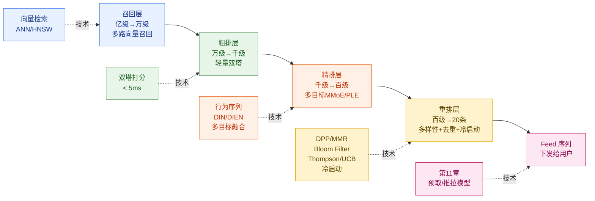
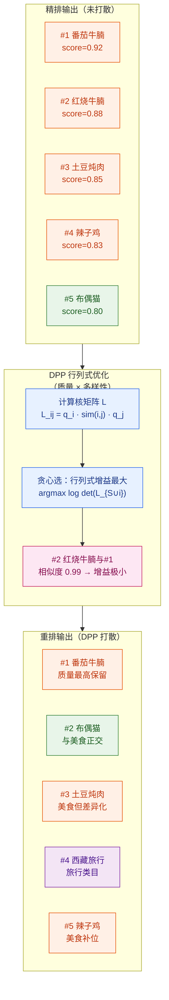
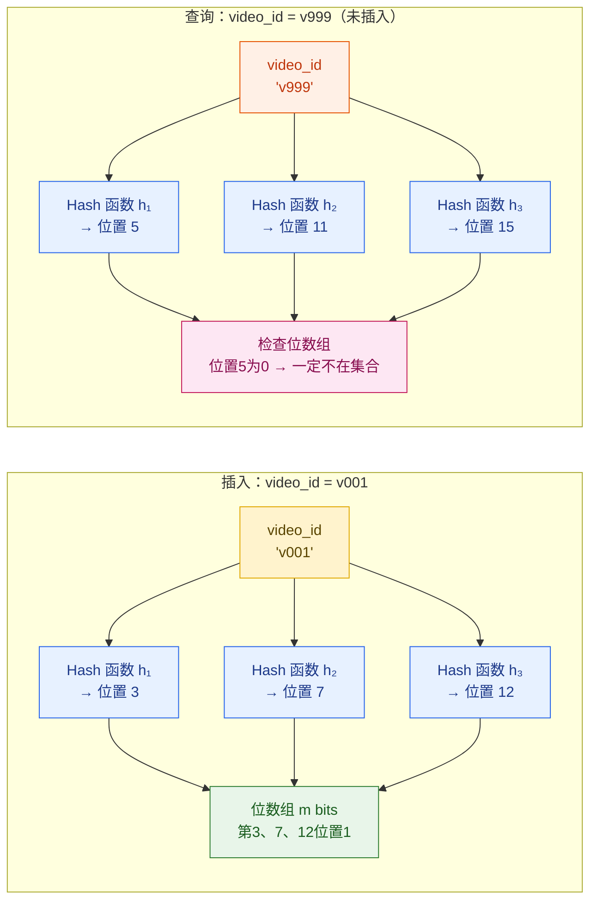
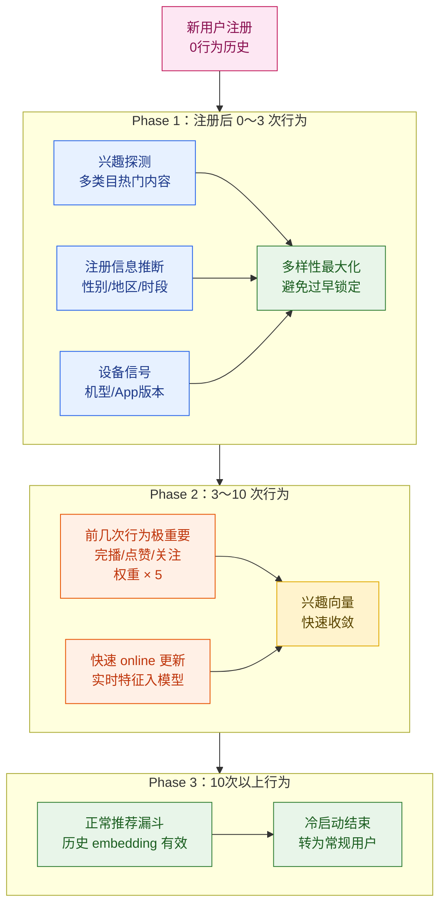
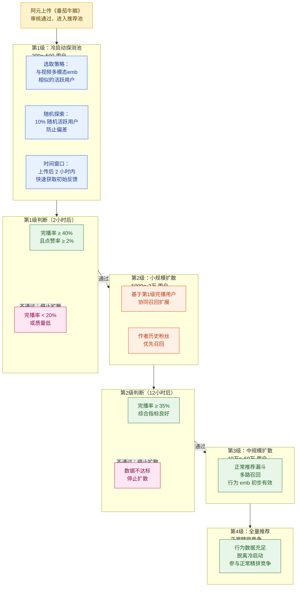
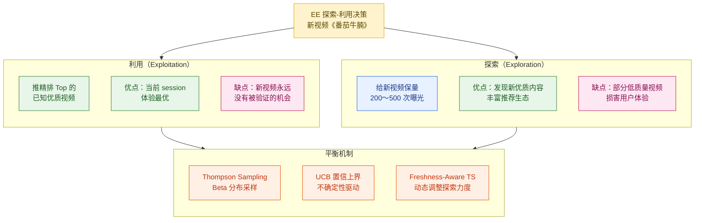

# 第 10 章 · 重排、多样性与冷启动

> **系列定位**：本章承接第 9 章（粗排与精排）的多目标融合分输出，完成推荐漏斗的最后一道关卡——**重排（Re-Rank）**。与广告系统的重排+拍卖不同，短视频推荐的重排没有竞价定价，重点是：**多样性打散、已看去重、新视频冷启动、以及探索与利用（EE）**。重排产出的最终 Feed 序列交由第 11 章讲述的 Feed 流实时下发机制推送给用户。

---

## 本章导读

精排（第 9 章）做的是 **point-wise** 的事：对每条候选视频独立打分，输出一个按融合分降序排列的列表。这种打分方式在数学上足够优雅，但在用户面前会暴露一个致命缺陷——

> **小南今晚打开「闪刷」，连续刷到了 5 条番茄牛腩视频**。前两条还挺有趣，第三条开始有点烦，第四条准备划走，第五条直接退出 App。

这不是假想。当美食类目下《番茄牛腩》上传后，精排可能发现阿元的这条视频和相关视频对小南的完播率预测都很高，于是 Top-10 里有 4 条都是牛腩——精排并不知道"这些视频是同一类的"。

重排要解决的，正是**精排看不到的序列整体体验问题**。

本章主要内容：

1. **重排的定位** — 精排 point-wise 的根本局限；重排在漏斗末端的角色
2. **多样性打散** — DPP（行列式点过程）、MMR（最大边际相关）、滑窗规则；三种方案对比
3. **已看去重（Bloom Filter）** — Bloom Filter 原理、参数计算、时间窗口、易错点
4. **业务规则重排** — 频控、强插置顶、负反馈降权、生态调控
5. **冷启动** — 新用户冷启动两阶段、新视频冷启动流量池逐级放大
6. **探索与利用（EE）** — Thompson Sampling、UCB、freshness-aware 动态调整；易错点
7. **重排 Pipeline 全貌** — 多样性 + 去重 + 冷启动 + EE 如何统一编排（伪代码）

---

## 10.1 重排的定位

### 10.1.1 精排 point-wise 的根本局限

精排模型（DIN/DIEN/PLE/MMoE）本质上在解一个问题：

$$\hat{y}_i = f(\mathbf{x}_i, \mathbf{u})$$

对第 $i$ 条候选视频，基于其特征 $\mathbf{x}_i$ 和用户特征 $\mathbf{u}$ 独立预测完播率、点赞率等，**每条视频的分数与序列中其他视频无关**。

这导致精排天然无法处理以下问题：

| 问题类型 | 精排能否感知 | 说明 |
|---------|------------|------|
| 同类目内容扎堆 | ❌ | 5 条牛腩视频各自分数都高，但放在一起用户审美疲劳 |
| 同作者视频集中 | ❌ | 精排不知道"这 3 条都是阿元拍的" |
| 用户已看过该视频 | ❌ | 精排特征没有实时曝光去重 |
| 新视频无历史行为 | ❌ | 新视频 embedding 为零或随机初始化，分数偏低 |
| 序列整体观看时长 | ❌ | point-wise 无法优化 session 级目标 |

**重排（Re-Rank）** 的定位正是在精排之后、Feed 下发之前，对候选集做 **序列级（list-wise）** 的全局优化，综合考虑多样性、去重、冷启动、业务规则，输出最终的 Feed 排列顺序。

### 10.1.2 重排在漏斗末端的位置



重排的输入通常是精排后的 Top 100～200 条候选，输出约 20～50 条（一次 Feed 请求的返回量）。整个重排阶段的延迟预算通常在 **5～15ms** 以内。

### 10.1.3 重排目标的四个维度

| 维度 | 描述 | 典型手段 |
|------|------|---------|
| **多样性** | 避免同类内容扎堆，提升序列整体趣味性 | DPP / MMR / 滑窗规则 |
| **体验保护** | 去除用户已看过的视频，防止重复推送 | Bloom Filter 去重 |
| **生态健康** | 给新视频、新作者提供流量机会 | 冷启动保量、EE 探索 |
| **业务诉求** | 频控、置顶、负反馈降权、运营干预 | 规则引擎 |

---

## 10.2 多样性打散

### 10.2.1 为什么连续同类内容是体验灾难

用户的内容消费呈现"浓度阈值"效应：

- 第 1 条牛腩视频：高兴趣，完播率 85%
- 第 2 条牛腩视频：仍感兴趣，完播率 72%
- 第 3 条牛腩视频：开始厌倦，完播率 45%
- 第 4 条牛腩视频：滑走，完播率 20%
- 第 5 条牛腩视频：负反馈"不感兴趣"，甚至退出 App

这就是为什么精排分高不等于用户体验好——精排在优化单条视频的点击/完播，而不是序列整体体验。

多样性打散的目标是：**在不大幅损失整体质量分的前提下，最大化序列的内容多样性**。

### 10.2.2 方法一：DPP（行列式点过程）

#### 核心思想

**DPP（Determinantal Point Process，行列式点过程）** 用核矩阵的行列式来衡量一个子集的"质量 × 多样性"综合得分。

给定精排候选集 $\mathcal{Y} = \{1, 2, \ldots, N\}$，希望从中选出大小为 $k$ 的子集 $S$，使得以下目标最大：

$$\boxed{P(S) \propto \det(\mathbf{L}_S)}$$

其中 $\mathbf{L}_S$ 是 **核矩阵（Kernel Matrix）** $\mathbf{L}$ 的 $|S| \times |S|$ 子矩阵。核矩阵定义为：

$$\mathbf{L}_{ij} = q_i \cdot \underbrace{\phi_i^\top \phi_j}_{\text{内容相似度}} \cdot q_j$$

- $q_i \geq 0$：第 $i$ 条视频的**质量分**（来自精排融合分，归一化）
- $\phi_i \in \mathbb{R}^d$：第 $i$ 条视频的**内容特征向量**（多模态 embedding，归一化为单位向量）
- $\phi_i^\top \phi_j$：两条视频的内容相似度（越相似越接近 1）

**几何直觉**：$\det(\mathbf{L}_S)$ 等于矩阵行向量 $\{q_i \phi_i\}$ 张成的平行多面体体积。

- 向量越**正交**（视频越多样）→ 体积越大 → 被选中概率越高
- 对角项 $q_i^2$ 保证质量高的视频更容易被选

$$\text{多样性} \times \text{质量} = \det(\mathbf{L}_S)$$

#### 贪心 DPP 算法

精确求解 DPP（从 $N$ 个候选中选 $k$ 个使行列式最大）是 NP-hard 问题，实践中用**贪心近似**：

$$i^* = \arg\max_{i \in \mathcal{Y} \setminus S} \Big[ \log \det(\mathbf{L}_{S \cup \{i\}}) - \log \det(\mathbf{L}_S) \Big]$$

每次从剩余候选中选择使行列式增益最大的视频，利用 Cholesky 分解可将每步复杂度降至 $O(|S| \cdot d)$，总复杂度约 $O(k^2 d + kN)$。

> ⚠️ **复杂度警示**：DPP 的暴力实现是 $O(N^3)$（矩阵行列式），仅适合重排小集合（百级候选）。千级以上需要 fast greedy DPP 或近似算法。

#### DPP 代码实现

```python
import numpy as np
from typing import List, Dict, Any

def dpp_greedy_rerank(
    candidates: List[Dict[str, Any]],
    top_k: int,
    diversity_weight: float = 0.5
) -> List[Dict[str, Any]]:
    """
    基于贪心 DPP 的短视频多样性重排。

    Args:
        candidates: 精排候选视频列表，每个包含：
                    - 'video_id': 视频ID
                    - 'rank_score': 精排融合分（完播/点赞/时长加权）
                    - 'content_emb': 多模态内容 embedding（numpy array, d维）
        top_k: 选出的视频数量（一次Feed返回量）
        diversity_weight: 多样性权重 alpha，0=纯质量, 1=纯多样性

    Returns:
        重排后的 top_k 条视频列表
    """
    n = len(candidates)
    if n == 0 or top_k == 0:
        return []

    # 提取质量分并归一化
    quality = np.array([c['rank_score'] for c in candidates], dtype=float)
    quality = quality / (quality.max() + 1e-9)  # 归一化到 [0,1]

    # 提取并归一化内容 embedding
    embeddings = np.stack([c['content_emb'] for c in candidates])  # (n, d)
    norms = np.linalg.norm(embeddings, axis=1, keepdims=True) + 1e-9
    embeddings = embeddings / norms  # 单位向量

    # 构建核矩阵 L: L_ij = q_i * [(1-alpha)*I + alpha*sim(i,j)] * q_j
    # alpha 控制多样性权重：alpha=0 → 纯质量排序, alpha=1 → 纯多样性
    sim_matrix = embeddings @ embeddings.T  # (n, n), 余弦相似度
    alpha = diversity_weight
    blended_sim = (1.0 - alpha) * np.eye(n) + alpha * sim_matrix
    Q = np.diag(quality)
    L = Q @ blended_sim @ Q  # 核矩阵

    # 贪心逐步选取
    selected = []
    remaining = list(range(n))

    for _ in range(min(top_k, n)):
        best_idx = None
        best_gain = -np.inf

        for i in remaining:
            candidate_set = selected + [i]
            sub_L = L[np.ix_(candidate_set, candidate_set)]
            sign, log_det = np.linalg.slogdet(sub_L)
            if sign <= 0:
                continue
            # 边际增益 = log det(L_{S∪{i}}) - log det(L_S)
            if len(selected) == 0:
                prev_log_det = 0.0
            else:
                prev_sub = L[np.ix_(selected, selected)]
                _, prev_log_det = np.linalg.slogdet(prev_sub)
            gain = log_det - prev_log_det
            if gain > best_gain:
                best_gain = gain
                best_idx = i

        if best_idx is None:
            break
        selected.append(best_idx)
        remaining.remove(best_idx)

    return [candidates[i] for i in selected]


# ====== 示例：小南的 Feed 多样性打散 ======
if __name__ == '__main__':
    np.random.seed(42)
    # 模拟精排 Top-8 候选
    # 前4条都是美食/牛腩类，后4条是萌宠/旅行类
    candidates = [
        {'video_id': 'v001', 'title': '《番茄牛腩》',  'rank_score': 0.92,
         'content_emb': np.array([0.9, 0.85, 0.1, 0.05])},   # 美食
        {'video_id': 'v002', 'title': '《红烧牛腩》',  'rank_score': 0.88,
         'content_emb': np.array([0.88, 0.82, 0.12, 0.08])},  # 美食（高度相似）
        {'video_id': 'v003', 'title': '《土豆炖肉》',  'rank_score': 0.85,
         'content_emb': np.array([0.80, 0.78, 0.15, 0.10])},  # 美食
        {'video_id': 'v004', 'title': '《辣子鸡》',    'rank_score': 0.83,
         'content_emb': np.array([0.75, 0.70, 0.20, 0.12])},  # 美食
        {'video_id': 'v005', 'title': '《布偶猫日记》', 'rank_score': 0.80,
         'content_emb': np.array([0.1, 0.05, 0.88, 0.85])},   # 萌宠
        {'video_id': 'v006', 'title': '《西藏旅行》',  'rank_score': 0.78,
         'content_emb': np.array([0.08, 0.06, 0.20, 0.92])},  # 旅行
        {'video_id': 'v007', 'title': '《橘猫日常》',  'rank_score': 0.76,
         'content_emb': np.array([0.12, 0.08, 0.85, 0.80])},  # 萌宠
        {'video_id': 'v008', 'title': '《成都美食街》', 'rank_score': 0.74,
         'content_emb': np.array([0.82, 0.68, 0.22, 0.30])},  # 美食+旅行
    ]

    print("=== 纯精排结果（Top-5）===")
    sorted_c = sorted(candidates, key=lambda x: x['rank_score'], reverse=True)
    for i, v in enumerate(sorted_c[:5]):
        print(f"  位置{i+1}: {v['title']} (score={v['rank_score']})")

    print("\n=== DPP 重排结果（Top-5, diversity_weight=0.6）===")
    reranked = dpp_greedy_rerank(candidates, top_k=5, diversity_weight=0.6)
    for i, v in enumerate(reranked):
        print(f"  位置{i+1}: {v['title']} (score={v['rank_score']})")

    # 预期：DPP 不会让前5条全是美食，会插入萌宠/旅行打散
```

#### DPP 打散示意图



### 10.2.3 方法二：MMR（最大边际相关）

**MMR（Maximal Marginal Relevance，最大边际相关）** 是更轻量的多样性方法，由 Carbonell & Goldstein（1998）提出，线性插值相关性与多样性：

$$\boxed{i^* = \arg\max_{i \in \mathcal{Y} \setminus S} \Big[ \lambda \cdot q_i - (1 - \lambda) \cdot \max_{j \in S} \text{sim}(i, j) \Big]}$$

其中：
- $q_i$：第 $i$ 条视频的精排质量分
- $\text{sim}(i, j)$：视频 $i$ 与已选集合中视频 $j$ 的内容相似度（余弦相似度）
- $\max_{j \in S} \text{sim}(i, j)$：视频 $i$ 与已选集合中**最相似**视频的相似度（越大表示重复性越高）
- $\lambda \in [0, 1]$：相关性与多样性的权重参数（$\lambda = 0.5$ 为平衡）

**直觉**：每次选分数高但与已选内容差异大的视频，相当于"优先选新内容种类的代表"。

```python
def mmr_rerank(
    candidates: List[Dict],
    top_k: int,
    lambda_param: float = 0.5
) -> List[Dict]:
    """
    MMR 多样性重排（贪心实现）。

    Args:
        candidates: 候选列表（含 rank_score 和 content_emb）
        top_k: 选出的数量
        lambda_param: 相关性权重（1.0=纯质量, 0.0=纯多样性）
    """
    n = len(candidates)
    # 归一化质量分
    scores = np.array([c['rank_score'] for c in candidates])
    scores = scores / (scores.max() + 1e-9)

    # 归一化 embedding
    embs = np.stack([c['content_emb'] for c in candidates])
    embs = embs / (np.linalg.norm(embs, axis=1, keepdims=True) + 1e-9)
    sim_matrix = embs @ embs.T  # 余弦相似度矩阵

    selected = []
    remaining = list(range(n))

    for _ in range(min(top_k, n)):
        if not selected:
            # 第一步：直接选分数最高的
            best = max(remaining, key=lambda i: scores[i])
        else:
            # MMR: 最大化 lambda*quality - (1-lambda)*max_sim_to_selected
            best = max(
                remaining,
                key=lambda i: lambda_param * scores[i]
                              - (1 - lambda_param) * max(sim_matrix[i][j] for j in selected)
            )
        selected.append(best)
        remaining.remove(best)

    return [candidates[i] for i in selected]
```

### 10.2.4 方法三：滑窗规则

**滑窗规则（Sliding Window Rule）** 是工业界最常用、最低成本的多样性控制手段，在快手、抖音均有使用：

> 在最终 Feed 序列中，同一作者的视频间隔 ≥ N 条；同一类目（tag）的视频间隔 ≥ M 条。

典型参数：同作者间隔 ≥ 3，同一级类目间隔 ≥ 3。

```python
def sliding_window_rerank(
    candidates: List[Dict],
    author_gap: int = 3,
    tag_gap: int = 3
) -> List[Dict]:
    """
    滑窗规则重排：保证同作者/同类目间隔。

    Args:
        candidates: 精排候选（已按 rank_score 降序排列）
        author_gap: 同作者最小间隔条数
        tag_gap: 同一级类目最小间隔条数
    """
    result = []
    # 记录最近 N 条的作者/类目
    recent_authors = []
    recent_tags = []

    penalty_queue = []  # 被暂时跳过的视频（后续重新考虑）
    pool = list(candidates)  # 按 rank_score 降序

    def violates_gap(video: Dict) -> bool:
        author = video.get('author_id', '')
        tag = video.get('primary_tag', '')
        # 检查最近 author_gap 条中是否已有同作者
        if author and author in recent_authors[-author_gap:]:
            return True
        # 检查最近 tag_gap 条中是否已有同类目
        if tag and tag in recent_tags[-tag_gap:]:
            return True
        return False

    for _ in range(len(candidates)):
        placed = False
        # 先尝试从主队列放入不违规的视频
        for i, video in enumerate(pool):
            if not violates_gap(video):
                result.append(video)
                pool.pop(i)
                recent_authors.append(video.get('author_id', ''))
                recent_tags.append(video.get('primary_tag', ''))
                placed = True
                break
        if not placed:
            break  # 候选耗尽

    return result
```

### 10.2.5 三种方法对比

| 维度 | DPP | MMR | 滑窗规则 |
|------|-----|-----|---------|
| **理论基础** | 概率论（行列式点过程）| 信息检索（边际相关）| 工程启发式 |
| **多样性建模** | 全局最优（行列式）| 局部贪心（max 相似度）| 硬约束 |
| **计算复杂度** | $O(k^2 d + kN)$，百级可用 | $O(kN)$，较快 | $O(N)$，极快 |
| **适用场景** | 精排候选 ≤ 500 | 精排候选 ≤ 5000 | 任意规模 |
| **灵活性** | 高（可调 diversity_weight）| 中（调 $\lambda$）| 低（硬间隔）|
| **工业落地难度** | 中（需要内容 embedding）| 低 | 极低 |
| **实际效果** | 最好（理论保证）| 较好 | 够用（快手/抖音常用）|

> 📌 **工业实践**：大多数平台组合使用——先用 DPP/MMR 做精细多样性，再用滑窗规则做兜底保障（同作者严格不相邻）。DPP 通常只在重排候选集小于 200 时使用，更大候选集用 MMR。

---

## 10.3 已看去重：Bloom Filter

### 10.3.1 问题定义

用户的历史曝光记录是推荐系统的重要约束：**同一条视频不应该在短时间内被反复推荐**。小南上周看过的《番茄牛腩》不应该下周又出现在她的 Feed 里。

朴素实现是每用户维护一个 `Set<video_id>`，但以「闪刷」的规模：

- 1.5 亿用户 × 每用户曝光 1000 条/月 = 1500 亿条记录
- HashSet 每条记录约 50 字节 = 约 7.5TB 内存

这是不可接受的。

### 10.3.2 Bloom Filter 原理

**Bloom Filter（布隆过滤器）** 是一种空间高效的概率型数据结构，用于判断"某元素是否在集合中"：
- **查询返回 YES** → 元素**可能**在集合中（有误判率 FPR）
- **查询返回 NO** → 元素**一定不**在集合中（零漏判）



### 10.3.3 参数计算：1 亿条记录 120MB

Bloom Filter 的核心参数：
- $n$：预期存储的元素数量（曝光 item_id 数量）
- $m$：位数组大小（bits）
- $k$：hash 函数数量
- $p$：可接受的误判率（False Positive Rate，FPR）

参数关系公式：

$$\boxed{m = -\frac{n \ln p}{(\ln 2)^2}, \quad k = \frac{m}{n} \ln 2}$$

实际误判率：

$$p \approx \left(1 - e^{-kn/m}\right)^k$$

**计算示例**（1 亿条记录，误判率 1%）：

$$m = -\frac{10^8 \times \ln 0.01}{(\ln 2)^2} = -\frac{10^8 \times (-4.605)}{0.480} \approx 9.59 \times 10^8 \text{ bits} \approx \mathbf{120 \text{ MB}}$$

$$k = \frac{9.59 \times 10^8}{10^8} \times \ln 2 \approx 6.65 \approx 7 \text{ 个 hash 函数}$$

| 条件 | HashSet | Bloom Filter |
|------|---------|-------------|
| 1 亿条记录（64-bit ID）| ~800MB（含指针开销）| **~120MB（误判率 1%）** |
| 1 亿条记录 | ~800MB | **~60MB（误判率 2%）** |
| 误判语义 | 无误判 | 偶尔把未看的视频误判为"已看"并过滤 |
| 漏判 | 无漏判 | **零漏判**（不会把看过的视频漏过） |

**为什么误判可以接受**：偶尔把用户未看过的视频误判为"已看"而不推送，等于少推了一条视频——这个代价远比"把用户看过的视频反复推"的负体验小得多。

### 10.3.4 时间窗口与维护策略

不能让 Bloom Filter 无限增长，需要设置**时间窗口**：

```
策略一：固定窗口（简单）
  - 每 7 天重建一次 Bloom Filter
  - 只保留最近 7 天的曝光记录
  - 缺点：重建时有短暂的去重失效

策略二：Counting Bloom Filter
  - 每个 bit 变为 counter（4-bit 或 8-bit）
  - 支持元素删除（counter-1）
  - 可以精确淘汰超过 30 天的旧记录
  - 代价：内存增大 4-8 倍

策略三：双 BF 滚动（推荐）
  - 维护两个 BF：current（当前 15 天）和 previous（上 15 天）
  - 查询时同时查两个 BF（任一返回 YES 则认为已看）
  - 每 15 天将 current 移到 previous，重建新的 current
  - 内存翻倍但实现简单，工业常用
```

⚠️ **易错点：窗口无限增长内存爆炸**

```python
# ❌ 错误做法：无窗口，一直往 BF 里加
class UserBloomFilter:
    def __init__(self):
        self.bf = BloomFilter(capacity=1_000_000)  # 容量写死

    def add_exposure(self, video_id: str):
        self.bf.add(video_id)  # 超过 capacity 后误判率急剧上升

# ✅ 正确做法：双 BF 滚动窗口
class RollingBloomFilter:
    def __init__(self, capacity_per_bf: int = 50_000_000, window_days: int = 15):
        self.current_bf = BloomFilter(capacity=capacity_per_bf, error_rate=0.01)
        self.previous_bf = BloomFilter(capacity=capacity_per_bf, error_rate=0.01)
        self.window_days = window_days
        self.current_start = time.time()

    def is_seen(self, video_id: str) -> bool:
        # 查询两个窗口
        return video_id in self.current_bf or video_id in self.previous_bf

    def mark_seen(self, video_id: str):
        # 检查是否需要滚动
        if time.time() - self.current_start > self.window_days * 86400:
            self._roll()
        self.current_bf.add(video_id)

    def _roll(self):
        # 当前窗口变上一窗口，重建当前窗口
        self.previous_bf = self.current_bf
        self.current_bf = BloomFilter(capacity=50_000_000, error_rate=0.01)
        self.current_start = time.time()
```

### 10.3.5 工程部署

- **存储位置**：用户维度的 Bloom Filter 存 Redis（`BITSET` 结构）或专用 Bloom Filter 服务
- **规模估算**：1.5 亿用户 × 120MB/用户（1 亿记录，误判率 1%）≈ 不现实。实际每用户最近 30 天曝光约 1 万条，对应 BF 约 15KB/用户，1.5 亿用户共 ~2.2TB，用 Redis Cluster 可承受
- **去重时机**：在重排阶段**入口处**先做 BF 过滤，减少后续 DPP/MMR 的候选集，加速整体重排

---

## 10.4 业务规则重排

除了多样性和去重，重排层还是业务规则落地的最后防线。

### 10.4.1 频控（Frequency Control）

频控限制用户在一段时间内看到同一作者/同一类目内容的次数上限：

- **作者级频控**：同一作者的视频在 1 小时内最多出现 3 次（防止单一头部创作者垄断 Feed）
- **类目级频控**：同一一级类目在 20 条内不超过 6 条（防止 Feed 过于单一）
- **热点事件频控**：单一热点话题在 Feed 中占比不超过 10%（防止"信息茧房"极端化）

频控通过 Redis 记录用户-作者/类目的曝光次数，在重排阶段查询并降权/过滤超频内容。详细设计见**第 11 章**。

### 10.4.2 强插与置顶（Business Injection）

运营团队可以在重排层注入"强插内容"：

- **平台活动强插**：节日/大促期间特定视频必须出现在特定位置（如 Feed 第 3 条）
- **官方账号置顶**：平台公告/安全提示需要出现在 Feed 顶部
- **品牌合作加权**：与平台合作的头部创作者新视频，在冷启动阶段额外获得推流

强插在重排 pipeline 末尾执行，直接覆盖算法结果，优先级最高。

### 10.4.3 负反馈降权

用户明确表达"不感兴趣"的信号需要快速响应：

- **当次 session 降权**：在当前会话内，同作者/同类目所有视频降权到列表末尾
- **长期降权**：用户多次对某作者负反馈，24 小时内该作者视频不出现在 Feed 中
- **黑名单**：用户主动屏蔽某作者，永久过滤

```python
def apply_negative_feedback_filter(
    candidates: List[Dict],
    user_dislikes: Dict[str, int],  # author_id -> dislike_count（本 session）
    session_block_threshold: int = 2  # 负反馈 >=2 次则本 session 屏蔽
) -> List[Dict]:
    """根据负反馈信号对候选视频降权/过滤"""
    filtered = []
    deprioritized = []
    for video in candidates:
        author = video.get('author_id', '')
        dislike_count = user_dislikes.get(author, 0)
        if dislike_count >= session_block_threshold:
            # 本 session 屏蔽（不加入候选）
            continue
        elif dislike_count >= 1:
            # 轻度降权（加入但排到末尾候选）
            deprioritized.append(video)
        else:
            filtered.append(video)
    return filtered + deprioritized  # 正常内容在前，降权内容在后
```

### 10.4.4 生态调控：新人扶持与优质内容加权

平台需要主动干预分配，维护内容生态健康：

- **新作者扶持**：注册 30 天内的新作者，其视频在冷启动池外额外获得 10%～20% 流量加权
- **优质内容加权**：完播率/点赞率显著高于同类目均值的视频，重排时提升权重
- **多样性保量**：确保每次 Feed 的 20 条中至少有 3 种不同一级类目（防止过度个性化导致信息茧房）

---

## 10.5 冷启动

冷启动是推荐系统最难的问题之一。「闪刷」每天新增 5000 万条视频，每天新增数百万新用户——这些没有历史行为的用户和视频如何进入推荐漏斗？

### 10.5.1 新用户冷启动（User Cold Start）



**Phase 1 策略（0 行为）**：
- 无法做个性化，用**设备/地区/时段**做群体推断（上海 22 岁女生注册 → 推美妆/美食/萌宠等热门类目）
- 推**高完播率的热门内容**（平台整体热榜），确保用户有好的第一印象
- **多样性最大化**：类目尽可能分散（2 条美食、2 条萌宠、2 条旅行、2 条搞笑、2 条音乐），观察哪个类目触发了用户反应
- 兴趣选择页（注册时主动让用户选 3～5 个兴趣标签）是重要的冷启动信号

**Phase 2 策略（3～10 次行为）**：
- 前几次的完播、点赞、关注行为**权重极高**（完播权重 × 5 倍），快速更新用户 embedding
- 实时特征：行为进入 Flink 流处理，秒级更新用户实时向量，马上用于召回
- 此阶段模型不稳定，推荐结果方差大，是正常现象——允许一定的探索

> ⚠️ **新用户冷启动易错点**：Phase 1 不要急于用单一热门内容填满 Feed（如全是"今日最热"），这会导致无法探测用户真实兴趣，陷入"热门内容-用户不感兴趣-留存率低"的恶性循环。

### 10.5.2 新视频冷启动（Item Cold Start）

这是本章的重点。《番茄牛腩》上传后如何进入推荐系统？

#### 关键约束

| 约束 | 说明 |
|------|------|
| 无历史行为数据 | 新视频没有点击、完播、点赞记录 |
| 协同过滤失效 | ItemCF 需要共现数据，新视频无共现 |
| 精排分偏低 | 行为特征为零，精排模型对新视频严重低估 |
| 多模态 emb 可用 | 视频内容本身可以提取文本/图像/音频 embedding |

#### 流量池逐级放大（Traffic Pool Cascade）

核心思想：**给新视频一个保底的初始流量，根据初始反馈决定是否扩大分发规模**。



#### 第 1 级：多模态 Embedding 替代行为特征

新视频没有行为特征，用**多模态 embedding** 作为初始内容表示：

- **文本特征**：视频标题、描述、标签 → BERT/Sentence-BERT 编码
- **视觉特征**：关键帧截图 → ViT/CLIP 图像编码
- **音频特征**：BGM/语音 → wav2vec 或 MFCC 特征
- **融合**：三路 embedding 拼接/加权平均 → 视频内容 embedding

```python
def get_cold_start_video_embedding(video: Dict) -> np.ndarray:
    """
    新视频冷启动：用多模态 embedding 替代历史行为 embedding。
    
    Args:
        video: 包含 title_emb(文本)、frame_emb(视觉)、audio_emb(音频)
    """
    # 各路 embedding 已由上游多模态抽取服务提供
    text_emb   = video.get('title_emb',  np.zeros(256))   # BERT 编码
    visual_emb = video.get('frame_emb',  np.zeros(512))   # ViT/CLIP 编码
    audio_emb  = video.get('audio_emb',  np.zeros(128))   # 音频特征

    # 归一化后加权融合
    def normalize(v): return v / (np.linalg.norm(v) + 1e-9)

    fused = np.concatenate([
        normalize(text_emb)   * 0.4,   # 文本权重最高（标题信息量大）
        normalize(visual_emb) * 0.4,   # 视觉内容次之
        normalize(audio_emb)  * 0.2,   # 音频辅助
    ])
    return fused  # 返回多模态融合 embedding，作为视频的冷启动表示
```

#### 第 1 级：探测用户的选取策略

```
目标：找到最可能与《番茄牛腩》产生互动的 200～500 个用户

策略：
1. 多模态向量召回：用视频 content_emb 找历史观看记录中
   内容相似的活跃用户（ANN 检索用户兴趣向量库）
2. 作者粉丝优先：阿元的历史粉丝，冷启动直接推送
3. 热门美食用户：最近 7 天完播美食类视频 ≥ 5 条的活跃用户
4. 随机探索 10%：随机抽取活跃用户，防止探测有偏
```

#### 冷启动指标的特殊处理

⚠️ **关键易错：冷启动期不能用精排模型的完播率特征过滤**

精排模型的完播率特征基于历史统计，新视频刚发布时样本数极少（200 人），数据方差极大：

$$\text{样本方差} = \sqrt{\frac{p(1-p)}{n}} = \sqrt{\frac{0.5 \times 0.5}{200}} \approx 3.5\%$$

200 个样本时，3.5% 的置信区间意味着真实完播率可能在 `[观测值 - 7%, 观测值 + 7%]` 之间波动。此时**不能**直接用点估计（观测完播率）做判断，必须使用**置信区间下界**：

$$\text{保守估计} = \hat{p} - z_{0.05} \cdot \sqrt{\frac{\hat{p}(1-\hat{p})}{n}}$$

其中 $z_{0.05} = 1.645$（90% 置信度）。这就引出了下一节的 EE 探索机制。

---

## 10.6 探索与利用（Exploration & Exploitation）

### 10.6.1 EE 问题的本质

推荐系统面临一个经典的 **探索-利用权衡（Exploration-Exploitation Tradeoff）**：

- **利用（Exploitation）**：推用户已知喜欢的内容，最大化当前 session 体验
- **探索（Exploration）**：推用户没见过的新内容/新视频，获取更多信息

对**新视频**来说，必须探索（给予流量），才能知道这个视频是否优质。不探索，优质新视频永远被压在精排底部；过度探索，用户体验下降（刷到大量低质量新视频）。

**具体到《番茄牛腩》**：视频刚上传，完播率未知，是直接放弃（不推），还是给它 200 个展示机会看看反馈？



### 10.6.2 Thompson Sampling

**Thompson Sampling（汤普森采样）** 是 Bayesian 视角下的 EE 策略：为每条视频维护关于"真实完播率"的**后验分布**，每次推荐时从后验中**采样**决定是否推送。

对于 0/1 的完播信号（完播=1，未完播=0），使用 **Beta 分布**建模后验：

$$\boxed{\text{视频} i \text{ 的完播率后验} \sim \text{Beta}(\alpha_i, \beta_i)}$$

其中：
- $\alpha_i$：视频 $i$ 的**成功次数**（完播次数）+ 先验 $\alpha_0$
- $\beta_i$：视频 $i$ 的**失败次数**（未完播次数）+ 先验 $\beta_0$

Beta 分布的期望（估计完播率）：

$$\mathbb{E}[\text{Beta}(\alpha, \beta)] = \frac{\alpha}{\alpha + \beta}$$

**推荐时的决策过程**：

$$\tilde{p}_i \sim \text{Beta}(\alpha_i, \beta_i), \quad \text{选} \arg\max_i \tilde{p}_i$$

每次从 Beta 分布随机采样一个完播率 $\tilde{p}_i$，选采样值最大的视频推送。

**直觉**：
- 新视频（$\alpha=1, \beta=1$）：Beta(1,1) = 均匀分布，采样值随机，**有机会被选中**（探索）
- 热门视频（$\alpha=500, \beta=100$）：Beta(500,100) 均值约 0.83，方差极小，采样值集中在 0.83 附近（利用）
- 中等视频（$\alpha=10, \beta=10$）：方差较大，偶尔采样到高值也会被选中（适度探索）

```python
import numpy as np
from dataclasses import dataclass, field

@dataclass
class VideoThompsonState:
    """视频的 Thompson Sampling 状态"""
    video_id: str
    alpha: float = 1.0  # 先验：Beta(1,1) = 均匀分布
    beta: float = 1.0
    rank_score: float = 0.0  # 精排基础分

    def sample(self) -> float:
        """从 Beta 后验采样完播率"""
        return np.random.beta(self.alpha, self.beta)

    def update(self, completed: bool):
        """根据用户是否完播更新后验"""
        if completed:
            self.alpha += 1.0  # 成功次数 +1
        else:
            self.beta += 1.0   # 失败次数 +1

    @property
    def mean(self) -> float:
        """后验期望（点估计完播率）"""
        return self.alpha / (self.alpha + self.beta)

    @property
    def uncertainty(self) -> float:
        """后验方差（不确定性）"""
        a, b = self.alpha, self.beta
        return (a * b) / ((a + b) ** 2 * (a + b + 1))


def thompson_sampling_select(
    candidates: List[VideoThompsonState],
    top_k: int,
    explore_ratio: float = 0.2,  # 20% 位置用于探索
    rank_weight: float = 0.7     # 精排分权重
) -> List[VideoThompsonState]:
    """
    Thompson Sampling 结合精排分的选择策略。
    
    采用加权组合：final_score = rank_weight * rank_score
                                + (1-rank_weight) * thompson_sample
    """
    scored = []
    for video in candidates:
        ts_sample = video.sample()
        # 综合精排分和 Thompson 采样值
        combined = rank_weight * video.rank_score + (1 - rank_weight) * ts_sample
        scored.append((combined, video))

    # 按综合分排序，选 top_k
    scored.sort(key=lambda x: x[0], reverse=True)
    return [v for _, v in scored[:top_k]]
```

### 10.6.3 UCB（置信上界）

**UCB（Upper Confidence Bound，置信上界）** 是频率派视角的 EE 策略。其核心思想：**对不确定的内容给予"乐观估计"，主动探索置信区间上界大的内容**。

$$\boxed{\text{UCB}_i = \underbrace{\hat{\mu}_i}_{\text{当前均值}} + c \cdot \underbrace{\sqrt{\frac{\ln N}{n_i}}}_{\text{探索奖励}}}$$

其中：
- $\hat{\mu}_i$：视频 $i$ 的当前完播率均值（观测均值）
- $N$：所有视频的总曝光次数
- $n_i$：视频 $i$ 的曝光次数
- $c > 0$：探索系数（控制探索强度，通常 $c = \sqrt{2}$ 或调参得到）

**直觉**：
- 新视频 $n_i = 0$（或很小）→ $\sqrt{\ln N / n_i} \to \infty$ → UCB 极大 → 优先探索
- 热门视频 $n_i$ 很大 → UCB 接近 $\hat{\mu}_i$ → 靠均值竞争，不再额外加分
- 随着探索进行，$n_i$ 增大，UCB 越来越精确，逐渐从"探索"转为"利用"

```python
def ucb_score(
    mean: float,
    n_plays: int,
    total_plays: int,
    c: float = 1.414  # sqrt(2)
) -> float:
    """
    UCB1 评分。
    
    Args:
        mean: 视频的观测完播率均值
        n_plays: 该视频的曝光次数
        total_plays: 所有视频的总曝光次数
        c: 探索系数
    """
    if n_plays == 0:
        return float('inf')  # 未曝光视频必然被探索
    exploration_bonus = c * np.sqrt(np.log(total_plays) / n_plays)
    return mean + exploration_bonus
```

### 10.6.4 Freshness-Aware Thompson Sampling

标准 Thompson Sampling 有一个问题：随着视频曝光量增加，后验越来越"确定"，$\alpha + \beta$ 越来越大，分布越来越窄——**老视频会长期统治，新视频很难竞争**。

**Freshness-Aware TS（时效感知汤普森采样）** 引入**时间衰减**，对旧数据逐渐降权：

$$\alpha'_i(t) = \alpha_0 + \sum_{j} \text{complete}_{ij} \cdot e^{-\lambda(t - t_j)}$$

$$\beta'_i(t) = \beta_0 + \sum_{j} \text{skip}_{ij} \cdot e^{-\lambda(t - t_j)}$$

其中 $\lambda$ 是时间衰减系数，历史越久远的行为权重越小。

工程实现上，通常简化为**等效样本缩减**：

```python
def decay_thompson_state(
    video: VideoThompsonState,
    hours_since_last_update: float,
    half_life_hours: float = 24.0  # 24小时半衰期
) -> VideoThompsonState:
    """
    时间衰减：让旧的统计数据逐渐"遗忘"，保持新鲜感。
    采用半衰期指数衰减。
    """
    decay = 0.5 ** (hours_since_last_update / half_life_hours)
    prior_alpha = 1.0  # Beta(1,1) 先验
    prior_beta = 1.0

    # 衰减后的有效统计量 = 先验 + 历史记录 * decay
    new_alpha = prior_alpha + (video.alpha - prior_alpha) * decay
    new_beta  = prior_beta  + (video.beta  - prior_beta)  * decay

    return VideoThompsonState(
        video_id=video.video_id,
        alpha=max(new_alpha, prior_alpha),  # 不低于先验
        beta=max(new_beta,  prior_beta),
        rank_score=video.rank_score
    )
```

### 10.6.5 Thompson Sampling vs UCB 对比

| 维度 | Thompson Sampling | UCB |
|------|------------------|-----|
| **理论基础** | Bayesian（后验分布采样）| 频率派（置信区间上界）|
| **探索机制** | 随机采样（概率式探索）| 确定性上界（系统式探索）|
| **新视频处理** | Beta(1,1) 均匀分布，有机会 | $n=0$ 时上界无穷，强制探索 |
| **参数** | 先验 $\alpha_0, \beta_0$；时间衰减 $\lambda$ | 探索系数 $c$ |
| **并发性** | ✅ 多请求可并行（各自采样）| ⚠️ 需要全局 $N$ 计数（更新有竞争）|
| **实现复杂度** | 低（一行 np.random.beta）| 低（一个公式）|
| **工业使用** | TikTok、Netflix 等广泛使用 | 广告 bandit、A/B 测试均有使用 |
| **freshness 支持** | ✅ 自然（时间衰减先验）| 需要额外设计 $N$ 和 $n$ 的衰减 |

> **推荐选择**：短视频冷启动场景首选 **Thompson Sampling + 时间衰减**，因为其随机探索特性在大规模并发下更友好，且易于集成 freshness 衰减。UCB 更适合 A/B 测试、广告 bandit 等需要确定性探索保证的场景。

### 10.6.6 探索力度的动态调整

探索不是无限制的。需要根据以下条件动态调整：

| 条件 | 调整策略 |
|------|---------|
| 视频已曝光 ≥ 500 次 | 置信度足够，退出冷启动探索 |
| 视频上传超过 72 小时完播率仍 < 20% | 停止扩散，认为低质量内容 |
| 用户 session 初期（前 5 条）| 降低探索比例，优先体验 |
| 用户 session 中期（6～20 条）| 提高探索比例，丰富内容 |
| 深夜时段（00:00～06:00）| 降低探索，用户期望高质量内容 |

⚠️ **探索不设上限会伤体验**：如果给每条新视频无限探索机会，Feed 里会充斥未经验证的内容。典型约束：每次 Feed 请求 20 条中，最多 2～3 条来自冷启动探索池（比例约 10～15%）。

---

## 10.7 重排 Pipeline 全貌

### 10.7.1 完整流程图

```mermaid
flowchart TD
    INPUT["精排输出<br/>Top 200 候选视频"]:::blue

    subgraph PREPROCESS["预处理"]
        P1["Bloom Filter 去重<br/>过滤已看视频"]:::green
        P2["负反馈过滤<br/>过滤不感兴趣内容"]:::pink
        P3["候选集剩余<br/>约 150～180 条"]:::yellow
    end

    subgraph COLD_START["冷启动注入"]
        CS1["从冷启动探测池<br/>取 10～15 条候选<br/>（今日新视频）"]:::orange
        CS2["多模态 emb 表示<br/>替代行为特征"]:::orange
        CS3["合并入主候选集<br/>共 160～195 条"]:::orange
    end

    subgraph DIVERSITY["多样性优化"]
        D1["DPP / MMR<br/>主多样性优化"]:::blue
        D2["滑窗规则兜底<br/>同作者间隔 ≥ 3"]:::blue
        D3["输出 50～80 条<br/>多样化候选"]:::blue
    end

    subgraph EE["EE 探索决策"]
        E1["Thompson Sampling<br/>为冷启动视频计算<br/>探索采样分"]:::orange
        E2["UCB 兜底<br/>零曝光视频强制探索"]:::orange
        E3["探索上限：每20条<br/>最多2条探索内容"]:::yellow
    end

    subgraph BUSINESS["业务规则"]
        B1["频控检查<br/>同作者 / 同类目上限"]:::purple
        B2["强插 / 置顶<br/>运营干预内容"]:::purple
        B3["生态调控<br/>新作者加权"]:::purple
    end

    OUTPUT["最终 Feed 序列<br/>20 条下发给用户"]:::pink

    INPUT --> PREPROCESS
    PREPROCESS --> P1 --> P2 --> P3
    P3 --> COLD_START
    COLD_START --> CS1 --> CS2 --> CS3
    CS3 --> DIVERSITY
    DIVERSITY --> D1 --> D2 --> D3
    D3 --> EE
    EE --> E1 --> E2 --> E3
    E3 --> BUSINESS
    BUSINESS --> B1 --> B2 --> B3 --> OUTPUT

    style INPUT fill:#e7f1ff,stroke:#2563eb,color:#1e3a8a
    style P1 fill:#e8f5e9,stroke:#2e7d32,color:#1b5e20
    style P2 fill:#fde7f3,stroke:#c2185b,color:#880e4f
    style P3 fill:#fff3cd,stroke:#e0a800,color:#5a4500
    style CS1 fill:#fff0e6,stroke:#e65100,color:#bf360c
    style CS2 fill:#fff0e6,stroke:#e65100,color:#bf360c
    style CS3 fill:#fff0e6,stroke:#e65100,color:#bf360c
    style D1 fill:#e7f1ff,stroke:#2563eb,color:#1e3a8a
    style D2 fill:#e7f1ff,stroke:#2563eb,color:#1e3a8a
    style D3 fill:#e7f1ff,stroke:#2563eb,color:#1e3a8a
    style E1 fill:#fff0e6,stroke:#e65100,color:#bf360c
    style E2 fill:#fff0e6,stroke:#e65100,color:#bf360c
    style E3 fill:#fff3cd,stroke:#e0a800,color:#5a4500
    style B1 fill:#f3e5f5,stroke:#7b1fa2,color:#4a148c
    style B2 fill:#f3e5f5,stroke:#7b1fa2,color:#4a148c
    style B3 fill:#f3e5f5,stroke:#7b1fa2,color:#4a148c
    style OUTPUT fill:#fde7f3,stroke:#c2185b,color:#880e4f
```



### 10.7.2 重排 Pipeline 伪代码

```python
from typing import List, Dict, Any
import numpy as np

def rerank_pipeline(
    ranked_candidates: List[Dict],    # 精排 Top-200 候选
    user_id: str,
    user_context: Dict,               # 用户上下文（session信息、负反馈等）
    cold_start_pool: List[Dict],      # 今日新视频冷启动池
    config: Dict                      # 各模块参数配置
) -> List[Dict]:
    """
    重排 Pipeline 完整实现。
    输入：精排 Top-200 候选 + 新视频冷启动池
    输出：最终 Feed 序列（20条）
    """

    # === Step 1: 预处理 — 去重 + 负反馈过滤 ===
    bloom_filter = get_user_bloom_filter(user_id)  # 获取用户 BF
    user_dislikes = user_context.get('session_dislikes', {})

    candidates = []
    for video in ranked_candidates:
        vid = video['video_id']
        # 已看过的视频：BF 去重
        if bloom_filter.is_seen(vid):
            continue
        # 负反馈内容：过滤
        author = video.get('author_id', '')
        if user_dislikes.get(author, 0) >= 2:
            continue
        candidates.append(video)

    # === Step 2: 冷启动视频注入 ===
    # 从冷启动池选 2～3 条（今日新视频），替代行为 emb 为多模态 emb
    n_explore = config.get('cold_start_inject', 2)
    cold_videos = select_cold_start_videos(
        cold_start_pool,
        user_id=user_id,
        n=n_explore,
        user_content_emb=user_context.get('interest_emb')
    )
    # 注入冷启动视频（打散位置，不集中在前几条）
    candidates = inject_cold_start(candidates, cold_videos)

    # === Step 3: 多样性优化（DPP） ===
    # 对候选集做 DPP 打散，从 ~180 条选 80 条
    top_n_for_diversity = config.get('diversity_candidate_size', 80)
    if len(candidates) <= 200:
        # 候选集小于 200，用 DPP
        candidates = dpp_greedy_rerank(
            candidates,
            top_k=top_n_for_diversity,
            diversity_weight=config.get('diversity_weight', 0.5)
        )
    else:
        # 候选集大，先用 MMR 粗过滤
        candidates = mmr_rerank(candidates, top_k=top_n_for_diversity)

    # === Step 4: 滑窗兜底 ===
    candidates = sliding_window_rerank(
        candidates,
        author_gap=config.get('author_gap', 3),
        tag_gap=config.get('tag_gap', 3)
    )

    # === Step 5: Thompson Sampling 排序（融合探索分） ===
    thompson_states = get_or_init_thompson_states(
        [v['video_id'] for v in candidates]
    )
    ts_ranked = thompson_sampling_select(
        [thompson_states[v['video_id']] for v in candidates],
        top_k=config.get('feed_size', 30),  # 选30条备用
        rank_weight=config.get('rank_weight', 0.75)
    )
    candidates = [c for c in candidates
                  if c['video_id'] in {v.video_id for v in ts_ranked}]

    # === Step 6: 业务规则 ===
    # 6.1 频控
    candidates = apply_frequency_cap(candidates, user_id, config)
    # 6.2 运营强插（置顶内容）
    injections = get_business_injections(user_context)
    candidates = apply_business_injections(candidates, injections)
    # 6.3 最终截取 20 条
    result = candidates[:config.get('feed_size', 20)]

    # === Step 7: 更新 Bloom Filter ===
    for video in result:
        bloom_filter.mark_seen(video['video_id'])

    return result
```

### 10.7.3 重排延迟预算

整个重排 pipeline 需要在 **5～15ms** 以内完成（精排已消耗大部分 100ms 延迟预算）：

| 模块 | 典型延迟 | 说明 |
|------|---------|------|
| Bloom Filter 查询（Redis）| 1～2ms | 批量 `GETBIT` |
| 负反馈过滤（内存）| < 0.5ms | 本地 HashMap |
| 冷启动视频选取（Redis）| 0.5～1ms | 预计算冷启动候选 |
| DPP/MMR 打散（CPU）| 2～5ms | 100 候选 × 100 维 emb |
| Thompson Sampling 采样 | < 0.5ms | numpy beta 采样，纯 CPU |
| 频控查询（Redis）| 0.5～1ms | 批量 GET |
| 业务规则引擎（内存）| < 0.5ms | 规则匹配 |
| **总计** | **~5～10ms** | 满足延迟预算 |

---

## 10.8 贯穿案例：《番茄牛腩》的完整重排旅程

让我们用本章贯穿案例串联所有知识点：

**T=0**：阿元上传《番茄牛腩》，转码、审核通过

**T=1 分钟**：冷启动系统触发
- 多模态 emb 抽取：标题"3分钟搞定番茄牛腩" → 文本 emb；关键帧 → 视觉 emb
- 初始化 Thompson 状态：`Beta(1.0, 1.0)`（均匀分布，高度不确定）
- 进入第 1 级冷启动探测池（目标 300 用户）

**T=2 分钟**：重排系统从冷启动池取出视频
- 通过多模态 emb 相似度，找到 300 个最近 7 天经常完播美食视频的用户
- 在这 300 次请求中，《番茄牛腩》被注入候选集（不经过精排，直接从冷启动池注入）
- 由于 Thompson Beta(1,1) 采样值随机，约 50% 概率出现在最终 20 条 Feed 中

**T=2 小时**：第 1 级反馈统计
- 300 次曝光：完播 165 次（55% 完播率）、点赞 24 次（8% 点赞率）
- Thompson 状态更新：`Beta(1+165, 1+135) = Beta(166, 136)`
- 后验期望：166/(166+136) ≈ 0.55，不确定性大幅降低
- **判断**：完播率 55% >> 阈值 40%，进入第 2 级（5000～20000 用户）

**T=12 小时**：第 2 级反馈统计
- 12000 次曝光：完播率 48%，点赞率 6%
- 进入第 3 级，向 50 万用户扩散
- 逐步脱离冷启动保量，开始参与正常精排竞争
- 精排模型的行为特征（完播率、点赞率）开始有效，协同过滤 ItemCF 开始积累共现数据

**T+1 天**：小南刷到《番茄牛腩》
- 精排给出融合分 0.87（小南历史完播了大量美食视频）
- 重排阶段：
  - BF 检查：小南从未看过此视频（BF 返回 NOT SEEN）
  - 多样性检查：小南今次 Feed 已有 2 条美食视频，DPP 给此视频略微降权
  - 最终排在小南 Feed 第 4 位
- 小南完播并点赞 → 行为回流 → 更新 Thompson 状态 + 小南兴趣 embedding

**T+1 天后**：再次推荐《番茄牛腩》
- 小南的 BF 已记录此视频 → BF 返回 SEEN → 重排过滤
- 《番茄牛腩》不会再推送给小南（至少 15 天内）

---

## 本章小结

本章系统覆盖了推荐漏斗末端的重排层——从多样性打散到冷启动，从去重到 EE 探索，重排是让精排的"数学优化"转化为用户实际体验的关键一层。

**多样性打散**解决了 point-wise 精排看不到的序列整体问题：
- **DPP**：用行列式建模集合多样性，$\det(\mathbf{L}_S)$ 平衡质量与差异，适合百级候选
- **MMR**：线性插值相关性与多样性，贪心高效，适合更大候选集
- **滑窗规则**：硬约束同作者/同类目间隔，工程简单，工业兜底

**Bloom Filter 去重**在 120MB 内存中维护 1 亿条曝光记录（误判率 1%），双 BF 滚动窗口解决无限增长问题。零漏判特性保证已看视频不重复推送，偶尔的误判（把未看内容误判为已看）对体验影响可以接受。

**冷启动**解决了新用户和新视频没有行为数据的根本问题：
- 新视频通过**流量池逐级放大**（200→5000→50万→全量），多模态 embedding 替代行为特征
- 新用户通过**两阶段探测**（设备/地区推断热门内容 → 快速收敛兴趣）

**EE 探索**：Thompson Sampling（Beta 分布采样）和 UCB（置信上界）从数学上保证新内容有被验证的机会，Freshness-Aware 时间衰减防止老数据统治，探索比例控制（每 Feed 最多 10～15%）保护用户体验。

**重排 pipeline** 将以上所有模块统一编排：BF 去重 → 冷启动注入 → DPP/MMR 打散 → 滑窗兜底 → Thompson 排序 → 频控 → 业务规则 → 输出 20 条。全链路延迟约 5～10ms。

**下一章预告**：重排产出的最终 Feed 序列如何实时、高效地下发给用户？第 11 章将讲解沉浸式单列 Feed 的推拉模型、滑动预取机制、在线学习实时特征，以及 Flink 流处理如何支撑毫秒级行为归因。

---

## 参考来源

1. **Kulesza, A., & Taskar, B. (2012).** Determinantal Point Processes for Machine Learning. *Foundations and Trends in Machine Learning*, 5(2-3), 123-286.  
   DPP 的权威综述，覆盖理论基础与推荐系统应用。https://arxiv.org/abs/1207.6083

2. **Wilhelm, M., et al. (2018).** Practical Diversified Recommendations on YouTube with Determinantal Point Processes. *CIKM 2018*, 2165-2173.  
   YouTube 将 DPP 应用于视频推荐的工业实践，包含贪心算法和工程优化细节。https://dl.acm.org/doi/10.1145/3269206.3272018

3. **Carbonell, J., & Goldstein, J. (1998).** The Use of MMR, Diversity-Based Reranking for Reordering Documents and Producing Summaries. *SIGIR 1998*, 335-336.  
   MMR（最大边际相关）的原始论文。https://dl.acm.org/doi/10.1145/290941.291025

4. **Chapelle, O., & Li, L. (2011).** An Empirical Evaluation of Thompson Sampling. *NeurIPS 2011*, 2249-2257.  
   Thompson Sampling 的大规模实证研究，验证其在 bandit 问题中的优越性。https://proceedings.neurips.cc/paper/2011/hash/e53a0a2978c28872a4505bdb51db06dc-Abstract.html

5. **Russo, D., et al. (2018).** A Tutorial on Thompson Sampling. *Foundations and Trends in Machine Learning*, 11(1), 1-96.  
   Thompson Sampling 权威教程，含 Beta-Bernoulli 推导和 freshness-aware 变体。https://arxiv.org/abs/1707.02038

6. **Auer, P., Cesa-Bianchi, N., & Fischer, P. (2002).** Finite-time Analysis of the Multiarmed Bandit Problem. *Machine Learning*, 47(2-3), 235-256.  
   UCB1 算法的原始论文，给出有限时间遗憾上界的严格证明。https://link.springer.com/article/10.1023/A:1013689704352

7. **Bloom, B. H. (1970).** Space/Time Trade-offs in Hash Coding with Allowable Errors. *Communications of the ACM*, 13(7), 422-426.  
   Bloom Filter 原始论文，给出 $m = -n \ln p / (\ln 2)^2$ 的参数推导。https://dl.acm.org/doi/10.1145/362686.362692

8. **Linden, G., Smith, B., & York, J. (2003).** Amazon.com Recommendations: Item-to-Item Collaborative Filtering. *IEEE Internet Computing*, 7(1), 76-80.  
   物品协同过滤开山之作，理解冷启动为何无法使用 CF 的背景。https://ieeexplore.ieee.org/document/1167344
