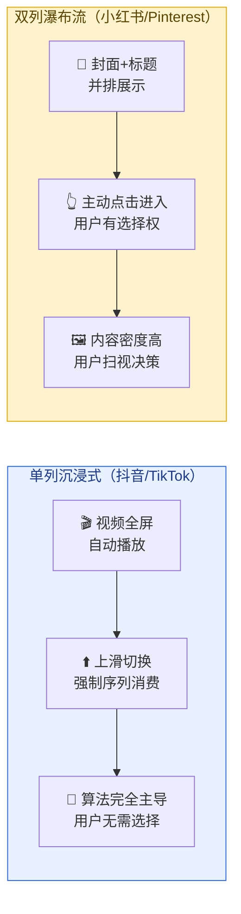
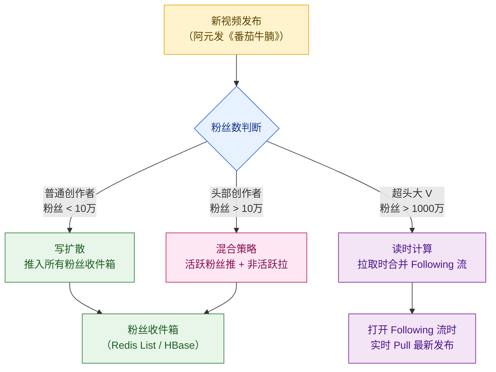
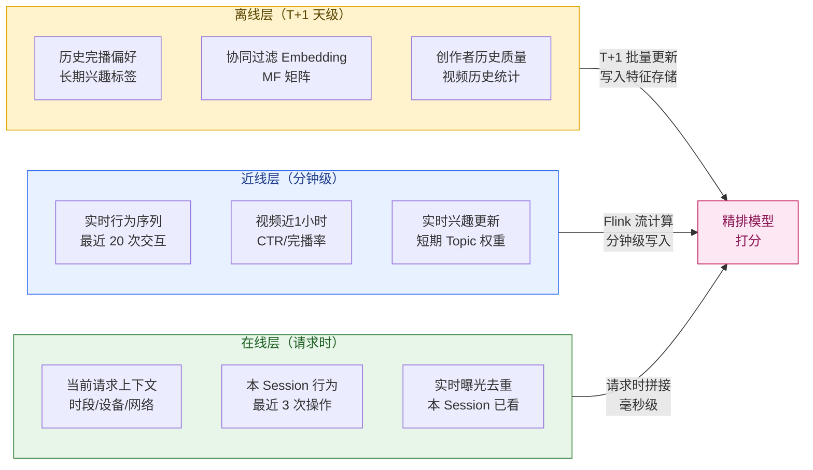
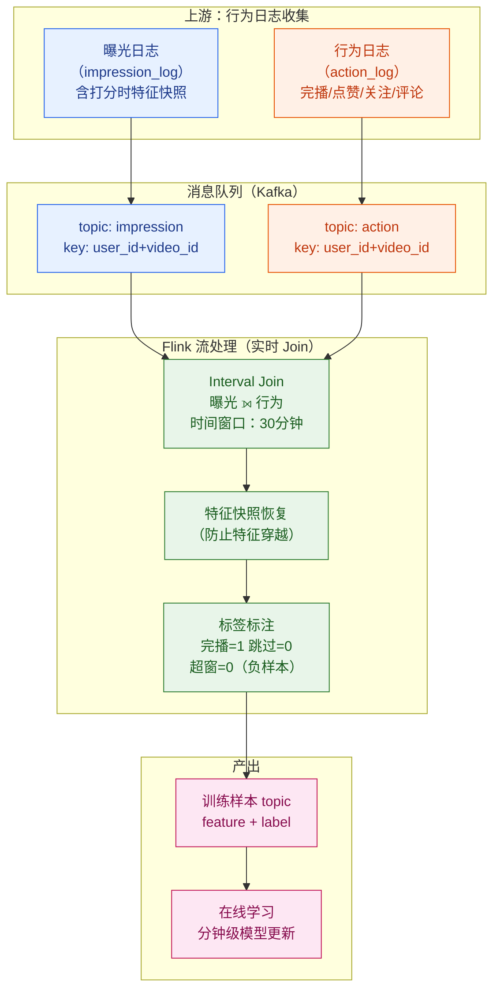
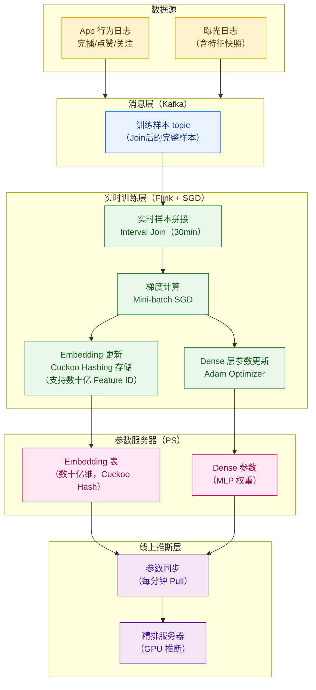
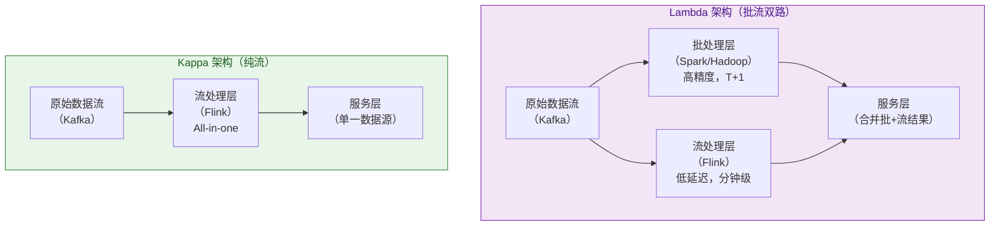
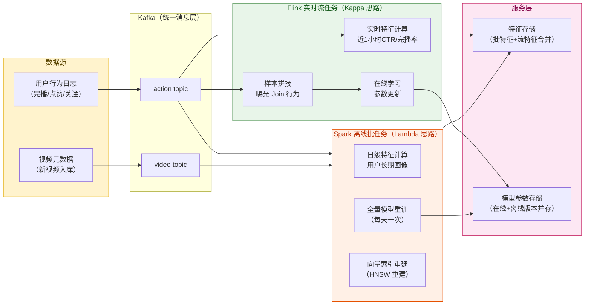
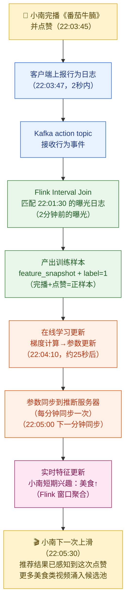

# 第 11 章 · Feed 流与实时化

> **系列定位**：本章是推荐引擎部分（第 7-11 章）的收尾章。前四章讲清楚了「召回 → 粗排 → 精排 → 重排」的候选集生成与排序漏斗，本章解决两个关键问题：①排好序的候选如何以最佳体验下发给用户（Feed 流工程）；②用户的实时行为如何在分钟级回流，让模型越来越懂她（实时化闭环）。读完本章，推荐引擎的完整数据闭环才真正形成。

---

## 本章导读

晚上 10 点，小南躺在床上刷「闪刷」。她划过第 3 条时在《番茄牛腩》上停了 47 秒，点了赞，还关注了阿元。

这一套动作发生在 0.5 秒内：手指上滑、视频全屏播放、点赞按钮高亮。

然而在这 0.5 秒背后，系统同时在做一件更重要的事：**把「小南刚才喜欢了美食视频」这个信号，在分钟级内回流到推荐模型**——让她下一刷的第一条，就已经悄悄换成了更符合口味的内容。

这就是本章的主题：**Feed 流如何下发，行为信号如何实时化，模型如何分钟级自我进化**。

本章主要内容：

1. **沉浸式单列 Feed 的特征** —— 与双列瀑布流的核心差异
2. **Feed 下发模式：推拉对比** —— For You 流 vs Following 流的架构选择
3. **滑动预取（Prefetch）** —— 客户端与服务端的协同预取机制
4. **分页与会话管理** —— 游标、去重、刷新策略
5. **实时特征体系** —— 行为序列、实时统计、特征时效分级
6. **实时样本拼接** —— 曝光日志与行为标签的低延迟 Join
7. **在线学习（Online Learning）** —— TikTok Monolith 架构深度解析
8. **流处理架构：Lambda vs Kappa** —— 架构取舍与 Flink/Spark 混合方案
9. **实时化的三大挑战** —— 归因时效、特征拼接、训练稳定性
10. **常见易错点** —— 工程落地的坑与防御策略

---

## 11.1 沉浸式单列 Feed：一种全新的消费范式

### 11.1.1 什么是沉浸式单列 Feed

「闪刷」的首页 Feed 是典型的**沉浸式单列（Immersive Single-Column）**布局：每次屏幕上只展示**一条**视频，全屏占满，无界面干扰，用户通过上滑切换下一条。

这种形态与早期的双列瀑布流（Pinterest 风格，小红书早期）有根本性差异：



### 11.1.2 单列与双列的核心差异对比

| 维度 | 单列沉浸式（抖音/TikTok）| 双列瀑布流（早期小红书）|
|------|------------------------|----------------------|
| **信息密度** | 极低，每次一条 | 高，一屏可见 8-12 条 |
| **用户主动性** | 低，被动接受算法推送 | 高，主动扫视选择点击 |
| **算法依赖** | 极强，推荐决定一切 | 中等，封面吸引力也重要 |
| **完播信号** | 天然强（全屏强制播放）| 弱（点进去才有播放行为）|
| **停留时长** | 更长（难以分心）| 较短 |
| **冷启动压力** | 极大（第一条必须准确）| 较小（用户可以跳过）|
| **多样性感知** | 低（感觉"刷来刷去都一样"）| 高（一眼看到多个话题）|
| **CTR 定义** | 完播率/点赞率更关键 | 点击率（进详情）更关键 |

### 11.1.3 单列 Feed 对推荐系统的特殊要求

单列沉浸式 Feed 让推荐系统承受了前所未有的压力：

- **序列性**：用户是序列消费，第 N 条和第 N+1 条之间的连贯性/多样性都需要考量（重排的 DPP，详见第 10 章）
- **强反馈信号**：完播率、播放时长、静音率都是高质量行为信号，无需用户主动点击
- **即时感知**：用户会立刻感知到「算法越来越懂我」或「越来越不懂我」，模型的实时性极为关键
- **无退出成本**：上滑太容易，一旦推错一条，用户可能直接关 App

---

## 11.2 Feed 下发模式：推拉架构选择

### 11.2.1 两种 Feed 的本质差异

「闪刷」有两种主要 Feed：

- **For You（推荐流）**：算法从全库挑选最合适的内容，这是沉浸式 Feed 的主体
- **Following（关注流）**：只展示用户关注的创作者发布的内容

两者的下发架构有根本性差异，源于一个核心矛盾：

> **推荐流需要实时个性化计算（延迟敏感），关注流需要服务海量粉丝的写扩散（写吞吐敏感）。**

### 11.2.2 推荐流（For You）：拉模式

推荐流采用**拉模式（Pull-Based）**：用户每次上滑请求 Feed 时，服务端**实时**（或从预计算缓存中）取回一批候选。

```mermaid
sequenceDiagram
    participant Client as 客户端（小南的手机）
    participant FeedSvc as Feed 服务
    participant RankCache as 预计算缓存<br/>（Redis）
    participant RecEngine as 推荐引擎<br/>（召回→排序→重排）
    participant FeatureStore as 实时特征存储

    Client->>FeedSvc: 上滑请求 Feed<br/>（session_id, cursor, user_id）
    FeedSvc->>RankCache: 查询预计算候选<br/>（key: user_id:session）
    alt 缓存命中
        RankCache-->>FeedSvc: 返回预排好的候选列表
    else 缓存未命中
        FeedSvc->>FeatureStore: 获取实时特征
        FeedSvc->>RecEngine: 触发实时召回+排序
        RecEngine-->>FeedSvc: 返回排序结果
        FeedSvc->>RankCache: 写入缓存（TTL=5min）
    end
    FeedSvc-->>Client: 返回一批视频（5-10条）

    style Client fill:#fff3cd,stroke:#e0a800,color:#5a4500
    style FeedSvc fill:#e7f1ff,stroke:#2563eb,color:#1e3a8a
    style RankCache fill:#e8f5e9,stroke:#2e7d32,color:#1b5e20
    style RecEngine fill:#fde7f3,stroke:#c2185b,color:#880e4f
    style FeatureStore fill:#f3e5f5,stroke:#7b1fa2,color:#4a148c
```

**关键设计点**：
- 服务端提前异步预计算下一批候选，写入 Redis，用户上滑时直接取，大幅降低 P99 延迟
- 每次请求返回**一批**（5-10 条）而非一条，减少请求次数，利用预取机制（详见 11.3 节）

### 11.2.3 关注流（Following）：写扩散（推模式）

关注流采用**写扩散（Fan-out on Write）**：创作者发布新视频时，系统将这条视频的 ID **主动推送**到所有粉丝的收件箱（Inbox）。用户打开关注流时，直接从自己的收件箱读取。

> **注意**：关注流的读写扩散设计是第 12 章（互动与社交系统）的重点内容，本节只做对比说明，不展开实现细节。

### 11.2.4 推拉模式对比表

| 维度 | 推荐流（拉模式）| 关注流（写扩散/推模式）|
|------|--------------|---------------------|
| **计算时机** | 读时计算（拉取时触发）| 写时扩散（发布时推送）|
| **个性化程度** | 极强（实时个性化）| 弱（只按时序排列）|
| **适用场景** | 算法推荐，For You | 关注关系，Following |
| **写放大** | 无 | 头部创作者一条视频→扩散百万次 |
| **读延迟** | 低（命中缓存时 <10ms）| 极低（直接读收件箱）|
| **实时性** | 强（模型随时可更新）| 中等（新发布需要扩散延迟）|
| **存储成本** | 低（不存每人的推荐结果）| 高（每个粉丝一条收件箱记录）|
| **大 V 问题** | 无 | 千万粉丝写扩散极慢（需特殊处理）|

### 11.2.5 混合策略：推拉结合

实际系统通常采用**推拉混合**：



---

## 11.3 滑动预取（Prefetch）：让 Feed 永不卡顿

### 11.3.1 为什么需要预取

每次上滑都实时触发推荐引擎（召回 + 粗排 + 精排），P99 延迟在 100-200ms 量级。对于沉浸式 Feed，这会导致明显的「转场卡顿」——用户上滑后等待黑屏，体验极差。

**预取（Prefetch）**的思路：在用户还在看当前视频时，就悄悄把接下来几条准备好。

### 11.3.2 客户端与服务端协同预取

```mermaid
sequenceDiagram
    participant User as 小南（用户）
    participant Client as 客户端播放器
    participant FeedSvc as Feed 服务
    participant Cache as Redis 预计算缓存

    Note over User,Cache: 阶段1：首次加载，请求第一批

    User->>Client: 打开「闪刷」
    Client->>FeedSvc: 请求第一批 Feed（batch=8条）
    FeedSvc->>Cache: 预计算 or 取缓存
    Cache-->>FeedSvc: 返回候选列表
    FeedSvc-->>Client: 返回视频列表[V1..V8]
    Client->>Client: 开始播放 V1<br/>后台预加载 V2、V3 的封面+首帧

    Note over User,Cache: 阶段2：滑到60-70%触发预取

    User->>Client: 上滑到 V3<br/>（已消费 3/8=37%）
    Client->>Client: 检测：剩余 5 条<br/>触发预取阈值（≤5条）
    Client->>FeedSvc: 预取请求（session_id, cursor=after_V8）
    FeedSvc->>Cache: 异步获取下一批
    Cache-->>FeedSvc: 返回[V9..V16]
    FeedSvc-->>Client: 返回下一批（后台静默完成）

    Note over User,Cache: 阶段3：用户无感上滑

    User->>Client: 上滑到 V7、V8、V9...
    Client->>Client: 播放 V9（已预取）<br/>体验流畅无等待

    style User fill:#fff3cd,stroke:#e0a800,color:#5a4500
    style Client fill:#e7f1ff,stroke:#2563eb,color:#1e3a8a
    style FeedSvc fill:#e8f5e9,stroke:#2e7d32,color:#1b5e20
    style Cache fill:#f3e5f5,stroke:#7b1fa2,color:#4a148c
```

### 11.3.3 动态预取数量：感知网络质量

**固定预取数量是一个常见错误**。网络好时预取少了，用户可能看完缓冲区就卡住；网络差时预取太多，浪费有限带宽甚至加速耗电。

正确做法是**动态感知网络质量调整预取数量**：

```python
# 动态预取策略（客户端侧逻辑）
class PrefetchStrategy:
    """
    根据网络状态动态决定预取数量
    平衡「卡顿风险」与「带宽浪费」
    """

    # 网络带宽阈值（Mbps）
    NETWORK_THRESHOLDS = {
        "wifi_good":   10.0,  # WiFi 良好
        "4g_good":      5.0,  # 4G 良好
        "4g_weak":      2.0,  # 4G 较弱
        "3g_or_below":  1.0,  # 3G 及以下
    }

    # 对应预取条数（服务端候选）
    PREFETCH_COUNT = {
        "wifi_good":   8,   # 多预取，充裕缓冲区
        "4g_good":     5,   # 标准预取
        "4g_weak":     3,   # 少取，减少带宽压力
        "3g_or_below": 2,   # 最小预取，防止卡顿加剧
    }

    # 触发预取的剩余条数阈值
    TRIGGER_REMAINING = 4   # 剩余 ≤ 4 条时预取

    def get_prefetch_count(self, bandwidth_mbps: float) -> int:
        """根据当前带宽返回应预取的条数"""
        if bandwidth_mbps >= self.NETWORK_THRESHOLDS["wifi_good"]:
            return self.PREFETCH_COUNT["wifi_good"]
        elif bandwidth_mbps >= self.NETWORK_THRESHOLDS["4g_good"]:
            return self.PREFETCH_COUNT["4g_good"]
        elif bandwidth_mbps >= self.NETWORK_THRESHOLDS["4g_weak"]:
            return self.PREFETCH_COUNT["4g_weak"]
        else:
            return self.PREFETCH_COUNT["3g_or_below"]

    def should_trigger_prefetch(self, remaining_count: int) -> bool:
        """判断是否需要触发预取"""
        return remaining_count <= self.TRIGGER_REMAINING
```

### 11.3.4 预取的关键权衡

| 预取策略 | 优点 | 缺点 |
|---------|------|------|
| **预取太多（固定 10 条）** | 缓冲区充裕，不会卡顿 | 浪费带宽；用户可能反悔不刷这些；服务端计算浪费 |
| **预取太少（固定 2 条）** | 带宽节省 | 用户上滑过快时仍会卡顿 |
| **动态感知网络** | 最优平衡点 | 实现复杂，需客户端实时测速 |
| **服务端预计算 + 客户端预取协同** | 延迟最低 | 预计算结果可能因实时特征更新而过期 |

---

## 11.4 分页与会话管理

### 11.4.1 Feed Session：一次刷视频的生命周期

每次用户打开 App 开始刷视频，系统创建一个 **Feed Session**。Session 贯穿整个刷视频过程，承担以下职责：

- **去重游标（Dedup Cursor）**：记录已下发的视频 ID（Bloom Filter），防止同一次 Session 内重复出现
- **上下文传递**：前几条视频的行为（完播/跳过），影响后续召回和排序的实时特征
- **分页状态**：记录当前 Page Token，服务端知道从哪里继续取

```python
# Feed Session 核心数据结构（服务端存储在 Redis）
class FeedSession:
    session_id: str           # UUID，每次打开 App 生成
    user_id: str
    created_at: int           # Unix timestamp
    last_active_at: int

    # 去重：已下发视频集合（使用 Redis Bloom Filter 或 Set）
    delivered_video_ids: Set[str]

    # 分页游标：记录当前批次的末尾位置
    page_cursor: str          # 对排序引擎透明的 token

    # 实时上下文：最近 N 次行为（影响下一批个性化）
    recent_actions: List[dict]  # [{"video_id": "v1", "action": "complete", "ts": 1234}]

    # Session 统计
    total_delivered: int      # 本次 Session 已下发条数
    refresh_count: int        # 手动刷新次数（下拉刷新）
```

### 11.4.2 下拉刷新 vs 上滑加载

| 操作 | 触发场景 | 系统行为 |
|------|---------|---------|
| **上滑加载（Infinite Scroll）** | 正常消费，主流场景 | 同 Session 内继续取下一批，保留去重记录 |
| **下拉刷新（Pull to Refresh）** | 用户想看新内容 | 清空 Session 缓存，重新从头计算，一般创建新 Session |
| **切换 Tab 回 For You** | 用户去看了其他模块再回来 | 通常保留 Session（不刷新），避免丢失滚动位置 |
| **后台一段时间（>30分钟）再回来** | App 被切换后台 | 清空 Session，触发新一轮推荐计算（行为信号已更新）|

### 11.4.3 去重策略：Bloom Filter

视频库有 50 亿条，一次 Session 可能下发 200-500 条，需要高效去重。使用 **Redis Bloom Filter**：

```python
# Redis Bloom Filter 去重（使用 RedisBloom 模块）
import redis

class FeedDeduplicator:
    """
    基于 Bloom Filter 的 Feed 去重
    误判率：0.1%（千分之一的概率把未看过的视频误判为看过）
    容量：每个 Session 最多 1000 条（足够一次刷视频）
    """

    def __init__(self, redis_client: redis.Redis):
        self.r = redis_client
        self.ERROR_RATE = 0.001   # 误判率 0.1%
        self.CAPACITY = 1000      # 每 Session 容量

    def init_session(self, session_id: str) -> None:
        """初始化 Session 的 Bloom Filter"""
        key = f"feed_dedup:{session_id}"
        self.r.execute_command(
            "BF.RESERVE", key,
            self.ERROR_RATE, self.CAPACITY
        )
        self.r.expire(key, 3600 * 6)  # 6小时 TTL

    def mark_delivered(self, session_id: str, video_ids: list) -> None:
        """标记视频已下发"""
        key = f"feed_dedup:{session_id}"
        pipeline = self.r.pipeline()
        for vid in video_ids:
            pipeline.execute_command("BF.ADD", key, vid)
        pipeline.execute()

    def filter_seen(self, session_id: str, candidates: list) -> list:
        """过滤已看过的视频（排除已下发）"""
        key = f"feed_dedup:{session_id}"
        pipeline = self.r.pipeline()
        for vid in candidates:
            pipeline.execute_command("BF.EXISTS", key, vid)
        results = pipeline.execute()
        # 保留未被 Bloom Filter 命中的（即未下发过的）
        return [v for v, seen in zip(candidates, results) if not seen]
```

---

## 11.5 实时特征体系：让模型即时感知用户变化

### 11.5.1 为什么实时特征如此重要

离线特征（如用户画像、历史偏好）可以描述用户「长期是什么人」，但无法捕捉「此刻在想什么」。

**用户兴趣会即时漂移（Immediate Drift）**：

> 小南午饭时刷到一只柴犬，连续看了 10 条萌宠视频。她的长期画像是「美食爱好者」，但此刻她的兴趣已经漂到了宠物。如果推荐系统仍然按历史画像推美食，她会立刻刷走——完播率暴跌，留存流失。

实时特征的价值就在于捕捉这种「当下时刻」的兴趣信号。

### 11.5.2 实时特征分类

**1. 用户实时行为序列（User Real-time Behavior Sequence）**

最近 N（通常 N=20-50）次交互的完整序列：

```
小南最近行为序列（过去30分钟）：
[
  {"video_id": "v_dog_1",  "action": "complete",  "ts": 10:15},
  {"video_id": "v_dog_2",  "action": "like",       "ts": 10:16},
  {"video_id": "v_dog_3",  "action": "complete",   "ts": 10:18},
  {"video_id": "v_food_4", "action": "skip_3s",    "ts": 10:19},  ← 跳过了美食
  {"video_id": "v_dog_5",  "action": "share",      "ts": 10:20},
  ...
]
```

这个序列会直接送入精排模型（DIN/DIEN，第 9 章），让模型知道「小南此刻正在萌宠兴趣高峰期」。

**2. 视频实时统计特征（Video Real-time Stats）**

视频近 1 小时的实时统计，区别于离线天级统计：

| 特征 | 计算窗口 | 用途 |
|------|---------|------|
| `video_ctr_1h` | 近 1 小时点击率 | 检测热点爆发，快速提升新视频流量 |
| `video_complete_rate_1h` | 近 1 小时完播率 | 比离线完播率更能反映当前内容质量 |
| `video_like_rate_10min` | 近 10 分钟点赞率 | 极短窗口，检测病毒式传播 |
| `video_skip_rate_1h` | 近 1 小时跳过率 | 内容衰减信号（高峰过后用户开始跳过）|
| `video_impression_1h` | 近 1 小时曝光量 | 流量分配是否过度集中 |

**3. 实时画像更新（Real-time User Profile Update）**

行为发生后，用户画像中的「短期兴趣」标签分钟级更新：

```
小南的兴趣画像（实时更新后）：
长期兴趣（天级）：美食:0.85, 旅行:0.72, 萌宠:0.60
短期兴趣（分钟级）：萌宠:0.95, 美食:0.20, 旅行:0.50  ← 实时飙升
```

### 11.5.3 特征时效分级



**三层特征的价值与成本对比**：

| 特征层 | 时效 | 计算成本 | 存储成本 | 覆盖的场景 |
|-------|------|---------|---------|-----------|
| **离线** | T+1（天级）| 低（批计算）| 中（特征存储）| 长期偏好、稳定画像 |
| **近线** | 分钟级 | 中（Flink 流）| 中高（实时 KV）| 兴趣漂移、热点视频 |
| **在线** | 毫秒级 | 低（请求时拼接）| 低（Session 内）| 当次上下文、去重 |

---

## 11.6 实时样本拼接：行为日志的 Join 难题

### 11.6.1 什么是样本拼接

推荐模型的训练需要两类数据：
- **曝光（Impression）**：这条视频在 T 时刻被推给了小南（Feature 快照）
- **行为标签（Label）**：小南看完了吗？点赞了吗？（完播=1，跳过=0）

**样本拼接（Sample Join）**就是把这两类数据 Join 在一起，产出训练样本：

```
<曝光 + 打分时刻特征快照> JOIN <行为标签> → 训练样本
```

### 11.6.2 样本拼接的核心挑战：归因等待窗口

标签的产生有延迟：

- 用户看到视频（曝光）：`T`
- 视频播放完毕：`T + 视频时长`（1-3 分钟）
- 点赞/评论：`T + 几秒到几分钟`
- 关注创作者：可能在 `T + 几天后`（长周期反馈）

如果等标签收集完再训练，模型更新会严重滞后。如果太早截断，很多正样本（后来点赞的行为）会被误标为负样本。

**归因等待窗口（Label Attribution Window）**：等多久再把样本标记为「最终结果」？

| 行为类型 | 传统窗口 | 优化目标 | 已有实践 |
|---------|---------|---------|---------|
| 完播 | 视频时长（即时）| 即时可得 | 天然实时 |
| 点赞 | 30 分钟 | 压到 5 分钟 | TikTok 已优化 |
| 关注 | 24 小时 | 1 小时 | 长周期反馈 |
| 评论 | 30 分钟 | 10 分钟 | — |

**TikTok 真实案例**：曾将点赞的归因等待窗口从 30 分钟压到分钟级，模型的实时性显著提升，用户留存正向改善。

### 11.6.3 实时样本拼接数据流



### 11.6.4 特征穿越（Feature Leakage）问题

**特征穿越**是实时样本拼接中最容易踩的坑：

> **场景**：视频 V 在 T 时刻被推给小南，打分时用了「近 1 小时完播率」= 60%。但到了 T+2 小时训练时，这个特征已更新为 85%（小南自己的完播也贡献了这个数字）。

如果训练时直接从特征存储读「当前值」，模型学到的是**未来数据**，在真实推断时这个特征是不可得的。这会导致离线 AUC 很好但线上效果差（**离线在线不一致，Online-Offline Gap**）。

**解决方案：特征快照（Feature Snapshot）**

```python
# 曝光时记录特征快照（打分时刻的特征值）
class ImpressionLogger:
    """
    曝光时序列化「打分时刻特征快照」
    防止训练时读到「未来」的特征值（穿越）
    """

    def log_impression(
        self,
        user_id: str,
        video_id: str,
        score: float,
        features: dict,       # 打分时用到的所有特征，原始值
        kafka_producer
    ):
        impression = {
            "user_id": user_id,
            "video_id": video_id,
            "score": score,
            "timestamp": time.time(),
            # 关键：把打分时的特征值序列化进日志
            # 训练时用这里的值，不去特征存储重新读
            "feature_snapshot": {
                "user_complete_rate_7d":  features["user_complete_rate_7d"],
                "video_ctr_1h":           features["video_ctr_1h"],      # 快照!
                "video_complete_rate_1h": features["video_complete_rate_1h"],  # 快照!
                "user_topic_weights":     features["user_topic_weights"],
                # ... 其他特征
            }
        }
        kafka_producer.send("impression_log", impression)
```

---

## 11.7 在线学习（Online Learning）：模型分钟级进化

### 11.7.1 为什么需要在线学习

传统的**离线批训练（Offline Batch Training）**流程：

```
收集一天数据 → T+1 批量训练 → 第二天部署新模型
```

问题：**模型永远在追昨天的用户行为**。

- 用户刚刷了 10 条萌宠视频，离线模型还认为她是「美食爱好者」
- 今天爆发的热点视频（如一条病毒式传播的搞笑视频），离线模型要到第二天才能感知
- 新上线的视频创作者，冷启动周期被人为拉长了 24 小时

**在线学习（Online Learning）**的目标：用户产生行为→分钟级更新模型参数→下一刷就能感知到。

### 11.7.2 TikTok Monolith：在线学习的工业级实践

TikTok 在 2022 年发表了 Monolith 论文，详细描述了其在线学习架构。核心思想：

**「无冲突哈希嵌入表 + 实时流训练 + 分钟级参数同步」**



### 11.7.3 Cuckoo Hashing：解决数十亿 Feature ID 的存储难题

传统哈希表在处理数十亿特征 ID（用户 ID + 视频 ID + 标签 ID）时，会出现严重的哈希冲突。TikTok Monolith 使用 **Cuckoo Hashing** 解决这个问题：

**Cuckoo Hashing 核心思想**：
- 每个 key 有两个候选槽位（由两个不同哈希函数计算）
- 插入时，如果某槽位被占，就把占住的 key「踢出」，让它去它的另一个候选槽位
- 最坏情况下，查找保证 O(1)（不超过 2 次内存访问）

```python
# Cuckoo Hashing 简化实现（概念示意）
class CuckooEmbeddingTable:
    """
    Cuckoo Hashing Embedding 表
    用于数十亿规模的 Feature ID → Embedding 映射
    保证 O(1) 查找，避免长链式哈希冲突
    """

    def __init__(self, capacity: int, embed_dim: int = 64):
        self.capacity = capacity
        self.embed_dim = embed_dim
        # 两张哈希表（两个独立哈希函数）
        self.table_a = [None] * capacity
        self.table_b = [None] * capacity
        self.MAX_KICK = 128   # 最大踢出次数，超过则触发 rehash

    def _hash_a(self, key: int) -> int:
        """哈希函数 A"""
        return hash(key * 2654435761) % self.capacity

    def _hash_b(self, key: int) -> int:
        """哈希函数 B（独立于 A）"""
        return hash(key * 2246822519) % self.capacity

    def lookup(self, feature_id: int):
        """O(1) 查找：检查两张表"""
        slot_a = self._hash_a(feature_id)
        if self.table_a[slot_a] and self.table_a[slot_a][0] == feature_id:
            return self.table_a[slot_a][1]  # 命中 A 表

        slot_b = self._hash_b(feature_id)
        if self.table_b[slot_b] and self.table_b[slot_b][0] == feature_id:
            return self.table_b[slot_b][1]  # 命中 B 表

        return None  # 未找到（新 feature，需初始化）
```

**与传统方案对比**：

| 方案 | 查找复杂度 | 冲突处理 | 适用规模 |
|------|---------|---------|---------|
| 链式哈希（拉链法）| O(1) 均摊，O(n) 最坏 | 链表增长，内存不连续 | 亿级 |
| 开放寻址 | O(1) 均摊 | 聚集问题，性能退化 | 千万级 |
| **Cuckoo Hashing** | **O(1) 最坏** | 踢出机制，无链表 | **数十亿级** |

### 11.7.4 在线学习 vs 离线批训练对比

| 维度 | 离线批训练 | 在线学习（Monolith 模式）|
|------|---------|----------------------|
| **模型更新频率** | T+1 天 | 分钟级 |
| **数据来源** | HDFS 历史数据 | Kafka 实时流 |
| **训练框架** | Spark / Hadoop | Flink + 参数服务器 |
| **兴趣漂移感知** | 慢（最多延迟 24h）| 快（分钟级）|
| **热点感知** | 慢 | 快 |
| **工程复杂度** | 低 | 高（参数同步、稳定性保护）|
| **训练稳定性** | 高（数据量大、方差小）| 中（样本量少、波动大）|
| **冷启动加速** | 无明显帮助 | 新视频可分钟级积累正样本 |
| **资源消耗** | 峰值消耗（T+1 批）| 持续消耗（流式）|

### 11.7.5 在线学习的稳定性保护

在线学习最大的风险是**模型抖动（Model Oscillation）**：单次样本对模型参数的影响过大，导致参数急剧变化，线上效果波动。

必须配套的稳定性保护机制：

```python
# 在线学习参数更新（带稳定性保护）
class OnlineLearningUpdater:
    """
    在线学习参数更新器
    核心：梯度裁剪 + 自适应学习率 + 正则化
    """

    def __init__(self, learning_rate=0.001, grad_clip=1.0, l2_reg=1e-5):
        self.lr = learning_rate
        self.grad_clip = grad_clip      # 梯度裁剪阈值
        self.l2_reg = l2_reg            # L2 正则化系数（防止 Embedding 过拟合）
        self.step_count = 0

    def update_embedding(self, embedding: list, gradient: list) -> list:
        """
        更新 Embedding，含梯度裁剪和 L2 正则化
        """
        import math

        # 1. 梯度裁剪（防止梯度爆炸，导致参数突变）
        grad_norm = math.sqrt(sum(g**2 for g in gradient))
        if grad_norm > self.grad_clip:
            scale = self.grad_clip / grad_norm
            gradient = [g * scale for g in gradient]

        # 2. AdaGrad 自适应学习率（让频繁更新的特征学习率自动衰减）
        self.step_count += 1
        adapted_lr = self.lr / math.sqrt(self.step_count + 1e-8)

        # 3. 参数更新（梯度下降 + L2 正则）
        updated = [
            e - adapted_lr * (g + self.l2_reg * e)
            for e, g in zip(embedding, gradient)
        ]
        return updated

    def should_skip_update(self, loss: float, loss_threshold=5.0) -> bool:
        """
        异常 loss 检测：如果单条样本 loss 异常高（数据脏/标签错误）
        则跳过本次更新，防止模型被异常样本带偏
        """
        return loss > loss_threshold
```

---

## 11.8 流处理架构：Lambda vs Kappa

### 11.8.1 两种架构的核心思想

处理「实时流 + 历史批量」这两类数据，业界演化出了两种主流架构：



### 11.8.2 Lambda 架构详解

**Lambda 架构**（Nathan Marz 提出）将计算分为三层：

| 层 | 职责 | 技术 | 延迟 | 精度 |
|---|------|------|------|------|
| **批处理层（Batch Layer）** | 历史全量数据重算，高精度 | Spark, Hadoop | T+1 天级 | 高 |
| **流处理层（Speed Layer）** | 近实时增量计算，低延迟 | Flink, Storm | 分钟级 | 中（近似值）|
| **服务层（Serving Layer）** | 合并批+流结果，响应查询 | HBase, Redis | 毫秒级 | 最终一致 |

**优点**：
- 批处理层保证历史数据精确性（可重算）
- 流处理层保证实时性
- 容错性强：流处理出错，最终由批处理覆盖纠正

**缺点**：
- 维护两套计算逻辑（批+流）成本高，容易出现业务逻辑不一致
- 服务层合并逻辑复杂

### 11.8.3 Kappa 架构详解

**Kappa 架构**（Jay Kreps 提出）激进地去掉了批处理层，**一切用流处理解决**：

- 将历史数据也存储在 Kafka（可回放），需要重算时，用流处理重放历史数据
- 只维护一套流处理逻辑，消除了 Lambda 的双路维护成本

**优点**：架构简单，只有一套逻辑

**缺点**：
- 大规模历史数据的流重算成本极高
- 复杂的批处理任务（如全局 SVD 矩阵分解）流化困难

### 11.8.4 短视频平台的实际选择：Lambda + Kappa 混合

实际工程中，纯 Lambda 或纯 Kappa 都有局限。短视频平台通常采用**混合架构**：



**混合策略**：

| 任务类型 | 选型 | 理由 |
|---------|------|------|
| 实时特征（CTR/完播率）| Flink | 低延迟，分钟级窗口聚合 |
| 实时样本拼接 | Flink Interval Join | 流式 Join，低延迟 |
| 在线学习参数更新 | Flink + PS | 流式梯度计算 |
| 用户长期画像 | Spark | 全量历史数据，T+1 精确计算 |
| 全量模型重训 | Spark | 大规模数据，训练稳定性好 |
| 向量索引重建 | Spark | HNSW/Faiss 索引需全量数据 |

---

## 11.9 实时化的三大工程挑战

### 11.9.1 挑战一：行为归因时效 vs 样本质量的博弈

**矛盾**：
- 归因窗口设得**长**（如 30 分钟）→ 标签质量高，但模型更新滞后 30 分钟
- 归因窗口设得**短**（如 5 分钟）→ 模型更新快，但大量后期发生的点赞被误标为负样本

**工业级解决方案：延迟反馈建模（Delayed Feedback Modeling）**

将样本标记为**两阶段**：

```
阶段1（曝光后5分钟）：产出"早期样本"，标签 = 当前已观测到的行为
  - 已完播 → label=1（完播是即时行为，无延迟）
  - 未观测到点赞 → label_like=0（可能还没点）

阶段2（曝光后30分钟）：产出"最终样本"，标签修正
  - 5分钟后才点赞 → label_like 从0修正为1
  - 修正样本重新进入训练队列（覆盖早期样本）
```

数学建模（参考 Facebookresearch 的 Delayed Feedback with Survival Analysis）：

$$P(\text{conversion at } t_c | \text{click at } t_0) = \lambda \cdot e^{-\lambda(t_c - t_0)}$$

其中 $\lambda$ 为转化速率参数，根据历史数据估计。将延迟分布先验融入训练目标，让模型「知道」某些负样本其实还没到点赞时机。

### 11.9.2 挑战二：前后端日志的低延迟 Join

曝光日志（服务端产生）和行为日志（客户端产生）之间有**天然的时序偏差**：

| 日志类型 | 产生方 | 到达 Kafka 延迟 | 典型延迟 |
|---------|-------|--------------|---------|
| 曝光日志 | 服务端（打分时即刻写）| 极低 | < 1 秒 |
| 行为日志 | 客户端（用户操作后上报）| 中等（网络） | 1-30 秒 |
| 批量日志（离线）| 客户端（汇聚后上报）| 高 | 1-10 分钟 |

**Join 乱序问题**：行为日志晚于曝光日志到达，Flink Interval Join 必须设置合理的等待窗口和水印（Watermark）：

```java
// Flink Interval Join 实现（处理日志乱序问题）
DataStream<TrainingSample> joinedStream = impressionStream
    .keyBy(imp -> imp.userId + "_" + imp.videoId)
    .intervalJoin(
        actionStream.keyBy(act -> act.userId + "_" + act.videoId)
    )
    .between(
        Time.seconds(-5),    // 行为最早可能在曝光前5秒（时钟偏差）
        Time.minutes(30)     // 行为最晚在曝光后30分钟（归因窗口）
    )
    .process(new ProcessJoinFunction<Impression, Action, TrainingSample>() {
        @Override
        public void processElement(
            Impression impression,
            Action action,
            Context ctx,
            Collector<TrainingSample> out
        ) {
            // 使用曝光时的特征快照（不读特征存储）
            TrainingSample sample = TrainingSample.builder()
                .userId(impression.userId)
                .videoId(impression.videoId)
                .features(impression.featureSnapshot)  // 防穿越：用快照
                .label(action.actionType.equals("complete") ? 1 : 0)
                .build();
            out.collect(sample);
        }
    });

// Watermark 策略：允许30秒乱序
WatermarkStrategy<Action> watermarkStrategy =
    WatermarkStrategy
        .<Action>forBoundedOutOfOrderness(Duration.ofSeconds(30))
        .withTimestampAssigner((event, timestamp) -> event.clientTimestamp);
```

### 11.9.3 挑战三：在线学习的训练稳定性

在线学习因为每次训练的样本量小（mini-batch），容易出现以下问题：

| 问题 | 描述 | 后果 |
|------|------|------|
| **梯度爆炸** | 单条异常样本（label 噪声）导致梯度极大 | 参数突变，线上效果瞬时崩溃 |
| **灾难性遗忘** | 实时样本偏向某类内容（如热点爆发），模型过拟合 | 其他内容的打分全面下降 |
| **Embedding 漂移** | 频繁更新的特征 Embedding 持续偏移 | 向量检索（召回）与精排不一致 |
| **参数同步延迟** | PS 同步延迟导致推断侧用旧参数 | 训练和推断的参数版本不一致 |

**综合防御策略**：

```python
class OnlineLearningGuardian:
    """
    在线学习稳定性守护者
    监控训练状态，在检测到异常时自动降级回离线模型
    """

    def __init__(self):
        self.loss_window = []          # 近N步的 loss 历史
        self.LOSS_ALERT_THRESHOLD = 3.0  # loss 突增报警阈值
        self.LOSS_WINDOW_SIZE = 100
        self.ROLLBACK_THRESHOLD = 5.0    # loss 均值超过此值触发回滚

    def check_and_guard(self, current_loss: float) -> str:
        """
        检查训练健康度，返回动作建议
        返回: "continue" / "alert" / "rollback_to_offline"
        """
        self.loss_window.append(current_loss)
        if len(self.loss_window) > self.LOSS_WINDOW_SIZE:
            self.loss_window.pop(0)

        avg_loss = sum(self.loss_window) / len(self.loss_window)

        # 触发回滚条件：均值 loss 持续偏高
        if avg_loss > self.ROLLBACK_THRESHOLD:
            # 切换到离线训练模型（降级保底）
            return "rollback_to_offline"

        # 报警条件：单步 loss 突增（可能是数据问题）
        if current_loss > avg_loss * self.LOSS_ALERT_THRESHOLD:
            return "alert"

        return "continue"
```

---

## 11.10 小南的那次点赞是如何在分钟级改变推荐的

回到本章开头的场景，现在我们可以完整追踪整个链路：



**端到端延迟分解**：

| 阶段 | 延迟 | 关键技术 |
|------|------|---------|
| 行为上报到 Kafka | ~2 秒 | 客户端 TCP 长连接，批量上报 |
| Flink Join 处理 | ~5-10 秒 | Interval Join，30分钟窗口 |
| 样本产出到参数更新 | ~15-30 秒 | Mini-batch SGD，梯度裁剪 |
| 参数同步到推断侧 | ~0-60 秒 | 每分钟 Pull 一次（可配置）|
| 实时特征更新 | ~30-60 秒 | Flink 滑动窗口聚合 |
| **总端到端延迟** | **~1-2 分钟** | — |

---

## 11.11 常见易错点与防御策略

### 11.11.1 预取不感知网络质量

**错误做法**：固定预取 8 条。

**问题**：4G 弱网时，预取 8 条占满带宽，导致当前视频缓冲不足反而卡顿；此外，用户可能上滑只看了 3 条就切 Tab，5 条带宽白费。

**正确做法**：
- 客户端实时测速（SpeedTest），动态调整预取数
- 服务端记录预取利用率（prefetch_hit_rate），反馈给预取策略优化

### 11.11.2 样本特征穿越（Feature Leakage）

**错误做法**：训练时从特征存储读「当前最新特征值」，而不是打分时的快照。

**后果**：离线 AUC 虚高，线上效果远不如离线；因为线上推断时这些「未来特征」不可得。

**正确做法**：曝光时序列化特征快照到 Kafka，训练时从快照恢复，不从特征存储重新读。

### 11.11.3 归因窗口设太长导致模型滞后

**错误做法**：点赞归因窗口设 24 小时（确保所有晚点赞都被捕捉到）。

**问题**：模型的正样本要等 24 小时才能产生，等于离线训练一样没有实时性。

**正确做法**：用两阶段样本（5 分钟早期标签 + 30 分钟修正标签），结合延迟反馈建模。

### 11.11.4 在线学习不做稳定性保护

**错误做法**：直接用实时样本更新参数，不加任何保护。

**问题**：一次数据管道故障（重复样本、标签错误）可能导致模型参数在几分钟内严重偏移，线上完播率和留存崩溃。等报警→人工回滚，损失可能已经很大。

**正确做法**：
- 梯度裁剪（Gradient Clipping）
- 异常 Loss 检测，自动跳过可疑样本
- 在线模型与离线模型并行，Online AUC 下降超阈值自动切换回离线模型

### 11.11.5 关注流大 V 写扩散阻塞

**错误做法**：所有创作者统一写扩散，阿元粉丝 1000 万，一发视频写 1000 万条收件箱记录。

**问题**：写扩散时延过长（可能超过 10 秒），消费者打开关注流时看不到最新内容。

**正确做法**：大 V 改用推拉混合（活跃粉丝预推 + 非活跃拉取），或读时合并（关注流打开时才查询大 V 的最新发布）。

---

## 本章小结

本章完整讲解了 Feed 流工程与实时化闭环的设计：

**Feed 流工程**：
- 沉浸式单列 Feed 与双列瀑布流的核心差异，以及对推荐系统的特殊要求
- For You 推荐流用拉模式（预计算缓存），Following 关注流用写扩散（推模式），大 V 混合处理
- 滑动预取动态感知网络质量，服务端预计算 + 客户端协同，彻底消除 Feed 卡顿
- Feed Session 管理：Bloom Filter 去重游标、下拉刷新策略、分页游标

**实时化闭环**：
- 特征时效三级：离线（天级）→ 近线（分钟级）→ 在线（请求时），层层叠加提升个性化
- 样本拼接：曝光日志 + 行为标签的 Flink Interval Join，特征快照防穿越
- TikTok Monolith 在线学习：Kafka → Flink 实时流 → Cuckoo Hashing Embedding → 分钟级参数同步
- 流处理架构：Flink（流）+ Spark（批）混合，实时特征走 Kappa，历史特征走 Lambda

**三大工程挑战**：
- 归因时效：两阶段样本 + 延迟反馈建模，从 30 分钟压到分钟级
- 特征拼接：Flink Watermark 处理乱序，特征快照防穿越
- 训练稳定性：梯度裁剪 + 异常检测 + 在线/离线双模型降级保底

**数据流闭环**：小南点赞《番茄牛腩》→ 行为日志 → Kafka → Flink Join → 训练样本 → 在线学习更新 → 参数同步 → 下一刷感知到兴趣变化，**全程约 1-2 分钟**。

---

至此，推荐系统全链路（第 7-11 章）已完整讲述完毕：
- 第 7 章：推荐漏斗总体架构
- 第 8 章：多路召回与向量检索
- 第 9 章：粗排轻量双塔与精排多目标建模
- 第 10 章：重排多样性与冷启动
- **第 11 章（本章）**：Feed 流工程与实时化闭环

推荐系统帮助小南刷到了《番茄牛腩》，她完播、点赞，还关注了阿元。这些互动行为本身，又构成了另一个系统的核心——**点赞如何被计数（亿级计数系统），关注关系如何存储与扩散，评论如何组织，用户之间如何互动**。

这一切，将在第 12 章**互动与社交系统**中展开。

---

## 参考来源

1. **TikTok Monolith: Real Time Recommendation at Scale with Hash Tables** (2022)  
   https://dl.acm.org/doi/10.1145/3523227.3547380  
   TikTok 官方论文，详细描述 Cuckoo Hashing Embedding + 实时流训练架构

2. **Delayed Feedback in Machine Learning** — Facebook Research (2014)  
   https://research.facebook.com/publications/practical-lessons-from-predicting-clicks-on-ads-at-facebook/  
   延迟反馈问题的经典处理方案，含 Survival Analysis 建模

3. **Real-time Personalization using Embeddings for Search Ranking** — Airbnb Engineering  
   https://medium.com/airbnb-engineering/real-time-personalization-using-embeddings-for-search-ranking-at-airbnb-c10fbf0d9ae6  
   实时 Embedding 更新的工业实践

4. **The Lambda Architecture** — Nathan Marz  
   https://nathanmarz.com/blog/how-to-beat-the-cap-theorem.html  
   Lambda 架构原始提出，批+流双路经典设计

5. **Questioning the Lambda Architecture** — Jay Kreps (Kappa Architecture)  
   https://www.oreilly.com/radar/questioning-the-lambda-architecture/  
   Kappa 架构的提出，质疑 Lambda 双路维护成本

6. **小红书推荐系统架构演进** — 小红书技术博客  
   https://mp.weixin.qq.com/s/GWqj1VBUVL1tGHJXnYIHgQ  
   小红书精排/召回/索引分钟级更新的工程实践

7. **Flink: Stream and Batch Processing in a Single Engine** — Apache Flink Paper  
   https://dl.acm.org/doi/10.1145/2723372.2742788  
   Flink Interval Join、Watermark 机制的理论基础

8. **Feature Stores for Machine Learning** — Feast / Tecton Engineering Blog  
   https://www.tecton.ai/blog/what-is-a-feature-store/  
   特征存储（三层：离线/近线/在线）与特征快照防穿越的工程设计
