# 第 12 章 · 互动与社交系统

> **所属系列**：《短视频平台系统设计 · 全景教程》第四部分 · 互动、社交与直播
> **上一章**：[第 11 章 · Feed 流与实时化](./11-Feed流与实时化.md)
> **下一章**：[第 13 章 · 直播系统](./13-直播系统.md)

---

## 本章导读

小南刷完《番茄牛腩》的最后一帧，手指停了一下——然后点了个赞，收藏到「周末做饭」合集，打了条评论「看起来好吃！」，最后点进阿元的主页关注了他。

这四个动作，每天在「闪刷」上发生**数十亿次**。当《番茄牛腩》意外爆火，点赞从几百冲到一千万，计数器在几分钟内面临每秒数万次的写入——一个设计不当的计数系统在这一刻会原地崩溃。

互动与社交系统是短视频平台**高并发密度最高的子系统**。它的挑战不是"功能复杂"，而是**规模与速度**：

- **高频写**：全平台每秒点赞写入峰值可达百万次
- **读放大**：热门视频的点赞数被数百万用户同时读取
- **最终一致**：计数精确到个位数不重要，但"真实感"不能丢
- **热点集中**：爆款视频一个 Redis key 扛所有写压力

本章将以小南给《番茄牛腩》互动的全过程为主线，依次深入：

1. **互动系统全景**——五大互动行为的共性与差异
2. **点赞与计数系统**——三层架构 + 热点打散 + 可靠性兜底（本章重心）
3. **关注关系：读写扩散**——Push vs Pull vs Hybrid + Twitter 真实案例（本章重心）
4. **评论系统**——楼中楼存储、热评排序公式、B站 10 万 QPS 中台
5. **通知与私信**——收件箱模型、推拉混合、消息保序
6. **关注页 Feed vs 推荐页 Feed**——数据来源、架构、延迟对比

> **核心三章提示**：本章（互动与读写扩散）与第 6 章（秒开播放）、第 9 章（多目标精排）并列为全篇核心三章，是高并发主线的浓缩，建议反复研读。

---

## 12.1 互动系统全景：五大行为的共性与差异

### 12.1.1 五大互动行为

小南对《番茄牛腩》的四个动作，加上转发，构成了短视频平台互动系统的五大支柱：

| 互动类型 | 中文 | 操作语义 | 写频率 | 读模式 | 一致性要求 |
|---------|------|---------|-------|--------|-----------|
| Like | 点赞 | 幂等开关（可取消）| 极高（峰值百万/s）| 高读（显示计数）| 弱一致，允许秒级延迟 |
| Collect | 收藏 | 归入用户合集 | 高 | 中读（个人主页）| 弱一致 |
| Comment | 评论 | 富文本写入，支持回复 | 中（万级/s）| 高读（评论列表）| 强一致（自己发的要立见）|
| Share | 转发 | 分享到站内/站外 | 中 | 低读（仅显示计数）| 弱一致 |
| Follow | 关注 | 建立社交图边 | 中 | 极高读（Feed 推拉）| 弱一致 |

### 12.1.2 共性技术挑战

尽管五种行为各有特点，但它们共享同一组工程挑战：

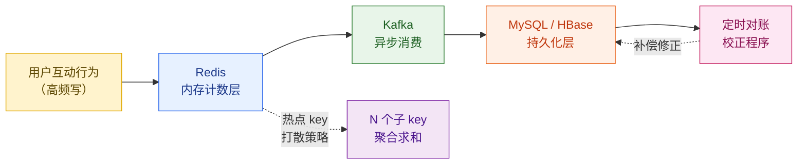

**四大共性问题**：

1. **热点集中**：头部 1% 的视频承载 90% 的互动写入，单 Redis key 轻松突破每秒 10 万次写
2. **读放大**：一条爆款视频的点赞数被同时读取的用户可达百万，读 QPS 远超写 QPS
3. **最终一致足够**：用户看到的赞数"差一点"没关系，但"隔几分钟显示旧值"勉强可接受
4. **计数丢失代价**：Redis 宕机导致内存计数清零，如果没有持久化，重启后从数据库重建，可能漏算高峰期的上万次写入

### 12.1.3 本章架构总览

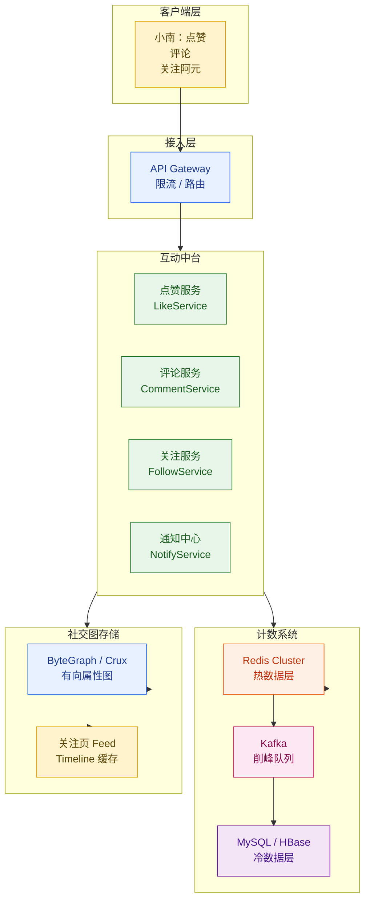

---

## 12.2 点赞与计数系统——三层架构

### 12.2.1 为什么计数系统是难题

看起来"给一个数字加一"是互联网系统里最简单的操作。但当这个操作的规模是：

- 「闪刷」平台每秒峰值点赞写入：**50 万次**
- 《番茄牛腩》爆火时单视频点赞冲刺：**每秒 3 万次 INCR**
- 全量视频点赞总数：**千亿级**（快手实测累计 3500 亿赞）

此时，直接写 MySQL 的方案会在几秒内把数据库 CPU 打满；单个 Redis key 的写入能力在理论上每秒十万次左右，但热点 key 会打穿 Redis Cluster 的特定节点（单 slot 单线程）。

### 12.2.2 三层架构设计

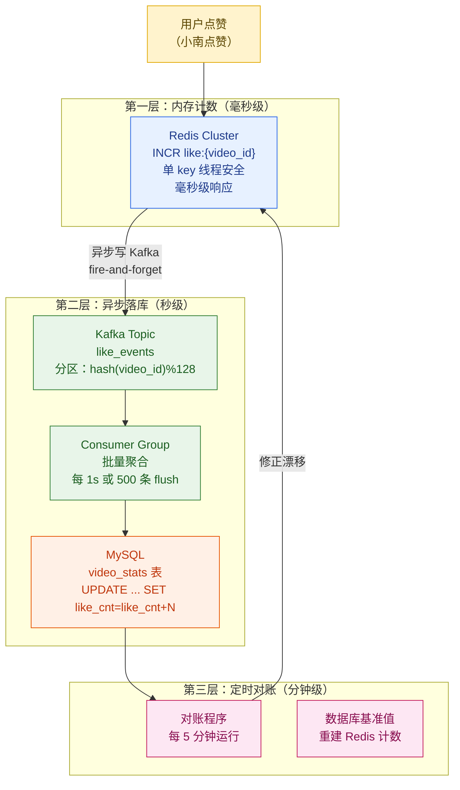

**三层职责分工**：

| 层次 | 技术 | 响应延迟 | 职责 |
|-----|------|---------|------|
| 第一层（热数据）| Redis INCR | < 1ms | 对外提供最新计数，扛高并发写 |
| 第二层（异步落库）| Kafka + Consumer | 1~5s | 批量合并写 DB，削平写峰值 |
| 第三层（对账校正）| 定时任务 | 分钟级 | 修正 Redis 与 DB 的漂移，处理宕机恢复 |

### 12.2.3 第一层：Redis INCR 实现

Redis 的 `INCR` 命令是原子操作，单线程执行，天然线程安全，不需要加锁。

```java
/**
 * 点赞服务核心实现
 * 第一层：Redis INCR + 异步发送 Kafka
 */
@Service
public class LikeService {

    private final RedisTemplate<String, String> redisTemplate;
    private final KafkaTemplate<String, LikeEvent> kafkaTemplate;

    // Redis key 格式：like:{video_id}
    private static final String LIKE_KEY_PREFIX = "like:";
    // 点赞关系 key 格式：liked:{user_id}:{video_id}（用于判断是否已赞）
    private static final String USER_LIKED_PREFIX = "liked:";

    /**
     * 小南给《番茄牛腩》点赞
     * @param userId  用户ID（小南）
     * @param videoId 视频ID（番茄牛腩）
     */
    public LikeResult like(String userId, String videoId) {
        String userLikedKey = USER_LIKED_PREFIX + userId + ":" + videoId;
        String likeCountKey = LIKE_KEY_PREFIX + videoId;

        // 使用 Lua 脚本保证原子性：判断是否已赞 + INCR 合并为一个原子操作
        String luaScript =
            "local already = redis.call('SETNX', KEYS[1], 1) " +
            "if already == 0 then return 0 end " +           // 已经点过赞，返回0
            "redis.call('EXPIRE', KEYS[1], 86400 * 30) " +   // 30天过期
            "local cnt = redis.call('INCR', KEYS[2]) " +     // 计数+1
            "return cnt";

        Long newCount = redisTemplate.execute(
            new DefaultRedisScript<>(luaScript, Long.class),
            Arrays.asList(userLikedKey, likeCountKey)
        );

        if (newCount == null || newCount == 0) {
            return LikeResult.ALREADY_LIKED; // 幂等：重复点赞不处理
        }

        // 异步发送 Kafka，不阻塞响应（fire-and-forget）
        kafkaTemplate.send("like_events", videoId,
            LikeEvent.of(userId, videoId, LikeAction.LIKE, System.currentTimeMillis()));

        return LikeResult.success(newCount);
    }

    /**
     * 取消点赞
     */
    public LikeResult unlike(String userId, String videoId) {
        String userLikedKey = USER_LIKED_PREFIX + userId + ":" + videoId;
        String likeCountKey = LIKE_KEY_PREFIX + videoId;

        String luaScript =
            "local existed = redis.call('DEL', KEYS[1]) " +
            "if existed == 0 then return -1 end " +          // 没赞过，返回-1
            "local cnt = redis.call('DECR', KEYS[2]) " +
            "if cnt < 0 then redis.call('SET', KEYS[2], 0) end " + // 防止负数
            "return cnt";

        Long newCount = redisTemplate.execute(
            new DefaultRedisScript<>(luaScript, Long.class),
            Arrays.asList(userLikedKey, likeCountKey)
        );

        if (newCount == null || newCount == -1) {
            return LikeResult.NOT_LIKED;
        }

        kafkaTemplate.send("like_events", videoId,
            LikeEvent.of(userId, videoId, LikeAction.UNLIKE, System.currentTimeMillis()));

        return LikeResult.success(newCount);
    }
}
```

### 12.2.4 第二层：Kafka 异步批量落库

```java
/**
 * Kafka 消费者：批量聚合写 MySQL
 * 关键设计：按 video_id 聚合，1秒或500条触发一次 flush
 * 把 N 次单行 UPDATE 合并成 1 次批量 UPDATE，写 QPS 降低 100~500倍
 */
@KafkaListener(
    topics = "like_events",
    containerFactory = "batchKafkaListenerContainerFactory"
)
public class LikeEventConsumer {

    private final JdbcTemplate jdbcTemplate;

    @KafkaHandler
    public void handleBatch(List<ConsumerRecord<String, LikeEvent>> records) {
        // 按 video_id 聚合计数增量
        Map<String, Long> deltaMap = new HashMap<>();
        for (ConsumerRecord<String, LikeEvent> record : records) {
            LikeEvent event = record.value();
            long delta = event.getAction() == LikeAction.LIKE ? 1L : -1L;
            deltaMap.merge(event.getVideoId(), delta, Long::sum);
        }

        // 批量 UPDATE（一条 SQL 更新所有视频的计数）
        // 使用 CASE WHEN 合并为单次 SQL，减少 DB 连接开销
        if (!deltaMap.isEmpty()) {
            batchUpdateLikeCounts(deltaMap);
        }
    }

    private void batchUpdateLikeCounts(Map<String, Long> deltaMap) {
        // 构建 CASE WHEN 批量更新语句
        // UPDATE video_stats SET like_cnt = like_cnt + (CASE video_id WHEN 'v1' THEN 3 WHEN 'v2' THEN -1 ... END)
        // WHERE video_id IN ('v1', 'v2', ...)
        StringBuilder sql = new StringBuilder(
            "UPDATE video_stats SET like_cnt = GREATEST(0, like_cnt + CASE video_id ");
        List<Object> params = new ArrayList<>();

        for (Map.Entry<String, Long> entry : deltaMap.entrySet()) {
            sql.append("WHEN ? THEN ? ");
            params.add(entry.getKey());
            params.add(entry.getValue());
        }
        sql.append("END) WHERE video_id IN (");
        sql.append(deltaMap.keySet().stream().map(k -> "?").collect(Collectors.joining(",")));
        sql.append(")");
        params.addAll(deltaMap.keySet());

        jdbcTemplate.update(sql.toString(), params.toArray());
    }
}
```

**吞吐量估算**：

$$
\text{DB 写 QPS} = \frac{\text{Redis 写 QPS}}{\text{批量大小}} = \frac{500,000}{500} = 1,000 \text{ QPS}
$$

原本需要扛 50 万 QPS 的 MySQL，通过 Kafka 缓冲 + 批量合并，降低到 1000 QPS，**节省 500 倍数据库压力**。

### 12.2.5 热点视频计数：千万级赞的打散方案

《番茄牛腩》爆火后，单视频每秒 3 万次点赞，全部打到同一个 Redis key `like:v_fqn123` 上。

Redis Cluster 每个 slot 由单线程处理，理论峰值约 **10 万 QPS/slot**，但实际因为 CPU 竞争和网络，安全上限约 **3~5 万 QPS/slot**。

**解决方案：子 key 打散 + 聚合求和**

```python
# 热点 key 打散策略
# 将 like:{video_id} 打散成 N 个子 key：like:{video_id}:shard:{0..N-1}
# 读取时求和，写入时 hash 到某个 shard

import hashlib
import redis

SHARD_COUNT = 64  # 分片数，可动态调整

class ShardedCounter:
    def __init__(self, redis_cluster):
        self.redis = redis_cluster

    def incr(self, video_id: str, user_id: str, delta: int = 1) -> None:
        """写入：根据 user_id 路由到不同 shard，打散热点写压力"""
        shard_idx = int(hashlib.md5(user_id.encode()).hexdigest(), 16) % SHARD_COUNT
        key = f"like:{video_id}:shard:{shard_idx}"
        # 批量聚合：本地 buffer 攒够 100 次再 INCRBY，减少网络 RTT
        self.redis.incrby(key, delta)

    def get_total(self, video_id: str) -> int:
        """读取：pipeline 批量获取所有 shard，求和"""
        keys = [f"like:{video_id}:shard:{i}" for i in range(SHARD_COUNT)]
        pipe = self.redis.pipeline(transaction=False)
        for key in keys:
            pipe.get(key)
        values = pipe.execute()
        # 过滤 None（shard 未初始化）并求和
        return sum(int(v) for v in values if v is not None)
```

**打散前后对比**：

| 方案 | 写入方式 | 单 slot 写 QPS | 最大支撑 QPS | 读取开销 |
|------|---------|--------------|------------|---------|
| 单 key | `INCR like:v123` | 3 万 | ~5 万/slot | O(1) |
| 64 分片 | `INCRBY like:v123:shard:k delta` | 500/分片 | **320 万** | O(N) Pipeline |

此外，对于**本地聚合批量 INCRBY**，在应用层维护一个时间窗口（如 100ms）的本地 AtomicLong，窗口结束后一次性 INCRBY，进一步将 Redis 写放大降低 10~100 倍。

```java
/**
 * 本地聚合 + 批量 INCRBY：降低 Redis 写频次
 * 核心：每 100ms flush 一次，攒够批量再写入 Redis
 */
@Component
public class LocalAggregatingCounter {

    // 本地聚合 buffer：video_id -> 本地累计增量
    private final ConcurrentHashMap<String, LongAdder> localBuffer = new ConcurrentHashMap<>();

    @Scheduled(fixedDelay = 100) // 每 100ms flush 一次
    public void flushToRedis() {
        if (localBuffer.isEmpty()) return;

        // 原子地取出并清空 buffer（防止 flush 期间继续写入的竞态）
        Map<String, Long> snapshot = new HashMap<>();
        localBuffer.forEach((videoId, adder) -> {
            long delta = adder.sumThenReset(); // 原子取值并重置
            if (delta > 0) snapshot.put(videoId, delta);
        });

        // Pipeline 批量 INCRBY：一次网络 RTT 处理所有视频
        RedisCallback<Object> pipelineCallback = pipe -> {
            snapshot.forEach((videoId, delta) -> {
                String key = buildShardKey(videoId);
                pipe.incrBy(key.getBytes(), delta);
            });
            return null;
        };
        redisTemplate.executePipelined(pipelineCallback);
    }

    public void increment(String videoId, long delta) {
        localBuffer.computeIfAbsent(videoId, k -> new LongAdder()).add(delta);
    }
}
```

### 12.2.6 可靠性：Redis 宕机计数丢失怎么办

**问题**：Redis 默认只开 RDB（快照持久化），两次快照之间（通常 5~15 分钟）的写入如果宕机会丢失。对于点赞计数，这意味着一次宕机可能丢掉**数十万次**点赞记录。

**解决方案：AOF 持久化 + 启动时从 DB 预热**

```
可靠性三道防线：
1. Redis AOF everysec：每秒刷一次 AOF，最多丢失 1 秒数据
2. 启动预热：Redis 重启时，从 MySQL 读取最新 like_cnt 初始化 Redis（而不是从 0 开始）
3. 定期对账：每 5 分钟，对账程序比较 Redis 与 DB 的差值，超出阈值告警并补偿
```

```python
# Redis 启动预热程序
# 在 Redis 重启/节点替换后，从 DB 批量加载计数到 Redis
def warmup_redis_from_db(redis_client, db_conn):
    """
    从 MySQL 读取所有视频的最新 like_cnt，批量写入 Redis
    使用 Pipeline 减少网络 RTT
    """
    # 只预热近 7 天有活跃互动的视频（冷视频不占 Redis 内存）
    sql = """
        SELECT video_id, like_cnt, comment_cnt, collect_cnt
        FROM video_stats
        WHERE updated_at > DATE_SUB(NOW(), INTERVAL 7 DAY)
        ORDER BY like_cnt DESC
        LIMIT 5000000  -- 最多预热 500 万视频
    """
    cursor = db_conn.cursor()
    cursor.execute(sql)
    rows = cursor.fetchall()

    pipe = redis_client.pipeline(transaction=False)
    for video_id, like_cnt, comment_cnt, collect_cnt in rows:
        # 只有 DB 值 > 0 才写入（避免污染 Redis）
        if like_cnt > 0:
            pipe.set(f"like:{video_id}", like_cnt, ex=86400 * 7)  # 7天过期
        if comment_cnt > 0:
            pipe.set(f"comment:{video_id}", comment_cnt, ex=86400 * 7)
        if collect_cnt > 0:
            pipe.set(f"collect:{video_id}", collect_cnt, ex=86400 * 7)

        # 每 1000 条 execute 一次，防止 pipeline 过大
        if len(pipe.command_stack) >= 3000:
            pipe.execute()
            pipe = redis_client.pipeline(transaction=False)

    if pipe.command_stack:
        pipe.execute()

    print(f"预热完成：{len(rows)} 个视频的计数已加载到 Redis")
```

> **为什么不能只靠 RDB？** RDB 是全量快照，恢复后最多丢失最近一个快照周期（默认约 15 分钟）内的所有写入。对于每秒 50 万次写入的点赞系统，15 分钟 = 4.5 亿次写入丢失。AOF 将丢失窗口压缩到 1 秒。

### 12.2.7 微博 CounterService——工业级案例

微博 CounterService 是业界最早公开的计数系统案例之一，数字极具参考价值：

| 维度 | 数据 |
|-----|------|
| 日 PV | 约 100 亿次计数访问 |
| 峰值 QPS | 100 万 QPS（写 + 读） |
| SLA | P99 延迟 < **150ms**，可用性 4 个 9（99.99%）|
| 计数维度 | 转发数、评论数、点赞数、阅读量……**多达数十个维度** |

**维度爆炸问题**：微博一条帖子需要存储转发、评论、点赞、表情、阅读等多个计数维度，直接用关系型数据库一列一列存，随着维度增加需要频繁 `ALTER TABLE`。

微博的解法：**Schema 多列动态扩列 + 冷热分离**

```
冷热分离策略：
- 热数据（近 7 天有读写的帖子）：全量计数存内存（Redis Cluster）
- 温数据（7~90 天）：压缩存 SSD（自研内存 KV，用 SSD 扩展容量）
- 冷数据（90天以上）：仅存 MySQL，读时回源（命中率 < 5%）

内存成本对比：
- 热数据：约 10% 的帖子，承担 90% 的读写
- 全量存内存 vs 冷热分离：内存成本降低 9 倍
```

**方案对比表**：

| 计数方案 | 写 QPS 上限 | 读延迟 | 数据可靠性 | 横向扩展性 | 适用场景 |
|---------|-----------|--------|-----------|----------|---------|
| 直接写 MySQL | 1 万/s | 1~5ms | 强一致 | 差（分库分表复杂）| 低频计数（日级）|
| Redis INCR（单 key）| 5 万/s | < 1ms | 弱（宕机丢数据）| 受 slot 限制 | 中等热度视频 |
| Redis 分片聚合 | 300 万/s | < 1ms（需 Pipeline）| 弱 | 好（线性扩展）| 超级爆款热视频 |
| Redis + Kafka 落库 | 50 万/s | 毫秒（读 Redis）| 中（最终一致）| 好 | **通用推荐方案** |
| 微博 CounterService | **100 万/s** | < **150ms** P99 | 4 个 9 | 极好 | 超大规模平台 |

---

## 12.3 关注关系：读写扩散（本章重心）

### 12.3.1 关注关系的本质

小南关注了阿元，意味着：

1. 社交图中新增一条**有向边** `(小南) → (阿元)`
2. 阿元以后发的新视频，小南可以在**关注页 Feed** 里看到

第 1 点是图存储问题（见 12.3.5）；第 2 点是 **Feed 分发问题**，有三种核心架构：写扩散（Push）、读扩散（Pull）、混合（Hybrid）。

### 12.3.2 写扩散（Push / Fan-out on Write）

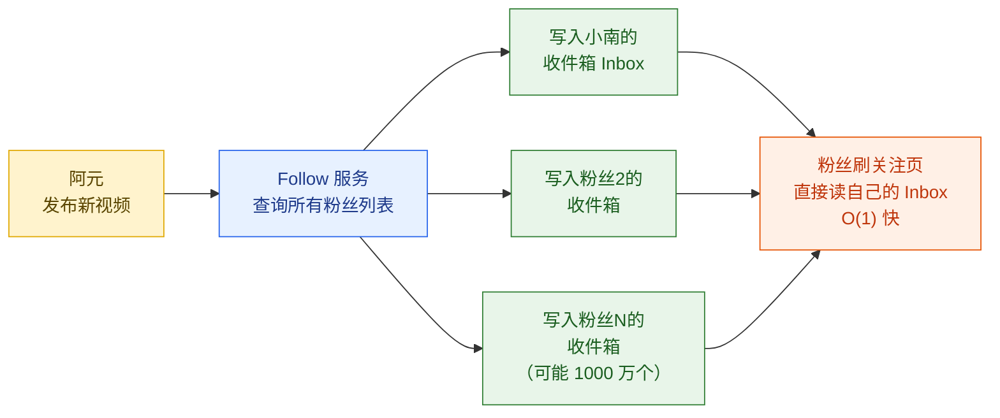

**写扩散特点**：
- **写重**：发布 1 条视频 = 写入所有粉丝的收件箱（Inbox）
- **读轻**：用户刷关注页只需读自己的 Inbox，O(1)
- **适用**：普通用户（粉丝 < 1 万），写入开销可接受

**数据结构**：每个用户的 Inbox 用 Redis Sorted Set 存储，`score = 时间戳`

```redis
# 写扩散：阿元发视频，写入小南的 Inbox
ZADD inbox:{小南_user_id} {timestamp} {video_id}
ZREMRANGEBYRANK inbox:{小南_user_id} 0 -801  # 只保留最近 800 条

# 读：小南刷关注页，取最近 20 条
ZREVRANGEBYSCORE inbox:{小南_user_id} +inf -inf LIMIT 0 20
```

### 12.3.3 读扩散（Pull / Fan-out on Read）

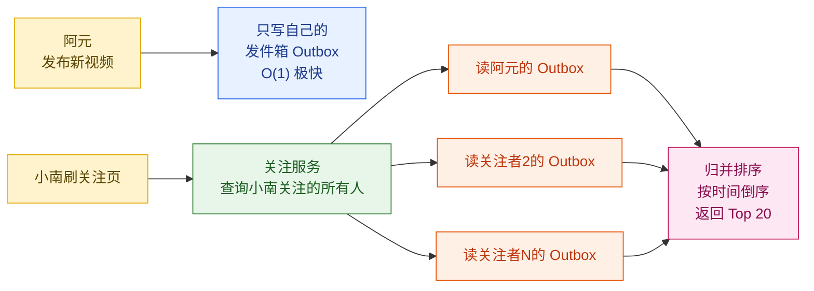

**读扩散特点**：
- **写轻**：发布 1 条视频只写自己的 Outbox，O(1)
- **读重**：刷关注页需要读取所有关注者的 Outbox，做归并排序
- **适用**：关注数量极少（< 20 人）的场景，或发布方粉丝极多（大V）

### 12.3.4 混合策略（Hybrid）——Twitter 真实案例

**Twitter 的演进历史**是业界最著名的读写扩散案例，数字震撼：

> 2013 年，贾斯汀·比伯（Bieber，粉丝 5000 万）发一条推文，写扩散需要向 5000 万个 Redis Sorted Set 写入，写 QPS 冲到 **5000 万 / 几分钟 ≈ 每秒 10 万次以上 Redis 写入**。Twitter 的 Redis 集群瞬间过热。

这就是**写扩散在大V场景下的致命缺陷**——一条推文触发数千万次 Redis 写。

**Twitter 的混合方案**：

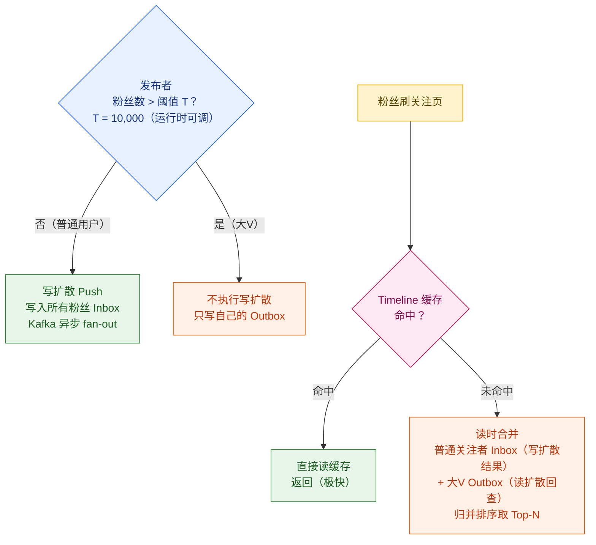

**Twitter 关键数字**：

| 维度 | 数值 |
|-----|------|
| 早期写扩散 fan-out QPS | ~4,000 次 Redis 写/秒（正常时期）|
| Bieber 一条推文触发 | ~5000 万次 Redis 写 |
| 大V 切换阈值 | **粉丝 > 1 万**（可通过配置在线调整）|
| 每用户 Timeline 缓存 | 最多 **800 条**（超出后 ZREMRANGEBYRANK 截断）|
| 阈值切换方式 | runtime 可调（灰度调整，不需要重部署）|

**混合方案代码骨架**：

```java
/**
 * Timeline Fan-out 服务
 * 混合策略：普通用户写扩散，大V 读时合并
 */
@Service
public class TimelineFanoutService {

    private static final int LARGE_FOLLOWER_THRESHOLD = 10_000; // 大V阈值，可配置化
    private static final int MAX_TIMELINE_SIZE = 800;           // 每用户最大缓存条数

    /**
     * 阿元发布新视频时触发
     */
    public void onVideoPublished(String authorId, String videoId, long publishTs) {
        int followerCount = followService.getFollowerCount(authorId);

        if (followerCount <= LARGE_FOLLOWER_THRESHOLD) {
            // 普通用户：写扩散（通过 Kafka 异步执行，不阻塞发布接口）
            fanoutToAllFollowers(authorId, videoId, publishTs);
        } else {
            // 大V：不做写扩散，仅写自己的 Outbox
            // 读时由 Timeline 服务合并
            redisTemplate.opsForZSet().add(
                "outbox:" + authorId, videoId, publishTs);
            // Outbox 只保留最近 1000 条（大V内容流量大，缓存成本高）
            redisTemplate.opsForZSet().removeRange("outbox:" + authorId, 0, -1001);
        }
    }

    /**
     * 小南刷关注页时调用
     * 返回按时间倒序的最新视频列表
     */
    public List<String> getTimeline(String userId, int limit) {
        String cacheKey = "timeline:" + userId;

        // 先查 Timeline 缓存
        Set<String> cached = redisTemplate.opsForZSet()
            .reverseRangeByScore(cacheKey, Double.NEGATIVE_INFINITY, Double.POSITIVE_INFINITY,
                0, limit);

        if (cached != null && !cached.isEmpty()) {
            return new ArrayList<>(cached);
        }

        // 缓存未命中：读时合并
        return buildTimelineOnRead(userId, limit);
    }

    /**
     * 读时合并：小南的 Inbox（普通用户写扩散结果）
     *         + 小南关注的大V的 Outbox
     * 归并排序取 Top-N
     */
    private List<String> buildTimelineOnRead(String userId, int limit) {
        // 1. 读小南自己的 Inbox（普通关注者的写扩散结果）
        Set<TypedTuple<String>> inbox = redisTemplate.opsForZSet()
            .reverseRangeByScoreWithScores("inbox:" + userId,
                Double.NEGATIVE_INFINITY, Double.POSITIVE_INFINITY, 0, 200);

        // 2. 读小南关注的大V的 Outbox（读扩散）
        List<String> bigVFollowees = followService.getBigVFollowees(userId); // 关注的大V列表
        List<TypedTuple<String>> bigVContent = new ArrayList<>();
        for (String bigVId : bigVFollowees) {
            Set<TypedTuple<String>> outbox = redisTemplate.opsForZSet()
                .reverseRangeByScoreWithScores("outbox:" + bigVId,
                    Double.NEGATIVE_INFINITY, Double.POSITIVE_INFINITY, 0, 50);
            if (outbox != null) bigVContent.addAll(outbox);
        }

        // 3. 归并：合并两个有序集合，按 score（时间戳）倒序取 Top-N
        List<TypedTuple<String>> merged = new ArrayList<>();
        if (inbox != null) merged.addAll(inbox);
        merged.addAll(bigVContent);
        merged.sort((a, b) -> Double.compare(b.getScore(), a.getScore())); // 按时间降序

        List<String> result = merged.stream()
            .limit(limit)
            .map(TypedTuple::getValue)
            .collect(Collectors.toList());

        // 4. 回写 Timeline 缓存
        if (!result.isEmpty()) {
            // （省略缓存回写代码，同写扩散逻辑）
        }

        return result;
    }
}
```

### 12.3.5 读写扩散对比总结

| 维度 | 写扩散 Push | 读扩散 Pull | 混合 Hybrid |
|-----|-----------|-----------|------------|
| 写开销 | O(粉丝数) | O(1) | 普通用户 O(粉丝数)，大V O(1) |
| 读开销 | O(1) | O(关注数) | O(关注的大V数)，近似 O(1) |
| 适用发布方 | 普通用户（粉丝<1万）| 大V 或关注量极少的用户 | **通用（推荐）** |
| 内容时效性 | 发布即可读（实时）| 读时计算（有延迟）| 实时（命中缓存）|
| 删改一致性 | **难**（需扫所有 Inbox）| **易**（Outbox 直接修改）| 混合处理 |
| 存储成本 | 高（N 份拷贝）| 低（1 份）| 中等 |
| 典型案例 | 早期 Twitter、微信朋友圈 | 邮件系统 | Twitter 现状、Instagram、抖音 |

> **易错点：写扩散删改不一致**
>
> 写扩散最大的坑是**删除和修改**。如果阿元删除了《番茄牛腩》，用写扩散的方案需要扫描所有粉丝的 Inbox 并删除对应条目——如果粉丝 100 万，这是 100 万次 Redis 操作，不可接受。
>
> **正确做法**：删除/修改走**读扩散**（仅删/改 Outbox），增加新内容才走写扩散。读时如果发现 Inbox 里的 video_id 已被删除，过滤掉即可。

### 12.3.6 社交图存储：字节 ByteGraph 与快手 Crux

关注关系的底层存储是有向图，传统关系型数据库（MySQL）面对千亿量级的图边查询（"我关注的人关注了谁？""共同关注？"）性能极差。

业界头部平台均选择**专用图数据库**：

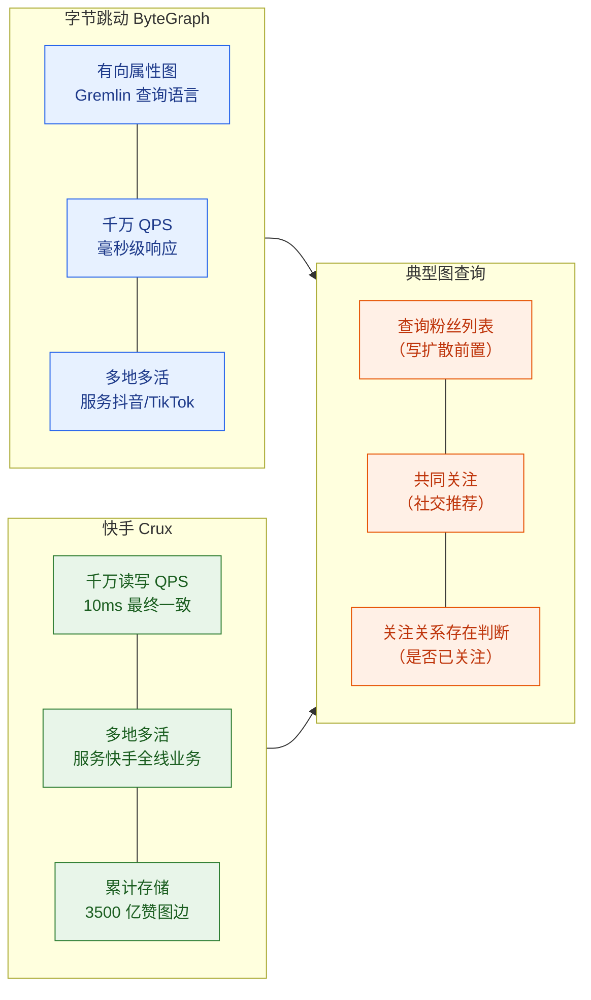

**快手 Crux 关键指标**：

| 指标 | 数值 |
|-----|------|
| 读写 QPS | **千万 QPS**（混合读写）|
| 最终一致延迟 | < **10ms** |
| 多地多活 | 是（跨城市多机房）|
| 累计存储图边 | **3500 亿条**（含点赞关系）|
| 服务视频数 | 200 亿条 |

**MySQL 存关注关系（小规模适用）**：

```sql
-- 关注关系表（小规模，百亿行以下可用）
CREATE TABLE follow_relation (
    follower_id   BIGINT NOT NULL COMMENT '关注者（小南）',
    followee_id   BIGINT NOT NULL COMMENT '被关注者（阿元）',
    created_at    DATETIME NOT NULL DEFAULT CURRENT_TIMESTAMP,
    status        TINYINT NOT NULL DEFAULT 1 COMMENT '1=正常 0=取消关注',
    PRIMARY KEY (follower_id, followee_id),   -- 覆盖索引：正向查询（我关注了谁）
    KEY idx_followee (followee_id, follower_id, created_at)  -- 反向查询（谁关注了我）
) ENGINE=InnoDB
  PARTITION BY HASH(follower_id) PARTITIONS 128;  -- 按 follower_id 分区，避免热点

-- 查询小南关注的所有大V（写扩散前使用）
SELECT followee_id FROM follow_relation
WHERE follower_id = #{小南_id} AND status = 1
ORDER BY created_at DESC;

-- 查询阿元的粉丝数（直接读计数表，不 COUNT）
SELECT follower_count FROM user_social_stats WHERE user_id = #{阿元_id};
```

---

## 12.4 评论系统——B站 10 万 QPS 中台

### 12.4.1 评论树结构：楼中楼

短视频评论通常是**两级树**（主评论 + 子评论）：

```
视频《番茄牛腩》
├── 主评论1：小南「看起来好吃！」          ← 一楼
│   ├── 子评论1：阿元「谢谢！周末试试~」
│   └── 子评论2：其他用户「+1 已加入清单」
├── 主评论2：用户B「番茄要不要去皮？」     ← 二楼
│   └── 子评论1：阿元「不去皮更香」
└── ...
```

**数据库 Schema**：

```sql
-- 评论表（B站风格，支持楼中楼）
CREATE TABLE comment (
    id            BIGINT      NOT NULL AUTO_INCREMENT,
    video_id      BIGINT      NOT NULL COMMENT '视频ID',
    user_id       BIGINT      NOT NULL COMMENT '评论者ID',
    parent_id     BIGINT      NOT NULL DEFAULT 0 COMMENT '父评论ID，0表示主评论',
    root_id       BIGINT      NOT NULL DEFAULT 0 COMMENT '一楼根评论ID，子评论用于找主楼',
    content       TEXT        NOT NULL COMMENT '评论正文',
    like_cnt      INT         NOT NULL DEFAULT 0 COMMENT '点赞数',
    reply_cnt     INT         NOT NULL DEFAULT 0 COMMENT '回复数',
    status        TINYINT     NOT NULL DEFAULT 1 COMMENT '1=正常 0=删除 2=折叠',
    created_at    DATETIME    NOT NULL DEFAULT CURRENT_TIMESTAMP,
    PRIMARY KEY (id),
    KEY idx_video_root    (video_id, root_id, like_cnt DESC),  -- 主评论热评排序
    KEY idx_root_children (root_id, created_at)                -- 子评论按时间排序
) ENGINE=InnoDB
  PARTITION BY HASH(video_id) PARTITIONS 64
  COMMENT '分 64 分区，将同一视频的评论路由到同分区，避免跨分区 JOIN';
```

### 12.4.2 热评排序公式

B站等平台的热评不是简单按点赞数排序，而是多维加权：

$$
\text{HotScore} = \alpha \cdot L + \beta \cdot R - \gamma \cdot D + \delta \cdot \log(W + 1) + \epsilon \cdot U
$$

其中：
- $L$：点赞数（Like count）
- $R$：回复数（Reply count）  
- $D$：负反馈数（Dislike/举报数，**扣分**）
- $W$：评论字数（Word count，字数适中的评论更有价值）
- $U$：用户等级/创作者互动加成（UP主回复的评论权重更高）
- $\alpha, \beta, \gamma, \delta, \epsilon$：各维度权重系数（通过 AB 实验调优）

**时间衰减**：热评分数还需加时间衰减，防止旧内容永久霸榜：

$$
\text{FinalScore} = \text{HotScore} \times e^{-\lambda \cdot \Delta t}
$$

其中 $\Delta t$ 为评论发布距今的小时数，$\lambda$ 控制衰减速度（B站取值约 0.002~0.005）。

```python
import math

def calculate_hot_score(
    like_cnt: int,
    reply_cnt: int,
    dislike_cnt: int,
    word_count: int,
    user_level: int,
    is_author_reply: bool,
    hours_since_post: float
) -> float:
    """
    评论热度评分（B站风格多维加权）
    小南的评论「看起来好吃！」初始分数计算
    """
    alpha = 1.0   # 点赞权重
    beta  = 0.8   # 回复权重（回复比点赞价值稍低）
    gamma = 2.0   # 负反馈惩罚（惩罚系数更大）
    delta = 0.3   # 字数加成（取 log 避免长评刷分）
    epsilon = 0.5 # 用户等级加成

    # 基础分
    base_score = (
        alpha * like_cnt
        + beta * reply_cnt
        - gamma * dislike_cnt
        + delta * math.log(word_count + 1)
        + epsilon * user_level
    )

    # UP主回复加成（阿元回复小南的评论，小南评论权重上升）
    if is_author_reply:
        base_score *= 1.5

    # 时间衰减（避免旧评论永久霸榜）
    lambda_decay = 0.003
    time_factor = math.exp(-lambda_decay * hours_since_post)

    return base_score * time_factor
```

### 12.4.3 评论系统架构：B站 10 万 QPS 中台

B站评论系统经历了从单体 MySQL 到 TiDB 分布式数据库的迁移，是典型的高并发改造案例：

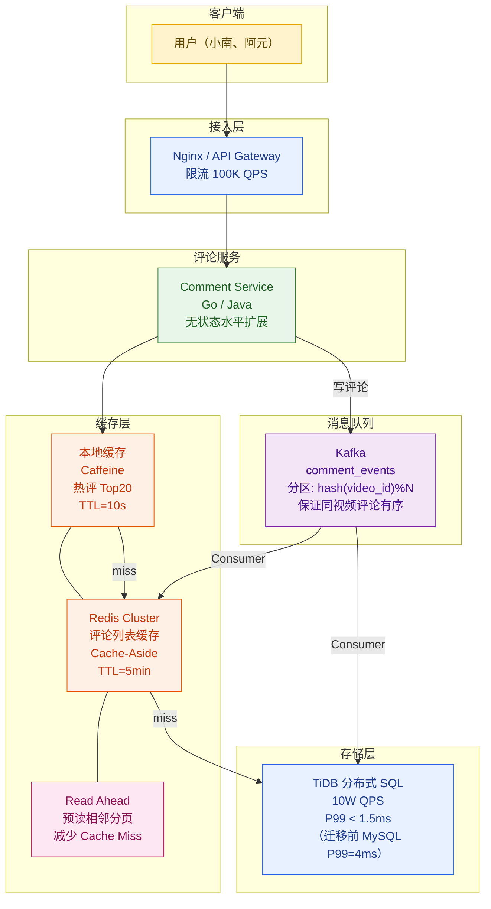

**B站 TiDB 迁移关键数字**：

| 指标 | 迁移前（MySQL 分库分表）| 迁移后（TiDB）|
|-----|-------------------|------------|
| 写 QPS | ~3 万 | **10 万** |
| P99 读延迟 | 4ms | **1.5ms** |
| 运维复杂度 | 高（分库分表路由逻辑复杂）| 低（原生分布式，无需手动分片）|
| 扩容方式 | 手动分库分表重新路由 | 在线扩容（自动 Region 分裂）|

**为什么 Kafka 分区按 `hash(video_id)%N` 而不是 `hash(user_id)%N`？**

> 评论的**业务有序性**需求是"同一视频下的评论按时间顺序消费"（用于热评重计算、审核流水线）。如果按 `user_id` 分区，同一视频的评论散落在多个分区，消费顺序无法保证。按 `video_id` 分区，同一视频的所有评论进入同一分区，天然有序。

### 12.4.4 热点击穿：singleflight + 本地热 key 缓存

《番茄牛腩》爆火，数百万用户同时翻评论，Redis 缓存**突然过期**（TTL 到点）——几千个请求同时穿透到 TiDB，这就是**缓存击穿（Hotspot Breakdown）**。

**解决方案 1：singleflight 归并回源**

```go
// Go 语言 singleflight 示例
// 同一时刻对同一个 key 的多个请求，只有第一个去 DB 查，其余等待结果
import "golang.org/x/sync/singleflight"

var sfGroup singleflight.Group

func GetCommentList(videoId string, page int) ([]Comment, error) {
    cacheKey := fmt.Sprintf("comment:%s:page:%d", videoId, page)

    // 先查缓存
    cached, err := redisClient.Get(ctx, cacheKey).Result()
    if err == nil {
        return deserialize(cached), nil
    }

    // 缓存未命中：用 singleflight 归并并发回源请求
    // key：同一个 cacheKey 的所有并发请求只触发一次 DB 查询
    result, err, _ := sfGroup.Do(cacheKey, func() (interface{}, error) {
        // 这里只有第一个 goroutine 执行，其他的等待
        comments, err := db.QueryComments(videoId, page)
        if err != nil {
            return nil, err
        }
        // 回写缓存
        redisClient.Set(ctx, cacheKey, serialize(comments), 5*time.Minute)
        return comments, nil
    })

    if err != nil {
        return nil, err
    }
    return result.([]Comment), nil
}
```

**解决方案 2：本地热 key 缓存（滑动窗口 + 小顶堆 TopK 识别）**

```java
/**
 * 热 key 识别：用滑动时间窗口统计 key 访问频次
 * 用小顶堆维护 TopK 热 key（K=100）
 * 热 key 同步写入本地 Caffeine 缓存，避免打穿 Redis
 */
public class HotKeyDetector {

    private static final int TOP_K = 100;           // 维护 Top 100 热 key
    private static final int WINDOW_SECONDS = 60;   // 60 秒滑动窗口
    private static final int HOT_THRESHOLD = 1000;  // 60s 内 >1000 次 = 热 key

    // 滑动窗口计数（ConcurrentHashMap + 时间戳分桶）
    private final ConcurrentHashMap<String, AtomicLong> windowCounter = new ConcurrentHashMap<>();
    // 小顶堆，维护 Top K 热 key
    private final PriorityQueue<Map.Entry<String, Long>> topKHeap =
        new PriorityQueue<>(TOP_K, Map.Entry.comparingByValue());

    // 本地热 key 缓存（Caffeine，容量 1000 条，TTL 10s）
    private final Cache<String, Object> localHotCache = Caffeine.newBuilder()
        .maximumSize(1000)
        .expireAfterWrite(10, TimeUnit.SECONDS)
        .build();

    public void recordAccess(String key) {
        long count = windowCounter
            .computeIfAbsent(key, k -> new AtomicLong(0))
            .incrementAndGet();

        if (count >= HOT_THRESHOLD) {
            // 触发热 key 预热：从 Redis 拉取并存入本地缓存
            promotToLocalCache(key);
        }
    }

    private void promotToLocalCache(String key) {
        if (localHotCache.getIfPresent(key) == null) {
            // 从 Redis 加载到本地缓存（异步，不阻塞业务）
            CompletableFuture.runAsync(() -> {
                Object value = redisTemplate.opsForValue().get(key);
                if (value != null) {
                    localHotCache.put(key, value);
                    log.info("Hot key promoted to local cache: {}", key);
                }
            });
        }
    }
}
```

---

## 12.5 通知中心与私信——收件箱模型

### 12.5.1 通知类型分类

| 通知类型 | 触发事件 | 时效要求 | 分发方式 |
|---------|---------|---------|---------|
| 互动通知 | 被点赞/评论/收藏 | < 5s | 推（WebSocket/长轮询） |
| @ 提醒 | 评论中被 @用户名 | < 3s | 推（高优先级）|
| 关注通知 | 被新用户关注 | < 10s | 推或拉 |
| 系统通知 | 审核结果/账号安全 | < 1min | 拉（轮询）|
| 私信 | 用户互发消息 | 近实时（<2s）| 推（WebSocket）|

### 12.5.2 通知中心架构

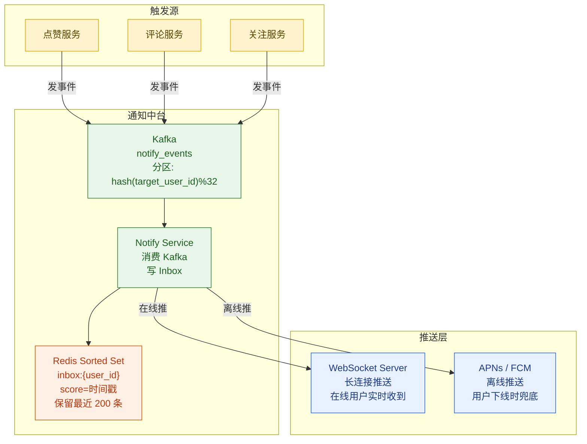

**收件箱存储**：

```redis
# 通知 Inbox（Redis Sorted Set）
# key: inbox:{user_id}
# score: 时间戳（毫秒）
# member: 通知 JSON 字符串

# 写入新通知（阿元收到小南点赞通知）
ZADD inbox:阿元_uid {timestamp_ms} '{"type":"like","from_user":"小南_uid","video_id":"v_fqn123","msg":"小南赞了你的视频"}'

# 只保留最近 200 条通知（超出截断）
ZREMRANGEBYRANK inbox:阿元_uid 0 -201

# 读取未读通知（阿元打开通知列表）
ZREVRANGEBYSCORE inbox:阿元_uid +inf 0 LIMIT 0 20
```

### 12.5.3 @ 提醒与消息保序

评论中 `@小南` 的 at-mention 需要**高优先级**处理：

1. 评论写入时，解析文本中的 `@用户名`
2. 将 at-mention 事件发入**高优先级 Kafka Topic**（独立 Topic，避免被普通通知淹没）
3. 通知服务消费，向被 @ 的用户推送实时通知

**私信保序**（快手 Crux 方案）：

私信场景要求**同一会话内消息有序**。快手使用 Crux（底层分布式图存储）实现：
- 每个会话分配单调递增的 `seq_id`（通过 Crux 的分布式序列号生成）
- 消息按 `(session_id, seq_id)` 排序，保证因网络乱序到达的消息在展示时仍然有序
- 最终一致延迟 < **10ms**，用户感知为"实时"

```java
// 私信发送（保序设计）
public MessageResult sendDirectMessage(String fromUserId, String toUserId, String content) {
    String sessionId = buildSessionId(fromUserId, toUserId); // 排序拼接，保证唯一

    // 从 Crux 获取单调递增 seq_id（分布式原子计数器）
    long seqId = cruxCounter.incrementAndGet("dm_seq:" + sessionId);

    Message msg = Message.builder()
        .sessionId(sessionId)
        .seqId(seqId)           // 消息序号，保序的关键
        .fromUser(fromUserId)
        .toUser(toUserId)
        .content(content)
        .timestamp(System.currentTimeMillis())
        .build();

    // 持久化到 Crux（有向图边：from -> to）
    cruxClient.addEdge(fromUserId, toUserId, "dm", msg);

    // 实时推送给在线用户
    if (presenceService.isOnline(toUserId)) {
        webSocketServer.push(toUserId, msg);
    } else {
        apnsService.pushNotification(toUserId, "你有一条新私信");
    }

    return MessageResult.success(seqId);
}
```

---

## 12.6 关注页 Feed vs 推荐页 Feed

### 12.6.1 两类 Feed 的本质差异

短视频平台存在**两套完全不同的 Feed 系统**，它们的数据来源、架构和延迟特征截然不同：

| 维度 | 关注页 Feed（Following Feed）| 推荐页 Feed（For You）|
|-----|--------------------------|---------------------|
| 数据来源 | 关注的人发的内容（社交图）| 全库视频（行为画像 + 推荐算法）|
| 核心算法 | 按时间倒序（基本无排序）| 召回 → 粗排 → 精排 → 重排（第 7~10 章）|
| 个性化程度 | 低（用户主动选择关注谁）| 极高（算法猜你喜欢什么）|
| 冷启动问题 | 无（新用户关注为 0，关注页为空）| 有（新用户无行为画像）|
| 内容时效性 | 强（粉丝期待第一时间看到）| 中（推荐算法有延迟）|
| 端到端延迟 | < 50ms（读 Redis Inbox）| 100~200ms（完整推荐漏斗）|
| 架构模式 | Push/Pull/Hybrid Timeline | 第 11 章沉浸式 Feed 架构 |
| 缓存方式 | Redis Sorted Set（Inbox）| 预计算结果缓存（推荐预热）|

### 12.6.2 关注页 Feed 架构设计要点

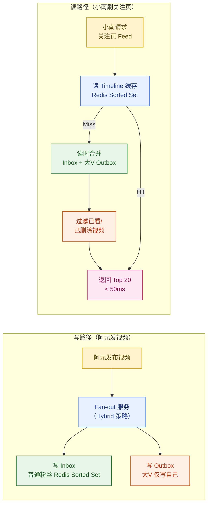

**关注页 Feed 的工程细节**：

1. **已看去重**：小南翻页时不应看到重复视频。使用 Redis Set 记录本次会话已曝光的 video_id，下次请求时过滤（类似推荐系统的 Bloom Filter，见第 10 章）

2. **已删除过滤**：写扩散已写入 Inbox 的视频，如果后来被删除，读时通过视频状态 API 过滤（而不是扫描所有 Inbox 删除）

3. **Feed 预取**：小南刷到第 15 条时，后台提前加载第 21~40 条，减少下次翻页的等待时间

### 12.6.3 两类 Feed 对比

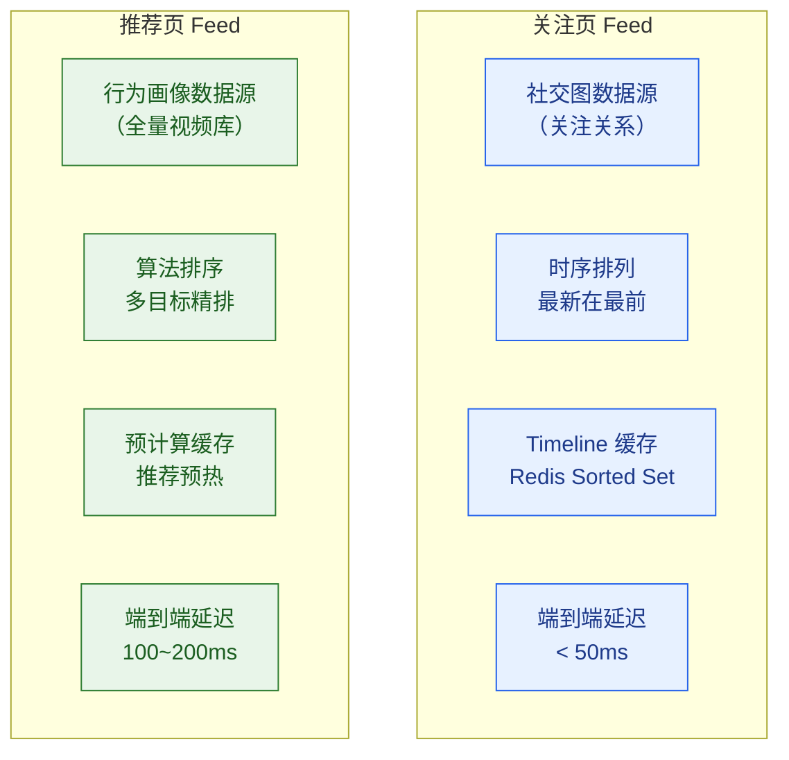

**关注页 vs 推荐页的混合使用**：

现代短视频平台（抖音、快手）的关注页流量占比通常只有 **10%~20%**，推荐页占 **80%~90%**。关注页更多是满足用户"主动关注某人内容"的**精准需求**，而推荐页是满足"发现更多好内容"的**探索需求**。

---

## 12.7 高并发易错点汇总

### 12.7.1 四大易错点

在设计和实现互动与社交系统时，以下四个问题是最常见的高并发陷阱：

| # | 易错点 | 触发场景 | 后果 | 正确做法 |
|---|-------|---------|------|---------|
| 1 | **Redis 不持久化，计数丢失** | Redis 宕机重启 | 重启后计数从 0 开始，爆款视频点赞清零 | AOF everysec + 启动从 DB 预热 |
| 2 | **写扩散删改不一致** | 阿元删除视频/修改 | 删改需扫描所有粉丝 Inbox，粉丝百万时不可行 | 删改走读扩散（只改 Outbox），增加内容走写扩散 |
| 3 | **热 key 击穿惊群** | 爆款视频评论缓存同时过期 | 大量请求同时穿透 DB，DB CPU 飙升 | singleflight 归并回源 + 本地热 key 缓存 |
| 4 | **Kafka 分区错选导致评论乱序** | 按 user_id 分区评论事件 | 同一视频评论散落多分区，消费无法保序 | 评论按 `hash(video_id)%N` 分区，保同主题有序 |

### 12.7.2 计数系统 Redis 宕机恢复流程

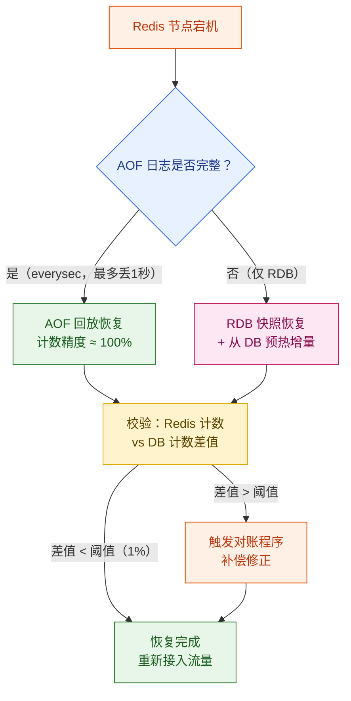

### 12.7.3 写扩散删除一致性——正确处理方式

```java
/**
 * 正确的删改处理：删改不扫描 Inbox，只修改 Outbox
 * 读时过滤已删除的内容
 */
@Service
public class VideoDeleteService {

    public void deleteVideo(String authorId, String videoId) {
        // 1. 标记 DB 状态为已删除
        videoRepository.markDeleted(videoId);

        // 2. 从作者 Outbox 中移除
        redisTemplate.opsForZSet().remove("outbox:" + authorId, videoId);

        // 3. 不扫描粉丝 Inbox！（粉丝可能 100 万，扫描不可行）
        // 读时过滤：粉丝刷关注页时，发现 video_id 对应视频已删除，直接过滤
        // 见 TimelineFanoutService.getTimeline() 中的 filter 步骤

        // 4. 异步删除 CDN/存储（非实时要求）
        kafkaTemplate.send("video_cleanup_events", videoId,
            VideoCleanupEvent.of(videoId, CleanupType.DELETE));
    }
}

/**
 * 关注页 Feed 读取时过滤已删除视频
 */
private List<String> filterDeletedVideos(List<String> videoIds) {
    // 批量查 Redis（视频状态缓存），O(N) Pipeline
    List<Object> statuses = redisTemplate.executePipelined(conn -> {
        videoIds.forEach(id -> conn.get(("video_status:" + id).getBytes()));
        return null;
    });

    List<String> result = new ArrayList<>();
    for (int i = 0; i < videoIds.size(); i++) {
        String status = (String) statuses.get(i);
        // 状态不存在（默认正常）或状态为 "active"，保留
        if (status == null || "active".equals(status)) {
            result.add(videoIds.get(i));
        }
        // 状态为 "deleted" 或 "banned"，过滤掉
    }
    return result;
}
```

### 12.7.4 系统容量规划

以「闪刷」平台（DAU 1.5 亿）为例，互动系统容量估算：

$$
\text{点赞写 QPS}_{\text{峰值}} = \text{DAU} \times \frac{\text{人均日点赞数}}{\text{日秒数}} \times \text{峰值系数}
$$

$$
= 1.5 \times 10^8 \times \frac{50}{86400} \times 5 \approx 4.3 \times 10^5 \approx \textbf{43 万 QPS}
$$

| 组件 | 规划容量 | 说明 |
|-----|---------|------|
| Redis Cluster（计数层）| 32 节点，每节点 64GB | 支撑 200 万 QPS 读写（含分片）|
| Kafka（削峰队列）| 32 分区，3 副本 | 峰值 50 万消息/s，延迟 < 100ms |
| MySQL（持久化）| 分库 16 个，TiDB | 落库 QPS < 2000（批量合并后）|
| 对账服务 | 2 实例（主备）| 每 5 分钟全量扫描，无需高并发 |
| Kafka（评论）| 64 分区（按 video_id）| 评论写峰值 5 万/s |

---

## 本章小结

本章以小南给《番茄牛腩》互动的全过程为主线，系统拆解了短视频平台互动与社交系统的核心工程挑战。

**核心结论**：

1. **计数系统三层架构**是工业标准：Redis INCR 扛毫秒级读写 → Kafka 异步批量落库（写 QPS 降低 500 倍）→ 定时对账修正漂移。AOF 持久化 + 启动预热是可靠性兜底。

2. **热点视频计数**不能用单 key：64 分片打散 + 本地聚合批量 INCRBY，将单节点瓶颈扩展为集群线性扩展。

3. **读写扩散混合策略**是大规模平台的最优解：普通用户写扩散（读 O(1)），大V 读扩散（写 O(1)），粉丝数阈值（Twitter 取 1 万）在线可调。删除/修改只改 Outbox，不扫 Inbox，是最易被忽略的设计细节。

4. **评论系统**的热评排序需要多维加权（点赞 + 回复 - 负反馈 + 字数 + 用户等级）+ 时间衰减；Kafka 分区必须按 video_id 而非 user_id，保证同主题有序；singleflight + 本地热 key 缓存是热点击穿的标准解法。

5. **关注页 Feed**（50ms 延迟，读 Redis Inbox）与**推荐页 Feed**（100~200ms，算法漏斗）是两套并行系统，前者基于社交图，后者基于行为画像。

**互动与社交系统覆盖的高并发模式**：

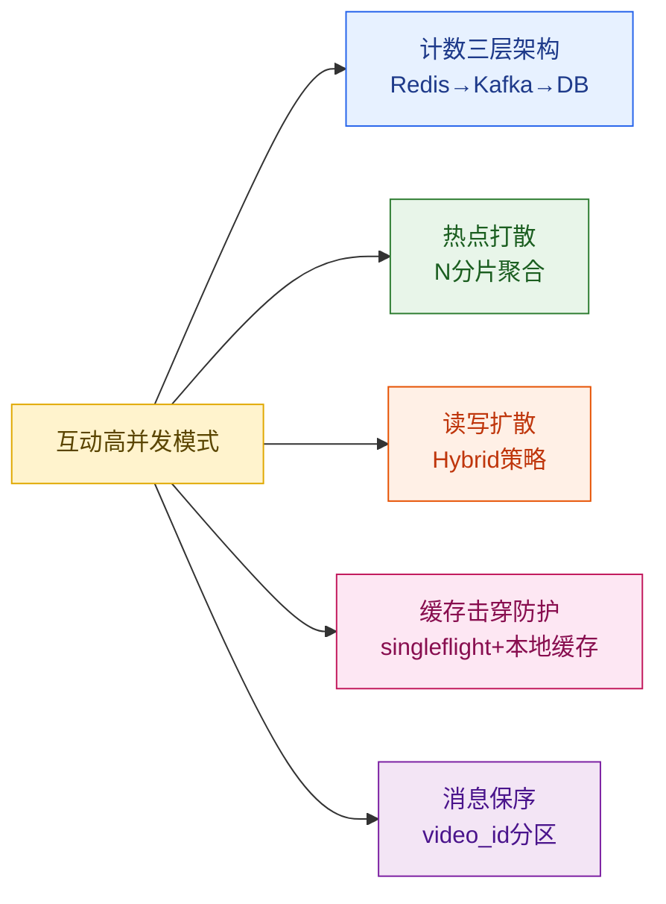

---

**下一章预告**：互动系统讲的是"看完视频之后做什么"——点赞、评论、关注，都是**异步、低延迟容忍的行为**。但有一类互动是**完全实时的**：直播。主播与观众需要在**亚秒级**完成推流、弹幕、礼物、连麦的全链路交互，毫秒级的延迟都会让用户感觉"卡顿"。第 13 章将深入**直播系统**：RTMP/SRT/WebRTC/LL-HLS 四大协议的延迟权衡、SFU/MCU 连麦架构、弹幕高并发存储、礼物打赏事务性，以及千万级同时在线的直播热点容灾。

---

## 参考来源

1. **微博 CounterService 架构**（InfoQ 2015）——百万 QPS 计数服务的架构设计与冷热分离实践
   https://www.infoq.cn/article/weibo-counter-service

2. **Twitter Timeline 写扩散演进**——从 Push 到 Hybrid 的技术博客（Twitter Engineering Blog 2012）
   https://blog.twitter.com/engineering/en_us/a/2012/building-a-social-timeline-at-twitter

3. **快手 Crux 图数据库**（QCon 2020）——千万 QPS 有向图存储，多地多活，10ms 最终一致
   https://qcon.infoq.cn/2020/beijing/presentation/2611

4. **字节跳动 ByteGraph 有向属性图数据库**（VLDB 2022）——抖音社交图存储的工程实践
   https://www.vldb.org/pvldb/vol15/p3603-li.pdf

5. **B站评论系统 TiDB 迁移实践**（PingCAP 官方博客 2021）——10W QPS，P99 从 4ms 降至 1.5ms
   https://pingcap.com/case-studies/how-bilibili-migrated-from-mysql-to-tidb

6. **Redis Cluster 热点 Key 问题与解决方案**（Redis 官方文档）——Cluster 分槽原理与 shard 打散
   https://redis.io/docs/manual/scaling/

7. **Golang singleflight 包**（Go 标准扩展库）——并发归并回源防止缓存击穿
   https://pkg.go.dev/golang.org/x/sync/singleflight

8. **Instagram Feed Architecture**（Instagram Engineering Blog 2016）——Push/Pull/Hybrid 在 Instagram 的应用
   https://instagram-engineering.com/building-instagram-stories-facebook-live-1a1fbbfeab7c

9. **Facebook TAO 社交图存储**（USENIX ATC 2013）——Facebook 社交图读多写少的 Write-Through 缓存架构
   https://www.usenix.org/conference/atc13/technical-sessions/presentation/bronson

10. **Kafka 分区策略与消息有序性**（Confluent 官方博客）——如何用分区 key 保证消费顺序
    https://www.confluent.io/blog/apache-kafka-producer-improvements-introduction-kafka-2-4/
