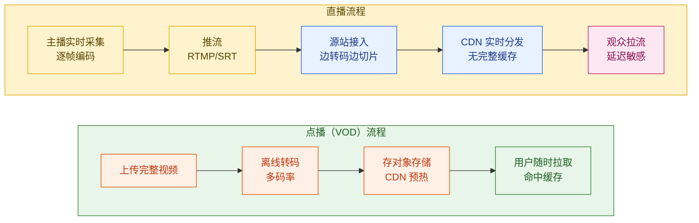
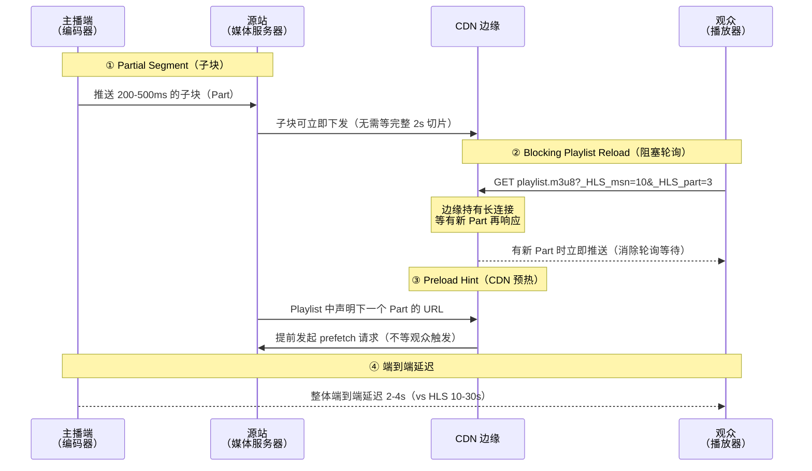
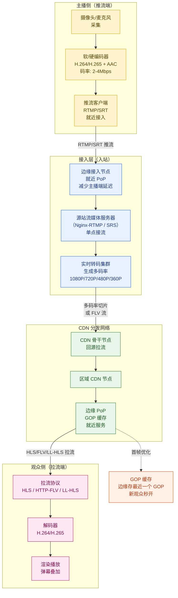
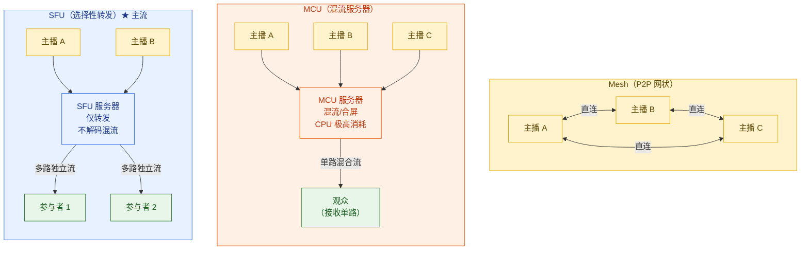
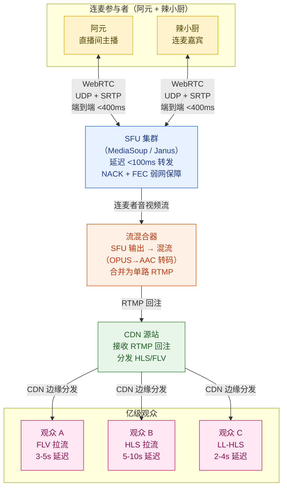
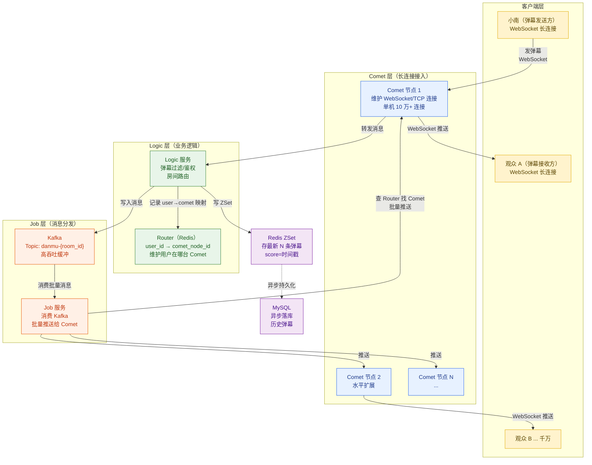
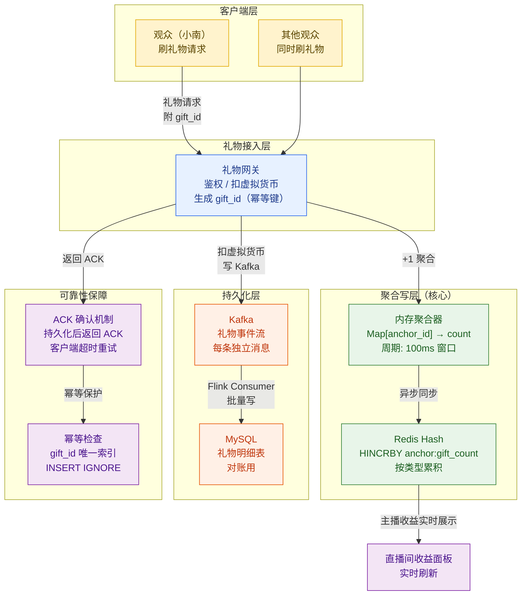
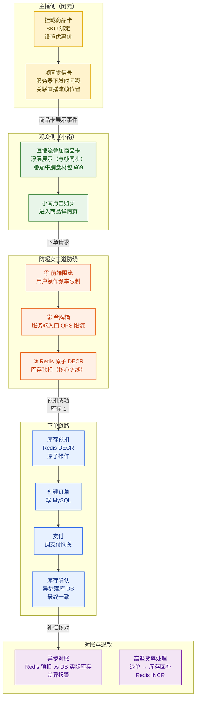

# 第 13 章 · 直播系统

> **所属系列**：《短视频平台系统设计 · 全景教程》第四部分 · 互动、社交与直播
> **上一章**：[第 12 章 · 互动与社交系统](./12-互动与社交系统.md)
> **下一章**：[第 14 章 · 内容安全与审核](./14-内容安全与审核.md)

---

## 本章导读

第 12 章讲完了点赞、评论、关注这些"看完之后"的互动行为——它们作用于已经录制好的短视频，是异步的、可重复的消费。而本章要讨论的**直播**，则是一个完全不同的时序维度：**内容在产生的同时就必须送达观众**，延迟即失败，中断即断联。

阿元上周因为一条番茄牛腩视频爆了。今天，他决定开一场直播，带货番茄牛腩食材包，同时邀请另一位美食博主连麦 PK 厨艺。小南刷到推荐，点进直播间，发出弹幕"求链接"，刷了一个小火锅礼物，最后下单了食材包。

这一系列看似简单的动作，背后是直播系统最核心的工程挑战：

- 阿元的 App 怎么把实时画面推到几千公里外的 CDN 边缘？用什么协议？延迟几秒？
- 连麦 PK 为什么必须用 WebRTC，而不能用 HLS 或 FLV？
- 千万观众同时在线，弹幕怎么做到 <1s 到达率 99%？
- 礼物打赏是财务数据，不能丢，但并发量极高，怎么防热点写？
- 食材包下单高峰，库存怎么防超卖？

本章将从协议选型开始，逐层深入，给出每个问题的完整工程答案。

---

## 13.1 直播 vs 点播：本质差异

理解直播系统，首先要理解它与点播（VOD）在工程约束上的根本差异。

### 13.1.1 生产模式对比

点播的内容是**预先存在**的：上传 → 转码 → 存对象存储 → CDN 全量预热 → 随时播放。整条链路可以提前完成，CDN 命中的是静态文件。

直播的内容是**实时产生**的：主播采集帧 → 编码 → 推流 → 边转码边切片 → CDN 实时拉取。没有"提前存好的文件"，每一帧都是第一次出现。



### 13.1.2 核心工程挑战对比

| 维度 | 点播（VOD） | 直播（Live） |
|------|-----------|------------|
| 转码时机 | 离线批量转码，可并行 | 实时转码，必须跟上帧率（≥25fps） |
| CDN 预热 | 上线前全量预热，高命中率 | 无法预热，首个请求必须回源站 |
| 流量峰值 | 可预测，随热度缓慢增长 | 不可预测，开播瞬间涌入（洪峰） |
| 延迟要求 | 无要求，TTFF <200ms 即可 | 5-30s（标准）/ 200ms-500ms（连麦） |
| 错误处理 | 可重试，不影响体验 | 断流即断联，需 gap 缓冲 |
| 内容生命周期 | 永久存储，随时回看 | 实时流，直播结束后才能录制存档 |
| 带宽特征 | 稳定，可精确预测 | 峰值 10-100× 平均，需弹性扩容 |

### 13.1.3 "闪刷"直播规模基准

本章以「闪刷」平台的以下规模基准进行容量推导：

$$
\text{总推流带宽} = N_{\text{主播}} \times R_{\text{推流码率}} = 10^5 \text{ 路} \times 3\text{Mbps} = 300\text{Gbps（入方向）}
$$

$$
\text{总拉流带宽} = N_{\text{观众}} \times R_{\text{拉流码率}} = 10^8 \text{ 路} \times 1.5\text{Mbps} = 150\text{Tbps（出方向）}
$$

| 指标 | 数值 | 说明 |
|------|------|------|
| 同时在线主播 | ~10 万 | 含长尾小主播 |
| 同时在线观众 | ~1 亿 | 晚高峰峰值 |
| 头部主播单场峰值 | ~1000 万 | 如 S 赛、热门带货 |
| 推流端到端延迟目标 | <500ms | 主播侧网络延迟 |
| 普通观众延迟 | 1-5s（低延迟模式） | |
| 连麦延迟目标 | <500ms | WebRTC 双向 |

---

## 13.2 推拉流协议全景

直播的命脉是协议选型。不同场景下的延迟、传输可靠性、兼容性要求千差万别，没有万能协议。

### 13.2.1 七大协议全面对比

| 协议 | 传输层 | 典型延迟 | 推/拉 | 适用场景 | 代表使用方 |
|------|--------|---------|-------|---------|-----------|
| **RTMP** | TCP | 2-5s | 推流入站为主 | 主播推流到源站；兼容性强 | OBS、各直播平台入站 |
| **HTTP-FLV** | TCP | 2-3s | 拉流主流 | PC/Android 观众拉流；低延迟首选 | B站、斗鱼、虎牙 |
| **HLS** | TCP | 10-30s | 拉流 | iOS 原生支持；VOD/录播 | Apple 生态、YouTube |
| **LL-HLS** | TCP | 2-4s | 拉流 | 低延迟+兼容 Apple；Apple 2019 | Apple HLS 兼容场景 |
| **SRT** | UDP+ARQ | ~1s | 推流主流（弱网） | 弱网/跨国推流；AES加密；比 RTMP 快 5-12 倍 | 专业广播、海外推流 |
| **WebRTC** | UDP+SRTP | 200-500ms | 双向 | 连麦/PK；超低延迟互动 | 连麦、语音房 |
| **QUIC/RTM** | UDP | ~RTMP | 推流探索 | 抖音 RTM（基于 WebRTC 传输层）卡顿降 22.2%/7.8% | 字节跳动探索 |

> **关键结论**：协议选型不是"越低延迟越好"，而是**在延迟、成本、兼容性之间取最优解**。HLS 延迟高但 CDN 成本最低、兼容性最强；WebRTC 延迟最低但服务器架构复杂、成本高。

### 13.2.2 LL-HLS 低延迟机制深度解析

LL-HLS（Low Latency HLS）由 Apple 于 2019 年提出，通过四项机制将 HLS 延迟从 10-30s 压缩到 2-4s：



**四项机制说明**：

| 机制 | 作用 | 延迟收益 |
|------|------|---------|
| **Partial Segment（子块）** | 把 2s 切片拆成 200-500ms 的子块，子块生成即可分发 | 节省 1.5-1.8s 等待时间 |
| **Blocking Playlist Reload** | 播放器长连接等待新 Part，服务器推送而非轮询 | 消除 300-500ms 轮询间隔 |
| **Preload Hint** | Playlist 提前声明下一 Part URL，CDN 预取 | CDN 响应快 200-300ms |
| **CMAF/Chunked Transfer** | 配合分块传输编码，Part 边生成边推送 | 减少服务器缓冲延迟 |

### 13.2.3 SRT vs RTMP 推流选型

SRT（Secure Reliable Transport）相比 RTMP 的核心优势：

```
RTMP（TCP）：
  丢包 → TCP 重传 → 队头阻塞 → 后续帧被阻塞 → 卡顿累积 → 延迟雪崩

SRT（UDP + ARQ）：
  丢包 → ARQ 选择性重传 → 只补丢失包 → 无队头阻塞 → 延迟稳定
```

- **弱网环境**（丢包率 5-10%）：SRT 延迟约 1s，RTMP 延迟可能飙升至 10-30s
- **AES-128/256 加密**：SRT 内置端到端加密，RTMP 不加密
- **实测**：SRT 比 RTMP 弱网吞吐快 5-12 倍（官方数据）

---

## 13.3 完整推拉流链路

这是直播系统的主干。从阿元按下"开始直播"到小南看到画面，经历了十余个节点。

### 13.3.1 完整链路架构图



### 13.3.2 各节点技术细节

**主播侧编码**：
- 视频编码：H.264（兼容性最强）/ H.265（码率减少约 50%，GPU 编码支持好）
- 音频编码：AAC-LC（44.1kHz / 48kHz，128kbps）
- GOP 长度：2-4s（关键帧间隔，影响随机接入延迟）
- 推流码率：标清 500kbps / 高清 1.5Mbps / 超清 3-4Mbps

**边缘接入节点**：
- 主播通过 HTTPDNS 或 App 内置调度获取**就近接入点 IP**
- 接入节点与源站间走内网专线（低延迟、高可靠）
- 接入节点负责 RTMP 握手、鉴权、推流限速

**实时转码集群**：
- 单机 GPU 转码能力：约 50-100 路 1080P→720P 实时转码
- ABR 多码率：按 1080P/720P/480P/360P 并行转码，共享输入流
- 音频转码：OPUS（连麦场景）→ AAC（HLS/FLV 分发）

**CDN 分发**：
- CDN 边缘节点缓存**最近 N 个切片**（HLS）或保持长连接（FLV）
- CDN 总出口带宽：国内头部平台达到数十 Tbps 级别
- 多 CDN 厂商融合调度（阿里云 + 腾讯云 + 华为云），故障快速切换

### 13.3.3 抖音 RTM 实践数据

字节跳动在 2020-2022 年将直播推流协议从 RTMP 迁移到基于 WebRTC 传输层（DTLS+SRTP）的 RTM（Real-Time Messaging）：

| 指标 | RTMP | RTM（WebRTC 传输层） | 改善 |
|------|------|-------------------|------|
| 弱网卡顿率 | 基准 | 降低 22.2% | 抖音公开数据 |
| 音频卡顿率 | 基准 | 降低 7.8% | 抖音公开数据 |
| 首帧时间 | 基准 | 提升 ~15% | UDP 握手更快 |
| 弱网（5%丢包）稳定性 | 降级明显 | 稳定（ARQ+FEC） | NACK/FEC 弱网恢复 |

RTM 的核心改进：用 UDP 替换 TCP 传输层，配合 NACK（丢包重传）+ FEC（前向纠错），在弱网环境下显著优于 TCP 队头阻塞的 RTMP。

---

## 13.4 延迟三档与场景选型

### 13.4.1 延迟分级全景表

```mermaid
flowchart LR
    subgraph STD["标准延迟（5-30s）"]
        direction TB
        S1["协议: HLS<br/>传输: TCP"]:::blue
        S2["场景: iOS/Safari<br/>VOD/录播<br/>CDN 成本最低"]:::blue
        S3["切片大小: 2-10s<br/>缓冲: 3-6个切片"]:::blue
    end

    subgraph LOW["低延迟（1-3s）"]
        direction TB
        L1["协议: HTTP-FLV<br/>LL-HLS / RTMP<br/>传输: TCP"]:::green
        L2["场景: 主流直播<br/>带货/娱乐<br/>大众观众"]:::green
        L3["FLV 长连接流<br/>LL-HLS 200ms 子块"]:::green
    end

    subgraph RTC["超低延迟 RTC（200-500ms）"]
        direction TB
        R1["协议: WebRTC<br/>传输: UDP+SRTP"]:::pink
        R2["场景: 连麦/PK<br/>语音互动<br/>实时感知"]:::pink
        R3["SFU 转发<br/>NACK+FEC 弱网保障"]:::pink
    end

    STD -.->|"延迟降低<br/>成本升高"| LOW
    LOW -.->|"延迟降低<br/>架构复杂"| RTC

    style STD fill:#e7f1ff,stroke:#2563eb,color:#1e3a8a
    style LOW fill:#e8f5e9,stroke:#2e7d32,color:#1b5e20
    style RTC fill:#fde7f3,stroke:#c2185b,color:#880e4f

    classDef blue fill:#e7f1ff,stroke:#2563eb,color:#1e3a8a
    classDef green fill:#e8f5e9,stroke:#2e7d32,color:#1b5e20
    classDef pink fill:#fde7f3,stroke:#c2185b,color:#880e4f
```



### 13.4.2 延迟分级详细对比

| 档位 | 延迟范围 | 主要协议 | 优点 | 缺点 | 典型场景 |
|------|---------|---------|------|------|---------|
| **标准** | 5-30s | HLS | CDN 命中率高、成本低、全平台兼容 | 延迟感强，互动滞后 | 赛事直播、晚会 |
| **低延迟** | 1-3s | HTTP-FLV | 延迟低、成本适中、大规模验证 | iOS 需插件，不原生支持 | 娱乐直播、带货 |
| **低延迟 HLS** | 2-4s | LL-HLS | Apple 原生、延迟低 | 需服务器支持 Part 分发 | iOS 带货直播 |
| **超低延迟** | 200-500ms | WebRTC | 真正实时，连麦无感知延迟 | 服务器成本高，大规模复杂 | 连麦、PK、教育 |

### 13.4.3 为什么普通观众不用 WebRTC？

这是一个常见的误解。WebRTC 延迟最低，但**对大规模只读观众来说成本极高**：

- WebRTC 连接是有状态的（DTLS 握手、ICE 协商），每条连接消耗服务器资源
- 1000 万观众走 WebRTC = 服务器需维护 1000 万条有状态连接
- HTTP-FLV/HLS 是无状态的 HTTP，CDN 可以几乎无限水平扩展
- **正确架构**：连麦者（主播+嘉宾，≤10人）走 WebRTC；观众（百万-千万）走 CDN

---

## 13.5 连麦与 RTC 架构

阿元邀请另一位美食博主"辣小厨"连麦 PK——这需要双向实时音视频通话，同时让千万观众围观。这是直播系统最复杂的场景之一。

### 13.5.1 为什么连麦必须 WebRTC？

**核心问题**：连麦需要双方对话，来回一次通信路径必须 <500ms，否则说话不像在聊天，像在打电话有明显延迟。

```
RTMP/FLV 方案（行不通）：
  阿元说话 → RTMP 推流（2-5s）→ 辣小厨看到 → 辣小厨回应（2-5s）→ 阿元听到
  来回延迟：4-10s，体验灾难

WebRTC 方案（正确）：
  阿元说话 → UDP（50-100ms）→ SFU（< 5ms 转发）→ UDP（50-100ms）→ 辣小厨听到
  来回延迟：100-200ms，自然对话
```

TCP 的**队头阻塞**使其在弱网环境下延迟不可控；WebRTC 使用 UDP + NACK（选择性重传）+ FEC（前向纠错），在 5-10% 丢包率下仍保持 <500ms 延迟。

### 13.5.2 三种 RTC 架构对比：Mesh / MCU / SFU



| 架构 | 服务器角色 | CPU 消耗 | 下行带宽 | 扩展性 | 延迟 | 适用场景 |
|------|---------|---------|---------|-------|------|---------|
| **Mesh（P2P）** | 无/信令 | 极低 | N-1 路上行 | ≤5 人 | 最低 | 小型视频会议 |
| **MCU** | 解码+混流+编码 | 极高（O(N)编码） | 1 路（混合流） | 差（CPU 瓶颈） | 中 | 电话会议、需混流场景 |
| **SFU** | 仅路由转发 | 低（不解码） | N 路独立 | 好（水平扩展） | 低 | 连麦/PK、大规模 RTC ★ |

**为什么直播连麦选 SFU**：
- SFU 不解码不混流，CPU 消耗仅是 MCU 的 1/10
- 支持 Simulcast（主播推多码率，SFU 按网络条件转发）
- 支持 SVC（可伸缩视频编码，空间/时间/质量三维可裁剪）
- 水平扩展：增加 SFU 节点即可支撑更多连麦房间

### 13.5.3 连麦 + CDN 混合架构

连麦 PK 有两组受众：参与者（需要 <500ms）和围观观众（可以接受 3-5s）。需要两套通路：



**关键流程**（阿元 PK 辣小厨）：

1. 阿元和辣小厨各自通过 WebRTC 连接到 SFU 集群
2. SFU 将两路音视频互发给对方（双向实时，<400ms）
3. SFU 同时将两路流输出给流混合器
4. 混合器将两路视频拼成左右画面（Picture-in-Picture），音频混合，**OPUS 解码 → AAC 重编**
5. 合并后的单路流通过 RTMP 回注 CDN 源站
6. 观众通过 CDN 拉取 HLS/FLV，延迟 3-5s

**OPUS → AAC 转码必要性**：WebRTC 使用 OPUS 音频编解码器（更低延迟、更好质量），但 HLS/FLV 需要 AAC，混合器必须完成格式转换。

---

## 13.6 首屏秒开优化

小南进入直播间，需要在 2s 内看到画面，否则用户体验骤降。直播没有离线文件，秒开比点播难得多。

### 13.6.1 核心优化手段

**问题根源**：HLS 切片通常 2-10s 一个，新观众进入时可能要等下一个关键帧（I 帧）才能开始解码。最坏情况需要等一整个 GOP 周期。

**GOP 缓存（关键优化）**：

```
没有 GOP 缓存：
  小南进入直播间
  → 请求 CDN 边缘
  → 边缘没有最新切片（等主播推送下一个关键帧）
  → 最坏等待一个 GOP（2-4s）才能开始播放

有 GOP 缓存：
  CDN 边缘节点实时缓存最近一个完整 GOP（2-4s 的 I 帧+P 帧序列）
  → 小南进入直播间
  → CDN 边缘立即返回缓存的 GOP 数据（不等主播新推帧）
  → 播放器立即开始解码播放（首帧 <500ms）
```

**GOP 缓存的关键特性**：
- 存储最近一个 GOP（不是全量流），存储量很小（几 MB）
- 缓存随新 I 帧到达滚动更新
- 不影响延迟（新观众从 GOP 开始，而非从直播实时位置）
- **观众进入时实际看到的是"稍旧"的画面**，随后追上实时流（2-4s 延迟）

**其他首屏优化**：

| 优化手段 | 原理 | 收益 |
|---------|------|------|
| DNS 预解析 | App 启动时预解析 CDN 域名 | 省去首次 DNS 查询（50-100ms） |
| 预建连接（Pre-connect） | 播放器预先建立 TCP/TLS 连接 | 省去握手（100-200ms） |
| 就近调度（HTTPDNS） | 绕过运营商 DNS，返回最近 PoP | 减少首包 RTT |
| 边缘接入（PoP 就近） | 观众请求打到最近 CDN 节点 | 网络延迟降低 50% |
| 首帧预加载 | 推荐 Feed 显示直播卡片时预下载前几秒 | 进入直播间即秒播 |

**目标**：首屏时间 TTFF（Time To First Frame）< 2s，P99 < 3s。

---

## 13.7 弹幕系统

小南发出"求链接"的弹幕，需要在 <1s 内出现在所有在线观众的屏幕上。1000 万在线 = 1000 万个长连接同时等待推送。

### 13.7.1 弹幕系统架构（GOIM 架构）

B站弹幕系统 GOIM 是业界最著名的开源实现，其三层架构极具代表性：



**三层职责**：

| 层 | 职责 | 技术实现 | 规模 |
|----|------|---------|------|
| **Comet 层** | 维护海量长连接；接收弹幕上行；推送弹幕下行 | Go 协程，单机 10 万连接 | 水平扩展，N 台 |
| **Logic 层** | 弹幕过滤（敏感词）、鉴权（封禁用户）、房间路由、写 Kafka | Go 服务 | 无状态 |
| **Job 层** | 消费 Kafka，批量分发给相关 Comet 节点 | 消费 Kafka，批量 push | 按 Kafka 分区扩展 |

**Router（Redis）的关键作用**：
- 记录 `user_id → comet_node_id` 映射（用户连在哪台 Comet 上）
- Job 分发时查 Router 找到目标 Comet，而不是广播给所有 Comet
- 连接断开时 Comet 主动删除 Router 中的记录（或心跳超时自动过期）

### 13.7.2 弹幕持久化与房间历史

```
弹幕存储策略：

Redis ZSet：
  Key:   danmu:{room_id}
  Score: 发送时间戳（毫秒）
  Member: 序列化的弹幕内容（JSON）
  TTL:   房间结束后 24h 自动过期
  大小:  仅存最近 500 条（ZADD + ZREMRANGEBYRANK 维护窗口）
  用途:  新用户进入直播间，拉取最近 N 条弹幕历史

MySQL 异步落库：
  Kafka Consumer → 批量 INSERT（每秒几千条，不阻塞主路径）
  用途:  历史弹幕检索、数据分析、内容审核
```

### 13.7.3 千万在线弹幕热点问题

B站 S 赛（英雄联盟全球总决赛）峰值瞬间：单条弹幕需扩散至 **1000 万+** 终端。

```
问题规模：
  1 条弹幕 → Job 需要推送给 1000 万条 WebSocket 连接
  弹幕频率：每秒可能 1000 条弹幕
  理论推送量：1000 条/s × 1000 万终端 = 100 亿次推送/秒

优化方案：

① 消息分级：区分"高优先级弹幕"（热门、飘屏）和"普通弹幕"
② 合并批量推送：每 100ms 聚合一批弹幕，单次 WebSocket Frame 包含多条
   效果：推送次数减少 10-50×
③ 弹幕采样（极端热点）：超过阈值时只推送部分弹幕（观众感知不强，屏幕容量有限）
④ Comet 水平扩容：S 赛前提前扩容接入层
⑤ 本地消息 Buffer：Comet 层内存聚合，减少网络发送次数

实测（B站 S 赛）：
  30s 内支撑千万级别进场
  弹幕分发延迟 <1s，到达率 99%
```

---

## 13.8 礼物打赏系统

小南刷了一个"小火锅"礼物（价值 52 元）。在直播间里，礼物是**财务级数据**——它关系到主播收益分成、平台营收对账，**绝对不能丢**。同时，头部主播直播时可能每秒收到数千个礼物，这是极高并发的热点写问题。

### 13.8.1 礼物系统的双重挑战

**挑战一：不可丢（财务数据）**

礼物有真实金钱价值，丢失一条礼物记录等于平台亏损。需要：
- 客户端发送礼物后等待服务端 ACK 确认
- 服务端持久化（MySQL）后才返回 ACK
- 断网重试时服务端幂等处理（防重复计费）

**挑战二：写热点（高并发）**

头部主播（阿元今晚 100 万在线）高峰期：

$$
\text{礼物 QPS} = N_{\text{观众}} \times P_{\text{打赏率}} \times f = 100\text{万} \times 0.5\% \times 2\text{次/min} = 167\text{次/s}
$$

整个平台所有直播间合计可能达到 **10 万次/s** 的礼物写入。每次写入直接打到 MySQL 是不现实的（MySQL 典型写入 TPS < 1 万）。

### 13.8.2 礼物聚合写架构



**聚合写 SDK 关键逻辑**：

```python
# 礼物聚合写示例（服务端内存聚合）
class GiftAggregator:
    def __init__(self):
        self.buffer = defaultdict(lambda: defaultdict(int))
        # buffer[anchor_id][gift_type] = count
        self.flush_interval = 0.1  # 100ms 窗口

    def receive_gift(self, anchor_id: str, gift_type: str, gift_id: str):
        """接收礼物并放入内存聚合 buffer"""
        # 幂等检查（防客户端重试重复计入）
        if self.redis.setnx(f"gift:dedup:{gift_id}", 1, ex=300):
            self.buffer[anchor_id][gift_type] += 1
            # 同时写 Kafka（每条独立，用于对账）
            self.kafka.send("gift-events", {
                "gift_id": gift_id,
                "anchor_id": anchor_id,
                "gift_type": gift_type,
                "ts": time.time()
            })
            return True  # 成功
        return False  # 重复礼物，忽略

    def flush_to_redis(self):
        """每 100ms 将内存聚合结果批量写入 Redis"""
        for anchor_id, gifts in self.buffer.items():
            pipe = self.redis.pipeline()
            for gift_type, count in gifts.items():
                # HINCRBY: 原子加，多实例并发安全
                pipe.hincrby(f"anchor:gifts:{anchor_id}", gift_type, count)
            pipe.execute()
        self.buffer.clear()
```

**关键设计决策**：

| 设计 | 选择 | 理由 |
|------|------|------|
| 对账数据 | 每条礼物写 Kafka（不聚合） | 财务数据必须精确，一条不能少 |
| 实时展示 | Redis HINCRBY 聚合 | 主播看到"收了多少礼物"允许 1-2s 延迟 |
| 落库 | Flink 批量消费 Kafka → MySQL | 削峰，MySQL 承受批量写而非峰值并发写 |
| 幂等 | gift_id 唯一索引 + Redis SETNX | 客户端重试不重复计入 |

---

## 13.9 在线人数统计

"100 万人在线"这个数字，如何做到实时准确？

### 13.9.1 核心机制

直播间在线人数统计看似简单，实则涉及多个细节：

```
进入直播间：
  1. 客户端发 JOIN 事件 → 服务端 Redis SADD live:online:{room_id} {user_id}
  2. Redis SCARD live:online:{room_id} = 当前在线人数
  3. 进入事件幂等：同一用户多次进入不重复计数（SADD 天然幂等）

在直播间内：
  1. 客户端每 30s 发心跳 HEARTBEAT
  2. 服务端收到心跳：EXPIRE live:online:{room_id}:{user_id} 90（3× 心跳周期）
  3. 心跳 90s 内未收到 → key 自动过期 → 视为退出

离开直播间：
  1. 正常退出：客户端发 LEAVE → SREM 立即删除
  2. 断网退出：心跳超时（90s）→ 自动过期清除
```

**大规模在线人数（百万级）的优化**：

- Redis Set 存 1000 万用户 ID（8 字节/个）= 80MB，单 Set 可支撑
- 超大直播间（>100 万）：使用 HyperLogLog 近似计数（误差 0.81%），内存从 80MB → 12KB
- 分钟级精度：每 60s 将精确计数写一次 DB，前端展示时间平滑

### 13.9.2 在线人数的反欺诈

直播间人数造假是行业痛点，平台需要识别僵尸观众：
- 心跳频率异常（机器人心跳精确到毫秒级，人类有抖动）
- 设备指纹重复（同一设备 ID 多账号）
- 行为熵异常（只心跳，不发弹幕、不点赞）

---

## 13.10 直播带货链路

阿元在直播间挂上了"番茄牛腩食材包"，小南看到商品卡，点击下单。这是直播电商最核心的转化路径。

### 13.10.1 完整带货链路图



### 13.10.2 库存防超卖：Redis 原子 DECR + 异步落库

这是直播带货最核心的工程难题。直播间秒杀（阿元报出"限量 500 份"）可能在 1s 内涌入几千个下单请求：

```lua
-- Redis Lua 脚本：原子库存预扣（防超卖核心）
-- 保证"检查-扣减"原子性，不被并发破坏
local key = KEYS[1]                          -- "sku:stock:{sku_id}"
local quantity = tonumber(ARGV[1])           -- 购买数量（通常为1）

local stock = tonumber(redis.call("GET", key))

if stock == nil then
    -- 库存 key 不存在（商品未上架或 Redis 故障）
    return -2
end

if stock < quantity then
    -- 库存不足，拒绝下单
    return -1
end

-- 原子扣减
redis.call("DECRBY", key, quantity)
return stock - quantity    -- 返回剩余库存
```

**三道防线**：

```
第一道：前端限流
  - 按钮点击后灰化 2s，防止用户连击
  - 效果：减少约 80% 的重复请求

第二道：服务端令牌桶
  - 每个 SKU 维护令牌桶，限制处理 QPS（如 500 件商品限 1000 QPS）
  - 超出令牌的请求直接返回"手慢了"
  - 效果：平滑峰值流量，保护后端

第三道：Redis 原子 DECR（核心）
  - Lua 脚本原子"检查-扣减"，彻底防止超卖
  - 预扣成功 → 进入下单流程 → 异步落库 MySQL
  - 预扣失败（返回 -1）→ 直接返回"已售罄"
```

**异步落库与对账**：

```
Redis 预扣（实时，毫秒级）：
  stock:sku_123 = 500 → 499 → 498 → ... → 0

MySQL 落库（异步，秒级）：
  Kafka → Flink Consumer → 批量 UPDATE inventory SET stock = stock - 1

差异对账（分钟级）：
  定时任务：Redis.GET("stock:sku_123") == DB.SELECT stock FROM inventory
  发现不一致 → 报警 → 人工核查（通常由退款/取消订单导致）
```

### 13.10.3 商品卡与直播流帧同步

观众看到的商品浮层需要与主播讲解的内容对齐：

```
服务端时间戳关联机制：
  1. 主播点击"上架商品"时，服务端记录当前直播流的 PTS（Presentation Timestamp）
  2. 服务端推送商品卡展示事件给所有在线观众，事件中携带 stream_pts
  3. 观众播放器检测当前帧的 PTS，当播放到对应 stream_pts 时展示商品浮层
  
  效果：即使观众有 3-5s 延迟，商品卡也会在他们看到"阿元拿起食材包讲解"时准时弹出
```

---

## 13.11 热点容灾与高可用

头部主播开播是直播系统最危险的时刻——流量从 0 瞬间暴增到千万级，任何一个节点扛不住都可能导致全面故障。

### 13.11.1 GSLB 全局调度

GSLB（Global Server Load Balancing）是直播高可用的第一道防线：

```
用户打开 App → DNS 查询直播域名
→ HTTPDNS 服务器根据用户 IP + 当前 CDN 负载 + 健康状态
→ 返回最优 CDN 节点 IP（而非就近原则，而是最优）
→ 用户直连最优节点
```

**调度维度**：地理位置（减少 RTT）+ CDN 厂商健康度（故障剔除）+ 节点负载（均衡）+ 运营商匹配（电信用户→电信 CDN）

### 13.11.2 多 CDN 融合分发

单一 CDN 厂商的故障风险不可接受，头部平台均采用多 CDN 融合：

| 策略 | 说明 | 切换时间 |
|------|------|---------|
| **主备模式** | A 厂为主，B 厂为备，A 异常时切换 | 30-60s（DNS TTL） |
| **负载均衡模式** | A/B 各承担 50% 流量，任一故障自动漂移 | 实时（HTTPDNS） |
| **区域分流** | 华北用 A，华南用 B，避免跨域延迟 | 静态配置 |

**HTTPDNS 的关键作用**：绕过运营商 DNS 缓存（300-600s TTL），HTTPDNS 响应 TTL 可设置为 10-30s，CDN 故障后 10s 内即可完成切换。

### 13.11.3 推流断流容灾

主播网络抖动或断流是常态，不能因为短暂断流就让观众看到黑屏：

```
推流断流容灾机制：

① 断流缓冲（Gap Buffer）：
   - 边缘接入节点缓存最近 10-15s 的流
   - 推流断流 → 边缘持续用缓冲数据服务观众
   - 效果：10-15s 内重连 → 观众无感知
   
② 重连不立即断：
   - RTMP 断开后，服务端等待 15s 再清理连接（不立即广播"主播断线"）
   - 主播 15s 内重连 → 无缝续流
   
③ 断流事件：
   - 超过 15s 未重连 → 推送系统通知主播（短信/App 推送）
   - 观众侧展示"主播信号不稳定，请稍候"
   
④ 直播流录制恢复：
   - 断流恢复后，从断点继续录制，回放文件自动拼接
```

### 13.11.4 ABR 自适应清晰度降级

观众网络不稳定时（如小南地铁上信号差），播放器自动降低清晰度保证流畅：

```
ABR（Adaptive Bitrate）降级逻辑：

监测维度：
  - 播放器缓冲区水位（低于 2s 开始降级）
  - 网络带宽实测（滑动平均）
  - 丢包率（UDP 传输可测量）

降级阶梯：
  1080P（4Mbps）→ 720P（2Mbps）→ 480P（1Mbps）→ 360P（500kbps）
  
降级决策（BBA-2 算法）：
  if buffer < 2s:  # 缓冲告急
      立即降一档
  elif buffer < 4s:
      保持当前档，不尝试升档
  elif buffer > 8s and bandwidth > current_bitrate * 1.3:
      尝试升一档
```

### 13.11.5 千万在线扩容能力

B站 S 赛和重大节点的扩容经验：

| 阶段 | 时间 | 扩容方式 |
|------|------|---------|
| 提前扩容 | 开播前 30min | 根据预约人数预扩容 Comet 接入层、CDN 带宽 |
| 动态扩容 | 流量上涨中 | K8s HPA 按 CPU/连接数自动扩 Pod |
| CDN 扩容 | 实时 | CDN 厂商弹性带宽，按需扩（费用高） |
| 极端峰值 | <30s 内完成 | 预热备用集群，流量切换，不需要从 0 启动 |

> B站 S 赛 2021：30s 内支撑千万级别用户进场，弹幕分发延迟 <1s，到达率 99%。这背后是提前数周的容量规划和演练。

---

## 13.12 常见易错点

直播系统的技术陷阱很多，以下是实际工程中最高频的错误：

### 13.12.1 SRT 延迟设太低反而更差

SRT 有一个关键参数 `latency`（默认 120ms），它决定了 ARQ 重传的时间窗口：

```
错误理解：把 latency 设为 50ms 可以更低延迟

实际后果：
  latency = 50ms 意味着 ARQ 只有 50ms 窗口重传丢包
  跨国链路 RTT 通常 100-200ms
  RTT > latency → 重传包来不及到达 → 丢包无法恢复 → 画质比 RTMP 更差

正确做法：
  latency = max(4 × RTT, 120ms)
  例如，北京→美国（RTT ~200ms）：latency 应设为 800ms
```

### 13.12.2 连麦错用 CDN 延迟（常见架构错误）

```
错误方案：主播 A 和主播 B 分别推流到 CDN，各自拉对方的流
  延迟：RTMP推流（2-5s）+ CDN传输（1-2s）+ 拉流（2-5s）= 5-12s
  结果：说话前后不对，完全无法连麦

正确方案：
  连麦双方直接走 WebRTC + SFU，绕过 CDN
  然后 SFU 输出混流后回注 CDN 给观众看
```

### 13.12.3 礼物消息丢失（对账噩梦）

```
错误做法：
  礼物消息只写 Redis，依赖 Redis AOF 持久化
  
  问题：Redis 故障或 AOF 未及时持久化 → 礼物记录永久丢失
  → 主播报告"收到的礼物和打款不一致"
  → 无法对账

正确做法：
  每条礼物消息实时写 Kafka（高吞吐、高可靠、7天保留）
  Kafka → Flink → MySQL 落库
  同时在客户端维护礼物发送队列，服务端 ACK 后才删除
  断网重连后客户端自动重发未 ACK 的礼物
```

### 13.12.4 库存不预扣导致超卖

```
错误方案：下单时直接 SELECT stock, 判断够用再 UPDATE stock=stock-1
  并发问题：两个用户同时 SELECT 看到 stock=1，都认为可以下单
  → 两个 UPDATE 都成功 → stock=-1 → 超卖

正确方案：
  Redis Lua 脚本原子 DECR（上文 13.10.2 所述）
  或 MySQL：UPDATE SET stock=stock-1 WHERE id=? AND stock>=1（行锁原子操作）
  推荐 Redis 方案（性能高 10-100×）
```

### 13.12.5 CDN 切片 TTL 过长拿到过期切片

```
HLS 切片 TTL 设置不当的后果：
  
  问题：CDN 缓存 HLS 切片 TTL=300s
  主播已结束直播，新来的观众仍然能从 CDN 拿到缓存的切片
  → 观众看到"已经结束"的直播流片段 → 困惑
  
  正确做法：
  直播中切片 TTL = 2-5s（短，跟上实时进度）
  直播结束后立即 CDN purge 清除相关切片缓存
  或让切片 URL 包含序列号（无限递增），旧 URL 自然不可访问
```

### 13.12.6 弹幕 WebSocket 单点（无 Router 设计）

```
错误设计：所有 WebSocket 连接打到同一台服务器
  问题：单机 1 万连接达到瓶颈，且服务器重启全部断线

正确设计（GOIM 架构）：
  Comet 层水平扩展，各自维护部分用户的连接
  Router 记录 user → comet 映射
  Job 层查 Router，精确推送到目标 Comet
```

---

## 本章小结

本章从协议选型出发，完整梳理了直播系统的七大核心模块：

1. **推拉流协议**：RTMP/SRT 入站，HTTP-FLV/HLS/LL-HLS 出站，WebRTC 连麦。协议选型取决于延迟要求和成本约束，没有万能答案。

2. **完整推拉流链路**：主播采集编码 → RTMP/SRT 推流 → 边缘接入 → 源站转码 → CDN 分发 → 观众拉流。抖音 RTM（基于 WebRTC 传输层）将弱网卡顿降低 22.2%。

3. **延迟三档**：标准（HLS，5-30s）/ 低延迟（FLV/LL-HLS，1-3s）/ 超低延迟（WebRTC，200-500ms）。LL-HLS 通过 Partial Segment + Blocking Playlist Reload 实现 2-4s 端到端延迟。

4. **连麦 SFU 架构**：连麦必须 WebRTC + SFU，SFU 不混流仅转发（CPU 是 MCU 的 1/10），SFU 输出回注 CDN 供亿级观众观看（RTC+CDN 混合架构）。

5. **弹幕 GOIM**：Comet（长连接）+ Logic（业务）+ Job（Kafka 分发）三层架构，单机 10 万连接，B站 S 赛 30s 千万进场，<1s 到达率 99%。

6. **礼物聚合写**：内存聚合 + Redis HINCRBY 减少热点写，每条礼物写 Kafka 保证财务对账，幂等防重复。

7. **直播带货**：Redis Lua 脚本原子 DECR 三道防线防超卖，令牌桶秒杀限流，异步对账最终一致。

8. **热点容灾**：GSLB + 多 CDN 融合 + 断流 gap 缓冲 + ABR 降级 + 千万级 <30s 扩容。

直播系统是"实时性"与"规模"之间张力最大的系统之一——每一帧都是新的，每一条消息都要立刻送达，却要同时服务千万并发。掌握本章的架构设计，你已经能够回答面试中 90% 的直播系统设计题。

---

> **下一章预告**：阿元的直播间每天都有大量内容产生——弹幕里有没有违规词？礼物刷屏是否有恶意刷单？视频内容有没有违规画面？随着内容规模的增长，平台如何高效、准确地完成内容安全审核？第 14 章将深入**内容安全与审核系统**，讲解多模态机审、机审+人审协同、先发后审分级策略、内容指纹去重等核心机制。

---

## 参考来源

1. **抖音 RTM 协议实践** — 字节跳动技术团队，直播推流协议优化，卡顿率降低 22.2%/7.8%  
   https://mp.weixin.qq.com/s/v8kxsBjS3QvpJy6rMJYhRg

2. **SRT 协议官方文档** — Haivision，SRT Open Source  
   https://github.com/Haivision/srt/blob/master/docs/build/build-intro.md

3. **LL-HLS（Low Latency HLS）规范** — Apple Developer Documentation，2019  
   https://developer.apple.com/documentation/http-live-streaming/enabling-low-latency-hls

4. **WebRTC 实时通信权威指南** — Google WebRTC 项目文档  
   https://webrtc.org/getting-started/overview

5. **B站 GOIM 开源架构** — Bilibili，Go IM 系统实现  
   https://github.com/Terry-Mao/goim

6. **B站 S赛直播技术实践** — B站技术博客，千万级并发直播保障  
   https://www.bilibili.com/read/cv10042665

7. **Mediasoup SFU 架构** — versatica，高性能 WebRTC SFU  
   https://mediasoup.org/documentation/v3/mediasoup/design/

8. **SRS（Simple Realtime Server）** — ossrs，高性能直播媒体服务器  
   https://ossrs.net/lts/zh-cn/docs/v6/doc/getting-started

9. **快手直播架构演进** — 快手技术团队，2022  
   https://mp.weixin.qq.com/s/3w8MYTXEQWGjGa-1nFBDfA

10. **直播带货库存防超卖实践** — 阿里云技术专题，Redis + 原子操作  
    https://developer.aliyun.com/article/940080
