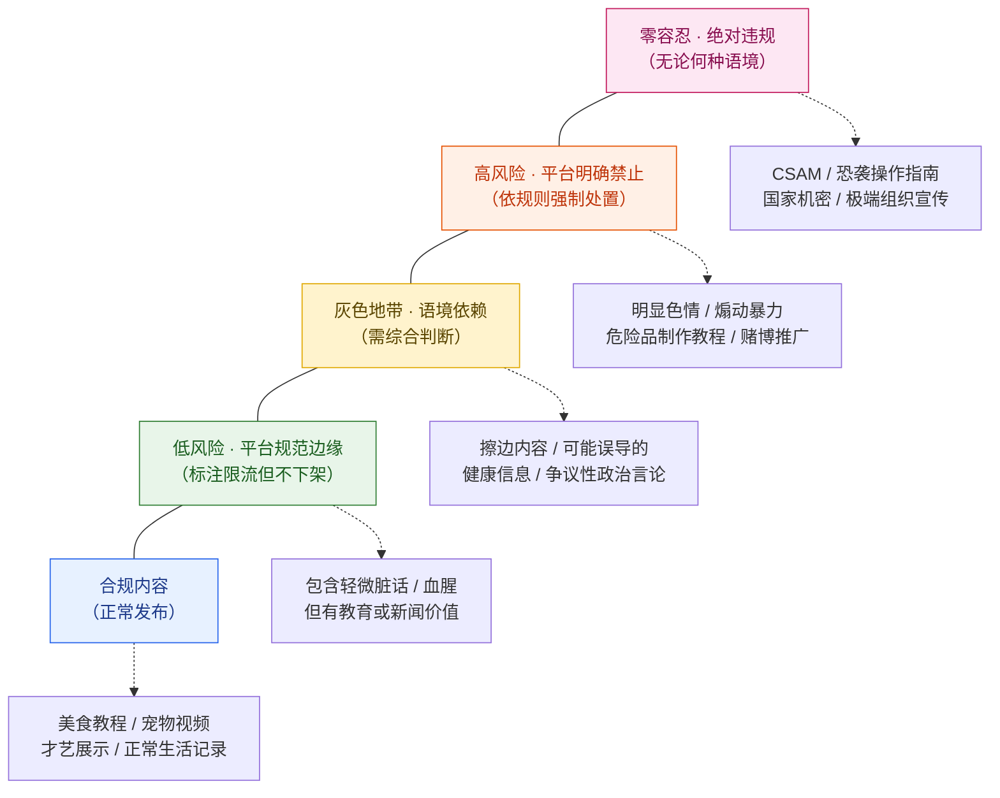
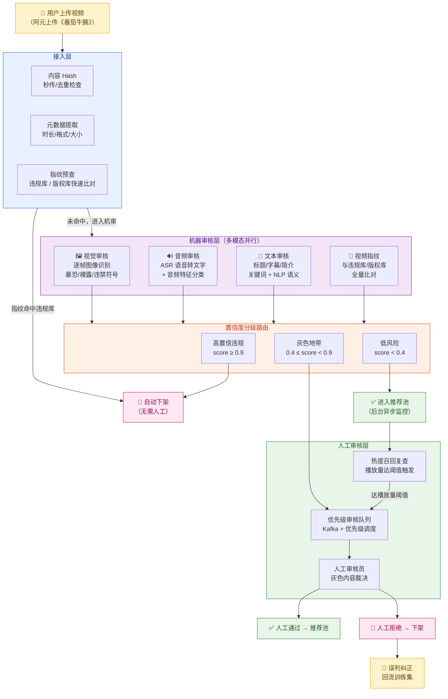
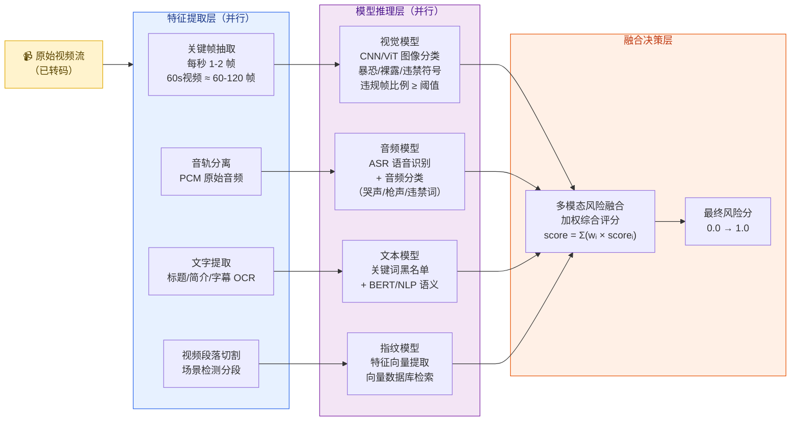
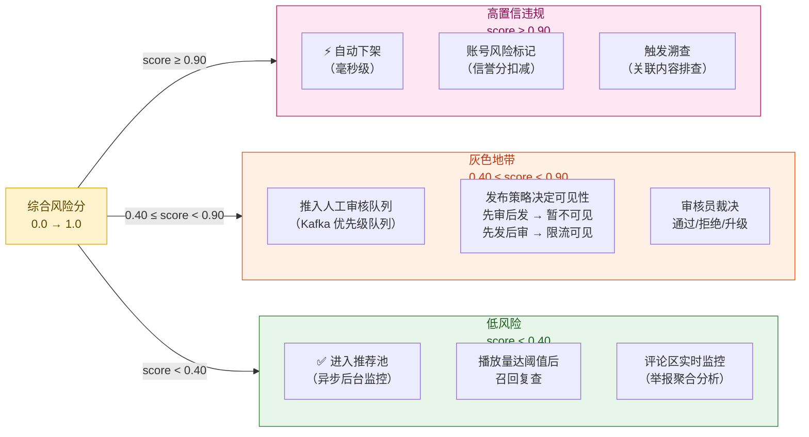
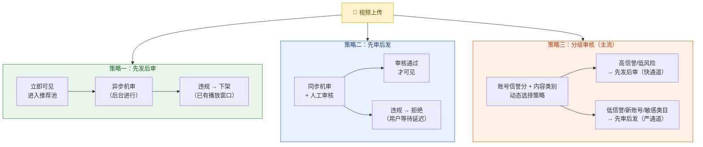
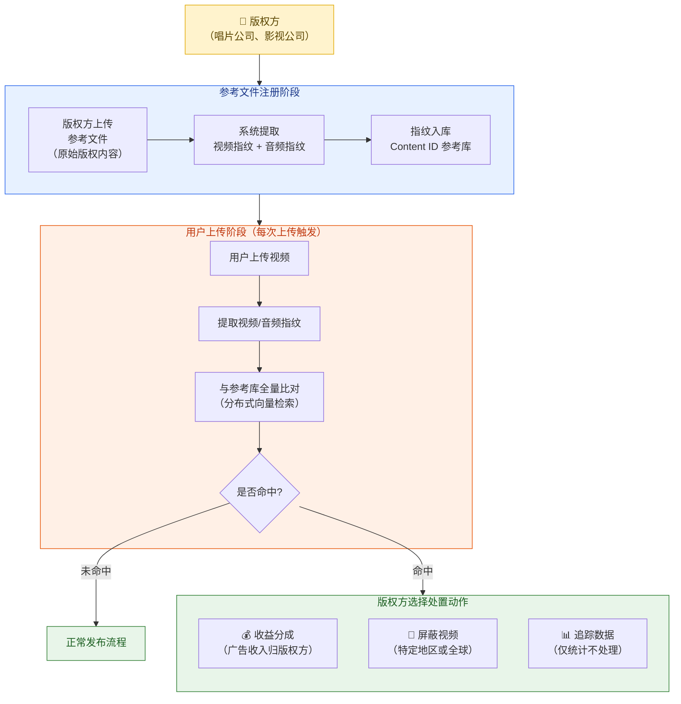
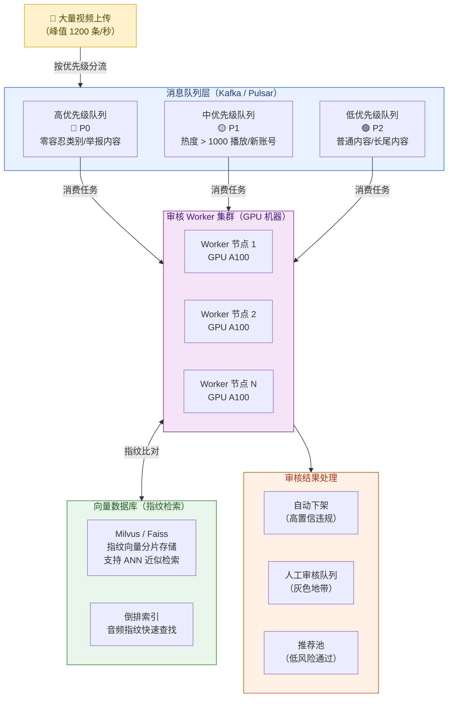
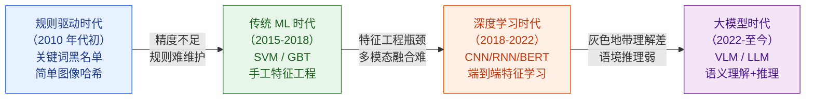
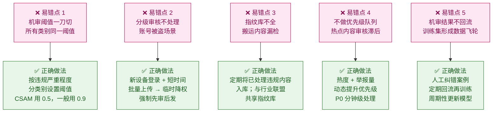

# 第 14 章 · 内容安全与审核

---

## 本章导读

2017 年底，今日头条因内容监管问题被主管部门约谈整改，旗下产品被全面下架整改数天，损失不可估量。2019 年，TikTok 因向美国未成年人收集数据被美国 FTC 开罚 570 万美元。2021 年，Twitch 因未能有效阻止暴力直播在欧洲遭遇监管压力。**内容安全不是加分项，是平台存亡线。**

在「闪刷」平台，阿元上传《番茄牛腩》的那一刻，审核系统便悄悄启动：视觉模型扫描每一帧画面是否存在违禁符号，语音识别把菜谱讲解转成文字核查是否涉及违规内容，文字检测扫描标题与字幕，指纹引擎与千亿级违规库逐一比对——整个过程在数秒内完成。与此同时，一个不法搬运者将阿元的视频二次上传，指纹系统在上传阶段即命中比对，视频被秒级拦截，搬运者甚至不知道自己被拦了。

本章覆盖整条内容安全的工程体系：审核流水线全景、机器多模态审核的并行架构、置信度分级路由、三种审核发布策略、内容指纹原理与 YouTube Content ID 工程实践、查重与搬运识别、亿级日上传的审核吞吐方案，以及大模型正在重塑这一切的趋势。

> **贯穿案例**：阿元的《番茄牛腩》如何秒级通过审核进入推荐池（多模态机审通过 + 高信誉分先发后审通道）；搬运者复制同一视频如何被指纹识别在毫秒级拦截。

---

## 14.1 为什么审核是平台生命线

### 14.1.1 四条绞索：平台为什么必须做内容安全

| 威胁维度 | 具体后果 | 真实案例 |
|---------|---------|---------|
| **法律合规** | 违规内容导致平台被关停、高额罚款、高管被追责 | TikTok 美国被罚 570 万美元；今日头条被下架整改 |
| **平台责任** | "平台知情不作为"在多数司法管辖区构成连带责任 | CSAM（儿童性剥削内容）零容忍，美国 EARN IT Act |
| **用户体验** | 暴恐/色情/仇恨内容污染用户体验，导致流失 | YouTube 2017 年"广告末日"前后用户信任下降 |
| **广告主品牌安全** | 品牌广告紧邻违规内容出现，广告主撤量 | YouTube 2017 年 AT&T/Verizon 等大规模撤广告 |

**广告主品牌安全**值得特别展开：这是平台商业化的软肋。当广告主发现自家奶茶广告出现在一条仇恨言论视频旁边，品牌形象受损的舆论压力会迫使他们集体撤离平台。2017 年，YouTube 在一周内损失了数百家广告主，直接损失超数亿美元——**内容安全破防的经济代价远超审核成本**。

### 14.1.2 内容违规的层次



**工程难点在 L2 灰色地带**：机器难以准确判断，但数量庞大。内容审核系统设计的核心挑战，是用最少的人工成本把 L2 处理准确。

---

## 14.2 审核流水线全景

### 14.2.1 全景架构图



### 14.2.2 接入层：三道前置检查

视频上传后，**不直接进入重量级机审**，先经过三道轻量级前置检查，以最低成本拦截最明显的违规：

**① 内容 Hash 秒传/去重**（见第 3 章）：MD5/SHA256 检查是否与已知违规视频完全一致。完全一致的 Hash 命中直接拒绝，计算成本极低。

**② 元数据提取**：时长、分辨率、文件格式、上传 IP、账号信誉分等基础元数据，为后续路由决策提供上下文。

**③ 指纹预查**：在完整机审之前，先用视频指纹（见 14.5 节）做**快速比对**：命中违规指纹库则直接下架，命中版权库则触发版权处理流程（收益分成/屏蔽），未命中则进入完整机审。指纹比对的平均延迟在秒级，可在机审前大量过滤已知违规内容。

### 14.2.3 贯穿案例：阿元的视频通过了什么

> 阿元上传《3 分钟搞定番茄牛腩》（60 秒，720P，账号信誉分 92/100，历史违规记录 0）。
>
> **接入层**：Hash 未命中违规库，元数据正常，指纹预查未命中，进入机审队列。
>
> **机审层**（并行，约 3-5 秒）：视觉审核扫描 60 帧，无暴恐/裸露/违禁符号，最高帧风险分 0.02；音频 ASR 转录"热锅、番茄、牛腩……"无触发词；文字审核扫描标题/简介，语义正常；指纹全量比对未命中。
>
> **置信度路由**：综合风险分 0.03，远低于 0.4，判定低风险。
>
> **发布策略**：账号信誉分 92 分，走先发后审通道，视频**秒级进入推荐池**，同时异步挂载后台监控。
>
> **结果**：小南在上传后 8 秒刷到了这条视频。

---

## 14.3 机器审核层：多模态并行

### 14.3.1 多模态并行架构

短视频是一个多模态信息载体：同一帧画面可能视觉合规但配音违规；文字标题可能暗示违禁内容但视频本身正常。**单一模态审核存在严重盲区，必须多模态并行**。



### 14.3.2 视觉审核：逐帧图像识别

**工作原理**：

```python
# 视觉审核伪代码：逐帧扫描，计算违规帧比例
def visual_audit(video_path: str, sample_fps: int = 1) -> dict:
    """
    对视频进行视觉审核。
    每秒抽取 sample_fps 帧，对每帧运行多分类模型。
    返回各违规类别的帧比例和最高置信度。
    """
    frames = extract_keyframes(video_path, fps=sample_fps)
    # 分类标签：正常/色情/暴恐/违禁符号/仇恨标志/儿童不宜
    labels = ["normal", "porn", "violence", "banned_symbol", "hate", "age_restricted"]

    frame_results = []
    for frame in frames:
        # 使用 ViT/ResNet 等图像分类模型
        scores = image_classifier.predict(frame)  # shape: [num_labels]
        frame_results.append({
            "label": labels[scores.argmax()],
            "scores": dict(zip(labels, scores.tolist()))
        })

    # 统计各违规类别的帧比例
    violation_ratio = {}
    for label in labels[1:]:  # 排除 normal
        count = sum(1 for r in frame_results if r["label"] == label)
        violation_ratio[label] = count / len(frames)

    # 最高违规置信度（取任意一帧的最高分）
    max_scores = {}
    for label in labels[1:]:
        max_scores[label] = max(r["scores"][label] for r in frame_results)

    return {
        "violation_ratio": violation_ratio,    # 违规帧占比
        "max_scores": max_scores,              # 各类别最高置信度
        # 决策：任意违规类别帧比例 > 10% 或最高分 > 0.9 则告警
        "visual_risk_score": max(
            max(violation_ratio.values()) * 0.6,
            max(max_scores.values()) * 0.4
        )
    }
```

**关键设计**：
- **不是全帧扫描**，而是以每秒 1-2 帧的频率抽帧（60s 视频约 60-120 帧），在准确率与计算成本间平衡
- **违规帧比例**比单帧最高分更可靠：1 帧偶尔触发可能是误判，但 10+ 帧持续触发则高可信度
- 对"暴恐"类采用更低阈值（宁可误杀），对"裸露"类区分软色情与硬色情分级处理

**场景类别**：

| 违规类别 | 检测模型 | 典型误判场景 |
|---------|---------|------------|
| 色情/裸露 | NSFW 分类器（基于 ResNet/ViT） | 穿泳衣的运动视频、医学解剖内容 |
| 暴力/血腥 | 暴力识别模型 | 食材处理（剔骨、切肉）、格斗体育 |
| 违禁符号 | OCR + 符号识别 | 历史研究视频、学术内容 |
| 仇恨标志 | 仇恨识别模型 | 历史影像、纪录片截图 |
| 危险行为 | 行为识别模型 | 极限运动、消防演练 |

### 14.3.3 音频审核：ASR + 音频特征分类

**双路并行**：

```
音轨
 ├── 路径 A：ASR（自动语音识别）→ 转录文本 → 文本审核
 └── 路径 B：音频特征分类 → 识别枪声/爆炸/嚎叫/特定旋律
```

**ASR 转录**：将视频中的人声转成文字，送入文本审核模块。关键词"如何制作爆炸物"不会出现在视觉帧里，但会出现在语音里。ASR 质量决定了音频审核的上限——方言、口音、快语速会导致漏检。

**音频特征分类**：语音之外的声音特征，例如：
- 枪声/爆炸声（暴力内容信号）
- 特定歌曲/背景音乐（版权检测）
- 儿童声音（潜在 CSAM 信号）

### 14.3.4 文本审核：关键词 + NLP 语义

**两层联动**：

```
输入：标题 + 简介 + 字幕（OCR）+ 弹幕/评论（异步）
 ├── 第一层：关键词黑名单（Trie 树 + AC 自动机，微秒级匹配）
 │   命中 → 直接高风险
 │   未命中 → 进入第二层
 └── 第二层：NLP 语义理解（BERT/RoBERTa 微调）
     捕捉语义绕过：
     - 谐音字："暴/爆/抱力"
     - 拼音缩写："csam" → CSAM
     - 符号替换："s.h.a.b.o."
     - 上下文语境："这个药方很危险"
```

**易错点：关键词黑名单的双刃剑效应**

过于宽泛的黑名单会造成大量误杀。"炸弹"可以出现在"炸弹汉堡包食谱"中，"毒"可以出现在"毒辣火锅推荐"中。**关键词命中只作为信号，不直接触发下架**，需结合语义上下文综合判断。

### 14.3.5 多模态融合决策

$$\text{risk\_score} = w_v \cdot s_v + w_a \cdot s_a + w_t \cdot s_t + w_f \cdot s_f$$

其中：
- $s_v$：视觉风险分（Visual）
- $s_a$：音频风险分（Audio）
- $s_t$：文本风险分（Text）
- $s_f$：指纹命中分（Fingerprint）
- 权重 $w_v + w_a + w_t + w_f = 1$，通常 $w_f$ 最高（指纹命中意味着已知违规内容）

**不同违规类别权重不同**：暴恐内容视觉权重高；言论类内容文本权重高；版权内容指纹权重最高。

---

## 14.4 置信度分级路由

### 14.4.1 三档路由设计



### 14.4.2 阈值设定的工程权衡

$$\text{误杀率 (FPR)} \uparrow \Leftrightarrow \text{下调阈值} \Leftrightarrow \text{漏检率 (FNR)} \downarrow$$

这是经典的精确率-召回率权衡。**不同内容类别应采用不同阈值**：

| 违规类别 | 高置信下架阈值 | 设计原因 |
|---------|-------------|---------|
| CSAM（儿童性剥削）| **0.50**（宁可误杀）| 零容忍，误杀代价远小于漏检 |
| 恐袭操作指南 | **0.60** | 高危，误判可申诉 |
| 色情/裸露 | **0.80** | 与运动/医学有较高混淆 |
| 暴力/血腥 | **0.85** | 与格斗体育/食材处理混淆 |
| 违规推广/诱导 | **0.90** | 灰色地带多，误杀影响大 |

### 14.4.3 易错点：阈值一刀切的两个后果

**阈值过严（过低）→ 误杀率上升**：
- 正常美食视频（切肉画面）被批量下架
- 创作者投诉激增，平台口碑受损
- 真实案例：YouTube 2021 年算法更新导致大量正常视频被误杀

**阈值过松（过高）→ 漏检率上升**：
- 违规内容进入推荐池获得曝光
- 监管部门介入，品牌广告主撤量
- 真实案例：Twitch 曾因漏检暴力直播被欧洲监管机构警告

> **最佳实践**：针对不同内容类别分别调优阈值，结合定期离线评估（随机抽样人工复核计算误杀/漏检率）持续迭代。

### 14.4.4 热度召回复查机制

**问题背景**：低风险内容（score < 0.4）直接进入推荐池，但机审并非完美——某些违规内容在低置信度下也会流入。热度召回是兜底机制：

```
触发条件：
├── 播放量达到阈值（如 10 万播放）→ 触发人工复查
├── 用户举报数超阈值（如 100 举报/小时）→ 优先队列
├── 评论区违规词浓度超阈值 → 触发内容关联审查
└── 关联账号新标记违规 → 溯查同账号历史内容
```

热度越高，伤害半径越大。**越热的视频越要复查**，这是内容安全的基本逻辑。

---

## 14.5 三种审核发布策略

### 14.5.1 三种策略对比



### 14.5.2 三种策略详细对比表

| 维度 | 先发后审 | 先审后发 | 分级审核 |
|------|---------|---------|---------|
| **发布延迟** | 极低（秒级可见） | 高（分钟~小时） | 按信誉动态（秒级~小时） |
| **违规窗口** | 存在（机审完成前） | 几乎无 | 高信誉有窗口，低信誉无 |
| **适用场景** | 大众低风险内容 | 新账号/敏感类目 | 主流平台的生产实践 |
| **用户体验** | 最佳（即时可见） | 差（等待感强） | 优质创作者最佳 |
| **安全性** | 一般 | 最高 | 高（动态平衡） |
| **人审压力** | 低（机审后置处理） | 高（所有内容过人审） | 中（按风险分流） |
| **典型案例** | 抖音普通内容 | 抖音新人/敏感词 | 抖音信誉积分体系 |

### 14.5.3 分级审核的核心：账号信誉分

**信誉分**是分级审核的核心决策依据，动态计算，综合多维信号：

$$\text{信誉分} = f(\text{历史违规率}, \text{发布时长}, \text{粉丝量}, \text{平台认证}, \text{近期行为})$$

```python
# 信誉分计算示例（简化版）
def calc_reputation_score(account: dict) -> float:
    """
    综合多维信号计算账号信誉分（0-100）。
    分数越高，内容安全风险越低，走快通道。
    """
    score = 50.0  # 基础分

    # 历史违规率（权重最高）
    violation_rate = account["violations_30d"] / max(account["uploads_30d"], 1)
    score -= violation_rate * 40  # 违规率 10% 扣 4 分，100% 扣 40 分

    # 账号年龄
    if account["account_age_days"] > 365:
        score += 15
    elif account["account_age_days"] > 90:
        score += 8

    # 粉丝量（一定程度上代表内容质量）
    if account["followers"] > 1_000_000:
        score += 10
    elif account["followers"] > 100_000:
        score += 5

    # 平台官方认证
    if account["verified"]:
        score += 10

    # 近期良好行为加成（连续 30 天零违规）
    if account["days_since_last_violation"] >= 30:
        score += 5

    return max(0.0, min(100.0, score))

# 根据信誉分选择审核策略
def select_audit_strategy(reputation: float, content_category: str) -> str:
    SENSITIVE_CATEGORIES = {"政治", "医疗健康", "金融理财", "成人内容"}
    if content_category in SENSITIVE_CATEGORIES:
        return "pre_audit"     # 敏感类目强制先审后发
    if reputation >= 80:
        return "post_audit"    # 高信誉 → 先发后审
    elif reputation >= 50:
        return "post_audit_limited"  # 中等信誉 → 先发但限流
    else:
        return "pre_audit"     # 低信誉/新账号 → 先审后发
```

### 14.5.4 抖音的实践

据抖音公开资料与行业披露：
- **普通内容**：机审通过后先发后审，延迟极低
- **敏感词触发 / 新注册账号**：走先审后发，发布延迟 5-30 分钟
- **信誉积分体系**：高信誉创作者享受更宽松的发布通道，甚至对部分内容跳过人审直接入库
- **特殊类目**：金融理财、医疗健康、儿童相关内容强制先审后发

### 14.5.5 易错点：分级审核对账号被盗的盲区

**这是最容易被忽视的系统漏洞**：

> 场景：百万粉丝创作者阿元的账号被黑客盗取。黑客利用账号的高信誉分（信誉分 92）走快通道，在 30 分钟内连续发布 50 条违规视频，每条视频秒级进入推荐池，30 分钟内每条获得数万次播放——所有伤害发生在人审介入之前。

**根因**：信誉分绑定在账号上，但**账号操作者身份突变**（盗号）无法被信誉分捕获。

**防御方案**：
1. **异常行为监测**：短时间内上传频率突增（如 1 小时内上传 10+ 条）自动触发人工复查
2. **登录设备变更降权**：账号从新设备/新 IP 登录，临时降低信誉分或强制先审后发
3. **视频内容相似度检测**：连续发布内容与历史风格差异过大，触发人工审核
4. **双因素风控**：大账号的内容发布需要额外验证

---

## 14.6 内容指纹（Content Fingerprint）

### 14.6.1 什么是内容指纹

**内容指纹**（Content Fingerprint）是从视频/音频中提取的、能够稳健代表内容"身份"的多维特征向量——内容的"数字 DNA"。

**核心特性：鲁棒性（Robustness）**

内容指纹必须对常见的二次编辑保持稳定识别能力：

| 二次编辑方式 | 说明 | 指纹是否仍能匹配 |
|------------|------|--------------|
| 视频压缩/转码 | 画质降低，文件大小缩小 | ✅ 应匹配 |
| 变速播放 | 1.25x / 1.5x 倍速 | ✅ 应匹配 |
| 添加水印/字幕 | 遮挡部分画面 | ✅ 应匹配 |
| 画面裁剪 | 裁掉边缘部分 | ✅ 应匹配（主体内容不变） |
| 色彩调整 | 亮度/对比度/滤镜 | ✅ 应匹配 |
| 音频添加噪音 | 背景音乐叠加 | ✅ 应匹配 |
| 镜像翻转 | 水平翻转画面 | ✅ 应匹配（需处理） |
| 画中画嵌套 | 将原视频缩小嵌入新画面 | ✅ 部分匹配 |
| 片段拼接 | 仅使用原视频 5% 内容 | ❌ 可能不匹配（依阈值） |

### 14.6.2 视频指纹技术原理

**传统方法：感知哈希（Perceptual Hash）**

对每帧图像计算感知哈希值，相似图像的哈希距离小：

```python
import hashlib
import imagehash
from PIL import Image

def compute_video_fingerprint_phash(video_path: str, sample_fps: int = 1) -> list:
    """
    基于感知哈希的视频指纹提取（简化版）。
    对每帧计算 pHash（感知哈希），组成帧指纹序列。
    """
    frames = extract_keyframes(video_path, fps=sample_fps)
    fingerprint = []
    for frame in frames:
        img = Image.fromarray(frame)
        # pHash: 将图像缩放到 32x32，DCT变换后取低频系数的中值哈希
        h = imagehash.phash(img, hash_size=16)  # 256 bit 哈希
        fingerprint.append(str(h))
    return fingerprint  # 帧指纹序列

def similarity(fp1: list, fp2: list) -> float:
    """
    计算两段视频的指纹相似度（基于帧对齐相似比例）。
    简化：对应帧哈希 Hamming 距离 < 阈值则认为相似。
    """
    HAMMING_THRESHOLD = 10  # 256 bit 哈希，允许 10 bit 差异
    min_len = min(len(fp1), len(fp2))
    if min_len == 0:
        return 0.0
    matches = 0
    for h1, h2 in zip(fp1[:min_len], fp2[:min_len]):
        # imagehash 对象支持直接减法得 Hamming 距离
        if abs(imagehash.hex_to_hash(h1) - imagehash.hex_to_hash(h2)) < HAMMING_THRESHOLD:
            matches += 1
    return matches / min_len
```

**深度学习方法（主流）**：

传统感知哈希对复杂变换（旋转、大幅裁剪）鲁棒性不足。现代平台使用**深度神经网络提取高维特征向量**：

```python
# 基于 DNN 的视频指纹提取（伪代码）
def extract_deep_fingerprint(video_path: str) -> list[list[float]]:
    """
    使用预训练 CNN/ViT 提取视频段落级特征向量。
    输出：N 个场景段落的特征向量，每个向量 dim=512/1024
    """
    scenes = detect_scene_boundaries(video_path)  # 场景切割
    fingerprints = []
    for scene_clip in scenes:
        # 对每个场景段落抽取代表帧
        key_frame = extract_representative_frame(scene_clip)
        # 使用 CNN/ViT backbone 提取特征（去掉分类头，取 embedding）
        embedding = vision_backbone.encode(key_frame)  # [1, 512]
        # L2 归一化，便于余弦相似度计算
        embedding = embedding / embedding.norm(dim=-1, keepdim=True)
        fingerprints.append(embedding.squeeze().tolist())
    return fingerprints  # 段落级指纹向量列表
```

**指纹比对**：将提取的特征向量存入向量数据库（Milvus/Faiss），新上传视频提取指纹后进行 **ANN（近似最近邻）检索**：

$$\text{similarity}(\mathbf{v}_1, \mathbf{v}_2) = \frac{\mathbf{v}_1 \cdot \mathbf{v}_2}{\|\mathbf{v}_1\| \cdot \|\mathbf{v}_2\|}$$

余弦相似度 $> 0.85$（可调）则认为是同源内容。

### 14.6.3 音频指纹

音频指纹与视频指纹互补，专门针对"换画面保留音轨"的搬运方式：

```
音频指纹提取流程：
原始音频
 → 分帧（32ms 窗口，50% 重叠）
 → 频谱分析（STFT）
 → 能量差分特征（Landmark）
 → 哈希化形成音频指纹
 → 存入倒排索引
```

**音频指纹的鲁棒性**：对背景噪音、音量变化、变速（±20%）、音调偏移（±2 半音）保持稳定。Shazam 使用的就是类似的音频指纹技术（Landmark-based audio fingerprinting）。

---

## 14.7 YouTube Content ID：版权指纹工程实践

### 14.7.1 Content ID 的工作流程

YouTube Content ID 是目前最成熟的版权级内容指纹系统，也是内容安全工程的教科书案例。



### 14.7.2 Content ID 的工程规模

| 维度 | 数据 |
|------|------|
| 参考文件库规模 | 超过 **9000 万条**参考文件 |
| 每日扫描视频量 | 每天上传约 **50 万小时**内容，全部扫描 |
| 比对完成时间 | 上传完成后**数分钟内**完成全量比对 |
| 版权方数量 | 超过 **9000 家**内容合作伙伴 |
| 年度版权方收益 | 通过 Content ID 向版权方支付超 **30 亿美元/年** |

**工程挑战**：9000 万条参考文件的全量指纹比对，每次上传都要触发，延迟要求分钟级。这依赖**分布式向量检索**（类似 ANN 算法，见第 8 章），将指纹向量分片存储在集群中并行检索。

### 14.7.3 贯穿案例：搬运者被指纹拦截

> 某用户（搬运者）将阿元的《番茄牛腩》视频下载后，稍作色彩调整（降低饱和度，加了一个滤镜），重新上传到「闪刷」。
>
> **接入层指纹预查**：
> 1. 系统对上传视频提取视频指纹（DNN backbone 特征向量）
> 2. 与违规库/版权库进行向量检索，余弦相似度最高命中 **0.93**（原视频）
> 3. 阈值 0.85，判定为同源内容
> 4. 查询原视频状态：阿元已标记为原创内容
>
> **处置**：上传在接入层被拦截，用户收到"内容与已有原创视频重复"提示，视频未进入审核队列。
>
> **全过程耗时**：约 2-3 秒（指纹提取 + 向量检索）

**色彩滤镜为什么没有绕过**：DNN 特征向量捕获的是内容的语义特征（物体形状、场景结构、运动模式），对色彩变换不敏感。单纯的色彩调整无法改变深度特征向量的空间位置。

---

## 14.8 查重与搬运识别

### 14.8.1 站内重复检测

指纹技术不仅用于外部版权比对，也用于**站内查重**——防止同一视频被多账号重复发布，以及平台激励政策仅覆盖原创内容：

```
站内查重流程：
新视频上传
 → 提取指纹向量
 → 与全平台历史视频指纹库比对
   ├── 相似度 > 0.90 → 判定为重复内容
   │   ├── 同账号重复发布 → 合并或提示
   │   └── 跨账号重复 → 原创认定（谁先发谁是原创）
   └── 相似度 0.70-0.90 → 疑似搬运，标记人工确认
```

**B 站的激励政策实践**：B 站创作激励计划（播放量分成）**明确排除搬运内容**。系统通过视频指纹识别搬运行为，搬运视频不计入创作激励，也不享受推荐流量扶持。

### 14.8.2 跨平台搬运检测

**更难的问题**：从其他平台（抖音、YouTube）下载后上传到「闪刷」的跨平台搬运内容。

处理方式：
1. **指纹交叉匹配**：平台间指纹库共享（行业联盟方式，如 PhotoDNA，主要针对 CSAM）
2. **水印技术**：在视频发布时嵌入隐写水印（视觉不可见），搬运后水印依然存在
3. **原创申报机制**：创作者主动申报原创，平台通过指纹保护其内容

**隐写水印（Steganography）**：

在视频的 DCT 系数或像素值中嵌入不可见的标识信息（账号 ID + 时间戳），对编码压缩、色彩调整、部分裁剪保持鲁棒。即使视频被搬运到其他平台，提取水印即可溯源至原始账号。

---

## 14.9 审核吞吐与时效：亿级日上传的工程方案

### 14.9.1 规模挑战

「闪刷」平台日上传 **5000 万条**视频，每条平均 60 秒。机审流水线的计算量：

$$\text{日均处理量} \approx 5000\text{万条} \times 60\text{帧/条} = 30\text{亿帧}$$

$$\text{峰值 QPS} \approx \frac{5000\text{万条}}{86400\text{秒}} \times 2\text{（峰值系数）} \approx 1200\text{条/秒}$$

1200 条/秒并不是无法承受的量，**核心瓶颈不在于单机性能，而在于整体系统的解耦与调度**。

### 14.9.2 审核队列调度架构



### 14.9.3 优先级队列的设计逻辑

**为什么不是 FIFO（先进先出）？**

如果所有内容平等排队，问题是：
- 长尾低风险视频（占总量 90%+）堵塞队列
- 高热度内容（潜在伤害大）等待时间与普通内容相同
- 举报密集的内容得不到及时处理

**优先级策略**：

| 优先级 | 触发条件 | 期望处理时效 |
|-------|---------|------------|
| P0（紧急）| 用户举报 50+/小时、CSAM 疑似命中、实时违规关键词 | **分钟级** |
| P1（高）| 热度视频（播放量 > 1000）、新注册账号第一条视频 | **5-10 分钟** |
| P2（普通）| 一般内容、长尾低热度视频 | **30-60 分钟** |

**Kafka 优先级实现**：
```
# Kafka 不原生支持优先级队列，通常用多 Topic 模拟：
Topic: audit_p0_urgent      # 消费者优先消费
Topic: audit_p1_high
Topic: audit_p2_normal      # 空闲时消费

# Worker 消费顺序：先拉 p0，再拉 p1，最后拉 p2
# 通过 Consumer Group + Weight 实现加权消费
```

### 14.9.4 向量数据库在指纹检索中的作用

指纹比对是典型的**向量相似搜索**问题：给定新视频的特征向量，在千亿级历史指纹库中找最相似的 Top-K 个。

**规模估算**：
- 假设「闪刷」视频库 50 亿条，每条提取 10 个场景段落指纹
- 总指纹向量数：$50\text{亿} \times 10 = 500\text{亿}$
- 每个向量维度 512，float32 存储：$500\text{亿} \times 512 \times 4 \text{B} \approx 100\text{TB}$

这不可能做精确全量检索，必须使用 **ANN（近似最近邻）算法**（HNSW、IVF-PQ）将搜索时间从 $O(N)$ 降至 $O(\log N)$ 量级，接受少量精度损失换取百毫秒内完成检索。

| 方案 | 检索延迟 | 内存占用 | 准确率 | 适用场景 |
|------|---------|---------|-------|---------|
| Brute Force | $O(N)$，数分钟 | 100TB+ | 100% | 不可用于生产 |
| IVF-PQ（Faiss）| 10-100ms | 大幅压缩（压缩比 8-32x） | 95-98% | 生产首选 |
| HNSW | 1-10ms | 中等（原始向量 + 图结构）| 99%+ | 延迟敏感场景 |
| 混合（分层）| 5-50ms | 热数据 HNSW + 冷数据 IVF | 98%+ | 大规模生产 |

### 14.9.5 TikTok 公开数据：系统能力的真实数字

TikTok 在 2024 年透明度报告中披露了内容安全的关键指标：

| 指标 | 数据 | 含义 |
|------|------|------|
| 自动化删除比例 | **> 80%** | 超过 80% 的违规内容由机器自动删除，无需人工 |
| 有播放量前删除比例 | **> 96%** | 96%+ 的违规内容在获得任何播放量之前就被删除 |
| 24 小时内处理比例 | **> 98%** | 98% 以上的违规内容在上传 24 小时内被处理 |
| 阻止垃圾账号 | **> 20 亿** | 年度阻止超过 20 亿垃圾账号注册 |

这组数字的工程意义：**"在有播放量前删除"是最重要的单一指标**，它意味着违规内容在触达用户前就被拦截，最大程度降低伤害。实现 96% 的指标，需要接入层指纹预查 + 高效机审队列协同工作。

---

## 14.10 人工审核：规模、成本与组织

### 14.10.1 人审的不可替代性

机审再强大，也有无法独立解决的场景：

- **语境判断**："这段表达是讽刺还是支持？"——需要人类的文化常识
- **时事相关**：最新政治事件、突发新闻中的边界内容——训练数据滞后
- **新型违规手法**：作恶者持续探索机审盲区，新型手法需要人工发现并反馈训练
- **申诉处理**：创作者对机审下架提出申诉，需要人工复核

### 14.10.2 行业规模数据

| 平台 | 年份 | 审核员规模 | 背景 |
|------|------|---------|------|
| 字节跳动（今日头条/抖音）| 2018 | 从 6000 人扩张至 **1 万人** | 被主管部门约谈后快速扩编 |
| 快手 | 2019 | 从约 2000 人扩张至 **5000 人** | 短视频行业大规模合规整治期 |
| Facebook | 2019 | 约 **15000 人** | 含全球外包审核人员 |
| YouTube | 2019 | 约 **10000 人** | 含 Accenture 等外包团队 |

**成本极高**：以 1 万名审核员、平均人力成本 10 万元/年计算，仅人审一项年成本即超 **10 亿元**。这是大模型审核技术兴起的直接驱动力——降低需要人工干预的内容比例，就是降低运营成本。

### 14.10.3 人审的工具与效率

**审核员的任务**：处理灰色地带内容的最终裁决。

**关键效率指标**：
- **单条审核时长**：优化目标 < 15 秒/条，实际灰色内容可能需要 30-60 秒
- **每日审核量**：单人约 500-1000 条/天（取决于内容复杂度）
- **一致性（IAA，Inter-Annotator Agreement）**：相同内容不同审核员裁决一致率，目标 > 85%

**审核辅助工具**：
- 自动截取视频违规嫌疑片段（不需审核员看全片）
- 机审置信度分和触发原因自动展示
- 快捷键批量操作（通过/拒绝/升级）
- 实时 IAA 监控（同一内容双人审核比对）

---

## 14.11 大模型重塑审核：从规则到 VLM

### 14.11.1 审核技术演进路线



### 14.11.2 快手明镜大模型（KwaiBLM）

快手在 2023 年推出了专门用于内容审核的**多模态大语言模型 KwaiBLM（Kuaishou Blending Language Model）**，是国内最早公开披露的审核专用 VLM 之一。

**三阶段训练流程**：

| 阶段 | 训练目标 | 数据 | 作用 |
|------|---------|------|------|
| **阶段一：基础对齐** | 图文对齐预训练 | 大规模图文对数据 | 建立视觉-语言跨模态理解能力 |
| **阶段二：噪声过滤** | 低质训练数据过滤 | 内容安全标注数据 | 去除标注噪声，提升判断质量 |
| **阶段三：RLHF** | 强化学习对齐逻辑一致性 | 人类偏好数据（审核员反馈）| 减少前后矛盾的判断，提高一致性 |

**KwaiBLM 的核心价值**：

传统深度学习模型是"分类器"，回答"这个视频属于哪类？"；VLM 是"推理者"，能够回答"**这段内容为什么有问题**"，并给出理由——这正是处理灰色地带所需的能力。

> 示例：
> - 传统模型：图像包含刀具，风险分 0.6，分类"潜在暴力"
> - VLM：识别到该图像是厨师正在进行刀工演示，结合字幕"番茄牛腩的切肉技巧"，判定为正常烹饪教程，风险分 0.02

**工程价值**：大模型能够减少需要人工介入的灰色内容比例，**将人审比例从 10-20% 降至 3-5%**，是降低人审成本最有效的手段。

### 14.11.3 大模型审核的挑战

| 挑战 | 说明 | 应对方向 |
|------|------|---------|
| **推理延迟** | VLM 单次推理需要数百毫秒，远慢于轻量 CNN | 模型蒸馏 + 量化 + 专用推理硬件 |
| **部署成本** | 大模型显存占用大，单卡并发低 | 先用轻量模型过滤，大模型只处理灰色地带 |
| **幻觉问题** | LLM 可能给出似是而非的理由 | RLHF 对齐 + 多模型投票 |
| **数据隐私** | 违规内容包含大量敏感素材 | 本地化部署，不依赖外部 API |

### 14.11.4 实践建议：级联架构

```
内容输入
 │
 ├── 轻量模型（CNN/BERT）→ 快速过滤 → 明显合规（70%）直接通过
 │                                      明显违规（10%）直接下架
 │                                      灰色地带（20%）→ 进入大模型
 │
 └── VLM 大模型 → 深度推理 → 通过/拒绝/人工
```

**级联策略的工程意义**：大模型只处理灰色地带（约 20%），不处理全量内容，将大模型推理成本降低 **80%**，同时保留其在复杂语境判断上的优势。

---

## 14.12 常见易错点与系统陷阱

### 14.12.1 易错点汇总



### 14.12.2 经典问题：机审误杀申诉流程

**当阿元的视频被误杀时**：

```
机审误下架
 → 创作者在 App 内提交申诉（选择申诉原因）
 → 申诉进入高优先级人审队列（P0/P1）
 → 人工审核员复核（目标 24 小时内）
 → 判定误杀 → 视频恢复上架 + 机审样本库更新
 → 判定正确下架 → 维持决定 + 告知违规原因
```

**误杀统计**是评估机审质量的核心指标之一，目标是将误杀率（FPR）控制在千分之一量级（即每 1000 条正常内容最多误杀 1 条）。

---

## 14.13 审核系统的数据飞轮

```
上传内容
 → 机审（初始版本模型）
 → 人审裁决（灰色地带）
 → 审核结论存入标注库
       ↓
 定期（周/月）回流训练
       ↓
 更新机审模型（更准确的判断）
       ↓
 灰色地带缩小（需要人审的比例降低）
       ↓
 人审成本下降
```

**数据飞轮的护城河**：平台审核的内容越多，标注数据越丰富，模型越准确，灰色地带越窄，边际审核成本越低。这也是头部平台审核能力远优于新平台的根本原因——不仅是技术，更是数据积累。

---

## 本章小结

本章从内容安全的平台战略地位出发，系统讲解了整条内容审核工程链路：

1. **为什么做**：法律合规、平台责任、用户体验、广告主品牌安全四条绞索，任一失守都可能致命。

2. **审核流水线**：接入层三道前置检查（Hash/元数据/指纹预查）→ 机器多模态并行审核（视觉/音频/文本/指纹）→ 置信度三档路由（自动下架/人工队列/推荐池）→ 人工审核兜底 → 数据飞轮回流。

3. **三种发布策略**：先发后审（低延迟，有违规窗口）、先审后发（高安全，高延迟）、分级审核（主流，按信誉动态选择）。分级审核的核心漏洞是账号被盗场景，必须结合异常行为检测补充防御。

4. **内容指纹**：视频/音频的"数字 DNA"，鲁棒性强，是版权保护（Content ID）和搬运识别的核心技术。YouTube Content ID 年度向版权方支付超 30 亿美元，是目前最成熟的工业实践。

5. **吞吐与时效**：关键不是单机性能，而是 **Kafka 优先级队列解耦 + 向量数据库 ANN 检索**。TikTok 实现了 80% 违规自动删除、96% 在有播放前删除、98% 在 24 小时内处理的行业标杆。

6. **大模型趋势**：快手 KwaiBLM 三阶段训练（图文对齐→噪声过滤→RLHF）。VLM 真正的价值在于处理需要"语义推理"的灰色地带，级联架构（轻量模型过滤 + 大模型精判）是降低成本的最优解。

**平台内容安全能力的高低，最终体现在三个数字上**：机审自动拦截率（越高越好）、有播放量前删除率（越高越好）、人工审核误杀率（越低越好）。三个数字共同决定了平台安全与创作者体验的双重口碑。

---

> **衔接下一章**：内容安全守住了平台的"底线"，解决了"什么不能发"的问题。但平台要持续繁荣，还需要解决"谁来发、为什么发、发了有什么回报"的问题——这就是第 15 章要讲的**创作者生态**。创作者生态的本质，是在公平的流量分配机制下，用激励体系吸引优质内容供给，把阿元这样的创作者留在平台上持续输出。

---

## 参考来源

1. **TikTok 透明度报告 2024**（Community Guidelines Enforcement Report）：自动化删除比例 >80%、有播放量前删除 >96%、24h 处理 >98%、阻止 20 亿垃圾账号等核心数据来源。  
   [https://www.tiktok.com/transparency/en/community-guidelines-enforcement/](https://www.tiktok.com/transparency/en/community-guidelines-enforcement/)

2. **YouTube Content ID 官方文档**：版权方注册参考文件、指纹比对机制、版权方处置选项（收益/屏蔽/追踪）、9000 万参考文件规模等数据。  
   [https://support.google.com/youtube/answer/2797370](https://support.google.com/youtube/answer/2797370)

3. **YouTube How Content ID works**（Google 工程博客）：Content ID 的技术实现原理，包括指纹生成与比对时效。  
   [https://www.youtube.com/intl/ALL_us/howyoutubeworks/product-features/rights-management/](https://www.youtube.com/intl/ALL_us/howyoutubeworks/product-features/rights-management/)

4. **快手明镜大模型（KwaiBLM）技术报告**（快手 AI 团队，2023）：多模态内容安全大模型，三阶段训练流程（图文对齐→噪声过滤→RLHF），替代传统规则引擎。  
   [https://arxiv.org/abs/2309.02926](https://arxiv.org/abs/2309.02926)

5. **字节跳动与今日头条整改事件**（2018）：字节跳动审核员规模从 6000 扩到 1 万人的行业背景，内容安全作为平台合规底线的典型案例。  
   [https://www.reuters.com/article/us-china-bytedance-idUSKBN1HH0KC](https://www.reuters.com/article/us-china-bytedance-idUSKBN1HH0KC)

6. **FTC vs. TikTok $5.7M COPPA Settlement**（2019）：TikTok 因向美国未成年人收集数据被罚款，内容安全合规压力的典型案例。  
   [https://www.ftc.gov/news-events/news/press-releases/2019/02/video-social-networking-app-musically-agrees-settle-ftc-allegations-it-illegally-collected-personal](https://www.ftc.gov/news-events/news/press-releases/2019/02/video-social-networking-app-musically-agrees-settle-ftc-allegations-it-illegally-collected-personal)

7. **YouTube's Brand Safety & Ad Suitability**（YouTube 官方）：2017 年"广告末日"背景，广告主品牌安全与内容治理的关联。  
   [https://www.youtube.com/intl/ALL_us/howyoutubeworks/our-commitments/brand-safety-and-suitability/](https://www.youtube.com/intl/ALL_us/howyoutubeworks/our-commitments/brand-safety-and-suitability/)

8. **PhotoDNA（Microsoft CSAM 指纹技术）**：哈希技术在 CSAM 检测中的工业应用，多平台指纹共享联盟机制。  
   [https://www.microsoft.com/en-us/photodna](https://www.microsoft.com/en-us/photodna)
