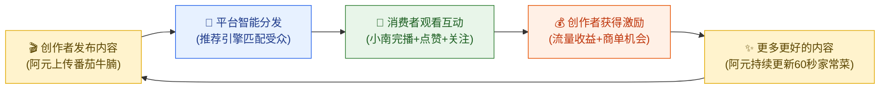
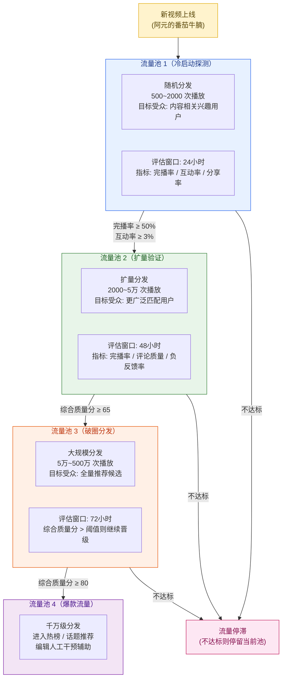
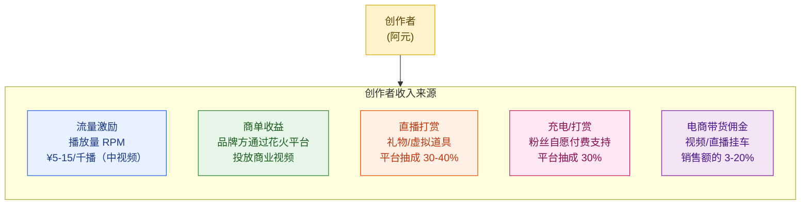
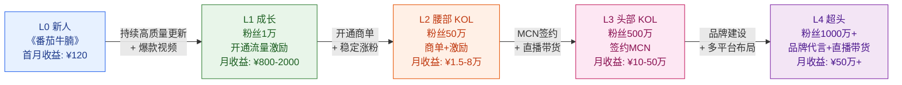
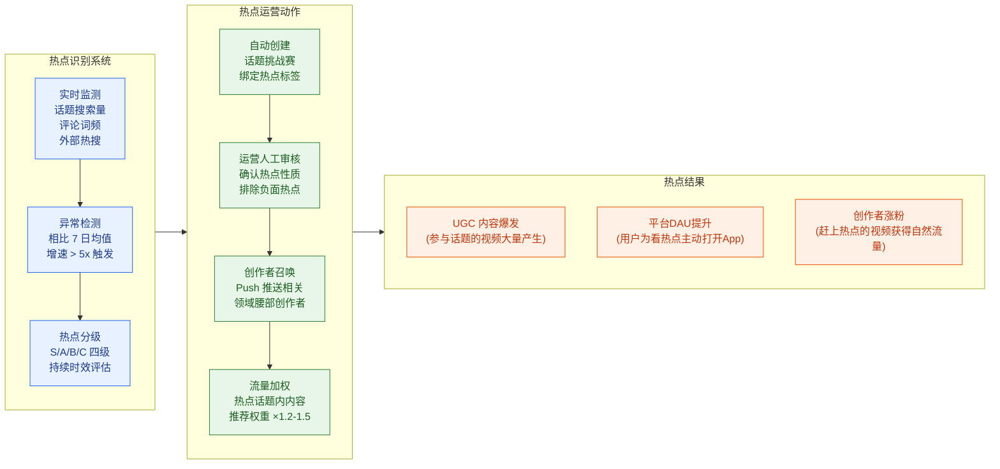
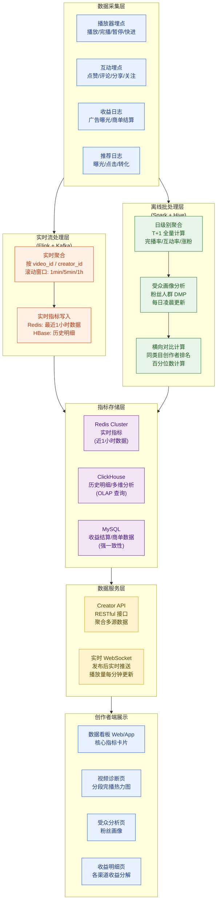
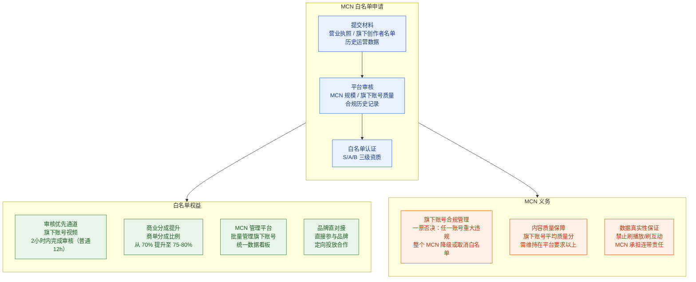
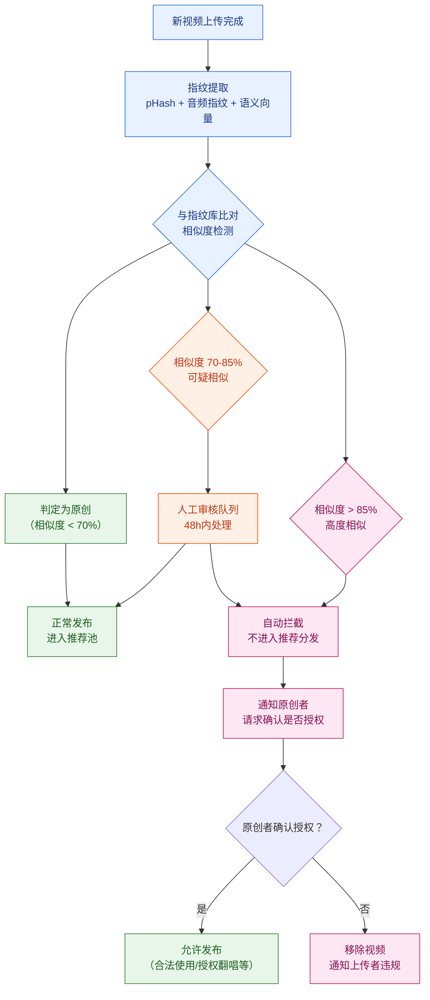
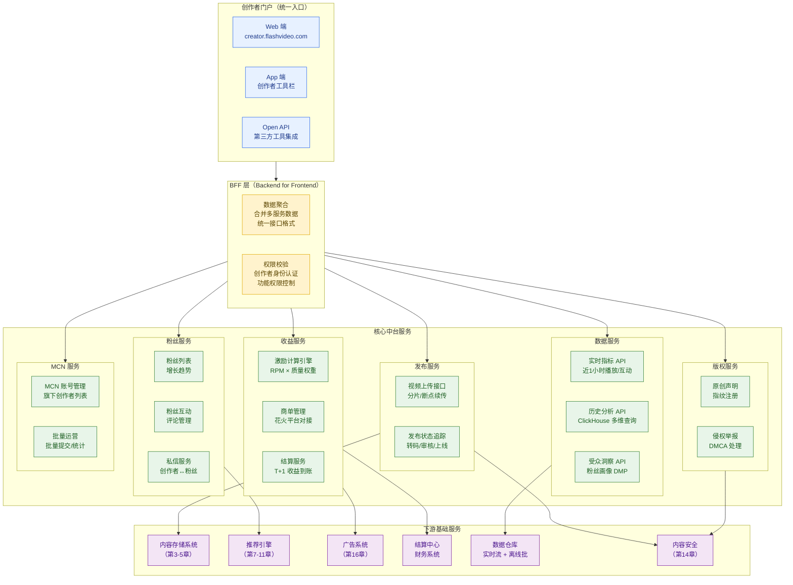

# 第 15 章 · 创作者生态与中台

> **系列定位**：本章是《短视频平台系统设计》第 15 章，承接第 14 章内容安全与审核，聚焦平台的供给侧——创作者生态。创作者是短视频平台内容的根本来源，理解创作者的激励、流量分配、数据工具和生态治理，是理解整个平台商业模式的基础。下一章（第 16 章）将在此基础上讨论商业化与广告变现。

---

## 本章导读

美食创作者**阿元**注册了「闪刷」短视频平台，上传了第一条视频《3 分钟搞定番茄牛腩》。此后半年，阿元经历了这样一段成长旅程：

- **冷启动期**：第一条视频获得 500 次播放的初始流量池，完播率 74%，系统推入更大流量池，3 天内涨粉 3000。
- **爆款期**：《番茄牛腩》引发美食话题挑战，单视频播放 5000 万，当月涨粉 80 万。
- **变现期**：通过创作者中台看到收益仪表盘，开通商单接 4 个品牌，月入 3.2 万元。
- **签约 MCN**：加入「味觉工厂」MCN 机构，享受平台优先审核通道和更高商业分成。
- **数据复盘**：在创作者数据看板发现 30-45 岁女性用户完播率最高，于是专攻"家庭厨房"内容方向，粉丝量突破 500 万。

这条成长路径，涵盖了本章要讨论的全部核心系统：**流量分发公平性、创作者激励机制、内容热点运营、数据看板与中台、MCN 管理、版权保护**。

本章结构如下：

- **§15.1**：创作者生态为什么是平台命脉——内容飞轮与激励闭环
- **§15.2**：流量分发公平性——冷启动流量池与新人扶持机制
- **§15.3**：创作者激励机制——分成模型、主流平台对比、公式设计
- **§15.4**：内容标签体系与热点运营——打标、话题挑战赛
- **§15.5**：创作者数据看板与数据中台——实时指标、视频诊断、受众分析
- **§15.6**：MCN 管理——定义、白名单机制、与个人创作者的隔离
- **§15.7**：版权保护——内容指纹、搬运拦截、原创激励
- **§15.8**：创作者中台整体架构——统一收口与服务编排
- **§15.9**：易错点与常见反模式

---

## 15.1 创作者生态为什么是平台命脉

### 15.1.1 内容供给侧的战略地位

短视频平台的本质是**双边市场**：一侧是生产内容的创作者，另一侧是消费内容的观众。推荐算法再强，如果没有优质内容可推，整个平台就是一个空架子。

在「闪刷」的 50 亿条视频库中，绝大多数来自 UGC（User Generated Content）创作者，其中头部 20% 的创作者贡献了约 80% 的有效播放量。但这条幂律分布背后有一个危险的隐患：**如果平台不持续激励新人创作者，头部创作者离开或停更时，整个生态将陷入供给危机**。

三类供给来源的对比：

| 供给类型 | 代表 | 优势 | 风险 |
|---------|------|------|------|
| **PGC**（专业生产）| 影视公司、媒体 | 内容质量高、稳定 | 成本极高、量少、不够个性化 |
| **PUGC**（半专业生产）| 头部/腰部 KOL | 质量与量的平衡 | 依赖平台激励，易被竞争对手挖走 |
| **UGC**（用户生成）| 普通创作者 | 海量长尾、贴近用户生活 | 质量参差不齐、新人流失率高 |

健康的创作者生态需要三者协同：UGC 提供内容多样性，PUGC 提供质量锚点，PGC 提供专业内容信任背书。

### 15.1.2 内容飞轮与激励闭环

内容生态的核心动力是一个正向飞轮：



飞轮的每个环节都有对应的系统支撑：

| 飞轮环节 | 核心系统 | 关键指标 |
|---------|---------|---------|
| 创作者发布 | 上传转码流水线（第 3-4 章）| 上传成功率、转码时效 |
| 平台智能分发 | 推荐引擎（第 7-11 章）| 分发公平性指数、新视频首日播放量 |
| 消费者互动 | 互动社交系统（第 12 章）| 完播率、点赞率、关注转化率 |
| 创作者获激励 | **创作者激励系统（本章重点）** | RPM、商单成交率、创作者月收入 |
| 内容质量提升 | 数据看板 + 内容标签（本章）| 创作者活跃留存率、内容质量分 |

**飞轮失速的典型路径**：平台削减激励预算 → 创作者收益下降 → 更新频次降低 → 内容质量下滑 → 用户流失 → 广告收入减少 → 进一步削减激励。这是一个负向螺旋，曾在多个平台身上真实发生过。

### 15.1.3 创作者分层模型

「闪刷」将创作者分为 5 个成长层级，每层的运营策略不同：

| 层级 | 粉丝量 | 占比 | 运营重点 |
|------|-------|------|---------|
| L0 新人 | < 1000 | 70% | 冷启动扶持、新人保护期 |
| L1 成长 | 1000 - 10万 | 22% | 数据指导、成长激励 |
| L2 腰部 | 10万 - 100万 | 6% | 商业化对接、内容扶持 |
| L3 头部 | 100万 - 1000万 | 1.8% | 独家合作、MCN 资源 |
| L4 超头 | > 1000万 | 0.2% | 战略合作、平台背书 |

---

## 15.2 流量分发公平性与新人扶持

### 15.2.1 为什么流量公平性是生态健康的基础

如果平台的流量完全遵循"强者愈强"的马太效应，新创作者将永远无法获得曝光，生态会逐渐固化为几百个超头部创作者垄断内容消费的局面。这对平台而言是极其危险的：一旦这些超头创作者集体出走（签约竞争平台或自建渠道），平台的内容供给将瞬间崩溃。

**生态健康性**要求在以下两个目标之间取得平衡：
1. **效率**：优质内容应该获得更多分发，保证用户体验
2. **公平性**：新人内容应有机会被评估，避免只因没有历史数据而永远被埋没

### 15.2.2 冷启动流量池机制

「闪刷」采用多级流量池（Waterfall Pool）机制来平衡效率与公平：



**流量池晋级的核心思想**：通过真实用户行为数据来评判内容质量，而不是依赖创作者的历史声誉。这样一条来自新人的优质视频，和头部创作者的优质视频，站在同等的起跑线上。

冷启动探测时，500-2000 次播放的种子用户是**精心挑选**的：
1. 从内容理解标签（§15.4 详述）中找到兴趣匹配的活跃用户
2. 加入 10-20% 的随机探索用户，避免兴趣偏窄
3. 优先选择**互动活跃**的用户（历史点赞/评论率高），他们更可能给出真实的行为信号

### 15.2.3 新人扶持机制

对于刚注册的创作者，「闪刷」设有**新人保护期（Creator Onboarding Program）**：

```python
def calculate_cold_start_boost(creator: Creator, video: Video) -> float:
    """
    计算新人流量加权系数
    新人保护期内，初始分发量乘以 boost 系数
    
    Returns:
        boost: 1.0 表示无加权；>1.0 表示额外扶持
    """
    days_since_register = (now() - creator.register_date).days
    video_count = creator.published_video_count

    # 注册 30 天内 + 发布视频 < 5 条：新人保护期
    if days_since_register <= 30 and video_count <= 5:
        base_boost = 1.5  # 初始分发量 ×1.5
        # 前 3 条视频额外加成（鼓励持续创作）
        if video_count <= 3:
            base_boost = 2.0
        return base_boost

    # 腰部创作者（1万-10万粉）成长加权
    if 10000 <= creator.follower_count <= 100000:
        return 1.2  # 腰部扶持，避免成长瓶颈

    return 1.0  # 头部创作者无额外加权
```

**新人保护期的具体权益**：

| 权益 | 说明 | 目的 |
|------|------|------|
| 冷启动流量加倍 | 前 5 条视频初始播放量 ×1.5-2.0 | 让新人有机会被发现 |
| 审核优先队列 | 新创作者视频优先进入审核，48h内完成 | 缩短从上传到发布的等待时间 |
| 新人成长任务 | 完成"发布第 3 条视频"等任务可领取流量奖励 | 培养发布习惯 |
| 新人数据课堂 | 系统向导引导查看数据看板 | 降低学习曲线 |

### 15.2.4 避免马太效应：生态健康性指数

「闪刷」内部用**生态健康性指数（Ecosystem Health Index, EHI）**来监控流量分配是否过于集中：

$$
EHI = 1 - \frac{\sum_{i \in \text{Top1\%}} \text{PlayCount}_i}{\text{TotalPlayCount}}
$$

直觉：Top 1% 的创作者占据总播放量的比例越低，EHI 越高，生态越健康。「闪刷」的目标是 EHI ≥ 0.4（Top 1% 创作者播放量占比不超过 60%）。

当 EHI 下降超过阈值时，推荐系统会自动调整：增加探索流量比例（Exploration Rate）、提高新人内容的分发权重。

---

## 15.3 创作者激励机制

### 15.3.1 主流平台激励对比

这是本章最核心的一节。理解主流平台的激励设计，才能理解设计权衡背后的逻辑。

| 平台 | 激励项目 | 单价/千播（RPM）| 门槛要求 | 状态 |
|------|---------|----------------|---------|------|
| **TikTok Creator Fund（旧）** | Creator Fund | $0.02-0.04 | 1万粉 + 10万近期播放 | 已停止新申请（2023）|
| **TikTok Creator Rewards（新）**| Creator Rewards Program | $0.40-1.00 | 1万粉 + 视频时长 >1分钟 | 2024 年起全面替换旧基金 |
| **YouTube Shorts** | Shorts 广告收益池 | $0.03-0.05 | 500订阅 + 300万近期播放 | 按参与播放比例分成 |
| **YouTube 长视频** | AdSense 分成 | $2.00-10.00 | 1000订阅 + 4000小时观看 | 成熟体系，按广告收入 45% 分给创作者 |
| **B 站** | 创作激励 | 最高约 ¥2000/月 | 1000粉丝 + 内容评定 | 多渠道：基础激励+花火商单+充电+打赏 |
| **快手** | 广告分成 | 约 ¥3.00-8.00/千播 | 万粉认证创作者 | 与创作者二八分成 |
| **抖音** | 中视频计划 | ¥5.00-20.00/千播 | 1万粉 + 视频 1-15 分钟 | 鼓励中长视频创作 |

> **重要数据说明**：以上 RPM 数字来自公开报道和创作者社区的平均估算，实际收益受地区、内容质量、观众互动等多重因素影响，可能有 3-10 倍的区间波动。

### 15.3.2 TikTok Creator Fund 稀释问题与演进

TikTok 旧 Creator Fund 是**固定奖励池**模式的典型反例：

```
初始奖励池：每日固定预算 X 百万美元
分配逻辑：所有合格创作者按播放量占比瓜分奖励池

问题发生过程：
2020 年创立时：参与创作者 N 万人 → 人均收益 = X/N（还可以）
2021 年：参与创作者 5N 人 → 人均收益 = X/5N（下降 80%）
2022 年：参与创作者 10N 人 → 人均收益 = X/10N（继续稀释）

创作者抱怨：
"我的视频播放量涨了 3 倍，但收益反而下降了！"
原因：播放量增长 3 倍，但同期加入的创作者人数增长了 5 倍，
      分母增速 > 分子增速，每千播收益（RPM）持续下滑。
```

**2024 年的正确演进——Creator Rewards Program（CRP）**：

| 对比维度 | Creator Fund（旧）| Creator Rewards Program（新）|
|---------|-------------------|------------------------------|
| 分配模式 | 固定奖励池，人均稀释 | 按播放量动态 RPM 分配，不与他人竞争 |
| 单价 | $0.02-0.04/千播 | $0.40-1.00/千播（提升 10-20 倍）|
| 视频时长门槛 | 无 | **必须 >1 分钟**（鼓励中长视频）|
| 互动质量加权 | 无 | 高互动率的视频 RPM 更高 |
| 地区限制 | 部分地区 | 美国、英国、法国等主要市场 |
| 核心意图 | 留住创作者（已失败）| 真正激励创作优质中长视频 |

**稀释问题的数学本质**：

设奖励池总额为 $B$（固定），全平台总合格播放量为 $V$（随时间增长），则：

$$
RPM = \frac{B}{V} \times 1000
$$

当 $V$ 因为更多创作者加入而增长时，$RPM$ 单调递减。**解法**：让 $B$ 正比于 $V$ 增长，或者直接切换为按播放量的固定 RPM 模型。CRP 选择了后者。

### 15.3.3 「闪刷」激励体系设计

「闪刷」综合以上经验，设计了**多维度激励体系**：



**流量激励的 RPM 计算公式**：

$$
RPM_{\text{实际}} = RPM_{\text{基准}} \times W_{\text{质量}} \times W_{\text{地区}} \times W_{\text{内容类目}}
$$

其中：
- $RPM_{\text{基准}}$：平台基础单价，如 ¥5/千播
- $W_{\text{质量}}$：内容质量权重，由完播率、互动率、分享率决定（公式见下）
- $W_{\text{地区}}$：不同地区用户的广告价值不同（一线城市 ×1.3，三四线 ×0.8）
- $W_{\text{内容类目}}$：广告主投放意愿高的类目（美妆、汽车）RPM 更高

$$
W_{\text{质量}} = 0.4 \times \frac{CR_{\text{完播}}}{CR_{\text{均值}}} + 0.3 \times \frac{IR_{\text{互动}}}{IR_{\text{均值}}} + 0.2 \times \frac{SR_{\text{分享}}}{SR_{\text{均值}}} + 0.1
$$

**符号说明**：
- $CR_{\text{完播}}$：该视频完播率；$CR_{\text{均值}}$：同类型视频平均完播率
- $IR_{\text{互动}}$：互动率（点赞+评论+收藏/播放）；$SR_{\text{分享}}$：分享率

当视频各项指标均处于平均水平时，$W_{\text{质量}} = 1.0$，不加权不减权。

**创作者激励路径图**（阿元的成长路径）：



### 15.3.4 激励体系的设计原则

**原则 1：透明可预期**

创作者最怕的是"平台黑箱"——不知道为什么自己的视频突然不赚钱了。「闪刷」在创作者中台提供收益明细到单条视频维度，包括：该视频贡献的播放量、对应 RPM 单价、质量权重系数。

**原则 2：及时兑现**

激励到账延迟会严重打击创作积极性。「闪刷」设计为：
- 流量激励：T+1 到账（昨日收益当日可查询）
- 商单收益：品牌确认内容后 7 个工作日到账
- 直播打赏：实时到账（可提现）

**原则 3：多渠道不互斥**

创作者可以同时开通流量激励、商单、直播打赏，多渠道收益不冲突。这样即使某一渠道收益下滑，创作者仍有其他收入来源支撑，不会因为单一渠道波动就离开平台。

**原则 4：分成规则不随意变更**

平台突然调整分成比例或激励规则，是摧毁创作者信任的最有效方式。YouTube 每次调整 YPP（YouTube Partner Program）规则都会引发大量创作者抗议。「闪刷」约定：重大规则变更提前 3 个月公告，并对受影响创作者提供过渡期补贴。

### 15.3.5 B 站多渠道激励模型详析

B 站（bilibili）的激励体系是业内较完善的多渠道模型，值得专门分析：

| 渠道 | 机制 | 特点 |
|------|------|------|
| **基础激励** | 每月最高 ¥2000，按综合质量评估分发 | 固定上限，保底但不高 |
| **花火商单** | 品牌方通过官方平台直接向 UP 主下单 | 平台统一报价保护创作者权益 |
| **充电计划** | 粉丝自愿付费充电（最低 ¥2/月）| 平台抽成 30%，培养高粘性粉丝群 |
| **视频打赏** | 粉丝对单条视频打赏 | 即时正向反馈 |
| **大会员分成** | 开放课程/专栏收费 | 知识付费场景 |

B 站最有特色的是**"硬币机制"**：用户每天有一定数量的硬币，可以投给喜欢的视频，B 站根据硬币投票数给 UP 主发激励。这创造了一种"情感货币"——用户不是直接付钱，而是通过每日硬币表达对创作者的支持。

---

## 15.4 内容标签体系与热点运营

### 15.4.1 内容理解与多层级标签

创作者发布视频后，平台会对内容进行自动标签，这些标签是推荐系统召回和分发的基础。内容标签分为三个层级：

```
一级类目（约 20 个）
├── 美食
│   ├── 二级类目（约 200 个）
│   │   ├── 中餐
│   │   │   ├── 三级标签（约 5000 个）
│   │   │   │   ├── 家常菜 / 番茄炒蛋 / 炖煮 / 牛肉 ...
```

内容打标的技术手段：

| 手段 | 输入模态 | 典型精度 | 说明 |
|------|---------|---------|------|
| 视频帧识别（CV）| 视频关键帧 | 85-92% | 识别场景、物体、人物 |
| ASR 语音识别 | 音频轨道 | 90-95% | 转录对话和口播内容 |
| NLP 文本理解 | 标题+描述+字幕 | 88-95% | 语义理解、关键词提取 |
| 多模态融合 | 视频+音频+文本 | 93-97% | 融合多路信号，精度最高 |
| 创作者自填标签 | 用户输入 | — | 权重较低，防止标签作弊 |

**阿元的《番茄牛腩》被打上的标签**：
- 一级：`美食`
- 二级：`中餐 / 家常菜`
- 三级：`番茄牛腩 / 炖煮 / 牛肉 / 家常 / 快手菜`
- 情绪标签：`治愈系 / 温暖`
- 难度标签：`新手友好`
- 时长区间：`短视频（<3分钟）`

### 15.4.2 热点识别与运营

热点（Trending）运营是内容生态运营的重要工具，让平台和创作者一起"借势"：



### 15.4.3 话题挑战赛运营设计

话题挑战赛（Hashtag Challenge）是短视频平台特有的内容运营工具：

**运营流程**：

```
1. 话题策划
   ├── 运营提案（选题来源：热点/节日/品牌合作/自发UGC）
   ├── 奖励设计（参与奖/优质奖/引流奖）
   └── 话题页设计（banner/规则/示例视频）

2. 话题启动
   ├── 头部 KOL 种子视频（3-5 位头部提前拍摄示范内容）
   ├── 腰部 KOL 邀约（50-100 位腰部创作者参与扩散）
   └── 全量推荐加权（话题内视频推荐权重提升）

3. 话题运营
   ├── 实时排行榜（激励创作者持续更新）
   ├── 精选展示（编辑精选优质参与视频）
   └── UGC 激励（普通用户参与也有流量奖励）

4. 话题收尾
   ├── 获奖公示
   ├── 优质内容沉淀（归入话题页长期可见）
   └── 复盘数据（参与视频数/总播放量/DAU提升）
```

**阿元的《番茄牛腩》爆火路径**：「闪刷」运营在发现"番茄炒菜"相关内容搜索量在某个周末突增 8 倍后（恰逢某综艺节目展示了同款菜品），立即创建了 `#超简单家常菜挑战#` 话题，邀请阿元作为种子创作者参与。阿元的原视频被挂入话题，3 天内累计播放 800 万，带动话题总参与视频 12 万条，话题总播放 5 亿次。

### 15.4.4 内容标签与推荐的联动

内容标签不仅用于推荐系统的召回（第 8 章），还直接服务于创作者的内容策略建议：

**创作者洞察（Creator Insight）功能**：
- "你的美食内容中，家常菜类目完播率比教学菜谱高 23%"
- "使用#番茄#标签的视频，推荐分发量平均提升 35%"
- "周五晚上 20:00-22:00 发布的视频，前 12 小时播放量比其他时段高 40%"

这些洞察来自对历史数据的挖掘，并实时展示在创作者数据看板中。

---

## 15.5 创作者数据看板与数据中台

### 15.5.1 创作者需要哪些数据

创作者数据看板（Creator Studio / Creator Analytics）是平台留住创作者的核心产品之一。阿元在《番茄牛腩》爆火后，第一时间打开了数据看板复盘：

**核心数据需求**：

| 数据类型 | 阿元的问题 | 系统提供的答案 |
|---------|---------|--------------|
| **实时数据** | "视频发出去多久了，现在多少播放？" | 发布后每分钟的播放量曲线 |
| **完播分析** | "用户是否看完了我的视频？在哪里放弃？" | 分段完播率热力图 |
| **受众分析** | "喜欢我内容的人是谁？" | 粉丝画像：年龄/性别/地域/兴趣 |
| **涨粉归因** | "这条视频带来了多少新粉丝？" | 视频→关注转化漏斗 |
| **收益数据** | "这条视频赚了多少钱？" | RPM、收益明细、预计到账时间 |
| **流量来源** | "播放量从哪来的？" | 推荐页/搜索/关注页/分享的比例 |
| **横向对比** | "我比同类创作者表现如何？" | 同类目创作者排名（匿名化）|

### 15.5.2 数据中台整体架构

数据中台需要支持**实时数据**和**历史数据**两种访问模式：



### 15.5.3 实时数据流设计

发布视频后的实时数据更新是创作者最关注的体验，需要特别设计：

```python
# 播放量实时更新的伪代码（Flink 算子）
# 每分钟将当前窗口内的播放量增量写入 Redis

class PlayCountWindowOperator:
    """
    滚动窗口聚合：每 1 分钟统计一次播放量增量
    写入 Redis Hash：creator:{creator_id}:video:{video_id}:stats
    """

    def process_window(self, video_id: str, events: List[PlayEvent]) -> None:
        play_count = len(events)
        complete_count = sum(1 for e in events if e.is_complete)
        watch_seconds = sum(e.watch_seconds for e in events)

        # 实时写入 Redis（供创作者端实时查询）
        redis_key = f"creator_realtime:{video_id}"
        redis.hincrby(redis_key, "play_count", play_count)
        redis.hincrby(redis_key, "complete_count", complete_count)
        redis.hincrbyfloat(redis_key, "watch_seconds", watch_seconds)
        redis.expire(redis_key, 86400 * 7)  # 7 天过期，超过 7 天走 ClickHouse

        # 同时写入 ClickHouse 明细表（供历史分析）
        clickhouse.insert("video_play_events_1min", {
            "video_id": video_id,
            "window_start": current_window_start,
            "play_count": play_count,
            "complete_count": complete_count,
            "avg_watch_ratio": watch_seconds / (len(events) * video_duration + 0.001),
        })
```

**实时数据延迟指标**：
- 播放计数：< 1 分钟延迟（Flink 1min 滚动窗口）
- 点赞/评论：< 30 秒延迟（直接写 Redis + 异步落库）
- 涨粉数据：< 5 分钟延迟
- 收益数据：T+1（次日凌晨结算）

### 15.5.4 视频诊断：完播率热力图

完播率热力图是帮助创作者改进内容质量的核心工具：

```
视频时长: 180秒

完播率分布（每10秒一段）：

0s-10s:   ████████████████████  100%  ← 开头必须吸引人
10s-20s:  ████████████████████  97%
20s-30s:  ██████████████████    90%
30s-40s:  ████████████████      81%
40s-50s:  ███████████████████   95%   ← 关键节点（如"秘密技巧揭示"）播放量回升
50s-60s:  ████████████████      82%
...
150s-160s: ████████████          61%
160s-170s: █████████             46%
170s-180s: ████████              41%  ← 片尾完播率

完播率分析诊断（系统自动生成）：
⚠️  40s-50s 有显著回升，说明该片段有吸引力，建议在后续视频中提前放置此类内容
⚠️  30s-40s 明显下降，分析该段内容：食材准备过程（建议加速剪辑）
✅  整体完播率（41%）高于同类目平均（33%），内容质量良好
```

### 15.5.5 受众分析与内容定位

阿元通过受众分析发现了内容策略的优化方向：

```
受众画像分析（粉丝 × 播放量 × 互动率）

年龄分布：
  18-24岁: 15%  (互动率 4.2%)
  25-34岁: 38%  (互动率 5.8%)  ← 核心人群
  35-44岁: 32%  (互动率 7.1%)  ← 高互动，增长潜力大
  45岁+:   15%  (互动率 3.8%)

关键洞察：35-44岁女性的互动率比18-24岁高 69%，
且完播率最高（52% vs 34%）。
建议：内容侧重"家庭厨房"场景（家长、职场妈妈的烹饪需求），
      少用网络流行语，多用接地气的家庭场景。
```

---

## 15.6 MCN 管理

### 15.6.1 MCN 的定义与角色

MCN（Multi-Channel Network，多频道网络）是介于平台和创作者之间的中间机构，起源于 YouTube，在中国短视频生态中普遍存在。

**MCN 的核心职能**：

| 职能 | 具体内容 | 对创作者的价值 |
|------|---------|--------------|
| **内容生产支持** | 提供拍摄场地、剪辑、运营团队 | 降低创作成本，提升内容质量 |
| **商业资源对接** | 统一接洽品牌方，批量分发商单 | 接到更多更好的商单，提高单价 |
| **流量运营** | 多账号矩阵运营，互相引流 | 新号冷启动更快 |
| **版权与风险管理** | 合规管理，处理版权纠纷 | 降低运营风险 |
| **孵化培训** | 数据分析、内容策划培训 | 帮助创作者成长 |

**典型 MCN 机构分类**：

| 类型 | 代表 | 特点 |
|------|------|------|
| 内容型 MCN | 美一好传媒、快美妆 | 深耕垂直内容领域 |
| 流量型 MCN | 蜂群文化、洋葱视频 | 擅长流量运营和矩阵账号 |
| 电商型 MCN | 谦寻（薇娅所属）、美ONE（李佳琦所属）| 专注直播带货 |
| 平台官方 MCN | 抖音新星计划、B站星计划 | 平台直接孵化创作者 |

「味觉工厂」是阿元签约的美食类 MCN，旗下管理着 120 名美食创作者，负责为他们对接品牌商单和提供视频运营服务，从商单收益中抽取 15-30% 作为服务费。

### 15.6.2 平台 MCN 白名单机制

「闪刷」对通过审核的优质 MCN 机构给予**白名单资质**，享受以下特殊权益：



### 15.6.3 MCN 管理后台核心功能

MCN 管理后台（MCN Dashboard）需要支持机构批量管理创作者：

```python
# MCN 管理后台核心数据结构（伪代码）

class MCNAccount:
    mcn_id: str
    mcn_name: str                   # 如"味觉工厂"
    tier: Literal["S", "A", "B"]   # 白名单等级
    creator_list: List[CreatorId]   # 旗下创作者 ID 列表（最多 500 个）
    batch_submit_enabled: bool       # 是否支持批量提交视频
    priority_review: bool            # 是否享有优先审核

class MCNDashboard:
    def get_creator_overview(self, mcn_id: str) -> List[CreatorStats]:
        """
        返回旗下所有创作者的汇总数据（用于 MCN 运营监控）
        包括：粉丝量、近7日播放量、近7日商单收益、内容质量分
        """
        ...

    def batch_submit_videos(
        self, mcn_id: str, video_list: List[VideoMeta]
    ) -> BatchSubmitResult:
        """
        批量提交视频，自动进入 MCN 优先审核队列
        MCN S 级支持每次提交 200 条视频
        """
        ...

    def get_commercial_opportunities(
        self, mcn_id: str
    ) -> List[BrandCampaign]:
        """
        查看平台推送给该 MCN 的品牌合作机会
        按创作者画像匹配度排序
        """
        ...
```

### 15.6.4 MCN 与个人创作者的激励隔离

平台对 MCN 旗下账号和独立创作者，需要在激励体系上保持隔离，原因如下：

1. **利益冲突**：MCN 账号有额外资源支持，如果走同一个激励池会挤压独立创作者
2. **审计复杂性**：MCN 可能将多个账号的流量数据混报套取激励
3. **合规管理**：MCN 账号的商单收益涉及更复杂的税务处理

**隔离设计**：
- 流量激励：MCN 账号和个人账号使用同一 RPM 公式，但 MCN 账号的商单分成比例单独配置
- 数据统计：MCN 旗下账号的播放量在 MCN 汇总报表中单独呈现，不影响整体 EHI 计算
- 违规处置：MCN 账号违规降权时，责任在 MCN 机构，而非平台直接接触创作者本人

---

## 15.7 版权保护

### 15.7.1 原创内容指纹注册

第 14 章（内容安全）已经介绍了内容指纹（Content Fingerprint）用于搬运检测的技术原理（感知哈希 pHash + 音频指纹 + 语义指纹）。本章从**创作者生态**的角度看版权保护的价值：

对于创作者来说，辛苦创作的内容被他人搬运，不仅损失播放量和粉丝，还可能在算法眼中显得"内容重复"导致推荐降权。因此，**创作者主动注册原创内容指纹**是维护自身权益的重要工具。

**原创声明流程**：

```
创作者上传视频
    ↓
视频转码完成（约 5-10 分钟）
    ↓
系统自动提取多维度指纹：
  ① 视频帧级 pHash 序列（每 1 秒采样一帧）
  ② 音频指纹（Acoustid 哈希）
  ③ 语义指纹（Embedding 向量）
    ↓
注册到内容指纹库
  Key: fingerprint_hash → video_id, creator_id, upload_time
    ↓
全局去重检索（与库中所有视频比对）
    ↓
如发现相似内容（相似度 > 85%）：
  ① 上传时间较早 = 原创方，受保护
  ② 上传时间较晚 = 疑似搬运，进入审核流程
```

**B 站版权保护计划**的参考：B 站于 2019 年推出原创激励计划，UP 主可以对视频声明原创，声明后：
- 有效防止他人搬运（平台会主动拦截高相似视频）
- 原创视频在推荐算法中有额外权重加成
- 原创声明作弊（搬运他人内容却声明原创）将触发严厉处罚，账号最高永久封禁

### 15.7.2 搬运检测与自动拦截

搬运检测的技术细节（pHash、LSH、音频指纹）在第 14 章已有详细介绍。从创作者生态角度，关键是**处置策略**：



**搬运检测的性能要求**：

| 指标 | 目标值 | 说明 |
|------|-------|------|
| 检测时效 | < 10 分钟 | 视频上传后 10 分钟内完成指纹比对 |
| 漏检率 | < 2% | 高相似搬运中漏过的比例 |
| 误检率 | < 0.1% | 原创内容被误判为搬运的比例 |
| 指纹库规模 | 50 亿条视频 | 需要高效的向量检索（ANN）支持 |

### 15.7.3 原创激励体系

单纯依靠"防搬运"是被动的。更有效的策略是**主动激励原创**：

| 激励类型 | 机制 | 效果 |
|---------|------|------|
| **原创标识** | 原创视频显示"原创"标签，提升创作者信誉 | 增加粉丝信任 |
| **推荐权重加成** | 原创视频推荐权重 ×1.1 | 同质量内容中原创获得更多分发 |
| **搜索结果优先** | 原创视频在关键词搜索中排名靠前 | 长尾流量优势 |
| **商单优先推荐** | 品牌方通过花火平台可筛选"原创创作者" | 商业化变现更容易 |
| **数据透明** | 原创数据与搬运数据分离统计 | 让原创效果可量化 |

---

## 15.8 创作者中台整体架构

### 15.8.1 为什么需要创作者中台

在没有中台之前，「闪刷」的创作者相关功能分散在各个业务系统中：
- 发布功能在内容系统
- 数据在数据仓库
- 收益在结算系统
- 商单在广告系统
- 版权在风控系统
- 粉丝管理在社交系统

创作者需要在 6 个不同的后台页面切换，数据不互通，问题排查极其困难。创作者中台的价值是：**将所有创作者相关能力统一收口，提供一致的数据视图和操作体验**。

### 15.8.2 中台分层架构



### 15.8.3 关键接口设计

**创作者综合仪表盘 API**（BFF 聚合接口，减少前端多次请求）：

```python
# GET /api/v1/creator/dashboard?creator_id={id}&date_range=7d

class CreatorDashboardResponse:
    # 账号概览
    account: AccountSummary = {
        "follower_count": 523_8920,         # 粉丝总数
        "follower_delta_7d": +12_803,       # 近 7 日净增粉丝
        "content_score": 87.3,              # 内容质量综合评分
        "creator_level": "L3",              # 创作者等级
        "creator_tags": ["美食", "家常菜", "原创"],
    }

    # 数据概览（近 7 日）
    stats: StatsSummary = {
        "total_play": 45_820_000,           # 总播放量
        "avg_completion_rate": 0.43,        # 平均完播率
        "total_like": 1_230_000,            # 总点赞数
        "total_comment": 89_400,            # 总评论数
        "total_share": 234_000,             # 总分享数
    }

    # 收益概览（近 30 日）
    income: IncomeSummary = {
        "total_income_cny": 32_400.0,       # 总收益（元）
        "traffic_reward": 8_200.0,          # 流量激励
        "commercial_reward": 22_000.0,      # 商单收益
        "live_reward": 2_200.0,             # 直播打赏
        "pending_payout": 8_400.0,          # 待结算金额
    }

    # 最近视频列表（最近 10 条，带关键指标）
    recent_videos: List[VideoStats]

    # 系统提示（创作建议 / 活动通知）
    notifications: List[Notification]
```

**视频详情诊断 API**：

```python
# GET /api/v1/creator/video/{video_id}/diagnosis

class VideoDiagnosisResponse:
    video_meta: VideoMeta
    
    # 完播率分段（每 10 秒一段）
    completion_segments: List[SegmentStats] = [
        {"start_sec": 0, "end_sec": 10, "completion_rate": 1.00},
        {"start_sec": 10, "end_sec": 20, "completion_rate": 0.97},
        # ...
    ]
    
    # 流量来源分布
    traffic_source: Dict[str, float] = {
        "recommend_feed": 0.72,   # 推荐 Feed
        "search": 0.08,           # 搜索
        "follower_feed": 0.12,    # 关注页
        "share": 0.08,            # 分享转发
    }
    
    # 受众画像（该视频观众，而非账号粉丝）
    audience: AudienceProfile
    
    # 与同类视频的横向对比（百分位数）
    benchmark: Benchmark = {
        "completion_rate_percentile": 78,  # 完播率在同类视频中处于前 78%
        "engagement_rate_percentile": 85,
        "play_count_percentile": 91,
    }
    
    # AI 诊断建议
    suggestions: List[str] = [
        "视频第 30-40 秒完播率下降较快，考虑在此处加入节奏性剪辑点",
        "35-44 岁女性受众互动率最高，下次内容可以针对这一人群优化选题",
    ]
```

### 15.8.4 创作者中台的服务治理

中台面向大量创作者并发访问，需要特别处理高并发场景：

| 挑战 | 解决方案 |
|------|---------|
| 实时播放量高频查询（每秒数万次）| Redis 集群分片，按 creator_id 分片；播放量预聚合，不实时计算 |
| 数据看板维度爆炸（时间×创作者×视频×指标）| ClickHouse 列式存储 + 物化视图预计算 |
| MCN 批量操作（500 个账号同时查询）| 异步任务队列，批量结果异步推送 |
| 收益数据一致性（涉及资金）| MySQL 强一致，每日结算走分布式事务 |
| 热点创作者主页高并发（超头直播时）| 多级缓存：本地 Cache → Redis → DB |

---

## 15.9 易错点与常见反模式

### 15.9.1 只扶头部，新人流失

**错误做法**：把大量运营资源集中在头部 KOL（联合活动、专属资源位、商单优先权），忽视腰部和新人。

**后果**：新人感受不到平台支持，试用后很快沉默或出走；头部 KOL 掌握议价权，分成比例被动提高；平台内容同质化，生态逐渐僵化。

**正确做法**：建立分层运营体系，对每个层级定义清晰的晋升路径和对应权益。腰部创作者（粉丝 10 万-100 万）是生态健康的关键——他们足够专业，内容稳定，又没有超头的议价能力。

### 15.9.2 固定激励池稀释

**错误做法**：设置固定总金额的激励奖励池，随创作者增长按播放比例均摊。

**后果**：正如 TikTok Creator Fund 的教训——创作者人数增长导致人均收益持续下降，引发创作者不满，最终不得不废弃整套方案。

**正确做法**：激励预算应正比于平台的广告收入或播放量增长，以 RPM（千次播放收益）为单价基准动态调整，让每千次播放的收益相对稳定。

### 15.9.3 分成规则不透明

**错误做法**：RPM 计算公式是黑箱，创作者只看到最终收益数字，无法理解为什么这条视频比那条视频赚得少。

**后果**：创作者对平台产生不信任，猜测规则、炒作规则，社区充斥"平台压创作者收益"的负面舆论。

**正确做法**：在创作者中台提供收益明细到每个质量权重维度，展示"完播率权重 0.85×，地区权重 1.1×，类目权重 1.2×，最终 RPM = ¥8.2/千播"这样的清晰分解。

### 15.9.4 数据延迟伤害创作者信心

**错误做法**：视频发布后 24 小时内才能看到数据，或数据更新频率太低。

**后果**：创作者失去即时反馈，无法判断发布时机和内容优化方向，发布频次下降。

**正确做法**：发布后 1 分钟内提供实时播放量，通过 WebSocket 推送实时更新；至少每 5 分钟刷新一次数据看板核心指标。

### 15.9.5 对比总结

```
错误路径：
  ①只扶头部 → 新人流失 → 内容单一 → 用户流失 → 平台衰退
  ②固定激励池 → 稀释 → 创作者不满 → 内容质量下降 → 用户流失
  ③规则黑箱 → 不信任 → 投机行为（刷数据/标题党）→ 内容生态劣化

正确路径：
  ①公平流量 + 新人扶持 → 新人留存 → 内容多样性 → 用户满足 → 生态健康
  ②RPM 动态激励 → 创作者收益与平台增长同步 → 长期正向飞轮
  ③规则透明 + 数据实时 → 创作者信任 → 高质量内容输出 → 广告价值提升
```

---

## 本章小结

创作者生态是短视频平台最重要的供给侧资产，也是最难维护的生态系统。本章覆盖了从流量分配到激励体系、从数据工具到 MCN 管理的完整创作者生态系统设计：

**流量分发公平性**是生态健康的基础：多级流量池机制保证了"内容优先"而非"账号优先"的分发逻辑；新人保护期通过流量加权降低冷启动难度；EHI 指数则是监控生态是否过度集中的"体温计"。

**激励机制的演进**值得重点记忆：TikTok 的 Creator Fund 到 Creator Rewards Program 的迭代，是固定奖励池被稀释问题的经典案例——随着创作者规模增长，RPM 动态分配比固定奖励池更合理、可持续。B 站的多渠道激励模型（流量+商单+充电+打赏+电商）则展示了如何降低单一渠道依赖。

**数据中台**是现代创作者生态的基础设施：实时播放量（<1 分钟延迟）、完播率热力图、受众画像分析、横向对比，这些工具帮助创作者从"凭感觉发视频"升级为"数据驱动内容策略"。

**MCN 管理**需要在"给予特权"和"防止滥权"之间找到平衡：白名单制度激励 MCN 带来更多优质创作者，而"一票否决"的连带责任机制则确保 MCN 有足够动力管控旗下账号。

**版权保护**是创作者信任的基础：上传即注册指纹的原创保护机制，配合搬运自动拦截，让创作者的劳动成果得到切实保护。

---

创作者靠平台变现，平台靠创作者吸引用户，用户再通过广告消费为平台和创作者创造收益——这是短视频平台商业模式的根本闭环。下一章（第 16 章），我们将从平台视角出发，讨论如何在不伤害用户体验和创作者生态的前提下，通过信息流广告、激励视频、电商挂车和直播带货实现最大化商业变现。

---

## 参考来源

1. **TikTok Creator Rewards Program 官方说明**（2024 年）  
   [https://www.tiktok.com/creator-academy/en/article/creator-rewards-program](https://www.tiktok.com/creator-academy/en/article/creator-rewards-program)  
   详细说明 CRP 的资格要求（>1 分钟视频、1 万粉丝门槛）和 RPM 计算方式。

2. **YouTube Creator 官方帮助：YouTube Shorts 创作者奖励**  
   [https://support.google.com/youtube/answer/12285982](https://support.google.com/youtube/answer/12285982)  
   YouTube Shorts 广告收益池分成机制的官方说明，包含分成比例和资格要求。

3. **B 站创作者激励计划官方说明**  
   [https://www.bilibili.com/blackboard/activity-creator.html](https://www.bilibili.com/blackboard/activity-creator.html)  
   B 站基础创激励（最高 ¥2000/月）和花火平台商单的官方介绍。

4. **TikTok Creator Fund 稀释问题深度分析**——The Verge（2023）  
   [https://www.theverge.com/2023/11/14/23960282/tiktok-creator-fund-replaced-creator-rewards-program](https://www.theverge.com/2023/11/14/23960282/tiktok-creator-fund-replaced-creator-rewards-program)  
   详细报道了 Creator Fund 为何被废弃：稀释问题、创作者不满与 CRP 的替代逻辑。

5. **抖音创作者激励中视频计划**——官方公告（2022）  
   [https://creator.douyin.com/creator-micro/content/incentive](https://creator.douyin.com/creator-micro/content/incentive)  
   抖音中视频激励计划（1-15 分钟视频 RPM ¥5-20/千播）的申请条件和计算规则。

6. **Buchbinder, N. et al. "Frequency Capping in Online Advertising"** — SODA 2014  
   [https://dl.acm.org/doi/10.5555/2634074.2634157](https://dl.acm.org/doi/10.5555/2634074.2634157)  
   在线广告频控的理论基础，Primal-Dual 算法和 1-1/e 竞争比证明（与创作者流量分配的算法理论有相通之处）。

7. **快手磁力引擎创作者生态白皮书**（2023）  
   [https://www.kuaishou.com/about/news](https://www.kuaishou.com/about/news)  
   快手平台公开的创作者生态数据，包含 MCN 机构数量、腰部创作者成长路径和激励体系。

8. **B 站版权保护原创激励计划**——B 站帮助中心  
   [https://help.bilibili.com/pages/1262099](https://help.bilibili.com/pages/1262099)  
   B 站原创声明机制、搬运检测流程和原创激励权益的官方说明。
