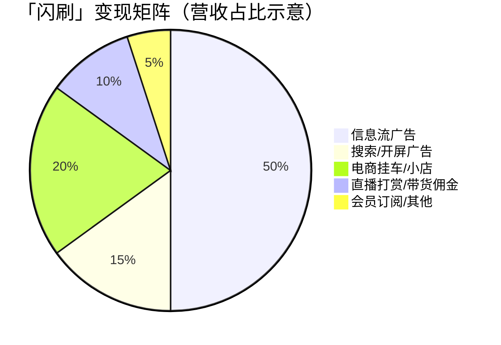
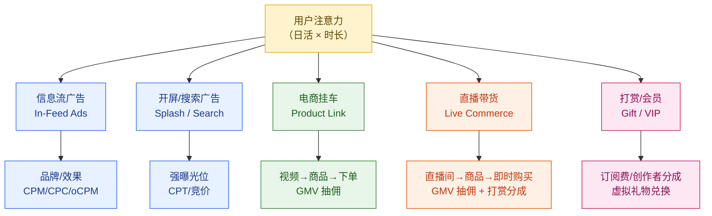
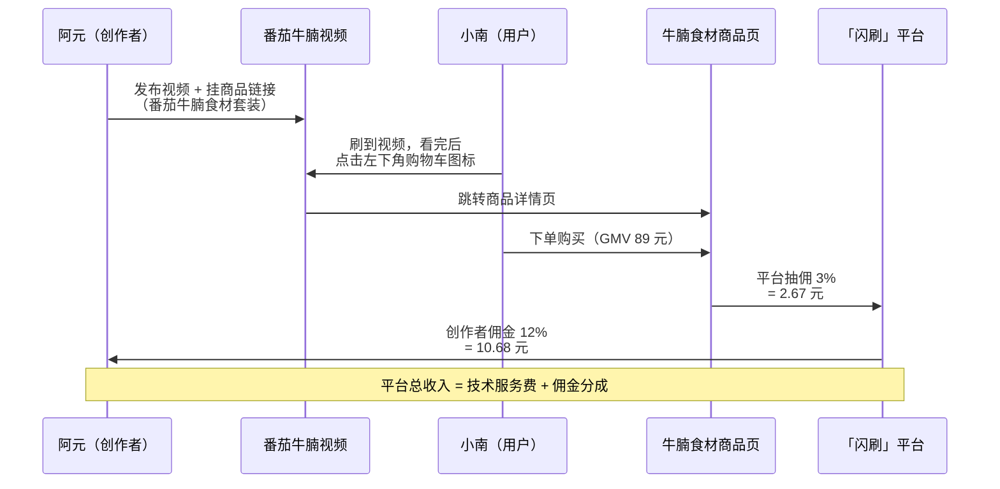
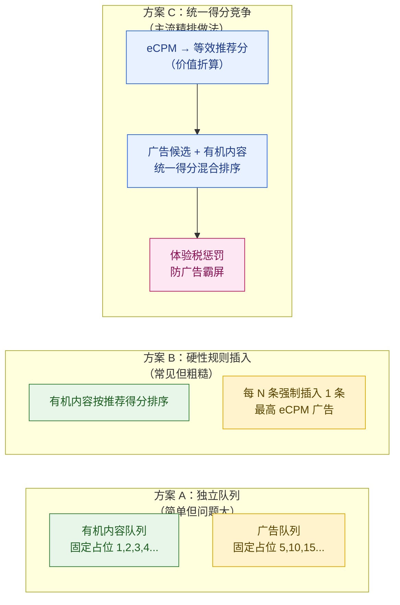
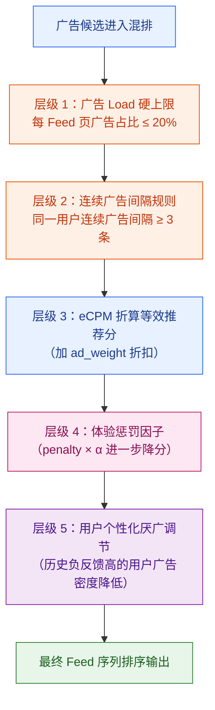
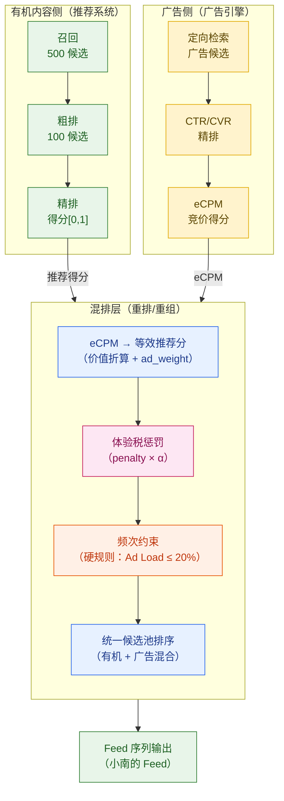
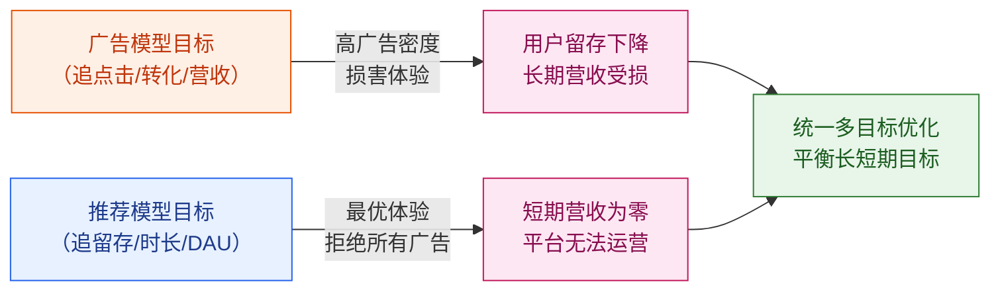
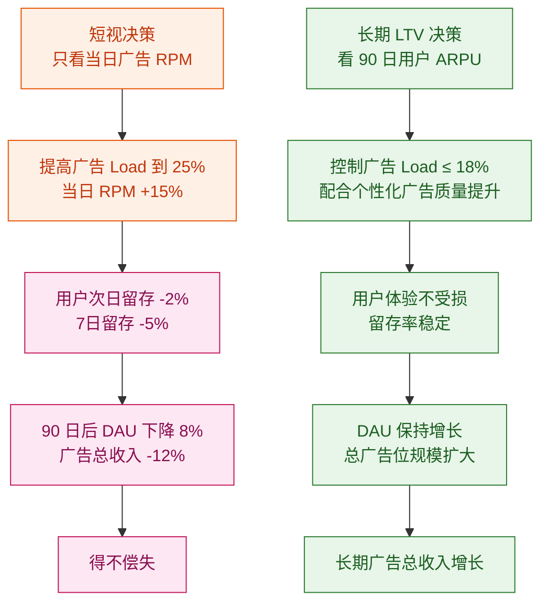
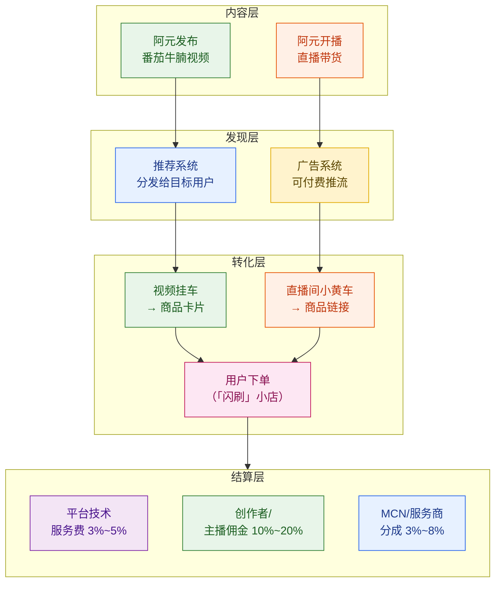

# 第 16 章 · 商业化与广告变现

> **系列定位**：本章承接第 15 章（创作者生态与中台）中的创作者激励体系，聚焦「闪刷」短视频平台如何从用户注意力中产生商业价值——广告插入、电商带货、直播变现三条主路径，以及广告与自然内容的混排机制、体验与营收的平衡策略。广告投放引擎的内部细节（DSP/SSP/RTB/计费出价/反作弊/归因）已在姊妹教程《广告投放系统设计》（同目录 `../广告投放系统设计/`）系统讲解，本章**不重复**那些内容，而是聚焦**短视频平台侧**独有的变现形态与工程问题。

---

## 本章导读

上一章我们看到阿元的视频靠流量激励获得了分成收入，创作者生态在此基础上蓬勃生长。这一章换一个视角——**平台的营收从哪里来？**

「闪刷」日活 1.5 亿，每天有 450 亿条视频曝光机会，这是一座庞大的注意力金矿。如何把这座金矿变成营收，同时不把用户"挖跑"，是本章的核心命题。

我们用三条贯穿案例串联全章：

> **案例 A — 信息流广告**：小南在刷美食视频时，每滑过约 5 条有机内容，就会出现一条「轻氧奶茶」的广告，格式与阿元的视频完全一样，可以划过去，也可以点击进入落地页。
>
> **案例 B — 直播带货变现**：阿元开直播实时演示番茄牛腩，直播间挂着牛腩食材的商品链接，粉丝边看边下单，平台从中抽取佣金。
>
> **案例 C — 混排竞争**：轻氧奶茶广告与阿元《番茄牛腩》视频同时进入小南的 Feed，平台要决定：谁先出现？广告会不会因出价高就无限占领前排、把自然内容挤走？

本章主要内容：

1. **商业化全景**——短视频平台的五条变现路径及各自占比
2. **信息流广告插入（In-Feed Ads）**——原生格式、广告频次控制、TikTok Pulse 高注意力位
3. **多元变现路径**——激励视频、电商挂车、直播带货
4. **广告与自然内容混排**——eCPM 折算等效推荐分、体验税/惩罚因子
5. **商业化与体验平衡**——多目标优化框架、广告 Load 上限、长期 LTV 视角

---

## 16.1 短视频商业化全景

### 16.1.1 营收格局

短视频平台的核心资产是**用户注意力**：用户每天在 App 内消耗的时长，是所有变现形态的"原料"。

2024 年 TikTok 全年营收约 **230 亿美元**，同比增长 **+42.8%**，已超越 Snapchat、Twitter/X 的数倍，逼近 YouTube 广告营收。这其中广告贡献约 **65%**，电商（TikTok Shop）贡献约 **25%**，其余包括直播打赏、会员订阅等约 **10%**。



> 注：饼图比例为行业示意值，各平台因发展阶段不同而差异显著。抖音电商占比高于 TikTok；快手直播打赏历史上占比更高。

### 16.1.2 五条变现路径概览



| 变现路径 | 平台抽取方式 | 关键指标 | 典型 eCPM/佣金率 |
|---------|-----------|---------|----------------|
| 信息流广告 | 广告主付 CPM/CPC/oCPM | RPM（每千次推荐收入） | 5~30 元/千次展现 |
| 开屏广告 | CPT 包天 / 竞价 | 日曝光量 × 频次 | 10~50 万元/天（头部平台） |
| 搜索广告 | CPC 竞价 | 搜索流量 × CTR | 3~20 元/点击（行业相关） |
| 电商挂车 | GMV 抽佣（平台服务费） | GMV × 佣金率 | 1%~5% GMV |
| 直播带货佣金 | GMV 抽佣 | 直播间 GMV × 佣金率 | 1%~8% GMV |
| 直播打赏分成 | 虚拟礼物（创作者 50%~70%） | 打赏总额 × 平台留存率 | 30%~50% 礼物价值 |
| 会员订阅 | 月/年费 | 付费用户数 × ARPU | 18~30 元/月 |

### 16.1.3 与姊妹教程的分工

本章**不重复**已在《广告投放系统设计》中详细讲解的内容：

| 内容 | 在哪里 |
|------|-------|
| DSP / SSP / ADX / RTB / OpenRTB 生态 | 广告教程第 1~2 章 |
| 广告投放引擎全链路（召回/精排/重排/拍卖） | 广告教程第 3~8 章 |
| CPM/CPC/CPA/oCPX 计费出价公式与四点框架 | 广告教程第 9 章 |
| 智能出价与预算 Pacing | 广告教程第 10~11 章 |
| 反作弊 IVT 与归因 | 广告教程第 12~13 章 |

本章**聚焦平台侧**：广告如何插入短视频 Feed、广告与自然视频如何混排竞争、平台如何平衡广告营收和用户体验。

---

## 16.2 信息流广告插入（In-Feed Ads）

### 16.2.1 原生竖屏全屏——用户感知最小化

短视频平台最主流、营收贡献最大的广告形态是**信息流广告（In-Feed Ads）**。其核心设计理念是**原生化**：广告与有机内容使用完全相同的 UI 格式——竖屏全屏、可上划跳过、有点赞/评论/分享按钮——只在左下角标注「广告」字样。

这与传统的横幅广告（Banner）、插屏广告完全不同。传统广告是强制打断，用户体验是"被迫看广告"；信息流广告是**内容融合**，用户视角是"多刷了一条视频，只是这条视频是广告"。

**小南的体感**：小南刷视频，划了 4 条阿元的美食、一条萌宠，然后出现了轻氧奶茶的广告——一个女生坐在奶茶店，捧着一杯奶茶，背景是温馨的橙色光影。她没有特别感到"被打断"，因为视频格式和她刚才看的内容完全一样。她多停留了 2 秒，然后划走继续刷。

### 16.2.2 广告位策略与广告频次控制

广告 **频次控制（Frequency Control / Ad Load）** 是信息流广告最核心的运营参数：

- **过高**：广告密度太大，用户体验变差，留存率下降，长期反而伤害营收
- **过低**：变现不充分，营收不达预期
- **黄金区间**：业界头部平台通常在 **每 5~8 条有机内容插入 1 条广告**，即广告占 Feed 比例 12%~20%


*图：「闪刷」信息流示例——每 4 条有机内容后插入 1 条广告，广告占比约 20%*

**广告 Load（广告密度）** 的工程定义：

$$\text{Ad Load} = \frac{\text{广告曝光数}}{\text{总曝光数（广告 + 有机内容）}} \times 100\%$$

常见业界参考数值：

| 平台阶段 | 典型 Ad Load | 广告位置策略 |
|---------|------------|------------|
| 初期（营收优先）| 15%~20% | 第 5 条后固定插入 |
| 成熟（体验优先）| 10%~15% | 动态调控，用户留存率反馈 |
| 头部平台极限 | 20%~25% | 需强推荐相关性支撑体验 |

> **关键设计**：广告 Load 上限应被视为**系统硬约束**，而不是优化目标。超过一定阈值后，继续提高广告密度会导致留存率非线性下降，长期 LTV 反而降低。

### 16.2.3 广告位类型与投放价值

| 广告位类型 | 描述 | 特点 | 适用广告主 |
|----------|------|------|----------|
| **标准信息流广告** | 插在 Feed 第 N 条 | 原生格式、可划走 | 效果广告主（电商/App） |
| **开屏广告（Splash）** | App 启动时全屏 3~5 秒 | 强曝光无法跳过（或 3 秒后可关）| 品牌广告主 |
| **搜索广告** | 搜索结果页顶部 | 用户主动意图强，CTR 高 | 品牌/效果均适合 |
| **挑战赛广告（Hashtag Challenge）** | 品牌发起 UGC 挑战 | 互动性强，UGC 裂变 | 品牌广告主 |
| **Branded Effect** | 品牌定制特效/贴纸 | 创意互动，用户主动使用 | 品牌广告主 |
| **TikTok Pulse（高注意力位）** | 广告紧跟 Top 4% 高表现内容 | 借高质量内容的注意力红利 | 品牌广告主 |

### 16.2.4 TikTok Pulse：借高注意力环境

**TikTok Pulse** 是 2022 年推出的高端广告产品，其核心思想是：**把广告投放在 Feed 中互动表现最好的 Top 4% 内容旁边**，让广告沾染高质量内容带来的注意力光环。

工作机制：
1. 平台实时评分所有视频的**过去 24 小时**互动指标（点赞、评论、完播率）
2. 筛选出 Top 4% 高表现视频
3. 广告优先出现在这些高表现视频的**紧后一条**位置
4. 广告主为此支付溢价（相比标准信息流广告 CPM 高出约 30%~60%）

**为什么有效**：人类注意力具有**惯性**——看完一条精彩视频，滑到下一条时注意力仍处于高度激活状态，此时插入的广告被深度观看的概率更高。品牌研究数据显示，Pulse 位置的广告品牌记忆度提升约 +9%，购买意向提升约 +5%（TikTok 官方白皮书，2023）。

---

## 16.3 多元变现路径

### 16.3.1 激励视频广告（Rewarded Video）

**激励视频**是用户**主动选择**观看广告来换取虚拟奖励的广告形态，常见于游戏 App 内部，在短视频平台主要用于平台自有积分/金币体系。

核心特点：
- 用户完全自愿，**完播率极高**（接近 90%~95%，远超被动信息流广告的 40%~60%）
- 广告主获得高质量曝光，愿意支付溢价 CPM
- 用户获得平台奖励（金币/积分/权益），形成正向循环

**激励视频的 eCPM 为什么高**：完播率高意味着用户真正看完了广告，品牌信息传递率更高，广告主 ROI 更好，因此愿意出更高价格。典型激励视频 eCPM 是标准信息流广告的 2~4 倍。

```python
# 激励视频 eCPM 折算（考虑完播率溢价）
def rewarded_video_ecpm(
    base_cpm: float,        # 标准信息流 CPM（元/千次）
    completion_rate: float, # 完播率，如 0.92 = 92%
    engagement_bonus: float = 1.5,  # 完播互动溢价系数
) -> float:
    """
    激励视频由于用户主动选择观看，完播率远高于被动信息流广告。
    平台通常对完播率高的广告位收取溢价。
    """
    # 完播率越高，质量越好，溢价越高
    quality_multiplier = completion_rate * engagement_bonus
    return base_cpm * quality_multiplier

# 示例：标准信息流 CPM = 10 元，激励视频完播率 92%
ecpm = rewarded_video_ecpm(base_cpm=10.0, completion_rate=0.92)
print(f"激励视频 eCPM = {ecpm:.1f} 元/千次")  # 13.8 元/千次
```

### 16.3.2 电商挂车（Product Link in Video）

**电商挂车**是短视频直接嵌入商品链接的变现形态：创作者在视频中展示某件商品，视频底部出现一个商品卡片/购物车图标，用户点击后跳转到商品详情页或小店，完成购买后平台从 GMV 中抽取服务费（佣金）。

**TikTok Shop 数据验证**：2023 年 TikTok Shop 的销售数据显示，短视频内容（而非直播）贡献了平台电商销售额的约 **58%**，比直播带货的 42% 更高。这反映了短视频的**异步消费**特性——用户可以在任何时间重播视频并完成购买，不受直播时间约束。

电商挂车的商业化链路：



**关键指标**：
- **GPM（Gross Profit per Mille）**：每千次视频播放产生的 GMV（电商版 RPM）
- **CVR（Video-to-Purchase Conversion Rate）**：视频播放→购买的转化率
- **AOV（Average Order Value）**：平均客单价

$$\text{GPM} = \frac{\text{GMV}}{\text{播放量}} \times 1000 = \text{CVR} \times \text{AOV} \times 1000$$

典型美食类短视频 GPM 约为 **20~100 元/千次播放**，取决于商品客单价和内容转化力。

### 16.3.3 直播带货（Live Commerce）

直播带货是「闪刷」平台第 13 章（直播系统）中直播功能的商业化延伸。阿元开播卖牛腩食材的场景构成了完整的直播电商链路。

**直播带货的变现优势**：
1. **即时转化**：主播现场演示、限时优惠、库存倒计时，强烈的紧迫感驱动冲动购买
2. **互动增信**：用户可以实时提问，主播当场回答，相比图文商品详情页更有说服力
3. **头部主播杠杆效应**：一场头部主播直播 GMV 可达数亿，平台单场收入可超千万

**直播间变现结构**：

| 收入来源 | 平台抽取比例 | 说明 |
|---------|-----------|------|
| 商品销售佣金 | 1%~8% GMV | 根据类目不同，食品约 3~5%，电子 1~3% |
| 直播间流量包（CPM）| 按广告位计费 | 品牌在直播间内投广告 |
| 虚拟礼物（打赏）| 40%~50% 礼物价值 | 用户送礼物，平台留存约 45% |
| 直播贴片广告 | CPM 形式 | 出现在直播流顶部/底部的广告 |

与第 13 章直播系统的工程联动：直播带货需要实时处理弹幕、礼物、商品点击三条高并发数据流，商品库存更新需要与电商系统强一致性联动，防止超卖。这部分工程实现已在第 13 章详述。

---

## 16.4 广告与自然内容混排（本章核心难点）

### 16.4.1 问题定义：谁能出现在第 1 条？

当小南打开「闪刷」，系统要构建她的 Feed 序列。候选池里有两类内容：

- **有机内容候选**：推荐系统通过召回→粗排→精排漏斗筛选出的 500 条有机视频（参见第 7~10 章），每条都有一个**推荐得分**（综合了完播概率、点赞概率、分享概率等多目标分值）
- **广告候选**：广告系统通过定向检索、召回、CTR/CVR 精排漏斗选出的 50 条广告候选，每条都有一个**eCPM**（广告主出价 × 预测 pCTR × pCVR，单位：元/千次展现）

**核心矛盾**：这两类候选的"分数"完全不是同一单位——推荐得分是无单位的综合评估，eCPM 是货币值。**如何把它们放进同一个候选集排序？**

### 16.4.2 三种混排方案对比



| 方案 | 优点 | 缺点 |
|------|------|------|
| A（独立队列） | 实现简单，广告位置可预测 | 广告与内容质量完全解耦，低质量广告出现在高注意力位置 |
| B（硬性规则插入）| 可控广告频次，易运营 | 不考虑广告质量与内容质量的相对关系；广告主出价高低不影响位置，激励扭曲 |
| C（统一得分竞争）| 原生体验最佳；广告出价越高、质量越好越靠前；体验与营收统一优化 | 实现复杂；需要合理的折算公式和惩罚因子设计 |

**「闪刷」采用方案 C**——统一得分混排，这也是抖音、TikTok 等头部平台的主流做法。

### 16.4.3 eCPM → 等效推荐分折算

要把广告的 eCPM 折算成可与推荐得分比较的"等效推荐分"，需要建立一个映射关系。

**直觉**：一个 eCPM = 10 元的广告，如果被曝光，平台每千次展现能获得 10 元收入。一个高质量有机内容被推荐，可以提升用户留存率，保住未来的广告收入机会。两者都对平台有价值，只是价值"货币"不同。

折算公式的核心思路——**把平台的收入预期统一折算为"价值当量"**：

$$\boxed{
\text{等效推荐分}(\text{广告}) = \frac{\text{eCPM}}{R_0} \times w_{\text{ad}}
}$$

其中：
- $\text{eCPM}$：广告的有效千次展现费用（元/千次），由广告系统计算
- $R_0$：基准 RPM（平台平均每千次推荐的广告收入，元/千次），用于将货币值归一化到推荐得分空间
- $w_{\text{ad}}$：广告价值权重系数，通常 $< 1$，代表"同等货币价值下，广告内容的用户体验价值低于有机内容"

**示例计算**：

```python
def ecpm_to_rec_score(
    ecpm: float,          # 广告 eCPM（元/千次展现）
    base_rpm: float,      # 平台基准 RPM（元/千次推荐）
    ad_weight: float,     # 广告价值权重（0~1，通常 0.5~0.8）
) -> float:
    """
    将广告 eCPM 折算为等效推荐分
    
    Args:
        ecpm: 广告 eCPM，由广告引擎计算（pCTR × pCVR × 出价 × 1000）
        base_rpm: 平台基准 RPM，可以理解为"1 分推荐分"对应的货币价值
        ad_weight: 广告对用户价值的折扣系数（< 1，因为用户对广告的偏好低于有机内容）
    
    Returns:
        等效推荐分（与有机内容推荐得分同量纲）
    """
    return (ecpm / base_rpm) * ad_weight

# 示例
# 轻氧奶茶广告 eCPM = 12.0 元/千次
# 平台基准 RPM = 15.0 元/千次（平均有机推荐每千次换算价值）
# 广告价值权重 = 0.7（广告用户体验打 70 折）
ad_ecpm = 12.0
base_rpm = 15.0
ad_weight = 0.7

ad_rec_score = ecpm_to_rec_score(ad_ecpm, base_rpm, ad_weight)
print(f"轻氧奶茶广告等效推荐分 = {ad_rec_score:.3f}")
# 结果：(12.0 / 15.0) × 0.7 = 0.560

# 对比：阿元《番茄牛腩》的推荐精排得分为 0.82（通过第 9 章多目标融合公式计算）
organic_score = 0.82
print(f"阿元视频推荐分 = {organic_score}")
print(f"排序结果：{'阿元视频' if organic_score > ad_rec_score else '轻氧奶茶广告'} 更靠前")
# 结果：阿元视频 更靠前（0.82 > 0.56）
```

### 16.4.4 体验税与惩罚因子

**问题来了**：如果某个广告 eCPM 极高（例如 50 元/千次，等效推荐分 = 2.33），它会把几乎所有有机内容都排在后面，小南的前 10 条 Feed 全是广告。这显然是不可接受的。

需要引入**体验税（Experience Tax / Penalty Factor）** 机制——对广告在排序中施加额外惩罚，防止高出价广告无限占据高位：

$$\boxed{
\text{最终广告得分} = \text{等效推荐分}(\text{广告}) \times (1 - \alpha \cdot \text{penalty})
}$$

或等价地用减法形式：

$$\text{最终广告得分} = \frac{\text{eCPM}}{R_0} \times w_{\text{ad}} - \lambda_{\text{exp}} \cdot L_{\text{user}}
$$

其中：
- $\alpha \in [0, 1]$：体验税强度系数，越大惩罚越重
- $\text{penalty}$：广告对当前用户的体验损耗（0=完全无损，1=极差体验），可以由用户近期广告反馈（负向点击、跳过速度）动态估计
- $\lambda_{\text{exp}}$：体验权重系数
- $L_{\text{user}}$：用户留存价值损失预估（该用户在该时刻看广告的体验损耗对应的 LTV 折损）

**体验税的多层控制机制**（层层递进）：



**体验税的参数调优**：
- $\alpha$ 过大：广告有效 eCPM 大幅折损，广告主 ROI 变差，广告收入下降
- $\alpha$ 过小：高出价广告霸屏，用户体验恶化，留存率下降
- 最优 $\alpha$：通过 **A/B 实验**，以长期（7天/30天）用户留存率和 ARPU（每用户平均收入）的乘积最大化为目标搜索

### 16.4.5 广告与自然内容混排完整架构



**案例 C 解答**：轻氧奶茶广告（eCPM = 12）与阿元《番茄牛腩》（推荐得分 = 0.82）的混排竞争：

```
轻氧奶茶广告最终得分 = (12.0/15.0) × 0.7 × (1 - 0.3 × 0.4) = 0.56 × 0.88 ≈ 0.493
阿元番茄牛腩推荐得分 = 0.82
排序结果：阿元视频 (0.82) > 轻氧奶茶广告 (0.493)

→ 阿元视频出现在小南 Feed 的第 2 条，轻氧奶茶广告出现在第 5 条（经过频次约束调整）
```

即使广告出价较高，体验税的存在保证了高质量有机内容不会被广告完全压制。

---

## 16.5 商业化与体验平衡（本章核心）

### 16.5.1 两个目标的对抗

短视频平台的商业化面临一个根本性的目标对抗：



**广告模型**（第 7 章广告投放引擎）的优化目标：最大化每次 Feed 刷新的即时广告收入（eCPM/RPM）。

**推荐模型**（第 9 章精排）的优化目标：最大化用户的完播率、互动率、日留存率，进而最大化 DAU 和 LTV（Life-Time Value，用户生命周期价值）。

如果两个系统**独立优化**，会相互对抗：广告系统不断要求提高广告密度（提高 Ad Load），推荐系统不断受到更多广告插入的体验干扰。

### 16.5.2 统一多目标优化框架

解法是**把广告收益和用户体验放进同一个目标函数**，让整个 Feed 排序系统统一优化：

$$\boxed{
\text{Objective} = \alpha \cdot \text{Revenue}(s) + \beta \cdot \text{Experience}(s) + \gamma \cdot \text{LTV\_Impact}(s)
}$$

其中 $s$ 是一个 Feed 序列（有机内容 + 广告的排列组合），三项含义如下：

| 项 | 计算方式 | 代理指标 |
|---|---------|---------|
| $\text{Revenue}(s)$ | 序列中广告的 eCPM 总和/平均 | 即时广告营收 |
| $\text{Experience}(s)$ | 序列中有机内容的推荐得分加权平均 | 用户当次 Feed 满意度 |
| $\text{LTV\_Impact}(s)$ | 当次体验对用户长期留存率的影响（通常为负向调整项）| 7日/30日用户留存预测 |

**权重系数 $\alpha, \beta, \gamma$**：
- 通过 A/B 实验搜索最优组合
- $\gamma$（LTV 影响）是长期视角的核心：牺牲短期用户体验换来的广告收入，是否会因留存率下降而在 3 个月内亏回来？
- 成熟平台通常 $\gamma > 0$，即**系统会主动惩罚损害长期留存的广告决策**

### 16.5.3 广告 Load 上限的设计原则

广告 Load 不仅是运营参数，更应被视为**系统工程约束**，以公式表达：

$$\text{最优 Ad Load}^* = \arg\max_{\text{load}} \left[ \underbrace{\text{Revenue}(\text{load})}_{\text{单调递增}} \times \underbrace{\text{Retention}(\text{load})}_{\text{单调递减}} \right]$$

Revenue 随 Ad Load 提高单调递增（更多广告 = 更多收入），但 Retention（留存率）随 Ad Load 提高单调递减（更多广告 = 更差体验 = 更多流失）。两者的乘积（即"有效 LTV"）存在一个极值点。

```
Revenue(load) ↑    Retention(load) ↓
        \                  /
         \                /
          \              /
           \            /
            \          /
             \        /
              Revenue × Retention  ← 极大值点 = 最优 Ad Load*
```

**实际操作**：
1. 通过 A/B 实验，在 10%、15%、18%、20%、25% 不同 Ad Load 下，各跑 7 天，测量次日留存率和 ARPU
2. 以 ARPU × 留存率（代理 LTV）为目标函数，找出极值点
3. 将极值点对应的 Ad Load 设为系统**硬约束上限**，而非"可以突破的软目标"

Meta（Facebook）研究数据显示：当 Feed 广告占比超过 25% 时，次日留存率显著下降，且下降速度加快（非线性），即使广告收入短期增加，3~6 个月后的总 LTV 也会为负。TikTok 据悉将信息流广告密度控制在 15%~20% 的区间内。

### 16.5.4 长期 LTV 视角：避免"短视广告决策"



**「闪刷」的长期策略**：
1. **广告质量比数量重要**：通过更精准的 pCTR/pCVR 预测提高广告 eCPM，而不是提高广告数量
2. **相关性广告体验更好**：轻氧奶茶广告出现在小南（美食爱好者）的 Feed 里，比出现在对美食无兴趣的用户 Feed 里，体验损耗低得多，完播率也更高
3. **广告与内容协同**：阿元《番茄牛腩》之后，出现轻氧奶茶广告，内容场景与广告高度相关，用户不但不反感，甚至可能觉得"恰到好处"

### 16.5.5 平衡策略汇总表

| 维度 | 只看广告收入（反面案例）| 统一 LTV 优化（正确做法）|
|------|---------------------|----------------------|
| Ad Load 上限 | 无上限，随需求提高 | 硬约束上限（如 ≤ 20%）|
| 广告排序 | 纯 eCPM 最高者优先 | eCPM 折算 + 体验税惩罚因子 |
| 优化目标 | 日广告 RPM 最大化 | 日 RPM × 留存率（LTV 代理）|
| 短期/长期平衡 | 短期 RPM 极大化 | 以 90 日 ARPU 为目标 |
| 个性化 | 所有用户同样广告密度 | 高厌广用户降低密度 |
| 与推荐系统关系 | 独立优化，互相对抗 | 统一多目标优化，协同 |
| 反馈闭环 | 广告 KPI 独立 | 留存率是广告系统的输入约束 |

---

## 16.6 电商/直播带货的完整变现链路

### 16.6.1 短视频电商变现全链路

电商变现是「闪刷」继广告之后第二大收入来源。以阿元直播带货番茄牛腩为例，变现链路如下：



**关键指标体系**：

| 指标 | 定义 | 典型值（美食类） |
|------|------|--------------|
| GPM | 每千次播放 GMV | 20~100 元/千次 |
| 直播间 CVR | 观看→下单转化率 | 3%~8%（头部主播更高）|
| 直播间 AOV | 平均客单价 | 50~300 元 |
| 流量抢购比 | 直播间 GMV / 直播观看 UV | 衡量变现强度 |
| 粉丝信任值 | 老粉（关注 >30 天）下单率是新粉的 | 2~5 倍 |

### 16.6.2 商品推荐与内容推荐的协同

短视频平台电商的一个特殊点是：**视频推荐系统和商品推荐系统需要协同**——不仅要把合适的视频推给合适的用户，还要在用户对视频产生兴趣的那一刻，展示相关的商品。

这形成了"内容→兴趣→购买"的闭环：

```
用户兴趣信号（完播美食视频）→ 强化美食/烹饪商品推荐
用户购买行为（买了牛腩食材）→ 强化阿元相关内容推荐
```

这种双向协同是短视频电商的核心竞争力，也是 TikTok Shop 能从短视频贡献 58% 销售额的根本原因。

---

## 16.7 易错点与工程陷阱

### 16.7.1 广告与推荐独立优化导致的对抗

**错误模式**：广告系统和推荐系统各自独立建模，各自有 KPI，互相"争抢"用户注意力：

```
广告系统 KPI：日广告 RPM → 持续推动提高 Ad Load
推荐系统 KPI：日用户时长 → 反对广告密度提高
→ 两个团队 KPI 对抗，平台整体利益受损
```

**正确做法**：建立统一的营收与体验联合 KPI，推荐系统的 KPI 包含广告相关性得分，广告系统的 KPI 包含用户留存率约束。

### 16.7.2 广告频次过高短期涨收入长期伤留存

这是最常见的"商业化短视主义"陷阱。高层看到短期广告收入上涨，忽视留存率的缓慢下降（因为留存效果有滞后性，通常 2~4 周后才在 DAU 上显著体现）。

**解法**：在广告决策中强制引入"留存约束"——如果某个广告决策导致预测的 7日留存下降超过阈值（如 -0.5%），系统自动触发降速，不允许 Ad Load 继续提升。

### 16.7.3 混排不加体验税导致广告霸屏

如果 eCPM 直接折算为推荐分、不施加体验税，高出价广告会持续占据 Feed 前排，有机内容被压至后几屏。用户会感觉"整个 App 都是广告"，极速流失。

体验税的**工程实现**要点：
- 惩罚因子不是固定值，应该**个性化**：用户历史广告负反馈越多，惩罚越重
- 惩罚因子应该**上下文感知**：用户已经看了 3 条广告，第 4 条广告的惩罚应比第 1 条更重
- 惩罚因子需要**实验验证**：通过 A/B 实验持续调优 $\alpha$ 参数

### 16.7.4 只看短期营收不看长期留存

如果商业化的 OKR 只有"季度广告收入"，不包含"用户 LTV 预测"或"90日留存率"，团队会系统性地做出损害长期利益的短视决策。

**组织层面的解法**：商业化团队和增长团队共享同一个 **North Star Metric**（北极星指标）——通常是"有效 DAU 的 ARPU"（有效 = 满足基本留存标准的活跃用户），既包含了规模（DAU），也包含了变现效率（ARPU）。

### 16.7.5 广告位竞争不公平（定向过窄vs定向过宽）

广告主 A 把定向设置极窄（只投 18~24 岁上海女性），广告主 B 把定向设置极宽（全量人群）。当两个广告都在竞争同一个用户的 Feed 位时：
- 广告主 A 的广告对这个用户的相关性可能远高于广告主 B
- 但如果广告主 B 出价更高，eCPM 更高，会赢得竞价
- 最终用户看到了相关性低的广告，体验差，广告效果也差

**解法**：在 eCPM 折算中引入**相关性加权**——当广告与用户的内容偏好高度匹配时，给予 eCPM 的相关性加成（类似 Google 的广告质量分机制）：

$$\text{adjusted\_eCPM} = \text{eCPM} \times \text{Relevance\_Score}$$

这把"广告对用户的相关性"也纳入竞价，避免了单纯价高者得的弊端，同时提升了广告效果（更相关 = 更高 CTR = 广告主 ROI 更好 = 愿意出更高价形成正循环）。

---

## 本章小结

本章从「闪刷」短视频平台侧视角，系统讲解了商业化与广告变现的全景。

**核心架构**：短视频平台的变现体系由五条路径构成——信息流广告（最大营收贡献）、开屏/搜索广告、电商挂车（TikTok Shop 短视频贡献 58%）、直播带货（实时转化高）、打赏/会员订阅。2024 年 TikTok 营收达 230 亿美元，增速 +42.8%，广告+电商双轮驱动。

**信息流广告关键设计**：原生竖屏全屏格式实现用户感知最小化；广告频次控制（Ad Load 10%~20%）是营收与体验的核心调节旋钮；TikTok Pulse 利用高表现内容的注意力红利为广告主提供溢价曝光。

**混排机制核心**：广告候选通过 eCPM→等效推荐分的价值折算，进入与有机内容统一的候选池竞争排序；体验税/惩罚因子（$\text{最终广告得分} = \text{等效推荐分} \times (1-\alpha \cdot \text{penalty})$）防止高出价广告霸屏，实现广告质量与用户体验的同步优化。

**体验与营收平衡**：统一多目标优化框架（$\alpha \cdot \text{Revenue} + \beta \cdot \text{Experience} + \gamma \cdot \text{LTV\_Impact}$）将广告收益和用户体验纳入同一目标函数；广告 Load 上限应作为系统硬约束而非可突破的软目标；长期 LTV 视角是防止商业化短视主义的关键。

**核心洞察**：短视频商业化的本质是**时间银行**——用户在平台消费的每一分钟，都是平台的存款；每一次广告曝光，都是在消费这个存款。如果广告质量差、密度过高，"存款"就会加速消耗，用户离开，平台失去了未来一切商业化的基础。最好的商业化，是用户不觉得被商业化。

---

商业化变现需要亿级 DAU 的流量作为地基。下一章（第 17 章），我们将收拢全篇所有模块的工程约束，系统讲解支撑这 1.5 亿日活、百万 QPS 推荐请求、千万级直播在线的**高并发工程架构实战**——多级缓存、削峰填谷、热点 key 应对、存储选型、异地多活，这些才是短视频平台能稳定运转的真正底座。

---

## 参考来源

1. **TikTok 2024 Revenue Report** — TikTok 2024 年营收 230 亿美元，同比增长 42.8%  
   https://www.businessofapps.com/data/tik-tok-statistics/

2. **TikTok Pulse 官方介绍** — TikTok for Business，Pulse 产品介绍，Top 4% 高表现内容旁的广告位  
   https://www.tiktok.com/business/en/blog/tiktok-pulse-brand-safe-premium-content

3. **TikTok Shop 短视频贡献比例** — EMARKETER，TikTok Shop 2023 年短视频 vs 直播销售额分布  
   https://www.emarketer.com/content/tiktok-shop-seller-guide

4. **Meta 广告 Load 研究** — Meta Engineering Blog，《Balancing Ads and Organic Content in News Feed》  
   https://engineering.fb.com/2022/06/09/ml-applications/ad-load-optimization/

5. **广告混排机制设计** — ACM RecSys 2019，《Jointly Optimizing Relevance and Revenue in Recommendation Systems》  
   https://dl.acm.org/doi/10.1145/3298689.3347047

6. **eCPM 折算与信息流广告** — Google Research，《Ad Quality in Large-Scale Online Advertising Systems》  
   https://research.google/pubs/ad-quality-in-large-scale-online-advertising-systems/

7. **短视频电商 GPM 指标体系** — 字节跳动巨量引擎营销学院，《抖音电商内容分析手册》  
   https://school.oceanengine.com/

8. **用户 LTV 与广告密度的长期关系** — Reforge，《The Hidden Cost of Ad Load Creep》  
   https://www.reforge.com/blog/ad-load-retention
