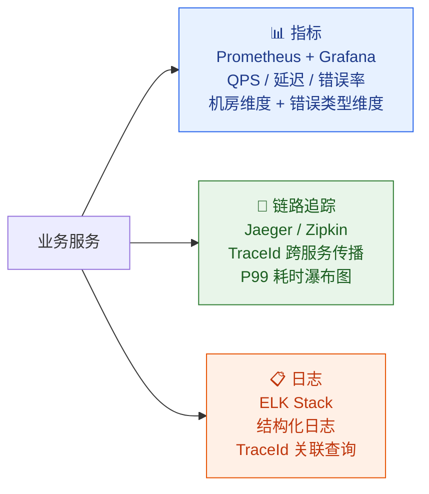
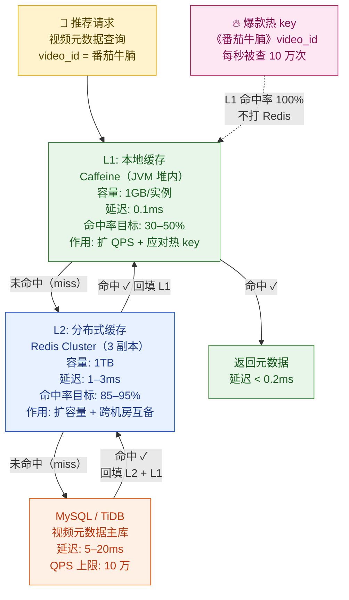
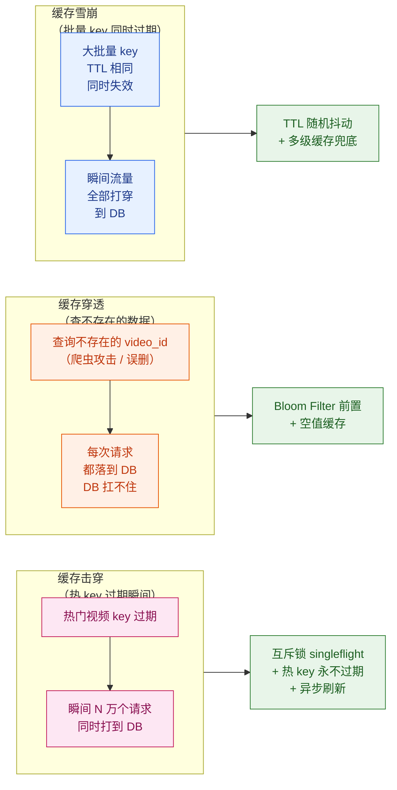
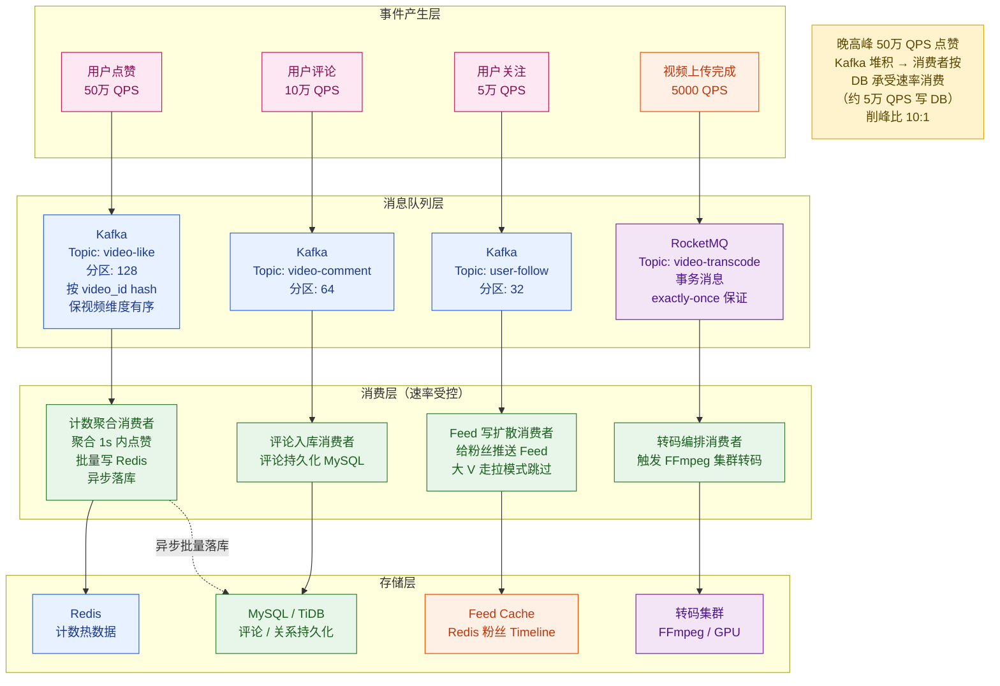
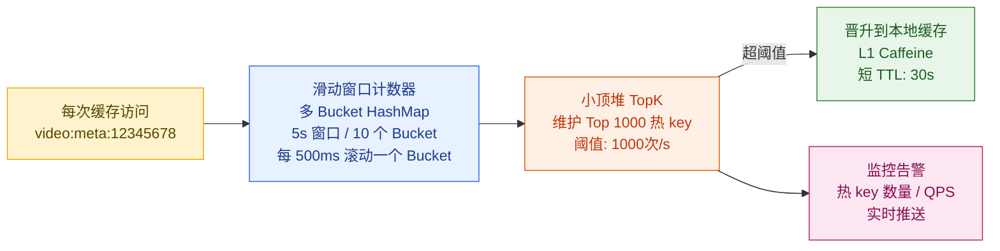
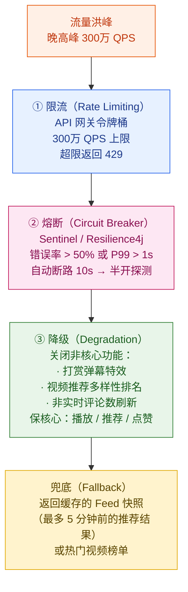
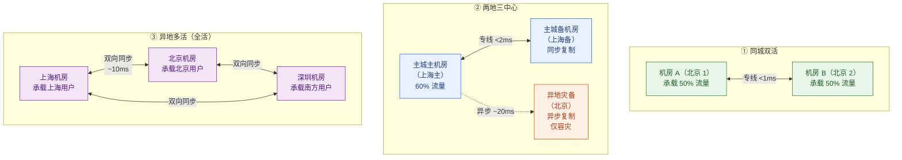
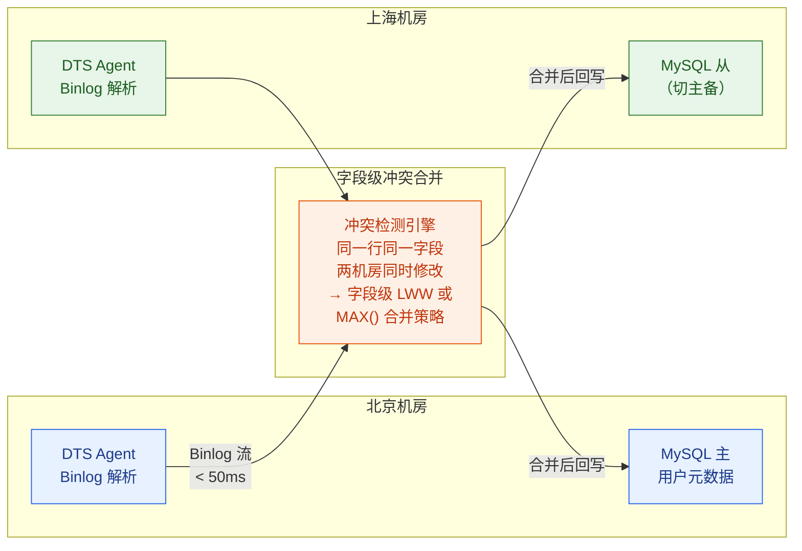

# 第 17 章 · 高并发工程架构实战

> **所属系列**：《短视频平台系统设计 · 全景教程》第六部分 · 工程与收口
> **上一章**：[第 16 章 · 商业化与广告变现](./16-商业化与广告变现.md)
> **下一章**：[第 18 章 · 全链路串讲与学习路径](./18-全链路串讲与学习路径.md)

---

## 本章导读

前 16 章分别深入了短视频平台的各个功能域：视频上传与转码（第 3–4 章）、CDN 分发与秒开（第 5–6 章）、推荐漏斗（第 7–11 章）、互动社交与直播（第 12–13 章）、内容安全与商业化（第 14–16 章）。每一章都在回答"这个功能该怎么做"，但有一个核心问题始终悬在背后：

> **这些功能，如何在「闪刷」晚 8 点百万 QPS 的高峰下同时跑通，且当《番茄牛腩》突然爆火成为热 key 时不崩溃？**

这正是本章的使命——**工程总收口**。

本章以「闪刷」平台（日活 1.5 亿，视频库 50 亿条）晚 8 点高峰场景为主线，贯穿《番茄牛腩》爆火热 key 案例，从以下维度将前面各章的工程约束统一收口：

- **微服务架构与网关**：整体拓扑、API 网关职责、服务治理
- **多级缓存体系**：本地 + 分布式双层、微博双层 L1/L2 模式、Cache-Aside
- **缓存三大问题**：击穿（热 key 过期）、穿透（查不存在数据）、雪崩（批量同时过期）
- **削峰填谷**：Kafka 写扩散、RocketMQ 事务消息、消息反压
- **热点应对**：自适应热 key 识别、晋升本地缓存、限流熔断降级预案
- **存储选型矩阵**：MySQL 分库分表 → TiDB、社交图、时序宽列、对象存储
- **异地多活与容灾**：同城双活、两地三中心、异地多活三种模式
- **全链路压测与监控**：SLA 体系、可观测性三件套

> 注：本章聚焦工程架构，算法细节（推荐排序）见第 9 章，互动计数见第 12 章，直播容灾见第 13 章，全链路串讲见第 18 章。

---

## 17.1 工程特征与容量估算

### 17.1.1 短视频平台的工程特征

短视频平台与广告系统、电商系统相比，有几个独特的工程挑战：

| 特征 | 描述 | 工程影响 |
|------|------|---------|
| **读写都重** | 推荐请求（读）+ 点赞/关注（写）峰值同时出现 | 读写分离不够，需分层隔离 |
| **海量长尾** | 50 亿条视频中 99% 是长尾冷内容 | 缓存命中率对长尾无效，存储分层是关键 |
| **强热点** | 爆款视频瞬间流量放大 1000× | 热 key 识别与本地缓存晋升缺一不可 |
| **强实时性** | 点赞数 1 秒内可见 | 计数不能只走离线，需近实时对账 |
| **海量小文件 + 大文件并存** | 封面图/缩略图（KB 级）+ 视频文件（MB-GB 级）| 对象存储 + CDN 分层，小文件走 KV |
| **写扩散** | 百万粉丝关注同一博主，1 条视频产生百万推送 | 推拉结合，大 V 走拉取；消息队列削峰 |

### 17.1.2 容量估算

**「闪刷」平台规模假设**（参考快手/微博真实数据）：

$$
\text{日均推荐 QPS} = \frac{\text{DAU} \times \text{人均刷新次数}}{\text{日秒数}} = \frac{1.5 \times 10^8 \times 200}{86400} \approx 347{,}000 \text{ QPS}
$$

$$
\text{晚高峰 QPS（8 倍系数）} \approx 2{,}780{,}000 \approx \textbf{280 万 QPS（推荐链路）}
$$

**分服务 QPS 估算**：

| 服务 | 峰值 QPS | 说明 |
|------|---------|------|
| API 网关（入口） | 300 万 | 含推荐、点赞、评论、上传等所有请求 |
| 推荐服务（精排） | 100 万 | 多层漏斗，精排 QPS < 召回 QPS |
| 视频元数据服务 | 200 万 | 每次推荐返回 10 条，每条查元数据 |
| 点赞计数服务 | 50 万 | 写 QPS，晚高峰弹幕/点赞密集 |
| 评论读取 | 80 万 | 下拉评论区触发 |
| CDN 视频流 | —— | 带宽维度，峰值约 **10 Tbps** |

**存储容量估算**：

| 数据类型 | 单条大小 | 总量 | 存储规模 |
|---------|---------|------|---------|
| 视频元数据 | 2 KB | 50 亿条 | **10 TB** |
| 用户画像 | 3 KB | 3 亿用户 | **900 GB** |
| 点赞关系 | 16 B | 千亿级 | **1.6 TB**（Redis sorted set） |
| 评论数据 | 500 B | 百亿条 | **5 TB**（MySQL 分库） |
| 视频文件（转码后） | 平均 50 MB | 50 亿条 | **250 PB**（对象存储） |
| 封面/缩略图 | 平均 100 KB | 50 亿条 | **500 TB**（CDN 预热） |

---

## 17.2 微服务架构与 API 网关

### 17.2.1 整体微服务架构

「闪刷」平台参考快手（300+ 微服务、3 亿 DAU）和微博的服务拆分方式，按**业务域**划分服务群，以**API 网关**作为唯一入口，数据层按访问模式分层部署。

```mermaid
flowchart TD
    ClientApp["📱 客户端<br/>iOS / Android / Web"]:::yellow

    subgraph CDNLayer["CDN 层"]
        CDN1["CDN 边缘节点<br/>视频流 / 图片<br/>命中率 > 95%"]:::green
    end

    subgraph GatewayLayer["API 网关层"]
        GW["API Gateway<br/>Kong / 自研<br/>限流 · 鉴权 · 路由 · 灰度"]:::blue
    end

    subgraph ServiceLayer["微服务层（业务域）"]
        direction LR
        subgraph Feed["Feed 域"]
            FeedSvc["推荐服务<br/>Recall/Rank"]:::blue
            FeedCache["Feed 缓存<br/>预计算 800 条"]:::blue
        end
        subgraph Video["视频域"]
            VideoMeta["视频元数据服务"]:::green
            TranscodeOrch["转码编排服务"]:::green
        end
        subgraph Interact["互动域"]
            LikeSvc["点赞计数服务"]:::pink
            CommentSvc["评论服务"]:::pink
            NotifySvc["通知推送服务"]:::pink
        end
        subgraph User["用户域"]
            UserSvc["用户服务"]:::orange
            RelationSvc["关注关系服务"]:::orange
        end
        subgraph Live["直播域"]
            LiveSvc["直播调度服务"]:::purple
            StreamSvc["推拉流服务"]:::purple
        end
        subgraph Infra["基础设施服务"]
            SearchSvc["搜索服务"]:::yellow
            AuditSvc["内容审核服务"]:::yellow
            AdSvc["广告服务"]:::yellow
        end
    end

    subgraph DataLayer["数据层"]
        direction LR
        Redis["Redis Cluster<br/>计数 / 热数据<br/>百万 QPS"]:::blue
        MySQL["MySQL / TiDB<br/>用户 / 视频元数据<br/>分库分表"]:::green
        HBase["HBase / Cassandra<br/>时序宽列<br/>冷数据 / 行为日志"]:::orange
        ES["Elasticsearch<br/>全文搜索 / 审核"]:::pink
        Kafka["Kafka<br/>事件总线<br/>点赞/评论/上传"]:::purple
        ObjStorage["对象存储<br/>视频 / 图片文件<br/>250 PB"]:::yellow
    end

    ClientApp -->|"HTTPS"| CDN1
    CDN1 -->|"动态请求"| GW
    GW --> FeedSvc & VideoMeta & LikeSvc & UserSvc & LiveSvc & SearchSvc
    FeedSvc --> FeedCache
    LikeSvc --> Redis
    VideoMeta --> MySQL
    UserSvc --> MySQL
    RelationSvc --> Redis & MySQL
    FeedSvc --> Redis & MySQL
    CommentSvc --> MySQL & ES
    NotifySvc --> Kafka
    LikeSvc --> Kafka
    AuditSvc --> ES
    VideoMeta --> ObjStorage
    UserSvc --> HBase

    classDef yellow fill:#fff3cd,stroke:#e0a800,color:#5a4500
    classDef blue fill:#e7f1ff,stroke:#2563eb,color:#1e3a8a
    classDef green fill:#e8f5e9,stroke:#2e7d32,color:#1b5e20
    classDef orange fill:#fff0e6,stroke:#e65100,color:#bf360c
    classDef pink fill:#fde7f3,stroke:#c2185b,color:#880e4f
    classDef purple fill:#f3e5f5,stroke:#7b1fa2,color:#4a148c
```



### 17.2.2 API 网关职责

**API 网关是流量的第一道关卡**，承担以下核心职责：

| 职责 | 实现方式 | 关键参数 |
|------|---------|---------|
| **限流** | 令牌桶（全局） + 滑动窗口（用户级） | 全局 300 万 QPS；单用户 100 QPS |
| **鉴权** | JWT 验签（无状态）+ Redis Session（有状态刷新） | Token 有效期 24h |
| **路由** | 按 URL 前缀路由到对应服务群 | `/feed/*` → 推荐域；`/live/*` → 直播域 |
| **灰度** | 按 userId/设备 ID 哈希分桶，支持 1%-99% 逐步放量 | 新功能默认 1% 灰度 |
| **协议转换** | HTTP/2 → gRPC（内部服务间通信） | 内部 gRPC 复用长连接，减少 TCP 握手 |
| **可观测** | 请求日志 + 链路 traceId 注入 + 指标 Prometheus | 每请求强制携带 `X-Trace-Id` |

```java
/**
 * API 网关限流实现（令牌桶 + 用户级滑动窗口双重限流）
 * 场景：晚高峰 300 万 QPS 入口保护
 */
@Component
public class GatewayRateLimiter {

    // 全局令牌桶：最大 300 万 QPS（峰值上限）
    private final RateLimiter globalLimiter = RateLimiter.create(3_000_000);

    // 用户级滑动窗口：单用户 100 QPS（防刷）
    private final LoadingCache<String, RateLimiter> userLimiters = Caffeine.newBuilder()
        .expireAfterAccess(60, TimeUnit.SECONDS)
        .build(userId -> RateLimiter.create(100));

    /**
     * 双重限流：先全局，再用户级
     * 返回 false 表示被限流，需返回 429 Too Many Requests
     */
    public boolean tryAcquire(String userId) {
        // 第一道：全局令牌桶（1ms 超时，不阻塞）
        if (!globalLimiter.tryAcquire(1, 1, TimeUnit.MILLISECONDS)) {
            metrics.increment("gateway.ratelimit.global");
            return false;
        }
        // 第二道：用户级滑动窗口（严防恶意爬虫）
        RateLimiter userLimiter = userLimiters.get(userId);
        if (!userLimiter.tryAcquire(1, 0, TimeUnit.MILLISECONDS)) {
            metrics.increment("gateway.ratelimit.user");
            return false;
        }
        return true;
    }
}
```

### 17.2.3 服务治理：注册发现与可观测性

**服务注册发现**：微服务实例启动时向注册中心（Nacos/Consul/Etcd）注册，消费方从注册中心拉取实例列表，客户端负载均衡（gRPC 内置 round-robin/一致性哈希）。

**快手实践**：3 亿 DAU 下 300+ 微服务，采用自研服务注册中心，支持**机房维度注册**（同机房优先调用，跨机房备用），注册中心每 5 秒心跳探活，节点下线 15 秒内从注册表摘除。

**多维可观测性三件套**：



**关键监控维度**（超出阈值自动告警）：

| 维度 | 指标 | 正常范围 | 告警阈值 |
|------|------|---------|---------|
| 推荐服务 P99 延迟 | 端到端 | < 100ms | > 150ms |
| API 网关错误率 | 5xx 占比 | < 0.1% | > 1% |
| Redis 集群命中率 | 缓存命中 | > 90% | < 80% |
| Kafka 消费延迟 | Lag 积压 | < 10万条 | > 100万条 |
| 机房间同步延迟 | 跨机房复制 | < 50ms | > 200ms |

---

## 17.3 多级缓存体系

### 17.3.1 为什么需要多级缓存

以推荐服务的视频元数据查询为例：

$$
\text{单次推荐返回} = 10 \text{ 条视频} \times \text{元数据查询} = 10 \text{ 次 DB 查询}
$$

$$
\text{峰值 DB QPS} = 100\text{万推荐 QPS} \times 10 = \textbf{1000 万次/秒}
$$

任何一个 MySQL 集群都撑不住 1000 万 QPS。**多级缓存是将这个数字从千万降到万级的核心手段**。

### 17.3.2 多级缓存架构（微博双层 L1/L2 模式）

微博工程团队在 2018 年公开了其双层缓存架构，该架构也被业界广泛采用：

- **L1（本地缓存 Caffeine/Guava）**：每个服务实例的 JVM 内存内，命中延迟 < 0.1ms，容量有限（512MB–2GB），**主要作用：扩 QPS + 扩带宽，应对爆款单 key（同一视频被大量访问时，不用每次都打 Redis）**
- **L2（分布式缓存 Redis Cluster）**：跨实例共享，命中延迟 1–3ms，容量大（每集群 512GB–2TB），**主要作用：扩容量、保穿透率低；跨机房互为主备**



**微博双层缓存关键设计**：

| 维度 | L1 本地缓存 | L2 Redis 集群 |
|------|-----------|-------------|
| 物理位置 | 服务实例 JVM 堆内 | 独立 Redis 集群，多机房互备 |
| 主要解决 | 单 key 高并发（热 key）、节省 Redis 带宽 | 多 key 大容量、跨实例共享 |
| TTL 策略 | 短（5–30s），接受轻微不一致 | 中（5–30min），主动失效 |
| 淘汰策略 | LRU（size-based，Caffeine W-TinyLFU） | LFU（maxmemory-policy allkeys-lfu） |
| 一致性 | 最终一致（TTL 自然失效） | 主动失效（发布-订阅通知） |
| 机房容灾 | 无需跨机房（本地状态） | L2 跨机房互为主备（SLA 4 个 9）|

**平均访问延迟**（综合命中率计算）：

$$
\bar{t} = r_{L1} \times 0.1 + (1-r_{L1}) \times r_{L2} \times 2 + (1-r_{L1})(1-r_{L2}) \times r_{DB} \times 10
$$

$$
= 0.4 \times 0.1 + 0.6 \times 0.9 \times 2 + 0.6 \times 0.1 \times 10 \approx \textbf{1.74 ms}
$$

### 17.3.3 Cache-Aside 模式（旁路缓存）

短视频平台统一使用 **Cache-Aside（旁路缓存）** 模式，应用程序显式控制缓存更新：

```java
/**
 * Cache-Aside 模式实现：视频元数据查询
 * 读：先查缓存，miss 再查 DB，DB 结果回填缓存
 * 写：先写 DB，再删缓存（不是更新缓存）
 */
@Service
public class VideoMetaService {

    private final Cache<Long, VideoMeta> localCache;  // Caffeine L1
    private final RedisTemplate<String, VideoMeta> redis;  // L2
    private final VideoMetaRepository repo;           // MySQL/TiDB

    /** 读路径：L1 → L2 → DB，逐层回填 */
    public VideoMeta getVideoMeta(long videoId) {
        // L1 查询（最快）
        VideoMeta meta = localCache.getIfPresent(videoId);
        if (meta != null) {
            metrics.increment("cache.l1.hit");
            return meta;
        }

        // L2 查询
        String redisKey = "video:meta:" + videoId;
        meta = redis.opsForValue().get(redisKey);
        if (meta != null) {
            metrics.increment("cache.l2.hit");
            localCache.put(videoId, meta);  // 回填 L1
            return meta;
        }

        // DB 查询（最慢，加 singleflight 防止击穿）
        meta = videoMetaSingleFlight.execute("meta:" + videoId,
            () -> repo.findById(videoId).orElse(null));

        if (meta != null) {
            redis.opsForValue().set(redisKey, meta, 30, TimeUnit.MINUTES); // 回填 L2
            localCache.put(videoId, meta);  // 回填 L1
        } else {
            // 空值缓存，防止缓存穿透（见 17.4.2 节）
            redis.opsForValue().set(redisKey, VideoMeta.EMPTY, 5, TimeUnit.MINUTES);
        }
        return meta;
    }

    /**
     * 写路径：先写 DB，再删缓存（Cache-Aside 经典模式）
     * 注意：不是"先删缓存再写DB"——那会导致并发读取拿到脏数据
     */
    public void updateVideoMeta(VideoMeta meta) {
        repo.save(meta);  // 先写 DB
        // 删 L2（发布-订阅通知所有实例删 L1）
        redis.delete("video:meta:" + meta.getVideoId());
        // 广播失效所有服务实例的 L1
        invalidatePubSub.publish("video:meta:invalidate", meta.getVideoId());
    }
}
```

---

## 17.4 缓存三大问题（重点）

缓存三大问题是高并发系统工程师的必考项，也是最容易在生产环境踩坑的地方。以「闪刷」晚高峰场景逐一解析。



### 17.4.1 缓存击穿（热 key 过期瞬间打穿 DB）

**场景还原**：《番茄牛腩》突然爆火，`video:meta:12345678` 这个 Redis key 每秒被查询 10 万次。某一刻 TTL 到期，L1 和 L2 同时失效，10 万个请求瞬间全部打到 MySQL，DB 被打崩。

**方案一：互斥锁 + singleflight（防止惊群）**

```go
// singleflight 实现：同一 key 的并发请求只有一个去 DB，其余等待结果共享
// 场景：《番茄牛腩》 TTL 过期后，10 万 QPS 中只有 1 个打到 DB
var sf singleflight.Group

func getVideoMetaWithSingleFlight(videoId int64) (*VideoMeta, error) {
    cacheKey := fmt.Sprintf("video:meta:%d", videoId)

    // 先查 Redis L2
    if meta, err := redisGet(cacheKey); err == nil && meta != nil {
        return meta, nil
    }

    // singleflight：同一 key 的并发请求合并为一次 DB 查询
    result, err, _ := sf.Do(cacheKey, func() (interface{}, error) {
        // 只有第一个请求进入这里
        meta, err := db.QueryVideoMeta(videoId)
        if err != nil {
            return nil, err
        }
        // 写回 Redis，TTL 加随机抖动（见 17.4.3 节）
        ttl := 30*time.Minute + time.Duration(rand.Intn(300))*time.Second
        redisSet(cacheKey, meta, ttl)
        return meta, nil
    })

    if err != nil {
        return nil, err
    }
    return result.(*VideoMeta), nil
}
```

**方案二：热 key 永不过期 + 异步刷新（最彻底）**

对于识别出的热 key（详见 17.6 节自适应热 key 识别），采用**逻辑过期**策略：

```java
/**
 * 热 key 永不物理过期 + 异步刷新策略
 * 缓存 value 中携带逻辑过期时间，过期后异步刷新，不阻塞请求
 */
@Data
public class CacheValue<T> {
    private T data;
    private long logicalExpireAt;   // 逻辑过期时间（毫秒时间戳）
    private boolean refreshing;     // 是否正在刷新中
}

public VideoMeta getHotVideoMeta(long videoId) {
    String key = "hot:video:meta:" + videoId;
    CacheValue<VideoMeta> cached = redis.opsForValue().get(key);

    if (cached == null) {
        // 冷启动：同步加载（仅第一次）
        return loadAndCacheWithLogicalExpiry(videoId);
    }

    if (System.currentTimeMillis() < cached.getLogicalExpireAt()) {
        // 逻辑未过期：直接返回，延迟 0
        return cached.getData();
    }

    // 逻辑已过期：异步刷新，先返回旧值（接受短暂不一致）
    if (!cached.isRefreshing()) {
        cached.setRefreshing(true);
        redis.opsForValue().set(key, cached, 24, TimeUnit.HOURS); // 重置物理 TTL
        // 异步刷新（不阻塞当前请求）
        refreshExecutor.submit(() -> {
            VideoMeta fresh = db.queryVideoMeta(videoId);
            CacheValue<VideoMeta> newValue = new CacheValue<>(
                fresh,
                System.currentTimeMillis() + 30 * 60 * 1000L,  // 逻辑过期 30min
                false
            );
            redis.opsForValue().set(key, newValue, 24, TimeUnit.HOURS);
        });
    }
    // 返回旧值（最多 30 分钟的数据轻微过期，可接受）
    return cached.getData();
}
```

**两种方案对比**：

| 方案 | 适用场景 | 优点 | 缺点 |
|------|---------|------|------|
| singleflight 互斥锁 | 普通热 key，偶发高并发 | 实现简单，不增加复杂度 | 第一个请求还是要打 DB，有短暂 DB 压力 |
| 逻辑过期 + 异步刷新 | 识别出的超级热 key（如爆款视频） | 不打 DB，彻底消除击穿 | 接受短暂数据不一致；需要热 key 识别系统 |

### 17.4.2 缓存穿透（查询不存在的数据）

**场景还原**：恶意爬虫或程序 Bug 大量查询不存在的 `video_id`（如 `video:meta:-1`、`video:meta:99999999`），每次 Redis miss 后都打到 DB，DB 白白承受大量无效查询。

**方案一：Bloom Filter 前置过滤**

```java
/**
 * Bloom Filter 前置过滤：查询视频是否存在
 * 误判率 0.1%（即 1000 次查询中有 1 次误认为存在实际不存在的 video_id）
 * 正判率 100%（真实存在的 video_id 一定通过）
 */
@Component
public class VideoExistenceFilter {

    // 50 亿条视频，误判率 0.1%，Bloom Filter 大小约 7.2 GB（BitSet）
    // 实际用 Redis BitMap 分片存储，或 Guava BloomFilter（单机）
    private final BloomFilter<Long> videoBloomFilter = BloomFilter.create(
        Funnels.longFunnel(),
        5_000_000_000L,   // 50 亿条视频容量
        0.001             // 0.1% 误判率
    );

    /** 视频上传通过审核时注册到 Bloom Filter */
    public void register(long videoId) {
        videoBloomFilter.put(videoId);
    }

    /**
     * 查询前先问 Bloom Filter
     * 如果 Bloom Filter 说不存在 → 一定不存在，直接返回 null，不查 DB
     * 如果 Bloom Filter 说存在 → 可能存在，继续走正常缓存逻辑
     */
    public VideoMeta getVideoMeta(long videoId) {
        if (!videoBloomFilter.mightContain(videoId)) {
            // Bloom Filter 判定不存在，100% 准确（无漏判）
            metrics.increment("bloom.filter.blocked");
            return null;  // 直接拦截，不走 Redis，不走 DB
        }
        // 可能存在，走 L1 → L2 → DB 正常链路
        return getVideoMetaWithCache(videoId);
    }
}
```

**方案二：空值缓存（Null Cache）**

当 Bloom Filter 未覆盖的场景（如刚删除的视频），在 Redis 中缓存空值，短 TTL（5 分钟）：

```java
// 空值缓存：DB 查询返回 null 时，也缓存一个特殊空对象
if (meta == null) {
    // 缓存空值，防止穿透；TTL 短（5 分钟），保证及时更新
    redis.opsForValue().set(redisKey, VideoMeta.NULL_SENTINEL, 5, TimeUnit.MINUTES);
    return null;
}
```

**两种方案对比**：

| 方案 | 内存消耗 | 实时性 | 覆盖场景 |
|------|---------|--------|---------|
| Bloom Filter | 高（50 亿条需 ~7GB） | 需维护（删除视频要 rebuild） | 查不存在的数据（如爬虫攻击） |
| 空值缓存 | 低（每个 miss key 存一条） | 好（TTL 短，5 分钟内自动失效） | 偶发的不存在查询 |
| **组合使用** | 中 | 好 | **生产推荐**：Bloom Filter 挡大量恶意攻击；空值缓存兜底 |

### 17.4.3 缓存雪崩（批量 key 同时过期）

**场景还原**：「闪刷」每天凌晨 2 点批量预热 Top 100 万条热门视频到 Redis，设置统一 TTL 24 小时。第二天凌晨 2 点，这 100 万条 key 同时过期，巨大流量瞬间全部打穿到 DB。

**方案一：TTL 随机抖动**

```python
# Python 示例：批量写入缓存时，TTL 加随机抖动
import random

def batch_warm_videos(video_ids: list, base_ttl_seconds: int = 86400):
    """
    批量预热视频元数据到 Redis
    base_ttl = 24小时，加 ±20% 随机抖动，避免同时过期
    """
    pipe = redis.pipeline()
    for video_id in video_ids:
        meta = db.get_video_meta(video_id)
        key = f"video:meta:{video_id}"
        # TTL 随机抖动：24小时 ± 4.8小时（±20%）
        jitter = random.randint(-int(base_ttl_seconds * 0.2),
                                 int(base_ttl_seconds * 0.2))
        ttl = base_ttl_seconds + jitter
        pipe.setex(key, ttl, serialize(meta))

    pipe.execute()
    # 结果：100万条 key 的过期时间均匀分布在 19.2小时 ~ 28.8小时之间
    # 不会出现同一秒大批量过期的情况
```

**方案二：多级缓存兜底**

即使 L2 Redis 大量 key 同时失效，L1 本地缓存（TTL 更短，30s–5min）的存在使得部分请求仍命中 L1，不会全部打穿 DB：

```
雪崩发生时的流量分析：
  L1 命中（TTL 30s，轮换更平滑）: 30%
  L2 L1 全 miss，打到 DB: 70%
  DB 实际 QPS = 100万推荐 QPS × 70% × (1 - L1命中率) = 约 70万 QPS
  
加入随机抖动后：
  雪崩窗口从"同一秒"扩展到"约 10 小时"
  DB 峰值 QPS 降低约 3600 倍 → 完全可接受
```

**三大问题汇总对比**：

| 问题 | 触发条件 | 核心危害 | 主要方案 |
|------|---------|---------|---------|
| 缓存击穿 | 热 key 过期瞬间 | DB 被热 key 流量打崩 | singleflight + 逻辑过期异步刷新 |
| 缓存穿透 | 查询不存在的数据 | DB 被无效查询占满 | Bloom Filter + 空值缓存 |
| 缓存雪崩 | 批量 key 同时过期 | DB 被全量流量打崩 | TTL 随机抖动 + 多级缓存兜底 |

---

## 17.5 削峰填谷：消息队列

### 17.5.1 为什么需要 MQ 削峰

**写扩散问题**：微博博主小明有 500 万粉丝，发了一条视频，需要给 500 万粉丝的 Feed 列表各写入一条推送。如果同步写入，一次发布操作 = 500 万次 DB 写入，DB 直接被压垮。

**解法**：将写扩散操作投递到消息队列，消费者按 DB 能承受的速率消费。峰值时消息积压在 Kafka，谷值时快速消费，实现**时间换空间**的削峰填谷。

### 17.5.2 Kafka vs RocketMQ 选型

| 对比维度 | Kafka | RocketMQ |
|---------|-------|---------|
| 吞吐量 | **极高**（百万级 QPS/broker）| 高（十万级 QPS/broker） |
| 顺序消息 | 分区内有序（全局无序） | 分区内有序 + 全局有序消息 |
| 事务消息 | 不原生支持 | **原生支持**（二阶段提交） |
| 延迟消息 | 不支持 | **支持**（精确到秒级延迟投递） |
| 消息堆积 | **极强**（磁盘顺序写，PB 级堆积）| 强（TB 级堆积）|
| 消费延迟 | 毫秒级 | 毫秒级 |
| 适用场景 | **高吞吐流数据**：点赞、评论、行为日志、写扩散 | **业务消息**：视频上传通知、订单/支付、需要事务的操作 |

**「闪刷」选型**：
- **Kafka**：点赞、评论、关注等高频互动事件；行为日志流水（训练数据）；写扩散（Feed 推送）
- **RocketMQ**：视频上传完成通知转码、转码完成通知审核、审核通过上架（需要事务语义，不能丢消息）

### 17.5.3 削峰填谷架构



### 17.5.4 分区策略与顺序保证

**分区是并行粒度**，分区数决定消费并行度。分区键的选择决定顺序保证范围：

```
按 video_id hash 分区（推荐方式）：
  效果：同一视频的所有点赞消息进同一分区
  保证：同一视频的计数操作局部有序（不会出现先减后加）
  代价：热门视频所有点赞集中在一个分区（热分区问题，见 17.6 节）

按 user_id hash 分区：
  效果：同一用户的操作进同一分区
  保证：同一用户的行为顺序（如先关注后取关，不乱序）
  适用：Feed 写扩散（保证用户维度的顺序）
```

**消息反压**（Consumer 自适应速率）：

```java
/**
 * 自适应消费速率：根据存储端延迟动态调节拉取批次大小
 * 当 DB 写延迟增大时，自动减少批次，防止 DB 过载
 */
@KafkaListener(topics = "video-like")
public void consumeLikes(List<ConsumerRecord<String, LikeEvent>> records) {
    long dbWriteLatency = metricsRegistry.getGauge("db.write.latency.p99");

    // 自适应批次大小：DB 延迟高时减小批次，避免继续加压
    int batchSize = dbWriteLatency < 10 ? 1000 :  // DB 延迟 <10ms：大批次
                    dbWriteLatency < 50 ? 500  :  // 10-50ms：中批次
                    dbWriteLatency < 200 ? 100 :  // 50-200ms：小批次
                    10;                           // >200ms：极小批次（降级保活）

    List<LikeEvent> batch = records.stream()
        .limit(batchSize)
        .map(r -> r.value())
        .collect(Collectors.toList());

    // 聚合：同一视频的多次点赞合并为一次 Redis incr
    Map<Long, Long> videoLikeDelta = batch.stream()
        .collect(Collectors.groupingBy(LikeEvent::getVideoId, Collectors.counting()));

    // 批量 Redis 写入（Pipeline，减少 RTT）
    try (var pipe = redis.pipelined()) {
        videoLikeDelta.forEach((videoId, delta) ->
            pipe.incrBy("like:count:" + videoId, delta));
    }
}
```

---

## 17.6 热点 Key 应对

### 17.6.1 《番茄牛腩》爆火：热 key 的诞生

**场景**：阿元的《番茄牛腩》视频某天被知名博主转发，短时间内播放量从 10 万飙升到 1 亿。这条视频的 `video_id=12345678` 成为全平台最热的 key，每秒被查询 50 万次。Redis 中这个 key 所在的 slot 对应的节点（单分片）被打到 CPU 100%，整个 Redis 集群这一个分片成为瓶颈。

**热 key 的危害**：
1. Redis 单分片 CPU 打满（Redis 单线程，单 key 读并发受限）
2. 该分片上其他 key 也受影响（公用一个 CPU 核）
3. 大量请求超时 → 穿透到 DB → DB 崩溃

### 17.6.2 自适应热 key 识别

**滑动窗口 + 小顶堆 TopK 算法**：实时统计每个 key 的访问频率，自动识别热 key 并晋升到本地缓存。



```java
/**
 * 热 key 自适应识别器
 * 滑动窗口多 Bucket 计数 + 小顶堆 Top-K 自动晋升
 */
@Component
public class HotKeyDetector {

    private static final int WINDOW_SIZE_SECONDS = 5;
    private static final int BUCKET_COUNT = 10;   // 每 500ms 一个 Bucket
    private static final long HOT_KEY_THRESHOLD = 1000; // 1000次/s = 5000次/5s

    // 多 Bucket 滑动窗口（数组环形）
    private final AtomicLongMap<String>[] buckets = new AtomicLongMap[BUCKET_COUNT];
    private volatile int currentBucketIdx = 0;

    // 小顶堆 Top-K：维护访问最频繁的 1000 个 key
    private final PriorityQueue<KeyFreq> topKHeap =
        new PriorityQueue<>(1000, Comparator.comparingLong(kf -> kf.freq));

    /**
     * 记录 key 访问，检测是否成为热 key
     * 返回 true 表示已晋升到本地缓存
     */
    public boolean recordAndDetect(String key) {
        // 1. 当前 Bucket 计数 +1
        buckets[currentBucketIdx].incrementAndGet(key);

        // 2. 计算 key 在整个滑动窗口的总访问次数
        long totalCount = Arrays.stream(buckets)
            .mapToLong(b -> b.get(key))
            .sum();

        // 3. 超过阈值：晋升到 L1 本地缓存
        if (totalCount > HOT_KEY_THRESHOLD * WINDOW_SIZE_SECONDS) {
            promoteToLocalCache(key);
            return true;
        }
        return false;
    }

    /** 将热 key 晋升到本地缓存（短 TTL，30秒后重新评估） */
    private void promoteToLocalCache(String key) {
        if (!localHotKeyCache.asMap().containsKey(key)) {
            // 从 Redis 读取 value，写入本地缓存
            Object value = redis.opsForValue().get(key);
            if (value != null) {
                localHotKeyCache.put(key, value); // TTL = 30s（Caffeine 配置）
                metrics.increment("hotkey.promoted");
                log.info("Hot key promoted to local cache: key={}, qps={}",
                    key, totalCount / WINDOW_SIZE_SECONDS);
            }
        }
    }

    /** 每 500ms 滚动一个 Bucket（定时任务调用） */
    @Scheduled(fixedDelay = 500)
    public void rotateBucket() {
        currentBucketIdx = (currentBucketIdx + 1) % BUCKET_COUNT;
        buckets[currentBucketIdx].clear(); // 清空最旧的 Bucket
    }
}
```

### 17.6.3 限流、降级、熔断三件套

三者都是保护系统的手段，但作用层次不同：

| 机制 | 作用层次 | 触发条件 | 效果 |
|------|---------|---------|------|
| **限流** | 流量入口（网关/服务） | QPS 超阈值 | 拒绝多余请求，保护下游 |
| **降级** | 业务逻辑层 | 非核心服务不可用 | 关闭非核心功能，保核心链路可用 |
| **熔断** | 服务调用层 | 错误率 / 慢调用率超阈值 | 快速失败，不阻塞等待，防止级联雪崩 |



**Sentinel 热点 key 限流配置**（限定单 key 请求速率）：

```java
/**
 * Sentinel 热点参数限流：对特定 video_id 的请求限流
 * 场景：《番茄牛腩》爆火，video_id=12345678 限制 10000 QPS/s
 */
@SentinelResource(
    value = "getVideoMeta",
    blockHandler = "getVideoMetaFallback",  // 被限流时调用
    exceptionsToIgnore = {NotFoundException.class}
)
public VideoMeta getVideoMetaWithHotLimit(long videoId) {
    return videoMetaService.getVideoMeta(videoId);
}

/** 限流降级兜底：返回缓存快照或简化元数据 */
public VideoMeta getVideoMetaFallback(long videoId, BlockException ex) {
    // 先尝试从本地热 key 缓存取
    VideoMeta hotCache = localHotKeyCache.getIfPresent("video:meta:" + videoId);
    if (hotCache != null) return hotCache;
    // 返回简化版兜底对象（只含播放地址，无推荐信息）
    return VideoMeta.simpleFallback(videoId);
}
```

**《番茄牛腩》爆火应对完整链路**：

```
T=0s   视频被大 V 转发，播放量开始飙升
T=30s  HotKeyDetector 识别 video_id=12345678 为热 key（超1000 QPS阈值）
         → 晋升到所有推荐服务实例的 L1 本地缓存（TTL 30s）
T=60s  Redis 同分片 CPU 从 30% 升至 85%
         → Sentinel 对该 video_id 触发热点参数限流（10000 QPS/实例上限）
T=2min Redis 同分片 CPU 因 L1 命中率从 0% 升至 95% 而降回 20%
         → 热 key 危机解除，系统平稳运行
T=24h  播放量趋于平稳，HotKeyDetector 降级，key 从热 key 名单移除
```

---

## 17.7 存储选型矩阵

不同数据特征需要不同存储系统。以下是「闪刷」平台各核心数据场景的存储选型对比。

### 17.7.1 存储选型决策矩阵

| 场景 | 数据特征 | 推荐存储 | 代表案例 | 规模数字 |
|------|---------|---------|---------|---------|
| 视频/用户元数据 | 关系型，读多写少，需复杂查询 | **MySQL 分库分表 → TiDB** | B站 TiDB 100+ 集群 / 2000+ TiKV 节点 | 百亿行级 |
| 社交关注图 | 图结构，千亿级边，点查低延迟 | **字节 ByteGraph / 自研图数据库** | 字节 ByteGraph 千万 QPS | 千亿条边 |
| 点赞/播放计数 | 数值累加，高频写，低延迟读 | **Redis Sorted Set / String** | 快手 3500 亿赞 | 百万 QPS 写 |
| 用户行为日志 | 追加写入，时序，冷热分层 | **HBase / Cassandra / Bigtable** | 微博冷数据 HBase；Twitter Cassandra | 万亿条记录 |
| 视频文件 | 大文件（MB-GB），一写多读 | **对象存储 + CDN** | B站 / 抖音对象存储 | 250 PB+ |
| 封面/缩略图 | 小文件（KB），高并发读 | **CDN 边缘缓存 + 对象存储** | 全平台 CDN 命中率 > 95% | 500 TB |
| 全文搜索/审核 | 倒排索引，分词检索 | **Elasticsearch** | 微博搜索 / 内容审核 | 百亿文档 |
| 实时排名（热榜） | 排行榜，TopK，实时更新 | **Redis Sorted Set (ZSET)** | 微博热搜 / 平台热榜 | 秒级更新 |
| 推荐特征存储 | 宽表，低延迟点查，TB 级 | **Aerospike / 自研 KV** | 字节特征存储 | 千亿特征 |
| 直播弹幕/消息 | 时序，有序，高并发写 | **Redis List + Kafka 归档** | B站直播弹幕 | 万条/s |

### 17.7.2 MySQL 分库分表 vs TiDB 权衡

**分库分表（Sharding）** 是传统关系数据库应对大数据量的方案，**TiDB（NewSQL）** 是新一代分布式数据库，两者的核心权衡：

| 维度 | MySQL 分库分表（ShardingSphere）| TiDB / NewSQL |
|------|-------------------------------|--------------|
| 成熟度 | 极高（业界 10+ 年实践） | 高（2016 年起，B站等已规模落地）|
| 运维复杂度 | **高**（分片规则、数据迁移、跨分片事务） | 中（透明分布式，无需手动分片）|
| 跨分片事务 | 极难（需应用层协调，2PC 代价高） | **原生支持**（分布式 ACID）|
| 在线 DDL | 难（需要停机或工具辅助） | **原生支持**（不停机 DDL） |
| 弹性扩缩容 | 难（数据迁移成本高） | **自动**（Region 自动分裂和 balance） |
| 单表上限 | 建议 < 5000 万行 | **单表 TB 级**（自动分裂为多个 Region）|
| 成本 | 低（MySQL 授权成本低） | 较高（TiKV 节点数量多）|
| 适用场景 | 业务相对稳定、分片键明确、无跨分片需求 | 数据量大且增长快、有复杂查询/跨分片事务 |

**B站 TiDB 规模**：2023 年 B站 TiDB 集群超过 **100 套**，TiKV 节点超过 **2000 个**，管理数据超过 **700 TB**，支撑视频元数据、评论、用户关系等核心业务。

**「闪刷」选型建议**：
- 初期（< 10 亿行）：MySQL 分库分表（8 库 × 64 表），按 `user_id % 512` 分片
- 中期（10–100 亿行）：TiDB 替换 MySQL，平滑迁移
- 超大规模（> 100 亿行）：TiDB + 冷数据归档 HBase

### 17.7.3 社交图存储：ByteGraph

微博关注关系（边：用户 A → 关注 → 用户 B）在 1 亿 DAU 下有数百亿条边，需要支持：

- **点查**：A 关注了哪些人（出边，约 1000 条）
- **邻居查**：谁关注了 A（入边，头部账号百万级）
- **2 跳查询**：A 的关注的关注（2-hop BFS）

传统关系数据库在图查询（特别是 BFS 多跳）性能极差。字节跳动自研 **ByteGraph** 图数据库，峰值 QPS 达到 **千万级**，延迟 < 10ms。中小平台可用 **JanusGraph**（基于 Cassandra）或 **Neo4j**（< 百亿边）替代。

---

## 17.8 异地多活与容灾

### 17.8.1 三种多活模式对比



| 模式 | RTO（恢复时间） | RPO（数据丢失） | 成本 | 适用场景 |
|------|--------------|--------------|------|---------|
| 同城双活 | < 30s | 0（同步复制） | 1.5× | 中型平台入门多活 |
| 两地三中心 | < 5min | < 1s（近同步）| 2× | 金融/头部平台 |
| 异地多活（全活）| < 30s | < 10ms（最终一致）| 3× | 亿级 DAU 顶级平台 |

### 17.8.2 微博双机房 + L1/L2 跨机房互备

**微博实践**（SLA 4 个 9 = 年停机 < 52 分钟）：

- **L1 缓存**（本地）：每个机房独立，互不干扰；数据通过 DB 异步复制间接同步
- **L2 Redis**：机房 A 和机房 B 的 Redis 集群互为主备，专线复制（< 10ms）；读各机房本地，写双写
- **MySQL**：机房 A 为主库，机房 B 为从库，同步复制延迟 < 50ms；切换时 B 提升为主库

### 17.8.3 快手 Crux 多地多活

快手开源的 **Crux** 分布式缓存系统（2021 年技术博客）采用**最终一致性多活**方案：

- **写请求**：就近写当前机房，异步广播到其他机房（基于 Raft 的跨机房日志复制）
- **读请求**：本机房读，命中率 > 99%，避免跨机房 RTT
- **冲突处理**：以最后写入时间戳为准（Last-Write-Wins），视频元数据类允许短暂不一致（10ms 内收敛）
- **规模**：3 亿 DAU、多个大区数据中心全活，10ms 以内最终一致

### 17.8.4 B站 DTS 两地三中心字段级冲突检测

B站使用自研 **DTS（Data Transfer Service）** 进行跨机房数据同步，关键特性：

- **字段级冲突检测**：同一行数据在两个机房同时被修改时，DTS 按字段粒度合并（而非整行覆盖）
- **冲突解决策略**：数值型字段取最大值（如播放量，取两边更大的值）；字符串型字段按时间戳 LWW
- **延迟**：两地之间数据同步 P99 < 200ms



---

## 17.9 限流、降级、熔断体系

### 17.9.1 三者区别与配合

```
流量过来
    ↓
  限流（Rate Limiting）← 第一道：控制流量总量
    ↓（通过限流）
  熔断（Circuit Breaker）← 第二道：发现下游不稳定，快速失败
    ↓（未熔断）
  降级（Degradation）← 第三道：核心功能超时，返回兜底
    ↓（降级后）
  兜底（Fallback）← 最后：返回缓存/默认/空结果
```

### 17.9.2 Sentinel 规则配置示例

```yaml
# Sentinel 流控规则（推荐服务）
flow_rules:
  - resource: "getFeedRecommendation"
    grade: QPS          # 按 QPS 限流（也可按线程数）
    count: 100000       # 100万 QPS 上限（已含全部实例）
    strategy: DIRECT    # 直接拒绝
    control_behavior: WARM_UP  # 预热模式：启动时 10s 内从 1/3 QPS 逐渐升到上限

  - resource: "getVideoMeta"
    grade: QPS
    count: 200000
    strategy: DIRECT
    control_behavior: RATE_LIMITER  # 匀速排队（平滑处理突刺流量）
    max_queue_time_ms: 500  # 排队最多 500ms，超时丢弃

# 熔断规则（推荐服务调用精排服务）
degradation_rules:
  - resource: "callPrecisionRanker"
    grade: SLOW_REQUEST_RATIO  # 慢调用比例熔断
    count: 100        # 慢调用阈值：P99 > 100ms 算慢调用
    slow_ratio_threshold: 0.5  # 慢调用比例 > 50% 触发熔断
    stat_interval_ms: 1000
    time_window: 10   # 熔断 10s 后自动半开探测

  - resource: "callPrecisionRanker"
    grade: ERROR_RATIO  # 错误率熔断
    count: 0.5         # 错误率 > 50% 触发
    time_window: 5
```

### 17.9.3 降级预案（Playbook）

「闪刷」平台定义了多级降级预案，按系统压力程度分级执行：

| 降级级别 | 触发条件 | 关闭/降级的功能 | 保留的核心功能 |
|---------|---------|--------------|-------------|
| **L1（轻度）** | 推荐服务 P99 > 150ms | 关闭实时个性化推荐（返回热门榜单） | 视频播放、点赞、评论 |
| **L2（中度）** | 推荐服务错误率 > 10% | 关闭推荐 + 关闭弹幕特效 + 关闭礼物动画 | 视频播放、点赞 |
| **L3（严重）** | DB 故障 / 机房异常 | 进入只读模式（不接受写请求） | 视频播放（CDN 缓存） |
| **L4（灾难）** | 全机房故障 | 流量切换到备用机房 | 视频播放（CDN + 备机房）|

---

## 17.10 全链路压测与监控

### 17.10.1 全链路压测

**压测挑战**：短视频平台的压测不能只压单一接口，因为整个系统（推荐 + 计数 + CDN + MQ）是强耦合的。

**全链路压测方案**：

```
压测流量打标（Header: X-Pressure-Test: true）
    ↓
API 网关识别压测流量，注入 traceId 前缀 "pt-"
    ↓
所有下游服务识别压测标记：
  - 数据库：写入压测影子库（shadow_db），不污染生产数据
  - Redis：写入压测专用 key 前缀（key = "pt:video:meta:xxx"）
  - Kafka：写入压测专用 Topic（topic = "pt-video-like"）
    ↓
观测指标：压测流量的 QPS / 延迟 / 错误率，与生产流量隔离
```

**压测目标**（「闪刷」年度大促前）：

| 服务 | 当前容量 | 压测目标（3× 安全冗余）|
|------|---------|---------------------|
| API 网关 | 100 万 QPS | 300 万 QPS |
| 推荐精排 | 30 万 QPS | 100 万 QPS |
| Redis 集群 | 500 万 OPS | 1500 万 OPS |
| MySQL/TiDB | 10 万 TPS | 30 万 TPS |

### 17.10.2 SLA 体系与告警

**SLA 定义**（「闪刷」平台）：

$$
\text{SLA} = \frac{\text{成功请求数}}{\text{总请求数}} \times 100\%
$$

| 服务 | SLA 目标 | 年停机时间 | 对应每日允许停机 |
|------|---------|----------|--------------|
| 视频播放（CDN） | 99.99%（4 个 9）| < 52 min/年 | < 8 秒/天 |
| 推荐服务 | 99.95%（3.5 个 9）| < 4.5 h/年 | < 43 秒/天 |
| 点赞/评论写入 | 99.9%（3 个 9）| < 8.7 h/年 | < 86 秒/天 |
| 直播推流 | 99.95% | < 4.5 h/年 | < 43 秒/天 |

**告警分级**：

| 级别 | 触发条件示例 | 响应方式 | 响应时限 |
|------|-----------|---------|---------|
| P0（紧急）| 视频播放 CDN 错误率 > 5% | 电话 + 短信 + 自动切流 | 5 分钟 |
| P1（严重）| 推荐服务 P99 > 500ms | 短信 + 钉钉 + On-call | 15 分钟 |
| P2（警告）| Redis 内存使用率 > 90% | 钉钉群 | 30 分钟 |
| P3（提醒）| Kafka 消费 Lag > 50 万 | 工单系统 | 次日处理 |

---

## 17.11 规模数字汇总表

以下是业界头部平台公开的工程规模数字，作为「闪刷」规模估算的参考基准：

### 17.11.1 平台规模全景

| 平台 | DAU | 视频库 | 峰值 QPS | 存储规模 | 关键工程数字 |
|------|-----|-------|---------|---------|------------|
| **微博** | 1 亿+ | — | 百万级 QPS | — | 双机房 L1/L2；SLA 4 个 9；日 PV 10 亿+ |
| **快手** | 3 亿（2020 春节）| 200 亿条+ | — | — | 赞计数 3500 亿+；Redis + 异步落库 |
| **字节（抖音/TikTok）** | 7 亿+（全球）| — | — | ByteHouse 18000 节点 700 PB | ByteGraph 千万 QPS；单机 50 万 QPS |
| **B站** | 9200 万（2022）| — | — | TiDB 100+ 集群 / TiKV 2000+ 节点 / 700+ TB | TiDB 规模国内最大之一 |
| **Twitter** | 2 亿+ | — | 发推 4000 QPS | — | 用户 Timeline 缓存 800 条；Redis 缓存为主 |
| **YouTube** | 20 亿+ MAU | 8 亿条+ | — | Bigtable + Colossus | 每天上传 500 小时/分钟 |

### 17.11.2 关键工程规模数字详解

**快手赞计数系统（3500 亿赞）**：
- 总赞数 3500 亿+，Redis Cluster 存储
- 写请求不直接写 DB，Kafka 异步消费后批量落库（削峰比约 10:1）
- 每日对账：实时计数 vs 离线计数差异 < 0.01%

**字节 ByteHouse（数据分析）**：
- 18000 个 ClickHouse 节点，存储 700 PB 数据
- 日查询量数百亿次，支撑推荐特征、广告归因、运营报表

**字节 ByteGraph（社交图）**：
- 千万 QPS 图查询（关注/被关注/共同关注 2-hop）
- 基于 RocksDB 存储图结构，定制图遍历算法

**B站 TiDB 实践（2023）**：
- TiDB 集群 100+ 套，TiKV 节点 2000+，数据 700+ TB
- 核心业务：视频元数据、评论、用户关系、创作者数据
- 替代原有 MySQL 分库分表，大幅简化运维

---

## 17.12 易错点与反面案例

高并发系统工程中有几个典型的坑，在面试和生产环境中屡见不鲜：

### 17.12.1 计数 Redis 不持久化

**错误做法**：将 Redis 用于点赞计数，但关闭 AOF 和 RDB 持久化（认为"计数不重要，丢了重算"）。

**后果**：Redis 故障重启后，所有计数归零。平台出现"视频点赞从 1000 万跌到 0"的严重问题，引发创作者投诉。

**正确做法**：
- Redis 开启 AOF（`appendonly yes`）持久化，或定期 RDB 快照
- 异步将 Redis 计数落库（MySQL），Redis 故障后从 DB 恢复
- 计数关键路径：Redis 热数据（秒级） → Kafka 削峰 → MySQL 持久化（分钟级）

### 17.12.2 缓存惊群不用 singleflight

**错误做法**：热 key 过期后，直接让所有请求并发打 DB，"DB 扛得住"。

**后果**：《番茄牛腩》爆火期间，Redis key 过期瞬间，100 个推荐服务实例同时发出 10 万次 DB 查询，MySQL 查询队列堆积，响应时间从 10ms 飙升到 10s，整个推荐服务超时。

**正确做法**：
- 使用 singleflight（Go）或 Java 版等价实现，同一 key 的并发请求只有 1 个打 DB
- 识别热 key 后使用逻辑过期 + 异步刷新，彻底不打 DB

### 17.12.3 Kafka 分区键选错导致乱序

**错误做法**：点赞事件的 Kafka 分区键用随机 UUID，导致同一视频的点赞消息分散到不同分区，消费时先减后加，出现负数计数。

**后果**：某视频的点赞计数出现 -5，前端显示异常。

**正确做法**：
- 计数类消息：分区键 = `video_id`，保证同一视频的计数操作局部有序
- Feed 推送消息：分区键 = `user_id`，保证同一用户的 Feed 消息有序

### 17.12.4 热 key 不晋升本地缓存

**错误做法**：认为 Redis 集群性能够强，不需要本地缓存，所有请求都走 Redis。

**后果**：某视频爆火时，该 video_id 所在 Redis 分片 CPU 打满（Redis 单线程）。这个分片上的其他 300 个 key 也开始超时，连锁导致多个服务降级。

**正确做法**：
- 部署热 key 探测（滑动窗口 + TopK 堆）
- 识别热 key 后，自动晋升到每个服务实例的 Caffeine 本地缓存（TTL 30s）
- 热 key 流量 99% 被 L1 拦截，Redis 分片压力恢复正常

### 17.12.5 异地多活缺失冲突检测

**错误做法**：两个机房都接受写请求（真双活），但数据同步只做简单主从复制，不处理冲突（同一行数据在两机房同时被修改）。

**后果**：用户 A 在北京机房修改了视频标题，同一秒，机房 B 的复制也覆盖了这次修改，北京的修改丢失。

**正确做法**：
- 实现字段级冲突检测（Last-Write-Wins 或 MAX 策略，参考 B站 DTS）
- 或改用"主写机房 + 从读机房"模式（写只走一个机房，避免冲突根源）
- 对关键数据（如用户余额、视频标题）启用 Causally Consistent 同步

---

## 本章小结

本章是整本教程的工程总收口。将前 16 章各功能域的工程约束统一在高并发架构框架下：

| 核心主题 | 关键结论 | 代表工程手段 |
|---------|---------|------------|
| **微服务架构** | API 网关为唯一入口，按业务域划分服务群 | Kong/自研 + Nacos 注册中心 + Prometheus 监控 |
| **多级缓存** | L1 本地缓存扩 QPS，L2 Redis 扩容量，微博双层模式 | Caffeine（JVM）+ Redis Cluster + Cache-Aside |
| **缓存击穿** | 热 key 永不过期 + 异步刷新，或 singleflight | Go singleflight / Java CountDownLatch |
| **缓存穿透** | Bloom Filter 拦截不存在的 key + 空值缓存兜底 | Guava BloomFilter + Redis Null Sentinel |
| **缓存雪崩** | TTL 随机抖动 ±20% + 多级缓存兜底 | `TTL = base + random(±20% * base)` |
| **削峰填谷** | Kafka 高吞吐写扩散，RocketMQ 事务消息 | 按 video_id 哈希分区，消费速率自适应 |
| **热点应对** | 滑动窗口 TopK 识别，自动晋升 L1 本地缓存 | HotKeyDetector + Sentinel 热点参数限流 |
| **存储选型** | 场景驱动选型，关系型→TiDB，社交图→ByteGraph | B站 TiDB 100+ 集群；字节 ByteGraph 千万 QPS |
| **异地多活** | 三种模式（同城/两地三中心/异地）按规模选择 | 快手 Crux 10ms 最终一致；B站 DTS 字段级冲突 |
| **限流熔断降级** | 三者分层配合，Sentinel 规则配置 | Sentinel + 多级降级预案 |
| **监控告警** | 可观测性三件套 + SLA 4 个 9 目标 | Prometheus + Jaeger + ELK + PagerDuty |

**工程师的核心修炼**：短视频平台的工程复杂度在于**热点不可预测性**——《番茄牛腩》在哪一刻爆火，没人知道。系统必须在**任何时刻**都能自适应应对突发热点，而不是依赖人工干预。本章的所有机制（热 key 自适应识别、singleflight、多级缓存、限流熔断降级），本质都是在**流量不可预测的约束下构建自愈能力**。

至此，「闪刷」平台的工程架构全部收口。下一章（第 18 章），我们将从小南第一次打开「闪刷」APP 开始，全链路串讲整个平台从上传到播放、从推荐到互动、从直播到商业化的完整闭环，并提供系统性的学习路径与面试要点。

---

## 参考来源

1. **微博缓存架构演进**  
   微博技术团队. (2018). 微博 Cache 架构设计实践.  
   https://mp.weixin.qq.com/s/JZg0SCBHB_bFVzBKV1GHOA

2. **快手亿级用户中心的架构实践**  
   快手技术团队. (2021). 快手基于 Crux 的存储技术实践.  
   https://mp.weixin.qq.com/s/Gw3R0zrWqfVPVH1I_DKPAQ

3. **B站 TiDB 大规模实践（2023）**  
   B站基础架构团队. (2023). B站 TiDB 的大规模实践.  
   https://mp.weixin.qq.com/s/6S2hQR-Sj1c6VWOTHkFNJg

4. **字节跳动 ByteGraph 图数据库**  
   字节跳动技术团队. (2022). ByteGraph：字节跳动图数据库的设计与实践.  
   https://mp.weixin.qq.com/s/Z0SLVIm7ByaHGzMHHbHbXQ

5. **Apache Kafka 设计文档**  
   https://kafka.apache.org/documentation/#design

6. **Singleflight in Go（防缓存击穿）**  
   https://pkg.go.dev/golang.org/x/sync/singleflight

7. **Alibaba Sentinel 热点参数限流**  
   https://sentinelguard.io/zh-cn/docs/parameter-flow-control.html

8. **Twitter 工程博客：Timeline 缓存设计**  
   Twitter Engineering. (2013). The Infrastructure Behind Twitter.  
   https://blog.twitter.com/engineering/en_us/a/2013/new-tweets-per-second-record-and-how

9. **Google SRE Book - Chapter 26: Data Integrity（多活一致性）**  
   https://sre.google/sre-book/data-integrity/

10. **快手 DAU 3 亿赞 3500 亿：技术规模数字来源**  
    快手 2020 年春节数据报告 + 快手科技 2021 年 IPO 招股书.  
    https://www.hkex.com.hk/News/Regulatory-Announcements/2021/210205news?sc_lang=zh-HK
