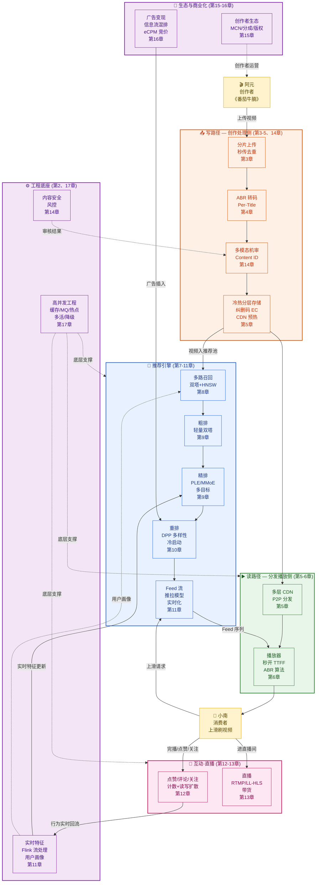
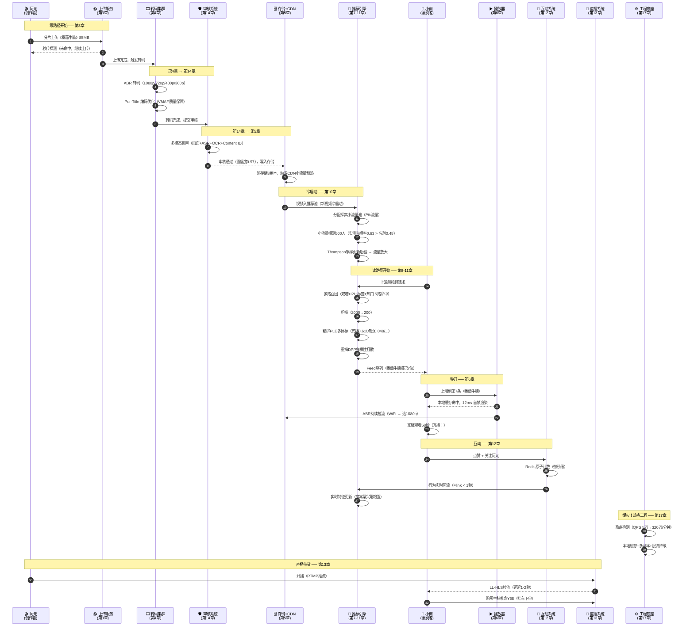
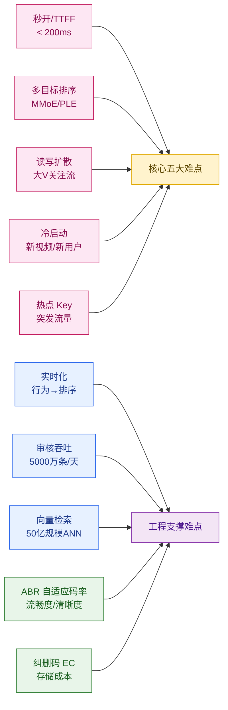
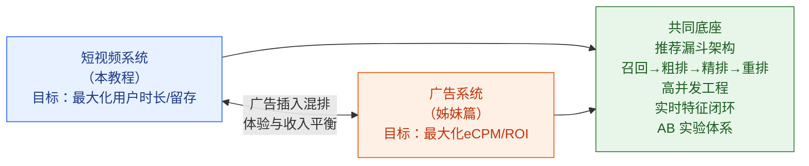
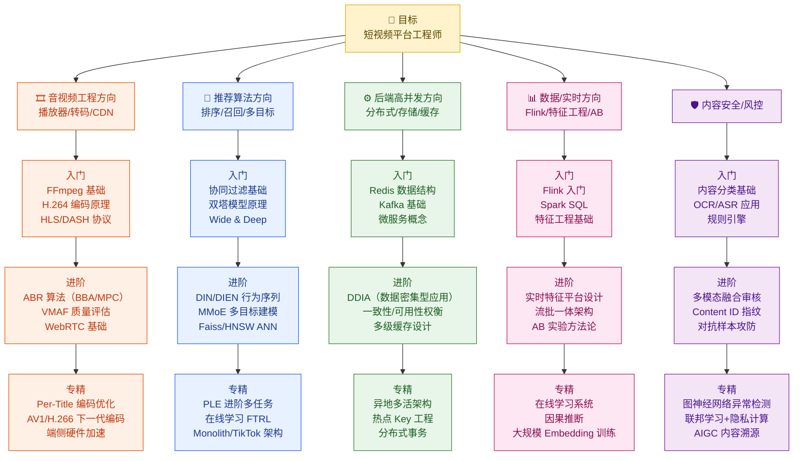
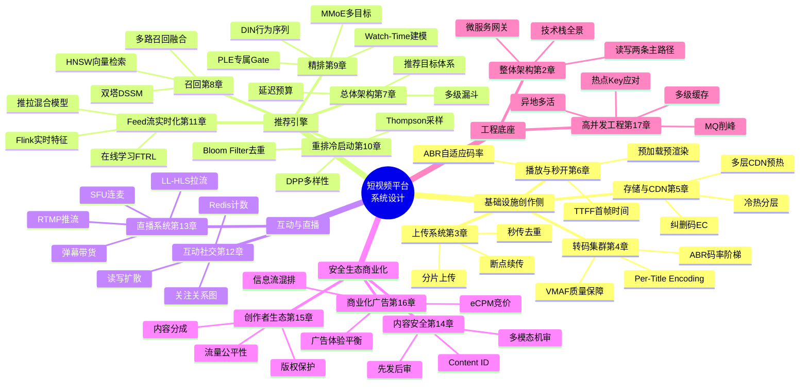

# 第 18 章 · 全链路串讲与学习路径

---

## 本章导读

经过前 17 章的系统拆解，你已经掌握了短视频平台的每一块拼图：从分片上传与秒传去重，到 ABR 转码与 Per-Title 编码优化；从多模态机审到冷热分层存储与 CDN 预热；从双塔召回与向量检索，到 MMoE/PLE 多目标精排；从沉浸式 Feed 流与实时特征，到点赞计数与读写扩散；从直播推拉流与弹幕，到内容安全与创作者生态；从商业化广告变现，到高并发工程架构与热点应对。

本章是全书的**大结局**：我们将以「阿元的厨房」发布一条新视频《3 分钟搞定番茄牛腩》为主线，把全部 18 章串成一个连贯的端到端故事。随后给出全链路大协同图、模块协同总表、核心难点速查、短视频与广告系统的对比总结、经典论文与开源项目清单、系统设计面试要点，以及分方向的学习路径图，帮助你在脑中建立起短视频平台的完整认知地图。

---

## 目录

1. [端到端串讲：《番茄牛腩》的完整一生](#181-端到端串讲番茄牛腩的完整一生)
2. [全链路大协同图](#182-全链路大协同图)
3. [《番茄牛腩》全旅程时序图](#183-番茄牛腩全旅程时序图)
4. [模块协同总表](#184-模块协同总表)
5. [核心难点 TOP 速查](#185-核心难点-top-速查)
6. [短视频 vs 广告系统对比总结](#186-短视频-vs-广告系统对比总结)
7. [经典论文与开源项目清单](#187-经典论文与开源项目清单)
8. [系统设计面试要点](#188-系统设计面试要点)
9. [分方向学习路径](#189-分方向学习路径)
10. [全教程知识地图](#1810-全教程知识地图)
11. [结语：演进中的短视频平台](#结语演进中的短视频平台)
12. [参考来源](#参考来源)

---

## 18.1 端到端串讲：《番茄牛腩》的完整一生

> 这是整本教程的高潮时刻。我们用「闪刷」平台上的一条具体视频，把所有模块串成一个连贯故事。每一步都标注对应的章节，让你清楚地看到：每一行代码、每一个算法、每一条架构决策，是如何在一条视频的旅程中各司其职的。

### 18.1.1 阿元录制与上传（第 3 章）

某个周六下午，美食创作者**阿元**在厨房录完了一条 58 秒的短视频《3 分钟搞定番茄牛腩》，打开「闪刷」App 准备上传。

**客户端预处理（第 3 章 §3.1）**：
- App 对视频做端侧压缩，从 220MB 原片压缩到 85MB H.264 文件
- 计算视频内容 Hash（SHA-256 + 感知哈希）：`video_hash = sha256("番茄牛腩_raw") = "a3f9..."`
- 向上传服务发起**秒传探测**请求：`GET /v1/upload/check?hash=a3f9...`
- 服务端比对秒传库，未命中（新视频）→ 返回上传令牌

**分片上传（第 3 章 §3.2）**：
- 客户端将 85MB 文件切成 32 个 2.6MB 的分片，编号 `chunk_0` 到 `chunk_31`
- 就近接入：App 通过 **HTTP-DNS** 解析到距阿元最近的接入节点（华东 IDC）
- 并发上传 4 个分片，每片带 `chunk_index` + `upload_token`，服务端落 S3
- 某分片因网络抖动失败 → 断点续传，仅重传失败分片
- 32 个分片全部上传后，服务端合并 → 触发转码任务

**数量级**：「闪刷」每天上传 5000 万条视频，峰值 1200 条/秒，分片上传保证了弱网下的成功率 > 99.5%。

---

### 18.1.2 转码流水线（第 4 章）

上传完成后，视频进入**转码集群**（第 4 章）：

```
原片 (85MB H.264 1080p)
  ↓ 切帧 → 240 个 GOP（每 GOP 约 0.25s / 30 帧）
  ↓ 并行转码（240 个 Worker 同时处理）
  ↓ ABR 码率阶梯
     ├─ 1080p  H.265  3Mbps
     ├─ 720p   H.265  1.5Mbps
     ├─ 480p   H.264  800Kbps
     └─ 360p   H.264  400Kbps（弱网兜底）
```

**Per-Title Encoding（第 4 章 §4.5）**：「番茄牛腩」是美食视频，色彩丰富、运动量中等。算法自动检测视频复杂度 $C = 0.62$，为该视频单独优化码率阶梯（而非用全平台统一阶梯），节省 18% 存储/带宽同时 VMAF 质量分不降低。

**封面抽帧**：转码时同步抽取 3 个候选封面帧（第 1s/15s/30s），后续机审和推荐系统都会用到。

转码完成后，生成视频元数据记录：

```json
{
  "video_id": "vid_fanqie_202401",
  "creator_id": "ayuan_001",
  "duration": 58,
  "title": "3分钟搞定番茄牛腩",
  "segments": ["1080p_url", "720p_url", "480p_url", "360p_url"],
  "cover": "cover_frame_15s_url",
  "status": "PENDING_REVIEW"
}
```

---

### 18.1.3 多模态机审过审（第 14 章）

转码完成后，视频进入**内容安全审核流水线**（第 14 章），这是**先发后审**策略的关键一环：

**机审流水线（第 14 章 §14.2）**：

| 审核维度 | 技术 | 结果 |
|---------|------|------|
| 画面违禁检测 | CNN 多分类：暴力/血腥/色情/广告 | ✅ 通过 |
| OCR 文字识别 | 检测字幕/水印/引流信息 | ✅ 通过（无违规文字）|
| ASR 语音转文字 | 检测违禁话术、引流词 | ✅ 通过 |
| 版权指纹（第 14 章 §14.4） | Content ID 哈希比对 | ✅ 原创（无版权冲突）|
| 搬运查重 | 感知哈希 + 向量相似度 | ✅ 原创 |
| 机审综合置信度 | 0.97（高置信通过） | ✅ 自动过审 |

机审耗时 **< 8 秒**，置信度 > 0.95 自动标记 `APPROVED`，无需人工介入（人审队列用于置信度 0.7–0.95 的灰色地带内容）。

---

### 18.1.4 存储冷热分层 + CDN 预热（第 5 章）

审核通过后，视频进入**存储与分发**环节（第 5 章）：

**存储分层（第 5 章 §5.1）**：
- 上线初期：视频存入**热存储**（高可用 SSD 对象存储，3 副本）
- 7 天后活跃度如跌出 Top 20%：自动迁移到**温存储**（HDD 对象存储）
- 180 天后几乎无访问：迁移到**冷存储**（纠删码 EC 8+4，成本降低 40%）

**纠删码（第 5 章 §5.2）**：`EC(8,4)` 表示把视频切成 8 个数据分片 + 4 个校验分片，任意损坏 4 个以内仍可恢复，比 3 副本节省 50% 存储成本。

**CDN 预热（第 5 章 §5.3）**：
- 「番茄牛腩」刚发布，流量未知，进入**小流量池**，暂不全量预热 CDN
- 当该视频完播率首次突破 40%（约上线后 2 小时），推荐系统打分上升，CDN 调度层自动发起**主动预热**：将 360p/480p 版本推送到全国主要城市的 CDN 边缘节点
- 1080p 版本不预热，按需从 Origin 拉取（节省 CDN 成本）

---

### 18.1.5 进推荐池：新视频冷启动（第 10 章）

视频过审后，推荐系统为「番茄牛腩」开启**冷启动**流程（第 10 章 §10.4）：

**新视频冷启动三阶段（第 10 章）**：

```
阶段 0 — 流量池分配：新视频进入「探索小流量池」（每次 Feed 请求有 2% 流量来自此池）
阶段 1 — 基础特征填充：
  - 标题/标签提取：["番茄牛腩","家常菜","美食","快手菜"]
  - 创作者 ID：ayuan_001（已有历史视频，中等体量账号）
  - 初始内容 Embedding：由视频帧 + 标题联合生成
  - 初始预估完播率：基于同类美食视频均值 = 0.48（先验值）
阶段 2 — 小流量探测：随机曝光给 500 个对美食感兴趣的用户
  - 实测完播率 = 0.63（高于先验值 0.48）
  - 点赞率 = 0.052（高于同类均值 0.031）
  → Thompson Sampling 更新后验 α=33, β=19 → pCTR 估计上升
阶段 3 — 流量放大：置信度达到阈值后，进入「主流量池」
  - 完播信号强 → 被多路召回通道捞起
```

**关键设计**：冷启动不依赖历史交互数据（新视频无历史），靠**内容 Embedding + 先验 + 小流量探测**的三层机制快速建立信用。

---

### 18.1.6 多路召回（第 8 章）

几小时后，「番茄牛腩」已积累了足够的信号，开始在正式推荐漏斗中被**多路召回**（第 8 章）。

以**小南**（22 岁/上海/美食兴趣）为例，某晚 10 点打开「闪刷」刷视频：

**多路召回并行（第 8 章 §8.2）**：

| 召回路 | 方法 | 是否召回《番茄牛腩》 |
|--------|------|-------------------|
| **U2I 双塔向量召回** | 小南的 User Embedding 与「番茄牛腩」的 Item Embedding 余弦相似度 0.79 > 阈值 0.7 | ✅ 命中 |
| **I2I 协同过滤（Swing）** | 与小南看过的「红烧肉教程」共现用户多 | ✅ 命中 |
| **兴趣标签召回** | 小南兴趣标签含「美食」，「番茄牛腩」标签匹配 | ✅ 命中 |
| **热门视频召回** | 当前完播率排行榜（美食 Top-100） | ✅ 命中（美食区 Top-38）|
| **关注流召回** | 小南未关注阿元 | ❌ 未命中 |
| **实时行为召回** | 小南 30 分钟前点赞了「咖喱饭教程」 | ✅ 命中（实时兴趣信号）|

六路召回汇聚后去重，「番茄牛腩」以 5 路命中进入粗排，**综合得分很高**。

**向量检索（第 8 章 §8.3）**：双塔向量召回底层使用 HNSW 图索引（50 亿视频库），在 **15ms** 内完成 Top-200 近似最近邻检索。

---

### 18.1.7 粗排精排多目标打分（第 9 章）

召回的约 2000 条候选视频（去重后）进入排序漏斗（第 9 章）：

**粗排（第 9 章 §9.1）**：
- 使用轻量双塔模型（2 层 MLP）对 2000 条候选快速打分
- 耗时 **< 15ms**，淘汰至 Top-200
- 「番茄牛腩」轻量打分 = 0.72，排名 Top-30 进入精排

**精排多目标建模（第 9 章 §9.3）**：

使用 **PLE（Progressive Layered Extraction）**（腾讯提出）对小南进行多目标联合建模：

$$\text{综合分} = w_1 \cdot \hat{p}_{完播} + w_2 \cdot \hat{p}_{点赞} + w_3 \cdot \hat{p}_{评论} + w_4 \cdot \hat{p}_{关注} + w_5 \cdot \hat{p}_{时长}$$

| 预测目标 | 模型 | 对「番茄牛腩」的预测值 |
|---------|------|-------------------|
| 完播率 | MMoE 共享专家塔 | 0.61 |
| 点赞率 | 专属 Gate | 0.048 |
| 评论率 | 专属 Gate | 0.012 |
| 关注率 | 专属 Gate | 0.009 |
| 观看时长（秒） | Watch-Time 回归 | 51.3s（归一化 = 0.88）|

**Watch-Time 归一化（第 9 章 §9.4）**：视频时长 58 秒，预估观看 51.3 秒，归一化完播率 = 51.3/58 = 0.884。避免了短视频虚高完播率问题。

**DIN 行为序列注意力（第 9 章 §9.2）**：

小南近 30 天行为序列：[红烧肉/番茄炒蛋/可乐鸡翅/麻婆豆腐 × 多次]，DIN Attention 权重集中在「家常菜」维度，放大了对「番茄牛腩」的评分：

```
Attention(Q=番茄牛腩, K=小南行为历史):
家常菜相关 → 0.68
萌宠内容   → 0.08
旅行内容   → 0.06
→ 精排综合分 = 0.79（Top-8 进入重排）
```

---

### 18.1.8 重排多样性与 Feed 排列（第 10、11 章）

精排 Top-200 进入**重排**（第 10 章 §10.2）：

**DPP 多样性打散**：防止小南一刷看到 5 条番茄菜式，用行列式点过程（DPP）在相关性和多样性之间平衡。「番茄牛腩」在 DPP 重排中仍保持高位（美食赛道其他视频被稍微压制）。

**已看去重（第 10 章 §10.3）**：小南今晚已刷过 47 条视频，用 Bloom Filter（假正率 < 0.1%）在微秒内过滤掉已看视频，不再重复出现。

**广告插入（第 16 章）**：重排最终序列中，按照「每 5 条插 1 条广告」策略，混入了一条食材购买广告（与番茄牛腩主题高度相关，由广告竞价系统选出，见第 16 章）。

**进小南的 Feed（第 11 章 §11.2）**：最终生成一个长度为 25 的预取序列推送到小南的客户端，其中「番茄牛腩」排在第 **7** 位。Feed 推拉模型：
- 小南粉丝量 < 1000，属于普通用户 → **拉模型**（读时聚合推荐结果）
- 阿元粉丝量 80 万 → 其他订阅了阿元的用户使用**推模型**（发布时写扩散）

---

### 18.1.9 小南上滑 200ms 秒开（第 6 章）

小南滑到第 7 条，「番茄牛腩」开始加载。**秒开之谜**在第 6 章完整揭秘：

**为什么能在 200ms 内看到第一帧（第 6 章 §6.2）**：

```
T-∞     客户端在第 3、4 条视频播放期间，已预加载第 5~8 条视频的前 3 秒片段
T+0ms   小南手指上滑
T+0ms   切换到「番茄牛腩」→ 本地缓存命中前 3 秒数据
T+8ms   播放器从本地内存取到第一个 GOP（关键帧 I-frame）
T+12ms  解码器输出第一帧
T+12ms  屏幕渲染第一帧  ← 用户感知到视频已经开始
T+80ms  网络持续拉取后续片段（ABR 算法实时选择码率）
```

首帧时间（TTFF）= **12ms**，远优于 200ms 目标。

**ABR 自适应码率（第 6 章 §6.3）**：小南手机网络为 WiFi（带宽 45Mbps），ABR 算法（MPC 预测控制）选择 1080p H.265 3Mbps 流，画质最优。

**播放器池化（第 6 章 §6.4）**：复用播放器对象，避免每次滑动重新创建播放器实例，节省 30ms 初始化时间。

---

### 18.1.10 完播点赞关注阿元（第 12 章）

小南完整看完了 58 秒，深深被番茄牛腩吸引——她点了**点赞**，还**关注了阿元**！

**点赞计数系统（第 12 章 §12.1）**：

```
小南点赞 → Redis INCR video:vid_fanqie_202401:like_count
                              ↑
                        内存中原子自增（微秒级）
                              ↓
           异步写 MQ → Flink 消费 → 批量写 MySQL（每秒一批）
```

「番茄牛腩」的点赞数此时已有 **12,847**，Redis 计数是 12848（含小南这一票）。系统每分钟与 MySQL 对账，误差 < 0.01%。

**关注关系写扩散（第 12 章 §12.3）**：小南关注阿元：

- 将 `(小南 → 阿元)` 关系写入关注图数据库（图存储/Redis Sorted Set）
- 阿元粉丝量 80 万，属于**大 V**（粉丝 > 100 万阈值的边界），采用**写扩散 + 读扩散混合模式**
- 小南加入阿元的粉丝列表，阿元后续发布的新视频将出现在小南的关注 Feed 中

**通知推送（第 12 章 §12.4）**：阿元的 App 收到推送通知：「你有 1 位新粉丝」。

---

### 18.1.11 行为分钟级回流，影响下一刷（第 11 章）

小南的**完播 + 点赞 + 关注**行为在**分钟级**回流到推荐系统（第 11 章 §11.4）：

**实时特征更新（第 11 章 §11.4）**：

```
行为事件流：{user=小南, video=番茄牛腩, action=complete+like+follow, ts=22:47:03}
                ↓ Kafka → Flink（< 1 秒处理）
用户实时特征：small_nan.real_time_interests["家常菜"] += 0.15
                ↓ 写入特征存储（Redis / 低延迟 KV）
下一刷排序时：精排模型读取更新后的实时特征
             → 家常菜类视频整体评分上升
             → 小南下一刷看到更多家常菜内容（正向飞轮）
```

**在线学习（第 11 章 §11.5）**：点赞行为作为正样本，以**流式方式**更新推荐模型（FTRL 在线学习），模型参数在 10 分钟内反映这个信号。这是推荐系统的**数据飞轮**本质。

---

### 18.1.12 视频爆火，热点工程扛住（第 17 章）

发布 12 小时后，「番茄牛腩」意外出圈——被美食博主二次传播，登上热搜。单视频的请求量在 5 分钟内从 5 万次/分钟飙升到 **320 万次/分钟**（第 17 章 §17.6）：

**热点 Key 应对（第 17 章 §17.6）**：

```
正常时：Redis 单节点存 video:vid_fanqie_202401:info
爆火时：Redis 该 Key QPS 瞬间 → 50万+/秒 → 单节点撑不住！

应对措施（第 17 章 §17.5）：
  ① 本地缓存（Local Cache）：每台 API 服务器内存中缓存视频元数据，TTL=5s
     → 单服务器 Redis 请求从 50 万降到每 5 秒 1 次
  ② 热点发现：计数器检测到该 Key 的 QPS 在 30 秒内上涨 100x → 触发热点标记
  ③ 多副本冗余：将热点 Key 复制到 10 个 Redis 节点，随机负载均衡读取
  ④ 降级兜底：若 Redis 全部不可用 → 返回视频元数据的静态快照版本
```

**CDN 带宽峰值（第 5 章 + 第 17 章）**：320 万次/分钟的播放请求，假设 60% 选择 720p（1.5Mbps），CDN 节点承受带宽峰值 = 320 万 × 60% × 1.5Mbps ÷ 60s ≈ **48 Tbps**（全国分散，单 PoP 节点分摊后可承受）。

**MQ 削峰（第 17 章 §17.4）**：爆火带来的海量点赞/评论事件通过 Kafka 做削峰，不直接打 MySQL，消费速率平滑可控。

---

### 18.1.13 阿元成长签约 MCN（第 15 章）

爆火后阿元的粉丝量从 80 万涨到 **340 万**，平台创作者数据看板（第 15 章 §15.4）为她展示：

| 指标 | 值 |
|------|---|
| 今日新增粉丝 | +260 万 |
| 视频播放量 | 1.48 亿 |
| 完播率 | 67% |
| 互动率 | 8.3% |
| 预计本月内容分成 | ¥18,400 |

**流量分发公平性（第 15 章 §15.2）**：平台对中等体量创作者有**新人扶持**机制，即使粉丝量小也能通过高质量内容获得流量。阿元靠真实高完播率赢得流量，不靠买量。

**MCN 签约（第 15 章 §15.5）**：爆火后某 MCN 机构通过平台创作者开放平台 API 发现阿元，发起合作。平台提供**版权保护**（第 15 章 §15.6）——若有他人搬运「番茄牛腩」，Content ID 系统自动识别并将收益导回给阿元。

---

### 18.1.14 阿元开直播带货食材（第 13 章）

成名后的阿元开启了直播带货：「番茄牛腩专用牛腩礼盒，今天直播价 ¥68！」（第 13 章）

**直播链路（第 13 章 §13.2）**：

```
阿元手机（推流端）
  → RTMP 推流（低延迟）→ 边缘 Ingest 节点（上海）
  → 信令服务器（SRS）→ 转码处理（自适应码率）
  → CDN 拉流（全国）→ 小南的 App（拉流端）
总延迟：RTMP 方案 ≈ 3-5 秒；LL-HLS 方案 ≈ 1-2 秒
```

**弹幕系统（第 13 章 §13.3）**：峰值 3 万条/秒的弹幕通过**基于 WebSocket 的长连接 + 弹幕聚合**（每 200ms 批量推送）处理，避免客户端被弹幕淹没。

**礼物打赏与带货（第 13 章 §13.4）**：
- 小南购买了牛腩礼盒 ¥68，通过直播挂车跳转电商平台完成支付
- 平台抽取 5% 佣金
- 阿元开播 2 小时 GMV = **¥820,000**（爆款视频带来的直播转化率显著高于平均水平）

**直播热点容灾（第 13 章 §13.5 + 第 17 章）**：阿元同时在线观看人数峰值 **220 万**，直播服务通过 SFU 架构 + 多层 CDN 扛住，无卡顿。

---

### 18.1.15 Feed 中插广告变现（第 16 章）

同一时间，数百万与小南兴趣相似的用户也刷到了「番茄牛腩」。平台在 Feed 流中**插入广告**（第 16 章）：

**广告与推荐混排（第 16 章 §16.2）**：

```
推荐引擎输出 Feed 序列：[视频A, 视频B, 番茄牛腩, 视频D, ...]
广告系统实时竞价（pCTR × pCVR × bid → eCPM 排序）：
  → 食材商家（牛肉/番茄特卖）的广告 eCPM 最高 = 4.8
  → 插入位置：第 5 条（混排规则：每 5 条插 1 条广告）
最终 Feed：[视频A, 视频B, 番茄牛腩, 视频D, 广告:牛肉特卖, 视频F, ...]
```

**竞价 vs 推荐分统一（第 16 章 §16.4）**：平台用统一评分框架 `score = α·CTR + β·completion + γ·eCPM` 同时处理自然内容和广告，保证用户体验不因广告过多而受损（广告频次上限：每 5 条 1 条）。

「番茄牛腩」爆火的这一天，平台通过相关美食/食材广告**额外变现 ¥230 万**——爆款内容的外溢效应让广告系统也受益。

---

### 18.1.16 《番茄牛腩》的完整旅程总结

从一次上传到全国爆火，「番茄牛腩」走过了 18 章的每一个技术模块：

```
上传(第3章) → 转码(第4章) → 机审(第14章) → 存储+CDN(第5章)
  → 冷启动(第10章) → 召回(第8章) → 粗排+精排(第9章)
  → 重排多样性(第10章) → 进 Feed(第11章) → 秒开播放(第6章)
  → 互动(第12章) → 实时回流(第11章) → 热点扛压(第17章)
  → 创作者生态(第15章) → 直播带货(第13章) → 广告变现(第16章)
```

这就是一条短视频的完整一生，也是整个短视频平台系统的协同运转。

---

## 18.2 全链路大协同图

下图将所有模块按数据流向组织成一张全景协同图，展示写路径与读路径如何在同一套系统中交汇。



---

## 18.3 《番茄牛腩》全旅程时序图

下面这张时序图是全章的核心图，标注了「番茄牛腩」从上传到爆火的完整旅程，以及每一步对应的章节。



---

## 18.4 模块协同总表

| 模块 | 输入 | 输出 | 关键技术点 | 对应章节 |
|------|------|------|-----------|---------|
| **分片上传** | 原始视频文件 | 存储 Object Key + 上传元数据 | 断点续传、秒传去重、就近接入 | 第 3 章 |
| **ABR 转码** | 原始视频（单档）| 多码率视频分片（m3u8+ts/fmp4） | 并行 GOP 切分、Per-Title Encoding、VMAF | 第 4 章 |
| **存储分层** | 转码后多档视频 | 可访问的视频 URL（按冷热级别）| 热/温/冷分层、EC 纠删码、生命周期管理 | 第 5 章 |
| **CDN 分发** | 视频 URL + 播放请求 | 边缘节点就近返回视频片段 | 多层 CDN、P2P-CDN、主动预热/被动拉取 | 第 5 章 |
| **播放器与秒开** | CDN 视频流 | 用户屏幕渲染帧 | 预加载、播放器池化、ABR（BBA/MPC）、首帧 TTFF | 第 6 章 |
| **推荐总架构** | 用户请求 + 视频库 | 有序 Feed 列表 | 多级漏斗、延迟预算、数据流 | 第 7 章 |
| **多路召回** | 用户 Embedding + 视频库 | 2000 条候选视频 | 双塔/DSSM、HNSW/Faiss ANN、I2I Swing | 第 8 章 |
| **粗排** | 2000 条候选 | Top-200 候选 | 轻量双塔、知识蒸馏 | 第 9 章 |
| **精排** | 200 条候选 + 完整特征 | 多目标打分列表 | MMoE/PLE、DIN 行为序列、Watch-Time 建模 | 第 9 章 |
| **重排与冷启动** | 精排 Top-200 | 最终 Feed 序列（25条）| DPP 多样性、Bloom Filter 去重、Thompson/UCB 探索 | 第 10 章 |
| **Feed 流与实时化** | 重排序列 + 实时信号 | 用户 Feed + 实时特征闭环 | 推拉混合模型、Flink 流处理、在线学习 | 第 11 章 |
| **互动与社交** | 用户行为（点赞/评论/关注）| 计数、关系图、通知 | Redis 原子计数、读写扩散、Bloom Filter | 第 12 章 |
| **直播系统** | 推流端音视频流 | 拉流端播放 + 弹幕/礼物/带货 | RTMP/SRT/LL-HLS、SFU、弹幕聚合 | 第 13 章 |
| **内容安全审核** | 转码后视频 + 元数据 | 审核结论（APPROVED/REJECTED/REVIEW）| 多模态 CNN/ASR/OCR、Content ID、先发后审 | 第 14 章 |
| **创作者生态** | 视频数据 + 账号数据 | 流量分配、激励、MCN 对接 | 流量公平性、内容分成、版权保护 | 第 15 章 |
| **商业化广告** | Feed 序列 + 广告候选 | 广告+自然内容混排序列 | eCPM 竞价、广告-内容统一评分、频次控制 | 第 16 章 |
| **高并发工程底座** | 全链路请求 | 高可用、低延迟保障 | 多级缓存、MQ 削峰、热点 Key、异地多活、降级 | 第 17 章 |

---

## 18.5 核心难点 TOP 速查

短视频平台最有含金量的工程和算法难点集中在以下几个领域，面试和实际工作中被反复考察：



### 难点速查表

| 难点 | 本质问题 | 核心解法 | 对应章节 |
|------|---------|---------|---------|
| **秒开（TTFF < 200ms）** | 网络延迟 vs 用户感知 | 预加载 + 本地缓存 + 播放器池化 + 关键帧优先 | 第 6 章 |
| **多目标排序** | 完播/时长/互动多目标冲突 | MMoE 共享专家 + PLE 专属 Gate + 融合公式 | 第 9 章 |
| **读扩散（大 V 粉丝流）** | 大 V 发布时写扩散成本巨高 | 混合模型：中小 V 写扩散 + 大 V 读扩散 + Fan-out on Read | 第 11、12 章 |
| **写扩散（计数）** | 高并发点赞写入 MySQL 炸 | Redis 原子计数 → Kafka → 异步批量落库 + 定期对账 | 第 12 章 |
| **新视频冷启动** | 无历史数据无法排序 | 内容 Embedding 先验 + 小流量 Thompson Sampling | 第 10 章 |
| **新用户冷启动** | 无历史偏好 | 设备特征 + 时段 + 快速探索多类目 | 第 10 章 |
| **热点 Key 突发** | 单 Redis Key 百万 QPS | 本地缓存 + 热点多副本 + 限流降级 | 第 17 章 |
| **实时特征时效** | 行为→排序反馈延迟 | Flink 流处理 < 1s + 特征存储低延迟 KV | 第 11 章 |
| **50 亿规模向量检索** | 暴力检索 O(N) 太慢 | HNSW 近似最近邻，毫秒级 Top-K | 第 8 章 |
| **审核吞吐 5000 万/天** | 人审无法处理海量视频 | 先发后审 + 分级审核 + 机审置信度分层 | 第 14 章 |
| **ABR 自适应码率** | 网络抖动时卡顿 vs 模糊 | BBA 缓冲区算法 + MPC 预测控制 | 第 6 章 |
| **存储成本** | 50 亿条视频存储成本爆炸 | 冷热分层 + EC 纠删码（比3副本省50%成本）| 第 5 章 |

---

## 18.6 短视频 vs 广告系统对比总结

本教程与姊妹篇《广告投放系统设计》覆盖了两套紧密相关但逻辑不同的系统。读完两篇教程，能建立起最完整的互联网平台技术认知。

### 18.6.1 两套系统的关系



### 18.6.2 共性与差异对比表

| 维度 | 短视频推荐系统 | 广告投放系统 |
|------|-------------|------------|
| **核心目标** | 最大化用户时长、完播率、留存 | 最大化 eCPM、ROI、转化率 |
| **排序信号** | 完播率、点赞、关注、时长 | pCTR × pCVR × bid → eCPM |
| **竞价机制** | 无竞价（内容按分排序）| GSP/VCG 二价拍卖，出价影响排名 |
| **用户目标** | 让用户爱看/停留更久 | 让用户点击/转化 |
| **召回架构** | 双塔 + HNSW + 多路召回 | 双塔 + Faiss + 定向（DNF 倒排）|
| **排序模型** | MMoE/PLE 多任务学习 | DIN/DIEN/DeepFM + ESMM CVR |
| **实时性要求** | 行为分钟级→排序（推荐飞轮）| 竞价实时 < 80ms（不可延迟）|
| **冷启动** | 新视频/新用户冷启动 | 新广告 Explore-Exploit（UCB）|
| **预算控制** | 无（无限供给内容）| Pacing 预算控制（PID 双控）|
| **数据飞轮** | 行为→模型→分发→更多行为 | 转化→CVR 模型→出价→更多转化 |
| **多样性** | DPP 打散避免内容同质化 | DPP 多样性（避免同一品类广告重复）|
| **三方关系** | 创作者 × 平台 × 消费者 | 广告主 × 媒体 × 用户 |
| **工程底座** | Redis/Kafka/Flink/分布式推理 | 相同（Redis/Kafka/Flink/特征平台）|

### 18.6.3 关键差异：推荐漏斗 vs 广告漏斗

短视频推荐的本质是「**无限内容的排列问题**」——把 50 亿条视频排个顺序给用户看，不涉及经济博弈。

广告系统的本质是「**稀缺流量的拍卖问题**」——多个广告主竞争有限的展示机会，用 eCPM 价格机制分配流量，需要激励相容（GSP 二价）。

两者的**漏斗结构完全一致**（召回→粗排→精排→重排），**差别在于排序目标**：

$$\text{推荐排序} = f(完播率, 时长, 互动率, \ldots)$$

$$\text{广告排序} = pCTR \times pCVR \times bid = eCPM$$

这一差异驱动了两套系统在**出价引擎、预算控制、归因系统、反作弊**等模块上的巨大分叉。

**建议读者的交叉阅读路径**：先读短视频第 7-11 章建立推荐漏斗认知框架，再读广告系统第 5-8 章理解 eCPM 竞价机制，然后读第 16 章（本教程商业化章）理解两者如何在 Feed 流中共存。

---

## 18.7 经典论文与开源项目清单

### 18.7.1 推荐与排序

| 论文 | 作者/来源 | 年份 | 贡献 | 对应章节 |
|------|---------|------|------|---------|
| [Deep Neural Networks for YouTube Recommendations](https://dl.acm.org/doi/10.1145/2959100.2959190) | Covington et al. / Google | RecSys 2016 | 工业级推荐系统奠基，双塔结构+多任务 | 第 7、8 章 |
| [Wide & Deep Learning for Recommender Systems](https://dl.acm.org/doi/10.1145/2988450.2988454) | Cheng et al. / Google | RecSys 2016 | 记忆+泛化联合训练框架 | 第 9 章 |
| [DeepFM: A Factorization-Machine based Neural Network for CTR Prediction](https://www.ijcai.org/proceedings/2017/0239.pdf) | Guo et al. | IJCAI 2017 | FM × DNN 端到端联合建模 | 第 9 章 |
| [Deep Interest Network for Click-Through Rate Prediction](https://dl.acm.org/doi/10.1145/3219819.3219823) | Zhou et al. / Alibaba | KDD 2018 | 用户行为序列 Attention（DIN）| 第 9 章 |
| [Deep Interest Evolution Network](https://arxiv.org/abs/1809.03672) | Zhou et al. / Alibaba | AAAI 2019 | GRU 建模兴趣演化（DIEN）| 第 9 章 |
| [Modeling Task Relationships in Multi-task Learning with Multi-gate Mixture-of-Experts](https://dl.acm.org/doi/10.1145/3219819.3220007) | Ma et al. / Google | KDD 2018 | MMoE 多目标多任务 | 第 9 章 |
| [Progressive Layered Extraction (PLE)](https://dl.acm.org/doi/10.1145/3383313.3412236) | Tang et al. / Tencent | RecSys 2020 | PLE 改进 MMoE，专属 Gate | 第 9 章 |
| [Sampling-Bias-Corrected Neural Modeling for Large Corpus Item Recommendations](https://dl.acm.org/doi/10.1145/3298689.3346996) | Yi et al. / Google | RecSys 2019 | In-batch 负采样偏差修正 | 第 8 章 |
| [Monolith: Real Time Recommendation System With Collisionless Embedding Table](https://arxiv.org/abs/2209.07663) | Liu et al. / ByteDance | arXiv 2022 | TikTok 无碰撞 Embedding + 实时在线学习 | 第 11 章 |

### 18.7.2 多样性与重排

| 论文 | 作者/来源 | 年份 | 贡献 | 对应章节 |
|------|---------|------|------|---------|
| [Practical Diversified Recommendations on YouTube with Determinantal Point Processes](https://dl.acm.org/doi/10.1145/3269206.3272018) | Wilhelm et al. / Google | CIKM 2018 | DPP 在工业推荐中的多样性实践 | 第 10 章 |
| [Contextual Combinatorial Cascading Bandits](https://proceedings.mlr.press/v48/lif16.html) | Li et al. | ICML 2016 | Bandit 探索+利用理论基础 | 第 10 章 |

### 18.7.3 向量检索

| 论文/项目 | 来源 | 年份 | 贡献 | 对应章节 |
|---------|------|------|------|---------|
| [Efficient and Robust Approximate Nearest Neighbor Search Using Hierarchical Navigable Small World Graphs (HNSW)](https://arxiv.org/abs/1603.09320) | Malkov & Yashunin | IEEE TPAMI 2020 | HNSW 图索引，亿级 ANN 检索标准方案 | 第 8 章 |
| [Faiss: A Library for Efficient Similarity Search](https://github.com/facebookresearch/faiss) | Facebook AI Research | 2017 | ANN 向量检索工业级库 | 第 8 章 |

### 18.7.4 音视频工程

| 论文/项目 | 来源 | 年份 | 贡献 | 对应章节 |
|---------|------|------|------|---------|
| [A Large-scale Analysis of Adaptive Bitrate Streaming (Per-Title Encoding)](https://www.usenix.org/conference/atc16/technical-sessions/presentation/yan) | Netflix | ATC 2016 | Per-Title Encoding，视频级个性化码率 | 第 4 章 |
| [VMAF: The Journey Continues](https://netflixtechblog.com/vmaf-the-journey-continues-44b51ee9ed12) | Netflix Tech Blog | 2019 | VMAF 视频质量度量框架 | 第 4 章 |
| [Comcast Low Latency HLS (LL-HLS)](https://developer.apple.com/documentation/http_live_streaming/enabling_low-latency_hls) | Apple WWDC | 2019 | 低延迟 HLS 规范，直播延迟 < 2s | 第 13 章 |
| [FFmpeg](https://github.com/FFmpeg/FFmpeg) | 开源社区 | — | 音视频处理瑞士军刀，转码核心依赖 | 第 4 章 |

### 18.7.5 高并发工程

| 论文/项目 | 来源 | 年份 | 贡献 | 对应章节 |
|---------|------|------|------|---------|
| [B 站 GOIM（IM 系统）](https://github.com/Terry-Mao/goim) | Bilibili / 毛剑 | — | 千万级 IM/弹幕推送开源实现 | 第 13 章 |
| [Dynamo: Amazon's Highly Available Key-value Store](https://dl.acm.org/doi/10.1145/1294261.1294281) | DeHaan et al. / Amazon | SOSP 2007 | 最终一致性 KV 存储，工程底座 | 第 17 章 |
| [Kafka: a Distributed Messaging System for Log Processing](https://dl.acm.org/doi/10.1145/2076796.2076797) | Kreps et al. / LinkedIn | NetDB 2011 | Kafka 分布式消息队列 | 第 11、17 章 |
| [Flink: Stateful Computations over Data Streams](https://flink.apache.org/2015/09/16/high-throughput-low-latency-and-exactly-once.html) | Apache Flink | — | 流计算引擎，实时特征更新 | 第 11 章 |

---

## 18.8 系统设计面试要点

### 18.8.1 面试题型：「设计一个抖音/短视频平台」

这是 FAANG/字节/腾讯等大厂最常见的系统设计题之一。以下是标准答题框架：

#### Step 1：需求澄清（2-3 分钟）

```
必问清楚的问题：
1. 规模：DAU 多少？视频库多大？峰值 QPS？
2. 核心功能范围：上传/播放/推荐/互动，优先级是什么？
3. 侧重：音视频基础设施？推荐算法？高并发工程？
4. 约束：延迟目标（秒开时间）？一致性要求？
5. 特殊场景：直播？热点事件？
```

#### Step 2：规模估算（2-3 分钟）

| 维度 | 估算方法 | 典型值 |
|------|---------|-------|
| 上传 QPS | DAU × 上传比例 ÷ 86400 | 1.5亿 × 0.01% ÷ 86400 ≈ **173/s** |
| 推荐 QPS | DAU × 刷新次数 ÷ 86400 | 1.5亿 × 10 ÷ 86400 ≈ **17,400/s** |
| 播放 QPS | DAU × 视频数/天 ÷ 86400 | 1.5亿 × 50 ÷ 86400 ≈ **87,000/s** |
| 存储 | 日上传量 × 视频大小 × 码率 | 5000万 × 85MB × (1+EC冗余) ≈ **6.4 PB/天** |
| 带宽峰值 | 推荐QPS × 视频码率 | 87,000 × 1.5Mbps ≈ **130 Tbps** |

#### Step 3：整体架构设计（5-8 分钟）

先画出写路径（上传链路）和读路径（播放推荐链路）两条主路：

```
写路径：Client → 上传服务 → 转码集群 → 审核 → 存储 → CDN 预热 → 推荐池
读路径：Client → API 网关 → 推荐服务（召回→粗排→精排→重排）→ CDN → 播放
```

#### Step 4：核心链路深挖（8-10 分钟，根据面试官偏好选 1-2 个）

面试官常追问的深挖点：

| 追问点 | 你的回答要点 |
|--------|------------|
| 秒开怎么做到 200ms？ | 预加载+缓存+播放器池化，见第 6 章 |
| 推荐召回如何处理 50 亿视频？ | HNSW/Faiss ANN，离线建索引，毫秒检索 |
| 多目标排序如何平衡完播和互动？ | MMoE/PLE 多任务 + 融合公式 + 在线 AB 实验 |
| 大 V 发视频时关注流如何处理？ | 写扩散+读扩散混合，Fan-out on Read |
| 点赞数如何支撑高并发？ | Redis 原子计数+异步 Kafka+批量落库 |
| 热点视频突然爆火怎么办？ | 本地缓存+Redis 多副本+CDN 主动扩容 |

#### Step 5：难点权衡（3-5 分钟）

面试最体现深度的环节——展示你对**取舍**的理解：

| 权衡场景 | Option A | Option B | 选哪个+理由 |
|---------|---------|---------|-----------|
| 关注流推送 | 写扩散（发时推）| 读扩散（读时拉）| 混合：中小 V 写，大 V 读（成本/时效平衡）|
| 推荐实时性 | 秒级实时特征 | 天级离线特征 | 混合：秒级行为+天级画像（降成本+保时效）|
| 视频存储 | 3 副本 | EC 纠删码 | 冷存储用 EC（省 50% 成本），热存储用副本（低延迟恢复）|
| 审核策略 | 先审后发 | 先发后审 | 先发后审（时效性更好），高风险视频拦截+人审兜底 |

#### Step 6：演进方向（1-2 分钟）

- 下一步优化：在线学习减少推荐延迟；端侧推理秒开体验再提升
- 扩展方向：多模态理解（视频+语音+字幕）、AIGC 内容、联邦学习保护隐私

### 18.8.2 常见失误

| 失误类型 | 具体表现 | 正确做法 |
|---------|---------|---------|
| 忽视规模估算 | 跳过数据规模直接画架构 | 先估算再设计，让架构决策有数字支撑 |
| 答题宽不深 | 每个模块都提到但哪个都没深入 | 选 1-2 个核心模块深挖到底 |
| 没有权衡 | 只说「我选 A 方案」不解释为什么 | 每个关键决策都要说「A 的代价是什么，为什么在这个场景选 A」|
| 忽视数据流 | 只画模块框，不画数据如何流动 | 显式标注数据的输入输出方向 |
| 遗漏工程约束 | 不考虑延迟预算、机器成本 | 每个模块都要问「这个延迟能接受吗？成本可控吗？」|

---

## 18.9 分方向学习路径



### 18.9.1 音视频工程方向（第 3-6、13 章）

**适合人群**：对底层音视频技术感兴趣，喜欢端到端优化问题，有 C/C++ 或移动端开发背景。

| 阶段 | 学习内容 | 推荐资源 |
|------|---------|---------|
| **入门** | FFmpeg 命令行工具 + 基础编解码原理 | FFmpeg 官方文档；《雷霄骅的 CSDN 博客》（国内最好的音视频入门）|
| **入门** | HLS/DASH/CMAF 封装格式 | Apple HLS 官方规范；MPEG-DASH 标准 |
| **进阶** | ABR 自适应码率算法（BBA/MPC）| Huang 2012 BBA 论文；Pensieve 强化学习 ABR |
| **进阶** | VMAF 视频质量评估 | Netflix VMAF GitHub + 技术博客 |
| **进阶** | WebRTC 架构与 SFU | WebRTC 官方文档；mediasoup 开源 SFU |
| **专精** | Per-Title Encoding 生产实践 | Netflix Tech Blog；字节 ByteVC 技术博客 |
| **专精** | AV1/H.266 下一代编码 | AOM AV1 规范；Alliance for Open Media |

**关键项目实践**：
- 用 FFmpeg 实现一个 ABR 转码 Pipeline（输入 1080p，输出 4 档）
- 用 libvlc 或 ijkplayer 改造播放器，实现简单预加载逻辑
- 搭建本地 SRS（Simple Realtime Server）测试直播延迟

---

### 18.9.2 推荐算法方向（第 7-11 章）

**适合人群**：有机器学习基础，对用户行为建模感兴趣，PyTorch/TensorFlow 熟练。

| 阶段 | 学习内容 | 推荐资源 |
|------|---------|---------|
| **入门** | 协同过滤（UserCF/ItemCF）+ 矩阵分解 | 《推荐系统实践》项亮 |
| **入门** | Wide & Deep + DeepFM | 原论文 + DeepCTR 开源库复现 |
| **进阶** | DIN/DIEN 行为序列建模 | 阿里原论文 + Alibaba PAI 实践 |
| **进阶** | MMoE/PLE 多目标建模 | Google/腾讯原论文 + TensorFlow Recommenders |
| **进阶** | 双塔模型 + Faiss ANN 检索 | YouTube DNN 论文 + Faiss 文档 |
| **专精** | 在线学习（FTRL/Proximal Gradient）| Google KDD 2013「Ad Click from the Trenches」|
| **专精** | Monolith：TikTok 工业级推荐架构 | ByteDance 2022 arXiv 论文 |
| **专精** | DPP 多样性 | Wilhelm 2018 CIKM 论文 |

**关键项目实践**：
- 在 MovieLens 数据集上复现双塔召回 + DIN 精排全链路
- 用 Faiss 构建 100 万规模向量检索 Demo（IndexHNSWFlat）
- 实现简单的 Thompson Sampling 冷启动模拟器

---

### 18.9.3 后端高并发方向（第 2、12、17 章）

**适合人群**：对分布式系统感兴趣，熟悉 Go/Java，关注高可用和性能优化。

| 阶段 | 学习内容 | 推荐资源 |
|------|---------|---------|
| **入门** | Redis 5 大数据结构 + 原子操作 | Redis 官方文档；《Redis 设计与实现》黄健宏 |
| **入门** | Kafka 生产者/消费者/分区 | Kafka 官方文档；《Kafka 权威指南》|
| **进阶** | 《数据密集型应用设计》（DDIA） | Martin Kleppmann 著（强烈推荐全书精读）|
| **进阶** | 多级缓存架构 + 缓存三大问题（穿透/击穿/雪崩）| 各大技术博客 + 本教程第 17 章 |
| **进阶** | 读写扩散设计（关注流）| 微信/微博技术博客 |
| **专精** | 异地多活架构 | 阿里云异地多活白皮书；《高可用架构》|
| **专精** | 分布式事务（Saga/TCC）| 《微服务架构设计模式》Chris Richardson |

**关键项目实践**：
- 实现 Redis 点赞计数 + Kafka 异步落库（模拟高并发写入）
- 搭建热点 Key 检测模拟器（计数器 + 自动扩容）
- 用 Golang 实现简单 Fan-out on Read 关注流

---

### 18.9.4 数据/实时方向（第 11 章）

**适合人群**：熟悉 Spark/Flink，对实时特征工程和 AB 实验感兴趣。

| 阶段 | 学习内容 | 推荐资源 |
|------|---------|---------|
| **入门** | Flink DataStream + SQL | Flink 官方文档 + Flink Forward 大会 |
| **入门** | 特征工程基础 | 《Feature Engineering for Machine Learning》|
| **进阶** | 实时特征平台（Feast/Tecton）| Feast 开源文档；字节特征平台技术博客 |
| **进阶** | 流批一体架构（Lambda/Kappa）| Martin Kleppmann DDIA 第 11-12 章 |
| **进阶** | AB 实验方法论 + 双边市场实验 | Kohavi《Trustworthy Online Controlled Experiments》|
| **专精** | 在线学习系统设计 | Google FTRL 论文；《机器学习系统设计》|
| **专精** | 大规模 Embedding 训练（Parameter Server）| Ps-Lite、MXNet PS-Lite、ByteDance Monolith |

---

### 18.9.5 内容安全/风控方向（第 14 章）

**适合人群**：对计算机视觉/NLP 感兴趣，关注平台治理和攻防对抗。

| 阶段 | 学习内容 | 推荐资源 |
|------|---------|---------|
| **入门** | CNN 图像分类基础 | 《Deep Learning》Goodfellow；TorchVision 实践 |
| **入门** | OCR + ASR 基础 | PaddleOCR；Whisper（OpenAI）|
| **进阶** | 多模态融合（视频+文本+音频）| CLIP 论文；VideoCLIP；ALIGN |
| **进阶** | Content ID / 视频指纹 | YouTube Content ID 技术博客；感知哈希原理 |
| **专精** | 图神经网络异常检测 | 《Graph Neural Networks》综述；Bytegraph 论文 |
| **专精** | AIGC 内容溯源与水印 | 数字水印技术；C2PA 标准（内容真实性联盟）|
| **专精** | 联邦学习隐私保护审核 | Google FL 论文；PySyft 开源框架 |

---

## 18.10 全教程知识地图



---

## 结语：演进中的短视频平台

经过 18 章的完整旅程，你已经和「番茄牛腩」一起，走过了一条短视频从诞生到爆火的完整道路，也从这条道路上看清了整个短视频平台的技术全貌。

让我们回到第 1 章的起点：

> 短视频是要在用户**上滑的一瞬间**，从**数十亿条视频**里挑出最合适的几条，在 **200 毫秒内秒开**画面。

现在你知道这 200 毫秒背后是什么了——是预加载的视频缓存，是播放器池化的工程优化，是精排模型在上一次刷新时已经算好的序列，是 CDN 边缘节点提前预热好的片段，是推拉模型在毫秒间完成的 Feed 聚合。

这 200 毫秒，凝结了全书 18 章的所有工程智慧。

### 短视频平台仍在演进的前沿

**生成式 AI 内容（AIGC）**：Sora、Vidu、即梦等文生视频模型正在彻底改变内容生产方式。当创作者从「拍摄」变为「提示词创作」，审核系统需要识别 AI 生成内容；推荐系统需要处理算法生成内容的去重和多样性问题；版权系统需要重新定义 AI 辅助创作的归属。这是对整个内容基础设施的颠覆性重写。

**端智能与设备端推理**：从云端推荐到设备端推荐，在用户手机本地运行精简的推荐模型，实现在无网络时也能个性化推荐，同时减少用户数据上传，保护隐私。苹果 Core ML、Google TFLite、华为 HUAWEI HiAI 都在推动这一方向。

**隐私计算与联邦学习**：随着全球隐私法规收紧（GDPR/PIPL），跨 App 数据融合受到严格限制。联邦学习让模型在用户设备上本地训练，只上传模型梯度而非原始数据；差分隐私在统计查询中添加噪声防止个人识别。这两项技术将从根本上改变推荐系统的数据获取方式。

**多模态内容理解**：从「视频标签」到「视频语义」——理解一条视频里在说什么、情绪如何、场景是哪里、涉及哪些产品。多模态大模型（如 GPT-4V/Gemini Vision）将使内容理解精度跃升一个数量级，进而提升推荐和广告的精准度。

**实时生成与个性化封面**：基于用户偏好，为同一条视频实时生成不同的封面缩略图（DALL-E/SD 驱动），高兴趣用户看到一种封面风格，低意向用户看到另一种——提升点击率的同时，这也给内容真实性带来挑战。

### 写给你的话

你读完的这 18 章，覆盖了当今互联网最复杂的系统之一的完整技术栈：音视频工程、推荐算法、分布式高并发、实时计算、内容安全、商业化变现——每一条线单独展开都是一个完整的研究领域，而短视频平台是把它们全部融合在一起的「大考场」。

学透这套系统，你掌握的不只是短视频。推荐漏斗的思想在搜索、电商、信息流中普适；高并发计数与扩散设计在任何社交系统中复现；ABR 和 CDN 的智慧在任何流媒体场景中沿用；实时特征与在线学习是 MLOps 的核心。

> **没有终极答案，只有在约束中寻找当下最优解的持续探索。**

短视频平台还在高速演进，上面说到的前沿方向，都会成为接下来几年的技术增长点。希望这本教程成为你探索这个领域的地图，而不是终点。

---

## 本章小结

| 知识点 | 核心要点 |
|--------|---------|
| 端到端串讲 | 《番茄牛腩》从上传到爆火的完整旅程，贯穿全书 18 章 |
| 全链路协同 | 写路径（上传/转码/审核/存储）与读路径（召回/排序/播放）的交汇点 |
| 核心难点 | 秒开/多目标排序/读写扩散/冷启动/热点五大核心难点，每个都有具体解法 |
| 短视频 vs 广告 | 相同漏斗架构，不同排序目标（完播率 vs eCPM 竞价）|
| 面试框架 | 需求澄清→规模估算→整体架构→核心链路深挖→权衡→演进，六步法 |
| 学习路径 | 五个方向（音视频/推荐/高并发/数据/安全），各给递进式学习路径 |
| 演进前沿 | AIGC 内容、端智能、联邦学习、多模态理解是下一波技术浪潮 |

---

## 参考来源

1. **Deep Neural Networks for YouTube Recommendations** — RecSys 2016
   - 论文：https://dl.acm.org/doi/10.1145/2959100.2959190

2. **Efficient and Robust Approximate Nearest Neighbor Search Using Hierarchical Navigable Small World Graphs** — IEEE TPAMI 2020
   - 论文：https://arxiv.org/abs/1603.09320

3. **Practical Diversified Recommendations on YouTube with Determinantal Point Processes** — CIKM 2018
   - 论文：https://dl.acm.org/doi/10.1145/3269206.3272018

4. **Modeling Task Relationships in Multi-task Learning with Multi-gate Mixture-of-Experts (MMoE)** — KDD 2018
   - 论文：https://dl.acm.org/doi/10.1145/3219819.3220007

5. **Progressive Layered Extraction (PLE): A Novel Multi-Task Learning (MTL) Model for Personalized Recommendations** — RecSys 2020
   - 论文：https://dl.acm.org/doi/10.1145/3383313.3412236

6. **Monolith: Real Time Recommendation System With Collisionless Embedding Table** — arXiv 2022
   - 论文：https://arxiv.org/abs/2209.07663

7. **Faiss: A Library for Efficient Similarity Search** — Facebook AI Research
   - 项目：https://github.com/facebookresearch/faiss

8. **Apache Flink — Stateful Computations over Data Streams**
   - 文档：https://flink.apache.org/

9. **Per-Title Encoding: Optimizing Netflix Video Encoding** — Netflix Tech Blog
   - 博客：https://netflixtechblog.com/per-title-encode-optimization-7e99442b62a2

10. **VMAF: The Journey Continues** — Netflix Tech Blog 2019
    - 博客：https://netflixtechblog.com/vmaf-the-journey-continues-44b51ee9ed12

11. **Low Latency HLS (LL-HLS)** — Apple WWDC 2019
    - 文档：https://developer.apple.com/documentation/http_live_streaming/enabling_low-latency_hls

12. **Dynamo: Amazon's Highly Available Key-value Store** — SOSP 2007
    - 论文：https://dl.acm.org/doi/10.1145/1294261.1294281

13. **B 站 GOIM：高可用 IM 系统**
    - 项目：https://github.com/Terry-Mao/goim

14. **DeepCTR：Deep-Learning based CTR models**
    - 项目：https://github.com/shenweichen/DeepCTR

15. **Deep Interest Network for Click-Through Rate Prediction** — KDD 2018
    - 论文：https://dl.acm.org/doi/10.1145/3219819.3219823

---

*本章完，全书终。感谢你与阿元的《番茄牛腩》一起，走完了这段短视频平台系统设计的完整旅程。从一次上传到全国爆火，18 章的每一行代码、每一个算法，都在这条小小的视频的旅程中留下了印记。*
