# 第1章 操作系统概述

## 1.1 操作系统的定义

操作系统（Operating System，简称 OS）是计算机系统中最基本的系统软件，它管理计算机的硬件和软件资源，为应用程序和用户提供运行环境。没有操作系统，计算机硬件就是一堆无用的电子元件。


```mermaid
flowchart TB
    subgraph 计算机系统
        A["应用软件<br/>Word/浏览器/游戏"] --> B["操作系统<br/>Windows/Linux/macOS"]
        B --> C["硬件<br/>CPU/内存/硬盘/网卡"]
    end
    
    style A fill:#2D3748,stroke:#E2E8F0,color:#E2E8F0
    style B fill:#4A5568,stroke:#68D391,color:#68D391
    style C fill:#1A202C,stroke:#63B3ED,color:#63B3ED
```

### 操作系统的地位

从计算机组成的角度来看，操作系统位于：
- **硬件层之上**：直接控制和管理硬件
- **应用软件之下**：为应用软件提供系统调用接口

> **核心定义**：操作系统是管理和控制计算机软硬件资源的程序集合，是用户与计算机硬件之间的桥梁。

## 1.2 操作系统作为资源管理器

操作系统的主要职责是管理计算机的各种资源，确保它们被高效、合理地使用。

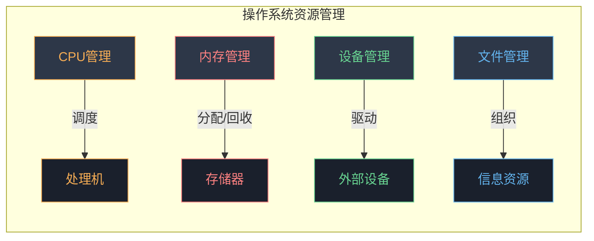
```mermaid
flowchart LR
    subgraph 操作系统资源管理
        A["CPU管理"] -->|调度| E["处理机"]
        B["内存管理"] -->|分配/回收| F["存储器"]
        C["设备管理"] -->|驱动| G["外部设备"]
        D["文件管理"] -->|组织| H["信息资源"]
    end
    
    style A fill:#2D3748,stroke:#F6AD55,color:#F6AD55
    style B fill:#2D3748,stroke:#FC8181,color:#FC8181
    style C fill:#2D3748,stroke:#68D391,color:#68D391
    style D fill:#2D3748,stroke:#63B3ED,color:#63B3ED
    style E fill:#1A202C,stroke:#F6AD55,color:#F6AD55
    style F fill:#1A202C,stroke:#FC8181,color:#FC8181
    style G fill:#1A202C,stroke:#68D391,color:#68D391
    style H fill:#1A202C,stroke:#63B3ED,color:#63B3ED
```

### 资源管理的目标

1. **高效性**：最大化资源利用率
2. **公平性**：合理分配资源给各个进程
3. **可靠性**：确保系统稳定运行
4. **安全性**：保护资源不被非法访问

## 1.3 操作系统作为用户与硬件的接口

操作系统为用户提供了一个比硬件更易于理解的抽象层。

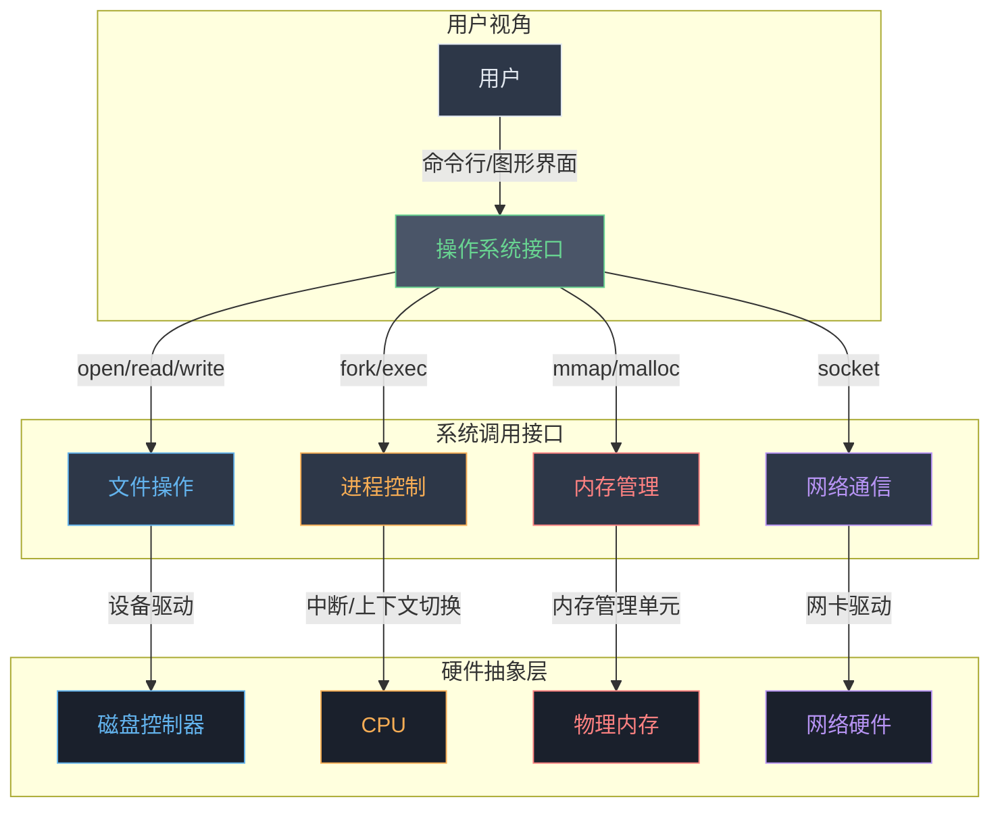
```mermaid
flowchart TB
    subgraph 用户视角
        A["用户"] -->|"命令行/图形界面"| B["操作系统接口"]
    end
    
    subgraph 系统调用接口
        B -->|"open/read/write"| C["文件操作"]
        B -->|"fork/exec"| D["进程控制"]
        B -->|"mmap/malloc"| E["内存管理"]
        B -->|"socket"| F["网络通信"]
    end
    
    subgraph 硬件抽象层
        C -->|"设备驱动"| G["磁盘控制器"]
        D -->|"中断/上下文切换"| H["CPU"]
        E -->|"内存管理单元"| I["物理内存"]
        F -->|"网卡驱动"| J["网络硬件"]
    end
    
    style A fill:#2D3748,stroke:#E2E8F0,color:#E2E8F0
    style B fill:#4A5568,stroke:#68D391,color:#68D391
    style C fill:#2D3748,stroke:#63B3ED,color:#63B3ED
    style D fill:#2D3748,stroke:#F6AD55,color:#F6AD55
    style E fill:#2D3748,stroke:#FC8181,color:#FC8181
    style F fill:#2D3748,stroke:#B794F4,color:#B794F4
    style G fill:#1A202C,stroke:#63B3ED,color:#63B3ED
    style H fill:#1A202C,stroke:#F6AD55,color:#F6AD55
    style I fill:#1A202C,stroke:#FC8181,color:#FC8181
    style J fill:#1A202C,stroke:#B794F4,color:#B794F4
```

### 接口类型

| 接口类型 | 用户操作 | 操作系统响应 |
|---------|---------|-------------|
| 命令行接口 | 键入命令 | 执行对应程序 |
| 图形用户接口 | 点击图标 | 调用相应程序 |
| 系统调用 | 程序发起请求 | 内核完成操作 |

---

## 2.1 进程管理

进程是程序在计算机上的一次执行活动，是操作系统进行资源分配和调度的基本单位。

### 进程与程序的区别


```mermaid
flowchart LR
    A["程序"] -->|"静态存储"| B["磁盘上的可执行文件"]
    B -->|"操作系统加载"| C["进程"]
    C -->|"包含"| D["代码段+数据段+堆栈+PCB"]
    
    style A fill:#2D3748,stroke:#E2E8F0,color:#E2E8F0
    style B fill:#2D3748,stroke:#63B3ED,color:#63B3ED
    style C fill:#4A5568,stroke:#68D391,color:#68D391
    style D fill:#1A202C,stroke:#68D391,color:#68D391
```

### 进程控制块（PCB）

每个进程都有一个 PCB，用于保存进程的管理信息：

```c
struct PCB {
    int pid;                    // 进程标识符
    int state;                  // 进程状态：就绪/运行/阻塞
    int priority;               // 进程优先级
    unsigned long start_time;   // 开始运行时间
    unsigned long cpu_time;     // 已用CPU时间
    struct file *files[NR_OPEN];// 打开的文件表
    struct mm_struct *mm;       // 进程的内存管理信息
    struct thread_struct *thread;// 寄存器上下文
};
```

### 进程状态转换

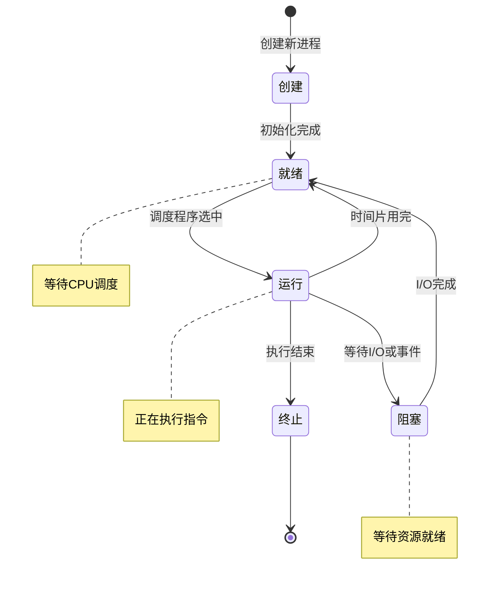
```mermaid
stateDiagram-v2
    [*] --> 创建: 创建新进程
    创建 --> 就绪: 初始化完成
    就绪 --> 运行: 调度程序选中
    运行 --> 就绪: 时间片用完
    运行 --> 阻塞: 等待I/O或事件
    阻塞 --> 就绪: I/O完成
    运行 --> 终止: 执行结束
    终止 --> [*]

    note right of 就绪: 等待CPU调度
    note right of 阻塞: 等待资源就绪
    note right of 运行: 正在执行指令
```

### 实际应用场景：Web 服务器进程管理

当你在浏览器中访问一个网站时：

```
1. 浏览器（客户端进程）发送 HTTP 请求
2. Web 服务器创建子进程处理请求
3. 父进程继续监听新连接
4. 子进程处理完成后被终止
```

```python
# Python 示例：简单的多进程 Web 服务器概念
import os

def handle_request(client_socket):
    """处理客户端请求"""
    request = client_socket.recv(1024)
    response = b"HTTP/1.1 200 OK\r\n\r\nHello, World!"
    client_socket.send(response)
    client_socket.close()

def main():
    """主进程：接受连接并创建子进程处理"""
    server_socket = create_server_socket()
    
    while True:
        client_socket, addr = server_socket.accept()
        pid = os.fork()  # 创建子进程
        
        if pid == 0:
            # 子进程：处理请求
            handle_request(client_socket)
            exit(0)  # 处理完退出
        else:
            # 父进程：关闭客户端套接字，继续监听
            client_socket.close()
            # 父进程继续接受新连接
```

## 2.2 内存管理

内存管理是操作系统最重要的功能之一，负责分配和回收内存空间。

### 内存管理的主要功能

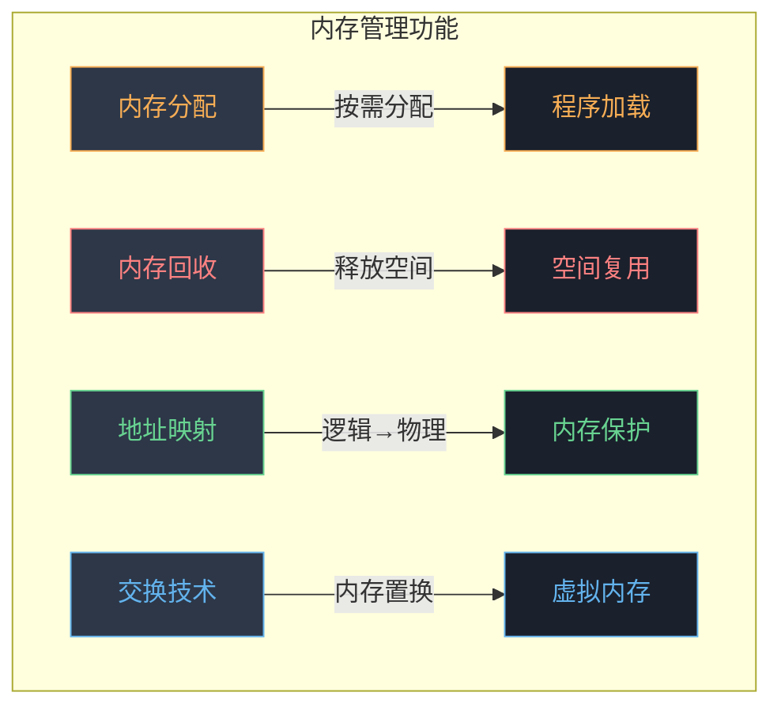
```mermaid
flowchart TB
    subgraph 内存管理功能
        A["内存分配"] -->|"按需分配"| E["程序加载"]
        B["内存回收"] -->|"释放空间"| F["空间复用"]
        C["地址映射"] -->|"逻辑→物理"| G["内存保护"]
        D["交换技术"] -->|"内存置换"| H["虚拟内存"]
    end
    
    style A fill:#2D3748,stroke:#F6AD55,color:#F6AD55
    style B fill:#2D3748,stroke:#FC8181,color:#FC8181
    style C fill:#2D3748,stroke:#68D391,color:#68D391
    style D fill:#2D3748,stroke:#63B3ED,color:#63B3ED
    style E fill:#1A202C,stroke:#F6AD55,color:#F6AD55
    style F fill:#1A202C,stroke:#FC8181,color:#FC8181
    style G fill:#1A202C,stroke:#68D391,color:#68D391
    style H fill:#1A202C,stroke:#63B3ED,color:#63B3ED
```

### 连续分配方式

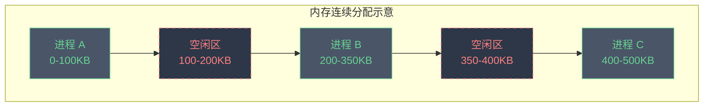
```mermaid
flowchart TB
    subgraph 内存连续分配示意
        A["进程 A<br/>0-100KB"] 
        B["空闲区<br/>100-200KB"] 
        C["进程 B<br/>200-350KB"]
        D["空闲区<br/>350-400KB"]
        E["进程 C<br/>400-500KB"]
    end
    
    A:::process --> B:::free --> C:::process --> D:::free --> E:::process
    
    classDef process fill:#4A5568,stroke:#68D391,color:#68D391
    classDef free fill:#2D3748,stroke:#FC8181,color:#FC8181,stroke-dasharray:5 5
```

### 分页存储管理

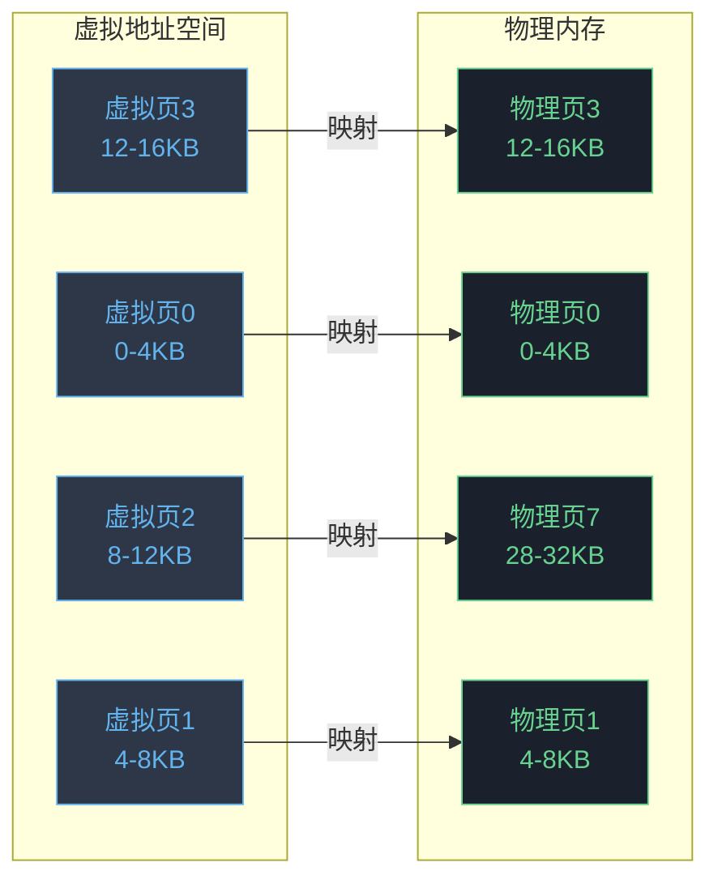
```mermaid
flowchart LR
    subgraph 虚拟地址空间
        A["虚拟页0<br/>0-4KB"] 
        B["虚拟页1<br/>4-8KB"]
        C["虚拟页2<br/>8-12KB"]
        D["虚拟页3<br/>12-16KB"]
    end
    
    subgraph 物理内存
        E["物理页3<br/>12-16KB"] 
        F["物理页0<br/>0-4KB"]
        G["物理页7<br/>28-32KB"]
        H["物理页1<br/>4-8KB"]
    end
    
    A -->|映射| F
    B -->|映射| H
    C -->|映射| G
    D -->|映射| E
    
    style A fill:#2D3748,stroke:#63B3ED,color:#63B3ED
    style B fill:#2D3748,stroke:#63B3ED,color:#63B3ED
    style C fill:#2D3748,stroke:#63B3ED,color:#63B3ED
    style D fill:#2D3748,stroke:#63B3ED,color:#63B3ED
    style E fill:#1A202C,stroke:#68D391,color:#68D391
    style F fill:#1A202C,stroke:#68D391,color:#68D391
    style G fill:#1A202C,stroke:#68D391,color:#68D391
    style H fill:#1A202C,stroke:#68D391,color:#68D391
```

### 代码示例：Linux 内存映射

```c
#include <stdio.h>
#include <stdlib.h>
#include <sys/mman.h>
#include <string.h>

/**
 * 内存映射示例
 * 使用 mmap 系统调用将文件映射到内存
 */
int main() {
    // 创建并打开一个文件
    FILE *fp = fopen("test.dat", "w+");
    if (fp == NULL) {
        perror("fopen");
        return 1;
    }
    
    // 写入数据
    const char *data = "Hello, Operating System!";
    fwrite(data, 1, strlen(data), fp);
    fclose(fp);
    
    // 使用内存映射读取文件
    int fd = open("test.dat", O_RDONLY);
    if (fd == -1) {
        perror("open");
        return 1;
    }
    
    // 将文件映射到内存
    char *mapped = mmap(NULL,              // 让内核选择地址
                       4096,               // 映射大小
                       PROT_READ,          // 可读
                       MAP_PRIVATE,        // 私有映射
                       fd,                 // 文件描述符
                       0);                 // 偏移量
    
    if (mapped == MAP_FAILED) {
        perror("mmap");
        close(fd);
        return 1;
    }
    
    // 读取映射的内存（实际从文件读取）
    printf("Mapped content: %s\n", mapped);
    
    // 解除映射
    munmap(mapped, 4096);
    close(fd);
    
    return 0;
}
```

### 实际应用场景：手机多任务管理

当你切换手机应用时：

```
┌─────────────────────────────────────────┐
│  前台应用（微信）                         │
│  - 正在显示界面                           │
│  - 正在响应用户操作                        │
├─────────────────────────────────────────┤
│  后台应用（音乐播放器）                    │
│  - 继续播放音乐                           │
│  - 保留在内存中（可能挂起）                │
├─────────────────────────────────────────┤
│  已冻结应用（游戏）                        │
│  - 不占用 CPU                            │
│  - 可能被换出到存储                       │
└─────────────────────────────────────────┘

操作系统通过内存管理确保：
1. 前台应用获得足够内存保证流畅运行
2. 后台应用在内存充足时保持挂起状态
3. 内存不足时，优先将不活跃应用换出
```

## 2.3 文件系统管理

文件系统是操作系统用于存储、组织和管理文件的一套机制。

### 文件系统的层次结构

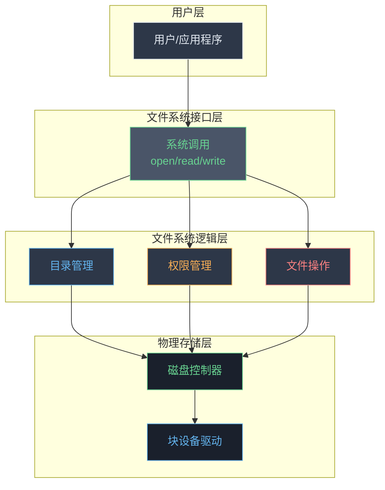
```mermaid
flowchart TB
    subgraph 用户层
        A["用户/应用程序"]
    end
    
    subgraph 文件系统接口层
        B["系统调用<br/>open/read/write"] 
    end
    
    subgraph 文件系统逻辑层
        C["目录管理"]
        D["权限管理"]
        E["文件操作"]
    end
    
    subgraph 物理存储层
        F["磁盘控制器"]
        G["块设备驱动"]
    end
    
    A --> B --> C & D & E --> F --> G
    
    style A fill:#2D3748,stroke:#E2E8F0,color:#E2E8F0
    style B fill:#4A5568,stroke:#68D391,color:#68D391
    style C fill:#2D3748,stroke:#63B3ED,color:#63B3ED
    style D fill:#2D3748,stroke:#F6AD55,color:#F6AD55
    style E fill:#2D3748,stroke:#FC8181,color:#FC8181
    style F fill:#1A202C,stroke:#68D391,color:#68D391
    style G fill:#1A202C,stroke:#63B3ED,color:#63B3ED
```

### 常见的文件系统类型

| 文件系统 | 使用场景 | 特点 |
|---------|---------|------|
| NTFS | Windows | 大文件支持、权限管理、日志 |
| ext4 | Linux | 高性能、可靠性 |
| FAT32 | USB 设备 | 跨平台兼容、老旧设备 |
| APFS | macOS | 加密、快照、快照 |
| exFAT | 大容量存储 | 突破 4GB 文件限制 |

### 文件系统的索引节点（inode）

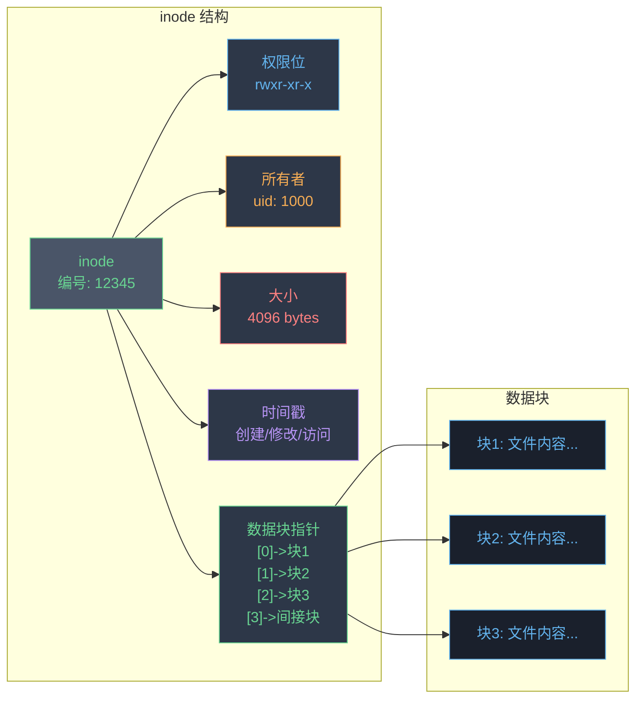
```mermaid
flowchart LR
    subgraph inode 结构
        A["inode<br/>编号: 12345"] --> B["权限位<br/>rwxr-xr-x"]
        A --> C["所有者<br/>uid: 1000"]
        A --> D["大小<br/>4096 bytes"]
        A --> E["时间戳<br/>创建/修改/访问"]
        A --> F["数据块指针<br/>[0]->块1<br/>[1]->块2<br/>[2]->块3<br/>[3]->间接块"]
    end
    
    subgraph 数据块
        G["块1: 文件内容..."]
        H["块2: 文件内容..."]
        I["块3: 文件内容..."]
    end
    
    F --> G & H & I
    
    style A fill:#4A5568,stroke:#68D391,color:#68D391
    style B fill:#2D3748,stroke:#63B3ED,color:#63B3ED
    style C fill:#2D3748,stroke:#F6AD55,color:#F6AD55
    style D fill:#2D3748,stroke:#FC8181,color:#FC8181
    style E fill:#2D3748,stroke:#B794F4,color:#B794F4
    style F fill:#2D3748,stroke:#68D391,color:#68D391
    style G fill:#1A202C,stroke:#63B3ED,color:#63B3ED
    style H fill:#1A202C,stroke:#63B3ED,color:#63B3ED
    style I fill:#1A202C,stroke:#63B3ED,color:#63B3ED
```

### 代码示例：Python 文件操作

```python
"""
文件系统操作示例
演示常见的文件读写和目录操作
"""
import os
import shutil

# 1. 创建目录结构
def create_project_structure():
    """创建项目目录结构"""
    dirs = [
        "project/src",
        "project/tests", 
        "project/docs",
        "project/config"
    ]
    
    for d in dirs:
        os.makedirs(d, exist_ok=True)
        print(f"Created: {d}")

# 2. 读取文件内容
def read_file_content(filepath):
    """安全地读取文件内容"""
    try:
        with open(filepath, 'r', encoding='utf-8') as f:
            return f.read()
    except FileNotFoundError:
        print(f"File not found: {filepath}")
        return None
    except PermissionError:
        print(f"Permission denied: {filepath}")
        return None

# 3. 递归列出目录内容
def list_directory_recursive(path, indent=0):
    """递归列出目录内容"""
    try:
        entries = os.listdir(path)
        for entry in entries:
            full_path = os.path.join(path, entry)
            prefix = "  " * indent
            if os.path.isdir(full_path):
                print(f"{prefix}[DIR]  {entry}/")
                list_directory_recursive(full_path, indent + 1)
            else:
                size = os.path.getsize(full_path)
                print(f"{prefix}[FILE] {entry} ({size} bytes)")
    except PermissionError:
        print(f"{'  ' * indent}[Permission denied]")

# 4. 文件元数据获取
def get_file_info(filepath):
    """获取文件详细信息"""
    stat = os.stat(filepath)
    return {
        'size': stat.st_size,
        'created': stat.st_ctime,
        'modified': stat.st_mtime,
        'accessed': stat.st_atime,
        'is_file': os.path.isfile(filepath),
        'is_dir': os.path.isdir(filepath)
    }

if __name__ == "__main__":
    # 创建测试文件
    with open("project/README.txt", "w") as f:
        f.write("# 我的项目\n\n这是一个测试项目。")
    
    print("=== 目录结构 ===")
    list_directory_recursive("project")
    
    print("\n=== 文件信息 ===")
    info = get_file_info("project/README.txt")
    for key, value in info.items():
        print(f"{key}: {value}")
    
    # 清理
    shutil.rmtree("project")
    print("\n项目已清理")
```

## 2.4 设备管理

设备管理负责管理计算机的各种外部设备，包括输入设备、输出设备和存储设备。

### 设备管理的架构

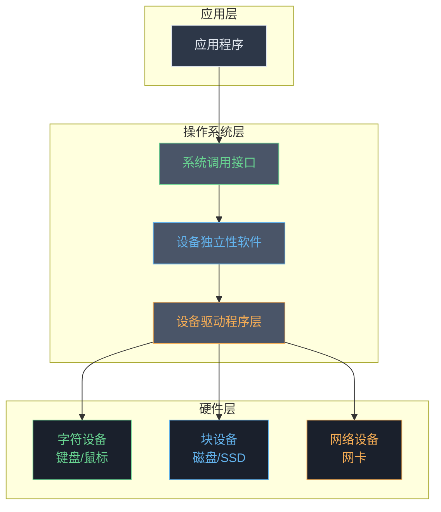
```mermaid
flowchart TB
    subgraph 应用层
        A["应用程序"]
    end
    
    subgraph 操作系统层
        B["系统调用接口"]
        C["设备独立性软件"]
        D["设备驱动程序层"]
    end
    
    subgraph 硬件层
        E["字符设备<br/>键盘/鼠标"]
        F["块设备<br/>磁盘/SSD"]
        G["网络设备<br/>网卡"]
    end
    
    A --> B --> C --> D --> E & F & G
    
    style A fill:#2D3748,stroke:#E2E8F0,color:#E2E8F0
    style B fill:#4A5568,stroke:#68D391,color:#68D391
    style C fill:#4A5568,stroke:#63B3ED,color:#63B3ED
    style D fill:#4A5568,stroke:#F6AD55,color:#F6AD55
    style E fill:#1A202C,stroke:#68D391,color:#68D391
    style F fill:#1A202C,stroke:#63B3ED,color:#63B3ED
    style G fill:#1A202C,stroke:#F6AD55,color:#F6AD55
```

### 设备控制方式

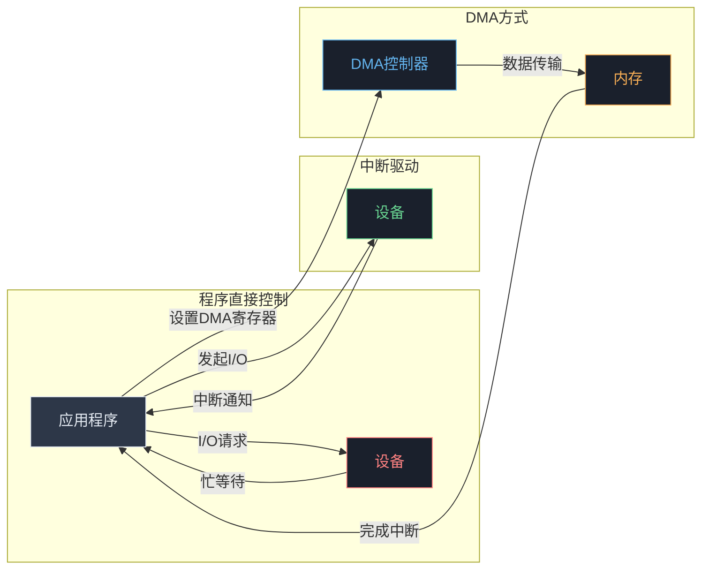
```mermaid
flowchart LR
    subgraph "程序直接控制"
        A["应用程序"] -->|"I/O请求"| B["设备"]
        B -->|"忙等待"| A
    end
    
    subgraph "中断驱动"
        A -->|"发起I/O"| C["设备"]
        C -->|"中断通知"| A
    end
    
    subgraph "DMA方式"
        A -->|"设置DMA寄存器"| D["DMA控制器"]
        D -->|"数据传输"| E["内存"]
        E -->|"完成中断"| A
    end
    
    style A fill:#2D3748,stroke:#E2E8F0,color:#E2E8F0
    style B fill:#1A202C,stroke:#FC8181,color:#FC8181
    style C fill:#1A202C,stroke:#68D391,color:#68D391
    style D fill:#1A202C,stroke:#63B3ED,color:#63B3ED
    style E fill:#1A202C,stroke:#F6AD55,color:#F6AD55
```

### 代码示例：Linux 设备驱动概念

```c
/**
 * Linux 字符设备驱动示例（简化版）
 * 展示设备驱动注册和操作的基本概念
 */

#include <linux/kernel.h>
#include <linux/module.h>
#include <linux/fs.h>
#include <linux/cdev.h>
#include <linux/device.h>

#define DEVICE_NAME "my_device"
#define CLASS_NAME "my_class"

static struct cdev my_cdev;
static struct class *my_class;
static struct device *my_device;
static dev_t dev_num;

/* 设备打开函数 */
static int device_open(struct inode *inode, struct file *file)
{
    printk(KERN_INFO "my_device: Device opened\n");
    return 0;
}

/* 设备关闭函数 */
static int device_release(struct inode *inode, struct file *file)
{
    printk(KERN_INFO "my_device: Device closed\n");
    return 0;
}

/* 设备读取函数 */
static ssize_t device_read(struct file *file, char __user *buf,
                           size_t count, loff_t *offset)
{
    const char *message = "Hello from kernel!\n";
    size_t len = strlen(message);
    
    if (*offset >= len)
        return 0;
    
    if (copy_to_user(buf, message, len))
        return -EFAULT;
    
    *offset += len;
    return len;
}

/* 设备写入函数 */
static ssize_t device_write(struct file *file, const char __user *buf,
                            size_t count, loff_t *offset)
{
    char kernel_buf[256];
    
    if (count > sizeof(kernel_buf) - 1)
        count = sizeof(kernel_buf) - 1;
    
    if (copy_from_user(kernel_buf, buf, count))
        return -EFAULT;
    
    kernel_buf[count] = '\0';
    printk(KERN_INFO "my_device: Received %zu bytes: %s\n", count, kernel_buf);
    
    return count;
}

/* 文件操作结构体 */
static struct file_operations fops = {
    .owner   = THIS_MODULE,
    .open    = device_open,
    .release = device_release,
    .read    = device_read,
    .write   = device_write,
};

/* 模块初始化 */
static int __init my_driver_init(void)
{
    /* 动态分配设备号 */
    if (alloc_chrdev_region(&dev_num, 0, 1, DEVICE_NAME) < 0) {
        printk(KERN_ALERT "my_device: Failed to allocate device number\n");
        return -1;
    }
    
    /* 初始化字符设备 */
    cdev_init(&my_cdev, &fops);
    my_cdev.owner = THIS_MODULE;
    
    /* 添加字符设备到系统 */
    if (cdev_add(&my_cdev, dev_num, 1) < 0) {
        unregister_chrdev_region(dev_num, 1);
        printk(KERN_ALERT "my_device: Failed to add cdev\n");
        return -1;
    }
    
    printk(KERN_INFO "my_device: Driver loaded, major number %d\n", MAJOR(dev_num));
    return 0;
}

/* 模块清理 */
static void __exit my_driver_exit(void)
{
    cdev_del(&my_cdev);
    unregister_chrdev_region(dev_num, 1);
    printk(KERN_INFO "my_device: Driver unloaded\n");
}

module_init(my_driver_init);
module_exit(my_driver_exit);

MODULE_LICENSE("GPL");
MODULE_AUTHOR("Example");
MODULE_DESCRIPTION("Simple Character Device Driver");
```

## 2.5 安全与保护

操作系统必须提供机制来保护资源免受未授权访问和无意破坏。

### 安全机制层次

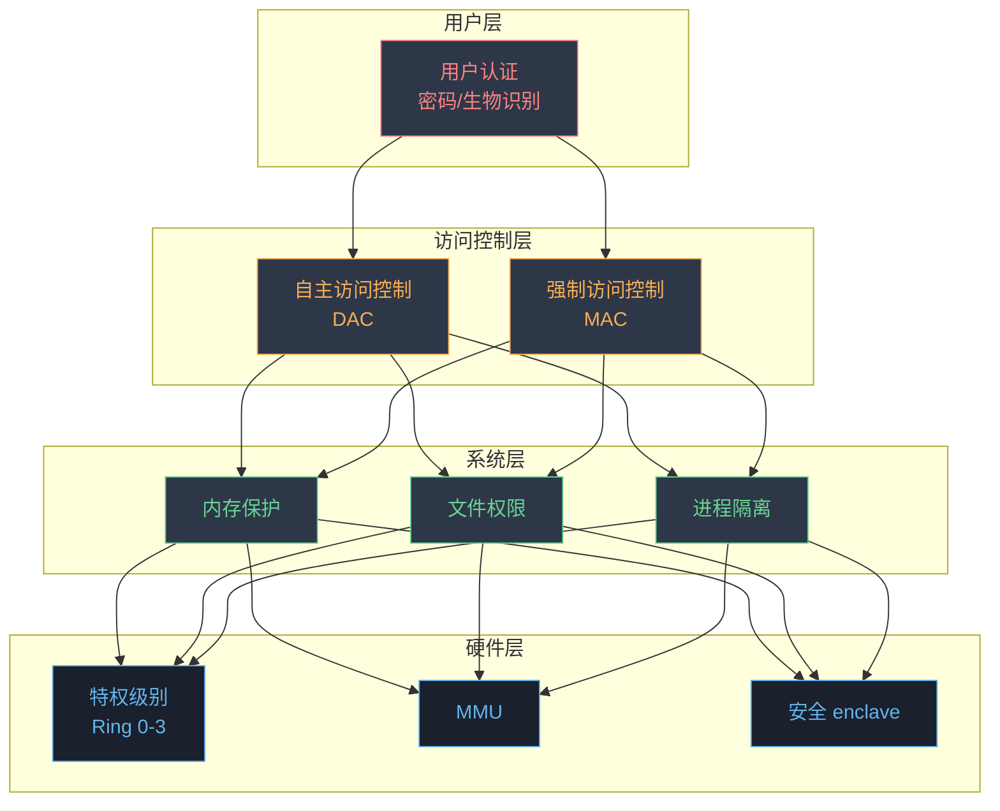
```mermaid
flowchart TB
    subgraph 用户层
        A["用户认证<br/>密码/生物识别"]
    end
    
    subgraph 访问控制层
        B["自主访问控制<br/>DAC"]
        C["强制访问控制<br/>MAC"]
    end
    
    subgraph 系统层
        D["内存保护"]
        E["文件权限"]
        F["进程隔离"]
    end
    
    subgraph 硬件层
        G["特权级别<br/>Ring 0-3"]
        H["MMU"]
        I["安全 enclave"]
    end
    
    A --> B & C --> D & E & F --> G & H & I
    
    style A fill:#2D3748,stroke:#FC8181,color:#FC8181
    style B fill:#2D3748,stroke:#F6AD55,color:#F6AD55
    style C fill:#2D3748,stroke:#F6AD55,color:#F6AD55
    style D fill:#2D3748,stroke:#68D391,color:#68D391
    style E fill:#2D3748,stroke:#68D391,color:#68D391
    style F fill:#2D3748,stroke:#68D391,color:#68D391
    style G fill:#1A202C,stroke:#63B3ED,color:#63B3ED
    style H fill:#1A202C,stroke:#63B3ED,color:#63B3ED
    style I fill:#1A202C,stroke:#63B3ED,color:#63B3ED
```

### Linux 权限模型

```bash
# Linux 文件权限示例
$ ls -la /home/user/document.txt
-rwxr-x--- 1 user group 4096 May 23 10:30 document.txt

# 权限解释：
# - 文件类型（- 普通文件，d 目录）
# rwx 所有者权限（读、写、执行）
# r-x 所属组权限（读、执行）
# --- 其他用户权限（无权限）

# 权限位对应的数值
# r = 4, w = 2, x = 1
# rwx = 7, r-x = 5, rw- = 6, --- = 0
```

### Windows 访问控制

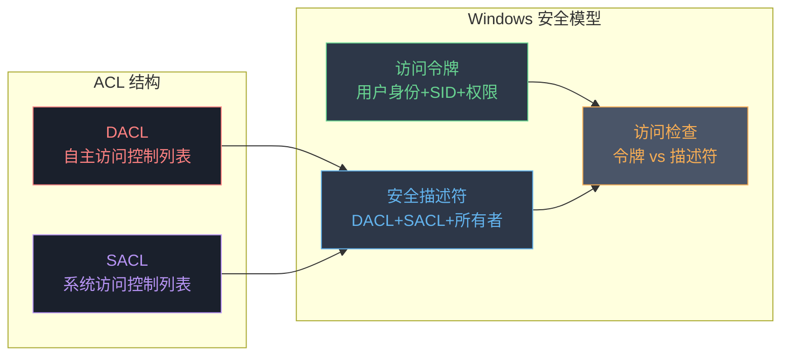
```mermaid
flowchart LR
    subgraph Windows 安全模型
        A["访问令牌<br/>用户身份+SID+权限"] 
        B["安全描述符<br/>DACL+SACL+所有者"]
        C["访问检查<br/>令牌 vs 描述符"]
    end
    
    subgraph ACL 结构
        D["DACL<br/>自主访问控制列表"]
        E["SACL<br/>系统访问控制列表"]
    end
    
    A --> C
    B --> C
    D & E --> B
    
    style A fill:#2D3748,stroke:#68D391,color:#68D391
    style B fill:#2D3748,stroke:#63B3ED,color:#63B3ED
    style C fill:#4A5568,stroke:#F6AD55,color:#F6AD55
    style D fill:#1A202C,stroke:#FC8181,color:#FC8181
    style E fill:#1A202C,stroke:#B794F4,color:#B794F4
```

## 2.6 操作系统的基本特征

现代操作系统具有四个基本特征：**并发性、共享性、虚拟性和异步性**。

### 并发性与并行性

```mermaid
flowchart TB
    subgraph 并发（Concurrent）
        A["时间轴"]
        A -->|"时刻1"| B["进程A运行"]
        A -->|"时刻2"| C["进程A暂停<br/>进程B运行"]
        A -->|"时刻3"| D["进程A恢复<br/>进程B暂停"]
    end
    
    subgraph 并行（Parallel）
        E["时间轴"]
        E -->|"时刻1"| F["CPU1: 进程A"]
        E -->|"时刻1"| G["CPU2: 进程B"]
    end
    
    style A fill:#2D3748,stroke:#63B3ED,color:#63B3ED
    style B fill:#4A5568,stroke:#68D391,color:#68D391
    style C fill:#4A5568,stroke:#FC8181,color:#FC8181
    style D fill:#4A5568,stroke:#68D391,color:#68D391
    style E fill:#2D3748,stroke:#F6AD55,color:#F6AD55
    style F fill:#1A202C,stroke:#68D391,color:#68D391
    style G fill:#1A202C,stroke:#FC8181,color:#FC8181
```

| 概念 | 定义 | 条件 |
|------|------|------|
| 并发 | 多个事件在同一时间间隔内交替执行 | 单核或多核 CPU |
| 并行 | 多个事件在同一时刻同时执行 | 多核 CPU |

### 共享性

```mermaid
flowchart LR
    subgraph 互斥共享
        A["打印机"] -->|"同一时刻只能<br/>一个进程使用"| B["进程1"]
        A -->|""| C["进程2"]
        A -->|""| D["进程3"]
    end
    
    subgraph 同时共享
        E["磁盘文件"] -->|"可同时读取"| F["进程1"]
        E -->|"可同时读取"| G["进程2"]
    end
    
    style A fill:#1A202C,stroke:#FC8181,color:#FC8181
    style B fill:#2D3748,stroke:#68D391,color:#68D391
    style C fill:#2D3748,stroke:#68D391,color:#68D391
    style D fill:#2D3748,stroke:#68D391,color:#68D391
    style E fill:#1A202C,stroke:#63B3ED,color:#63B3ED
    style F fill:#2D3748,stroke:#68D391,color:#68D391
    style G fill:#2D3748,stroke:#68D391,color:#68D391
```

### 虚拟性

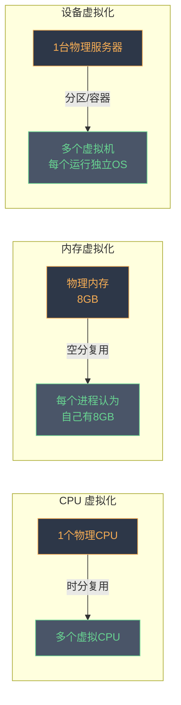
```mermaid
flowchart LR
    subgraph CPU 虚拟化
        A["1个物理CPU"] -->|"时分复用"| B["多个虚拟CPU"]
    end
    
    subgraph 内存虚拟化
        C["物理内存<br/>8GB"] -->|"空分复用"| D["每个进程认为<br/>自己有8GB"]
    end
    
    subgraph 设备虚拟化
        E["1台物理服务器"] -->|"分区/容器"| F["多个虚拟机<br/>每个运行独立OS"]
    end
    
    style A fill:#2D3748,stroke:#F6AD55,color:#F6AD55
    style B fill:#4A5568,stroke:#68D391,color:#68D391
    style C fill:#2D3748,stroke:#F6AD55,color:#F6AD55
    style D fill:#4A5568,stroke:#68D391,color:#68D391
    style E fill:#2D3748,stroke:#F6AD55,color:#F6AD55
    style F fill:#4A5568,stroke:#68D391,color:#68D391
```

### 异步性

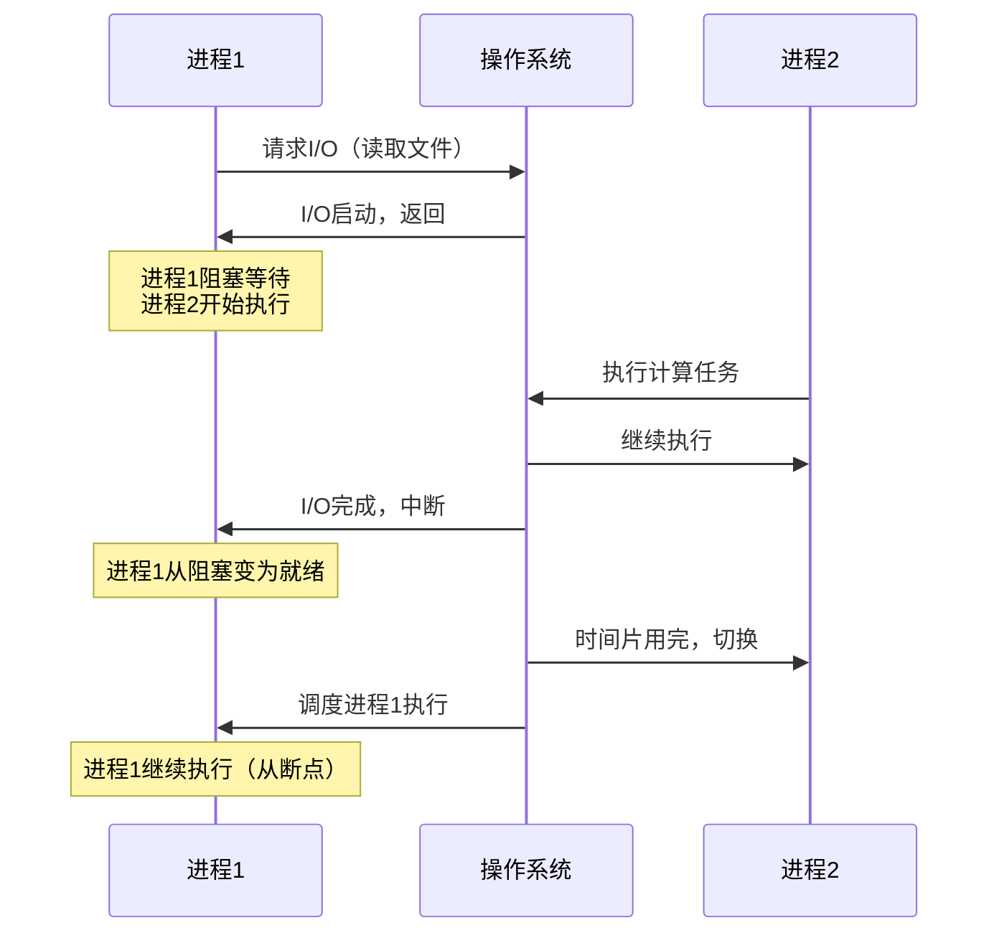
```mermaid
sequenceDiagram
    participant P1 as 进程1
    participant OS as 操作系统
    participant P2 as 进程2
    
    P1->>OS: 请求I/O（读取文件）
    OS->>P1: I/O启动，返回
    Note over P1: 进程1阻塞等待<br/>进程2开始执行
    P2->>OS: 执行计算任务
    OS->>P2: 继续执行
    OS->>P1: I/O完成，中断
    Note over P1: 进程1从阻塞变为就绪
    OS->>P2: 时间片用完，切换
    OS->>P1: 调度进程1执行
    Note over P1: 进程1继续执行（从断点）
```

---

## 3.1 批处理系统

批处理系统是早期的操作系统形式，用户将一批作业提交给计算机，无需人工干预即可自动执行。

### 批处理系统的工作流程

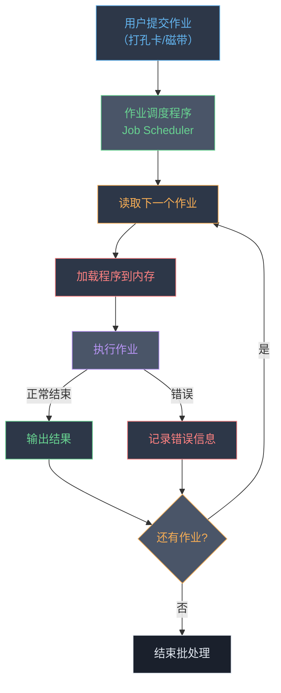
```mermaid
flowchart TB
    A["用户提交作业<br/>（打孔卡/磁带）"] --> B["作业调度程序<br/>Job Scheduler"]
    B --> C["读取下一个作业"]
    C --> D["加载程序到内存"]
    D --> E["执行作业"]
    E -->|"正常结束"| F["输出结果"]
    E -->|"错误"| G["记录错误信息"]
    F --> H{"还有作业?"}
    G --> H
    H -->|"是"| C
    H -->|"否"| I["结束批处理"]
    
    style A fill:#2D3748,stroke:#63B3ED,color:#63B3ED
    style B fill:#4A5568,stroke:#68D391,color:#68D391
    style C fill:#2D3748,stroke:#F6AD55,color:#F6AD55
    style D fill:#2D3748,stroke:#FC8181,color:#FC8181
    style E fill:#4A5568,stroke:#B794F4,color:#B794F4
    style F fill:#2D3748,stroke:#68D391,color:#68D391
    style G fill:#2D3748,stroke:#FC8181,color:#FC8181
    style H fill:#4A5568,stroke:#F6AD55,color:#F6AD55
    style I fill:#1A202C,stroke:#E2E8F0,color:#E2E8F0
```

### 批处理系统的特点

| 优点 | 缺点 |
|------|------|
| 自动批量处理，无需人工干预 | 用户无法交互 |
| 提高 CPU 利用率 | 无优先级概念 |
| 减少人工操作时间 | 周转时间长（先来先服务） |

### 典型系统

- **IBM OS/360**：最著名的批处理系统
- **FMS**（Fortran Monitor System）
- **IBSYS**：IBM 的早期操作系统

## 3.2 分时系统

分时系统允许多个用户通过终端同时使用一台计算机，每个用户感觉自己在独占计算机。

### 分时系统的核心概念

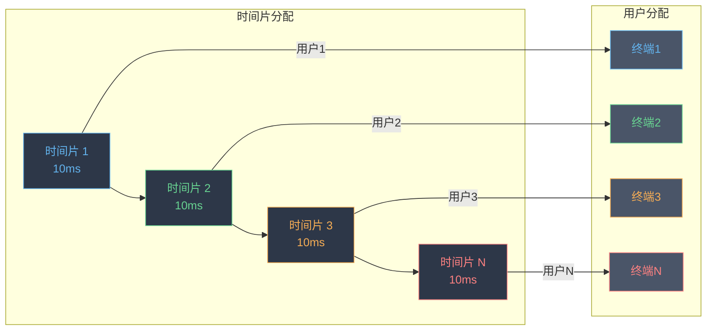
```mermaid
flowchart LR
    subgraph 时间片分配
        A["时间片 1<br/>10ms"] --> B["时间片 2<br/>10ms"]
        B --> C["时间片 3<br/>10ms"]
        C --> D["时间片 N<br/>10ms"]
    end
    
    subgraph 用户分配
        A -->|"用户1"| E["终端1"]
        B -->|"用户2"| F["终端2"]
        C -->|"用户3"| G["终端3"]
        D -->|"用户N"| H["终端N"]
    end
    
    style A fill:#2D3748,stroke:#63B3ED,color:#63B3ED
    style B fill:#2D3748,stroke:#68D391,color:#68D391
    style C fill:#2D3748,stroke:#F6AD55,color:#F6AD55
    style D fill:#2D3748,stroke:#FC8181,color:#FC8181
    style E fill:#4A5568,stroke:#63B3ED,color:#63B3ED
    style F fill:#4A5568,stroke:#68D391,color:#68D391
    style G fill:#4A5568,stroke:#F6AD55,color:#F6AD55
    style H fill:#4A5568,stroke:#FC8181,color:#FC8181
```

### 分时系统 vs 批处理系统

| 特性 | 批处理系统 | 分时系统 |
|------|-----------|---------|
| 交互性 | 无 | 强 |
| 响应时间 | 分钟~小时 | 秒级 |
| 并发性 | 单作业 | 多用户 |
| 适用场景 | 科学计算 | 通用计算 |

### 典型系统

- **UNIX**：最经典的分时系统
- **Linux**：开源类UNIX系统
- **Multics**：UNIX的前身
- **CTSS**：早期分时系统

## 3.3 实时系统

实时系统必须在严格的时间约束内响应外部事件，适用于对时间敏感的应用。

### 实时系统分类

```mermaid
flowchart TB
    subgraph 实时系统类型
        A["硬实时系统"] -->|"绝对时间约束"| E["必须在截止时间前完成<br/>否则产生严重后果"]
        B["软实时系统"] -->|"相对时间约束"| F["尽量在截止时间前完成<br/>偶尔超时可接受"]
    end
    
    subgraph 示例
        A --> G["航空控制系统"]
        A --> H["医疗设备"]
        A --> I["核电站控制"]
        B --> J["视频播放"]
        B --> K["在线游戏"]
        B --> L["音视频会议"]
    end
    
    style A fill:#2D3748,stroke:#FC8181,color:#FC8181
    style B fill:#2D3748,stroke:#F6AD55,color:#F6AD55
    style E fill:#1A202C,stroke:#FC8181,color:#FC8181
    style F fill:#1A202C,stroke:#F6AD55,color:#F6AD55
    style G fill:#4A5568,stroke:#68D391,color:#68D391
    style H fill:#4A5568,stroke:#68D391,color:#68D391
    style I fill:#4A5568,stroke:#68D391,color:#68D391
    style J fill:#4A5568,stroke:#63B3ED,color:#63B3ED
    style K fill:#4A5568,stroke:#63B3ED,color:#63B3ED
    style L fill:#4A5568,stroke:#63B3ED,color:#63B3ED
```

### 实时系统的关键指标

```
┌─────────────────────────────────────────┐
│           实时系统性能指标                │
├─────────────────────────────────────────┤
│  响应时间：事件发生到响应的时间           │
│  调度延迟：中断到任务执行的时间           │
│  抖动：响应时间的变化范围                 │
│  吞吐量：单位时间内处理的事件数           │
└─────────────────────────────────────────┘
```

### 典型系统

- **VxWorks**：航空航天首选
- **FreeRTOS**：嵌入式实时系统
- **QNX**：黑莓车载系统
- **RTLinux**：Linux实时扩展

## 3.4 网络操作系统

网络操作系统是在普通操作系统基础上增加了网络通信和网络服务功能的操作系统。

### 网络操作系统的架构

```mermaid
flowchart TB
    subgraph 网络操作系统层次
        A["网络应用<br/>Web/FTP/邮件"] 
        B["网络服务<br/>NFS/SAMBA"]
        C["网络协议栈<br/>TCP/IP/UDP"]
        D["网络驱动程序"]
        E["物理网络<br/>网卡/交换机"]
    end
    
    A --> B --> C --> D --> E
    
    style A fill:#2D3748,stroke:#E2E8F0,color:#E2E8F0
    style B fill:#2D3748,stroke:#68D391,color:#68D391
    style C fill:#4A5568,stroke:#63B3ED,color:#63B3ED
    style D fill:#2D3748,stroke:#F6AD55,color:#F6AD55
    style E fill:#1A202C,stroke:#68D391,color:#68D391
```

### 网络操作系统 vs 普通操作系统

| 特性 | 普通操作系统 | 网络操作系统 |
|------|-------------|-------------|
| 通信能力 | 弱 | 强 |
| 资源共享 | 本地资源 | 网络资源 |
| 管理范围 | 本地系统 | 网络全局 |
| 安全要求 | 本机安全 | 网络安全 |

### 典型系统

- **Windows Server**：企业级网络服务
- **Windows NT/2000/2003**
- **Novell NetWare**：早期网络操作系统
- **各类UNIX/Linux服务器版**

## 3.5 分布式操作系统

分布式操作系统由多个独立的计算机组成，但对用户呈现为单一的系统。

### 分布式系统特征

```mermaid
flowchart TB
    subgraph 分布式系统
        A["节点1<br/>北京"] 
        B["节点2<br/>上海"]
        C["节点3<br/>广州"]
        D["节点4<br/>深圳"]
    end
    
    subgraph 统一视图
        E["单一系统映像<br/>Single System Image"]
    end
    
    A -.->|"网络通信"| E
    B -.->|"网络通信"| E
    C -.->|"网络通信"| E
    D -.->|"网络通信"| E
    
    style A fill:#2D3748,stroke:#63B3ED,color:#63B3ED
    style B fill:#2D3748,stroke:#68D391,color:#68D391
    style C fill:#2D3748,stroke:#F6AD55,color:#F6AD55
    style D fill:#2D3748,stroke:#FC8181,color:#FC8181
    style E fill:#4A5568,stroke:#B794F4,color:#B794F4
```

### 分布式 vs 网络操作系统

| 特性 | 网络操作系统 | 分布式操作系统 |
|------|-------------|---------------|
| 系统透明度 | 不透明 | 完全透明 |
| 管理方式 | 分散管理 | 集中/分散管理 |
| 通信方式 | 消息传递 | 共享内存（虚拟）|
| 容错性 | 弱 | 强 |

### 典型系统

- **Google Spanner**
- **AWS Aurora**
- **Kubernetes**：容器编排系统
- **Mnesia**：电信级分布式数据库

## 3.6 个人计算机操作系统

个人计算机操作系统是为个人用户设计的操作系统，强调易用性、图形界面和多媒体支持。

### PC 操作系统的发展历程

```mermaid
timeline
    title 个人计算机操作系统发展史
    
    section 1980s
        CP/M : 早期个人电脑操作系统
        MS-DOS : IBM PC兼容机标准
        
    section 1990s
        Windows 3.x : 图形界面普及
        Windows 95 : 32位操作系统
        Windows NT : 企业级系统
        Linux : 开源操作系统
        
    section 2000s
        Windows XP : 长青树系统
        Windows Vista : 争议之作
        macOS X : UNIX基础
        Ubuntu : Linux桌面普及
        
    section 2010s
        Windows 10 : 统一平台
        macOS Catalina : 64位化
        Chrome OS : 云端系统
        
    section 2020s
        Windows 11 : 现代设计
        macOS Sonoma : 持续进化
```

### 主流 PC 操作系统对比

| 特性 | Windows | macOS | Linux |
|------|---------|-------|-------|
| 市场份额 | ~72% | ~15% | ~3% |
| 硬件兼容性 | 广泛 | 仅苹果硬件 | 多样 |
| 安全性 | 中等 | 较高 | 高 |
| 定制性 | 低 | 中 | 高 |
| 软件生态 | 丰富 | 丰富 | 适中 |
| 适用场景 | 办公/游戏 | 创意工作 | 开发/服务器 |

---

## 4.1 简单监控程序

简单监控程序（Simple Monitor）是操作系统的最早形式，功能简单，主要负责自动加载和执行作业。

### 简单监控程序的结构

```mermaid
flowchart TB
    subgraph 监控程序结构
        A["控制程序<br/>Control Program"] 
        B["作业调度<br/>Job Control"]
        C["设备驱动<br/>Device Drivers"]
        D["中断处理<br/>Interrupt Handler"]
    end
    
    subgraph 被监控程序
        E["用户程序"]
        F["系统服务"]
    end
    
    A --> B & C & D
    C --> D
    
    style A fill:#4A5568,stroke:#68D391,color:#68D391
    style B fill:#2D3748,stroke:#63B3ED,color:#63B3ED
    style C fill:#2D3748,stroke:#F6AD55,color:#F6AD55
    style D fill:#2D3748,stroke:#FC8181,color:#FC8181
    style E fill:#1A202C,stroke:#E2E8F0,color:#E2E8F0
    style F fill:#1A202C,stroke:#E2E8F0,color:#E2E8F0
```

### 监控程序的工作模式

```
┌─────────────────────────────────────────┐
│          监控程序模式（内核态）            │
│  - 常驻内存                              │
│  - 控制所有作业执行                       │
│  - 处理中断和异常                         │
└─────────────────────────────────────────┘
                    ↓ 陷阱/中断
┌─────────────────────────────────────────┐
│          用户程序模式（用户态）            │
│  - 临时加载执行                          │
│  - 权限受限                             │
│  - 完成后返回监控程序                     │
└─────────────────────────────────────────┘
```

## 4.2 分层式结构

分层式结构将操作系统分为若干层次，每层只依赖其下层，提高模块化和可维护性。

### 操作系统分层架构

```mermaid
flowchart TB
    subgraph 用户层
        A["用户应用<br/>Applications"]
    end
    
    subgraph 系统调用层
        B["系统调用接口<br/>System Call Interface"]
    end
    
    subgraph 操作系统层
        C["命令解释器<br/>Shell"]
        D["进程管理<br/>Process Management"]
        E["内存管理<br/>Memory Management"]
        F["文件系统<br/>File System"]
        G["设备管理<br/>Device Management"]
    end
    
    subgraph 内核层
        H["进程调度<br/>CPU Scheduler"]
        I["进程通信<br/>IPC"]
        J["同步原语<br/>Synchronization"]
    end
    
    subgraph 硬件抽象层
        K["设备驱动<br/>Device Drivers"]
        L["中断控制器<br/>Interrupt Controller"]
        M["硬件抽象层<br/>HAL"]
    end
    
    subgraph 硬件层
        N["CPU"]
        O["内存"]
        P["磁盘"]
    end
    
    A --> B --> C & D & E & F & G --> H & I & J --> K & L & M --> N & O & P
    
    style A fill:#2D3748,stroke:#E2E8F0,color:#E2E8F0
    style B fill:#4A5568,stroke:#68D391,color:#68D391
    style C fill:#2D3748,stroke:#63B3ED,color:#63B3ED
    style D fill:#2D3748,stroke:#F6AD55,color:#F6AD55
    style E fill:#2D3748,stroke:#FC8181,color:#FC8181
    style F fill:#2D3748,stroke:#68D391,color:#68D391
    style G fill:#2D3748,stroke:#B794F4,color:#B794F4
    style H fill:#2D3748,stroke:#63B3ED,color:#63B3ED
    style I fill:#2D3748,stroke:#F6AD55,color:#F6AD55
    style J fill:#2D3748,stroke:#FC8181,color:#FC8181
    style K fill:#4A5568,stroke:#68D391,color:#68D391
    style L fill:#4A5568,stroke:#63B3ED,color:#63B3ED
    style M fill:#4A5568,stroke:#F6AD55,color:#F6AD55
    style N fill:#1A202C,stroke:#63B3ED,color:#63B3ED
    style O fill:#1A202C,stroke:#FC8181,color:#FC8181
    style P fill:#1A202C,stroke:#68D391,color:#68D391
```

### 分层结构的优缺点

| 优点 | 缺点 |
|------|------|
| 模块化清晰 | 层次划分困难 |
| 易于调试和验证 | 效率较低（每层调用都有开销） |
| 便于维护和扩展 | 难以选择最优层次数 |
| 底层可信，可被上层信任 | 紧密耦合的模块难以分层 |

### 典型系统

- **THE**：第一个分层操作系统（1968年）
- **OS/2**：早期IBM操作系统
- **VMS**：DEC的操作系统

## 4.3 微内核结构

微内核结构将内核最小化，只保留最基本的功能，其他服务运行在用户空间。

### 微内核架构

```mermaid
flowchart TB
    subgraph 用户空间
        A["文件系统服务"]
        B["网络服务"]
        C["设备驱动服务"]
        D["窗口管理服务"]
        E["应用程序"]
    end
    
    subgraph 微内核（内核态）
        F["进程调度"]
        G["内存管理"]
        H["进程间通信"]
        I["基本中断处理"]
    end
    
    A -.->|"IPC"| H
    B -.->|"IPC"| H
    C -.->|"IPC"| H
    D -.->|"IPC"| H
    E -.->|"系统调用"| H
    
    style A fill:#2D3748,stroke:#63B3ED,color:#63B3ED
    style B fill:#2D3748,stroke:#68D391,color:#68D391
    style C fill:#2D3748,stroke:#F6AD55,color:#F6AD55
    style D fill:#2D3748,stroke:#FC8181,color:#FC8181
    style E fill:#2D3748,stroke:#E2E8F0,color:#E2E8F0
    style F fill:#4A5568,stroke:#68D391,color:#68D391
    style G fill:#4A5568,stroke:#63B3ED,color:#63B3ED
    style H fill:#4A5568,stroke:#F6AD55,color:#F6AD55
    style I fill:#4A5568,stroke:#FC8181,color:#FC8181
```

### 微内核 vs 宏内核

| 特性 | 微内核（Microkernel） | 宏内核（Monolithic） |
|------|----------------------|---------------------|
| 内核大小 | 很小（< 100KB） | 很大（MB级） |
| 服务位置 | 用户空间 | 内核空间 |
| 通信方式 | IPC（消息传递） | 函数调用 |
| 可扩展性 | 高（添加服务不影响内核） | 低（修改内核困难） |
| 性能 | 较差（IPC开销） | 较好（无 IPC 开销） |
| 可靠性 | 高（服务崩溃不影响内核） | 低（内核崩溃导致系统崩溃） |
| 代表系统 | MINIX, QNX, seL4 | Linux, Windows, macOS |

### 代码示例：微内核进程间通信

```c
/**
 * 微内核 IPC 示例
 * 客户端通过消息传递与服务端通信
 */

/* 消息结构 */
typedef struct {
    int src_pid;           // 源进程ID
    int dest_service;      // 目标服务ID
    int msg_type;          // 消息类型
    size_t data_len;       // 数据长度
    char data[256];        // 消息数据
} message_t;

/* 客户端：发送文件读取请求 */
int client_read_file(const char *filename, char *buffer, size_t len) {
    message_t msg;
    
    // 构造消息
    msg.src_pid = get_current_pid();
    msg.dest_service = FILE_SYSTEM_SERVICE;
    msg.msg_type = MSG_READ_FILE;
    msg.data_len = strlen(filename) + 1;
    strcpy(msg.data, filename);
    
    // 发送消息（内核态 IPC）
    int status = send_message(&msg);
    if (status != 0) {
        return -1;  // 发送失败
    }
    
    // 等待响应
    message_t reply;
    receive_message(&reply, FILE_SYSTEM_SERVICE);
    
    // 复制数据到用户缓冲区
    if (reply.msg_type == MSG_READ_RESPONSE) {
        memcpy(buffer, reply.data, len);
        return reply.data_len;
    }
    
    return -1;  // 读取失败
}

/* 服务端：处理文件读取请求 */
void file_server_loop() {
    message_t msg;
    
    while (1) {
        // 等待客户端请求
        receive_message(&msg, FILE_SYSTEM_SERVICE);
        
        if (msg.msg_type == MSG_READ_FILE) {
            // 处理文件读取
            int fd = open(msg.data, O_RDONLY);
            if (fd >= 0) {
                char content[256];
                int n = read(fd, content, sizeof(content));
                close(fd);
                
                // 发送响应
                message_t reply;
                reply.msg_type = MSG_READ_RESPONSE;
                reply.data_len = n;
                memcpy(reply.data, content, n);
                send_message(&reply);
            }
        }
    }
}
```

## 4.4 模块化结构

模块化结构将操作系统划分为多个独立的模块，模块之间通过明确定义的接口通信。

### 模块化结构示意

```mermaid
flowchart TB
    subgraph 核心模块
        A["进程管理模块"]
        B["内存管理模块"]
        C["文件系统模块"]
        D["设备管理模块"]
        E["网络管理模块"]
    end
    
    subgraph 公共接口
        F["模块接口层<br/>Module Interface"]
        G["内核公共函数库"]
    end
    
    subgraph 支持模块
        H["调度器模块"]
        I["同步原语模块"]
        J["中断处理模块"]
    end
    
    A & B & C & D & E --> F
    H & I & J --> G
    
    style A fill:#2D3748,stroke:#63B3ED,color:#63B3ED
    style B fill:#2D3748,stroke:#68D391,color:#68D391
    style C fill:#2D3748,stroke:#F6AD55,color:#F6AD55
    style D fill:#2D3748,stroke:#FC8181,color:#FC8181
    style E fill:#2D3748,stroke:#B794F4,color:#B794F4
    style F fill:#4A5568,stroke:#E2E8F0,color:#E2E8F0
    style G fill:#4A5568,stroke:#E2E8F0,color:#E2E8F0
    style H fill:#2D3748,stroke:#63B3ED,color:#63B3ED
    style I fill:#2D3748,stroke:#68D391,color:#68D391
    style J fill:#2D3748,stroke:#F6AD55,color:#F6AD55
```

### Linux 内核模块

Linux 采用模块化设计，可以在运行时动态加载/卸载模块。

```bash
# 查看已加载的内核模块
$ lsmod
Module                  Size  Used by
ext4                  12345  1
usb_storage            2345   1
e1000                  5678   2

# 加载内核模块
$ modprobe e1000        # 加载 Intel 网卡驱动

# 卸载内核模块
$ modprobe -r e1000     # 卸载模块

# 查看模块信息
$ modinfo e1000
filename:       /lib/modules/5.15.0-generic/kernel/drivers/net/e1000/e1000.ko
version:        8.0.35
license:        GPL
description:    Intel(R) PRO/1000 Network Driver
author:         Intel Corporation
```

### 模块化结构的优势

```
┌─────────────────────────────────────────────────┐
│              Linux 模块化优势                     │
├─────────────────────────────────────────────────┤
│  1. 动态加载：无需重启系统即可添加功能             │
│  2. 按需加载：节省内存，不用的模块不加载           │
│  3. 易于开发：独立开发各模块，通过接口集成         │
│  4. 故障隔离：模块问题不会导致整个系统崩溃        │
│  5. 硬件支持：便于添加新硬件驱动                  │
└─────────────────────────────────────────────────┘
```

## 4.5 外核结构

外核（Exokernel）是一种极简内核设计，只负责保护资源，应用程序直接管理硬件资源。

### 外核 vs 微内核

```mermaid
flowchart LR
    subgraph 微内核
        A["微内核"] -->|"抽象硬件"| B["服务层"]
        B -->|"API"| C["应用"]
    end
    
    subgraph 外核
        D["外核"] -->|"保护资源"| E["库操作系统"]
        E -->|"直接访问"| F["应用"]
    end
    
    style A fill:#4A5568,stroke:#63B3ED,color:#63B3ED
    style B fill:#2D3748,stroke:#68D391,color:#68D391
    style C fill:#2D3748,stroke:#E2E8F0,color:#E2E8F0
    style D fill:#4A5568,stroke:#FC8181,color:#FC8181
    style E fill:#2D3748,stroke:#F6AD55,color:#F6AD55
    style F fill:#2D3748,stroke:#E2E8F0,color:#E2E8F0
```

### 外核设计原则

| 原则 | 说明 |
|------|------|
| 极简内核 | 内核只做资源保护和分配 |
| 硬件直接访问 | 应用或库操作系统直接管理硬件 |
| 灵活性优先 | 让应用自己决定如何抽象资源 |
| 安全隔离 | 内核确保资源访问权限正确 |

### 典型外核系统

- **MIT Exokernel**：外核研究的先驱
- **Xen**：虚拟机监视器（部分采用外核思想）
- **DROPS**：分布式实时系统

### 外核架构代码概念

```c
/**
 * 外核资源分配示例
 * 内核只负责分配和保护物理资源
 */

/* 物理内存页面分配 */
int exokernel_alloc_pages(int pid, int num_pages, page_t **pages) {
    // 检查进程是否有权限分配
    if (!check_permission(pid, RESOURCE_MEMORY, num_pages)) {
        return -EACCES;
    }
    
    // 分配物理页面
    page_t *allocated = physical_alloc(num_pages);
    if (!allocated) {
        return -ENOMEM;
    }
    
    // 设置保护权限
    set_page_protection(allocated, num_pages, PROT_READ | PROT_WRITE);
    
    // 记录资源使用（用于后续保护）
    resource_track(pid, RESOURCE_MEMORY, num_pages);
    
    *pages = allocated;
    return 0;
}

/* 应用程序通过库操作系统使用资源 */
void library_os_page_alloc() {
    page_t *pages;
    
    // 请求外核分配页面
    int ret = sys_page_alloc(&pages, 1);
    if (ret == 0) {
        // 直接访问物理页面
        memset(pages, 0, PAGE_SIZE);
    }
}
```

---

## 5.1 Linux 内核结构

Linux 是典型的宏内核（Monolithic）结构，但引入了模块化设计。

```mermaid
flowchart TB
    subgraph 用户空间
        A["用户应用程序"]
        B["C 库"]
    end
    
    subgraph 系统调用接口
        C["System Call Interface"]
    end
    
    subgraph 内核空间
        D["进程调度"]
        E["虚拟文件系统<br/>VFS"]
        F["内存管理"]
        G["网络堆栈"]
        H["设备驱动"]
    end
    
    subgraph 体系结构相关代码
        I["x86/ARM架构代码"]
        J["中断处理"]
        K["时钟管理"]
    end
    
    subgraph 硬件
        L["物理设备"]
    end
    
    A --> B --> C --> D & E & F & G & H
    D & E & F & G & H --> I & J & K
    I & J & K --> L
    
    style A fill:#2D3748,stroke:#E2E8F0,color:#E2E8F0
    style B fill:#4A5568,stroke:#68D391,color:#68D391
    style C fill:#4A5568,stroke:#63B3ED,color:#63B3ED
    style D fill:#2D3748,stroke:#F6AD55,color:#F6AD55
    style E fill:#2D3748,stroke:#68D391,color:#68D391
    style F fill:#2D3748,stroke:#63B3ED,color:#63B3ED
    style G fill:#2D3748,stroke:#FC8181,color:#FC8181
    style H fill:#2D3748,stroke:#B794F4,color:#B794F4
    style I fill:#2D3748,stroke:#F6AD55,color:#F6AD55
    style J fill:#2D3748,stroke:#68D391,color:#68D391
    style K fill:#2D3748,stroke:#63B3ED,color:#63B3ED
    style L fill:#1A202C,stroke:#E2E8F0,color:#E2E8F0
```

## 5.2 Windows NT 内核结构

Windows NT 采用混合内核结构，结合了微内核和宏内核的优点。

```mermaid
flowchart TB
    subgraph 用户模式
        A["Win32 应用"]
        B[".NET 应用"]
        C["POSIX 子系统"]
    end
    
    subgraph 系统服务层
        D["环境子系统<br/>Environment Subsystem"]
        E["系统服务分发<br/>System Service Dispatch"]
    end
    
    subgraph NT 内核（微内核）
        F["进程/线程管理"]
        G["内存管理"]
        H["安全引用监视器"]
        I["I/O 管理"]
        J["中断/异常分发"]
    end
    
    subgraph 硬件抽象层（HAL）
        K["平台相关代码"]
    end
    
    subgraph 内核态驱动
        L["文件系统驱动"]
        M["网络驱动"]
        N["其他内核驱动"]
    end
    
    A & B & C --> D --> F & G & H & I & J
    F & G & H & I & J --> K
    L & M & N --> K
    
    style A fill:#2D3748,stroke:#63B3ED,color:#63B3ED
    style B fill:#2D3748,stroke:#68D391,color:#68D391
    style C fill:#2D3748,stroke:#F6AD55,color:#F6AD55
    style D fill:#4A5568,stroke:#68D391,color:#68D391
    style E fill:#4A5568,stroke:#63B3ED,color:#63B3ED
    style F fill:#2D3748,stroke:#FC8181,color:#FC8181
    style G fill:#2D3748,stroke:#68D391,color:#68D391
    style H fill:#2D3748,stroke:#B794F4,color:#B794F4
    style I fill:#2D3748,stroke:#63B3ED,color:#63B3ED
    style J fill:#2D3748,stroke:#F6AD55,color:#F6AD55
    style K fill:#4A5568,stroke:#E2E8F0,color:#E2E8F0
    style L fill:#2D3748,stroke:#68D391,color:#68D391
    style M fill:#2D3748,stroke:#63B3ED,color:#63B3ED
    style N fill:#2D3748,stroke:#FC8181,color:#FC8181
```

### Windows NT 内核特点

| 组件 | 功能 | 说明 |
|------|------|------|
| Executive | 系统服务 | 提供基础的系统服务 |
| Kernel | 核心调度 | 处理线程调度、异常分发 |
| HAL | 硬件抽象 | 屏蔽硬件差异 |
| 设备驱动 | 扩展功能 | 可加载的内核模式代码 |

### Linux vs Windows 内核架构对比

| 特性 | Linux | Windows NT |
|------|-------|------------|
| 类型 | 宏内核（模块化） | 混合内核 |
| 内核大小 | 可定制（模块化） | 固定较大 |
| 设备驱动 | 可动态加载 | 可动态加载 |
| 可移植性 | 高度可移植 | 主要 x86/x64 |
| 源代码 | 开源 | 闭源（部分开源） |
| 设计哲学 | 一切皆文件 | 面向对象设计 |

---

## 本章小结

本章介绍了操作系统的基本概念和核心知识体系：

```mermaid
mindmap
  root((操作系统))
    什么是操作系统
      资源管理器
      用户与硬件接口
      系统调用接口
    操作系统功能
      进程管理
      内存管理
      文件系统
      设备管理
      安全保护
    基本特征
      并发性
      共享性
      虚拟性
      异步性
    操作系统类型
      批处理系统
      分时系统
      实时系统
      网络操作系统
      分布式系统
      PC操作系统
    操作系统结构
      简单监控程序
      分层式结构
      微内核结构
      模块化结构
      外核结构
```

### 核心知识点回顾

```
┌─────────────────────────────────────────────────────────┐
│                    第1章知识要点                          │
├─────────────────────────────────────────────────────────┤
│  1. 操作系统的定义：管理硬件、提供服务、接口桥梁            │
│  2. 四大功能：进程管理、内存管理、文件管理、设备管理        │
│  3. 四大特征：并发、共享、虚拟、异步                       │
│  4. 五种类型：批处理、分时、实时、网络、分布式              │
│  5. 五种结构：监控程序、分层、微内核、模块化、外核          │
└─────────────────────────────────────────────────────────┘
```

### 延伸阅读建议

1. **经典书籍**
   - 《操作系统概念》（Operating System Concepts）- Silberschatz
   - 《现代操作系统》（Modern Operating Systems）- Tanenbaum
   - 《Linux 内核设计与实现》（Linux Kernel Development）- Love

2. **实践建议**
   - 尝试阅读 Linux 内核源码（从简单模块开始）
   - 使用 `strace` 追踪系统调用
   - 分析 `/proc` 文件系统了解系统运行状态
   - 编写简单的系统程序理解系统调用

3. **进阶话题**
   - 虚拟化技术（KVM, Xen, VMware）
   - 容器技术（Docker, Kubernetes）
   - 实时操作系统（RTOS）
   - 操作系统安全（SELinux, 安全加固）

---

**版权声明**：本教程仅供学习交流使用，编写于 2026 年。
    