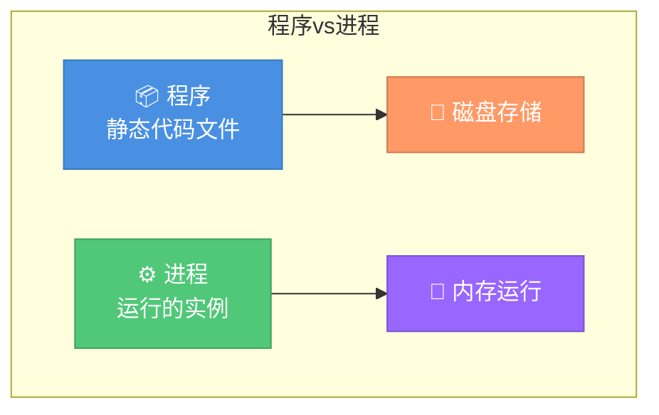
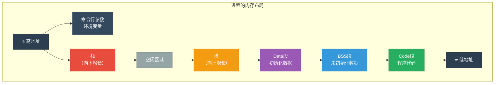
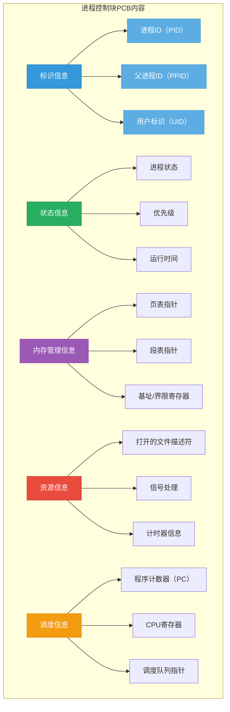
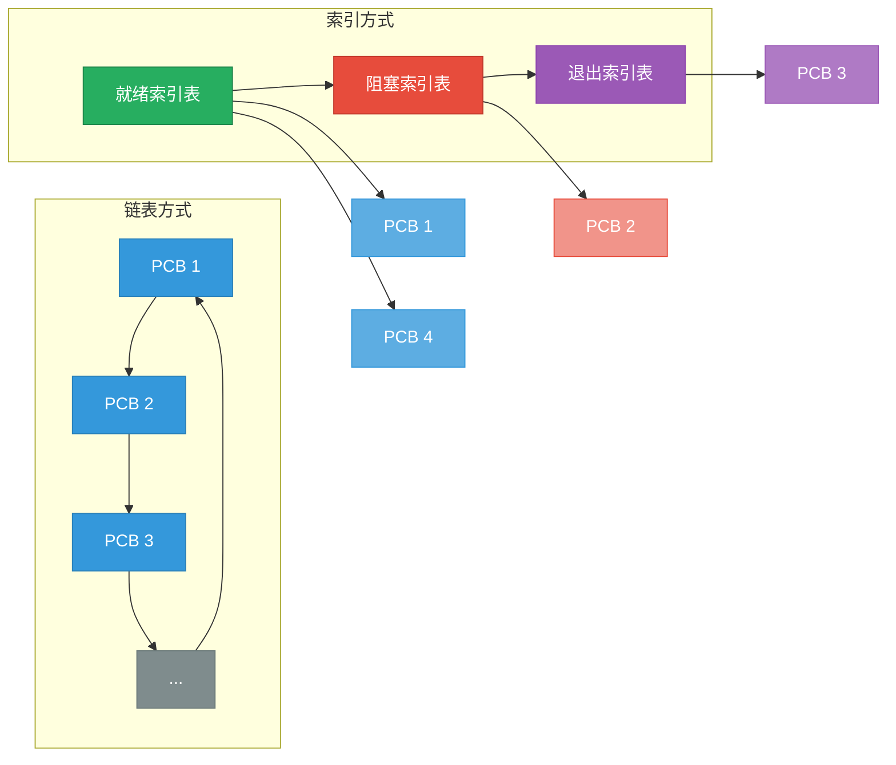
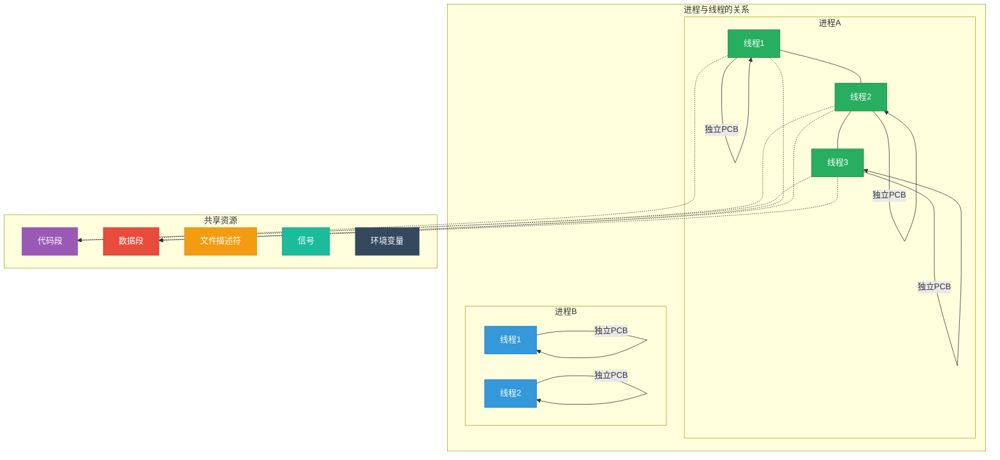
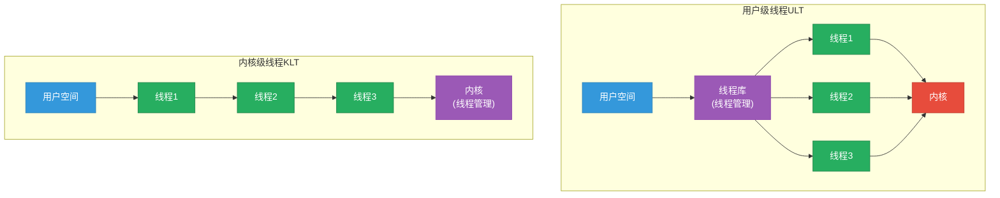
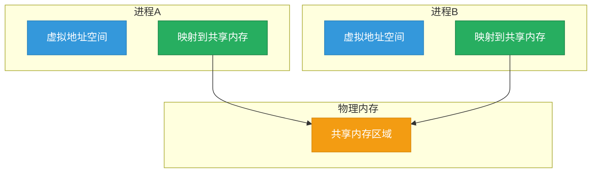
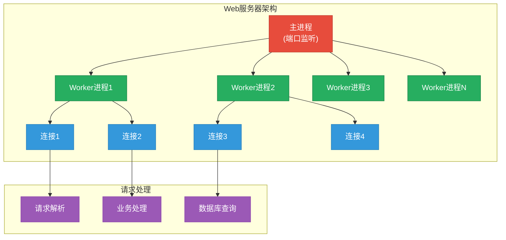
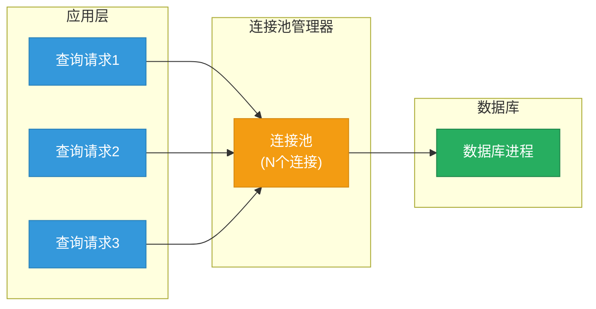

# 第2章 进程与线程

## 概述

进程与线程是操作系统中最核心的概念之一，它们是操作系统进行资源分配和调度的基本单位。本章将深入探讨进程与线程的定义、结构、状态转换以及进程间通信机制，帮助读者建立对操作系统工作原理的清晰认识。

---

## 2.1 进程的概念

### 2.1.1 进程的定义

**进程（Process）** 是计算机中正在运行程序的实例，是操作系统分配资源的基本单位。当一个程序被加载到内存并开始执行时，操作系统会创建一个对应的进程，为其分配独立的地址空间、文件描述符、信号处理等资源。

从不同的角度可以给进程下不同的定义：

- **动态观点**：进程是程序在处理机上的执行过程，是动态的实体
- **资源观点**：进程是资源分配和保护的基本单位，拥有独立的虚拟地址空间
- **调度观点**：进程是操作系统调度的基本单位，是参与CPU竞争的主体

### 2.1.2 进程与程序的区别

进程与程序是两个既相关又不同的概念：

| 特性 | 程序 | 进程 |
|------|------|------|
| 存在形态 | 静态的指令集合 | 动态的执行实体 |
| 生命周期 | 长期存在 | 有创建、执行、终止的生命周期 |
| 存储位置 | 存储在磁盘等持久介质 | 加载到内存中执行 |
| 资源占用 | 不占用系统资源 | 占用内存、CPU等系统资源 |
| 并发性 | 可以有多个进程实例 | 同一程序可产生多个进程 |
| 状态 | 无状态 | 有运行、就绪、阻塞等状态 |



### 2.1.3 进程的组成

进程由三大部分组成：**程序段**、**数据段**和**进程控制块（PCB）**。

#### 1. 程序段（Code Segment）

程序段也称为文本段，存放进程的代码指令。程序段是只读的，包含了处理器执行的机器指令序列。

#### 2. 数据段（Data Segment）

数据段存放进程的全局变量、静态数据和动态分配的数据：

- **初始化数据段（Data）**：已初始化的全局变量和静态变量
- **未初始化数据段（BSS）**：未初始化的全局变量和静态变量，运行时初始化为0
- **堆（Heap）**：动态分配的内存区域
- **栈（Stack）**：函数调用、局部变量存储

#### 3. 进程控制块（PCB）

PCB是进程存在的唯一标志，是操作系统内核中最重要的数据结构。我们将在2.3节详细讨论。



---

## 2.2 进程的状态与转换

### 2.2.1 三状态模型

最基本的状态模型包含三种状态：

- **运行态（Running）**：进程正在CPU上执行
- **就绪态（Ready）**：进程已准备好运行，等待CPU分配时间片
- **阻塞态（Blocked）**：进程因等待某事件（如I/O完成）而暂停执行

```mermaid
stateDiagram-v2
    [*] --> 就绪态: 创建进程
    就绪态 --> 运行态: 调度器选中
    运行态 --> 就绪态: 时间片耗尽
    运行态 --> 阻塞态: 等待事件
    阻塞态 --> 就绪态: 事件完成
    运行态 --> [*]: 终止
    阻塞态 --> [*]: 终止

    style 就绪态 fill:#3498db,stroke:#2980b9,color:#ffffff
    style 运行态 fill:#27ae60,stroke:#1e8449,color:#ffffff
    style 阻塞态 fill:#e74c3c,stroke:#c0392b,color:#ffffff
```

### 2.2.2 五状态模型

为了更好地描述进程管理，引入**新建态（New）**和**退出态（Exit）**：

- **新建态**：进程正在被创建，分配资源、初始化PCB
- **就绪态**：已准备好运行，等待CPU
- **运行态**：正在CPU上执行
- **阻塞态**：因等待事件而暂停
- **退出态**：进程执行完毕，正在释放资源

```mermaid
stateDiagram-v2
    [*] --> 新建态: 创建进程
    新建态 --> 就绪态: 初始化完成
    就绪态 --> 运行态: 调度器选中
    运行态 --> 就绪态: 时间片耗尽
    运行态 --> 阻塞态: 等待事件
    运行态 --> 退出态: 执行完成
    阻塞态 --> 就绪态: 事件完成
    阻塞态 --> 退出态: 错误终止
    就绪态 --> 退出态: 强制终止

    style 新建态 fill:#9b59b6,stroke:#8e44ad,color:#ffffff
    style 就绪态 fill:#3498db,stroke:#2980b9,color:#ffffff
    style 运行态 fill:#27ae60,stroke:#1e8449,color:#ffffff
    style 阻塞态 fill:#e74c3c,stroke:#c0392b,color:#ffffff
    style 退出态 fill:#7f8c8d,stroke:#6c7a7a,color:#ffffff
```

### 2.2.3 七状态模型

在多道程序环境中，为了更好地管理内存和进程，引入了**挂起状态**：

- **活跃阻塞态**：进程在内存中，等待事件完成
- **挂起就绪态**：进程被换出到磁盘，就绪等待调度
- **挂起阻塞态**：进程被换出到磁盘，等待事件完成

```mermaid
stateDiagram-v2
    [*] --> 新建态: 创建进程
    新建态 --> 活跃就绪态: 加载完成
    活跃就绪态 --> 挂起就绪态: 换出到磁盘
    挂起就绪态 --> 活跃就绪态: 换入内存
    活跃就绪态 --> 运行态: 调度选中
    运行态 --> 活跃就绪态: 时间片耗尽
    运行态 --> 活跃阻塞态: 等待事件
    运行态 --> 退出态: 执行完成
    活跃阻塞态 --> 挂起阻塞态: 换出到磁盘
    挂起阻塞态 --> 活跃就绪态: 事件完成<br/>换入内存
    活跃阻塞态 --> 活跃就绪态: 事件完成
    活跃阻塞态 --> 退出态: 错误终止
    挂起就绪态 --> 退出态: 强制终止
    挂起阻塞态 --> 退出态: 强制终止

    style 新建态 fill:#9b59b6,stroke:#8e44ad,color:#ffffff
    style 活跃就绪态 fill:#3498db,stroke:#2980b9,color:#ffffff
    style 挂起就绪态 fill:#2980b9,stroke:#1a5276,color:#ffffff
    style 运行态 fill:#27ae60,stroke:#1e8449,color:#ffffff
    style 活跃阻塞态 fill:#e74c3c,stroke:#c0392b,color:#ffffff
    style 挂起阻塞态 fill:#c0392b,stroke:#922b21,color:#ffffff
    style 退出态 fill:#7f8c8d,stroke:#6c7a7a,color:#ffffff
```

---

## 2.3 进程控制块（PCB）

### 2.3.1 PCB的内容

进程控制块（Process Control Block，PCB）是操作系统内核中维护进程信息的数据结构，包含以下内容：



### 2.3.2 PCB的组织方式

操作系统通常采用以下方式组织PCB：

#### 1. 链表方式

- **就绪队列**：将所有就绪态进程链接在一起
- **阻塞队列**：将所有阻塞态进程按阻塞原因链接
- **空闲队列**：管理可分配的PCB节点

#### 2. 索引方式

- 为不同状态的进程建立索引表
- 索引表项指向PCB或PCB链表



### 2.3.3 上下文切换

**上下文切换（Context Switch）**是CPU从一个进程切换到另一个进程的过程。具体步骤如下：

1. 保存当前进程的CPU上下文（寄存器、PC等）到其PCB
2. 更新当前进程的状态
3. 选择下一个要运行的进程
4. 恢复下一个进程的CPU上下文
5. 跳转到下一个进程上次停止的位置继续执行

```mermaid
sequenceDiagram
    participant CPU
    participant OS as 操作系统内核
    participant P1 as 进程1
    participant P2 as 进程2

    CPU->>P1: 执行进程1
    Note over P1: 时间片耗尽/中断发生
    CPU->>OS: 触发上下文切换
    OS->>P1: 保存上下文到PCB1
    OS->>OS: 更新进程1状态
    OS->>OS: 选择进程2
    OS->>P2: 恢复PCB2上下文
    OS->>CPU: 切换到进程2
    CPU->>P2: 执行进程2

    style CPU fill:#f39c12,stroke:#d68910,color:#ffffff
    style OS fill:#9b59b6,stroke:#8e44ad,color:#ffffff
    style P1 fill:#3498db,stroke:#2980b9,color:#ffffff
    style P2 fill:#27ae60,stroke:#1e8449,color:#ffffff
```

---

## 2.4 线程的概念

### 2.4.1 线程的定义

**线程（Thread）** 是进程内的执行单元，是CPU调度的基本单位。一个进程可以包含多个线程，这些线程共享进程的地址空间和其他资源，但每个线程有自己的线程ID、程序计数器、寄存器集合和栈。

### 2.4.2 线程与进程的区别

| 特性 | 进程 | 线程 |
|------|------|------|
| 资源拥有 | 独立资源单位 | 共享进程资源 |
| 地址空间 | 独立地址空间 | 共享进程地址空间 |
| 开销 | 创建/切换开销大 | 创建/切换开销小 |
| 通信 | 需要IPC机制 | 直接读写共享内存 |
| 可靠性 | 一个进程崩溃不影响其他 | 一个线程崩溃导致整个进程崩溃 |
| 调度 | 独立调度 | 同一进程内线程竞争CPU |



### 2.4.3 线程的优势

1. **轻量级**：线程创建和撤销的开销远小于进程
2. **并发性**：同一进程内的线程可以并发执行，提高程序吞吐量
3. **资源共享**：同一进程的线程共享代码段、数据段等资源，通信效率高
4. **响应性**：一个线程阻塞不影响其他线程执行，提高程序响应性

### 2.4.4 线程的实现方式

#### 用户级线程（ULT）

- 线程管理由用户程序负责，内核不知道线程的存在
- 优点：快速切换，不需要内核模式转换
- 缺点：一个线程阻塞会导致整个进程阻塞

#### 内核级线程（KLT）

- 线程管理由操作系统内核负责
- 优点：一个线程阻塞不影响其他线程
- 缺点：线程切换需要内核模式转换，开销较大

#### 混合线程模型

- 结合用户级和内核级线程的优点
- 多个用户级线程映射到多个内核级线程



---

## 2.5 进程间通信（IPC）

进程间通信是进程协调工作的重要机制。由于进程拥有独立的地址空间，需要通过操作系统提供的通信机制来实现数据交换和同步。

### 2.5.1 共享内存

共享内存是最快的IPC机制允许多个进程访问同一块物理内存区域。

**优点**：数据传输速度快（无需内核介入）
**缺点**：需要同步机制保护共享数据



### 2.5.2 消息传递

消息传递通过内核提供的消息队列进行进程间通信。

**优点**：易于实现，提供了同步机制
**缺点**：需要复制数据，开销较大

#### C语言示例 - POSIX消息队列

```c
// sender.c - 消息发送者
#include <stdio.h>
#include <stdlib.h>
#include <string.h>
#include <mqueue.h>
#include <sys/stat.h>

#define QUEUE_NAME "/test_queue"
#define MAX_MSG_SIZE 256
#define MAX_MESSAGES 10

int main() {
    mqd_t mq;
    struct mq_attr attr;

    // 设置消息队列属性
    attr.mq_flags = 0;
    attr.mq_maxmsg = MAX_MESSAGES;
    attr.mq_msgsize = MAX_MSG_SIZE;
    attr.mq_curmsgs = 0;

    // 打开/创建消息队列
    mq = mq_open(QUEUE_NAME, O_CREAT | O_WRONLY, 0644, &attr);
    if (mq == (mqd_t)-1) {
        perror("mq_open");
        exit(1);
    }

    // 发送消息
    const char *msg = "Hello from sender!";
    if (mq_send(mq, msg, strlen(msg), 0) == -1) {
        perror("mq_send");
        exit(1);
    }

    printf("Sent: %s\n", msg);

    mq_close(mq);
    return 0;
}
```

```c
// receiver.c - 消息接收者
#include <stdio.h>
#include <stdlib.h>
#include <string.h>
#include <mqueue.h>
#include <sys/stat.h>

#define QUEUE_NAME "/test_queue"
#define MAX_MSG_SIZE 256

int main() {
    mqd_t mq;
    char buffer[MAX_MSG_SIZE];

    // 打开消息队列
    mq = mq_open(QUEUE_NAME, O_RDONLY);
    if (mq == (mqd_t)-1) {
        perror("mq_open");
        exit(1);
    }

    // 接收消息
    ssize_t bytes_read = mq_receive(mq, buffer, MAX_MSG_SIZE, NULL);
    if (bytes_read == -1) {
        perror("mq_receive");
        exit(1);
    }

    buffer[bytes_read] = '\0';
    printf("Received: %s\n", buffer);

    // 清理
    mq_close(mq);
    mq_unlink(QUEUE_NAME);

    return 0;
}
```

### 2.5.3 管道

管道是最早的Unix IPC机制，提供单向字节流通信。

#### 无名管道

适用于有亲缘关系的进程（如父子进程）：

```c
// pipe.c - 无名管道示例
#include <stdio.h>
#include <stdlib.h>
#include <unistd.h>
#include <string.h>

int main() {
    int pipefd[2];  // pipefd[0]读端, pipefd[1]写端
    pid_t pid;

    // 创建管道
    if (pipe(pipefd) == -1) {
        perror("pipe");
        exit(1);
    }

    pid = fork();
    if (pid == -1) {
        perror("fork");
        exit(1);
    }

    if (pid == 0) {
        // 子进程 - 关闭读端，写入数据
        close(pipefd[0]);
        const char *msg = "Data from child process";
        write(pipefd[1], msg, strlen(msg));
        close(pipefd[1]);
        printf("Child: Wrote data to pipe\n");
    } else {
        // 父进程 - 关闭写端，读取数据
        close(pipefd[1]);
        char buffer[100];
        ssize_t bytes_read = read(pipefd[0], buffer, sizeof(buffer));
        buffer[bytes_read] = '\0';
        printf("Parent: Read data: %s\n", buffer);
        close(pipefd[0]);
    }

    return 0;
}
```

#### 有名管道（FIFO）

适用于无亲缘关系的进程：

```bash
# 创建有名管道
mkfifo /tmp/my_fifo

# 进程1：写入
echo "Hello FIFO" > /tmp/my_fifo

# 进程2：读取
cat /tmp/my_fifo
```

### 2.5.4 套接字

套接字是最通用的IPC机制，支持本地和网络通信。

#### Python示例 - Unix域套接字

```python
# server.py - Unix域套接字服务器
import socket
import os

SOCKET_PATH = "/tmp/my_socket.sock"

# 清理已存在的套接字
if os.path.exists(SOCKET_PATH):
    os.remove(SOCKET_PATH)

# 创建Unix域套接字
server = socket.socket(socket.AF_UNIX, socket.SOCK_STREAM)
server.bind(SOCKET_PATH)
server.listen(1)

print(f"Server listening on {SOCKET_PATH}")

while True:
    conn, addr = server.accept()
    print("Client connected")

    data = conn.recv(1024)
    if data:
        print(f"Received: {data.decode()}")

        response = "Hello from server!"
        conn.send(response.encode())

    conn.close()
```

```python
# client.py - Unix域套接字客户端
import socket

SOCKET_PATH = "/tmp/my_socket.sock"

# 创建Unix域套接字
client = socket.socket(socket.AF_UNIX, socket.SOCK_STREAM)
client.connect(SOCKET_PATH)

message = "Hello from client!"
client.send(message.encode())

data = client.recv(1024)
print(f"Received: {data.decode()}")

client.close()
```

---

## 2.6 实际应用场景

### 2.6.1 Web服务器

Web服务器（如Nginx、Apache）使用进程/线程池处理并发请求：

- **Nginx**：采用多进程模型，每个worker进程处理多个连接
- **Apache**：支持多进程和多线程模式
- **Node.js**：基于事件循环的单进程模型



### 2.6.2 数据库连接池

数据库使用进程/线程池管理并发访问：



### 2.6.3 并行计算

在科学计算和数据处理中，使用多进程/多线程加速计算：

```python
# parallel_processing.py - Python多进程示例
from multiprocessing import Process, Queue
import os

def worker(queue, worker_id):
    """工作进程"""
    while True:
        task = queue.get()
        if task is None:  # 结束信号
            break
        
        a, b = task
        result = a + b
        print(f"Worker {worker_id}: {a} + {b} = {result}")
        queue.task_done()

def main():
    # 创建队列
    task_queue = Queue()

    # 启动多个工作进程
    num_workers = 4
    workers = []
    for i in range(num_workers):
        p = Process(target=worker, args=(task_queue, i))
        p.start()
        workers.append(p)

    # 添加任务
    tasks = [(1, 2), (3, 4), (5, 6), (7, 8), (9, 10)]
    for task in tasks:
        task_queue.put(task)

    # 发送结束信号
    for _ in range(num_workers):
        task_queue.put(None)

    # 等待所有任务完成
    task_queue.join()

    # 终止工作进程
    for p in workers:
        p.join()

    print("All tasks completed!")

if __name__ == "__main__":
    main()
```

### 2.6.4 Go语言并发示例

Go语言使用Goroutine实现轻量级并发：

```go
// concurrent.go - Go语言并发示例
package main

import (
    "fmt"
    "sync"
    "time"
)

func worker(id int, wg *sync.WaitGroup) {
    defer wg.Done()
    fmt.Printf("Worker %d starting\n", id)
    time.Sleep(time.Second)
    fmt.Printf("Worker %d done\n", id)
}

func main() {
    var wg sync.WaitGroup

    // 启动5个goroutine
    for i := 1; i <= 5; i++ {
        wg.Add(1)
        go worker(i, &wg)
    }

    // 等待所有goroutine完成
    wg.Wait()
    fmt.Println("All workers completed!")
}
```

### 2.6.5 共享内存示例

```c
// shared_memory.c - POSIX共享内存示例
#include <stdio.h>
#include <stdlib.h>
#include <string.h>
#include <unistd.h>
#include <sys/mman.h>
#include <sys/stat.h>
#include <fcntl.h>

#define SHM_NAME "/my_shared_memory"
#define SHM_SIZE 4096

int main() {
    int shm_fd;
    void *ptr;

    // 创建/打开共享内存对象
    shm_fd = shm_open(SHM_NAME, O_CREAT | O_RDWR, 0666);
    if (shm_fd == -1) {
        perror("shm_open");
        exit(1);
    }

    // 设置共享内存大小
    if (ftruncate(shm_fd, SHM_SIZE) == -1) {
        perror("ftruncate");
        exit(1);
    }

    // 映射共享内存
    ptr = mmap(NULL, SHM_SIZE, PROT_READ | PROT_WRITE, MAP_SHARED, shm_fd, 0);
    if (ptr == MAP_FAILED) {
        perror("mmap");
        exit(1);
    }

    // 写入数据
    pid_t pid = fork();
    if (pid == 0) {
        // 子进程写入
        sprintf(ptr, "Written by child, PID: %d", getpid());
        printf("Child wrote to shared memory\n");
    } else {
        // 父进程读取
        sleep(1);  // 等待子进程写入
        printf("Parent read: %s\n", (char *)ptr);
        wait(NULL);
    }

    // 清理
    munmap(ptr, SHM_SIZE);
    shm_unlink(SHM_NAME);

    return 0;
}
```

编译运行：
```bash
gcc shared_memory.c -o shared_memory -lrt
./shared_memory
```

---

## 2.7 小结

本章详细介绍了进程与线程的核心概念：

1. **进程**是程序运行的实例，是操作系统分配资源的基本单位，由程序段、数据段和PCB组成

2. **进程状态**反映了进程的生命周期，三状态模型是最基础的模型，实际系统中常用五状态或七状态模型

3. **PCB**是进程存在的唯一标志，包含进程管理和调度所需的所有信息

4. **线程**是进程内的执行单元，共享进程资源但有独立的执行状态，是CPU调度的基本单位

5. **进程间通信**有多种方式：共享内存、消息传递、管道、套接字等，各有优缺点

理解这些概念对于掌握操作系统原理、编写高效并发程序具有重要意义。

---

## 参考资料

- Abraham Silberschatz, Peter B. Galvin, Greg Gagne. *Operating System Concepts* (10th Edition)
- Andrew S. Tanenbaum. *Modern Operating Systems* (4th Edition)
- William Stallings. *Operating Systems: Internals and Design Principles*
