# 第3章 进程调度

## 3.1 调度概述

进程调度是操作系统核心功能之一，负责决定哪个就绪进程获得CPU使用权。有效的调度策略能够提高系统吞吐量、减少响应时间，并确保公平性。

### 3.1.1 调度层次

现代操作系统通常采用三级调度体系，每一级解决不同层面的资源管理问题：

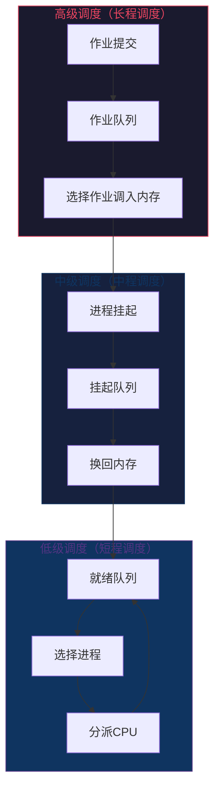

| 调度层次 | 别名 | 功能 | 调度频率 | 影响时间范围 |
|---------|------|------|---------|------------|
| 高级调度 | 长程调度 | 决定哪些作业调入内存 | 秒~分钟级 | 系统吞吐量、作业平衡 |
| 中级调度 | 中程调度 | 管理挂起/换出进程 | 分钟级 | 内存压力、进程状态 |
| 低级调度 | 短程调度 | 分配CPU给就绪进程 | 毫秒级 | 响应时间、周转时间 |

### 3.1.2 调度目标

不同的系统类型有不同的调度目标：

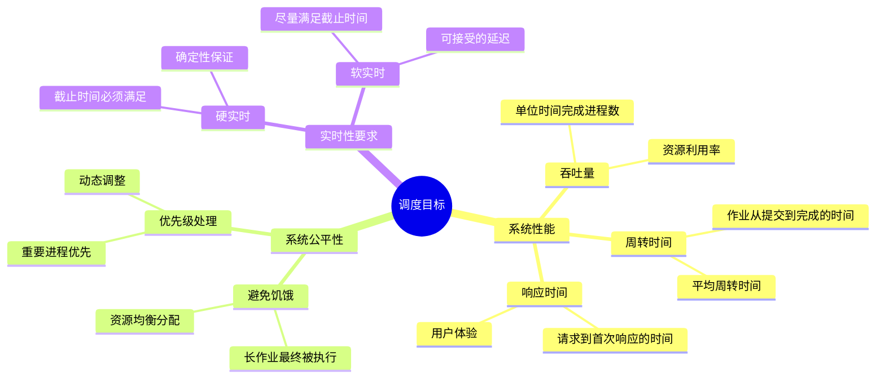

### 3.1.3 调度准则

评估调度算法的主要准则：

- **CPU利用率**：`CPU利用率 = CPU忙碌时间 / 总时间`
- **吞吐量**：单位时间内完成的进程数
- **周转时间**：进程从提交到完成的总时间
- **等待时间**：进程在就绪队列中等待的时间总和
- **响应时间**：从提交请求到首次响应的时间

```mermaid
gantt
    title 进程时间指标示意图
    dateFormat X
    axisFormat %s秒
    
    section 进程生命周期
    提交时刻           :done, 0, 0
    等待时间           :wait, 0, 8
    执行时间           :active, 8, 23
    完成时刻           :crit, 23, 23
    
    section 指标定义
    周转时间=完成-提交 :milestone, 23, 0
    响应时间=首次-提交 :milestone, 0, 0
```

---

## 3.2 批处理系统调度算法

批处理系统主要关注系统吞吐量和公平性，对响应时间要求不高。

### 3.2.1 FCFS（先来先服务）

**算法原理**：按进程到达就绪队列的顺序选择运行。

**特点**：
- 简单易实现
- 非抢占式
- 对长作业有利，对短作业不利

```python
# -*- coding: utf-8 -*-
"""
FCFS (First-Come-First-Serve) 调度算法实现
"""

from dataclasses import dataclass
from typing import List

@dataclass
class Process:
    pid: str           # 进程ID
    arrival_time: int  # 到达时间
    burst_time: int    # 执行时间
    waiting_time: int = 0   # 等待时间
    turnaround_time: int = 0 # 周转时间
    completion_time: int = 0 # 完成时间

def fcfs_schedule(processes: List[Process]) -> List[Process]:
    """
    FCFS 调度算法
    
    按到达时间排序，依次执行
    """
    # 按到达时间排序
    sorted_procs = sorted(processes, key=lambda p: p.arrival_time)
    
    current_time = 0
    for proc in sorted_procs:
        # 如果进程尚未到达，需要等待
        if current_time < proc.arrival_time:
            current_time = proc.arrival_time
        
        # 计算等待时间
        proc.waiting_time = current_time - proc.arrival_time
        
        # 执行进程
        current_time += proc.burst_time
        proc.completion_time = current_time
        
        # 计算周转时间
        proc.turnaround_time = proc.completion_time - proc.arrival_time
    
    return sorted_procs

def print_schedule_result(processes: List[Process], title: str):
    print(f"\n{'='*60}")
    print(f"  {title}")
    print(f"{'='*60}")
    print(f"{'PID':<8}{'到达':<8}{'执行':<8}{'等待':<8}{'周转':<8}{'完成':<8}")
    print("-" * 60)
    
    total_wait = 0
    total_turnaround = 0
    
    for p in processes:
        print(f"{p.pid:<8}{p.arrival_time:<8}{p.burst_time:<8}"
              f"{p.waiting_time:<8}{p.turnaround_time:<8}{p.completion_time:<8}")
        total_wait += p.waiting_time
        total_turnaround += p.turnaround_time
    
    n = len(processes)
    print("-" * 60)
    print(f"平均等待时间: {total_wait/n:.2f}")
    print(f"平均周转时间: {total_turnaround/n:.2f}")

# 测试 FCFS
if __name__ == "__main__":
    processes = [
        Process("P1", 0, 24),
        Process("P2", 1, 3),
        Process("P3", 2, 3),
    ]
    
    result = fcfs_schedule(processes)
    print_schedule_result(result, "FCFS 调度结果 (Gantt图示意)")
    
    # 绘制 Gantt 图
    print("\nGantt 图:")
    print("时间:  0    5    10   15   20   25   30")
    print("      +----+----+----+----+----+----+----+")
    print("      | P1 |    |    |    |    |    |    |")
    print("      +----+----+----+----+----+----+----+")
    print("      0         24                       30")
    print("\n注意: P2 和 P3 到达后需要等待 P1 完成")
```

**执行结果分析**：

| 进程 | 到达时间 | 执行时间 | 开始时间 | 等待时间 | 完成时间 | 周转时间 |
|------|---------|---------|---------|---------|---------|---------|
| P1   | 0       | 24      | 0       | 0       | 24      | 24      |
| P2   | 1       | 3       | 24      | 23      | 27      | 26      |
| P3   | 2       | 3       | 27      | 25      | 30      | 28      |

**平均等待时间**：(0 + 23 + 25) / 3 = 16.0

### 3.2.2 SJF（短作业优先）

**算法原理**：选择执行时间最短的进程优先执行。

**特点**：
- 理论上最优（最小化平均等待时间）
- 需要预知作业执行时间
- 可能导致长作业饥饿

```python
# -*- coding: utf-8 -*-
"""
SJF (Shortest Job First) 调度算法实现
包括非抢占式和抢占式(SRTF)两种版本
"""

from dataclasses import dataclass
from typing import List, Optional

@dataclass
class Process:
    pid: str
    arrival_time: int
    burst_time: int
    remaining_time: int = 0  # 剩余执行时间（用于抢占式）
    waiting_time: int = 0
    turnaround_time: int = 0
    completion_time: int = 0
    response_time: int = -1  # 响应时间（首次获得CPU的时间 - 到达时间）

def sjf_non_preemptive(processes: List[Process]) -> List[Process]:
    """
    非抢占式 SJF (Shortest Job First)
    当一个进程开始执行后，必须执行完毕才切换
    """
    processes = [Process(p.pid, p.arrival_time, p.burst_time) for p in processes]
    n = len(processes)
    completed = []
    current_time = 0
    completed_count = 0
    
    while completed_count < n:
        # 选择当前时刻已到达且执行时间最短的进程
        available = [p for p in processes if p not in completed and p.arrival_time <= current_time]
        
        if not available:
            # 没有可用进程，跳转到下一个进程到达时间
            next_arrival = min(p.arrival_time for p in processes if p not in completed)
            current_time = next_arrival
            continue
        
        # 选择最短作业
        shortest = min(available, key=lambda p: p.burst_time)
        
        # 记录响应时间（首次执行）
        if shortest.response_time == -1:
            shortest.response_time = current_time - shortest.arrival_time
        
        # 执行
        shortest.waiting_time = current_time - shortest.arrival_time
        current_time += shortest.burst_time
        shortest.completion_time = current_time
        shortest.turnaround_time = shortest.completion_time - shortest.arrival_time
        
        completed.append(shortest)
        completed_count += 1
    
    return completed

def sjf_preemptive(processes: List[Process]) -> List[Process]:
    """
    抢占式 SJF 又称 SRTF (Shortest Remaining Time First)
    当有新进程到达时，如果其执行时间比当前进程剩余时间短，则切换
    """
    processes = [Process(p.pid, p.arrival_time, p.burst_time, p.burst_time) for p in processes]
    n = len(processes)
    completed = []
    current_time = 0
    completed_count = 0
    current_process: Optional[Process] = None
    
    while completed_count < n:
        # 获取已到达且未完成的进程
        available = [p for p in processes if p not in completed and p.arrival_time <= current_time]
        
        if not available:
            next_arrival = min(p.arrival_time for p in processes if p not in completed)
            current_time = next_arrival
            continue
        
        # 选择剩余时间最短的进程
        shortest = min(available, key=lambda p: p.remaining_time)
        
        # 首次获得CPU
        if shortest.response_time == -1:
            shortest.response_time = current_time - shortest.arrival_time
        
        # 切换到新进程
        if current_process != shortest:
            current_process = shortest
        
        # 执行一个时间单位
        shortest.remaining_time -= 1
        current_time += 1
        
        # 检查是否完成
        if shortest.remaining_time == 0:
            shortest.completion_time = current_time
            shortest.turnaround_time = shortest.completion_time - shortest.arrival_time
            shortest.waiting_time = shortest.turnaround_time - shortest.burst_time
            completed.append(shortest)
            completed_count += 1
            current_process = None
    
    return completed

def print_gantt_chart(events: List[tuple], title: str):
    """打印 Gantt 图"""
    print(f"\n{title}")
    print("-" * 50)
    
    # 简化Gantt图展示
    print("时间轴: ", end="")
    times = sorted(set(t for _, t in events for _ in [None] if True))
    print(" | ".join([str(t) for t in times[:8]]), "...")
    
    print("执行序列:")
    for pid, start, end in events:
        print(f"  {pid}: {start} -> {end}")

if __name__ == "__main__":
    # 测试数据
    processes = [
        Process("P1", 0, 8),
        Process("P2", 1, 4),
        Process("P3", 2, 9),
        Process("P4", 3, 5),
    ]
    
    print("=" * 60)
    print("  SJF 调度算法对比")
    print("=" * 60)
    
    # 非抢占式 SJF
    result_non_pre = sjf_non_preemptive(processes)
    print(f"\n非抢占式 SJF 结果:")
    print(f"{'PID':<8}{'到达':<8}{'执行':<8}{'等待':<8}{'周转':<8}{'响应':<8}")
    for p in result_non_pre:
        print(f"{p.pid:<8}{p.arrival_time:<8}{p.burst_time:<8}"
              f"{p.waiting_time:<8}{p.turnaround_time:<8}{p.response_time:<8}")
    
    avg_wait = sum(p.waiting_time for p in result_non_pre) / len(result_non_pre)
    avg_turnaround = sum(p.turnaround_time for p in result_non_pre) / len(result_non_pre)
    print(f"平均等待时间: {avg_wait:.2f}")
    print(f"平均周转时间: {avg_turnaround:.2f}")
    
    # 抢占式 SJF (SRTF)
    processes2 = [
        Process("P1", 0, 8),
        Process("P2", 1, 4),
        Process("P3", 2, 9),
        Process("P4", 3, 5),
    ]
    result_pre = sjf_preemptive(processes2)
    print(f"\n抢占式 SJF (SRTF) 结果:")
    print(f"{'PID':<8}{'到达':<8}{'执行':<8}{'等待':<8}{'周转':<8}{'响应':<8}")
    for p in result_pre:
        print(f"{p.pid:<8}{p.arrival_time:<8}{p.burst_time:<8}"
              f"{p.waiting_time:<8}{p.turnaround_time:<8}{p.response_time:<8}")
```

**SJF vs FCFS 对比**：

```mermaid
gantt
    title FCFS vs SJF 执行对比
    dateFormat X
    
    section FCFS
    P1 (8)    :done, 0, 8
    P2 (4)    :done, 8, 12
    P4 (5)    :done, 12, 17
    P3 (9)    :done, 17, 26
    
    section 非抢占SJF
    P1 (8)    :done, 0, 8
    P2 (4)    :done, 8, 12
    P4 (5)    :done, 12, 17
    P3 (9)    :done, 17, 26
    
    section 抢占SJF/SRTF
    P1 (1)    :done, 0, 1
    P2 (4)    :done, 1, 5
    P4 (5)    :done, 5, 6
    P1 (7)    :done, 6, 13
    P4 (4)    :done, 13, 17
    P3 (9)    :done, 17, 26
```

| 指标 | FCFS | 非抢占SJF | 抢占SJF(SRTF) |
|-----|------|----------|--------------|
| 平均等待时间 | 11.25 | 7.75 | 4.5 |
| 平均周转时间 | 17.5 | 14.0 | 10.75 |
| 吞吐量 | 较低 | 较高 | 最高 |

### 3.2.3 HRRN（最高响应比优先）

**算法原理**：每次选择响应比最高的进程执行

**响应比公式**：
```
响应比 = (等待时间 + 执行时间) / 执行时间
      = 等待时间/执行时间 + 1
```

**特点**：
- 折中方案：对短作业友好，同时不饿死长作业
- 等待时间越长，响应比越高
- 执行时间越短，响应比越高

```python
# -*- coding: utf-8 -*-
"""
HRRN (Highest Response Ratio Next) 调度算法实现
"""

from dataclasses import dataclass
from typing import List

@dataclass
class Process:
    pid: str
    arrival_time: int
    burst_time: int
    waiting_time: int = 0
    turnaround_time: int = 0
    completion_time: int = 0

def hrrn_schedule(processes: List[Process]) -> List[Process]:
    """
    HRRN 调度算法
    
    响应比 = (等待时间 + 执行时间) / 执行时间
           = 等待时间/执行时间 + 1
    """
    processes = [Process(p.pid, p.arrival_time, p.burst_time) for p in processes]
    n = len(processes)
    completed = []
    current_time = 0
    completed_count = 0
    
    while completed_count < n:
        # 找出所有已到达但未完成的进程
        available = [p for p in processes if p not in completed and p.arrival_time <= current_time]
        
        if not available:
            next_arrival = min(p.arrival_time for p in processes if p not in completed)
            current_time = next_arrival
            continue
        
        # 计算每个进程的响应比，选择最高的
        for p in available:
            p.waiting_time = current_time - p.arrival_time
        
        # 选择响应比最高的进程
        highest_rr = max(available, key=lambda p: (p.waiting_time + p.burst_time) / p.burst_time)
        
        # 执行
        current_time += highest_rr.burst_time
        highest_rr.completion_time = current_time
        highest_rr.turnaround_time = highest_rr.completion_time - highest_rr.arrival_time
        
        completed.append(highest_rr)
        completed_count += 1
    
    return completed

if __name__ == "__main__":
    processes = [
        Process("A", 0, 10),
        Process("B", 1, 4),
        Process("C", 2, 6),
        Process("D", 3, 2),
    ]
    
    result = hrrn_schedule(processes)
    
    print("=" * 60)
    print("  HRRN 调度结果")
    print("=" * 60)
    print(f"{'PID':<8}{'到达':<8}{'执行':<8}{'等待':<8}{'周转':<8}{'响应比':<10}")
    print("-" * 60)
    
    for p in result:
        response_ratio = (p.waiting_time + p.burst_time) / p.burst_time
        print(f"{p.pid:<8}{p.arrival_time:<8}{p.burst_time:<8}"
              f"{p.waiting_time:<8}{p.turnaround_time:<8}{response_ratio:.2f}")
    
    avg_wait = sum(p.waiting_time for p in result) / len(result)
    avg_turnaround = sum(p.turnaround_time for p in result) / len(result)
    print("-" * 60)
    print(f"平均等待时间: {avg_wait:.2f}")
    print(f"平均周转时间: {avg_turnaround:.2f}")
    
    # 调度顺序分析
    print("\n调度顺序分析:")
    print("时间0: 只有A到达，选择A (响应比 = 1.00)")
    print("时间10: B,C,D都到达，比较响应比:")
    print("  B: (9+4)/4 = 3.25")
    print("  C: (8+6)/6 = 2.33")
    print("  D: (7+2)/2 = 4.50  <- 最高，选择D")
    print("时间12: 选择B (响应比 = 3.25)")
    print("时间16: 选择C (响应比 = 2.33)")
```

**三种批处理算法对比**：

```mermaid
flowchart LR
    subgraph 评估维度["评估维度"]
        D1["吞吐量"]
        D2["公平性"]
        D3["简单性"]
        D4["避免饥饿"]
    end
    
    subgraph 算法对比["算法对比"]
        A1["FCFS"] --> |"高"| D1
        A1 --> |"高"| D3
        A1 --> |"低"| D4
        
        A2["SJF"] --> |"最高"| D1
        A2 --> |"最低"| D3
        A2 --> |"低"| D4
        
        A3["HRRN"] --> |"中"| D1
        A3 --> |"高"| D3
        A3 --> |"高"| D4
        A3 --> |"中"| D2
    end
    
    style 评估维度 fill:#1a1a2e,stroke:#e94560
    style 算法对比 fill:#1a1a2e,stroke:#0f3460
```

---

## 3.3 交互式系统调度算法

交互式系统（如分时系统）要求快速响应用户操作，对响应时间敏感。

### 3.3.1 RR（时间片轮转）

**算法原理**：每个进程执行一个时间片后，移到就绪队列末尾。

**关键参数**：时间片大小（quantum）

```mermaid
flowchart TB
    subgraph 就绪队列["就绪队列"]
        Q1["P1"]
        Q2["P2"]
        Q3["P3"]
        Q4["..."]
    end
    
    subgraph CPU["CPU执行"]
        CPU1["P1 执行中"]
    end
    
    subgraph 时间片流转["时间片轮转流程"]
        T1["时间片用完"] --> T2["P1移到队尾"]
        T2 --> T3["P2获得CPU"]
        T3 --> T4["..."]
    end
    
    Q1 --> CPU1
    CPU1 --> T1
    T4 --> 就绪队列
    
    style 就绪队列 fill:#16213e,stroke:#0f3460
    style CPU fill:#0f3460,stroke:#533483
    style 时间片流转 fill:#1a1a2e,stroke:#e94560
```

```python
# -*- coding: utf-8 -*-
"""
RR (Round Robin) 时间片轮转调度算法实现
"""

from dataclasses import dataclass
from typing import List
from collections import deque

@dataclass
class Process:
    pid: str
    arrival_time: int
    burst_time: int
    remaining_time: int = 0
    waiting_time: int = 0
    turnaround_time: int = 0
    completion_time: int = 0
    response_time: int = -1

def round_robin(processes: List[Process], time_quantum: int) -> List[Process]:
    """
    RR 时间片轮转调度
    
    Args:
        processes: 进程列表
        time_quantum: 时间片大小
    """
    processes = [Process(p.pid, p.arrival_time, p.burst_time, p.burst_time) for p in processes]
    
    ready_queue = deque()
    current_time = 0
    completed = []
    n = len(processes)
    
    # 按到达时间排序
    processes.sort(key=lambda p: p.arrival_time)
    idx = 0  # 下一个要检查的进程索引
    
    while len(completed) < n:
        # 将所有到达的进程加入就绪队列
        while idx < n and processes[idx].arrival_time <= current_time:
            ready_queue.append(processes[idx])
            idx += 1
        
        if not ready_queue:
            # 没有就绪进程，跳到下一个进程到达
            if idx < n:
                current_time = processes[idx].arrival_time
                continue
            else:
                break
        
        # 取出队首进程
        current_proc = ready_queue.popleft()
        
        # 记录响应时间（首次执行）
        if current_proc.response_time == -1:
            current_proc.response_time = current_time - current_proc.arrival_time
        
        # 计算本次执行时间
        exec_time = min(time_quantum, current_proc.remaining_time)
        
        # 执行
        current_time += exec_time
        current_proc.remaining_time -= exec_time
        
        # 检查是否有新进程到达
        while idx < n and processes[idx].arrival_time <= current_time:
            ready_queue.append(processes[idx])
            idx += 1
        
        if current_proc.remaining_time > 0:
            # 进程未完成，放回队尾
            ready_queue.append(current_proc)
        else:
            # 进程完成
            current_proc.completion_time = current_time
            current_proc.turnaround_time = current_proc.completion_time - current_proc.arrival_time
            current_proc.waiting_time = current_proc.turnaround_time - current_proc.burst_time
            completed.append(current_proc)
    
    return completed

def generate_gantt_events(processes: List[Process], time_quantum: int) -> List[tuple]:
    """生成 Gantt 图事件"""
    processes = [Process(p.pid, p.arrival_time, p.burst_time, p.burst_time) for p in processes]
    
    ready_queue = deque()
    current_time = 0
    events = []
    n = len(processes)
    
    processes.sort(key=lambda p: p.arrival_time)
    idx = 0
    
    while any(p.remaining_time > 0 for p in processes):
        while idx < n and processes[idx].arrival_time <= current_time:
            ready_queue.append(processes[idx])
            idx += 1
        
        if not ready_queue:
            if idx < n:
                current_time = processes[idx].arrival_time
                continue
            else:
                break
        
        current_proc = ready_queue.popleft()
        exec_time = min(time_quantum, current_proc.remaining_time)
        
        events.append((current_proc.pid, current_time, current_time + exec_time))
        current_time += exec_time
        current_proc.remaining_time -= exec_time
        
        while idx < n and processes[idx].arrival_time <= current_time:
            ready_queue.append(processes[idx])
            idx += 1
        
        if current_proc.remaining_time > 0:
            ready_queue.append(current_proc)
    
    return events

def print_gantt(events: List[tuple], max_time: int):
    """打印 Gantt 图"""
    print("\nGantt 图:")
    print("-" * 60)
    
    # 构建时间轴和进程条
    timeline = []
    labels = []
    for pid, start, end in events:
        timeline.append(f"{pid}")
        labels.append(f"{start}")
    
    print(" " * 6 + "|".join([f"{l:^5}" for l in labels]) + f"|{max_time}")
    print("       +" + "+".join(["-----" for _ in range(len(events) + 1)]) + "+")
    print("       |" + "|".join([f"{pid:^5}" for pid, _, _ in events]) + "|")
    print("       +" + "+".join(["-----" for _ in range(len(events) + 1)]) + "+")

if __name__ == "__main__":
    processes = [
        Process("P1", 0, 24),
        Process("P2", 1, 3),
        Process("P3", 2, 3),
    ]
    
    print("=" * 60)
    print("  RR 时间片轮转调度")
    print("=" * 60)
    
    for quantum in [4, 3]:
        print(f"\n{'='*50}")
        print(f"  时间片大小 = {quantum}")
        print(f"{'='*50}")
        
        result = round_robin(processes, quantum)
        
        print(f"\n{'PID':<8}{'到达':<8}{'执行':<8}{'等待':<8}{'周转':<8}{'响应':<8}")
        for p in result:
            print(f"{p.pid:<8}{p.arrival_time:<8}{p.burst_time:<8}"
                  f"{p.waiting_time:<8}{p.turnaround_time:<8}{p.response_time:<8}")
        
        avg_wait = sum(p.waiting_time for p in result) / len(result)
        avg_turnaround = sum(p.turnaround_time for p in result) / len(result)
        print("-" * 50)
        print(f"平均等待时间: {avg_wait:.2f}")
        print(f"平均周转时间: {avg_turnaround:.2f}")
        
        # 绘制 Gantt 图
        events = generate_gantt_events(processes, quantum)
        print_gantt(events, 30)
```

**时间片大小的影响**：

| 时间片大小 | 特点 | 适用场景 |
|----------|------|---------|
| 过小 | 响应快，但上下文切换频繁 | 交互式系统 |
| 过大 | 切换少，但响应慢，退化为FCFS | 批处理系统 |
| 合理值 | 通常为 10-100ms | 通用场景 |

```mermaid
flowchart LR
    subgraph 时间片影响["时间片大小影响"]
        subgraph 太小["时间片太小"]
            S1["响应时间 ↓"] 
            S2["上下文切换 ↑"]
            S3["系统开销 ↑"]
        end
        
        subgraph 太大["时间片太大"]
            L1["响应时间 ↑"]
            L2["退化为 FCFS"]
            L3["用户体验 ↓"]
        end
        
        subgraph 适中["合理时间片"]
            M1["平衡响应与开销"]
            M2["良好的交互体验"]
        end
    end
    
    style 时间片影响 fill:#1a1a2e,stroke:#e94560
    style 太小 fill:#3d1a1a,stroke:#ff6b6b
    style 太大 fill:#3d3d1a,stroke:#ffd93d
    style 适中 fill:#1a3d1a,stroke:#6bff6b
```

### 3.3.2 优先级调度

**算法原理**：按优先级高低选择进程，优先级高的先执行。

```mermaid
flowchart TB
    subgraph 优先级队列["优先级队列（数字越小优先级越高）"]
        P1["优先级 1: P1"]
        P2["优先级 2: P2, P5"]
        P3["优先级 3: P3"]
        P4["优先级 4: P4"]
    end
    
    subgraph 调度决策["调度决策"]
        D1{"就绪进程选择"}
        D1 -->|"选择 P1"| E1["执行 P1"]
        E1 --> D1
    end
    
    P1 --> D1
    P2 --> D1
    P3 --> D1
    P4 --> D1
    
    style 优先级队列 fill:#16213e,stroke:#0f3460
    style 调度决策 fill:#0f3460,stroke:#533483
```

```python
# -*- coding: utf-8 -*-
"""
优先级调度算法实现
包括静态优先级和动态优先级
"""

from dataclasses import dataclass
from typing import List
import heapq

@dataclass
class Process:
    pid: str
    arrival_time: int
    burst_time: int
    priority: int  # 优先级，数字越小优先级越高
    remaining_time: int = 0
    waiting_time: int = 0
    turnaround_time: int = 0
    completion_time: int = 0
    response_time: int = -1

def priority_scheduling(processes: List[Process], preemptive: bool = False) -> List[Process]:
    """
    优先级调度算法
    
    Args:
        processes: 进程列表
        preemptive: 是否抢占式
    """
    processes = [Process(p.pid, p.arrival_time, p.burst_time, p.priority, p.burst_time) for p in processes]
    
    n = len(processes)
    current_time = 0
    completed = []
    idx = 0
    current_process = None
    
    # 按到达时间排序
    processes.sort(key=lambda p: p.arrival_time)
    
    while len(completed) < n:
        # 收集所有已到达的进程
        available = [p for p in processes if p not in completed 
                    and p.arrival_time <= current_time and p != current_process]
        
        if not available and not current_process:
            # 跳到下一个进程到达
            if idx < n:
                current_time = processes[idx].arrival_time
                continue
            break
        
        if preemptive and current_process and current_process.remaining_time > 0:
            # 抢占式：检查是否有更高优先级进程到达
            new_available = [p for p in processes if p not in completed 
                            and p.arrival_time <= current_time and p != current_process]
            if new_available:
                highest = min(new_available, key=lambda p: p.priority)
                if highest.priority < current_process.priority:
                    # 发生抢占
                    available.append(current_process)
                    current_process = None
        
        if not current_process:
            # 选择优先级最高的进程
            if not available:
                if idx < n:
                    current_time = processes[idx].arrival_time
                    continue
                break
            
            current_process = min(available, key=lambda p: p.priority)
            available.remove(current_process)
            
            if current_process.response_time == -1:
                current_process.response_time = current_time - current_process.arrival_time
        
        # 抢占式执行一个时间单位
        if preemptive:
            exec_time = 1
            current_process.remaining_time -= 1
            current_time += 1
            
            # 检查新到达的进程
            for p in processes:
                if p not in completed and p != current_process and p.arrival_time == current_time:
                    available.append(p)
            
            if current_process.remaining_time == 0:
                current_process.completion_time = current_time
                current_process.turnaround_time = current_process.completion_time - current_process.arrival_time
                current_process.waiting_time = current_process.turnaround_time - current_process.burst_time
                completed.append(current_process)
                current_process = None
        else:
            # 非抢占式：执行完毕
            current_time += current_process.burst_time
            current_process.remaining_time = 0
            current_process.completion_time = current_time
            current_process.turnaround_time = current_process.completion_time - current_process.arrival_time
            current_process.waiting_time = current_process.turnaround_time - current_process.burst_time
            completed.append(current_process)
            current_process = None
    
    return completed

def priority_scheduling_with_aging(processes: List[Process], aging_factor: float = 0.1) -> List[Process]:
    """
    带 Aging（老化）机制的优先级调度
    随着等待时间增加，优先级逐渐提高（数值减小）
    """
    processes = [Process(p.pid, p.arrival_time, p.burst_time, p.priority, p.burst_time) for p in processes]
    
    n = len(processes)
    current_time = 0
    completed = []
    idx = 0
    current_process = None
    
    processes.sort(key=lambda p: p.arrival_time)
    
    while len(completed) < n:
        # 更新等待进程的优先级（aging）
        for p in processes:
            if p not in completed and p != current_process and p.arrival_time <= current_time:
                # 等待时间越长，优先级数值越小（变高）
                wait_time = current_time - p.arrival_time - p.get('exec_time', 0)
                aging_bonus = int(wait_time * aging_factor)
                p.current_priority = p.priority - aging_bonus
        
        # 收集可用进程
        available = [p for p in processes if p not in completed 
                    and p.arrival_time <= current_time and p != current_process]
        
        if not available:
            if idx < n:
                current_time = processes[idx].arrival_time
                continue
            break
        
        # 选择优先级最高的（数值最小）
        current_process = min(available, key=lambda p: getattr(p, 'current_priority', p.priority))
        available.remove(current_process)
        
        if current_process.response_time == -1:
            current_process.response_time = current_time - current_process.arrival_time
        
        # 记录已执行时间
        if not hasattr(current_process, 'exec_time'):
            current_process.exec_time = 0
        current_process.exec_time += current_process.remaining_time
        
        # 执行
        current_time += current_process.remaining_time
        current_process.remaining_time = 0
        current_process.completion_time = current_time
        current_process.turnaround_time = current_process.completion_time - current_process.arrival_time
        current_process.waiting_time = current_process.turnaround_time - current_process.burst_time
        
        completed.append(current_process)
        current_process = None
    
    return completed

if __name__ == "__main__":
    processes = [
        Process("P1", 0, 10, 3),
        Process("P2", 1, 1, 1),   # 高优先级
        Process("P3", 2, 2, 4),
        Process("P4", 3, 1, 2),
        Process("P5", 4, 5, 2),
    ]
    
    print("=" * 60)
    print("  优先级调度算法")
    print("=" * 60)
    
    # 非抢占式优先级调度
    print("\n非抢占式优先级调度:")
    result = priority_scheduling(processes, preemptive=False)
    print(f"{'PID':<8}{'到达':<8}{'执行':<8}{'优先级':<8}{'等待':<8}{'周转':<8}")
    for p in result:
        print(f"{p.pid:<8}{p.arrival_time:<8}{p.burst_time:<8}"
              f"{p.priority:<8}{p.waiting_time:<8}{p.turnaround_time:<8}")
    
    # 抢占式优先级调度
    processes2 = [
        Process("P1", 0, 10, 3),
        Process("P2", 1, 1, 1),
        Process("P3", 2, 2, 4),
        Process("P4", 3, 1, 2),
        Process("P5", 4, 5, 2),
    ]
    print("\n抢占式优先级调度:")
    result_pre = priority_scheduling(processes2, preemptive=True)
    print(f"{'PID':<8}{'到达':<8}{'执行':<8}{'优先级':<8}{'等待':<8}{'周转':<8}")
    for p in result_pre:
        print(f"{p.pid:<8}{p.arrival_time:<8}{p.burst_time:<8}"
              f"{p.priority:<8}{p.waiting_time:<8}{p.turnaround_time:<8}")
```

**优先级调度的问题**：

| 问题 | 描述 | 解决方案 |
|-----|------|---------|
| 饥饿 | 低优先级进程长期无法执行 | 老龄化（Aging）机制 |
| 优先级反转 | 高优先级等待低优先级持有的资源 | 优先级继承 |
| 震荡 | 频繁的优先级切换 | 限制抢占 |

### 3.3.3 多级反馈队列（MLFQ）

**算法原理**：多个就绪队列，不同队列使用不同调度策略，新进程从最高优先级队列开始。

```mermaid
flowchart TB
    subgraph 队列0["队列0（最高优先级）"]
        Q0_1["P1"]
        Q0_2["..."]
    end
    
    subgraph 队列1["队列1"]
        Q1_1["P2"]
        Q1_2["..."]
    end
    
    subgraph 队列2["队列2（最低优先级）"]
        Q2_1["P3"]
        Q2_2["..."]
    end
    
    subgraph RR0["RR 时间片=8"]
        R0["队列0内轮转"]
    end
    
    subgraph RR1["RR 时间片=16"]
        R1["队列1内轮转"]
    end
    
    subgraph FCFS["FCFS"]
        R2["队列2内FCFS"]
    end
    
    Q0_1 --> R0
    Q1_1 --> R1
    Q2_1 --> R2
    
    R0 -->|用完时间片降至队列1| Q1_1
    R1 -->|用完时间片降至队列2| Q2_1
    R0 -->|主动放弃CPU| Q0_2
    
    style 队列0 fill:#3d1a1a,stroke:#ff6b6b
    style 队列1 fill:#3d3d1a,stroke:#ffd93d
    style 队列2 fill:#1a3d1a,stroke:#6bff6b
```

```python
# -*- coding: utf-8 -*-
"""
多级反馈队列 (MLFQ) 调度算法实现
"""

from dataclasses import dataclass
from typing import List, Dict
from collections import deque

@dataclass
class Process:
    pid: str
    arrival_time: int
    burst_time: int
    remaining_time: int = 0
    current_queue: int = 0  # 当前所在队列
    waiting_time: int = 0
    turnaround_time: int = 0
    completion_time: int = 0
    response_time: int = -1

class MLFQScheduler:
    """
    多级反馈队列调度器
    
    特性:
    - 多个队列，不同优先级
    - 高优先级队列时间片小，低优先级队列时间片大
    - 用完时间片降级
    - 支持 I/O 交互进程保持在高优先级
    """
    
    def __init__(self, num_queues: int = 3, base_quantum: int = 8):
        """
        Args:
            num_queues: 队列数量
            base_quantum: 基础时间片大小
        """
        self.num_queues = num_queues
        self.queues: List[deque] = [deque() for _ in range(num_queues)]
        self.time_quantums = [base_quantum * (2 ** i) for i in range(num_queues)]
        self.completed: List[Process] = []
        self.execution_log: List[tuple] = []  # (pid, start, end, queue_level)
    
    def schedule(self, processes: List[Process]) -> List[Process]:
        processes = [Process(p.pid, p.arrival_time, p.burst_time, p.burst_time) for p in processes]
        
        n = len(processes)
        current_time = 0
        idx = 0
        processes.sort(key=lambda p: p.arrival_time)
        
        while len(self.completed) < n:
            # 收集新到达的进程，加入最高优先级队列
            while idx < n and processes[idx].arrival_time <= current_time:
                self.queues[0].append(processes[idx])
                if processes[idx].response_time == -1:
                    processes[idx].response_time = current_time - processes[idx].arrival_time
                idx += 1
            
            # 找到非空最高优先级队列
            current_queue_idx = -1
            for i in range(self.num_queues):
                if self.queues[i]:
                    current_queue_idx = i
                    break
            
            if current_queue_idx == -1:
                # 没有就绪进程，跳到下一个进程到达
                if idx < n:
                    current_time = processes[idx].arrival_time
                    continue
                break
            
            # 取出队首进程
            current_proc = self.queues[current_queue_idx].popleft()
            quantum = self.time_quantums[current_queue_idx]
            
            # 执行
            exec_time = min(quantum, current_proc.remaining_time)
            self.execution_log.append((current_proc.pid, current_time, 
                                        current_time + exec_time, current_queue_idx))
            
            current_time += exec_time
            current_proc.remaining_time -= exec_time
            
            # 检查新到达的进程
            while idx < n and processes[idx].arrival_time <= current_time:
                self.queues[0].append(processes[idx])
                if processes[idx].response_time == -1:
                    processes[idx].response_time = current_time - processes[idx].arrival_time
                idx += 1
            
            if current_proc.remaining_time > 0:
                # 用完时间片，降级到低优先级队列
                next_queue = min(current_queue_idx + 1, self.num_queues - 1)
                current_proc.current_queue = next_queue
                self.queues[next_queue].append(current_proc)
            else:
                # 进程完成
                current_proc.completion_time = current_time
                current_proc.turnaround_time = current_proc.completion_time - current_proc.arrival_time
                current_proc.waiting_time = current_proc.turnaround_time - current_proc.burst_time
                self.completed.append(current_proc)
        
        return self.completed
    
    def print_execution_log(self):
        """打印执行日志"""
        print("\n执行顺序（Gantt图）:")
        print("-" * 70)
        print(f"{'PID':<6}{'开始':<8}{'结束':<8}{'队列':<8}{'执行时长':<10}")
        print("-" * 70)
        
        for pid, start, end, queue_idx in self.execution_log:
            print(f"{pid:<6}{start:<8}{end:<8}Q{queue_idx:<6}{end-start:<10}")
        
        print("-" * 70)
        print(f"总执行时间: {self.execution_log[-1][2] if self.execution_log else 0}")

def simulate_mlfq_with_io():
    """
    模拟带有 I/O 交互的场景
    展示 MLFQ 如何优待 I/O 密集型进程
    """
    print("\n" + "=" * 60)
    print("  MLFQ 模拟：I/O 交互 vs CPU 密集型")
    print("=" * 60)
    
    # 模拟场景：P1 是 CPU 密集型，P2 是 I/O 密集型
    # P2 会频繁放弃 CPU（模拟 I/O 等待）
    processes = [
        Process("P1(CPU)", 0, 30, 0),  # CPU 密集型
        Process("P2(IO)", 0, 20, 0),   # I/O 密集型，会被降级后提升
    ]
    
    print("\n场景说明:")
    print("- P1(CPU): 纯 CPU 密集型，一直执行")
    print("- P2(IO): I/O 密集型，执行一小段时间后放弃CPU（模拟I/O等待）")
    
    # 由于我们的 MLFQ 不模拟 I/O 交互，直接用标准测试
    processes = [
        Process("P1", 0, 8, 0),
        Process("P2", 1, 4, 0),
        Process("P3", 2, 9, 0),
        Process("P4", 3, 5, 0),
    ]
    
    scheduler = MLFQScheduler(num_queues=3, base_quantum=4)
    result = scheduler.schedule(processes)
    
    scheduler.print_execution_log()
    
    print(f"\n{'PID':<8}{'到达':<8}{'执行':<8}{'等待':<8}{'周转':<8}{'响应':<8}")
    for p in result:
        print(f"{p.pid:<8}{p.arrival_time:<8}{p.burst_time:<8}"
              f"{p.waiting_time:<8}{p.turnaround_time:<8}{p.response_time:<8}")
    
    avg_wait = sum(p.waiting_time for p in result) / len(result)
    avg_turnaround = sum(p.turnaround_time for p in result) / len(result)
    print("-" * 50)
    print(f"平均等待时间: {avg_wait:.2f}")
    print(f"平均周转时间: {avg_turnaround:.2f}")

if __name__ == "__main__":
    # 标准测试
    processes = [
        Process("P1", 0, 8),
        Process("P2", 1, 4),
        Process("P3", 2, 9),
        Process("P4", 3, 5),
    ]
    
    print("=" * 60)
    print("  多级反馈队列 (MLFQ) 调度")
    print("=" * 60)
    print("\n队列配置:")
    print("  Q0: 时间片=4 (最高优先级)")
    print("  Q1: 时间片=8")
    print("  Q2: 时间片=16 (最低优先级)")
    
    scheduler = MLFQScheduler(num_queues=3, base_quantum=4)
    result = scheduler.schedule(processes)
    
    scheduler.print_execution_log()
    
    print(f"\n{'PID':<8}{'到达':<8}{'执行':<8}{'等待':<8}{'周转':<8}{'响应':<8}")
    for p in result:
        print(f"{p.pid:<8}{p.arrival_time:<8}{p.burst_time:<8}"
              f"{p.waiting_time:<8}{p.turnaround_time:<8}{p.response_time:<8}")
    
    # I/O 交互模拟
    simulate_mlfq_with_io()
```

**MLFQ 关键特性**：

| 特性 | 说明 |
|-----|------|
| 多队列 | 优先级递减，时间片递增 |
| 降级 | 用完时间片降到更低队列 |
| 提升 | I/O 密集型进程可提升优先级 |
| 公平 | 避免低优先级进程饥饿 |

### 3.3.4 彩票调度

**算法原理**：每个进程拥有一定数量的"彩票"，每次调度随机抽取一张彩票，拥有该彩票的进程获得CPU。

```python
# -*- coding: utf-8 -*-
"""
彩票调度 (Lottery Scheduling) 算法实现
"""

from dataclasses import dataclass
from typing import List
import random

@dataclass
class Process:
    pid: str
    arrival_time: int
    burst_time: int
    tickets: int  # 拥有的彩票数量
    remaining_time: int = 0
    waiting_time: int = 0
    turnaround_time: int = 0
    completion_time: int = 0
    tickets_used: int = 0  # 实际使用的彩票数

def lottery_scheduling(processes: List[Process], time_slice: int = 4) -> List[Process]:
    """
    彩票调度算法
    
    Args:
        processes: 进程列表，每个进程有 tickets 属性表示彩票数
        time_slice: 每个时间片的长度
    """
    processes = [Process(p.pid, p.arrival_time, p.burst_time, p.tickets, p.burst_time) for p in processes]
    
    n = len(processes)
    current_time = 0
    completed = []
    idx = 0
    processes.sort(key=lambda p: p.arrival_time)
    
    # 创建就绪进程列表
    ready_processes = []
    
    while len(completed) < n:
        # 添加新到达的进程
        while idx < n and processes[idx].arrival_time <= current_time:
            ready_processes.append(processes[idx])
            idx += 1
        
        if not ready_processes:
            if idx < n:
                current_time = processes[idx].arrival_time
                continue
            break
        
        # 计算总彩票数
        total_tickets = sum(p.tickets for p in ready_processes)
        if total_tickets == 0:
            # 没有彩票，随机选择一个
            selected = random.choice(ready_processes)
        else:
            # 随机抽奖
            winner_ticket = random.randint(1, total_tickets)
            cumulative = 0
            selected = None
            for p in ready_processes:
                cumulative += p.tickets
                if cumulative >= winner_ticket:
                    selected = p
                    break
            if selected is None:
                selected = ready_processes[-1]
        
        selected.tickets_used += 1
        
        # 执行一个时间片
        exec_time = min(time_slice, selected.remaining_time)
        current_time += exec_time
        selected.remaining_time -= exec_time
        
        # 添加新到达的进程
        while idx < n and processes[idx].arrival_time <= current_time:
            ready_processes.append(processes[idx])
            idx += 1
        
        if selected.remaining_time == 0:
            # 进程完成
            selected.completion_time = current_time
            selected.turnaround_time = selected.completion_time - selected.arrival_time
            selected.waiting_time = selected.turnaround_time - selected.burst_time
            ready_processes.remove(selected)
            completed.append(selected)
        # 否则继续参与下一轮抽奖
    
    return completed

def lottery_scheduling_with_ticket_transfer():
    """
    彩票转让机制演示
    当进程需要等待其他进程完成 I/O 时，可以转让彩票给持有资源的进程
    """
    print("\n" + "=" * 60)
    print("  彩票调度：彩票转让机制")
    print("=" * 60)
    print("""
场景: 进程 A 持有文件锁，进程 B 需要该文件

传统方式: B 必须等待（饥饿）
彩票转让: A 把彩票转让给 B，让 B 更快完成并释放文件锁

好处:
1. 避免等待锁的进程饥饿
2. 加快资源释放
3. 提高系统整体吞吐量
    """)

if __name__ == "__main__":
    processes = [
        Process("P1", 0, 16, tickets=20),  # 20% 的 CPU 时间
        Process("P2", 0, 8, tickets=30),   # 30% 的 CPU 时间
        Process("P3", 0, 8, tickets=50),   # 50% 的 CPU 时间
    ]
    
    print("=" * 60)
    print("  彩票调度 (Lottery Scheduling)")
    print("=" * 60)
    print("\n进程配置:")
    for p in processes:
        print(f"  {p.pid}: {p.tickets} 张彩票 (占比 {p.tickets/100*100:.0f}%)")
    
    # 运行多次取平均
    num_runs = 10
    all_results = []
    
    print(f"\n运行 {num_runs} 次取平均值...")
    for _ in range(num_runs):
        result = lottery_scheduling([Process(p.pid, p.arrival_time, p.burst_time, p.tickets) 
                                     for p in processes], time_slice=2)
        all_results.append(result)
    
    # 统计实际获得的 CPU 时间比例
    total_burst = sum(p.burst_time for p in processes)
    print("\n实际 CPU 时间分配（平均值）:")
    for i, pid in enumerate(["P1", "P2", "P3"]):
        avg_tickets_used = sum(r[i].tickets_used for r in all_results) / num_runs
        actual_percentage = (avg_tickets_used / sum(p.tickets for p in processes)) * 100
        print(f"  {pid}: 实际使用 {avg_tickets_used:.1f} 次，获得约 {actual_percentage:.1f}% CPU 时间")
    
    # 单次详细结果
    print("\n单次执行详细结果:")
    result = lottery_scheduling([Process(p.pid, p.arrival_time, p.burst_time, p.tickets) 
                                 for p in processes], time_slice=2)
    
    print(f"\n{'PID':<8}{'到达':<8}{'执行':<8}{'彩票':<8}{'使用':<8}{'等待':<8}{'周转':<8}")
    for p in result:
        print(f"{p.pid:<8}{p.arrival_time:<8}{p.burst_time:<8}"
              f"{p.tickets:<8}{p.tickets_used:<8}{p.waiting_time:<8}{p.turnaround_time:<8}")
    
    # 彩票转让演示
    lottery_scheduling_with_ticket_transfer()
```

**彩票调度的优势**：

| 特性 | 优势 |
|-----|------|
| 概率公平 | 彩票数比例=CPU时间比例 |
| 灵活转让 | 可转让彩票给需要资源的进程 |
| 动态调整 | 可动态改变进程的彩票数 |
| 简单实现 | 不需要复杂的队列管理 |

---

## 3.4 实时系统调度算法

实时系统对响应时间有严格要求，需要确保任务在截止时间内完成。

### 3.4.1 硬实时 vs 软实时

```mermaid
flowchart TB
    subgraph 实时系统["实时系统分类"]
        RT["实时系统"]
        HRT["硬实时 (Hard Real-Time)"]
        SRT["软实时 (Soft Real-Time)"]
    end
    
    RT --> HRT
    RT --> SRT
    
    subgraph HRT特征["硬实时特征"]
        H1["截止时间必须满足"]
        H2["错过截止时间 = 系统失败"]
        H3["确定性保证"]
        H4["例：飞机控制系统"]
    end
    
    subgraph SRT特征["软实时特征"]
        S1["尽量满足截止时间"]
        S2["错过可接受，性能下降"]
        S3["统计保证"]
        S4["例：视频播放"]
    end
    
    HRT --> HRT特征
    SRT --> SRT特征
    
    style 实时系统 fill:#1a1a2e,stroke:#e94560
    style HRT fill:#3d1a1a,stroke:#ff6b6b
    style SRT fill:#1a3d1a,stroke:#6bff6b
```

| 特性 | 硬实时 | 软实时 |
|-----|-------|-------|
| 截止时间 | 必须满足 | 尽量满足 |
| 错过后果 | 系统失效 | 性能下降 |
| 调度要求 | 确定性的 | 统计的 |
| 典型应用 | 航空控制 | 视频播放 |
| 算法复杂度 | 通常简单 | 可较复杂 |

### 3.4.2 Rate Monotonic (RM) 调度

**算法原理**：周期越短的任务优先级越高。

**前提条件**：
- 任务必须是周期性的
- 任务截止时间等于其周期
- 任务执行时间可知且固定

```mermaid
flowchart TB
    subgraph RM优先级["Rate Monotonic 优先级分配"]
        P1["T1: 周期=20ms, 优先级=最高"]
        P2["T2: 周期=50ms, 优先级=中"]
        P3["T3: 周期=100ms, 优先级=最低"]
    end
    
    subgraph 可调性分析["可调度性分析"]
        U["CPU 利用率 U = Σ Ci/Ti"]
        U1["U ≤ n(2^(1/n) - 1)"]
        U2["当 n→∞ 时, U ≤ ln2 ≈ 69%"]
    end
    
    P1 --> U
    style RM优先级 fill:#16213e,stroke:#0f3460
    style 可调性分析 fill:#1a1a2e,stroke:#e94560
```

```python
# -*- coding: utf-8 -*-
"""
Rate Monotonic (RM) 调度算法实现
"""

from dataclasses import dataclass
from typing import List
import math

@dataclass
class PeriodicTask:
    pid: str
    period: int       # 周期
    execution_time: int  # 执行时间
    priority: int = 0     # 优先级（周期越短，优先级越高）
    deadline: int = 0     # 截止时间
    next_release: int = 0  # 下次释放时间
    remaining_time: int = 0  # 剩余执行时间

def rate_monotonic_analysis(tasks: List[PeriodicTask]) -> dict:
    """
    RM 可调度性分析
    
    返回:
        dict: 包含分析结果
    """
    n = len(tasks)
    
    # 设置优先级（周期越短优先级越高）
    sorted_tasks = sorted(tasks, key=lambda t: t.period)
    for i, task in enumerate(sorted_tasks):
        task.priority = n - i  # 优先级 1 最高
    
    # 计算 CPU 利用率
    total_utilization = sum(t.execution_time / t.period for t in tasks)
    
    # 计算理论上限 (Liu & Layland bound)
    theoretical_bound = n * (2 ** (1/n) - 1)
    
    # 时间需求分析 (Time Demand Analysis)
    tda_results = []
    for task in sorted_tasks:
        t = task.period  # 检查一个周期内的时间需求
        demand = task.execution_time
        
        for other in sorted_tasks:
            if other.period <= t and other != task:
                demand += other.execution_time * math.ceil(t / other.period)
        
        tda_results.append({
            'task': task.pid,
            'period': task.period,
            'time_demand': demand,
            'slack': t - demand
        })
    
    return {
        'tasks': sorted_tasks,
        'total_utilization': total_utilization,
        'theoretical_bound': theoretical_bound,
        'is_schedulable_liu_layland': total_utilization <= theoretical_bound,
        'tda_results': tda_results
    }

def rm_schedule(tasks: List[PeriodicTask], time_horizon: int) -> List[tuple]:
    """
    RM 调度模拟
    
    Args:
        tasks: 周期任务列表
        time_horizon: 模拟时间范围
    
    Returns:
        List of (pid, start_time, end_time) execution events
    """
    # 复制任务并设置优先级
    tasks = [PeriodicTask(t.pid, t.period, t.execution_time, 
                          priority=0, deadline=t.period,
                          next_release=0, remaining_time=0) 
             for t in tasks]
    
    # 按周期排序设置优先级（周期短优先级高）
    tasks.sort(key=lambda t: t.period)
    for i, task in enumerate(tasks):
        task.priority = len(tasks) - i  # 逆序，周期最短的优先级最高
    
    events = []
    current_time = 0
    current_task = None
    instances = []  # 所有任务实例
    
    # 创建所有任务实例
    for task in tasks:
        instance_id = 0
        release_time = 0
        while release_time < time_horizon:
            instances.append({
                'pid': task.pid,
                'release': release_time,
                'deadline': release_time + task.deadline,
                'execution': task.execution_time,
                'remaining': task.execution_time,
                'priority': task.priority,
                'instance_id': instance_id
            })
            release_time += task.period
            instance_id += 1
    
    # 按释放时间排序
    pending = []
    next_release_idx = 0
    
    while any(inst['remaining'] > 0 for inst in instances) or pending:
        # 添加新释放的实例到待调度队列
        while next_release_idx < len(instances) and instances[next_release_idx]['release'] <= current_time:
            pending.append(instances[next_release_idx])
            next_release_idx += 1
        
        # 移除已完成的实例
        pending = [p for p in pending if p['remaining'] > 0]
        
        if not pending:
            # 跳到下一个释放时间
            if next_release_idx < len(instances):
                current_time = instances[next_release_idx]['release']
                continue
            break
        
        # 选择最高优先级实例
        pending.sort(key=lambda x: (-x['priority'], x['release']))
        current_instance = pending[0]
        
        # 执行一个时间单位
        current_instance['remaining'] -= 1
        current_time += 1
        
        # 记录执行事件
        if not events or events[-1][0] != current_instance['pid'] or events[-1][2] != current_time - 1:
            events.append((current_instance['pid'], current_time - 1, current_time))
        
        # 检查截止时间
        if current_instance['remaining'] == 0:
            if current_time > current_instance['deadline']:
                print(f"警告: {current_instance['pid']} 错过截止时间! "
                      f"释放={current_instance['release']}, "
                      f"截止={current_instance['deadline']}, 完成={current_time}")
    
    return events

def print_rm_schedule(events: List[tuple], tasks: List[PeriodicTask]):
    """打印 RM 调度结果"""
    print("\nRM 调度执行序列（Gantt图）:")
    print("-" * 50)
    
    # 收集时间点
    time_points = sorted(set([e[1] for e in events] + [e[2] for e in events]))
    
    # 简化显示
    print("时间:", end=" ")
    for i, t in enumerate(time_points[:10]):
        print(f"{t:>4}", end="")
    print()
    
    # 按任务分组显示
    pids = sorted(set(e[0] for e in events))
    for pid in pids:
        print(f"{pid}: ", end="")
        for i, t in enumerate(time_points[:10]):
            # 找到这个时间点的执行任务
            for e in events:
                if e[0] == pid and e[1] <= t < e[2]:
                    print("███", end="")
                    break
            else:
                if t < time_points[-1]:
                    print("   ", end="")
        print()

if __name__ == "__main__":
    # RM 测试：三个周期任务
    tasks = [
        PeriodicTask("T1", period=20, execution_time=5),   # 最高优先级
        PeriodicTask("T2", period=50, execution_time=10),  # 中优先级
        PeriodicTask("T3", period=100, execution_time=20), # 最低优先级
    ]
    
    print("=" * 60)
    print("  Rate Monotonic (RM) 调度")
    print("=" * 60)
    
    # 可调度性分析
    result = rate_monotonic_analysis(tasks)
    
    print("\n任务配置:")
    print(f"{'任务':<8}{'周期':<10}{'执行时间':<12}{'CPU利用率':<15}{'优先级':<10}")
    print("-" * 55)
    for task in result['tasks']:
        util = task.execution_time / task.period
        print(f"{task.pid:<8}{task.period:<10}{task.execution_time:<12}"
              f"{util:<15.2%}{task.priority:<10}")
    
    print("-" * 55)
    print(f"总 CPU 利用率: {result['total_utilization']:.2%}")
    print(f"理论上限 (Liu & Layland): {result['theoretical_bound']:.2%}")
    print(f"可调度性: {'是' if result['is_schedulable_liu_layland'] else '否'}")
    
    print("\n时间需求分析 (TDA):")
    print(f"{'任务':<8}{'周期':<10}{'时间需求':<15}{'剩余时间':<15}")
    print("-" * 50)
    for r in result['tda_results']:
        print(f"{r['task']:<8}{r['period']:<10}{r['time_demand']:<15}{r['slack']:<15.0f}")
    
    # 调度模拟
    print("\n" + "=" * 60)
    print("  调度模拟 (0-100ms)")
    print("=" * 60)
    
    events = rm_schedule(tasks, time_horizon=100)
    print_rm_schedule(events, tasks)
    
    # RM vs 其他算法对比
    print("\n" + "=" * 60)
    print("  RM 调度特点总结")
    print("=" * 60)
    print("""
优点:
  1. 静态优先级，调度开销小
  2. 易于实现和分析
  3. 任务可预测性强

缺点:
  1. CPU 利用率上限只有约 69%
  2. 对非周期任务支持差
  3. 无法处理软实时需求

适用场景:
  1. 硬实时系统
  2. 任务固定、周期已知的系统
  3. 资源受限的嵌入式系统
    """)
```

### 3.4.3 Earliest Deadline First (EDF) 调度

**算法原理**：截止时间越早的任务优先级越高。

**特点**：
- 动态优先级
- 理论上可达到 100% CPU 利用率
- 需要实时计算每个任务的优先级

```mermaid
flowchart LR
    subgraph EDF调度["EDF 动态优先级调度"]
        direction TB
        
        T1["任务A\n截止时间=10\n剩余=5"]
        T2["任务B\n截止时间=25\n剩余=8"]  
        T3["任务C\n截止时间=15\n剩余=3"]
        
        D1{"选择优先级最高"}
        D1 -->|"C (截止最近)"| E["执行C"]
        E --> D1
    end
    
    style EDF调度 fill:#1a1a2e,stroke:#e94560
```

```python
# -*- coding: utf-8 -*-
"""
Earliest Deadline First (EDF) 调度算法实现
"""

from dataclasses import dataclass
from typing import List, Optional
from collections import deque

@dataclass
class Task:
    pid: str
    release_time: int   # 释放时间
    deadline: int       # 绝对截止时间
    execution_time: int # 执行时间
    remaining_time: int = 0  # 剩余执行时间
    absolute_deadline: int = 0  # 动态计算的绝对截止时间

def edf_schedule(tasks: List[Task], time_horizon: int, debug: bool = False) -> dict:
    """
    EDF 调度算法
    
    Args:
        tasks: 任务列表
        time_horizon: 模拟时间范围
        debug: 是否打印调试信息
    
    Returns:
        dict: 包含调度结果和统计信息
    """
    # 复制任务
    tasks = [Task(t.pid, t.release_time, t.deadline, t.execution_time, 
                  t.execution_time, t.deadline) for t in tasks]
    
    events = []  # (pid, start, end)
    missed_deadlines = []
    current_time = 0
    pending = []  # 待调度任务
    next_task_idx = 0
    tasks.sort(key=lambda t: t.release_time)
    
    while current_time < time_horizon or pending:
        # 添加新释放的任务
        while next_task_idx < len(tasks) and tasks[next_task_idx].release_time <= current_time:
            pending.append(tasks[next_task_idx])
            next_task_idx += 1
        
        if not pending:
            # 跳到下一个任务释放时间
            if next_task_idx < len(tasks):
                current_time = tasks[next_task_idx].release_time
                continue
            break
        
        # 选择截止时间最早的任务 (最高优先级)
        pending.sort(key=lambda t: t.absolute_deadline)
        current_task = pending[0]
        
        if debug:
            print(f"时间 {current_time}: 选择 {current_task.pid} "
                  f"(截止={current_task.absolute_deadline}, 剩余={current_task.remaining_time})")
        
        # 执行一个时间单位
        current_task.remaining_time -= 1
        start_time = current_time
        current_time += 1
        
        events.append((current_task.pid, start_time, current_time))
        
        # 检查是否错过截止时间
        if current_time > current_task.absolute_deadline:
            missed_deadlines.append({
                'pid': current_task.pid,
                'release': current_task.release_time,
                'deadline': current_task.absolute_deadline,
                'missed_at': current_time
            })
        
        # 如果任务完成
        if current_task.remaining_time == 0:
            pending.remove(current_task)
    
    return {
        'events': events,
        'missed_deadlines': missed_deadlines,
        'total_time': current_time
    }

def edf_schedulability_test(tasks: List[Task]) -> dict:
    """
    EDF 可调度性测试
    
    对于周期性任务，如果:
    Σ (Ci/Ti) ≤ 1
    
    则 EDF 一定可调度
    """
    # 处理周期性任务（简化：相同周期）
    total_utilization = 0
    for task in tasks:
        if task.deadline > 0:
            total_utilization += task.execution_time / task.deadline
    
    return {
        'total_utilization': total_utilization,
        'is_schedulable': total_utilization <= 1.0,
        'slack': 1.0 - total_utilization
    }

def print_edf_schedule(events: List[tuple], missed: list):
    """打印 EDF 调度结果"""
    print("\nEDF 调度执行序列:")
    print("-" * 50)
    
    if not events:
        print("无执行记录")
        return
    
    # 收集唯一的时间点和任务
    print(f"{'时间':<8}{'执行任务':<15}{'事件':<20}")
    print("-" * 50)
    
    current_pid = None
    for pid, start, end in events:
        if pid != current_pid:
            print(f"{start:<8}{pid:<15}{'开始执行'}")
            current_pid = pid
        else:
            # 继续执行同一任务
            pass
    
    print("-" * 50)
    print(f"总执行时间: {events[-1][2] if events else 0}")
    
    if missed:
        print("\n错过截止时间的任务:")
        for m in missed:
            print(f"  {m['pid']}: 释放={m['release']}, "
                  f"截止={m['deadline']}, 实际完成={m['missed_at']}")
    else:
        print("\n所有任务均在截止时间内完成!")

if __name__ == "__main__":
    # EDF 测试
    tasks = [
        Task("A", release_time=0, deadline=8, execution_time=3),   # 截止时间最近
        Task("B", release_time=0, deadline=12, execution_time=4),  # 
        Task("C", release_time=2, deadline=10, execution_time=2), # 中途释放
    ]
    
    print("=" * 60)
    print("  Earliest Deadline First (EDF) 调度")
    print("=" * 60)
    
    # 显示任务
    print("\n任务配置:")
    print(f"{'任务':<8}{'释放时间':<10}{'执行时间':<10}{'截止时间':<10}")
    print("-" * 40)
    for t in tasks:
        print(f"{t.pid:<8}{t.release_time:<10}{t.execution_time:<10}{t.deadline:<10}")
    
    # 可调度性测试
    sched_test = edf_schedulability_test(tasks)
    print(f"\n可调度性测试:")
    print(f"  总 CPU 利用率: {sched_test['total_utilization']:.2%}")
    print(f"  可调度: {'是' if sched_test['is_schedulable'] else '否'}")
    print(f"  剩余容量: {sched_test['slack']:.2%}")
    
    # 调度模拟
    print("\n" + "=" * 60)
    print("  调度模拟")
    print("=" * 60)
    
    result = edf_schedule(tasks, time_horizon=30, debug=True)
    print_edf_schedule(result['events'], result['missed_deadlines'])
    
    # EDF vs RM 对比
    print("\n" + "=" * 60)
    print("  EDF vs RM 对比")
    print("=" * 60)
    
    comparison = """
| 特性         | EDF                    | RM                      |
|-------------|------------------------|-------------------------|
| 优先级类型   | 动态                    | 静态                     |
| CPU 利用率   | 理论上 100%            | 最多 69%                 |
| 实现复杂度   | 较高（需实时计算）      | 低（编译时确定）          |
| 可预测性     | 较差（优先级变化）       | 好（优先级固定）          |
| 适用场景     | 软实时、混合实时         | 硬实时                    |
    """
    print(comparison)
```

**RM 与 EDF 对比**：

```mermaid
flowchart LR
    subgraph 比较["RM vs EDF"]
        direction TB
        
        subgraph RM["Rate Monotonic"]
            RM1["静态优先级"]
            RM2["周期短 = 高优先级"]
            RM3["利用率 ≤ 69%"]
            RM4["实现简单"]
        end
        
        subgraph EDF["Earliest Deadline First"]
            EDF1["动态优先级"]
            EDF2["截止时间早 = 高优先级"]
            EDF3["利用率 ≤ 100%"]
            EDF4["实现复杂"]
        end
    end
    
    RM --> |"固定场景"| 场景1["硬实时嵌入式"]
    EDF --> |"灵活场景"| 场景2["混合负载系统"]
    
    style 比较 fill:#1a1a2e,stroke:#e94560
    style RM fill:#3d1a1a,stroke:#ff6b6b
    style EDF fill:#1a3d1a,stroke:#6bff6b
```

---

## 3.5 综合对比与实际应用

### 3.5.1 调度算法综合对比

```mermaid
flowchart TB
    subgraph 对比维度["对比维度"]
        D1["系统类型"]
        D2["调度类型"]
        D3["抢占性"]
        D4["吞吐量"]
        D5["响应时间"]
        D6["公平性"]
        D7["饥饿问题"]
    end
    
    subgraph 算法集["算法集"]
        A1["FCFS"] 
        A2["SJF"]
        A3["HRRN"]
        A4["RR"]
        A5["优先级"]
        A6["MLFQ"]
        A7["彩票"]
        A8["RM"]
        A9["EDF"]
    end
    
    subgraph 系统分类["适用系统"]
        S1["批处理"]
        S2["交互式"]
        S3["实时系统"]
    end
    
    A1 --> |"适合"| S1
    A2 --> |"适合"| S1
    A3 --> |"适合"| S1
    A4 --> |"适合"| S2
    A5 --> |"适合"| S2
    A6 --> |"适合"| S2
    A7 --> |"适合"| S2
    A8 --> |"适合"| S3
    A9 --> |"适合"| S3
    
    style 对比维度 fill:#1a1a2e,stroke:#e94560
    style 算法集 fill:#16213e,stroke:#0f3460
    style 系统分类 fill:#0f3460,stroke:#533483
```

### 3.5.2 Linux 调度器实例

现代操作系统通常采用多级反馈队列结合其他机制的复合调度器：

```python
# Linux O(1) 调度器概念代码
class LinuxScheduler:
    """
    Linux 调度器核心概念
    
    特点:
    - 140 个优先级 (0-139)
    - 0-99: 实时进程
    - 100-139: 普通进程
    - 时间片取决于优先级
    - 多级队列 + 位图查找 O(1)
    """
    
    def __init__(self):
        self.runqueues = {
            'rt': [deque() for _ in range(100)],  # 实时进程队列
            'normal': [deque() for _ in range(40)]  # 普通进程队列
        }
        self.active_bitmap = 0  # 活跃队列位图
        self.expired_bitmap = 0  # 过期队列位图
    
    def enqueue(self, process, priority):
        """添加进程到就绪队列"""
        if priority < 100:
            self.runqueues['rt'][priority].append(process)
            self.active_bitmap |= (1 << priority)
        else:
            self.runqueues['normal'][priority - 100].append(process)
    
    def pick_next(self):
        """O(1) 选择下一个进程"""
        # 找到最高优先级非空队列
        pass
    
    def schedule(self):
        """调度决策"""
        pass

class CFSCompletelyFairScheduler:
    """
    Linux CFS (完全公平调度器) 核心概念
    
    特点:
    - 基于红黑树的虚拟运行时间
    - 公平分配 CPU 时间
    - 调度延迟目标 (sched_latency_ns)
    - 最小时间片 (min granularity)
    """
    
    def __init__(self):
        self.rbtree = RBTree()  # 红黑树存储就绪进程
        self.vruntime = {}  # pid -> 虚拟运行时间
    
    def enqueue(self, task):
        """将任务加入红黑树"""
        # vruntime 越小，调度越频繁
        pass
    
    def pick_next(self):
        """选择 vruntime 最小的进程"""
        # 红黑树最左侧节点
        pass
    
    def place_entity(self, task, min_vruntime):
        """计算新任务的 vruntime"""
        # 确保新任务不会饥饿
        pass
```

### 3.5.3 实际应用场景分析

```mermaid
flowchart TB
    subgraph 场景1["Web 服务器"]
        W1["Nginx/Apache"]
        W2["每个请求 = 一个进程/线程"]
        W3["RR + 优先级"]
    end
    
    subgraph 场景2["数据库"]
        D1["查询处理"]
        D2["锁等待"]
        D3["优先级调度"]
    end
    
    subgraph 场景3["多媒体播放"]
        M1["音视频同步"]
        M2["软实时要求"]
        M3["EDF 风格调度"]
    end
    
    subgraph 场景4["自动驾驶"]
        A1["刹车控制"]
        A2["传感器处理"]
        A3["RM + EDF 混合"]
    end
    
    style 场景1 fill:#1a3d1a,stroke:#6bff6b
    style 场景2 fill:#3d3d1a,stroke:#ffd93d
    style 场景3 fill:#1a1a3d,stroke:#6b6bff
    style 场景4 fill:#3d1a1a,stroke:#ff6b6b
```

| 应用场景 | 推荐调度算法 | 原因 |
|---------|-------------|------|
| 批处理作业 | SJF/FCFS | 高吞吐量，作业可排序 |
| 交互式桌面 | MLFQ/RR | 快速响应，多样化负载 |
| Web 服务器 | RR + 优先级 | 请求公平，优先级区分 |
| 视频播放 | EDF 变种 | 周期性，截止时间约束 |
| 嵌入式控制 | RM | 确定性，硬实时 |
| 游戏服务器 | 彩票 + 优先级 | 玩家公平，VIP 优先 |

---

## 3.6 本章小结

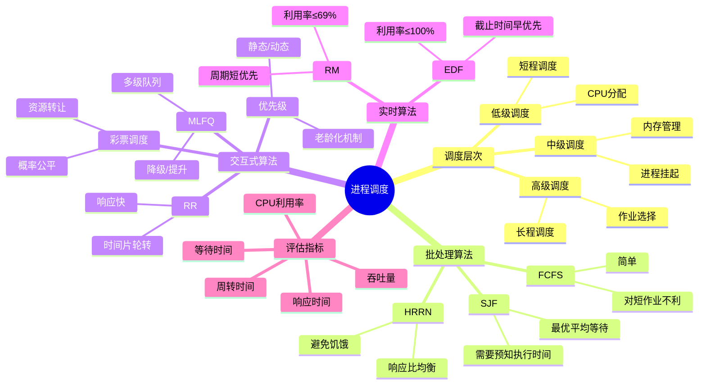

**核心要点**：

1. **调度层次**：高级调度（作业）、中级调度（挂起）、低级调度（CPU分配）

2. **批处理算法**：FCFS 简单但对短作业不利；SJF 最优但可能饥饿；HRRN 平衡两者

3. **交互式算法**：RR 适合通用分时系统；MLFQ 是最实用的方案，结合多级队列和反馈机制

4. **实时算法**：RM 静态优先级，适合硬实时；EDF 动态优先级，资源利用率更高

5. **调度准则**：吞吐量、周转时间、等待时间、响应时间、公平性

**进一步学习**：
- Linux CFS 调度器的红黑树实现
- Windows 调度器的动态优先级调整
- 多核调度与负载均衡
- 容器/虚拟化环境下的 CPU 调度
