# 第4章 同步与互斥

## 概述

在多道程序设计中，多个并发执行的进程或线程常常需要共享使用某些资源（如共享内存、打印机、数据库等）。当多个进程同时访问和操作同一份资源时，就会产生**竞态条件（Race Condition）**，导致数据不一致的问题。同步与互斥是操作系统解决竞态条件的核心技术。

本章将深入探讨：
- 临界区问题的定义与解决原则
- 硬件层面的同步机制
- 软件层面的同步原语（信号量、管程）
- 经典同步问题的解决方案

---

## 1. 临界区问题

### 1.1 临界区的定义

**临界区（Critical Section）** 是进程中访问共享资源的代码片段，在这段代码中，进程可能会修改共享变量、写入文件、修改打印机状态等。

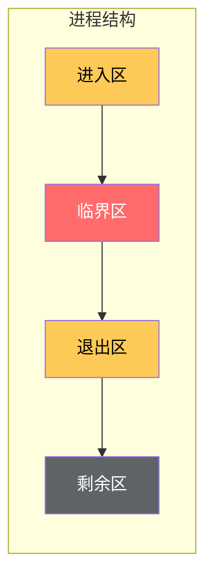

**临界区示意图**

- **进入区（Entry Section）**：获取访问临界资源的许可
- **临界区（Critical Section）**：实际访问共享资源的代码
- **退出区（Exit Section）**：释放访问许可
- **剩余区（Remainder Section）**：其余不访问共享资源的代码

### 1.2 互斥实现的四项要求

一个正确的临界区解决方案必须满足以下四项要求：

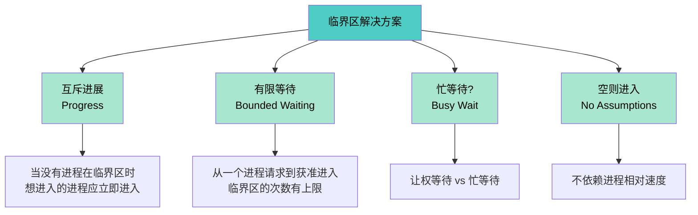

**1. 互斥（Mutual Exclusion）**
- 如果进程 P_i 正在其临界区内执行，则任何其他进程都不能在其临界区内执行

**2. 进展（Progress）**
- 当没有进程处于临界区时，如果某些进程想要进入临界区，那么只有那些不在剩余区的进程才能参与决策
- 最终只有一个进程进入临界区

**3. 有限等待（Bounded Waiting）**
- 从一个进程请求进入临界区，到该请求被批准之间，其他进程进入临界区的次数有上限
- 防止饥饿现象

**4. 无空则进入**
- 如果临界区空闲，且没有进程正在进入区，则请求进入的进程应立即进入
- 不应无限期等待

### 1.3 忙等待

**忙等待（Busy Waiting）** 是指进程在等待进入临界区时，持续不断地检查某个条件是否满足。

```c
// 忙等待示例 - 自旋锁
while (turn != my_process_id) {
    // 什么都不做，只是等待
}
```

#### 忙等待的优缺点

| 优点 | 缺点 |
|------|------|
| 实现简单 | 浪费CPU周期 |
| 无需上下文切换 | 可能导致优先级反转 |
| 适用于锁持有时间极短的场景 | 高并发下效率低 |

#### 让权等待 vs 忙等待

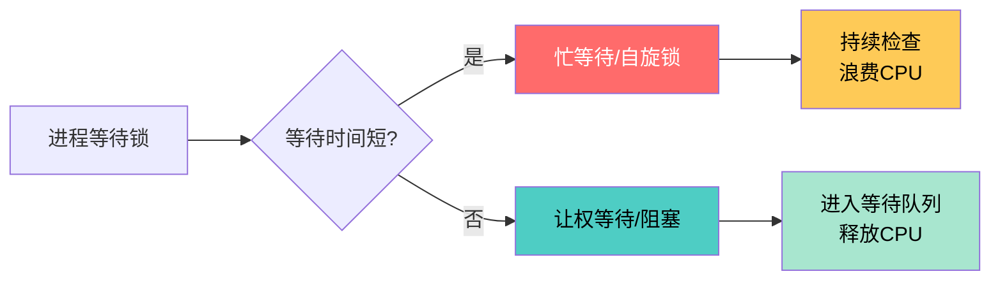

---

## 2. 硬件同步机制

### 2.1 中断禁用

最简单粗暴的同步方法是禁用中断：

```c
// 禁用中断实现互斥
void critical_section() {
    disable_interrupts();    // 关中断
    // 临界区代码
    enable_interrupts();     // 开中断
}
```

**问题与局限：**

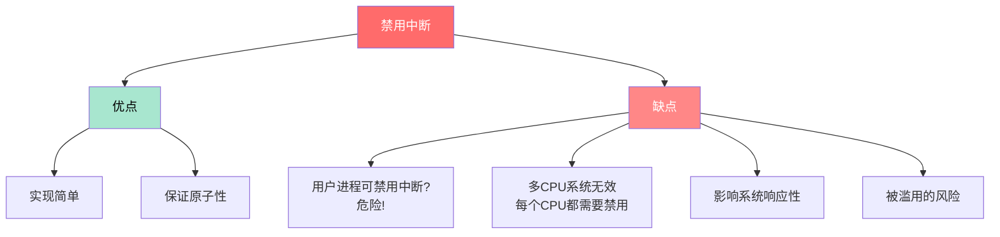

**结论**：中断禁用适用于操作系统内核代码，但不适用于用户进程。

### 2.2 原子指令

现代CPU提供专门的原子指令来解决同步问题。

#### 2.2.1 Test-and-Set (TSL)

Test-and-Set 指令原子地完成两件事：读取变量的值，并将变量设置为1。

```c
// 硬件层面的 TSL 指令
bool test_and_set(bool *target) {
    bool old = *target;  // 保存旧值
    *target = true;      // 设置为true
    return old;          // 返回旧值
}

// 使用 TSL 实现互斥
bool lock = false;

void process_A() {
    while (test_and_set(&lock)) {
        // 等待... 忙等待
    }
    // 临界区
    // ...
    lock = false;  // 释放锁
}

void process_B() {
    while (test_and_set(&lock)) {
        // 等待...
    }
    // 临界区
    // ...
    lock = false;
}
```

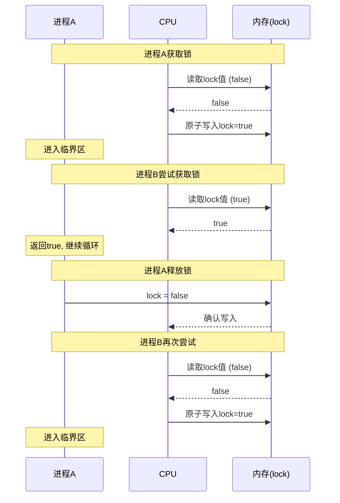

#### 2.2.2 Swap (XCHG)

Swap 指令原子地交换两个变量的值：

```c
// Swap 指令
void swap(bool *a, bool *b) {
    bool temp = *a;
    *a = *b;
    *b = temp;
}

// 使用 Swap 实现互斥
bool lock = false;

void process_A() {
    bool key = true;
    do {
        swap(&key, &lock);
    } while (key == true);
    // 临界区
    // ...
    lock = false;
}
```

#### 2.2.3 Compare-and-Swap (CAS)

CAS 是更强大的原子指令，只有当预期值与当前值相同时，才执行交换：

```c
// CAS 指令
int compare_and_swap(int *ptr, int expected, int new_value) {
    int actual = *ptr;
    if (actual == expected) {
        *ptr = new_value;
    }
    return actual;
}

// 使用 CAS 实现互斥锁
typedef struct {
    volatile int value;
} mutex_t;

void lock(mutex_t *m) {
    while (compare_and_swap(&m->value, 0, 1) != 0) {
        // 等待...
    }
}

void unlock(mutex_t *m) {
    m->value = 0;
}
```

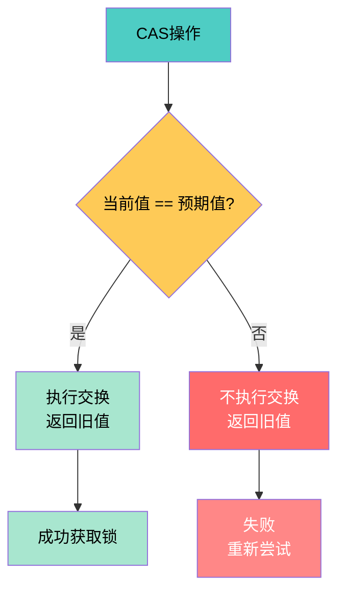

**CAS 的优势**：相比 TSL，CAS 允许更细粒度的控制，是现代无锁编程的基础。

### 2.3 内存屏障

**内存屏障（Memory Barrier）** 用于确保操作顺序，防止编译器/CPU 乱序执行。

```c
// 没有内存屏障 - 可能出问题
write_data();
ready = true;  // 编译器可能重排序

// 有内存屏障 - 保证顺序
write_data();
mfence();  // 内存屏障
ready = true;
```

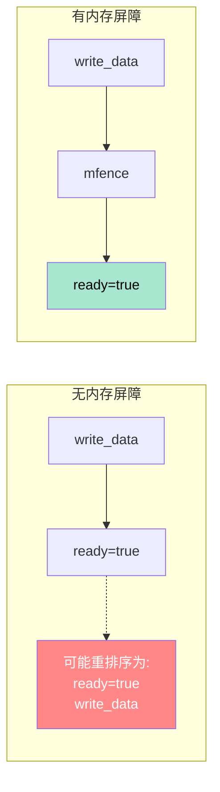

**内存屏障类型**：
- **Store Barrier**：确保屏障前的写操作先于屏障后的写操作完成
- **Load Barrier**：确保屏障后的读操作在屏障前的读操作之后执行
- **Full Barrier**：同时包含 Store 和 Load Barrier 的功能

---

## 3. 信号量 (Semaphore)

### 3.1 信号量的概念

**信号量（Semaphore）** 是 Dijkstra 于1965年提出的一种同步机制，使用两个原子操作 `P()` 和 `V()` 来实现进程的同步与互斥。

```mermaid
graph TD
    A[信号量] -->|定义| B[整型变量 S]
    A -->|特性| C[S >= 0|
    A -->|原子操作| D[P() / wait|
    A -->|原子操作| E[V() / signal]
    
    D --> D1[S = S - 1<br/>如果 S < 0<br/>则阻塞当前进程]
    E --> E1[S = S + 1<br/>如果 S <= 0<br/>则唤醒一个等待进程]
    
    style A fill:#4ecdc4,color:#000
    style B fill:#a8e6cf,color:#000
    style C fill:#feca57,color:#000
    style D fill:#ff6b6b,color:#fff
    style E fill:#54a0ff,color:#fff
```

### 3.2 计数信号量 vs 二值信号量

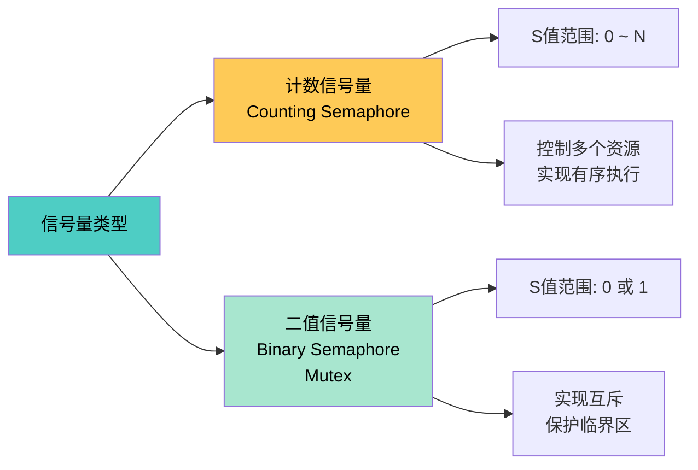

### 3.3 P/V 操作详解

```c
// P 操作 (Proberen - 荷兰语"测试")
void P(Semaphore *s) {
    s->value--;
    if (s->value < 0) {
        // 阻塞当前进程
        add_to_wait_queue(current_process);
        block(current_process);
    }
}

// V 操作 (Verhogen - 荷兰语"增加")
void V(Semaphore *s) {
    s->value++;
    if (s->value <= 0) {
        // 唤醒一个等待进程
        Process *p = remove_from_wait_queue();
        wakeup(p);
    }
}
```

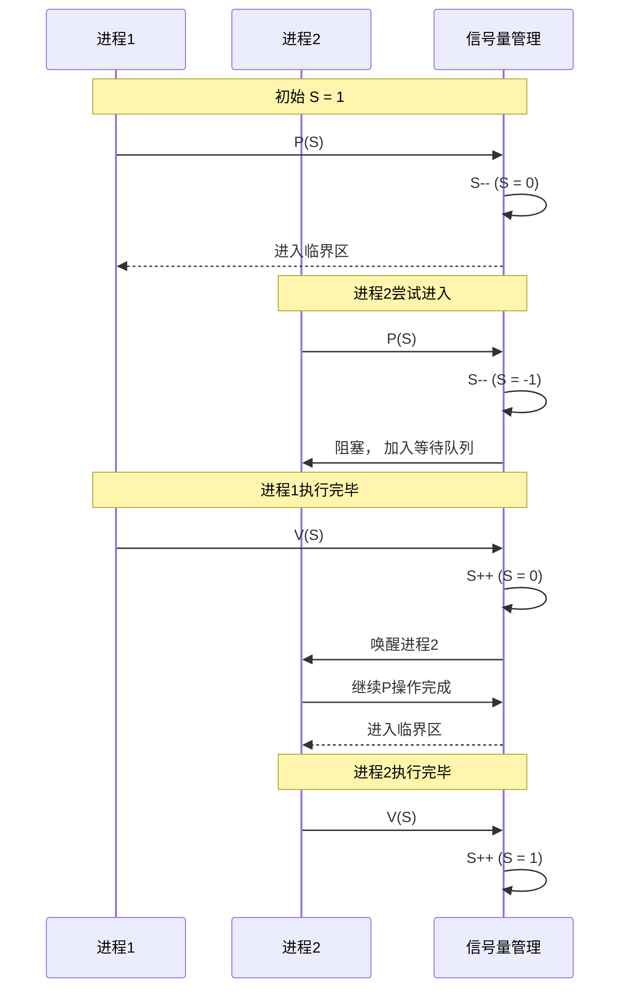

### 3.4 信号量的实现

```c
#include <stdatomic.h>
#include <pthread.h>
#include <stdio.h>
#include <unistd.h>

typedef struct {
    atomic_int value;
    pthread_mutex_t mutex;  // 保护等待队列
    pthread_cond_t cond;     // 条件变量
} semaphore_t;

// 信号量初始化
void sem_init(semaphore_t *s, int value) {
    atomic_store(&s->value, value);
    pthread_mutex_init(&s->mutex, NULL);
    pthread_cond_init(&s->cond, NULL);
}

// P 操作 (wait)
void sem_wait(semaphore_t *s) {
    // 使用原子操作保证检查-修改的原子性
    while (atomic_fetch_sub(&s->value, 1) <= 0) {
        // 如果值小于等于0，需要加回1并等待
        atomic_fetch_add(&s->value, 1);
        
        pthread_mutex_lock(&s->mutex);
        pthread_cond_wait(&s->cond, &s->mutex);
        pthread_mutex_unlock(&s->mutex);
    }
}

// V 操作 (signal)
void sem_signal(semaphore_t *s) {
    int old = atomic_fetch_add(&s->value, 1);
    if (old < 0) {
        // 有等待者，唤醒一个
        pthread_mutex_lock(&s->mutex);
        pthread_cond_signal(&s->cond);
        pthread_mutex_unlock(&s->mutex);
    }
}

// 销毁信号量
void sem_destroy(semaphore_t *s) {
    pthread_mutex_destroy(&s->mutex);
    pthread_cond_destroy(&s->cond);
}
```

**使用示例 - 互斥锁**：

```c
semaphore_t mutex;
int shared_data = 0;

void* worker(void* arg) {
    for (int i = 0; i < 100000; i++) {
        sem_wait(&mutex);      // P 操作
        shared_data++;         // 临界区
        sem_signal(&mutex);    // V 操作
    }
    return NULL;
}

int main() {
    pthread_t t1, t2;
    
    sem_init(&mutex, 1);  // 二值信号量初始化为1
    
    pthread_create(&t1, NULL, worker, NULL);
    pthread_create(&t2, NULL, worker, NULL);
    
    pthread_join(t1, NULL);
    pthread_join(t2, NULL);
    
    printf("shared_data = %d\n", shared_data);
    sem_destroy(&mutex);
    
    return 0;
}
```

---

## 4. 经典同步问题

### 4.1 生产者-消费者问题

**问题描述**：
- 生产者进程生成数据，消费者进程消费数据
- 两者共享一个有限缓冲区
- 需要保证：当缓冲区满时生产者阻塞，当缓冲区空时消费者阻塞

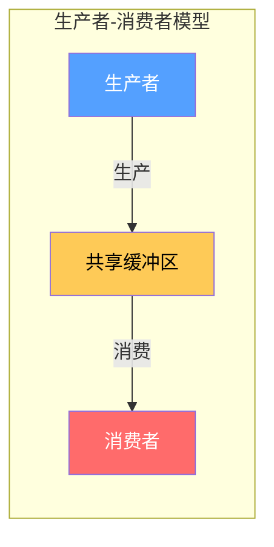

**问题分析**：

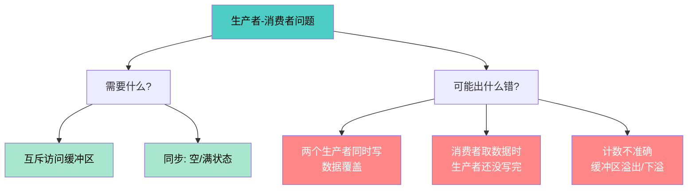

**解决方案 - 使用信号量**：

```c
#include <stdio.h>
#include <stdlib.h>
#include <pthread.h>
#include <unistd.h>

#define BUFFER_SIZE 5
#define NUM_ITEMS 20

// 缓冲区
int buffer[BUFFER_SIZE];
int in = 0;  // 生产位置
int out = 0; // 消费位置

// 信号量
semaphore_t mutex = {1};      // 互斥信号量，保护缓冲区
semaphore_t empty = BUFFER_SIZE; // 空槽数量
semaphore_t full = 0;          // 满槽数量

void* producer(void* arg) {
    int id = *(int*)arg;
    
    for (int i = 0; i < NUM_ITEMS; i++) {
        int item = i + 100;  // 生产的物品
        
        sem_wait(&empty);    // 等待空槽 (P操作)
        sem_wait(&mutex);    // 进入临界区 (P操作)
        
        // 生产者临界区
        buffer[in] = item;
        printf("生产者 %d 生产: %d (放入位置 %d)\n", id, item, in);
        in = (in + 1) % BUFFER_SIZE;
        
        sem_signal(&mutex);  // 离开临界区 (V操作)
        sem_signal(&full);   // 增加满槽计数 (V操作)
        
        sleep(1);  // 模拟生产时间
    }
    return NULL;
}

void* consumer(void* arg) {
    int id = *(int*)arg;
    
    for (int i = 0; i < NUM_ITEMS; i++) {
        sem_wait(&full);     // 等待满槽 (P操作)
        sem_wait(&mutex);    // 进入临界区 (P操作)
        
        // 消费者临界区
        int item = buffer[out];
        printf("消费者 %d 消费: %d (从位置 %d)\n", id, item, out);
        out = (out + 1) % BUFFER_SIZE;
        
        sem_signal(&mutex);  // 离开临界区 (V操作)
        sem_signal(&empty);  // 增加空槽计数 (V操作)
        
        sleep(2);  // 模拟消费时间
    }
    return NULL;
}

int main() {
    pthread_t p1, p2, c1, c2;
    int pid1 = 1, pid2 = 2, cid1 = 1, cid2 = 2;
    
    // 初始化信号量
    sem_init(&mutex, 1);
    sem_init(&empty, BUFFER_SIZE);
    sem_init(&full, 0);
    
    // 创建线程
    pthread_create(&p1, NULL, producer, &pid1);
    pthread_create(&c1, NULL, consumer, &cid1);
    
    // 等待完成
    pthread_join(p1, NULL);
    pthread_join(c1, NULL);
    
    printf("主线程: 生产者-消费者问题演示完成\n");
    
    sem_destroy(&mutex);
    sem_destroy(&empty);
    sem_destroy(&full);
    
    return 0;
}
```

**工作流程图**：

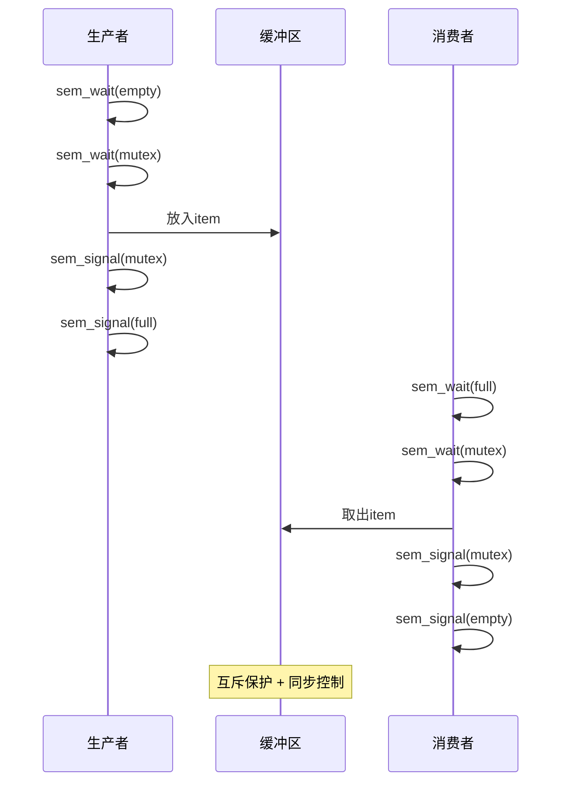

### 4.2 哲学家就餐问题

**问题描述**：5位哲学家围坐圆桌，每位哲学家需要两把叉子才能吃饭。

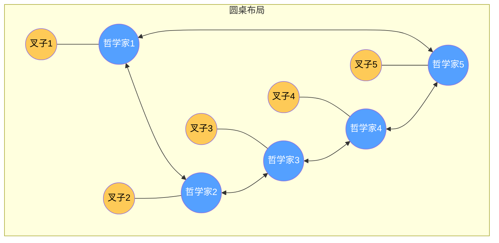

**问题分析**：

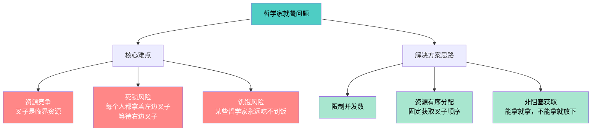

**方案一：限制同时就餐人数**

```c
#define N 5
semaphore_t room = {4};      // 最多4个人同时进餐
semaphore_t forks[N];         // 每个叉子一个信号量

void philosopher(int i) {
    while (1) {
        think();
        
        sem_wait(&room);           // 确保不超过4人同时就餐
        sem_wait(&forks[i]);      // 拿左叉子
        sem_wait(&forks[(i+1)%N]); // 拿右叉子
        
        eat();
        
        sem_signal(&forks[i]);     // 放下左叉子
        sem_signal(&forks[(i+1)%N]); // 放下右叉子
        sem_signal(&room);         // 离开
    }
}
```

**方案二：资源有序分配（避免死锁）**

```c
// 关键改进：总是先拿编号小的叉子，再拿编号大的
void philosopher(int i) {
    int left = i;
    int right = (i + 1) % N;
    
    // 确保 left < right (固定顺序)
    if (left > right) {
        int temp = left;
        left = right;
        right = temp;
    }
    
    while (1) {
        think();
        
        sem_wait(&forks[left]);   // 先拿编号小的
        sem_wait(&forks[right]);  // 再拿编号大的
        
        eat();
        
        sem_signal(&forks[right]); // 先放编号大的
        sem_signal(&forks[left]);  // 再放编号小的
    }
}
```

**方案三：非阻塞方式（描述性实现）**

```c
// 使用原子指令尝试获取叉子
void philosopher(int i) {
    while (1) {
        think();
        
        // 尝试获取叉子（非阻塞）
        while (!try_get_left_fork(i)) {
            // 拿不到就放下，继续思考
            think();
        }
        
        if (!try_get_right_fork(i)) {
            // 拿不到右叉子，放下左叉子
            put_down_left_fork(i);
            continue;  // 重新尝试
        }
        
        eat();
        put_down_both_forks(i);
    }
}
```

### 4.3 读者-写者问题

**问题描述**：
- 读者：只读取数据，可以多个读者同时访问
- 写者：写入数据，独占访问（互斥）

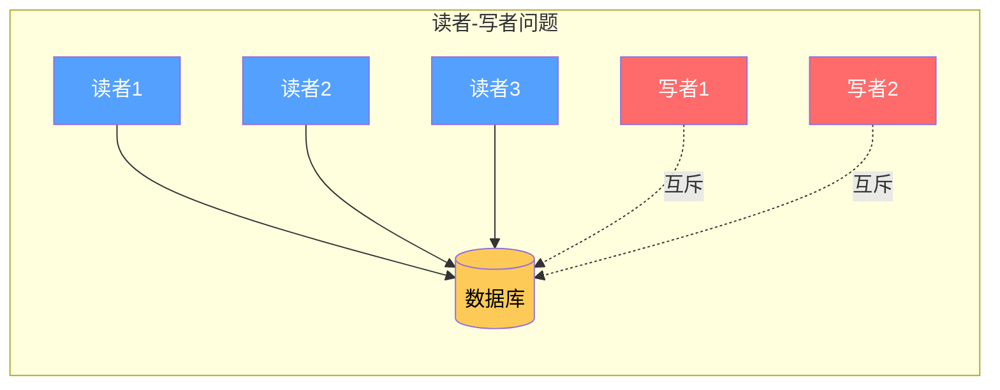

**问题约束**：

| 规则 | 读者优先 | 写者优先 |
|------|----------|----------|
| 并发读 | 允许 | 允许 |
| 写时读 | 允许 | 禁止 |
| 写时写 | 禁止 | 禁止 |

**读者优先解法**：

```c
#include <pthread.h>
#include <stdio.h>

// 共享数据
int shared_data = 0;
int read_count = 0;  // 当前读者数量

// 信号量
semaphore_t mutex = {1};    // 保护 read_count
semaphore_t db = {1};       // 保护数据库

void* reader(void* arg) {
    int id = *(int*)arg;
    
    while (1) {
        // 读者逻辑
        sem_wait(&mutex);           // 保护 read_count
        read_count++;
        if (read_count == 1) {
            // 第一个读者，锁定数据库
            sem_wait(&db);
        }
        sem_signal(&mutex);
        
        // 读取共享数据（读者临界区）
        printf("读者 %d 读取: %d (当前读者数: %d)\n", 
               id, shared_data, read_count);
        
        sem_wait(&mutex);           // 保护 read_count
        read_count--;
        if (read_count == 0) {
            // 最后一个读者，释放数据库
            sem_signal(&db);
        }
        sem_signal(&mutex);
        
        sleep(1);
    }
    return NULL;
}

void* writer(void* arg) {
    int id = *(int*)arg;
    
    while (1) {
        sem_wait(&db);              // 写者互斥访问
        
        // 写入共享数据（写者临界区）
        shared_data++;
        printf("写者 %d 写入: %d\n", id, shared_data);
        
        sem_signal(&db);
        
        sleep(2);
    }
    return NULL;
}

int main() {
    pthread_t r1, r2, r3, w1, w2;
    int ids[] = {1, 2, 3};
    
    sem_init(&mutex, 1);
    sem_init(&db, 1);
    
    pthread_create(&r1, NULL, reader, &ids[0]);
    pthread_create(&r2, NULL, reader, &ids[1]);
    pthread_create(&r3, NULL, reader, &ids[2]);
    pthread_create(&w1, NULL, writer, &ids[0]);
    pthread_create(&w2, NULL, writer, &ids[1]);
    
    sleep(20);  // 运行一段时间后退出
    
    return 0;
}
```

**读者优先的问题**：可能导致写者饥饿

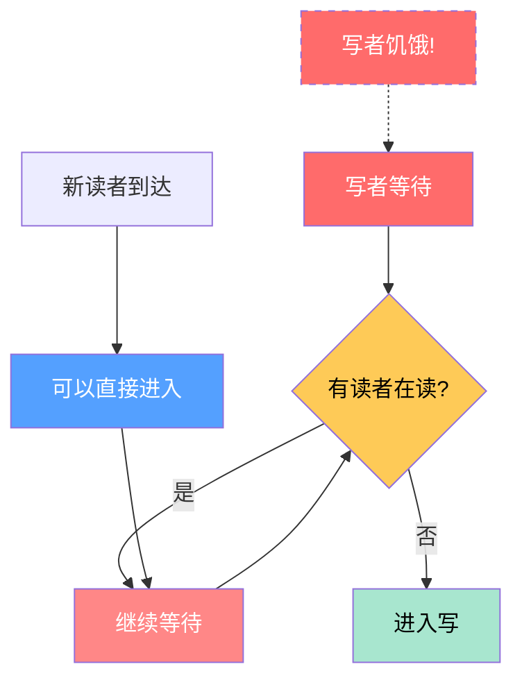

### 4.4 睡眠的理发师问题

**问题描述**：
- 理发店有一把理发椅和N把等候椅
- 没顾客时理发师睡觉
- 顾客来时叫醒理发师

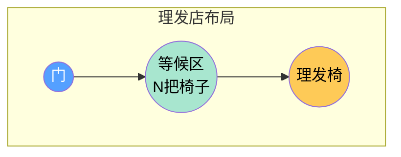

**解决方案**：

```c
#include <pthread.h>
#include <stdio.h>
#include <unistd.h>

#define CHAIRS 5  // 等候椅数量

// 状态变量
int waiting = 0;  // 等待的顾客数

// 信号量
semaphore_t customers = {0};  // 顾客信号量（理发师等待顾客）
semaphore_t barbers = {0};    // 理发师信号量（顾客等待理发师）
semaphore_t mutex = {1};      // 保护 waiting 变量

void* barber(void* arg) {
    while (1) {
        // 理发师等待顾客
        sem_wait(&customers);    // P - 等待顾客
        
        // 临界区
        sem_wait(&mutex);
        waiting--;               // 顾客坐下
        sem_signal(&barbers);     // 叫醒顾客
        sem_signal(&mutex);
        
        // 开始理发（临界区外）
        printf("理发师: 开始理发... (等待人数: %d)\n", waiting);
        sleep(3);  // 理发
        printf("理发师: 理发完成\n");
    }
    return NULL;
}

void* customer(void* arg) {
    int id = *(int*)arg;
    
    sem_wait(&mutex);  // 检查等候区
    
    if (waiting < CHAIRS) {
        // 有空位
        waiting++;
        printf("顾客 %d: 坐下等待 (等待人数: %d)\n", id, waiting);
        
        sem_signal(&customers);  // V - 通知理发师有顾客
        sem_signal(&mutex);      // 释放互斥锁
        
        sem_wait(&barbers);      // P - 等待理发师叫醒
        printf("顾客 %d: 开始理发\n", id);
    } else {
        // 没空位，离开
        printf("顾客 %d: 等候区满，离开\n", id);
        sem_signal(&mutex);
    }
    
    return NULL;
}

int main() {
    pthread_t b;
    pthread_t customers_t[10];
    int ids[10];
    
    // 初始化
    sem_init(&customers, 0);
    sem_init(&barbers, 0);
    sem_init(&mutex, 1);
    
    // 创建理发师线程
    pthread_create(&b, NULL, barber, NULL);
    
    // 创建顾客线程（模拟随机到达）
    for (int i = 0; i < 10; i++) {
        ids[i] = i + 1;
        pthread_create(&customers_t[i], NULL, customer, &ids[i]);
        sleep(1);  // 每秒来一个顾客
    }
    
    sleep(30);
    printf("演示结束\n");
    
    return 0;
}
```

**工作流程图**：

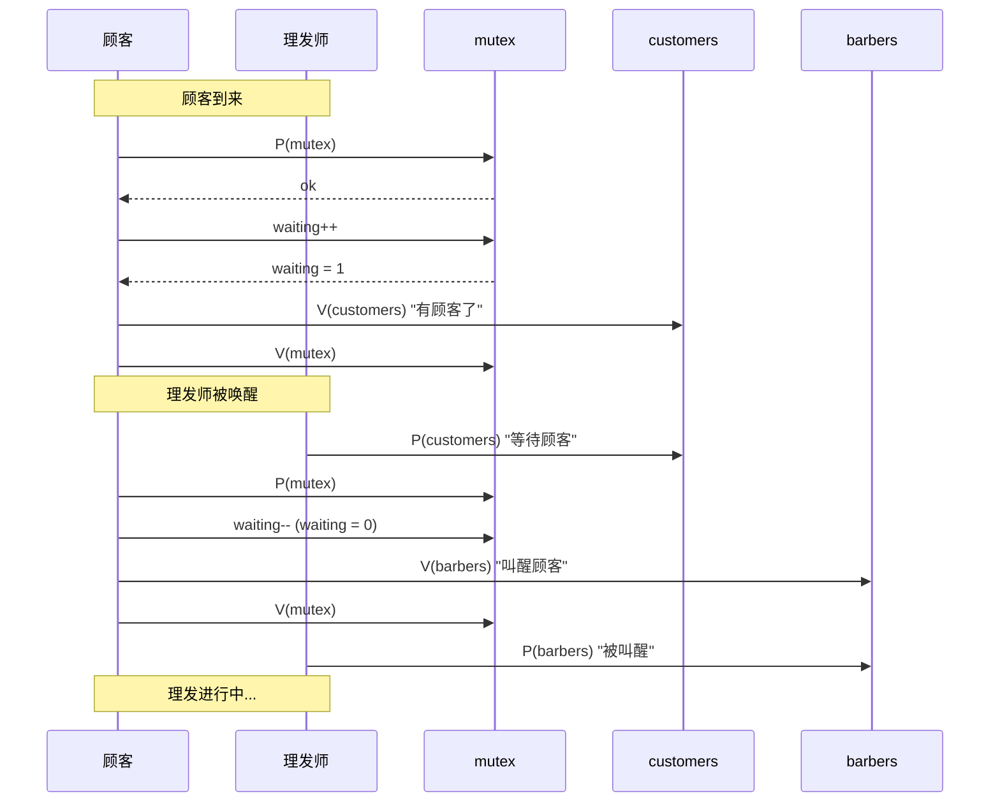

---

## 5. 管程 (Monitor)

### 5.1 管程的概念

**管程（Monitor）** 是一种高级同步结构，将共享资源和对共享资源的操作封装在一个模块中。

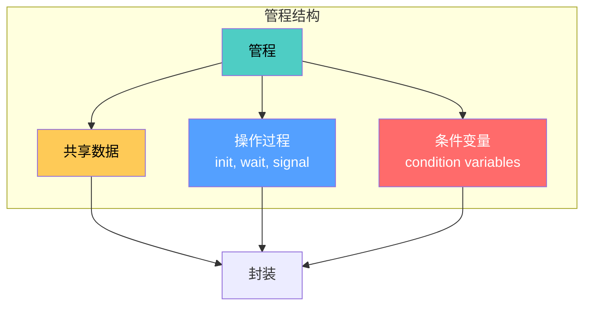

**管程的特性****：
- 同一时刻只有一个进程可以在管程内执行
- 条件变量用于进程同步
- 封装了同步逻辑，简化并发编程

### 5.2 管程的实现

**伪代码实现框架**：

```c
// 管程定义
monitor Resource {
    // 共享变量
    int condition = 0;
    
    // 条件变量
    condition not_full;
    condition not_empty;
    
    // 初始化
    init() {
        // 初始化代码
    }
    
    // 操作方法
    operation_A() {
        // 进入管程（自动互斥）
        if (condition == X) {
            wait(not_full);  // 等待
        }
        // 操作...
        signal(not_empty);   // 唤醒
    }
    
    operation_B() {
        // 进入管程
        if (condition == Y) {
            wait(not_empty);
        }
        // 操作...
        signal(not_full);
    }
}
```

**条件变量的 wait 和 signal**：

| 操作 | 含义 |
|------|------|
| `wait(c)` | 阻塞当前进程，将其加入条件变量 c 的等待队列 |
| `signal(c)` | 如果 c 的等待队列非空，唤醒一个进程 |

```mermaid
graph LR
    subgraph 条件变量操作
        A[进程在管程中] --> B{条件不满足?}
        B -->|是| C[wait c]
        C --> D[阻塞<br/>释放管程锁]
        D --> E[被唤醒]
        E --> A
        
        B -->|否| F[执行操作]
        F --> G[signal c]
    end
    
    style C fill:#ff6b6b,color:#fff
    style D fill:#feca57,color:#000
    style G fill:#a8e6cf,color:#000
```

### 5.3 管程解决生产者-消费者问题

```c
// 生产者-消费者问题的管程实现
monitor ProducerConsumer {
    int buffer[BUFFER_SIZE];
    int count = 0;      // 缓冲区中数据个数
    int in = 0;         // 放入位置
    int out = 0;        // 取出位置
    
    condition not_full;   // 缓冲区不满
    condition not_empty;  // 缓冲区不空
    
    // 生产操作
    procedure deposit(int item) {
        if (count == BUFFER_SIZE) {
            wait(not_full);  // 缓冲区满，等待
        }
        
        buffer[in] = item;
        in = (in + 1) % BUFFER_SIZE;
        count++;
        
        signal(not_empty);  // 唤醒等待的消费者
    }
    
    // 消费操作
    procedure fetch() {
        if (count == 0) {
            wait(not_empty);  // 缓冲区空，等待
        }
        
        int item = buffer[out];
        out = (out + 1) % BUFFER_SIZE;
        count--;
        
        signal(not_full);  // 唤醒等待的生产者
        
        return item;
    }
}
```

**管程 vs 信号量**：

| 特性 | 管程 | 信号量 |
|------|------|--------|
| 并发性 | 同一时刻一个进程 | 可配置（计数信号量） |
| 复杂度 | 低（封装好） | 中（需要手动P/V） |
| 表达力 | 强（条件变量） | 中（需要额外变量） |
| 易错性 | 低 | 高（可能死锁） |

### 5.4 Hoare 语义 vs Mesa 语义

```mermaid
graph TD
    %% 全局设置左对齐，让多行文字排版更整齐
    classDef default text-align:left;

    A[signal 语义] --> B["Hoare 语义<br/>(立即切换)"]
    A --> C["Mesa 语义<br/>(延迟切换)"]
    
    B --> B1[signal 后<br/>被唤醒进程立即运行]
    B --> B2[当前进程挂起]
    B --> B3[实现简单<br/>但需要额外唤醒机制]
    
    C --> C1[signal 后<br/>被唤醒进程进入就绪队列]
    C --> C2[当前进程继续运行]
    C --> C3[更常用<br/>需要用 while 循环重新检查条件]
    
    style A fill:#4ecdc4,color:#000
    style B fill:#feca57,color:#000
    style C fill:#a8e6cf,color:#000
```

**Mesa 语义的改进**（更常用）：

```c
// 使用 while 循环代替 if（防止虚假唤醒）
procedure deposit(int item) {
    while (count == BUFFER_SIZE) {
        wait(not_full);  // Mesa 语义：while 循环
    }
    // ...
}

procedure fetch() {
    while (count == 0) {
        wait(not_empty);
    }
    // ...
}
```

---

## 6. 总结

### 同步原语对比

```mermaid
graph TD
    A[同步机制] --> B[硬件层面]
    A --> C[软件层面]
    
    B --> B1[中断禁用]
    B --> B2[原子指令<br/>TSL, CAS, Swap]
    B --> B3[内存屏障]
    
    C --> C1[信号量]
    C --> C2[管程]
    C --> C3[消息传递]
    
    B1 --> B1a[仅内核用]
    B2 --> B2a[构建锁的基础]
    B3 --> B3a[防止重排序]
    
    C1 --> C1a[通用]
    C2 --> C2a[封装更好]
    C3 --> C3a[分布式系统]
    
    style A fill:#4ecdc4,color:#000
    style B fill:#54a0ff,color:#fff
    style C fill:#ff6b6b,color:#fff
```

### 选择原则

| 场景 | 推荐方案 |
|------|----------|
| 简单互斥 | 自旋锁 或 互斥锁 |
| 计数资源 | 信号量 |
| 复杂同步 | 管程 |
| 多CPU同步 | CAS + 内存屏障 |
| 实时系统 | 优先级继承的锁 |

### 常见问题与避免

```mermaid
graph TD
    A[并发问题] --> B[死锁]
    A --> C[活锁]
    A --> D[饥饿]
    A --> E[优先级反转]
    
    B --> B1[互斥 + 占有等待<br/>+ 非抢占 + 循环等待]
    B1 --> B2[打破任一条件<br/>避免循环等待顺序]
    
    C --> C1[持续检测但无法推进]
    %% 修复点：给 C2 补上缺失的右中括号 ]
    C1 --> C2[随机退避<br/>改进算法]
    
    D --> D3[某些进程永远得不到CPU]
    D3 --> D4[公平调度<br/>优先级继承]
    
    E --> E1[低优先级持有锁<br/>被高优先级抢占]
    E1 --> E2[优先级继承协议]
    
    style A fill:#4ecdc4,color:#000
    style B fill:#ff6b6b,color:#fff
    style C fill:#feca57,color:#000
    style D fill:#ff8787,color:#fff
    style E fill:#ff8787,color:#fff
```

---

## 参考文献

1. Silberschatz, A., Galvin, P. B., & Gagne, G. (2018). *Operating System Concepts* (10th ed.). Wiley.
2. Tanenbaum, A. S., & Bos, H. (2014). *Modern Operating Systems* (4th ed.). Pearson.
3. Dijkstra, E. W. (1965). Cooperating sequential processes. *Programming Languages*.
4. Hoare, C. A. R. (1974). Monitors: an operating system structuring concept. *Communications of the ACM*.

---

*本章完*
