# 第5章 死锁

## 5.1 死锁的概念

### 5.1.1 死锁的定义

死锁（Deadlock）是指两个或两个以上的进程在执行过程中，因争夺资源而造成的一种互相等待的现象，若无外力干预，这些进程将无法继续执行下去。

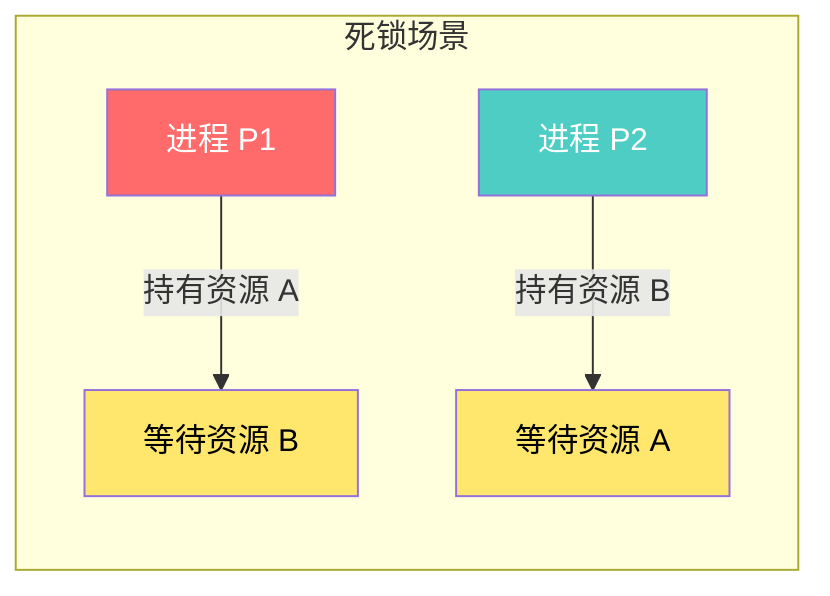

在操作系统中，死锁是一种严重的系统故障。当死锁发生时：
- 进程永远无法完成
- 系统资源被占用无法释放
- 严重时可能导致系统整体瘫痪

### 5.1.2 活锁 vs 死锁 vs 饥饿

这三个概念都涉及进程无法正常执行，但有本质区别：

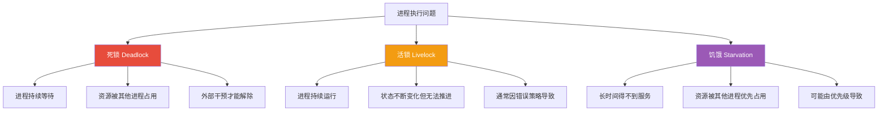

**死锁与活锁的核心区别**：

| 特征 | 死锁 | 活锁 |
|------|------|------|
| 进程状态 | 阻塞、等待 | 运行、活跃 |
| CPU消耗 | 不消耗或少量消耗 | 持续消耗 |
| 资源状态 | 资源被占用 | 资源未被长期占用 |
| 解除方式 | 需要外力干预 | 可能自动恢复 |

**活锁示例**：

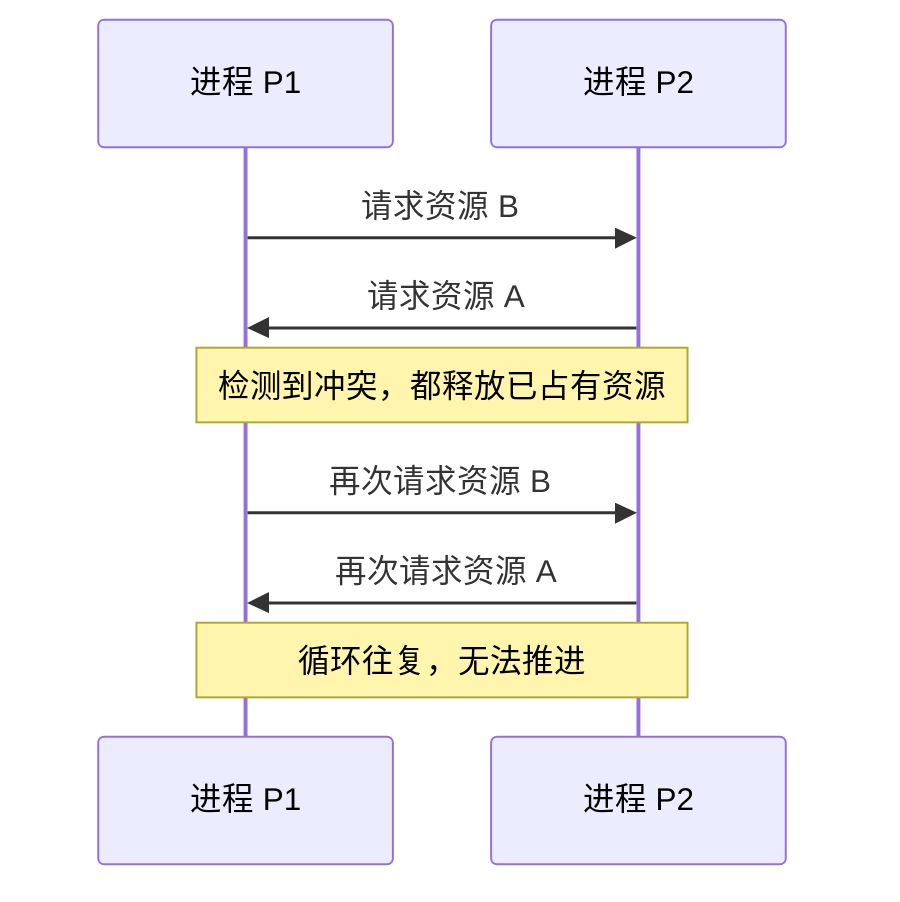

两个礼让的进程互相让路给对方，结果两人都无法通过路口，这就是活锁的典型体现。

### 5.1.3 饥饿

饥饿（Starvation）是指系统对进程分配资源的不公平策略，导致某些进程长时间无法获得所需资源而无法执行。

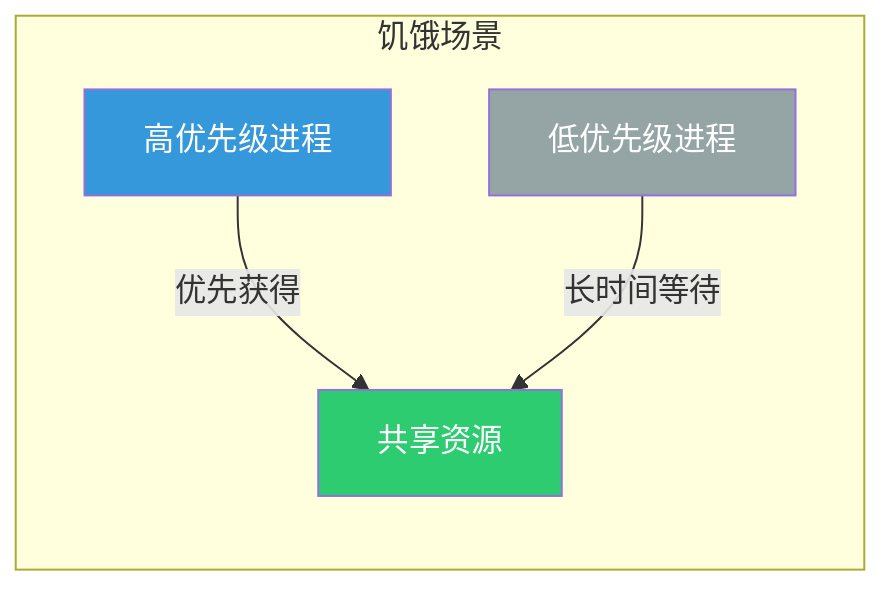

**饥饿的典型场景**：
- 打印机队列管理：长文档始终被短文档插队
- CPU调度：低优先级进程永远无法获得CPU时间
- 银行柜员服务：高净值客户永远被优先服务

---

## 5.2 死锁的原因

### 5.2.1 竞争不可抢占资源

不可抢占资源（Non-preemptible Resource）是指一旦被分配给进程，在进程主动释放前，系统无法强行夺走的资源。

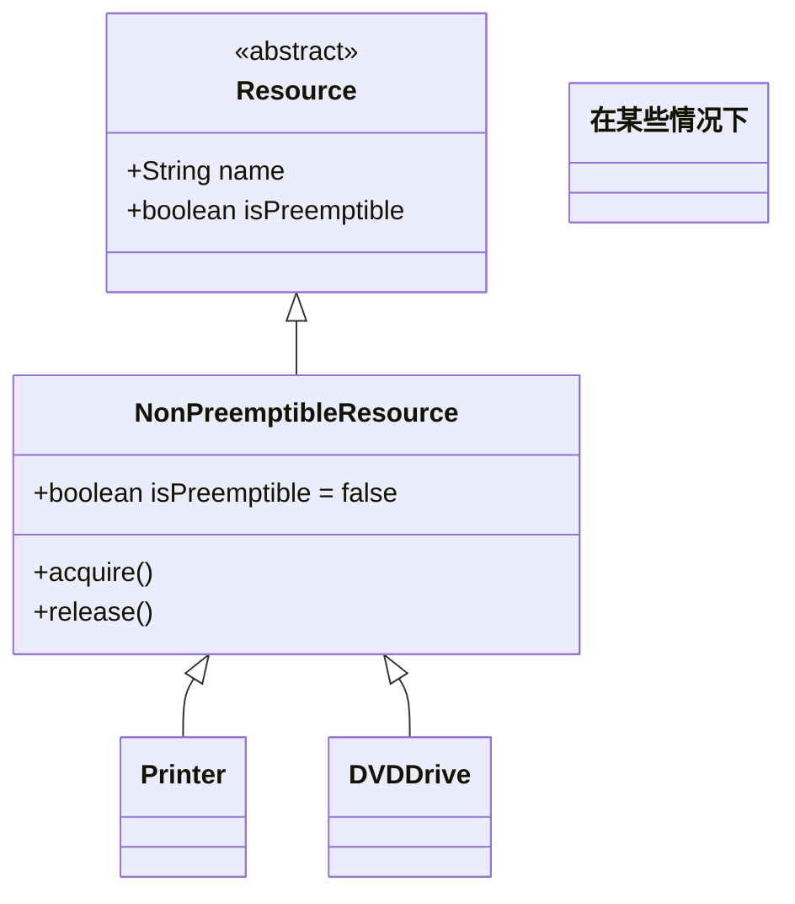

**经典死锁场景 - 竞争打印机和磁带机**：

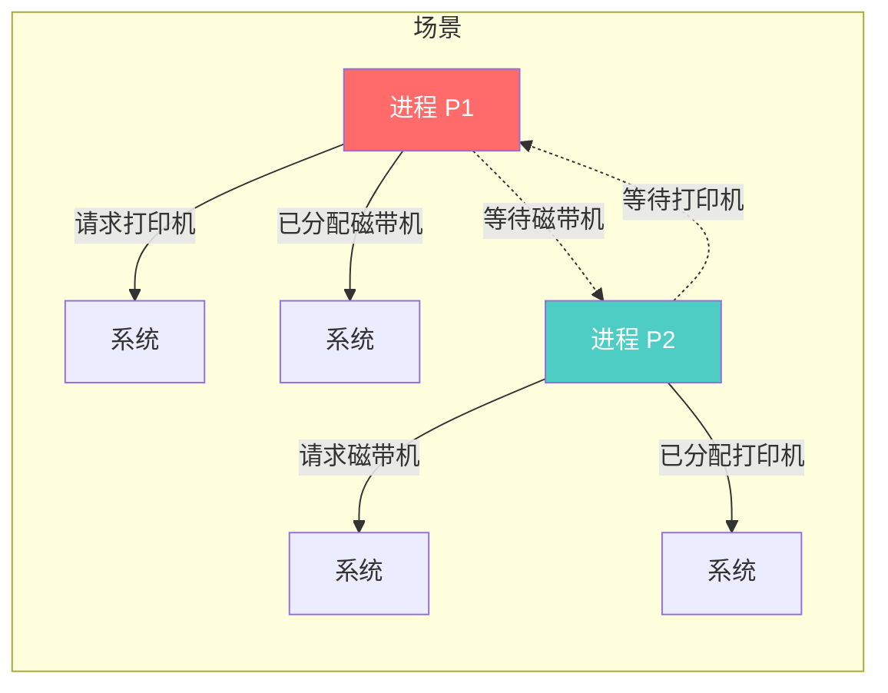

### 5.2.2 竞争可消耗资源

可消耗资源（Consumable Resource）是指在进程使用过程中会被消耗的资源，如信号量、消息、缓冲区的空位等。

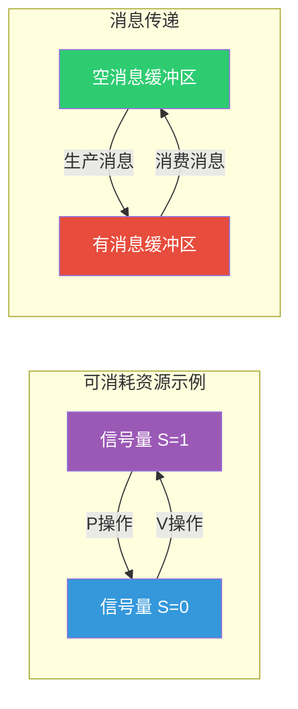

**可消耗资源死锁场景 - 消息缓冲区死锁**：

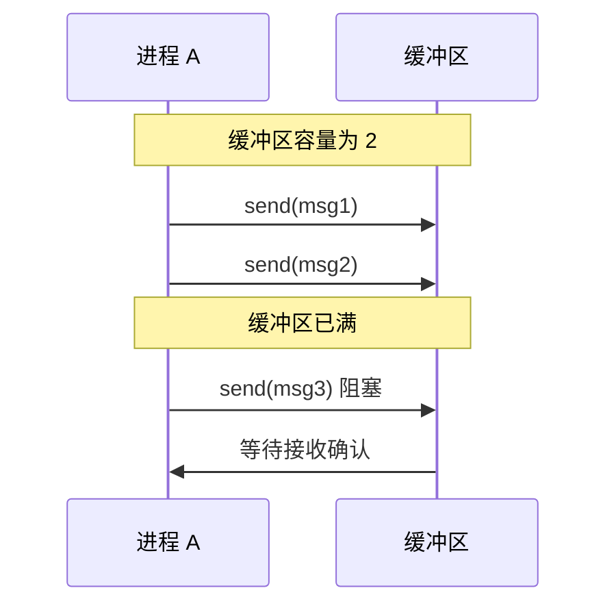

### 5.2.3 进程推进顺序不当

进程对资源的请求和释放顺序如果不合理，即使资源充足也可能导致死锁。

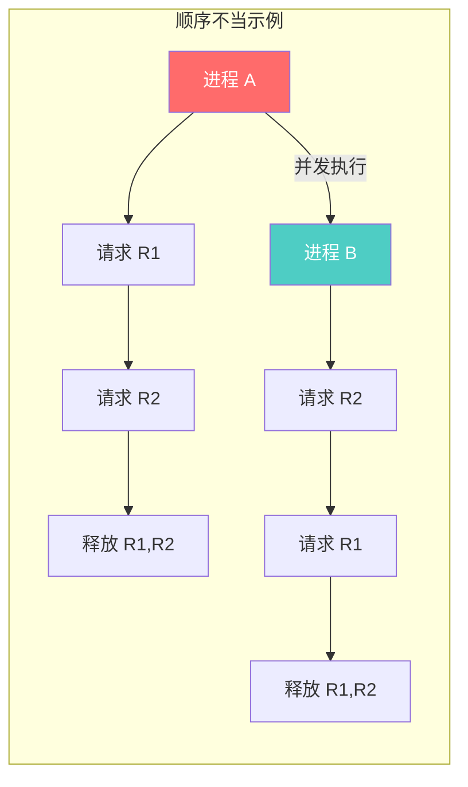

---

## 5.3 死锁的必要条件

死锁的发生必须同时满足以下四个必要条件（Coffman 条件）：

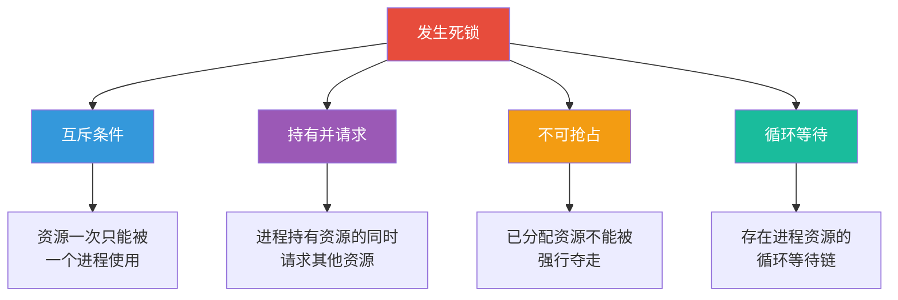

### 5.3.1 互斥条件（Mutual Exclusion）

某个资源在同一时刻只能被一个进程使用。

```
资源类型          是否互斥
─────────────    ───────
CPU、内存         否（可共享）
打印机            是
磁带机            是
写入的文件        是
只读的文件        否
```

### 5.3.2 持有并请求条件（Hold and Wait）

进程在持有至少一个资源的同时，还在请求其他被占用的资源。


### 5.3.3 不可抢占条件（No Preemption）

进程已分配的资源在进程主动释放前，不能被其他进程强行夺走。


### 5.3.4 循环等待条件（Circular Wait）

存在一个进程资源的循环等待链，每个进程都在等待链中下一个进程所持有的资源。

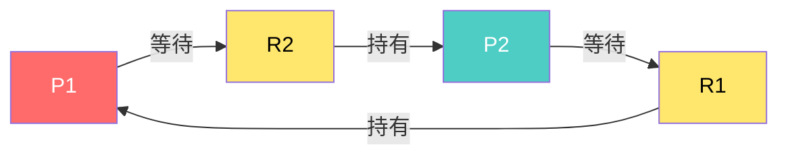

---

## 5.4 资源分配图

资源分配图（Resource Allocation Graph, RAG）是用于分析死锁的经典工具。

### 5.4.1 资源类型和实例

资源类型表示一类资源，实例表示该类资源的具体数量。

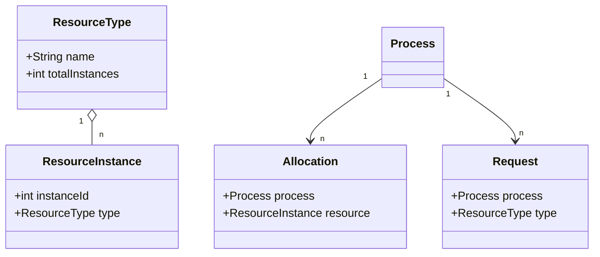

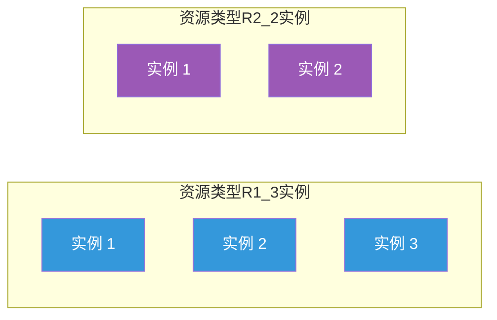

### 5.4.2 进程和资源的表示

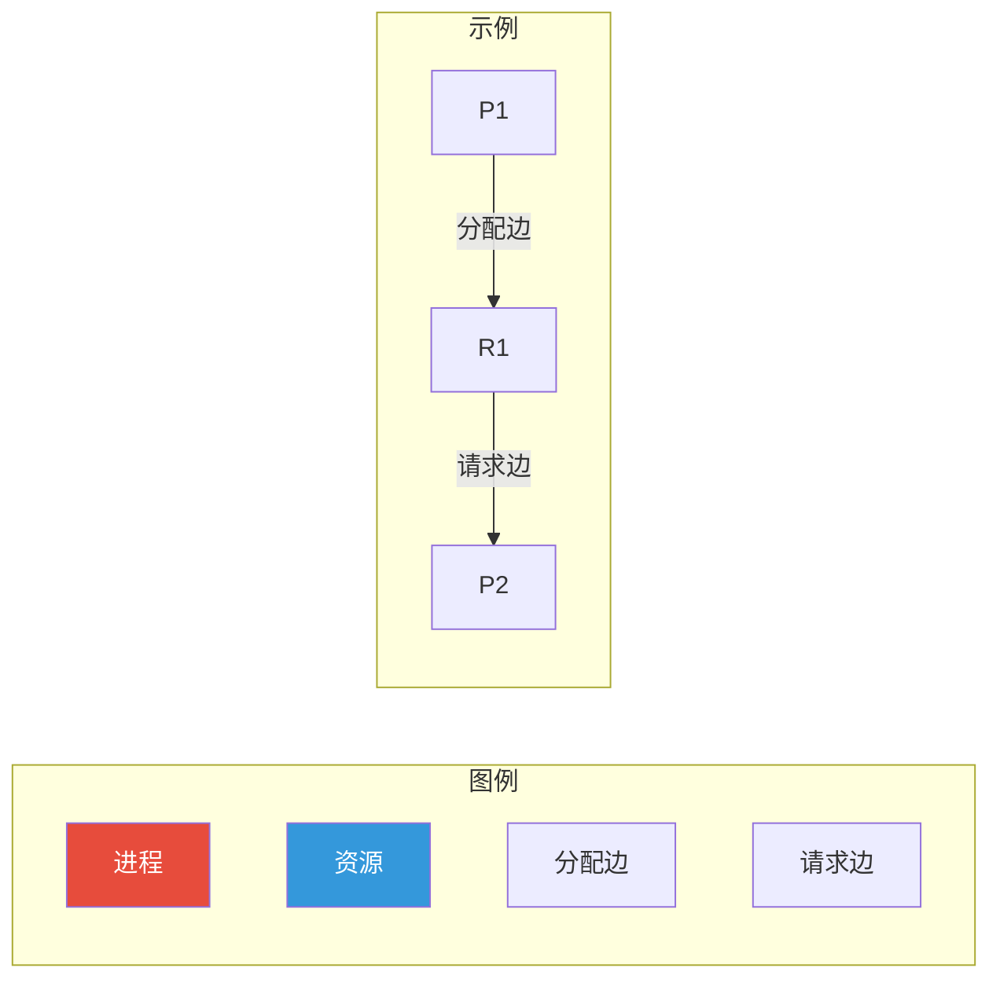

### 5.4.3 环路检测

资源分配图中的环与死锁的关系：

| 图中情况 | 死锁判定 |
|----------|----------|
| 无环 | 一定无死锁 |
| 有环且每个资源类只有一个实例 | 必定死锁 |
| 有环但资源类有多个实例 | 可能死锁，需进一步分析 |

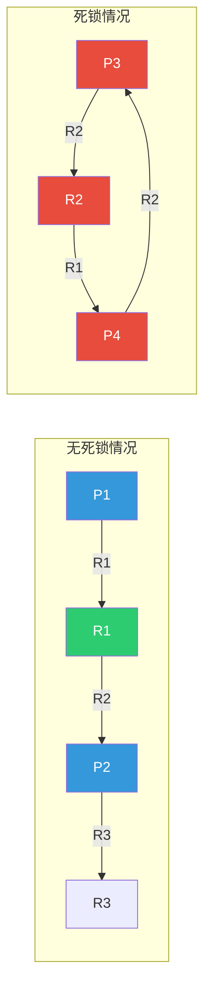

**资源分配图死锁检测算法（DFS环检测）**：

```python
"""
资源分配图环检测算法
时间复杂度: O(V + E)，其中 V 是节点数，E 是边数
"""

from collections import defaultdict

class ResourceAllocationGraph:
    def __init__(self):
        # 邻接表: 存储图的边
        self.graph = defaultdict(list)
        # 所有节点
        self.nodes = set()
        # 请求边集合
        self.request_edges = set()
        # 分配边集合
        self.allocation_edges = set()
    
    def add_process(self, process):
        """添加进程节点"""
        self.nodes.add(process)
    
    def add_resource(self, resource):
        """添加资源节点"""
        self.nodes.add(resource)
    
    def add_request_edge(self, process, resource):
        """添加请求边 (进程 -> 资源)"""
        self.graph[process].append(resource)
        self.request_edges.add((process, resource))
        self.nodes.add(process)
        self.nodes.add(resource)
    
    def add_allocation_edge(self, resource, process):
        """添加分配边 (资源 -> 进程)"""
        self.graph[resource].append(process)
        self.allocation_edges.add((resource, process))
        self.nodes.add(process)
        self.nodes.add(resource)
    
    def detect_cycle_dfs(self):
        """
        使用 DFS 检测图中是否存在环
        返回: (是否有环, 环的路径)
        """
        # 记录节点是否在当前 DFS 路径上
        on_path = {node: False for node in self.nodes}
        # 记录是否访问过
        visited = {node: False for node in self.nodes}
        # 记录路径
        path = []
        
        def dfs(node, path):
            if on_path[node]:
                # 找到环，返回从该节点开始的环路径
                cycle_start = path.index(node)
                return True, path[cycle_start:] + [node]
            
            if visited[node]:
                return False, []
            
            visited[node] = True
            on_path[node] = True
            path.append(node)
            
            for neighbor in self.graph[node]:
                has_cycle, cycle_path = dfs(neighbor, path)
                if has_cycle:
                    return True, cycle_path
            
            path.pop()
            on_path[node] = False
            return False, []
        
        for node in self.nodes:
            if not visited[node]:
                has_cycle, cycle_path = dfs(node, [])
                if has_cycle:
                    return True, cycle_path
        
        return False, []


def demo_resource_allocation_graph():
    """演示资源分配图环检测"""
    
    print("=" * 60)
    print("资源分配图环检测演示")
    print("=" * 60)
    
    # 示例 1: 无环图 - 无死锁
    print("\n【示例 1】无环图（无死锁）")
    rag1 = ResourceAllocationGraph()
    rag1.add_process("P1")
    rag1.add_process("P2")
    rag1.add_resource("R1")
    rag1.add_resource("R2")
    rag1.add_allocation_edge("R1", "P1")  # R1 -> P1
    rag1.add_request_edge("P1", "R2")     # P1 -> R2
    rag1.add_allocation_edge("R2", "P2")  # R2 -> P2
    rag1.add_request_edge("P2", "R1")     # P2 -> R1
    
    has_cycle, cycle = rag1.detect_cycle_dfs()
    print(f"  P1 持有 R1，请求 R2")
    print(f"  P2 持有 R2，请求 R1")
    print(f"  环检测结果: {'有环' if has_cycle else '无环'}")
    print(f"  死锁判定: {'可能死锁' if has_cycle else '无死锁'}")
    
    # 示例 2: 有环图 - 死锁
    print("\n【示例 2】有环图（死锁）")
    rag2 = ResourceAllocationGraph()
    rag2.add_process("P1")
    rag2.add_process("P2")
    rag2.add_resource("R1")
    rag2.add_resource("R2")
    rag2.add_allocation_edge("R1", "P1")  # R1 -> P1
    rag2.add_request_edge("P1", "R2")     # P1 -> R2
    rag2.add_allocation_edge("R2", "P2")  # R2 -> P2
    rag2.add_request_edge("P2", "R1")     # P2 -> R1
    
    has_cycle, cycle = rag2.detect_cycle_dfs()
    print(f"  P1 持有 R1，请求 R2")
    print(f"  P2 持有 R2，请求 R1")
    print(f"  环检测结果: {'有环' if has_cycle else '无环'}")
    if cycle:
        print(f"  环路径: {' -> '.join(cycle)}")
    print(f"  死锁判定: {'死锁' if has_cycle else '无死锁'}")
    
    # 示例 3: 复杂环
    print("\n【示例 3】复杂环检测")
    rag3 = ResourceAllocationGraph()
    for p in ["P1", "P2", "P3", "P4"]:
        rag3.add_process(p)
    for r in ["R1", "R2", "R3"]:
        rag3.add_resource(r)
    
    rag3.add_allocation_edge("R1", "P1")
    rag3.add_request_edge("P1", "R2")
    rag3.add_allocation_edge("R2", "P2")
    rag3.add_request_edge("P2", "R3")
    rag3.add_allocation_edge("R3", "P3")
    rag3.add_request_edge("P3", "R1")  # 形成环: P1->R2->P2->R3->P3->R1->P1
    
    has_cycle, cycle = rag3.detect_cycle_dfs()
    print(f"  环: P1 -> R2 -> P2 -> R3 -> P3 -> R1 -> P1")
    print(f"  环检测结果: {'有环' if has_cycle else '无环'}")
    print(f"  死锁进程: P1, P2, P3")
    print(f"  死锁判定: {'死锁' if has_cycle else '无死锁'}")


if __name__ == "__main__":
    demo_resource_allocation_graph()
```

---

## 5.5 死锁处理策略

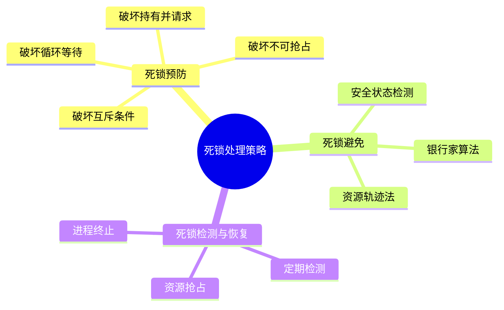

### 5.5.1 死锁预防（Preventing）

通过破坏死锁的四个必要条件之一来预防死锁。

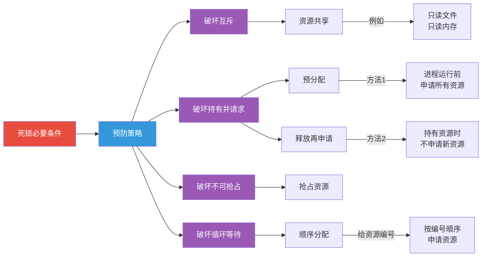

#### 破坏互斥条件

允许资源同时被多个进程访问。

| 资源类型 | 可行性 | 说明 |
|----------|--------|------|
| 只读文件 | 可行 | 可共享访问 |
| 共享内存 | 可行 | 多个进程可同时访问 |
| 打印机 | 不可行 | 需要互斥访问 |
| 写入文件 | 不可行 | 需要互斥访问 |

#### 破坏持有并请求条件

**方案一：预分配策略**
进程运行前一次性申请所有需要的资源。

```python
"""
预分配策略示例
问题：资源利用率低，进程可能长时间占用不需要的资源
"""

def process_with_pre_allocation():
    # 进程需要的所有资源
    required_resources = ["打印机", "扫描仪", "磁盘"]
    
    # 在开始前申请所有资源
    for resource in required_resources:
        if not request(resource):
            # 如果无法获取所有资源，则不开始
            rollback()
            return False
    
    # 执行任务
    do_work()
    
    # 释放所有资源
    for resource in required_resources:
        release(resource)
    
    return True
```

**方案二：释放再申请策略**
进程持有资源时不得申请新资源，需要先释放再重新申请。

```python
"""
释放再申请策略示例
问题：可能导致申请顺序变化引发其他问题
"""

def process_with_release_and_retry():
    resources_a = ["打印机"]
    
    # 先持有资源 A
    for resource in resources_a:
        request(resource)
    
    # 使用完资源 A 后释放
    for resource in resources_a:
        release(resource)
    
    # 然后才能申请其他资源
    resources_b = ["扫描仪", "磁盘"]
    for resource in resources_b:
        request(resource)
```

#### 破坏不可抢占条件

当进程请求资源失败时，强行夺取其已持有的资源。

```python
"""
不可抢占策略示例（伪代码）
通常需要系统支持资源的强制抢占
"""

def preemptive_request(process, resource):
    # 尝试申请资源
    if not request(resource):
        # 获取进程持有的所有资源
        held_resources = get_held_resources(process)
        
        # 强制释放所有持有资源
        for held in held_resources:
            force_release(held, process)
        
        # 重新申请原资源
        request(resource)
        
        # 将释放的资源分配给其他需要的进程
        for held in held_resources:
            # 分配给等待该资源的进程
            waiting_process = find_waiting_process(held)
            if waiting_process:
                allocate(held, waiting_process)
```

#### 破坏循环等待条件

**资源顺序分配法**：给系统所有资源编号，进程必须按编号递增的顺序申请资源。

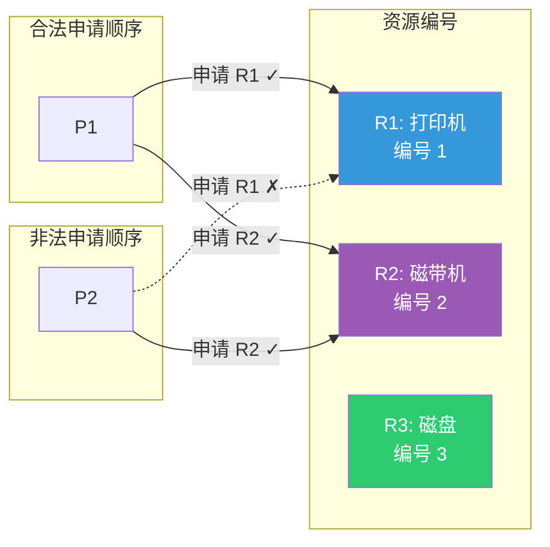

```python
"""
资源顺序分配策略
"""

class OrderedResourceAllocation:
    def __init__(self):
        # 资源编号映射
        self.resource_order = {
            "打印机": 1,
            "磁带机": 2,
            "磁盘": 3,
            "内存": 4
        }
        # 记录每个进程持有的资源
        self.held_by_process = {}
    
    def can_request(self, process, resource):
        """
        检查进程是否能申请该资源
        规则：不能申请比已持有资源编号小的资源
        """
        request_order = self.resource_order.get(resource, 999)
        held = self.held_by_process.get(process, [])
        
        if not held:
            return True
        
        max_held_order = max(self.resource_order.get(r, 0) for r in held)
        
        # 新申请的资源编号必须大于已持有资源的最大编号
        return request_order > max_held_order
    
    def request(self, process, resource):
        """资源请求"""
        if self.can_request(process, resource):
            # 更新持有记录
            if process not in self.held_by_process:
                self.held_by_process[process] = []
            self.held_by_process[process].append(resource)
            return True
        return False
```

### 5.5.2 死锁避免（Avoiding）

死锁避免是在资源分配时进行动态检查，确保系统始终处于安全状态。

#### 安全状态与不安全状态

```mermaid
flowchart LR
    subgraph 系统状态
        A["初始状态"] --> B["安全状态"]
        A --> C["不安全状态"]
        B -->|"资源分配"| D["仍是安全状态"]
        C -->|"资源分配"| E["可能进入死锁"]
    end
    
    style A fill:#3498db,color:#fff
    style B fill:#2ecc71,color:#fff
    style C fill:#f39c12,color:#fff
    style D fill:#2ecc71,color:#fff
    style E fill:#e74c3c,color:#fff
```

**安全状态定义**：存在一种进程执行顺序，使得所有进程都能顺利完成。

**不安全状态不一定导致死锁**，只是存在死锁的风险。

#### 银行家算法（Banker's Algorithm）

银行家算法是 Dijkstra 提出的死锁避免经典算法，其核心思想是模拟银行放贷过程：

```mermaid
flowchart LR
    subgraph 银行家算法核心概念
        A["客户（进程）"]
        B["贷款（资源）"]
        C["银行（操作系统）"]
        D["资金总额（系统资源）"]
    end
    
    A -->|"申请贷款"| C
    C -->|"检查资金是否足够"| D
    D -->|"分配后仍能周转"| A
    
    style A fill:#3498db,color:#fff
    style B fill:#9b59b6,color:#fff
    style C fill:#f39c12,color:#fff
    style D fill:#2ecc71,color:#fff
```

**银行家算法的数据结构**：

| 数据结构 | 说明 |
|----------|------|
| `MAX[n][m]` | n 个进程对 m 类资源的最大需求 |
| `Allocation[n][m]` | n 个进程已分配 m 类资源的数量 |
| `Need[n][m]` | n 个进程尚需 m 类资源的数量 |
| `Available[m]` | 系统现有 m 类资源的数量 |

其中：`Need = MAX - Allocation`

**银行家算法代码实现**：

```python
"""
银行家算法实现
Deadlock Avoidance - Banker's Algorithm
"""

import numpy as np
from typing import List, Dict, Tuple, Optional

class Banker'sAlgorithm:
    def __init__(self, num_processes: int, num_resources: int):
        """
        初始化银行家算法
        
        Args:
            num_processes: 进程数量
            num_resources: 资源类型数量
        """
        self.n = num_processes
        self.m = num_resources
        
        # 资源最大需求矩阵 MAX[n][m]
        self.MAX = np.zeros((num_processes, num_resources), dtype=int)
        
        # 资源分配矩阵 Allocation[n][m]
        self.Allocation = np.zeros((num_processes, num_resources), dtype=int)
        
        # 资源需求矩阵 Need[n][m]
        self.Need = np.zeros((num_processes, num_resources), dtype=int)
        
        # 系统可用资源向量 Available[m]
        self.Available = np.zeros(num_resources, dtype=int)
        
        # 资源名称
        self.resource_names = [f"R{i}" for i in range(num_resources)]
        # 进程名称
        self.process_names = [f"P{i}" for i in range(num_processes)]
    
    def set_available(self, available: List[int]):
        """设置系统可用资源"""
        self.Available = np.array(available, dtype=int)
    
    def set_max(self, process_id: int, max_demand: List[int]):
        """
        设置进程的最大需求
        
        Args:
            process_id: 进程 ID
            max_demand: 该进程对各类资源的最大需求
        """
        self.MAX[process_id] = np.array(max_demand, dtype=int)
        self._update_need(process_id)
    
    def _update_need(self, process_id: int):
        """更新进程的 Need 矩阵"""
        self.Need[process_id] = self.MAX[process_id] - self.Allocation[process_id]
    
    def request(self, process_id: int, request: List[int]) -> Tuple[bool, str]:
        """
        处理进程的资源请求
        
        Args:
            process_id: 请求资源的进程 ID
            request: 该进程请求的各类资源数量
        
        Returns:
            (是否成功, 原因说明)
        """
        request = np.array(request, dtype=int)
        
        # 1. 检查请求是否超过最大需求
        if np.any(request > self.MAX[process_id]):
            return False, f"错误：进程 P{process_id} 的请求超过最大需求"
        
        # 2. 检查系统是否有足够资源
        if np.any(request > self.Available):
            return False, f"进程 P{process_id} 必须等待，资源不足"
        
        # 3. 尝试分配（假装分配）
        self.Available -= request
        self.Allocation[process_id] += request
        self._update_need(process_id)
        
        # 4. 检查安全性（分配后是否仍安全）
        if self._is_safe_state():
            return True, f"分配成功，系统保持安全状态"
        else:
            # 撤销分配
            self.Available += request
            self.Allocation[process_id] -= request
            self._update_need(process_id)
            return False, f"分配会导致不安全状态，进程 P{process_id} 必须等待"
    
    def release(self, process_id: int, release: List[int]) -> bool:
        """
        进程释放资源
        
        Args:
            process_id: 释放资源的进程 ID
            release: 释放的各类资源数量
        
        Returns:
            是否成功
        """
        release = np.array(release, dtype=int)
        
        # 检查是否释放超过持有
        if np.any(release > self.Allocation[process_id]):
            return False
        
        self.Allocation[process_id] -= release
        self.Available += release
        self._update_need(process_id)
        return True
    
    def _is_safe_state(self, work=None, finish=None) -> bool:
        """
        检查当前状态是否安全（安全性算法）
        
        Args:
            work: 可用资源向量（默认为 self.Available）
            finish: 进程完成标记
        
        Returns:
            是否安全
        """
        if work is None:
            work = self.Available.copy()
        if finish is None:
            finish = np.zeros(self.n, dtype=bool)
        
        work = work.copy()
        
        # 寻找一个能满足需求的进程
        while True:
            found = False
            for i in range(self.n):
                if not finish[i] and np.all(self.Need[i] <= work):
                    # 找到可以完成的进程
                    work += self.Allocation[i]
                    finish[i] = True
                    found = True
            
            if not found:
                break
        
        # 如果所有进程都能完成，则是安全状态
        return np.all(finish)
    
    def find_safe_sequence(self) -> Optional[List[str]]:
        """
        找到一个安全序列
        
        Returns:
            安全序列（进程执行顺序），如果不存在则返回 None
        """
        work = self.Available.copy()
        finish = np.zeros(self.n, dtype=bool)
        safe_sequence = []
        
        while len(safe_sequence) < self.n:
            found = False
            for i in range(self.n):
                if not finish[i] and np.all(self.Need[i] <= work):
                    # 选择这个进程执行
                    work += self.Allocation[i]
                    finish[i] = True
                    safe_sequence.append(f"P{i}")
                    found = True
            
            if not found:
                return None  # 不存在安全序列
        
        return safe_sequence
    
    def get_state(self) -> Dict:
        """获取当前系统状态"""
        return {
            "Available": self.Available.tolist(),
            "Allocation": self.Allocation.tolist(),
            "MAX": self.MAX.tolist(),
            "Need": self.Need.tolist()
        }
    
    def print_state(self):
        """打印当前系统状态"""
        print("\n" + "=" * 70)
        print("当前系统状态")
        print("=" * 70)
        
        print("\n资源名称: ", self.resource_names)
        
        print("\n[Allocation 分配矩阵]")
        print("      ", end="")
        for j in range(self.m):
            print(f"{self.resource_names[j]:>8}", end="")
        print()
        for i in range(self.n):
            print(f"P{i}    ", end="")
            for j in range(self.m):
                print(f"{self.Allocation[i][j]:>8}", end="")
            print()
        
        print("\n[MAX 最大需求矩阵]")
        print("      ", end="")
        for j in range(self.m):
            print(f"{self.resource_names[j]:>8}", end="")
        print()
        for i in range(self.n):
            print(f"P{i}    ", end="")
            for j in range(self.m):
                print(f"{self.MAX[i][j]:>8}", end="")
            print()
        
        print("\n[Need 需求矩阵]")
        print("      ", end="")
        for j in range(self.m):
            print(f"{self.resource_names[j]:>8}", end="")
        print()
        for i in range(self.n):
            print(f"P{i}    ", end="")
            for j in range(self.m):
                print(f"{self.Need[i][j]:>8}", end="")
            print()
        
        print("\n[Available 可用资源]")
        print("      ", end="")
        for j in range(self.m):
            print(f"{self.resource_names[j]:>8}", end="")
        print()
        print("      ", end="")
        for j in range(self.m):
            print(f"{self.Available[j]:>8}", end="")
        print()
        
        # 检查安全序列
        safe_seq = self.find_safe_sequence()
        if safe_seq:
            print(f"\n[安全序列] {' -> '.join(safe_seq)}")
            print("[状态] 安全")
        else:
            print("\n[状态] 不安全（可能死锁）")
        
        print("=" * 70)


def demo_bankers_algorithm():
    """银行家算法演示"""
    
    print("\n" + "=" * 70)
    print("银行家算法演示")
    print("=" * 70)
    
    # 创建银行家算法实例
    # 5 个进程，3 种资源类型 (A, B, C)
    banker = Banker'sAlgorithm(5, 3)
    
    # 设置资源名称
    banker.resource_names = ["A", "B", "C"]
    
    # 设置初始可用资源 (系统中还有的资源)
    # A: 3 个, B: 3 个, C: 2 个
    banker.set_available([3, 3, 2])
    
    # 设置各进程的最大需求 MAX
    # 格式: [A, B, C]
    max_demands = [
        [7, 5, 3],  # P0: 最大需求 7A, 5B, 3C
        [3, 2, 2],  # P1: 最大需求 3A, 2B, 2C
        [9, 0, 2],  # P2: 最大需求 9A, 0B, 2C
        [2, 2, 2],  # P3: 最大需求 2A, 2B, 2C
        [4, 3, 3],  # P4: 最大需求 4A, 3B, 3C
    ]
    
    for i, max_demand in enumerate(max_demands):
        banker.set_max(i, max_demand)
    
    # 设置初始分配（模拟某个时刻的分配状态）
    allocations = [
        [0, 1, 0],  # P0: 已分配 0A, 1B, 0C
        [2, 0, 0],  # P1: 已分配 2A, 0B, 0C
        [3, 0, 2],  # P2: 已分配 3A, 0B, 2C
        [2, 1, 1],  # P3: 已分配 2A, 1B, 1C
        [0, 0, 2],  # P4: 已分配 0A, 0B, 2C
    ]
    
    for i, alloc in enumerate(allocations):
        for j in range(3):
            if alloc[j] > 0:
                banker.request(i, [0, 0, 0])  # 先建立进程
                # 直接设置分配
                banker.Allocation[i][j] = alloc[j]
    
    # 重新计算 Need
    for i in range(5):
        banker.Need[i] = banker.MAX[i] - banker.Allocation[i]
    
    # 重新计算 Available
    total_allocated = np.sum(banker.Allocation, axis=0)
    banker.Available = np.array([3, 3, 2]) - total_allocated
    
    banker.print_state()
    
    # 演示资源请求
    print("\n" + "-" * 70)
    print("场景 1: 进程 P0 请求资源 [1, 0, 2]")
    print("-" * 70)
    
    success, msg = banker.request(0, [1, 0, 2])
    print(f"请求结果: {msg}")
    if success:
        banker.print_state()
    
    print("\n" + "-" * 70)
    print("场景 2: 进程 P1 请求资源 [1, 0, 2]")
    print("-" * 70)
    
    success, msg = banker.request(1, [1, 0, 2])
    print(f"请求结果: {msg}")
    if success:
        banker.print_state()
    
    print("\n" + "-" * 70)
    print("场景 3: 进程 P4 释放资源 [0, 0, 1]")
    print("-" * 70)
    
    success = banker.release(4, [0, 0, 1])
    if success:
        print("资源释放成功")
        banker.print_state()


if __name__ == "__main__":
    demo_bankers_algorithm()
```

**银行家算法执行流程图**：

```mermaid
flowchart TD
    A["进程请求资源"] --> B{"请求 <= Need?"}
    B -->|否| C["拒绝请求\n报错"]
    B -->|是| D{"请求 <= Available?"}
    
    D -->|否| E["进程等待"]
    D -->|是| F["试探性分配"]
    
    F --> G{"安全性检查?"}
    
    G -->|安全| H["真正分配资源"]
    G -->|不安全| I["撤销分配\n进程等待"]
    
    H --> J["进程执行"]
    J --> K["释放资源"]
    K --> A
    
    style A fill:#3498db,color:#fff
    style B fill:#9b59b6,color:#fff
    style D fill:#9b59b6,color:#fff
    style G fill:#f39c12,color:#fff
    style H fill:#2ecc71,color:#fff
    style I fill:#e74c3c,color:#fff
    style C fill:#e74c3c,color:#fff
```

### 5.5.3 死锁检测与恢复

当系统不采用预防策略时，可能发生死锁。死锁检测与恢复包括：
1. 检测算法：定期检查系统是否存在死锁
2. 恢复策略：从死锁中恢复

#### 死锁检测算法

**等待图算法**（适用于每类资源只有一个实例）：

```mermaid
flowchart LR
    P1["P1"] -->|"等待 R1"| R1["R1"]
    R1 -->|"持有"| P2["P2"]
    P2 -->|"等待 R2"| R2["R2"]
    R2 -->|"持有"| P1

    style P1 fill:#e74c3c,color:#fff
    style P2 fill:#e74c3c,color:#fff
    style R1 fill:#f39c12,color:#fff
    style R2 fill:#f39c12,color:#fff
```

```python
"""
等待图算法 - 检测单实例资源死锁
"""

from collections import defaultdict, deque

class WaitGraph:
    def __init__(self):
        # 等待图：进程 -> 进程（表示等待对方持有的资源）
        self.graph = defaultdict(set)
        self.processes = set()
    
    def add_edge(self, waiting_process: str, holding_process: str):
        """
        添加等待边
        waiting_process 等待 holding_process 释放资源
        """
        self.graph[waiting_process].add(holding_process)
        self.processes.add(waiting_process)
        self.processes.add(holding_process)
    
    def remove_edge(self, waiting_process: str, holding_process: str):
        """移除等待边"""
        self.graph[waiting_process].discard(holding_process)
    
    def detect_deadlock(self):
        """
        检测死锁
        使用 BFS 找环
        
        Returns:
            (是否有死锁, 死锁进程集合)
        """
        # 记录入度（被依赖的边数）
        in_degree = defaultdict(int)
        
        # 计算每个进程的入度（被多少进程等待）
        for p in self.processes:
            for neighbor in self.graph[p]:
                in_degree[neighbor] += 1
        
        # BFS 拓扑排序
        queue = deque()
        for p in self.processes:
            if in_degree[p] == 0:
                queue.append(p)
        
        processed = set()
        while queue:
            node = queue.popleft()
            processed.add(node)
            
            for neighbor in self.graph[node]:
                in_degree[neighbor] -= 1
                if in_degree[neighbor] == 0 and neighbor not in processed:
                    queue.append(neighbor)
        
        # 没有入度的进程都是可以完成的
        # 剩下的进程就是死锁进程
        deadlock_processes = self.processes - processed
        
        return len(deadlock_processes) > 0, deadlock_processes
    
    def print_graph(self):
        """打印等待图"""
        print("\n等待图:")
        for process, neighbors in self.graph.items():
            if neighbors:
                for neighbor in neighbors:
                    print(f"  {process} -> {neighbor} (等待 {neighbor} 释放资源)")
        
        has_deadlock, deadlock_set = self.detect_deadlock()
        if has_deadlock:
            print(f"\n检测到死锁!")
            print(f"死锁进程: {deadlock_set}")
        else:
            print("\n未检测到死锁")


def demo_wait_graph():
    """演示等待图死锁检测"""
    
    print("=" * 60)
    print("等待图死锁检测演示")
    print("=" * 60)
    
    # 示例: P1 和 P2 死锁
    print("\n【示例】P1 和 P2 死锁")
    wg = WaitGraph()
    
    # P1 等待 P2 持有的 R1
    wg.add_edge("P1", "P2")
    # P2 等待 P1 持有的 R2
    wg.add_edge("P2", "P1")
    
    wg.print_graph()


if __name__ == "__main__":
    demo_wait_graph()
```

#### 死锁恢复策略

```mermaid
flowchart LR
    subgraph 恢复策略
        A["终止进程"] --> A1["终止所有死锁进程"]
        A --> A2["逐个终止进程\n直到打破死锁"]
        
        B["资源抢占"] --> B1["强制夺取\n被占资源"]
        B --> B2["回滚进程\n到安全状态"]
    end
    
    style A fill:#e74c3c,color:#fff
    style A1 fill:#9b59b6,color:#fff
    style A2 fill:#9b59b6,color:#fff
    style B fill:#3498db,color:#fff
    style B1 fill:#3498db,color:#fff
    style B2 fill:#3498db,color:#fff
```

**进程终止策略**：

| 策略 | 优点 | 缺点 |
|------|------|------|
| 终止所有死锁进程 | 简单彻底 | 可能丢失大量工作 |
| 逐个终止直到打破死锁 | 代价最小化 | 需要多次检测 |

**进程选择原则**：
1. 优先级最低的进程
2. 运行时间最短的进程
3. 产生结果最少的进程
4. 批处理进程优先于交互进程

```python
"""
死锁恢复 - 进程终止策略
"""

class DeadlockRecovery:
    def __init__(self, processes):
        self.processes = processes
        self.deadlock_processes = set()
    
    def calculate_termination_cost(self, process):
        """
        计算终止进程的代价
        返回: (代价分数, 考虑因素)
        """
        # 优先级（越低越应该终止）
        priority_score = 10 - process.get("priority", 5)
        
        # 运行时间（越短越应该终止）
        runtime_score = min(process.get("runtime", 100) / 100, 1)
        
        # 已产生的结果（越少越应该终止）
        progress_score = 1 - (process.get("progress", 50) / 100)
        
        # 总代价分数（越低越应该终止）
        total_cost = (
            priority_score * 0.3 +
            runtime_score * 0.2 +
            progress_score * 0.5
        )
        
        return total_cost, {
            "priority": priority_score,
            "runtime": runtime_score,
            "progress": progress_score
        }
    
    def find_best_termination_order(self):
        """
        找到最优的进程终止顺序
        """
        remaining = self.deadlock_processes.copy()
        termination_order = []
        
        while remaining:
            best_process = None
            best_cost = float('inf')
            
            for process in remaining:
                cost, _ = self.calculate_termination_cost(process)
                if cost < best_cost:
                    best_cost = cost
                    best_process = process
            
            termination_order.append(best_process)
            remaining.remove(best_process)
        
        return termination_order
    
    def recover_by_termination(self):
        """
        通过终止进程恢复死锁
        """
        order = self.find_best_termination_order()
        
        print("\n终止顺序（代价从小到大）:")
        for i, process in enumerate(order, 1):
            cost, factors = self.calculate_termination_cost(process)
            print(f"  {i}. {process['name']}: 代价={cost:.2f}, "
                  f"优先级因子={factors['priority']:.2f}, "
                  f"进度因子={factors['progress']:.2f}")
        
        # 返回需要终止的进程列表
        return order


def demo_deadlock_recovery():
    """演示死锁恢复"""
    
    print("=" * 60)
    print("死锁恢复演示 - 进程终止策略")
    print("=" * 60)
    
    # 模拟死锁进程
    processes = [
        {"name": "P1", "priority": 3, "runtime": 50, "progress": 80},
        {"name": "P2", "priority": 5, "runtime": 30, "progress": 20},
        {"name": "P3", "priority": 1, "runtime": 100, "progress": 90},
        {"name": "P4", "priority": 7, "runtime": 10, "progress": 10},
    ]
    
    recovery = DeadlockRecovery(processes)
    recovery.deadlock_processes = set(processes)
    
    order = recovery.recover_by_termination()


if __name__ == "__main__":
    demo_deadlock_recovery()
```

---

## 5.6 实际应用场景

### 5.6.1 数据库系统中的死锁

```mermaid
sequenceDiagram
    participant T1 as 事务 T1
    participant T2 as 事务 T2
    participant DB as 数据库
    
    T1->>DB: UPDATE accounts SET balance = balance - 100 WHERE id = 1
    Note over T1,DB: T1 锁定账户 1
    T1->>DB: UPDATE accounts SET balance = balance + 100 WHERE id = 2
    Note over T1: 等待账户 2...
    
    T2->>DB: UPDATE accounts SET balance = balance - 50 WHERE id = 2
    Note over T2,DB: T2 锁定账户 2
    T2->>DB: UPDATE accounts SET balance = balance + 50 WHERE id = 1
    Note over T2: 等待账户 1...
    Note over T1,T2: 死锁！
    
    DB-->>T1: 死锁检测，终止 T1
    DB-->>T2: 继续执行
```

**数据库死锁处理**：

```python
"""
模拟数据库死锁检测与处理
"""

import time
from enum import Enum
from typing import Optional, List, Set
from collections import defaultdict

class LockMode(Enum):
    SHARED = "S"      # 共享锁（读锁）
    EXCLUSIVE = "X"   # 排他锁（写锁）

class Transaction:
    def __init__(self, tid: int):
        self.tid = tid
        self.held_locks: Set[tuple] = set()  # (resource, mode)
        self.waiting_for: Optional[int] = None  # 等待哪个事务
    
    def __repr__(self):
        return f"T{self.tid}"


class DatabaseDeadlockDetector:
    def __init__(self, timeout: float = 5.0):
        self.transactions: dict[int, Transaction] = {}
        self.wait_graph: dict[int, set[int]] = defaultdict(set)
        self.timeout = timeout
        self.last_check = time.time()
    
    def begin_transaction(self, tid: int):
        """开始新事务"""
        self.transactions[tid] = Transaction(tid)
    
    def acquire_lock(self, tid: int, resource: str, mode: LockMode) -> bool:
        """
        尝试获取锁
        返回是否成功
        """
        if tid not in self.transactions:
            self.begin_transaction(tid)
        
        txn = self.transactions[tid]
        lock_key = (resource, mode)
        
        # 检查是否已经持有该锁
        if lock_key in txn.held_locks:
            return True
        
        # 尝试获取锁（简化版：假设锁管理器返回结果）
        # 在实际实现中，需要查询锁管理器
        granted = self._check_lock_availability(resource, mode, tid)
        
        if granted:
            txn.held_locks.add(lock_key)
            return True
        else:
            # 记录等待关系（更新等待图）
            holder = self._find_lock_holder(resource)
            if holder:
                self.wait_graph[tid].add(holder)
            return False
    
    def _check_lock_availability(self, resource: str, mode: LockMode, tid: int) -> bool:
        """检查锁是否可用（简化实现）"""
        # 实际需要查询锁表
        return True
    
    def _find_lock_holder(self, resource: str) -> Optional[int]:
        """找到资源的持有者"""
        for tid, txn in self.transactions.items():
            for res, mode in txn.held_locks:
                if res == resource:
                    return tid
        return None
    
    def release_locks(self, tid: int):
        """释放事务的所有锁"""
        if tid in self.transactions:
            txn = self.transactions[tid]
            # 从其他事务的等待图中移除
            for waiting_tid in self.wait_graph:
                self.wait_graph[waiting_tid].discard(tid)
            txn.held_locks.clear()
    
    def detect_deadlock(self) -> Optional[List[int]]:
        """
        检测死锁（使用超时检测）
        返回死锁环中的事务列表
        """
        # 简化的等待图环检测
        visited = set()
        path = []
        
        def dfs(tid: int) -> Optional[List[int]]:
            if tid in path:
                # 找到环
                cycle_start = path.index(tid)
                return path[cycle_start:] + [tid]
            
            if tid in visited:
                return None
            
            visited.add(tid)
            path.append(tid)
            
            for waiter_tid in self.wait_graph:
                if self.wait_graph[waiter_tid]:
                    holder = next(iter(self.wait_graph[waiter_tid]))
                    cycle = dfs(holder)
                    if cycle:
                        return cycle
            
            path.pop()
            return None
        
        for tid in self.transactions:
            if tid not in visited:
                cycle = dfs(tid)
                if cycle:
                    return cycle
        
        return None
    
    def handle_deadlock(self) -> int:
        """
        处理死锁，返回被终止的事务 ID
        """
        cycle = self.detect_deadlock()
        if not cycle:
            return -1
        
        # 选择代价最小的事务终止（通常选择最年轻的事务）
        victim = cycle[0] if cycle else -1
        
        print(f"\n检测到死锁: {' -> '.join(map(str, cycle))}")
        print(f"选择事务 T{victim} 作为牺牲者")
        
        # 回滚该事务
        self.release_locks(victim)
        
        return victim


def demo_database_deadlock():
    """演示数据库死锁场景"""
    
    print("=" * 60)
    print("数据库死锁检测与处理演示")
    print("=" * 60)
    
    detector = DatabaseDeadlockDetector()
    
    # 模拟死锁场景
    print("\n【场景】两个事务互相等待对方持有的锁")
    print("T1: 锁定账户 A，请求账户 B")
    print("T2: 锁定账户 B，请求账户 A")
    
    detector.begin_transaction(1)
    detector.begin_transaction(2)
    
    # T1 锁定账户 A（成功）
    detector.acquire_lock(1, "账户A", LockMode.EXCLUSIVE)
    print("T1: 锁定账户 A 成功")
    
    # T2 锁定账户 B（成功）
    detector.acquire_lock(2, "账户B", LockMode.EXCLUSIVE)
    print("T2: 锁定账户 B 成功")
    
    # T1 请求账户 B（失败，等待 T2）
    detector.wait_graph[1].add(2)  # T1 等待 T2
    print("T1: 请求账户 B（等待中...）")
    
    # T2 请求账户 A（失败，等待 T1）
    detector.wait_graph[2].add(1)  # T2 等待 T1
    print("T2: 请求账户 A（等待中...）")
    
    # 检测死锁
    victim = detector.handle_deadlock()
    if victim > 0:
        print(f"\nT1 和 T2 陷入死锁，终止事务 T{victim}")
        print("剩余事务可以继续执行")


if __name__ == "__main__":
    demo_database_deadlock()
```

### 5.6.2 多线程编程中的死锁

```mermaid
classDiagram
    class Thread {
        +String name
        +List locks
    }
    
    class Lock {
        +String name
        +Thread owner
    }
    
    Thread "1" --> "*" Lock : holds
    Lock --> Thread : owned by
```

**经典哲学家就餐问题**：

```python
"""
哲学家就餐问题 - 死锁与解决方案
"""

import threading
import time
from enum import Enum

class DiningPhilosophers:
    def __init__(self, num_philosophers=5):
        self.num = num_philosophers
        self.forks = [threading.Lock() for _ in range(num_philosophers)]
        self.state = ["思考中" for _ in range(num_philosophers)]
        self.condition = threading.Condition()
        self.running = True
    
    def pickup(self, philosopher_id: int):
        """拿起叉子"""
        with self.condition:
            self.state[philosopher_id] = "饥饿中"
            print(f"哲学家 {philosopher_id}: 我饿了（饥饿中）")
            
            # 等待左右叉子都可用
            left = philosopher_id
            right = (philosopher_id + 1) % self.num
            
            while (self.forks[left].locked() or 
                   self.forks[right].locked()):
                self.condition.wait()
            
            # 获取叉子
            self.forks[left].acquire()
            self.forks[right].acquire()
            
            self.state[philosopher_id] = "进食中"
            print(f"哲学家 {philosopher_id}: 拿到两支叉子，开始吃饭！")
    
    def putdown(self, philosopher_id: int):
        """放下叉子"""
        with self.condition:
            left = philosopher_id
            right = (philosopher_id + 1) % self.num
            
            self.forks[left].release()
            self.forks[right].release()
            
            self.state[philosopher_id] = "思考中"
            print(f"哲学家 {philosopher_id}: 放下叉子，开始思考")
            
            # 通知其他哲学家
            self.condition.notify_all()
    
    def philosopher(self, philosopher_id: int):
        """哲学家线程"""
        while self.running:
            # 思考
            self.state[philosopher_id] = "思考中"
            print(f"哲学家 {philosopher_id}: 思考人生...")
            time.sleep(1)
            
            # 尝试吃饭
            self.pickup(philosopher_id)
            time.sleep(0.5)  # 吃饭时间
            self.putdown(philosopher_id)
    
    def stop(self):
        """停止所有哲学家"""
        self.running = False


class DiningPhilosophersWithOrdering(DiningPhilosophers):
    """
    解决方案1: 资源顺序分配
    给所有叉子编号，哲学家总是先拿编号小的叉子
    """
    
    def pickup(self, philosopher_id: int):
        left = philosopher_id
        right = (philosopher_id + 1) % self.num
        
        # 确保始终先拿编号小的叉子
        first, second = min(left, right), max(left, right)
        
        print(f"哲学家 {philosopher_id}: 饥饿中")
        
        # 先拿编号小的
        self.forks[first].acquire()
        print(f"哲学家 {philosopher_id}: 拿到叉子 {first}")
        
        # 再拿编号大的
        self.forks[second].acquire()
        print(f"哲学家 {philosopher_id}: 拿到叉子 {second}，开始吃饭！")
        
        self.state[philosopher_id] = "进食中"


class DiningPhilosophersWithHost(DiningPhilosophers):
    """
    解决方案2: 引入主持人
    限制同时进食的哲学家数量 <= 4
    """
    
    def pickup(self, philosopher_id: int):
        with self.condition:
            self.state[philosopher_id] = "饥饿中"
            print(f"哲学家 {philosopher_id}: 我饿了（饥饿中）")
            
            # 等待直到允许进食（最多4人同时饥饿）
            eating_count = sum(1 for s in self.state if s == "进食中")
            while eating_count >= 4:
                self.condition.wait()
                eating_count = sum(1 for s in self.state if s == "进食中")
            
            # 获取叉子
            left = philosopher_id
            right = (philosopher_id + 1) % self.num
            self.forks[left].acquire()
            self.forks[right].acquire()
            
            self.state[philosopher_id] = "进食中"
            print(f"哲学家 {philosopher_id}: 拿到两支叉子，开始吃饭！")
    
    def putdown(self, philosopher_id: int):
        super().putdown(philosopher_id)
        self.condition.notify_all()  # 通知等待的哲学家


def demo_philosophers_problem():
    """演示哲学家就餐问题"""
    
    print("=" * 60)
    print("哲学家就餐问题演示")
    print("=" * 60)
    
    print("""
【问题描述】
5 位哲学家围坐一圆桌，每位哲学家需要两支叉子才能吃饭。
如果每位哲学家都先拿起左边的叉子，再拿右边的叉子，
可能会导致所有人都在等待右边的叉子，形成死锁。

【资源顺序分配解决方案】
给叉子编号（0-4），每位哲学家总是先拿编号较小的叉子。
这样可以打破循环等待条件。
""")
    
    # 使用资源顺序分配方案
    dining = DiningPhilosophersWithOrdering(5)
    
    philosophers = []
    for i in range(5):
        t = threading.Thread(target=dining.philosopher, args=(i,))
        philosophers.append(t)
        t.start()
    
    # 运行一段时间后停止
    time.sleep(5)
    dining.stop()
    
    # 等待所有线程结束
    for t in philosophers:
        t.join()
    
    print("\n演示结束")


if __name__ == "__main__":
    demo_philosophers_problem()
```

### 5.6.3 操作系统内核中的死锁

```mermaid
flowchart LR
    subgraph 内核死锁场景
        A["进程 A"] -->|"请求文件锁"| F["文件 F"]
        A -->|"持有信号量 S"| S["信号量 S"]
        
        B["进程 B"] -->|"请求信号量 S"| S
        B -->|"持有文件锁"| F
    end
    
    style A fill:#3498db,color:#fff
    style B fill:#e74c3c,color:#fff
    style F fill:#f39c12,color:#fff
    style S fill:#9b59b6,color:#fff
```

---

## 5.7 本章小结

```mermaid
mindmap
  root((第5章\n死锁))
    概念
      死锁定义
      活锁区别
      饥饿概念
    原因
      竞争不可抢占资源
      竞争可消耗资源
      推进顺序不当
    必要条件
      互斥条件
      持有并请求
      不可抢占
      循环等待
    处理策略
      预防
        破坏互斥
        破坏持有并请求
        破坏不可抢占
        破坏循环等待
      避免
        安全状态
        银行家算法
      检测恢复
        等待图
        进程终止
        资源抢占
```

**关键要点**：

1. **死锁的四个必要条件**必须同时满足才会发生死锁

2. **死锁预防**通过破坏四个必要条件之一来预防死锁，资源顺序分配是最实用的方法

3. **银行家算法**通过安全性检查避免系统进入不安全状态，但开销较大

4. **死锁检测**使用资源分配图或等待图检测环的存在

5. **实际系统**通常采用折中方案：鸵鸟算法（忽略死锁）或部分处理

**各策略对比**：

| 策略 | 资源利用率 | 系统开销 | 可能导致饥饿 |
|------|-----------|----------|-------------|
| 预防 | 低 | 低 | 可能 |
| 避免 | 中 | 高 | 可能 |
| 检测恢复 | 高 | 中 | 可能 |
| 忽略 | 最高 | 最低 | 否 |

---

## 思考与练习

1. **分析题**：说明死锁、活锁和饥饿的区别，并各举一个实际生活中的例子。

2. **计算题**：使用银行家算法判断以下状态是否安全：
   - Available = [2, 1, 0]
   - Allocation = [[2, 0, 0], [1, 1, 2]]
   - MAX = [[3, 2, 2], [1, 2, 3]]

3. **设计题**：设计一个解决哲学家就餐问题的方案，要求不使用资源顺序分配。

4. **编程题**：实现一个资源分配图环检测算法，支持添加/删除进程、添加/删除资源边、检测环。

5. **讨论题**：在实际操作系统中，为什么很多系统选择"鸵鸟算法"（忽略死锁）而不是主动处理？
