# 第6章：内存管理

## 章节导学


**学习目标**

- 理解内存管理的基本概念和核心功能
- 掌握连续内存分配的各种方法及优缺点
- 深入理解分页和分段机制
- 理解虚拟内存的工作原理
- 掌握页面置换算法的原理和实现
- 了解内存管理的高级主题

---

## 6.1 内存管理概述

### 6.1.1 内存管理的基本功能

内存管理是操作系统最核心的功能之一，它负责管理计算机的物理内存资源，为程序提供高效、安全的内存访问环境。

**内存管理的核心功能**

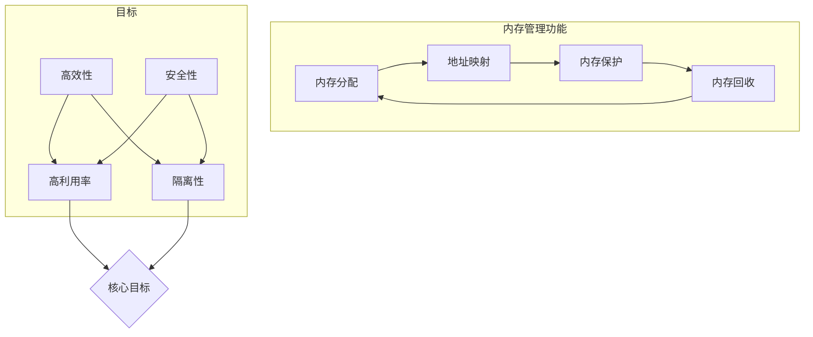

| 功能 | 描述 | 重要性 |
|------|------|--------|
| **内存分配** | 为进程分配所需的内存空间 | 高 |
| **地址映射** | 将逻辑地址转换为物理地址 | 高 |
| **内存保护** | 防止进程访问非法内存区域 | 高 |
| **内存回收** | 回收不再使用的内存空间 | 中 |
| **内存共享** | 支持进程间共享内存区域 | 中 |
| ** swap管理** | 管理内存与磁盘之间的数据交换 | 高 |

### 6.1.2 地址空间与地址绑定

**基本概念**

- **物理地址**：在计算机硬件层面，访问内存总线时使用的地址。物理地址空间是真实的、有限的内存资源。
- **逻辑地址（虚拟地址）**：程序在编译、链接时使用的地址。对程序来说，它们看到的是一个连续的地址空间。
- **地址绑定**：将逻辑地址转换为物理地址的过程。

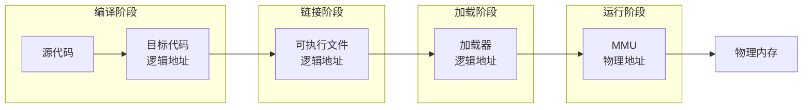

**地址绑定的时机**

| 绑定类型 | 绑定时间 | 优点 | 缺点 |
|---------|---------|------|------|
| **编译时绑定** | 编译阶段 | 无需运行时转换，速度快 | 必须知道物理内存布局 |
| **加载时绑定** | 加载阶段 | 灵活性增加 | 换入换出后地址可能失效 |
| **运行时绑定** | 执行阶段 | 可动态改变地址 | 需要硬件支持（MMU） |

### 6.1.3 逻辑地址与物理地址

**两者的核心区别**

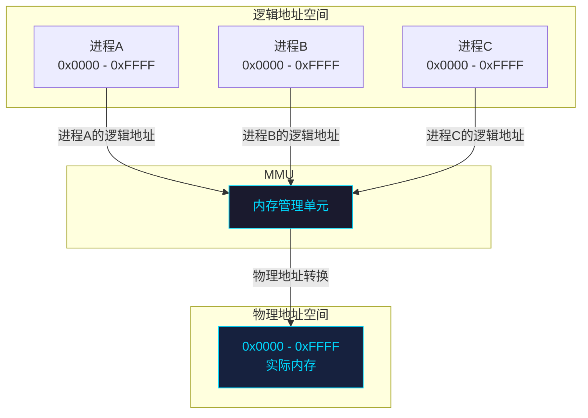

**地址转换示例**

```
进程A的逻辑地址: 0x1234
进程B的逻辑地址: 0x1234  (同样的逻辑地址)

经过MMU转换后:
进程A的物理地址: 0x50000 + 0x1234 = 0x51234
进程B的物理地址: 0x80000 + 0x1234 = 0x81234
```

> **关键理解**：每个进程都有自己独立的逻辑地址空间，操作系统通过MMU将不同的逻辑地址映射到不同的物理地址，实现进程间的内存隔离。

---

## 6.2 连续内存分配

连续内存分配是最简单的内存管理方式，它为每个进程分配一块连续的内存区域。

### 6.2.1 单一连续分配

**原理**

整个内存被分为两个区域：系统区和用户区。同一时刻只有一个进程运行于用户区。


**特点**

| 特性 | 说明 |
|------|------|
| 优点 | 简单，开销小 |
| 缺点 | 只支持单进程，无并发 |
| 内存利用率 | 低（即使程序很小也占用全部用户区） |
| 适用场景 | 早期单任务系统（如MS-DOS） |

### 6.2.2 固定分区分配

**原理**

将内存划分为固定大小的分区，每个分区可容纳一个进程。

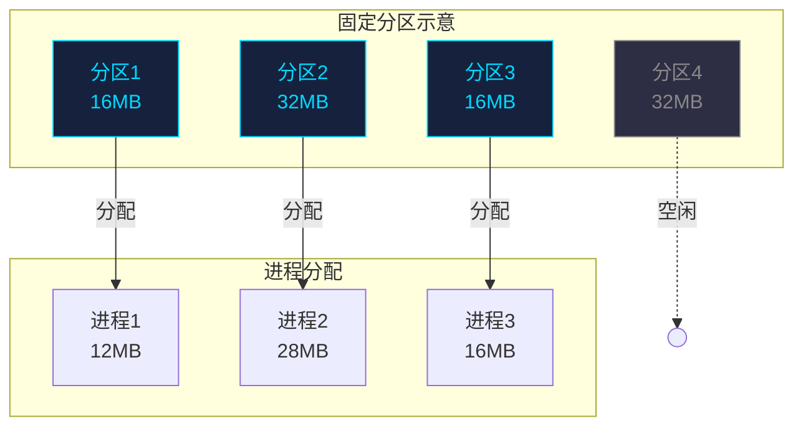

**问题**

- **内部碎片**：分区大小大于程序大小，剩余空间无法使用
- 分区数量固定，限制并发进程数
- 分区大小固定，无法适应不同大小的程序

### 6.2.3 可变分区分配

**原理**

根据进程实际需求动态分配内存，分区大小在分配时确定。


### 6.2.4 动态分区分配算法

为了管理可变分区，操作系统需要维护一个"空闲分区表"或"空闲分区链"。以下是几种经典的分配算法。

#### 首次适应算法（First Fit）

**原理**：从空闲分区链首开始顺序查找，找到第一个满足大小要求的空闲分区。

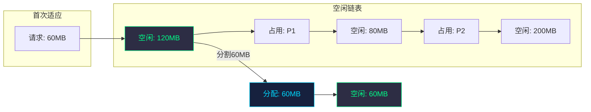

**代码实现**

```c
#include <stdio.h>
#include <stdlib.h>
#include <stdbool.h>

#define MEMORY_SIZE 1024  // 内存总大小（KB）

// 空闲分区结构
typedef struct Block {
    int start;      // 起始地址
    int size;       // 大小（KB）
    bool allocated; // 是否已分配
    struct Block* next;
} Block;

// 初始化内存块
Block* init_memory() {
    Block* head = (Block*)malloc(sizeof(Block));
    head->start = 0;
    head->size = MEMORY_SIZE;
    head->allocated = false;
    head->next = NULL;
    return head;
}

// 首次适应算法
bool first_fit(Block* head, int request_size, int* alloc_start) {
    Block* current = head;
    
    while (current != NULL) {
        // 找到足够大的空闲分区
        if (!current->allocated && current->size >= request_size) {
            *alloc_start = current->start;
            
            // 如果分区比请求的大，分割分区
            if (current->size > request_size) {
                Block* new_block = (Block*)malloc(sizeof(Block));
                new_block->start = current->start + request_size;
                new_block->size = current->size - request_size;
                new_block->allocated = false;
                new_block->next = current->next;
                
                current->size = request_size;
                current->next = new_block;
            }
            
            current->allocated = true;
            return true;
        }
        current = current->next;
    }
    return false;
}

// 释放内存
void free_block(Block* head, int start) {
    Block* current = head;
    
    while (current != NULL) {
        if (current->start == start && current->allocated) {
            current->allocated = false;
            
            // 合并相邻的空闲分区
            // 合并下一个空闲分区
            if (current->next && !current->next->allocated) {
                Block* next = current->next;
                current->size += next->size;
                current->next = next->next;
                free(next);
            }
            
            // 合并上一个空闲分区
            Block* prev = head;
            while (prev && prev->next != current) {
                prev = prev->next;
            }
            if (prev && !prev->allocated) {
                prev->size += current->size;
                prev->next = current->next;
                free(current);
            }
            
            return;
        }
        current = current->next;
    }
}

// 打印内存状态
void print_memory(Block* head) {
    printf("=== 内存状态 ===\n");
    Block* current = head;
    while (current != NULL) {
        printf("地址: %4d KB | 大小: %4d KB | %s\n",
               current->start, current->size,
               current->allocated ? "已分配" : "空闲");
        current = current->next;
    }
    printf("\n");
}

int main() {
    Block* memory = init_memory();
    
    int alloc_start;
    
    // 分配三个进程
    printf("分配进程A (40KB):\n");
    if (first_fit(memory, 40, &alloc_start)) {
        printf("成功，分配起始地址: %d KB\n", alloc_start);
    }
    print_memory(memory);
    
    printf("分配进程B (100KB):\n");
    if (first_fit(memory, 100, &alloc_start)) {
        printf("成功，分配起始地址: %d KB\n", alloc_start);
    }
    print_memory(memory);
    
    printf("分配进程C (60KB):\n");
    if (first_fit(memory, 60, &alloc_start)) {
        printf("成功，分配起始地址: %d KB\n", alloc_start);
    }
    print_memory(memory);
    
    // 释放进程B
    printf("释放进程B:\n");
    free_block(memory, 40);  // B的起始地址是40
    print_memory(memory);
    
    // 再次分配（会使用首次适应找到第一个空闲区）
    printf("分配进程D (30KB):\n");
    if (first_fit(memory, 30, &alloc_start)) {
        printf("成功，分配起始地址: %d KB\n", alloc_start);
    }
    print_memory(memory);
    
    return 0;
}
```

#### 最佳适应算法（Best Fit）

**原理**：遍历所有空闲分区，选择最接近请求大小的分区，减少碎片。

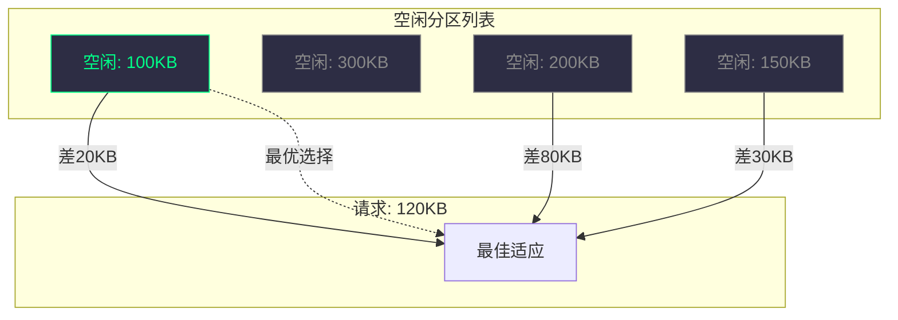

```c
// 最佳适应算法
bool best_fit(Block* head, int request_size, int* alloc_start) {
    Block* current = head;
    Block* best = NULL;
    int best_remaining = __INT_MAX__;
    
    while (current != NULL) {
        if (!current->allocated && current->size >= request_size) {
            int remaining = current->size - request_size;
            if (remaining < best_remaining) {
                best_remaining = remaining;
                best = current;
            }
        }
        current = current->next;
    }
    
    if (best == NULL) {
        return false;
    }
    
    *alloc_start = best->start;
    
    if (best->size > request_size) {
        Block* new_block = (Block*)malloc(sizeof(Block));
        new_block->start = best->start + request_size;
        new_block->size = best->size - request_size;
        new_block->allocated = false;
        new_block->next = best->next;
        
        best->size = request_size;
        best->next = new_block;
    }
    
    best->allocated = true;
    return true;
}
```

#### 最差适应算法（Worst Fit）

**原理**：选择最大的空闲分区，分配后剩余的空闲区仍然较大。

```c
// 最差适应算法
bool worst_fit(Block* head, int request_size, int* alloc_start) {
    Block* current = head;
    Block* worst = NULL;
    int worst_size = -1;
    
    while (current != NULL) {
        if (!current->allocated && current->size >= request_size) {
            if (current->size > worst_size) {
                worst_size = current->size;
                worst = current;
            }
        }
        current = current->next;
    }
    
    if (worst == NULL) {
        return false;
    }
    
    *alloc_start = worst->start;
    
    if (worst->size > request_size) {
        Block* new_block = (Block*)malloc(sizeof(Block));
        new_block->start = worst->start + request_size;
        new_block->size = worst->size - request_size;
        new_block->allocated = false;
        new_block->next = worst->next;
        
        worst->size = request_size;
        worst->next = new_block;
    }
    
    worst->allocated = true;
    return true;
}
```

#### 邻近适应算法（Next Fit）

**原理**：从上次分配位置开始顺序查找，循环遍历空闲分区。

```c
// 邻近适应算法
bool next_fit(Block* head, int request_size, int* alloc_start, Block** last_alloc) {
    Block* start = *last_alloc;
    Block* current = start;
    bool wrapped = false;
    
    while (current != NULL) {
        if (!current->allocated && current->size >= request_size) {
            *alloc_start = current->start;
            *last_alloc = current;
            
            if (current->size > request_size) {
                Block* new_block = (Block*)malloc(sizeof(Block));
                new_block->start = current->start + request_size;
                new_block->size = current->size - request_size;
                new_block->allocated = false;
                new_block->next = current->next;
                
                current->size = request_size;
                current->next = new_block;
            }
            
            current->allocated = true;
            return true;
        }
        
        current = current->next;
        
        // 循环回到链表头部
        if (current == NULL && !wrapped) {
            current = head;
            wrapped = true;
        }
        
        // 已遍历一圈
        if (wrapped && current == start) {
            break;
        }
    }
    
    return false;
}
```

**算法对比**

| 算法 | 特点 | 优点 | 缺点 |
|------|------|------|------|
| 首次适应 | 最简单 | 速度快 | 大空闲区被分割 |
| 最佳适应 | 选择最接近大小 | 保留大空闲区 | 产生小碎片 |
| 最差适应 | 选择最大空闲区 | 减少小碎片 | 大进程可能无法分配 |
| 邻近适应 | 循环查找 | 分布均匀 | 碎片分布分散 |

### 6.2.5 碎片问题

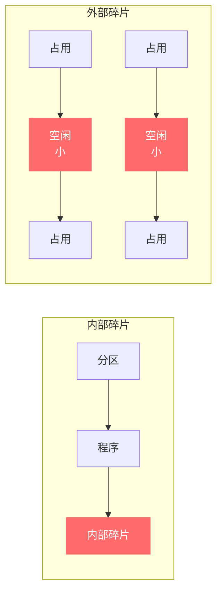

**内部碎片**：分配给进程的内存大于其实际需要的内存，这部分多余空间在分区内部。

**外部碎片**：空闲内存总和足够满足请求，但由于空闲区不连续，无法分配。

**解决方案**

| 方案 | 说明 | 应用场景 |
|------|------|---------|
| **压缩** | 移动内存中的进程，使空闲区合并 | 紧凑技术，需要进程移动能力 |
| **伙伴系统** | 按2的幂次分配，大小对齐 | Linux内核 |
| **分页/分段** | 非连续分配 | 现代操作系统 |

---

## 6.3 非连续内存分配

非连续内存分配允许程序使用不连续的物理内存，同时对程序呈现连续的逻辑地址空间。

### 6.3.1 分页管理

**基本原理**

分页管理将物理内存划分为固定大小的块，称为**页框（Frame）**，同时将进程的逻辑地址空间划分为同样大小的块，称为**页（Page）**。

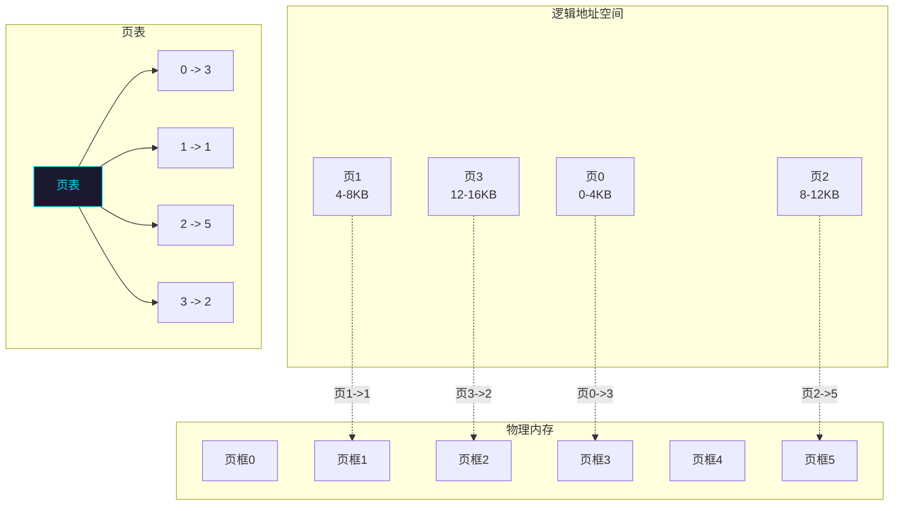

**地址转换**

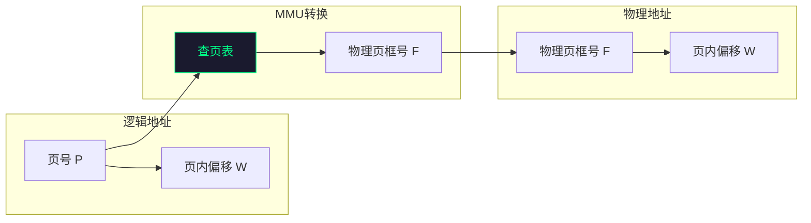

**逻辑地址到物理地址的转换公式**

```
物理地址 = 页框号 × 页大小 + 页内偏移
        = F × PAGE_SIZE + W
```

**分页系统示例**

假设系统采用4KB页大小，32位地址：

```
逻辑地址: 0x003F5A2C
- 二进制: 0000 0000 0011 1111 0101 1010 0010 1100
- 页号 P  = 高20位 = 0x003F5 = 1013
- 页内偏移 W = 低12位 = 0xA2C = 2604

页表项 [1013] = 0x12345 (物理页框号)

物理地址 = 0x12345 × 0x1000 + 0xA2C
        = 0x12345000 + 0xA2C
        = 0x1234FA2C
```

#### 页表结构

**单级页表的问题**

对于32位系统，4GB地址空间，4KB页大小：
- 地址空间共有 4GB / 4KB = 1M = 1,048,576 个页
- 需要 1M 个页表项
- 每个页表项4字节，则页表大小为 4MB

**多级页表**

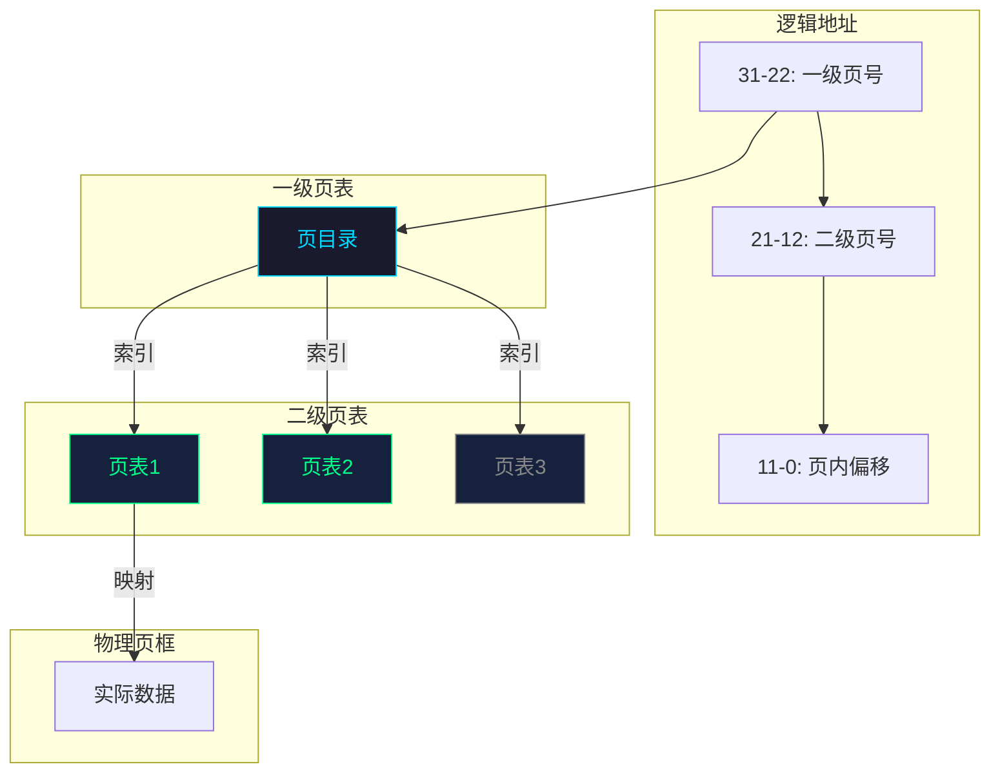

**反向页表（Inverted Page Table）**

对于大地址空间，正向页表会非常大。反向页表按物理页框编号索引，每个物理页框对应一个表项。

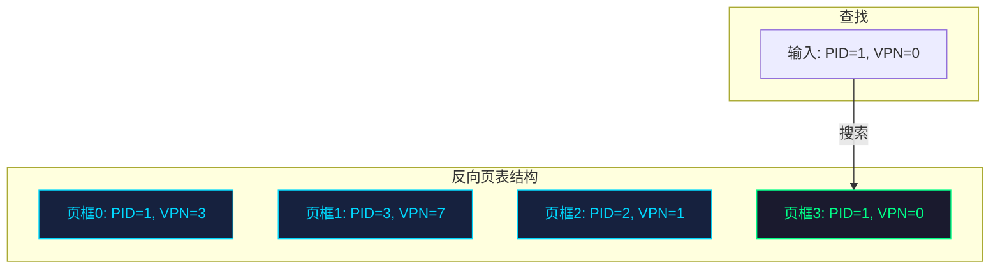

#### TLB（Translation Lookaside Buffer）

TLB是MMU中的一块高速缓存，存储最近使用的页表项。

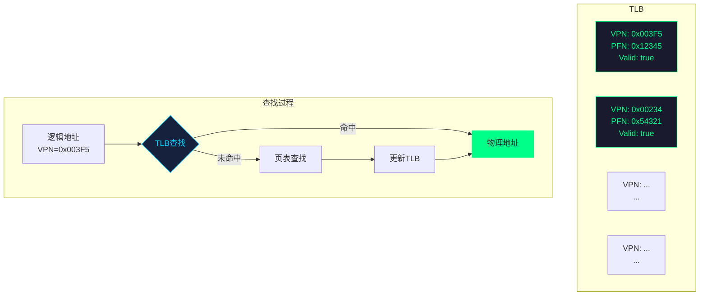

**TLB命中率的重要性**

| TLB命中率 | 平均内存访问时间（10ns内存 + 100ns缓存） |
|-----------|------------------------------------------|
| 0% | 110ns（每次都查页表） |
| 50% | 60ns |
| 80% | 30ns |
| 95% | 14.5ns |

### 6.3.2 分段管理

分段管理将程序的地址空间划分为多个**段（Segment）**，每个段代表一个逻辑单位（如代码段、数据段、堆栈段）。

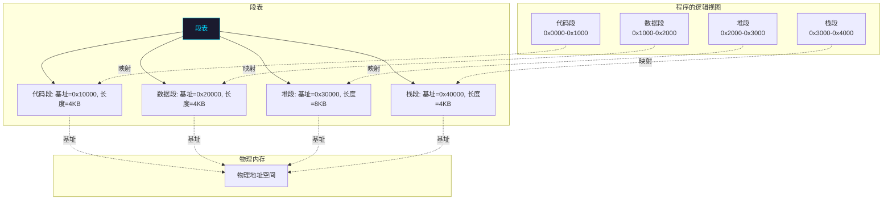

**分段地址格式**

```
逻辑地址: [段号: 段内偏移]
          S        :      OFFSET

物理地址 = 段表[S].base + OFFSET
```

**分页 vs 分段**

| 特性 | 分页 | 分段 |
|------|------|------|
| 单位大小 | 固定（通常4KB） | 变长（逻辑含义） |
| 程序视图 | 一维地址空间 | 二维地址空间 |
| 碎片类型 | 内部碎片 | 外部碎片 |
| 共享能力 | 页面级共享 | 段级共享 |
| 保护 | 页级权限 | 段级权限 |

### 6.3.3 段页式管理

段页式结合了两者的优点：先分段再分页。

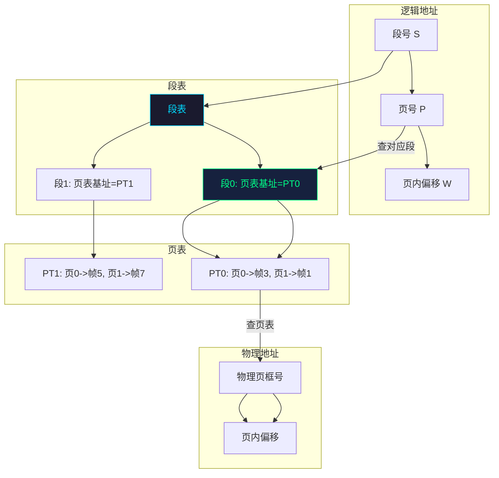

**转换过程**

```
1. 根据段号查段表，得到该段的页表地址
2. 根据页号查页表，得到物理页框号
3. 物理地址 = 物理页框号 × 页大小 + 页内偏移
```

---

## 6.4 虚拟内存

### 6.4.1 局部性原理

虚拟内存的理论基础是程序的局部性原理。

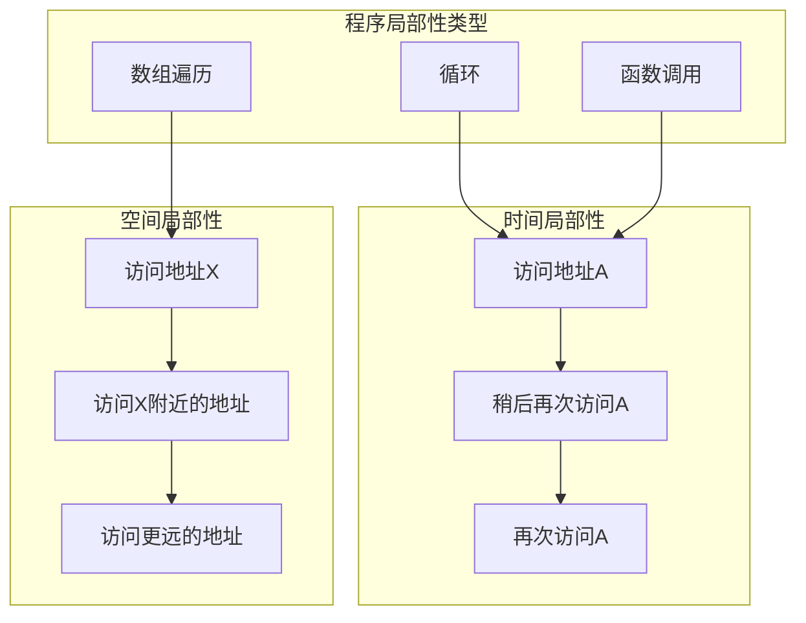

**局部性原理的三种类型**

| 类型 | 描述 | 示例 |
|------|------|------|
| **时间局部性** | 最近访问的项很可能再次访问 | 循环变量、计数器 |
| **空间局部性** | 访问某个地址后，附近地址可能被访问 | 数组遍历、顺序代码 |
| **顺序局部性** | 程序倾向于顺序执行 | 循环、线性数据结构 |

**局部性原理的应用**

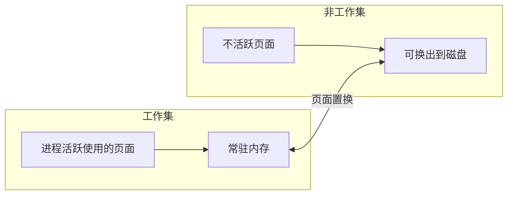

### 6.4.2 请求分页

请求分页是虚拟内存最常用的实现方式，它在分页的基础上增加了页面换入换出机制。

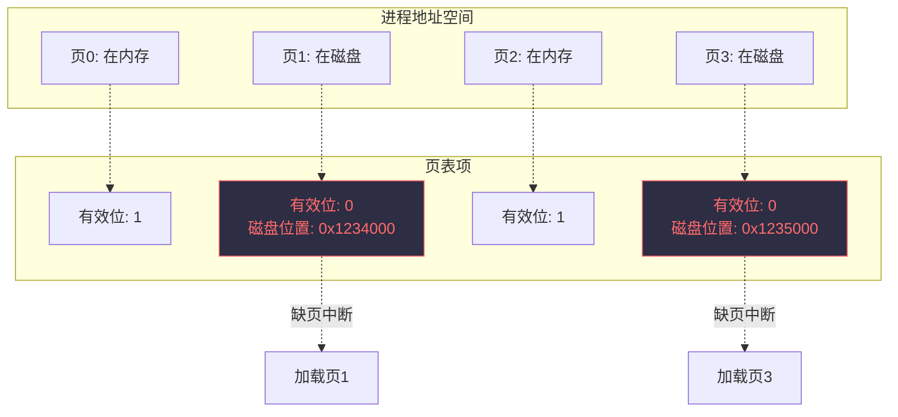

**页表项的扩展**

```c
struct PageTableEntry {
    unsigned int present      : 1;  // 在内存中
    unsigned int modified     : 1;  // 修改过（脏位）
    unsigned int referenced   : 1;  // 访问过（引用位）
    unsigned int protection   : 2;  // 保护位
    unsigned int frame        : 20; // 物理页框号
    unsigned int swap_location : 22; // 磁盘位置
};
```

**缺页中断处理流程**

```mermaid
flowchart TB
    A[访问页面] --> B{页在内存?}
    B -->|是| C[正常访问]
    B -->|否| D[缺页中断]
    D --> E{有空闲帧?}
    E -->|是| F[分配空闲帧]
    E -->|否| G[页面置换]
    F --> H[从磁盘读入页面]
    G --> I[选择victim页面]
    I --> J{victim被修改?}
    J -->|是| K[写回磁盘]
    J -->|否| L[直接重用]
    K --> H
    L --> H
    H --> M[更新页表]
    M --> C
```

### 6.4.3 页面置换算法

当需要将一个页面换入内存，但内存已满时，必须选择一个页面换出。

#### FIFO（先进先出）

**原理**：选择最早进入内存的页面换出。

```c
// FIFO页面置换算法模拟
#include <stdio.h>
#include <stdlib.h>
#include <stdbool.h>

#define FRAME_COUNT 3

// 检查页面是否在内存中
bool in_memory(int page, int frames[], int frame_count) {
    for (int i = 0; i < frame_count; i++) {
        if (frames[i] == page) {
            return true;
        }
    }
    return false;
}

// FIFO置换
int fifo_replace(int page, int frames[], int* next_frame, int frame_count) {
    int replaced = frames[*next_frame];
    frames[*next_frame] = page;
    *next_frame = (*next_frame + 1) % frame_count;
    return replaced;
}

void print_frames(int frames[], int frame_count) {
    for (int i = 0; i < frame_count; i++) {
        if (frames[i] == -1) {
            printf("[ ] ");
        } else {
            printf("[%d] ", frames[i]);
        }
    }
    printf("\n");
}

int main() {
    int pages[] = {7, 0, 1, 2, 0, 3, 0, 4, 2, 3, 0, 3, 2};
    int n = sizeof(pages) / sizeof(pages[0]);
    
    int frames[FRAME_COUNT];
    for (int i = 0; i < FRAME_COUNT; i++) {
        frames[i] = -1;  // -1表示空帧
    }
    
    int next_frame = 0;  // 下一个要替换的帧
    int page_faults = 0;
    
    printf("页面访问序列: ");
    for (int i = 0; i < n; i++) {
        printf("%d ", pages[i]);
    }
    printf("\n\n");
    
    printf("FIFO页面置换过程:\n");
    for (int i = 0; i < n; i++) {
        printf("访问 %d: ", pages[i]);
        
        if (!in_memory(pages[i], frames, FRAME_COUNT)) {
            printf("缺页 -> ");
            int replaced = fifo_replace(pages[i], frames, &next_frame, FRAME_COUNT);
            if (replaced != -1) {
                printf("换出 %d, 换入 %d | ", replaced, pages[i]);
            } else {
                printf("换入 %d | ", pages[i]);
            }
            page_faults++;
        } else {
            printf("命中 | ");
        }
        
        print_frames(frames, FRAME_COUNT);
    }
    
    printf("\n总缺页次数: %d\n", page_faults);
    printf("缺页率: %.2f%%\n", (float)page_faults / n * 100);
    
    return 0;
}
```

#### OPT（最优置换）

**原理**：选择未来最长时间不会被访问的页面换出（理论上最优，但无法实现）。

```c
// OPT页面置换算法模拟
#include <stdio.h>
#include <limits.h>

#define FRAME_COUNT 3

int find_optimal_page(int frames[], int page_count, int pages[],
                      int current_index, int n) {
    int farthest = -1;
    int replace_index = -1;
    
    for (int i = 0; i < page_count; i++) {
        // 找每个在内存中的页面下次访问的位置
        int next_use = INT_MAX;
        for (int j = current_index + 1; j < n; j++) {
            if (pages[j] == frames[i]) {
                next_use = j;
                break;
            }
        }
        
        // 选择下次访问最远的页面
        if (next_use > farthest) {
            farthest = next_use;
            replace_index = i;
        }
    }
    
    return replace_index;
}

bool in_memory(int page, int frames[], int frame_count) {
    for (int i = 0; i < frame_count; i++) {
        if (frames[i] == page) {
            return true;
        }
    }
    return false;
}

int main() {
    int pages[] = {7, 0, 1, 2, 0, 3, 0, 4, 2, 3, 0, 3, 2};
    int n = sizeof(pages) / sizeof(pages[0]);
    
    int frames[FRAME_COUNT];
    for (int i = 0; i < FRAME_COUNT; i++) {
        frames[i] = -1;
    }
    
    int page_faults = 0;
    int frame_count = 0;
    
    printf("OPT页面置换过程:\n");
    for (int i = 0; i < n; i++) {
        printf("访问 %d: ", pages[i]);
        
        if (!in_memory(pages[i], frames, FRAME_COUNT)) {
            printf("缺页 -> ");
            
            if (frame_count < FRAME_COUNT) {
                frames[frame_count++] = pages[i];
                printf("换入 %d", pages[i]);
            } else {
                int replace_index = find_optimal_page(frames, FRAME_COUNT,
                                                       pages, i, n);
                printf("换出 %d, 换入 %d", frames[replace_index], pages[i]);
                frames[replace_index] = pages[i];
            }
            page_faults++;
            printf(" | ");
        } else {
            printf("命中 | ");
        }
        
        for (int j = 0; j < FRAME_COUNT; j++) {
            if (frames[j] == -1) {
                printf("[ ] ");
            } else {
                printf("[%d] ", frames[j]);
            }
        }
        printf("\n");
    }
    
    printf("\n总缺页次数: %d\n", page_faults);
    printf("缺页率: %.2f%%\n", (float)page_faults / n * 100);
    
    return 0;
}
```

#### LRU（最近最少使用）

**原理**：选择最长时间未被访问的页面换出。

```c
// LRU页面置换算法模拟
#include <stdio.h>
#include <stdlib.h>

#define FRAME_COUNT 3

typedef struct {
    int page;
    int last_used;
} Frame;

int find_lru_page(Frame frames[], int frame_count, int current_time) {
    int lru_index = 0;
    int max_idle = current_time - frames[0].last_used;
    
    for (int i = 1; i < frame_count; i++) {
        int idle = current_time - frames[i].last_used;
        if (idle > max_idle) {
            max_idle = idle;
            lru_index = i;
        }
    }
    
    return lru_index;
}

bool in_memory(int page, Frame frames[], int frame_count) {
    for (int i = 0; i < frame_count; i++) {
        if (frames[i].page == page) {
            return true;
        }
    }
    return false;
}

int find_page_index(int page, Frame frames[], int frame_count) {
    for (int i = 0; i < frame_count; i++) {
        if (frames[i].page == page) {
            return i;
        }
    }
    return -1;
}

int main() {
    int pages[] = {7, 0, 1, 2, 0, 3, 0, 4, 2, 3, 0, 3, 2};
    int n = sizeof(pages) / sizeof(pages[0]);
    
    Frame frames[FRAME_COUNT];
    for (int i = 0; i < FRAME_COUNT; i++) {
        frames[i].page = -1;
        frames[i].last_used = -1;
    }
    
    int page_faults = 0;
    int frame_count = 0;
    int time = 0;
    
    printf("LRU页面置换过程:\n");
    for (int i = 0; i < n; i++) {
        printf("访问 %d (t=%d): ", pages[i], time);
        
        if (!in_memory(pages[i], frames, FRAME_COUNT)) {
            printf("缺页 -> ");
            
            if (frame_count < FRAME_COUNT) {
                frames[frame_count].page = pages[i];
                frames[frame_count].last_used = time;
                frame_count++;
                printf("换入 %d", pages[i]);
            } else {
                int replace_index = find_lru_page(frames, FRAME_COUNT, time);
                printf("换出 %d, 换入 %d", frames[replace_index].page, pages[i]);
                frames[replace_index].page = pages[i];
                frames[replace_index].last_used = time;
            }
            page_faults++;
            printf(" | ");
        } else {
            int idx = find_page_index(pages[i], frames, FRAME_COUNT);
            frames[idx].last_used = time;
            printf("命中 | ");
        }
        
        for (int j = 0; j < FRAME_COUNT; j++) {
            if (frames[j].page == -1) {
                printf("[ ] ");
            } else {
                printf("[%d:%d] ", frames[j].page, frames[j].last_used);
            }
        }
        printf("\n");
        time++;
    }
    
    printf("\n总缺页次数: %d\n", page_faults);
    printf("缺页率: %.2f%%\n", (float)page_faults / n * 100);
    
    return 0;
}
```

#### Clock算法（改进的二次机会）

**原理**：使用引用位，选择最近未被使用的页面换出。

```c
// Clock页面置换算法
#include <stdio.h>
#include <stdbool.h>

#define FRAME_COUNT 4

typedef struct {
    int page;
    bool referenced;  // 引用位 (R)
    bool modified;    // 修改位 (M)
} Frame;

void print_frames(Frame frames[], int frame_count, int hand) {
    for (int i = 0; i < frame_count; i++) {
        if (i == hand) {
            printf(">[%d:R=%d,M=%d] ", frames[i].page,
                   frames[i].referenced,
                   frames[i].modified);
        } else {
            printf(" [%d:R=%d,M=%d] ", frames[i].page,
                   frames[i].referenced,
                   frames[i].modified);
        }
    }
    printf("\n");
}

int clock_algorithm(int pages[], int n, int frame_count) {
    Frame frames[frame_count];
    for (int i = 0; i < frame_count; i++) {
        frames[i].page = -1;
        frames[i].referenced = false;
        frames[i].modified = false;
    }
    
    int page_faults = 0;
    int hand = 0;  // 时钟指针
    
    printf("Clock页面置换算法 (附加引用位):\n\n");
    
    for (int i = 0; i < n; i++) {
        printf("访问 %d: ", pages[i]);
        
        // 查找页面是否在内存中
        int frame_index = -1;
        for (int j = 0; j < frame_count; j++) {
            if (frames[j].page == pages[i]) {
                frame_index = j;
                break;
            }
        }
        
        if (frame_index != -1) {
            // 命中，设置引用位
            frames[frame_index].referenced = true;
            printf("命中 | ");
        } else {
            // 缺页，使用Clock算法找替换页
            printf("缺页 -> ");
            page_faults++;
            
            while (true) {
                if (!frames[hand].referenced && !frames[hand].modified) {
                    // 情况1: R=0, M=0 -> 直接替换
                    printf("R=0,M=0 替换 [%d] ", frames[hand].page);
                    frames[hand].page = pages[i];
                    frames[hand].referenced = true;
                    frames[hand].modified = false;
                    hand = (hand + 1) % frame_count;
                    break;
                } else if (!frames[hand].referenced && frames[hand].modified) {
                    // 情况2: R=0, M=1 -> 写回磁盘，R=0
                    printf("R=0,M=1 写回 [%d] ", frames[hand].page);
                    frames[hand].referenced = true;  // 简化：设为引用
                    hand = (hand + 1) % frame_count;
                } else {
                    // 情况3: R=1 -> 给第二次机会，R=0
                    printf("R=1 跳过 [%d] ", frames[hand].page);
                    frames[hand].referenced = false;
                    hand = (hand + 1) % frame_count;
                }
            }
            printf("| ");
        }
        
        print_frames(frames, frame_count, hand);
    }
    
    return page_faults;
}

int main() {
    int pages[] = {7, 0, 1, 2, 0, 3, 0, 4, 2, 3, 0, 3, 2, 1, 1, 1};
    int n = sizeof(pages) / sizeof(pages[0]);
    
    int faults = clock_algorithm(pages, n, FRAME_COUNT);
    
    printf("\n总缺页次数: %d\n", faults);
    printf("缺页率: %.2f%%\n", (float)faults / n * 100);
    
    return 0;
}
```

**算法对比**

```mermaid
flowchart TB
    A[页面置换算法] --> B[FIFO]
    A --> C[OPT]
    A --> D[LRU]
    A --> E[Clock]
    
    B --> B1[简单但可能<br/>Belady异常]
    C --> C1[理论最优<br/>无法实现]
    D --> D1[效果好<br/>开销大]
    E --> E1[近似LRU<br/>开销可接受]
    
    style B1 fill:#2d2d44,stroke:#ff6b6b,color:#ff6b6b
    style C1 fill:#2d2d44,stroke:#00ff88,color:#00ff88
    style D1 fill:#2d2d44,stroke:#00d9ff,color:#00d9ff
    style E1 fill:#2d2d44,stroke:#ffd93d,color:#ffd93d
```

| 算法 | 优点 | 缺点 | Belady异常 |
|------|------|------|-----------|
| FIFO | 简单 | 可能淘汰常用页 | 可能 |
| OPT | 缺页率最低 | 需要未来访问信息 | 不会 |
| LRU | 接近OPT | 需要硬件支持 | 不会 |
| Clock | 近似LRU，开销小 | 不如LRU精确 | 可能 |

---

## 6.5 内存管理高级主题

### 6.5.1 工作集模型

工作集理论由Peter Denning提出，用于描述进程在时间t的工作集。

**定义**

```
W(t, Δ) = {页面 p | p 在时间区间 [t-Δ+1, t] 内被访问过}
```

- Δ：工作集窗口大小
- |W(t, Δ)|：工作集大小（页面数）

```mermaid
flowchart TB
    subgraph 时间线
        A[t-Δ+1] --> B[t]
    end
    
    subgraph 工作集
        C[活跃页面1]
        D[活跃页面2]
        E[活跃页面3]
        F[...]
    end
    
    subgraph 内存状态
        G[常驻集]
        H[换出页面]
    end
    
    C --> G
    D --> G
    E --> G
    F -.-> H
    
    style G fill:#16213e,stroke:#00ff88,color:#00ff88
    style H fill:#2d2d44,stroke:#888888,color:#888888
```

**工作集与常驻集的关系**

| 关系 | 说明 | 结果 |
|------|------|------|
| |W(t,Δ)| < R(t) | 可能发生抖动 |
| |W(t,Δ)| ≈ R(t) | 良好工作状态 |
| |W(t,Δ)| > R(t) | 频繁换页，性能下降 |

### 6.5.2 抖动现象

当内存严重不足时，处理器花费大量时间在换页上，而不是执行有用工作。

```mermaid
flowchart LR
    subgraph 低CPU利用率
        A[进程数少] --> D[低页面交换]
    end

    subgraph 抖动区域
        B[进程数适中] --> E[最优性能]
        C[进程数过多] --> F[频繁换页<br/>高CPU等待]
    end

    subgraph 过高
        G[抖动<br/>系统崩溃]
    end

    B --> G

    E -.->|增加进程| F
    F -.->|增加进程| G
```

**抖动的根本原因**

```mermaid
flowchart TB
    A[进程工作集 > 物理内存] --> B[频繁缺页]
    B --> C[换页设备忙碌]
    C --> D[进程等待换页完成]
    D --> E[CPU利用率下降]
    E -->|调度器增加更多进程| A
```

**解决抖动的方法**

| 方法 | 描述 |
|------|------|
| **全局调节** | 挂起或终止部分进程 |
| **局部进程控制** | 每个进程维护独立工作集 |
| **预留内存** | 为关键系统进程预留内存 |
| **调整优先级** | 降低频繁换页进程的优先级 |

### 6.5.3 内存映射文件

内存映射文件允许将磁盘文件映射到进程的虚拟地址空间，像访问内存一样访问文件。

```mermaid
flowchart TB
    subgraph 进程虚拟地址空间
        A[代码段] 
        B[数据段]
        C[内存映射文件区域]
        D[堆]
        E[栈]
    end
    
    subgraph 操作系统
        F[文件系统]
        G[物理内存]
    end
    
    C -.->|按需加载| G
    G -.->|脏页写回| F
    
    style C fill:#1a1a2e,stroke:#00d9ff,color:#00d9ff
```

**使用内存映射文件的优势**

| 优势 | 说明 |
|------|------|
| 简化I/O操作 | 像内存读写一样读写文件 |
| 高效随机访问 | 直接通过指针访问文件内容 |
| 进程间共享 | 多个进程共享同一文件映射 |
| 延迟加载 | 仅在实际访问时加载数据 |

**代码示例**

```c
// mmap示例 - Linux
#include <stdio.h>
#include <stdlib.h>
#include <string.h>
#include <sys/mman.h>
#include <sys/stat.h>
#include <fcntl.h>

#define FILE_SIZE 4096

int main() {
    const char* filename = "test.dat";
    
    // 创建并打开文件
    int fd = open(filename, O_RDWR | O_CREAT, 0644);
    if (fd == -1) {
        perror("open");
        return 1;
    }
    
    // 扩展文件大小
    ftruncate(fd, FILE_SIZE);
    
    // 内存映射文件
    char* addr = mmap(NULL, FILE_SIZE,
                      PROT_READ | PROT_WRITE,
                      MAP_SHARED, fd, 0);
    
    if (addr == MAP_FAILED) {
        perror("mmap");
        close(fd);
        return 1;
    }
    
    // 通过内存地址写入文件
    strcpy(addr, "Hello, Memory-Mapped File!");
    
    // 同步到磁盘
    msync(addr, FILE_SIZE, MS_SYNC);
    
    printf("写入内容: %s\n", addr);
    
    // 解除映射
    munmap(addr, FILE_SIZE);
    close(fd);
    
    return 0;
}
```

```python
# Python中的内存映射文件
import mmap
import os

filename = "test.txt"

# 创建文件
with open(filename, "w") as f:
    f.write("Hello from memory-mapped file!")

# 内存映射读取
with open(filename, "r") as f:
    # 将文件映射到内存
    mm = mmap.mmap(f.fileno(), 0, access=mmap.ACCESS_READ)
    content = mm.read()
    print("读取内容:", content.decode())
    mm.close()

# 内存映射写入
with open(filename, "w") as f:
    mm = mmap.mmap(f.fileno(), 0, access=mmap.ACCESS_WRITE)
    mm[0:5] = b"HELLO"  # 像操作字节数组一样写入
    mm.close()
```

---

## 6.6 实际系统中的内存管理

### 6.6.1 Linux内存布局

```mermaid
flowchart TB
    subgraph Linux进程虚拟地址空间
        A[0xFFFFFFFF<br/>内核空间] --> B[固定映射区域]
        B --> C[vmalloc区域]
        C --> D[物理内存映射<br/>直接映射]
        D --> E[高端内存HugePage]
        E --> F[空闲内存]
        F --> G[栈<br/>向下增长]
        G --> H[内存映射区域<br/>mmap]
        H --> I[堆<br/>向上增长]
        I --> J[未初始化数据<br/>BSS]
        J --> K[已初始化数据]
        K --> L[代码段<br/>Text]
        L --> M[0x00000000<br/>保留]
    end
    
    subgraph 典型地址范围
        N[0xC0000000<br/>3GB]
        O[0x00400000<br/>4MB]
        P[0x08048000<br/>128MB]
    end
    
    style A fill:#1a1a2e,stroke:#00ff88,color:#00ff88
    style L fill:#16213e,stroke:#00d9ff,color:#00d9ff
    style I fill:#16213e,stroke:#00d9ff,color:#00d9ff
    style G fill:#16213e,stroke:#00d9ff,color:#00d9ff
```

**Linux内存布局详解**

| 区域 | 说明 | 典型大小 |
|------|------|---------|
| 内核空间 | 内核代码和数据 | 1GB（高1GB） |
| 栈 | 函数调用，局部变量 | 8MB（可扩展） |
| mmap | 内存映射、共享库 | 可变 |
| 堆 | 动态分配内存 | 可变 |
| BSS | 未初始化全局变量 | 可变 |
| 数据段 | 已初始化全局变量 | 可变 |
| 代码段 | 程序代码 | 可变 |

### 6.6.2 查看系统内存状态

```bash
# Linux查看内存使用
cat /proc/meminfo

# 关键指标
# MemTotal: 总物理内存
# MemFree: 空闲内存
# MemAvailable: 可用内存（考虑缓存）
# SwapTotal: swap总量
# SwapFree: swap空闲

# top命令查看内存
top -o %MEM

# free命令
free -h

# 查看进程内存映射
pmap -x <pid>

# 查看slab内存使用
slabtop
```

### 6.6.3 Windows内存管理

```mermaid
flowchart TB
    subgraph Windows虚拟地址空间 32位
        A[0xFFFFFFFF<br/>内核模式] 
        B[0xC0000000<br/>系统页表]
        C[0x80000000<br/>系统-cache区]
        D[0x7FFE0000<br/>MM共享区]
        E[0x00010000<br/>用户模式]
        F[0x00003000<br/>空指针区]
        G[0x00000000<br/>未访问]
    end
    
    style A fill:#1a1a2e,stroke:#00ff88,color:#00ff88
    style E fill:#16213e,stroke:#00d9ff,color:#00d9ff
    style F fill:#2d2d44,stroke:#ff6b6b,color:#ff6b6b
    style G fill:#2d2d44,stroke:#ff6b6b,color:#ff6b6b
```

**Windows内存命令**

```powershell
# 查看内存状态
Get-ComputerInfo | Select-Object CsPhysicalMemory, CsVirtualMemory

# 查看进程内存
Get-Process | Sort-Object WorkingSet -Descending | Select-Object -First 10

# 查看内存使用详情
tasklist /FI "MEMUSAGE gt 50000" /FO LIST

# Performance Monitor
perfmon
```

---

## 6.7 本章小结

```mermaid
flowchart TB
    A[内存管理] --> B[连续分配]
    A --> C[非连续分配]
    A --> D[虚拟内存]
    
    B --> B1[单一连续]
    B --> B2[固定分区]
    B --> B3[可变分区]
    B3 --> B4[首次适应]
    B3 --> B5[最佳适应]
    B3 --> B6[最差适应]
    
    C --> C1[分页管理]
    C --> C2[分段管理]
    C --> C3[段页式]
    
    D --> D1[请求分页]
    D1 --> D2[FIFO]
    D1 --> D3[LRU]
    D1 --> D4[OPT]
    D1 --> D5[Clock]
    
    style A fill:#1a1a2e,stroke:#00d9ff,color:#00d9ff
```

**核心知识点回顾**

1. **地址空间隔离**：通过MMU实现逻辑地址到物理地址的转换，进程拥有独立的虚拟地址空间

2. **分页机制**：固定大小的页面简化了内存管理，减少了外部碎片

3. **分段机制**：按逻辑含义划分地址空间，支持共享和保护

4. **虚拟内存**：利用局部性原理，在磁盘上维护交换空间，扩展可用内存

5. **页面置换**：FIFO、LRU、OPT、Clock等算法各有优劣，实际系统常用Clock变体

6. **工作集与抖动**：理解工作集模型是解决抖动问题的基础

---

## 6.8 习题与实践

### 概念题

1. 解释逻辑地址、物理地址和交换地址的区别
2. 什么是内部碎片和外部碎片？各举一个产生它们的例子
3. 说明页表和段表的区别
4. 什么是TLB？它如何提高地址转换效率？
5. 解释Belady异常现象

### 计算题

1. **地址转换**：某系统采用分页管理，页大小为4KB。给定逻辑地址0x12345，请计算页号和页内偏移

2. **页面置换**：假设内存有3个帧，访问序列为：1,2,3,4,1,2,5,1,2,3,4,5。计算FIFO和LRU的缺页次数

3. **工作集**：某进程在时间t的工作集窗口为5，当前访问序列为3,4,5,6,7,8,9,10,11,12，求W(t,5)

### 实践题

1. **实现分页模拟器**：编写程序模拟分页地址转换过程
2. **实现页面置换算法**：对比FIFO、LRU、OPT在不同访问序列下的表现
3. **分析系统内存**：使用工具分析Linux/Windows系统的内存使用情况

---

## 参考文献

- Silberschatz, Galvin, Gagne - Operating System Concepts
- Tanenbaum, Bos - Modern Operating Systems
- Love - Linux Kernel Development
- Microsoft Windows Internals
