# 第7章 文件系统

## 概述

文件系统是操作系统中负责管理和存储文件的核心组件，它为用户和应用程序提供了便捷的数据持久化接口。本章将深入探讨文件系统的各个层面，从基本概念到实现细节，帮助读者建立完整的文件系统知识体系。

---

## 7.1 文件系统概述

### 7.1.1 文件的概念

**文件（File）** 是操作系统中用于存储数据的基本单位，它是一个具有符号名的、逻辑上具有完整意义的信息集合。从用户角度来看，文件是程序、数据、文档等信息的抽象表示；从操作系统角度来看，文件是磁盘上连续或分散存储的字节序列。

文件具有以下主要属性：

| 属性 | 说明 |
|------|------|
| 文件名 | 用于标识文件的字符串，同一目录下不能重名 |
| 文件类型 | 普通文件、目录文件、设备文件等 |
| 文件大小 | 文件占据的字节数 |
| 创建时间 | 文件创建的时间戳 |
| 修改时间 | 文件最后修改的时间戳 |
| 访问权限 | 读、写、执行等权限控制 |
| 文件位置 | 文件在磁盘上的存储位置信息 |

### 7.1.2 文件系统的定义

**文件系统（File System）** 是操作系统中负责管理文件和对文件进行操作的软件系统，它提供了文件操作的抽象接口，使得用户和应用程序可以方便地存储、检索、修改和组织数据，而无需关心底层的物理存储细节。

文件系统的主要功能包括：


### 7.1.3 文件操作

文件系统提供了一系列系统调用来操作文件，以下是常见的文件操作：

```c
// 常见的文件操作系统调用
open()      // 打开文件
close()     // 关闭文件
read()      // 读取文件内容
write()     // 写入文件内容
lseek()     // 移动文件指针
unlink()    // 删除文件
rename()    // 重命名文件
stat()      // 获取文件属性
chmod()     // 修改文件权限
```

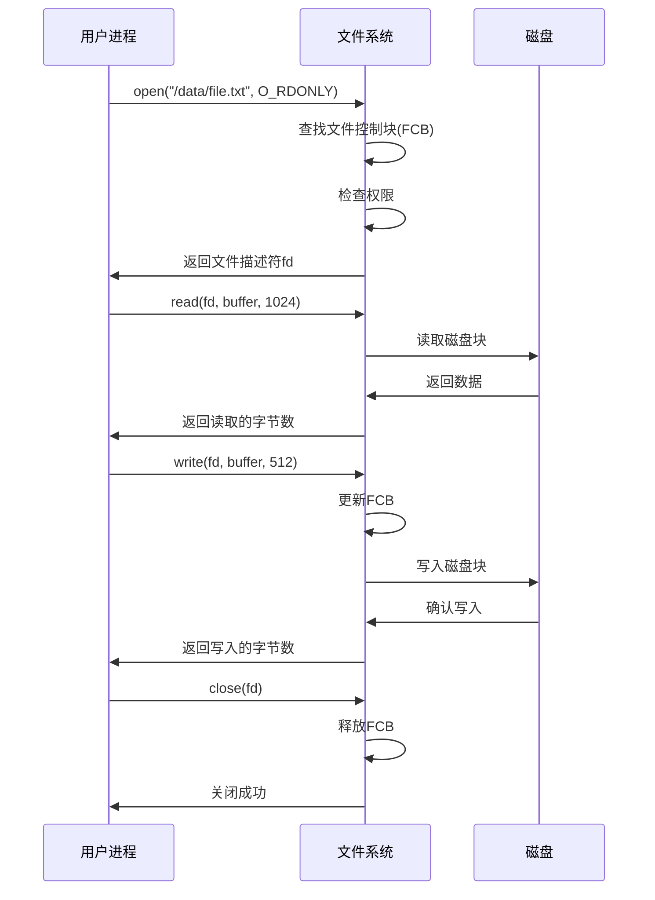

---

## 7.2 文件的类型与结构

### 7.2.1 按用途分类

根据文件的用途和性质，文件可以分为以下几类：

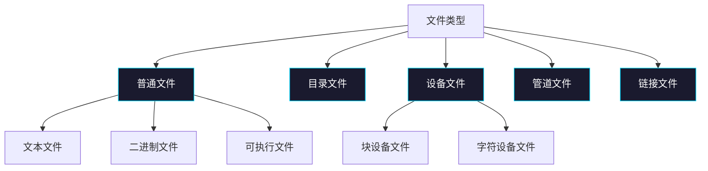

**1. 普通文件（Regular File）**

普通文件是存储用户数据的常规文件，包括：
- **文本文件**：由ASCII字符或Unicode字符组成，可以用文本编辑器查看，如 `.txt`、`.md`、`.c` 文件
- **二进制文件**：包含特定的二进制格式数据，如 `.exe`、`.pdf`、`.jpg` 文件
- **可执行文件**：包含机器指令，可以由操作系统直接执行，如 `.exe`、`.elf` 文件

**2. 目录文件（Directory File）**

目录文件是一种特殊的文件，它用于组织和层次化管理系统中的其他文件。目录文件的内容是其他文件或子目录的引用信息。

**3. 设备文件（Device File）**

设备文件是物理设备在文件系统中的抽象表示，包括：
- **块设备文件（Block Device）**：以数据块为单位进行随机访问，如硬盘、SSD
- **字符设备文件（Character Device）**：以字符流为单位进行顺序访问，如键盘、鼠标、串口

**4. 管道文件（Pipe File）**

管道文件用于进程间通信，分为匿名管道和命名管道。

**5. 链接文件（Link File）**

链接文件是对其他文件的引用，包括硬链接和软链接（符号链接）。

### 7.2.2 按访问方式分类

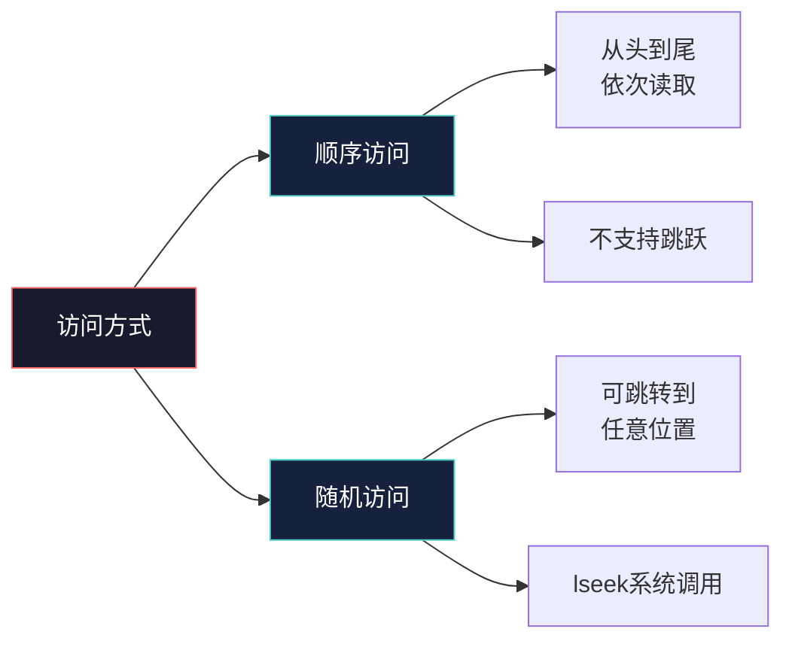

**1. 顺序访问（Sequential Access）**

顺序访问的文件必须从头开始，按照字节顺序依次读取，不能跳跃。磁带是典型的顺序访问存储设备。

```c
// 顺序访问示例
FILE *fp = fopen("data.txt", "r");
char buffer[100];
while (fread(buffer, 1, 100, fp) > 0) {
    // 处理数据
}
fclose(fp);
```

**2. 随机访问（Random Access）**

随机访问允许直接跳转到文件的任意位置进行读写操作。磁盘文件系统都支持随机访问。

```c
// 随机访问示例
int fd = open("data.bin", O_RDWR);
lseek(fd, 1024, SEEK_SET);  // 跳转到第1024字节处
read(fd, buffer, 256);       // 从当前位置读取256字节
lseek(fd, -512, SEEK_CUR);  // 向后移动512字节
write(fd, data, 128);       // 写入128字节
close(fd);
```

### 7.2.3 文件的逻辑结构

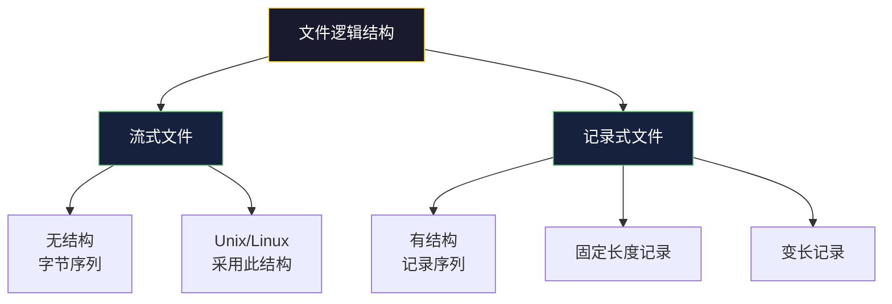

**1. 流式文件（Stream File）**

流式文件是无结构的字节序列，文件的长度就是字节的数量。操作系统不关心文件内容的含义，只负责按字节顺序传输数据。UNIX/Linux系统采用流式文件结构。

```c
// 流式文件操作
// 文件被看作连续的字节流
Byte 0  Byte 1  Byte 2  Byte 3  ...  Byte N-2  Byte N-1
|-------|-------|-------|-------|     |-------|-------|
|   A   |   B   |   C   |   D   | ... |   X   |   Y   |
|-------|-------|-------|-------|     |-------|-------|
```

**2. 记录式文件（Record File）**

记录式文件由一组具有特定结构的记录组成，每个记录包含若干字段。数据库文件是典型的记录式文件。

```c
// 记录式文件示例 - 定长记录
struct Student {
    int id;        // 学号 4字节
    char name[20]; // 姓名 20字节
    int age;       // 年龄 4字节
};  // 总计28字节/记录

// 文件组织
| Record 0 | Record 1 | Record 2 | ... | Record N |
| 28 bytes | 28 bytes | 28 bytes | ... | 28 bytes |
```

---

## 7.3 目录结构

目录结构决定了文件中数据的组织形式，对文件的检索效率和管理能力有重要影响。

### 7.3.1 单级目录

单级目录是最简单的目录结构，整个系统只有一个目录，所有文件都平级的放在这个目录中。

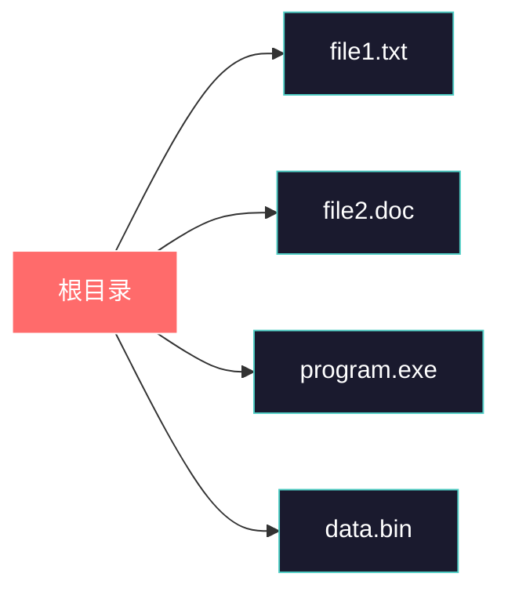

**特点**：
- 结构简单，易于实现
- 文件名不能重复
- 查找速度慢，时间复杂度 O(n)
- 无法实现文件分类管理

**实现**：
```c
// 单级目录实现
struct SimpleDir {
    char filename[MAX_FILES][MAX_FILENAME];
    int fileCount;
};
```

### 7.3.2 两级目录

两级目录解决了单级目录的问题，系统包含一个主目录（MA）和多个用户目录。

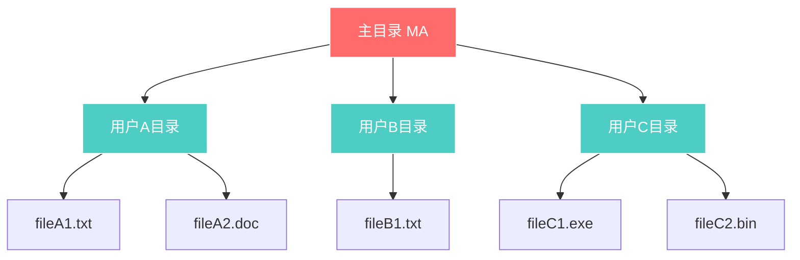

**特点**：
- 不同用户可以有相同文件名
- 实现了用户隔离
- 查找范围缩小，但仍不支持深层组织

### 7.3.3 树形目录

树形目录是现代操作系统广泛采用的目录结构，它具有层次化的组织方式。

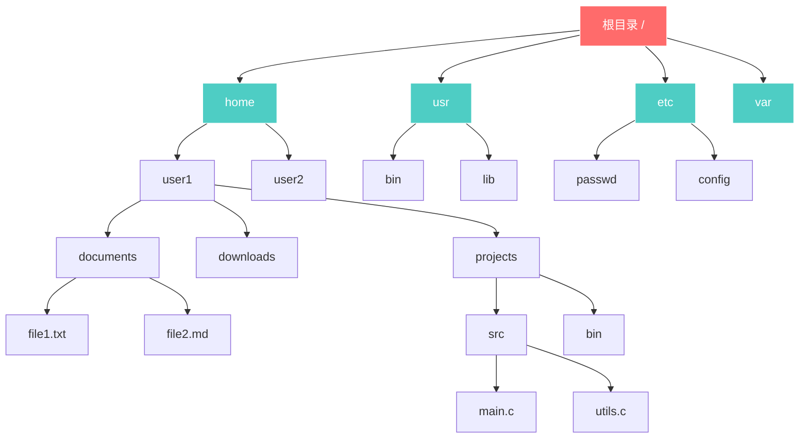

**特点**：
- 支持多层次目录结构
- 查找效率高，平均时间复杂度 O(log n)
- 便于文件分类和管理
- 支持路径表示（绝对路径和相对路径）

**路径表示**：
```
绝对路径：从根目录开始的完整路径
         /home/user1/projects/src/main.c

相对路径：从当前目录开始的路径
         src/main.c          # 相对当前目录
         ../user2/file.txt   # 相对上级目录
         ./current/file.dat  # 相对当前目录（显式）
```

### 7.3.4 图形目录

图形目录结构允许目录之间存在共享子目录，形成有向无环图（DAG）结构，支持目录的共享和链接。

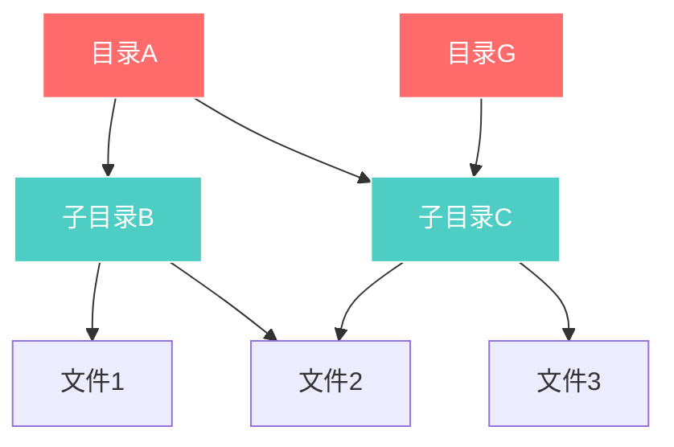

**共享类型**：
- **硬链接**：多个目录项指向同一个文件的inode
- **软链接（符号链接）**：包含另一个目录项路径的特殊文件

### 7.3.5 目录操作

```c
// 目录操作示例
#include <stdio.h>
#include <dirent.h>
#include <sys/stat.h>

void list_directory(const char *path) {
    DIR *dir = opendir(path);
    struct dirent *entry;
    struct stat file_stat;

    while ((entry = readdir(dir)) != NULL) {
        // 跳过 . 和 ..
        if (strcmp(entry->d_name, ".") == 0 ||
            strcmp(entry->d_name, "..") == 0)
            continue;

        // 构建完整路径
        char fullpath[1024];
        snprintf(fullpath, sizeof(fullpath), "%s/%s", path, entry->d_name);

        // 获取文件信息
        if (lstat(fullpath, &file_stat) == 0) {
            printf("%10ld  %c  %s\n",
                   file_stat.st_size,
                   S_ISDIR(file_stat.st_mode) ? 'd' : '-',
                   entry->d_name);
        }
    }

    closedir(dir);
}
```

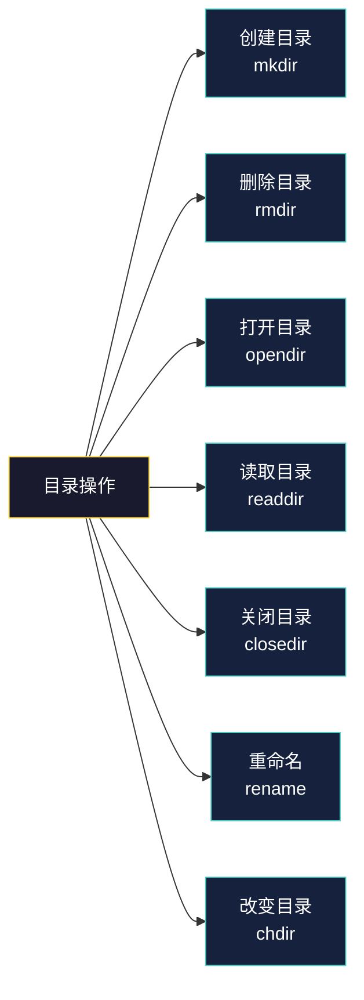

---

## 7.4 文件系统实现

### 7.4.1 文件控制块（FCB）

文件控制块是文件系统为每个文件维护的数据结构，用于存储文件的元数据信息。


**FCB 结构示例**：

```c
// 简化版FCB结构
struct FileControlBlock {
    char     filename[256];      // 文件名
    uint32_t file_size;          // 文件大小（字节）
    uint16_t created_time;       // 创建时间
    uint16_t modified_time;      // 修改时间
    uint16_t created_date;       // 创建日期
    uint16_t modified_date;      // 修改日期
    uint8_t  file_type;          // 文件类型
    uint8_t  protection;         // 保护模式
    uint16_t block_count;       // 占用块数
    uint32_t block_array[16];    // 块号数组（直接块）
    uint32_t indirect_block;    // 间接块指针
    uint32_t double_indirect;    // 双重间接块指针
};
```

### 7.4.2 inode 结构

inode（索引节点）是 UNIX/Linux 文件系统的核心数据结构，每个文件都有一个唯一的 inode。


**inode 结构详细说明**：

```c
// ext4 文件系统 inode 结构（简化版）
struct ext4_inode {
    uint16_t i_mode;         // 文件类型和权限
    uint16_t i_uid;          // 所有者用户ID
    uint32_t i_size;         // 文件大小（字节）
    uint32_t i_atime;        // 最后访问时间
    uint32_t i_ctime;        // inode修改时间
    uint32_t i_mtime;        // 内容修改时间
    uint32_t i_dtime;        // 删除时间
    uint16_t i_gid;          // 所有者组ID
    uint16_t i_links_count;  // 硬链接数
    uint32_t i_blocks;       // 占用块数（512字节块）
    uint32_t i_flags;        // 文件标志
    uint32_t i_osd1;         // 操作系统特定数据
    uint32_t i_block[15];    // 块指针数组
    uint32_t i_generation;   // 文件版本（用于NFS）
    uint32_t i_file_acl;     // ACL块号
    uint32_t i_dir_acl;      // 目录ACL
    uint32_t i_size_high;    // 大文件大小高32位
    uint32_t i_obso_faddr;   // 废弃的块地址
    uint8_t  i_osd2[12];     // 操作系统特定数据
};
```

**inode 支持的文件大小计算**：

```c
// 假设块大小为4KB，每个块号占4字节
// 直接块：12个块
// 单间接：256个块
// 双间接：256*256个块
// 三间接：256*256*256个块

#define BLOCK_SIZE 4096
#define POINTER_SIZE 4

// 直接块寻址能力
#define DIRECT_BLOCKS 12
#define DIRECT_SIZE (DIRECT_BLOCKS * BLOCK_SIZE)

// 单间接寻址能力
#define POINTERS_PER_BLOCK (BLOCK_SIZE / POINTER_SIZE)  // 1024个指针
#define SINGLE_INDIRECT_SIZE (POINTERS_PER_BLOCK * BLOCK_SIZE)

// 双间接寻址能力
#define DOUBLE_INDIRECT_SIZE (POINTERS_PER_BLOCK * POINTERS_PER_BLOCK * BLOCK_SIZE)

// 三间接寻址能力
#define TRIPLE_INDIRECT_SIZE (POINTERS_PER_BLOCK * POINTERS_PER_BLOCK * POINTERS_PER_BLOCK * BLOCK_SIZE)

/*
 * 最大文件大小计算：
 * 12 * 4KB + 1024 * 4KB + 1024² * 4KB + 1024³ * 4KB
 * = 48KB + 4MB + 4GB + 4TB
 */
```

### 7.4.3 目录实现

目录是特殊的文件，用于存储文件名和inode编号的映射关系。

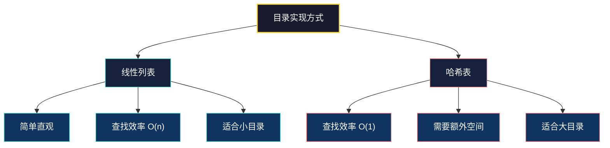

**线性列表实现**：

```c
// 目录项结构（ext2/ ext4）
struct ext4_dir_entry {
    uint32_t inode;          // inode编号（0表示未使用）
    uint16_t rec_len;        // 目录项长度
    uint8_t  name_len;       // 文件名长度
    uint8_t  file_type;      // 文件类型
    char     name[];         // 文件名（可变长度）
};

// 目录文件的逻辑结构
/*
| dir_entry | dir_entry | dir_entry | ... |
| inode=5   | inode=8   | inode=12  |     |
| name="a"  | name="b"  | name="c"  |     |
*/
```

**哈希表实现**：

```c
// 哈希目录结构
struct hash_dir {
    int capacity;              // 哈希表容量
    int size;                  // 当前条目数
    struct hash_entry **table; // 哈希数组
};

struct hash_entry {
    char *filename;
    uint32_t inode;
    struct hash_entry *next;   // 解决冲突的链表
};

// 哈希函数
unsigned int hash(const char *filename, int capacity) {
    unsigned int hash = 0;
    while (*filename) {
        hash = (hash * 31 + *filename) % capacity;
        filename++;
    }
    return hash;
}
```

### 7.4.4 磁盘空间管理

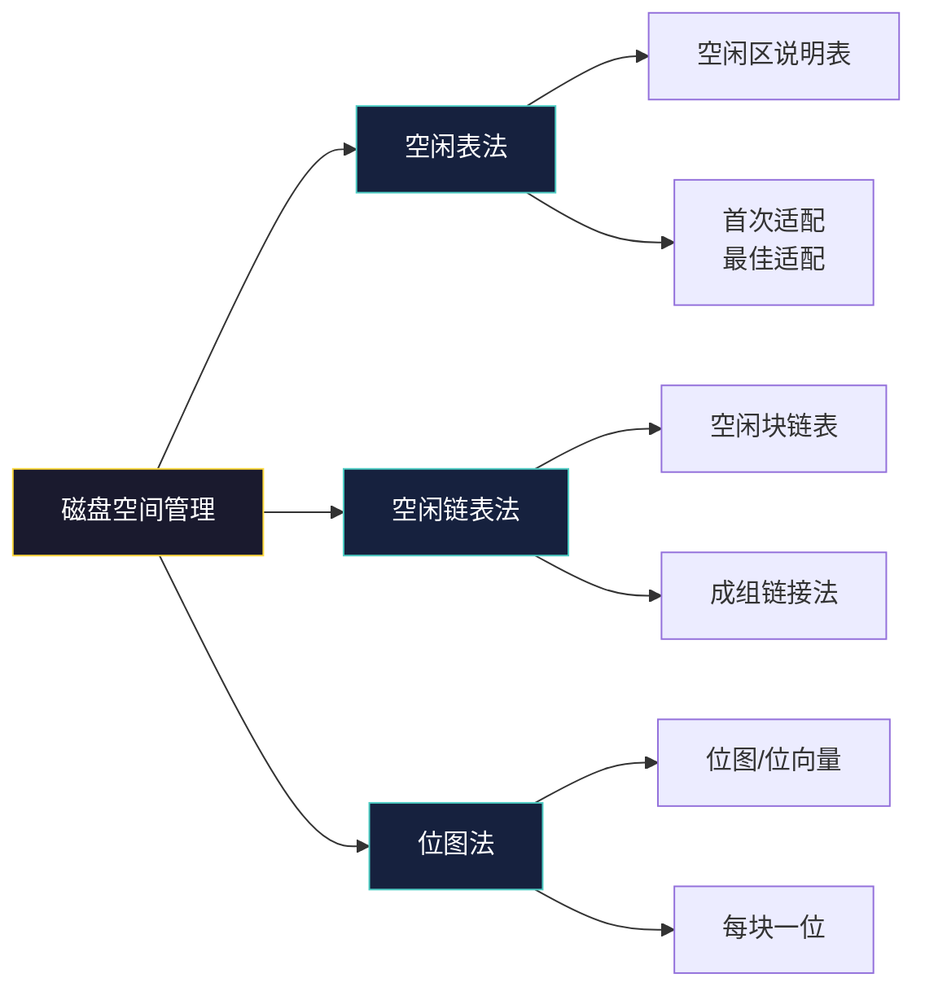

**1. 空闲表法**

```c
// 空闲区说明表
struct free_space_table {
    int start_block;   // 起始块号
    int block_count;    // 连续块数
};

// 空闲表示例
/*
| 起始块号 | 块数  | 状态   |
|----------|-------|--------|
| 0        | 100   | 已占用 |
| 100      | 50    | 空闲   |
| 150      | 200   | 已占用 |
| 350      | 80    | 空闲   |
| 430      | 1000  | 已占用 |
*/

// 首次适配算法
int first_fit(int blocks_needed) {
    for (int i = 0; i < table_size; i++) {
        if (table[i].status == FREE &&
            table[i].block_count >= blocks_needed) {
            // 分配空间
            return table[i].start_block;
        }
    }
    return -1;  // 没有足够的连续空间
}
```

**2. 空闲链表法**

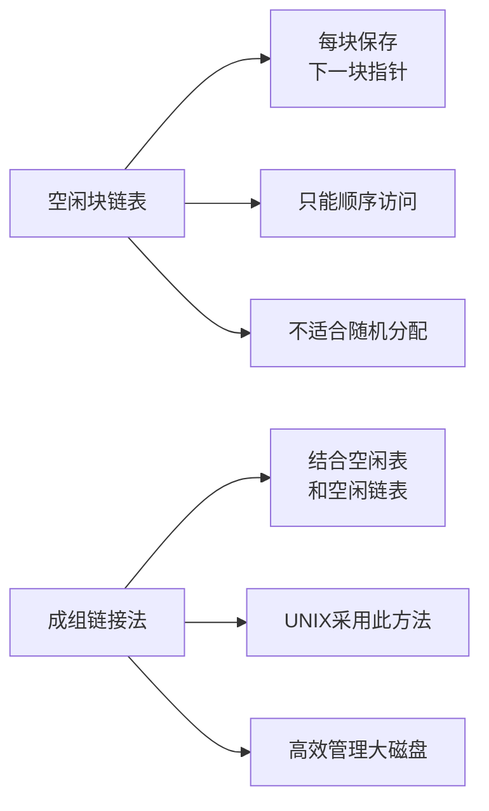

```c
// 空闲链表节点
struct free_block {
    int next_free;      // 下一空闲块号（-1表示链表结束）
    int reserved[127]; // 保留空间（凑满一个块）
};

// 成组链接法 - 超级块中的链接指针
struct super_block {
    int s_free[100];    // 空闲块数组
    int s_nfree;        // 当前空闲块数
    int s_first;        // 第一个空闲块号
    int s_last;         // 最后一个空闲块号
};
```

**3. 位图法**

```c
// 位图法示例
#define DISK_BLOCKS 1024
#define BITS_PER_BYTE 8

char bitmap[(DISK_BLOCKS + BITS_PER_BYTE - 1) / BITS_PER_BYTE];

// 设置某块为空闲
void set_block_free(int block_num) {
    int byte_index = block_num / BITS_PER_BYTE;
    int bit_index = block_num % BITS_PER_BYTE;
    bitmap[byte_index] |= (1 << bit_index);
}

// 设置某块为已占用
void set_block_allocated(int block_num) {
    int byte_index = block_num / BITS_PER_BYTE;
    int bit_index = block_num % BITS_PER_BYTE;
    bitmap[byte_index] &= ~(1 << bit_index);
}

// 检查块是否空闲
int is_block_free(int block_num) {
    int byte_index = block_num / BITS_PER_BYTE;
    int bit_index = block_num % BITS_PER_BYTE;
    return (bitmap[byte_index] & (1 << bit_index)) != 0;
}

/*
 * 位图示意：
 * 块号:  0  1  2  3  4  5  6  7  8  9 ...
 * 位图:  1  1  0  0  1  0  1  1  0  1 ...
 *        已 已 空 空 已 空 已 已 空 已
 *
 * 存储：用一个字节可以表示8个块的状态
 */
```

---

## 7.5 文件分配方式

### 7.5.1 连续分配

连续分配是最简单的分配方式，文件被存储在磁盘上一组连续的块中。

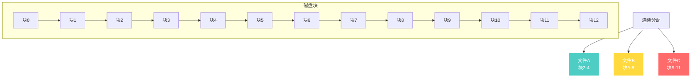

**特点**：
- **优点**：顺序访问速度快，支持随机访问，访问速度快
- **缺点**：外部碎片，文件不能动态增长，文件大小需要预先声明

```c
// 连续分配FCB
struct FCB_Contiguous {
    char     filename[256];
    uint32_t start_block;   // 起始块号
    uint32_t block_count;   // 块数量
};

// 文件扩展问题
/*
 * 假设文件A从块2开始占用3个块（2,3,4）
 * 如果要扩展，但块5已被文件B占用，则需要移动整个文件
 * 或者在磁盘末尾分配新空间并记录碎片位置
 */
```

### 7.5.2 链接分配

链接分配将文件存储在不连续的块中，每个块包含指向下一个块的指针。

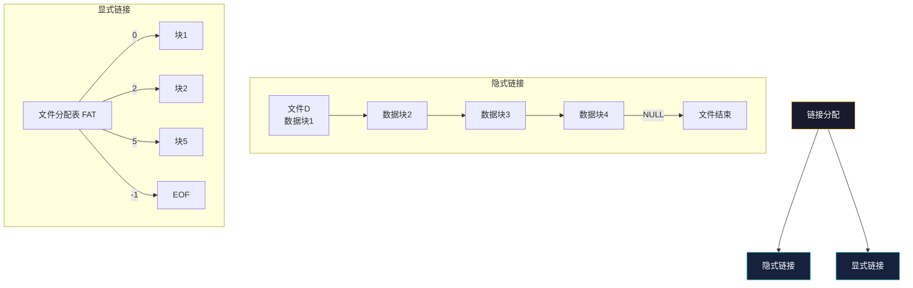

**1. 隐式链接**

```c
// 隐式链接 - 每个块包含指向下一块的指针
struct linked_block {
    char     data[BLOCK_SIZE - sizeof(int)];
    int      next_block;   // 下一块块号，-1表示结束
};

// 访问第i个块需要遍历所有前面的块
int get_block(FCB *fcb, int logical_block) {
    int current = fcb->start_block;
    for (int i = 0; i < logical_block; i++) {
        if (current == -1) return -1;  // 超出文件范围
        current = read_next_pointer(current);
    }
    return current;
}
```

**2. 显式链接（FAT文件系统）**

```c
// FAT文件分配表
struct FAT {
    int fat[NUM_BLOCKS];  // 每个表项存储下一块编号
};

/*
 * FAT表项值：
 * 0        - 空闲块
 * -1 (EOF) - 文件结束
 * -2 (BAD) - 坏块
 * 其他     - 下一块块号
 */

// FAT16示例
/*
 * 块号:  0    1    2    3    4    5    6    7    8    9
 * FAT:  EOF   2    3   EOF   5    6   EOF   8    9   EOF
 *
 * 文件A: 块1 -> 块2 -> 块3 -> EOF
 * 文件B: 块4 -> 块5 -> 块6 -> EOF
 * 文件C: 块7 -> 块8 -> 块9 -> EOF
 */
```

### 7.5.3 索引分配

索引分配为每个文件建立一个索引块，索引块中存储该文件所有数据块的块号。

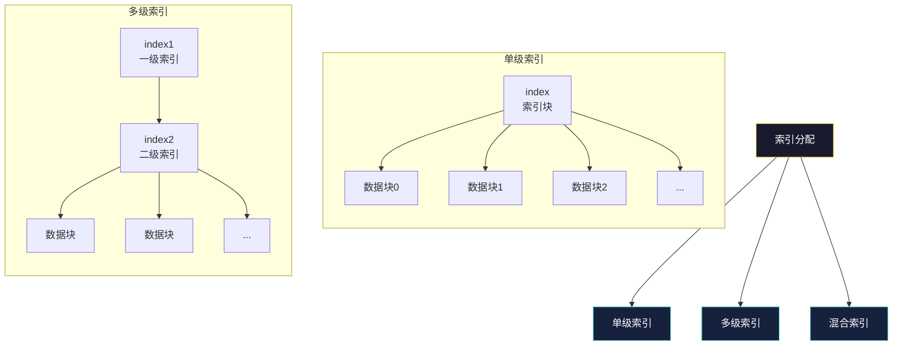

**1. 单级索引**

```c
// 单级索引FCB
struct FCB_Index {
    char     filename[256];
    uint32_t index_block;   // 索引块号
};

// 索引块结构
struct index_block {
    int data_blocks[BLOCK_SIZE / sizeof(int)];  // 假设块大小4KB，指针4字节，可存1024个指针
};

// 访问第i个数据块
int get_block_indexed(FCB_Index *fcb, int logical_block) {
    int index = read_index_block(fcb->index_block);
    if (logical_block >= BLOCK_SIZE / sizeof(int)) {
        return -1;  // 超出索引范围
    }
    return index->data_blocks[logical_block];
}
```

**2. 多级索引**

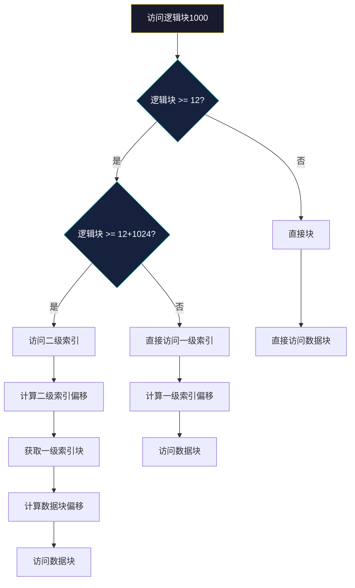

**3. 混合索引（ext2/ext3/ext4采用）**

```c
// ext4 混合索引结构
struct ext4_inode {
    // ... 其他字段 ...
    uint32_t i_block[15];  // 15个块指针

    /*
     * i_block[0-11]  : 12个直接块指针 -> 12 * 4KB = 48KB
     * i_block[12]    : 一级间接块    -> 4MB
     * i_block[13]    : 二级间接块    -> 4GB
     * i_block[14]    : 三级间接块    -> 4TB
     */
};

// 访问数据块的逻辑
int ext4_get_block(struct ext4_inode *inode, int block_num) {
    const int DIRECT_BLOCKS = 12;
    const int POINTERS_PER_BLOCK = 1024;  // 4KB / 4字节

    if (block_num < DIRECT_BLOCKS) {
        // 直接块
        return inode->i_block[block_num];
    } else if (block_num < DIRECT_BLOCKS + POINTERS_PER_BLOCK) {
        // 一级间接块
        int *indirect = read_block(inode->i_block[12]);
        return indirect[block_num - DIRECT_BLOCKS];
    } else if (block_num < DIRECT_BLOCKS + POINTERS_PER_BLOCK * POINTERS_PER_BLOCK) {
        // 二级间接块
        int *double_indirect = read_block(inode->i_block[13]);
        int second_level = (block_num - DIRECT_BLOCKS - POINTERS_PER_BLOCK) / POINTERS_PER_BLOCK;
        int *indirect = read_block(double_indirect[second_level]);
        int first_level = (block_num - DIRECT_BLOCKS - POINTERS_PER_BLOCK) % POINTERS_PER_BLOCK;
        return indirect[first_level];
    } else {
        // 三级间接块
        // ... 类似逻辑 ...
    }
}
```

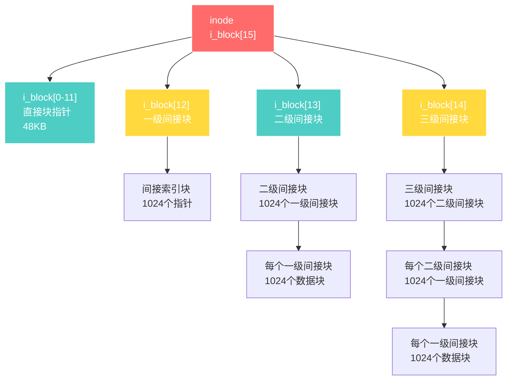

### 7.5.4 三种分配方式对比

```mermaid
flowchart LR
    A[分配方式对比] --> B[连续分配]
    A --> C[链接分配]
    A --> D[索引分配]

    B --> B1[顺序访问:快]
    B --> B2[随机访问:快]
    B --> B3[外部碎片:有]
    B --> B4[动态增长:难]

    C --> C1[顺序访问:快]
    C --> C2[随机访问:慢]
    C --> C3[外部碎片:无]
    C --> C4[动态增长:易]

    D --> D1[顺序访问:快]
    D --> D2[随机访问:快]
    D --> D3[外部碎片:无]
    D --> D4[动态增长:易<br/>但需要索引块]

    style A fill:#1a1a2e,stroke:#ffd93d,color:#ffffff
    style B fill:#16213e,stroke:#4ecdc4,color:#ffffff
    style C fill:#16213e,stroke:#4ecdc4,color:#ffffff
    style D fill:#16213e,stroke:#4ecdc4,color:#ffffff
```

| 特性 | 连续分配 | 链接分配 | 索引分配 |
|------|----------|----------|----------|
| 顺序访问速度 | 最快 | 中等 | 快 |
| 随机访问速度 | 快 | 慢（需遍历） | 快 |
| 外部碎片 | 有 | 无 | 无 |
| 动态增长 | 困难 | 容易 | 容易（但需扩展索引） |
| 可靠性 | 一般 | 指针易损坏 | 较好 |
| 典型系统 | DOS | DOS | UNIX/Linux |

---

## 7.6 文件系统可靠性

### 7.6.1 一致性检查

文件系统一致性检查是确保文件系统 metadata（文件系统的管理信息）与实际数据一致性的重要机制。

```mermaid
flowchart TD
    A[一致性检查] --> B[检查元数据一致性]
    A --> C[检查磁盘空间分配]
    A --> D[修复发现的问题]

    B --> B1[空闲块计数]
    B --> B2[链接计数验证]
    B --> B3[块引用计数]

    C --> C1[位图与FCB对比]
    C --> C2[孤立的空闲块]
    C --> C3[重复分配的块]

    D --> D1[重新计算链接数]
    D --> D2[更新位图]
    D --> D3[回收孤儿文件]

    style A fill:#1a1a2e,stroke:#ffd93d,color:#ffffff
    style B fill:#16213e,stroke:#4ecdc4,color:#ffffff
    style C fill:#16213e,stroke:#4ecdc4,color:#ffffff
    style D fill:#16213e,stroke:#4ecdc4,color:#ffffff
```

**fsck 工具的工作原理**：

```c
// 简化的 fsck 检查流程
void fsck_check(char *device) {
    // 1. 读取超级块，检查魔数
    struct superblock *sb = read_superblock(device);
    if (sb->s_magic != SUPERBLOCK_MAGIC) {
        printf("文件系统损坏！\n");
        return;
    }

    // 2. 检查 inode 链接计数
    for (int i = 1; i <= sb->s_inode_count; i++) {
        struct inode *inode = read_inode(device, i);
        int actual_links = count_hard_links(device, i);
        if (inode->i_links_count != actual_links) {
            printf("inode %d: 链接计数错误\n", i);
            inode->i_links_count = actual_links;
            write_inode(device, i, inode);
        }
    }

    // 3. 检查块分配一致性
    int *block_refs = calloc(sb->s_block_count, sizeof(int));

    // 遍历所有 inode，统计每块被引用次数
    for (int i = 1; i <= sb->s_inode_count; i++) {
        struct inode *inode = read_inode(device, i);
        for (int j = 0; j < inode->i_blocks; j++) {
            block_refs[inode->i_block[j]]++;
        }
    }

    // 与位图对比
    for (int i = 0; i < sb->s_block_count; i++) {
        bool in_bitmap = test_bit(sb->s_block_bitmap, i);
        if (block_refs[i] > 0 && !in_bitmap) {
            printf("块 %d: 被使用但位图显示为空闲\n", i);
            set_bit(sb->s_block_bitmap, i);
        } else if (block_refs[i] == 0 && in_bitmap) {
            printf("块 %d: 空闲但位图显示为已占用\n", i);
            clear_bit(sb->s_block_bitmap, i);
        }
    }

    // 4. 检查目录结构的完整性
    for (int i = 1; i <= sb->s_inode_count; i++) {
        struct inode *inode = read_inode(device, i);
        if (S_ISDIR(inode->i_mode)) {
            check_directory(device, inode);
        }
    }

    free(block_refs);
}
```

### 7.6.2 备份与恢复

```mermaid
flowchart TB
    A[备份类型] --> B[完全备份<br/>Full Backup]
    A --> C[增量备份<br/>Incremental]
    A --> D[差异备份<br/>Differential]

    B --> B1[备份所有数据]
    B --> B2[恢复简单快速]
    B --> B3[占用空间大]

    C --> C1[只备份<br/>上次备份后<br/>的变化]
    C --> C2[节省空间]
    C --> C3[恢复复杂<br/>需按顺序恢复]

    D --> D1[备份<br/>上次完全备份后<br/>的所有变化]
    D --> D2[空间占用中等]
    D --> D3[恢复较简单]

    style A fill:#1a1a2e,stroke:#ffd93d,color:#ffffff
    style B fill:#16213e,stroke:#4ecdc4,color:#ffffff
    style C fill:#16213e,stroke:#4ecdc4,color:#ffffff
    style D fill:#16213e,stroke:#4ecdc4,color:#ffffff
```

**备份策略示例**：

```c
// 简单备份程序示例
#include <stdio.h>
#include <stdlib.h>
#include <string.h>

#define BUFFER_SIZE 8192

// 增量备份
void incremental_backup(const char *source, const char *backup_dir) {
    FILE *src, *dst;
    char buffer[BUFFER_SIZE];
    char backup_path[512];
    time_t last_backup = get_last_backup_time(backup_dir);

    // 遍历源目录
    DIR *dir = opendir(source);
    struct dirent *entry;

    while ((entry = readdir(dir)) != NULL) {
        if (entry->d_name[0] == '.') continue;

        snprintf(backup_path, sizeof(backup_path), "%s/%s", source, entry->d_name);

        struct stat st;
        if (lstat(backup_path, &st) < 0) continue;

        // 只备份修改过的文件
        if (S_ISREG(st.st_mode) && st.st_mtime > last_backup) {
            char dest_path[512];
            snprintf(dest_path, sizeof(dest_path), "%s/%s_%ld",
                    backup_dir, entry->d_name, (long)st.st_mtime);

            src = fopen(backup_path, "rb");
            dst = fopen(dest_path, "wb");

            int bytes;
            while ((bytes = fread(buffer, 1, BUFFER_SIZE, src)) > 0) {
                fwrite(buffer, 1, bytes, dst);
            }

            fclose(src);
            fclose(dst);
            printf("增量备份: %s\n", backup_path);
        }
    }

    closedir(dir);
}

// 恢复操作
int restore_file(const char *backup_file, const char *dest_path) {
    FILE *src, *dst;
    char buffer[BUFFER_SIZE];

    src = fopen(backup_file, "rb");
    if (!src) {
        perror("打开备份文件失败");
        return -1;
    }

    dst = fopen(dest_path, "wb");
    if (!dst) {
        fclose(src);
        perror("创建目标文件失败");
        return -1;
    }

    int bytes;
    while ((bytes = fread(buffer, 1, BUFFER_SIZE, src)) > 0) {
        fwrite(buffer, 1, bytes, dst);
    }

    fclose(src);
    fclose(dst);
    return 0;
}
```

### 7.6.3 日志文件系统

日志文件系统（Journaling File System）通过记录日志来保证文件系统的一致性和可靠性，即使在系统崩溃后也能快速恢复。

```mermaid
flowchart TB
    A[日志文件系统] --> B[日志区域<br/>Journal]
    A --> C[主文件系统<br/>Main Filesystem]

    B --> B1[事务日志<br/>Transaction Log]
    B --> B2[记录操作步骤]
    B --> B3[操作完成前<br/>标记committed]

    subgraph 写入流程
        direction TB
        1[接收写请求] --> 2[写入日志<br/>标记begin]
        2 --> 3[执行实际<br/>文件系统操作]
        3 --> 4[日志标记<br/>commit]
        4 --> 5[从日志删除<br/>完成的事务]
    end

    style A fill:#ff6b6b,stroke:#ffffff,color:#ffffff
    style B fill:#4ecdc4,stroke:#ffffff,color:#ffffff
    style C fill:#4ecdc4,stroke:#ffffff,color:#ffffff
```

**日志文件系统工作流程**：

```c
// 日志文件系统简化实现
#include <stdio.h>
#include <string.h>

#define JOURNAL_BLOCKS 64
#define TRANSACTION_ID unsigned int

struct journal_header {
    TRANSACTION_ID tid;      // 事务ID
    unsigned int sequence;  // 序列号
    unsigned int flags;      // 标志
    unsigned int block_count;// 涉及的块数
};

struct journal_entry {
    unsigned int block_nr;   // 块号
    char *old_data;         // 旧数据（可选，用于undo）
    char *new_data;         // 新数据
};

// 日志区域
struct journal {
    struct journal_header header[JOURNAL_BLOCKS];
    struct journal_entry entries[JOURNAL_BLOCKS][16];  // 每个事务最多16个条目
    unsigned int current_tid;
    unsigned int next_available_block;
};

// 开始一个事务
TRANSACTION_ID journal_start(struct journal *j) {
    j->current_tid++;
    j->header[j->current_tid % JOURNAL_BLOCKS].tid = j->current_tid;
    j->header[j->current_tid % JOURNAL_BLOCKS].sequence = 0;
    return j->current_tid;
}

// 添加日志条目
void journal_add_entry(struct journal *j, TRANSACTION_ID tid,
                      unsigned int block_nr, char *new_data) {
    int idx = tid % JOURNAL_BLOCKS;
    int entry_idx = j->header[idx].block_count++;

    j->entries[idx][entry_idx].block_nr = block_nr;
    j->entries[idx][entry_idx].new_data = new_data;
}

// 提交事务
void journal_commit(struct journal *j, TRANSACTION_ID tid) {
    int idx = tid % JOURNAL_BLOCKS;

    // 1. 确保所有条目写入日志区域
    write_journal_to_disk(j);

    // 2. 标记事务为已提交
    j->header[idx].flags |= JOURNAL_FLAG_COMMITED;

    // 3. 将日志头写入磁盘
    write_header_to_disk(j, idx);
}

// 恢复过程
void journal_recover(struct journal *j) {
    for (int i = 0; i < JOURNAL_BLOCKS; i++) {
        if (j->header[i].flags & JOURNAL_FLAG_COMMITED &&
            !(j->header[i].flags & JOURNAL_FLAG_RECOVERED)) {

            // 重放已提交的事务
            for (int e = 0; e < j->header[i].block_count; e++) {
                unsigned int block_nr = j->entries[i][e].block_nr;
                char *data = j->entries[i][e].new_data;
                write_block_to_filesystem(block_nr, data);
            }

            // 标记为已恢复
            j->header[i].flags |= JOURNAL_FLAG_RECOVERED;
        }
    }
}
```

```mermaid
sequenceDiagram
    participant App as 应用程序
    participant JFS as 日志文件系统
    participant Log as 日志区域
    participant Disk as 磁盘

    App->>JFS: 写入请求 /data/file.txt
    JFS->>JFS: journal_start()
    JFS->>Log: 写入日志条目（包含新数据）
    JFS->>JFS: 执行文件系统操作
    JFS->>Log: 标记事务为COMMITED
    JFS->>App: 写入完成返回

    Note over JFS,Disk: 系统崩溃后恢复

    JFS->>Log: 读取日志
    Log->>JFS: 发现已提交事务
    JFS->>Disk: 重放事务（写入数据块）
    JFS->>Log: 标记事务为RECOVERED
    JFS->>Disk: 删除已恢复的事务
```

**常见日志文件系统**：

| 文件系统 | 日志模式 | 特点 |
|----------|----------|------|
| ext3 | 写入模式 | 数据写入两次，安全性高但性能较低 |
| ext4 | writeback模式 | 只记录元数据日志，性能较好 |
| XFS | 结构化日志 | 高性能，支持大文件 |
| NTFS | 日志记录 | Windows默认文件系统 |
| ReiserFS | 事务日志 | 对小文件性能优秀 |
| Btrfs | CoW事务 | 支持快照和副本 |

---

## 7.7 实际应用场景

### 7.7.1 Linux ext4 文件系统结构

ext4 是 Linux 系统中广泛使用的文件系统，理解其结构对于掌握文件系统原理至关重要。

```mermaid
flowchart TB
    A[ext4 文件系统布局] --> B[启动块<br/>Boot Block<br/>1024字节]
    A --> C[块组0<br/>Block Group 0]
    A --> D[块组1<br/>Block Group 1]
    A --> E[块组N<br/>Block Group N]

    subgraph 块组结构
        direction TB
        C --> C1[超级块<br/>Super Block<br/>1个块]
        C --> C2[块组描述符<br/>Group Descriptors<br/>多个块]
        C --> C3[块位图<br/>Block Bitmap<br/>1个块]
        C --> C4[inode位图<br/>inode Bitmap<br/>1个块]
        C --> C5[inode表<br/>inode Table<br/>多个块]
        C --> C6[数据块<br/>Data Blocks<br/>多个块]
    end

    style A fill:#1a1a2e,stroke:#ffd93d,color:#ffffff
    style B fill:#ff6b6b,stroke:#ffffff,color:#ffffff
    style C fill:#4ecdc4,stroke:#ffffff,color:#ffffff
    style D fill:#4ecdc4,stroke:#ffffff,color:#ffffff
    style E fill:#4ecdc4,stroke:#ffffff,color:#ffffff
```

### 7.7.2 简单文件系统实现示例

以下是一个简化但完整的文件系统实现，用于教学目的：

```c
/**
 * 简单文件系统 (SimpleFS)
 * 这是一个教学用的简化文件系统实现
 */

#include <stdio.h>
#include <stdlib.h>
#include <string.h>
#include <unistd.h>
#include <fcntl.h>
#include <time.h>

#define BLOCK_SIZE       4096
#define DISK_SIZE       (10 * 1024 * 1024)  // 10MB 虚拟磁盘
#define MAX_FILES        128
#define MAX_FILENAME     32
#define MAX_OPEN_FILES   32
#define POINTERS_PER_BLOCK (BLOCK_SIZE / sizeof(uint32_t))

/* ============ 数据结构定义 ============ */

// 超级块
struct superblock {
    uint32_t magic;           // 魔数，标识文件系统
    uint32_t block_size;      // 块大小
    uint32_t total_blocks;    // 总块数
    uint32_t free_blocks;     // 空闲块数
    uint32_t free_inodes;     // 空闲inode数
    uint32_t first_data_block;// 第一个数据块号
    uint32_t inode_table_start;// inode表起始块
    uint32_t bitmap_start;     // 位图起始块
};

// inode 结构
struct inode {
    uint16_t mode;            // 文件模式
    uint16_t uid;             // 用户ID
    uint32_t size;            // 文件大小
    uint32_t atime;           // 访问时间
    uint32_t ctime;           // 创建时间
    uint32_t mtime;           // 修改时间
    uint32_t dtime;           // 删除时间
    uint16_t gid;             // 组ID
    uint8_t link_count;       // 链接数
    uint8_t blocks;          // 占用块数
    uint32_t block_pointers[15]; // 块指针（混合索引）
    uint32_t indirect_pointer; // 间接块指针
};

// 目录项
struct dir_entry {
    uint32_t inode;           // inode编号
    uint16_t rec_len;         // 目录项长度
    uint8_t name_len;         // 文件名长度
    uint8_t file_type;        // 文件类型
    char name[MAX_FILENAME];  // 文件名
};

// 文件控制块（内存中）
struct file_descriptor {
    int used;                 // 是否使用
    uint32_t inode;           // 对应的inode
    uint32_t offset;          // 当前偏移
    int flags;                // 打开标志
};

// 全局变量
struct superblock g_sb;
int g_disk_fd;
uint8_t *g_block_bitmap;
uint8_t *g_inode_bitmap;
struct inode *g_inode_table;
struct file_descriptor g_fd_table[MAX_OPEN_FILES];

/* ============ 工具函数 ============ */

uint32_t allocate_block() {
    for (uint32_t i = 0; i < g_sb.total_blocks; i++) {
        if (!(g_block_bitmap[i / 8] & (1 << (i % 8)))) {
            g_block_bitmap[i / 8] |= (1 << (i % 8));
            g_sb.free_blocks--;
            return i;
        }
    }
    return 0;  // 没有空闲块
}

void free_block(uint32_t block_num) {
    g_block_bitmap[block_num / 8] &= ~(1 << (block_num % 8));
    g_sb.free_blocks++;
}

uint32_t allocate_inode() {
    for (uint32_t i = 0; i < MAX_FILES; i++) {
        if (!(g_inode_bitmap[i / 8] & (1 << (i % 8)))) {
            g_inode_bitmap[i / 8] |= (1 << (i % 8));
            g_sb.free_inodes--;
            memset(&g_inode_table[i], 0, sizeof(struct inode));
            return i;
        }
    }
    return 0;  // 没有空闲inode
}

void free_inode(uint32_t inode_num) {
    g_inode_bitmap[inode_num / 8] &= ~(1 << (inode_num % 8));
    g_sb.free_inodes++;
}

/* ============ 文件系统操作 ============ */

// 创建文件系统
int mkfs(const char *disk_path) {
    g_disk_fd = open(disk_path, O_RDWR | O_CREAT | O_TRUNC, 0644);
    if (g_disk_fd < 0) {
        perror("创建磁盘文件失败");
        return -1;
    }

    // 扩展磁盘文件到指定大小
    lseek(g_disk_fd, DISK_SIZE - 1, SEEK_SET);
    write(g_disk_fd, "", 1);

    // 初始化超级块
    g_sb.magic = 0x53464C53;  // "S F S" (SimpleFS)
    g_sb.block_size = BLOCK_SIZE;
    g_sb.total_blocks = DISK_SIZE / BLOCK_SIZE;
    g_sb.free_blocks = g_sb.total_blocks - 5;  // 预留块
    g_sb.free_inodes = MAX_FILES;
    g_sb.first_data_block = 5;
    g_sb.inode_table_start = 2;
    g_sb.bitmap_start = 1;

    // 分配位图和inode表内存
    g_block_bitmap = calloc(1, BLOCK_SIZE);
    g_inode_bitmap = calloc(1, BLOCK_SIZE);
    g_inode_table = calloc(MAX_FILES, sizeof(struct inode));

    // 创建根目录inode
    uint32_t root_inode = allocate_inode();
    struct inode *root = &g_inode_table[root_inode];
    root->mode = 0x41ED;     // 目录文件
    root->size = BLOCK_SIZE;
    root->ctime = root->mtime = root->atime = time(NULL);
    root->link_count = 2;    // . 和 ..

    // 分配根目录数据块
    uint32_t root_block = allocate_block();
    root->block_pointers[0] = root_block;

    // 在根目录下创建 . 和 .. 目录项
    struct dir_entry *root_data = calloc(1, BLOCK_SIZE);
    root_data[0].inode = root_inode;
    root_data[0].rec_len = sizeof(struct dir_entry);
    root_data[0].name_len = 1;
    root_data[0].file_type = 2;  // 目录
    strcpy(root_data[0].name, ".");

    root_data[1].inode = root_inode;
    root_data[1].rec_len = sizeof(struct dir_entry);
    root_data[1].name_len = 2;
    root_data[1].file_type = 2;
    strcpy(root_data[1].name, "..");

    pwrite(g_disk_fd, root_data, BLOCK_SIZE, root_block * BLOCK_SIZE);
    free(root_data);

    // 写入超级块
    pwrite(g_disk_fd, &g_sb, sizeof(struct superblock), 0);

    // 写入位图
    pwrite(g_disk_fd, g_block_bitmap, BLOCK_SIZE, g_sb.bitmap_start * BLOCK_SIZE);
    pwrite(g_disk_fd, g_inode_bitmap, BLOCK_SIZE, (g_sb.bitmap_start + 1) * BLOCK_SIZE);

    // 写入inode表
    pwrite(g_disk_fd, g_inode_table, MAX_FILES * sizeof(struct inode),
           g_sb.inode_table_start * BLOCK_SIZE);

    printf("文件系统创建成功！\n");
    printf("磁盘大小: %d 块 (%.2f MB)\n",
           g_sb.total_blocks, (float)DISK_SIZE / (1024 * 1024));
    printf("空闲块: %d\n", g_sb.free_blocks);
    printf("空闲inode: %d\n", g_sb.free_inodes);

    return 0;
}

// 挂载文件系统
int mount_fs(const char *disk_path) {
    g_disk_fd = open(disk_path, O_RDWR);
    if (g_disk_fd < 0) {
        perror("打开磁盘文件失败");
        return -1;
    }

    // 读取超级块
    pread(g_disk_fd, &g_sb, sizeof(struct superblock), 0);

    if (g_sb.magic != 0x53464C53) {
        printf("错误: 不是有效的 SimpleFS 文件系统\n");
        return -1;
    }

    // 读取位图
    g_block_bitmap = malloc(BLOCK_SIZE);
    g_inode_bitmap = malloc(BLOCK_SIZE);
    g_inode_table = malloc(MAX_FILES * sizeof(struct inode));

    pread(g_disk_fd, g_block_bitmap, BLOCK_SIZE, g_sb.bitmap_start * BLOCK_SIZE);
    pread(g_disk_fd, g_inode_bitmap, BLOCK_SIZE, (g_sb.bitmap_start + 1) * BLOCK_SIZE);
    pread(g_disk_fd, g_inode_table, MAX_FILES * sizeof(struct inode),
          g_sb.inode_table_start * BLOCK_SIZE);

    // 初始化文件描述符表
    memset(g_fd_table, 0, sizeof(g_fd_table));

    printf("文件系统挂载成功！\n");
    return 0;
}

// 创建文件
int create_file(const char *path) {
    char dirname[MAX_FILENAME];
    char filename[MAX_FILENAME];
    strcpy(dirname, "/");
    strcpy(filename, path + 1);

    // 找到父目录inode
    uint32_t parent_inode = 0;  // 根目录

    // 在父目录中查找是否已存在
    struct inode *parent = &g_inode_table[parent_inode];
    struct dir_entry *entries = malloc(BLOCK_SIZE);
    pread(g_disk_fd, entries, BLOCK_SIZE, parent->block_pointers[0] * BLOCK_SIZE);

    for (int i = 0; i < BLOCK_SIZE / sizeof(struct dir_entry); i++) {
        if (entries[i].inode != 0 && strcmp(entries[i].name, filename) == 0) {
            printf("文件已存在: %s\n", filename);
            free(entries);
            return -1;
        }
    }

    // 创建新inode
    uint32_t new_inode = allocate_inode();
    struct inode *inode = &g_inode_table[new_inode];
    inode->mode = 0x81A4;     // 普通文件
    inode->size = 0;
    inode->ctime = inode->mtime = inode->atime = time(NULL);
    inode->link_count = 1;
    inode->blocks = 0;

    // 分配数据块
    if (inode->blocks < 12) {
        inode->block_pointers[inode->blocks] = allocate_block();
        inode->blocks++;
    }

    // 找到空闲目录项位置
    int entry_slot = -1;
    for (int i = 2; i < BLOCK_SIZE / sizeof(struct dir_entry); i++) {
        if (entries[i].inode == 0) {
            entry_slot = i;
            break;
        }
    }

    if (entry_slot < 0) {
        printf("目录已满\n");
        free(entries);
        return -1;
    }

    // 写入目录项
    entries[entry_slot].inode = new_inode;
    entries[entry_slot].rec_len = sizeof(struct dir_entry);
    entries[entry_slot].name_len = strlen(filename);
    entries[entry_slot].file_type = 1;  // 普通文件
    strcpy(entries[entry_slot].name, filename);

    pwrite(g_disk_fd, entries, BLOCK_SIZE, parent->block_pointers[0] * BLOCK_SIZE);
    pwrite(g_disk_fd, &g_inode_table[new_inode], sizeof(struct inode),
           g_sb.inode_table_start * BLOCK_SIZE + new_inode * sizeof(struct inode));
    pwrite(g_disk_fd, &g_sb, sizeof(struct superblock), 0);

    free(entries);
    printf("文件创建成功: %s (inode: %d)\n", path, new_inode);
    return new_inode;
}

// 写入文件
int write_file(int fd, const void *buffer, size_t size) {
    if (fd < 0 || fd >= MAX_OPEN_FILES || !g_fd_table[fd].used) {
        printf("无效的文件描述符\n");
        return -1;
    }

    struct file_descriptor *desc = &g_fd_table[fd];
    struct inode *inode = &g_inode_table[desc->inode];

    if (desc->offset + size > 12 * BLOCK_SIZE) {
        printf("文件过大，不支持扩展\n");
        return -1;
    }

    // 计算要写入的块
    uint32_t start_block = desc->offset / BLOCK_SIZE;
    uint32_t offset_in_block = desc->offset % BLOCK_SIZE;
    size_t remaining = size;
    const char *ptr = buffer;

    while (remaining > 0) {
        if (start_block >= inode->blocks) {
            // 需要分配新块
            if (start_block < 12) {
                inode->block_pointers[start_block] = allocate_block();
                inode->blocks++;
            }
        }

        size_t to_write = (remaining < BLOCK_SIZE - offset_in_block) ?
                          remaining : BLOCK_SIZE - offset_in_block;

        pwrite(g_disk_fd, ptr, to_write,
               inode->block_pointers[start_block] * BLOCK_SIZE + offset_in_block);

        ptr += to_write;
        remaining -= to_write;
        desc->offset += to_write;
        start_block++;
        offset_in_block = 0;
    }

    // 更新inode
    if (desc->offset > inode->size) {
        inode->size = desc->offset;
    }
    inode->mtime = time(NULL);

    pwrite(g_disk_fd, &g_inode_table[desc->inode], sizeof(struct inode),
           g_sb.inode_table_start * BLOCK_SIZE + desc->inode * sizeof(struct inode));

    return size - remaining;
}

// 读取文件
int read_file(int fd, void *buffer, size_t size) {
    if (fd < 0 || fd >= MAX_OPEN_FILES || !g_fd_table[fd].used) {
        printf("无效的文件描述符\n");
        return -1;
    }

    struct file_descriptor *desc = &g_fd_table[fd];
    struct inode *inode = &g_inode_table[desc->inode];

    if (desc->offset >= inode->size) {
        return 0;  // 到达文件末尾
    }

    size_t remaining = inode->size - desc->offset;
    size_t to_read = (size < remaining) ? size : remaining;

    uint32_t start_block = desc->offset / BLOCK_SIZE;
    uint32_t offset_in_block = desc->offset % BLOCK_SIZE;
    char *ptr = buffer;

    while (to_read > 0) {
        size_t block_remaining = BLOCK_SIZE - offset_in_block;
        size_t to_copy = (to_read < block_remaining) ? to_read : block_remaining;

        pread(g_disk_fd, ptr, to_copy,
              inode->block_pointers[start_block] * BLOCK_SIZE + offset_in_block);

        ptr += to_copy;
        to_read -= to_copy;
        desc->offset += to_copy;
        start_block++;
        offset_in_block = 0;
    }

    inode->atime = time(NULL);

    return size - to_read;
}

// 打开文件
int open_file(const char *path, int flags) {
    char filename[MAX_FILENAME];
    strcpy(filename, path + 1);

    // 在根目录中查找
    struct inode *root = &g_inode_table[0];
    struct dir_entry *entries = malloc(BLOCK_SIZE);
    pread(g_disk_fd, entries, BLOCK_SIZE, root->block_pointers[0] * BLOCK_SIZE);

    int found_inode = -1;
    for (int i = 0; i < BLOCK_SIZE / sizeof(struct dir_entry); i++) {
        if (entries[i].inode != 0 && strcmp(entries[i].name, filename) == 0) {
            found_inode = entries[i].inode;
            break;
        }
    }

    free(entries);

    if (found_inode < 0) {
        if (flags & O_CREAT) {
            return create_file(path);
        }
        printf("文件不存在: %s\n", path);
        return -1;
    }

    // 分配文件描述符
    int fd = -1;
    for (int i = 0; i < MAX_OPEN_FILES; i++) {
        if (!g_fd_table[i].used) {
            fd = i;
            break;
        }
    }

    if (fd < 0) {
        printf("文件描述符已用完\n");
        return -1;
    }

    g_fd_table[fd].used = 1;
    g_fd_table[fd].inode = found_inode;
    g_fd_table[fd].offset = 0;
    g_fd_table[fd].flags = flags;

    return fd;
}

// 关闭文件
int close_file(int fd) {
    if (fd < 0 || fd >= MAX_OPEN_FILES || !g_fd_table[fd].used) {
        return -1;
    }

    g_fd_table[fd].used = 0;
    g_fd_table[fd].inode = 0;
    g_fd_table[fd].offset = 0;

    return 0;
}

// 列出目录
void list_directory() {
    struct inode *root = &g_inode_table[0];
    struct dir_entry *entries = malloc(BLOCK_SIZE);
    pread(g_disk_fd, entries, BLOCK_SIZE, root->block_pointers[0] * BLOCK_SIZE);

    printf("\n=== 目录列表 ===\n");
    printf("%-5s %-10s %-20s %s\n", "inode", "类型", "大小", "文件名");
    printf("--------------------------------------------------\n");

    for (int i = 0; i < BLOCK_SIZE / sizeof(struct dir_entry); i++) {
        if (entries[i].inode != 0) {
            struct inode *inode = &g_inode_table[entries[i].inode];
            const char *type = (entries[i].file_type == 2) ? "目录" : "文件";
            printf("%-5d %-10s %-20u %s\n",
                   entries[i].inode, type, inode->size, entries[i].name);
        }
    }

    free(entries);
}

/* ============ 主函数测试 ============ */

int main() {
    const char *disk_path = "test.fs";

    printf("=== 简单文件系统测试 ===\n\n");

    // 创建文件系统
    printf("1. 创建文件系统...\n");
    mkfs(disk_path);

    // 创建一些文件
    printf("\n2. 创建文件...\n");
    create_file("/test.txt");
    create_file("/hello.c");
    create_file("/data.bin");

    // 打开并写入文件
    printf("\n3. 写入文件...\n");
    int fd = open_file("/test.txt", O_RDWR);
    if (fd >= 0) {
        const char *text = "Hello, SimpleFS! This is a test message.";
        write_file(fd, text, strlen(text));
        printf("写入 %d 字节到 /test.txt\n", (int)strlen(text));
        close_file(fd);
    }

    // 读取文件
    printf("\n4. 读取文件...\n");
    fd = open_file("/test.txt", O_RDONLY);
    if (fd >= 0) {
        char buffer[256];
        int bytes = read_file(fd, buffer, sizeof(buffer) - 1);
        buffer[bytes] = '\0';
        printf("读取内容: %s\n", buffer);
        close_file(fd);
    }

    // 列出目录
    printf("\n5. 列出目录...\n");
    list_directory();

    printf("\n=== 测试完成 ===\n");

    // 清理
    free(g_block_bitmap);
    free(g_inode_bitmap);
    free(g_inode_table);
    close(g_disk_fd);

    return 0;
}
```

### 7.7.3 文件系统性能优化场景

```mermaid
flowchart TD
    A[文件系统性能优化] --> B[缓存优化]
    A --> C[分配策略]
    A --> D[预读取优化]
    A --> E[日志调优]

    B --> B1[页缓存<br/>Page Cache]
    B --> B2[缓冲区缓存<br/>Buffer Cache]
    B --> B3[ inode缓存<br/>inode Cache]

    C --> C1[块组预分配]
    C --> C2[延迟分配]
    C --> C3[多块分配]

    D --> D1[顺序预读]
    D --> D2[随机访问<br/>无预读]

    E --> E1[barrier设置]
    E --> E2[commit间隔]
    E --> E3[日志模式]

    style A fill:#ff6b6b,stroke:#ffffff,color:#ffffff
    style B fill:#4ecdc4,stroke:#ffffff,color:#ffffff
    style C fill:#4ecdc4,stroke:#ffffff,color:#ffffff
    style D fill:#4ecdc4,stroke:#ffffff,color:#ffffff
    style E fill:#4ecdc4,stroke:#ffffff,color:#ffffff
```

**场景：数据库文件系统的最佳实践**

对于数据库这类对I/O要求极高的工作负载，文件系统配置至关重要：

```bash
# Linux ext4 文件系统针对数据库的优化挂载选项
mount -o noatime,nodiratime,barrier=0,data=writeback \
      /dev/sdb1 /var/lib/mysql

# 说明:
# - noatime: 不更新文件访问时间，减少磁盘写入
# - nodiratime: 不更新目录访问时间
# - barrier=0: 禁用写屏障（在有电池备份缓存的存储上安全）
# - data=writeback: 日志只记录元数据，不记录数据
```

---

## 7.8 本章小结

本章详细介绍了操作系统的文件系统，主要内容包括：

```mermaid
flowchart TB
    A[文件系统] --> B[基本概念]
    A --> C[文件组织]
    A --> D[空间管理]
    A --> E[可靠性]

    B --> B1[文件定义与属性]
    B --> B2[文件系统接口]
    B --> B3[文件操作]

    C --> C1[文件类型]
    C --> C2[目录结构]
    C --> C3[文件分配]

    D --> D1[空闲空间管理]
    D --> D2[FCB与inode]
    D --> D3[位图法]

    E --> E1[一致性检查]
    E --> E2[备份恢复]
    E --> E3[日志系统]

    style A fill:#ff6b6b,stroke:#ffffff,color:#ffffff
    style B fill:#4ecdc4,stroke:#ffffff,color:#ffffff
    style C fill:#4ecdc4,stroke:#ffffff,color:#ffffff
    style D fill:#4ecdc4,stroke:#ffffff,color:#ffffff
    style E fill:#4ecdc4,stroke:#ffffff,color:#ffffff
```

**核心要点**：

1. **文件是操作系统提供的抽象**，隐藏了底层存储设备的物理特性
2. **目录结构影响文件检索效率**，树形目录是现代系统的主流选择
3. **inode是UNIX类文件系统的核心**，通过混合索引支持大文件
4. **文件分配方式决定磁盘访问特性**，连续分配速度快但不灵活，索引分配灵活但需要额外索引块
5. **日志文件系统通过预写日志保证一致性**，大幅减少系统崩溃后的恢复时间

**进一步学习建议**：

- 阅读 Linux 内核中 ext4 文件系统的源码
- 研究 FUSE（Filesystem in Userspace）框架
- 探索 Btrfs 和 ZFS 等高级文件系统
- 了解分布式文件系统（如 HDFS、GFS）的设计原理

---

## 参考资料

1. Silberschatz, Galvin, Gagne - Operating System Concepts (10th Edition)
2. Tanenbaum, Bos - Modern Operating Systems (4th Edition)
3. Linux Kernel Documentation - ext4 Filesystem
4. 《深入理解计算机系统》- Randal E. Bryant
5. 《操作系统概念》- Abraham Silberschatz

---

*本章完*
