# 第8章 设备管理

## 8.1 设备管理概述

设备管理是操作系统中最能与硬件打交道的模块，它负责管理计算机系统的所有外围设备。设备管理的设计目标是为用户提供统一的、抽象的设备访问接口，屏蔽各种硬件设备的物理差异，实现设备独立性。

### 8.1.1 设备的分类

计算机系统中的设备可以根据其数据交换单位和访问方式分为三大类：

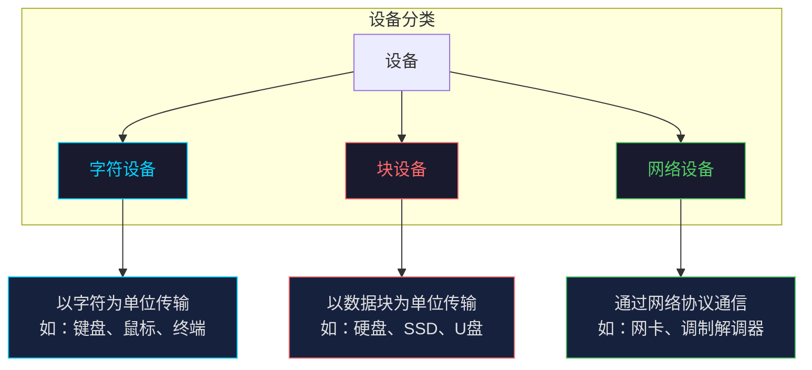

**字符设备（Character Device）** 是以字符为单位进行数据交换的设备，数据流量较小但交互性强。典型的字符设备包括键盘、鼠标、显示器、串口等。这类设备通常采用中断驱动方式进行数据传输。

**块设备（Block Device）** 以固定大小的数据块为单位进行数据存取，每次传输一个或多个完整的数据块。硬盘、固态硬盘（SSD）、USB存储设备都是典型的块设备。块设备支持随机访问，文件系统的实现就建立在块设备之上。

**网络设备（Network Device）** 遵循网络协议进行数据交换的设备，如以太网卡、无线网卡、调制解调器等。网络设备的数据传输具有突发性和连续性特点，通常采用DMA方式提高性能。

### 8.1.2 设备管理的基本功能

设备管理的核心功能围绕"高效、安全、方便"三个目标展开：

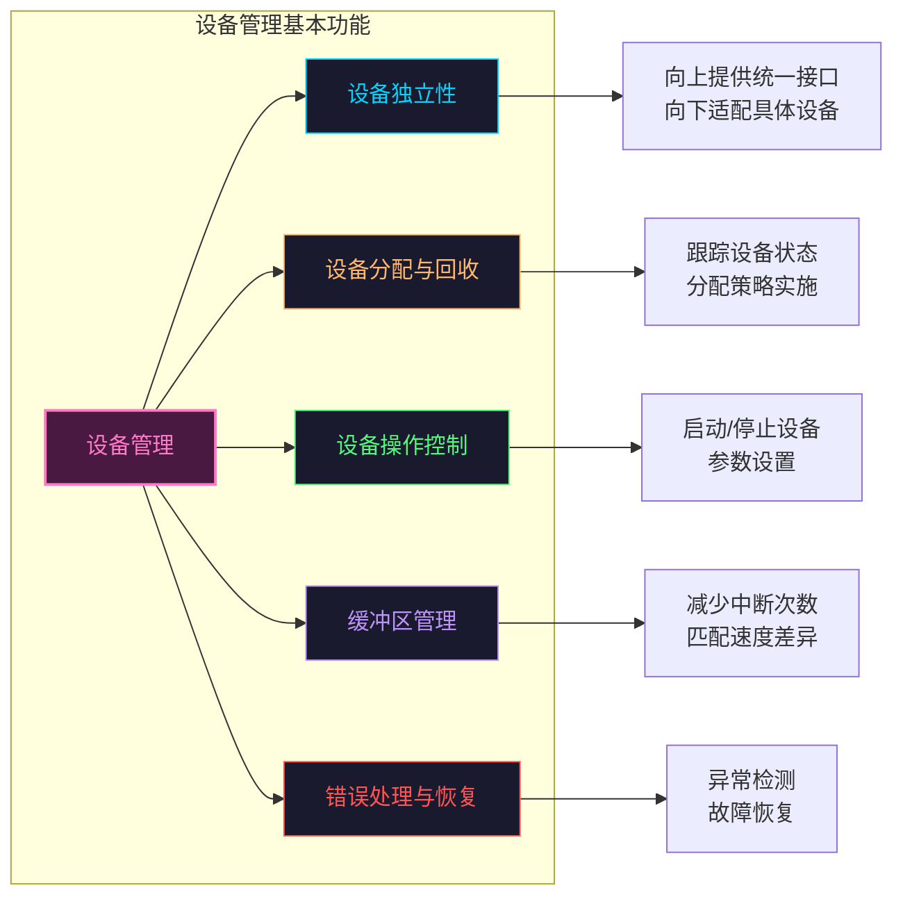

### 8.1.3 设备独立性

设备独立性是操作系统设计的重要原则，它允许应用程序通过逻辑设备名访问设备，而无需了解物理设备的具体细节。当硬件配置发生变化时（如更换打印机型号），应用程序无需修改，这一特性大大提高了系统的可维护性和可移植性。

实现设备独立性需要以下机制支撑：逻辑设备到物理设备的映射表、设备驱动程序的统一接口、以及设备命名空间的管理。

---

## 8.2 I/O 控制方式

I/O控制方式是主机与外设之间数据传输采用的控制机制，不同的控制方式在CPU介入程度、资源利用率和响应延迟方面各有特点。

### 8.2.1 程序轮询方式

程序轮询方式（Programmed I/O）是最简单的I/O控制方式，CPU全程参与数据传输过程。当应用程序发起I/O请求后，系统进入忙等待状态，不断查询设备状态寄存器直到数据传输完成。

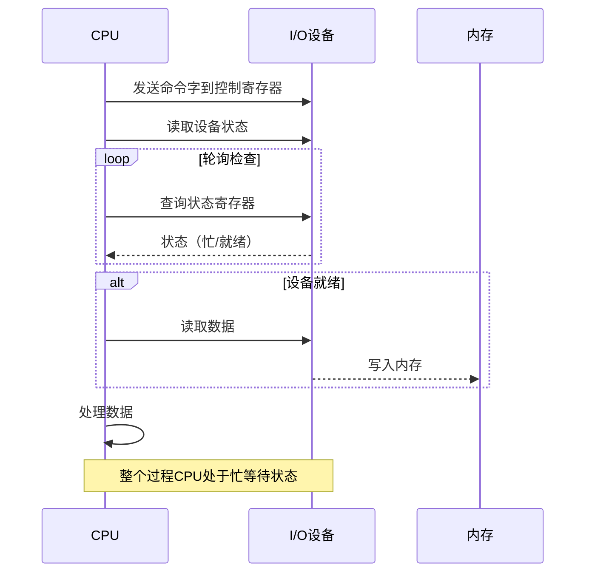

程序轮询方式的优点是实现简单、逻辑清晰；缺点是CPU利用率极低，在等待期间无法处理其他任务。适用于数据量小、对响应时间要求不高的场景，如早期计算机的终端输入。

```c
// 程序轮询方式示例：读取键盘输入
void read_keyboard_polling(char *buffer, int max_len) {
    int count = 0;
    
    while (count < max_len - 1) {
        // 轮询状态寄存器，直到设备就绪
        while (!is_keyboard_ready()) {
            //忙等待，CPU空转
        }
        
        // 读取数据
        buffer[count] = read_keyboard_data();
        
        if (buffer[count] == '\n') {
            break;
        }
        count++;
    }
    buffer[count] = '\0';
}
```

### 8.2.2 中断驱动方式

中断驱动方式（Interrupt-Driven I/O）引入中断机制，CPU发起I/O请求后立即返回执行其他任务，当设备完成数据传输后发出中断信号，CPU暂停当前工作转去处理中断。

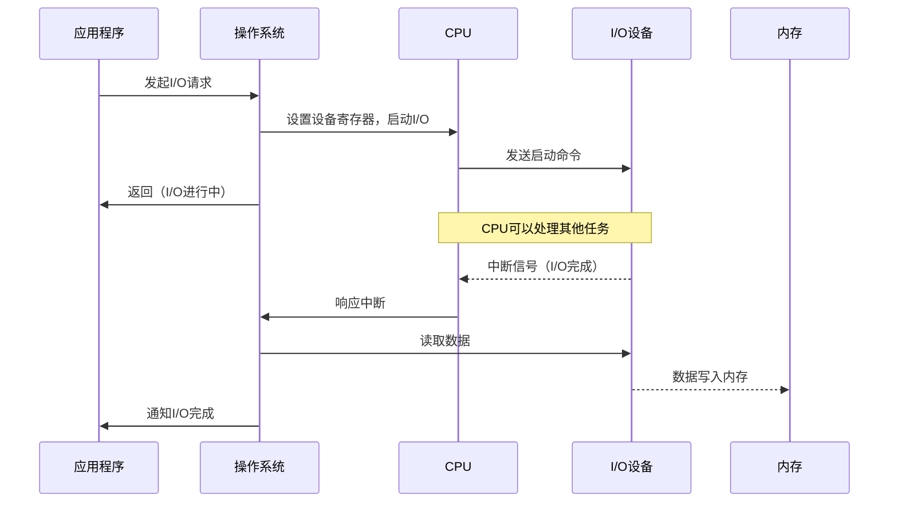

中断驱动方式显著提高了CPU利用率，但每传输一个字节或一个字就产生一次中断，中断处理的开销在大量数据传输时变得可观。

```c
// 中断驱动方式示例
#define KEYBOARD_IRQ 1

// 键盘中断处理程序
void keyboard_interrupt_handler(void) {
    char scancode;
    
    // 从I/O端口读取扫描码
    scancode = inb(KEYBOARD_DATA_PORT);
    
    // 将扫描码转换为ASCII码并放入缓冲区
    keyboard_buffer[keyboard_head] = scancode_to_ascii(scancode);
    keyboard_head = (keyboard_head + 1) % KEYBOARD_BUFFER_SIZE;
    
    // 发送中断结束信号
    outb(PIC_CMD_PORT, PIC_EOI);
}

// 应用程序读取（非阻塞）
ssize_t read_keyboard(char __user *buf, size_t count) {
    // 启动键盘中断（如果尚未启动）
    enable_keyboard_interrupt();
    
    // 睡眠等待，直到缓冲区有数据或超时
    wait_event_interruptible(keyboard_wait_queue, 
                             keyboard_head != keyboard_tail);
    
    // 从内核缓冲区复制到用户缓冲区
    return copy_to_user(buf, &keyboard_buffer[keyboard_tail], 1);
}
```

### 8.2.3 DMA 方式

直接内存访问（Direct Memory Access, DMA）方式在内存和设备之间建立直接传输通道，数据传输过程完全不需要CPU介入，由专门的DMA控制器协调完成。

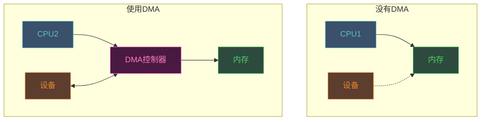

DMA方式特别适合大批量数据传送，如磁盘读写、网络数据传输。DMA控制器接管总线后，可以与CPU并行工作，显著提升系统整体吞吐量。

```c
// DMA方式示例：磁盘块读取
struct dma_descriptor {
    uint32_t src_addr;      // 源地址（外设）
    uint32_t dst_addr;      // 目标地址（内存）
    uint32_t transfer_count; // 传输字节数
    uint32_t control;        // 控制标志
};

int read_disk_block_dma(uint32_t block_num, void *buffer) {
    struct dma_descriptor desc;
    
    // 1. 分配DMA缓冲（对齐到4字节边界）
    void *dma_buffer = kmalloc(DISK_BLOCK_SIZE, GFP_KERNEL | GFP_DMA);
    if (!dma_buffer)
        return -ENOMEM;
    
    // 2. 设置DMA描述符
    desc.src_addr = DISK_DMA_PORT_BASE + (block_num * DISK_BLOCK_SIZE);
    desc.dst_addr = virt_to_phys(dma_buffer);
    desc.transfer_count = DISK_BLOCK_SIZE;
    desc.control = DMA_CTRL_START | DMA_CTRL_DIR_READ | DMA_CTRL_INTR;
    
    // 3. 将描述符写入DMA控制器
    dma_controller_set_descriptor(&desc);
    
    // 4. 启动DMA传输
    dma_controller_start();
    
    // 5. 睡眠等待传输完成（中断唤醒）
    wait_event_interruptible(dma_wait_queue, dma_transfer_done);
    
    // 6. 将数据从DMA缓冲复制到用户缓冲
    memcpy(buffer, dma_buffer, DISK_BLOCK_SIZE);
    kfree(dma_buffer);
    
    return DISK_BLOCK_SIZE;
}
```

### 8.2.4 通道方式

通道（Channel）是一种专门设计的I/O处理器，它可以执行有限的I/O指令集，独立完成数据传送、格式转换等操作。通道方式是大中型计算机系统采用的高级I/O控制方式。

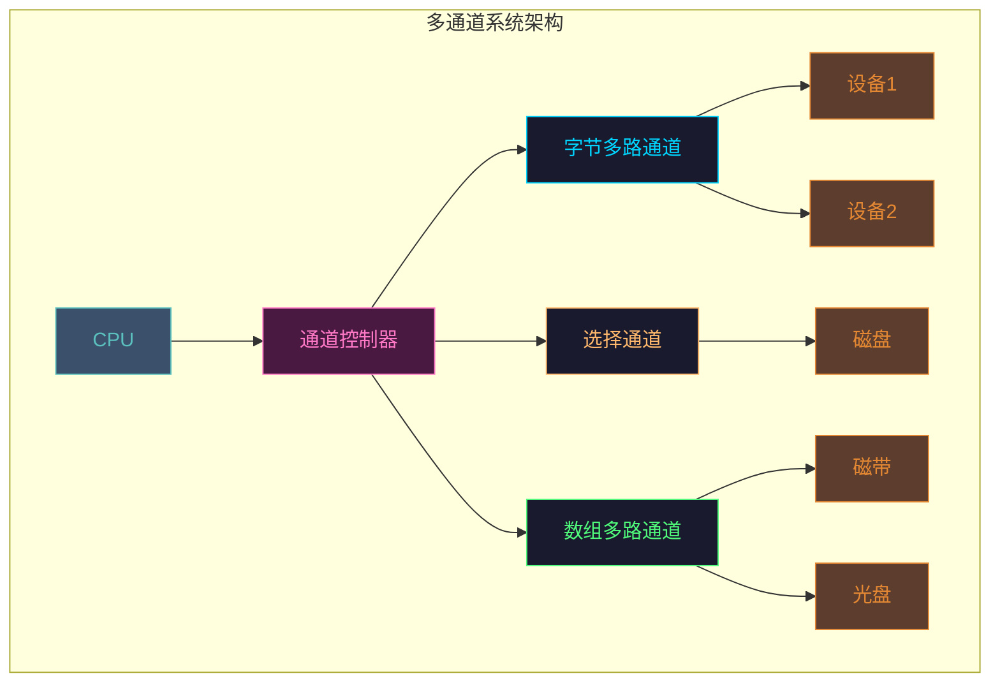

**通道类型对比：**

| 通道类型 | 特点 | 适用场景 |
|---------|------|---------|
| 字节多路通道 | 轮流为多个低速设备服务 | 键盘、打印机等低速设备 |
| 选择通道 | 独占通道，为高速设备服务 | 磁盘、磁带等高速设备 |
| 数组多路通道 | 以数据块为单位交叉服务 | 需要高吞吐量的设备 |

### 8.2.5 I/O控制方式对比

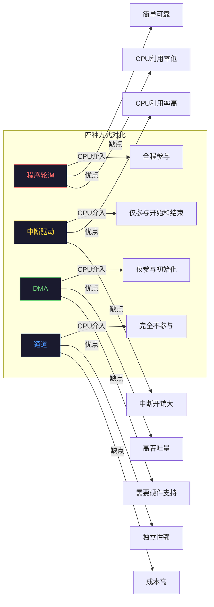

---

## 8.3 缓冲技术

缓冲技术是解决CPU与外设速度不匹配问题的重要手段。通过在内存中设立缓冲区，可以平滑数据流，减少设备与CPU之间的相互等待。

### 8.3.1 单缓冲

单缓冲是最简单的缓冲形式，在内存中设置一个缓冲区。输入时，数据先从设备读入缓冲区，CPU再从缓冲区取出处理；输出时，CPU先将数据写入缓冲区，再由设备取走输出。

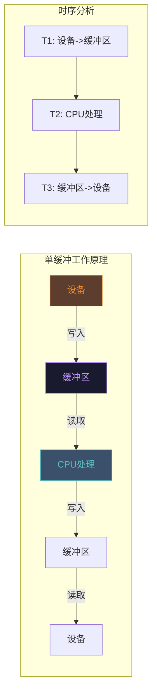

单缓冲的优点是实现简单；缺点是设备与CPU不能同时工作，缓冲区空时CPU等待，缓冲区满时设备等待。

```c
// 单缓冲实现：终端输入处理
typedef struct {
    char data[BUFFER_SIZE];
    int count;      // 缓冲区有效数据长度
    int inited;     // 缓冲区是否已初始化
} single_buffer_t;

int read_with_single_buffer(int fd, char *user_buf, int len) {
    static single_buffer_t kernel_buf = {0};
    
    // 如果内核缓冲区为空，从设备读取
    if (kernel_buf.count == 0) {
        kernel_buf.count = read_device(fd, kernel_buf.data, BUFFER_SIZE);
        kernel_buf.inited = 1;
    }
    
    // 复制数据到用户空间
    int copy_len = (kernel_buf.count < len) ? kernel_buf.count : len;
    memcpy(user_buf, kernel_buf.data, copy_len);
    
    // 移动剩余数据到缓冲区前部
    memmove(kernel_buf.data, kernel_buf.data + copy_len, 
            kernel_buf.count - copy_len);
    kernel_buf.count -= copy_len;
    
    return copy_len;
}
```

### 8.3.2 双缓冲

双缓冲（双缓冲技术）设置两个缓冲区，当一个缓冲区被设备填充时，CPU可以处理另一个缓冲区的数据，两者可以并行工作。

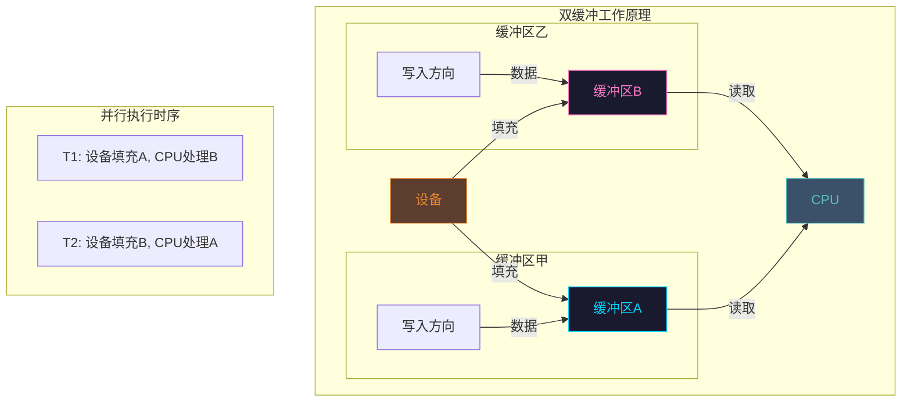

双缓冲允许设备与CPU并行工作，如果设备传输速率不超过CPU处理速率，系统可以流畅运行。适用于数据流量适中的场景。

```c
// 双缓冲实现
typedef struct {
    char buffer[2][BUFFER_SIZE];
    int count[2];           // 每个缓冲区的有效数据量
    int current_write;      // 当前写入缓冲区索引
    int current_read;       // 当前读取缓冲区索引
    spinlock_t lock;
} double_buffer_t;

int read_with_double_buffer(double_buffer_t *db, char *user_buf, int len) {
    unsigned long flags;
    
    spin_lock_irqsave(&db->lock, flags);
    
    int write_idx = db->current_write;
    int read_idx = db->current_read;
    spin_unlock_irqrestore(&db->lock, flags);
    
    // 如果当前读取缓冲区为空，等待数据
    if (db->count[read_idx] == 0) {
        // 切换到另一个缓冲区继续读取
        read_idx = (read_idx + 1) % 2;
        if (db->count[read_idx] == 0) {
            return 0; // 两个缓冲区都空
        }
    }
    
    // 复制数据到用户空间
    int copy_len = (db->count[read_idx] < len) ? db->count[read_idx] : len;
    memcpy(user_buf, db->buffer[read_idx], copy_len);
    db->count[read_idx] -= copy_len;
    
    // 如果读缓冲区已空，切换读写角色
    if (db->count[read_idx] == 0) {
        spin_lock_irqsave(&db->lock, flags);
        if (db->current_read == read_idx) {
            db->current_read = (read_idx + 1) % 2;
        }
        spin_unlock_irqrestore(&db->lock, flags);
    }
    
    return copy_len;
}
```

### 8.3.3 循环缓冲

当数据流量大且速度变化剧烈时，双缓冲可能不够。循环缓冲（环形缓冲）使用多个缓冲区组成环形结构，生产者和消费者可以分别独立地添加和取出数据。

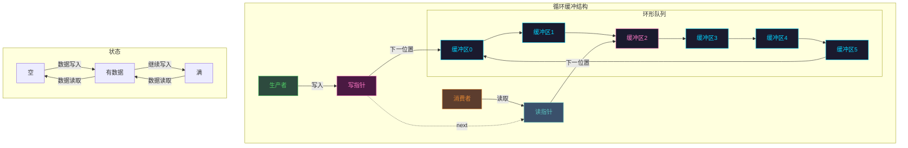

```c
// 循环缓冲（环形队列）实现
typedef struct circular_buffer {
    void *buffer[CIRCULAR_BUFFER_SIZE];  // 缓冲区数组
    int capacity;                         // 缓冲区容量
    int count;                            // 当前数据个数
    int head;                             // 读指针（头部）
    int tail;                             // 写指针（尾部）
    wait_queue_head_t wq;                // 等待队列
} circular_buffer_t;

int circular_buffer_init(circular_buffer_t *cb, int capacity) {
    cb->capacity = capacity;
    cb->count = 0;
    cb->head = 0;
    cb->tail = 0;
    init_waitqueue_head(&cb->wq);
    return 0;
}

// 生产者调用：放入数据
int circular_buffer_push(circular_buffer_t *cb, void *data) {
    while (cb->count == cb->capacity) {
        // 缓冲区满，等待消费者取走数据
        wait_event_interruptible(cb->wq, cb->count < cb->capacity);
    }
    
    cb->buffer[cb->tail] = data;
    cb->tail = (cb->tail + 1) % cb->capacity;
    cb->count++;
    
    // 唤醒等待的消费者
    wake_up_interruptible(&cb->wq);
    
    return 0;
}

// 消费者调用：取出数据
void *circular_buffer_pop(circular_buffer_t *cb) {
    while (cb->count == 0) {
        // 缓冲区空，等待生产者放入数据
        wait_event_interruptible(cb->wq, cb->count > 0);
    }
    
    void *data = cb->buffer[cb->head];
    cb->head = (cb->head + 1) % cb->capacity;
    cb->count--;
    
    // 唤醒等待的生产者
    wake_up_interruptible(&cb->wq);
    
    return data;
}
```

### 8.3.4 缓冲池

缓冲池是一组缓冲区组成的公共缓冲区集合，可以动态地为输入和输出服务。缓冲池管理着多个缓冲区，根据当前工作负载自动分配给输入或输出请求。

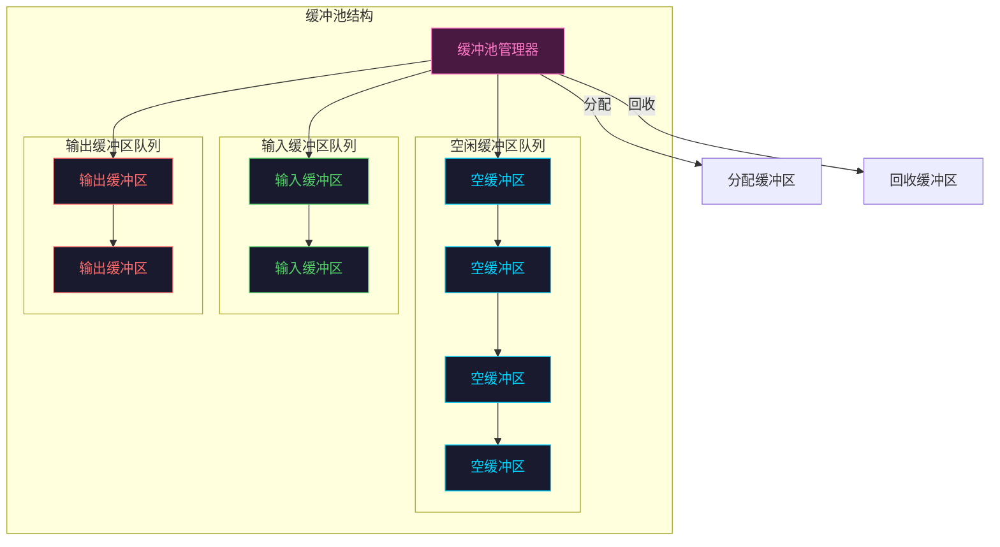

```c
// 缓冲池实现
#define POOL_SIZE 64
#define BUFFER_SIZE 4096

typedef enum {
    BUFFER_TYPE_EMPTY,     // 空闲缓冲区
    BUFFER_TYPE_INPUT,     // 输入缓冲区（等待进程读取）
    BUFFER_TYPE_OUTPUT,    // 输出缓冲区（等待设备输出）
    BUFFER_TYPE_BOTH       // 正在被使用
} buffer_type_t;

typedef struct buffer_node {
    char data[BUFFER_SIZE];
    int size;               // 有效数据大小
    buffer_type_t type;     // 缓冲区类型
    struct buffer_node *next;
} buffer_node_t;

typedef struct {
    buffer_node_t buffers[POOL_SIZE];
    buffer_node_t *empty_list;    // 空闲缓冲区链表
    buffer_node_t *input_list;    // 输入缓冲区链表
    buffer_node_t *output_list;   // 输出缓冲区链表
    spinlock_t lock;
} buffer_pool_t;

// 缓冲池初始化
int buffer_pool_init(buffer_pool_t *pool) {
    int i;
    spin_lock_init(&pool->lock);
    
    pool->empty_list = NULL;
    pool->input_list = NULL;
    pool->output_list = NULL;
    
    // 将所有缓冲区加入空闲链表
    for (i = 0; i < POOL_SIZE; i++) {
        pool->buffers[i].next = pool->empty_list;
        pool->empty_list = &pool->buffers[i];
    }
    
    return 0;
}

// 获取空闲缓冲区
buffer_node_t *get_empty_buffer(buffer_pool_t *pool) {
    buffer_node_t *buf;
    unsigned long flags;
    
    spin_lock_irqsave(&pool->lock, flags);
    
    if (pool->empty_list == NULL) {
        // 没有空闲缓冲区，尝试从输出队列回收
        if (pool->output_list != NULL) {
            buf = pool->output_list;
            pool->output_list = buf->next;
        } else {
            spin_unlock_irqrestore(&pool->lock, flags);
            return NULL;  // 真的没有缓冲区了
        }
    } else {
        buf = pool->empty_list;
        pool->empty_list = buf->next;
    }
    
    spin_unlock_irqrestore(&pool->lock, flags);
    
    buf->type = BUFFER_TYPE_BOTH;
    buf->size = 0;
    return buf;
}

// 归还缓冲区到指定队列
void release_buffer(buffer_pool_t *pool, buffer_node_t *buf, 
                    buffer_type_t target_type) {
    unsigned long flags;
    
    spin_lock_irqsave(&pool->lock, flags);
    
    buf->type = target_type;
    buf->next = NULL;
    
    if (target_type == BUFFER_TYPE_INPUT) {
        buf->next = pool->input_list;
        pool->input_list = buf;
    } else if (target_type == BUFFER_TYPE_OUTPUT) {
        buf->next = pool->output_list;
        pool->output_list = buf;
    } else {
        buf->next = pool->empty_list;
        pool->empty_list = buf;
    }
    
    spin_unlock_irqrestore(&pool->lock, flags);
}
```

### 8.3.5 缓冲技术对比

| 缓冲类型 | 缓冲区数量 | 并行度 | 适用场景 |
|---------|-----------|--------|---------|
| 单缓冲 | 1 | 设备与CPU完全串行 | 低速设备、小数据量 |
| 双缓冲 | 2 | 设备与CPU可并行 | 中等数据流 |
| 循环缓冲 | N≥3 | 生产者消费者可并行 | 大数据流、实时系统 |
| 缓冲池 | 动态 | 多设备多进程共享 | 通用操作系统 |

---

## 8.4 设备分配

设备分配是操作系统根据进程请求决定将哪个设备分配给该进程的过程。设备分配需要考虑设备固有特性、系统资源状况、以及分配策略。

### 8.4.1 设备分配数据结构

设备分配涉及多个数据结构的协作管理：

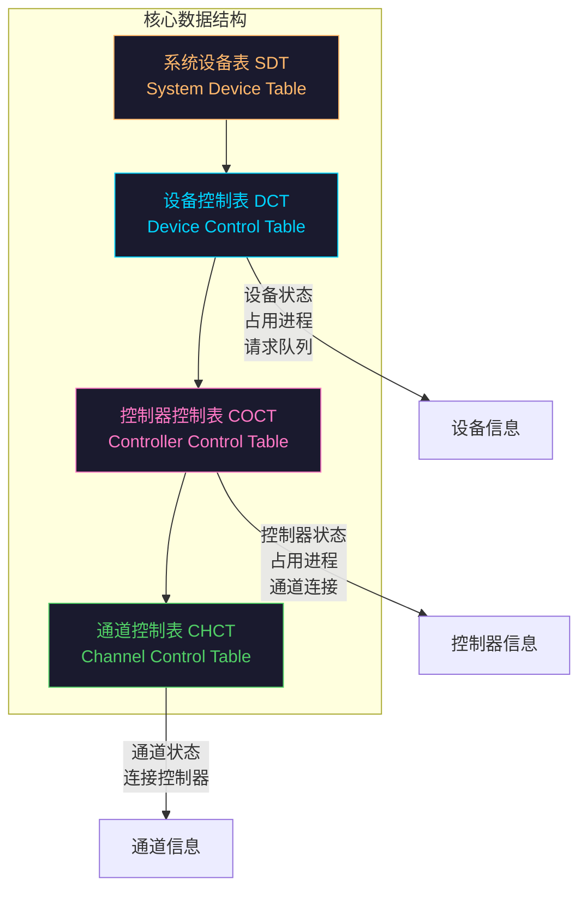

```c
// 设备控制表（DCT）
typedef struct device_control_table {
    char device_name[32];           // 设备名称
    device_type_t type;             // 设备类型
    int status;                     // 设备状态（忙/闲/故障）
    pid_t occupying_process;        // 占用进程PID
    struct request_queue *queue;    // 设备请求队列
    
    // 设备操作函数指针
    int (*device_open)(struct device_control_table *dev);
    int (*device_close)(struct device_control_table *dev);
    int (*device_read)(struct device_control_table *dev, void *buf, int len);
    int (*device_write)(struct device_control_table *dev, void *buf, int len);
    
    // 指向控制器控制表的指针
    struct controller_control_table *controller;
} dct_t;

// 控制器控制表（COCT）
typedef struct controller_control_table {
    int controller_id;               // 控制器ID
    int status;                     // 控制器状态
    pid_t occupying_process;        // 占用进程
    
    // 通道信息
    struct channel_control_table *channel;
    
    // 连接的设备列表
    dct_t *devices[MAX_DEVICES_PER_CONTROLLER];
    int device_count;
} coct_t;

// 通道控制表（CHCT）
typedef struct channel_control_table {
    int channel_id;                 // 通道ID
    int status;                     // 通道状态
    
    // 连接的控制器列表
    coct_t *controllers[MAX_CONTROLLERS_PER_CHANNEL];
    int controller_count;
} chct_t;

// 系统设备表（SDT）
typedef struct system_device_table {
    dct_t *devices[MAX_SYSTEM_DEVICES];
    int device_count;
    struct filesystem_mount_point *mount_points;
} sdt_t;
```

### 8.4.2 独占设备分配

独占设备在一段时间内只能被一个进程独占使用。典型的独占设备如打印机，在打印过程中不能被其他进程打断。独占设备采用"静态分配"策略，进程申请后即独占用直到释放。

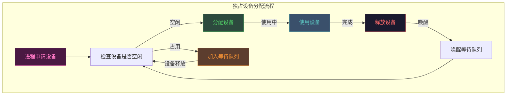

```c
// 独占设备分配示例
typedef struct exclusive_device_request {
    pid_t process_id;
    int device_id;
    void *data;                    // 要输出的数据
    int data_len;                  // 数据长度
    struct exclusive_device_request *next;
} exclusive_request_t;

int request_exclusive_device(int device_id, pid_t process_id) {
    dct_t *device = get_device_by_id(device_id);
    if (!device)
        return -ENODEV;
    
    // 设备忙，加入等待队列
    if (device->status == DEVICE_BUSY) {
        exclusive_request_t *req = kmalloc(sizeof(exclusive_request_t), 
                                          GFP_KERNEL);
        if (!req)
            return -ENOMEM;
        
        req->process_id = process_id;
        req->device_id = device_id;
        req->next = NULL;
        
        // 加入等待队列尾部
        exclusive_request_t *tail = device->wait_queue_tail;
        if (tail)
            tail->next = req;
        else
            device->wait_queue = req;
        device->wait_queue_tail = req;
        
        return -EAGAIN;  // 通知调用者需要等待
    }
    
    // 设备空闲，分配给进程
    device->status = DEVICE_BUSY;
    device->occupying_process = process_id;
    
    return 0;  // 分配成功
}

int release_exclusive_device(int device_id) {
    dct_t *device = get_device_by_id(device_id);
    if (!device)
        return -ENODEV;
    
    // 释放设备
    device->status = DEVICE_IDLE;
    device->occupying_process = 0;
    
    // 唤醒等待队列中的下一个进程
    if (device->wait_queue) {
        exclusive_request_t *next = device->wait_queue;
        device->wait_queue = next->next;
        
        device->status = DEVICE_BUSY;
        device->occupying_process = next->process_id;
        
        kfree(next);
    }
    
    return 0;
}
```

### 8.4.3 共享设备分配

共享设备可以同时被多个进程访问，典型代表是磁盘。多个进程可以同时发起磁盘读写请求，操作系统通过调度算法协调这些请求。

```c
// 共享设备分配示例：磁盘请求调度
typedef struct shared_device_request {
    pid_t process_id;
    int block_num;                 // 请求的磁盘块号
    int sector;                    // 起始扇区
    int count;                     // 扇区数量
    enum {
        REQUEST_READ,
        REQUEST_WRITE
    } type;
    struct shared_device_request *next;
} shared_request_t;

// 电梯算法调度
int add_disk_request(disk_t *disk, shared_request_t *request) {
    shared_request_t *curr, *prev;
    
    // 按磁头位置排序（电梯算法）
    prev = NULL;
    curr = disk->request_queue;
    
    while (curr && curr->sector < request->sector) {
        prev = curr;
        curr = curr->next;
    }
    
    // 插入请求
    request->next = curr;
    if (prev)
        prev->next = request;
    else
        disk->request_queue = request;
    
    return 0;
}
```

### 8.4.4 虚拟设备

虚拟设备技术通过SPOOLing（Simultaneous Peripheral Operations On-line）将独占设备转换为共享设备。其核心思想是用磁盘空间作为缓冲，将独占设备的串行访问改为并行访问。

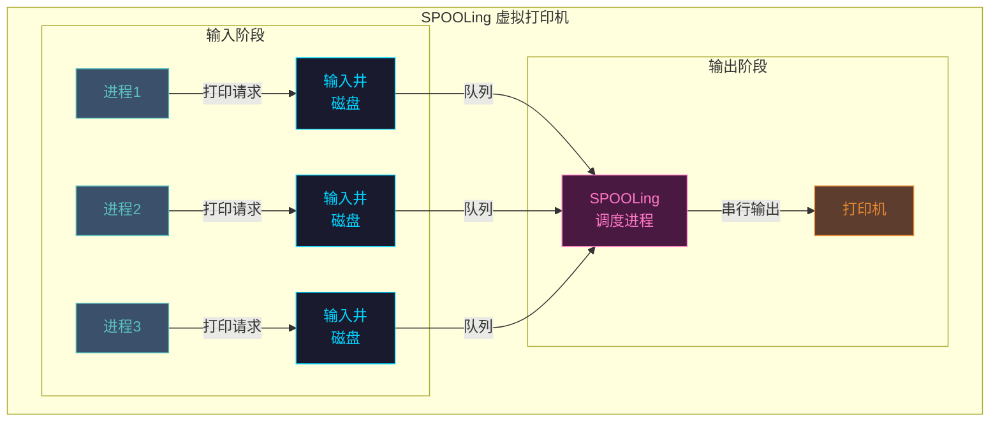

```c
// SPOOLing 虚拟设备实现
typedef struct spool_buffer {
    char filename[64];             // 临时文件名
    int file_descriptor;           // 文件描述符
    pid_t owner_process;           // 拥有者进程
    struct spool_buffer *next;
    enum {
        SPOOL_PENDING,              // 等待打印
        SPOOL_PRINTING,             // 正在打印
        SPOOL_COMPLETED             // 打印完成
    } status;
} spool_buffer_t;

spool_buffer_t *spool_queue = NULL;
spinlock_t spool_lock;

// 进程请求打印
int spool_request(pid_t process_id, const char *data, int len) {
    spool_buffer_t *spool;
    char filename[64];
    int fd;
    
    // 创建临时文件存储打印数据
    snprintf(filename, sizeof(filename), "/var/spool/printer/%d.tmp", 
             process_id);
    
    fd = open(filename, O_CREAT | O_WRONLY, 0666);
    if (fd < 0)
        return -EIO;
    
    write(fd, data, len);
    close(fd);
    
    // 创建SPOOL节点
    spool = kmalloc(sizeof(spool_buffer_t), GFP_KERNEL);
    strcpy(spool->filename, filename);
    spool->owner_process = process_id;
    spool->status = SPOOL_PENDING;
    
    // 加入打印队列
    spin_lock(&spool_lock);
    spool->next = spool_queue;
    spool_queue = spool;
    spin_unlock(&spool_lock);
    
    // 唤醒SPOOLing守护进程
    wake_up_interruptible(&spooler_daemon_wait);
    
    return 0;
}

// SPOOLing守护进程执行打印
int spooler_daemon(void) {
    spool_buffer_t *spool;
    
    while (1) {
        // 等待打印请求
        wait_event_interruptible(spooler_daemon_wait, spool_queue != NULL);
        
        spin_lock(&spool_lock);
        spool = spool_queue;
        if (spool)
            spool_queue = spool->next;
        spin_unlock(&spool_lock);
        
        if (!spool)
            continue;
        
        // 执行实际打印
        spool->status = SPOOL_PRINTING;
        print_file(spool->filename);
        spool->status = SPOOL_COMPLETED;
        
        // 删除临时文件
        unlink(spool->filename);
        kfree(spool);
    }
    
    return 0;
}
```

---

## 8.5 磁盘调度

磁盘是计算机系统中最主要的存储设备，磁盘调度的核心问题是尽可能减少磁盘臂的机械移动时间，提高磁盘I/O效率。

### 8.5.1 磁盘结构

磁盘由多个盘片组成，每个盘片有两个盘面，盘面上分布着同心圆磁道，磁道被划分为扇区。多个盘片相同半径的磁道构成柱面。

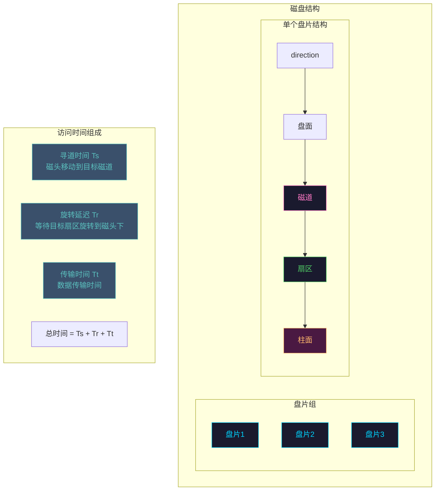

**磁盘访问时间计算：**

- **寻道时间（Ts）**：磁头从当前位置移动到目标磁道的时间，通常为3-10毫秒
- **旋转延迟（Tr）**：等待目标扇区旋转到磁头下方的时间，平均为半圈旋转时间
- **传输时间（Tt）**：实际数据传输的时间

### 8.5.2 FCFS 调度

先来先服务（First Come First Serve, FCFS）是最简单的调度算法，按照请求到达的顺序服务。

```c
// FCFS 调度算法实现
#include <stdio.h>
#include <stdlib.h>
#include <math.h>

typedef struct {
    int request_id;     // 请求ID
    int track;          // 请求的磁道号
    int arrival_time;   // 到达时间
} disk_request_t;

typedef struct {
    int start_track;       // 磁头起始位置
    disk_request_t *requests;
    int request_count;
} fcfs_scheduler_t;

double fcfs_total_seek_time(fcfs_scheduler_t *sched) {
    int i;
    int current_track = sched->start_track;
    double total_seek = 0;
    
    printf("FCFS 调度序列:\n");
    printf("起始位置: %d\n", current_track);
    
    for (i = 0; i < sched->request_count; i++) {
        int target = sched->requests[i].track;
        int seek = abs(target - current_track);
        
        printf("请求%d: 磁道%d -> 磁道%d, 寻道距离: %d\n",
               sched->requests[i].request_id,
               current_track, target, seek);
        
        total_seek += seek;
        current_track = target;
    }
    
    printf("总寻道距离: %.0f\n", total_seek);
    printf("平均寻道距离: %.2f\n", total_seek / sched->request_count);
    
    return total_seek;
}

// 示例使用
int main(void) {
    // 假设磁头起始位置在100号磁道
    fcfs_scheduler_t sched = {
        .start_track = 100,
        .request_count = 8
    };
    
    disk_request_t requests[] = {
        {1, 55, 0}, {2, 39, 1}, {3, 12, 2}, {4, 121, 3},
        {5, 68, 4}, {6, 95, 5}, {7, 110, 6}, {8, 42, 7}
    };
    sched.requests = requests;
    
    double total_seek = fcfs_total_seek_time(&sched);
    
    return 0;
}
```

**FCFS优缺点分析：**

| 优点 | 缺点 |
|-----|------|
| 算法简单，易于实现 | 平均寻道距离大 |
| 公平性好，请求不会被饿死 | 不考虑磁头当前位置和请求的物理位置 |
| 无饥饿问题 | 对磁头移动没有优化 |

### 8.5.3 SSTF 调度

最短寻道时间优先（Shortest Seek Time First, SSTF）优先处理与当前磁头位置距离最近的请求。

```c
// SSTF 调度算法实现
#include <stdio.h>
#include <stdlib.h>
#include <math.h>

typedef struct {
    int track;
    int served;     // 是否已被服务
} sstf_request_t;

double sstf_serve(sstf_request_t *requests, int count, int start_track) {
    int i, j;
    int current_track = start_track;
    double total_seek = 0;
    int served_count = 0;
    
    printf("SSTF 调度序列:\n");
    printf("起始位置: %d\n", current_track);
    
    while (served_count < count) {
        int shortest = -1;
        int shortest_seek = __INT_MAX__;
        
        // 找到最近的未服务请求
        for (i = 0; i < count; i++) {
            if (!requests[i].served) {
                int seek = abs(requests[i].track - current_track);
                if (seek < shortest_seek) {
                    shortest_seek = seek;
                    shortest = i;
                }
            }
        }
        
        if (shortest >= 0) {
            int target = requests[shortest].track;
            printf("服务请求: 原磁道%d -> 磁道%d, 寻道距离: %d\n",
                   current_track, target, shortest_seek);
            
            total_seek += shortest_seek;
            current_track = target;
            requests[shortest].served = 1;
            served_count++;
        }
    }
    
    printf("总寻道距离: %.0f\n", total_seek);
    printf("平均寻道距离: %.2f\n", total_seek / count);
    
    return total_seek;
}
```

**SSTF的问题：** 可能会产生饥饿现象。如果新请求持续在某个区域到达，远离初始位置的请求可能永远得不到服务。

### 8.5.4 SCAN 调度

SCAN算法又称电梯算法，磁头像电梯一样在磁盘上来回移动，当向一个方向移动时，处理所有在该方向上的请求，到达端点后反向移动。

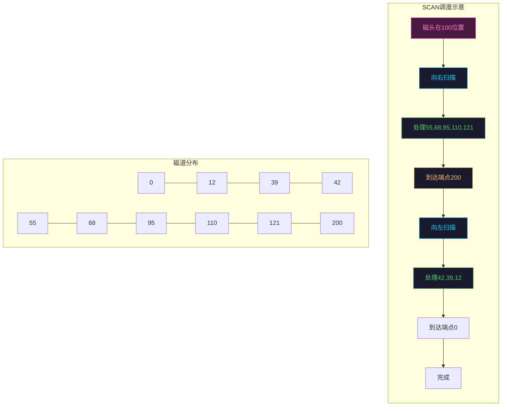

```c
// SCAN 调度算法实现
#include <stdio.h>
#include <stdlib.h>
#include <stdbool.h>

typedef struct {
    int track;
    bool served;
} scan_request_t;

double scan_serve(scan_request_t *requests, int count, 
                  int start_track, int max_track) {
    int current_track = start_track;
    int direction = 1;  // 1表示向磁道号增加方向，-1表示减少
    double total_seek = 0;
    int served_count = 0;
    bool changed = false;
    
    printf("SCAN 调度序列:\n");
    printf("起始位置: %d, 方向: %s\n", 
           current_track, direction > 0 ? "向内(→)" : "向外(←)");
    
    while (served_count < count) {
        int nearest = -1;
        int nearest_distance = __INT_MAX__;
        int nearest_direction = 0;
        
        // 找到同一方向上最近的请求
        for (int i = 0; i < count; i++) {
            if (!requests[i].served) {
                int distance = requests[i].track - current_track;
                
                // 只接受同方向的请求，或者如果没得选才换方向
                if (direction > 0 && distance >= 0 && distance < nearest_distance) {
                    nearest = i;
                    nearest_distance = distance;
                    nearest_direction = 1;
                } else if (direction < 0 && distance <= 0 && 
                           -distance < nearest_distance) {
                    nearest = i;
                    nearest_distance = -distance;
                    nearest_direction = -1;
                }
            }
        }
        
        if (nearest >= 0) {
            int target = requests[nearest].track;
            printf("移动到磁道%d, 寻道距离: %d\n", 
                   target, nearest_distance);
            
            total_seek += nearest_distance;
            current_track = target;
            requests[nearest].served = true;
            served_count++;
            changed = false;
        } else if (!changed) {
            // 切换方向
            direction = -direction;
            changed = true;
            printf("到达端点, 反方向移动: %s\n",
                   direction > 0 ? "向内(→)" : "向外(←)");
        } else {
            // 无法继续（不应该发生）
            break;
        }
    }
    
    printf("总寻道距离: %.0f\n", total_seek);
    printf("平均寻道距离: %.2f\n", total_seek / count);
    
    return total_seek;
}
```

### 8.5.5 C-SCAN 调度

循环SCAN（C-SCAN）算法是SCAN的变种，磁头只在一个方向上扫描，返回时快速返回到起始端，不处理返回途中的请求。


```c
// C-SCAN 调度算法实现
double cscan_serve(scan_request_t *requests, int count,
                   int start_track, int max_track) {
    int current_track = start_track;
    double total_seek = 0;
    int served_count = 0;
    
    printf("C-SCAN 调度序列:\n");
    printf("起始位置: %d, 方向: 向内(→)\n", current_track);
    
    // 第一遍：向内扫描
    for (int target = 0; target <= max_track && served_count < count; target++) {
        for (int i = 0; i < count; i++) {
            if (!requests[i].served && requests[i].track == target) {
                int seek = abs(target - current_track);
                printf("移动到磁道%d, 寻道距离: %d\n", target, seek);
                
                total_seek += seek;
                current_track = target;
                requests[i].served = true;
                served_count++;
            }
        }
    }
    
    // 快速返回到0
    printf("快速返回到磁道0, 寻道距离: %d\n", current_track);
    total_seek += current_track;
    current_track = 0;
    
    // 第二遍：再次向内扫描
    for (int target = 0; target <= max_track && served_count < count; target++) {
        for (int i = 0; i < count; i++) {
            if (!requests[i].served && requests[i].track == target) {
                int seek = abs(target - current_track);
                printf("移动到磁道%d, 寻道距离: %d\n", target, seek);
                
                total_seek += seek;
                current_track = target;
                requests[i].served = true;
                served_count++;
            }
        }
    }
    
    printf("总寻道距离: %.0f\n", total_seek);
    printf("平均寻道距离: %.2f\n", total_seek / count);
    
    return total_seek;
}
```

### 8.5.6 LOOK 调度

LOOK算法与SCAN类似，但不会移动到磁盘端点，而是在最后一个请求处就改变方向。

```c
// LOOK 调度算法实现
double look_serve(look_request_t *requests, int count,
                  int start_track) {
    int current_track = start_track;
    int direction = 1;  // 向内
    double total_seek = 0;
    int served_count = 0;
    bool changed = false;
    
    printf("LOOK 调度序列:\n");
    printf("起始位置: %d, 方向: %s\n",
           current_track, direction > 0 ? "向内(→)" : "向外(←)");
    
    while (served_count < count) {
        int nearest = -1;
        int nearest_distance = __INT_MAX__;
        
        // 找同方向最近的请求
        for (int i = 0; i < count; i++) {
            if (!requests[i].served) {
                int distance = requests[i].track - current_track;
                
                if (direction > 0 && distance >= 0 && distance < nearest_distance) {
                    nearest = i;
                    nearest_distance = distance;
                } else if (direction < 0 && distance <= 0 &&
                           -distance < nearest_distance) {
                    nearest = i;
                    nearest_distance = -distance;
                }
            }
        }
        
        if (nearest >= 0) {
            int target = requests[nearest].track;
            printf("移动到磁道%d, 寻道距离: %d\n",
                   target, nearest_distance);
            
            total_seek += nearest_distance;
            current_track = target;
            requests[nearest].served = true;
            served_count++;
            changed = false;
        } else if (!changed) {
            // 最后一个请求处改变方向
            direction = -direction;
            changed = true;
            printf("已服务最远的请求, 反方向移动: %s\n",
                   direction > 0 ? "向内(→)" : "向外(←)");
        } else {
            break;
        }
    }
    
    printf("总寻道距离: %.0f\n", total_seek);
    printf("平均寻道距离: %.2f\n", total_seek / count);
    
    return total_seek;
}
```

### 8.5.7 磁盘调度算法对比

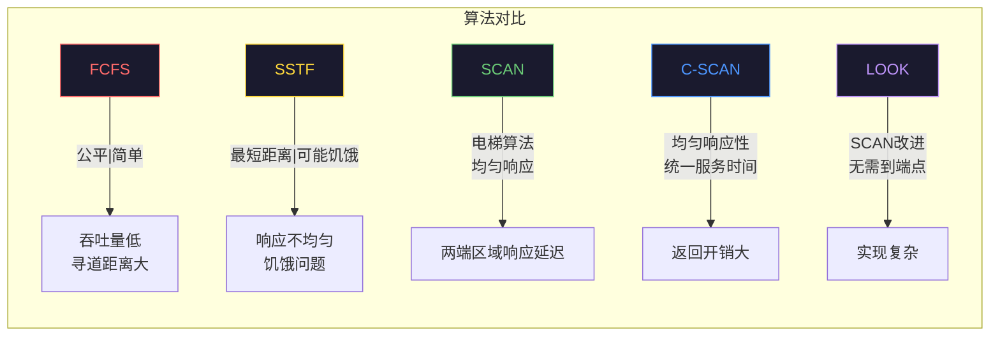

| 算法 | 平均寻道距离 | 公平性 | 饥饿 | 适用场景 |
|-----|------------|--------|------|---------|
| FCFS | 高 | 非常公平 | 无 | 负载低、请求少 |
| SSTF | 较低 | 不公平 | 可能 | 请求分布均匀 |
| SCAN | 较低 | 较公平 | 无 | 磁盘负载中等 |
| C-SCAN | 中等 | 非常公平 | 无 | 需要均匀响应时间 |
| LOOK | 较低 | 较公平 | 无 | 大多数通用场景 |

**实际应用中的选择：**
- **Linux系统**：默认使用CFQ（完全公平队列）调度器，结合了SCAN和LOOK的思想
- **数据库系统**：通常使用LOOK或SCAN以优化顺序访问
- **实时系统**：需要确定性延迟，常用SCAN的确定性变种

---

## 8.6 设备驱动程序

设备驱动程序是操作系统内核与硬件设备之间的桥梁，它封装了硬件的具体操作细节，向上提供统一的设备接口。

### 8.6.1 驱动程序的作用

设备驱动程序在操作系统中扮演着翻译官的角色：

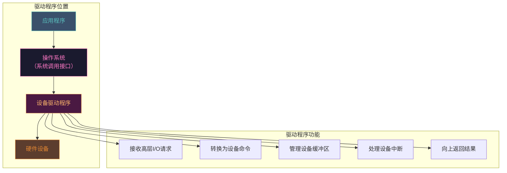

### 8.6.2 驱动程序的结构

典型的Linux设备驱动程序结构如下：

```c
// 字符设备驱动程序完整示例
#include <linux/module.h>
#include <linux/kernel.h>
#include <linux/fs.h>
#include <linux/cdev.h>
#include <linux/device.h>
#include <linux/uaccess.h>
#include <linux/wait.h>
#include <linux/interrupt.h>

#define DEVICE_NAME "my_device"
#define CLASS_NAME "my_class"
#define BUFFER_SIZE 1024

// 设备私有数据结构
typedef struct my_device_data {
    char buffer[BUFFER_SIZE];
    int buffer_len;
    struct cdev cdev;
    dev_t devno;
    wait_queue_head_t read_wait;
    bool data_available;
    spinlock_t lock;
} my_device_data_t;

static my_device_data_t *devices;
static int major_number;
static struct class *device_class;
static struct device *device_node;

// 设备打开函数
static int device_open(struct inode *inode, struct file *file) {
    my_device_data_t *dev;
    
    // 从inode获取设备数据结构
    dev = container_of(inode->i_cdev, my_device_data_t, cdev);
    file->private_data = dev;
    
    printk(KERN_INFO "%s: Device opened\n", DEVICE_NAME);
    return 0;
}

// 设备关闭函数
static int device_release(struct inode *inode, struct file *file) {
    printk(KERN_INFO "%s: Device closed\n", DEVICE_NAME);
    return 0;
}

// 设备读取函数
static ssize_t device_read(struct file *file, char __user *user_buf,
                           size_t len, loff_t *offset) {
    my_device_data_t *dev = file->private_data;
    int bytes_read;
    unsigned long flags;
    
    // 等待数据可用
    wait_event_interruptible(dev->read_wait, dev->data_available);
    
    spin_lock_irqsave(&dev->lock, flags);
    
    if (dev->buffer_len == 0) {
        spin_unlock_irqrestore(&dev->lock, flags);
        return 0;
    }
    
    bytes_read = (dev->buffer_len < len) ? dev->buffer_len : len;
    
    if (copy_to_user(user_buf, dev->buffer, bytes_read)) {
        spin_unlock_irqrestore(&dev->lock, flags);
        return -EFAULT;
    }
    
    dev->buffer_len = 0;
    dev->data_available = false;
    
    spin_unlock_irqrestore(&dev->lock, flags);
    
    printk(KERN_INFO "%s: Read %d bytes\n", DEVICE_NAME, bytes_read);
    
    return bytes_read;
}

// 设备写入函数
static ssize_t device_write(struct file *file, const char __user *user_buf,
                            size_t len, loff_t *offset) {
    my_device_data_t *dev = file->private_data;
    int bytes_write;
    unsigned long flags;
    
    if (len > BUFFER_SIZE)
        len = BUFFER_SIZE;
    
    spin_lock_irqsave(&dev->lock, flags);
    
    if (copy_from_user(dev->buffer, user_buf, len)) {
        spin_unlock_irqrestore(&dev->lock, flags);
        return -EFAULT;
    }
    
    dev->buffer_len = len;
    dev->data_available = true;
    
    spin_unlock_irqrestore(&dev->lock, flags);
    
    // 唤醒等待读取的进程
    wake_up_interruptible(&dev->read_wait);
    
    printk(KERN_INFO "%s: Wrote %d bytes\n", DEVICE_NAME, len);
    
    return len;
}

// 文件操作结构
static struct file_operations fops = {
    .owner          = THIS_MODULE,
    .open           = device_open,
    .release        = device_release,
    .read           = device_read,
    .write          = device_write,
};

// 中断处理函数
static irqreturn_t device_interrupt(int irq, void *dev_id) {
    my_device_data_t *dev = dev_id;
    unsigned long flags;
    
    // 读取设备状态寄存器
    unsigned char status = inb(dev->irq_port + STATUS_REG);
    
    if (status & DATA_READY) {
        spin_lock_irqsave(&dev->lock, flags);
        
        // 读取数据
        dev->buffer[0] = inb(dev->irq_port + DATA_REG);
        dev->buffer_len = 1;
        dev->data_available = true;
        
        spin_unlock_irqrestore(&dev->lock, flags);
        
        // 唤醒等待的进程
        wake_up_interruptible(&dev->read_wait);
    }
    
    return IRQ_HANDLED;
}

// 模块初始化函数
static int __init device_init(void) {
    int ret;
    
    // 1. 分配设备号
    ret = alloc_chrdev_region(&devno, 0, 1, DEVICE_NAME);
    if (ret < 0) {
        printk(KERN_WARNING "%s: Failed to allocate device number\n", 
               DEVICE_NAME);
        return ret;
    }
    major_number = MAJOR(devno);
    
    // 2. 分配设备数据结构
    devices = kmalloc(sizeof(my_device_data_t), GFP_KERNEL);
    if (!devices) {
        ret = -ENOMEM;
        goto failed_alloc;
    }
    memset(devices, 0, sizeof(my_device_data_t));
    
    // 3. 初始化cdev结构
    cdev_init(&devices->cdev, &fops);
    devices->cdev.owner = THIS_MODULE;
    
    // 4. 注册字符设备
    ret = cdev_add(&devices->cdev, devno, 1);
    if (ret < 0) {
        printk(KERN_WARNING "%s: Failed to add cdev\n", DEVICE_NAME);
        goto failed_cdev_add;
    }
    
    // 5. 创建设备类
    device_class = class_create(CLASS_NAME);
    if (IS_ERR(device_class)) {
        ret = PTR_ERR(device_class);
        goto failed_class_create;
    }
    
    // 6. 创建设备节点
    device_node = device_create(device_class, NULL, devno, NULL, DEVICE_NAME);
    if (IS_ERR(device_node)) {
        ret = PTR_ERR(device_node);
        goto failed_device_create;
    }
    
    // 7. 初始化等待队列和锁
    init_waitqueue_head(&devices->read_wait);
    spin_lock_init(&devices->lock);
    
    // 8. 注册中断处理
    ret = request_irq(IRQ_NUMBER, device_interrupt, IRQF_SHARED,
                      DEVICE_NAME, devices);
    if (ret < 0) {
        printk(KERN_WARNING "%s: Failed to request IRQ\n", DEVICE_NAME);
        goto failed_irq;
    }
    
    printk(KERN_INFO "%s: Driver loaded, major number %d\n",
           DEVICE_NAME, major_number);
    
    return 0;

failed_irq:
    device_destroy(device_class, devno);
failed_device_create:
    class_destroy(device_class);
failed_class_create:
    cdev_del(&devices->cdev);
failed_cdev_add:
    kfree(devices);
failed_alloc:
    unregister_chrdev_region(devno, 1);
    return ret;
}

// 模块退出函数
static void __exit device_exit(void) {
    free_irq(IRQ_NUMBER, devices);
    device_destroy(device_class, devno);
    class_destroy(device_class);
    cdev_del(&devices->cdev);
    kfree(devices);
    unregister_chrdev_region(devno, 1);
    
    printk(KERN_INFO "%s: Driver unloaded\n", DEVICE_NAME);
}

module_init(device_init);
module_exit(device_exit);

MODULE_LICENSE("GPL");
MODULE_AUTHOR("Example");
MODULE_DESCRIPTION("A simple character device driver");
```

---

## 8.7 本章小结

本章介绍了操作系统设备管理的核心概念和技术：

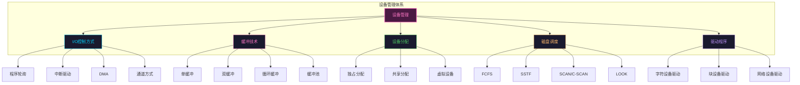

**核心要点：**

1. **I/O控制方式的选择**影响系统性能：DMA和通道方式减轻CPU负担，适合大量数据传输

2. **缓冲技术**解决CPU与外设速度不匹配问题，不同缓冲策略适用于不同负载场景

3. **设备分配策略**需要平衡设备利用率和响应公平性，虚拟设备技术将独占设备转换为共享设备

4. **磁盘调度**的核心是减少寻道时间，LOOK算法是实际应用中的良好选择

5. **设备驱动程序**是硬件与操作系统的接口，遵循统一的驱动架构简化系统设计

---

## 习题

1. 解释程序轮询方式与中断驱动方式的区别，为什么中断驱动方式的CPU利用率更高？

2. DMA方式中，CPU需要参与哪些工作？什么场景下DMA的优势最明显？

3. 在单缓冲、双缓冲、循环缓冲三种方式中，各有什么优缺点？适用于什么场景？

4. 假设磁头初始位置在100号磁道，有以下磁盘请求序列：55, 39, 12, 121, 68, 95, 110, 42。请计算FCFS、SSTF、SCAN三种调度算法的总寻道距离。

5. SSTF算法可能导致"饥饿"现象，什么是饥饿？哪种调度算法可以完全避免饥饿？

6. 为什么C-SCAN算法在返回时不处理请求？这有什么优缺点？

7. 解释SPOOLing技术如何将独占设备转换为共享设备。

8. 设备驱动程序在操作系统中扮演什么角色？它与应用程序和硬件的关系是什么？

---

*本章完*
