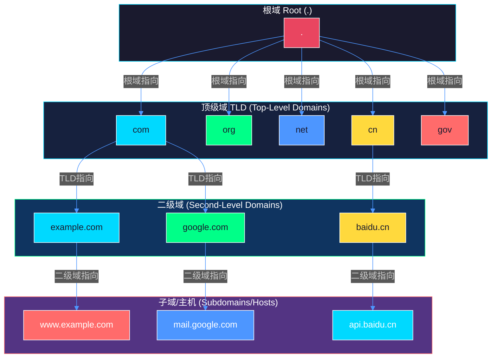
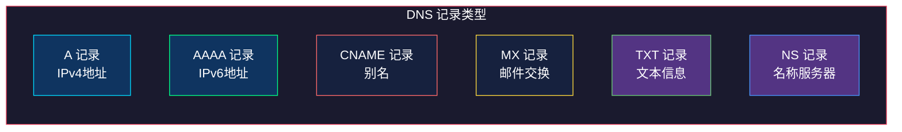
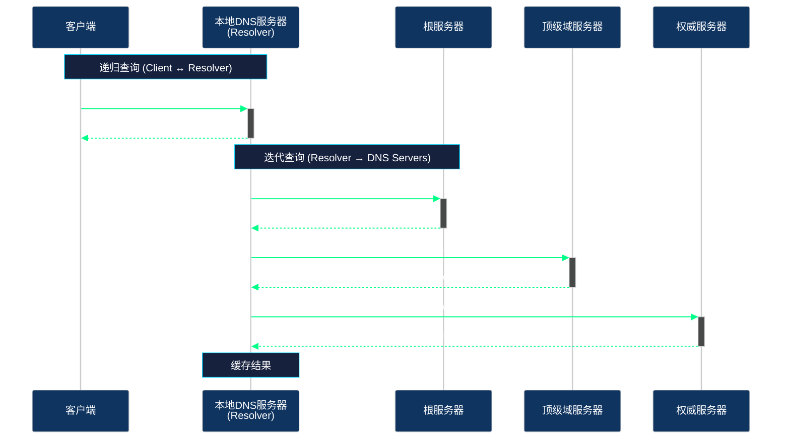
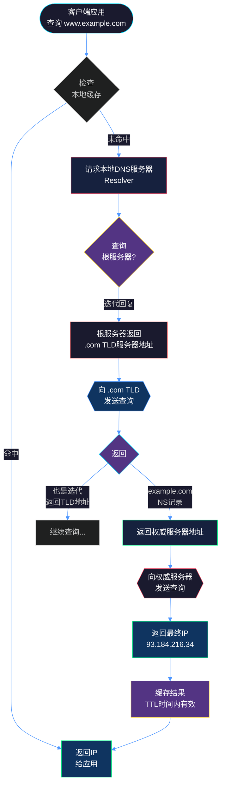
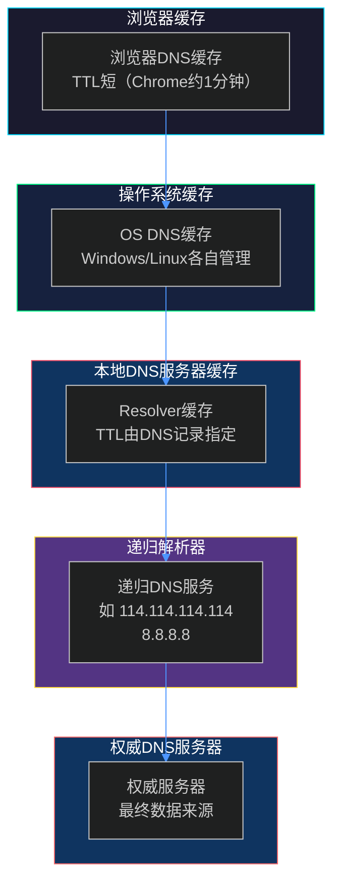
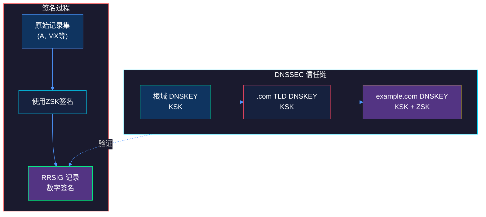

# DNS 协议详解

## 概述

DNS（Domain Name System，域名系统）是互联网的核心基础设施之一，负责将人类可读的域名（如 `www.example.com`）转换为机器可读的IP地址（如 `93.184.216.34`）。可以将DNS理解为互联网的"电话簿"。

**关键特性：**

- 端口号：53
- 传输协议：UDP（主要，查询响应小于512字节时）、TCP（zone传输、大响应）
- 分布式层次数据库
- 缓存机制提升性能

## 域名层次结构

DNS采用树形层次结构，从根节点开始向下延伸。



**层次说明：**

| 层级 | 示例 | 说明 |
|------|------|------|
| 根域 | `.` | 全球13组根服务器（a-m.root-servers.net） |
| 顶级域(TLD) | `.com` `.cn` `.org` | 由ICANN管理，分为gTLD和ccTLD |
| 二级域 | `example.com` | 可注册域名，个人或企业所有 |
| 子域 | `www.example.com` | 由域名所有者创建 |

## DNS 记录类型

DNS记录存储在Zone文件中，每条记录包含：域名、TTL、记录类型、记录值。

### 常用记录类型



| 类型 | 用途 | 示例 |
|------|------|------|
| **A** | 将域名指向IPv4地址 | `www.example.com. 3600 IN A 93.184.216.34` |
| **AAAA** | 将域名指向IPv6地址 | `www.example.com. 3600 IN AAAA 2606:2800:220:1::` |
| **CNAME** | 域名别名，指向另一个域名 | `www.example.com. CNAME example.com.` |
| **MX** | 邮件交换服务器，指定邮件路由 | `example.com. 3600 IN MX 10 mail.example.com.` |
| **TXT** | 文本记录，常用于验证和SPF | `example.com. 3600 IN TXT "v=spf1 include:_spf.example.com ~all"` |
| **NS** | 权威名称服务器 | `example.com. 86400 IN NS ns1.example.com.` |
| **SOA** | 起始授权记录，Zone核心信息 | 包含Serial、Refresh、Retry、Expire、Minimum |

## DNS 查询流程

### 递归查询 vs 迭代查询



### 完整递归查询流程图



## DNS 缓存机制

### 缓存层次



### 缓存刷新机制

```
SOA记录中的关键参数：
┌─────────────────────────────────────────────────────────┐
│  Serial  : 序列号，Zone文件版本，每次修改递增            │
│  Refresh : secondary请求更新间隔（通常 14400秒=4小时）   │
│  Retry   : 如果刷新失败，重试间隔（通常 3600秒=1小时）   │
│  Expire  : secondary停止响应时间（通常 604800秒=7天）    │
│  Minimum : 否定缓存TTL（查询失败的缓存时间）             │
└─────────────────────────────────────────────────────────┘
```

## 工程实践

### dig 命令详解

`dig`（Domain Information Groper）是DNS诊断的标准工具。

**基本用法：**

```bash
# 基础查询
dig www.example.com

# 指定DNS服务器查询
dig @8.8.8.8 www.example.com

# 查询特定记录类型
dig www.example.com AAAA
dig example.com MX
dig example.com TXT

# 简短输出
dig +short www.example.com

# 完整输出（显示响应时间、服务器等）
dig +noall +answer www.example.com
```

**输出示例解析：**

```bash
$ dig www.example.com

; <<>> DiG 9.18.1 <<>> www.example.com
;; global options: +cmd
;; Got answer:
;; ->>HEADER<<- opcode: QUERY, status: NOERROR, id: 12345
;; flags: qr rd ra; QUERY: 1, ANSWER: 1, AUTHORITY: 0, ADDITIONAL: 1

;; QUESTION SECTION:
;www.example.com.		IN	A

;; ANSWER SECTION:
www.example.com.	3600	IN	A	93.184.216.34

;; Query time: 23 msec
;; SERVER: 192.168.1.1#53(192.168.1.1)
;; WHEN: Fri May 23 10:30:00 CST 2026
;; MSG SIZE  rcvd: 56
```

**追踪完整查询路径：**

```bash
# +trace 选项会显示完整迭代查询过程
dig +trace www.example.com
```

### nslookup 命令

Windows/Linux通用的DNS查询工具。

```bash
# 交互模式
nslookup
> set type=A
> www.example.com
> exit

# 单行命令
nslookup -type=A www.example.com 8.8.8.8
nslookup -type=MX example.com
nslookup -type=TXT example.com
```

### host 命令

简洁的DNS查询工具。

```bash
host www.example.com
host -t AAAA www.example.com
host -t MX example.com
host -a example.com  # 显示所有记录
```

### 实际工程场景

**场景1：诊断CDN问题**

```bash
# 检查域名是否正确解析到CDN
dig +short cdn.example.com
host cdn.example.com

# 检查MX记录是否正确
dig +short example.com MX
nslookup mail.example.com
```

**场景2：验证DNS传播**

```bash
# 在不同DNS服务器上查询，对比结果
dig @a.gtld-servers.net example.com
dig @ns1.example.com example.com

# 检查SOA记录
dig example.com SOA
```

**场景3：排查DNS劫持**

```bash
# 使用可信DNS服务器验证
dig @8.8.8.8 @1.1.1.1 www.example.com

# 检查TXT记录（SPF、DKIM等）
dig example.com TXT
```

### DNS配置文件示例

**/etc/resolv.conf（Linux DNS配置）：**

```
nameserver 8.8.8.8          # Google DNS
nameserver 1.1.1.1          # Cloudflare DNS
nameserver 114.114.114.114  # 114 DNS
search local.domain         # 本地搜索域
options timeout:2           # 超时时间
```

**Windows DNS客户端配置：**

```
# PowerShell 查看DNS配置
Get-DnsClientServerAddress

# PowerShell 刷新DNS缓存
Clear-DnsClientCache

# 查看本地缓存
ipconfig /displaydns
```

## DNS 安全扩展（DNSSEC）

DNSSEC通过数字签名确保DNS响应 authenticity 和 integrity。



**验证DNSSEC：**

```bash
# dig 查看DNSKEY记录
dig example.com DNSKEY

# 验证签名
dig +dnssec example.com A

# 检查AD标志位（Authenticated Data）
dig example.com A +ad
```

## 常见问题排查

| 问题 | 排查命令 |
|------|----------|
| DNS解析超时 | `dig example.com +time=1` |
| 解析到错误IP | `dig @权威服务器 example.com` |
| 缓存未刷新 | `dig +no-cache example.com` |
| NXDOMAIN错误 | 检查域名是否过期/拼写错误 |
| DNS污染 | 使用不同DNS服务器对比结果 |

## 总结

DNS是互联网的基础服务，理解其工作原理对网络故障排查和系统设计至关重要：

1. **层次结构**：根域 → TLD → 二级域 → 子域
2. **记录类型**：A/AAAA/CNAME/MX/TXT/NS等各有用途
3. **查询模式**：递归查询简化客户端，迭代查询分散负载
4. **缓存机制**：多级缓存提升性能，但也带来一致性问题
5. **安全扩展**：DNSSEC提供数据完整性验证

掌握 `dig`、`nslookup`、`host` 等工具，能够快速定位和解决 DNS 相关问题。
